# 1. 引言

本章将介绍 Google Cloud Platform (GCP) 服务，以及如何使用它们来构建、部署和扩展应用程序。本章将指导您设置 GCP 环境，并简要概述最常见的 GCP 服务。学完本章后，您将能够理解 GCP 的基础知识，创建 GCP 项目，并了解可以使用哪些 GCP 服务来构建和部署应用程序。

您需要创建一个 Google 登录账号，或使用您现有的 Google 账号，以开始免费的 GCP 试用，从而跟随本书中的练习进行操作。

## 在 GCP 上开始免费试用

要在 GCP 上开始免费试用，您可以按照以下步骤操作：

1.  访问 GCP 网站 [`https://cloud.google.com/`](https://cloud.google.com/)，点击网页右上角的“免费开始使用”按钮。

2.  使用您的 Google 账号登录，如果没有 Google 账号，则创建一个新账号。

3.  填写您的个人信息和账单信息。您必须提供有效的信用卡以验证身份，但只有在升级到付费账户时才会被收费。

4.  查看免费试用的条款和条件，然后点击“同意并继续”按钮。

5.  创建账户后，您就可以免费使用 GCP 服务 90 天。在此期间，您将获得 300 美元的赠金，可用于任何 GCP 服务。请注意，某些服务可能不符合免费试用条件，因此在使用前请查看详细信息。

6.  探索 GCP 控制台并尝试一些服务。有许多资源可帮助您入门，包括文档、教程和社区论坛。

请记住在试用期内监控您的使用情况和账单，以避免意外收费。如果您决定升级到付费账户，可以随时通过向您的项目添加结算账户来升级。

试用开始后，您可以在 GCP 控制台顶部看到试用状态和剩余余额，如图 1-1 所示。

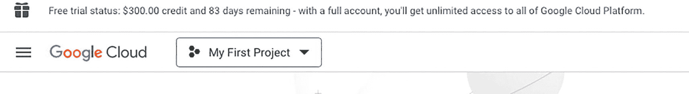

Google Cloud 窗口的屏幕截图，左侧有一个图标，图标右侧有一个下拉框，其中选择了“我的第一个项目”。下拉框上方有一行文本，详细说明了免费试用状态，包括赠金和剩余天数。

图 1-1

监控您的使用情况和账单

一旦您开始免费试用，GCP 项目“我的第一个项目”将自动创建。您可以根据需要创建更多项目。

GCP 中的项目用于组织资源。GCP 中的每个项目都有自己的资源集和账单，您可以根据项目跟踪账单。

在 GCP 中，一个*项目*就像一个盒子或文件夹，包含与特定应用程序、系统或工作负载相关的所有资源、服务和配置。项目充当资源的边界，以确保它们被隔离并且可以独立管理。

项目用于在 GCP 中组织资源、定义资源所有权和访问权限、管理账单和使用情况，并促进团队成员之间的协作。您可以将项目视为资源的逻辑分组，这使得管理、保护和监控它们更加容易。

图 1-2 展示了一个单一的 GCP 项目，其中包含：可以运行应用程序和软件的 Compute Engine（虚拟机）、可以存储文件和数据的 Cloud Storage、提供托管数据库的 Cloud SQL、可以在虚拟机之间分配流量的负载均衡器、两个可以控制对虚拟机访问的防火墙规则、一个可以将域名映射到 IP 地址的 DNS 服务器，账单服务允许您管理支出和成本，IAM 允许您通过添加或删除用户、组或角色来控制对资源和服务的访问。

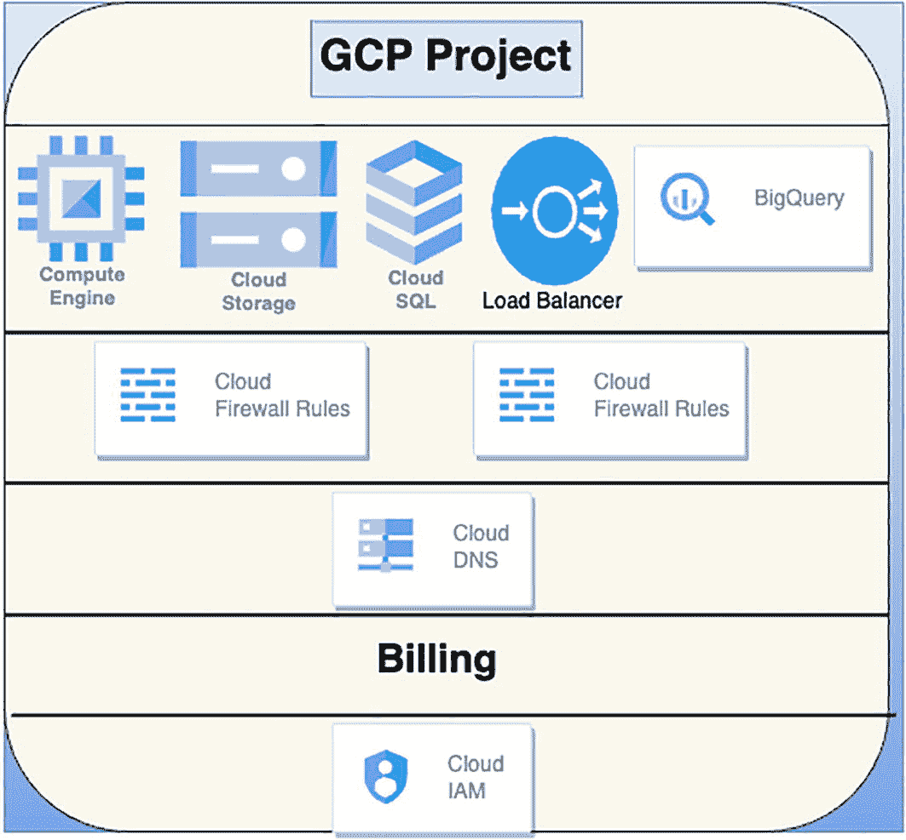

一个示意图表示一个 G C P 项目窗口。它有 5 行。第 1 行有 5 个组件，分别用于 Compute Engine、Cloud Storage、Cloud SQL、负载均衡器和 Big Query。第 2 行有 2 个模块，用于云防火墙规则。第 3 行有 Cloud DNS。第 4 行用于账单，第 5 行用于 Cloud IAM 模块。

图 1-2

一个 GCP 项目

不使用项目就无法使用 GCP。您必须至少创建一个项目才能访问 GCP 服务和资源。当您注册 GCP 账户时，会自动创建一个默认项目，用于账单和其他管理目的。您还可以为工作负载和应用程序创建其他项目。

GCP 中的项目可以通过多种方式相互关联。例如，你可以关联项目以启用共享资源，例如共享 VPC 网络或结算账户。你还可以关联项目以控制跨多个项目的资源访问，或向用户或服务账号授予权限。

以下是关于 GCP 项目需要了解的一些关键事项：

*   项目必须使用 GCP 服务和资源。

*   每个项目在所有 GCP 服务中都有一个全局唯一的 ID、名称和编号。

*   一个项目可以包含多个资源，例如计算实例、存储桶和数据库。

*   项目可以组织到文件夹和层级结构中，以管理资源所有权和访问权限。

*   结算和使用情况在项目级别进行管理。

*   项目可以相互关联，以启用共享资源和访问控制。

*   每个项目都有自己的身份和访问管理 (IAM) 策略，用于控制谁可以访问和管理项目的资源。

*   你可以为每个项目配置监控、日志记录和告警，以了解其运行状况和性能。

*   项目可用于不同目的，例如开发、测试、预发布或生产。

*   你可以使用 GCP 控制台、Cloud SDK 或 API 创建和管理项目。

*   当项目不再需要时可以删除，但在此之前需要移除所有关联的资源和数据。

在使用 GCP 项目时，跟踪其配置和使用情况，并遵循安全、可扩展性和成本优化的最佳实践非常重要。你还应考虑使用 Terraform、Cloud Deployment Manager 或 Kubernetes Engine 等工具，将基础设施作为代码进行管理，并确保跨多个项目和环境的一致性和可重复性。

### 创建新项目

要创建新项目，请点击 GCP 控制台左上角的现有项目（My First Project）。将出现一个如图 1-3 所示的窗口。

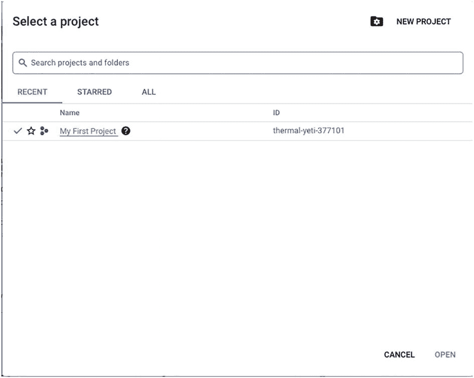

项目选择窗口的截图。页面左侧有标题“选择项目”。它有一个用于搜索项目和文件夹的搜索框。它有一个“最近”选项卡，显示一个包含“名称”和“ID”两列的表格，以及一行名称为“my first project”的数据。

图 1-3

选择项目

你可以点击右上角的“新建项目”按钮来创建新项目。将出现一个如图 1-4 所示的窗口。

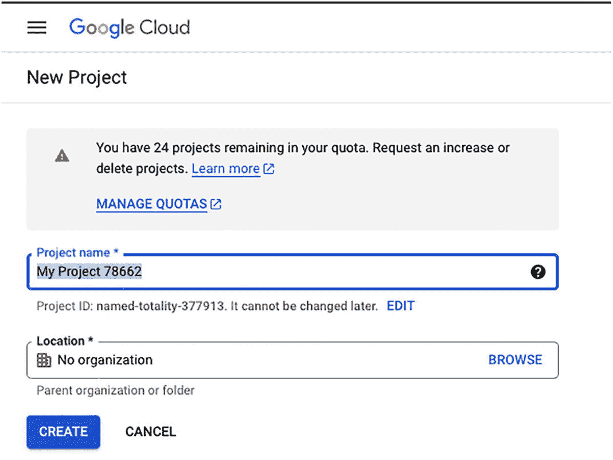

Google Cloud 创建新项目页面的截图。它有一个显示配额中剩余项目数量的警告文本，以及一个用于输入项目名称和位置的选项卡。页面左下角有一个“创建”按钮。

图 1-4

创建新的 GCP 项目

在这里你可以看到一条消息，提示你只剩下 24 个项目。默认情况下，GCP 允许你创建 25 个项目；如果你需要创建更多项目，可以请求增加配额。项目名称的长度必须在 4 到 30 个字符之间。

注意

GCP 中的*配额*是一个灵活的限制，但*限制*是你可以使用资源数量的硬性上限。

你可以根据需要为项目命名，以反映其用途。项目 ID 是你的项目的全局唯一标识符。项目创建后，你无法更改项目 ID。项目可以与你在位置中选择的组织相关联。如果你的项目名称是全局唯一的，则项目 ID 将与项目名称相同；否则，可以通过在项目名称前添加数字来自动创建项目 ID。你可以通过点击项目 ID 前面的部分来设置自定义的项目名称和项目 ID，如图 1-5 所示。

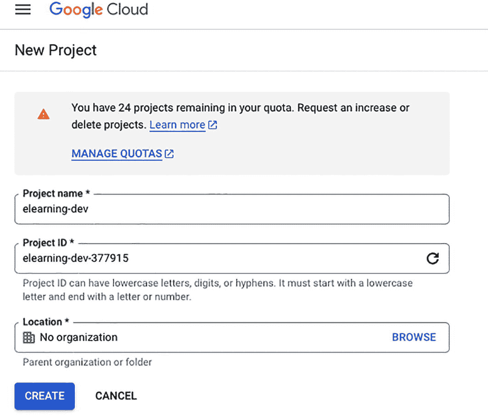

Google Cloud 创建新项目页面的截图。它有一个显示配额中剩余项目数量的警告文本，以及用于输入项目名称、项目 ID 和位置的选项卡。页面左下角有一个“创建”按钮。

图 1-5

GCP 项目的项目 ID

点击“创建”后，你将在活动列表中看到它。每当你在 GCP 中创建任何资源时，你都可以在活动列表中看到它，如图 1-6 所示。

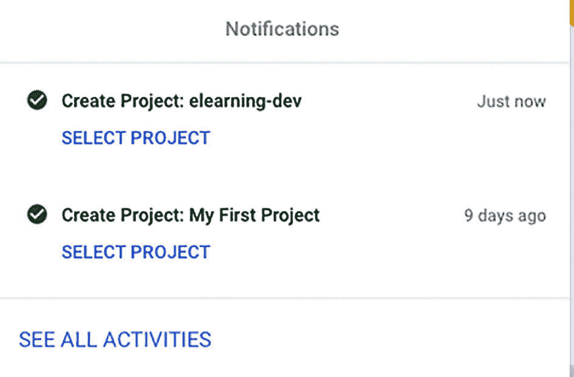

Google Cloud 通知页面的截图。它有 2 行关于项目创建的最近通知。第 1 行是“e-learning”的最近通知，第 2 行是 9 天前的“my first project”通知。页面左下角有一个“查看所有活动”的链接。

图 1-6

GCP 项目活动

例如，如果你将 GCP 用于 EdTech 应用程序，你可以为所有开发环境创建一个项目，并为所有生产环境创建另一个项目。你可以为分析和营销设立一个单独的项目。通过这样做，你可以轻松查看 EdTech 应用程序的非生产、生产和分析环境的费用。

新项目创建完成后，你可以通过点击 GCP 控制台左上角的项目按钮来选择你正在处理的项目，如图 1-7 所示。如果你在窗口的“最近”选项卡中没有看到你的项目，可以点击“全部”选项卡查看所有项目。要查看项目，你需要拥有相应的权限。

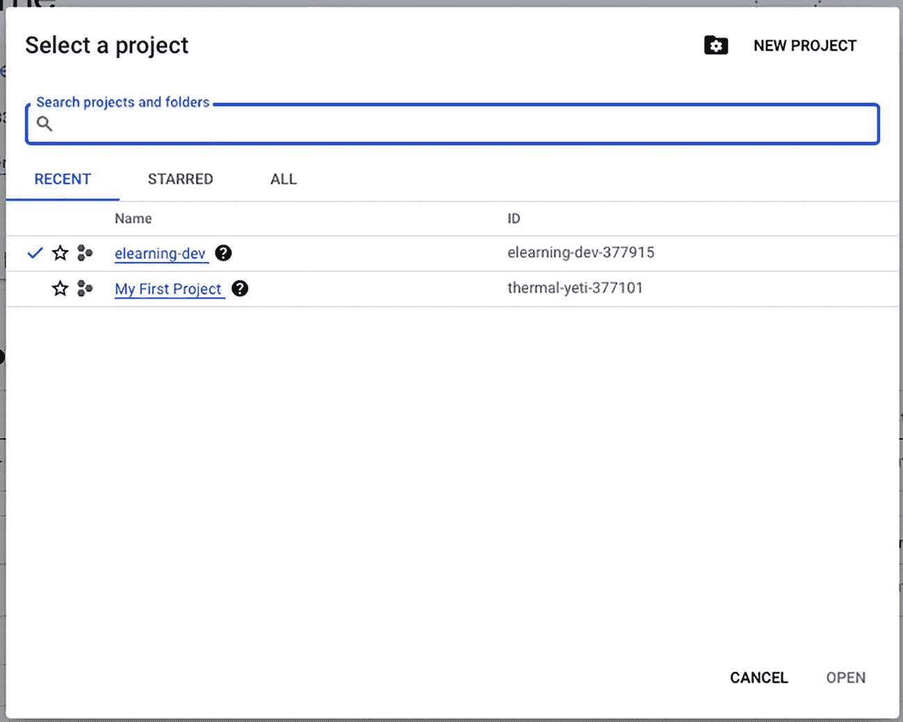

选择项目窗口的截图。它有一个用于搜索项目和文件夹的搜索框。它有一个“最近”选项卡，显示一个包含“名称”和“ID”两列的表格，以及两行数据：“e-learning dev”和“my first project”。

图 1-7

最近的项目

从 GCP 控制台的左侧窗格中选择服务，或使用顶部的搜索按钮搜索服务名称，如图 1-8 所示。

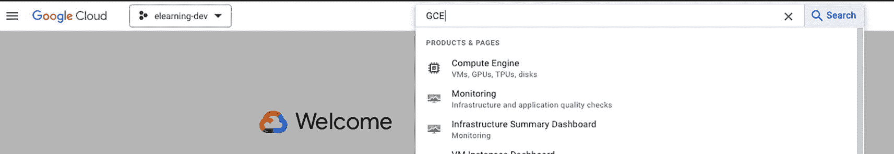

Google Cloud 窗口的截图，页面右侧有一个搜索框，其中输入了“G C E”。在“产品和页面”下显示了 3 个结果：“Compute Engine”、“Monitoring”和“Infrastructure Summary Dashboard”。

图 1-8

搜索 GCP 服务

## GCP 及其服务概览

*GCP* *架构*指的是构成 Google Cloud Platform 的基础设施和服务的设计与布局。从高层来看，GCP 架构包括计算、存储、数据库、网络和安全。它被设计为可扩展、可靠且安全的。它使用多层抽象和隔离机制，确保应用程序和服务能够在同一基础设施上独立且安全地运行。它还提供了各种工具和服务，使开发人员能够自动化开发流程、监控性能并实时排查问题。

GCP *区域*和*可用区*是 GCP 资源的特定地理位置。GCP 区域是托管资源的特定位置。区域由一个或多个可用区（AZ）组成，这些可用区是物理上分离的位置，称为*数据中心*。可用区被设计为相互独立，因此如果一个可用区发生故障，不会影响同一区域内另一个可用区中资源的可用性。GCP 区域和可用区非常重要，因为它们会影响应用程序的性能和可用性。当您创建 GCP 资源时，需要指定要创建资源的区域和可用区。

GCP 的定价基于按需付费模式，这意味着您只需为使用的资源和服务付费。成本取决于多个因素，包括所用资源的类型和数量、使用时长以及资源的位置。价格可能因区域和可用区而异，某些区域和可用区的成本会高于其他区域。GCP 通过承诺在一定时期内使用一定量的 Compute Engine 和云存储来提供承诺使用折扣。

GCP 提供多种服务，包括计算、存储、网络、大数据、机器学习、物联网（IoT）、安全和应用程序开发。让我们快速了解一些最受欢迎的服务。

### Google Compute Engine

Google Compute Engine (GCE) 是 GCP 的一部分，它提供可扩展、高可用且高性能的虚拟机，用于运行应用程序和服务。它使客户能够创建、配置和管理在 Google 基础设施上运行的虚拟机（VM）。GCE 提供一系列可配置选项，包括可定制的机器类型、磁盘存储选项和操作系统，包括流行的 Linux 发行版和 Microsoft Windows。GCE 还提供高级网络功能，如负载均衡、防火墙和自动备份，使其成为部署和管理应用程序与服务的理想平台。

GCE 与其他 GCP 服务（如 Google Kubernetes Engine、Google Cloud Storage、Google Cloud SQL 和 Cloud Pub/Sub）的集成并非受限，但可能取决于网络连接和配置。这种集成能力使得构建复杂的多层应用程序变得容易。

让我们看一个例子：GCE 实例与其需要通信的其他 GCP 服务位于不同的区域或可用区。在这种情况下，可能会出现延迟和性能问题。如果网络配置设置不当，可能会影响 GCE 实例与其他 GCP 服务之间的连接和集成。为了优化 GCE 实例与其他 GCP 服务之间的集成，将网络连接和配置作为架构设计的一部分来考虑非常重要，这包括选择合适的区域和可用区、设置正确的网络配置，以及使用负载均衡和 Cloud CDN 等服务来提高性能和可用性。

当您首次搜索并选择 GCE 时，必须点击“启用”按钮来启用它，如图 1-9 所示。如果您是组织成员且该服务已为所选项目启用，则不会看到此选项。

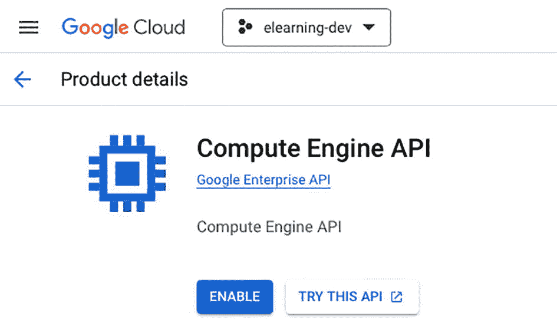

一张 Google Cloud 产品详情窗口的截图。页面左侧有一个带有标题的徽标，其右侧是 Compute Engine API。页面底部有一个“启用”按钮。

图 1-9

首次启用 Compute Engine

当您点击“启用”按钮时，您将看到它正在被启用，如图 1-10 所示。

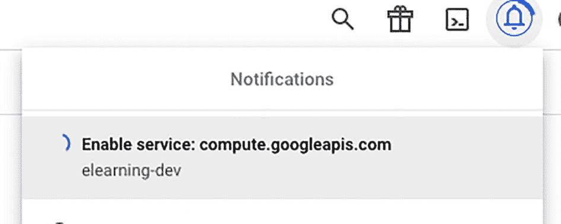

一张通知页面的截图，页面右上角有一个铃铛图标。其中有一行文字显示：“启用服务：compute.googleapis.com，e-learning dev”。

图 1-10

启用 Compute Engine API

启用 Compute Engine API 需要一些时间。

一旦 API 启用，您将看到 Compute Engine 控制面板，如图 1-11 所示。从这里，您可以创建虚拟机。通过点击“创建实例”，您可以创建一个 VM 实例。您可以使用 Google Cloud 的“迁移到虚拟机”功能，将您的虚拟机直接从本地或其他云环境迁移过来。支持的来源包括本地 VMware、Amazon EC2 和 Microsoft Azure。要迁移，您可以点击“导入 VM”按钮。您可以在屏幕顶部看到这两个按钮。

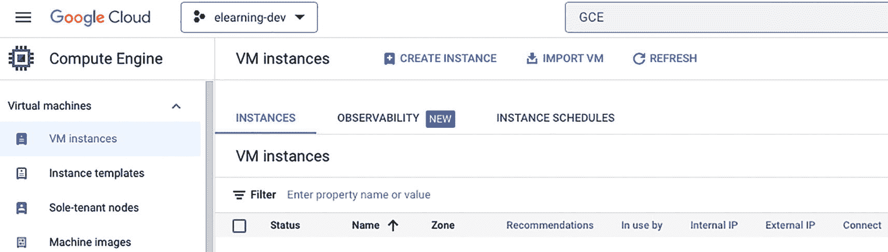

一张 Compute Engine 页面的截图，左侧选中了“VM 实例”选项。右侧有一个“实例”选项卡、一个用于输入属性名称或值的搜索框，以及一个包含状态、名称、可用区、建议、使用者、内外部 IP 和连接等列的表格。

图 1-11

Compute Engine 控制面板

有多种配置和实例选项可用于创建计算实例。导入现有 VM 是一个单独的主题，不在本书的讨论范围之内。

您可以使用所需的配置（如机器类型、操作系统、磁盘类型和大小）来创建 VM。最佳实践是使用 VM 模板来创建用于类似目的的 VM。您可以从市场中选择即用型可部署 VM；Google Cloud Marketplace 是一个用于在 Google Compute Engine 上发现、部署和管理预配置软件解决方案的平台。当您点击“创建实例”按钮时，您将看到这些选项，如图 1-12 所示。

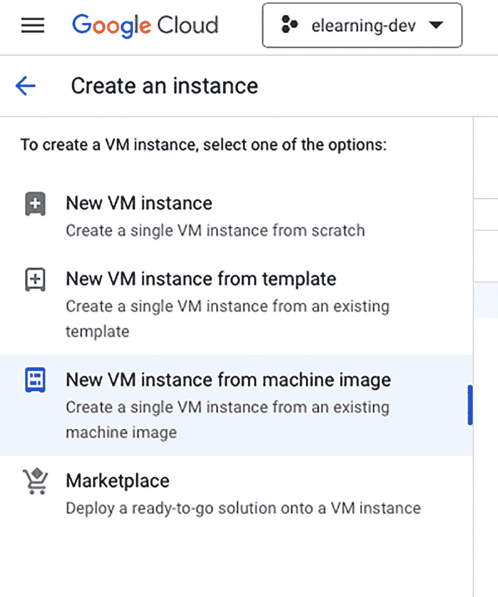

一张用于创建实例的 Google Cloud 窗口截图，其中有 4 个选项。选项 1 是“新建 VM 实例”，选项 2 是“从模板新建 VM 实例”，选项 3 是“从机器映像新建 VM 实例”，选项 4 是“市场”。

图 1-12

创建实例

GCE 可用于多种用例，包括批处理工作负载（如渲染和数据处理）、高性能计算工作负载（如科学模拟和机器学习）、大数据处理（如处理和分析大型数据集），以及为游戏工作负载提供高性能、可扩展的基础设施。

### Google Kubernetes Engine

Google Kubernetes Engine（GKE）是 GCP 提供的一项完全托管的 Kubernetes 服务，可让您轻松利用 Google 基础设施部署、管理和扩缩容器化应用。GKE 为部署、管理和扩缩容器提供了完整的解决方案，使开发者能够专注于编写代码和交付功能。它还提供自动升级、自动扩缩和自修复等功能，让开发者可以专注于应用本身，而无需操心底层基础设施。此外，GKE 还与其他 GCP 服务（如 Cloud Load Balancing、Cloud Operations Suite、Cloud Monitoring and Logging 以及 Cloud DNS）集成，从而可以轻松地在单一平台上管理完整的应用栈。

*容器化应用*是指将其所有依赖项打包成一个称为*容器*的单一单元的应用。容器彼此隔离，也与宿主机操作系统隔离，这使得它们成为更高效、更安全的部署应用方式。可以将容器想象成一个盒子，里面包含了应用运行所需的一切，例如代码、库和设置。这使得将应用部署到不同环境（例如本地环境、云端或混合环境）变得非常容易。容器也比传统虚拟机更高效。虚拟机需要完整的操作系统，而容器只需要应用的资源。这可以节省硬件成本并提高性能。容器比传统虚拟机更安全。容器彼此隔离，也与宿主机操作系统隔离，这使得恶意软件更难传播，从而使容器成为需要高度安全的应用的理想选择。

与 GCE 类似，如果您是首次使用 Kubernetes Engine API，则需要启用它。图 1-13 显示了“启用”按钮。

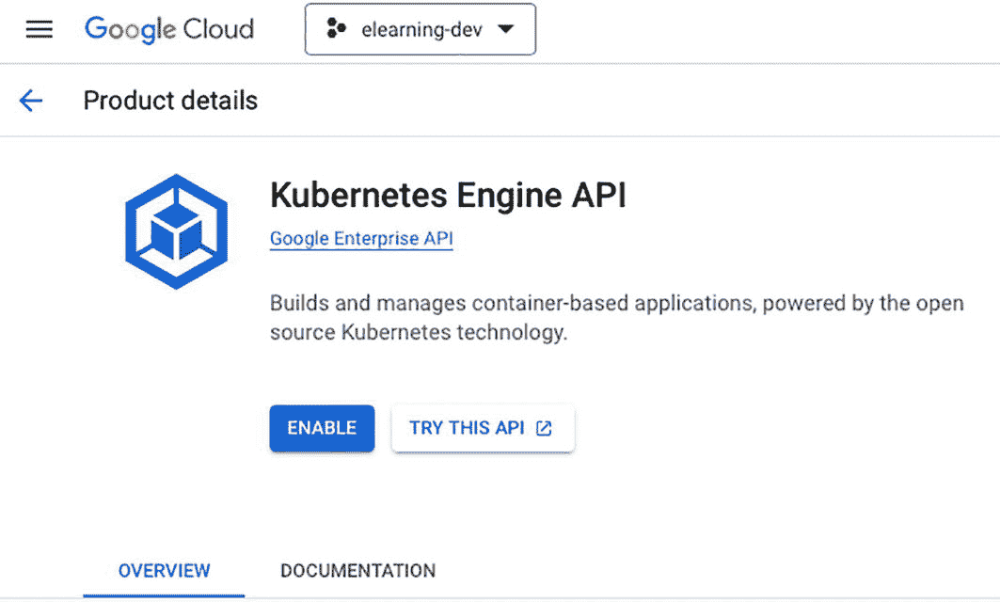

产品详情页面的截图。页面左侧有一个徽标，后面跟着标题“Kubernetes Engine API”，以及几行 API 说明文字。页面左下角有一个“启用”按钮。

图 1-13

启用 Kubernetes Engine API

点击“启用”按钮后，GCP 将需要一些时间来启用它。启用后，您将看到 GKE 仪表板。同样，如果您是组织成员，并且给定项目已启用 GKE，您将直接看到 GKE 仪表板。

在左侧窗格中，您将看到集群、工作负载、服务与入站流量、应用、密钥与配置映射等选项。

如图 1-14 所示，GCP 提供了两种创建 Kubernetes 集群和部署容器的选项：一种是按 Pod 付费的 Kubernetes 集群，称为 Autopilot，GKE 会以最少的配置要求管理您的节点。另一种是按节点付费的 Kubernetes 集群，称为 Standard，您需要自行配置和管理节点。

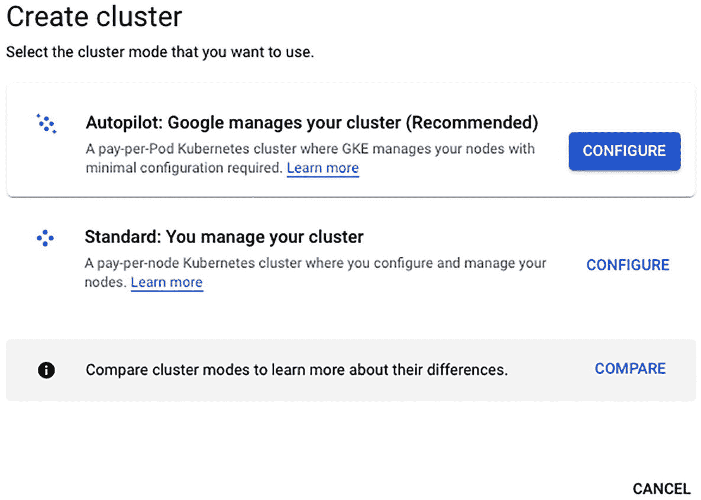

集群创建窗口的截图，显示了两种模式。模式 1 用于 Autopilot，模式 2 用于 Standard 模式，每种模式后面都有一个用于配置的按钮。模式 1 的“配置”按钮已被选中。页面底部有一个“比较”选项卡，用于比较集群模式。

图 1-14

创建 Kubernetes 集群

您可以为不同类型的工作负载创建具有不同配置的多个集群。例如，您可以为需要高可用性和可扩展性的生产应用创建一个 GKE 集群，该集群具有跨多个可用区的多个节点。您可以为开发或测试环境创建另一个 GKE 集群，该集群具有较少的节点和更简单的配置，如图 1-15 所示。

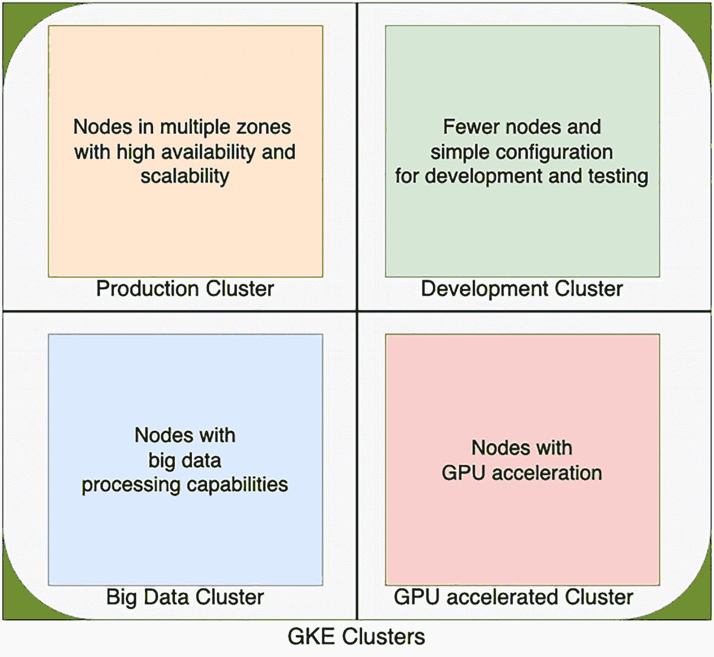

GKE 集群的框图有 4 个区块，每个区块都有各自的集群定义。区块 1 用于生产集群，区块 2 用于开发集群，区块 3 用于大数据集群，区块 4 用于 GPU 加速集群。

图 1-15

GKE 集群

您还可以根据工作负载的具体要求，创建具有不同机器类型、网络配置和存储选项的 GKE 集群。这使您可以针对性能、成本效益等因素优化 GKE 集群。您可能有一个用于批处理工作负载的 GKE 集群，以及另一个用于 Web 应用的 GKE 集群。这有助于防止资源争用，并提高整体性能和可靠性。

### Google Cloud Storage

Google Cloud Storage（GCS）是 Google Cloud Platform 提供的一种可扩展且高度耐用的对象存储服务。它为客户提供对非结构化数据的高性能访问，是存储和提供大量数据（如图像、视频、备份和日志）的理想解决方案。Google Cloud Storage 是一种统一的对象存储，为非结构化数据提供单一平台，为客户提供所有数据的单一存储库。它提供高性能和可扩展性，非常适合要求苛刻的应用，包括媒体与娱乐、游戏和科学计算。借助 Google Cloud Storage，客户可以轻松地在任何需要的地方存储和访问数据，并确信其数据已安全存储且始终可用。

Cloud Storage 提供了一种存储所有文件和对象的方式。所有存储都安排在存储桶内。你可以为不同目的创建不同的存储桶，然后在其中创建文件夹和子文件夹来放置文件。图 1-16 展示了 Cloud Storage 控制台。

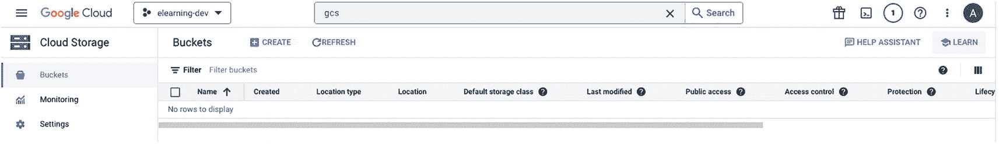

一个窗口的截图，在云存储下显示了存储桶选项。右侧有创建和刷新选项、一个用于过滤存储桶的筛选器，以及一个包含名称、创建时间、位置类型、位置、默认存储类别、最后修改时间、公开访问权限、访问控制和保护等列的表格。

图 1-16

Cloud Storage 控制台

在 Cloud Storage 控制台中，你可以创建存储桶。存储桶名称是全局唯一的。全局范围内不能有两个同名的存储桶。如果你正在删除你的存储桶，并希望使用当前正在删除的相同名称创建一个新存储桶，这是可以的。

存储桶名称不应包含任何敏感信息，因为存储桶名称是公开可见的。你可以为存储桶添加标签，以便将相似的存储桶分组。

在创建存储桶时，如图 1-17 所示，你可以选择存储桶的位置为单区域或多区域。你可以选择存储类别、访问控制、谁可以访问它，以及是否使用数据加密来保护你的数据。在 GCP 中，你可以使用 Google 管理密钥或客户管理密钥进行加密。

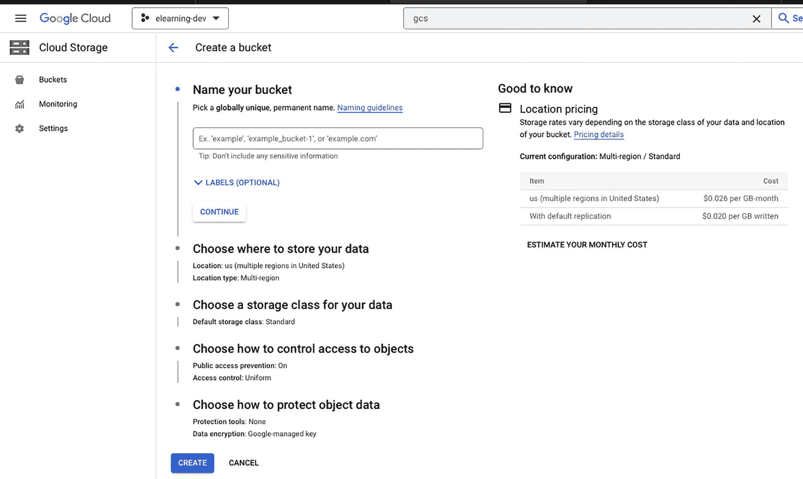

创建存储桶窗口的截图。它有一个选项卡用于提供存储桶名称，并选择数据存储位置、数据存储类别、如何控制对对象的访问以及如何保护对象数据的选项。页面左下角有一个创建按钮。

图 1-17

创建 Cloud Storage 存储桶

在为你数据创建存储桶时，请选择合适的存储类别。GCS 提供四种存储类别：标准、近线、冷线和归档。每种存储类别都有其自身的一组特性，例如性能、可用性、持久性和成本。在创建存储桶时，你可以选择一种存储类别来设置存储桶的默认存储类别，如图 1-18 所示。

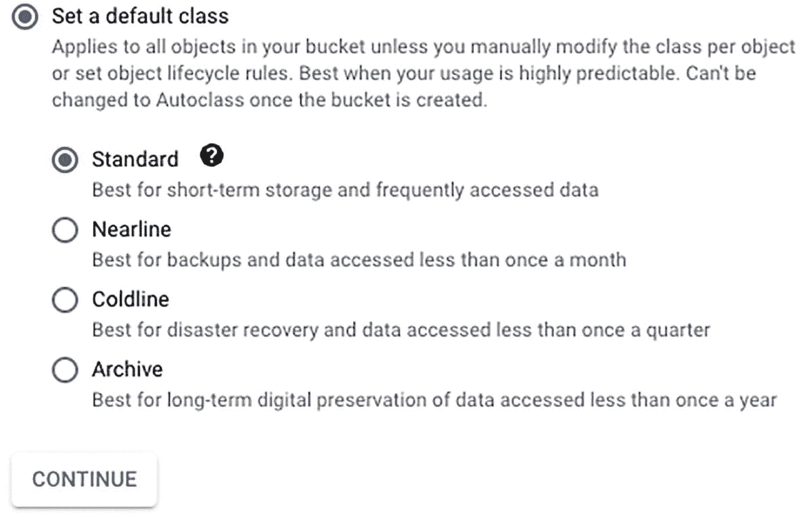

一个页面的截图，在默认类别下有 4 个选项。它有一个设置默认类别的选项被选中，后面跟着 4 个选项：标准、近线、冷线和归档，以及它们各自的优势。选项 1 标准已被选中。

图 1-18

选择存储类别

*标准存储*是默认的存储类别，也是最昂贵的。如果你需要频繁且快速地访问数据，这种存储类别最适合你。例如，你可能将标准存储类别用于客户订单和发票，因为你需要能够快速且频繁地访问这些数据。

*近线存储*比标准存储便宜，是偶尔需要访问但对业务不关键的数据的不错选择。例如，你可以使用近线存储来备份你的网站数据。

*冷线存储*比近线和标准存储便宜，是访问频率低且对业务不关键的数据的不错选择。例如，你可能将冷线存储用于财务记录，这些记录每季度仅访问一次用于报告目的。

*归档存储*是成本最低的存储类别，但访问成本最高，最适合很少或从不访问的数据。例如，你可能选择归档存储类别用于因法律或监管原因而保留的备份。

### Google BigQuery

Google BigQuery (GBQ) 是一项全托管、无服务器的云数据仓库服务，能够利用谷歌基础设施的处理能力实现超快速的 SQL 查询。它使组织能够快速且经济高效地分析大量数据，因此成为大数据分析的热门选择。BigQuery 与多种其他 GCP 服务和工具集成，包括 Google Cloud Dataflow、Google Cloud Dataproc 和 Google Cloud Storage，使其成为适用于各种规模组织的灵活且可扩展的解决方案。使用 BigQuery，无需担心硬件或基础设施维护，因为谷歌会管理所有底层基础设施。这使得组织能够专注于分析和洞察，而不是管理和维护硬件。

BigQuery 是企业级数据仓库，您可以将相关的应用程序数据导出到其中，用于报告和分析目的。如果您进入 BigQuery 控制台，GCP 会提供公共数据，以便您在这些数据上探索 BigQuery 的功能。图 1-19 展示了 BigQuery 仪表板。

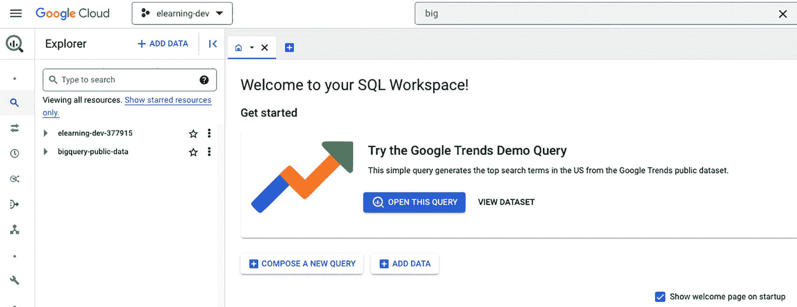

一张 Google Cloud SQL 仪表板的截图。上面有一行文字写着“欢迎来到您的 SQL 工作区”，接着是一段文字提示“尝试 Google Trends 演示查询”。页面上有一个“打开查询”按钮，以及两个用于“编写新查询”和“添加数据”的按钮，位于页面底部。

图 1-19

Google BigQuery

在 BigQuery 中，您可以使用查询编辑器编写类似 RDBMS 数据库的查询。您可以通过从存储桶上传数据文件、从外部来源（如移至 BigQuery 的应用程序日志）上传文件、通过 Pub/Sub 将数据推送到 BigQuery 等方式向 BigQuery 添加数据。谷歌提供了一个示例数据集，供您在学习 BigQuery 时试用。要获取此数据集，请点击“开始使用”窗口中的“查看数据集”，如图 1-19 所示。

BigQuery 中的数据按层次结构组织。顶层是*项目*，它是数据集的逻辑容器。数据集用于组织表，而表用于存储数据，如图 1-20 所示。

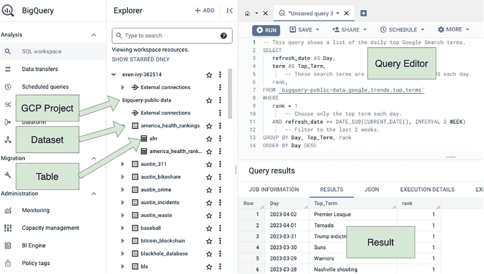

一张页面的截图，分为 3 列。第一列是 BigQuery，包含分析、迁移和管理选项。第二列是资源管理器，包含工作区资源，其中标记了 3 个资源：GCP 项目、数据集和表。第三列是一个查询编辑器，包含几行编程代码和一个用于显示查询结果的表格。

图 1-20

BigQuery 资源管理器

每个表都有一个定义表中数据结构的模式。模式包括表中列的名称和列的数据类型。

BigQuery 还支持数据集内的视图，这些视图是表示一个或多个表中数据子集的虚拟表。视图可以提供表中数据的不同视角，或组合来自多个表的数据。

在内部，BigQuery 使用列式存储格式组织数据，这意味着数据是按列而非行进行存储和处理的。这允许快速查询和高效利用资源，尤其适用于大型数据集。

BigQuery 可用于集成来自不同来源的数据，这对于创建数据的单一视图非常有用。它可用于数据仓库，因为它可以存储大量数据并且运行查询速度快。您可以使用它创建仪表板和报告，以深入了解您的业务数据。来自 BigQuery 的大量数据可用于训练机器学习模型或执行数据分析，以发现数据中的模式。

### Google Cloud SQL

Google Cloud SQL 是 Google Cloud Platform 提供的一项全托管关系型数据库服务。它支持 MySQL、PostgreSQL 和 SQL Server 等 SQL 数据库。Cloud SQL 提供了一个易于使用的 Web 界面来管理数据库，以及许多用于与其他 Google Cloud Platform 服务集成的工具和 API。使用 Cloud SQL 的一些好处包括自动备份、高可用性和可扩展性，使您能够专注于开发应用程序，而不是管理基础设施。此外，Cloud SQL 是安全的，并符合行业标准，因此您可以相信您的数据是受到保护的。图 1-21 展示了 Cloud SQL 仪表板。

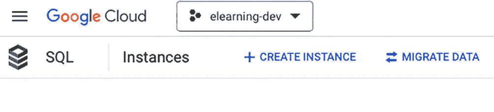

一张 Google Cloud 电子学习开发窗口的截图，分为两列，分别显示“SQL”和“实例”，随后是“创建实例”和“迁移数据”的选项。

图 1-21

Cloud SQL

您可以在 Google Cloud SQL 中为 MySQL、PostgreSQL 或 SQL Server 创建实例。您可以使用数据迁移服务将数据迁移到 Cloud SQL。

您需要启用 Database Migration API 才能使用数据迁移服务将数据迁移到 Cloud SQL，如图 1-22 所示。

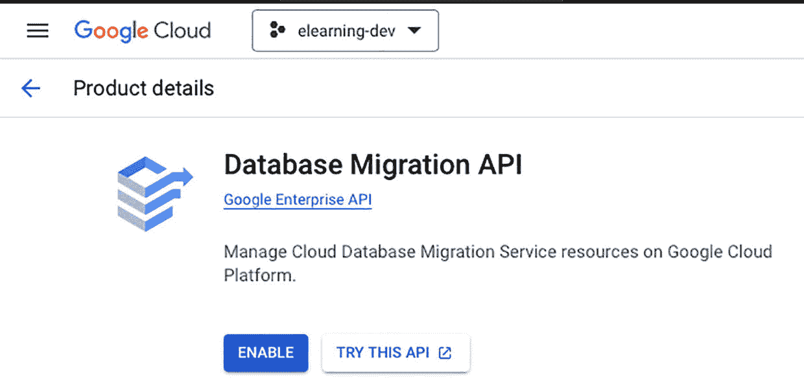

一张产品详情页的截图。页面左侧有一个徽标，后面跟着标题“Database Migration API”，以及几行关于该 API 的说明文字。页面左下角有一个“启用”按钮。

图 1-22

Database Migration API

一旦启用，您就可以创建一个数据迁移任务，开始将数据迁移到 GCP。图 1-23 展示了 Database Migration 仪表板。

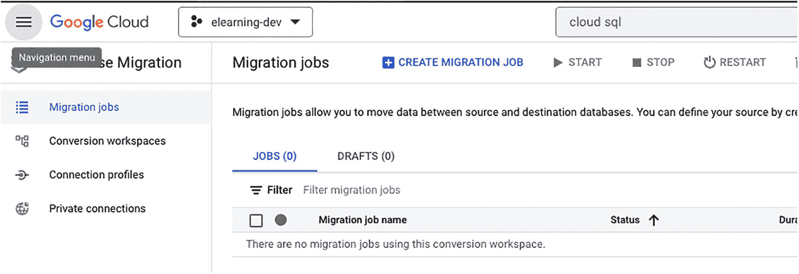

一张 Google Cloud 迁移窗口的截图。页面左侧选中了“迁移任务”选项。右侧有“创建迁移任务”选项、一个已选中的“任务”选项卡，以及一个用于筛选迁移任务的筛选选项。

图 1-23

Database Migration 仪表板

Database Migration Service (DMS) 是一项全托管服务，允许您将本地数据库或运行在其他云平台上的数据库迁移到 Google Cloud Platform。使用 DMS，您可以以最小的停机时间和业务运营中断，执行一次性或持续性的数据库迁移。

DMS 是一项全托管服务，停机时间极短，支持在线和离线迁移，您可以在迁移进行期间继续运行业务。它支持迁移多种本地和云数据库，包括 MySQL、PostgreSQL、SQL Server 和 Oracle，迁移目标可以是 Cloud SQL 或 Spanner。

如果您决定创建一个新实例，请点击“创建实例”按钮。系统会询问您要为哪个数据库引擎创建实例，如图 1-24 所示。

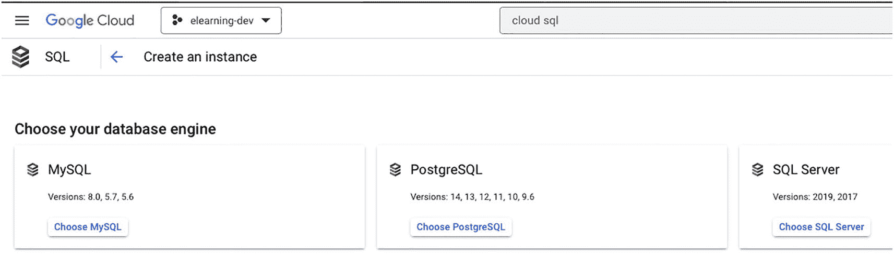

一张 SQL 实例创建页面的截图。页面提供了 3 个数据库引擎选项：MySQL、PostgreSQL 和 SQL Server，每个选项后面都列出了可用的版本以及一个“选择”按钮。

图 1-24

创建 Cloud SQL 实例

例如，如果您选择 MySQL，它将根据您为服务器选择的选项（例如区域、单区域或多区域、机器类型等）来配置 MySQL。

GCP 推出了一项新的 AlloyDB 服务，用于兼容开源 PostgreSQL 的数据库。AlloyDB 提供了一些 Cloud SQL 不具备的功能，例如时间点恢复、自动清理和压缩。

选择 Cloud SQL 还是 AlloyDB 将取决于您的具体需求和条件。如果您需要兼容 MySQL 的数据库服务，Cloud SQL 会是一个不错的选择。如果您需要兼容 PostgreSQL 的数据库服务，那么 AlloyDB 会是一个不错的选择。如果您需要提供最新特性和技术的数据库服务，那么 AlloyDB 会是一个不错的选择。对于不需要大量数据处理的工作负载，Cloud SQL 通常比 AlloyDB 更便宜。然而，对于需要大量数据处理的工作负载，AlloyDB 可能更具成本效益。

### Google Cloud Spanner

Google Cloud Spanner 是 Google Cloud 提供的一种高度可扩展、全球分布式的托管关系型数据库服务。它旨在跨所有节点提供水平扩展性和强一致性，使其成为需要强一致性和高性能的应用程序的绝佳选择。凭借其对 SQL、事务和二级索引的支持，Spanner 提供了熟悉的数据库抽象，使开发人员易于使用并集成到现有应用程序中。Spanner 的全球分布式架构、自动故障转移和低延迟使其成为高可用性和关键任务应用程序的理想选择。凭借其可扩展性、可靠性和一致性，Cloud Spanner 为希望实现数据架构现代化并将其应用程序迁移到云端的组织，提供了一种经济高效且可扩展的传统关系型数据库替代方案。

即使使用 GCP 的 300 美元、90 天试用期，您也可以为 Cloud Spanner 单独开始一个 90 天的免费试用。您将获得 10 GB 的存储空间，该存储空间不会从您的信用额度中扣费。

如图 1-25 所示，点击“开始免费试用”按钮，您可以通过提供实例名称、实例 ID 和配置中的位置来创建一个 Spanner 实例。

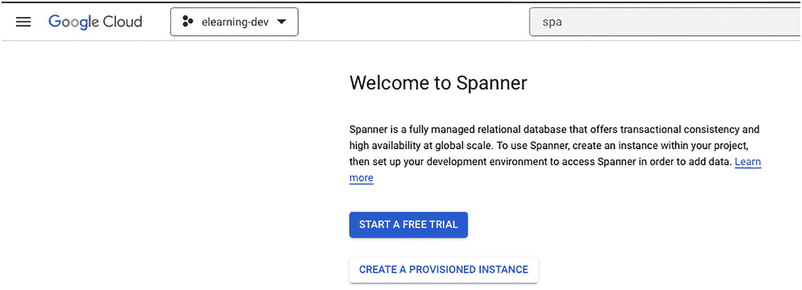

Google Cloud Spanner 页面的截图。页面顶部有一条欢迎消息，接着是几行关于 Spanner 的文本，页面底部有一个开始免费试用的按钮。

图 1-25

Cloud Spanner

创建 Cloud Spanner 实例时（见图 1-26），请指定您希望用于运行数据库的节点数量。每个节点提供一定量的计算和存储资源，您使用的节点越多，可用于运行数据库的计算和存储资源就越多。

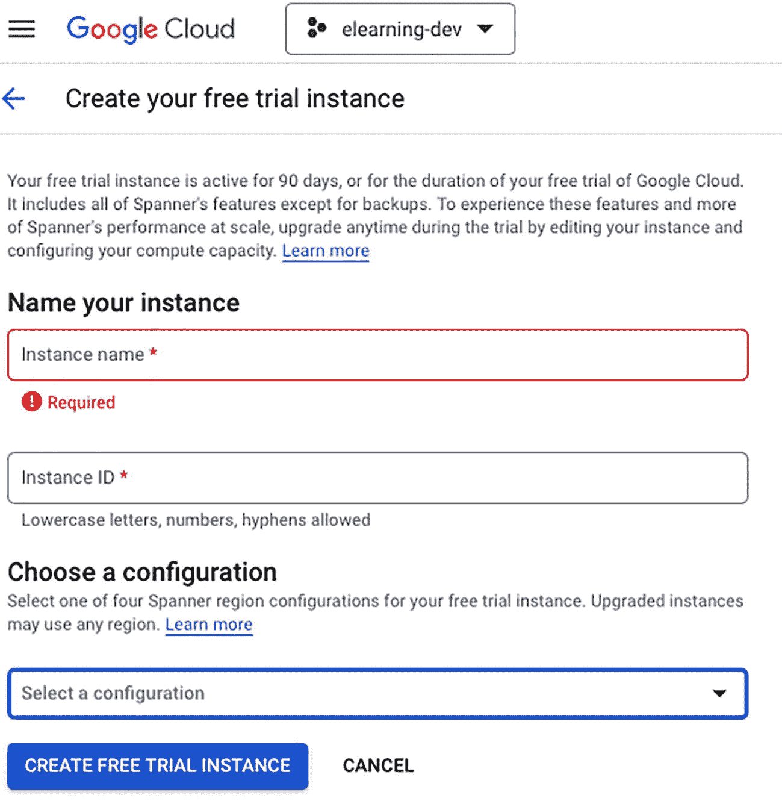

试用实例创建页面的截图。页面中有几行关于试用实例详情的文本，一个用于输入实例名称和实例 ID 的文本框，以及一个用于选择配置的下拉菜单。页面底部有一个创建免费试用实例的按钮。

图 1-26

为 Spanner 创建实例

节点是作为 Cloud Spanner 服务一部分运行的计算和存储资源单元。一个节点可以被视为一个为运行 Cloud Spanner 软件而优化的虚拟机。

Cloud Spanner 使用分布式架构来提供高可用性和可扩展性。数据库被分区为多个分片，这些分片分布在多个节点上。每个节点存储一部分数据，并处理针对该部分数据的查询。这使得 Cloud Spanner 能够高速处理大型数据库和复杂查询。

Cloud Spanner 还跨所有节点和分片提供强一致性。这意味着所有客户端将在同一时间看到相同的数据，即使在重负载下也是如此。为了实现强一致性，Cloud Spanner 使用一种分布式提交协议，确保所有节点就事务提交的顺序达成一致。

创建 Cloud Spanner 实例后，您可以放心使用它，无需担心扩展问题，同时仍能获得像 MySQL 这样的 RDBMS 的 ACID 特性带来的好处。

### Google Cloud Dataflow

Google Cloud Dataflow 是一种用于实时转换和分析数据的全托管服务。它旨在帮助开发人员处理和分析来自各种来源（如批处理和流式数据）的数据。Cloud Dataflow 允许开发人员使用支持批处理和流处理的高级、简单 API 来构建数据处理管道。它提供了许多功能来优化数据处理管道的性能和可扩展性，包括自动并行处理、优化的数据移动和集成的错误处理。此外，Dataflow 与其他 Google Cloud Platform 服务（如 BigQuery、Cloud Storage 和 Cloud Pub/Sub）集成，使开发人员能够轻松地在云端分析和存储数据。

您可以创建批处理或流式数据作业、创建数据管道，并将流式管道的状态保存为快照。图 1-27 显示了 Dataflow 仪表板。

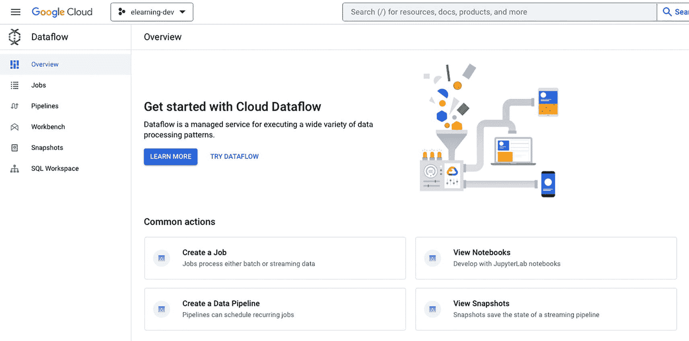

Cloud Dataflow 页面的截图。页面左侧选中了“概览”选项。右侧显示了 Cloud Dataflow 的详细信息、一个 Dataflow 图表，以及四个常见操作：创建作业、查看协议、创建数据管道和查看快照。

图 1-27

Cloud Dataflow 仪表板

要创建任何新作业，如果尚未启用，您需要为您的项目启用 Dataflow API；图 1-28 显示了“启用”按钮。

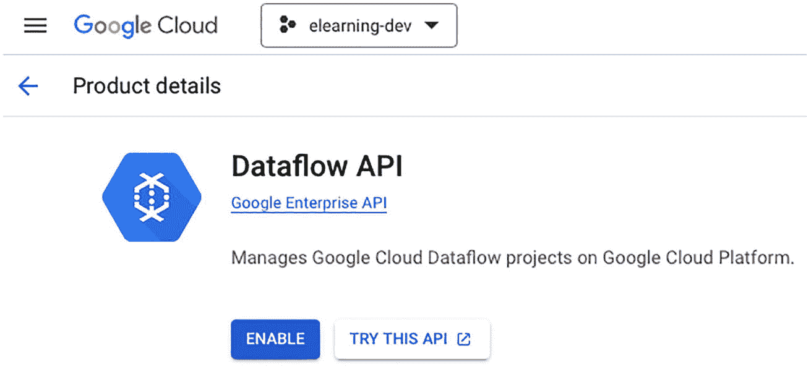

Google Cloud 产品详情窗口的截图。页面左侧有一个徽标，其右侧是标题“Dataflow API”。页面底部有一个“启用”按钮。

图 1-28

启用 Dataflow API

Dataflow 内部使用 Apache Beam，并且它有一些预构建的模板，用于创建涵盖大多数常见场景的作业。您可以使用预构建模板创建 Dataflow 作业，也可以根据项目需求创建模板。图 1-29 展示了如何从模板创建 Dataflow 作业。

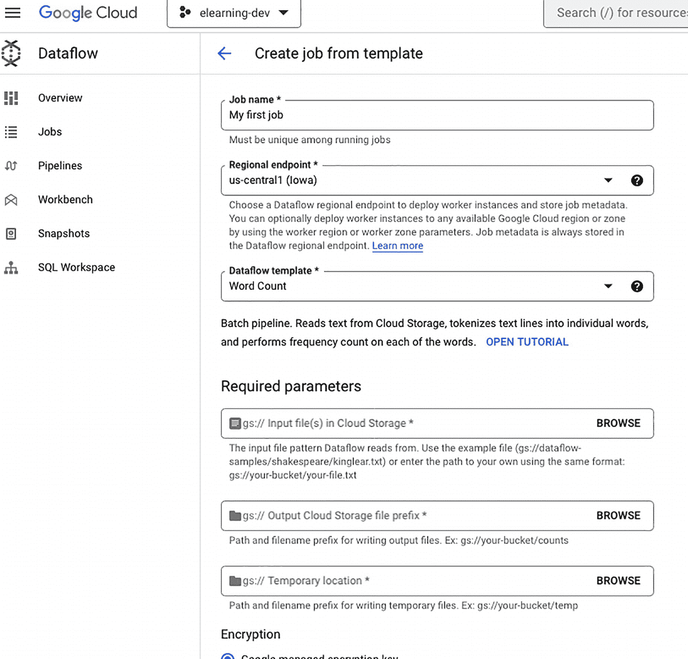

从模板创建作业的页面截图。页面中有一个用于输入作业名称的文本框，两个用于选择区域端点和数据流模板的下拉菜单，以及三个用于浏览必需参数的选项。

图 1-29

从模板创建作业

要创建 Cloud Dataflow 管道，您首先需要确定数据的来源，例如文件或数据库。然后，您需要使用支持的编程语言编写代码，以定义数据的处理方式，例如通过过滤或分组。代码编写完成后，您需要将其打包成一种可以分发并在 Cloud Dataflow 服务上执行的格式。

### Vertex AI

Vertex AI 是一个用于开发、训练和部署机器学习模型的托管机器学习平台。它提供了基于云的基础设施来运行大规模机器学习工作流，并提供多种服务，包括托管模型、训练算法和部署机器学习应用。该平台专为需要快速轻松地构建和部署大规模复杂模型的数据科学家和机器学习工程师而设计。借助 Vertex AI，用户可以充分利用 Google 在机器学习方面的基础设施和专业知识，专注于开发模型的核心任务，而无需担心底层基础设施的管理。

例如，你可以使用 Vertex AI 创建一个推荐引擎。你可以通过使用提供的数据和机器学习，通过批量请求获取预测结果。图 1-30 展示了 Vertex AI 控制台。

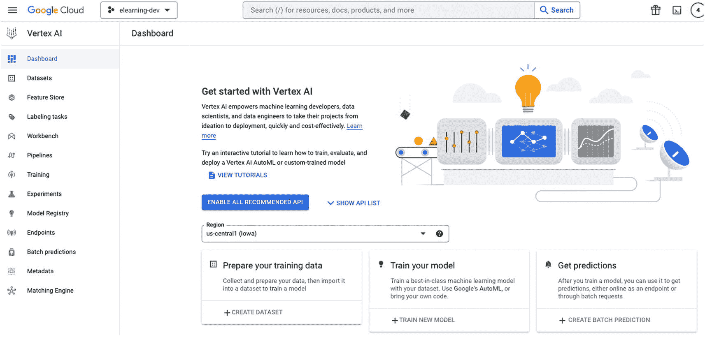

一张 Vertex AI 页面的截图，右侧有一个图表，左侧有文字“开始使用 Vertex AI”。页面上有一个“启用所有推荐的 API”按钮，后面跟着三个模块，分别用于准备训练数据、训练模型和获取预测结果。

图 1-30

Vertex AI 控制台

有一些机器学习 API（ML API），包括 Cloud Vision API、Video Intelligence API 和 Product Search API，如图 1-31 所示。

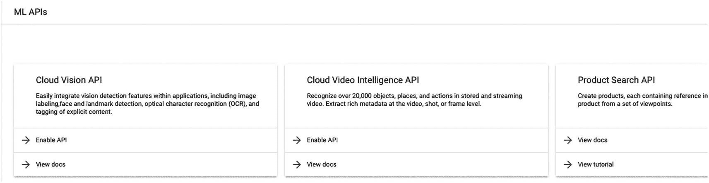

一张 ML API 页面的截图，包含三个模块，每个模块都有定义以及启用 API 和查看文档的选项。模块 1 是 Cloud Vision API，模块 2 是 Cloud Video Intelligence API，模块 3 是 Product Search API。

图 1-31

ML API

Vertex AI 为常见的机器学习任务（如图像和文本分类）提供了预构建模型和工具。这意味着你可以使用这些预构建模型快速上手，而无需从头开始开发自己的模型。

### Google Cloud Translation API

Google Cloud Translation API 是 Google Cloud 提供的一项基于云的机器翻译服务。它可以在不同语言之间翻译文本，包括英语、西班牙语、法语、德语、中文以及许多其他语言。该 API 使用先进的机器学习技术来提供准确且自然的翻译。它用于在各种场景中翻译文本，包括网站、移动应用、客户服务和文档翻译。该 API 易于使用，可以通过简单的 API 请求轻松集成到广泛的 Web 和移动应用中。借助 Google Cloud Translation API，开发者可以快速轻松地为其应用添加多语言支持，从而帮助覆盖更广泛的全球受众。

如果你在 GCP 项目中首次使用 Translation API，则需要启用它，如图 1-32 所示。

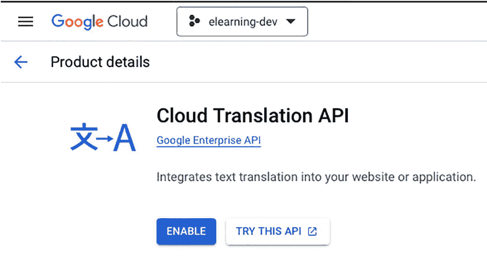

一张产品详情页的截图。页面左侧有一个徽标，后面跟着标题“Cloud Translation API”，以及几行关于该 API 的说明文字。页面左下角有一个“启用”按钮。

图 1-32

启用 Translation API

一旦启用，你就可以在项目或 Web 应用中使用此 API 将字符串或文本从一种语言翻译成另一种语言。你可以在控制台上查看流量，如图 1-33 所示。

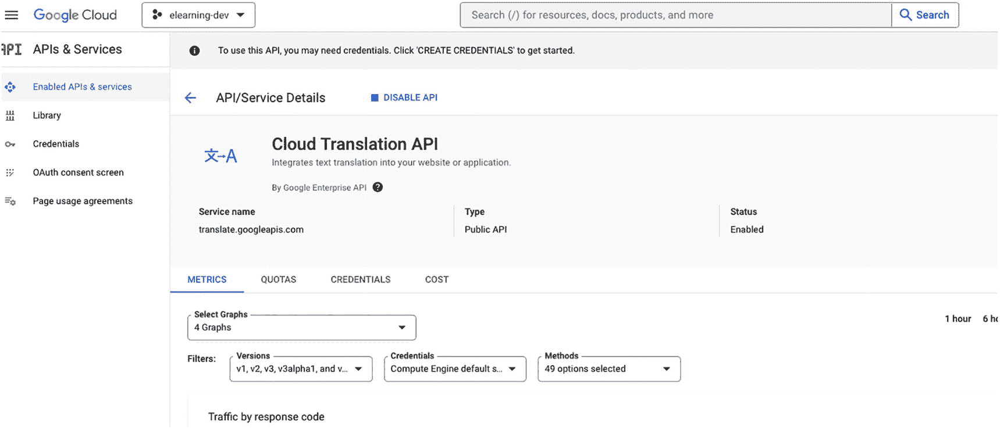

一张 Cloud Translation API 页面的截图。左侧突出显示了“启用 API 和服务”的选项。右侧显示了 API 详情，包括服务名称、类型和状态。页面底部有一个“指标”选项卡，带有一个下拉菜单，用于选择图表和筛选条件。

图 1-33

Cloud Translation API 控制台

Cloud Translation API 支持超过 100 种语言，并且可以在这些语言之间进行文本翻译。你还可以自定义翻译模型，以提高针对特定用例的翻译准确性。

GCP 还提供许多其他服务，以满足不同的用例和业务需求。

现在你已经对 GCP 提供的众多服务有了大致了解，我将为你简要介绍 Java 编程语言。

## Java 及其功能概述

Java 是一种流行的编程语言，用于在 GCP 上构建各种应用。此外，GCP 还提供了许多服务和工具，你可以与 Java 结合使用来构建、部署和扩展应用。以下是适用于 Java 应用的 GCP 服务的一些示例：

*   *Google App Engine*：一个完全托管的平台，用于构建和托管多种语言（包括 Java）的 Web 应用。

*   *Google Cloud Storage*：一个完全托管的对象存储服务，可以为 Java 应用存储和检索数据。

*   *Google Cloud SQL*：一个完全托管的关系型数据库服务，可以为 Java 应用存储和检索数据。

*   *Google Cloud Datastore*：一个完全托管的 NoSQL 文档数据库服务，可以为 Java 应用存储和检索数据。

*   *Google Cloud Bigtable*：一个完全托管的高性能 NoSQL 数据库服务，可以为 Java 应用存储和检索大量数据。

*   *Google Kubernetes Engine*：你可以使用 GKE 创建一个完全托管的 Kubernetes 集群。你可以将容器化的 Java 应用部署到 Google Kubernetes Engine。

GCP 还提供了多种工具和库，可用于构建、部署和扩展 Java 应用，包括 Google Cloud SDK for Java，它提供了一套用于与 GCP 服务交互的命令行工具和库。接下来，我们来谈谈使用 Java 进行 GCP 应用开发的优势。

## 使用 GCP 进行应用开发的优势

GCP 提供了一系列用于开发和部署 Java 应用的工具和服务。它为各种规模的组织提供了可扩展、安全且经济高效的解决方案。在本书中，我们将探讨使用 GCP 进行 Java 开发的优势，以及如何在 GCP 平台上设计、构建和优化 Java 应用。

使用 GCP 进行 Java 开发的关键优势之一是可扩展性。GCP 提供自动扩展和负载均衡，确保您的应用能够应对流量高峰并提供一致的性能。这消除了手动干预的需要，使开发人员能够专注于构建新功能和改进应用。

使用 GCP 的另一个优势是安全性。GCP 提供安全的基础设施和一系列安全功能，例如访问控制和加密，以帮助保护您的应用和数据安全。这降低了数据泄露的风险，并有助于确保敏感信息保持机密。

GCP 还提供了一系列用于监控和日志记录的工具和服务，使识别和解决性能问题变得更加容易。借助 GCP，您可以轻松监控应用的性能，并深入了解用户如何与之交互。这可以帮助您确定需要改进的领域，并优化应用的性能。

GCP 提供经济高效且灵活的定价选项，使您只需为所需内容付费。这使得成本控制更加容易，并为需求不断变化的组织提供了更灵活的解决方案。

GCP 为包括 Java 开发在内的各种编程语言提供了全面且经济高效的解决方案，并提供了一系列工具和服务来帮助组织构建、部署和优化其应用。GCP 提供了一个专门用于 Java 开发的 BOM，称为 Google Cloud Libraries BOM。此 BOM 列出了在 GCP 上构建和运行 Java 应用所需的所有库和依赖项，包括 Spring、Apache Beam 等流行库。

在接下来的章节中，我们将更详细地探讨这些优势，并提供在 GCP 上设计、构建和优化 Java 应用的示例和最佳实践。

## 微服务概述

微服务架构是一种通过将软件应用分解为更小、独立且自包含的服务来构建软件应用的方式，如图 1-34 所示。每个微服务都有其特定的功能，通过 API 与其他服务通信，并且可以独立开发、部署和扩展。微服务方法可以实现更快、更敏捷的开发，提高可扩展性和弹性，并简化应用的维护和演进。

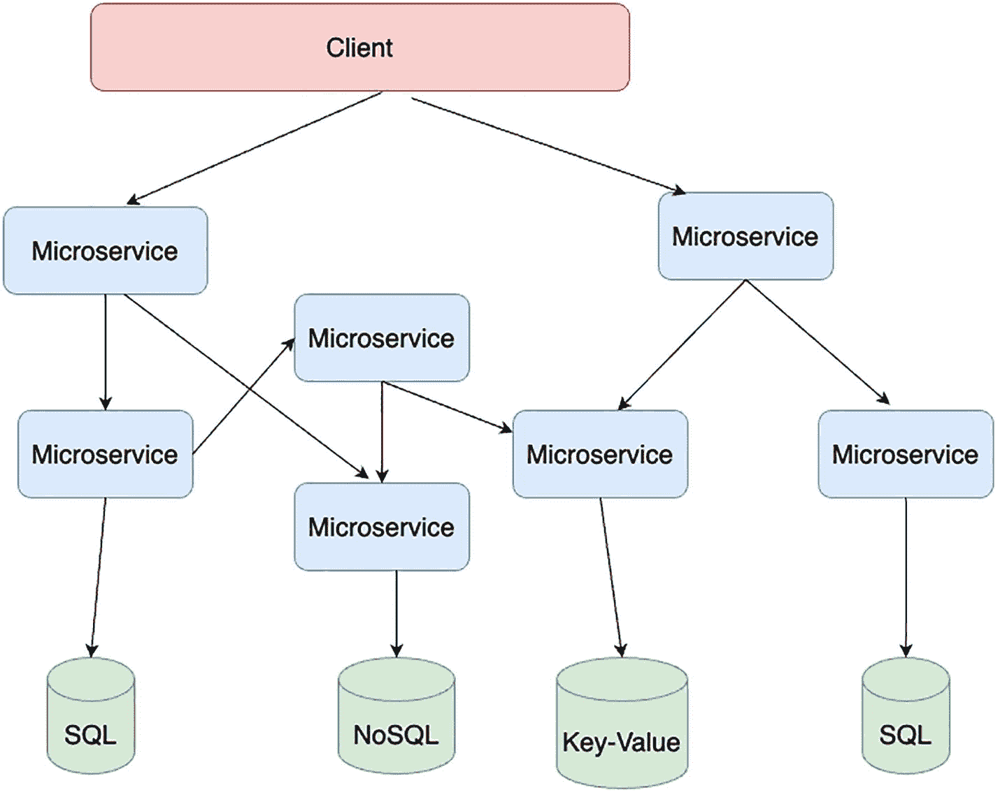

微服务组件的流程图显示了一个客户端和两个微服务。每个微服务进一步连接到不同数量的微服务。最后一行有四个微服务，分别连接到 SQL、NoSQL、键值存储和 SQL。

图 1-34

微服务架构

在微服务架构中，不同的微服务可以使用不同的编程语言和技术进行开发，从而更容易为任务采用最佳工具。Java 是开发微服务的流行选择，因为它提供了丰富的工具、框架和库来构建可扩展且可靠的应用。

GCP 提供了许多非常适合开发和部署基于 Java 的微服务的服务和工具。例如，Google Kubernetes Engine 为部署和扩展容器化应用提供了托管环境，而 Operations Suite 为在 GCP 上运行的 Java 应用提供了强大的监控和日志记录功能。此外，GCP 还提供了多种数据库选项，包括 Cloud SQL、Cloud Datastore 和 Cloud Spanner，可用于存储微服务的数据。

使用 GCP 进行 Java 开发可以带来许多好处，包括访问一系列强大且可扩展的服务、简化的开发和部署流程，以及轻松扩展和监控应用的能力。

## 总结

在本章中，我介绍了 Google Cloud Platform 及其为 Java 开发提供的优势。我解释了 GCP 如何提供可扩展性、安全性、监控和日志记录以及灵活的定价选项，这些可以帮助组织构建、部署和优化其 Java 应用。我还讨论了微服务架构，这是一种通过将软件应用分解为更小、独立且自包含的服务来构建软件应用的方式，以及 Java 为何是开发微服务的流行选择。最后，我解释了 GCP 如何提供许多非常适合开发和部署基于 Java 的微服务的服务和工具，以及使用 GCP 进行 Java 开发如何带来许多好处，包括访问强大且可扩展的服务、简化的开发和部署流程，以及轻松扩展和监控应用的能力。

以下是一些供进一步参考的资源：

*   *基于云的微服务*: [`https://link.springer.com/book/10.1007/978-1-4842-6564-2`](https://link.springer.com/book/10.1007/978-1-4842-6564-2)

*   *Google Cloud 文档*: [`https://cloud.google.com/docs`](https://cloud.google.com/docs)

*   *GCP 定价计算器*: [`https://cloud.google.com/products/calculator`](https://cloud.google.com/products/calculator)

*   *GCP 资源层次结构*: [`https://cloud.google.com/resource-manager/docs/cloud-platform-resource-hierarchy`](https://cloud.google.com/resource-manager/docs/cloud-platform-resource-hierarchy)

