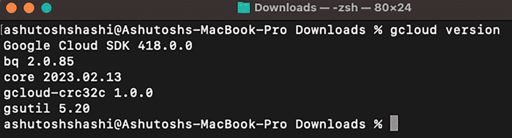
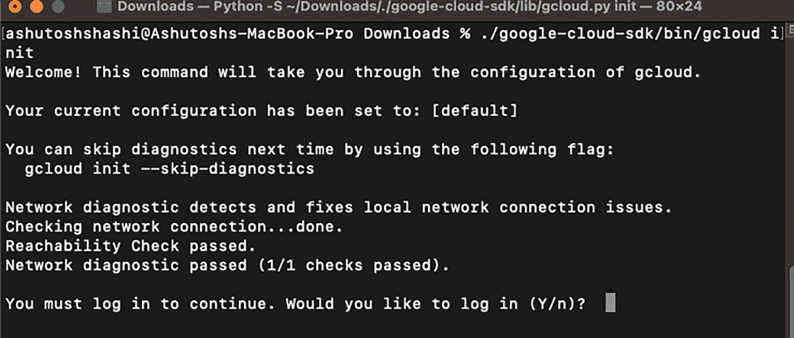
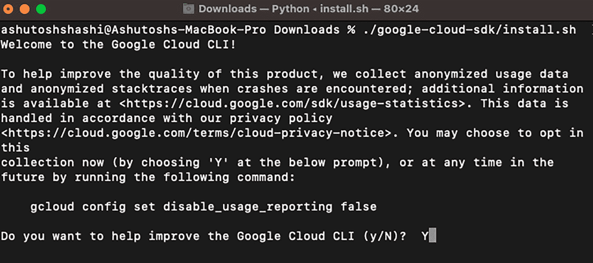
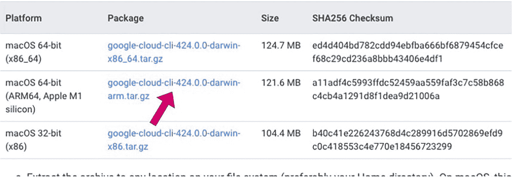
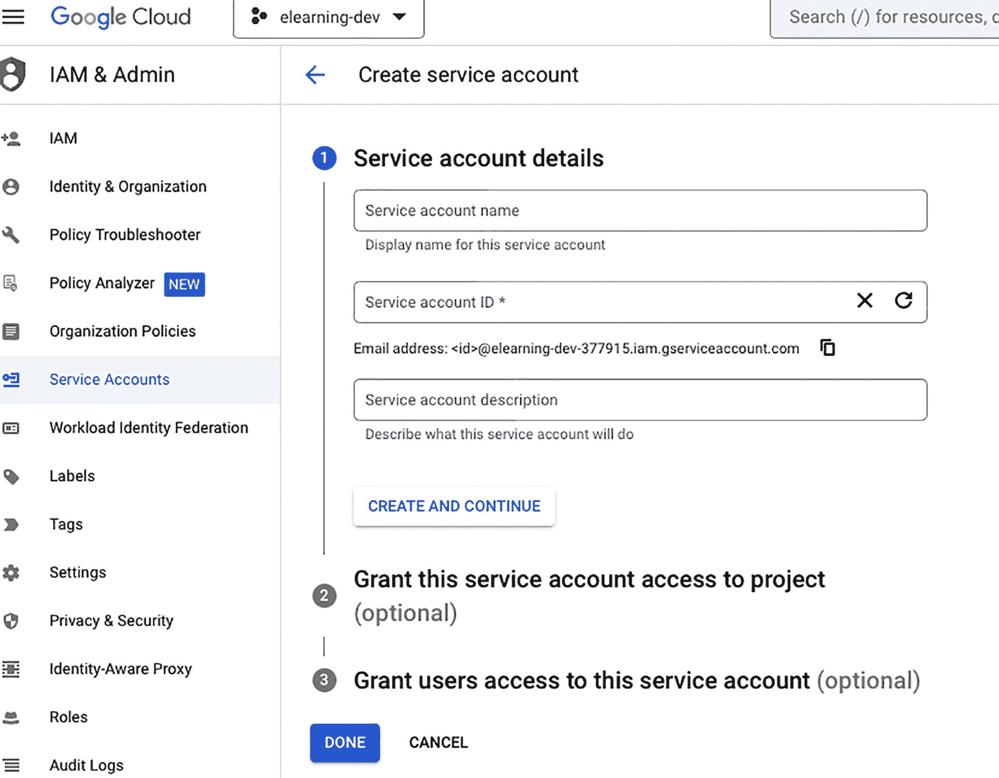
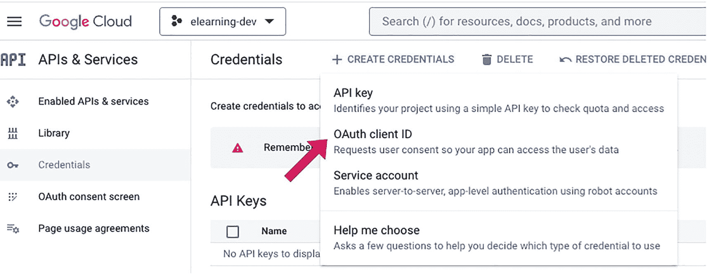
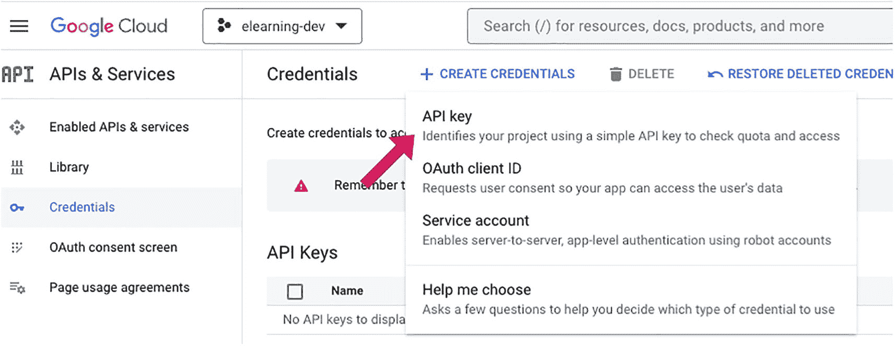
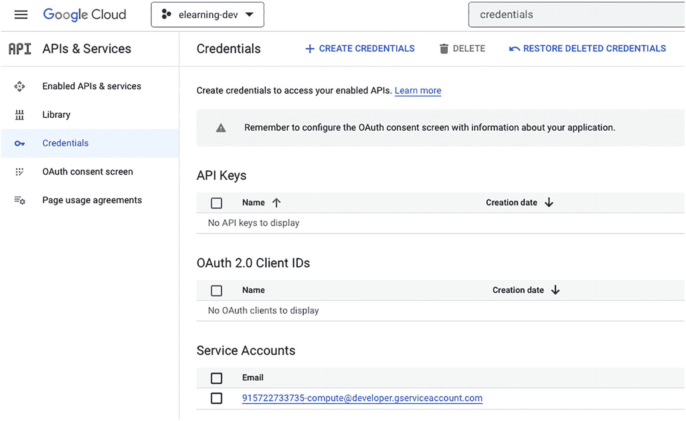
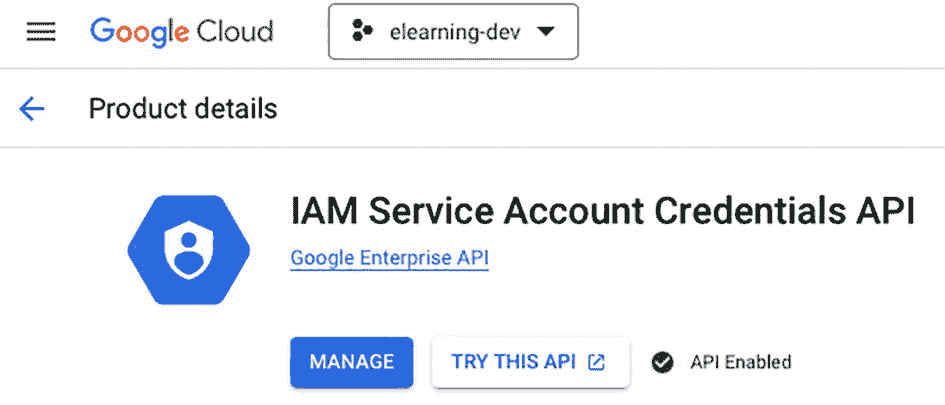

# 2. 设置开发环境

在本章中，我将重点介绍如何在 GCP 上设置 Java 开发环境。我将介绍安装 Java 开发工具包 (JDK)、集成开发环境 (IDE) 和 Google Cloud SDK 的必要步骤。我还将解释如何创建 GCP 项目、设置凭据以及为不同的 IDE 配置 GCP 插件。最后，本章提供了为 IntelliJ IDEA、Eclipse 和 Visual Studio Code 设置凭据和配置 GCP 插件的说明。

要为 GCP 设置 Java 开发环境，您需要执行以下步骤：

1.  在本地机器上安装 JDK。您可以从 Oracle 官方网站下载 JDK，或下载 Open JDK。

2.  安装您选择的 IDE，例如 Eclipse 或 IntelliJ IDEA。这些 IDE 将为编写和调试 Java 代码提供用户友好的界面。

3.  安装 Google Cloud SDK，它提供了用于与 GCP 服务交互的命令行界面。可以从 Google Cloud 网站下载 SDK。

4.  安装适用于 Java 的 Google Cloud SDK，它提供了一组用于在 GCP 上开发 Java 应用的库和工具。

5.  在您的 IDE 中创建一个新项目，并将其配置为使用适用于 Java 的 Google Cloud SDK。这将允许您在 Java 代码中使用 GCP 服务和库。

6.  在 GCP 控制台中创建一个新项目；这将为您提供访问 GCP 服务（例如 Storage、Bigtable、Datastore 等）的凭据。

7.  项目设置完成后，您可以开始编写 Java 代码与 GCP 服务进行交互。您可以使用适用于 Java 的 Google Cloud SDK 来执行诸如从 Google Cloud Storage 上传和下载数据、查询 Google Cloud SQL 或 Google Cloud Datastore 中的数据等任务。

8.  您还可以使用 GCP 服务（例如 App Engine、Kubernetes Engine 等）来部署您的 Java 应用。

注意

上述步骤可能会根据您的具体用例和要求而有所不同。


## 安装 GCP SDK 和 Java 开发工具包

Google Cloud SDK 可安装在多种操作系统上，包括 Windows、macOS 和 Linux。

你可以通过包管理器（如 `apt-get`、`yum` 等）来安装 SDK。另一种在虚拟环境中安装 SDK 的方法是使用 `gcloud` 命令行工具，将其安装到特定目录中。

以下是通过手动下载在本地机器上安装 SDK 的一般步骤：



安装程序的命令页面截图。其中包含几行关于 g cloud 版本的文本，包括 google cloud S D K、b q、core、g cloud c r c 32 c 和 g s u t I l 的版本信息。

图 2-4

检查 Cloud SDK 版本



安装程序的命令页面截图。其中包含几行用于配置 g cloud 的命令、当前配置的详细信息，以及使用 g cloud-init 跳过网络诊断的命令。最后一行是询问是否登录的是/否选项。

图 2-3

使用 `gcloud init` 命令进行初始化



安装程序的命令页面截图。其中包含几行文本，显示“欢迎使用 Google Cloud C L I”，随后是几行关于产品和其他可用资源的信息。最后一行显示 g cloud 配置的状态。

图 2-2

安装 Google Cloud CLI



页面截图显示一个包含平台、包、大小和 S H A 256 校验和四列的表格。表格有三行，对应不同平台，其中第二行第二列（Mac O S 64 位平台的包）用一个箭头标出。

图 2-1

Cloud SDK 安装程序

1.  从 Google Cloud SDK 网站下载适用于你操作系统的 Cloud SDK 安装程序。

    例如，你可以通过以下链接下载适用于 macOS M1 芯片的版本。你将看到需要下载并安装的包，如图 2-1 所示。

    [`https://cloud.google.com/sdk/docs/install`](https://cloud.google.com/sdk/docs/install)

2.  运行安装程序并按照提示安装 SDK。安装程序还会安装 `gcloud` 命令行工具，该工具用于与 GCP 服务交互，如图 2-2 所示。

3.  安装完成后，打开命令行终端并运行命令 `gcloud init` 来初始化 SDK。此命令将提示你登录 Google 账户并选择一个项目供 SDK 使用，如图 2-3 所示。

4.  通过运行命令 `gcloud version` 验证 SDK 是否正确安装。这将显示 SDK 的版本号以及其他已安装的组件，如图 2-4 所示。

注意

你可以参考 Google Cloud SDK 文档以获取最新的安装说明。

### 安装 Java (Oracle) JDK

要安装最新版本的 Oracle Java JDK，可以按照以下步骤操作：

1.  访问 Oracle 官方 Java 网站：[`https://www.oracle.com/java/technologies/javase-downloads.html`](https://www.oracle.com/java/technologies/javase-downloads.html)。

2.  点击 JDK 17.0.6 版本旁边的“下载”按钮。

3.  为你的操作系统（Windows、Mac、Linux 等）选择 JDK 版本 17.0.6。

4.  按照提示完成安装过程。

同样重要的是，你可能需要设置 `JAVA_HOME` 环境变量，并将 JDK 的 `bin` 文件夹添加到系统的 `PATH` 变量中，以便在命令行中使用 JDK。

Oracle Java JDK 是 Oracle 的专有工具。如果你正在构建一个将在生产服务器上运行的商业应用程序，你可能需要从 Oracle 获取许可证。如果你想使用开源 Java，可以安装 Open JDK 用于开发。

### 安装 Java Open JDK

要安装最新版本的 OpenJDK（Java 开发工具包的开源版本），可以按照以下步骤操作：

1.  访问任何提供 OpenJDK 的供应商网站。你可以从 [`https://adoptium.net/temurin/releases/?version=17`](https://adoptium.net/temurin/releases/%253Fversion%253D17) 下载 OpenJDK。

2.  点击相应链接，为你的操作系统（Windows、Mac、Linux 等）下载安装程序。

3.  按照提示完成安装过程。

或者，如果你的操作系统支持，你也可以通过包管理器安装 OpenJDK。例如，在基于 Ubuntu 或 Debian 的 Linux 发行版上，你可以使用代码清单 2-1 中列出的命令来安装最新版本的 OpenJDK。

```
sudo apt-get update
sudo apt-get install openjdk--jdk
代码清单 2-1
通过 Linux 包管理器安装 OpenJDK
```

你可以使用 `brew` 包管理器在 macOS 上安装 OpenJDK，如代码清单 2-2 所示。

```
brew tap AdoptOpenJDK/openjdk
brew install 
代码清单 2-2
使用 brew 包管理器安装 OpenJDK
```

同样重要的是，你可能需要设置 `JAVA_HOME` 环境变量，并将 JDK 的 `bin` 文件夹添加到系统的 `PATH` 变量中，以便在命令行中使用 JDK。

## 创建 GCP 项目并设置凭据

当你使用任何应用程序时，都需要提供你的身份或凭据才能访问它。类似地，要使用 Google Cloud Platform (GCP) 服务，你需要创建一个 GCP 项目并设置凭据。

凭据是一组访问密钥或令牌，允许你对 GCP 服务进行身份验证和授权访问。例如，API 密钥可以允许应用程序访问特定的 API，而服务账号密钥则可以授予对项目内所有资源的访问权限。

当你创建项目时，你也会创建一组凭据，你可以使用这些凭据对 GCP 服务进行身份验证和授权访问。这些凭据可以在 GCP 控制台或通过 Google Cloud SDK 进行管理。

### 创建项目

创建 GCP 项目和设置凭据是安全有效地访问和使用 GCP 服务的关键步骤。它们允许你对 GCP 服务进行身份验证和授权访问，并高效地管理你的资源。

要创建 GCP 项目，请按照以下步骤操作：

1.  访问 Google Cloud 控制台 ([`https://console.cloud.google.com/`](https://console.cloud.google.com/))。

2.  点击项目下拉菜单，选择或创建你想要使用的项目。

3.  点击汉堡菜单 (☰)，然后选择 APIs & Services ➤ Dashboard。

4.  点击页面顶部的“启用 API 和服务”按钮。

5.  搜索你想要启用的 API 并点击它。

6.  点击“启用”按钮。

7.  为该 API 设置必要的凭据，例如 API 密钥或 OAuth 客户端 ID。

8.  通过引用必要的客户端库并使用你设置的凭据，在你的应用程序中使用该 API。

或者，使用 Google Cloud SDK 通过命令行创建和管理项目。请按照以下步骤操作：

1.  安装 Google Cloud SDK。

2.  打开命令行界面 (CLI) 或终端。

3.  运行命令 `gcloud init` 来初始化 SDK。

4.  运行命令 `gcloud projects create <project-name>` 来创建一个新项目。

5.  运行命令 `gcloud projects list` 来验证项目是否已创建。

6.  最后，运行命令 `gcloud config set project <project-name>` 来设置活动项目。

现在，你可以使用 SDK 来管理你的项目，例如创建和管理资源与服务。

注意

你必须拥有有效的结算账户和创建项目的权限。


### 设置凭据

API 密钥、OAuth 客户端 ID、服务账号和用户账号都是用于对 Google Cloud Platform 上各项服务的访问进行身份验证和授权的凭据类型。这些都是证明你有权限访问 Google Cloud Platform 上特定资源的不同方式。

*API 密钥*是一个简单的字符串，用于向 GCP 服务标识你的应用。它通常用于访问不需要用户身份验证的公共数据或服务。

*OAuth 客户端 ID* 用于代表用户对访问受保护资源的用户进行身份验证和授权。它用于在你的应用和 GCP 服务之间启用单点登录（SSO）。

*服务账号*是一种特殊账号，用于以编程方式访问 GCP 服务和资源。服务账号通常用于服务器到服务器的交互和自动化。

*用户账号*是标识单个用户的账号，用于授予其对 GCP 资源的访问权限。用户账号可以通过 Google Cloud Console 创建和管理。

在 Google Cloud Platform 上设置凭据，可以让你的应用与各种 GCP 服务进行身份验证和授权。以下是在 GCP 上设置凭据的一般步骤：



服务账号创建页面的截图，包含 3 个步骤。步骤 1 是服务账号详细信息，包含账号名称、ID 和描述的文本框。步骤 2 是服务账号对项目的访问权限，步骤 3 是授予用户对服务账号的访问权限。

图 2-9

创建服务账号



凭据页面的截图，包含创建、删除和恢复已删除凭据的选项。它有一个弹出窗口，包含 4 行，分别对应 API 密钥、OAuth 客户端 ID、服务账号和“帮我选择”的详细信息，其中第二行用箭头指示。

图 2-8

OAuth 客户端 ID



凭据页面的截图，包含创建、删除和恢复已删除凭据的选项。它有一个弹出窗口，包含 4 行，分别对应 API 密钥、OAuth 客户端 ID、服务账号和“帮我选择”的详细信息，其中第一行用箭头指示。

图 2-7

API 密钥



凭据页面的截图，包含创建、删除和恢复已删除凭据的选项。它有一个表格，用于显示 API 密钥和 OAuth 2.0 客户端 ID，包含“名称”和“创建日期”两列，且没有数据行。页面底部有两行用于服务账号。

图 2-6

凭据控制面板



产品详情页面的截图。页面左侧有一个徽标，其右侧是标题“IAM 服务账号凭据 API”。页面底部有一个“管理”按钮，以及一个用于“API 已启用”的复选框。

图 2-5

服务账号凭据 API

1.  转到 Google Cloud Console ([`https://console.cloud.google.com/`](https://console.cloud.google.com/)) 并导航到你要设置凭据的项目。

2.  搜索“凭据”并打开 IAM 服务账号凭据 API，如图 2-5 所示。

然后点击“管理”。在“API 和服务”中，你可以点击“凭据”打开凭据控制面板，如图 2-6 所示。

3.  在“凭据”页面上，你可以创建不同类型的凭据，例如 API 密钥、OAuth 客户端 ID 或服务账号密钥。

4.  要创建 API 密钥，请点击“创建凭据”按钮并选择“API 密钥”，如图 2-7 所示。密钥将显示出来，你可以根据需要限制其使用。

5.  要创建 OAuth 客户端 ID，请点击“创建凭据”按钮并选择“OAuth 客户端 ID”，如图 2-8 所示。在创建客户端 ID 之前，你必须配置同意屏幕并选择应用类型。

6.  要创建服务账号密钥，请点击“创建凭据”按钮并选择“服务账号密钥”。你需要选择一个现有的服务账号或创建一个新的服务账号，然后选择密钥类型以及授予该账号的任何角色。

创建服务账号后，它将带你进入 GCP Console 上的“IAM 与管理”页面，如图 2-9 所示。

7.  凭据创建完成后，你可以通过引用必要的客户端库并使用你设置的凭据，在你的应用中使用它们。

注意

根据凭据类型和你尝试使用的服务，你可能需要先向该账号或密钥授予权限，然后才能使用它。

## 设置 IDE 并配置 GCP 插件

GCP 插件是可以添加到 IntelliJ IDEA、Eclipse 和 Visual Studio Code 等 IDE 中的软件工具，使开发者能够更轻松地直接从其开发环境与 GCP 服务进行交互。

它们提供项目设置、身份验证、调试、部署和管理 GCP 资源等功能，这有助于开发者专注于编码和开发应用，而不是设置和配置 GCP 服务。

GCP 插件使开发者无需离开开发环境即可轻松使用 GCP 服务，从而提高了他们的生产力并简化了开发流程。

有几种 IDE 非常适合为 Google Cloud Platform 开发 Java 项目。以下是一些流行的选择：

*   *IntelliJ IDEA*：这款流行的 Java IDE 为 GCP 开发提供了强大的支持，包括集成 Google Cloud SDK 以及将应用部署到 App Engine 和其他 GCP 服务。

*   *Eclipse*：Eclipse 是另一款流行的 Java IDE，它有一个用于 Google Cloud 开发的插件，允许开发者快速在 GCP 上部署和管理应用。

*   *Visual Studio Code*：Visual Studio Code 是一款轻量级且流行的代码编辑器，可用于 Java 开发。它还有一个 Google Cloud SDK 扩展，允许开发者快速在 GCP 上部署和管理应用。

最终，最适合你特定需求的 IDE 将取决于你的个人偏好和项目的具体要求。

### 配置 GCP 插件

要为你的 IDE 配置 Google Cloud Platform 插件，你需要遵循以下一般步骤：

1.  如果尚未安装，请为你的特定 IDE 安装 GCP 插件。这通常可以通过 IDE 的插件市场或仓库完成。

2.  打开 GCP 插件并登录你的 GCP 账号。

3.  使用你的项目凭据（例如项目 ID 和服务账号密钥）配置插件，并最好创建一个单独的服务账号在 IDE 中进行配置。

4.  设置你想要的 GCP 资源，例如 Cloud SQL 实例或 Kubernetes 集群。

5.  如果尚未设置，你可能还需要指定本地机器上 Google Cloud SDK 的路径。

注意

具体步骤可能因你的 IDE 和 GCP 插件的版本而异。你可以使用依赖管理器添加依赖项，而不是将 GCP 插件添加到 IDE 中。


## 总结

在本章中，你学习了为 GCP 搭建 Java 开发环境的基本步骤。你学会了安装 Java 开发工具包和自选的集成开发环境（IDE），接着安装了适用于 Java 的 Google Cloud SDK。然后，我解释了如何创建 GCP 项目，以及如何通过 Google Cloud 控制台或命令行界面设置凭据。我还介绍了如何为不同的 IDE（如 IntelliJ IDEA、Eclipse 和 Visual Studio Code）配置 GCP 插件。最后，我提供了如何为这些 IDE 设置凭据和配置 GCP 插件的说明。

以下是一些供进一步参考的资源：

*   *Google Cloud Java 客户端库*：[`https://cloud.google.com/java/docs/reference`](https://cloud.google.com/java/docs/reference)

*   *适用于 Eclipse 的 Google Cloud Tools*：[`https://cloud.google.com/eclipse/docs`](https://cloud.google.com/eclipse/docs)

*   *适用于 IntelliJ 的 Cloud Code*：[`https://cloud.google.com/code/docs/intellij/install`](https://cloud.google.com/code/docs/intellij/install)

*   *适用于 VS Code 的 Cloud Code*：[`https://cloud.google.com/code/docs/vscode/install`](https://cloud.google.com/code/docs/vscode/install)

