# 3. Google App Engine

在本章中，你将了解 Google App Engine（GAE），这是一个用于开发和部署 Web 应用及服务的全托管平台。GAE 允许开发者专注于编写代码，而无需担心底层基础设施以及随着流量增长而扩展应用的问题。本章涵盖了 GAE 的主要特性，包括支持的编程语言和框架、存储选项以及部署方法。你还将学习如何扩展和优化 GAE 应用，以应对流量变化并提升性能。最后，本章涵盖了部署和管理 GAE 应用时的安全注意事项及最佳实践。学完本章后，你将全面了解 Google App Engine 以及如何使用它来开发和部署 Web 应用。

Google App Engine 是 Google 提供的一种平台即服务（PaaS）产品，允许开发者在可扩展且安全的环境中构建和托管 Web 应用。借助 GAE，开发者可以使用标准语言和框架（如 Java、Python、Go 和 PHP）来构建 Web 应用。

GAE 的主要特性是其自动扩展能力，这使得平台能够根据应用的流量调整正在运行的实例数量。这消除了开发者自行配置和手动管理底层基础设施的需求。

Google App Engine 还提供了多种内置服务和 API，例如 Cloud Datastore（NoSQL）、Memcache 和任务队列，这些都可以轻松集成到应用中。此外，它还提供了内置的安全特性，如自动 SSL 终止以及对 OAuth 和 OpenID Connect 的支持。

GAE 还为小型应用提供免费使用层级，并对超出免费使用层级的应用进行收费。它是一个全托管平台，简化了构建和部署 Web 应用的过程，同时提供了高可扩展性、安全性和性能。

## 为何使用 Google App Engine？

在多种场景下，Google App Engine 是 Web 应用开发的绝佳选择。

*   *可扩展且高性能的 Web 应用*：GAE 的自动扩展特性确保你的应用能够处理大量用户和请求。其内置的服务和 API 可帮助你构建高性能应用。

*   *快速开发与部署*：GAE 提供了简单的流程，让开发者能够专注于编写代码，而无需担心基础设施的配置和管理。

*   *与其他 Google Cloud 服务的集成*：GAE 可与 Cloud Storage、Cloud SQL 和 BigQuery 等其他 Google Cloud 服务无缝集成，使开发者能够构建复杂的多层应用。

*   *多语言支持*：GAE 支持 Java、Python、Go、PHP 等多种语言，这使得开发者能够使用自己偏好的语言轻松构建 Web 应用。

*   *成本效益*：GAE 为小型应用提供免费使用层级，并对超出免费使用层级的应用进行收费。

GAE 的一个用例是小型企业的 Web 应用，允许客户在线下单。该应用需要在高峰时段处理大量请求，并且需要具备高可用性和可扩展性。借助 GAE，企业可以轻松构建和部署该应用。GAE 的自动扩展特性将确保应用无需额外工作即可处理大量用户。

### Google App Engine 的用例

Google App Engine 的一个良好用例是需要高可扩展性和自动管理的 Web 应用。App Engine 的 PaaS 模型允许开发者专注于为应用编写代码，而无需担心底层基础设施。它还允许轻松扩展资源以应对流量高峰，并提供内置服务，如数据存储和任务队列。此外，App Engine 与其他 Google Cloud Platform 服务集成良好，使其成为构建完整端到端解决方案的合适选择。

## 理解 Google App Engine 运行时和服务选项

Google App Engine 是一个在 Google 管理的数据中心中开发和托管 Web 应用的平台。GAE 的关键特性之一是能够为应用选择运行时。

### GAE 运行时

运行时是应用代码运行的环境，它包括特定版本的编程语言以及任何必要的库或框架。

图 3-1 展示了 GAE 当前支持的部分运行时。

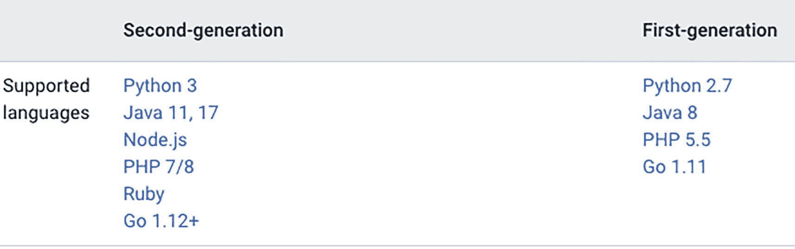

一个窗口截图，显示了一个包含两列的表格，分别对应第二代和第一代。它有一行用于支持的语言。第一列有 6 种语言，第二列有 4 种不同版本的语言。

图 3-1

GAE 支持的运行时

每种运行时都有自己的一套支持的库和框架，运行时的选择会影响应用的性能和可扩展性。

除了运行时，GAE 还提供了一组可供应用使用的服务，例如用于存储数据的数据存储、用于管理后台任务的任务队列，以及用于发送电子邮件的服务。这些服务可以通过简单的 API 进行访问，从而抽象掉底层基础设施，让开发者能够专注于编写应用代码。

GAE 还提供了对扩展、负载均衡和自动故障转移的内置支持，因此应用无需手动配置或维护即可处理大量用户和流量。

Google App Engine 运行时为开发和部署 Web 应用提供了一个灵活且易于使用的平台，具有广泛的语言和框架支持，以及用于扩展和基础设施管理的内置服务。


### GAE 服务选项

Google App Engine 提供了一系列可供平台上运行的应用使用的服务。这些服务抽象化了底层基础设施，并为访问标准功能（如数据存储和后台任务处理）提供了简单的 API。以下是 GAE 提供的一些主要服务：

*   *数据存储 (Datastore)*：这项 NoSQL 数据存储服务允许你存储和检索结构化数据。它基于 Google Cloud Datastore，并提供自动扩缩容和内置事务支持。你可以使用 Datastore API 通过多种编程语言（包括 Python、Java 和 Go）来存储和检索数据。

*   *Cloud SQL*：此服务允许你在 GAE 平台上运行完全托管的 MySQL 或 PostgreSQL 数据库。你可以使用标准 SQL 语法对数据库执行操作，并且它与其他 GAE 服务完全集成。

*   *Cloud Memorystore*：此服务为 GAE 应用提供完全托管的内存数据存储。它允许你将数据存储在内存中以实现更快的访问，并且构建在 Redis 之上。

*   *Cloud Firestore*：这项 NoSQL 文档数据库服务允许你存储、检索和查询结构化数据，并支持实时同步。其数据模型基于文档和集合，该服务提供自动扩缩容、实时更新和离线支持。

*   *Cloud Storage*：此服务允许你存储和检索大量非结构化数据，例如图像、视频和音频文件。它提供自动扩缩容，并内置对数据完整性和版本控制的支持。

*   *任务队列 (Task Queue)*：此服务允许你管理应用中的后台任务。你可以使用它来异步执行任务，例如发送电子邮件、处理图像或更新数据存储。

*   *Cloud Pub/Sub*：此服务允许你在 GAE 应用与其他 Google Cloud 服务之间发送和接收消息。它提供用于消息传递的发布-订阅模型，可用于各种场景，例如事件驱动架构和实时流处理。

*   *Cloud Endpoints*：此服务允许你轻松地为 GAE 应用构建、部署和管理 API。它内置了对身份验证、监控和日志记录等标准功能的支持。

*   *Cloud Logging*：此服务允许你收集、搜索、分析来自 GAE 应用的日志数据并设置告警。它提供来自所有 GAE 服务的日志的统一视图，并且可以与其他 Google Cloud 服务集成。

*   *Cloud Trace*：此服务允许你跟踪在 GAE 应用中传播的请求。它提供详细的性能指标，例如请求延迟和错误率，可用于识别和修复应用中的性能瓶颈。Cloud Trace 为在 GAE 上运行的应用提供分布式追踪能力。分布式追踪是一种用于跟踪请求在分布式系统的多个服务和组件中传播的技术。它允许开发者追踪请求在不同服务中的路径和性能，从而更容易地在复杂系统中识别和诊断问题。

还有其他可用的服务，例如 Cloud Translation、Cloud Natural Language、Cloud Speech-to-Text 等。这些服务中的每一个都为不同的用例提供特定功能，并且可以组合使用以构建强大、可扩展的 Web 应用。

现在，让我们在 Google App Engine 上创建并部署一个 Java Web 应用。

## 为 GAE 构建 Web 应用

在 Google App Engine 上开发 Web 应用涉及构建和部署在 Google 云基础设施上运行的 Web 应用。在 GAE 上开发 Web 应用的过程可能相对简单，特别是如果你已经熟悉 Web 开发并且对 GAE 使用的工具和技术有经验的话。

要在 GAE 上开发 Web 应用，你首先需要选择 GAE 支持的编程语言和运行时环境。GAE 支持多种编程语言，包括 Java、Python、PHP、Go 和 Node.js，并且它还提供了多种可用于运行 Web 应用的运行时环境。

一旦你选择了编程语言和运行时环境，就可以开始使用 GAE 支持的框架或库来构建你的 Web 应用。

构建完 Web 应用后，你可以使用 GAE 命令行工具或 GAE 控制台将其部署到 GAE。部署过程包括将你的 Web 应用和配置文件打包成一个部署包，然后上传到 GAE。一旦你的 Web 应用部署完成，就可以通过 GAE 提供的唯一 URL 进行访问。

Google App Engine (GAE) 提供了一系列可供平台上运行的应用使用的服务。这些服务抽象化了底层基础设施，并为访问标准功能（如数据存储和后台任务处理）提供了简单的 API。


### 创建示例 Web 应用程序

在 Google App Engine 上使用 Java 创建示例 Web 应用程序是一个相对直接的过程。不过，它确实需要一些设置和配置。以下是创建示例 Web 应用程序时可以遵循的一般步骤：

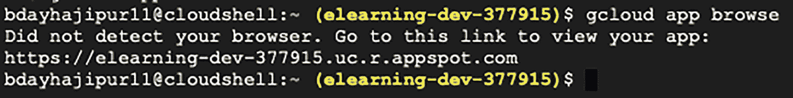

应用控制台的截图，显示了几行命令。其中包含一条浏览 g cloud 应用的命令，第二行显示一条消息，提示未检测到浏览器，随后是一个查看应用的链接，最后一行没有消息。

图 3-5

访问已部署的应用

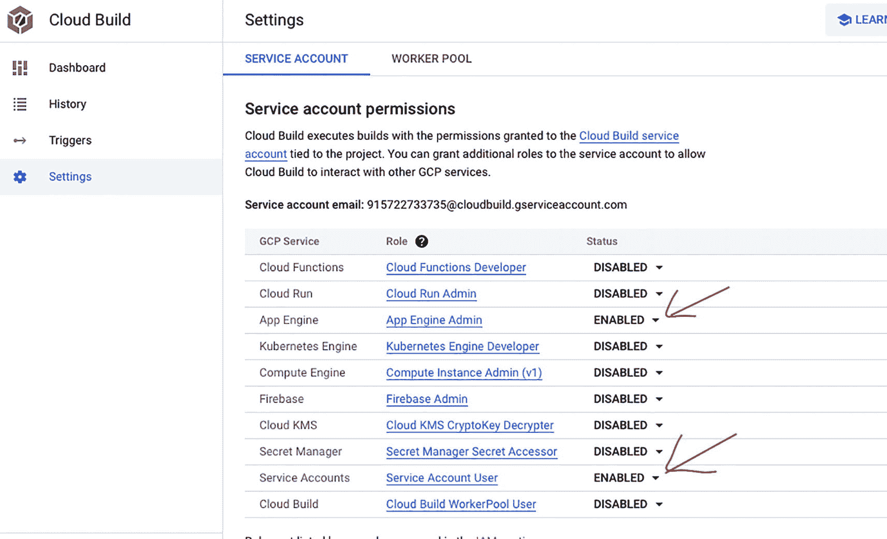

设置页面的截图。右侧选中了服务账号选项卡。其中包含一段关于服务账号权限的详细说明、一个服务账号电子邮件地址，以及一个包含三列（G C P 服务、角色和状态）的表格。

图 3-4

IAM 权限

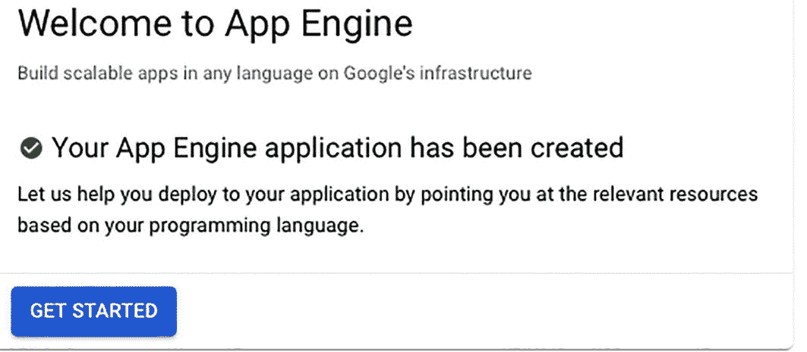

应用程序窗口的截图，显示一行文字“欢迎使用 App Engine”，随后是引擎的详细信息。它有一个复选框，显示“App Engine 应用程序已创建”，页面底部有一个“开始使用”按钮。

图 3-3

创建 App Engine 应用程序

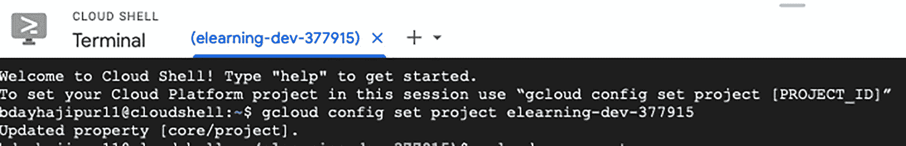

Cloud Shell 终端的截图，显示了几行文本。其中包含一条欢迎信息，以及用于获取帮助和在特定会话中设置云平台项目的不同命令。

图 3-2

Cloud Shell

1.  *安装 Google Cloud SDK*：第一步是安装 Google Cloud SDK，这是一套用于处理 GAE 和其他 Google Cloud 服务的工具。您可以从 Google Cloud 网站下载 SDK，并按照说明进行安装。

2.  *创建新项目*：安装 SDK 后，您可以使用 `gcloud` 命令行工具创建一个新项目。

*gcloud app create --project=[项目 ID]*

该项目将包含您的 Web 应用程序所需的所有资源，例如运行时、服务和配置文件。您也可以使用已创建的项目。

3.  *创建新应用程序*：创建项目后，您可以使用 `gcloud` 命令行工具在项目中创建一个新应用程序。图 3-2 显示了 Cloud Shell 终端。此应用程序将是您的 Web 应用程序代码的容器，并且会有一个唯一的 URL 供您访问。

4.  *创建新模块*：创建应用程序后，您可以在应用程序中创建一个新模块。此模块将包含您的 Web 应用程序的代码，并配置为使用 Java 运行时。

5.  *编写应用程序代码*：现在，您可以使用 Java 编写 Web 应用程序的代码。您可以使用任何喜欢的 Java 框架或库，例如 Spring 或 JSP，但您还需要使用 GAE Java SDK 来访问 GAE 提供的服务。

6.  确保您拥有所需的 IAM 权限。您可以检查 Cloud Build 设置页面，确保已启用 App Engine 管理员角色和服务账号用户角色。如果未启用，您应该启用它们，如图 3-4 所示。

7.  *部署应用程序*：代码编写完成后，您可以使用 `gcloud` 命令行工具将应用程序部署到 GAE。该工具将打包代码和配置文件，然后将其上传到 GAE 服务器，如代码清单 3-1 所示。

```
    bdayhajipur11@cloudshell:~ (elearning-dev-377915)$ gcloud app deploy
    Services to deploy:
    descriptor:                  [/home/bdayhajipur11/app.yaml]
    source:                      [/home/bdayhajipur11]
    target project:              [elearning-dev-377915]
    target service:              [default]
    target version:              [20230226t202402]
    target url:                  [https://elearning-dev-377915.uc.r.appspot.com]
    target service account:      [App Engine default service account]
    Do you want to continue (Y/n)?  y
    Beginning deployment of service [default]...
    Uploading 16 files to Google Cloud Storage
    6%
    12%
    19%
    25%
    31%
    38%
    44%
    50%
    56%
    62%
    69%
    75%
    81%
    88%
    94%
    100%
    100%
    File upload done.
    Updating service [default]...done.
    Setting traffic split for service [default]...done.
    Deployed service [default] to [https://elearning-dev-377915.uc.r.appspot.com]
    You can stream logs from the command line by running:
    $ gcloud app logs tail -s default
    To view your application in the web browser run:
    $ gcloud app browse
    bdayhajipur11@cloudshell:~ (elearning-dev-377915)$
    代码清单 3-1
    在 GAE 上部署应用程序
    ```

8.  *测试应用程序*：部署应用程序后，您可以使用应用程序的 URL 访问并测试它。您还可以使用 GAE 控制台查看日志并监控应用程序的性能，如图 3-5 所示。

您可以按照上述步骤在 GAE 上使用 Java 创建示例 Web 应用程序。该过程的具体细节将取决于您应用程序的特定要求，例如您选择的框架以及需要使用的服务。

Google 还提供了几个使用不同语言和框架的示例应用程序，您可以将其作为起点和参考。您可以在 [`https://github.com/GoogleCloudPlatform/java-docs-samples`](https://github.com/GoogleCloudPlatform/java-docs-samples) 找到它们。


### 部署 Web 应用

以下是在 Google App Engine 上部署 Web 应用的分步示例：

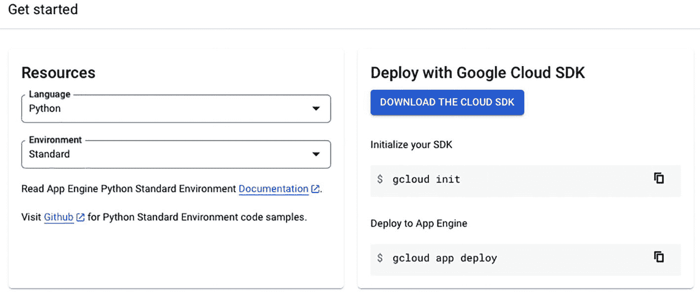

一个窗口截图，在“资源”下方有两个下拉菜单，用于选择语言和环境。右侧有一行文字：“使用 Google Cloud SDK 部署”，其后是一个下载 Cloud SDK 的按钮，以及两个选项：初始化 SDK 和部署到 App Engine。

图 3-8

应用配置

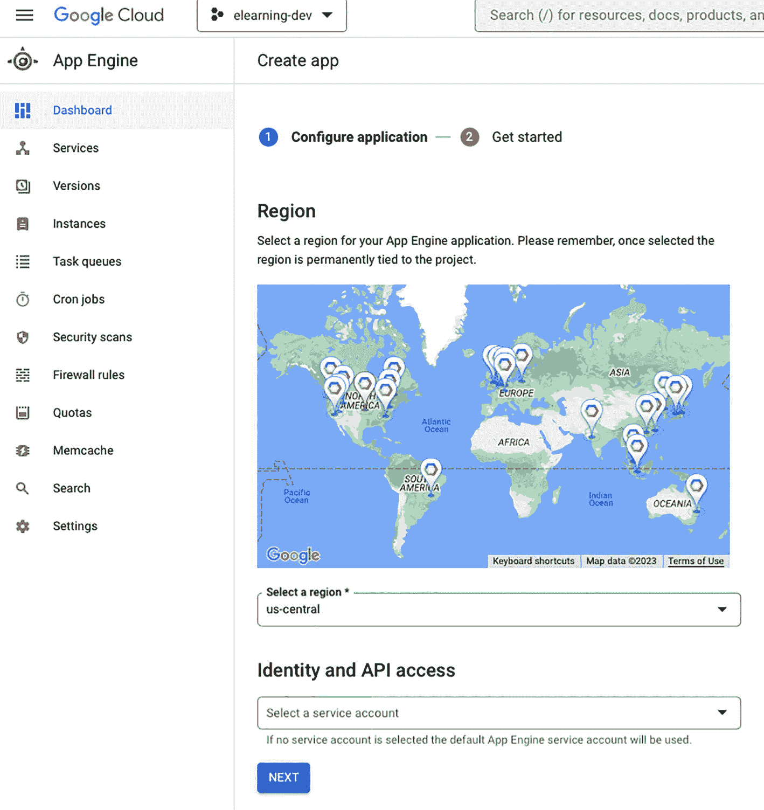

应用创建页面截图。右侧有配置应用的选项、一个带有不同标记位置的区域世界地图、一个选择区域的下拉框，以及在“身份与 API 访问”下用于选择服务账号的下拉框。

图 3-7

创建应用

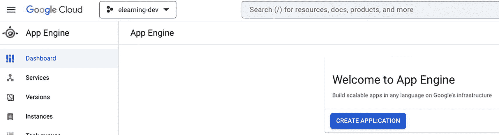

App Engine 页面截图，页面左侧选中了“仪表盘”选项。右侧有一行文字：“欢迎使用 App Engine”，其后是对该引擎的描述。页面底部有一个创建应用的按钮。

图 3-6

App Engine 仪表盘

1.  在 Google Cloud Console 中创建一个新项目，或使用现有项目。

2.  安装 Google Cloud SDK 并使用你的项目对其进行初始化（如果已完成此操作，则无需执行此步骤）。

3.  为你的 Web 应用创建一个新目录，并在命令行中导航到该目录。

    点击“创建应用”将跳转到“创建应用”仪表盘，如图 3-6 所示。

    现在选择区域和服务账号。如果未选择服务账号，则将使用默认权限，如图 3-7 所示。

    点击“下一步”按钮后，将显示应用配置屏幕，如图 3-8 所示。

    你可以选择编程语言和环境。GCP 提供的 Java 代码示例位于 GitHub：[`https://github.com/GoogleCloudPlatform/java-docs-samples`](https://github.com/GoogleCloudPlatform/java-docs-samples)。

4.  在应用的根目录中创建一个名为 `app.yaml` 的文件。该文件将包含 App Engine 应用的配置。

5.  在应用的根目录中创建一个名为 `main.py` 或 `app.py` 的文件。该文件将包含 Web 应用的代码。

6.  创建一个虚拟环境并安装应用的依赖项。

7.  运行命令 `gcloud app deploy` 来部署你的应用。

8.  部署完成后，在浏览器中导航至 `https://[YOUR_PROJECT_ID].appspot.com` 以访问你的 Web 应用。

### 部署 Java Web 应用

以下是在 Google App Engine 上部署 Java Web 应用的分步指南：

1.  在 Google Cloud Console 中创建一个新项目，或使用现有项目。

2.  安装 Google Cloud SDK 并使用你的项目对其进行初始化（如果已完成此操作，则无需执行此步骤）。

3.  为你的 Web 应用创建一个新目录，并在命令行中导航到该目录。

4.  在应用的根目录中创建一个名为 `app.yaml` 的文件。该文件将包含 App Engine 应用的配置。

5.  在应用的 `WEB-INF` 目录中创建一个名为 `web.xml` 的文件。该文件将包含 Web 应用部署描述符。

    示例应用由 GCP 提供，位于 [`https://github.com/GoogleCloudPlatform/java-docs-samples`](https://github.com/GoogleCloudPlatform/java-docs-samples)。

6.  在应用的 `WEB-INF` 目录中创建一个名为 `appengine-web.xml` 的文件。该文件将包含应用特定的 App Engine 配置。

7.  在应用的根目录中创建一个名为 `build.gradle` 的新文件。该文件将包含应用的构建配置。

8.  运行命令 `./gradlew appengineDeploy` 来部署你的应用。

9.  部署完成后，在浏览器中导航至 URL `https://[YOUR_PROJECT_ID].appspot.com` 以访问你的 Web 应用。


### 设置防火墙与安全注意事项

当您在 Google App Engine 上部署 Web 应用程序时，需要确保应用程序安全可靠，免受恶意攻击。为此，您需要采取特定的安全措施，例如设置防火墙规则以允许流量进入应用程序、使用身份感知代理控制对应用程序的访问、加密传输中和静态数据、使用 SSL 保护应用程序流量、使用 Cloud Key Management Service 保护敏感数据、保持应用程序及其依赖项更新，以及使用 App Engine 的内置安全功能来保护应用程序。遵循这些安全措施，您可以确保您的 Web 应用程序对用户来说是安全可靠的。

本节中使用的关键术语如下：

*防火墙*是一种安全系统，它根据预定义的安全规则监控和控制进出网络的流量。

*身份感知代理* (IAP) 是一种服务，用于控制对云应用和虚拟机的访问，而无需将它们暴露在互联网上。

*OAuth* 是一种授权协议，允许应用程序从第三方服务访问用户数据，而无需存储用户密码。

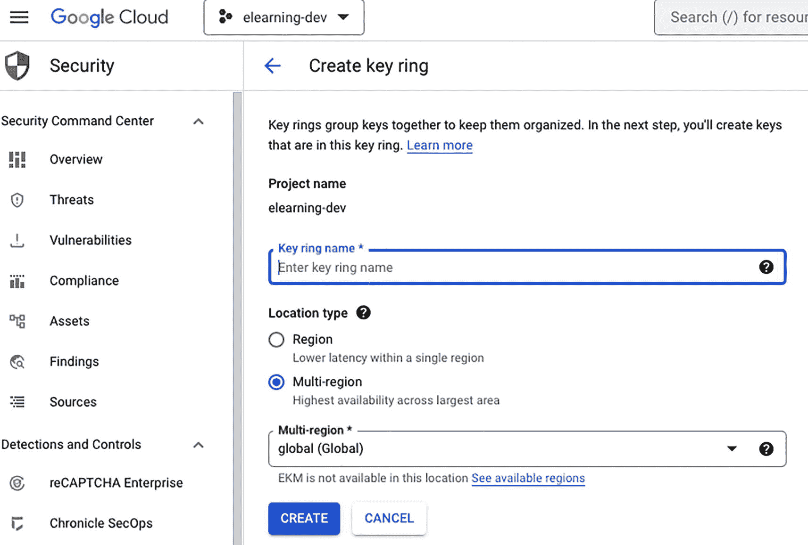

密钥环创建页面的截图。页面包含几行关于密钥环详情的文本、一个项目名称、一个用于输入密钥环名称的文本框、位置类型下的区域和多区域两个选项、一个用于选择多区域的下拉菜单，以及一个创建按钮。

图 3-14

创建密钥环

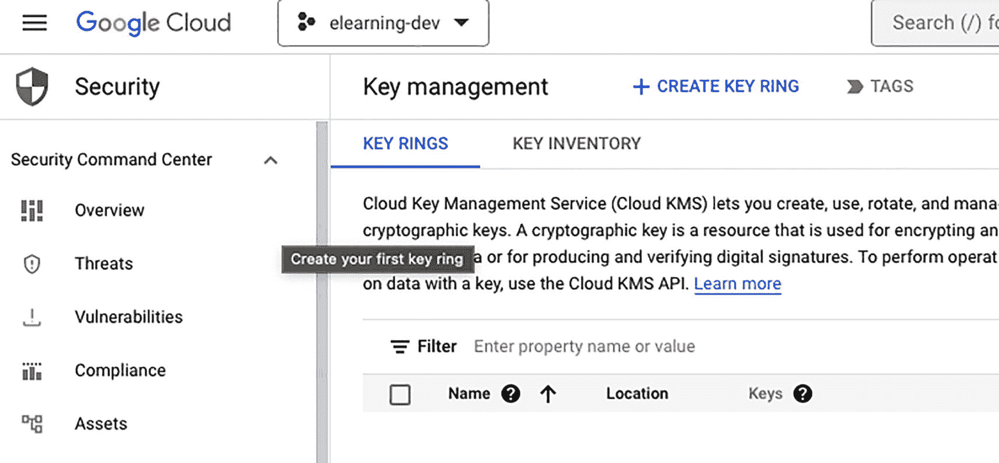

安全页面的截图。右侧在密钥管理下选中了密钥环标签，其后是一段关于密钥环描述的文本。页面包含一个用于按属性名称或值进行筛选的筛选器，以及一个包含名称、位置和密钥三列且行数为零的表格。

图 3-13

密钥管理界面

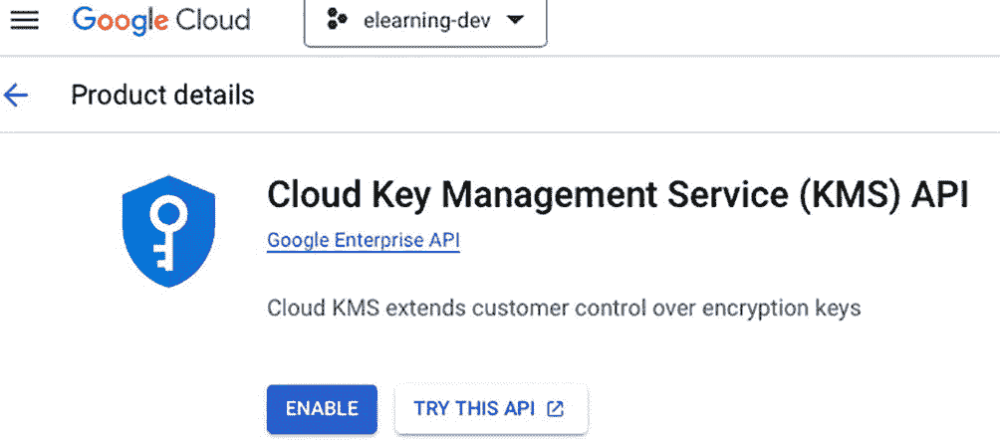

产品详情页面的截图。页面左侧有一个徽标，右侧有一个标题“Cloud Key Management Service API”。页面底部有一个启用按钮。

图 3-12

KMS API

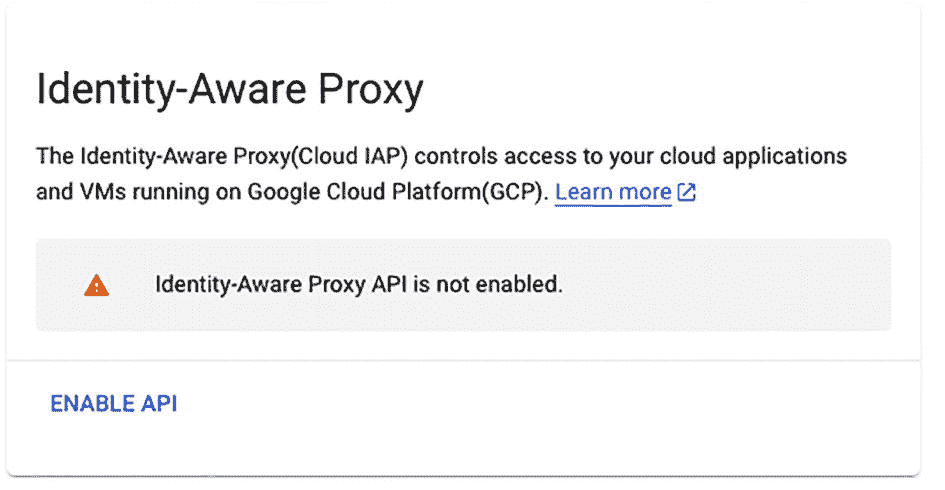

一个标题为“身份感知代理”的页面截图。页面包含几行关于代理的描述文本，其后是一条错误消息，内容为“身份感知代理 API 未启用”，以及一个用于启用该 API 的链接。

图 3-11

IAP

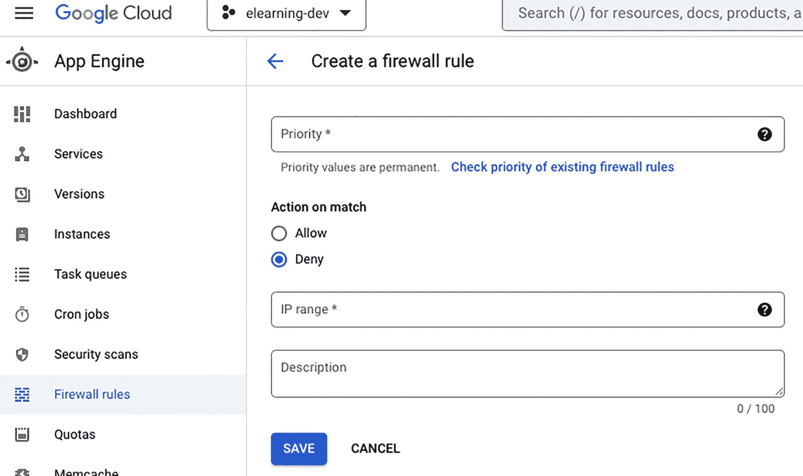

防火墙规则创建页面的截图。右侧有一个用于输入优先级的文本框、匹配时操作下的允许或拒绝两个选项、一个用于输入 IP 范围的文本框，以及一个用于输入描述的文本框。页面底部有一个保存按钮。

图 3-10

创建防火墙规则

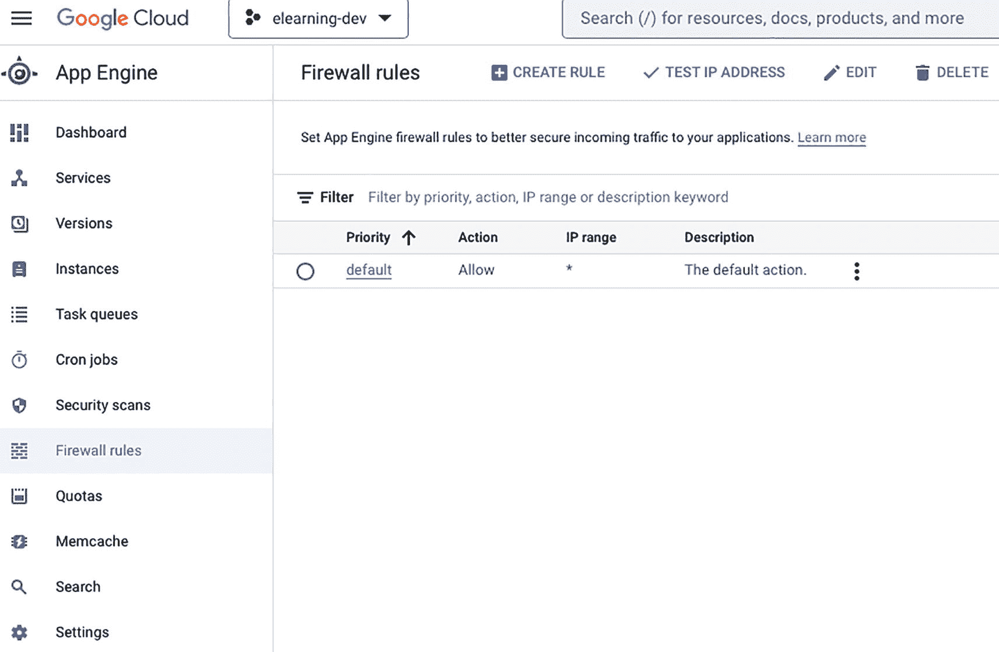

App Engine 防火墙规则页面的截图。页面说明了防火墙规则的用途，包含一个用于按优先级、操作、IP 范围或描述关键字进行筛选的筛选器，其后是一个包含一行的表格，该行显示默认优先级、允许操作、IP 范围下的星号，以及作为描述的默认操作。

图 3-9

GAE 的防火墙规则仪表板

1.  在 GCP 控制台的“防火墙规则”页面上创建防火墙规则，以允许流量进入您的 App Engine 应用，如图 3-9 所示。

2.  使用 IAP 控制对您应用的访问。

要使用它，您需要先启用 API（如果尚未启用），如图 3-11 所示。

启用后，您需要先配置 OAuth。

3.  为传输中和静态数据启用加密。

4.  使用安全套接字层 (SSL) 保护应用程序流量。

5.  使用 Cloud Key Management Service (KMS) 保护敏感数据。

如果尚未启用 KMS API，请启用它，如图 3-12 所示。

启用后，它将带您进入仪表板，如图 3-13 所示。

在仪表板中，您可以创建一个密钥环（密钥环是密钥的有组织集合）来使用它，如图 3-14 所示。

6.  保持您的应用程序及其依赖项更新。

7.  使用 App Engine 的内置安全功能（例如 App Engine 安全规则）来保护您的应用程序。

注意

上述步骤是完整的；但是，可能还有其他特定于您的应用程序或环境的步骤或注意事项。

## 扩展和优化 App Engine 应用程序

扩展和优化 Google App Engine (GAE) 应用程序涉及调整应用程序的资源和设置，以处理流量变化并提高性能。

在 GAE 上扩展应用程序是指调整正在运行的实例数量以处理流量变化。扩展 GAE 应用程序主要有两种方式：手动扩展和自动扩展。手动扩展涉及手动调整正在运行的实例数量，而自动扩展则根据应用程序的流量自动调整实例数量。

优化 GAE 应用程序涉及进行更改以提高应用程序的性能。以下是优化 GAE 应用程序的一些方法：

*   *使用缓存*：缓存可以通过减少对后端的请求次数来显著提高应用程序的性能。缓存是临时存储频繁访问的数据或内容的过程，以提高性能并减少后端负载。

*   *优化数据库*：使用索引、反规范化和其他技术来提高数据库查询的性能。提高数据库查询性能的其他技术可能包括优化数据库架构、使用高效的数据类型、优化数据库查询和事务，以及最小化检索的数据量。

*   *减少请求次数*：通过设计能够在单个 HTTP 请求中检索或操作多个相关资源的 API，或使用客户端缓存来减少往返次数，从而最大限度地减少对后端的请求次数。

*   *使用内置性能工具*：GAE 提供了多种工具来帮助您识别和修复性能问题，例如 App Engine Performance Dashboard、Cloud Trace 和 Cloud Profiler。

*   *使用合适的实例类别*：GAE 提供多种实例类别，每种类别具有不同的资源和定价。为您的应用程序选择合适的实例类别，以优化性能和成本。

*   *使用负载均衡*：使用负载均衡将流量分配到多个实例，以处理增加的流量。

*   *使用内容分发网络 (**CDN)*：CDN 可以通过缓存内容并将其更靠近最终用户交付，来帮助减少应用程序负载并提高应用程序性能。

请务必记住，扩展和优化应用程序是一个迭代过程，您可能需要进行多次更改并监控应用程序的性能，才能达到预期效果。

### 在 GAE 中设置手动和自动扩展

在 Google App Engine 上扩展 Web 应用程序是指调整正在运行的应用程序实例数量，以处理流量变化。在 GAE 上扩展 Web 应用程序主要有两种方式：手动扩展和自动扩展。

#### 手动扩展

使用手动扩展，您可以手动调整正在运行的实例数量以处理流量变化。要手动扩展 GAE 应用程序，您可以使用 Google Cloud 控制台中的 App Engine 仪表板。您可以为应用程序设置正在运行的实例数量，App Engine 将确保该数量的实例正在运行。


#### 自动缩放

自动缩放功能会自动调整运行中的实例数量，以应对流量变化。

你需要在应用的 `app.yaml` 文件中进行配置，以便在 GAE 上设置自动缩放。在此文件中，你可以设置 `automatic_scaling` 选项来配置应用的自动缩放设置。

以下是你可以为自动缩放设置的选项：

*   `min_idle_instances`：App Engine 应为你的应用维护的最小空闲实例数。
*   `max_idle_instances`：App Engine 应为你的应用维护的最大空闲实例数。
*   `min_pending_latency`：请求在启动新实例前应等待的最短时间。
*   `max_pending_latency`：请求在启动新实例前应等待的最长时间。
*   `target_cpu_utilization`：你的应用的目标 CPU 利用率。App Engine 将调整实例数量以维持此 CPU 利用率。

你还可以设置其他选项，例如 `max_concurrent_requests` 和 `max_instances`*，*以便对应用的缩放进行更精细的控制。

配置好这些选项后，App Engine 将根据应用的流量自动调整运行中的实例数量。

需要注意的是，在自动缩放模式下，App Engine 会根据流量自动调整应用的运行实例数量。但更改生效可能需要一些时间。

同样重要的是，要监控应用的行为，并根据需要调整自动缩放设置，以确保应用性能良好，并将成本控制在合理范围内。

