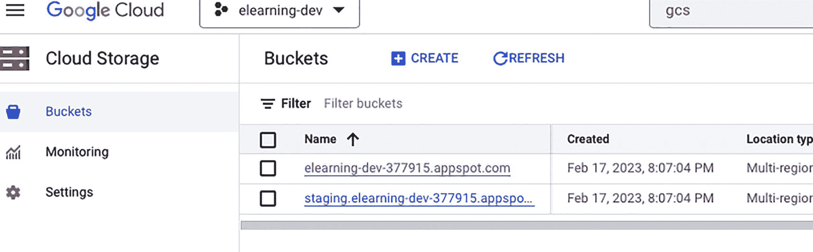
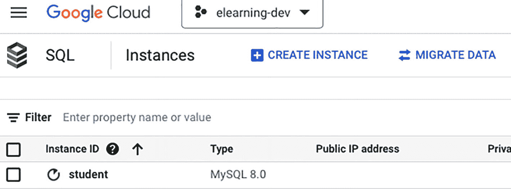
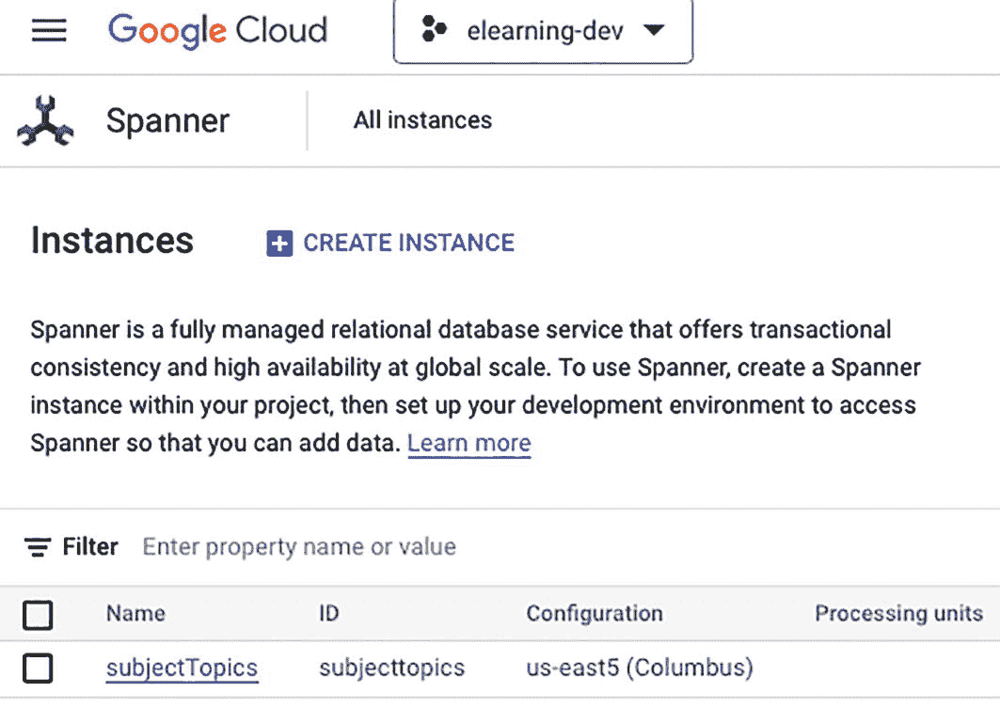
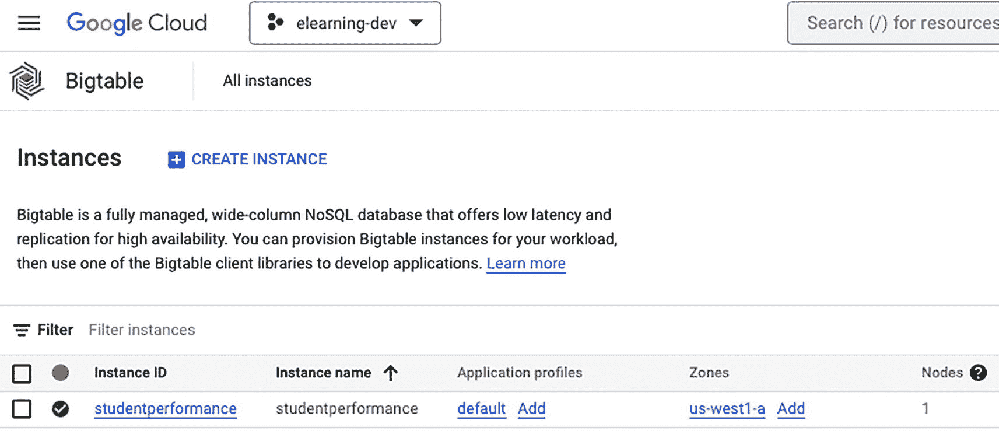
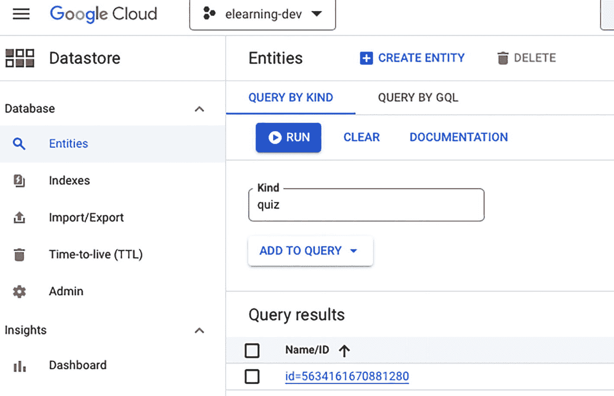
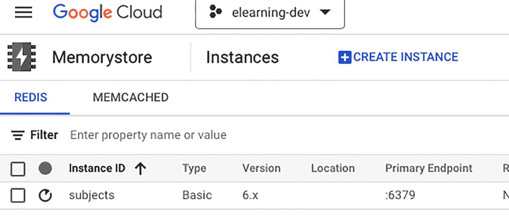

# 4. Google Cloud 中的数据存储

在本章中，我们将探讨 Google Cloud Storage (GCS) 以及如何在 Java 应用程序中使用它来存储和管理文件。GCS 是 Google Cloud Platform (GCP) 提供的一种基于云的对象存储服务，允许用户在世界任何地方存储和访问其数据。它是一种高度可扩展且可靠的存储解决方案，提供数据加密、数据持久性和数据生命周期管理等功能。

我们将从理解 GCS 的基础知识开始，包括其关键概念和特性。然后，我们将学习如何设置 GCS 存储桶、使用 GCS 进行身份验证以及安装 GCS Java 客户端库。我们还将介绍如何使用 Java 代码在 GCS 存储桶中上传、下载和管理文件。在本章结束时，你应该对如何在 Java 应用程序中使用 GCS 进行文件存储有扎实的理解。

Google Cloud 为各种用例提供了多种数据存储解决方案，包括关系型数据库、NoSQL 数据库和对象存储。这些存储解决方案旨在实现高可用性、可扩展性和可靠性，并内置了备份和恢复选项。

组织需要数据存储解决方案来有效且高效地存储和管理其数据。这些解决方案使组织能够访问、管理和分析数据，使其成为任何现代企业的重要组成部分。

随着组织生成的数据量不断增加，基于云的数据存储解决方案因其灵活性、可扩展性和成本效益而成为热门选择。Google Cloud 的数据存储解决方案旨在满足任何组织的需求，从小型初创公司到大型企业，通过提供广泛的选择，让用户可以根据其特定要求进行选择。

假设你有一个网站，用户可以在其中创建帐户并登录以访问某些功能。该网站需要存储用户信息，例如他们的姓名、电子邮件、密码和其他详细信息。你可以将这些信息存储在云数据库（如 Google Cloud Datastore）中，而不是存储在网站的服务器上。

当用户创建帐户或登录时，他们的信息会存储在云数据库中，当他们注销或离开网站时，这些信息将保持安全，并在他们下次登录时仍然可以访问。

类似地，假设你有一个需要用户输入数据的移动应用程序，例如一个健身应用，用户可以在其中跟踪他们的锻炼和进度。在这种情况下，你可以将此数据存储在云数据库（如 Google Cloud Firestore）中。这确保了数据可以在多个设备上访问，并保持安全。

使用云数据存储可以让你轻松扩展应用程序，确保数据的持久性和可用性，并提供从任何地方安全访问数据的能力。

接下来，让我们更详细地讨论 GCP 中的各种存储选项。

## 了解 GCP 中的各种存储选项

Google Cloud Platform 提供了广泛的存储选项，以满足不同的数据存储和管理需求。以下是 GCP 提供的一些关键存储选项：

*   **Cloud Storage** 是一种可扩展、经济高效的对象存储服务，支持非结构化数据存储。它可用于各种用例，例如备份和归档、数据仓库、媒体和娱乐以及 Web 和移动应用程序。
*   **Cloud SQL** 是一种完全托管的关系型数据库服务，支持流行的数据库引擎，如 MySQL、PostgreSQL 和 SQL Server。它适用于结构化数据存储，可用于各种用例，包括 Web 和移动应用程序、数据仓库以及在线事务处理 (OLTP)。
*   **Cloud Spanner** 是一种全球分布、强一致性且完全托管的关系型数据库服务，支持结构化数据存储。它适用于各种用例，例如 Web 和移动应用程序、数据仓库以及 OLTP。
*   **Cloud Bigtable** 是一种完全托管的 NoSQL 宽列数据库服务，支持结构化和半结构化数据存储。它可用于各种用例，例如 Web 和移动应用程序、数据仓库以及 OLAP。
*   **Cloud Datastore** 是一种完全托管的 NoSQL 文档数据库服务，支持结构化和半结构化数据存储。它可用于各种用例，例如 Web 和移动应用程序、数据仓库以及 OLAP。
*   **Cloud Memorystore** 是一种内存数据存储服务，支持快速数据访问。它适用于各种用例，例如 Web 和移动应用程序、数据仓库以及 OLAP。

这些存储选项中的每一个都有其独特的功能和特性。你应该根据所存储数据的类型、数据大小以及应用程序的性能和可扩展性要求，选择最适合你需求的选项。

让我们从云存储开始，更详细地了解每个选项。


### 云存储

Google Cloud Storage 是一种在云端（通过互联网）存储和访问大量数据的方式。它由 Google 管理，并设计为可扩展，这意味着它可以随着您的存储需求增长而扩展。它具有成本效益，因为您只需为使用的存储量付费。它可以存储各种类型的数据，例如视频、图像和备份。它可用于不同的目的，例如媒体和娱乐、数据仓库以及 Web 和移动应用程序。

Google Cloud Storage 中的存储桶（如图 4-1 所示）就像一个虚拟容器，您可以在其中存储文件，就像您可能使用物理容器在家中存放物品一样。这是一种在云端存储数据的安全且可扩展的方式。您可以根据需要创建、管理和删除存储桶，并控制谁有权访问您存储桶中的文件。可以把它想象成一个巨大的数字盒子，您可以将文件放入其中，然后只要有互联网连接，就可以从任何地方轻松访问这些文件。



存储桶页面的屏幕截图显示了创建或刷新存储桶的选项。它有一个用于过滤存储桶的过滤器，后跟一个包含三列（名称、创建时间和位置类型）和两行（用于不同存储桶）的表格。

图 4-1

Cloud Storage 存储桶

Cloud Storage 中的对象由一个文件以及包含对象信息（如其名称、大小、内容类型和创建时间）的元数据组成。对象可以存储在以下三种存储类别之一中：

*   *标准*：此类适用于频繁访问的数据，适合存储需要快速检索的数据。
*   *近线*：此类适用于访问频率较低的数据，适合存储可在几秒或几分钟内检索的数据。
*   *冷线*：此类适用于访问频率更低的数据，适合存储可在几小时内检索的数据。

Google Cloud Storage 是一项在线服务，允许您使用互联网从世界任何地方存储和访问数据。它提供了一个 API 和基于 Web 的界面，让您可以执行各种操作，例如上传和下载数据、管理元数据以及控制对数据的访问。

Cloud Storage 提供了多项功能来帮助您管理和保护数据，例如访问控制、版本控制、生命周期管理、数据完整性、加密、多区域位置和备份。

访问控制允许您通过向单个用户、用户组或服务账号授予权限来决定谁可以访问您的数据。版本控制允许您保留同一对象的多个版本，并在需要时恢复到早期版本。可以设置生命周期管理规则，以自动将对象转换到不同的存储类别或在特定时间段后将其删除。包括校验和在内的数据完整性技术可确保您的数据在存储和检索时不会出错。您还可以使用 Google 管理的密钥或客户管理的密钥对传输中和静态数据进行加密。Cloud Storage 还提供多区域位置功能，可将数据存储在多个区域，并提供用于数据恢复的备份。

Cloud Storage 可用于多种目的，例如备份和归档、数据仓库、媒体和娱乐、协作开发以及 Web 和移动应用程序。它是一种经济高效的存储大量数据的解决方案，并且可以根据需要扩展或缩减。

接下来，我们来谈谈 Cloud SQL。

### Cloud SQL

Google Cloud SQL 是 Google Cloud Platform 提供的一种完全托管的关系型数据库服务。它允许开发者和组织在云端创建和管理数据库，而无需配置和维护自己的硬件。Cloud SQL 支持流行的数据库引擎，例如 MySQL、PostgreSQL 和 SQL Server。

AlloyDB 是一种新推出的、完全托管的、兼容 PostgreSQL 的数据库服务，适用于要求苛刻的事务和分析工作负载。它提供企业级的性能和可用性，同时保持与开源 PostgreSQL 的 100% 兼容性。

您只需点击几下即可创建一个 Cloud SQL 实例，并选择最适合您需求的规模和配置。实例启动并运行后，您可以使用标准 SQL 命令来创建表、插入数据和查询数据库。图 4-2 显示了 Cloud SQL 实例。



SQL 实例页面的屏幕截图显示了创建实例或迁移数据的选项。它有一个用于输入属性名称或值的过滤器，后跟一个包含三列（名称、创建时间、公共 IP 地址）和一行（例如，实例 ID student）的表格。

图 4-2

Cloud SQL 实例

Cloud SQL 提供了几个关键特性和优势。

*   *自动备份*：Cloud SQL 会自动创建数据库的备份，可用于在数据丢失或损坏时恢复数据。您也可以随时创建手动备份。
*   *自动修补*：Cloud SQL 会自动将安全补丁和其他更新应用到您的数据库引擎，而无需停机。
*   *高可用性*：Cloud SQL 提供高可用性选项，例如故障转移复制和只读副本，这有助于确保您的数据库始终可用，即使在发生故障时也是如此。
*   *云原生*：Cloud SQL 设计为在云端运行，这意味着它可以利用 GCP 的可扩展性和性能。
*   *数据加密*：Cloud SQL 支持使用 Google 管理的密钥或客户管理的密钥对传输中和静态数据进行加密。
*   *与其他 GCP 服务集成*：Cloud SQL 可以轻松与其他 GCP 服务集成，例如 App Engine、Kubernetes Engine 和 Cloud Dataflow。
*   *复制和故障转移*：Cloud SQL 允许您跨多个可用区或区域为数据库设置复制和故障转移。这确保了您的数据始终可用，并防止特定可用区或区域发生灾难或中断。

您可以使用 Google Cloud Console 或 Cloud SQL API 来创建和管理 Cloud SQL 实例。Google Cloud Console 是一个基于 Web 的界面，允许您创建和管理实例、创建和管理数据库以及执行其他任务。Cloud SQL API 允许您以编程方式创建、配置和管理实例和数据库。

Cloud SQL 实例有两种类型。

*   第一代（也称为 MySQL 或 PostgreSQL）
*   第二代（也称为 MySQL 或 PostgreSQL 或 SQL Server）

Cloud SQL 实例可用于多种目的，例如：

*   为 Web 和移动应用程序存储和管理数据
*   为数据仓库和分析存储和管理数据
*   为电子商务和金融系统存储和管理数据

Cloud SQL 是一种完全托管、高可用且可扩展的关系型数据库服务，可让您轻松地在云端创建和管理数据库。它非常适合许多用例，并且可以轻松与其他 GCP 服务集成。

下一节，我们来谈谈 Cloud Spanner。


### Cloud Spanner

Cloud Spanner 是 Google Cloud Platform 提供的一种全托管、水平可扩展的关系型数据库服务。它跨多个区域提供 SQL 和事务一致性，是任务关键型全球分布式应用的理想选择。Cloud Spanner 支持自动同步复制和自动故障转移，确保高可用性和数据持久性。它还提供强一致性保证，允许即时准确地检索数据。此外，Cloud Spanner 支持使用二级索引、存储过程和触发器，并可通过 JDBC 和 ODBC 驱动程序以及 REST API 进行访问。Cloud Spanner 可与 Bigtable 和 Cloud Dataflow 等其他 Google Cloud 服务一起使用，以构建完整的数据处理管道。

您可以通过导航到 Cloud Spanner 控制台来创建 Cloud Spanner 实例。点击“创建实例”并提供详细信息，例如实例名称、实例 ID 以及您希望创建实例的区域，然后选择配置选项，例如节点数、实例类型和存储大小。最后点击“创建”即可创建 Cloud Spanner 实例。

创建 Cloud Spanner 实例后，您就可以开始使用它来存储和检索数据，如图 4-3 所示。您可以创建表并定义其架构，向表中插入数据，并使用 SQL 查询数据。



Spanner 实例页面的屏幕截图显示了一个创建实例选项。它有一个用于输入属性名称或值的筛选器，以及一个包含 4 列（名称、ID、配置和处理单元）和 1 行（主题）的表格。

图 4-3

Cloud Spanner 实例

以下是 Google Cloud Spanner 的一些主要特性：

*   *水平可扩展*：Cloud Spanner 可以自动水平扩展以处理不断增加的工作负载，无需手动分片或数据分区。
*   *全球分布*：Cloud Spanner 可以跨多个区域复制数据，为全球用户提供低延迟的数据访问。
*   *强一致性*：Cloud Spanner 提供强一致性保证，确保所有查询都返回最新的数据。
*   *自动故障转移*：Cloud Spanner 在发生故障时会自动检测并故障转移到副本，确保高可用性。
*   *SQL 支持*：Cloud Spanner 支持基于 SQL 的查询语言，使熟悉 SQL 的开发人员能够轻松使用该服务。
*   *二级索引*：Cloud Spanner 支持使用二级索引，这可以提高查询性能并实现更高效的数据检索。
*   *存储过程和触发器*：Cloud Spanner 支持存储过程和触发器，允许进行复杂的数据处理和操作。
*   *通过 JDBC/ODBC 访问*：Cloud Spanner 可通过 JDBC 和 ODBC 驱动程序访问，便于与各种编程语言和框架集成。

现在我们将讨论 Cloud Spanner 的用例。

#### Cloud Spanner 的用例

Google Cloud Spanner 可用于多种用例；以下是一些示例：

*   *在线事务处理 (OLTP)*：Cloud Spanner 非常适合需要强一致性保证和低延迟的 OLTP 工作负载，例如电子商务、金融和医疗保健应用。例如，电子商务公司可以使用 Cloud Spanner 处理数百万客户订单和金融交易，确保数据始终是最新且准确的。与 MySQL 或 PostgreSQL 等其他数据库相比，Cloud Spanner 提供更强的一致性保证，并能处理更大的工作负载。
*   *游戏*：Cloud Spanner 可以处理大量并发玩家和实时数据更新，使其适用于需要高可用性和低延迟的游戏应用。例如，移动游戏开发者可以使用 Cloud Spanner 存储和检索玩家数据及游戏状态，确保游戏始终可用且响应迅速。与 NoSQL 数据库等其他数据库相比，Cloud Spanner 提供更强的一致性保证，并能处理更大的工作负载。
*   *物联网 (IoT)*：Cloud Spanner 可以处理来自 IoT 设备的高速数据流，并近乎实时地处理和分析这些数据。例如，制造公司可以使用 Cloud Spanner 存储和检索其生产线的传感器数据，从而实时监控和优化生产。与时序数据库等其他数据库相比，Cloud Spanner 提供更强的一致性保证，并能处理更大的工作负载。
*   *媒体与娱乐*：Cloud Spanner 可以处理高流量工作负载，并存储和提供大量多媒体数据，使其适用于媒体和娱乐应用。凭借其强一致性保证、可扩展性和全球分布式架构，Cloud Spanner 可以为全球受众提供对多媒体数据的可靠快速访问。
*   *广告技术*：Cloud Spanner 可以处理高流量和高速数据流，使其适用于需要实时数据处理和分析的广告技术应用。
*   *供应链管理*：Cloud Spanner 可以处理大量数据并提供供应链的实时可见性，使其适用于供应链管理应用。例如，物流公司可以使用 Cloud Spanner 实时跟踪和管理库存、货运和物流。与传统关系型数据库等其他数据库相比，Cloud Spanner 提供更强的一致性保证，并能处理更大的工作负载。
*   *医疗保健*：Cloud Spanner 可以处理大量患者数据并提供实时访问，使其适用于电子健康记录 (EHR) 系统等医疗保健应用。
*   *金融科技*：Cloud Spanner 可以处理大量金融交易并提供对这些数据的实时访问，使其适用于交易平台和欺诈检测系统等金融科技应用。

下一节我们将讨论 Cloud Bigtable。


### Cloud Bigtable

Google Cloud Bigtable 是 Google Cloud Platform 提供的一种全托管、高性能的 NoSQL 数据库服务。它专为处理海量数据和高流量工作负载而设计，其底层技术正是支撑 Google 搜索和 Google Analytics 等 Google 服务的技术。它旨在提供低延迟的快速性能，并且基于与 Google 搜索和 Analytics 等 Google 服务相同的技术。作为一种 NoSQL 数据库，它可以存储和管理各种非结构化和半结构化数据，例如时间序列数据、机器生成的日志和社交媒体数据。Cloud Bigtable 是一项全托管服务，这意味着 Google 负责该服务的基础设施、安全性和维护，因此您可以专注于使用它来存储和分析数据。

您可以通过点击仪表板上的“创建实例”按钮来创建一个 Bigtable 实例。您需要提供实例的名称以及要在实例中使用的节点数量，然后点击“创建”。图 4-4 展示了 Bigtable 实例。



Bigtable 实例页面的截图显示了一个创建实例的选项。它有一个用于筛选实例的过滤器，后面是一个包含 4 列（实例 ID、实例名称、应用配置文件、区域和节点）和 1 行（ID 为 student performance）的表格。

图 4-4
Bigtable 实例

以下是 Cloud Bigtable 的一些关键特性：

*   *水平可扩展*：Cloud Bigtable 可以自动水平扩展以处理不断增加的工作负载，无需手动分片或数据分区。
*   *低延迟*：Cloud Bigtable 提供低延迟的数据访问，使其适用于高流量工作负载，例如实时分析和服务大量数据。
*   *高性能*：Cloud Bigtable 针对高性能数据访问进行了优化，使其适用于大规模数据处理和分析。
*   *列族数据模型*：Cloud Bigtable 使用针对高性能数据访问优化的列族数据模型，非常适合存储和检索大量数据。
*   *自动数据压缩*：Cloud Bigtable 会自动压缩数据，从而减少所需的存储空间并提高性能。
*   *自动故障转移*：Cloud Bigtable 会在发生故障时自动检测并故障转移到副本，从而确保高可用性。
*   *云原生*：Cloud Bigtable 是一项云原生服务，这意味着它专为在云上运行而设计，并且可以利用云的弹性和可扩展性。
*   *通过 HBase API 访问*：可以通过 HBase API 访问 Cloud Bigtable，这使得它易于与各种编程语言和框架集成。

我们将在下一节讨论 Cloud Bigtable 的用例。

#### Cloud Bigtable 的用例

Google Cloud Bigtable 可用于各种用例，并且最适合高性能、大规模的数据处理和存储。以下是一些示例：

*   *实时分析*：Cloud Bigtable 非常适合实时分析和数据处理，例如跟踪和分析网站流量、社交媒体数据和传感器数据。例如，一家公司可以使用 Cloud Bigtable 实时跟踪和分析客户互动，从而做出数据驱动的决策并改善客户体验。
*   *物联网 (IoT)*：Cloud Bigtable 非常适合处理来自物联网设备（例如传感器数据）的大量数据，并且可以近乎实时地处理和分析这些数据。例如，一家制造公司可以使用 Cloud Bigtable 存储和检索其生产线上的传感器数据，从而实时监控和优化生产。
*   *游戏*：Cloud Bigtable 可以处理大量并发玩家和实时数据更新，使其适用于需要高性能和低延迟数据访问的游戏应用。例如，移动游戏开发者可以使用 Cloud Bigtable 存储和检索玩家数据及游戏状态，确保游戏始终可用且响应迅速。
*   *广告技术*：Cloud Bigtable 非常适合处理大量数据并为广告技术提供实时可见性，例如存储和分析广告展示、竞价请求和其他广告相关数据。例如，广告网络可以使用 Cloud Bigtable 跟踪和分析广告效果，从而做出数据驱动的决策并改进广告定向。
*   *基因组数据*：Cloud Bigtable 非常适合处理大规模基因组数据并提供数据的实时可见性。例如，一家生物技术公司可以使用 Cloud Bigtable 存储和分析基因组数据，从而做出数据驱动的决策并改进其研究。

Cloud Bigtable 最适合高性能、大规模的数据处理和存储。它非常适合需要实时数据访问和处理、低延迟数据访问以及高可用性的用例。

在下一节中，我们将讨论 Cloud Datastore。


### Cloud Datastore

Google Cloud Datastore 是一项完全托管的 NoSQL 文档数据库服务，是 Google Cloud Platform 的一部分。它旨在帮助开发人员为其 Web 和移动应用程序存储和管理结构化数据。作为一种 NoSQL 数据库，它提供了一种灵活且可扩展的解决方案，用于以非关系格式存储数据。这意味着 Datastore 可以处理不同的数据类型和结构，例如嵌套数据和数组，这对于存储无法整齐地放入传统关系数据库的数据非常有用。

Datastore 是完全托管的，这意味着 Google 负责该服务的底层基础设施、安全性和维护。这使得开发人员可以专注于构建他们的应用程序，并使用 Datastore 来存储和检索数据。Datastore 也是可扩展的，允许开发人员从少量数据开始，然后随着应用程序的增长进行扩展。

Datastore 用于许多不同类型的应用程序，例如电子商务、社交媒体和游戏。它特别适用于需要存储和查询大量结构化数据的应用程序，例如用户配置文件或产品目录。此外，Datastore 还提供索引和查询等功能，使开发人员能够快速轻松地搜索和过滤数据。

要创建 Google Cloud Datastore 实例，请打开 Datastore 仪表板，并通过提供实例名称和存储类型来创建一个实例，如图 4-5 所示。

创建 Datastore 实例后，您可以使用 Google Cloud Datastore API 或 Cloud Console 访问它。您可以使用 API 执行读取和写入数据、管理索引以及控制对数据的访问等操作。Cloud Console 提供了一个基于 Web 的界面，允许您通过图形用户界面与数据进行交互。



一个 Datastore 页面的截图，其中包含一个创建实体的选项，后面是一个按种类查询的选项卡。它有一个运行按钮、一个输入种类的文本框、一个用于添加到查询的下拉菜单，以及查询结果下的名称或 ID 列。

图 4-5

Cloud Datastore

以下是 Cloud Datastore 的一些关键特性：

*   *无模式数据模型*：Cloud Datastore 使用无模式数据模型，这意味着它不对数据强制执行固定模式，从而在数据结构方面提供了更大的灵活性。

*   *自动分片*：Cloud Datastore 自动对数据进行分片，以处理不断增加的工作负载，而无需手动分区数据。Datastore 使用键的值生成一个哈希值，该哈希值决定实体存储在哪个服务器上。Datastore 使用的哈希函数旨在将实体均匀分布在各个服务器上，以确保负载均衡和最佳性能。

*   *高可用性*：Cloud Datastore 自动将数据复制到多个数据中心，以确保高可用性，即使在发生故障时也是如此。它为区域实例提供 99.99% 的服务等级协议 (SLA)，为多区域实例提供 99.999% 的 SLA。

*   *云原生*：Cloud Datastore 是一项云原生服务，这意味着它专为在云上运行而设计，并且可以利用云的扩展性和弹性。

*   *通过 Google Cloud SDK 访问*：Cloud Datastore 可以通过 Google Cloud SDK 访问，这使得它易于与各种编程语言和框架集成。

*   *一致性*：Cloud Datastore 支持强一致性和最终一致性。

*   *数据类型*：Cloud Datastore 支持多种数据类型，包括字符串、整数、浮点数、日期和二进制数据。

Cloud Datastore 可用于各种用例，例如 Web 和移动应用程序、游戏、物联网、电子商务等。它最适合需要灵活且可扩展的数据存储，且不需要复杂 SQL 查询或高级索引的用例。

接下来，我们将讨论 Cloud Datastore 的用例。

#### Cloud Datastore 的用例

Cloud Datastore 是 Google Cloud Platform 提供的一种 NoSQL 文档数据库，用于在云中存储和查询数据。它旨在处理大量结构化和半结构化数据。它非常适合涉及存储和查询大量数据且需要高可用性和低延迟的用例。

Cloud Datastore 的一个示例用例是社交媒体应用程序，它需要存储和检索用户配置文件、帖子和评论。每个用户配置文件、帖子和评论的数据都可以作为单独的文档存储在 Cloud Datastore 中。该应用程序可以使用 Cloud Datastore 的查询功能来检索特定用户或用户组的数据。

Cloud Datastore 的另一个示例用例是电子商务应用程序，它需要存储和检索产品信息和客户订单。每个产品和客户订单的数据都可以作为单独的文档存储在 Cloud Datastore 中。该应用程序可以使用 Cloud Datastore 的查询功能来检索特定产品或产品组的数据。

Cloud Datastore 是这些用例的不错选择，因为它提供了一种灵活且可扩展的解决方案，用于在云中存储和查询数据。它可以处理大量数据，并根据需要自动扩展或缩减以满足应用程序的性能和可用性要求。此外，Cloud Datastore 提供强一致性保证、自动索引和内置事务支持，这使其非常适合涉及存储和查询大量数据且需要高可用性和低延迟的用例。

Datastore 可用于各种用例，包括以下内容：

*   为 Web 和移动应用程序存储和检索用户数据。

*   存储和查询数据以进行分析和报告。

*   为机器学习和人工智能应用程序存储和检索数据。

*   为数据湖和数据仓库存储和管理元数据。

*   为物联网应用程序存储和管理时间序列数据。在物联网应用程序中，时间序列数据可以包括传感器数据、日志和其他需要实时收集、分析和存储的机器生成数据。

*   为实时和离线处理存储和管理数据。

*   为备份和灾难恢复存储和管理数据。您可以使用它来存储应用程序中关键数据的备份副本，例如配置文件、用户数据和日志。您还可以使用 Datastore 跨多个区域复制数据，以确保在发生灾难时的数据持久性和高可用性。

*   为内容管理系统存储和管理数据。

*   为电子商务和在线市场存储和管理数据。

*   为游戏和社交媒体平台存储和管理数据。

Cloud Datastore 可以通过多种不同的方式和技术实现，例如数据库、云存储，甚至简单的文件系统。

在下一节中，我们将讨论 Cloud Memorystore。


### Cloud Memorystore（云内存存储）

Cloud Memorystore 是 Google Cloud Platform 提供的一种全托管式内存数据存储服务。它基于开源的 Redis 协议，能够实时存储、检索和操作数据。

您可以通过在 Memorystore 控制面板上点击“创建实例”来创建 Memorystore 实例。您可以选择 Redis Memorystore 选项，选择实例位置和内存大小，并为实例命名，如图 4-6 所示。



内存存储页面的截图显示了创建实例的选项，随后是选中 Redis 的选项卡。它有一个用于输入属性名称或值的筛选器，一个包含实例 ID、类型、版本、位置和主端点这 5 列以及 1 行主题 ID 的表格。

图 4-6

Cloud Memorystore（云内存存储）

Cloud Memorystore 专为需要低延迟、高吞吐量数据访问的场景而设计，例如游戏、实时分析和会话管理。它既可以用作频繁访问数据的缓存，也可以用作实时数据处理的主数据存储。

以下是 Cloud Memorystore 的一些特性：

*   自动故障转移和复制，以实现高可用性和灾难恢复
*   纵向扩展和缩减能力，以应对工作负载的变化
*   对静态数据和传输中数据进行加密
*   与其他 GCP 服务集成，例如 Cloud Load Balancing、Cloud Firewall 以及 Cloud Monitoring and Logging

Cloud Memorystore 还提供两个服务层级。

*   *标准层级*：在性能和成本之间取得平衡，每个实例最大存储容量为 30 GB。
*   *Memorystore for Redis*：提供更高级别的性能和更大的存储容量，最高可达 100 TB。

它对于游戏、实时分析、会话管理、缓存等多种应用场景都很有帮助。

我们来谈谈 Memorystore。

#### Memorystore 的特性

以下是 Google Cloud Memorystore 的一些主要特性：

*   *内存数据存储*：Cloud Memorystore 是一种内存数据存储，它将数据存储在随机存取存储器 (RAM) 中，提供低延迟和高吞吐量的数据访问。
*   *Redis 兼容性*：Cloud Memorystore 基于开源的 Redis 协议，并与 Redis 客户端、命令和数据结构兼容。
*   *自动故障转移和复制*：Cloud Memorystore 会自动跨多个区域复制数据，以实现高可用性和灾难恢复。
*   *纵向扩展和缩减能力*：Cloud Memorystore 可以自动纵向扩展或缩减，以应对工作负载的变化。
*   *加密*：Cloud Memorystore 对静态数据和传输中数据进行加密，以提供额外的安全层。
*   *与其他 GCP 服务集成*：Cloud Memorystore 可以与其他 GCP 服务集成，例如 Cloud Load Balancing、Cloud Firewall 以及 Cloud Monitoring and Logging。
*   *标准层级和 Memorystore for Redis 层级*：Cloud Memorystore 提供两个服务层级：标准层级和 Memorystore for Redis 层级。标准层级在性能和成本之间取得平衡，而 Memorystore for Redis 层级则提供更高级别的性能和更大的存储容量。
*   *灵活的部署选项*：Cloud Memorystore 可以部署在本地、混合环境或云端。
*   *Cloud Memorystore for Firebase*：Cloud Memorystore for Firebase 允许从 Firebase 客户端 SDK 快速安全地访问 Cloud Memorystore，从而实现实时数据访问和轻松扩展。
*   *监控和日志记录*：Cloud Memorystore 提供详细的监控和日志记录功能，帮助您了解数据存储的性能和使用情况。

接下来，我们将在下一节讨论 Memorystore 的使用场景。

##### Memorystore 的使用场景

Cloud Memorystore 可用于多种场景；以下是一些示例：

*   *缓存*：Cloud Memorystore 可用作频繁访问数据的缓存，例如网页内容、图像和会话数据。将数据缓存在内存中可以显著减少响应时间，并提高应用程序的整体性能。
*   *游戏*：Cloud Memorystore 可以实时存储游戏状态、玩家数据和排行榜。其低延迟和高吞吐量的特性使其非常适合处理游戏应用中的大量数据和高并发需求。
*   *实时分析*：Cloud Memorystore 可以实时存储和处理大量数据。这对于日志分析、欺诈检测和客户行为跟踪等场景非常有用。
*   *会话管理*：Cloud Memorystore 可以存储 Web 应用程序的会话数据。将会话数据存储在内存中可以提高应用程序的性能和可扩展性。
*   *电子商务*：Cloud Memorystore 可以存储和检索电子商务应用程序的数据，例如产品信息、用户资料和购物车数据。
*   *物联网*：Cloud Memorystore 可以存储和管理物联网应用的时间序列数据，例如传感器数据、设备状态和遥测数据。
*   *社交媒体*：Cloud Memorystore 可以存储和检索社交媒体平台的数据，例如用户资料、帖子和评论。
*   *用户会话数据*：Cloud Memorystore 可以存储用户会话数据，例如用户资料、购物车和订单历史。
*   *用作消息代理*：Cloud Memorystore 也可以用作消息代理，这有助于解耦消息的发送者和接收者。它还有助于实现发布-订阅模式，即向所有订阅者发送消息。

根据您应用程序的具体需求，Cloud Memorystore 还有许多其他用途。

现在您应该对 Cloud SQL 和 Cloud Spanner 有了更好的理解。让我们在下一节中对两者进行比较。


### Cloud SQL 与 Cloud Spanner 对比

决定为您的应用选择 Cloud SQL 还是 Cloud Spanner，可能取决于多种因素，包括您的数据模型、性能需求以及用例。以下是决策时需要考虑的几个关键点：

*   *数据模型*：Cloud SQL 是一种关系型数据库管理系统 (RDBMS)，使用表、行和列来组织数据。它最适合需要传统关系数据模型的应用。另一方面，Cloud Spanner 是一种全球分布式的关系型数据库服务，它结合了关系型和非关系型数据模型。它最适合需要高度可扩展、全球分布式数据模型的应用。

*   *性能*：Cloud SQL 是那些需要高性能但无需全球扩展的应用的不错选择。而 Cloud Spanner 则是需要高性能和全球可扩展性的应用的理想选择。

*   *用例*：Cloud SQL 通常用于读写流量适中的中小型应用，并能处理结构化和半结构化数据。Cloud Spanner 通常用于读写流量高的大型应用，并能处理结构化和半结构化数据。

*   *一致性与可用性*：Cloud SQL 提供最终一致性，最适合能容忍一定程度不一致性的用例。而 Cloud Spanner 提供强一致性，最适合需要强一致性的用例。Cloud Spanner 的强一致性和自动故障转移功能使其非常适合需要高可用性和灾难恢复的应用。

*   *成本*：Cloud Spanner 比 Cloud SQL 昂贵得多。这是因为 Cloud Spanner 提供了额外的特性和功能，例如全球可扩展性、强一致性和自动故障转移。

最适合您应用的选择可能取决于多种因素。建议根据您的具体用例，全面评估这两个选项，然后做出最符合您业务需求的决策。为了充分利用 Cloud Spanner 的能力，应用应设计为无状态并部署在多个区域。Cloud Spanner 旨在提供强一致性和高可用性，这意味着它可以跨多个区域处理实时数据操作。这要求应用具备处理来自任何区域请求的能力，并能够通过故障转移到另一个区域来从一个区域的故障中恢复。通过设计应用以利用 Cloud Spanner 的能力，组织可以实现高可用、全局一致且可扩展的系统。

现在，我们来谈谈在哪些情况下应该使用 Cloud Spanner 而非 Cloud SQL。

#### 何时使用 Cloud Spanner 而非 Cloud SQL

一个 Cloud Spanner 可能比 Cloud SQL 更合适的真实用例是大型全球电子商务平台。

电子商务平台必须同时处理大量事务和用户查询，以及海量数据。它需要全球可用并能处理数据不一致性。此外，它需要确保客户的财务信息始终安全可用，并且客户的订单能被正确处理。

在这种情况下，Cloud Spanner 可能是一个很好的选择，因为它提供全球分布式数据存储，允许平台跨多个区域存储数据，并自动复制数据以实现高可用性和灾难恢复。它还提供强一致性，确保所有数据库节点同时看到相同的数据。当应用需要跨所有节点获得一致的数据视图时，这非常有用。这对于电子商务平台至关重要，因为它需要为客户财务信息和订单维护单一事实来源。

另一方面，Cloud SQL 可能不是此用例的最佳选择，因为它无法提供与 Cloud Spanner 相同级别的全球可扩展性和强一致性。此外，Cloud Spanner 不具备相同的安全特性和自动故障转移能力。

在这个例子中，电子商务平台将从 Cloud Spanner 的全球可扩展性和强一致性中受益，这将使其能够处理海量数据，确保数据可用性和一致性，并为客户提供一个安全可靠的平台。

在下一节中，我们将讨论在哪些情况下使用 Cloud SQL 比 Cloud Spanner 更好。

#### 何时使用 Cloud SQL 而非 Cloud Spanner

一个 Cloud SQL/AlloyDB 可能比 Cloud Spanner 更合适的真实例子是，当一个小型非营利组织需要存储和管理其捐赠者信息时。该组织可能只有少量捐赠者，需要存储的数据包括捐赠者姓名、联系方式、捐赠历史和捐赠偏好等基本信息。该组织的网站流量可能适中，任何时候只有少量捐赠者更新信息或进行捐赠。

在这种情况下，Cloud SQL 比 Cloud Spanner 更合适，因为该组织的需求相对简单，不需要 Cloud Spanner 提供的高可扩展性和全局一致性功能。Cloud SQL 提供了一个熟悉且易于使用的关系型数据库管理系统，可以处理该组织适中的流量，而且该组织的预算可能无法支持 Cloud Spanner 的相关成本。此外，该组织可能没有太多数据库经验，因此使用 Cloud SQL 会不那么令人生畏，也更容易管理。

另一个例子是，一个仅服务于特定区域客户的小型电子商务网站，可能不需要 Cloud Spanner 提供的全球可扩展性和高可用性。相反，Cloud SQL 可能是存储和管理其数据更具成本效益且更简单的选择。

如果应用的数据是结构化的，并且不需要复杂的事务或严格的一致性保证，那么 Cloud SQL 也是一个不错的选择。Cloud SQL 是一种完全托管的关系型数据库服务，支持 MySQL 和 PostgreSQL 等流行的数据库引擎，对于熟悉这些技术的开发人员来说，这是一个直接明了的选择。

简而言之，对于需要存储和管理相对简单的结构化数据、读写操作规模较小的组织来说，Cloud SQL 是一种经济高效且易于使用的选择。它适用于预算和数据库管理专业知识有限，且组织需求不像大型企业那样苛刻的情况。

如果您的应用需要复杂的 SQL 查询或涉及大量的表连接，那么 Cloud SQL 可能更合适。此外，如果您的应用需要支持 Cloud Spanner 当前不可用的某些数据库功能，例如存储过程或用户定义函数，那么 Cloud SQL 可能是更好的选择。

在下一节中，我们将比较 Cloud Spanner 与 Cloud Datastore。


### Cloud Spanner 与 Cloud Datastore 对比

在为您的应用选择 Cloud Spanner 还是 Cloud Datastore 时，取决于多种因素，包括您的数据模型、性能需求以及使用场景。以下是一些需要考虑的关键点：

*   *数据模型*：Cloud Spanner 可配置为全球分布式关系型数据库服务，融合了关系型和非关系型数据模型。它最适合需要高度可扩展、全球分布式数据模型和结构化数据的应用。另一方面，Cloud Datastore 是一种 NoSQL 文档数据库服务，采用灵活的分层数据模型。它最适合需要灵活、非规范化数据模型以及半结构化或非结构化数据的应用。

*   *性能*：Cloud Spanner 是那些需要高性能但无需全球扩展的应用的理想选择。而 Cloud Datastore 则适合需要高性能和全球可扩展性的应用。

*   *使用场景*：Cloud Spanner 通常用于具有高读写流量的大型应用，并能处理结构化数据。Cloud Datastore 通常用于读写流量适中的中小型应用，并能处理半结构化和非结构化数据。

*   *一致性与可用性*：Cloud Spanner 提供强一致性，最适合需要强一致性的场景。而 Cloud Datastore 提供最终一致性，最适合能够容忍一定程度不一致性的场景。Cloud Spanner 的强一致性和自动故障转移功能使其非常适合需要高可用性和灾难恢复的应用。

*   *成本*：Cloud Spanner 通常比 Cloud Datastore 更昂贵。这是因为 Cloud Spanner 提供了额外的特性和功能，例如全球可扩展性、强一致性和自动故障转移。

最适合您应用的选择可能取决于多种因素。建议根据您的具体使用场景，全面评估这两种方案，并做出最符合您业务需求的决策。

在下一节中，我们将讨论在哪些情况下应优先使用 Cloud Datastore 而非 Cloud Spanner。

#### 何时使用 Cloud Datastore 而非 Cloud Spanner

Cloud Datastore 是一种 NoSQL 文档数据库，适用于存储和检索半结构化数据，例如 JSON 或 XML 文档。它是一种完全托管式服务，提供可扩展性、自动分片和灵活的模式。

另一方面，Cloud Spanner 是一种关系型数据库，提供更强的一致性，旨在全球范围内处理结构化数据。它适用于需要跨多个区域的事务一致性和高可用性的场景。然而，与 Cloud Datastore 相比，Cloud Spanner 的设置和维护可能更复杂且更昂贵。

如果您要存储的数据是半结构化的，并且不需要全局一致性或事务能力，那么 Cloud Datastore 可能是更好的选择。它使用更简单，并且可以随着数据增长自动扩展。但是，如果您需要跨多个区域的强一致性和事务能力，那么 Cloud Spanner 可能是更好的选择，尽管它可能需要更多的精力和资源来设置和维护。

例如，考虑一家开发移动应用的公司，该应用允许用户记录和追踪他们的户外活动，如徒步、骑行、跑步等。该应用需要存储大量位置数据，包括 GPS 坐标、时间戳和用户生成的评论。这些数据是半结构化的，意味着它们不太适合传统的关系型数据库结构。该应用还需要处理大量的写入操作，因为用户会实时更新他们的活动。

在这种情况下，Cloud Datastore 比 Cloud Spanner 更合适，因为存储的数据是半结构化的，并且应用不需要复杂的数据事务或连接操作。Cloud Datastore 是一种专为处理半结构化数据而设计的 NoSQL 文档数据库，提供自动扩展和高可用性。此外，Cloud Datastore 易于使用，不需要大量的数据库管理专业知识。

在这种情况下，使用 Cloud Datastore 的另一个优势是它构建在 Google 的基础设施之上，专为处理高写入负载而设计；这对于需要实时处理大量位置数据更新的移动应用至关重要。

再举一个例子，考虑一个允许用户创建和分享文本、图片和视频等内容的社交媒体平台。该平台需要存储用户信息（如姓名和联系方式），以及用户创建和分享的内容。该平台还需要处理中等流量的访问，在任何时候都有大量用户创建和查看内容。

在这种情况下，Cloud Datastore 比 Cloud Spanner 更合适，因为该平台的需求相对简单，不需要 Cloud Spanner 提供的高度可扩展性和全局一致性功能。Cloud Datastore 是一种专为处理非结构化数据而设计的 NoSQL 文档数据库服务，易于扩展。此外，对于这种使用场景，Cloud Datastore 是一种经济高效的解决方案，因为它不需要像 Cloud Spanner 那样的复杂性和资源。

在前一个案例中，使用 Cloud Datastore 的另一个优势是能够处理大量用户请求，并以灵活且可扩展的方式存储数据。它可以处理大量用户的数据并对其执行查询，这对于社交媒体平台向用户提供个性化推荐和推广是必要的。

简而言之，Cloud Datastore 适用于存储和管理非结构化、半结构化或非关系型数据，且不需要复杂数据事务或连接操作的组织。它特别适用于组织需要处理大量写入操作，且数据不太适合传统关系型数据库结构的情况。对于那些需求不如需要 Cloud Spanner 提供的可扩展性和全局一致性的大型企业那么苛刻的组织来说，它是一种经济高效且易于使用的选择。

现在，让我们在下一节中讨论 Cloud Datastore 优于 Cloud SQL 的情况。


#### 何时使用 Cloud Datastore 而非 Cloud SQL

一个实际场景中，Cloud Datastore 可能比 Cloud SQL 更合适，即当公司需要存储和管理半结构化或非结构化数据（例如 JSON），且不需要 Cloud SQL 提供的关系型结构时。

例如，考虑一家开发和发布手机游戏的游戏公司。该公司需要存储玩家信息，如玩家姓名、等级、成就，以及玩家在游戏中的事件和操作。该公司还需要在任何给定时间处理大量玩家和事件。

在这种情况下，Cloud Datastore 比 Cloud SQL 更合适，因为公司的数据是半结构化的，且不需要 Cloud SQL 提供的关系型结构。Cloud Datastore 是一种 NoSQL 文档数据库服务，专为处理非结构化数据而设计，易于扩展，非常适合此用例。此外，Cloud Datastore 允许公司以多种方式对数据进行索引和查询，使其易于扩展。它可以处理来自玩家的大量请求。

在这种情况下，使用 Cloud Datastore 的另一个优势是能够实时处理大量玩家和事件，并以灵活且可扩展的方式存储它们。它可以处理大量玩家数据并对其执行查询，这对于游戏公司向玩家提供个性化推荐和促销活动是必要的。

再举一个例子，考虑一家物联网公司，需要存储和管理来自许多设备的传感器数据。传感器数据是非结构化的，包含各种数据类型，如文本、图像和视频，并且可能具有不同的格式和结构。该公司还需要随时处理来自设备的大量读写操作。

在这种情况下，Cloud Datastore 比 Cloud SQL 更合适，因为公司的需求要求很高，需要高水平的可扩展性。Cloud Datastore 专为处理非结构化数据而设计，并且可以轻松扩展以处理大量数据。Cloud Datastore 是一种 NoSQL 文档数据库服务，不需要像 Cloud SQL 那样复杂和占用资源，因此是一种经济高效的解决方案。

在前一种情况下，使用 Cloud Datastore 的另一个优势是能够处理来自设备的大量请求，并以灵活且可扩展的方式存储数据。它可以处理大量数据并对其执行查询，这对于物联网公司执行数据分析和进行预测是必要的。

简而言之，Cloud Datastore 适用于组织需要存储和管理半结构化或非结构化数据（例如 JSON），并且具有大规模读写操作的情况。对于需求不如大型企业那么苛刻，且组织不需要 Cloud SQL 提供的关系型结构的情况，它是一种经济高效且易于使用的选择。

现在，让我们在下一节讨论何时使用 Cloud SQL 而非 Cloud Datastore。

#### 何时使用 Cloud SQL 而非 Cloud Datastore

一个场景中，Cloud SQL 可能比 Cloud Datastore 更合适，即当公司需要存储和管理遵循特定模式的结构化数据，并且需要 Cloud SQL 提供的传统关系型数据库的全部功能时。

例如，考虑一家电子商务公司，需要存储和管理客户信息、库存和销售数据。这些数据是结构化的，并遵循特定的模式，例如客户信息包含姓名、地址和联系方式等字段。该公司还需要随时处理来自客户和员工的中等数量的读写操作。

在这种情况下，Cloud SQL 比 Cloud Datastore 更合适，因为公司的需求相对复杂，需要传统关系型数据库的全部功能。Cloud SQL 是一种完全托管的关系型数据库服务，支持 SQL（管理和查询关系型数据的行业标准语言）。它提供了事务、索引和存储过程等功能。在这种情况下，Cloud SQL 更具成本效益，因为它不需要像 Cloud Datastore 那样复杂和占用资源。

在这种情况下，使用 Cloud SQL 的另一个优势是能够对数据执行复杂查询，并提供了一种强制数据完整性和一致性的方法。这对于电子商务公司向客户和员工提供准确信息并防止系统错误是必要的。

再举一个例子，考虑一家金融公司，需要存储和管理金融交易和客户信息。这些数据是高度结构化的，并且需要遵守严格的法规。该公司还必须处理复杂的查询和数据分析，并运行高级报告和合规性检查。

在这种情况下，Cloud SQL 比 Cloud Datastore 更合适，因为公司的需求要求很高，需要传统关系型数据库的全部功能。Cloud SQL 是一种完全托管的关系型数据库服务，提供高级功能，例如支持 SQL、静态数据加密和高可用性选项。此外，Cloud SQL 允许进行复杂查询和高级报告，这对于金融公司执行数据分析和遵守法规是必要的。

在这种情况下，使用 Cloud SQL 的另一个优势是能够处理大量复杂查询，并以保证数据完整性和一致性的结构化方式存储数据。它还具有高级安全选项和合规性功能，这对于金融公司保护敏感数据和遵守法规是必要的。

简而言之，Cloud SQL 适用于组织需要存储和管理遵循特定模式的结构化数据，并且具有中等规模读写操作的情况。对于组织需求相对复杂，且需要 Cloud SQL 提供的传统关系型数据库的全部功能的情况，它是一种经济高效且易于使用的选择。

现在，让我们看看如何使用 Java 代码与 Cloud Storage 交互。

## 使用 Java 与 Cloud Storage 交互

以下是一个使用 Google Cloud Storage API 与 Cloud Storage 交互的 Java 项目示例：

1.  在 Google Cloud Console 中设置一个项目，并启用 Google Cloud Storage API。

2.  为你的项目创建凭据，例如 API 密钥或服务账号密钥。

3.  使用诸如 Google Cloud Storage Java Client 之类的库与 API 交互。

清单 4-1 展示了如何与 Google Cloud Storage 交互的示例。

```
// 导入 Google Cloud Storage Java Client 库
import com.google.cloud.storage.Storage;
import com.google.cloud.storage.StorageOptions;
public class CloudStorageExample {
public static void main(String[] args) {
// 创建一个存储客户端
Storage storage = StorageOptions.getDefaultInstance().getService();
// 列出项目中的所有存储桶
for (Bucket bucket : storage.list().iterateAll()) {
System.out.println(bucket.getName());
}
}
}
清单 4-1
用于与 Cloud Storage 交互的 Java 代码
```

你可以在 [`https://cloud.google.com/storage/docs/reference/libraries#client-libraries-install-java`](https://cloud.google.com/storage/docs/reference/libraries%2523client-libraries-install-java) 找到更多详细信息。

你也可以使用其他库，例如 Apache Hadoop，它提供了与其他云存储服务（如 Amazon S3、Microsoft Azure 等）交互的支持。

下一步是创建一个存储桶，并使用 Java 将文件上传到该存储桶。我们将在下一节讨论这个问题。


### 用于创建存储桶并将文件上传至存储桶的 Java 代码

以下是一个 Java 项目示例，演示如何连接到云存储服务、创建存储桶，并使用 Google Cloud Storage API 将文件上传到该存储桶：

1.  在你偏好的集成开发环境（IDE）中创建一个新的 Java 项目。

2.  将 Google Cloud Storage API 依赖项添加到项目的 `pom.xml` 文件中，如清单 4-2 所示。

    ```
    com.google.cloud
    google-cloud-storage
    1.117.0

    清单 4-2
    Cloud Storage 的 POM 依赖项
    ```

3.  在你的项目中，创建一个新类并导入清单 4-3 中所示的库。

    ```
    import com.google.cloud.storage.Bucket;
    import com.google.cloud.storage.BucketInfo;
    import com.google.cloud.storage.Storage;
    import com.google.cloud.storage.StorageOptions;
    清单 4-3
    导入库
    ```

4.  在该类中，创建一个方法来连接到云存储服务并创建一个新的存储桶，如清单 4-4 所示。

    ```
    public void createBucket(String bucketName) {
    // 连接到云存储
    Storage storage = StorageOptions.getDefaultInstance().getService();
    // 创建一个新的存储桶
    Bucket bucket = storage.create(BucketInfo.of(bucketName));
    System.out.println("存储桶 " + bucket.getName() + " 已创建。");
    }
    清单 4-4
    连接到云存储服务
    ```

5.  创建另一个方法来将文件上传到存储桶，如清单 4-5 所示。

    ```
    public void uploadFile(String bucketName, String filePath) {
    // 连接到云存储
    Storage storage = StorageOptions.getDefaultInstance().getService();
    // 获取存储桶
    Bucket bucket = storage.get(bucketName);
    // 将文件上传到存储桶
    bucket.create(filePath, new FileInputStream(filePath), Bucket.BlobWriteOption.userProject("your-project-id"));
    System.out.println("文件已上传到存储桶。");
    }
    清单 4-5
    将文件上传到存储桶的方法
    ```

6.  在 main 方法中，使用适当的参数调用先前创建的方法，以创建一个存储桶并将文件上传到该存储桶。

注意

你必须传递你的项目 ID，并确保拥有访问云存储服务的适当凭据。

我们已经创建了连接并将文件上传到了存储桶；接下来，我们将编写用于从存储桶下载文件的 Java 代码。

### 用于从云存储桶下载文件的 Java 代码

清单 4-6 提供了可使用 `google-cloud-storage` 库从 Google Cloud Storage 存储桶下载文件的代码。

```
import com.google.cloud.storage.Blob;
import com.google.cloud.storage.BlobId;
import com.google.cloud.storage.Storage;
import com.google.cloud.storage.StorageOptions;
import java.io.File;
import java.io.IOException;
public class DownloadFile {
public static void main(String[] args) throws IOException {
// 创建一个存储客户端
Storage storage = StorageOptions.getDefaultInstance().getService();
// 指定存储桶和文件名
String bucketName = "my-bucket";
String fileName = "file.txt";
// 创建一个 blob ID
BlobId blobId = BlobId.of(bucketName, fileName);
// 创建一个 blob 对象
Blob blob = storage.get(blobId);
// 下载文件
File file = new File(fileName);
blob.downloadTo(file.toPath());
}
}
清单 4-6
从存储桶下载文件
```

此代码使用 `com.google.cloud.storage` 包与 Google Cloud Storage 进行交互。它创建一个存储客户端，指定存储桶和文件名，创建一个 blob 对象，然后使用 `downloadTo` 方法将文件下载到本地文件系统。

你需要将 `google-cloud-storage` 库添加到项目依赖项中，并且需要提供访问 GCS 存储桶的凭据。

现在，我们将编写用于管理云存储桶中文件的 Java 代码。

### 用于管理云存储桶中文件的 Java 代码

清单 4-7 中提供的代码是用于管理文件的示例 Java 代码。此代码使用 `java.io.File` 类与文件进行交互。它创建一个新文件，检查文件是否存在，获取文件大小，然后删除文件。

```
import java.io.File;
import java.io.IOException;
public class FileManager {
public static void main(String[] args) throws IOException {
// 指定文件名
String fileName = "file.txt";
// 创建一个文件对象
File file = new File(fileName);
// 创建一个新文件
file.createNewFile();
// 检查文件是否存在
if (file.exists()) {
System.out.println("文件存在");
}
// 获取文件大小
long fileSize = file.length();
System.out.println("文件大小: " + fileSize);
// 删除文件
file.delete();
// 检查文件是否已被删除
if (!file.exists()) {
System.out.println("文件已删除");
}
}
}
清单 4-7
管理存储桶中的文件
```

你还可以使用 `File` 类来创建目录、列出目录中的文件，以及移动、复制和重命名文件，如清单 4-8 和 4-9 所示。

```
File dir = new File("/path/to/directory");
if(dir.isDirectory()){
File[] files = dir.listFiles();
for(File f : files){
//对文件执行某些操作
}
}
清单 4-9
迭代文件以执行任何文件操作
```

```
file.renameTo(new File("newName.txt"));
清单 4-8
重命名文件
```

下一节将向你展示如何使用 Cloud Storage 进行文件存储。

## 在 Java 应用程序中使用 Cloud Storage 进行文件存储

要在 Java 应用程序中使用 Google Cloud Storage 进行文件存储，你可以使用 GCS Java 客户端库，该库提供了一组用于与 GCS 交互的类和方法。

以下是在 Java 应用程序中使用 GCS 进行文件存储的一般步骤：

1.  *设置 GCS 存储桶*：你需要在 Google Cloud Console 中创建一个 GCS 存储桶，并为该存储桶设置适当的权限。

2.  *向 GCS 进行身份验证*：你需要向客户端库提供身份验证凭据，例如 API 密钥或服务账户密钥，以访问云存储。

3.  *安装 GCS Java 客户端库*：你可以通过 Maven 或 Gradle 安装它，并将其导入到你的项目中。

4.  *上传文件*：使用提供的类和方法将文件上传到你的 GCS 存储桶。

5.  *下载文件*：使用提供的类和方法从你的 GCS 存储桶下载文件。

6.  *删除文件*：使用提供的类和方法从你的 GCS 存储桶中删除文件。

你可以参考 GCS Java 客户端库文档，以获取有关如何使用该库及其各种类和方法的详细说明。

接下来，我们来谈谈如何设置 GCS 存储桶。


### 设置 GCS 存储桶

要设置 Google Cloud Storage 存储桶，可以按照以下步骤操作：

1.  使用你的 Google 账号登录 Google Cloud 控制台（[`https://console.cloud.google.com/`](https://console.cloud.google.com/)）。

2.  选择你要在其中创建存储桶的项目。如果你尚未创建项目，可以点击顶部栏中的项目下拉菜单，然后选择“新建项目”来创建一个。

3.  点击左侧导航菜单中的“存储”选项。这将带你进入 Cloud Storage 浏览器。

4.  点击“创建存储桶”按钮。

5.  填写存储桶的所需信息，例如存储桶名称、存储类别和位置。请确保你选择的名称在整个 GCS 中是唯一的。

6.  点击“创建”按钮来创建存储桶。

7.  现在你需要为存储桶设置适当的权限。你可以通过进入存储桶设置中的“权限”选项卡，并向存储桶添加成员来设置访问控制。

8.  设置好权限后，你就可以开始在 Java 应用程序中使用该存储桶来存储文件了。

注意

GCS 存储桶名称是全局唯一的，因此你需要选择一个未被其他人使用过的唯一名称。

接下来，我们将讨论如何在 Java 应用程序中通过 GCS 进行身份验证。

### 通过 GCS 进行身份验证

要在 Java 应用程序中通过 Google Cloud Storage 进行身份验证，你需要向 GCS Java 客户端库提供身份验证凭据，例如 API 密钥或服务账号密钥。

以下是通过 GCS 进行身份验证的一般步骤：

1.  *创建服务账号*：前往 Google Cloud 控制台，导航至“IAM 和管理”部分。创建一个新的服务账号，并为其授予访问目标 GCS 存储桶所需的适当权限。

2.  *下载服务账号密钥*：创建服务账号后，你可以下载 JSON 格式的密钥。

3.  *设置环境变量*：将 `GOOGLE_APPLICATION_CREDENTIALS` 环境变量设置为已下载 JSON 文件的路径。

4.  *在代码中使用服务账号密钥*：在你的 Java 代码中，使用 Google Cloud SDK 中的 `Credentials` 类来加载服务账号密钥，并从中创建一个 `Storage` 对象。然后你可以使用该对象与 GCS 进行交互。

或者，你可以使用 `StorageOptions.newBuilder()` 类，通过服务账号密钥创建一个存储客户端，并使用它与 GCS 进行交互。

务必确保服务账号密钥的安全，不要共享它或将其检入版本控制系统。

你也可以使用 OAuth2 客户端 ID 和密钥来验证你的应用程序。在这种情况下，你可以使用 Google Cloud SDK 库，并通过以下方式获取凭据。

```
GoogleCredentials.getApplicationDefault()
```

要访问 GCS，你需要创建服务账号并将其下载，以便在代码中使用。

### 创建服务账号、下载并在项目中使用

以下是在你的 Java 项目中创建服务账号、下载密钥并使用它通过 Google Cloud Storage 进行身份验证的详细步骤：

1.  创建服务账号：
    *   前往 Google Cloud 控制台（[`https://console.cloud.google.com/`](https://console.cloud.google.com/)）。

    *   选择你要为其创建服务账号的项目。

    *   在导航菜单中，点击“IAM 和管理”，然后点击“服务账号”。

    *   点击“创建服务账号”按钮。

    *   为服务账号指定名称和描述。

    *   为其授予访问目标 GCS 存储桶所需的适当权限，例如 Storage Object Admin 和 Storage Object Creator。

    *   点击“创建”来创建服务账号。

2.  下载服务账号密钥：
    *   创建服务账号后，你将进入服务账号详情页面。

    *   点击“操作”按钮，然后选择“创建密钥”。

    *   选择 JSON 格式，然后点击“创建”。

    *   包含密钥的 JSON 文件将下载到你的计算机上。

3.  设置环境变量：
    *   将 `GOOGLE_APPLICATION_CREDENTIALS` 环境变量设置为已下载 JSON 文件的路径。

4.  在代码中使用服务账号密钥，如清单 4-10 所示：
    *   在你的 Java 代码中，使用 Google Cloud SDK 中的 `Credentials` 类来加载服务账号密钥，并从中创建一个 `Storage` 对象。

    *   然后你可以使用该对象与 GCS 进行交互。

```
import com.google.auth.Credentials;
import com.google.auth.oauth2.GoogleCredentials;
import com.google.cloud.storage.Storage;
import com.google.cloud.storage.StorageOptions;
import java.io.FileInputStream;
import java.io.IOException;
public class GCSExample {
public static void main(String[] args) throws IOException {
// 加载服务账号密钥
Credentials credentials = GoogleCredentials.fromStream(new FileInputStream("path/to/service_account.json"));
// 创建存储客户端
Storage storage = StorageOptions.newBuilder().setCredentials(credentials).build().getService();
// 使用存储客户端与 GCS 进行交互
// ...
}
}
清单 4-10
提供服务账号 JSON 的路径
```

或者，你可以使用 `GoogleCredentials.getApplicationDefault()` 方法来获取凭据，而无需设置环境变量。

务必确保服务账号密钥的安全，不要共享它或将其检入版本控制系统。

你还可以使用 `GoogleCredentials.fromStream` 方法从流中加载凭据，例如应用程序中的文件或资源。

接下来，我们将讨论安装 GCS 客户端库。

#### 安装 GCS Java 客户端库

要在你的应用程序中安装 Google Cloud Storage Java 客户端库，你需要将该库作为依赖项添加到项目中。GCS Java 客户端库可在 Maven 中央仓库中找到，因此你可以将其作为依赖项添加到构建文件中（例如，Maven 项目的 `pom.xml`，Gradle 项目的 `build.gradle` 等）。

以下是安装 GCS Java 客户端库的一般步骤：

1.  将 GCS Java 客户端库作为依赖项添加到你的构建文件中。

    对于 Maven，将以下依赖项添加到你的 `pom.xml` 文件中，如清单 4-11 所示。此处提到的版本是本书编写时的版本；请在你实际操作时检查最新版本。

    ```
    com.google.cloud
    google-cloud-storage
    1.143.0

    清单 4-11
    Cloud Storage 依赖项
    ```

    对于 Gradle，将以下行添加到你的 `build.gradle` 文件中：

    ```
    implementation 'com.google.cloud:google-cloud-storage:1.143.0'
    ```

2.  运行构建命令以下载该依赖项及其传递依赖项。

    对于 Maven，运行以下命令：

    ```
    mvn clean install
    ```

    对于 Gradle，运行以下命令：

    ```
    gradle build
    ```

GCS Java 客户端库包含与 GCS 交互所需的类，例如用于创建和管理存储桶的 `Storage` 类，以及用于创建和管理对象的 `Blob` 类。

你可以从 Maven 中央仓库（[`https://mvnrepository.com/artifact/com.google.cloud/google-cloud-storage`](https://mvnrepository.com/artifact/com.google.cloud/google-cloud-storage)）查看该库的最新版本。

请确保你的系统已安装 Google Cloud SDK，并且环境变量 `GOOGLE_APPLICATION_CREDENTIALS` 已正确设置；否则，代码将抛出异常 `com.google.auth.oauth2.GoogleCredentials` not found。


#### 上传文件

要使用 Java 客户端库将文件上传到 Google Cloud Storage，你需要创建一个用于向 GCS 账户进行身份验证的 `Storage` 对象，创建一个代表要上传文件的 `Blob` 对象，然后使用 `Blob.create` 或 `Blob.createFrom` 方法将文件上传到 GCS。

清单 4-12 展示了一个如何使用 Java 客户端库将文件上传到 GCS 的示例。

```
import com.google.cloud.storage.Blob;
import com.google.cloud.storage.BlobId;
import com.google.cloud.storage.BlobInfo;
import com.google.cloud.storage.Storage;
import com.google.cloud.storage.StorageOptions;
import java.io.File;
public class GCSUploadExample {
public static void main(String[] args) {
// 使用服务账号向 GCS 进行身份验证
Storage storage = StorageOptions.newBuilder()
.setCredentials(GoogleCredentials.fromStream(new FileInputStream("path/to/credentials.json")))
.build()
.getService();
// 创建一个代表要上传文件的 BlobId 对象
String bucketName = "my-bucket";
String fileName = "path/to/file.txt";
BlobId blobId = BlobId.of(bucketName, fileName);
// 创建一个代表要上传文件的 BlobInfo 对象
BlobInfo blobInfo = BlobInfo.newBuilder(blobId).build();
// 使用 Blob.create 方法将文件上传到 GCS
File file = new File(fileName);
Blob blob = storage.create(blobInfo, file);
// 打印上传文件的公共 URL
System.out.println("File uploaded to: " + blob.getMediaLink());
}
}
清单 4-12
上传文件到 GCS
```

在清单 4-12 中，`StorageOptions.newBuilder().setCredentials()` 方法用于使用服务账号向 GCS 进行身份验证。`BlobId.of()` 方法用于创建一个代表要上传文件的 `BlobId` 对象，`BlobInfo.newBuilder()` 方法用于创建一个代表文件元数据的 `BlobInfo` 对象。

`storage.create(blobInfo, file)` 方法用于将文件上传到 GCS，`blob.getMediaLink()` 方法用于打印上传文件的公共 URL。

你也可以使用 `Blob.createFrom` 方法，该方法也接受 `inputStream`。

```
Blob blob = storage.createFrom(blobInfo, fileInputStream);
```

请确保你使用的服务账号具有向存储桶上传文件的正确权限，否则你会收到错误信息。

#### 下载文件

要使用 Java 客户端库从 Google Cloud Storage 下载文件，你需要创建一个用于向 GCS 账户进行身份验证的 `Storage` 对象，创建一个代表要下载文件的 `Blob` 对象，然后使用 `Blob.downloadTo` 方法从 GCS 下载文件。

清单 4-13 展示了一个如何使用 Java 客户端库从 GCS 下载文件的示例。

```
import com.google.cloud.storage.Blob;
import com.google.cloud.storage.BlobId;
import com.google.cloud.storage.Storage;
import com.google.cloud.storage.StorageOptions;
import java.io.FileOutputStream;
import java.io.IOException;
public class GCSDownloadExample {
public static void main(String[] args) throws IOException {
// 使用服务账号向 GCS 进行身份验证
Storage storage = StorageOptions.newBuilder()
.setCredentials(GoogleCredentials.fromStream(new FileInputStream("path/to/credentials.json")))
.build()
.getService();
// 创建一个代表要下载文件的 BlobId 对象
String bucketName = "my-bucket";
String fileName = "path/to/file.txt";
BlobId blobId = BlobId.of(bucketName, fileName);
// 创建一个代表要下载文件的 Blob 对象
Blob blob = storage.get(blobId);
// 使用 Blob.downloadTo 方法从 GCS 下载文件
FileOutputStream outputStream = new FileOutputStream("path/to/download/location/file.txt");
blob.downloadTo(outputStream);
outputStream.close();
}
}
清单 4-13
从 GCS 下载文件
```

在清单 4-13 的示例中，`StorageOptions.newBuilder().setCredentials()` 方法用于使用服务账号向 GCS 进行身份验证。`BlobId.of()` 方法用于创建一个代表要下载文件的 `BlobId` 对象，`storage.get(blobId)` 方法用于创建一个代表该文件的 `Blob` 对象。

`blob.downloadTo(outputStream)` 方法用于从 GCS 下载文件，`outputStream.close()` 方法用于在下载完成后关闭输出流。

请确保你使用的服务账号具有从存储桶下载文件的正确权限，否则你会收到错误信息。

你也可以通过 `blob.getContent()` 方法将文件下载到 `byte[]`，或者使用 `blob.downloadTo(Path path)` 下载到特定文件夹。

#### 删除文件

要使用 Java 客户端库从 Google Cloud Storage 删除文件，你需要创建一个用于向 GCS 账户进行身份验证的 `Storage` 对象，创建一个代表要删除文件的 `BlobId` 对象，然后使用 `Storage.delete` 方法从 GCS 删除文件。

清单 4-14 展示了一个如何使用 Java 客户端库从 GCS 删除文件的示例。

```
import com.google.cloud.storage.BlobId;
import com.google.cloud.storage.Storage;
import com.google.cloud.storage.StorageOptions;
public class GCSDeleteExample {
public static void main(String[] args) {
// 使用服务账号向 GCS 进行身份验证
Storage storage = StorageOptions.newBuilder()
.setCredentials(GoogleCredentials.fromStream(new FileInputStream("path/to/credentials.json")))
.build()
.getService();
// 创建一个代表要删除文件的 BlobId 对象
String bucketName = "my-bucket";
String fileName = "path/to/file.txt";
BlobId blobId = BlobId.of(bucketName, fileName);
// 使用 Storage.delete 方法从 GCS 删除文件
boolean deleted = storage.delete(blobId);
if(deleted) {
System.out.println("文件删除成功！");
} else {
System.out.println("文件删除失败！");
}
}
}
清单 4-14
从 GCS 删除文件
```

在清单 4-14 的示例中，`StorageOptions.newBuilder().setCredentials()` 方法用于使用服务账号向 GCS 进行身份验证。`BlobId.of()` 方法用于创建一个代表要删除文件的 `BlobId` 对象，`storage.delete(blobId)` 方法用于从 GCS 删除文件。

请确保你使用的服务账号具有从存储桶删除文件的正确权限，否则你会收到错误信息。

此外，`storage.delete(blobId)` 方法返回一个布尔值，如果文件删除成功则返回 `true`，如果文件删除失败则返回 `false`。

## 总结

在本章中，你学习了如何在 Java 应用程序中使用 Google Cloud Storage 来存储和管理文件。我们涵盖了 GCS 的基础知识，包括创建存储桶、向 GCS 进行身份验证以及管理存储桶中的文件。我们还讨论了 GCS Java 客户端库，它提供了一组用于与 GCS 交互的类和方法，以及如何在 Java 应用程序中安装和使用它。最后，我们介绍了如何使用 Java 代码从 GCS 存储桶上传和下载文件。总的来说，本章为在 Java 应用程序中使用 GCS 提供了全面的指南。


