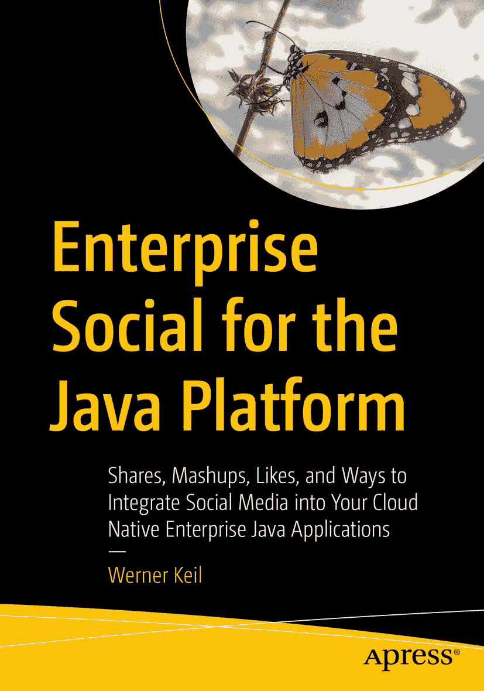

ISBN 978-1-4842-9570-0e-ISBN 978-1-4842-9571-7 [`doi.org/10.1007/978-1-4842-9571-7`](https://doi.org/10.1007/978-1-4842-9571-7) © Werner Keil 2024 本作品受版权保护。所有权利均由出版商独家授权，涉及材料的全部或部分内容，具体包括翻译权、重印权、插图再利用权、朗诵权、广播权、微缩胶片复制权或任何其他物理形式的复制权，以及传输或信息存储与检索、电子改编、计算机软件，或现在已知或未来开发的类似或不同方法的权利。本出版物中使用的一般描述性名称、注册商标、商标、服务标志等，即使没有明确声明，也不意味着这些名称免于相关保护法律和法规的约束，因此可供一般使用。出版商、作者和编辑假定本书中的建议和信息在出版之日是真实准确的。出版商、作者或编辑均不对本书所含材料或可能存在的任何错误或遗漏提供明示或暗示的保证。出版商对已出版地图和机构归属中的管辖权主张保持中立。

本 Apress 印记由注册公司 APress Media, LLC（Springer Nature 的一部分）出版。

注册公司地址为：1 New York Plaza, New York, NY 10004, U.S.A.

*本书献给我美丽的妻子和可爱的孩子们，感谢他们的耐心和理解，以及给予我完成本书的能量和动力。*

前言

> *从开罗的街头和阿拉伯之春，到占领华尔街，从繁忙的政治日程到日本海啸的善后工作，社交媒体不仅是在分享新闻，更是在推动新闻。*
> 
> —丹·拉瑟（美国记者，八次皮博迪奖得主）

言论自由，尤其是当它源于纯真意图时，是开放社会背后的决定性力量。得益于社交媒体，这股强大的力量如今插上了新的翅膀。社交媒体为我们这个永远动荡的小星球上那些未曾被倾听的声音赋予了发言权，而我们才刚刚开始看到它的潜力`–`无论是在基辅、莫斯科、明尼阿波利斯、弗格森、突尼斯、开罗、利雅得、德黑兰、香港、北京、特拉维夫还是加沙。

尽管社交媒体在现代生活中扮演着关键角色，但涵盖社交媒体和 Java 主题的书籍却寥寥无几。现有的少量资料通常只涉及最常见的用例`–`使用 OIDC 和 JWT 的联合安全。也许正因如此，尽管可能性广阔，但很少有 Java 应用程序能充分利用社交媒体。这正是本书如此重要的原因。它提供了社交媒体行业的良好背景，解释了 Java 社交媒体开发者所需的核心概念，描述了迄今为止相对薄弱的标准化努力，概述了 Java 的社会化安全，当然也涵盖了与 Java 最相关的社交媒体框架和 API。鉴于该主题的易变性、广度、深度和复杂性，撰写本书无疑是一项艰巨的任务。此外，我想不出比 Werner 更合适的人选来撰写本书。自 Agorava 项目以及 Java 中社交媒体 API 标准化的初期努力以来，他长期涉足这一领域。他对该领域的掌控力在本书中贯穿始终。

我希望这本书对每一位 Java 社交媒体开发者来说都将是无比宝贵的。

> —雷扎·拉赫曼
> 
> 微软 Azure 上 Java 首席项目经理
> 
> Jakarta EE 大使、作者、演讲者

关于作者 关于技术审校者

