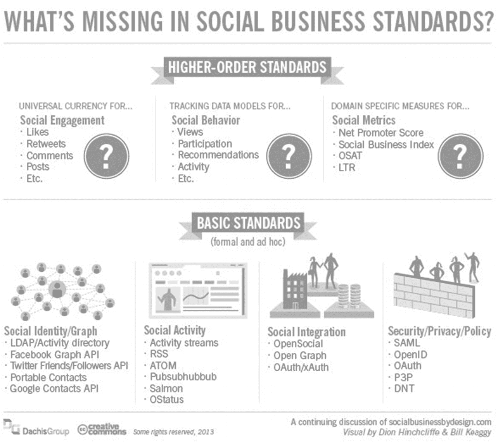
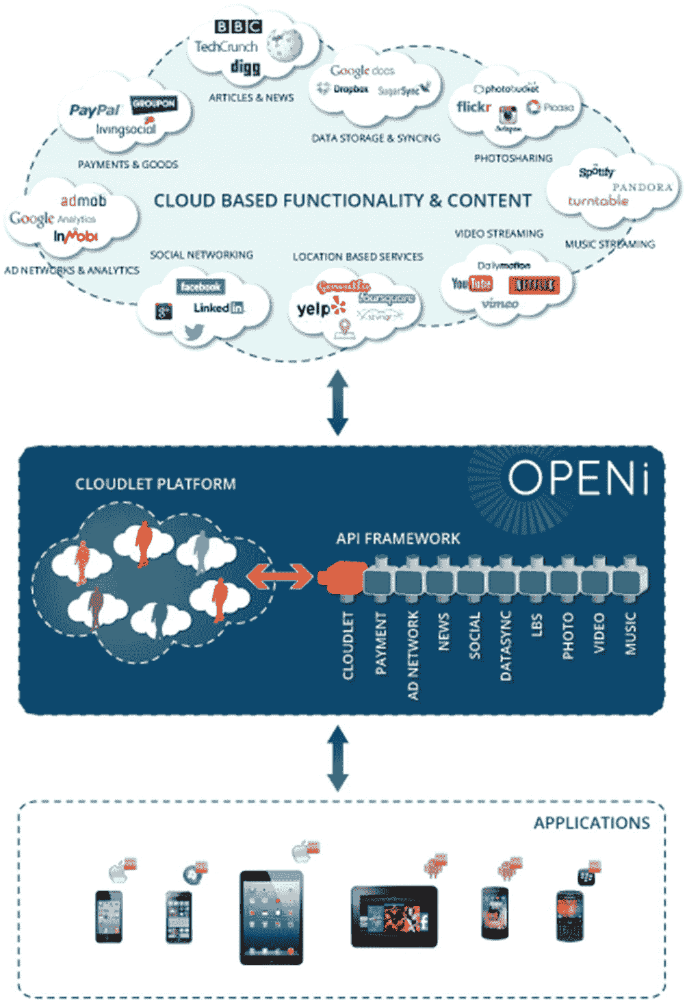
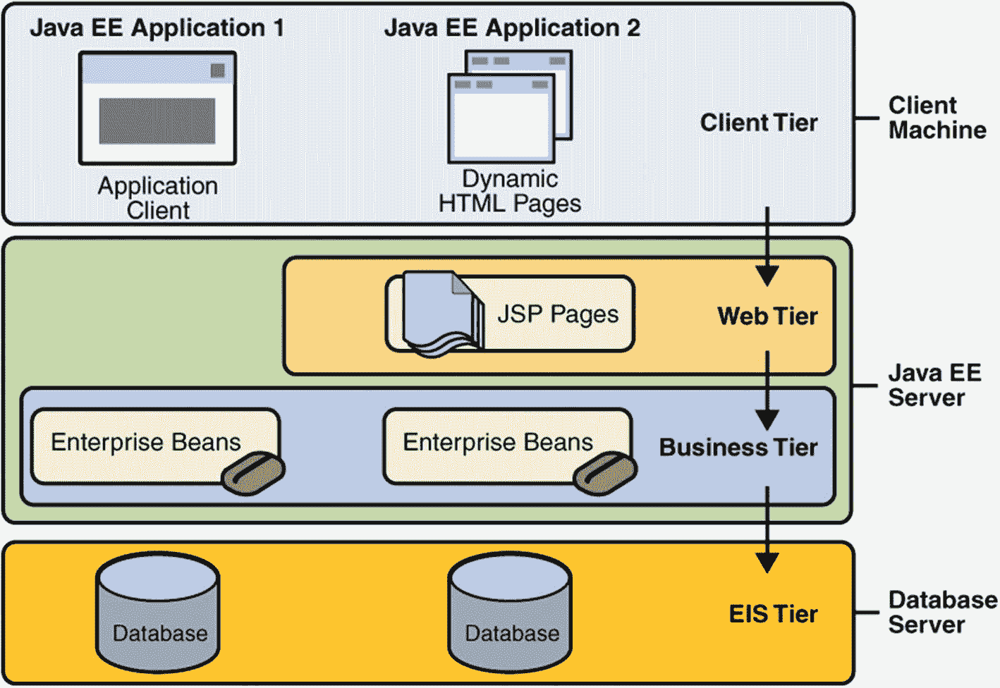
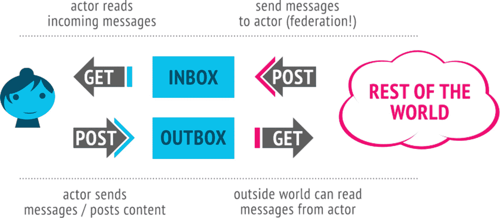
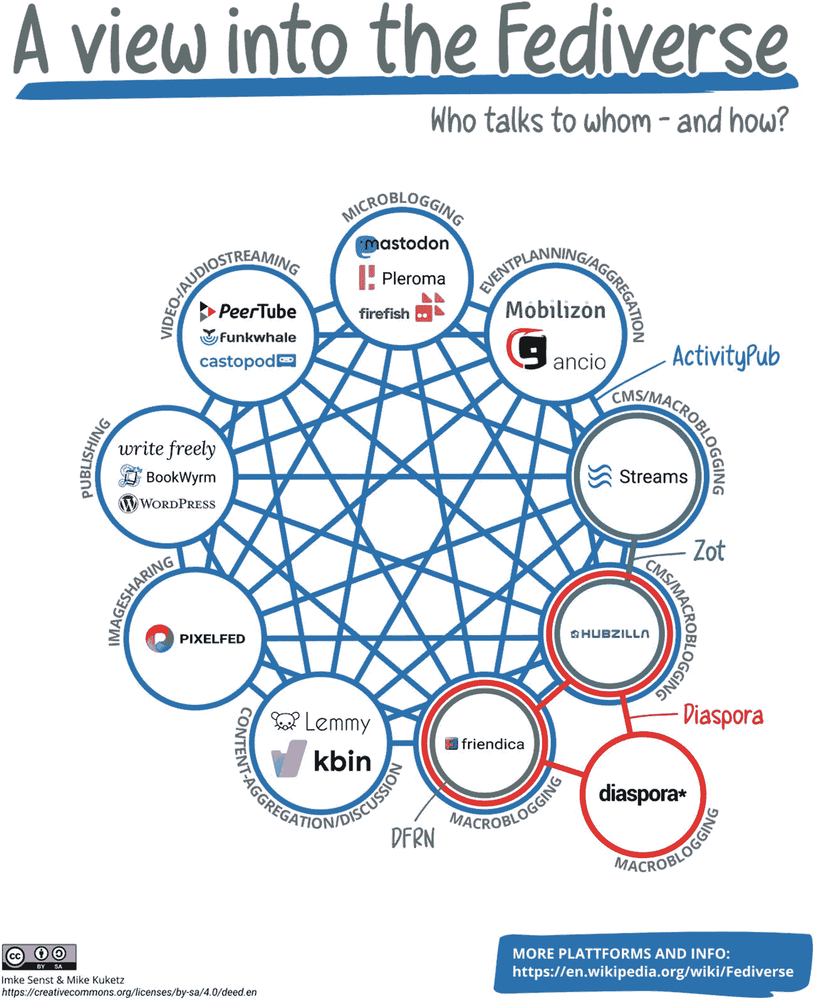
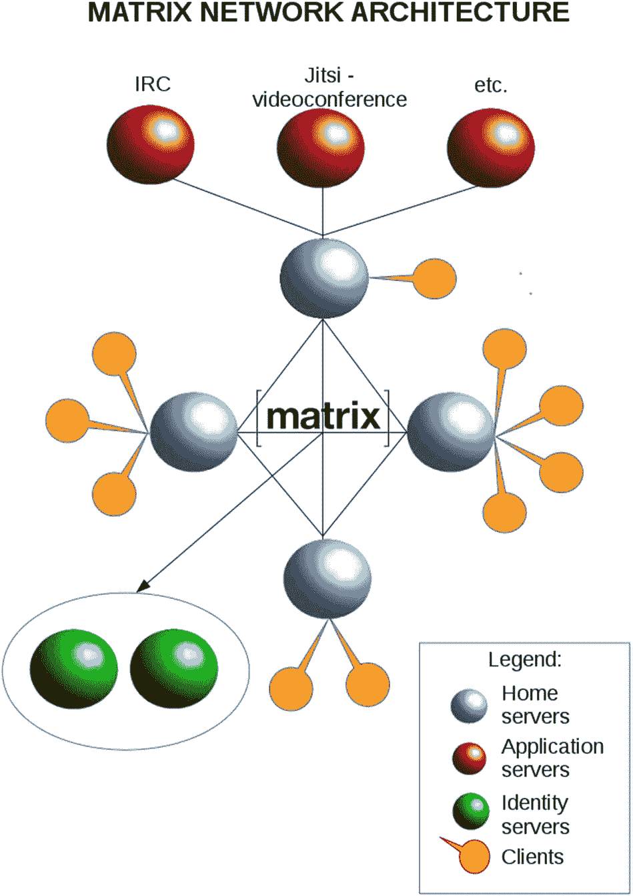
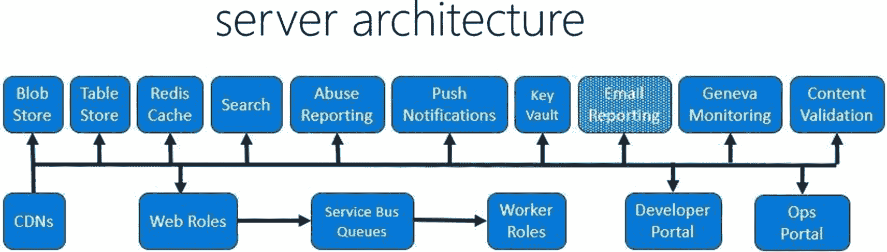

# 3. 标准化

本章探讨了通过通用 API 实现社交媒体访问标准化的努力，以及社交网络自身使用的一些标准，这些标准不仅有助于在不同网络之间更轻松地切换，还能分析来自不同来源和社交网络的数据。

## 标准类型

除了对 OpenSocial [15] 等“基础标准”的游说之外，图 3-1 提供了 Dachis Group 根据一系列文章 [16] 整理的社交标准概览。



社交业务标准中的缺失概览。它包含两部分：高阶标准（包括社交参与、社交行为和社交指标）和基础标准（包括社交身份、社交活动、社交集成和安全性）。

图 3-1

社交业务标准中缺失了什么？

两大类别如下：

1.  **高阶标准** `–` 行为和领域驱动的业务导向型标准与 API。其中大部分在文献 [16] 的作者笔下并未得到充分阐述。
2.  **基础标准** `–` 部分此前已提及，此处分为四个子类别：
    1.  联系人
    2.  活动/消息
    3.  集成/互操作性
    4.  安全性

接着，你可以审视社交标准、框架和库的通信方式，它们通过以下方式实现：

*   消费信息
*   分析信息
*   转换信息
*   提供信息

消费信息的一个典型例子是在另一个应用（例如你的博客或公司网站）中显示你在常用社交网络上的状态。

另一个例子是包含一个地图服务，用于显示前往你主办或参与的活动地点的路线。

分析信息涉及某种计算、排名或基准测试。通常需要消费多个信息源，以便获得更全面的图景。此类服务的一个例子是 Klout，其中跨多个社交网络的活动会影响你的整体排名。

转换信息可以通过合并和组合多个数据流来实现，例如两个数字的简单相加，或者你的旅行预订网站根据汇率预测以本地货币计算的旅行费用。像 Google 翻译这样的翻译服务是转换信息的另一个更复杂的例子。

最后但同样重要的是，提供信息是指你的应用向他人提供的任何服务（有时仅仅是内容），理想情况下是通过 API 实现，以便他人可以根据自身需求消费、分析或转换这些信息。

审视企业社交网络、相关标准或产品的另一种方式如下：

*   具有社交属性的独立产品或服务，可独立安装和使用。其中一些（例如采用 OpenSocial 的产品）旨在与其他产品实现互操作，理想情况下是跨多个供应商。
*   嵌入在更大产品或套件中的社交功能或特性。一个经典例子是 Oracle Fusion Middleware，它包含了继承自 BEA AquaLogic [13] 以及此后 Oracle 在社交领域多次收购 [23] 的社交功能。
*   专业型，通常是领域特定或垂直领域的社交网络，例如面向医疗保健、时尚、开发者、宠物主人或任何其他对特定社区有重要意义的兴趣领域。你在前一章中会记得一系列这样的网络。

由欧盟资助的社交媒体研究小组 OPENi [31] 试图以某种与上下文相关的方式对社交标准和 API 进行分组：

*   **活动 API** 指社交、健康和行为的活动日志，反映在从社交、照片和视频分享到健康和基于位置服务的多种云服务中。本质上，它包含用户的所有社交和个人活动，并与设备的日志记录活动相关。相关类别：游戏、健康、基于位置的服务、音乐、照片、购物、社交、视频。
*   **广告与分析 API** 能够根据最终用户/客户与广告/营销内容的互动，收集、聚合和分析他们的需求、兴趣和偏好。
*   **应用行为数据**。


*   社交网络交互，旨在实现个性化广告服务，同时提升最终用户附加值。相关类别：分析、广告。

*   位置 API 通过签到、导航、活动、评论和提示实现位置感知。它是一个强大的上下文 API，包含位置信息，可通过 GPS 传感器提取并在地图上映射。相关类别：地图、基于位置的服务、社交、音乐。

*   媒体 API 整合了照片、音乐和视频分享服务，并具备文件传输和同步功能。它与设备上的图库应用和文件系统相关。相关类别：文件传输与同步、基于位置的服务、音乐、新闻、照片、社交、视频。

*   产品与服务 API 涵盖了支付和购物服务。这种与商业化相关的特殊对象需要一个具备交易能力和增强安全性的强大 API。它与手机上的商店应用相关。相关类别：基于位置的服务、支付、购物。

*   个人资料 API 基于分析、广告、联系人、游戏、健康、基于位置的服务、消息与聊天、音乐、社交等，推断出关于人的信息。通常，人们可以通过多种方式呈现，拥有多个个人资料。此 API 将所有信息整合在一起：头像、个人资料、联系人和账户，并在不同服务中关联不同的个人资料。它与智能手机的通讯录应用直接相关。部分相关类别：分析、广告、联系人、游戏、健康、基于位置的服务、消息与聊天、音乐、电影等。

*   搜索 API，用于从基于云的服务中查找和检索信息。它整合了现有的搜索引擎与跨平台分布式搜索功能，并与桌面或手机操作系统中的搜索功能相关。



开放 I 标准的概念流程图。它包括基于云的功能和内容，其次是云平台和 API 框架，以及应用程序。基于云的功能包括 PayPal、TechCrunch、谷歌等。

图 3-2

OPENi 概念

尽管 OPENi 尚未在 GitHub 上提供其任何 API（如其网站在 2013 年所承诺的那样），但其工作引起了例如 W3C 的关注，OpenSocial [15] 目前正在 W3C 进行进一步讨论。因此，即使没有自己的 API，OPENi 及其概念也可能对此有所助益。我们将在介绍 Apache Shindig 时更详细地介绍 OpenSocial。

除了像之前那样剖析和分类社交媒体标准之外，还有许多其他标准和协议被众多 API 和社交网络所使用：

*   几乎所有社交媒体服务都使用**REST**作为传输协议；有些可能使用**SOAP**，但这相当少见。

*   大多数服务以**JSON**格式传输数据，有些使用**XML**或两者兼用。

*   身份识别和认证几乎总是基于**OAuth 2**或**OpenID Connect**。

图 3-1 中未提及的其他基本标准和协议（因为该列表并非旨在穷尽）如下：

*   开放图谱协议（OGP）使任何网页都能成为社交图谱中的一个富对象。

*   oEmbed，一种允许在第三方网站上嵌入 URL 表示形式的格式。

*   PubSubHubbub，一种简单、开放、基于 Web 钩子的服务器到服务器发布-订阅协议。

*   Salmon，一种标准协议，用于使评论和注释能够向上游（因此得名）回溯到原始更新源。

我们将在下一章中更详细地探讨安全方面，如授权、认证或数字身份，以及隐私、数据保护和相关标准。

## 早期方法

我们在引言中遇到的理论，例如六度分隔理论 [6]，影响了后来的概念，如朋友的朋友（FOAF）[8]。如今社交网络使用的大多数“好友”机制中都可以找到这两者的影子。

丰富站点摘要（RSS）[9]是社交媒体数字形式的早期例子。参与 RSS 设计和标准化的开发者中包括 Reddit 联合创始人亚伦·斯沃茨，他在 2013 年初不幸去世前，曾致力于撰写一本关于可编程网络 [10] 的书，这本书是该领域中通常枯燥的学术论文的一个相当务实、接地气的对应物。

便携式联系人由 Plaxo 创建，这是一家社交地址簿服务公司，由一群企业家在肖恩·帕克周围于 2002 年创立。帕克在 Napster 音乐交换门户被迫停业后，曾遇到过与亚伦·斯沃茨相比毫不逊色的法律麻烦，但幸运的是，他处理方式不同，其影响力也远不止于当今社交媒体领域的某个家喻户晓的名字。便携式地址簿或“数字名片”的想法初衷良好，尤其从用户角度来看很有意义，但竞争参与者的商业利益——每个人都渴望分享数据，甚至包括与数据所有者分享——给这个原本不错的想法设置了许多障碍。Plaxo 在这么多年后仍在运营，但未必是帕克最伟大的成就，投资者将他赶走的方式，与帕克介入时联合创始人爱德华多·萨维林在 Facebook 的遭遇并无二致。从财务上讲，这让他变得富有，并为其他服务（例如 Spotify）提供了支持。这看起来有点像 Napster，但以一种更被商业接受的方式，这也要归功于他在 Facebook 之后的名声和财富，这并非巧合。便携式联系人可能是社交媒体运动的重要组成部分，但已不再使用。这是因为大公司内部使用的许多 API 已不再与便携式联系人兼容。唯一仍在使用的遗留物是 vCard，许多公司和应用程序都在使用它。


## Mashup

随着 Java 语言首先在桌面端（早期主要通过 Java applet，或 AWT/Swing 独立应用程序）扮演越来越重要的角色，随后在世纪之交也在服务器端崭露头角，Sun 公司及其他企业开始在 Java Community Process（成立于 1998 年）或 JCP [11] 中标准化 Java 平台的各个部分。在最早的成员中，IBM、Intel、Fujitsu、Sun 和 Oracle（这两家自 2010 年起合并）至今仍活跃其中。

在两次被否决或撤回之后，一个针对社交网络（当时常被称为“门户”，参见早期的 MSN）的著名标准是 JSR 168，即 Java Portlet 规范 [48]。在理想情况下，它允许门户应用程序部署到多个门户服务器中，不受供应商限制，并且与其他标准（尤其是 OASIS 定义的 WSRP，即远程 Portlet 的 Web 服务）一起，为这些应用程序之间（甚至跨不同门户）的互操作性带来了希望。十年后，随着其他技术和语言（尤其是“轻量级容器”）的兴起，Java Portlet 标准在 2017 年迎来了 3.0 版本更新（JSR 362），并计划在可能的情况下纳入一些社交标准，但这些标准最终未能再被纳入 Portlet 规范。

虽然 Portlet 及相关标准主要仍是大规模企业应用服务器的领域（其灵感来源于音乐或视频混编或混音），但在第一个 Portlet 标准之后不久，一种更语言和平台中立的方法——称为 Mashup [12]——开始兴起。无论是 Yahoo Pipes、Microsoft Popfly、Google Mashup Editor、IBM Mashup Center 还是 BEA AquaLogic [13]，它们都承诺提供互操作性和个性化小部件，并提供类似于 iGoogle 的体验。这项服务（主要由于 Google+ 将个性化和更“集成社交媒体”的方法提升到了新高度）于 2013 年 11 月 1 日关闭。

RSS 也是如此，仅在 Aaron Swartz 去世几个月后。Google Reader 于 2013 年 7 月 1 日停止服务。虽然 Swartz 在其未完成的著作 [10] 中最后倡导一种基于开放 API 的可编程网络，但大多数大型提供商却另有打算，正如围绕 Google Reader 终结的众多文章（例如这篇 [14]）所表达的那样。

## OStatus

OStatus 是一个用于联合微博客的开放标准，允许用户接收来自其他网站用户的状态更新。该标准结合了一系列开放协议，例如：

*   Atom
*   Activity Streams
*   WebSub
*   Salmon
*   WebFinger

它始于 2013 年的 StatusNet，后者后来成为 GNU social [60]。当时，它被许多微博客网站采用，但由于对底层技术的失望，大多数网站转而使用 ActivityPub，包括 Mastodon [61]、Pleroma 或 postActiv。唯一仍在使用 OStatus 的开源社交网络是 Friendica [62]，这是一个非常早期的开源项目，始于 2010 年，并且像 GNU social 一样使用 PHP 编写；因此，这两个项目之间的协同效应似乎比其他项目更强。

## OpenSocial

另一个社交标准几乎从其诞生之初就由社区开发塑造：OpenSocial [15] 由 Google 与少数初始支持者（当时仍是最受欢迎的社交网络 MySpace、Ning 或 Plaxo）共同开发。此时，前面提到的 Portable Contacts 也符合在众多社交网络提供商之间实现易用的小部件和服务的总体理念，这与例如 Java Portlet 标准 2.0 版本（大约在同一时间发布了其公开草案）形成对比。

看似更易用，这也适用于漏洞利用和安全问题，通常由一些几乎还在上小学的“脚本小子”使用少量脚本就能破坏或攻破这些服务和小部件。如果系统管理员尽职尽责，完整规模的 Java EE 服务器和 Portlet 过去和现在都更难被攻破。而所有关于 Java 安全性或被用于传播恶意软件的喧嚣通常只影响客户端。

OpenSocial 的绝大部分是 JavaScript 代码，这使得它比主要基于服务器端或精心混合使用服务器端（Jakarta EE 或其他环境）和客户端（JavaScript 等）的方式更容易暴露。请参见图 3-3，了解一个典型的基于 Web 的企业应用程序（使用 Java EE）的不同层级，但你可以将其替换为其他语言，如 Python、PHP、Ruby 或 Scala，其层级大致相同。



一个概念流程图展示了典型的基于 Web 的企业应用程序的不同层级。它包括三个阶段：客户端机器、Java 服务器和数据库服务器。客户端机器包含应用程序客户端和动态 HTML 页面，以及客户端层，其后是其余服务器。

图 3-3

N 层企业应用

虽然 Google 开始在其 Orkut 服务（在拉丁美洲和印度等少数其他国家流行，但在其他地方从未真正流行起来）中使用 OpenSocial，但其他最初计划支持它的供应商却一个接一个地放弃了这些计划。尤其是 LinkedIn 或 XING 等公司出于安全原因放弃了它。我们将在下一章中更多地讨论安全性和隐私问题。无论是 Facebook 还是 Twitter（过去十年下半叶的两个主导提供商），都从未关心过 OpenSocial。更重要的是，当情况变得明朗时，Google 扼杀了自己的创造。Google+ 也从未支持过它。少数主要来自服务器和大型企业领域的供应商，如 IBM、SAP 或 Confluence 的开发者 Atlassian，仍然支持 OpenSocial。

Dachis Group（于 2014 年被 Sprinklr 收购，是一个社交媒体和企业数据分析的“智库”）也曾深度参与，尽管其重点最近更多地转向了大数据和 NoSQL 系统等方向，并且它像大多数剩余的 OpenSocial 支持者（或 Thoughtworks 在其定期调查“雷达”中关于值得关注或逐渐淡出的技术）一样公开承认，它唯一可能的位置终究还是企业和内联网。大数据也可以被视为一种 Mashup，但它主要发生在 EIS 或 DB 层（见图 3-4），因此我在此不多讨论。这些技术也值得单独成书，并且超出了本书的范围。



一个概念图展示了 ActivityPub 的概览。它包含一个收件箱和发件箱，一个读取传入消息的行动者，以及一个接收消息的行动者。向后和向前的箭头分别标记为获取和发布消息。

图 3-4

ActivityPub 概览


与其说是无缝整合了例如 Google、Facebook、Twitter、LinkedIn、Microsoft 或 Yahoo! 等平台，OpenSocial 的唯一价值在于连接 HR、销售或财务部门，并为管理层提供所有部门及大型企业子公司的某种精巧的“社交”整合。这使得它对那些希望看到，比如说，在 Facebook 时间线旁边显示 Twitter 信息流的人而言几乎毫无用处——而这正是 OpenSocial 最初被创造的目的。

OpenSocial 故事中的一个转折点是，人们试图基于 OpenSocial 及类似概念创建一个 W3C 标准。这条在语义网案例中本就艰难曲折的道路，在此处似乎几乎不可能实现，尤其是考虑到我们之前发现[14]，大多数参与者更偏爱他们的“围墙花园”。

尽管 W3C 定义了一个名为语义网的有趣标准，该标准听起来与 OpenSocial 的某些理念具有协同效应，但语义网迄今为止仅在少数孤立领域（如生物学或医疗保健）中使用。

W3C 的工作节奏通常相当缓慢，类似于（甚至慢于）HTML5。例如，HTML5 自 2008 年开始，在候选推荐状态停留了一段时间（尽管许多供应商已经提出了基于它的解决方案和产品）。最终推荐标准于 2014 年底发布，不久之后 W3C 社交网络工作组[30]成立，并一直活跃到 2018 年。与大多数其他 W3C 标准和工作组相比，这个持续时间相当短暂。

### W3C 社交网络协议

W3C 社交网络工作组的成果是一套社交网络协议[63]，允许社交网络的用户：

*   创建、更新和删除社交内容
*   通过订阅他人的内容与他人建立联系
*   与他人发布的内容进行互动
*   在他人与自己的内容互动时收到通知

#### 规范

以下是 W3C 社交网络工作组制定的规范：

*   ActivityPub `–` 基于 JSON-LD 的 API，用于客户端到服务器的交互（如发布）和服务器到服务器的交互（如联邦）
*   ActivityStreams `–` 用于表示以下内容的语法和词汇：
    *   活动 (Activity)
    *   参与者 (Actor)
    *   链接 (Link)
    *   对象 (Object)
    *   集合 (Collection)
*   链接数据通知 (LDN) `–` 一种基于 JSON-LD 的投递协议
*   Micropub `–` 一种基于表单编码和 JSON 的 API，用于客户端到服务器的交互（如发布）
*   Webmention `–` 一种基于表单编码的投递协议
*   WebSub `–` 一种用于订阅及投递更新的协议

##### ActivityPub

ActivityPub 是一种基于 ActivityStreams 2.0 数据格式和 JSON-LD 的去中心化社交网络协议。

它提供了一个用于创建、更新和删除内容的客户端到服务器 API，以及一个用于投递通知和订阅内容的联邦式服务器到服务器 API。

在 ActivityPub 中，用户被称为参与者 (actor)。每个参与者都有：

*   一个**收件箱 (inbox)** `–` 用于接收他人消息
*   一个**发件箱 (outbox)** `–` 用于向他人发送消息

以下是参与者 Alyssa 的记录示例：

```
{"@context": "https://www.w3.org/ns/activitystreams",
"type": "Person",
"id": "https://social.example/alyssa/",
"name": "Alyssa P. Hacker",
"preferredUsername": "alyssa",
"summary": "Lisp enthusiast hailing from MIT",
"inbox": "https://social.example/alyssa/inbox/",
"outbox": "https://social.example/alyssa/outbox/",
"followers": "https://social.example/alyssa/followers/",
"following": "https://social.example/alyssa/following/",
"liked": "https://social.example/alyssa/liked/"}
```

想象一下，Alyssa 想联系她的朋友 Ben。她最近借给他一本书，她想确保他能归还。以下是作为 ActivityStreams 对象的示例消息：

```
{"@context": "https://www.w3.org/ns/activitystreams",
"type": "Note",
"to": ["https://chatty.example/ben/"],
"attributedTo": "https://social.example/alyssa/",
"content": "Say, did you finish reading that book I lent you?"}
```

服务器识别出这是一个新创建的对象，并将其包装成一个 `Create` 活动：

```
{"@context": "https://www.w3.org/ns/activitystreams",
"type": "Create",
"id": "https://social.example/alyssa/posts/a29a6843-9feb-4c74-a7f7-081b9c9201d3",
"to": ["https://chatty.example/ben/"],
"actor": "https://social.example/alyssa/",
"object": {"type": "Note",
"id": "https://social.example/alyssa/posts/49e2d03d-b53a-4c4c-a95c-94a6abf45a19",
"attributedTo": "https://social.example/alyssa/",
"to": ["https://chatty.example/ben/"],
"content": "Say, did you finish reading that book I lent you?"}}
```

Alyssa 的服务器查找 Ben 的 ActivityStreams 参与者对象，找到他的收件箱端点，并将她的对象 POST 到他的收件箱。

###### 采用情况

在 Mastodon 于 ActivityPub 定稿后不久便支持它之后，其他几个平台也纷纷效仿，包括 Reddit、Goodreads、YouTube 或 Tumblr；Flickr 也在考虑增加支持。据报道，Twitter/X 的竞争对手 Threads 正在使用它或计划很快增加支持[64]。

## Fediverse

Fediverse（由“federation”（联邦）和“universe”（宇宙）组成）是一个“全球社交网络”，允许一个服务的用户使用 ActivityPub 等开放协议与其他服务的用户进行通信。Fediverse 中著名的社交网络有：

*   Mastodon
*   Diaspora
*   Friendica
*   GNU social
*   Hubzilla
*   Lemmy
*   PeerTube
*   Pleroma
*   Pixelfed

业内许多人认为，埃隆·马斯克收购 Twitter 并将其转变为他的“X App”是开放社交网络和 Fediverse 的巨大催化剂。由 Jason Robinson 运营的统计网站 The-Federation.info 列出 Fediverse 的总用户数接近 6.31 亿，其中过去六个月内活跃用户约 700 万。他们的统计数据是自愿提交的，据称并不完整；例如，Threads/Meta 以及其他几个使用 Fediverse 标准和协议的大型商业参与者并未贡献这些统计数据；因此，实际数字很可能超过十亿，而当前活跃用户可能达到数千万。

其他网站，如唐纳德·特朗普的 Truth Social [45]，基于开放标准，几乎就是 Mastodon 的翻版，但它们甚至不通过 Fediverse 与其他网站交互，也不以透明的方式贡献用户统计数据。截至 2023 年 8 月，Truth Social 上的当前活跃用户据说约为 50 万，而 Mastodon 的活跃用户接近 200 万。



一张网络图展示了 Fediverse 的概览。它包含了十个应用程序：微博客、活动策划、长博客、视频音频流媒体、发布、图片分享、内容聚合以及其他。

图 3-5
Fediverse 概览

### 协议

The-Federation.info 目前列出了 Fediverse 中使用的 15 种协议：

*   ActivityPub
*   Bluesky
*   DFRN
*   Diaspora
*   Gemini
*   Inbound
*   Matrix
*   MicroPub
*   NeoDb
*   Outbound
*   OStatus
*   SMTP
*   WebMention
*   XMPP
*   Zot

我们已经介绍了 ActivityPub 和 OStatus；除此之外，节点数量排名前五的协议中还有另外三种：

*   Diaspora
*   DFRN
*   Matrix

#### Diaspora

Diaspora 拥有自己的去中心化社交网络协议。它开发于 2010 年，基于类似于电子邮件的联邦架构（具有收件箱和发件箱，也与 ActivityPub 类似），允许用户跨多个独立节点（称为“pods”，与 Kubernetes pods 没有直接关系，尽管一些 Diaspora pods 可能运行在 Kubernetes 集群中）组成的网络共享数据和相互通信。除了 Diaspora 本身，该协议也被 Friendica 或 Hubzilla 使用。

#### DFRN

DFRN 是一种分布式通信协议，提供隐私和安全通信，并为分布式个人资料和连接（如好友请求）提供基础。


#### Matrix

Matrix 最初是作为 Amdocs（提供 CRM 及 OSS 或 BSS 等电信解决方案的供应商）内部用于安全、去中心化即时通讯的协议而开发的。其用例包括 IP 语音、视频聊天或安全的物联网。

Matrix 的功能包括以下内容：

*   创建和管理完全分布式的聊天室，无单点控制或故障风险
*   在联邦服务器的全球开放网络中，实现聊天室状态的最终一致性、加密安全的同步
*   在聊天室中发送和接收可扩展消息，并支持可选的端到端加密
*   用户管理
    *   邀请
    *   加入
    *   离开
    *   踢出、封禁
    *   由特权用户调解
*   聊天室状态管理
    *   命名
    *   别名
    *   主题
    *   封禁列表
*   用户资料管理（头像、显示名称等）
*   管理用户账户（注册、登录、登出）
*   使用第三方 ID（如电子邮件地址、电话号码、Facebook 账户或其他社交 ID）在 Matrix 上进行身份验证、识别和发现用户
*   身份联邦
    *   发布用户公钥用于 PKI
    *   将第三方 ID 映射到 Matrix ID



Matrix 网络架构图。它始于三个应用服务器，由四个家庭服务器和身份服务器相互连接。家庭服务器有客户端与每个服务器矩阵连接。下方提供了图例。

图 3-6

Matrix 网络架构

##### 采用情况

Matrix 被全球许多政府机构广泛使用，尤其是在数据安全和隐私法规更严格的欧洲。

Rocket Chat 自 4.7.0 版本起基于 Matrix。2021 年和 2022 年，FOSDEM 会议均使用 Matrix 进行托管。

Matrix 官方提供了以下平台的桥接：

*   Gitter
*   IRC
*   Slack/Mattermost
*   XMPP

以及由社区维护的其他几个桥接，用于：

*   Apple iMessage
*   Discord
*   电子邮件
*   Facebook Messenger
*   LinkedIn
*   Mastodon
*   Signal
*   Skype
*   SMS
*   Telegram
*   微信
*   WhatsApp

## Java 框架与库

遵循 Portlet API 或企业 Java 的各个部分等 Java 标准，已有多个用于社交媒体的 Java 框架和库。

### Facebook Business SDK for Java

Facebook (Meta) Business SDK 是一个一站式解决方案，旨在帮助合作伙伴和客户实现其企业社交解决方案，允许合作伙伴使用多个 Facebook API（如 Pages、Business Manager、Instagram 等）来满足其业务需求。常见功能包括以下内容：

*   广告购买 `–` 为点击到 Messenger 广告创建广告系列并推广您的 Facebook 页面的指南
*   Instagram 管理 `–` 在 Instagram 上发布照片和回复评论的指南
*   大规模客户 onboarding `–` 管理成百上千家小型企业并允许其在其网站或平台内购买广告的指南
*   页面管理 `–` 创建页面、更新页面和管理其内容的指南

以下是一个快速入门示例；请参阅 [`https://github.com/facebook/facebook-java-business-sdk`](https://github.com/facebook/facebook-java-business-sdk)。

```
import com.facebook.ads.sdk.APIContext;
import com.facebook.ads.sdk.AdAccount;
import com.facebook.ads.sdk.AdAccount.EnumCampaignStatus;
import com.facebook.ads.sdk.AdAccount.EnumCampaignObjective;
import com.facebook.ads.sdk.Campaign;
import com.facebook.ads.sdk.APIException;
public class QuickStartExample {
public static final String ACCESS_TOKEN = "[Your access token]";
public static final Long ACCOUNT_ID = [Your account ID];
public static final String APP_SECRET = "[Your app secret]";
public static final APIContext context = new APIContext(ACCESS_TOKEN, APP_SECRET);
public static void main(String[] args) {
try {
AdAccount account = new AdAccount(ACCOUNT_ID, context);
Campaign campaign = account.createCampaign()
.setName("Java SDK Test Campaign")
.setObjective(Campaign.EnumObjective.VALUE_LINK_CLICKS)
.setSpendCap(10000L)
.setStatus(Campaign.EnumStatus.VALUE_PAUSED)
.execute();
System.out.println(campaign.fetch());
} catch (APIException e) {
e.printStackTrace();
}
}
}
```

我们将在第 6 章中展示更多关于使用 Facebook/Meta Business SDK for Java 的示例。

自 2016 年 5 月首次预发布以来，Facebook 除了为 JavaScript (Node.js)、PHP、Ruby 或 Python 提供开发者支持外，还持续维护其 Java SDK。最新版本是 v16.0.1，于 2023 年 3 月发布，其发布周期与 Spring、JBoss/Red Hat 或 JDK 本身相差不大，每年发布两个主要版本。

### Twitter4J

Twitter4J 是一个用于 Twitter API 的非官方 Java 库。使用 Twitter4J，您可以轻松地在 Java 应用程序中集成 Twitter 调用。

其作者 Yusuke Yamamoto 曾在 2012 年为 Twitter 工作。

在他任职期间，他曾短暂地代表 Twitter 参与 Social JSR Expert Group，本章稍后将在 JSR 357 部分对此进行更多介绍。

它轻量级，且仍向后兼容 Java 8，因此也易于集成到移动或嵌入式应用程序中。毫不意外，从 J2ME 到 Android，几乎到处都有受其启发的或多或少官方的克隆、分支或项目。Twitter4J 是一个 API 绑定库，因此主要用于消费信息。虽然扩展或您的应用程序可以分析或转换信息，但框架本身不提供超出 Twitter 本身的支持。根据 Hinchcliffe 的分类，Twitter4J 主要可被视为一个基础 API，但也包含一些更高级别的方面。

最后一个版本是 2022 年 10 月的 4.1.2。在 2018 年至 2022 年经历了一段较长的停滞后，它现在似乎又得到了相当良好的维护。然而，一个风险是 Twitter4J 目前仅支持 Twitter API v1.1，并且考虑到 Twitter 的整个 Elon Musk 事件，没有人确切知道两者是否以及会持续多久。另一方面，鉴于 Twitter 的员工队伍已缩减至 Musk 时代前的影子，所有服务不太可能在短短几周内就全部迁移到 v2。而且，由于 Premium v1.1 API 能带来一些收入，它也不太可能在未给予付费用户迁移到 v2 等效版本的时间的情况下，一夜之间消失。虽然 Gnip 在近十年前就被 Twitter 收购，但企业 API 直到最近才从 Gnip 2.0 重新命名，而这一过程也可能因 Musk 解雇或迫使离职的所有有经验的开发者而受阻。

以下是一个如何使用 Twitter4J 登录的示例。

使用 Twitter 登录：

```
import twitter4j.*;
import twitter4j.v1.Status;
class Main {
public static void main(String[] args) throws Exception {
long userId = Long.parseLong(args[0]);
String accessToken = loadAccessToken(userId);
String accessTokenSecret = loadAccessTokenSecret(userId);
Twitter twitter = Twitter.newBuilder()
.oAuthConsumer("[consumer key]", "[consumer secret]")
.oAuthAccessToken(accessToken, accessTokenSecret).build();
Status status = twitter.v1().tweets().updateStatus(args[1]);
System.out.println("Successfully updated the status to [%s].".formatted(status.getText()));
System.exit(0);
}
private static String loadAccessToken(long userId) {
return "[token]"; // load from a persistent store
}
private static String loadAccessTokenSecret(long userId) {
return "[token secret]"; // load from a persistent store
}
}
```

我们将在第 6 章中展示更多关于如何使用 Twitter4J 的示例。


### Java 版 Twitter API 客户端库

2021 年 8 月，Twitter 推出了自己的 Java 版 API 客户端库 [35]。虽然推出时间较晚，且仅支持 Twitter v2 API，但其目的是说服开发者迁移到新的 API。

直到 2021 年，Twitter 一直是 JCP 执行委员会中非常活跃且受欢迎的成员，在其总部举办的面对面会议数量，除 Sun 和后来的 Oracle 外，超过了任何其他 JCP 成员。Twitter 也是 OpenJDK 的活跃提交者，并维护着针对性能和可扩展性优化的自有 JDK 版本。因此，Twitter 提供 Java 客户端库并不令人意外，尽管它来得有点晚，而且 GitHub 仓库中的 readme 文件仍然写着“此 SDK 处于测试阶段，尚未准备好用于生产环境”。

虽然被超过 100 个其他 GitHub 项目以及可能一些商业用户使用，但该项目只有三位贡献者；他们应该都曾在 Twitter 工作，而只有一位在新西兰的提交者似乎仍与 Twitter 开发团队有关联，尽管他的贡献在库的非常早期阶段就停止了。另一位同样在新西兰，于 2023 年 2 月刚刚离开 Twitter，似乎是马斯克收购后的离职人员。他还创建了 Twitter4J 的一个分支，并可能对其进行了相当深入的研究，尽管似乎没有向 Twitter4J 提交过拉取请求。他未来是否会为其做出贡献，时间会给出答案。最后一次贡献来自一家名为 Recharger Mon Auto 的法国电动汽车初创公司的联合创始人，时间在 2022 年夏季，正值埃隆·马斯克收购 Twitter 前后。尽管该提交者与特斯拉没有直接的工作关系，但时间点表明他可能来自马斯克的圈子，并被要求查看代码，或者至少他的公司对使用 Twitter API 有如此至关重要的兴趣，以至于他参与其中。

最后一次提交是在 2022 年 10 月，也就是马斯克收购完成之时，此后便再无任何代码提交。

以下是 Twitter API 客户端库的一个“Hello World”示例；请参阅 [`https://github.com/twitterdev/twitter-api-java-sdk`](https://github.com/twitterdev/twitter-api-java-sdk)。

```
package com.twitter.clientlib;
import java.util.HashSet;
import java.util.Set;
import com.twitter.clientlib.TwitterCredentialsBearer;
import com.twitter.clientlib.ApiException;
import com.twitter.clientlib.api.TwitterApi;
import com.twitter.clientlib.model.*;
public class HelloWorld {
public static void main(String[] args) {
/**
* Set the credentials for the required APIs.
* The Java SDK supports TwitterCredentialsOAuth2 & TwitterCredentialsBearer.
* Check the 'security' tag of the required APIs in https://api.twitter.com/2/openapi.json in order
* to use the right credential object.
*/
TwitterApi apiInstance = new TwitterApi(new TwitterCredentialsBearer(System.getenv("TWITTER_BEARER_TOKEN")));
Set tweetFields = new HashSet();
tweetFields.add("author_id");
tweetFields.add("id");
tweetFields.add("created_at");
try {
// findTweetById
Get2TweetsIdResponse result = apiInstance.tweets().findTweetById("20")
.tweetFields(tweetFields)
.execute();
if(result.getErrors() != null && result.getErrors().size() > 0) {
System.out.println("Error:");
result.getErrors().forEach(e -> {
System.out.println(e.toString());
if (e instanceof ResourceUnauthorizedProblem) {
System.out.println(((ResourceUnauthorizedProblem) e).getTitle() + " " + ((ResourceUnauthorizedProblem) e).getDetail());
}
});
} else {
System.out.println("findTweetById - Tweet Text: " + result.toString());
}
} catch (ApiException e) {
System.err.println("Status code: " + e.getCode());
System.err.println("Reason: " + e.getResponseBody());
System.err.println("Response headers: " + e.getResponseHeaders());
e.printStackTrace();
}
}
}
```

该 API 能否最终脱离测试阶段仍有待观察，但考虑到主要提交者已不再任职，以及马斯克领导下 Twitter 普遍的成本削减努力，这似乎不太可能。

我们将在第 6 章展示更多如何使用 Twitter API 的示例。

### Apache Shindig

Apache Shindig [19] 在 OpenSocial [15] 工作启动后不久便开始了。起初主要由 Google 及其 Orkut 推动，原因显而易见，其他贡献者，尤其是 IBM，后来也加入了。由于 OpenSocial 重新聚焦于“社交内联网”，声称使用它的网站或软件是否仍在继续使用已无法确定。事实上，Google Partuza 指向了一个不存在的页面；因此，它像我们之前听说的其他例子一样被关闭了。

Google 在 Eclipse IDE 的所见即所得环境中开发 OpenSocial 应用程序的一个有趣方法是 OpenSocial 开发环境（OSDE）；参见 [20]。可以合理地假设，其中一些被 IBM 接管并集成到基于 Eclipse 的开发工具（如 RAD 等）的社交版本中，而 Google Code 项目最后更新于 2010 年 6 月。

Apache Shindig 链接到的 OpenSocial API 规范甚至不再由 OpenSocial 支持者 Atlassian 托管；该链接似乎指向一个错误页面。这是否意味着 Atlassian 也不再相信 OpenSocial，并且不会在其新版本产品中使用它，或者仅仅是 W3C 重振整个 OpenSocial 运动过程中的一个环节，仍有待观察。与此同时，所有版本的 OpenSocial，尤其是 1.0 或 2.0 版本，都已失败告终，像 Orkut 这样的网站最多使用了 0.7 或 0.8 版本。根据支持 OpenSocial 的 Dachis Group [16] 的说法，Shindig 作为一种体现，代表了一个基本标准 (2c)。它兼具提供和消费信息的能力。

2014 年 9 月 30 日，Google 关闭了 Orkut，使得 Google+（其本身也于 2019 年关闭）成为当时仅存的 Google 相关参考。到 2015 年，仍有超过 20 个社交网络集成了 OpenSocial，其中包括 StudiVZ、MySpace、LinkedIn 或 XING，但不久之后，大多数社交媒体提供商逐渐放弃了它。

Google 已经停止使用 Shindig，转而使用自己的 Google Code 项目。这些项目大多也已关闭，要么现在指向 OpenSocial 页面，要么不复存在。因此，2015 年 10 月 23 日，Apache 基金会退役了 Shindig 项目。此后，随着 OpenSocial 事实上的参考实现被终止，它也步其后尘。

### Sun/Oracle 的努力

大约在 2008 年，企业社交混搭驱动公司 BEA Systems [13] 刚被 Oracle 收购；Java 的创造者 Sun Microsystems 并未预料到类似的命运也即将降临到自己头上。基于 OpenSocial，Sun 从 Apache Shindig 创建了一个分支或衍生项目，名为 SocialSite [21]。

SocialSite 在 java.net 上仍有 231 名成员，但该项目已不活跃。最后一次提交之一是由 Kohsuke Kawaguchi 完成的，他是 Sun 的 Hudson CI 服务器创建者，后来在被 CloudBees 聘用后创建了 Jenkins。

在收购 RightNow Technologies（参见 [23]，2011 年底）之后——这家公司是带有社交功能的 SaaS CRM 软件制造商，此举明显针对 Salesforce.com 或 SAP 等公司——一些前 RightNow 团队和产品被并入 Oracle 的社交企业部门。

2012 年的 JavaOne 大会设立了一个社交日，我也参加了，演讲者包括 Facebook 的开发者关系经理 James Pearce。Oracle 自己展示了一个“单人”项目，由一位仍为 RightNow 工作的自由承包商编写，代号为“Project Sneaker”，该项目在 2012 年 JavaOne 大会后不久作为 Oracle SocialLink [24] 发布。

它从未在 Oracle 之外吸引到追随者，并且不得不被认为比 SocialSite 还要沉寂。


#### DaliCore

在甲骨文收购太阳微系统公司后，被弃用的 SocialSite 在 DaliCore 中找到了其最佳的等价物和继任者 [22]。

它最初基于一家比利时初创公司开发的 CMS，主要围绕 BeJUG（Devoxx 会议）的成员，如 Johan Vos。DaliCMS（2006 年）被称为“Web 2.0 就绪的 CMS”。

它主要是一个带有社区功能的开源项目。2008 年，大约在太阳微系统公司对 SocialSite 做同样事情的时候，DaliCMS 增加了对 Shindig 的支持，主要是来自 Shindig 的 JavaScript 代码以及 DaliCMS 提供的一些 Java 代码。

最终，它不再仅仅是一个 CMS，其底层模块演变成了 DaliCore。在 2013 年 JavaOne 大会的演讲中，Johan 揭示了“Dali”这一名称的由来，它代表“荷兰亚马逊爱好者倡议”（Dutch Amazon Lovers Initiative）`–`，这是对互联网和云先驱亚马逊的一种致敬。

DaliCore 在 Java EE 6 之上增加了用户管理、内容或权限等通用功能，并重点关注用户和权限。在几乎所有使用 DaliCore 的项目中，用户都应该能够使用现有的凭据（如 Facebook、Twitter、Google+、LinkedIn 等）登录。所谓的 Dali 模块扩展了 DaliCore。虽然存在与 Facebook 等社交提供商的连接，但这些连接主要作为 DaliCore 单点登录（SSO）功能的认证提供者。除此之外，DaliCore 旨在提供信息。

DaliCore 的重要方面如下：

*   主要是一个社交容器和 CMS，具有部分开放社交功能。
*   通过 EJB、JPA 或类似标准提供 Java 持久化支持。
*   模块之间没有清晰的分离，特别是 API/规范与实现，在大多数情况下共享相同的模块甚至包空间，尽管试图通过 Dali 模块实现复用和扩展，但这反而使其更加困难。
*   看起来有点笨重，对完整的 Java EE 配置文件有强依赖性，也就是说，仅使用其 Web 配置文件看起来更困难。
*   GlassFish 的支持和集成是积极的，它是首选的应用程序服务器。得益于 Java EE 标准，与其他容器一起使用并非不可能，但似乎更困难。
*   它在一些客户的重度使用下也展示了可扩展性，例如比利时的一个电子投票网站。与 Apache Shindig 或 Sun SocialSite（在大多数情况下，DaliCore 似乎是其自然继任者）不同，它至少在比荷卢经济联盟国家有实际客户在使用。

在甲骨文宣布将不再为 GlassFish 提供商业支持或增强功能（如集群，超出 Java EE 参考实现提供的概念验证质量后，该功能将保留）、性能调优等之后，DaliCore 的一个主要优势消失了。甲骨文推荐其 WebLogic/Fusion Middleware 产品，或者当前的 GlassFish 用户如果需要商业支持，将被迫迁移到其他服务器。

DaliCore 的作者 Johan Vos 和他的比利时初创公司随后声称他们将为客户提供商业支持，甚至可能尝试扩展该支持，但 DaliCore 显然成为了此事的受害者。自 2013 年初以来，java.net 仓库中就没有任何活动了，并且在甲骨文于 2017 年关闭 java.net 后，没有任何内容被迁移到其他地方，至少没有迁移到公开可用的网站。虽然 Johan Vos 当时告诉我们他仍在开发它，但他也确认这是在 Bitbucket 的一个私有仓库中进行的。因此，DaliCore 再也没有成为开源项目，现在必须被视为已死亡。

### Spring Social

SpringSource 已被其母公司重新命名为 Pivotal，最终再次成为 VMware 的一部分。该公司有着悠久的历史，热衷于追随潮流，并为其 Spring 框架提供几乎涵盖所有方面的库或扩展。

Spring Social [25] 是一个用于消费信息的绑定库。虽然将 OAuth 与 Spring Security 及其他部分集成是基本 API 的典型特征，但它比这里提到的其他大多数解决方案展示了更多高阶 API 的特性。

Spring Social 的重要方面如下：

*   出于显而易见的原因，它主要与 Spring 框架或 Spring 生态系统的其他部分一起使用。
*   除 Spring MVC 之外的 UI 框架相对更难集成。
*   官方的 Spring Social 连接器主要集中在 Facebook 上；示例仅展示了单一服务方法。
*   尽管 Spring 社区在其他方面非常活跃，但它已不再得到积极支持。
*   Spring Social 背后只有一两个活跃的提交者和推动者，且受雇于同一家公司。

我们将在第 6 章中展示更多关于 Spring Social 的内容。

### Microsoft Embedded Social

Microsoft Embedded Social [34] 成立于 2012 年 5 月 15 日，是一个用于应用程序内社交用户参与的多租户云服务。虽然主要是一个研究项目，但其项目页面声称它曾一度被超过 2000 万用户使用。

它旨在跨多个社交网络提供抽象层，有点像其他类似的工作，如 OpenSocial、Seam Social、Spring Social 或 Agorava。



服务器架构概览。它包括 Blob 存储、表存储、Redis 缓存、搜索、滥用报告、推送通知、密钥保管库、电子邮件报告、Geneva 监控、内容验证、CDN、Web 角色、服务总线队列、辅助角色等。

图 3-7

Embedded Social 服务器架构

其功能包括：

*   用户认证
*   用户资料
*   话题
*   表情
*   社交图谱
*   动态信息流
*   内容审核
*   搜索
*   热门和最新

除了用于微软在 2016 年收购的 LinkedIn 之外，Embedded Social 似乎主要是学术性的，类似于谷歌的 20% 项目，并且尽管直到 2020 年左右仍有相关出版物，但该项目现在似乎或多或少已不活跃并被弃用。

### Seam Social

Seam Social 是 JBoss Seam 3 项目的一部分，在 CDI [28] 等 Java EE 标准之上提供社交连接功能。Seam Social 是一个用于消费信息的绑定库。虽然基于 CDI 和 Java EE 的 OAuth 可以被视为基本 API，但 Seam Social 是 Agorava 之前最丰富的高阶 API，特别是通过为社交行为（如点赞、签到或用户时间线更新）提供 CDI 事件。常见的 API 绑定在大多数情况下由提供商的 API 定义决定，或者有时直接从其中生成，其灵感来源于 Spring Social，但 Seam Social 从来不是 Spring Social 的克隆或分支，因为它与 Spring Social 的关系，就如同底层的 CDI 和扩展与 Spring 框架的关系一样。

2012 年初，Seam 被停止开发，转而与 Apache DeltaSpike 合并，这也是 Seam Social 继续前进的原因……最终演变为 Agorava [33]。


### JSR 357

在 2011 年 JavaOne 大会以及随后在安特卫普举办的 Devoxx 等会议期间，我发起了一系列讨论，与 CDI 规范负责人 Pete Muir、Twitter4J 作者 Yusuke Yamamoto 以及 Seam Social 创始人 Antoine Sabot-Durand 共同探讨了在 Java 社区进程中为 Java 平台标准化社交媒体 API 的可能性。

他们认为这是一个值得追求的想法。考虑到 CDI 的广泛应用以及 API 与实现之间相当清晰的结构化分离，其他 API 和项目（如 DaliCore）被认为可能具有相关性（尤其是在 Java EE 下提供信息），这使得 Seam Social 成为初始代码库的最佳候选。

该 JSR 由我和 Antoine 作为联合规范负责人提出，并得到了 Red Hat/JBoss、eXo Platform、Twitter（由 Twitter4J 作者 Yusuke Yamamoto 代表）等公司，以及 JUG Chennai、来自 BeJUG 的 DaliCore 作者、Java EE 7 EG 成员兼 Oracle ACE 总监 Markus Eisele（现在再次效力于 Red Hat，Antoine 则直到 2021 年都在那里工作）的加入，可以说是企业个人与 JUG 的健康组合。

然而，在 IBM 首先投票反对该 JSR 之后，其他 EC 成员如 SAP 也相继反对，一个 JUG（SouJava）投了赞成票，另一个（LJC）投了反对票，最终创建投票以 8 票反对、5 票赞成的结果告终，阻止了 JSR 357 的创建。遗憾的是，尽管大型供应商更偏爱“围墙花园”[14]而非开放标准，但这并不完全出人意料，甚至利益相关方和 EG 成员候选者 Twitter 也投了弃权票。关于此次投票的文章请参见[26]。

IBM 对 OpenSocial 情有独钟，但正如其部分支持者（如 Adjuvi 的 Dion Hinchcliffe [16]）所解释的那样（尽管稍晚一些），OpenSocial 是一个基础标准，而遵循 Seam Social 的 JSR 357 的主要目标是提供一个高阶 API 并与 Java 平台绑定。以 WebSocket 为例，JSR 357 提到其具有协同增效的潜力。这个 W3C 标准与 OpenSocial 的后续版本类似，是在 HTML5 的框架下定义的，而 Oracle 的 JSR 则创建了一个 Java 实现。即使在 Java 平台上，也已经存在多个成熟且被广泛采用的 WebSocket 开源项目；尽管如此，人们仍然认为创建一个 JSR 是值得的。JSON 的情况类似，甚至可能更引人注目，因为 JSON“之父”Douglas Crockford 的事实上的参考实现启发了 JSON JSR，但 Crockford 虽然最初“支持这个 JSR”，却在去年荷兰移动大会上亲自告诉我，他不再打算参与其中，并且从未停止支持和推广他自己围绕 JSON 的库。

在 JSR 357 被否决的那一周，最初反对的 IBM 向 Facebook 出售了数百项（甚至可能是数千项）社交媒体软件专利，这一事实不仅看起来很不光彩。如果社交媒体专利和专有技术被出售给 Facebook，从而增强其对抗 Twitter 等竞争对手的武器库，那么 IBM 自身对 OpenSocial 的支持也变得有些可疑。这可能是 Twitter 在投票最后时刻“情绪摇摆”背后的一个原因。也许是巧合，但 Twitter4J 作者 Yusuke Yamamoto 在那之后不久就离开了 Twitter。无论 EC 成员（如 IBM 或 SAP）是否不希望 Red Hat 在 Hibernate、CDI/Seam 或 Arquillian（仅举几例）之后，在更多关键开源项目中扮演有影响力的角色，这也可能是另一个原因。特别是关于这一点，我想说，如果这是意图之一，那么它适得其反了，因为 Agorava 的创建和积极开发并非仅由一家公司（如 DaliCore 或 Social Link）推动，而是由世界各地的各种贡献者共同完成，他们中的大多数是拟议的 EG 成员。

扼杀一个 Java 社交“王位”的潜在继承者，尤其是可以说有大量法国参与者参与的项目，引发了一场名为 Agorava 的 Java 社交框架的“法国大革命”。

你将在第 6 章中了解更多关于 Agorava 的信息。

## 总结

在本章中，我们了解了不同类型的社交标准以及为标准化与社交网络交互所做的努力，这些努力允许一定程度的提供商中立性以及跨平台发布。

