# 4. 社交安全

如今，网络安全攻击的激增使得我们有必要在多个安全战线（无论是物理、技术还是政策和流程方面）上保卫我们的组织。上述每一个战线对组织的安全都同等重要。在打造一个面向未来且安全的组织时，任何一方都不应被削弱。也就是说，仅有物理安全是不够的。仅有物理和技术安全确实可能给黑客带来更多挑战，但如果你的员工没有接受良好的教育来保护他们的密码，那么你的组织整体上并不十分安全。

信息安全基于

*   机密性

*   完整性

*   可用性

这三个概念通常被称为 CIA 三元组。它是随着时间的推移而形成的，并非由单一个人提出。机密性最早于 1976 年在美国空军的一项研究中被提出；完整性的概念则在 David Clark 和 David Wilson 于 1987 年撰写的一篇题为《商业与军用计算机安全策略比较》[55]的论文中得到了探讨。

该论文认识到商业计算需要会计记录和数据正确性。尽管找到最初的来源并不容易，但可用性的概念在一年后的 1988 年变得更加普及。又过了十年，到 1998 年，人们将这三个概念统称为 CIA 三元组。

*   机密性 `–` 信息不应被未经授权的用户读取。

*   完整性 `–` 信息不应能够在未被察觉的情况下被篡改。

例如，黑客不应能够在数据发送给预期接收者之前截获并修改任何数据。

*   可用性 `–` 要求信息在授权用户需要时能够被访问。

除了 CIA 三元组之外，社交媒体安全还有一些更关键的概念：

*   机密性

*   完整性

*   可用性

*   隐私

*   身份验证

*   授权

隐私 `–` 用户可以控制其个人信息的访问、使用和披露。隐私是维护秘密、匿名性以及免于监视或干涉个人私事的概念。隐私可以被理解为控制何时、以何种方式以及在多大程度上与他人分享个人信息的权力。

根据 CCPA，个人信息是“能够识别、关联、描述、合理关联或可能直接或间接与特定消费者或家庭相关联的信息。”

根据 GDPR，个人信息被称为“个人数据”，它被认为是“与已识别或可识别的自然人相关的任何信息。”

身份验证 `–` 用户可以证明他们就是他们所声称的那个人，即他们的**身份**；例如，客户端可以向服务器证明它代表一个授权身份行事，反之亦然。或者，就像来电显示的呼叫者 ID。

授权 `–` 用户拥有足够的权限来访问受限资源或执行特定操作。

如今，身份验证和授权有时会被混淆，因此这里有一个很好的方法来记住这两个术语在身份与访问管理（IAM）领域中的区别。身份验证确认用户就是他们所声称的那个人，而授权则允许这些用户访问资源。


## 隐私

“隐私”一词源于“私密”，具有拉丁语词源：“prīvātus”，字面意思是远离公共事务。

虽然古罗马人或许能够将部分事务隐藏于公众和当时著名作家的视线之外，而且从事件实际发生到被记录并呈现在读者面前，至少需要数天，更多时候是数月甚至数年，但如今，这有时可能只是眨眼之间或点击一下鼠标的功夫。

举报人爱德华·斯诺登的爆料是最广泛的，但绝非首例将隐私问题公之于众的事件，尤其是在社交网络或类似在线服务方面[37]。将来自不同来源和日常生活方方面面的数据整合成用户的数字画像和数字足迹的能力，在过去几十年里，主要是警察和情报机构工具（如“Dragnet”）的领域（虽然它以一种幽默的方式指代该系统，但并非特指那部电影）。

不仅仅是斯诺登及其如今可供其俄罗斯东道主使用的技能，就清楚地表明西方国家及其机构并非唯一对这类信息感兴趣的一方。许多人试图控制；有些国家则干脆屏蔽或限制整个服务，如果社交网络不能像其本国（通常是美国、中国、俄罗斯或土耳其）的情报机构那样，向这些国家提供同等获取关键信息的权限。临时或永久屏蔽某些服务提供商的国家名单还在不断增加。如果所有权或托管服务因廉价劳动力（而非税收）原因而外包，那么某些服务也可能受到这些国家做法的影响。我们之前听说过的一个最著名的例子是 LiveJournal，因为 OpenID 1.0 曾在那里诞生。2007 年 12 月，Six Apart 将其出售给了俄罗斯媒体集团 SUP Media。

2009 年之后，其大部分生产工作也转移到了俄罗斯，硅谷的员工被解雇。尽管是私人所有，但 SUP Media 明显受到俄罗斯情报机构的控制和审查。例如，2007 年，俄罗斯博主萨瓦·捷连季耶夫因在当地记者博客上发表评论，被指控煽动对内务部工作人员的社会仇恨，并被判处一年缓刑。更不用说最近的谋杀案，比如批评政府的鲍里斯·涅姆佐夫在莫斯科遇害，就在他宣布将披露俄罗斯介入乌克兰及 2014 年占领克里米亚的信息仅数小时后。讽刺的是，即使在像俄罗斯这样审查最严格的国家之一，也曾有过一丝微弱的希望，即社交媒体即使不能带来真正的改革，至少可能有助于找到他谋杀案的线索[38]。此外，自 2022 年初俄罗斯对乌克兰发动全面战争以来，许多俄罗斯士兵因在社交媒体或约会网站上暴露行踪而遭到乌克兰军队袭击。

虽然“国家安全”以及试图在网上抓捕恐怖分子或重罪犯的论点被用来为全球范围内的大规模监控辩护，但批评政府的博主或记者如果身份暴露给他们所批评的人或机构，往往不仅面临隐私风险，更会危及生命。

尽管欧洲托管服务提供商及其他互联网或移动公司所做的“数据留存”等努力意味着欧洲也并非完全隐私无忧，但与美国和世界许多其他地区相比，大多数欧盟国家，尤其是德国，拥有相当严格的隐私和数据保护法律。少数国家，如冰岛（目前不在欧盟，但在欧洲自由贸易联盟），以及许多斯堪的纳维亚国家，拥有甚至更强的数据保护法律。

总部设在这些国家的社交网络，例如德国的 XING，以及德国电信和来自德国的其他互联网公司如 GMX/1&1，声称其数据可以免受美国国家安全局或其他间谍的直接访问。尽管如果存在针对用户犯下谋杀、恐怖主义、有组织犯罪或儿童色情等严重罪行的合理怀疑，这些公司会执行本地和国际调查，但它们都不太可能像美国国家安全局及其他国家机构在美国和其他地方那样，每天对每个用户进行大规模筛查。在没有搜查令访问记录或预先窃听通信的情况下，如果服务提供商及其服务器都真正位于欧洲，并且数据不通过国外连接发送，大多数欧洲用户应该感到安全。


### 隐私泄露

以下是用户数据泄露最多的十大社交媒体网站：

1.  Yahoo! `–` 超过 35 亿用户受到雅虎数据和隐私泄露事件的影响，其中包括 2013 年涉及 30 亿用户的最大单次泄露事件。

2.  Facebook `–` 自 2004 年 Facebook 成立以来，超过 21 亿用户受到八次以上数据泄露事件的影响，其中包括剑桥分析公司丑闻——这严格来说并非数据丢失，而是出售了至少 8700 万用户的信息。仅 2019 年的四次泄露事件，就使 Facebook 数据被盗或处理不当的用户数量突破了 20 亿。

3.  LinkedIn `–` 在 LinkedIn 受数据泄露影响的 11 亿账户中，大部分发生在 2021 年，当时有 7 亿用户的详细信息在暗网上被出售。

4.  MySpace `–` 三次泄露事件暴露了 7.19 亿 MySpace 用户的数据。

5.  新浪微博 `–` 2020 年，这个中国社交网络约 5.39 亿用户的数据（包括 1.72 亿个电话号码）在暗网上被提供。

6.  Twitter `–` Twitter 在 2023 年 6 月证实，一名黑客获取了 540 万个账户的用户详细信息。这使得受影响的账户总数达到 3.7 亿，超过了如今“X”平台的活跃用户数。

7.  Quora `–` 2018 年的一次黑客攻击导致 1 亿个密码和安全问题被泄露。

8.  Dailymotion `–` 2016 年，一名黑客从视频分享平台 Dailymotion 窃取了超过 8500 万个电子邮件地址、用户名和密码。

9.  Tumblr `–` 同样在 2016 年，Tumblr 宣布其安全和用户隐私在三年前（即 2013 年）就已遭到破坏，6500 万用户的账户详细信息被盗。

10. Instagram `–` 2019 年，Meta 旗下的 Instagram 至少有 4900 万用户遭遇隐私泄露，当时一个未受保护的服务器被黑客入侵。

除了总部位于法国的 Dailymotion 和来自中国的新浪微博外，其他所有网站均来自美国，这并不令人意外。在美国，监控无处不在，隐私处理往往松懈。Twitter/X 的竞争对手、Meta 旗下的 Threads 尚未在欧盟全面推出，这一事实也与欧洲的数据保护和隐私法律，以及 Meta 过去可能发生的大规模数据泄露事件有关。

除了源自欧盟的服务外，像 XING 这样的服务也提供了由用户控制的、粒度更细的访问权限级别，有时可以限制，例如，谁能看到每个单独的数据项。假设你想向访问你个人资料的每个人显示你的姓名和出生日期，但不显示年份或年龄，或者只允许你的朋友看到你的电话号码；这些以及更多设置都可以通过像 XING 这样的系统来控制。

这也是 XING 放弃 OpenSocial 的原因之一，因为它无法提供如此细粒度的访问控制，或者在某些情况下甚至根本不提供任何控制，而是向所有人显示所有内容，或者至少向你所有的朋友显示所有数据。

通过 W3C 或其他组织在 Fediverse 上继承 OpenSocial 的大多数标准和协议也并不总是能很好地适应隐私保护，但也有一些例外，尤其是 Matrix，它非常注重安全性和隐私（还记得上一章提到的，Matrix 最初是在以色列 Amdocs 公司创建的），因此受到了全球非政府组织和政府机构的信任。

Diaspora 在隐私方面也很强大，这就是为什么一些极端分子，比如伊斯兰组织 ISIS，在 Twitter 等其他大型社交网络审查或封禁他们的账户后，于 2014 年涌入该平台。作为一个具有高隐私标准的分布式服务，在缺乏中央控制点的情况下，监控或阻止内容并非易事，但到 2014 年 8 月，Diaspora 基金会表示，通过社区管理和社区的口口相传，其所有较大的节点都已删除了 ISIS 的内容和账户。

埃隆·马斯克让一个名叫杰克·斯威尼的年轻人——他（出于粉丝热情或好奇心）在 Twitter 上追踪马斯克的航班——在马斯克接管 Twitter 仅仅几天后就被踢出了该平台，声称这会对马斯克进行“人肉搜索”（分享某人的信息，通常是位置信息）。这名年轻人转而使用 Mastodon 以及其他社交网络，如 Instagram。当然，埃隆·马斯克本人也经常在公开场合（如 2022 年卡塔尔世界杯决赛等类似场合）发推文。

现在，由埃隆·马斯克领导的 X（前身为 Twitter）计划开始存储用户的生物识别数据，以及他们的就业和教育经历。对于为何要存储生物识别信息，目前尚无解释。通行密钥认证（我们将在本章后面详细介绍，但 PayPal——埃隆·马斯克发家的公司——是早期采用者）如果实施得当，不会交换生物识别信息。它只保留在设备中。因此，一个更可能的原因是马斯克计划效仿 OpenAI 联合创始人山姆·奥特曼的 Worldcoin 项目，该项目涉及生物识别验证。据称，收集就业和教育经历的计划与“X Hire”有关，这是“X”旗下类似于 LinkedIn 或 XING 的竞争对手。但马斯克是罗恩·德桑蒂斯及其“反觉醒”运动的亲密盟友，在佛罗里达州和其他地方，教授“错误内容”的教师经常受到歧视或被解雇，这给这一意图蒙上了一层相当可怕的阴影。马斯克在 PayPal 的老友兼联合创始人彼得·蒂尔也是如此，他在 Facebook 上进一步积累了财富，并凭借其“数据章鱼”Palantir 在 Facebook 的剑桥分析数据泄露丑闻中扮演了可疑的角色。

据报道，X 计划移除屏蔽功能，这也让许多用户感到不安，这无疑将对该网络的隐私和安全造成打击。屏蔽一个不受欢迎的账户会对你所说所做的一切对他们隐藏，而静音功能只是将他们的帖子对你隐藏，但他们，或者他们背后的黑客和钓鱼农场，仍然可以看到你个人资料中的任何信息。从网络跟踪到政治和种族骚扰，这将进一步为这个前身为 Twitter 的网络上的不良行为者打开大门。

## 身份验证

就像“Agora”这个词一样，身份验证（authentication）也源自希腊语。它最初来自希腊语“af̱thentikós”，是名词“authentes”（意为“行为者，主人”）的派生词，而“authentes”又由“autos”（意为“自身”）和词根-hentes（意为“工作者，行为者，存在”）构成。

我们将*身份验证*定义为验证某人身份的过程。换句话说，身份验证就是证明你确实是你所声称的那个人或系统。好了，让我们通过引入我们喜爱的虚构人物——爱丽丝和鲍勃——来让这个相当专业的定义更容易理解。假设爱丽丝想给鲍勃发送一条消息。鲍勃如何能确定他确实是在和爱丽丝发消息，而不是和一个声称是爱丽丝的人呢？鲍勃基本上可以通过三种不同的方式来验证爱丽丝的身份：通过她知道的东西，她拥有的东西，或者她本身是什么。

验证某人的身份可能基于以下三种方法中的一种或多种：

1.  你知道的东西
2.  你拥有的东西
3.  你本身是什么


### 你所知的信息

我们将存储在记忆中、并在需要时能提取出来的信息归类为*你所知的信息*。在日常交互中，我们几乎可以在任何需要验证身份才能使用的系统中找到*你所知的信息*认证方法：银行账户、电子邮箱、社交媒体账户等等。没错，最常见的*你所知的信息*认证方法就是密码、密保、口令以及个人识别码（PIN）。

*你所知的信息*认证因其成本低、易实现而成为最常用的认证方法。然而，易于实现也带来了一些副作用，其中之一便是它可能不被视为强认证。此外，对于需要高安全性的应用或系统而言，仅凭*你所知的信息*认证是不够的。

### 你所拥有的物品

*你所拥有的物品*认证方法指的是用户所拥有的某样东西。你是否注意到*你所知的信息*方法有一个主要缺点？它完全依赖于我们的记忆及其（有限的）容量；也就是说，密码很容易被遗忘。*你所拥有的物品*方法消除了这个问题，因为它依赖于某个在你每次需要验证身份时都必须随身携带的物品。同样，这里的关键在于拥有某种令牌。

*你所拥有的物品*认证的例子包括信用卡、U 盘或动态口令卡。当然，随身携带认证物品也伴随着风险——它们可能被盗、损坏或丢失。

### 你所是的特征

*你所是的特征*认证方法针对的是用户“是什么”，主要指的是生物特征认证方法。简单来说，生物特征是与人体特征相关的任何度量指标，理论上可用于身份识别或身份验证。生物特征数据类型多种多样，例如面部识别、指纹、虹膜和视网膜识别、语音识别、静脉识别、DNA 以及数字签名。

生物特征可以区分不同的人。

与其他两种认证方法相比，生物特征如何？它不如*你所知的信息*和*你所拥有的物品*方法那样广为人知，但当与其他两种方法正确结合使用时，它能显著增强认证的强度。

我们认为，强认证是指使用两种或两种以上不同的认证方法，例如智能卡加 PIN 码，或者密码加某种生物特征（如指纹、语音或虹膜识别）。

### 认证技术的最新趋势

就这些了吗？我们只能使用这三种认证方法来保护我们的系统吗？

当然不是。随着黑客变得越来越聪明，我们需要更多（且更复杂）的认证方法，包括*你所在的位置*和*你所做的事*。

*你所在的位置*与你的地理位置相关，并支持两种不同的形式：*地理位置安全检查*，即根据用户账户的配置位置来检查用户的实际位置；以及*MAC 地址检查*，例如，试图从不同设备访问公司网络的员工，会因 MAC 地址不同而被拒绝访问。

*你所做的事*是最不流行的认证方法。这种认证通过观察用户的行为（触摸或手势）来验证用户身份。一个例子是 Windows 8 自带的*图片密码*功能，它允许你在图片上配置触摸和手势作为身份验证方式。一个更常见且技术性更强的*你所做的事*认证例子是智能手机的手势认证，你用手指在手机屏幕上滑动一个手势图案来解锁手机。

#### 通行密钥认证

通行密钥允许你无需输入密码即可安全登录社交网络等服务。

与安全密钥不同，通行密钥的优势在于能够验证用户身份。这意味着通行密钥会使用“你所知的信息”或“你所是的特征”来验证你的身份，例如 PIN 码或生物特征检查（如指纹、虹膜或面部识别），或者某种模式，例如二维码。

##### 历史

通行密钥的概念最早出现在 2009 年，当时后来被 Synaptics 收购的 Validity Sensors 与 PayPal 联手，提出了使用生物特征代替密码进行在线身份识别的概念。2012 年 7 月，他们与另外几家 IT 领导者共同创立了 FIDO 联盟，这是一个网络安全组织。FIDO 代表“快速在线身份识别”（Fast IDentity Online）。

谷歌于 2013 年加入。一年后的 2014 年，PayPal 和三星在三星 Galaxy S5 智能手机上启动了 FIDO 认证。该设备的用户可以通过指纹触摸来验证 PayPal 身份，并在完成交易时无需输入密码即可在线购物。“通行密钥”这个术语直到最近才流行起来，当时苹果在 2022 年 6 月的全球开发者大会上大力推广，并在 iOS 16 和 macOS Ventura 中公开宣布了其通行密钥功能。

##### 工作原理

通行密钥基于 FIDO 联盟开发的 WebAuthn 加密协议。每个通行密钥都是一对相关的非对称加密密钥，并且仅对其创建的网站有效。这对密钥由一个私钥和一个公钥组成：私钥保存在你的设备上，位于支持通行密钥的密码管理器（通行密钥提供者）中；公钥则存储在你想要登录的网站上。

你可以把公钥证书想象成数字版的护照。


### 身份验证示例

在本节中，我们探讨了身份验证基础的一些理论知识。你是否和我们一样迫不及待地想看看它在代码中如何实现？让我们通过分析一些基本的身份验证代码片段，来一窥 Jakarta EE 的世界。

在 Jakarta EE 中，组件容器负责提供应用程序安全性。容器提供两种类型的安全性：*声明式*和*编程式*。声明式安全涉及使用部署描述符或注解来配置组件的安全机制，而编程式安全则由具有安全意识的应用程序使用，以补充其安全模型。

**编程式身份验证**

可以通过 *SecurityContext* 和 *HttpServletRequest* 接口以编程方式对用户进行身份验证。

`SecurityContext`

Jakarta EE 安全 API 规范（你将在接下来的几章中有机会评估它）指定了一种方法来帮助你以编程方式触发身份验证过程：

*   `authenticate()` 使应用程序能够通知容器，它应该与调用者启动身份验证过程。

`HttpServletRequest` 接口通过指定三个简单的方法，使你能够以编程方式对 Web 应用程序用户进行身份验证：

*   *authenticate* 触发已配置的特定身份验证机制；例如，如果是表单，则会向用户显示登录表单以收集其用户名和密码；而如果只是像“使用 Google 登录”这样的社交登录，它将会把用户重定向到 Google。

*   *login* 验证提供的用户名和密码。

*   *logout* 重置请求的调用者身份。

以下代码示例展示了如何使用 authenticate 方法：

```
public class EnterpriseSocialServlet extends HttpServlet {
protected void processRequest(HttpServletRequest request, HttpServletResponse response) throws ServletException, IOException {
response.setContentType("text/html;charset=UTF-8");
try (PrintWriter writer = response.getWriter()) {
request.authenticate(response);
writer.println("Successful authentication!");
}
}
}
```

此示例展示了如何使用 *login* 和 *logout* 方法：

```
public class SampleLoginLogoutServlet extends HttpServlet {
protected void processRequest(HttpServletRequest request, HttpServletResponse response) throws ServletException, IOException {
response.setContentType("text/html;charset=UTF-8");
try (PrintWriter out = response.getWriter()) {
out.println("");
out.println("");
request.login("Chapter4User", "Chapter4User");
BigDecimal result =
converterBean.libresToKilos(new BigDecimal("55.0"));
out.println("Servlet SampleLoginLogoutServlet result of libresToKilos= " + result + "");
out.println("");
out.println("");
} catch (Exception e) {
throw new ServletException(e);
} finally {
request.logout();
}
}
}
```

## 授权

授权，也称为访问控制，是管理对资源访问的过程——换句话说，就是控制谁在应用程序中可以访问什么。

更正式地说，授权就是定义访问策略。授权的示例包括：用户是否被允许查看此网页、读取或编辑此信息、查看此表单或使用此打印机？这些都是决定用户可以访问什么的决策。

### Jakarta 授权

Java 有一个安全架构，可以保护系统免受移动/动态或静态代码的未授权访问。问题在于手动确定执行库或应用程序所需的一组安全访问权限。常用的策略是执行代码，记录授权失败，分配额外的访问权限，然后再次测试。此过程会迭代，直到代码成功运行以满足所需的用例。这些用例可能并不总是覆盖代码的所有路径，因此在已部署的系统中可能会发生故障。另一方面，可能会为代码分配广泛的访问权限，以防止发生授权失败。然而，这通常会导致违反最小权限设计原则 [27]。

最小权限设计原则要求采用最小化方法来授予用户对特定信息和工具的访问权限。此外，访问权限应基于时间，以限制对完成必要任务所需时间的资源访问。授予超出此范围的访问权限将导致不必要的访问，并可能导致数据在未经批准的上下文中被更新。分配访问权限将限制用户（无论是有意还是无意）对系统造成破坏性攻击。

基本的 Java SE 安全依赖于**权限**，例如，用于访问文件系统的 `FilePermission` 或用于在 AWT/Swing 应用程序中使用剪贴板等资源的 `AWTPermission`。

如果有人想为特定应用程序允许一种新类型的权限，可以通过在策略文件中添加一个条目来实现。

一个策略文件条目的示例，授予来自“[`http://mysocial.tv/"`](http://mysocial.tv/%25E2%2580%259D) 的代码观看 ARTE 的权限，如下所示：

```
grant codeBase  "http://mysocial.tv /" {
permission fr.arte.TVPermission "arte-tv", "watch";
}
```

## 安全标准

在查看了第 3 章中与社交媒体交互的标准化方式之后，这里列出了一些与安全相关的常见标准。


### Jakarta Security

Jakarta EE 中的安全性基于一些基本术语：

*   **用户** 是在身份存储中定义的个体身份。该存储可以是数据库、平面文件或 LDAP 服务器。

*   **组** 是具有相同需求或访问级别的一组用户。

*   **安全域** 是应用服务器访问用户和组信息的通道。

*   **角色** 是 Jakarta EE 中关于访问级别的概念。Jakarta EE 开发者指定哪些角色可以访问哪些应用功能集合。然后，这些角色通过供应商特定的配置数据映射到用户和组。

*   **主体** 是一个具有已知凭证的身份，可以使用身份验证协议进行验证。

*   **凭证** 包含或引用用于验证 Jakarta EE 应用程序主体的信息，例如，通过输入密码或调用外部服务。更多信息请参见“身份验证”。

Jakarta Security 的官方范围是：

> *Jakarta Security 提供一组必需的* *安全功能* *，包括身份验证、授权、数据完整性和传输安全。*

您会记得，在第 3 章中，几乎每个社交服务或类似的 API 都使用 RESTful Web 服务。REST 代表“表述性状态转移”。Jakarta REST（前身为 JAX-RS）是用于 RESTful Web 服务的 Jakarta EE API。

以下是一些简短的示例，说明如何通过注入 Jakarta EE `SecurityContext` 实例来完成授权。注入的安全上下文在底层 HttpServletRequest API 之上工作。注入的安全上下文取决于实际的 RESTful Web 应用程序部署。

SecurityContext 可以与子资源定位器结合使用，通过使用 CDI `@Context` 注解 [28]，根据用户主体所属的特定角色返回不同的资源。例如，如果用户是“优选客户”，子资源定位器可以返回不同的资源。

```
@Path("basket")
public ShoppingBasketResource get(@Context SecurityContext sc) {
if (sc.isUserInRole("PreferredCustomer") {
return new PreferredCustomerShoppingBasketResource();
} else {
return new ShoppingBasketResource();
}
}
```

在“资源”端点中使用 `SecurityContext`：

```
@Path("resource")
@Singleton
public static class MyResource {
@Inject
SecurityContext securityContext;
@GET
public String getUserPrincipal() {
return securityContext.getUserPrincipal().getName();
}
}
```

通过将 `SecurityContext` 注入到单例资源中。

当 Jakarta REST 应用程序部署在 Servlet 容器中时，您可以仅依赖 Servlet 容器提供的标准 Jakarta EE Web 应用程序安全性，该安全性可通过在 web.xml 中定义 `<security-constraint>` 元素并分配能够访问这些资源的角色，通过 web.xml 描述符进行配置。您还可以定义允许执行的 HTTP 方法。请参见以下示例：

```

/rest/admin/*

admin

/rest/orders/*

customer

BASIC
my-default-realm

```

#### 身份验证机制

Jakarta EE 平台支持以下身份验证机制：

*   基本身份验证

*   基于表单的身份验证

*   自定义表单身份验证

*   摘要身份验证

*   客户端身份验证

*   OpenID Connect 身份验证

一切始于 Servlet 规范，该规范指定了四种身份验证机制：BASIC、FORM、DIGEST 和 CLIENT-CERT。后来，在开发 Jakarta Security API 时，明确需要 BASIC 和 FORM 身份验证机制的工作方式与 Servlet 规范中的 BASIC 和 FORM 对应机制相同。也就是说，我们总共可以区分五种身份验证机制，其中三种来自 Jakarta Security API（BASIC、FORM、CUSTOM-FORM），两种来自 Servlet 规范（DIGEST、CLIENT）。

现在让我们仔细看看每一种机制。

##### 基本身份验证

**它是什么**

当您未指定任何身份验证机制时，基本身份验证是默认的身份验证方式。

**工作原理**

Web 服务器向 Web 客户端请求用户名和密码，并通过将用户名和密码与指定或默认域中的授权用户数据库进行比较，来验证用户名和密码是否有效。

下面，您可以看到使用基本身份验证时发生的操作序列：

1.  Web 客户端请求访问受保护的资源。

2.  Web 服务器返回一个对话框，请求输入用户名和密码。

3.  Web 客户端将用户名和密码提交给服务器。

4.  服务器在指定域中对用户进行身份验证，并在身份验证成功后返回请求的资源。

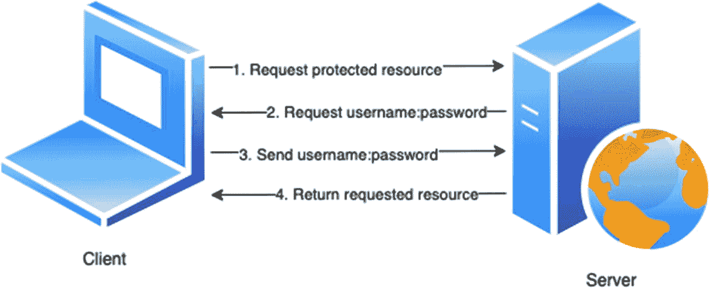

示意图描述了客户端-服务器身份验证。它包括四个步骤。1，请求受保护资源。2，请求用户名密码。3，发送用户名密码。4，返回请求的资源。

图 4-1

基本身份验证

**如何配置**

注解：

```
package enterprise.social.authentication.mechanism.http;
@Retention(RUNTIME)
@Target(TYPE)
public @interface BasicAuthenticationMechanismDefinition {
/**
* 将通过 WWW-Authenticate 标头发送的域名称。
* 
* 请注意，此域名称不会将命名身份存储配置耦合到身份验证机制。
*
* @return 域名称
*/
String realmName() default "";
}
```

Web.xml：

```
BASIC
enterprisesocialbasicrealm

```

##### 基于表单的身份验证

**它是什么**

一种身份验证机制，其中向用户呈现一个可编辑的表单，用于填写其登录凭据以登录到某个服务或系统。

**工作原理**

开发者通过自定义 HTTP 浏览器向用户显示的登录屏幕和错误页面来控制登录屏幕的*外观和感觉*。

让我们了解使用基于表单的身份验证时发生的操作序列：

1.  Web 客户端请求访问受保护的资源。

2.  如果客户端尚未通过身份验证，服务器会将其重定向到登录页面。

3.  客户端填写其用户名和密码，并将登录表单提交给服务器。

4.  服务器尝试验证用户身份。

5.  身份验证
    1.  身份验证成功后，会检查已验证用户的主体，以确保其属于有权访问该资源的角色。如果用户获得授权，服务器会使用存储的 URL 将客户端重定向到该资源。

    2.  身份验证失败后，客户端会被重定向到错误页面。

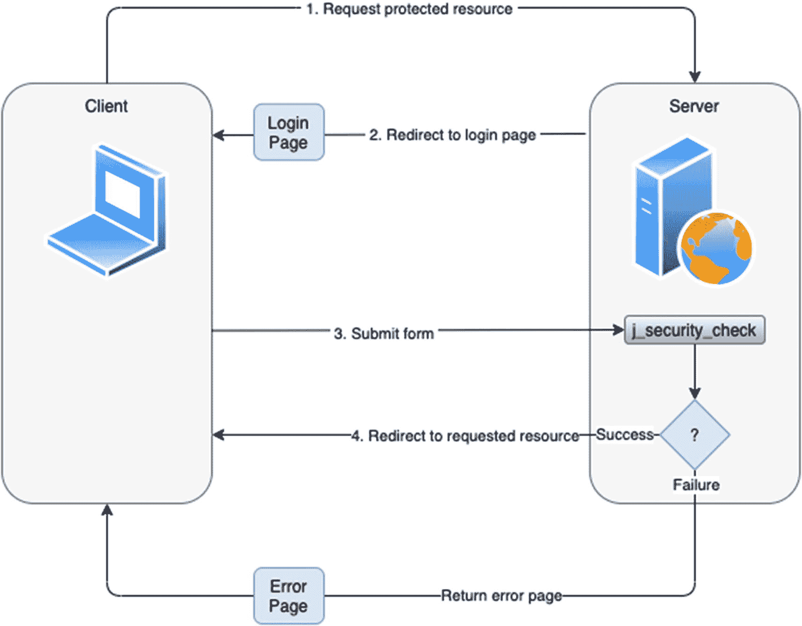

基于表单的登录身份验证的框图。它从登录页面开始，然后是请求受保护资源、重定向到登录页面、提交表单以及重定向到请求的资源。服务器执行安全检查，如果成功，则重定向到资源页面或返回错误页面。

图 4-2

基于表单的身份验证

对于基于表单的登录，请确保使用 Cookie 或 TLS 会话信息来维护会话。

**如何配置**

HTML 表单

使用基于表单的身份验证时，请务必将表单的操作标记为 `j_security_check`。因此，无论登录表单用于哪个资源，它都能正常工作。此外，显式声明此操作意味着服务器不必自己指定出站表单的操作字段。以下代码片段显示了 HTML 表单的外观：

注解：

```
package jakarta.enterprise.social.authentication.mechanism.http;
@Retention(RUNTIME)
@Target(TYPE)
public @interface FormAuthenticationMechanismDefinition {
@Nonbinding
LoginToContinue loginToContinue();
}
```

Web.xml：

```
FORM

/login.xhtml
/error.xhtml

```


##### 摘要认证

**定义**

一种与基本认证类似的认证机制，但不会以明文形式发送密码。该认证机制旨在避免基本认证中最关键的缺陷。

**工作原理**

与基本认证类似，摘要认证基于用户名和密码对用户进行身份验证，但不提供任何消息加密。它在通过网络发送用户名和密码之前，会对其应用哈希函数。也就是说，密码不会在此处通过网络明文发送，但要求认证容器能够获取明文密码的等价物，以便通过计算预期的摘要来验证接收到的认证信息。

应用流程：

1.  客户端请求访问受保护资源。
2.  服务器回复一个随机数（nonce）和 401 错误码。
3.  客户端发回一个响应，其中包含用户名、密码、领域（realm）、给定的随机数值、请求的 URI 以及 HTTP 方法的校验和（默认为 MD5 校验和）。*generate_md5_key(nonce*, *username*, *realm*, *URI*, *password_given_by_user)*。
4.  服务器获取用户名、领域和请求的 *URI*，并查找给定用户名的密码。找到后，它生成自己的版本，例如 *generate_md5_key(nonce, username, realm, URI, HTTP method, password-for-this-user-in-my-db)*。
5.  然后，服务器将自身 *generate_md5()* 的输出与客户端发送的输出进行比较：
    1.  如果匹配，则客户端发送了正确的密码。
    2.  如果不匹配，则发送的密码错误。

**如何配置**

web.xml:

```
DIGEST
enterprisesocialdigestrealm

```

##### 客户端认证

**定义**

一种认证机制，客户端通过交换数字证书来安全地获得对服务器的访问权限。

你可能会遇到术语“公钥证书”而非“数字证书”。这两个术语是等价的，目的相同。

**工作原理**

首先，需要强调的是，客户端认证是一种比基本认证或基于表单的认证更安全的认证方法。其主要优势在于使用基于 SSL 的 HTTP（HTTPS），服务器通过客户端的公钥证书来认证客户端。

虽然客户端认证可能适用于内网应用，但由于在用户注册期间向其提供客户端证书以及在注销期间撤销证书存在挑战，它在互联网上通常难以扩展。

SSL 技术为 TCP/IP 连接提供数据加密、服务器认证、消息完整性以及可选的客户端认证。

证书由证书颁发机构（CA）签发，CA 是一个受信任的组织，为持有者提供身份标识。

**如何配置**

Web.xml:

```
CLIENT-CERT

```

##### 自定义表单认证

**定义**

与基于表单的认证类似，主要区别在于认证对话框的延续方式。因此，自定义表单认证机制不是将表单回发到预定义的 `j_security_check` 操作，而是通过使用应用程序收集的凭据调用 `SecurityContext.authenticate()` 来继续认证对话框。

其余概念与基于表单的认证基本相同，因此你可以参考后者的*工作原理*和*简单应用流程*部分。

**如何定义**

```
@Retention(RUNTIME)
@Target(TYPE)
public @interface CustomFormAuthenticationMechanismDefinition {
@Nonbinding
LoginToContinue loginToContinue();
}
```

#### 身份存储

在本节中，你将了解身份存储的概念及其对安全性的重要性。同时，你将简要了解 Jakarta EE 中身份存储的基本设置，这将在下一章中扩展为深入分析。

##### 什么是身份存储？

*身份存储*是一个组件，它存储一组用户的应用特定身份信息，例如用户名、组、角色、组成员身份、权限和凭据。有时，它也可能用于存储其他信息，例如 GUID（调用者的全局唯一标识符）或其他调用者属性。

为了简化上述定义，你可以将身份存储视为一个安全特定的 DAO（数据访问对象）。

##### 身份存储的目的是什么？

*身份存储*的目的是通过访问调用者的身份属性来验证调用者的身份。也就是说，*身份存储*提供对用户信息的访问，并且是认证所必需的。

*身份存储*的四个最重要的特征如下：

1.  提供对用户信息的访问
2.  认证所必需
3.  验证凭据
4.  检索组成员身份

一个*身份存储*可以提供认证、授权或两者兼有的能力。

##### 身份存储与 Jakarta EE

更广泛的 Jakarta EE 生态系统包含多个 API，可帮助你管理 Web 应用的认证（*Jakarta Authentication*）、授权（*Jakarta Authorization*）和安全标准。Jakarta EE API 除其他外，还指定了 `IdentityStore` 接口，为身份存储提供了抽象。

实现 `IdentityStore` 使开发人员能够与身份存储交互，以认证用户（即验证其凭据）并获取调用者组。

我们认为一个好的 *IdentityStore* 实现是仅在上下文级别运行且与环境无关的（无论移植到何种环境并运行，它都会以相同的方式运行并提供相同的结果）。也就是说，一个好的 *IdentityStore* 实现提供了一个简洁的*{凭据输入，调用者数据输出}*函数。

让我们看看完整的接口（无默认行为，仅签名）并尝试更好地理解它：

```
public interface IdentityStore {
enum ValidationType { VALIDATE, PROVIDE_GROUPS }
CredentialValidationResult validate(Credential credential);
Set getCallerGroups(CredentialValidationResult validationResult);
int priority();
Set validationTypes();
}
```

*IdentityStore* 接口的两个最重要的方法如下：

*   `validate(Credential)` 验证凭据。
*   `getCallerGroups(CredentialValidationResult)` 获取调用者信息。

`IdentityStore` 实现可以根据其能力和配置选择处理其中一个或两个方法。它们可以通过使用 `validationTypes()` 方法返回的值集来提示它们处理这两个方法中的哪一个：

*   **VALIDATE** `–` 表示它处理 `validate()` 方法
*   **PROVIDE_GROUPS** `–` 表示它处理 `getCallerGroups()` 方法
*   **VALIDATE** 和 **PROVIDE_GROUPS** 组合 `–` 表示它处理两个方法

你可能会觉得声明能力相当令人困惑，但这是一个有意的决定，以确保 *IdentityStore* 的配置和实现是自主管理的。这意味着 *IdentityStore* 可以被配置为在特定部署期间支持其中一个或另一个方法，但它可以被编写为支持两个方法。


###### 验证凭证

要判断一个*凭证*是否有效，你可以使用 *validate()* 方法，该方法在验证成功后，会返回由该*凭证*所标识用户的相关信息。*IdentityStore* 可以选择不实现此方法，因为它是可选的。

```
CredentialValidationResult validate(Credential credential);
```

从方法签名可以明显看出，验证结果的类型是 `CredentialValidationResult`，它允许方法获取验证结果的状态值，并且在验证成功后，还能获取验证该凭证的存储区 ID、调用者主体、调用者在身份存储区中的唯一 ID，以及调用者的组成员身份（如果有）。

对于成功的验证，仅需要调用者主体即可。

那么 *CredentialValidationResult* 的内部机制是怎样的呢？请查看仅包含方法签名的类概览：

```
public class CredentialValidationResult {
public enum Status { NOT_VALIDATED, INVALID, VALID }
public Status getStatus();
public String getIdentityStoreId();
public CallerPrincipal getCallerPrincipal();
public String getCallerDn();
public String getCallerUniqueId();
public Set getCallerGroups();
}
```

首先，有三种不同的状态值：`NOT_VALIDATED`、`INVALID` 和 `VALID`。它们分别代表什么含义？

*   `NOT_VALIDATED –` 未尝试进行验证，因为 *IdentityStore* 不处理所提供的 *Credential* 类型。
*   `INVALID –` 验证失败。所提供的 *Credential* 无效，或者在用户存储区中未找到对应的用户。
*   `VALID –` 验证成功，用户已通过身份验证。调用者主体和组（如果有）*仅*在此结果状态下可用。

继续看 `CredentialValidationResult` 的其余方法，身份存储区 ID、调用者 DN 和调用者唯一 ID 旨在通过配合 `validate()` 和 `getCallerGroups()` 方法来帮助你实现 *IdentityStore*。即使在仅凭调用者主体名称不足以唯一标识正确用户账户的环境中，它们也可用于确保从 `getCallerGroups()` 返回正确的调用者组。

Credential 接口是一个通用接口，能够表示任何类型的令牌或用户凭证。*IdentityStore* 实现可以支持多种具体的 `Credential` 类型，其中具体的 *Credential* 是 *Credential* 接口的一个实现，代表特定类型的凭证。这是通过实现 `validate(Credential)` 方法并检查作为参数传递的 `Credential` 类型来实现的。

`IdentityStore` 接口为 `validate()` 方法提供了一个默认实现，该实现会委托给一个能够处理所提供 *Credential* 类型的方法（假设 IdentityStore 实现了该方法）：

```
default CredentialValidationResult validate(Credential credential) {
try {
return CredentialValidationResult.class.cast(
MethodHandles.lookup()
.bind(this, "validate",
methodType(CredentialValidationResult.class,
credential.getClass()))
.invoke(credential));
} catch (NoSuchMethodException e) {
return NOT_VALIDATED_RESULT;
} catch (Throwable e) {
throw new IllegalStateException(e);
}
}
```

如果传递了 `UsernamePasswordCredential`，`validate()` 会委托给 `ExampleIdentityStore` 的以下方法：

```
public class ExampleIdentityStore implements IdentityStore {
public CredentialValidationResult validate(
UsernamePasswordCredential usernamePasswordCredential) {
// 实现 ...
return new CredentialValidationResult(...);
}
}
```

###### 检索调用者信息

`getCallerGroups()` 方法检索与已验证调用者关联的组集合。这是一个可选方法，*IdentityStore* 可以选择不实现：

```
Set getCallerGroups(CredentialValidationResult validationResult);
```

这支持身份存储区的聚合，其中一个身份存储区用于验证用户身份，而一个或多个其他存储区用于检索额外的组。

在这种情况下，无需针对存储区验证调用者凭证即可查询身份存储区，这一点至关重要。

###### 声明能力

IdentityStore 接口中还有几个我们尚未讨论的方法，实现可以使用这些方法来声明其能力和序数优先级：

```
enum ValidationType { VALIDATE, PROVIDE_GROUPS }
Set DEFAULT_VALIDATION_TYPES = EnumSet.of(VALIDATE, PROVIDE_GROUPS);
default int priority() {
return 100;
}
default Set validationTypes() {
return DEFAULT_VALIDATION_TYPES;
}
```

让我们仔细看看以下几点：

*   `priority()` 允许为 IdentityStore 配置一个序数，用于指示当存在多个*身份存储区*时，应按照什么顺序查询它们。数字越小，优先级越高；也就是说，优先级值较低的 `IdentityStore` 会在优先级较高的 *IdentityStore* 之前被调用。
*   `validationTypes()` 返回一组 `ValidationType` 类型的 `enum` 常量，指示 IdentityStore 应被用于哪些目的：
    *   `VALIDATE`，表示它处理 `validate()`
    *   `PROVIDE_GROUPS`，表示它处理 `getCallerGroups()`
    *   同时包含 `VALIDATE` 和 `PROVIDE_GROUPS`，表示它处理这两个方法

*IdentityStore* 的验证类型决定了三件事：

*   仅身份验证 – 它返回的任何组数据都必须被忽略。
*   仅提供组 – 不用于身份验证，而是用于获取由不同 `IdentityStore` 验证身份的调用者的组数据。
*   同时进行身份验证和返回任何组数据。

###### 如何验证用户凭证

正如我们之前所学，我们可以使用 `HttpAuthenticationMechanism`（或其他调用者）来验证用户身份。但是，前者不应直接与 `IdentityStore` 交互，而应调用 `IdentityStoreHandler` 来验证凭证。然后 `IdentityStoreHandler` 再调用 `IdentityStore`。

那么 `IdentityStoreHandler` 接口是做什么的呢？它定义了一种调用 `IdentityStore` 来验证用户凭证的机制，并被认为是验证用户身份的一种更安全的方式。

容器提供了一个默认的 `IdentityStoreHandler` 实现，但你可以编写自己的自定义实现。

身份存储区通常与数据源（如关系数据库、LDAP 目录、文件系统或其他类似资源）存在一一对应的关系。因此，`IdentityStore` 的实现会使用特定于数据源的 API（如 JDBC、文件 IO、Hibernate/JPA、NoSQL 或任何其他数据访问机制）来发现授权数据（角色、权限等）。


### OAuth

OAuth 是一种授权协议，用于将权限委托给应用程序，使其能够代表已授予权限的用户执行操作，而无需透露用户名或密码等登录凭证。

该协议由 Twitter、Magnolia 和 Google 共同开发，并于 2010 年 4 月作为 IETF 标准（RFC 5849）注册。

OAuth 2.0 版本使用起来更简单，但常因实现方式和变体过多而受到批评。OAuth 2 于 2012 年 10 月再次由 IETF 标准化为 RFC 6749 和 6750。它不向后兼容 OAuth 1.0a。

一些著名的采用者包括 Facebook、Amazon、Google、Salesforce.com 和 Microsoft。所有相关的社交媒体 API 都基于 OAuth 1.0a 或 2.0。

图 4-3 展示了 OAuth 流程中的参与者，该流程通常也被称为“OAuth 舞蹈”。


示意图描绘了 OAuth 流程中的参与者。分别是资源所有者、客户端和服务器。

图 4-3

OAuth 参与方

*   资源所有者

*   客户端

*   服务器

要使用 OAuth，必须在目标服务上创建一个应用程序，以便为消费者或资源所有者提供一个入口点，从而允许授权服务器在资源所有者（或最终用户）批准的情况下，向第三方客户端颁发访问令牌。然后，客户端使用该访问令牌访问资源服务器上托管的受保护资源。

OAuth“舞蹈”包含三个主要步骤：

*   创建 `–` 在 OAuth 社交媒体服务中创建一个应用程序。

*   初始化 `–` 授权阶段，也称为 OAuth 舞蹈。舞蹈结束时，我们获得一个访问令牌（由公钥和密钥部分组成），用于下一步。

*   签名 `–` 每个请求都使用访问令牌和标识已获授权 OAuth 应用程序的令牌进行签名。

图 4-4 详细展示了 OAuth 1.0a 的步骤和认证流程。

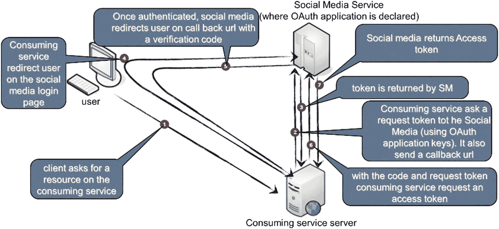

示意图描绘了 OAuth 1.0 A 的步骤和认证流程。社交媒体服务与消费服务服务器之间的通信包含七个步骤。1，客户端向消费服务请求资源。2，消费服务向媒体等请求请求令牌。

图 4-4

OAuth 1.0a “舞蹈”

图 4-5 展示了 OAuth 2 的相同流程。可以看到通信已被简化，并且所有交换现在都必须经过 SSL 加密。在 OAuth 1.0a 中，这是可选的，因此大多数实现案例都省略了它，这比 OAuth 2 带来了更大的拦截或篡改风险。

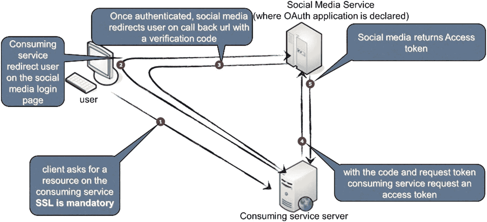

示意图描绘了 OAuth 2 的步骤和认证流程。社交媒体服务与消费服务服务器之间的通信包含五个步骤。1，请求资源。2，重定向 URL。3，社交媒体返回访问令牌。4，消费服务请求访问令牌。

图 4-5

OAuth 2 “舞蹈”

尽管 OAuth 是迄今为止社交媒体和 API 最流行的访问控制方式，但它并非真正的身份认证，而是“伪身份认证”，即应用程序专门请求一个有限访问权限的 OAuth 令牌（“代客钥匙”），而不是实际的凭证（如“护照”）；见图 4-6 和 4-7。

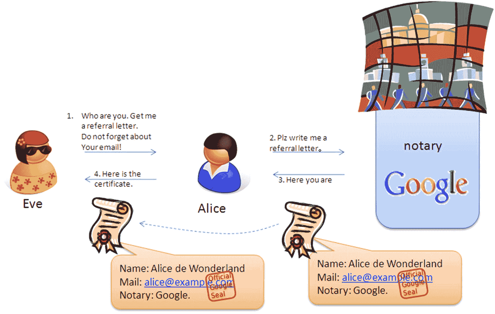

Open ID 认证的示例通信。通信发生在两位使用公证人 Google 的女性之间。

图 4-7

OpenID 认证

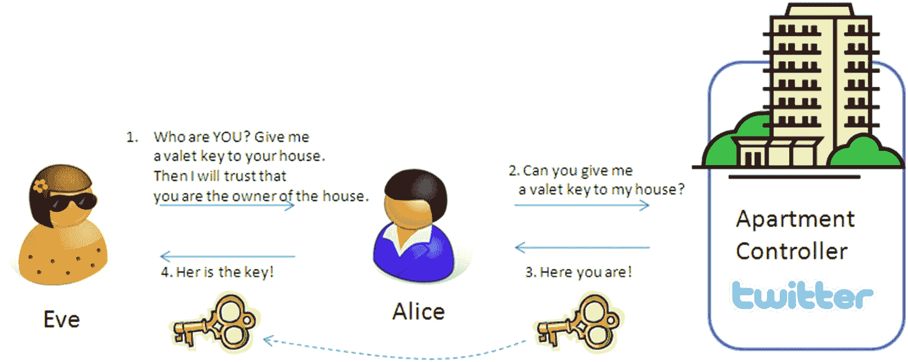

使用 OAuth 进行伪身份认证的示例通信。此处应用程序请求一个有限访问权限的 OAuth 令牌，而非实际凭证。通信发生在两位使用公寓控制器 Twitter 的女性之间。

图 4-6

使用 OAuth 的伪身份认证

### OpenID

最初的 OpenID 协议由 Brad Fitzpatrick 于 2005 年在 Six Apart 公司创建，当时他已将自己的社交网络 LiveJournal 卖给了这家博客软件公司。公司名称并非像看起来那样指代“六度分隔理论”[6]，而是指其联合创始人夫妇之间六天的年龄差。

该协议的代号是 Yadis（“Yet another distributed identity system”的缩写），但后来在 David Lehn 的建议下正式命名为 OpenID。Lehn 也曾考虑过一个类似的单点登录项目，但因时间不足，将域名“openid.net”[29] 捐赠给了 Six Apart。

图 4-8 展示了 OpenID 流程及其参与者：

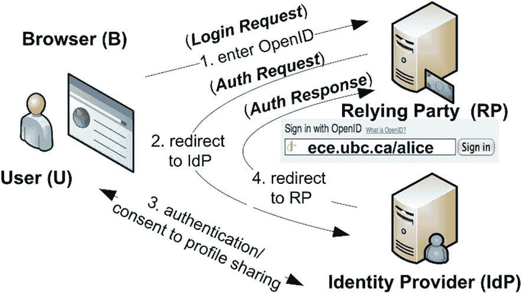

Open ID 的示意流程图。它包括用户与依赖方之间的四个过程。1，输入 Open ID。2，重定向到 IDP。3，认证同意共享个人资料。4，重定向到 RP。

图 4-8

OpenID 流程

*   浏览器

*   用户

*   依赖方

*   身份提供者

尽管 OpenID 并未被 IETF 等组织标准化，但许多大型互联网、社交媒体和电信公司都采用了它，例如 AOL、Blogger、Flickr、法国电信、Google、Hyves、LiveJournal、Microsoft、Mixi、Myspace、Novell、Orange、Sears、Sun、意大利电信、Telefonica O2、环球音乐集团、Verisign、WordPress 和 Yahoo!。

随着时间的推移，SourceForge、PayPal 和 Facebook 等其他公司也加入了 OpenID 基金会的支持者行列。然而，在过去的两三年里，OpenID 的支持者数量持续下降。Facebook 退出了 OpenID，SourceForge 也停止提供 OpenID 登录（至少在 Dice.com 从 Geeknet 接管之后），2013 年 9 月，社交登录 SaaS 提供商 Janrain 宣布其服务 MyOpenID.com 将于 2014 年 2 月 1 日关闭。

那么这是否意味着 OpenID 已经消亡？其原始形式基本如此，但至少 Google 仍对其寄予厚望。一个奇怪的巧合是，OpenID 的初始创建者 Brad Fitzpatrick 现在在 Google 工作，这可能是当大多数其他前支持者放弃 OpenID 时，该公司仍对其保持忠诚的主要原因。然而，Google 的新方案 OpenID Connect 与旧版 OpenID 的共同点并不多。它在原本成功的 OAuth 2、JSON 和 RESTful Web 服务组合之上，增加了改进的身份认证和身份管理功能。

#### OpenID Connect

OpenID Connect 由 OpenID 基金会于 2014 年 2 月底发布。当时，除了 Google，Microsoft、Salesforce.com 和德国电信也采用了它。在 2014 年巴塞罗那世界移动通信大会上，GSMA 宣布了移动版本“Mobile Connect”的计划，这足以表明它将会持续一段时间。

OpenID Connect 是可扩展的，支持可选功能，例如加密身份数据、发现 OpenID 提供者以及会话管理。

### JWT

JSON Web Token (JWT) 是根据 RFC 7519 制定的开放标准，用于通过 JSON 字符串在不同应用程序或服务之间安全地传输信息。

JWT 紧凑、可读性强，并使用身份提供者 (IdP) 的私钥或公钥对进行数字签名。因此，其他相关方可以验证令牌的完整性和真实性。

JWT 的主要目的不是隐藏数据，而是确保其真实性。JWT 主要用于签名和编码，而非加密数据，尽管令牌也可以基于另一套标准（包括 JSON Web Signature (JWS) 和 JSON Web Encryption (JWE)）进行加密。

JWT 是一种基于令牌的无状态身份认证机制。由于它基于客户端无状态会话，服务器不需要像数据库这样的持久化机制来保存会话信息。JSON Web Tokens 遵循一个定义明确且广为人知的标准，该标准正成为保护服务的最常见令牌格式。


#### 使用场景

JSON Web Token 的两个主要使用场景如下：

*   **授权**

*   **信息交换**

**授权**可能是 JWT 最常见的用例。一旦用户登录系统，后续的每个请求都会包含该 JWT，从而允许用户访问该令牌所授权的页面、服务和资源。**单点登录**是当今广泛使用 JWT 的一项功能，尤其是在公共 API 中，因为它开销小且易于跨不同域使用。

**信息交换**：JSON Web Token 是在各方之间安全传输信息的好方法。由于 JWT 可以被签名（例如，使用公钥/私钥对），您可以确信发送者身份属实。此外，由于签名是使用标头和载荷计算得出的，您还可以验证内容是否被篡改。

#### 为什么需要 JWT？

HTTP 协议是无状态的；因此，像 `GET /order/42` 这样的新请求无法了解之前具有相同 ID 的 `PUT /order` 请求的任何信息，用户必须为每个新请求重新进行身份验证。

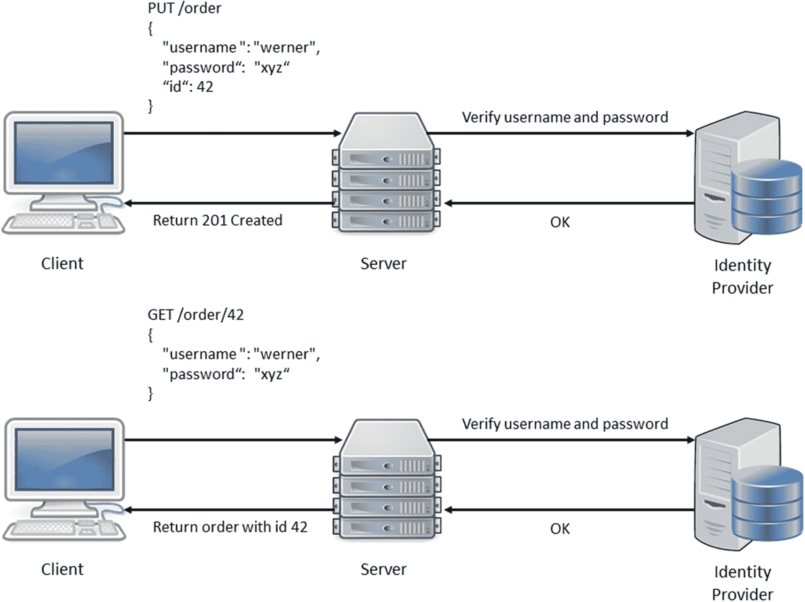

一组两个重复认证的示例。1，Put order 功能，包含用户名、密码和 ID。通信从客户端开始，验证用户名和密码，身份提供者，如果通过则转到服务器，并返回 201 Created。2，此处使用了 Get order 功能。

图 4-9

每个新的 HTTP API 请求都重复进行身份验证

这通常通过使用**服务器端会话 (SSS)** 来处理。首先，检查登录凭据（如用户名和密码），如果正确，服务器将创建一个会话 ID，存储它，并将其返回给客户端。在基于 Servlet 的 Jakarta EE 应用程序中，发送给客户端的这个 cookie 通常被称为 `JSESSIONID`。

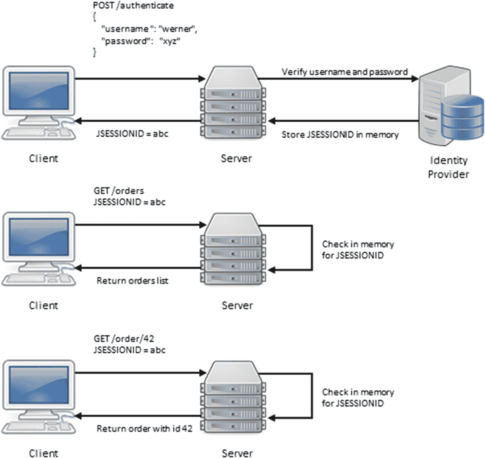

一组三个示例，描述了身份验证次数的减少。Post authenticate 包含用户名和密码。通信从客户端开始，验证用户名和密码，身份提供者，服务器，J session ID 等于 A B C，最后是客户端。

图 4-10

使用 SSS，减少针对身份提供者的身份验证次数

这种方法可以解决一个问题，但可能会产生其他问题，例如可扩展性问题。虽然服务器端会话可能适用于大多数网站甚至一些电子商务商店，但在 API 驱动的时代，某些端点可能面临大量请求，迫使提供者进行扩展。有两种扩展方式：

*   **垂直扩展**

*   **水平扩展**

垂直扩展意味着向服务器添加更多资源，如内存、存储或 CPU 核心。这可能非常昂贵，并且也会达到某些限制，例如每台服务器的 CPU 数量、内存插槽或磁盘存储。

水平扩展通过在**负载均衡器**后面添加更多服务器来扩展您的基础设施，这通常比不断升级每台服务器更高效且更具成本效益。虽然水平扩展通常更高效，但即使只有一个位置和负载均衡器，它也会导致进一步的问题和复杂性。

想象一下负载均衡器后面有一台服务器，客户端使用像 **"**`abc`**"** 这样的 `JSESSIONID` 执行请求；该会话 ID 可以在服务器的内存中找到。

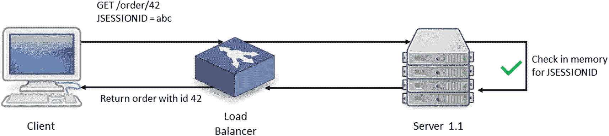

客户端和服务器之间的一个示例通信。从客户端开始，然后是 get order 42 J session equals A B C，在内存中检查 J session ID，服务器 1.1，负载均衡器，并将 ID 为 42 的订单返回给客户端。

图 4-11

负载均衡器后面的单台服务器

如果基础设施需要扩展，并且在负载均衡器后面添加了一台新服务器，这台新服务器将处理客户端使用 `"abc"` 发出的下一个请求，它将无法识别该 `JSESSIONID`。

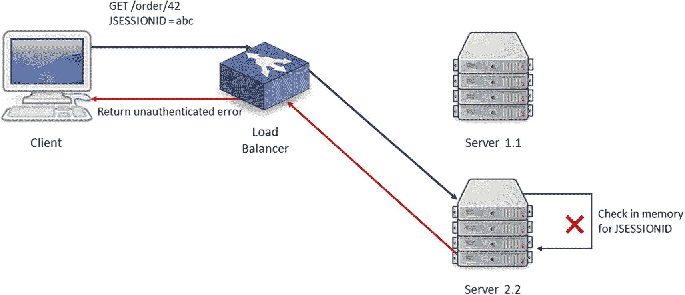

服务器和客户端之间的一个示例通信。从客户端开始，然后是 get order J session equals A B C，服务器 1.1，检查内存未识别，服务器 2.2，负载均衡器，并向客户端返回未认证错误。

图 4-12

LB 后面的新服务器，用户未被识别

身份验证失败，因为新服务器的内存中还没有 **"**`abc`**"** 会话。主要有三种解决此问题的变通方法。

在服务器之间同步会话，这可能很棘手且容易出错，尤其是在全球分布式架构中。

使用外部数据库或会话缓存机制。这可能有所帮助，但会为基础架构增加更多组件，尤其是在分布式环境中，此缓存或数据库将需要自己的复制。

或者接受 HTTP 的无状态特性，并尝试找到一种适用于它的解决方案。

这就是 JSON Web Token 发挥作用的地方，因为每个令牌都是紧凑且自包含的，它包含了允许或拒绝 API 请求所需的所有信息，而无需首先执行任何复制或昂贵的查找。

#### 它是如何工作的？

基于令牌的身份验证机制允许系统根据安全令牌对身份进行认证、授权和验证。通常，涉及以下实体：

*   **颁发者** – 负责在成功断言身份（认证）后颁发安全令牌。颁发者通常与身份提供者相关。

*   **客户端** – 由为其颁发令牌的应用程序表示。客户端通常与服务提供者相关。客户端也可以充当主体和目标服务之间的中介（委托）。

*   **主体** – 令牌中信息所指的实体。

*   **资源服务器** – 由将消费令牌以检查其是否授予对受保护资源的访问权限的应用程序表示。

无论令牌格式或应用的协议如何，从服务的角度来看，基于令牌的身份验证包括以下步骤：

1.  从请求中提取安全令牌。

    对于 RESTful 服务，通常通过从 Authorization 标头获取令牌来实现。

2.  对令牌执行验证检查。

    此步骤通常取决于令牌格式和所使用的安全协议。目标是确保令牌有效并且可以被应用程序消费。它可能涉及签名、加密和过期检查。

3.  内省令牌并提取关于主体的信息。

    此步骤通常取决于令牌格式和所使用的安全协议。目标是从令牌中获取关于主体的所有必要信息。

4.  为主体创建安全上下文。

基于从令牌中提取的信息，应用程序为主体创建一个安全上下文，以便在服务受保护资源时在必要时使用该信息。

#### JWT 结构

一个 JSON Web Token 包含三个部分：

*   **标头**

*   **载荷**

*   **签名**

每个部分由“**.**”字符分隔。

因此，每个 JWT 看起来像

```
Header.Payload.Signature
```


##### 标头

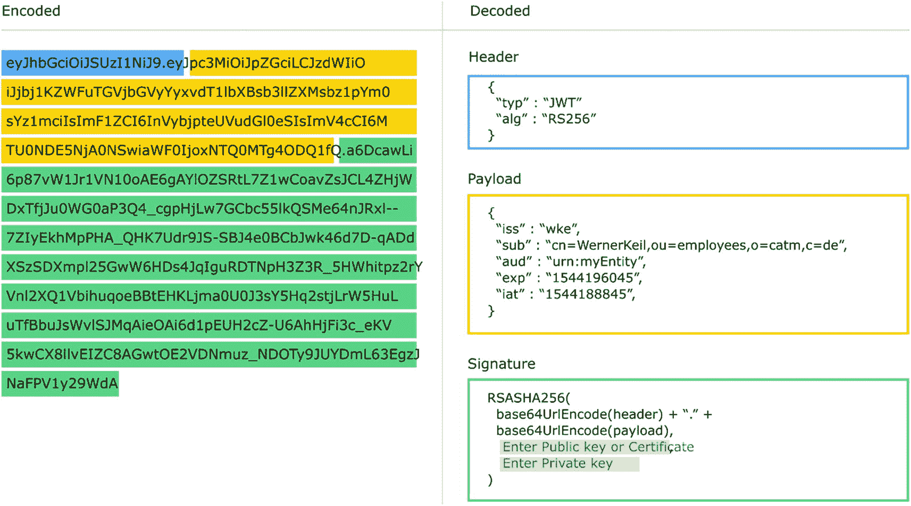

JWT 的结构。它由两部分组成：标头和解码器。标头包含令牌类型和生成签名的算法。解码部分包含标头、载荷和签名的脚本。

图 4-13

JWT 结构

标头描述了 JSON Web 令牌本身。它包含令牌类型和用于生成签名的算法的信息。算法参数 **"alg"** 必须存在于每个 JWT 标头中。最常见的算法是使用 SHA-256 哈希的 HMAC（“HS256”）或使用相同哈希的 RSA（“RS256”），以及最近出现的使用 SHA-256 的 ECDSA P-256（“ES256”）。允许的值由 JSON Web 加密（JWE）标准 RFC 7516 指定。

在我们的示例中，标头包含算法和类型参数：

```
{
"typ" : "JWT",
"alg" : "RS256"
}
```

类型参数 **"typ"** 用于声明令牌的 IANA 媒体类型（RFC 6838）。它是可选的，但设置时，其值应始终为“JWT”，代表媒体类型 `"application/jwt"`。

另一个参数 **"cty"**（内容类型）用于声明受保护内容（载荷）的媒体类型。它是可选的，并且仅在载荷包含另一个 JSON Web 令牌时才需要，在这种情况下其值应为“JWT”；否则，可以忽略或省略此参数。

参数 **"enc"**（加密算法）是为与 JWE 一起使用而定义的。仅当声明或嵌套的 JWT 令牌需要加密时才需要它。它标识用于加密声明或嵌套 JWT 令牌的加密算法。

例如，使用 256 位密钥的伽罗瓦/计数器模式（GCM）算法中的 AES 将被指定为“A256GCM”。

还有其他几个预定义的标头参数，例如：

*   crit（关键）
*   jku（JWK 集 URL）
*   jwk（JSON Web 密钥）
*   kid（密钥 ID）
*   x5u（X.509 URL）
*   x5t（X.509 证书 SHA-1 指纹）
*   x5t#S256（X.509 证书 SHA-256 指纹）

##### 载荷

载荷或主体是 JWT 的核心部分，包含安全声明，例如用户身份和授予的权限。JWT 将其称为声明。

JWT 声明名称有三种类型：

1.  注册声明
2.  公共声明
3.  私有声明

注册声明是预定义的声明。公共声明可以是任何用户定义的信息，而私有声明是 JWT 的生产者和消费者同意在特定应用程序中使用的声明。

为了验证 JWT，我们也应该检查一些注册声明。一些重要的注册声明在表 4-1 中定义。

表 4-1

注册的 JWT 声明

| 声明名称 | 描述 | 参考 |
| --- | --- | --- |
| iss | 令牌颁发者 | RFC 7519，第 4.1.1 节 |
| sub | 作为 JWT 主体的主体 | RFC 7519，第 4.1.2 节 |
| aud | JWT 的接收者 | RFC 7519，第 4.1.3 节 |
| exp | 在此时间或之后，JWT 不得被接受处理的过期时间 | RFC 7519，第 4.1.4 节 |
| nbf | 在此时间之前，JWT 不得被接受处理 | RFC 7519，第 4.1.5 节 |
| iat | 颁发者生成 JWT 的时间 | RFC 7519，第 4.1.6 节 |
| jti | JWT 的唯一标识符 | RFC 7519，第 4.1.7 节 |

##### “iss”（颁发者）声明

“iss”（颁发者）声明标识了颁发 JWT 的主体。此声明的处理通常特定于应用程序。“iss”值是一个区分大小写的字符串，包含一个 URI 值。此声明的使用是可选的。我们应该验证颁发者是一个有效的 URL，或者 JWT 是由预期的颁发者发送的。

##### “sub”（主题）声明

“sub”（主题）声明标识了作为令牌主体的主体。JWT 中的声明是关于该主体的陈述。“sub”值是一个区分大小写的字符串，包含一个 URI 值。此声明的使用是可选的。

##### “aud”（受众）声明

“aud”（受众）声明标识了令牌的接收者。每个打算处理 JWT 的主体必须使用受众声明中的一个值来标识自己。如果处理声明的主体在存在“aud”声明时未使用其中的值标识自己，则必须拒绝该 JWT。通常，“aud”值是一个区分大小写的字符串数组，每个字符串包含一个 URI 值。此声明的使用是可选的。

##### “exp”（过期时间）声明

“exp”（过期时间）声明标识了在此时间或之后令牌将不被接受处理的过期时间。处理“exp”声明要求当前日期/时间必须早于“exp”声明中列出的过期日期/时间。其值必须是一个数字时间戳。此声明的使用是可选的。

##### “nbf”（不早于）声明

“nbf”（不早于）声明标识了在此时间之前 JWT 不得被接受处理的时间。处理“nbf”声明要求当前日期/时间必须等于或晚于“nbf”声明中列出的不早于日期/时间。其值必须是一个包含数字日期值的数字。此声明是可选的。

##### “iat”（签发时间）声明

“iat”（签发时间）声明标识了令牌被签发的时间。此声明可用于确定 JWT 的时效。其值必须是一个包含数字日期值的数字。此声明是可选的。

##### “jti”（JWT ID）声明

“jti”（JWT ID）声明为 JWT 提供了一个区分大小写的唯一标识符。标识符值的分配方式必须确保同一值被意外分配给不同数据对象的概率可以忽略不计；如果应用程序使用多个颁发者，则还必须防止不同颁发者产生的值之间发生冲突。“jti”声明可用于防止 JWT 被重用。此声明的使用是可选的。

##### 签名

JSON Web 令牌的第三部分是签名。它是验证 JWT、确保其未被修改或篡改并且可以信任的最重要部分。签名是使用载荷和密钥生成的；因此，拥有此密钥的任何人都可以生成具有有效签名的新令牌。

用于生成签名的最常用的加密算法如下：

*   HS256，是 HMAC-SHA256 的缩写
*   RS256，是 RSA-SHA256 的缩写
*   ES256，是 ECDSA P-256 SHA-256 的缩写

**HS256** 是一种对称密钥加密，涉及在双方之间共享一个密钥。此密钥用于加密数据，在接收方，使用相同的密钥解密数据。HS256 签名是使用一个密钥生成的，该密钥在接收端（资源服务器）进行验证。在接收方，必须使用载荷和密钥再次生成签名，并与传入 JWT 的签名部分进行比较。由于只有认证服务器和资源服务器拥有该密钥，因此无法篡改 JWT，我们可以确保其有效性。


#### MicroProfile JWT

许多标准令人沮丧的一点是，有些标准试图面面俱到，提供海量的选择。JWT 就是如此，它允许多种类型的数字签名和大量可能的声明。虽然可能性是无限的，但如此多的选项也意味着互操作性问题的可能性是无限的。

MicroProfile JWT 的一个关键目标是，仅采用这些选项中足够的部分，以便能够以一种特别有利于微服务的方式实现跨企业的基本互操作性。

MicroProfile JWT 规范的重点是定义可用于可互操作的身份验证和授权的 JWT 所需格式。MP JWT 还将 JWT 声明映射到各种 Jakarta EE 容器 API，并通过 getter 方法提供这组声明。

该规范、API 和 TCK 的源代码可从 Eclipse [microprofile-jwt-auth](https://github.com/eclipse/microprofile-jwt-auth) GitHub 仓库获取。

MP JWT 作为令牌格式的用途取决于身份提供者和服务提供者之间的协议。这意味着身份提供者（负责颁发令牌）应能够使用 MP JWT 格式颁发可互操作的令牌，以便服务提供者能够理解，从而验证令牌并收集关于主题的信息。在这方面，MicroProfile JWT 的要求如下：

1.  可用作身份验证令牌
2.  可用作授权令牌，其中包含通过 `groups` 声明间接授予的 Jakarta EE 应用程序级角色
3.  能够支持 IANA JWT 规范中描述的其他标准声明以及非标准声明

为了满足这些要求，MP JWT 引入了两个新的声明：

*   “upn” – 一个人类可读的声明，用于在访问令牌的 MicroProfile 服务中唯一标识令牌的主题或用户主体。
*   “groups” – 令牌主体的组成员身份，这些成员身份将映射到 MicroProfile 服务容器中的 Java EE 风格应用程序级角色。

该规范（截至 2.1 版本）基于以下 Jakarta EE API 依赖项：

*   Jakarta RESTful Web Services 3.0
*   Jakarta JSON Processing 2.0
*   Jakarta JSON Binding 2.0
*   CDI 3.0
*   Jakarta Annotations 2.0

MicroProfile JWT 规范专注于微服务验证 JWT 的能力，并未定义以下内容：

*   JWT 创建 – 令牌通常由企业中的专用服务（如 API 网关或身份提供者）创建。
*   RSA 公钥分发 – 分发网关或身份提供者的公钥不在 MP JWT 的范围内。与 TLS/SSL 证书类似，它们可能不会频繁更改，手动分发或安装它们（例如，在 docker 镜像中）是一种常见做法。
*   自动 JWT 传播 – 使用 MP JWT 的微服务有一种有保证的标准方式来在传入调用中获取 JWT。但是，传播必须由微服务本身在应用程序代码中完成，方法是将 JWT 放置在传出 HTTP 调用的 Authorization 头中。

MicroProfile JWT 的一个关键目标是，每个微服务都可以验证和传播令牌。出于 HS256 问题中讨论的原因，MicroProfile JWT 仅选择基于 RSA 的数字签名。

创建 JWT 的授权服务器的 RSA 公钥可以在任何实际 HTTP 请求之前预先安装到所有微服务上。当调用到达微服务时，它将使用此 RSA 公钥来验证 JWT 并确定调用者的身份是否有效。如果微服务发出任何 HTTP 调用，它应该在这些调用中传递 JWT，将调用者的身份传播给其他微服务。

根据 JWT 标准的规定，**"alg"** 头参数必须存在。如果声明或嵌套的 JWT 令牌被加密，**"enc"** 也是一个强制性的头参数。

建议使用头参数 **"typ"** 和 **"kid"**。

虽然 JWT 规范几乎将所有注册声明都声明为可选的，但 MicroProfile JWT 要求存在以下声明：

*   iss
*   iat
*   exp

MP JWT 建议使用这些 JWT 声明：

*   sub
*   jti
*   aud

除了表 4-1 中列出的注册 JWT 声明之外，MicroProfile JWT 还定义了自己的公共声明（表 4-2）。

表 4-2

MP JWT 公共声明

| **声明名称** | **描述** | **参考** |   |
| --- | --- | --- | --- |
| upn | 在 `java.security.Principal` 接口中提供用户主体名称。此声明是必需的 | MP-JWT 2.1 规范 |   |
| groups | 提供已分配给 MP-JWT 主体的组名列表。这通常需要在应用程序容器级别映射到应用程序部署角色，但除了任何其他映射之外，还需要在组名和应用程序角色名之间进行一对一映射。此声明是可选的 | MP-JWT 2.1 规范 |   |

如果端点需要授权，建议 JWT 令牌包含一个 **"groups"** 声明，但如果令牌是由 OpenID Connect 和其他当前不支持 MP JWT 的提供者颁发的，MP JWT 实现可以从其他声明映射组。

如果无法直接从给定令牌的 **"groups"** 声明或通过自定义映射器从其他声明中提取组信息，那么如果端点仅需要身份验证，则可以接受此令牌。

**"exp"**、**"iat"** 和其他与日期相关的声明使用的数字日期值是一个 JSON 数值，表示从 `1970-01-01T00:00:00Z UTC` 到指定 UTC 日期/时间的**秒数**，忽略闰秒。

MicroProfile JWT 实现可以强制要求 JWT 令牌包含所有推荐的头部和声明。推荐的头部和声明在未来的 MP JWT 规范版本中可能会成为必需的。

一个 JSON 格式的最小 MP JWT 示例如下：

```
{
"typ": "JWT",
"alg": "RS256",
"kid": "abc-1234567890"
}
{
"iss": "https://server.example.com",
"jti": "a-123",
"exp": 1311281970,
"iat": 1311280970,
"sub": "24400320",
"upn": "jdoe@server.example.com",
"groups": ["red-group", "green-group", "admin-group"],
}
```

MicroProfile JWT 规范定义了一个 **JsonWebToken** `java.security.Principal` 接口扩展，该扩展通过 get 方法提供这组必需的声明。

## 总结

在标准化了社交媒体交互和 API 之后，本章向我们展示了社交网络的安全方面以及旨在实现安全性的标准。在下一章中，我们将探讨使用或实现其中一些标准的安全框架。

