# 5. 安全框架

前一章讨论了社交网络的安全方面以及与安全相关的标准。在本章中，我们将介绍诸如 Soteria、Keycloak、Spring Security、Micronaut Security、Apache Shiro 或 Scribe 等安全框架，它们支持授权、身份验证或两者兼有。

## Soteria

Eclipse Soteria 是 Jakarta Security 的兼容实现。

“Soteria”一词源自希腊语，意为“救援”、“福祉”或“救赎”。

### 历史

“Soteria”这个术语是在 Werner Keil 对 EG 成员进行的一项调查中选出的，当时 Soteria 是 JSR 375 的参考实现，最初作为 Java EE Security 启动。

特别是在欧洲，它也被用于医疗保健领域，通常与心理问题的诊所相关，但这纯属巧合。在 Eclipse 基金会过渡到 Jakarta EE 之后，法律团队检查了该术语可能存在的所有商标，并未发现任何问题，而其他项目，特别是“Ozark”（MVC 兼容实现），不得不更名为“Krazo”。


### 认证机制

认证机制实现的基础是 `HttpAuthenticationMechanism`，它使相应的机制可作为 CDI Bean 使用。已实现的方法 `validateRequest()` 返回一个包含该认证状态的 `AuthenticationStatus` 对象。该规范提供了用于基本认证和基于表单认证的现成机制。

Jakarta Servlet 规范定义了一种声明性机制，用于配置应用程序以提供 **BASIC**、**DIGEST**、**FORM** 或 **CERT** 认证，认证由容器根据应用程序的配置自动执行。其中，FORM 认证可以包含自定义表单页面。

此外，Jakarta EE *容器必须*支持通过配置提供的以下 `HttpAuthenticationMechanism` 类型的内置 Bean：

*   **BASIC** `–` 使用 RFC 2617 中描述的标准基本认证方案。除非使用 SSL，否则不会对凭据进行加密。除非与 SSL 一起使用，否则此类型并非安全方法。此 Bean 通过 `@BasicAuthenticationMechanismDefinition` 注解激活和配置。

*   **FORM** `–` 应用程序提供自己的自定义登录页面和错误页面。通信协议为 HTTP，可选 SSL。除非使用 SSL，否则不会对用户凭据进行加密。此 Bean 通过 `@FormAuthenticationMechanismDefinition` 注解激活和配置。

*   **自定义 FORM** – 是 FORM 的一种变体，区别在于，认证对话的继续并非像 Servlet 规范所述那样通过回发到 `j_security_check` 进行，而是通过使用应用程序收集的凭据调用 `SecurityContext.authenticate()` 进行。此 Bean 通过 `@CustomFormAuthenticationMechanismDefinition` 注解激活和配置。

*   **OpenID Connect** – 根据 OpenID Connect 规范 [29] 定义的授权码流程和刷新令牌进行认证。此 Bean 通过 `@OpenIdAuthenticationMechanismDefinition` 注解激活和配置。

Jakarta Security 提供了*必须*与 Servlet 规范匹配的 Basic 和 Form 版本，但 GlassFish 在 web.xml 中定义时不会在 Web 应用程序中使用它们，仅当通过注解定义时才会使用。

以下是 Soteria 中 `BasicAuthenticationMechanism` 的示例：

```
package org.glassfish.soteria.mechanisms;
import static java.lang.String.format;
import static jakarta.security.enterprise.identitystore.CredentialValidationResult.Status.VALID;
import static jakarta.xml.bind.DatatypeConverter.parseBase64Binary;
import static org.glassfish.soteria.Utils.isEmpty;
import jakarta.security.enterprise.AuthenticationException;
import jakarta.security.enterprise.AuthenticationStatus;
import jakarta.security.enterprise.authentication.mechanism.http.BasicAuthenticationMechanismDefinition;
import jakarta.security.enterprise.authentication.mechanism.http.HttpAuthenticationMechanism;
import jakarta.security.enterprise.authentication.mechanism.http.HttpMessageContext;
import jakarta.security.enterprise.credential.Password;
import jakarta.security.enterprise.credential.UsernamePasswordCredential;
import jakarta.security.enterprise.identitystore.CredentialValidationResult;
import jakarta.security.enterprise.identitystore.IdentityStoreHandler;
import jakarta.servlet.http.HttpServletRequest;
import jakarta.servlet.http.HttpServletResponse;
import org.glassfish.soteria.cdi.CdiUtils;
/**
* 使用基本认证进行认证的认证机制
*
* @author Arjan Tijms
*
*/
public class BasicAuthenticationMechanism implements HttpAuthenticationMechanism {
private final BasicAuthenticationMechanismDefinition basicAuthenticationMechanismDefinition;
// CDI 要求无参构造函数以实现可移植性
// 仅用于创建代理
protected BasicAuthenticationMechanism() {
basicAuthenticationMechanismDefinition = null;
}
public BasicAuthenticationMechanism(BasicAuthenticationMechanismDefinition basicAuthenticationMechanismDefinition) {
this.basicAuthenticationMechanismDefinition = basicAuthenticationMechanismDefinition;
}
@Override
public AuthenticationStatus validateRequest(HttpServletRequest request, HttpServletResponse response, HttpMessageContext httpMsgContext) throws AuthenticationException {
String[] credentials = getCredentials(request);
if (!isEmpty(credentials)) {
IdentityStoreHandler identityStoreHandler = CdiUtils.getBeanReference(IdentityStoreHandler.class);
CredentialValidationResult result = identityStoreHandler.validate(
new UsernamePasswordCredential(credentials[0], new Password(credentials[1])));
if (result.getStatus() == VALID) {
return httpMsgContext.notifyContainerAboutLogin(
result.getCallerPrincipal(), result.getCallerGroups());
}
}
if (httpMsgContext.isProtected()) {
response.setHeader("WWW-Authenticate", format("Basic realm=\"%s\"", basicAuthenticationMechanismDefinition.realmName()));
return httpMsgContext.responseUnauthorized();
}
return httpMsgContext.doNothing();
}
private String[] getCredentials(HttpServletRequest request) {
String authorizationHeader = request.getHeader("Authorization");
if (!isEmpty(authorizationHeader) && authorizationHeader.startsWith("Basic ") ) {
return new String(parseBase64Binary(authorizationHeader.substring(6))).split(":");
}
return null;
}
}
```

### 支持的运行时

Soteria 可在以下 Jakarta EE CI 运行时上运行：

*   GlassFish

*   Payara

*   WildFly

*   Open Liberty

此外，所有在“实现组件”下使用 Soteria 的实现都运行或包含它。

经过一些调整，它也可以在 TomEE 上运行，但由于 TomEE 9+ 和 Open Liberty 带有自己的 Jakarta Security 实现（不基于 Soteria），因此这些情况可能会稍微复杂一些。


### OpenID Connect 示例

让我们看看如何在 Jakarta EE Web 应用中配置 OpenID Connect 认证，使用本地 Keycloak 实例或 Google 等社交网络作为 OpenID Connect 认证提供者。

首先，我们创建一个简单的 Web 项目，例如使用 Maven Webapp 原型：

```
mvn archetype:generate
-DarchetypeGroupId=org.apache.maven.archetypes
-DarchetypeArtifactId=maven-archetype-webapp
-DarchetypeVersion=1.4
```

然后更新 POM 文件：

```
4.0.0
com.demo
jakarta-ee-oidc-example
1.0-SNAPSHOT
war
Jakarta EE 10 OIDC 示例
示例 Jakarta EE OIDC 应用
        UTF-8        UTF-8

3.10.1        3.3.2        3.3.0        3.0.0-M7        3.0.0-M7
3.0.0-M7

10.0.0

false
true

wildfly-dist
27.0.1.Final        4.0.0.Final        ${project.build.directory}/wildfly-${wildfly.version}

jakarta.platform
jakarta.jakartaee-api
${jakartaee-api.version}
provided

${project.artifactId}

org.codehaus.cargo
cargo-maven3-plugin
${cargo-maven3-plugin.version}

org.apache.maven.plugins
maven-compiler-plugin                ${maven-compiler-plugin.version}

org.apache.maven.plugins
maven-war-plugin
${maven-war-plugin.version}

org.apache.maven.plugins
maven-surefire-plugin
${maven-surefire-plugin.version}

${skip.unit.tests}

default-test
test

test

**/it/**

org.apache.maven.plugins
maven-failsafe-plugin                  ${maven-failsafe-plugin.version}
                    ${skip.integration.tests}

integration-test
integration-test

integration-test
verify

**/it/**

org.apache.maven.plugins                maven-dependency-plugin                ${maven-dependency-plugin.version}

unpack
process-classes

unpack

org.wildfly                                    ${wildfly.artifactId}                                    ${wildfly.version}
zip
false
${project.build.directory}

org.wildfly.plugins
wildfly-maven-plugin                ${wildfly-maven-plugin.version}

/subsystem=undertow/application-security-domain=other:write-attribute(name=integrated-jaspi, value=false)
reload

```

该示例配置为 WildFly 27 或更高版本，但同样适用于任何支持的运行时环境。

接下来，我们为 OIDC 认证创建一个 CDI Bean：

```
@OpenIdAuthenticationMechanismDefinition(
clientId = "${oidcConfig.clientId}",
clientSecret = "${oidcConfig.clientSecret}",
redirectURI = "${baseURL}/callback",
providerURI = "${oidcConfig.issuerUri}",
jwksConnectTimeout = 5000,
jwksReadTimeout = 5000
)
@ApplicationScoped
@Named("oidcConfig")
public class OidcConfig {
private static final Logger LOGGER = Logger.getLogger(OidcConfig.class.getName());
private String domain;
private String clientId;
private String clientSecret;
private String issuerUri;
@PostConstruct
void init() {
LOGGER.config("OidcConfig.init()");
try {
var properties = new Properties();
properties.load(getClass().getResourceAsStream("/oidc.properties"));
domain = properties.getProperty("domain");
clientId = properties.getProperty("clientId");
clientSecret = properties.getProperty("clientSecret");
issuerUri = properties.getProperty("issuerUri");
if (issuerUri == null && domain != null) {
issuerUri = ("localhost".equals(this.domain) ? "http://" : "https://") + this.domain + "/";
}
LOGGER.log(
Level.INFO,
"domain: {0}, clientId: {1}, clientSecret:{2}, issuerUri: {3}",
new Object[] {
domain,
clientId,
clientSecret,
issuerUri
});
} catch (IOException e) {
LOGGER.log(Level.SEVERE, "加载 oidc.properties 失败", e);
}
}
public String getDomain() {
return domain;
}
public String getClientId() {
return clientId;
}
public String getClientSecret() {
return clientSecret;
}
public String getIssuerUri() {
return issuerUri;
}
}
```

`PublicServlet` 是一个简单的、未受保护的 Servlet：

```
@WebServlet("/public")
public class PublicServlet extends HttpServlet {
@Override
protected void doGet(HttpServletRequest request, HttpServletResponse response) throws IOException, IOException {
response.setContentType("text/html");
response.getWriter().println("公共未受保护的 Servlet");
}
}
```

`ProtectedServlet` 是受保护的，我们还为此应用声明了角色。`foo` 角色被允许访问此 Servlet：

```
@WebServlet("/protected")
@DeclareRoles({"foo", "bar", "kaz"})
@ServletSecurity(
@HttpConstraint(rolesAllowed = "foo")
)
public class ProtectedServlet extends HttpServlet {
@Inject
private OpenIdContext context;
@Override
protected void doGet(HttpServletRequest request, HttpServletResponse response) throws IOException {
response.setContentType("text/html");
response.getWriter().println("受保护的 Servlet");
response.getWriter().println("访问令牌:" + context.getAccessToken() + "");
response.getWriter().println("令牌类型:" + context.getTokenType() + "");
response.getWriter().println("主体:" + context.getSubject() + "");
response.getWriter().println("过期时间:" + context.getExpiresIn() + "");
response.getWriter().println("刷新令牌:" + context.getRefreshToken() + "");
response.getWriter().println("声明 JSON:" + context.getClaimsJson() + "");
}
}
```

`CallbackServlet` 用于登录成功后重定向。它会重定向到 `/protected` Servlet：

```
@WebServlet("/callback")
public class CallbackServlet extends HttpServlet {
private static final Logger LOGGER = Logger.getLogger(CallbackServlet.class.getName())
@Override
protected void doGet(HttpServletRequest request, HttpServletResponse response)
throws ServletException, IOException {
LOGGER.log(Level.FINEST, "进入回调 Servlet");
String referrer = (String) request.getSession().getAttribute("Referrer");
String redirectTo = referrer != null ? referrer : request.getContextPath() + "/protected";
LOGGER.log(Level.FINEST, "在 /callback 中，重定向到: {0}", redirectTo);
response.sendRedirect(redirectTo);
}
}
```

`UserNameServlet` 显示来自 `SecurityContext` 的当前用户信息：

```
@WebServlet("/username")
@ServletSecurity(@HttpConstraint(rolesAllowed = {"foo", "bar"}))
public class UserNameServlet extends HttpServlet {
private static final Logger LOGGER = Logger.getLogger(UserNameServlet.class.getName());
@Inject
SecurityContext securityContext;
@Override
protected void doGet(HttpServletRequest request, HttpServletResponse response) throws ServletException, IOException {
String nameInRequest = request.getUserPrincipal() != null ? request.getUserPrincipal().getName() : "";
var principal = securityContext.getCallerPrincipal();
LOGGER.log(Level.INFO, "主体: {0}", principal);
var name = principal.getName();
response.setContentType("text/html");
response.getWriter().println("用户名 Servlet");
response.getWriter().println("请求 userPrincipal 中的主体名称:" + nameInRequest + "");
response.getWriter().println("主体名称:" + name + "");
response.getWriter().println("isCallerInRole('foo'):" + securityContext.isCallerInRole("foo") + "");
response.getWriter().println("isCallerInRole('bar'):" + securityContext.isCallerInRole("bar") + "");
}
}
```

为了将认证用户映射到有效的组，我们创建一个简单的 `IdentityStore` 实现：


```
@ApplicationScoped
public class AuthorizationIdentityStore implements IdentityStore {
private static final Logger LOGGER = Logger.getLogger(AuthorizationIdentityStore.class.getName());
private String email;
private Map> authorization;
@PostConstruct
void init() {
LOGGER.config("IdentityStore.init()");
try {
var properties = new Properties();
properties.load(getClass().getResourceAsStream("/oidc.properties"));
email = properties.getProperty("email", "");
LOGGER.log(
Level.INFO,
"email: {0}",
new Object[] { email });
} catch (IOException e) {
LOGGER.log(Level.SEVERE, "Failed to load oidc.properties", e);
email = "";
}
authorization = Map.of(
"user", Set.of("foo", "bar"),
email,  Set.of("foo", "bar")); // user in Google.
}
@Inject
private OpenIdContext context;
@Override
public Set validationTypes() {
return EnumSet.of(PROVIDE_GROUPS);
}
@Override
public Set getCallerGroups(CredentialValidationResult validationResult) {
var principal = validationResult.getCallerPrincipal().getName();
LOGGER.log(Level.INFO, "Get principal name in validation result: {0}", principal);
LOGGER.log(Level.INFO, "claims json:" + context.getClaimsJson());
LOGGER.log(Level.INFO, "provider json:" + context.getProviderMetadata());
var issuer = context.getProviderMetadata().getString("issuer");
if (issuer.endsWith("google.com")) { // As Google returns a long numeric user id, we try to use the email address instead
var email = context.getClaimsJson().getString("email");
return authorization.get(email) == null ? Collections.emptySet() : authorization.get(email);
} else {
return authorization.get(principal) == null ? Collections.emptySet() : authorization.get(principal);
}
}
}
```

由于 Google 会返回一个相当长的数字型 Google ID，我们通过 Jakarta JSON Processing 提供的 claims JSON 中检索 `"email"` 声明，并比较 Gmail 地址，而不是使用一长串晦涩的代理键。对于所有其他提供商（例如 Keycloak），我们将使用 `CallerPrincipal` 的名称。

要获取 Google 客户端 ID 和客户端密钥凭据，您需要使用 Google 创建一个新应用：

1.  访问 [`https://console.developers.google.com`](https://console.developers.google.com)。

2.  创建一个新项目，例如 “ApressBookDemoApp”。

3.  为该项目创建 OAuth 2.0 凭据，因为 Google 不会自动执行此操作。从侧边栏中，单击 **凭据** 选项卡，然后单击 **创建凭据**，并从下拉菜单中选择 **OAuth 客户端 ID**。

4.  Google 会提示您输入有关应用程序的一些信息，例如产品名称、主页和徽标。其中大部分是可选的。在下一页上，选择 **Web 应用程序** 类型，并输入重定向 URL，我们接下来将构建的 Jakarta EE 应用程序将在该 URL 处等待回调。输入 `http://localhost:8080/callback` 作为重定向 URL。

5.  然后您会在屏幕上看到客户端 ID 和客户端密钥。将它们下载为 JSON 并存储在安全位置。

在您的 Jakarta EE 应用程序中编辑/创建 `src/main/resources/oidc.properties`：

```
issuerUri=https://accounts.google.com
email=
clientId=
clientSecret=
```

将 `clientId` 和 `clientSecret` 的值替换为 Google JSON 文件中的值，并将 `email` 替换为有效测试用户的电子邮件地址，例如您自己的 Gmail 地址。

使用 `mvn wildfly:run` 构建/运行应用程序。现在您已准备好进行测试。

在浏览器中访问 `http://localhost:8080/public`。

您将看到页面：

```
Public Unsecured Servlet
```

接下来浏览到 `http://localhost:8080/protected`。

首次访问会将您转发到 Google ID 登录页面。成功确认您的 Google ID 后，它将重定向回受保护的页面并显示类似以下内容：

```
Protected Servlet
access token:ya29.a0AfB_…
token type:Bearer
subject:1234567890987654321
expires in:Optional[1234]
refresh token:Optional.empty
claims json:{"sub":"1234567890987654321","name":"John Doel","given_name":"John","family_name":"Doe","picture":"https://lh3.googleusercontent.com/a/ABcdefghijklmnopqrstuvwxY-z","email":"john.doel@gmail.com","email_verified":true,"locale":"xy"}
```

您还可以访问 `http://localhost:8080/username`。

它将显示类似以下内容：

```
UserName Servlet
principal name in request userPrincipal:1234567890987654321
principal name:1234567890987654321
isCallerInRole('foo'):true
isCallerInRole('bar'):true
```

`Principal` 的名称在 Google 中相当晦涩；它本质上是一个代表您 Google ID 的长数字。

## Open Liberty

Open Liberty 是 IBM 对 Eclipse MicroProfile 和 Jakarta EE 的开源实现。它是 WebSphere Liberty 应用服务器的基础。

Open Liberty 22 及更高版本实现了 Jakarta EE 10 安全规范。

### 社交媒体登录

Open Liberty 社交媒体登录功能提供了一种单点登录（SSO）形式，使用户能够通过其现有的社交媒体帐户登录到受保护的网站。

例如，您可以配置社交登录功能，以便用户可以使用其 Facebook 或 Twitter 帐户登录您的网站，而无需仅为您的网站创建帐户。您可以为任何使用 OAuth 2.0 或 OpenID Connect 1.0 标准进行授权的社交媒体平台启用社交登录功能。

要启用其社交媒体 1.0 功能，请将以下元素添加到您的 `server.xml` 文件中，位于 `featureManager` 元素内：

```
socialLogin-1.0
```

社交媒体登录功能为流行的社交媒体提供商提供了一组内置配置元素，以及通用配置元素。以下示例展示了如何在 `server.xml` 文件中配置不同场景。

#### 使用社交媒体 ID 登录

如果配置了多个社交媒体提供商，则会显示一个可定制的选择表单。然后用户可以选择他们喜欢的社交媒体提供商进行登录。以下示例展示了如何配置您的应用程序以要求用户使用其 Google ID 登录。您可以在 [`https://console.developers.google.com`](https://console.developers.google.com) 上生成您的 Google 凭据。

在此示例中，`your_app_id` 和 `your_app_secret` 是 `formlogin` 应用程序的 Google `客户端 ID` 和 `客户端密钥` 凭据。

#### 多个社交媒体提供商

您可以配置多个社交媒体提供商供用户选择。在身份验证之前，用户会收到一个可定制的选择表单，其中包含可用的提供商。以下示例包括 Google、GitHub、Facebook、LinkedIn 和 Twitter 的选择：

#### 要求用户属于企业注册表

您可以将社交媒体提供商的展示限制为仅限同时存在于另一个已配置注册表中的用户。例如，使用 `mapToUserRegistry` 属性来配置您的应用程序。用户必须通过 Google 进行身份验证，并且还要验证为公司 LDAP 注册表中的现有用户：

```
... 
```

#### 在社交媒体 ID 和企业注册表之间选择

您可以允许用户选择使用社交媒体提供商或使用其在已配置注册表中的帐户进行登录。例如，使用 `enableLocalAuthentication` 属性来配置您的应用程序，以便用户可以使用 Google ID 或其在公司 LDAP 注册表中的帐户进行登录：

```

... 
```

#### 仅为路径或浏览器的子集登录

要仅保护应用程序、URL 或 IP 地址的子集，请使用身份验证过滤器。仅当满足过滤器中的条件时，安全配置才会生效。例如，您可能希望一个 Web 应用程序使用社交媒体登录功能进行保护，而一个微服务应用程序使用 MicroProfile JWT 功能进行保护（请记住上一章的内容）。

在以下示例中，仅包含 `/mywebapp` URL 模式的请求使用 Google 凭据进行保护：


#### 其他社交媒体登录

若要使用未在 Open Liberty 中预配置的社交媒体提供商进行身份验证，请对 OAuth 提供商使用 `oauth2Login` 元素，或对 OpenID Connect 提供商使用 `oidcLogin` 元素。

这些元素提供了与该提供商协作所需的配置详细信息。这些详细信息通常可以从社交媒体提供商的开发者指南中获取。以下示例将 Instagram 配置为社交媒体提供商：


好的，作为一名高级文档工程师和翻译员，我将严格遵循您提供的注意事项和示例，将给定的英文文本翻译成中文。


#### 用于客户端认证的私钥 JWT

通过社交媒体登录功能中的 `oidcLogin` 元素配置的 OpenID Connect 客户端，支持使用 `private_key_jwt` 客户端认证方法与 OpenID Connect 令牌端点进行交互。在社交媒体登录功能中启用此功能的过程与 OpenID Connect 客户端 1.0 功能相同：

```

使用 OpenShift 服务账户进行认证和授权

社交媒体登录功能可以配置为使用 OpenShift 服务账户来认证和授权受保护的资源请求。通过此配置，服务器管理员可以保护可能产生敏感信息的端点，例如监控和指标端点。服务账户可以通过提供在 OpenShift 集群内创建的、包含在请求中的服务账户令牌来进行自身认证。以下示例展示了如何配置社交媒体登录功能，以使用 OpenShift 服务账户作为单点登录提供者：

```
`okdServiceLogin` 元素会认证 Open Liberty 接收到的所有受保护资源请求。服务账户所在的 OpenShift 项目将用作该服务账户进行授权决策的组。

使用 Active Directory 作为认证提供者

您可以配置 Open Liberty 服务器，使其使用 Active Directory 作为受保护资源的认证提供者。`oidcLogin` 元素通过使用 OpenID Connect 协议来配置社交登录。通过 OpenID Connect，发现端点 URL 提供了客户端与认证提供者（此处为 Active Directory）交互所需的信息。在以下示例中，`discoveryEndpoint` 属性指定了 Active Directory 的端点 URL：

```

Keycloak
Keycloak [66] 是一个用于应用程序和服务的开源身份、访问管理和单点登录解决方案。用户可以针对 Keycloak 进行认证，而无需针对每个单独的应用程序进行认证，从而使应用程序免于处理登录表单、认证或存储用户身份信息。Keycloak 还提供社交登录、支持桌面或移动应用程序，并能集成到其他解决方案中，包括 LDAP、Active Directory、OAuth、OpenID Connect 或 SAML。

历史
Keycloak 由 Bill Burke 和 Stian Thorgersen 于 2014 年创建。首个版本于 2014 年 9 月发布，此前开发工作已进行了大约一年。2016 年，Red Hat 将其 Red Hat SSO 产品从基于 PicketLink 框架转向 Keycloak 上游项目，此前已将 PicketLink 代码库合并到 Keycloak 中。
自那时起，Keycloak 经历了近乎狂热的发布周期和版本号变更。2016 年 6 月底，大约在 Red Hat 将 Keycloak 作为其 SSO 产品基础的时候，2.0.0 版本发布。大约一年后，3.0.0 版本问世，随后是 2018 年 6 月的 Keycloak 4.0.0。
Java 和 OpenJDK 的发布节奏（自 2021 年起，每六个月发布一个新的 JDK 主版本，每两年发布一个长期服务版本）可能对其产生了一些影响，但不仅是 Keycloak，Red Hat 的其他项目（如 WildFly）在 2019 年之后似乎也陷入了版本狂热，因为 Keycloak 5.0.0 于 2019 年 3 月发布，而 6.0.0 仅在一个月后发布。到 2019 年 11 月，版本号已跃升至 8。截至 2021 年 8 月，最新的 Keycloak 版本是 15.0.2。虽然至少在第一位数上的节奏有时看起来有所放缓，但版本 13 到 15 都是在 2021 年一年内发布的，这使得 Red Hat 看起来至少每三到四个月就会发布一个主版本，有时甚至更快，仅在 2021 年下半年略有放缓。发布说明有时只是一行文字，这让人怀疑版本号的巨大飞跃是如何合理的，但看起来是营销驱动了它，并且底层的 WildFly 版本号增长甚至比 Keycloak 还要快，达到了 25，WildFly 22 到 25 也都是在 2021 年实现的。从 17.0.0 版本开始，默认的 Keycloak 发行版从 WildFly 切换到了 Quarkus。
2023 年 4 月 10 日，Keycloak 被 CNCF 接纳为孵化项目。

概述
Keycloak 的目标是让应用程序开发者能够简单、轻松地保护其企业应用和服务的安全。

概念

Keycloak 基于以下概念：

*   认证

*   授权

*   凭据

*   领域

认证

这是一个提供者示例，用于检查请求是否满足认证器的要求：

```
package org.keycloak.authentication;
public interface Authenticator extends Provider {
/**
* 认证器的初始调用。此方法应检查当前 HTTP 请求，以确定请求是否满足认证器的要求。
* 如果不满足，则应通过调用 AuthenticationFlowContext.challenge(Response) 发送回质询响应。
* 如果此质询是认证，则表单的操作 URL 必须指向
*
* /realms/{realm}/login-actions/authenticate?code={session-code}&execution={executionId}
*
* 或
*
* /realms/{realm}/login-actions/registration?code={session-code}&execution={executionId}
*
* {session-code} 涉及从 AuthenticationFlowContext.generateAccessCode() 生成的代码。{executionId}
* 涉及从 AuthenticationFlowContext.getExecution() 获取的 AuthenticationExecutionModel.getId() 值。
*
* 操作 URL 将调用下面描述的 action() 方法。
*
* @param context
*/
void authenticate(AuthenticationFlowContext context);
/**
* 从表单操作调用。
*
* @param context
*/
void action(AuthenticationFlowContext context);
/**
* 此认证器是否要求用户已被识别？即 AuthenticationContext.getUser() 不为 null？
*
* @return
*/
boolean requiresUser();
/**
* 此认证器是否已为此用户配置？
*
* @param session
* @param realm
* @param user
* @return
*/
boolean configuredFor(KeycloakSession session, RealmModel realm, UserModel user);
/**
* 设置配置认证器的操作
*
*/
void setRequiredActions(KeycloakSession session, RealmModel realm, UserModel user);
/**
* 如果认证器与某个操作关联，请覆盖此方法
* @return
*/
default List getRequiredActions(KeycloakSession session) {
return Collections.emptyList();
}
/**
* 检查领域中的所有必需操作是否已配置并启用
* @return
*/
default boolean areRequiredActionsEnabled(KeycloakSession session, RealmModel realm) {
for (RequiredActionFactory raf : getRequiredActions(session)) {
RequiredActionProviderModel rafpm = realm.getRequiredActionProviderByAlias(raf.getId());
if (rafpm == null) {
return false;
}
if (!rafpm.isEnabled()) {
return false;
}
}
return true;
}
}
```

密码策略
许多组织都有特殊的密码策略。Keycloak 提供了丰富的密码策略，可通过管理控制台进行选择。有几种密码策略类型。密码哈希使用哈希算法。密码应符合数字、大小写字符、特殊字符或正则表达式的组合。以及常见的安全措施，例如不能包含用户名、不能多次使用相同密码或设置密码过期日期，之后必须更改密码。

认证流程
用户或服务在 Keycloak 中进行认证的一系列操作称为认证流程：

```
package org.keycloak.authentication;
public interface AuthenticationFlow {
String BASIC_FLOW = "basic-flow";
String FORM_FLOW = "form-flow";
String CLIENT_FLOW = "client-flow";
Response processAction(String actionExecution);
Response processFlow();
boolean isSuccessful();
default List getFlowExceptions(){
return Collections.emptyList();
}
}
```

Keycloak 内置了多种认证流程。这些流程可以根据需要进行配置，如果您的应用程序需要不同的流程，您可以随时从头开始创建自己的认证流程，或通过复制现有流程进行修改。

图 5-1 显示了浏览器中可用的认证流程：

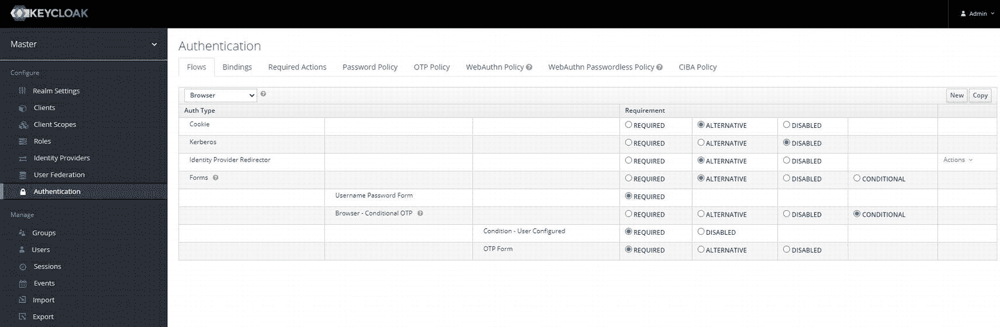

一个标题为 key cloak 的网页截图。它包含可用的认证。选项卡包括流程、发现、必需操作、密码策略、OTP 策略、webAuth N 无密码策略和 C B I A 策略。此处流程选项被高亮显示。

图 5-1
浏览器认证流程

*   Cookie

*   身份提供者重定向器

*   表单

    *   用户名/密码

    *   OTP

*   Kerberos

必须至少启用其中一个才能成功认证。

对于单点登录，Keycloak 支持两种主要协议：

*   OpenID Connect (OIDC)

*   SAML

OIDC 是首选方法，更常用于 RESTful API，而 SAML（我们将在下一节关于 Shibboleth 的内容中了解更多）在 SOAP Web 服务中更受欢迎，尤其是在学术界。
SAML 依赖于 XML 消息和文档，而 OIDC 与 REST 一样与格式无关，最常使用 JWT 作为身份和访问令牌。

对于 OIDC，Keycloak 定义了四种主要的认证流程：

*   授权码流程 – 适用于基于浏览器或服务器端的应用程序。

*   隐式流程 – 适用于基于浏览器的应用程序，此流程不如授权码流程安全，并且自 OAuth 2.1 起已弃用，因此可用于向后兼容，但不再推荐使用。

*   客户端凭据授权 – 适用于 RESTful Web 服务的消费者，涉及存储密钥，因此客户端应信任它们所使用的服务。

授权

Keycloak 支持多种授权策略，并允许组合不同的访问控制机制，例如：

*   基于属性的访问控制 (ABAC)

*   基于角色的访问控制 (RBAC)

*   基于用户的访问控制 (UBAC)

*   基于上下文的访问控制 (CBAC)

*   基于规则的访问控制

*   基于时间的访问控制

*   通过策略提供者 SPI 实现的自定义访问控制机制

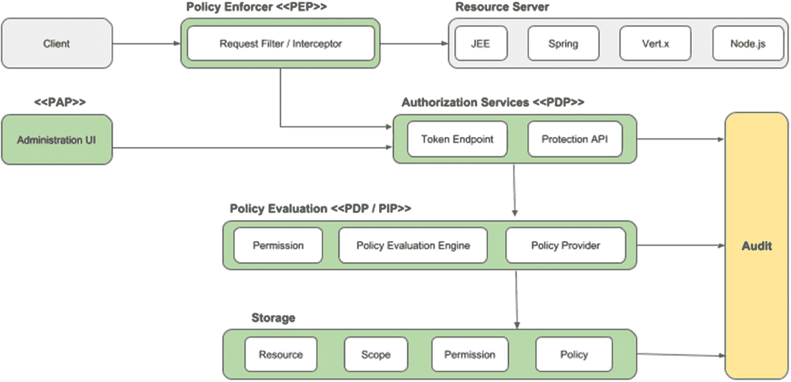

一个流程图描绘了 key cloak 的授权。客户端和服务器之间的通信包括策略执行器、资源服务器、授权服务、策略评估和存储。

图 5-2
Keycloak 授权架构

凭据
凭据是 Keycloak 用于验证用户身份的数据片段。一些例子包括密码、一次性密码、数字证书、虹膜扫描或指纹。

领域
领域允许管理一组用户、凭据、角色和组。用户属于一个领域并登录到该领域。领域之间相互隔离，只能管理和认证其控制的用户。

特性

Keycloak 的主要特性如下：

*   客户端（每个应用程序）

*   事件

*   身份提供者

    *   OpenID Connect

    *   SAML

    *   社交登录 – 允许使用 Google、GitHub、Facebook、Twitter 和其他社交网络登录

*   安全防御

*   用户界面（主题）

*   用户管理

    *   用户

    *   组

    *   角色

*   用户联合

    *   LDAP

    *   Active Directory

    *   自定义提供者

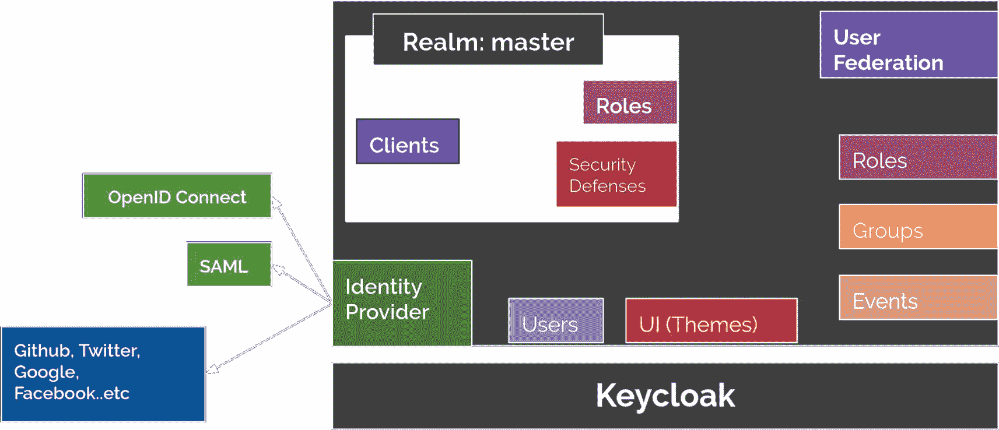

一个示意图描绘了 key cloak 的主要特性。它包括领域主控、客户端、角色和安全防御、用户联合、身份提供者、open I D connect、S A M L 和 U I 主题。

图 5-3
Keycloak 特性

客户端
Keycloak 中的客户端是希望在一个领域内认证用户的实体（应用程序或服务）。它们还可以请求身份信息或访问令牌，以便安全地调用由 Keycloak 保护的网络上的其他服务。在认证过程中，客户端需要发送其 ID 和密钥。这些凭据是通过在认证服务器上注册客户端获得的。
在一个组织中需要保护和管理许多应用程序时，为所有这些客户端配置协议映射器和作用域可能会变得繁琐。Keycloak 允许您在客户端模板中定义共享的客户端配置。

事件

Keycloak 提供了广泛的审计功能。每次交互都可以被记录和审查。有两种类型的事件：

*   登录事件

*   管理事件

每当发生与用户相关的认证操作时，就会产生登录事件，例如登录、登出、失败的登录尝试或用户账户更新时。管理事件由通过管理 API（无论是通过管理控制台、REST API 还是命令行界面）进行的每次更改触发。监听器 SPI 允许您创建插件并监听这些事件。

以下是一个将事件写入 `System.out` 的 `EventListenerProvider` 实现示例：

```
public class SysoutEventListenerProvider implements EventListenerProvider {
private Set excludedEvents;
private Set excludedAdminOperations;
public SysoutEventListenerProvider(Set excludedEvents, Set excludedAdminOpearations) {
this.excludedEvents = excludedEvents;
this.excludedAdminOperations = excludedAdminOpearations;
}
@Override
public void onEvent(Event event) {
// 忽略排除的事件
if (excludedEvents != null && excludedEvents.contains(event.getType())) {
return;
} else {
System.out.println("EVENT: " + toString(event));
}
}
@Override
public void onEvent(AdminEvent event, boolean includeRepresentation) {
// 忽略排除的操作
if (excludedAdminOperations != null && excludedAdminOperations.contains(event.getOperationType())) {
return;
} else {
System.out.println("EVENT: " + toString(event));
}
}
private String toString(Event event) {
StringBuilder sb = new StringBuilder();
sb.append("type=");
sb.append(event.getType());
sb.append(", realmId=");
sb.append(event.getRealmId());
sb.append(", clientId=");
sb.append(event.getClientId());
sb.append(", userId=");
sb.append(event.getUserId());
sb.append(", ipAddress=");
sb.append(event.getIpAddress());
if (event.getError() != null) {
sb.append(", error=");
sb.append(event.getError());
}
if (event.getDetails() != null) {
for (Map.Entry e : event.getDetails().entrySet()) {
sb.append(", ");
sb.append(e.getKey());
if (e.getValue() == null || e.getValue().indexOf(' ') == -1) {
sb.append("=");
sb.append(e.getValue());
} else {
sb.append("='");
sb.append(e.getValue());
sb.append("'");
}
}
}
return sb.toString();
}
private String toString(AdminEvent adminEvent) {
StringBuilder sb = new StringBuilder();
sb.append("operationType=");
sb.append(adminEvent.getOperationType());
sb.append(", realmId=");
sb.append(adminEvent.getAuthDetails().getRealmId());
sb.append(", clientId=");
sb.append(adminEvent.getAuthDetails().getClientId());
sb.append(", userId=");
sb.append(adminEvent.getAuthDetails().getUserId());
sb.append(", ipAddress=");
sb.append(adminEvent.getAuthDetails().getIpAddress());
sb.append(", resourcePath=");
sb.append(adminEvent.getResourcePath());
if (adminEvent.getError() != null) {
sb.append(", error=");
sb.append(adminEvent.getError());
}
return sb.toString();
}
@Override
public void close() {
}
}
```

及其工厂：

```
public class SysoutEventListenerProviderFactory implements EventListenerProviderFactory {
private Set excludedEvents;
private Set excludedAdminOperations;
@Override
public EventListenerProvider create(KeycloakSession session) {
return new SysoutEventListenerProvider(excludedEvents, excludedAdminOperations);
}
@Override
public void init(Config.Scope config) {
String[] excludes = config.getArray("exclude-events");
if (excludes != null) {
excludedEvents = new HashSet();
for (String e : excludes) {
excludedEvents.add(EventType.valueOf(e));
}
}
String[] excludesOperations = config.getArray("excludesOperations");
if (excludesOperations != null) {
excludedAdminOperations = new HashSet();
for (String e : excludesOperations) {
excludedAdminOperations.add(OperationType.valueOf(e));
}
}
}
@Override
public void postInit(KeycloakSessionFactory factory) {
}
@Override
public void close() {
}
@Override
public String getId() {
return "sysout";
}
}
```

用户联合
当您的组织拥有用户数据库时，Keycloak 允许我们与其同步。默认情况下，它支持 LDAP 和 Active Directory，但您可以使用 Keycloak 用户存储 API 为任何身份存储创建自定义扩展。
Keycloak 还可以充当用户和外部身份提供者之间的代理。

社交身份提供者
社交身份提供者可以将认证委托给受信任的社交媒体账户。Keycloak 包含对 Google、Facebook、Twitter、GitHub、LinkedIn、Microsoft 和 Stack Overflow 等社交网络的支持。

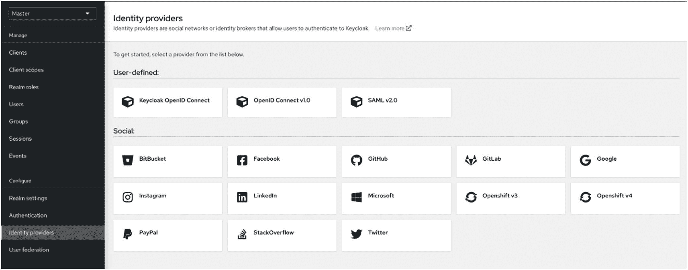

一个网页截图显示了身份提供者。它提供了用户定义和社交两种。用户定义包括 key cloak open I D connect、open I D connect V 1.0 和 S A M L-V 2.0。社交包括 Bit Bucket、Instagram、PayPal、Facebook 等。

图 5-4
社交身份提供者

Facebook

1.  在菜单中点击 ***身份提供者***。

2.  从 *添加提供者* 列表中，选择 Facebook。
    Keycloak 会显示 Facebook 身份提供者的配置页面。

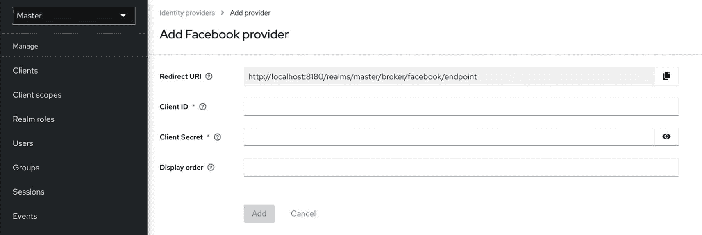

一个网页截图显示了添加 Facebook 提供者的选项。它包括重定向 U R I、客户端 I D、客户端密钥和显示顺序，以及添加和取消选项。

图 5-5
添加 Facebook 作为身份提供者

1.  将 `Redirect URI` 的值复制到剪贴板。

2.  在单独的浏览器标签页中，按照 Facebook 开发者指南的说明在 Facebook 中创建项目和客户端。

    1.  确保您的应用是网站类型。

    2.  将 `Redirect URI` 的值输入到 Facebook 网站设置块的站点 URL 中。

    3.  确保应用是公开的。

3.  将 Facebook 应用中的 `Client ID` 和 `Client Secret` 值输入到 Keycloak 中的 `Client ID` 和 `Client Secret` 字段。

4.  点击 *添加*。

5.  将所需的作用域输入到 *默认作用域* 字段。默认情况下，Keycloak 使用 `email` 作用域。有关 Facebook 作用域的更多信息，请参阅 Graph API。

默认情况下，Keycloak 向 `graph.facebook.com/me?fields=id,name,email,first_name,last_name` 发送个人资料请求。响应仅包含 `id, name, email, first_name` 和 `last_name` 字段。要从 Facebook 个人资料中获取其他字段，请添加相应的作用域，并在“其他用户个人资料字段”配置选项中添加字段名称。

Spring Security
Spring Security [67] 是一个安全框架，特别适用于 Spring Framework 或 Spring Web MVC，以及最近使用 Spring Flux 的响应式应用程序。Spring Security 是 Acegi Security（一个强大的安全框架）的延续。但问题在于，实现它需要大量繁琐的 XML 配置。Spring 从 2.0 版本开始将其纳入家族，并不断完善至当前状态。尽管 XML 配置仍然可行，但 Spring 新的“约定优于配置”精神也对其产生了影响，我们在 Jakarta EE 中也看到了同样的趋势。可以使用注解而非 XML 来执行所有安全配置，尽管为了向后兼容和利用某些灵活性，仍然保留了 XML 配置。其主要目标是处理 Web 请求和方法调用的认证和授权。

历史
Spring Security 始于二十年前，即 2003 年底，最初名为“The Acegi Security System for Spring”，由 Ben Alex 创建，源于 Spring 开发者邮件列表中关于是否存在任何基于 Spring 的安全实现的提问。当时，Spring 社区相对较小，Spring 本身也仅作为 SourceForge 上的一个项目存在，始于 2003 年初。对这个问题的回答是值得尝试，但当时由于缺乏时间和资源而未能探索。
基于此，一个简单的安全实现被构建出来，但并未发布。几周后，另一位 Spring 社区成员询问了安全问题，这个代码被提供给了他们。随后出现了其他类似的问题，到 2004 年 1 月，大约有 20 人在使用这个代码。这些初始用户后来加入了其他人，他们建议在 SourceForge 上建立一个独立的项目，该项目于 2004 年 3 月创建。
当时，该项目没有自己的认证模块。认证过程使用了 J2EE 容器管理安全，而 Acegi Security 的第一个版本则专注于授权。这在最初是合适的，但随着越来越多的用户请求对其他容器的支持，特定于容器的认证领域接口的局限性变得明显。向容器的 Classpath 添加新的 JAR 也会导致问题，这通常是管理员困惑和配置错误的常见来源。Acegi Security 认证服务被引入。大约一年后，Acegi Security 成为 Spring Framework 的官方子项目。1.0.0 最终版本于 2006 年 5 月发布——在此之前，它已被众多项目投入生产使用超过两年半，并收到了数百个改进请求和社区贡献。Acegi Security 在 2007 年底成为 Spring 的官方项目，并更名为“Spring Security”。

概述

Spring Security 基于三个主要概念：

*   认证

*   授权

*   Servlet 过滤器

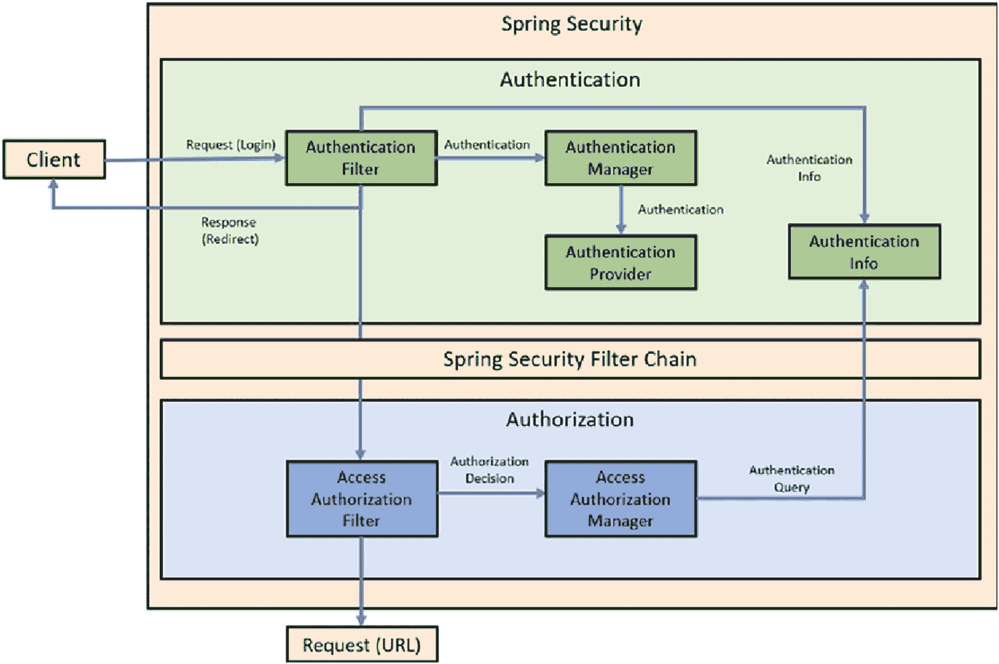

一个 Spring Security 认证和 Spring Security 过滤器链的流程图。Spring Security 从请求开始，经过认证过滤器、管理器、提供者、信息，最后是响应。过滤器链从访问授权过滤器、决策、管理器、查询等开始。

图 5-6
Spring Security 认证/授权流程

认证

Spring Security 中用于认证的主要接口是 `AuthenticationManager`，它只有一个方法 `authenticate()`。

```
public interface AuthenticationManager {
Authentication authenticate(Authentication authentication)
throws AuthenticationException;
}
```

`AuthenticationManager` 最常见的实现是 `ProviderManager`，它将任务委托给一个 `AuthenticationProvider` 实例链。`AuthenticationProvider` 类似于 `AuthenticationManager`，但它有一个额外的方法，允许调用者检查它是否支持特定的认证类型。

```
public interface AuthenticationProvider {
Authentication authenticate(Authentication authentication)
throws AuthenticationException;
boolean supports(Class authentication);
}
```

授权
Spring Security 中用于授权的主要元素是 `AccessDecisionManager`。框架提供了三种默认实现，它们都使用一个 `AccessDecisionVoter` 实例链，有点像 `ProviderManager` 使用 `AuthenticationProvider` 实例的方式。

一个 `AccessDecisionVoter<S>` 使用一个 `Authentication`（主体）和一个由 `ConfigAttribute` 装饰的安全对象：

```
boolean supports(ConfigAttribute attribute);
boolean supports(Class clazz);
int vote(Authentication authentication, S object,
Collection attributes);
```

接口 `ConfigAttribute` 封装了安全资源中的访问信息元数据。图 5-7 显示了配置属性的层次结构。

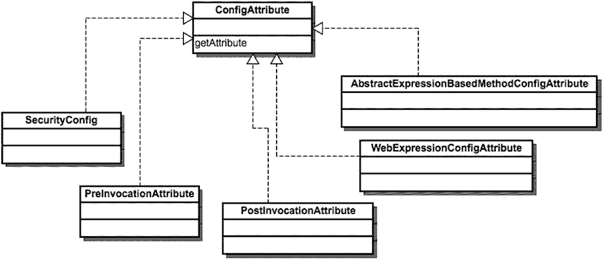

配置属性的层次结构。它包括安全配置、预调用属性、后调用属性、基于抽象表达式的方法配置属性和 Web 表达式配置属性。

图 5-7
配置属性层次结构

Servlet 过滤器

Spring Security 的 Web 层基于标准的 Jakarta EE Servlet 过滤器，尽管截至 Spring Security 和 Framework 5，最多支持 Jakarta EE 8。Spring Security 过滤器链建立在多个过滤器之上，以覆盖 Web 应用程序的不同安全约束。图 5-8 显示了单个 HTTP 请求的典型过滤器链。

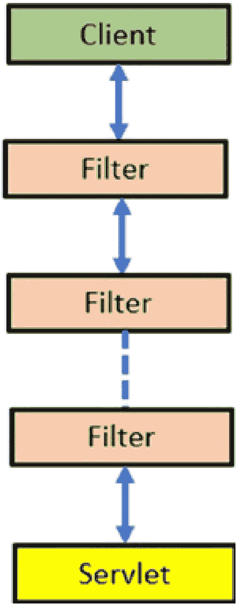

单个 H T T P 请求的典型链。它从客户端开始，然后是三个过滤器层，最后是 servlet。

图 5-8
单个 HTTP 请求的过滤器链

对于容器而言，Spring Security 基本上是一个单一的过滤器，由多个用于不同目的的过滤器组成。Spring Security 作为链中的一个单一过滤器安装。这个名为 `FilterChainProxy` 的过滤器包含了通过安全过滤器链可用的不同安全过滤器的所有详细信息。使用代理模式，它确定将为传入请求调用哪个 `SecurityFilterChain`。

以下是一个示例：

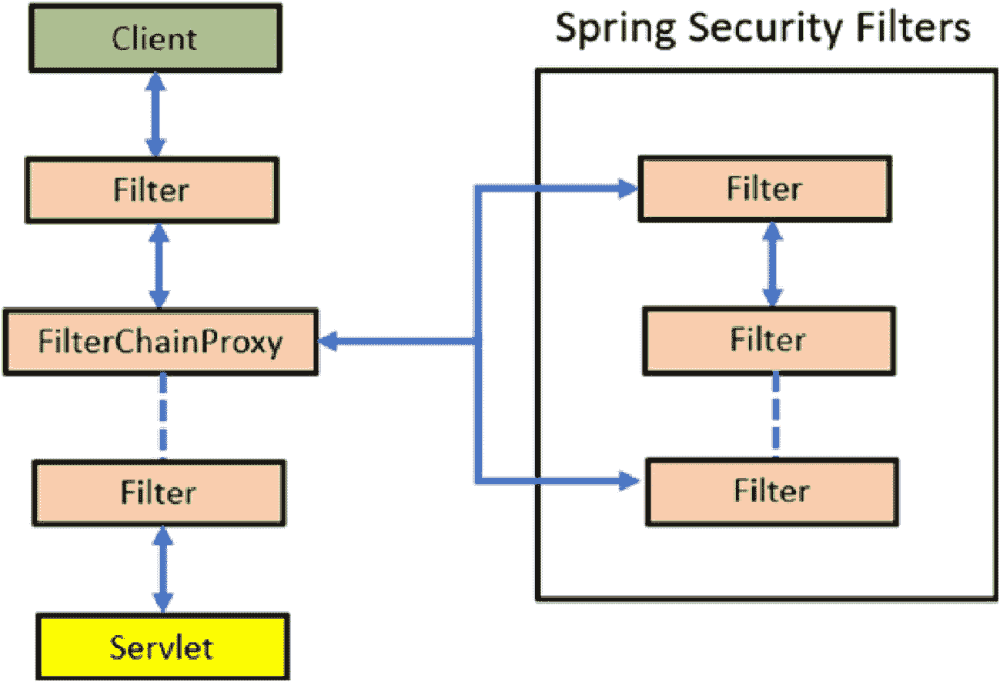

一个典型的过滤器链代理。它从客户端开始，经过过滤器、过滤器链代理、Spring Security 过滤器（包括三层过滤器），最后是 servlet。

图 5-9
过滤器链代理

然而，`FilterChainProxy` 不是直接调用的，而是通过 `DelegatingFilterProxy` 过滤器调用的。使用它，您会在 Web 应用程序的 `web.xml` 文件中看到类似这样的内容：

```
myFilter
org.springframework.web.filter.DelegatingFilterProxy

myFilter
/*

```

社交登录
Spring Security 5 内置了对 Facebook、Google 和 GitHub 等认证提供者的 OAuth 2 支持。以下是针对它们的 OAuth 2 客户端配置示例。

配置认证提供者
首先，配置您选择的社交认证提供者。

Facebook

在您的 `application.properties` 中配置 `Client ID` 和 `Client Secret`：

```
spring.security.oauth2.client.registration.facebook.client-id = 
spring.security.oauth2.client.registration.facebook.client-secret = 
```

要获取 Facebook 应用 ID 和应用密钥凭据，您需要在 [`https://developers.facebook.com/apps/`](https://developers.facebook.com/apps/) 使用 Facebook 创建一个新应用程序。

配置 HTTP 安全
接下来，使用 `@EnableWebSecurity` 注解并配置 `HTTPSecurity` 对象。

在您的项目中创建一个新的 Java 类，并使其扩展 `WebSecurityConfigurerAdapter`。使用 `@EnableWebSecurity` 注解此类：

```
import org.springframework.security.config.annotation.web.builders.HttpSecurity;
import org.springframework.security.config.annotation.web.configuration.EnableWebSecurity;
import org.springframework.security.config.annotation.web.configuration.WebSecurityConfigurerAdapter;
@EnableWebSecurity
public class WebSecurity extends WebSecurityConfigurerAdapter {
@Override
protected void configure(HttpSecurity http) throws Exception {
http.authorizeRequests()
.antMatchers("/").permitAll()
.anyRequest().authenticated()
.and()
.oauth2Login()
.and()
.logout().logoutSuccessUrl("/");
}
}
```

这将使我们的应用程序将用户重定向到社交登录提供者进行认证。一旦用户成功通过社交登录提供者认证，他们将被重定向回最初请求的受保护页面。请注意，我们还启用了登出功能并配置了登出成功 URL。

创建受保护页面

以下示例将创建一个包含名为“users”的单一资源的 Controller 类：

```
import org.springframework.security.core.annotation.AuthenticationPrincipal;
import org.springframework.security.oauth2.core.user.OAuth2User;
import org.springframework.stereotype.Controller;
import org.springframework.ui.Model;
import org.springframework.web.bind.annotation.GetMapping;
@Controller
public class UsersController {
@GetMapping("/users")
public String getUser(Model model, @AuthenticationPrincipal OAuth2User principal) {
if (principal != null) {
model.addAttribute("name", principal.getAttribute("name"));
}
return "user";
}
}
```

当请求 `/users` 资源时，我们的应用程序会将用户重定向到社交登录提供者进行认证。如果认证成功，用户将被重定向回 `/users` 资源。由于认证成功，我们可以通过 `@AuthenticationPrincipal` 注解获取当前已认证用户的信息，这将帮助我们访问 OAuth2User 对象。`OAuth2User` 是一个我们可以获取详细信息的主体对象。

Micronaut 安全
Micronaut 安全是 Micronaut 应用程序的安全框架 [68]。Micronaut 通常类似于 Spring Boot，但在大多数情况下启动时间更短。JAR 文件更小，运行时消耗的内存更少。
当然，每个“微框架”都试图在每个新版本中优化性能，这些差异可能因版本而异。

特性

Micronaut 安全的主要特性包括：

*   认证

*   授权

*   安全规则

*   安全事件

*   令牌传播

使用 Google 保护 Micronaut 应用程序
安装 Micronaut 后，请按照分步指南进行操作：[`https://guides.micronaut.io/latest/micronaut-oauth2-oidc-google-gradle-java.html`](https://guides.micronaut.io/latest/micronaut-oauth2-oidc-google-gradle-java.html)

如果您更喜欢 Maven，请在步骤 4 中调用：

```
mn create-app example.micronaut.micronautguide --build=maven --lang=java
```

Apache Shiro

Apache Shiro 是一个开源安全框架，为应用程序开发者提供直观、简单的方式来支持：

*   认证

*   授权

*   加密

*   会话管理

“shiro”这个词在日语中意为城堡。

历史
Shiro 的创建源于开发者对当时标准未能满足的需求。Les Hazlewood 和 Jeremy Haile 在 2004 年至 2008 年间在 SourceForge 上创建了一个名为 JSecurity 的安全框架，因为他们找不到适合自己需求的现有 Java 安全框架，并且 JAAS（我们在第 1 章中已经了解过）对他们来说效果不佳。他们的努力大约与 2004 年的 Acegi Security 同时开始，同样在 SourceForge 上，后者是当时最大的独立开源托管社区，很像现在的 GitHub。JSecurity 吸引了更多的提交者，包括 Peter Ledbrook、Alan Ditzel 或 Tim Veil。
2008 年，JSecurity 被提交给 Apache 软件基金会，并被其孵化器项目接纳，旨在成为 Apache 顶级项目。在 ASF 孵化器中，JSecurity 首先更名为 Ki（发音为“Key”），但由于商标问题，很快又更名为 Shiro。该项目在 Apache 孵化器中发展壮大，Kalle Korhonen 加入成为提交者。2010 年 7 月，Shiro 团队发布了其官方 1.0 版本。在第一个版本发布后，Shiro 项目创建了一个项目管理委员会 (PMC)，并选举 Les Hazlewood 为主席。2010 年 9 月 22 日，Shiro 成为 Apache 顶级项目。

概述

Shiro 基于三个核心概念：

*   主体

*   SecurityManager

*   领域

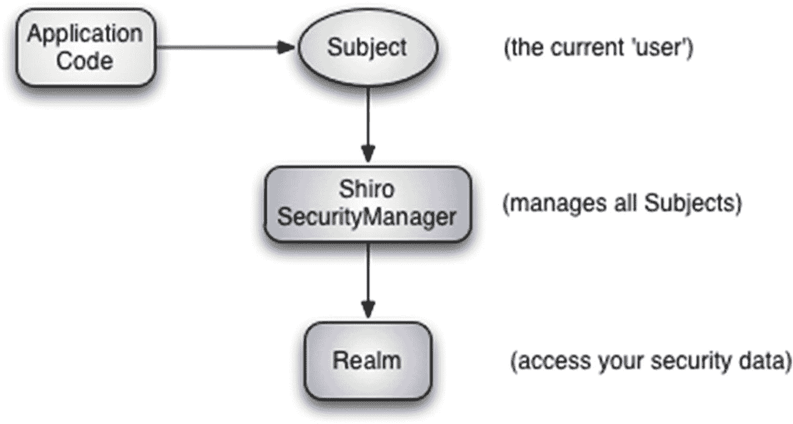

Shiro 概念的示意图流程。它从应用程序代码开始，然后是主体-当前用户、Shiro 安全管理器-管理所有主体，以及领域-访问安全数据。

图 5-10
Shiro 概念

主体
`Subject` 基本上是当前用户的“视图”。虽然“用户”暗示着人类，但“主体”也可以是服务或企业实体。

SecurityManager
`SecurityManager`（不要与即将从 JDK 中移除的 API 类型混淆）是 Shiro 架构的核心元素。

领域
领域管理一组用户、角色和权限。用户属于一个领域并登录到该领域。领域之间相互隔离，只能管理和认证其控制的用户。领域通常与数据源直接相关，例如数据库、LDAP 目录、文件系统或类似资源。

特性

图 5-11 显示了 Shiro 的主要关注点以及其他支持特性。

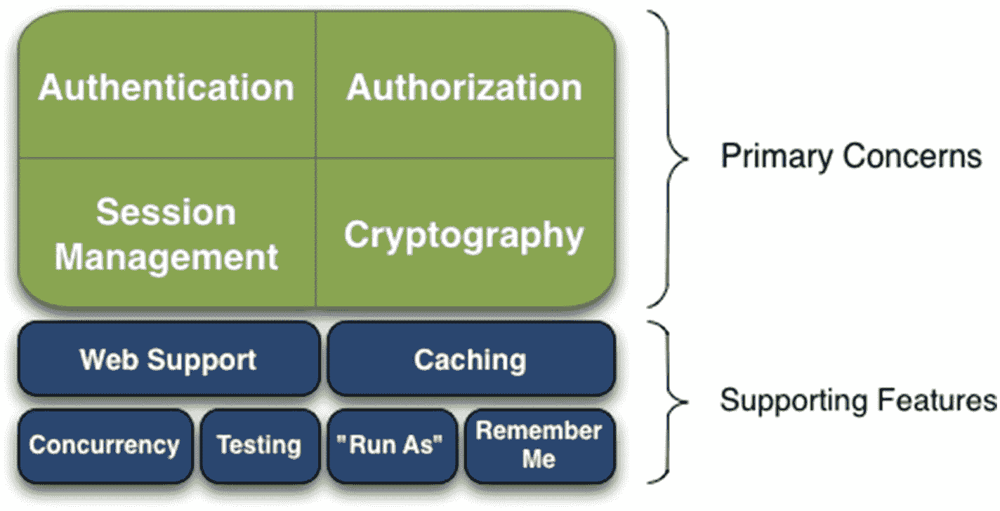

Shiro 的整体关注点和其他支持特性。主要关注点是认证、授权、会话管理和加密。支持特性是 Web 支持、缓存、并发、测试、运行即和记住我。

图 5-11
Shiro 特性

*   跨多个可插拔数据源的认证，包括：

    *   LDAP/Active Directory

    *   JDBC

    *   JNDI

*   基于角色或细粒度权限的授权

    *   判断用户是否被分配了某个角色。

    *   判断用户是否被允许执行某项操作。

*   会话管理 – 在 Web 和“无服务器”环境中使用，或任何需要单点登录、集群或分布式会话的环境中。

*   加密 – 使用超越标准 Java 密码和哈希的加密算法保护数据，且易于使用。

Shiro 的其他支持特性如下：

*   Web 支持 – 帮助保护 Web 应用程序

*   缓存，确保应用程序快速高效运行

*   并发，支持多线程应用程序

*   测试支持 – 帮助编写单元或集成测试，以检查您的应用程序是否达到预期的安全级别

*   “运行即”，允许用户承担另一个用户的身份，有点像 Linux 上的“sudo”命令

*   “记住我”，跨会话记住用户，允许他们仅在需要时登录，例如，如果会话过期

认证

Shiro 旨在使认证直观且易于使用，尽管功能多样；以下是重点：

*   基于主体

*   单一方法调用

*   详细的异常层次结构

*   内置“记住我”

*   可插拔数据源

*   使用多个领域

认证主体的步骤

认证一个 `Subject` 可以分为三个步骤：

1.  收集主体提交的主体标识和凭据。

2.  提交主体标识和凭据进行认证。

3.  如果提交成功，则授予访问权限；否则，重试认证或阻止访问。

以下是使用 Shiro API 执行这些步骤的方法：

收集主体提交的主体标识和凭据

```
//最常见的用户名/密码对场景：
UsernamePasswordToken token = new UsernamePasswordToken(username, password);
//内置“记住我”：
token.setRememberMe(true);
```

在这个例子中，我们使用了 `UsernamePasswordToken`，它支持最常见的用户名/密码认证方式。这是 Shiro 的 `org.apache.shiro.authc.AuthenticationToken` 接口的一个实现，该接口是 Shiro 认证系统的基础接口，用于表示提交的主体标识和凭据。
Shiro 不关心您如何获取这些信息：数据可能是通过 HTML 表单输入的，或者从 HTTP 头中检索的，也可能是通过命令行参数获取的。应用程序从用户收集信息的过程与 Shiro 的 `AuthenticationToken` 概念完全解耦。
您可以以任何方式构造和表示 `AuthenticationToken` 实例；它与协议无关。
此示例还表明，我们已指示 Shiro 为认证执行“记住我”服务。

授权

授权有三个主要元素：

*   权限

*   角色

*   用户（主体）

权限
权限是安全策略的一个重要方面。它们定义了在应用程序中可以执行的操作。数据元素的常见权限是创建、读取、更新和删除，通常称为 *CRUD*。

粒度

Shiro 允许在需要时定义非常细粒度的权限，可以是任何粒度，例如：

*   资源级别 – 最宽泛的定义，例如，允许用户编辑客户记录或财务信息

*   实例级别 – 特定于资源特定实例的权限，而不仅仅是通用类型，例如，允许用户访问 IBM 的客户记录，但不能访问 Red Hat 的

*   属性级别 – 允许为实例或资源的属性指定权限，例如，IBM 员工的家庭地址或工作地址

以下是一个权限示例。我们检查用户是否有权限使用“彩色打印机”进行打印，有权限的用户将看到一个“打印”按钮，其他用户则看不到。这是一个实例级别权限的示例。

```
Subject currentUser = SecurityUtils.getSubject();
Permission printPermission = new PrinterPermission("ColourPrinter","print");
If (currentUser.isPermitted(printPermission)) {
// 显示打印按钮？
} else {
// 不显示按钮？
}
```

用户

用户或“主体”（因为如前所述，它也可以是服务或企业实体）可以是您应用程序中的任何参与者。在大多数情况下，您会通过使用 `org.apache.shiro.SecurityUtils` 来获取当前的 `Subject`：

```
Subject currentUser = SecurityUtils.getSubject();
```

角色
还记得第 2 章中的 RBAC 吗；角色是一组权限，允许将权限分配给角色，而不是分配给每个单独的用户。

Shiro 提供了两种类型的角色：

*   隐式角色

*   显式角色

应用程序角色检查通常是分配一个**隐式**角色。拥有“管理员”角色的用户可以查看客户数据。角色的名称不一定与业务需求或场景相关，而**显式**角色已经附带了它所需的权限。例如，拥有“编辑者”角色的用户被分配了“发布章节”权限。

```
Realm realm = new MyPublishingRealm();
SecurityManager securityManager = new DefaultSecurityManager(realm);
SecurityUtils.setSecurityManager(securityManager);
Subject currentUser = SecurityUtils.getSubject();
if (!currentUser.isAuthenticated()) {
UsernamePasswordToken token
= new UsernamePasswordToken("user", "password");
token.setRememberMe(true);
try {
currentUser.login(token);
} catch (UnknownAccountException uae) {
log.error("用户名未找到！", uae);
} catch (IncorrectCredentialsException ice) {
log.error("无效凭据！", ice);
} catch (LockedAccountException lae) {
log.error("您的账户已被锁定！", lae);
} catch (AuthenticationException ae) {
log.error("意外错误！", ae);
}
}
log.info("用户 [" + currentUser.getPrincipal() + "] 登录成功。");
if (currentUser.hasRole("admin")) {
log.info("欢迎管理员");
} else if(currentUser.hasRole("editor")) {
log.info("欢迎，编辑者！");
} else if(currentUser.hasRole("author")) {
log.info("欢迎，作者");
} else {
log.info("欢迎，访客");
}
if(currentUser.isPermitted("chapters:write")) {
log.info("您可以编写章节");
} else {
log.info("您无权编写章节！");
}
if(currentUser.isPermitted("chapters:save")) {
log.info("您可以保存章节");
} else {
log.info("您无法保存章节");
}
if(currentUser.isPermitted("chapters:publish")) {
log.info("您可以发布章节");
} else {
log.info("您无法发布章节");
}
Session session = currentUser.getSession();
session.setAttribute("key", "value");
String value = (String) session.getAttribute("key");
if (value.equals("value")) {
log.info("检索到正确的值！[" + value + "]");
}
currentUser.logout();
```

会话管理

一旦我们获取了当前用户，我们就可以检索他们的会话：

```
Session session = currentUser.getSession();
session.setAttribute( "key", "value" );
```

`Session` 是一个 Shiro 特定的实例，包含您从 Jakarta Servlet `HttpSession` 中了解的大部分内容，并附带一些额外功能，并且它独立于 HTTP 环境。
在 Web 应用程序内部，`Session` 将基于 `HttpSession`。但在非 Web 环境中，Shiro 将默认使用自己的会话管理。这意味着您可以在应用程序中使用相同的 API，无论部署环境如何。这为“无服务器”应用程序开辟了新的可能性，因为需要会话的应用程序无需使用 HttpSession 或 EJB 有状态会话 Bean。

加密

Shiro 的主要加密方面如下：

*   简单性

*   密码特性

*   哈希特性

社交登录
以下示例展示了如何处理 Shiro 应用程序的 Facebook 登录。

创建 Facebook 应用
要获取 Facebook 应用 ID 和应用密钥凭据，您需要在 [`https://developers.facebook.com/apps/`](https://developers.facebook.com/apps/) 使用 Facebook 创建一个新应用程序。

示例代码

Facebook 用户详情：

```
package com.example.facebook;
/**
* 用于保存 Facebook 用户数据的简单类
*/
class FacebookUserDetails {
// jsonString 预期类似于：
// email
// {
// "education": [{
// "school": {
// "id": "123456789012345",
// "name": "Vienna University of Technology "
// },
// "type": "Graduate School",
// "with": [{
// "id": "123456789",
// "name": "BRG"
// }]
// }],
// "first_name": "Werner",
// "id": "123456789",
// "last_name": "Keil",
// "link":
// "http://www.facebook.com/profile.php?id=123456789",
// "locale": "de_DE",
// "name": "Werner Keil ",
// "updated_time": "2023-05-15T14:51:05+0000",
// "verified": true
// }
private String jsonString;
public FacebookUserDetails(String fbResponse){
jsonString = fbResponse;
JSONObject respJson;
try {
respJson = new JSONObject(fbResponse);
this.id = respJson.getString("id");
this.firstName = respjson.has("first_name") ? respJson.getString("first_name") : " no name" + id;
this.lastName = respJson.has("last_name") ? respJson.getString("last_name") : "";
this.email = respJson.has("email") ? respJson.getString("email") : "-no email-";
} catch (JSONException e) {
System.out.println( "fbResponse:"+fbResponse );
throw new RuntimeException(e);
}
}
public String toString(){
return jsonString;
}
public String getId() {
return id;
}
public void setId(String id) {
this.id = id;
}
public String getFirstName() {
return firstName;
}
public void setFirstName(String firstName) {
this.firstName = firstName;
}
public String getLastName() {
return lastName;
}
public void setLastName(String lastName) {
this.lastName = lastName;
}
public String getEmail() {
return email;
}
public void setEmail(String email) {
this.email = email;
}
}
```

Facebook 领域：

```
package com.example.facebook;
import java.io.ByteArrayOutputStream;
import java.io.IOException;
import java.io.InputStream;
import java.net.MalformedURLException;
import java.net.URL;
import java.util.HashMap;
import java.util.Map;
import java.util.Properties;
import org.apache.shiro.authc.AuthenticationException;
import org.apache.shiro.authc.AuthenticationInfo;
import org.apache.shiro.authc.AuthenticationToken;
import org.apache.shiro.authz.AuthorizationInfo;
import org.apache.shiro.realm.AuthorizingRealm;
import org.apache.shiro.subject.PrincipalCollection;
public class FacebookRealm extends AuthorizingRealm {
private static final Properties props = new FacebookProperties().getProperties();
private static final String APP_SECRET = props.get("fbAppSecret").toString();
private static final String APP_ID = props.get("fbAppId").toString();
private static final String REDIRECT_URL = props.get("fbLoginRedirectURL").toString();
@Override
public boolean supports(AuthenticationToken token) {
if (token instanceof FacebookToken) {
return true;
}
return false;
}
@Override
protected AuthorizationInfo doGetAuthorizationInfo(PrincipalCollection principals) {
return new FacebookAuthorizationInfo();
}
@Override
protected AuthenticationInfo doGetAuthenticationInfo(AuthenticationToken token) throws AuthenticationException {
FacebookToken facebookToken = (FacebookToken) token;
if (facebookToken.getCode() != null && facebookToken.getCode().trim().length() > 0) {
URL authUrl;
try {
authUrl = new URL("https://graph.facebook.com/oauth/access_token?" + "client_id=" + APP_ID
+ "&redirect_uri=" + REDIRECT_URL + "&client_secret=" + APP_SECRET + "&code="
+ facebookToken.getCode());
String authResponse = readURL(authUrl);
System.out.println(authResponse);
String accessToken = getPropsMap(authResponse).get("access_token");
URL url = new URL("https://graph.facebook.com/me?access_token=" + accessToken);
String fbResponse = readURL(url);
FacebookUserDetails userDetails = new FacebookUserDetails(fbResponse);
return new FacebookAuthenticationInfo(userDetails, this.getName());
} catch (MalformedURLException e1) {
e1.printStackTrace();
throw new AuthenticationException(e1);
} catch (IOException ioe) {
ioe.printStackTrace();
throw new AuthenticationException(ioe);
} catch (Throwable e) {
e.printStackTrace();
}
}
return null;
}
private String readURL(URL url) throws IOException {
ByteArrayOutputStream baos = new ByteArrayOutputStream();
InputStream is = url.openStream();
int r;
while ((r = is.read()) != -1) {
baos.write(r);
}
return new String(baos.toByteArray());
}
private Map getPropsMap(String someString) {
String[] pairs = someString.split("&");
Map props = new HashMap();
for (String propPair : pairs) {
String[] pair = propPair.split("=");
props.put(pair[0], pair[1]);
}
return props;
}
}
```

`CredentialsMatcher` 类不需要做太多工作，因为 Facebook 会为我们匹配凭据：

```
package com.example.facebook;
import org.apache.shiro.authc.AuthenticationInfo;
import org.apache.shiro.authc.AuthenticationToken;
import org.apache.shiro.authc.credential.CredentialsMatcher;
public class FacebookCredentialsMatcher implements CredentialsMatcher {
/**
* 仅确认正确的令牌类型，凭据检查由 Facebook OAuth 完成
*/
@Override
public boolean doCredentialsMatch(AuthenticationToken token, AuthenticationInfo info) {
if(info instanceof FacebookAuthenticationInfo){
return true;
}
return false;
}
}
```

然后创建一个 Facebook 令牌类，用于保存 Facebook 提供的“code”：

```
package com.example.facebook;
import org.apache.shiro.authc.AuthenticationToken;
public class FacebookToken implements AuthenticationToken {
private static final long serialVersionUID = 1L;
private final String code;
public FacebookToken(String code){
this.code = code;
}
@Override
public Object getPrincipal() {
return null; // 未知 - Facebook 执行登录
}
@Override
public Object getCredentials() {
return null; // 凭据由 Facebook 处理 - 我们不需要它们
}
public String getCode() {
return code;
}
public void setCode(String code) {
this.code = code;
}
}
```

一个 `FacebookAuthenticationInfo` 类：

```
package com.example.facebook;
import java.util.ArrayList;
import java.util.Collection;
import org.apache.shiro.authc.AuthenticationInfo;
import org.apache.shiro.subject.PrincipalCollection;
import org.apache.shiro.subject.SimplePrincipalCollection;
public class FacebookAuthenticationInfo implements AuthenticationInfo {
private static final long serialVersionUID = 1L;
private PrincipalCollection principalCollection;
public FacebookAuthenticationInfo(FacebookUserDetails facebookUserDetails, String realmName){
Collection principals = new ArrayList();
principals.add(facebookUserDetails.getId());
principals.add(facebookUserDetails.getFirstName()+" "+facebookUserDetails.getLastName());
this.principalCollection = new SimplePrincipalCollection(principals, realmName);
}
@Override
public PrincipalCollection getPrincipals() {
return principalCollection;
}
@Override
public Object getCredentials() {
return null; // 不需要凭据
}
}
```

现在创建一个 Facebook 登录 servlet 来处理来自 Facebook 的重定向：

```
package com.example.facebook;
import java.io.IOException;
import javax.servlet.ServletException;
import javax.servlet.http.HttpServlet;
import javax.servlet.http.HttpServletRequest;
import javax.servlet.http.HttpServletResponse;
import org.apache.shiro.SecurityUtils;
import org.apache.shiro.authc.AuthenticationException;
import uk.co.mrdw.shiro.facebook.FacebookToken;
/**
* 简单的 Facebook 登录处理器，使用 Apache Shiro
*/
public class FacebookLoginServlet extends HttpServlet {
private static final long serialVersionUID = 1L;
protected void doGet(HttpServletRequest request, HttpServletResponse response) throws ServletException, IOException {
String code = request.getParameter("code");
FacebookToken facebookToken = new FacebookToken(code);
try {
SecurityUtils.getSubject().login(facebookToken);
response.sendRedirect(response.encodeRedirectURL("index.jsp"));
}
catch(AuthenticationException ae){
throw new ServletException(ae);
}
}
protected void doPost(HttpServletRequest request, HttpServletResponse response) throws ServletException,
IOException {
System.out.println("doPost 期间出错...");
}
}
```

shiro.ini:

```
[main]
realmA = com.example.dao.RoleSecurityJdbcRealm
fbCredentialsMatcher = com.example.shiro.facebook.FacebookCredentialsMatcher
realmB = com.example.shiro.facebook.FacebookRealm
realmB.credentialsMatcher = $fbCredentialsMatcher
securityManager.realms = $realmA, $realmB.ini:
```

Scribe
Scribe 项目内置了对许多使用 OAuth 的流行服务的支持，例如 Facebook、Twitter、Google 或 LinkedIn。它的外部依赖非常少，主要是 Apache Commons Codec，允许无缝集成到解决方案中，而无需承担许多更大、更复杂的解决方案所面临的依赖冲突风险。

在 Scribe 中调用 OAuth 提供者可以像下面的一行代码一样简单：

```
OAuthService service = new ServiceBuilder()
.provider(LinkedInApi.class)
.apiKey(YOUR_API_KEY)
.apiSecret(YOUR_API_SECRET)
.build();
```

在 Agorava 0.6 版本之前，Scribe 是其 OAuth 功能的核心。从 Agorava 0.7 开始，它被 JBoss PicketLink 取代。
虽然后者已不再由 Red Hat 积极开发，并被 Keycloak 取代，但 Scribe 仍在维护，大约每年更新一次，最近一次更新是在 2023 年 1 月。

遗留框架
其中一些框架仍被产品和服务使用，但它们的贡献者已不再积极维护。

PicketLink
PicketLink 是 Red Hat/JBoss 中间件生态系统中多个安全相关项目的总称。虽然 Agorava 从未是官方的 JBoss 项目，但它是为其生态系统和 CDI 等标准而创建的。因此，通过 PicketLink 支持 OAuth 和 Java EE 安全对 Agorava 来说似乎是合乎逻辑的一步。
PicketLink 是一个用于 Java EE 应用程序的应用安全框架。它提供了用于认证用户、授权访问应用程序业务方法、管理应用程序的用户、组、角色和权限等功能。

以下是 PicketLink 解决的八大 Java 应用程序安全问题：

1.  为应用程序添加安全性的最佳方法是什么？

2.  如何认证和授权用户？

3.  如何控制对类和方法的访问？

4.  如何为我的应用程序添加身份和访问管理 (IAM)？

5.  如何为我的 SaaS（软件即服务）应用程序创建安全的多租户架构？

6.  如何在我的应用程序中启用基于 SAML（安全断言标记语言）的单点登录？

7.  如何为我的 REST 层和 API 添加认证和授权？

8.  我的应用程序如何让用户使用他们的 Facebook、Twitter 或 Google 账户进行认证？

图 5-12 显示了 PicketLink 的概述、其关键组件以及它支持的技术。一些标记为“即将推出”的功能仍在开发中，并未随 PicketLink 的 GA（通用版或“稳定版”）版本一起发布。

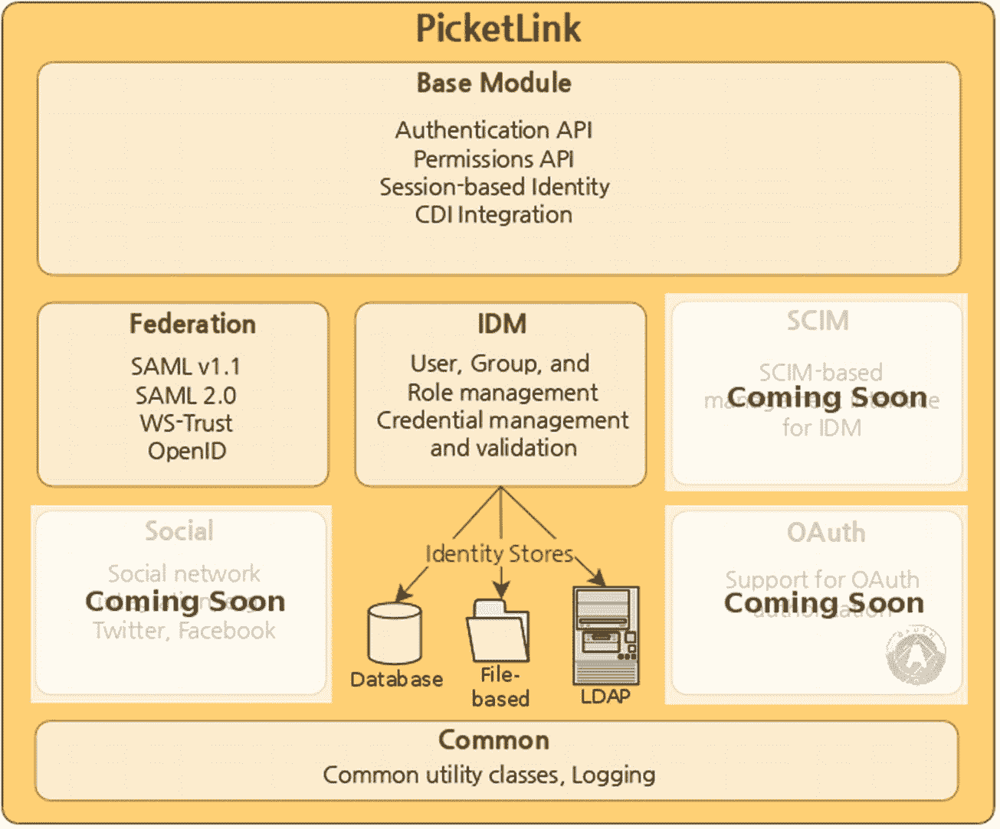

PicketLink 的示意图。它包括基础模块、联合和 I D M。身份存储包括数据库、基于文件和 L D A P。

图 5-12
PicketLink 概述

然而，Agorava 主要使用 PicketLink 的基础功能，如认证 API 或 CDI 集成，并添加了自己专门的 OAuth 和社交连接功能。

通过认证流程的“舞蹈”由 PicketLink 元素 Authenticator 执行。以下是如何扩展 `BaseAuthenticator` 的示例：

```
@PicketLink
public class SimpleAuthenticator extends BaseAuthenticator {
@Inject DefaultLoginCredentials credentials;
@Override
public void authenticate() {
if ("agentsmith".equals(credentials.getUserId()) &&
"matrix123".equals(credentials.getPassword())) {
setStatus(AuthenticationStatus.SUCCESS);
setAccount(new User("agentsmith"));
} else {
setStatus(AuthenticationStatus.FAILURE);
FacesContext.getCurrentInstance().addMessage(null, new FacesMessage("认证失败 - 您提供的用户名或密码无效。"));
}
}
}
```

下一章中的“Agorava PicketLink”将更详细地展示 PicketLink 如何被 Agorava Core 及其 PicketLink 模块应用。

SocialAuth
SocialAuth 是一个用于 Java 和 Android 的认证库。

其特性包括：

*   认证

    *   通过外部 OAuth 提供者，如 Gmail、Hotmail、Yahoo、Twitter、Facebook、LinkedIn、Foursquare、Myspace、Salesforce、Yammer、Google Plus 和 Instagram

    *   通过 OpenID 提供者

*   简单的用户注册

*   从社交网站导入联系人

以下是一个使用 SocialAuth 通过 CDI 更新状态的示例：

```
@RequestScoped
@Named("socialAuthUpdateStatus")
public class UpdateStatus implements Serializable {
private static final Logger log = Logger.getLogger(UpdateStatus.class);
@Inject
SocialAuth socialauth;
String statusText;
/**
* 更新个人资料状态的方法。
*
* @param ActionEvent
* @throws Exception
*/
public void updateStatus() throws Exception {
final HttpServletRequest request = (HttpServletRequest) FacesContext                        .getCurrentInstance().getExternalContext().getRequest();
String statusText = request.getParameter("statusMessage");
if (statusText != null && !statusText.equals("")) {
socialauth.setStatus(statusText);
socialauth.updateStatus();
setStatus("状态更新成功");
System.out.println("状态文本:" + statusText);
}
}
public String getStatus() {
return statusText;
}
public void setStatus(String statusText) {
this.statusText = statusText;
}
}
```

OACC
OACC，发音为“oak”（像 Java 的原始代码名称），是一个 Java API，用于实施和管理应用程序的认证和授权需求。OACC 提供基于权限的授权服务来实施应用程序安全。

其特性包括：

*   认证

*   身份委托

*   数据存储

*   基于权限的安全模型

*   授权

*   RBAC 建模

*   权限委托

*   多租户

*   缓存

以下是一个示例应用程序：

```
public class OACCSampleApplication {
public static void main(String[] args) throws Exception {
// 获取到 oacc 数据库的连接
String url = "jdbc:postgresql://localhost/oaccdb?user=oaccuser&password=oaccpwd";
try (Connection con = DriverManager.getConnection(url)) {
// 获取访问控制上下文
AccessControlContext accessControlContext =
SQLAccessControlContextFactory.getAccessControlContext(con,"OACC",                                                                        SQLProfile.PostgreSQL_9_3_RECURSIVE,                                BCryptPasswordEncryptor.newInstance(12));
// 创建新管理员
createAdmin(accessControlContext);
// 创建新用户
createUser(accessControlContext);
// 以管理员身份登录
loginAdmin(accessControlContext, "adminJoe", "pa55w0rd");
// 尝试在以管理员身份登录时更新用户
updateUser(accessControlContext, "jsmith");
}
}
private static void createAdmin(AccessControlContext accessControlContext) {
// 以系统资源（超级用户）身份进行认证，以设置初始管理员
accessControlContext.authenticate(Resources.getInstance(0),                                        PasswordCredentials.newInstance("yourOaccSystemPassword".toCharArray()));
// 在您的应用程序中持久化管理员，例如：
AppAdmin admin = new AppAdmin.Builder()
.login("adminJoe")
.email("joeBloe@company.com")
.build().create();
// 创建对应的 OACC 资源
final Resource adminResource
= accessControlContext.createResource("ADMIN",                                                  "APP_DOMAIN", admin.getLogin(),                                                  PasswordCredentials.newInstance("pa55w0rd".toCharArray()));
System.out.println("创建了新的 ADMIN 资源，Id=" + adminResource.getId());
// 授予查询、查看和停用任何用户账户的权限，但不能编辑
Set permissions = new HashSet();
permissions.add(ResourcePermissions.getInstance(ResourcePermissions.QUERY));      permissions.add(ResourcePermissions.getInstance("VIEW"));      permissions.add(ResourcePermissions.getInstance("DEACTIVATE"));
accessControlContext.setGlobalResourcePermissions(adminResource, "USER", "APP_DOMAIN", permissions);
accessControlContext.unauthenticate();
}
private static void createUser(AccessControlContext accessControlContext) {
// 在您的应用程序中持久化用户
// 例如 UserHOME.create("jsmith", "Jane", "Smith", "jsmith@mail.com", userResource.getId())
// 例如：
AppUser user = new AppUser.Builder()
.login("jsmith")
.firstName("Jane").lastName("Smith")
.email("jsmith@mail.com")
.build().create();
// 不必经过认证即可创建用户，因为资源类设置了 unauthenticatedCreateAllowed-flag
final Resource userResource
= accessControlContext.createResource("USER",                                                  "APP_DOMAIN", user.getLogin(),                                                  PasswordCredentials.newInstance("pa$$word1".toCharArray()));
System.out.println("创建了新的 USER 资源，Id=" + userResource.getId());
}
private static void loginAdmin(AccessControlContext accessControlContext, String adminLogin,  String password) {
// 以管理员资源身份进行认证      accessControlContext.authenticate(Resources.getInstance(adminLogin),                                        PasswordCredentials.newInstance(password.toCharArray()));
}
private static void updateUser(AccessControlContext accessControlContext, String userLogin) {
// 在尝试加载用户之前，断言已认证的管理员具有 VIEW 权限      accessControlContext.assertResourcePermissions(accessControlContext.getSessionResource(), Resources.getInstance(userLogin),                       ResourcePermissions.getInstance("VIEW"));
// 加载用户信息并修改本地副本
AppUser user = new AppUser.Finder().findByLogin(userLogin);
user.setEmail("other@mail.com");
// 在尝试保存用户之前，断言已认证的管理员具有 EDIT 权限      accessControlContext.assertResourcePermissions(accessControlContext.getSessionResource(),             Resources.getInstance(userLogin),                                                     ResourcePermissions.getInstance("EDIT"));
// 保存用户
// !注意！我们不会到达这里，因为 adminResource 对 userResource 没有 EDIT 权限
user.save();
}
}
```

总结
在上一章概述了社交媒体安全及相关安全标准之后，我们在本章学习了 Java 平台的重要安全框架以及如何将它们与社交网络结合使用。

6. 社交框架

上一章讨论了 Soteria、Keycloak 或 Spring Security 等安全框架。在本章中，我们将介绍 Meta Business SDK、Twitter4J、Twitter API Client 等社交框架，Agorava、Spring Social 或 Facebook4J 等遗留框架，以及用于特殊目的或垂直社交网络的框架。

Meta

Meta Platforms 拥有多种社交产品：

*   Facebook

*   Instagram

*   (Facebook) Messenger

*   WhatsApp

*   Threads

*   Horizon Worlds 等 VR 产品

其合并用户群是所有社交网络中最庞大的。超过 2 亿家企业使用 Facebook，超过 700 万广告商积极在 Facebook/Meta 上推广其业务。
这足以说明，与其他一些大型社交网络不同，Meta 提供了大量 SDK，包括专门的业务 SDK，并支持多种编程语言。

Meta 最活跃的两个 Java 业务 API 如下：

*   Meta Business SDK – Meta 官方的业务 SDK 套件

*   WhatsApp Business Java API SDK – 一个社区驱动的 Java WhatsApp 业务 SDK。目前优于 Meta 官方的 Java WhatsApp SDK，因为它们尚未提供强大的 Java 对象模型

Meta Business SDK
Meta Business SDK [36] 提供了对各种 Meta 业务 API 的访问。它是 Facebook Marketing API SDK 的演进版本，包括 Marketing API 和其他 Meta API，如 Pages、Business Manager、Instagram 等，允许构建能够无缝集成一系列 Meta 服务的定制化企业解决方案。

概述

Meta Business SDK 由以下部分组成：

*   Business Manager API – 允许管理 Facebook 页面和广告账户的 Meta 资产、权限和广告活动

*   Pages API – 允许管理 Facebook 上的业务存在和社区

*   Marketing API – 允许管理广告产品、创建、编辑或删除广告，并分析其效果

*   Instagram Graph API – 允许管理 Instagram 上的企业存在

**WhatsApp 在哪里？**
虽然企业存在 WhatsApp (Meta) 业务账户，但 WhatsApp 支持目前不是 Meta Business SDK 的一部分。
目前，Java 和其他语言对此 API 的支持比通过 Business SDK 对其他 Meta 服务的支持更为基础。它主要依赖于从您选择的语言进行的 REST/HTTP 客户端调用。我们将在此处展示一个 Java 的 WhatsApp 示例，但社区以 WhatsApp Business Java API SDK 的形式提供了一个更方便的 Java 封装。

冒烟测试
以下步骤说明了如何使用 Maven 安装 Meta Business SDK for Java 并测试安装。

前提条件

您需要以下内容：

*   一个 Meta 开发者账户

*   在 [`https://developers.facebook.com/`](https://developers.facebook.com/) 上注册的 Meta 应用

*   您的应用密钥

*   一个访问令牌

*   一个广告账户

按照以下步骤安装 SDK 并测试您的应用程序：

1.  使用您选择的 IDE 创建一个 Maven 项目后，将以下依赖项添加到您的 `pom.xml` 文件中：

    ```

    com.facebook.business.sdk
    facebook-java-business-sdk
    [8.0.3,)

    ```

2.  创建一个名为 `SmokeTestFBJavaSDK` 之类的 Java 类，并添加以下代码。请注意，{access-token}、{appsecret} 和 {adaccount-id} 是您实际值的占位符。确保适当地外部化它们，尤其是在与他人共享时：

    ```
    import com.facebook.ads.sdk.APIContext;
    import com.facebook.ads.sdk.APINodeList;
    import com.facebook.ads.sdk.AdAccount;
    import com.facebook.ads.sdk.Campaign;
    public class SmokeTestFBJavaSDK
    {
    public static final APIContext context = new APIContext(
    "{access-token}",
    "{appsecret}"
    );
    public static void main(String[] args)
    {
    AdAccount account = new AdAccount("act_{{adaccount-id}}", context);
    try {
    APINodeList campaigns = account.getCampaigns().requestAllFields().execute();
    for(Campaign campaign : campaigns) {
    System.out.println(campaign.getFieldName());
    }
    } catch (Exception e) {
    e.printStackTrace();
    }
    }}
    ```

3.  构建并运行您的应用程序。您应该会在控制台中看到输出。如果出现关于令牌过期的错误，请请求一个新的访问令牌，例如，使用刷新令牌，然后重试。

示例
以下是针对选定业务用例的代码示例。

广告购买
以下示例展示了如何为点击到 Messenger 广告和 Facebook 页面推广创建广告活动。
点击到 Messenger 广告允许人们在点击您的广告时直接与您的 Facebook 页面开始对话。
您需要一个广告账户 ID。

此示例向您展示如何创建一个在指定时间段内投放的广告：

```
AdSet adSet = new AdAccount(act_, context).createAdSet()
.setName("我的广告组")
.setOptimizationGoal(AdSet.EnumOptimizationGoal.VALUE_REACH)
.setBillingEvent(AdSet.EnumBillingEvent.VALUE_IMPRESSIONS)
.setBidAmount(2L)
.setDailyBudget(1000L)
.setCampaignId()
.setTargeting(
new Targeting()
.setFieldGeoLocations(
new TargetingGeoLocation()
.setFieldCountries(Arrays.asList("US"))
)
)
.setStartTime(start_time)
.setEndTime(end_time)
.setStatus(AdSet.EnumStatus.VALUE_PAUSED)
.execute();
String ad_set_id = adSet.getId();
```

通过推广您的 Facebook 页面来创建广告以增加流量。

您需要：

*   一个广告账户 ID

*   一个 Facebook 页面 ID

以下示例展示了如何创建一个广告活动来推广您的页面以获得更多点赞。该广告将在美国投放，每日预算为 1000 美元，目标为广告展示次数：

```
Campaign campaign = new AdAccount(, context).createCampaign()
.setObjective(Campaign.EnumObjective.VALUE_PAGE_LIKES)
.setStatus(Campaign.EnumStatus.VALUE_PAUSED)
.setBuyingType("AUCTION")
.setName("我的广告活动")
.execute();
String campaign_id = campaign.getId();
AdSet adSet = new AdAccount(, context).createAdSet()
.setStatus(AdSet.EnumStatus.VALUE_PAUSED)
.setTargeting(
new Targeting()
.setFieldGeoLocations(
new TargetingGeoLocation()
.setFieldCountries(Arrays.asList("US"))
)
)
.setDailyBudget(1000L)
.setBillingEvent(AdSet.EnumBillingEvent.VALUE_IMPRESSIONS)
.setBidAmount(20L)
.setCampaignId(campaign_id)
.setOptimizationGoal(AdSet.EnumOptimizationGoal.VALUE_PAGE_LIKES)
.setPromotedObject("{\"page_id\": \"" +  + "\"}")
.setName("我的广告组")
.execute();
String ad_set_id = adSet.getId();
AdCreative creative = new AdAccount(, context).createAdCreative()
.setBody("点赞我的页面")
.setImageUrl("https://static.xx.fbcdn.net/rsrc.php/v3/yu/r/66zXtGTxCWr.png")
.setName("我的创意")
.setObjectId()
.setTitle("我的页面点赞广告")
.execute();
String creative_id = creative.getId();
Ad ad = new AdAccount(, context).createAd()
.setStatus (Ad.EnumStatus.VALUE_PAUSED)
.setAdsetId(ad_set_id)
.setName("我的广告")
.setCreative(
new AdCreative()
.setFieldId(creative_id)
)
.setParam("ad_format", "DESKTOP_FEED_STANDARD")
.execute();
String ad_id = ad.getId();
APINodeList adPreviews = new Ad(ad_id, context).getPreviews()
.setAdFormat(AdPreview.EnumAdFormat.VALUE_DESKTOP_FEED_STANDARD)
.execute();
```

批处理模式
Meta API 提供批处理模式，有点类似于 Jakarta Batch 或 Spring Batch，允许发送一个包含多个 Facebook Graph API 调用的单个 HTTP 请求。独立操作并行处理，而依赖操作则顺序处理。所有操作完成后，会将合并后的响应传回给调用者，并关闭连接。

以下是批处理模式的示例：

```
BatchRequest batch = new BatchRequest(context);
account.createCampaign()
.setName("Meta Java SDK 批处理测试活动")
.setObjective(Campaign.EnumObjective.VALUE_LINK_CLICKS)
.setSpendCap(10000L)
.setStatus(Campaign.EnumStatus.VALUE_PAUSED)
.addToBatch(batch, "campaignRequest");
account.createAdSet()
.setName("Meta Java SDK 批处理测试广告组")
.setCampaignId("{result=campaignRequest:$.id}")
.setStatus(AdSet.EnumStatus.VALUE_PAUSED)
.setBillingEvent(AdSet.EnumBillingEvent.VALUE_IMPRESSIONS)
.setDailyBudget(1000L)
.setBidAmount(100L)
.setOptimizationGoal(AdSet.EnumOptimizationGoal.VALUE_IMPRESSIONS)
.setTargeting(targeting)
.addToBatch(batch, "adsetRequest");
account.createAdImage()
.addUploadFile("file", imageFile)
.addToBatch(batch, "imageRequest");
account.createAdCreative()
.setTitle("Java SDK 批处理测试创意")
.setBody("Java SDK 批处理测试创意")
.setImageHash("{result=imageRequest:$.images.*.hash}")
.setLinkUrl("www.facebook.com")
.setObjectUrl("www.facebook.com")
.addToBatch(batch, "creativeRequest");
account.createAd()
.setName("Meta Java SDK 批处理测试广告")
.setAdsetId("{result=adsetRequest:$.id}")
.setCreative("{creative_id:{result=creativeRequest:$.id}}")
.setStatus("PAUSED")
.setBidAmount(100L)
.addToBatch(batch);
List responses = batch.execute();
// responses 按顺序包含每个 API 调用的结果。但是，如果 API 调用存在依赖关系，则某些结果可能为 null。
```

Instagram
使用 Meta Business SDK 管理 Instagram 上的评论。

您需要：

*   一个 Instagram 专业账户 ID

*   与 Instagram 专业账户关联的 Facebook 页面 ID

*   您的 Meta 应用 ID

*   与您的 Instagram 专业账户关联的页面的页面访问令牌

以下示例评论您的媒体对象，分析这些评论，根据特定条件进行过滤，并回复符合这些条件的评论。

1.  使用 `/media/comments` 端点获取所有评论及其 ID。

2.  选择您要回复的评论，并使用其评论 ID 回复用户。

    ```
    context = new APIContext(page_access_token_for_ig).enableDebug(false);
    APINodeList igComments = new IGMedia(, context).getComments()
    .execute();
    String ig_comment_id = igComments.get(0).getId();
    IGComment igComment = new IGComment(ig_comment_id, context).get()
    .execute();
    APINodeList igCommentRepliess = new IGComment(ig_comment_id, context).getReplies()
    .execute();
    ```

WhatsApp
此示例添加了通过 API 从 Java 应用程序发送 WhatsApp 消息的功能。

您需要：

*   您选择的 Java IDE。

*   确保已安装 Java 11 或更高版本。

*   在 Meta for Developers 上注册。

*   为您的账户启用双因素认证。

*   确保您的开发者账户已链接到 Meta 业务账户。

在 Meta for Developers 上创建一个应用。选择 ***我的应用***，然后点击 ***创建应用***，并选择 ***业务*** 作为应用类型。

示例代码如下所示：

```
import java.io.IOException;
import java.net.URI;
import java.net.URISyntaxException;
import java.net.http.HttpClient;
import java.net.http.HttpRequest;
import java.net.http.HttpResponse;
import java.net.http.HttpResponse.BodyHandlers;
public class App
{
public static void main( String[] args )
{
try {
HttpRequest request = HttpRequest.newBuilder()
.uri(new URI("https://graph.facebook.com/v13.0//messages"))
.header("Authorization", "Bearer ")
.header("Content-Type", "application/json")
.POST(HttpRequest.BodyPublishers.ofString("{ \"messaging_product\": \"whatsapp\", \"recipient_type\": \"individual\", \"to\": \"\", \"type\": \"template\", \"template\": { \"name\": \"hello_world\", \"language\": { \"code\": \"en_US\" } } }"))
.build();
HttpClient http = HttpClient.newHttpClient();
HttpResponse response = http.send(request,BodyHandlers.ofString());
System.out.println(response.body());
} catch (URISyntaxException | IOException | InterruptedException e) {
e.printStackTrace();
}
}
}
```

WhatsApp Business Java API SDK

WhatsApp Business Java API SDK [59] 是由 Mauricio Binda da Costa 开发的 Java API。它实现了官方的 WhatsApp Cloud API 和 WhatsApp Business Management API，允许您的应用程序：

*   管理您的 WhatsApp Business 账户资产，如消息模板和电话号码

*   向您的联系人发送消息，如文本消息、带按钮的消息、视频、图片、贴纸等

*   上传、删除和检索媒体文件

*   接收 webhook 事件

虽然它始于 2022 年 12 月，并且 README 声称仍在建设中，但几乎每个月都有定期更新和版本发布，因此尽管不是官方的 Meta SDK，它仍然给人留下了坚实的印象。
该库和示例需要 Java 17 或更高版本。

安装

将 JitPack 存储库添加到您的 Maven POM 文件中：

```

jitpack.io
https://jitpack.io

```

将以下 Maven 依赖项添加到您的 POM 文件中：

```
com.github.Bindambc
whatsapp-business-java-api
v0.3.3

```

v0.3.3 是目前的最新版本，如有更新版本，请相应调整。

示例

发送一条简单的文本消息：

```
WhatsappApiFactory factory = WhatsappApiFactory.newInstance(TestUtils.TOKEN);
WhatsappBusinessCloudApi whatsappBusinessCloudApi = factory.newBusinessCloudApi();
var message = MessageBuilder.builder()//
.setTo(PHONE_NUMBER_1)//
.buildTextMessage(new TextMessage()//
.setBody(Formatter.bold("Hello world!") + "\nSome code here: \n" + Formatter.code("hello world code here"))//
.setPreviewUrl(false));
whatsappBusinessCloudApi.sendMessage(PHONE_NUMBER_ID, message);
```

发送带按钮的消息（模板）：

```
WhatsappApiFactory factory = WhatsappApiFactory.newInstance(TestConstants.TOKEN);
WhatsappBusinessCloudApi whatsappBusinessCloudApi = factory.newBusinessCloudApi();
var message = MessageBuilder.builder()//
.setTo(PHONE_NUMBER_1)//
.buildTemplateMessage(//
new TemplateMessage()//
.setLanguage(new Language(LanguageType.PT_BR))//
.setName("schedule_confirmation3")//
.addComponent(//
new Component(ComponentType.BODY)//
.addParameter(new TextParameter("Mauricio"))//
.addParameter(new TextParameter("04/11/2022"))//
.addParameter(new TextParameter("14:30")))//
);
whatsappBusinessCloudApi.sendMessage(PHONE_NUMBER_ID, message);
```

发送带列表的消息：

```
WhatsappApiFactory factory = WhatsappApiFactory.newInstance(TestUtils.TOKEN);
WhatsappBusinessCloudApi whatsappBusinessCloudApi = factory.newBusinessCloudApi();
var message = MessageBuilder.builder()//
.setTo(PHONE_NUMBER_1)//                .buildInteractiveMessage(InteractiveMessage.build() //
.setAction(new Action() //
.setButtonText("BUTTON_TEXT") //
.addSection(new Section() //
.setTitle("标题 1") //
.addRow(new Row() //
.setId("SECTION_1_ROW_1_ID") //
.setTitle("标题 1") //
.setDescription("SECTION_1_ROW_1_DESCRIPTION")) //
.addRow(new Row() //
.setId("SECTION_1_ROW_2_ID") //
.setTitle("标题 2") //.setDescription("SECTION_1_ROW_2_DESCRIPTION")) //
.addRow(new Row() //                                                .setId("SECTION_1_ROW_3_ID") //                                                .setTitle("标题 3") //                                                .setDescription("SECTION_1_ROW_3_DESCRIPTION")) //
) //
.addSection(new Section() //
.setTitle("标题 2") //
.addRow(new Row() //                                                      .setId("SECTION_2_ROW_1_ID") //                                                .setTitle("标题 1") //                                                .setDescription("SECTION_2_ROW_1_DESCRIPTION")) //
.addRow(new Row() //                                               .setId("SECTION_2_ROW_2_ID") //                                                .setTitle("标题 2") //                                                .setDescription("SECTION_2_ROW_2_DESCRIPTION")) //
.addRow(new Row() //                                                    .setId("SECTION_2_ROW_3_ID") //                                                .setTitle("标题 3") //                                                .setDescription("SECTION_2_ROW_3_DESCRIPTION")) //
)
) //
.setType(InteractiveMessageType.LIST) //
.setHeader(new Header() //
.setType(HeaderType.TEXT) //
.setText("页眉文本")) //
.setBody(new Body() //
.setText("正文消息")) //
.setFooter(new Footer() //
.setText("页脚文本")) //
);
MessageResponse messageResponse = whatsappBusinessCloudApi.sendMessage(PHONE_NUMBER_ID, message);
System.out.println(messageResponse);
```

发送带联系人的消息：

```
WhatsappApiFactory factory = WhatsappApiFactory.newInstance(TestUtils.TOKEN);
WhatsappBusinessCloudApi whatsappBusinessCloudApi = factory.newBusinessCloudApi();
var message = MessageBuilder.builder()//
.setTo(PHONE_NUMBER_1)//
.buildContactMessage(new ContactMessage()//
.addContacts(new ContactsItem()//
.addPhones(new PhonesItem()//
.setPhone(PHONE_NUMBER_1)//                                        .setType(AddressType.HOME))//
.setName(new Name()//                                        .setFormattedName("Mauricio Binda")//                                        .setFirstName("Mauricio"))//
));
whatsappBusinessCloudApi.sendMessage(PHONE_NUMBER_ID, message);
```

发送音频消息：

```
WhatsappApiFactory factory = WhatsappApiFactory.newInstance(TOKEN);
WhatsappBusinessCloudApi whatsappBusinessCloudApi = factory.newBusinessCloudApi();
var audioMessage = new AudioMessage()//
.setId("6418001414900549");
var message = MessageBuilder.builder()//
.setTo(PHONE_NUMBER_1)//
.buildAudioMessage(audioMessage);
MessageResponse messageResponse = whatsappBusinessCloudApi.sendMessage(PHONE_NUMBER_ID, message);
```

发送视频消息：

```
WhatsappApiFactory factory = WhatsappApiFactory.newInstance(TOKEN);
WhatsappBusinessCloudApi whatsappBusinessCloudApi = factory.newBusinessCloudApi();
var videoMessage = new VideoMessage()//
.setId("1236364143659727")// 媒体 ID（之前上传的）
.setCaption("观看此视频");
var message = MessageBuilder.builder()//
.setTo(PHONE_NUMBER_1)//
.buildVideoMessage(videoMessage);
MessageResponse messageResponse = whatsappBusinessCloudApi.sendMessage(PHONE_NUMBER_ID, message);
```

Webhooks
当用户执行操作或企业发送的消息状态发生变化时，会触发 Webhooks。

以下是一个示例：

```
//payload = Whatsapp 发送的 webhook 负载 JSON
//使用 WebHook.constructEvent() 反序列化事件
WebHookEvent event = WebHook.constructEvent(payload);
```

Mastodon
根据网站信息，Mastodon 有三个 Java 客户端，但只有 BigBone 看起来还算活跃。

BigBone
BigBone 是 Mastodon4J 项目的一个分支，是一个用于 Java 和 Kotlin 的客户端库。

概述

BigBone 的主要特性如下：

*   对您时间线上的嘟文进行操作

    *   主页

    *   本地

    *   联合

*   发布新嘟文或编辑现有嘟文（包括媒体上传）

*   收藏和书签嘟文

*   管理列表

*   发布投票或参与投票

*   安排嘟文

*   向其他人发送私信

*   管理过滤器

*   关注/取消关注话题标签

安装
将以下内容添加到您项目的 Maven POM 中。

**快照仓库**

```

maven-central-snapshots
Maven Central Snapshot Repository        https://s01.oss.sonatype.org/content/repositories/snapshots/

false

true

```

**依赖项**

```
social.bigbone
bigbone
2.0.0-SNAPSHOT

social.bigbone
bigbone-rx
2.0.0-SNAPSHOT

```

示例
**获取访问令牌**
[`https://docs.joinmastodon.org/methods/apps/`](https://docs.joinmastodon.org/methods/apps/)

**获取时间线**

```
public class GetPublicTimeline {
public static void main(final String[] args) throws BigBoneRequestException {
final String instance = args[0];
// 实例化客户端
final MastodonClient client = new MastodonClient.Builder(instance)
.build();
// 从公共时间线获取嘟文
final Pageable statuses = client.timelines().getPublicTimeline(LOCAL_AND_REMOTE).execute();
statuses.getPart().forEach(status -> System.out.println(status.getContent()));
}
}
```

**获取实例信息**

```
public class GetInstanceInfo {
public static void main(final String[] args) throws BigBoneRequestException {
final String instance = args[0];
// 实例化客户端
final MastodonClient client = new MastodonClient.Builder(instance)
.build();
// 获取实例信息并以 JSON 格式转储到控制台
final Instance instanceInfo = client.instances().getInstance().execute();
final Gson gson = new Gson();
System.out.println(gson.toJson(instanceInfo));
}
}
```

**获取书签**

```
public class GetBookmarks {
public static void main(final String[] args) throws BigBoneRequestException {
final String instance = args[0];
final String accessToken = args[1];
// 实例化客户端
final MastodonClient client = new MastodonClient.Builder(instance)
.accessToken(accessToken)
.build();
// 获取书签
final Pageable bookmarks = client.bookmarks().getBookmarks().execute();
bookmarks.getPart().forEach(bookmark -> {
String statusText = bookmark.getContent() + "\n";
System.out.print(statusText);
});
}
}
```

**执行简单搜索**

```
public class PerformSimpleSearch {
public static void main(final String[] args) throws BigBoneRequestException {
final String instance = args[0];
final String accessToken = args[1];
final String searchTerm = args[2];
// 实例化客户端
final MastodonClient client = new MastodonClient.Builder(instance)
.accessToken(accessToken)
.build();
// 执行搜索并打印结果
final Search searchResult = client.search().searchContent(searchTerm).execute();
searchResult.getAccounts().forEach(account -> System.out.println(account.getDisplayName()));
searchResult.getStatuses().forEach(status -> System.out.println(status.getContent()));
searchResult.getHashtags().forEach(hashtag -> System.out.println(hashtag.getName()));
}
}
```

Twitter/X
这个前身为 Twitter 的社交网络至少有两个 Java 客户端，它们围绕 Twitter/X REST API 封装了对象模型。

Twitter API Client
2021 年 8 月，Twitter 推出了自己的 Java API 客户端库 [35]。这相当晚，尽管 Twitter 一直是 JCP [11] 的积极参与者，并在湾区主办过多次 JCP EC F2F 会议，但仅支持 Twitter v2 API，这似乎是说服开发者迁移到新 API 的一项措施。GitHub 仓库仍然写着“此 SDK 处于测试阶段，尚未准备好用于生产环境”，并且只有三位提交者的贡献；他们似乎都在 Elon Musk 收购前后离开了公司。

安装

将此依赖项添加到您项目的 POM 中：

```
com.twitter
twitter-api-java-sdk
2.0.3

```

TWITTER 到 X 的迁移

随着 Elon Musk 将 Twitter 重塑为 X，在某个时候，即使是 twitter.com 等域名或其下的 URL 也可能被关闭并不再工作。这可能会影响此处列出的一些设置和步骤。

示例

您必须首先注册一个 Twitter 应用程序，以获得访问 Twitter API 的用户名和密码。要注册一个用于 API 客户端的新应用程序：

1.  转到 [`https://dev.twitter.com`](https://dev.twitter.com)

2.  登录并点击 **创建应用**

3.  点击 **添加新应用程序**

4.  在 **应用信息** 下，为以下参数输入值：

    *   应用名称 – 这是您的应用程序的名称，显示在每个帖子的末尾，例如，您的公司名称。

    *   应用描述 – 输入应用程序的简短描述。

    *   网站 – 这是您网站的 URL，例如，[`http://www.mysite.com`](http://www.mysite.com)。

    *   回调 URL – 将其设置为 http://domain/wps/wcmsocial/servlet/oAuthCB/twitter，其中“domain”是您的域名。

5.  阅读条款和条件，并选择 **我同意**。

6.  如果需要，输入安全/验证码信息。

7.  将显示您的消费者密钥和消费者密钥。将它们写在安全的地方。

8.  点击 **设置** 选项卡。

9.  在 **应用程序类型** 部分，将 **访问** 属性设置为读取和写入。

10.  点击 **更新此 Twitter 应用程序的设置**。

**API 示例**

```
public class TwitterApiExample {
public static void main(String[] args) {
/**
* 为所需的 API 设置凭据。
* Java SDK 支持 TwitterCredentialsOAuth2 和 TwitterCredentialsBearer。
* 检查 https://api.twitter.com/2/openapi.json 中所需 API 的 'security' 标签，
* 以使用正确的凭据对象。
*/
TwitterApi apiInstance = new TwitterApi(new TwitterCredentialsOAuth2(
System.getenv("TWITTER_OAUTH2_CLIENT_ID"),
System.getenv("TWITTER_OAUTH2_CLIENT_SECRET"),
System.getenv("TWITTER_OAUTH2_ACCESS_TOKEN"),
System.getenv("TWITTER_OAUTH2_REFRESH_TOKEN")));
Set tweetFields = new HashSet();
tweetFields.add("author_id");
tweetFields.add("id");
tweetFields.add("created_at");
try {
// findTweetById
Get2TweetsIdResponse result = apiInstance.tweets().findTweetById("20")
.tweetFields(tweetFields)
.execute();
if(result.getErrors() != null && result.getErrors().size() > 0) {
System.out.println("错误:");
result.getErrors().forEach(e -> {
System.out.println(e.toString());
if (e instanceof ResourceUnauthorizedProblem) {
System.out.println(((ResourceUnauthorizedProblem) e).getTitle() + " " + ((ResourceUnauthorizedProblem) e).getDetail());
}
});
} else {
System.out.println("findTweetById - 推文文本: " + result.toString());
}
} catch (ApiException e) {
System.err.println("状态码: " + e.getCode());
System.err.println("原因: " + e.getResponseBody());
System.err.println("响应头: " + e.getResponseHeaders());
e.printStackTrace();
}
}
}
```

**获取所有所需字段**

```
Set tweetFields = new HashSet();
tweetFields.add("non_public_metrics");
tweetFields.add("promoted_metrics");
tweetFields.add("organic_metrics");
// 获取所有可用字段，排除推文字段 'non_public_metrics', 'promoted_metrics' 和 'organic_metrics'
Get2TweetsIdResponse result = apiInstance.tweets().findTweetById("20")        .tweetFields(tweetFields).excludeInputFields().execute();
// 获取所有响应字段
Get2TweetsIdResponse result2 = apiInstance.tweets().findTweetById("20").excludeInputFields().execute();
```

**HelloWorld 示例**

```
public class HelloWorld {
public static void main(String[] args) {
/**
* 为所需的 API 设置凭据。
* Java SDK 支持 TwitterCredentialsOAuth2 和 TwitterCredentialsBearer。
* 检查 https://api.twitter.com/2/openapi.json 中所需 API 的 'security' 标签，
* 以使用正确的凭据对象。
*/
TwitterApi apiInstance = new TwitterApi(new TwitterCredentialsBearer(System.getenv("TWITTER_BEARER_TOKEN")));
Set tweetFields = new HashSet();
tweetFields.add("author_id");
tweetFields.add("id");
tweetFields.add("created_at");
try {
// findTweetById
Get2TweetsIdResponse result = apiInstance.tweets().findTweetById("20")
.tweetFields(tweetFields)
.execute();
if(result.getErrors() != null && result.getErrors().size() > 0) {
System.out.println("错误:");
result.getErrors().forEach(e -> {
System.out.println(e.toString());
if (e instanceof ResourceUnauthorizedProblem) {
System.out.println(((ResourceUnauthorizedProblem) e).getTitle() + " " + ((ResourceUnauthorizedProblem) e).getDetail());
}
});
} else {
System.out.println("findTweetById - 推文文本: " + result.toString());
}
} catch (ApiException e) {
System.err.println("状态码: " + e.getCode());
System.err.println("原因: " + e.getResponseBody());
System.err.println("响应头: " + e.getResponseHeaders());
e.printStackTrace();
}
}
}
```

**HelloWorld 示例（流式）**

```
public class HelloWorldStreaming {
public static void main(String[] args) {
/**
* 为所需的 API 设置凭据。
* Java SDK 支持 TwitterCredentialsOAuth2 和 TwitterCredentialsBearer。
* 检查 https://api.twitter.com/2/openapi.json 中所需 API 的 'security' 标签，
* 以使用正确的凭据对象。
*/
TwitterApi apiInstance = new TwitterApi(new TwitterCredentialsBearer(System.getenv("TWITTER_BEARER_TOKEN")));
try {
TweetsStreamListenersExecutor tsle = new TweetsStreamListenersExecutor();
tsle.stream()
.streamingHandler(new StreamingTweetHandlerImpl(apiInstance))
.executeListeners();
while(tsle.getError() == null) {
try {
System.out.println("==> 休眠 5 ");
Thread.sleep(5000);
} catch (InterruptedException e) {
e.printStackTrace();
}
}
if(tsle.getError() != null) {
System.err.println("==> 以错误结束: " + tsle.getError());
}
} catch (ApiException e) {
System.err.println("状态码: " + e.getCode());
System.err.println("原因: " + e.getResponseBody());
System.err.println("响应头: " + e.getResponseHeaders());
e.printStackTrace();
}
}
}
```

Twitter4J

Twitter4J 是一个用于 Twitter API 的开源 Java 库。使用 Twitter4J，您可以轻松地：

*   发布推文

*   获取用户的时间线

*   获取用户的好友和关注者列表

*   获取用户的收藏

*   发送和接收私信

*   搜索推文

*   使用 Twitter 流式 API

历史
其作者 Yusuke Yamamoto 曾在 2012 年为 Twitter 工作。在此期间，他曾短暂地代表 Twitter 参加 Social JSR 专家组。
最后一个版本是 2022 年 10 月的 4.1.2。在 2018 年至 2022 年经历了一段较长的停滞后，它现在似乎再次得到了相当好的维护。然而，一个风险是 Twitter4J 目前仅支持 Twitter API v1.1，并且考虑到 Twitter 的整个 Elon Musk 局势，没有人能确定两者是否以及会持续多久。另一方面，随着 Twitter 的员工队伍缩减到仅剩 Musk 时代之前的一个影子，所有服务不太可能在短短几周内就全部迁移到 v2。而且，由于 Premium v1.1 API 能带来一些收入，它不太可能在一夜之间消失，而不给付费用户留出迁移到 v2 等效版本的时间。虽然 Gnip 在近十年前就被 Twitter 收购，但企业 API 直到最近才从 Gnip 2.0 重新命名，并且这个过程也可能因 Musk 解雇或迫使离开 Twitter 的所有有经验的开发者而受阻。

示例

**获取时间线**

```
import twitter4j.Twitter;
import twitter4j.TwitterException;
import twitter4j.v1.Status;
import java.util.List;
class Main {
public static void main(String[] args) throws TwitterException {
Twitter twitter = Twitter.getInstance();
List statuses = twitter.v1().timelines().getHomeTimeline();
System.out.println("显示主页时间线。");
for (Status status : statuses) {
System.out.println(status.getUser().getName() + ":" +
status.getText());
}
}
}
```

**发布推文**

```
import twitter4j.Twitter;
Twitter twitter = Twitter.getInstance();
Status status = twitter.v1().tweets().updateStatus(latestStatus);
System.out.println("成功将状态更新为 [" + status.getText() + "].");
```

**搜索推文**

```
import twitter4j.Twitter;
import twitter4j.TwitterException;
import twitter4j.v1.Query;
import twitter4j.v1.QueryResult;
import twitter4j.v1.Status;
class Main {
public static void main(String[] args) throws TwitterException {
Twitter twitter = Twitter.getInstance();
Query query = Query.of("source:twitter4j yusukey");
QueryResult result = twitter.v1().search().search(query);
for (Status status : result.getTweets()) {
System.out.println("@" + status.getUser().getScreenName() + ":" + status.getText());
}
}
}
```

**交换私信**

```
import twitter4j.Twitter;
import twitter4j.TwitterException;
import twitter4j.v1.DirectMessage;
class Main {
public static void main(String[] args) throws TwitterException {
long recipientId = Long.parseLong(args[0]);
String message = args[1];
Twitter twitter = Twitter.getInstance();
DirectMessage directMessage = twitter.v1().directMessages().sendDirectMessage(recipientId, message);
System.out.printf("已发送: %s 给 @%d%n", directMessage.getText(), directMessage.getRecipientId());
}
}
```

**流式 API**

```
import twitter4j.*;
import twitter4j.v1.*;
import java.io.IOException;
class Main {
public static void main(String[] args) throws TwitterException, IOException {
StatusListener listener = new StatusListener(){
@Override
public void onStatus(Status status) {
System.out.println("%s : %s".formatted(status.getUser().getName(), status.getText()));
}
@Override
public void onDeletionNotice(StatusDeletionNotice statusDeletionNotice) {}
@Override
public void onTrackLimitationNotice(int numberOfLimitedStatuses) {}
@Override
public void onScrubGeo(long userId, long upToStatusId) {}
@Override
public void onStallWarning(StallWarning warning) {}
@Override
public void onException(Exception ex) {
ex.printStackTrace();
}
};
TwitterStream twitterStream = Twitter.newBuilder()
.listener(listener).build().v1().stream();
// sample() 方法内部创建一个线程，该线程操作 TwitterStream 并持续调用这些适当的监听器方法。
twitterStream.sample();
}
}
```

专用框架
以下框架允许您使用 Java 或其他 JVM 语言（如 Kotlin 或 Groovy）与流行的专用社交网络进行交互。

Echobox LinkedIn SDK
ebx-linkedin-sdk 是一个 LinkedIn Java 客户端，由 Echobox 维护，该公司提供社交媒体和在线营销解决方案，尤其专注于出版和媒体行业。

安装

将以下依赖项添加到您项目的 Maven POM 中：

```
com.echobox
ebx-linkedin-sdk
x.x.x

```

当前最新版本是 4.5.0。

如果您在 POM 中启用了快照仓库，您也可以使用最新的快照版本：

```

oss.sonatype.org-snapshot
http://oss.sonatype.org/content/repositories/snapshots
false
true

```

用法和示例

**获取 LinkedIn 凭据：**

1.  转到 [`www.linkedin.com/developers/apps`](http://www.linkedin.com/developers/apps)。

2.  如果尚未登录，请登录。

3.  点击 **创建应用**。

4.  如果您已有 **公司页面**，请选择现有公司或选择 **新公司** 并输入公司信息。

5.  在 **创建应用** 下，为以下参数输入值：

    *   应用名称 – 这是您的应用程序的名称，显示在每个帖子的末尾，例如，“ApressBookDemoApp”或您的公司名称。

    *   LinkedIn 页面 – 这是您之前创建的 **公司页面**，例如，[`https://linkedin.com/company/123456`](https://linkedin.com/company/123456)。

    *   隐私政策 URL – 链接到您的隐私政策（可选），例如，[`http://www.mysite.com/privacy`](http://www.mysite.com/privacy)。

    *   应用徽标 – 当用户授权您的应用时，会向他们显示该徽标，理想情况下是方形图像。

    *   法律协议 – 勾选您已阅读并同意这些条款。

6.  点击 **创建应用**。

7.  在 **Auth** 选项卡中，您将找到 **应用程序凭据** API 密钥和客户端密钥。点击“眼睛”按钮以显示客户端密钥。记录这些值。

8.  在 **OAuth 2.0 设置** 下，为您的应用添加一个重定向 URL，例如，`http://localhost:8080/callback.`

**请求授权码：**

1.  如果是首次请求、权限请求超时或已被成员手动撤销：浏览器将重定向到 LinkedIn 的授权同意窗口。

2.  如果存在来自成员的现有权限授予：将跳过授权屏幕，成员将立即重定向到 `redirect_uri` 查询参数中提供的 URL。

3.  当成员完成授权过程后，浏览器将重定向到 `redirect_uri` 查询参数中提供的 URL。

表 6-1
授权调用的参数

 参数 |
 类型 |
 描述 |
 必需 |

| --- | --- | --- | --- | --- | --- | --- | --- | --- |

 response_type |
 字符串 |
 此字段的值应始终为 `code` |
 是 |

 client_id |
 字符串 |
 注册应用程序时生成的 API 密钥值 |
 是 |

 redirect_uri |
 url |
 授权后用户被重定向回的 URI。此值必须与应用程序配置中定义的重定向 URL 之一匹配。例如，`http://localhost:8080/callback` |
 是 |

 state |
 字符串 |
 您选择的唯一字符串值，难以猜测。用于防止 CSRF。例如，`state=DCEeFWf45A53sdfKef424` |
 否 |

 scope |
 字符串 |
 URL 编码、空格分隔的成员权限列表，您的应用程序代表用户请求这些权限。这些必须明确请求。例如，`scope=r_liteprofile%20r_emailaddress%20w_member_social` |
 是 |

```
GET https://www.linkedin.com/oauth/v2/authorization
```

示例请求：

```
GET https://www.linkedin.com/oauth/v2/authorization?response_type=code&client_id={your_client_id}&redirect_uri={your_callback_url}&state=foobar&scope=r_liteprofile%20r_emailaddress%20w_member_social
```

使用授权码获取访问令牌：

```
VersionedLinkedInClient client = new DefaultVersionedLinkedInClient(Version.DEFAULT_VERSION);
LinkedInClient.AccessToken accessToken = client.obtainUserAccessToken(clientId, clientSecret, redirectURI, code);
```

创建 LinkedIn 分享：

```
VersionedPostConnection postConnection =
new VersionedPostConnection(new DefaultLinkedInClient(authToken));
Distribution distribution = new Distribution(Distribution.FeedDistribution.MAIN_FEED);
String commentary = "消息在此"
Post post = new Post(ownerURN, commentary, distribution, Post.LifecycleState.PUBLISHED,
Post.Visibility.PUBLIC);
String articleLink = "https://www.example.com/1234";
String title = "标题";
String description = "描述";
PostUtils.fillArticleContent(post, articleLink, imageURN, title, description);
URN postURN = postConnection.createPost(post);
```

从 LinkedIn 检索组织：

```
VersionedOrganizationConnection connection =
new VersionedOrganizationConnection(linkedInClient);
Organization organization = connection.retrieveOrganization(organizationURN, Parameter
.with("projection",
"(elements*,(*,roleAssignee~(localizedFirstName, localizedLastName),"
+ "organizationalTarget~(localizedName)))"));
```

Discord

至少有三种主要的 Java Discord 框架，都由社区非常积极地开发：

*   Discord4J

*   Java Discord API (JDA)

*   Javacord

认证

首先，您需要从 Discord 应用程序仪表板创建一个应用程序：[`https://discord.com/developers/applications`](https://discord.com/developers/applications)。

1.  如果尚未登录，请登录。

2.  点击 **新应用程序**。

3.  选择一个名称，例如，“ApressBookDemoApp”，接受开发者条款，然后点击 **创建**。

4.  在 **常规信息** 下，您可以为以下参数输入值：

    *   名称 – 这是您之前输入的应用程序名称。

    *   应用图标 – 当用户授权您的应用时，会向他们显示该徽标。

    *   描述 – 输入应用程序的简短描述。

    *   标签 – 最多五个标签，用于描述您应用程序的内容和功能。

    *   应用程序 ID – 要复制到您的应用程序中的应用程序 ID。

    *   公钥 – 要复制到您的应用程序中的公钥。

    *   服务器计数 – 这是您的应用程序所在的服务器数量的近似值。该值为 **只读**。

    *   交互端点 URL – 您可以选择配置一个交互端点，以通过 HTTP POST 接收交互，而不是通过网关与机器人用户交互。

    *   关联角色验证 URL – 您可以配置一个验证 URL，以将您的应用程序作为服务器角色链接设置中的一项要求。

    *   服务条款 URL – 链接到您应用程序的服务条款（可选）。

    *   隐私政策 URL – 链接到您的隐私政策（可选）。

5.  在 **OAuth2** 下，您会找到以下参数：

    *   客户端 ID – 要复制到您的应用程序中的客户端 ID。

    *   客户端密钥 – 要复制到您的应用程序中的客户端密钥。您必须在首次使用时重新生成它，并确保 **复制它**，因为它不会再次显示给您。

    *   重定向 – 您必须至少指定一个 URI 才能使认证生效。如果您在 OAuth 请求中传递一个 URI，它必须与您在此处输入的 URI 之一完全匹配。

6.  在 **机器人** 下，您会找到以下参数：

    *   用户名 – 这是您机器人的名称。

    *   图标 – 向您机器人的用户显示的徽标。

    *   令牌 – 要复制到您的应用程序中的令牌。出于安全目的，令牌只能在创建时查看一次。如果您忘记或丢失了令牌的访问权限，请重新生成一个新令牌。

Discord4J
Discord4J 是一个用于官方 Discord API 的响应式 Java 封装，使用响应式原则和 Reactor 框架进行异步和非阻塞 API 调用。

安装

将以下依赖项添加到您项目的 Maven POM 中：

```

com.discord4j
discord4j-core
3.2.6

```

快速示例

在以下示例中，每当用户发送 !ping 消息时，机器人将立即回复 Pong!：

```
public class ExampleBot {
public static void main(String[] args) {
String token = args[0];
DiscordClient client = DiscordClient.create(token);
GatewayDiscordClient gateway = client.login().block();
gateway.on(MessageCreateEvent.class).subscribe(event -> {
Message message = event.getMessage();
if ("!ping".equals(message.getContent())) {
MessageChannel channel = message.getChannel().block();
channel.createMessage("Pong!").block();
}
});
gateway.onDisconnect().block();
}
}
```

响应式示例

此示例展示了相同的机器人，但以响应式方式使用 Project Reactor：

```
public class ExampleBot {
public static void main(String[] args) {
String token = args[0];
DiscordClient client = DiscordClient.create(token);
client.login().flatMapMany(gateway -> gateway.on(MessageCreateEvent.class))
.map(MessageCreateEvent::getMessage)
.filter(message -> "!ping".equals(message.getContent()))
.flatMap(Message::getChannel)
.flatMap(channel -> channel.createMessage("Pong!"))
.blockLast();
}
}
```

分片示例

此示例展示了同一 JVM 下的多个分片组：

```
// 第一个组将获得偶数分片 ID
ShardingStrategy first = ShardingStrategy.builder()
.count(10)
.filter(s -> s.getIndex() % 2 == 0)
.build();
// 第二个组将获得奇数分片 ID
ShardingStrategy second = ShardingStrategy.builder()
.count(10)
.filter(s -> s.getIndex() % 2 != 0)
.build();
DiscordClient sharedClient = DiscordClient.create(System.getenv("token"));
ShardCoordinator coordinator = LocalShardCoordinator.create();
GatewayDiscordClient firstGroup = sharedClient.gateway()
.setSharding (first)
.setEnabledIntents(...)
.setShardCoordinator(coordinator)
.login()
.block();
GatewayDiscordClient secondGroup = sharedClient.gateway()
.setSharding(second)
.setEnabledIntents(...)
.setShardCoordinator(coordinator)
.login()
.block();
```

Java Discord API
Java Discord API (JDA，不要与 JTA 或 Jakarta Transactions 混淆) 旨在围绕 Discord REST API 和 Websocket 事件提供一个干净的 Java 对象模型。

安装

将以下依赖项添加到您项目的 Maven POM 中：

```
net.dv8tion
JDA
VERSION

```

配置

`JDABuilder` 和 `DefaultShardManagerBuilder` 都提供了一组配置：

```
public static void main(String[] args) {
JDABuilder builder = JDABuilder.createDefault("token");
// 禁用部分缓存
builder.disableCache(CacheFlag.MEMBER_OVERRIDES, CacheFlag.VOICE_STATE);
// 启用批量删除事件
builder.setBulkDeleteSplittingEnabled(false);
// 设置活动（如“正在玩 Something”）
builder.setActivity(Activity.watching("TV"));
JDA jda = builder.build();
}
```

EventListener 示例

以下示例展示了如何使用 JDA 事件系统：

```
public class ReadyListener implements EventListener
{
public static void main(String[] args)
throws InterruptedException
{
// 注意：在构建之前注册您的 ReadyListener 很重要
JDA jda = JDABuilder.createDefault("token")
.addEventListeners(new ReadyListener())
.build();
// 可选地阻塞直到 JDA 就绪
jda.awaitReady();
}
@Override
public void onEvent(GenericEvent event)
{
if (event instanceof ReadyEvent)
System.out.println("API 已就绪！");
}
}
```

分片示例

Discord 允许机器人账户通过限制它们只处理总连接公会/服务器的一部分来跨会话共享负载。这可以使用分片来完成：

```
public static void main(String[] args) throws Exception
{
JDABuilder shardBuilder = JDABuilder.createDefault("token");
//在此处使用 shardBuilder.addEventListeners(...) 注册您的监听器
shardBuilder.addEventListeners(new MessageListener());
for (int i = 0; i < 10; i++)
{
shardBuilder.useSharding(i, 10)
.build();
}
}
```

Javacord
Javacord 是一个用于 Discord 的现代 Java 库，专注于简单性和速度。通过将其自身限制为标准 Java 类和特性，如 `Optional` 或 `CompletableFuture`，每个 Java 开发者都易于学习和使用，并且不会引入太多自己的概念或抽象。

安装

将以下依赖项添加到您项目的 Maven POM 中：

```
org.javacord
javacord
3.8.0
pom

```

基本示例

以下示例登录机器人并回复每条“!ping”消息为“Pong!”。请注意，消息内容是一个特权意图，需要启用：

```
public class MyFirstBot {
public static void main(String[] args) {
// 在此处插入您的机器人令牌
String token = "your token";
DiscordApi api = new DiscordApiBuilder().setToken(token).addIntent(Intent.MESSAGE_CONTENT).login().join();
// 添加一个监听器，如果有人写“!ping”，则回复“Pong!”
api.addMessageCreateListener(event -> {
if (event.getMessageContent().equalsIgnoreCase("!ping")) {
event.getChannel().sendMessage("Pong!");
}
});
// 打印您机器人的邀请 URL
System.out.println("您可以使用以下 URL 邀请机器人: " + api.createBotInvite());
}
}
```

斜杠命令示例

以下示例展示了如何让机器人回复一个简单的斜杠命令：

```
public class MyFirstBot {
public static void main(String[] args) {
String token = "your token";
DiscordApi api = new DiscordApiBuilder().setToken(token).login().join();
api.addSlashCommandCreateListener(event -> {
SlashCommandInteraction slashCommandInteraction = event.getSlashCommandInteraction();
if (slashCommandInteraction.getCommandName().equals("ping")) {                slashCommandInteraction.createImmediateResponder()
.setContent("Pong!")
.setFlags(MessageFlag.EPHEMERAL) // 仅对调用命令的用户可见
.respond();
}
});
}
}
```

MessageBuilder 示例

以下示例使用内置的 `MessageBuilder`。它对于构建包含图像、代码块、嵌入或附件的复杂消息非常有用：

```
public class MyListener implements MessageCreateListener {
@Override
public void onMessageCreate(MessageCreateEvent event) {
Message message = event.getMessage();
if (message.getContent().equalsIgnoreCase("!ping")) {
event.getChannel().sendMessage("Pong!");
}
}
}
```

EventListener 示例

为了更好的可读性，也可以将监听器放在它们自己的类中：

```
public class MyListener implements MessageCreateListener {
@Override
public void onMessageCreate(MessageCreateEvent event) {
Message message = event.getMessage();
if (message.getContent().equalsIgnoreCase("!ping")) {
event.getChannel().sendMessage("Pong!");
}
}
}
```

调用监听器：

```
api.addListener(new MyListener());
```

Twitch4J
Twitch4J 是一个基于 Java 和 JVM 的 Twitch REST API 接口客户端。它支持 Java、Kotlin 和 Groovy。

安装

将以下依赖项添加到您的 Maven 项目 POM 中：

```
com.github.twitch4j
twitch4j
1.16.0

```

用法和示例

**获取访问令牌**：

1.  使用您的 Twitch 账户登录开发者控制台 [`https://dev.twitch.tv/console`](https://dev.twitch.tv/console)。如果您没有账户，请选择 **注册** 选项卡创建一个。

    *   当您注册账户时，Twitch 会向您发送一封电子邮件以验证您的账户。在继续之前，请务必打开电子邮件并验证您的账户。

    *   您还必须为您的账户启用双因素认证 (2FA)。要启用 2FA，请导航到“安全和隐私”，并按照“安全”部分下的步骤启用 2FA。

    *   您需要刷新控制台才能使这些更改生效。

2.  在开发者控制台上选择 **应用程序** 选项卡，然后点击 **注册您的应用程序**。

3.  将 **名称** 设置为您的应用程序名称。该名称在所有 Twitch 应用程序中必须是唯一的。如果您的应用需要用户同意才能访问或修改用户的资源，则您的应用名称会列在“连接”页面下的 **其他连接** 下。

4.  将 **OAuth 重定向 URL** 设置为您的应用用于授权的回调 URL。添加重定向 URL 后，点击 **添加**。

5.  选择您的应用所属的 **类别**（应用程序类型）。

6.  点击 **我不是机器人** 复选框。

7.  点击 **创建**。

8.  返回 **应用程序** 选项卡，在 **开发者应用程序** 下找到您的应用，然后点击 **管理**。

9.  记下您的 **客户端 ID**，您将使用它来获取访问令牌并在所有 API 请求中设置 Client-Id 标头。客户端 ID 被视为公开信息，可以嵌入到网页源代码中。

10.  根据您用于获取令牌的流程，您可能需要客户端密钥。例如，授权码授权流程需要客户端密钥。点击 **新密钥** 生成一个密钥，您将使用它来获取访问令牌。您必须复制密钥并将其存储在安全的地方。获取新密钥会使之前的密钥失效，这可能会导致您的 API 请求失败，直到您更新应用程序。

初始化和配置 Twitch4J 客户端：

```
TwitchClient twitchClient = TwitchClientBuilder.builder()
.withEnableHelix(true)
.build();
```

频道

**加入频道**

```
twitchClient.getChat().joinChannel("PlayOverwatch");
```

**将频道聊天写入控制台**

```
public class WriteChannelChatToConsole {
/**
* 使用 EventManager/EventHandler 注册此类的实例
*
* @param eventHandler SimpleEventHandler
*/
public WriteChannelChatToConsole(SimpleEventHandler eventHandler) {
eventHandler.onEvent(ChannelMessageEvent.class, event -> onChannelMessage(event));
}
/**
* 订阅 ChannelMessage 事件并将输出写入控制台
*/
public void onChannelMessage(ChannelMessageEvent event) {
System.out.printf(
"频道 [%s] - 用户[%s] - 消息 [%s]%n",
event.getChannel().getName(),
event.getUser().getName(),
event.getMessage()
);
}
}
```

片段

**创建片段**

```
CreateClipList clipData = twitchClient.getHelix().createClip(accessToken, "149223493", false).execute();
clipData.getData().forEach(clip -> {
System.out.println("已创建片段，ID: " + clip.getId());
});
```

**将片段 ID 写入控制台**

```
ClipList clipList = twitchClient.getHelix().getClips(null, "488552", null, null, null, null, null, null).execute();
clipList.getData().forEach(clip -> {
System.out.println("找到片段: " + clip.getId());
});
```

游戏

**将游戏 ID 和名称写入控制台**

```
GameList resultList = twitchClient.getHelix().getGames(Arrays.asList(overwatchGameId), null).execute();
resultList.getGames().forEach(game -> {
System.out.println("游戏 ID: " + game.getId() + " 是 " + game.getName());
});
```

垂直框架
垂直社交框架允许与特定领域的社交网络集成。

GitHub

虽然 GitHub/Microsoft 本身没有官方的 GitHub Java API，但有两个积极维护的 API 提供了领域模型，此外还有其他几个在 REST/OpenID Connect 级别支持它的 API：

*   GitHub API for Java

*   GitHub Java Client

两者都提供多种认证方法，包括个人访问令牌。

令牌生成

要为 GitHub REST API 生成新令牌：

1.  登录 GitHub 账户

2.  转到 设置 ➤ 开发者设置 ➤ 个人访问令牌

3.  点击生成新令牌

4.  确认用户密码以继续

5.  为令牌添加描述

6.  在选择作用域选项下，勾选所有框

7.  点击生成新令牌

GitHub API for Java
GitHub API for Java 围绕 GitHub REST API 提供了一个对象模型。其创建由 Jenkins CI 的“父亲”Kohsuke Kawaguchi 领导。

认证

GitHub Java 库提供了多种认证方法：

*   用户名和密码（不推荐，除非用于开发目的）

*   个人访问令牌

*   JWT 令牌

*   GitHub 应用安装令牌

    *   用户

    *   组织

使用示例
我们使用个人访问令牌，遵循 令牌生成 的步骤。

仓库

以下是一个使用 GitHub API for Java 连接到 GitHub 并创建一个新仓库，然后再次清理它的示例：

```
GitHub github = new GitHubBuilder().withOAuthToken("my_personal_token").build();
GHRepository repo = github.createRepository(
"new-repository","这是我的新仓库",
"https://www.kohsuke.org/",true/*公开*/);
repo.addCollaborators(github.getUser("abcde"),github.getUser("jdoe"));
repo.delete();
```

组织

要为组织在 GitHub 中创建资源，您必须创建一个 `GHOrganization` 类型的对象：

```
GHOrganization organizationClient(GitHub gitHub, String organizationName) throws IOException {
return gitHub.getOrganization(organizationName);
}
```

现在我们可以使用 `GHOrganization` 了。创建仓库或任何其他创建资源的方法都将在该组织下进行：

```
void createRepository(GHOrganization organization) {
organization.createRepository("repository-name")
.private_(true)
.wiki(false)
.projects(false)
.description("描述")
.allowMergeCommit(true)
.allowSquashMerge(false)
.allowRebaseMerge(false)
.create()
}
```

GitHub Java Client
GitHub Java Client 是一个小型 Java 库，用于与 GitHub/GitHub Enterprise 通信并与项目交互。它由瑞典社交音乐流媒体门户 Spotify 维护。它支持通过访问令牌、JWT 端点和 GitHub Apps（通过私钥）进行认证。

安装

将最新版本的 github-client 包含到您的项目 POM 中：

```
com.spotify
github-client
version

```

使用示例

我们使用个人访问令牌，遵循 令牌生成 的步骤：

```
final GitHubClient githubClient = GitHubClient.create(URI.create("https://api.github.com/"), "my-access-token");
```

此客户端尝试镜像 GitHub API 端点。例如，要获取提交的详细信息，请使用 repos API 下的 `GET /repos/:owner/:repo/commits` API 调用。因此，`getCommit` 位于 `RepositoryClient` 下：

```
final RepositoryClient repositoryClient = githubClient.createRepositoryClient("my-org", "my-repo");
log.info(repositoryClient.getCommit("sha").get().htmlUrl());
```

仓库

与检查运行或问题相关的方法也位于 `RepositoryClient` 下：

```
final ChecksClient checksClient = repositoryClient.createChecksApiClient();
checksClient.createCheckRun(CHECK_RUN_REQUEST);
final IssueClient issueClient = repositoryClient.createIssueClient();
issueClient.createComment(ISSUE_ID, "评论内容")
.thenAccept(comment -> log.info("已创建评论 " + comment.htmlUrl()));
```

组织

与团队和成员资格相关的方法位于 `OrganisationClient` 下：

```
final TeamClient teamClient = organisationClient.createTeamClient();
final Membership membership =  teamClient.getMembership("teamname");
```

Uber
与 Meta 类似，Uber 维护着自己的多种流行语言 SDK，包括 Java。

Java SDK
以下示例展示了如何使用 Java Rides SDK。
首先，您需要在 Uber 开发者仪表板上注册您的应用：[`https://developer.uber.com/dashboard/`](https://developer.uber.com/dashboard/)。

安装

将以下依赖项添加到您的项目（Gradle，因为它同时支持 Java 和 Kotlin/Android）：

```
dependencies {
compile 'com.uber.sdk:rides:0.5.2'
}
```

使用可用的最新版本。

示例
**使用服务器令牌获取 Uber 会话**

当您注册应用时，会获得一个服务器令牌、客户端 ID 和客户端密钥。使用它们来认证您的应用程序：

```
SessionConfiguration config = new SessionConfiguration.Builder()
.setClientId("")
.setServerToken("")
.build();
ServerTokenSession session = new ServerTokenSession(config);
```

**获取可用产品列表**

```
Response> response = service.getProducts(37.79f, -122.39f).execute();
List products = response.body();
String productId = products.get(0).getProductId();
```

**获取时间和价格估算**

```
Response response = service.getPickupTimeEstimate(37.79f, -122.39f, productId).execute()
```

**请求乘车**

```

```


# 获取位置的产品
Response> response = service.getProducts(37.79f, -122.39f).execute();
List products = response.body();
String productId = products.get(0).getProductId();

# 获取含起止位置产品的预付费用
RideRequestParameters rideRequestParameters = new RideRequestParameters.Builder().setPickupCoordinates(37.77f, -122.41f)
.setProductId(productId)
.setDropoffCoordinates(37.49f, -122.41f)
.build();
RideEstimate rideEstimate = service.estimateRide(rideRequestParameters).execute().body();
String fareId = rideEstimate.getFareId();

# 使用起止位置和预付费用请求乘车
RideRequestParameters rideRequestParameters = new RideRequestParameters.Builder().setPickupCoordinates(37.77f, -122.41f)
.setProductId(productId)
.setFareId(fareId)
.setDropoffCoordinates(37.49f, -122.41f)
.build();
Ride ride = service.requestRide(rideRequestParameters).execute().body();
String rideId = ride.getRideId();

# 根据请求 ID 获取乘车详情
Ride ride = service.getRideDetails(rideId).execute().body();

# 取消乘车
Response response = service.cancelRide(rideId).execute();

遗留框架
尽管许多框架仍在使用中，但以下社交框架已不再由贡献者积极维护或支持。

Agorava
***Agorava***
[33] 是一个社交框架，提供 CDI 模块、上下文和扩展，用于与主流社交网络或类似服务（暴露 API）进行交互。它为 Java 和 Java 企业应用程序提供这些服务，并便于以混搭（mashup）的精神混合使用它们。[12]

历史
您还记得 Agorava 的起源和前身，我们在第 3 章中讨论了标准化工作以及被大多数 JCP EC 成员否决的 JSR 357，这导致 Agorava 作为 Seam Social 的继承者被创建。联合创始人 Antoine Sabot-Durand 为 JBoss 项目（如 CDI）做出了贡献，他于 2013 年加入 JBoss 后成为该项目的规范负责人。Agorava 也曾一度被收录在 JBoss 技术栈中 [56]，尽管它并非 WildFly 等项目的官方组成部分。Agorava 在用于社交应用的 JBoss 开发者框架（JDF）中被提及，但当 JDF 更名为“Quickstarts”后，这些教程大多被废弃或归档。
因此，类似于 Spring Social 主要被 Spring Security 取代，Agorava 也遭遇了同样的情况，被 Jakarta Security（尤其是从 Jakarta EE 10 开始）取代，或者像 Keycloak 在 JBoss/Red Hat 技术栈中取代 PicketLink 一样。

概述

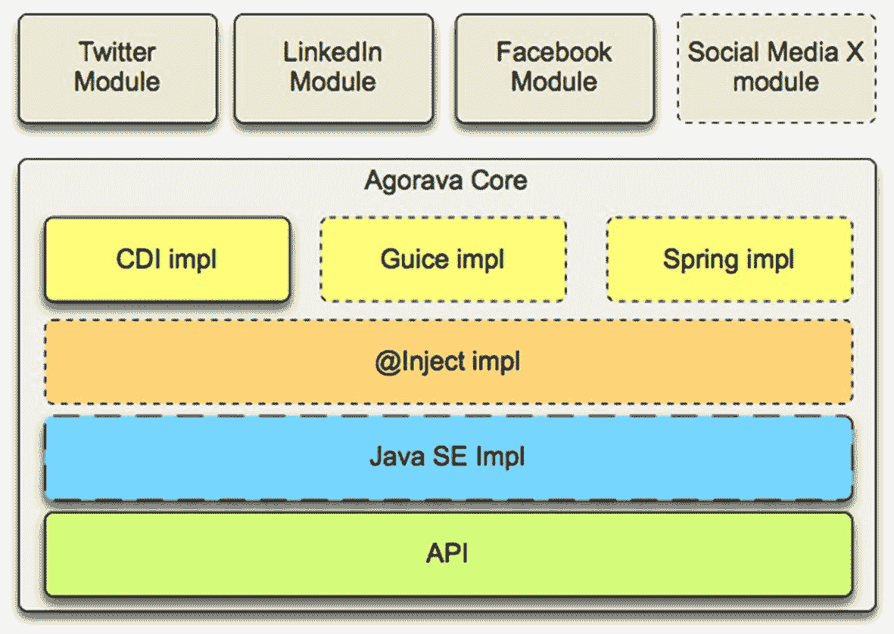

Agorava 核心的概览。它包括四个模块：Twitter、LinkedIn、Facebook 和社交媒体，其次是 Agorava 核心、CDI 实现、Guice 实现、Spring 实现、@Inject 实现、Java SE 实现和 API。

图 6-1
Agorava 宏观架构

以下是 Agorava 的主要特性：

*   机密性

*   通用的可移植 REST 客户端 API

*   用于处理 OAuth 1.0a 和 2.0 服务的通用 API

*   用于处理 JSON 序列化和反序列化的通用 API

*   用于从社交服务（作为身份提供者）检索基本用户信息的通用身份识别 API

*   允许多服务管理器 API 在同一应用程序中处理多个 OAuth 应用程序和会话

*   开箱即用，Agorava 可连接到

*   Facebook

*   LinkedIn

*   GitHub

*   Twitter

*   XING

*   并提供了一种简单的方法，通过创建新的连接器来扩展到任何其他服务或 API

Agorava 独立于 CDI 实现，并且在 Java EE 6（最低版本）和由 CDI 增强的 Servlet 环境之间完全可移植。它也可以在桌面或 SE 嵌入式/移动应用程序中与 CDI 一起用于 Java SE。它已使用 CDI 参考实现（JBoss Weld）进行了全面测试。自 0.5 版本起，也支持 OpenWebBeans 和 Caucho Resin。
Agorava 常被解释为一种“面向社交的 Java 连接器架构”。事实上，Agorava 背后的理念与 Jakarta 连接器（原 JCA）在 Jakarta EE 框架下所做的工作之间存在惊人的相似之处。
Jakarta 连接器定义了一种标准架构，用于将 Jakarta EE 平台连接到异构企业信息系统（EIS），包括事务处理系统（如 CICS 事务服务器）和企业资源规划（ERP）系统（如 SAP），特别是所谓的通用客户端接口（CCI），它定义了一个标准的客户端 API，允许应用程序访问多个资源适配器。

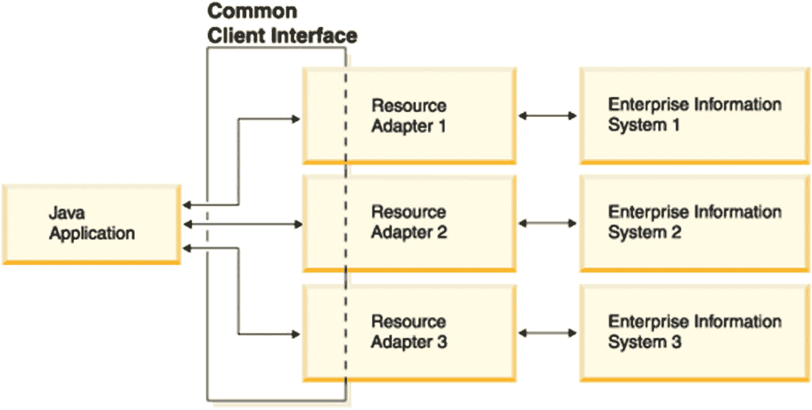

JCA 通用客户端接口应用程序的示意图。它从一个 Java 应用程序开始，接着是三个资源适配器，以及各自对应的企业信息系统。

图 6-2
JCA 通用客户端接口


必须指出，JCA 是 Jakarta EE 平台中相当古老的一部分，
在 JCA 成为 Jakarta Connectors 时只经历了少量细微变更，
但除此之外，它仍然非常陈旧，类似于 Jakarta Enterprise Beans
(EJB)。因此，
与一些新兴的、通常基于云原生和 API 的 ERP
解决方案（如 Salesforce.com）相比，它显得有些过时，
并且也是 Jakarta EE 中知名度较低、使用较少的组件之一。
尽管 JSR 357 提案并未明确表述为“JCA
方式”，但有可能一些支持者和 JCA 专家
（除了 Oracle 之外，主要是 IBM 或 SAP，而如今在云领域占据主导地位的大多数其他公司在 JCA 最初设计时甚至还不存在）感觉到他们培育的这只小“恐龙”可能会受到像 Java Social Connector API 这样的新标准的威胁。

核心

Agorava Core
包含通用的、独立于特定服务提供商的社交网络服务，提供以下功能：

*   OAuth 连接器，用于向 OAuth 提供商进行身份验证

*   支持通用身份验证和用户配置文件管理

*   一个支持以下功能的社交多账户服务：

*   多个社交网络连接

*   同一社交网络提供商的多个会话，例如，同时连接到多个用户账户或查询

Agorava Core 也提供了这些服务的实现。目前，主要实现基于 CDI 和 DeltaSpike，但大多数服务已使用 JSR 330（现为 Jakarta Dependency Injection）进行了通用化，这允许使用更轻量级的 Java SE 替代方案，例如 Google Guice、Dagger 或 CDI 实现 Weld 的 SE 版本。

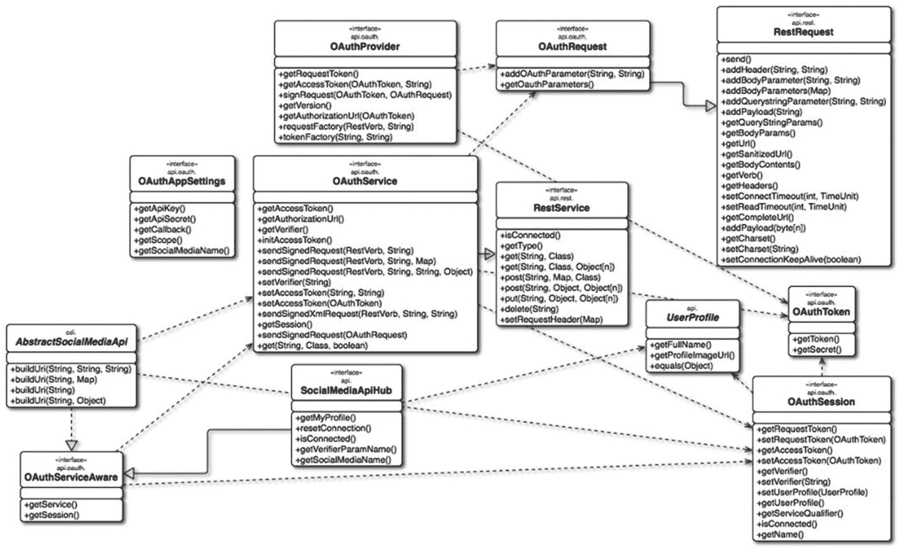

一个框图描绘了 Agorava PicketLink 应用程序。它包括 OAuth 提供商、请求、服务、REST 服务、应用设置、REST 请求、用户配置文件、令牌、会话、社交媒体 API 中心以及抽象社交媒体 API。它们之间的连接由虚线表示。

图 6-3
Agorava Core API 架构

Agorava PicketLink
与 OAuth 功能和用户配置文件管理协同工作，Agorava Core 还包含一个基于 PicketLink 的安全子系统。

正如 2.3.2 节所承诺的，这里是 PicketLink BaseAuthenticator 的专用 Agorava 版本：

```
@Generic
public class AgoravaAuthenticator extends BaseAuthenticator {
@InjectWithQualifier
OAuthAppSettings settings;
@Inject
DefaultLoginCredentials credentials;
@Inject
@DeltaSpike
Instance response;
@Inject
OAuthLifeCycleService lifeCycleService;
@Override
public void authenticate() {
if (lifeCycleService.getCurrentSession().isConnected()) {
OAuthSession session = lifeCycleService.getCurrentSession();
UserProfile userProfile = session.getUserProfile();
credentials.setCredential(session.getAccessToken());
setStatus(AuthenticationStatus.SUCCESS);
User user = new User(userProfile.getId());
user.setFirstName(userProfile.getFullName());
setAccount(user);
} else {
String authorizationUrl = lifeCycleService.startDanceFor(settings.getQualifier());
try {
response.get().sendRedirect(authorizationUrl);
} catch (IOException e) {
e.printStackTrace();
}
credentials.setStatus(Status.IN_PROGRESS);
setStatus(AuthenticationStatus.DEFERRED);
}
}
}
```

连接器

Agorava 目前附带以下默认连接器：

*   Facebook

*   LinkedIn

*   GitHub

*   Twitter

*   XING

除此之外，还为以下服务创建了第三方 Agorava 连接器：

*   Empire Avenue

*   Google+

*   Instagram

*   Meetup

*   Stack Overflow

*   TripIt

*   WordPress

*   Yammer

Socializer
Socializer 是一个
用于 Agorava 的真实演示 Web 应用程序；可以将其视为它的“Pet Clinic”。
它允许你连接到各种社交网络并查看你的时间线或发布更新。Agorava Socializer 也已从 JavaServer Faces 移植到 Apache Wicket Web 框架或 AngularJS。
这两个移植版本仍处于实验阶段，因此从未成为 Agorava 生态系统的官方组成部分。


集成连接器
向 Socializer 添加新连接器相当简单。我们将以 **XING** 连接器为例进行说明。

克隆 [`https://github.com/agorava/agorava-socializer`](https://github.com/agorava/agorava-socializer) 后，在 Socializer 的 **pom.xml** 中添加以下行：

```

org.agorava                        agorava-xing-api
0.3.0-SNAPSHOT
compile

org.agorava
agorava-xing-cdi
0.3.0-SNAPSHOT
runtime

```

定义了 XING API 和 CDI 实现的依赖关系。

接下来，我们将 XING 的应用设置添加到 CDI 生产者类 `org.agorava.socializer.SettingsProducer.java` **：**

```
@ApplicationScoped
@Produces
@Xing
@OAuthApplication(params = {@Param(name = OAuthAppSettingsBuilder.PREFIX, value = "xing")})
public OAuthAppSettings xingSettings;
```

由属性文件支持

```
src/main/resources/local/agorava.properties
xing.apiKey=
xing.apiSecret=
```

**API 密钥**和**API 密钥**都必须在您选择的社交媒体账户中为本地 Socializer 应用程序定义；有关 XING，请参阅 [`https://dev.xing.com/applications/dashboard`](https://dev.xing.com/applications/dashboard)。

**xing.xhtml**

```

你在想什么？

```

大多数合适的服务都提供“测试密钥”或开发密钥，就像 XING 一样。
要获取 Facebook 应用 ID 和应用密钥凭据，您需要在 [`https://developers.facebook.com/apps/`](https://developers.facebook.com/apps/) 上使用 Facebook 创建一个新应用程序。

Spring Social
Spring Social 项目 [25] 是 Spring 框架的一个扩展，它使您的应用程序能够与 Facebook、LinkedIn 或 Twitter 等社交媒体提供商建立连接，以代表其用户调用 API。
一段时间后，它不再得到积极支持，Pivotal/VMware 员工的更新或博客文章在变更发生或功能在会议上宣布后六到九个月或更长时间才出现。
像 GitHub 这样的开源生态系统展示了各种扩展或插件，但并非所有都成熟；有些仅仅是概念验证，而且其中大多数也有一段时间没有得到积极维护。
Spring Social 也支持 .NET，但该版本从未真正起步，仅在 2012 年发布了 1.0.0 和 1.0.1 两个版本，此后没有任何进一步的活动。因此，虽然适用于 .NET 的 Spring 框架仍然存在并得到维护（2023 年 7 月发布了 3.0.2 版本），但适用于 .NET 的 Spring Social 在其 Java 对应版本之前很多年就已经消亡了。
由于 OAuth2/OpenID Connect 的标准化程度提高以及其在 Spring Security 5 中的支持，Spring Social 自 2019 年起不再受支持或维护。支持期于 2019 年 7 月 3 日结束。这并不意味着应用程序完全放弃了它，即使是在生产环境中，但对于新应用程序，他们通常更倾向于使用 Spring Security，而对于一些不再更改但仍在使用中的旧应用程序，只要社交网络的 API 变更在一段时间后不阻止其使用，他们可能会继续使用它。

概述

Spring Social 的主要功能如下：

*   可扩展的服务提供商框架，极大地简化了将本地用户账户连接到社交媒体账户的过程
*   一个连接控制器，处理您的 Java/Spring Web 应用程序、社交媒体提供商和您的用户之间的授权流程
*   流行 API 和社交网络（如 Facebook、Twitter、LinkedIn、TripIt 或 GitHub）的 Java 绑定
*   一个登录控制器，使用户能够通过社交网络登录来验证您的应用程序

Spring Social 的 Maven `groupID` 是 `org.springframework.social`。

核心

Spring Social 核心项目由表 6-2 所示的模块组成。

表 6-2
Spring Social 核心模块

名称 |
 描述 |

| --- | --- | --- | --- | --- |

spring-social-core |
 Spring Social 连接框架和 OAuth 客户端支持 |

spring-social-config |
 Spring Social 的 Java 和 XML 配置支持 |

spring-social-security |
 Spring Security 集成 |

spring-social-web |
 Spring Social `ConnectController`，使用连接框架在 Web 环境中管理连接 |

客户端模块

除了 Spring Social 核心模块之外，还有许多特定于提供商的客户端模块，为流行的社交网络提供连接和 API 绑定。

表 6-3
Spring Social 客户端模块

名称 |
 Maven artifactID |

| --- | --- | --- | --- | --- |

Spring Social Facebook |
 spring-social-facebook |

Spring Social Twitter |
 spring-social-twitter |

Spring Social LinkedIn |
 spring-social-linkedin |

Spring Social GitHub |
 spring-social-github |

Spring Social TripIt |
 spring-social-tripit |

连接框架

`Connection<A>` 接口模拟了与 Facebook 等服务提供商的连接：

```
public interface Connection extends Serializable {
ConnectionKey getKey();
String getDisplayName();
String getProfileUrl();
String getImageUrl();
void sync();
boolean test();
boolean hasExpired();
void refresh();
UserProfile fetchUserProfile();
void updateStatus(String message);
A getApi();
ConnectionData createData();
}
```

每个 `Connection` 都由一个由 `providerId`（例如，“facebook”）和 `providerUserId`（例如，用户的 Facebook ID）组成的复合键唯一标识。

假设我们有一个指向用户“jdoe”的 `Connection<Twitter>` 引用。

1.  `Connection#getKey()` 返回“twitter”，1234567，其中 1234567 是 `@jdoe` 的 Twitter 用户 ID，该 ID 永远不会改变。
2.  `Connection#getDisplayName()` 返回 `@jdoe`。
3.  `Connection#getProfileUrl()` 返回 “[`http://twitter.com/jdoe"`](http://twitter.com/jdoe)。
4.  `Connection#getImageUrl()` 返回 “[*http://a0.twimg.com/profile_images/105951287/IMG_5863_2_normal.jpg*`"`](http://a0.twimg.com/profile_images/105951287/IMG_5863_2_normal.jpg)。
5.  `Connection#sync()` 允许您将连接状态与 @jdoe 的个人资料同步。
6.  `Connection#test()` 返回 `true`，表明 Twitter 连接的授权凭据有效。这假设 Twitter 尚未撤销“AcmeApp”客户端应用程序，并且 @jdoe 尚未重置其授权凭据。
7.  `Connection#hasExpired()` 返回 `false`。
8.  `Connection#refresh()` 不执行任何操作，只要与 Twitter 的连接未过期。
9.  `Connection#fetchUserProfile()` 对 Twitter API 进行远程调用，以获取 @jdoe 的个人资料数据并将其规范化为 `UserProfile` 模型。
10.  `Connection#updateStatus(String)` 在 @jdoe 的时间线上发布状态更新。
11.  `Connection#getApi()` 返回一个引用，使客户端应用程序能够访问 Twitter 原生 API 的全部功能。
12.  `Connection#createData()` 返回一个 `ConnectionData` 引用，该引用可以被序列化并用于稍后恢复连接。

Facebook 示例
此示例演示如何使用 Spring Social 将 Facebook 登录添加到现有的 Spring Web 应用程序中。
要获取 Facebook 应用 ID 和应用密钥凭据，您需要在 [`https://developers.facebook.com/apps/`](https://developers.facebook.com/apps/) 上使用 Facebook 创建一个新应用程序。
确保添加“Website”作为平台，并将 `http://localhost:8080/` 作为“站点 URL”。

Maven 配置

首先，将 `spring-social-facebook` 依赖项添加到 `pom.xml`：

```
org.springframework.social
spring-social-facebook
2.0.3.RELEASE

```

安全配置

让我们使用一个简单的安全配置，采用基于表单的身份验证：


```markdown

```
@Configuration
@EnableWebSecurity
@ComponentScan(basePackages = { "com.example.security" })
public class SecurityConfig {
@Autowired
private UserDetailsService userDetailsService;
@Bean
public AuthenticationManager authManager(HttpSecurity http) throws Exception {
return http.getSharedObject(AuthenticationManagerBuilder.class)
.userDetailsService(userDetailsService)
.and()
.build();
}
@Bean
public SecurityFilterChain filterChain(HttpSecurity http) throws Exception {
http.csrf()
.disable()
.authorizeRequests()
.antMatchers("/login*", "/signin/**", "/signup/**")
.permitAll()
.anyRequest()
.authenticated()
.and()
.formLogin()
.loginPage("/login")
.permitAll()
.and()
.logout();
return http.build();
}
}
```

Facebook4J
Facebook4J 是一个非官方的 Java 库，用于 Facebook Graph API。它模仿了 Twitter4J，因此名称相似。

使用方法

在你的 Maven **pom.xml** 中包含以下依赖：

```
org.facebook4j
facebook4j-core
2.4,)

```

配置
有多种方式可以配置 Facebook4J。
**属性文件**

一个名为 `facebook4j.properties` 的属性文件。
将其放置在类路径的根目录下：

```
debug=true
oauth.appId=****************
oauth.appSecret=********************************
oauth.accessToken=********************************
oauth.permissions=email,publish_stream,...
```

**ConfigurationBuilder**

你可以通过 `ConfigurationBuilder` 和 `FacebookFactory` 使用“流式”API：

```
ConfigurationBuilder cb = new ConfigurationBuilder();
cb.setDebugEnabled(true)
.setOAuthAppId("*********************")
.setOAuthAppSecret("******************************************")
.setOAuthAccessToken("**************************************************")
.setOAuthPermissions("email,publish_stream,...");
FacebookFactory ff = new FacebookFactory(cb.build());
Facebook facebook = ff.getInstance();
```

**或者通过系统属性**

```
$ java -Dfacebook4j.debug=true
-Dfacebook4j.oauth.appId=*********************
-Dfacebook4j.oauth.appSecret=******************************************
-Dfacebook4j.oauth.accessToken=**************************************************
-Dfacebook4j.oauth.permissions=email,publish_stream,...
-cp facebook4j-core-2.4.13.jar:yourApp.jar yourpackage.Main
```

**以及环境变量（以 Linux 为例）**

```
$ export facebook4j.debug=true
$ export facebook4j.oauth.appId=*********************
$ export facebook4j.oauth.appSecret=******************************************
$ export facebook4j.oauth.accessToken=**************************************************
$ export facebook4j.oauth.permissions=email,publish_stream,...
$ java -cp facebook4j-core-2.4.13.jar:yourApp.jar yourpackage.Main
```

虽然流式 API 在现代应用中可能看起来很有吸引力，但其他选项（如通过 Kubernetes 或你选择的 CI/CD 管道）更容易将密钥外部化。

示例
**发布消息**

你可以通过 `Facebook.postStatusMessage()` 方法发布消息，前提是你已经通过上述方法之一配置了 Facebook4J：

```
Facebook facebook = new FacebookFactory().getInstance();
facebook.postStatusMessage("Hello World from Facebook4J.");
```

**搜索地点**

```
Facebook facebook = new FacebookFactory().getInstance();
// 按名称搜索
ResponseList results = facebook.searchPlaces("coffee");
// 你可以将搜索范围缩小到特定位置和距离
GeoLocation center = new GeoLocation(37.76, -122.427);
int distance = 1000;
ResponseList searchPlaces("coffee", center, distance);
```

**执行 FQL**

你可以通过 `Facebook.executeFQL()` 方法执行 FQL：

```
Facebook facebook = new FacebookFactory().getInstance();
// 单条 FQL
String query = "SELECT uid2 FROM friend WHERE uid1=me()";
JSONArray jsonArray = facebook.executeFQL(query);
for (int i = 0; i  queries = new HashMap();
queries.put("all friends", "SELECT uid2 FROM friend WHERE uid1=me()");
queries.put("my name", "SELECT name FROM user WHERE uid=me()");
Map result = facebook.executeMultiFQL(queries);
JSONArray allFriendsJSONArray = result.get("all friends");
for (int i = 0; i < allFriendsJSONArray.length(); i++) {
JSONObject jsonObject = allFriendsJSONArray.getJSONObject(i);
System.out.println(jsonObject.get("uid2"));
}
JSONArray myNameJSONArray = result.get("my name");
System.out.println(myNameJSONArray.getJSONObject(0).get("name"));
```

**批处理模式**

与 Meta Business SDK 类似，你可以通过 `Facebook.executeBatch()` 方法执行批处理请求：

```
Facebook facebook = new FacebookFactory().getInstance();
// 执行 "me" 和 "me/friends?limit=50" 端点
BatchRequests batch = new BatchRequests();
batch.add(new BatchRequest(RequestMethod.GET, "me"));
batch.add(new BatchRequest(RequestMethod.GET, "me/friends?limit=50"));
List results = facebook.executeBatch(batch);
BatchResponse result1 = results.get(0);
BatchResponse result2 = results.get(1);
// 你可以获取 HTTP 状态码或头部信息
int statusCode1 = result1.getStatusCode();
String contentType = result1.getResponseHeader("Content-Type");
// 你可以通过 as****() 方法获取正文内容
String jsonString = result1.asString();
JSONObject jsonObject = result1.asJSONObject();
ResponseList responseList = result2.asResponseList ();
// 你可以使用 DataObjectFactory#create****() 将 JSON 映射为 Java 对象
User user = DataObjectFactory.createUser(jsonString);
Friend friend1 = DataObjectFactory.createFriend(responseList.get(0).toString());
Friend friend2 = DataObjectFactory.createFriend(responseList.get(1).toString());
```

总结
继上一章对安全框架的概述之后，我们在本章学习了 Java 平台相关的社交框架，以及如何将它们与流行的社交网络结合使用。

7. 社交门户

正如你在第 [3 章中所记得的，Java Portlet 是早期实现混搭（mashup）的一种方法；因此，流行的门户服务器也支持社交媒体集成，例如社交登录、混搭或社交分享。

Liferay Portal
Liferay 是一家“专业开源”公司，为其开源门户软件提供付费支持和服务。

历史
Liferay Portal 最初由联合创始人兼 CTO Brian Chan 于 2000 年创建，旨在为教堂等非政府组织提供门户解决方案。Liferay 的第一个办公室也设在一座教堂内。Liferay Inc. 与 Sun（在被 Oracle 收购前不久）以及 TIBCO 建立了合作伙伴关系，但至今仍保持独立和私有。Liferay 秉承开源基因，还积极帮助塑造了 Java Portlet 标准，例如 JSR 362（Portlet 3.0）或 378（用于 JavaServer Faces 2.2 的 Portlet 3.0 桥接），并在其中担任规范领导者。

Liferay Social
无论你是想创建自己的社交媒体体验，还是集成其他社交网络，都可以通过 Liferay Portal 实现。

开箱即用，Liferay 提供了四个社交 Portlet：

*   活动

*   用户统计

*   群组统计

*   请求

除此之外，还集成了各种 API 和社交网络。

地图 Portlet
地图 Portlet 允许你查看世界各地团队成员的位置，但仅显示已添加该地图 Portlet 的站点成员。
首先，你需要从 Google 获取一个密钥，以便通过地图 Portlet 访问 Google 的 Maps API。请访问 [`https://developers.google.com/maps/documentation/javascript/tutorial#api_key`](https://developers.google.com/maps/documentation/javascript/tutorial%2523api_key) 获取有效的 Google Maps API 密钥。

然后执行以下步骤：

1.  如果你尚未安装，请安装社交网络插件。

```


2.  安装 IP 地理编码器 Portlet。（社交网络和 IP 地理编码器应用均可从 Liferay Marketplace 获取。）

3.  关闭你的门户服务器。

4.  从 [`https://mirrors-cdn.liferay.com/geolite.maxmind.com/download/geoip/database/GeoLiteCityv6.dat.gz`](https://mirrors-cdn.liferay.com/geolite.maxmind.com/download/geoip/database/GeoLiteCityv6.dat.gz) 下载 Geo Lite City 数据库。

5.  将 `.dat` 文件解压到你想要的位置。

6.  在你的 Liferay 安装目录下的 `/{ROOT}/webapps/ip-geocoder-portlet/WEB-INF/classes/` 目录中创建一个 `portlet-ext.properties` 文件。

7.  将属性 `maxmind.database.file={GeoLite City .dat 文件路径}` 添加到此文件中。

在 Windows 上，请确保文件路径使用 `\\` 分隔，例如 `C:\\ce\\bundles\\GeoLiteCity.dat`。

8.  在你的 Liferay 安装目录下的 `/{ROOT}/webapps/social-networking-portlet/WEB-INF/classes/` 目录中创建一个 `portlet-ext.properties` 文件。

9.  将属性 `map.google.maps.api.key={你的 API 密钥}` 添加到此文件中，使用之前生成的 Google Maps API 密钥。

10. 重新启动你的门户服务器。

11. 使用地图 Portlet。

社交网络集成
有几种方法可以将 Liferay Portal 与 Facebook、LinkedIn、Twitter/X 等社交网络集成。

Facebook 登录
你可以将 Facebook 设置为 Liferay DXP 的单点登录机制。

Facebook Connect SSO 认证是 Liferay 与 Facebook Graph API 的集成。用于检索用户的 Facebook 个人资料信息，并将其与现有的 Liferay DXP 用户进行匹配。当以此方式添加新的 Liferay DXP 用户时，会通过从 Facebook 检索以下四个字段来创建：

*   电子邮件地址
*   名字
*   姓氏
*   性别

要获取 Facebook 应用 ID 和应用密钥凭据：

1.  访问 [`https://developers.facebook.com/apps/`](https://developers.facebook.com/apps/)。

2.  点击 ***创建新应用***。

3.  为以下参数输入值：

    1.  显示名称 `–` 你的应用的名称，会显示在每条帖子的末尾，例如你的公司名称。

    2.  命名空间 `–` 用于访问 Facebook Insights 的可选值。建议为你设置的每个应用使用唯一的名称。

    3.  类别 `–` 与你的业务类型匹配的类别。如果不确定，请选择 ***页面应用***。

4.  点击 ***创建应用***。

5.  你将进入应用的配置界面。选择 ***设置*** 并输入以下内容：

    1.  应用域名 `–` 一个以逗号分隔的域名或 IP 地址列表，你希望将此应用与个人 Facebook 账户配合使用。你可以从该列表中的某个域名/地址授权你的应用。

6.  点击 ***添加平台*** 并选择 ***网站***。

7.  将 ***网站 URL*** 和（如果适用）***移动网站 URL*** 设置为所需的网站，例如 [`http://www.mysite.com`](http://www.mysite.com)。

8.  点击 ***保存更改***。

9.  现在你可以看到你的应用的 ***应用 ID/API 密钥*** 和 ***应用密钥***。

要在 Liferay 系统级别配置 Facebook Connect SSO 模块，请导航至 Liferay DXP 的控制面板 ➤ 配置 ➤ 系统设置，并在 Foundation 标题下找到 ***Facebook Connect*** 模块。在此处配置的值为所有门户实例提供默认值。

要为特定门户实例覆盖这些默认值，请导航至 Liferay DXP 控制面板，点击 ***实例设置***，然后在认证部分中找到 ***Facebook***。

*   已启用 `–` 勾选此项以启用 Facebook Connect SSO 认证。

*   需要已验证的账户 `–` 勾选此项以允许已通过 Facebook 电子邮件验证过程（证明他们可以访问注册时提供的电子邮件地址）的 Facebook 用户登录。

*   应用 ID `–` 只能在门户实例级别设置。输入你注册的 Facebook 应用的 ID。

*   应用密钥 `–` 只能在门户实例级别设置。输入你注册的 Facebook 应用的密钥。

*   Graph URL `–` Facebook Graph API 的基础 URL。仅当 Facebook 更改其 Graph API 时才更改此项。只要 Facebook 的 API 保持不变，就使用默认的 Graph URL。

*   OAuth 授权 URL `–` Facebook OAuth 授权 URL。仅当 Facebook 更改其 OAuth 授权端点时才需要更改此项。此 URL 将包含动态数据，并链接到 Liferay 登录 Portlet。

*   OAuth 令牌 URL `–` Facebook OAuth 访问令牌 URL。Liferay DXP 使用此 URL 将请求令牌交换为访问令牌。

*   OAuth 重定向 URL `–` 生成 OAuth 请求令牌后，用户将被重定向到的 URL。该 URL 指向一个 Liferay DXP 服务，该服务将请求令牌交换为访问令牌，这是 Liferay DXP 成功调用 Facebook Graph API 所必需的。仅当对 Liferay DXP 的请求通过像 Apache 这样进行 URL 重写的代理服务器时，才需要更改此 URL。

社交书签
社交书签作为按钮显示在内容下方，用于在社交网络上分享内容。例如，社交书签默认显示在博客小部件的每篇博客文章下方。

默认情况下可用的社交书签有：

*   Facebook
*   LinkedIn
*   Twitter/X

此外，Liferay Marketplace 上的社交书签应用还添加了针对其他社交网络的社交书签，例如：

*   Digg
*   Evernote
*   Reddit
*   Slashdot

OpenSocial
与其他开放标准一样，Liferay 支持 OpenSocial 框架和规范（尽管看起来是使用 Apache Shindig 的 W3C 前版本）。
你可以发布在线找到的小工具，也可以使用 Liferay Portal 的 OpenSocial 小工具编辑器创建和发布你自己的小工具：

以下是一个 PubSub 发布者小工具的示例：

```

]]>

function publish() {
var message = Math.random();                  gadgets.Hub.publish('org.apache.shindig.random-number', message);                              document.getElementById('output').innerHTML = message;
}

]]>

```

以下是一个 PubSub 订阅者小工具的示例：

```

]]>

var subId;                        gadgets.HubSettings.params.HubClient.onSecurityAlert =      function(alertSource, alertType) {
alert('Security error!');
window.location.href = 'about:blank';
};
function callback(topic, data, subscriberData) {                                document.getElementById('output').innerHTML = 'Message: ' + gadgets.util.escapeString(data + '') + '' + 'Received: ' + (new Date()).toString();
}
function subscribe() {
subId = gadgets.Hub.subscribe('org.apache.shindig.random-number', callback);
}
function unsubscribe() {
gadgets.Hub.unsubscribe(subId);                              document.getElementById('output').innerHTML = '';
}

]]>

```

HCL
HCL Technologies Limited（前身为 Hindustan Computers Limited）是一家印度 IT 服务和咨询公司，总部位于首都德里的卫星城诺伊达。

历史
1976 年，在微软或苹果成立后不久，印度的一个八人工程师团队创办了一家公司，旨在制造个人电脑。在最初提议的名称 Microcomp（可能与微软存在命名问题）之后，公司于 1976 年 8 月 11 日更名为 Hindustan Computers Limited (HCL)。
该公司最初专注于硬件，但通过 HCL Technologies，其重心逐渐转向软件和服务。
2018 年 12 月 7 日，HCL 宣布达成一项协议，HCL Technologies 以 18 亿美元收购 IBM 的某些软件产品，包括 AppScan、BigFix、Commerce、Connections、Digital Experience（Portal 和 Content Manager）、Notes/Domino 或 Unica。
2022 年，HCL Technologies 更名为 HCLTech。


HCL DX
HCL Portal（前身为 IBM WebSphere Portal）是 HCL 数字体验（DX）的一部分。

通过名为 Social Media Publisher 的扩展，HCL DX 用户可以将内容分享到主流社交网络。开箱即支持以下网络：

*   Facebook

*   LinkedIn

*   Twitter/X

Social Media Publisher
Social Media Publisher 可用于管理已发布内容的社交媒体帖子，如果配置得当，也可管理草稿内容。

它支持手动和自动发布社交媒体帖子，并能管理社交媒体话题的生命周期。

表 7-1
HCL Social Media Publisher `–` 功能

社交网络 |
 消息类型 |
 统计信息 |
 可寻址 URL |
 用户追踪 |
 取消追踪 |
 删除 |

| --- | --- | --- | --- | --- | --- | --- | --- | --- | --- | --- | --- | --- | --- | --- |

Facebook |
 主页帖子 |
 点赞、评论数 |
 是 |
 是 |
 是 |
 是 |

Facebook |
 个人资料帖子 |
 点赞、评论数 |
 是 |
 是 |
 是 |
 是 |

LinkedIn |
 动态更新 |
 无 |
 否 |
 否 |
 是 |
 否 |

LinkedIn |
 分享 |
 无 |
 否 |
 否 |
 是 |
 否 |

Twitter |
 推文 |
 转发数 |
 是 |
 是 |
 是 |
 是 |

Facebook 设置
请按照以下步骤为 Facebook 设置社交网络连接。

要获取 Facebook 凭据：

1.  访问 [`https://developers.facebook.com/apps/`](https://developers.facebook.com/apps/)。

2.  点击 ***创建新应用***。

3.  为以下参数输入值：

1.  显示名称 `–` 每条帖子末尾显示的应用程序名称，例如您的公司名称。

2.  命名空间 `–` 用于访问 Facebook 分析的可选值。建议为每个设置的应用程序使用唯一名称。

3.  类别 `–` 与您的业务类型匹配的类别。如果不确定，请选择 ***页面应用***。

4.  点击 ***创建应用***。

5.  您将进入应用程序的配置界面。选择 ***设置*** 并输入以下内容：

1.  应用域名 `–` 一个以逗号分隔的域名或 IP 地址列表，用于将此应用程序与个人 Facebook 账户关联。您可以从该列表中的某个域名/地址授权您的应用程序。

6.  点击 ***添加平台*** 并选择 ***网站***。

7.  将 ***网站 URL*** 和（如果适用）***移动网站 URL*** 设置为所需网站，例如 [`http://www.mysite.com`](http://www.mysite.com)。

8.  点击 ***保存更改***。

9.  现在您将看到应用程序的 ***应用 ID/API 密钥*** 和 ***应用密钥***。

现在，在 HCL Portal 管理视图中创建一个新的 ***凭据保管库***，其中：

*   ***应用 ID/API 密钥*** 被指定为共享的 ***用户 ID***。

*   ***应用密钥*** 被指定为 ***共享密码***。

然后，为 Facebook 创建社交网络配置：

1.  选择 ***Facebook*** 作为社交网络。

2.  定义该社交网络的身份验证设置：

1.  选择包含您 Facebook 凭据的 ***凭据保管库***。

2.  点击 ***授权*** 将凭据绑定到特定的 Facebook 账户。

3.  选择消息类型：

*   **主页帖子**

*   选择一个页面。

*   输入默认名称、描述、图片、标题和消息模板。预定义值可作为参考，例如：

*   名称 `–` 以文本形式发布。

`[Property field="title" context="current" type="content" format="length:100"]`

*   描述 `–` 以文本形式发布。

`[Property field="description" context="current" type="content" format="length:100"]`

*   图片 `–` 以 URL 形式发布。

`[Element context="current" type="content" key="Image" format="URL"]`

*   标题 `–` 以文本形式发布。

`[Property field="description" context="current" type="content" format="length:100"]`

*   消息 `–` 以文本形式发布。


`[Element context="current" type="content" key="Message" format="length:100"]`

*   **个人资料墙贴**

*   选择适当的可见性

*   输入默认名称、描述、图片、标题和消息模板。
            预定义值可作为参考。例如：

*   名称 `–`
                此内容以文本形式发布。

`[Property field="title" context="current" type="content" format="length:100"]`

*   描述 `–` 此内容以文本形式发布。

`[Property field="description" context="current" type="content" format="length:100"]`

*   图片 `–`
                此内容以 URL 形式发布。

`[Element context="current" type="content" key="Image" format="URL"]`

*   标题 `–` 此内容以文本形式发布。

`[Property field="description" context="current" type="content" format="length:100"]`

*   消息 `–` 此内容以文本形式发布。

`[Element context="current" type="content" key="Message" format="length:100"]`

将内容直接发布到 Facebook 页面

社交媒体发布器用于将内容的状态更新发布到 Facebook，但您也可以直接将内容发布到 Facebook 页面。

1.  转到 [`https://developers.facebook.com/apps`](https://developers.facebook.com/apps)。

2.  点击**创建新应用**。

3.  打开一个表单。为以下参数输入值：

*   应用名称 `–` 这是您的应用程序名称，会显示在每条帖子的末尾，例如您的公司名称。

*   应用命名空间 `–` 用于访问 Facebook 分析数据的名称。建议为每个应用程序使用唯一的名称。

4.  点击**继续**。

5.  显示应用程序的配置屏幕。在**选择应用与 Facebook 的集成方式**下选择**页面标签**，并完成以下参数：

*   页面标签名称 `–` 输入页面标签的名称。

*   页面标签 URL `–` 这是您要添加到 Facebook 页面的内容项的 URL。

*   安全页面标签 URL `–` 这是页面标签 URL 的 https 版本。

6.  点击**保存更改**。

7.  点击**授权**以将凭据绑定到特定的社交网络账户。

8.  要将内容发布到 Facebook 页面，请使用以下 URL，其中 APP_ID 是 Facebook 页面标签应用的应用程序 ID：

`http://www.facebook.com/dialog/pagetab?app_id=APP_ID&next=https%3A%2F%2Fwww.facebook.com%2Fconnect%2Flogin_success.html`

9.  将内容直接发布到 Facebook 页面需要安全页面标签 URL。这意味着您的服务器必须启用 SSL。

LinkedIn 的设置
执行以下步骤为 LinkedIn 设置社交网络连接。

获取 LinkedIn 凭据：

1.  转到 [`www.linkedin.com/developers/apps`](http://www.linkedin.com/developers/apps)。

2.  如果尚未登录，请先登录。

3.  点击**创建应用**。

4.  如果您已有**公司页面**，请选择现有公司，或选择**新公司**并输入公司信息。

5.  在**创建应用**下，为以下参数输入值：

*   应用名称 `–` 这是您的应用程序名称，会显示在每条帖子的末尾，例如您的公司名称。

*   LinkedIn 页面 `–` 这是您之前创建的公司页面，例如 [`https://linkedin.com/company/123456`](https://linkedin.com/company/123456)。

*   隐私政策 URL `–` 指向您的隐私政策的链接（可选），例如 [`http://www.mysite.com/privacy`](http://www.mysite.com/privacy)。

*   应用徽标 `–` 当用户授权您的应用时，徽标会显示给用户，理想情况下为方形图片。

*   法律协议 `–` 勾选以确认您已阅读并同意这些条款。

6.  点击**创建应用**。

7.  在**认证**标签页中，您会找到**应用凭据**的 API 密钥和客户端密钥。点击“眼睛”按钮以显示客户端密钥。记录这些值，并填写其他适当的设置。


随后，在 HCL Portal 管理视图中创建一个新的***凭据保险库***，其中：

*   **客户端 ID** 指定为共享用户 ID
*   **客户端密钥** 指定为共享密码

要为 LinkedIn 创建社交网络配置：

1.  选择 **LinkedIn** 作为社交网络。

2.  定义该社交网络的身份验证设置：

*   选择包含您 LinkedIn 应用程序凭据的**凭据保险库**。

*   点击**授权**以将凭据绑定到特定的社交网络账户。

3.  选择消息类型。

**注意：** 不建议在不支持 HTML 的任何字段中引用富文本元素或 HTML 元素。

*   **网络动态**

*   输入默认消息模板。预定义值作为指南包含在内。例如：

*   消息 `–` 以 HTML 形式发布。

`[Element context="current" type="content" key="Message" format="length:200"]`

*   `[URLCmpnt context="current" type="content" mode="standalone" start="<a href='" end="'>链接</a>"]`

*   **分享**

*   选择适当的可见性。

*   输入默认的名称、描述、图片和消息模板。预定义值作为指南包含在内。例如：

*   名称 `–` 以文本形式发布。

`[Property field="title" context="current" type="content" format="length:100"]`

*   描述 `–` 以文本形式发布。

`[Property field="description" context="current" type="content" format="length:100"]`

*   图片 `–` 以 URL 形式发布。

`[Element context="current``" type="content" key="Image" format="URL"]`

*   消息 `–` 以文本形式发布。

`[Element context="current" type="content" key="Message" format="length:200"``]`

Twitter/X 的设置
执行以下步骤为 Twitter/X 设置社交网络连接。

TWITTER 到 X 的迁移

随着埃隆·马斯克将 Twitter 更名为 X，在某个时候，即使是 twitter.com 等域名或其下的 URL 也可能被关闭并停止工作。这可能会影响下文提到的某些设置和步骤。

您必须首先注册一个 Twitter 应用程序，以获取访问 Twitter API 的用户名和密码。要注册一个用于 WCM 社交媒体发布器的新应用程序：

1.  访问 [`https://dev.twitter.com`](https://dev.twitter.com)。

2.  登录并点击**创建应用**。

3.  点击**添加新应用程序**。

4.  在**应用程序信息**下，为以下参数输入值：

*   应用程序名称 `–` 这是您的应用程序名称，将显示在每条帖子的末尾，例如，您的公司名称。

*   应用程序描述 `–` 输入应用程序的简短描述。

*   网站 `–` 这是您网站的 URL，例如，[`http://www.mysite.com`](http://www.mysite.com)。

*   回调 URL `–` 将其设置为 http://domain/wps/wcmsocial/servlet/oAuthCB/twitter，其中 "domain" 是您的域名。

5.  阅读条款和条件，并选择**我同意**。

6.  如果需要，输入安全/验证码信息。

7.  将显示您的消费者密钥和消费者密钥。将它们写在安全的地方。

8.  点击**设置**选项卡。

9.  在**应用程序类型**部分，将**访问**属性设置为读取和写入。

10. 点击**更新此 Twitter 应用程序的设置**。

随后，在 HCL Portal 管理视图中创建一个新的***凭据保险库***，其中：

*   **消费者密钥** 指定为共享用户 ID
*   **消费者密钥** 指定为共享密码

要为 Twitter/X 创建社交网络配置：

1.  选择 ***Twitter*** 作为社交网络。

2.  定义该社交网络的身份验证设置：

1.  选择包含您 Twitter 应用程序凭据的***凭据保险库***。

2.  点击***授权***以将凭据绑定到特定的社交网络账户。


3.  输入默认消息模板。该模板将以文本形式发布。其中包含预定义的消息标签作为参考。例如：

```
    [Property field="title" context="current" type="content" format="length:100"]
    [URLCmpnt context="current" type="content" mode="storable"]
    [profilecmpnt type="content" context="current" field="keywords" separator=" #" include="exact" start="#"]
    ```

注意

Twitter 帖子不支持富文本，因此不建议在帖子消息中引用富文本元素。

CoreMedia
虽然 CoreMedia 未实现 Java Portlet 标准，但它运行在 Java 上，常用于创建“企业门户”。

历史
CoreMedia 成立于 1996 年，是从多学科工程科学与技术中分离出来的，有点像 Sun Microsystems 成立于斯坦福大学。该公司美国总部位于弗吉尼亚州阿灵顿，并在华盛顿特区和伦敦设有办事处。
2012 年，CoreMedia 推出了 Elastic Social，这是一个扩展模块，具备内容审核、用户管理等社交互动功能，模仿社交网络，但并未集成它们。

社交媒体中心
与 Elastic Social 不同，CoreMedia 社交媒体中心允许将各种社交网络集成到 CoreMedia Studio 中。它显示一个单独的选项卡，其中包含不同的社交媒体动态和待发布的消息。
它被视为 CoreMedia Labs 的蓝图或原型，未提供稳定的 API，但话说回来，用于 Java 的 Twitter API 客户端库在这么多年后仍处于持续测试阶段，即使是 2.x 版本也是如此。

安装

*   从 CoreMedia 应用程序工作区，将仓库 [`https://github.com/CoreMedia/coremedia-social-hub.git`](https://github.com/CoreMedia/coremedia-social-hub.git) 克隆为扩展文件夹的子模块。确保使用与工作区版本匹配的分支名称：

`git submodule add -b 1907.1` [`https://github.com/CoreMedia/coremedia-social-hub`](https://github.com/CoreMedia/coremedia-social-hub)
    `modules/extensions/coremedia-social-hub`

*   使用项目根文件夹中的扩展工具将模块链接到工作区：

`mvn -f workspace-configuration/extensions com.coremedia.maven:extensions-maven-plugin:LATEST:sync -Denable=coremedia-social-hub`

配置

社交媒体中心的配置由不同的设置组成，这些设置可以应用于全局或特定站点的文件夹。

*   全局：`/Settings/Options/Settings/Social Hub/`

*   特定站点：`<SITE>/Options/Settings/Social Hub/`

全局设置

设置文档声明了社交媒体中心的全局设置，并且必须位于全局设置文件夹中。它定义了用于链接缩短的 **bitly** 账户的凭据，以及当需要从内容中提取媒体用于社交媒体帖子时所需的额外 CAE 和文档类型模型信息。

```

data

YOUR_LIVE_CAE

```

媒体映射
`mediaMapping` 结构体配置了包含可推送到社交网络的 blob 数据的内容类型和属性字段。默认情况下，CoreMedia Blueprint 文档类型模型为 `CMMedia` 配置，其数据属性包含带有资产数据的 blob。

适配器设置
社交媒体中心适配器配置可以放置在全局或特定站点的配置文件夹中。

通用适配器设置

每个社交媒体中心适配器配置都具有以下结构：

```

ADAPTER_ID
ADAPTER_TYPE
MY ADAPTER NAME
true

...

...

```

每个连接结构体包含表 7-2 中所示的属性。

表 7-2
连接结构体属性

属性 |
 描述 |

| --- | --- | --- | --- | --- |

id |
 适配器的唯一 ID，确保没有其他适配器具有相同的 ID |

type |
 适配器的类型 |

displayName |
 在适配器列中显示为标题的名称 |

enabled |
 适配器是启用还是禁用 |


connector |
 用于配置适配器连接器的附加属性 |

adapter |
 用于配置适配器的附加属性 |

在启动期间读取配置时，社交媒体中心
会尝试将每个配置映射到相应的社交媒体中心
适配器。它使用每个社交媒体中心适配器都可用的
`SocialHubAdapterFactory` 实现。`SocialHubAdapterFactory#getType`
必须与适配器设置中的类型属性匹配。

连接器设置
连接器配置通常包含用于访问社交网络或 API 的凭据。
映射此配置的应用程序必须扩展接口 `ConnectorConfiguration`，
该接口包含适用于所有连接器配置的附加设置。

`ConnectorConfiguration`
接口公开了以下方法：

*   `getImageVariant() –`
    当图片被推送到外部系统时使用的图片变体名称。
    如果未找到或未配置该变体，则将使用原始 blob。

Twitter/X
以下部分描述了 Twitter 社交媒体中心适配器的配置属性。

适配器配置

要显示已配置个人资料的 Twitter 时间线，必须通过适配器配置提供时间线链接：

```

https://twitter.com/[YOUR_PROFILE]

```

连接器配置

按照上一节中针对 HCL Portal 的说明创建您的 Twitter/X 应用程序。

要使用原生 Twitter 连接器，必须在连接器配置中提供相应的 Twitter 凭据：

YouTube
以下部分描述了 YouTube 的配置属性。

适配器配置

不需要

连接器配置

要使用原生 YouTube 连接器，您需要提供相应的 YouTube 凭据作为连接器配置的一部分。请注意，一个 YouTube 配置代表一个播放列表。如果您想发布到不同的播放列表，则需要不同的配置。

请参阅 [`https://developers.google.com/youtube/v3/quickstart/go`](https://developers.google.com/youtube/v3/quickstart/go)
为您的应用程序创建 YouTube 凭据。

Instagram
以下部分描述了 Instagram 的配置属性。

适配器配置

不需要

连接器配置

由于社交媒体中心目前未提供 Instagram 的原生连接器，实际的连接器配置取决于与社交媒体工具的集成。

Pinterest
以下部分描述了 Pinterest 的配置属性。

适配器配置

要显示已配置个人资料的 Pinterest 看板，必须通过适配器配置提供看板链接。该链接可以从您的 Pinterest 个人资料中复制：

```

https://www.pinterest.de/[PINTEREST_PRROFILE]/[PINTEREST_BOARD_NAME]

```

连接器配置

由于社交媒体中心目前未提供此社交网络的原生连接器，实际的连接器配置取决于与社交媒体工具的集成。

总结
在最后一章中，我们了解了企业门户服务器及其社交媒体支持，无论是通过在门户内部提供社交互动，还是通过集成社交网络，从使用它们进行社交登录到共享内容或嵌入社交时间线。

索引

A

访问控制

Activity API

ActivityPub

ActivityStreams

Agorava

连接器

核心

定义

历史

宏观架构

PicketLink

社交化器

Amazon

Apache Shindig

Apache Shiro

应用程序开发者

定义

特性

认证

授权

会话管理

框架

域

SecurityManager

社交登录

主体

Apple Health

基于属性的访问控制 (ABAC)

有声读物

音频分享

认证

授权

B

批处理模式

BigBone

大数据

C

ChatGPT

通用客户端接口 (CCI)

机密性

基于上下文的访问控制 (CBAC)

CoreMedia

历史

社交媒体中心

配置

安装

CoreMedia Labs 蓝图

COVID-19 疫情

密码学

@CustomFormAuthenticationMechanismDefinition 注解

网络安全攻击

D

Diaspora


数字名片

Discord

身份验证

社区

Discord4J

Javacord

JDA

Twitch4J

Discord4J

E

Echobox LinkedIn SDK

嵌入式社交面

enableLocalAuthentication 属性

@EnableWebSecurity 注解

企业信息系统（EIS）

企业资源规划（ERP）系统

企业社交混搭驱动 BEA Systems

企业社交网络

F

Facebook4J

Facebook.executeBatch() 方法

Facebook（Meta）商业 SDK

Facebook.postStatusMessage() 方法

联邦宇宙

定义

协议

DFRN

diaspora

matrix

Fitbit

论坛帖子

朋友的朋友（FOAF）

G

getCallerGroups() 方法

全局唯一标识符（GUID）

全球社交网络

Google

Google Fit

Google 的 Lambda AI

Google 翻译

H

健康与基于位置的服务

印度斯坦计算机有限公司（HCL）

HCL DX

Facebook 页面

Facebook 设置

功能

LinkedIn 设置

Twitter/X 设置

历史

HttpAuthenticationMechanism

I

身份与访问管理（IAM）

身份提供者（IdP）

图片分享应用

信息安全

集成社交媒体方法

互联网中继聊天（IRC）

J

J2EE 容器管理安全

Jakarta EE

认证机制

基本认证

客户端认证

客户表单认证

定义

摘要认证

基本术语

基于表单的认证

HTTP 方法

身份存储

声明能力

定义

EE 生态系统

目的

检索调用者信息

验证凭据

OAuth

OpenID

SecurityContext

安全功能

Jakarta 企业 Bean（EJB）

Java 社区进程

Javacord

Java Discord API（JDA）

JBoss 开发者框架（JDF）

JSESSIONID

JSON Web 加密（JWE）

JSON Web 签名（JWS）

JSON Web 令牌（JWT）

定义

HTTP API 请求

MicroProfile

MP JWT 公共声明

SSS

结构

用例

工作原理

K

Keycloak

认证

认证流程

授权

客户端

凭据

定义

事件

功能

历史

密码策略

领域

社交身份提供者

社交登录

L

最小权限设计原则

遗留框架

OACC

PicketLink

SocialAuth

Liferay Portal

定义

HCL

历史

社交网络

书签

集成

地图 Portlet

OpenSocial 框架

Portlet

链接数据通知（LDN）

现场音乐档案（LMA）

M

地图 Portlet

mapToUserRegistry 属性

混搭

Mastodon

BigBone

示例

安装

媒体 API

MeinVZ

Meta

商业 Java API SDK

应用

示例

安装

商业 SDK

示例

组成部分

冒烟测试

社交产品

微博客

Micronaut 安全

定义

功能

通过 Google 安全保护

Micropub

微软网络（MSN）

莫尔斯-维尔电报键

音乐分享/流媒体门户

MyFitnessPal

Myspace

N

国家安全

NoSQL 系统

O

OAuth

OAuth 舞蹈

oEmbed

开放图谱协议（OGP）

OPENi

OpenID Connect（OIDC）

Open Liberty

定义

社交媒体登录

认证提供者，活动目录

企业注册表

功能

ID

多个社交媒体提供者

OpenShift 服务账户

私钥 JWT

SSO

路径/浏览器的子集

OpenSocial

Google+

N 层企业应用

Orkut 服务

便携联系人

脚本小子

W3C 社交网络协议

围墙花园

OpenSocial 开发环境（OSDE）

开源生态系统

Oracle Fusion Middleware

OStatus

P, Q

通行密钥

PayPal

个人识别码（PIN）

物理安全

PicketLink

播客

Pods

隐私

private_key_jwt 客户端认证方法

产品与服务 API

个人资料 API

PubSubHubbub

R

Radar

表述性状态转移（REST）

丰富站点摘要（RSS）

基于角色的访问控制（RBAC）

S

Salmon

SchülerVZ

Scribe

SecurityContext

服务器端会话（SSS）

单点登录（SSO）

SocialAuth

社交媒体

古代史

现代史

X 世代

Z 世代

千禧一代

Twitter

专有 API 和框架

供应商中立抽象

社交媒体发布器

社交网络

博主与作家

商业/企业

讨论论坛

影响者

媒体分享

消息服务

移动端使用

点评网站

传统

视频分享

VR/元宇宙

社交安全

认证

授权

CIA 三元组

隐私

隐私泄露

标准

Jakarta

Soteria

认证机制

定义

历史

OpenID Connect 认证

Google 应用

IdentityStore 实现

Maven Webapp Archetype

运行时

Spring Security

认证

授权

定义

历史

服务过滤器

社交登录

Spring Social

连接框架

核心

定义

示例

Facebook4J

Facebook 示例

功能

标准化

Java 框架/库

Apache Shindig

Facebook 商业 SDK

JSR 357

微软嵌入式社交

Seam Social

Spring social

Sun/Oracle

Twitter4J

Twitter API 客户端库

标准类型

方法

基本

企业社交网络

混搭

OPENi

OpenSocial

OStatus

社交 API

社交商务

Strava

StudiVZ

T

基于时间的访问控制

基于令牌的认证机制

Twitch4J

Twitter4J

Twitter/X

API 客户端

Twitter4J

U

基于用户的访问控制（UBAC）

V

validate() 方法

垂直社交框架

github

Uber

垂直社交网络

社区

开发

金融/投资

健康/健身

旅行

视频流

VoIP 社交平台

W

围墙花园

基于 Web 的企业应用

Webhooks

WebSub

X

X.com

Y, Z

Yahoo!

```

```

```
