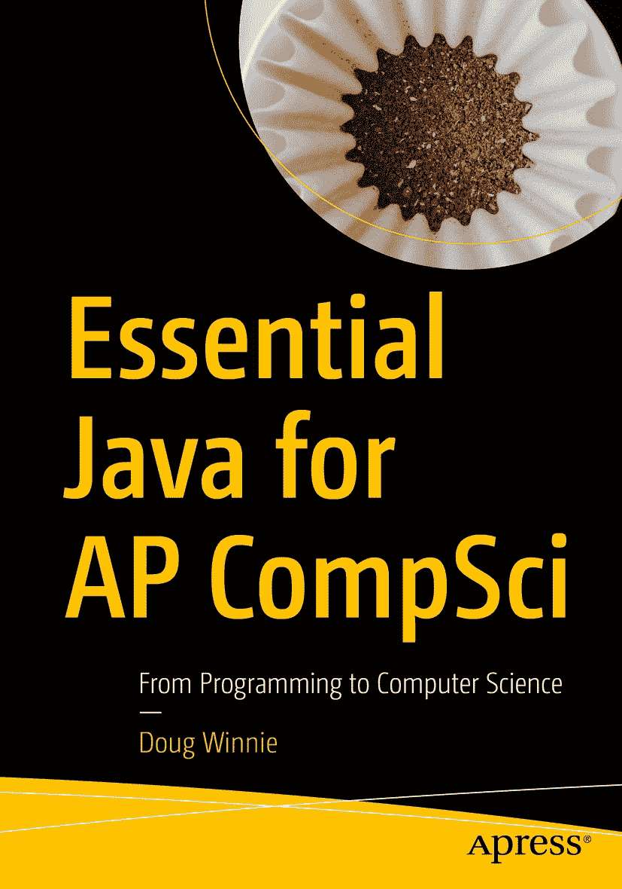

ISBN 978-1-4842-6182-8e-ISBN 978-1-4842-6183-5 [`doi.org/10.1007/978-1-4842-6183-5`](https://doi.org/10.1007/978-1-4842-6183-5) © Doug Winnie 2021 本作品受版权保护。出版商保留所有权利，涉及材料的全部或部分内容，特别是翻译、重印、重用插图、朗诵、广播、以缩微胶片或任何其他物理方式复制，以及传输或信息存储与检索、电子改编、计算机软件，或现在已知或以后开发的类似或不同方法的权利。本书中可能出现商标名称、标识和图像。我们并非在每次出现商标名称、标识或图像时都使用商标符号，而是仅以编辑方式使用这些名称、标识和图像，以利于商标所有者，且无意侵犯商标权。本出版物中使用的商品名称、商标、服务标志和类似术语，即使未标明为商标，也不应被视为对其是否受专有权利保护的看法。尽管本书中的建议和信息在出版时被认为是真实准确的，但作者、编辑和出版商均不对可能出现的任何错误或遗漏承担法律责任。出版商对本书所含内容不作任何明示或暗示的保证。

本 Apress 印记由注册公司 APress Media, LLC（Springer Nature 的一部分）出版。

注册公司地址为：1 New York Plaza, New York, NY 10004, U.S.A.

*献给迈克*，以及我们共同做出的所有伟大决定。

关于作者 关于技术审稿人

