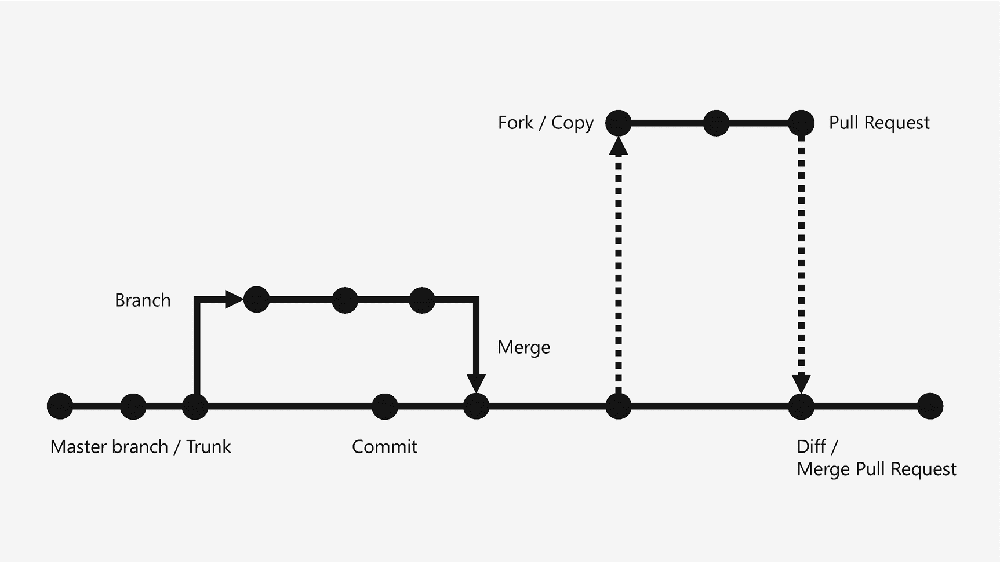

# 3. 设置 GitHub

当你编写代码时，需要一个地方来存储代码，并与他人共享以便协作和审查。称为代码仓库的工具是实现这一目标的理想方式，开发者可以使用多种不同类型的仓库；其中最流行的一种是 GitHub，我们将在此进行探索。在本书的语境下，GitHub 是一个你可以自行使用的工具。我在这里介绍它，是因为随着你对编程越来越熟悉，你会发现它是一个不可或缺的工具。

图 3-1

仓库生命周期

## GitHub

我们将使用的工具叫做 GitHub。GitHub 是一个免费的公共代码平台，开发者用它来构建、归档和管理个人或团队协作的编码项目。它基于通常用于私有内部项目的 Git 技术构建，但 GitHub 在其公共平台上基于 Git 构建，使其对任何人都可用。

创建 GitHub 账户很简单。访问 [`www.github.com/`](http://www.github.com/) 并在那里创建一个账户。为了在课堂上使用，请使用你的 Serra 邮箱地址创建账户，这样我就能轻松识别你的账户。

创建账户后，请务必访问 GitHub Desktop 下载适用于 Windows 或 macOS 的桌面客户端。你可以在此处下载安装程序：[`https://desktop.github.com/`](https://desktop.github.com/)。

安装客户端并登录你的账户。然后你可以创建一个仓库来跟踪你在课堂作业项目中所做的更改。你可以创建一个单一项目来包含所有家庭作业，也可以为每个项目创建单独的仓库。选择权在你手中。

## GitHub 的工作原理

GitHub 和 Git 会创建一个特殊目录，用于跟踪你对其中文件所做的所有更改。当你对文件进行更改时，它会记录更改的内容并加以标记。

这与备份不同。备份会创建文件夹中所有内容的副本。而 Git 和 GitHub 中的更改仅记录发生了什么变化，这可以节省大量空间，并且处理速度更快。

你可以将许多高级工作流程和自动化功能与 Git 和 GitHub 集成，但我们只会使用该平台来存储和共享项目及家庭作业。

有一些方法可以将 GitHub 直接集成到 IntelliJ IDEA IDE 中，但为了简单起见，我们可以使用 GitHub Desktop 客户端来创建、跟踪、提交更改，并将更改同步到我们的 GitHub 账户。

## 仓库的生命周期

一个仓库（repo）始于主分支（master branch），有时也称为主干。对于个人开发者或小型团队，项目可能只使用主分支，而从不创建其替代版本。

随着程序的演进和新的更改，通过提交（commit）将更改保存到仓库。一次提交包含代码的更改以及开发者对更改内容的简要注释和描述，以供将来参考。随着时间的推移，一个仓库上会有数十次甚至数百次提交。

在某些时候，仓库需要以某种方式进行拆分。要么是需要同时进行工作，并且不希望代码与他人冲突；要么是一个项目需要维护现有版本，同时又想对其进行其他操作。在这种情况下，会从主干创建一个分支（branch），开发可以与原始代码并行进行。

在某些时候，分支需要重新合并到主开发线中，这通过将该分支合并（merge）回主干来实现。

对于开源仓库，开发者通常会找到一个有用的框架，并希望将其添加到自己的开发环境中。为此，他们会复刻（fork）该仓库，在自己的环境中创建一个副本进行工作，并可能进行更改。

当开发者对复刻的仓库进行更改或改进时，他们可能希望将这些更改贡献回他们复刻的原始仓库。为此，他们向原始仓库提交一个拉取请求（pull request）。作为此拉取请求的一部分，开发者概述了所做的更改，接收请求的人可以通过执行差异比较（diff）来对比提议的更改与仓库的差异，差异比较会并排显示更改内容。

仓库的复杂程度各不相同，从只有一两个开发者的简单项目，到拥有数万名开发者的大型开源项目。代码仓库是软件开发人员在任何规模的项目上进行协作的核心。

