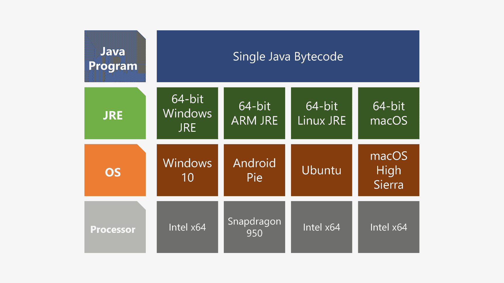
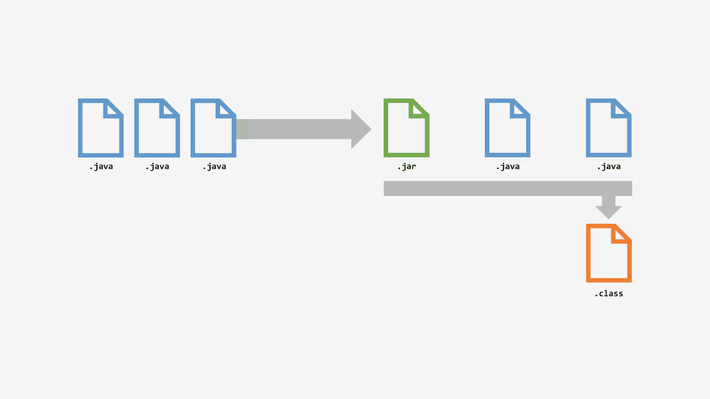

# 6. Java 的工作原理

Java 是一种独特的编程语言，这得益于其最初愿景中的“一次编写，到处运行”的口号。理解它如何实现这一愿景，对于理解你作为程序员的工作方式至关重要。

## 编译型语言的问题

编译型编程语言通常有一个很大的局限性。当你将代码转换为可执行程序时，编译器会读取代码并创建一个特定于处理器架构的二进制文件。

因此，如果我在我的 32 位 Windows PC 上使用 C 或 C++ 这样的语言编译一个程序，该程序无法在 Mac 上运行，也无法在没有额外技术桥接的情况下在 64 位 Windows PC 上原生运行。它只能在 32 位 Windows PC 上运行。

每个处理器和操作系统都期望程序满足极其特定的要求。程序访问硬件的方式在 Intel 处理器、基于 ARM 的处理器（如手机和平板电脑中的处理器）以及其他处理器类型（如 RISC 架构）之间差异巨大。（较旧的 Mac 使用这种架构，采用称为 PowerPC 的芯片，如 G5 或 G4。）

即使是 32 位 Intel 处理器和 64 位 Intel 处理器的运行方式也完全不同。因此，64 位程序无法在 32 位计算机上运行，而 32 位程序也无法在没有额外软件使其兼容的情况下在 64 位计算机上原生运行。

当你扩展到其他类型的计算机（如服务器）时，处理器类型和架构的数量可能会变得更加复杂。

在过去的几十年里，Web 和应用服务器可能使用截然不同的架构类型，如 Sparc、Xeon、Itanium 等。

因此，Sun Microsystems 的人员在设计 Java 时，希望克服这一限制，于是他们创建了一种创新的方法来解决这个问题。

## JVM 和 JRE

当你运行一个 Java 程序时，你不仅仅是在运行这个程序，你同时还在运行其他几个东西。

针对多个平台，Oracle 创建了一套名为 Java 运行时环境（JRE）和 Java 虚拟机（JVM）的技术。这些技术的构建是为了让包括 Intel、ARM、64 位、32 位等在内的特定硬件架构能够运行 Java 程序。

这些运行时环境安装在系统上并常驻内存，等待 Java 程序被执行。

当调用运行一个 Java 程序时，Java 运行时环境（JRE）会启动并打开编译后的程序。然后，运行时环境会捕获程序的指令，并将其转换为计算机上的原生执行指令。

这就是 Java 如此通用的原因。只要 Oracle 创建了 JRE 的地方，你就可以运行 Java 程序。

## 编译 Java 字节码

当你创建 Java 程序时，在创建代码（称为源代码或源文件）的过程中，有几个环节在起作用。

首先，当你创建程序时，你是在编写一个纯文本文件。其中除了字母和数字之外，没有任何格式、特殊字符、图形或其他内容。当你将此文件保存到计算机时，它是一个 `.java` 文件，意味着文件扩展名是 `.java`。

当你完成程序编码后，你将文件发送给编译器。编译器读取你创建的指令，并将其转换为 Java 字节码，JRE 可以读取和理解这种字节码。Java 字节码（有时称为 JBC）是一个简洁且压缩的文件，人类不可读，但设计目的是让 JRE 能够快速理解和执行。

然后，JRE 获取这些字节码指令，并将其发送到原生硬件，以在机器上执行程序。

当你编译程序时，你创建了这些 Java 字节码文件，称为 `.class` 文件，它们将在 JRE 中针对该架构的原生硬件运行。

## 预编译文件

有时，你需要在程序中反复使用某些文件。这些通常是一些永远不会改变的代码段，但其中包含了你可以在自定义代码中执行和使用的预构建操作。

维护这些文件的工作量可能很大，当你对这些代码进行改进时，你会希望找到一种方法，能够轻松地将这些改进应用到其他程序中。

为了简化这一过程，Java 支持将预编译代码组合成 `.jar` 文件。JAR（Java 归档文件）是一个独立的模块，你可以将其引入任何程序，并像访问自己代码中的方法和操作一样访问其中的内容。

如果你需要更新或更改 JAR 文件，只需更改该引用或覆盖程序指向的 JAR 文件即可完成更新。

## OpenJRE

Java 是一种开源语言，这意味着社区可以构建、更改和改进该语言及其编译器。

作为其中的一部分，Oracle 创建了 OpenJRE 和 OpenJDK，供社区构建和增强。然后，Oracle 可以将开源社区的贡献整合到官方的 Oracle Java JDK 和 JRE 中。

Oracle 还会添加额外的安全和其他保护措施，以确保在其上运行的应用程序安全可靠。由于它是一个打包的平台，这种安全性适用于任何硬件、服务器或云基础设施。

Android 在很大程度上是基于 Java 构建的，从 Android N（即 Android Nougat）开始，由于与 Oracle 的诉讼，Google 转而使用 OpenJDK。

最终，对你而言，运行哪个版本的 Java 并不重要。当你安装任何 JDK 和 JRE 时，源代码、编译文件和程序的执行方式本质上是相同的。

