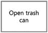
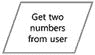
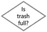
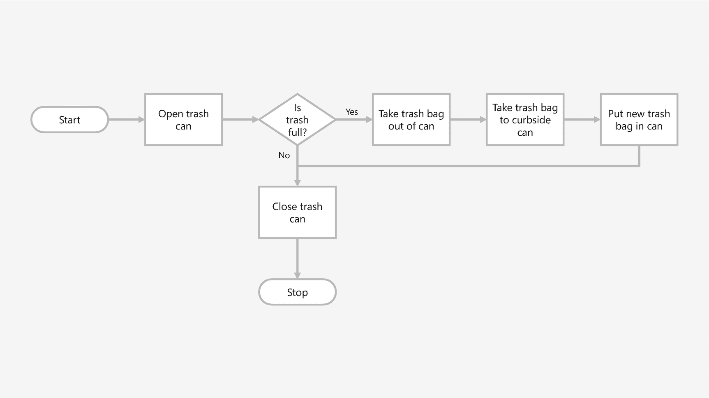

# 7. 流程图绘制

编程和编码既关乎坐在键盘前敲代码，也同样关乎思考和规划。通常，开发者需要在脑海中或纸上规划出程序将如何运行。这可以使编码过程变得容易得多，尤其是在与他人合作开发项目时。

流程图是勾勒程序的一种常见方式。顾名思义，它是一种直观展示程序流程的图表。在流程图中，你将各种步骤、决策和操作连接成一个遵循程序运行流程的链条。

由于计算机在处理你的操作和代码时非常字面化，流程图有助于你第一次就编写出更准确的代码，而不是在代码中反复调试和折腾。相信我，放弃流程图直接写代码的诱惑很大，但如果你是编程新手或相对较新，流程图将为你节省大量时间，并迫使你在坐到键盘前停下来、暂停并先勾勒出思路。

## 流程图绘制工具

有许多流程图绘制工具可供使用；有些是纸笔，有些是在线的。

### 纸张

就像作家在笔记本上写日记，设计师在速写本上画草图一样，开发者通常可以用纸笔来绘制流程图。有时，让事物变得有形和可触摸有助于放慢你的思维，让你对代码和程序更加深思熟虑。

如果你想采用纸质方法，可以买一个模板来辅助工作。这有助于让事情变得更整洁。

### 平板电脑和触控笔

如果你有支持触控笔的平板电脑或笔记本电脑，例如 iPad、Surface 或二合一笔记本电脑，有很多绘图应用可用于绘制流程图，包括 OneNote、Adobe Illustrator Draw、Autodesk SketchBook 等。一些专门的平板应用甚至可以检测你绘制的形状并将其转换为模板形状。

### 应用

像 OmniGraffle、Sketch、Adobe XD、Visio、PowerPoint 和 Illustrator 等应用，都是你可以下载或购买并用于构建流程图的例子。这些应用的功能各不相同，但它们都可以用来构建流程图。

我经常使用 Visio，它有一个很酷的功能：你可以在 Excel 中创建流程图的步骤，然后将它们导入 Visio 以自动创建流程图。如果你在 Excel 中进行了更改，还可以重新同步图表。

## 流程图基础

流程图使用不同的形状来表示程序或流程中不同类型的步骤。这些形状决定了正在执行哪些步骤，并且还可以影响程序流程的方向。

### 端点

一个基本的流程图以药丸形状开始；这被称为端点形状，用于流程图的开始和结束。在其中，你写入“开始”或“停止”，并且可以选择在形状中定义程序如何执行此操作。

然后，你画一条带箭头的线，指向流程图中的下一步。

### 处理/操作

一个操作，有时称为处理，用一个简单的矩形表示。你需要为程序中每个单独的步骤创建一个矩形。我们经常在脑海中将多个步骤组合起来，并将它们视为一个单一操作。因此，一些看似简单的步骤可能涉及多个操作。

然后，你在流程图中创建更多步骤，并使用带箭头的线将它们连接起来。这些线可以转弯和扭曲。它们可以是垂直的或水平的。这完全取决于你。

### 输入和输出

在你的程序中，你经常需要从用户那里获取输入或向用户显示输出。这些步骤用平行四边形表示，以区别于其他步骤，并且你像描述其他操作一样描述它。

### 决策

决策根据问题的结果来分支程序的流程。问题的答案必须是“是”或“否”。（你会在课程后面发现原因）。

决策步骤使用菱形形状，并有两个分支路径。一个用于“是”；一个用于“否”。然后，你根据问题的结果将这些路径连接到不同的操作。

这些分开的路径可能在稍后某个点重新汇合，但这完全取决于你的程序以及你希望何时实现这一点。

### 注释

有时你无法将所有内容都放入一个形状中，因此向流程图添加注释或备注是可以的。这些可以是关于步骤的附加描述或细节，也可以是开始编码时为你或他人提供的编程和编码注释。

### 其他形状

还有其他用于处理数据、创建子流程和其他操作的形状，但我们将在需要时再介绍它们。目前，我们将坚持使用这四种基本形状。

## 倒垃圾

让我们看一个示例流程图，你可以看到这一切是如何结合在一起的。

流程图以一个标记为“开始”的端点（或终端）形状开始。

然后执行一个操作：“打开垃圾桶盖”。

接下来，我们到达一个决策点。问题的答案必须是“是”或“否”。“垃圾桶满了吗？”如果是，则走“是”路径。如果不是，则走“否”路径。

根据你选择的路径，你将按照每个操作依次进行。

此图表中，决策路径最终汇合到一个点，这在流程图中是完全允许的。

然后，它以“停止”端点结束。

## 但事情真的这么简单吗？

不，并非如此。因为我们总是在做各种假设，而这些假设常常会给我们带来麻烦。

程序员的部分工作，就是接手复杂的任务，并将其分解为无法再进一步拆解的独立步骤。

这就像观察水，然后深入探究构成水的分子，再进一步到构成分子的原子。你一直下探到构成该物体基础的最小单元。现在，将这个原理应用到一项行动上。我们常常想当然地认为许多步骤是某个行动集合的一部分。

让我们看看之前的例子：倒垃圾。

“倒垃圾”这个短语，可能在你脑海中唤起一些具体的事情。如果有人对我说：“嘿，道格，你能去倒一下垃圾吗？”，我脑海里就会立刻浮现出需要完成的几个步骤。

以我家为例，我需要完成以下步骤：

首先，我需要去厨房，从垃圾桶里拿出装满的垃圾袋，然后提着它绕屋子走一圈，把卧室和卫生间里的小垃圾桶清空，倒进这个大垃圾袋里。接着，我把它拿到路边的垃圾桶，放进去。

就这样！我倒了垃圾。

但是，这些就是全部步骤了吗？我是否已经足够细致地分解了所有步骤，以确保所有需要发生的事情都发生了？如果我把我提到的这些步骤写下来，让某人严格按照步骤执行，他们会按照我的预期去做吗？

不，他们很可能不会，因为即使有了这些步骤，我仍然遗漏了一些假设。例如，如果第二天是垃圾回收日，我需要把路边的垃圾桶推到街上。当我说“垃圾”时，我指的是生活垃圾和可回收物，但一个按字面意思理解我的人可能不会这么认为。

作为一名程序员，你需要让你的代码尽可能精确和字面化。将行动分解成更小的行动，是成功的关键。对于你写的每一行代码，就像“倒垃圾”这个动作一样，你需要定义其中需要发生的每一个语句或动作，以满足你的所有期望，并确保该动作被正确执行。

所以，当你分解一个流程或任务时，要站在别人的角度思考，看看你列出的步骤是否合理。如果不行，就增加必要的清晰度和细节，使其万无一失，从而获得预期的结果。

