# 8. Hello, World

编程不仅要知道编写什么代码，还要知道如何将你使用的工具组合在一起，使项目能够运行并与他人分享。

在我们开始深入编写一些复杂的代码之前，我们应该先弄清楚如何将这些工具组合在一起使用。

## 创建你的 IntelliJ Java 项目

首先，我们需要为项目创建基本结构。为此，我们需要进入 IntelliJ，并使用特定的项目模板创建一个新的 Java 项目。

### IntelliJ IDEA

当你首次启动 IntelliJ 时，你会看到欢迎界面。你也可以通过 **文件** ➤ **打开** 菜单项打开此界面。

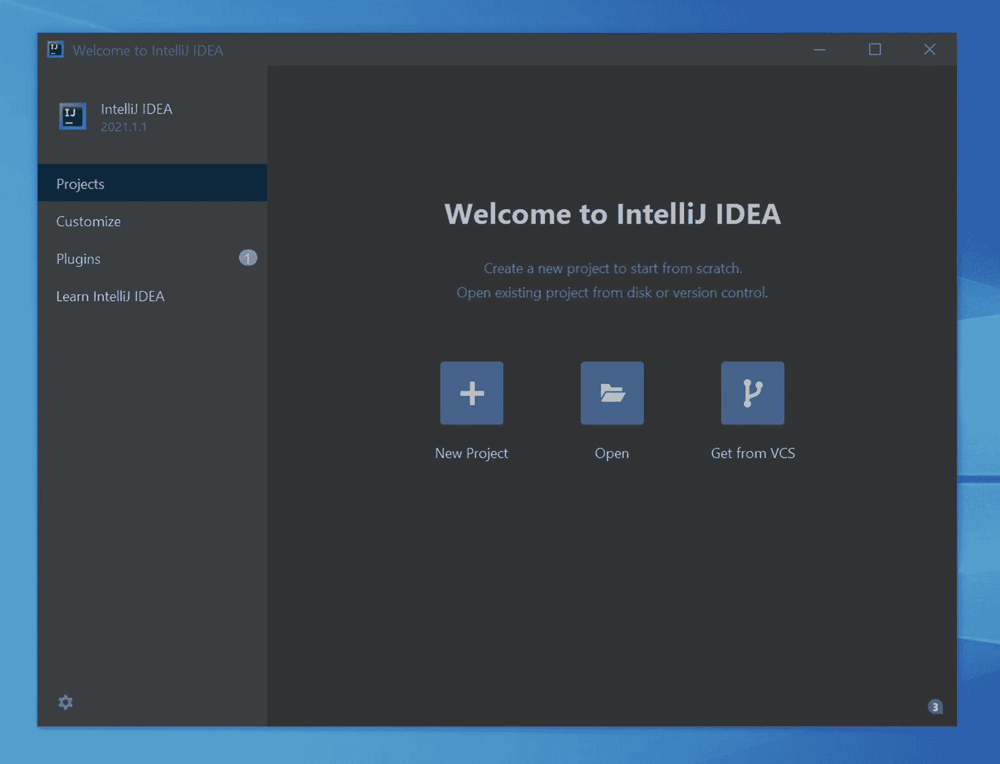

图 8-1

IntelliJ 欢迎窗口

从这里开始，我们需要创建一个新项目，所以，你猜对了，从窗口中选择“**创建新项目**”。

然后你会看到“新建项目”窗口。在这里，你将定义项目的参数，并设置初始文件夹结构和起始代码，以便开始编码和构建你的项目。

### 仅首次：配置 JDK

项目的一个重要组成部分是将其连接到 JDK。这不会自动完成，需要在首次创建项目时进行配置，并且每次在你的机器上更新 JDK 时，可能需要重复此操作。

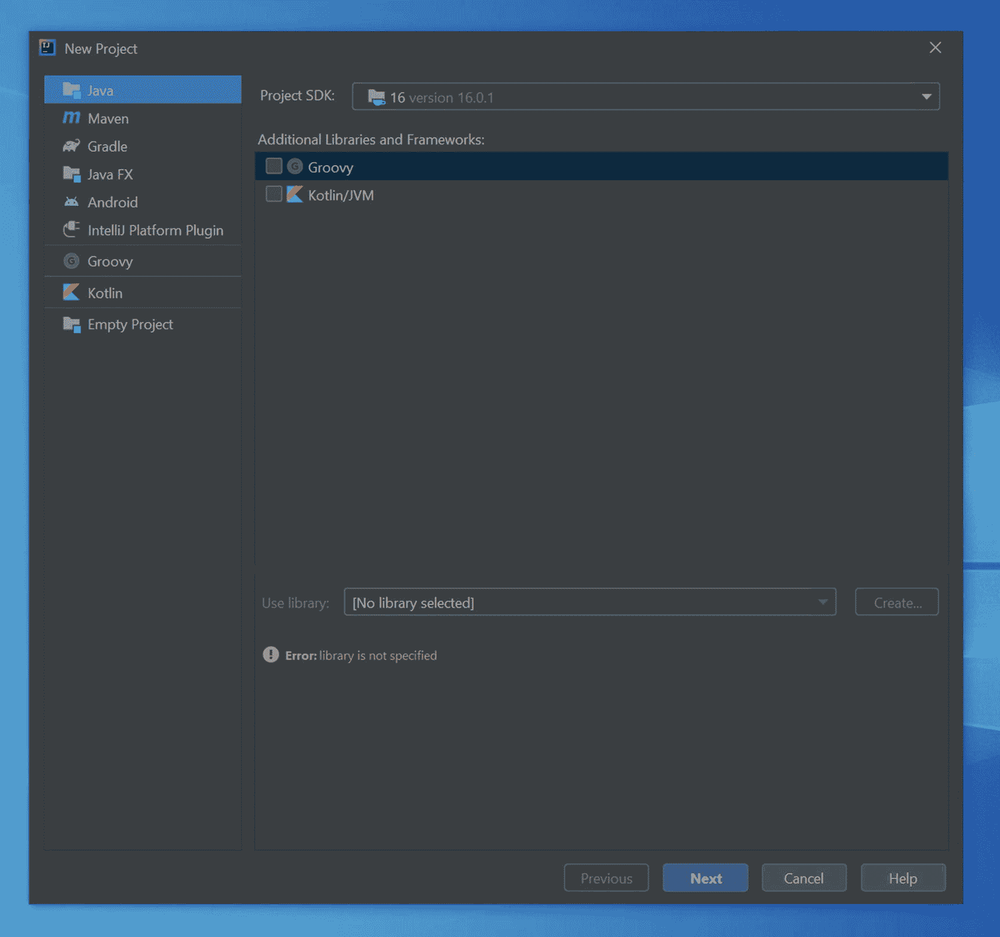

图 8-2

新建项目窗口

这个过程非常简单。

在“新建项目”窗口的顶部，点击“**新建…**”按钮。

当你点击“**新建…**”按钮后，你需要告诉 IntelliJ JDK 的安装位置。在 Windows 机器上，它通常位于“**Program Files**”文件夹中；在 macOS 上，它通常位于“**Library**”文件夹中。

选择 JDK 的位置以及 JDK 的主文件夹，然后点击 **确定**。

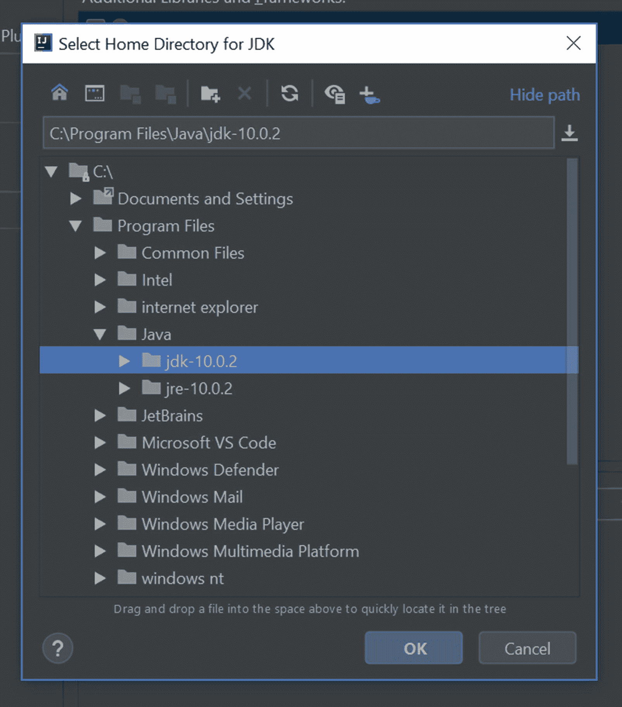

图 8-3

选择 JDK 文件夹

然后你会看到 JDK 的版本号出现在“新建项目”窗口的顶部。

### 创建项目

配置好 JDK 后，开始操作：在左侧选中 Java，并保持库和框架选项不被勾选。

点击 **下一步** 继续，离开“新建项目”窗口。

在下一个屏幕上，你将配置项目模板。

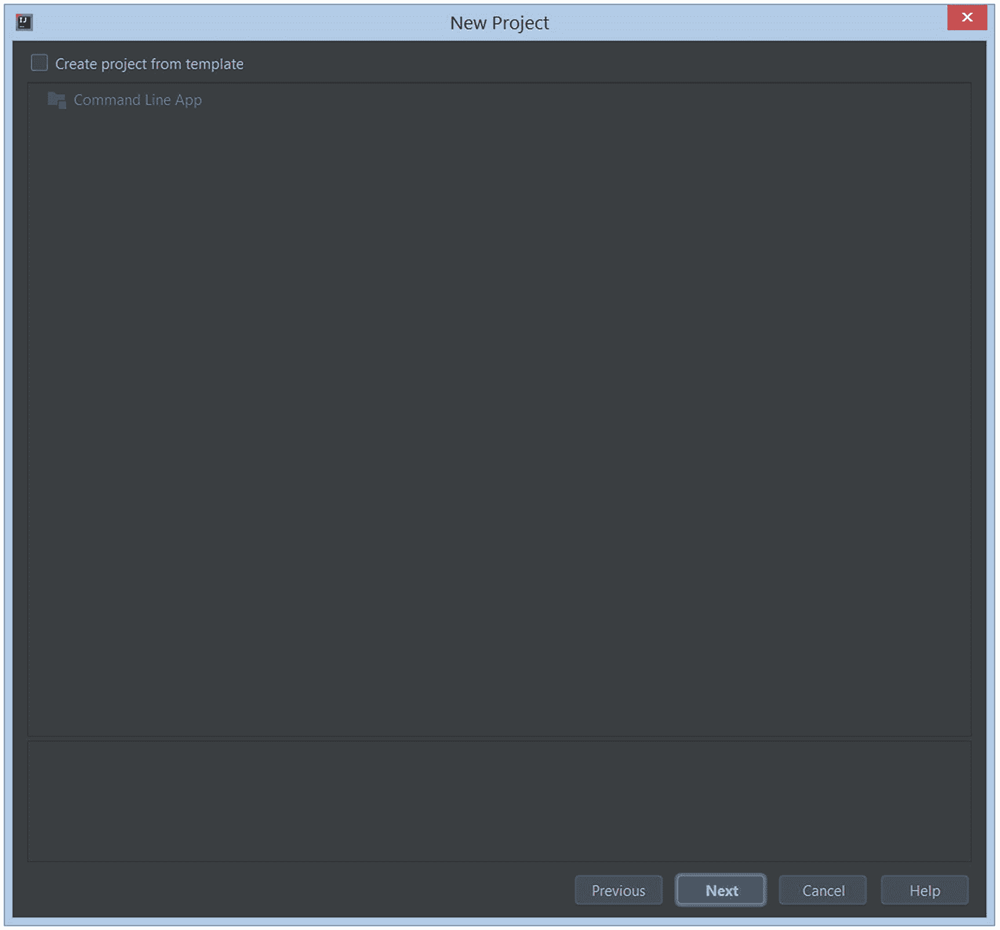

图 8-4

项目模板

勾选“从模板创建项目”，然后选择“命令行应用程序”。

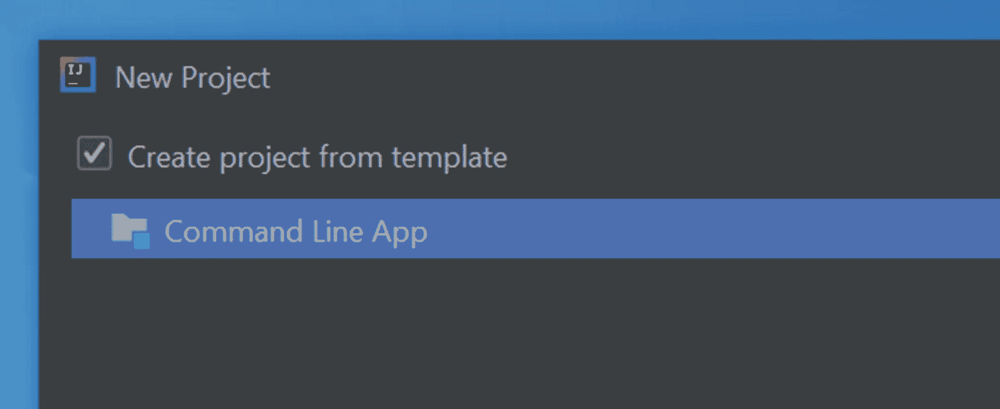

图 8-5

模板选择

点击 **下一步** 继续。

现在你需要给你的项目起个名字。强烈建议项目名称中不要包含任何特殊字符或空格。通常对于作业，你可以使用作业中指定的名称。现在，我们将使用“**HelloWorld**”。

然后你需要选择项目的保存位置。你可以选择默认文件夹，当你创建项目名称时，它会为你创建一个子文件夹。如果你没看到，可以在 `IdeaProjects` 文件夹下手动创建一个。

第三个选项是基础包。默认包名为 `com.company`，但我们不会使用它，所以将其删除，并确保该字段为空。

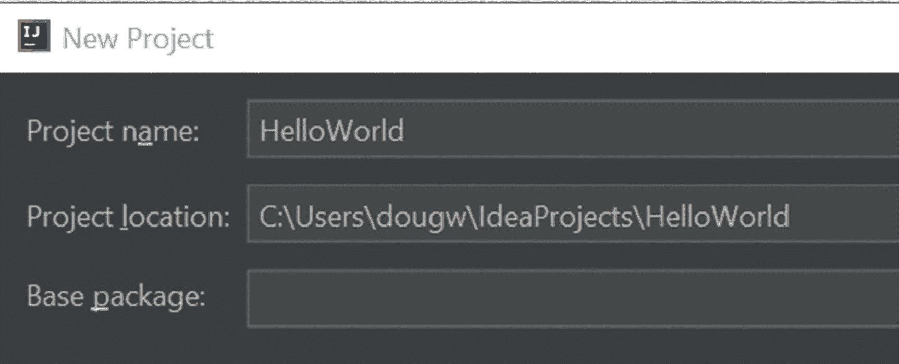

图 8-7

新项目名称和位置

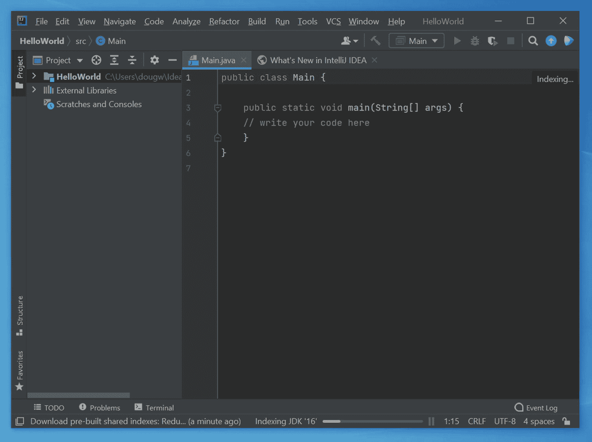

图 8-6

空项目

完成上述操作后，你应该会看到这个界面：

当你准备好后，点击 **完成**。

IntelliJ 将开始工作，创建项目结构和一个存根代码文件，以帮助你入门。


### 关于你的项目

当项目准备就绪后，你会看到 IntelliJ 界面显示你的主项目代码文件，名为 `Main.java`。在课堂作业和家庭作业中，你将在这个文件中构建大部分项目代码。

右侧是主编码区域。你将在此处输入代码，并可以借助 IntelliJ 内置的功能查看语法错误和获取上下文帮助。

左侧是项目浏览器。你可以使用 Alt-1 或 Cmd-1 键盘快捷键来打开或关闭它。

“项目”面板显示项目中所有文件。顶层文件夹的名称与你创建的项目名称相同。在它内部，你会看到一个 `src` 文件夹。它包含项目的源代码。展开它，你会看到项目中文件的更多详细信息，包括右侧已打开的 `Main.java` 文件。

你还会在这里看到其他项目。`.idea` 文件夹包含 IntelliJ 的项目设置，当你再次打开项目时，这些设置有助于将 IDE 重新配置为你之前的设置。

“外部库”部分显示项目中包含的所有 Java 归档文件或 JAR。请记住，Java JDK 在 JAR 文件中包含了所有 Java 工具。展开这个展开三角形，你可以看到所有这些文件。

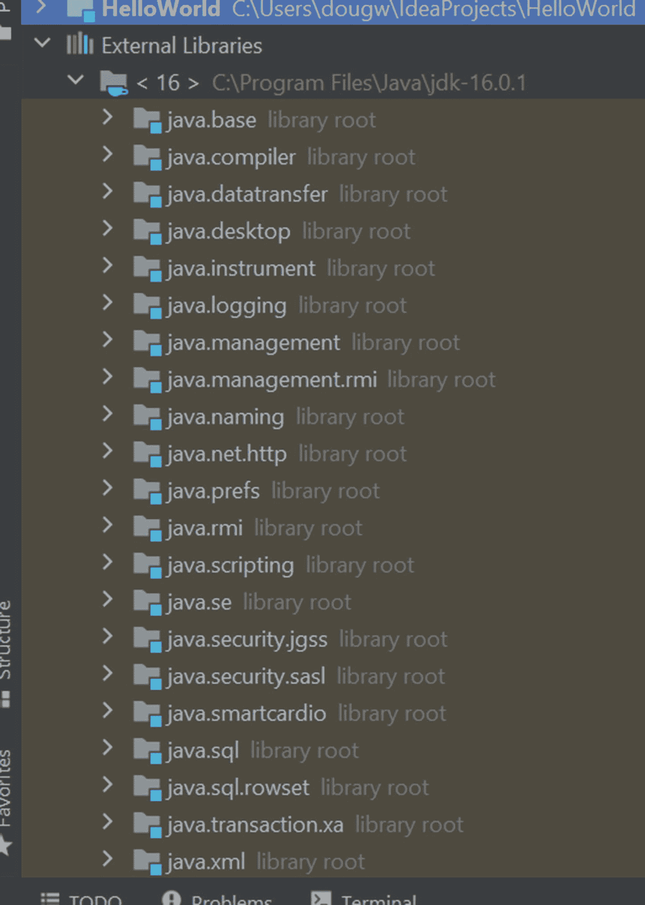

图 8-8

项目面板

创建好项目的初始框架后，我们现在可以编写程序代码，并在我们在 IntelliJ 中创建的本地开发环境中进行工作。

## 编写项目代码

在 IntelliJ 中，你将在代码面板中编写所有项目代码。每个代码文件都在一个选项卡中打开。在“项目”面板中双击一个文件，会将其作为新选项卡打开。

当你创建一个新项目时，`Main.java` 文件已经有一个打开的选项卡。

### 编写你的第一个程序

我知道，我知道。说了/写了/读了这么多，代码却写得不够。让我们通过编写第一个程序来消除这种挫败感。

现在，这个程序不会做太多事情。但这没关系。现在保持简单，我们以后会逐渐复杂起来。相信我。

在你的代码面板中，你会看到一行写着：

// write your code here

那么，猜猜看？这就是你写代码的地方！

将光标放在该行文本的末尾，然后按 Enter 或 Return 键。

现在，编写下面这行代码，确保拼写、大小写和标点符号与显示完全一致：

```
System.out.println("Hello, World!");
```

写完这行代码后，代码面板应该看起来像图 8-9 所示。

程序代码完成后，我们现在可以在 IntelliJ 内部直接编译、构建和运行程序。

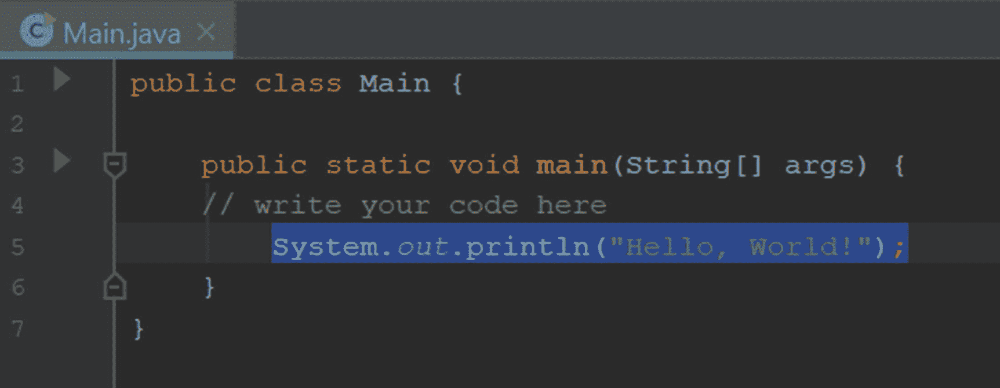

图 8-9

完成的 Main.java 文件

#### 编译并运行你的第一个程序

从菜单中打开 **运行** ➤ **运行 ‘Main’**。这会将你的程序编译成 Java 字节码，构建一个 `.class` 文件，该文件将被添加到你的“项目”面板中。

你会看到程序开始编译，并且底部会打开一个新面板，即“运行”面板。这将显示编译结果。如果有任何错误，它会列出它们。在这种情况下，没有错误，程序运行，并在屏幕上显示文本 “Hello, World!”。

恭喜！你已经构建并运行了你的第一个 Java 程序。

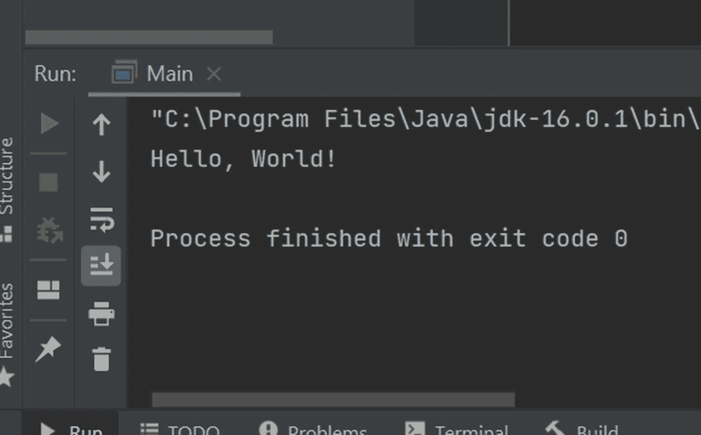

图 8-10

显示程序输出

然而，我们还需要看看“项目”面板中的一些东西。你会看到一个名为 `out` 的新文件夹。此文件夹包含项目的编译字节码。

你会看到一个名为 `Main.class` 的文件。如果你还记得，这个文件是在 JRE 中运行的已编译 Java 字节码。它存储在你的项目中，以便随后在计算机上运行。程序的输出被定向到“运行”（有时称为“输出”）面板。

现在我们有了一个成功运行的项目，如果我们以后进行更改并需要回到这个时间点，我们应该将代码保存到 GitHub。

## 在 GitHub 中创建你的仓库

我们的代码保存在本地计算机上后，我们需要在 GitHub 中创建一个仓库，以便我们处理代码的更改并与其他人共享。

首先，打开浏览器并访问 [`www.github.com`](http://www.github.com)。在那里，我们将创建一个新仓库并上传我们的代码。

登录你的账户，你应该会看到仪表盘，类似于图 8-11 所示。

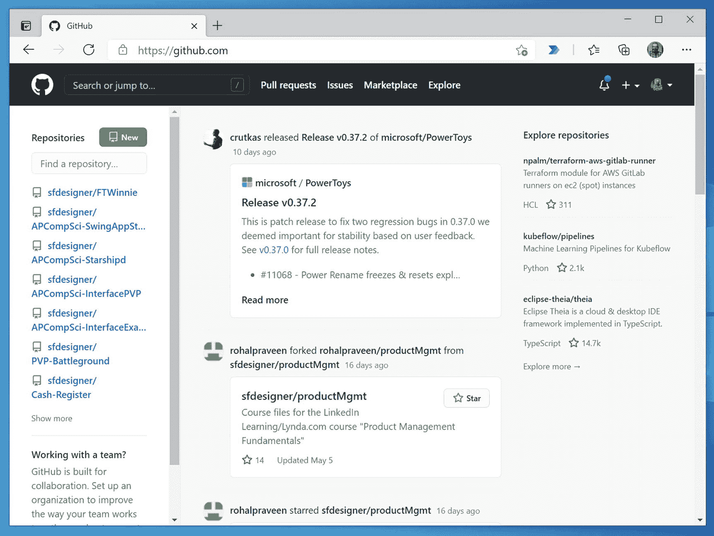

图 8-11

GitHub.com 仪表盘

在这里，点击左侧的绿色 **New** 按钮，或者点击账户头像旁边的加号按钮并选择 **New repository**。

为你的仓库命名，通常由作业或任务定义。对于此示例，我们将使用 **HelloWorld**。

为你的仓库添加描述，例如 “**First project in GitHub**。”

保持项目为 Public，并勾选 **Initialize this repository with a README** 选项。我们将使用 README 来分享关于我们项目的信息。

你可以保留所有其他选项不变。你的页面应该看起来像图 8-12 所示。

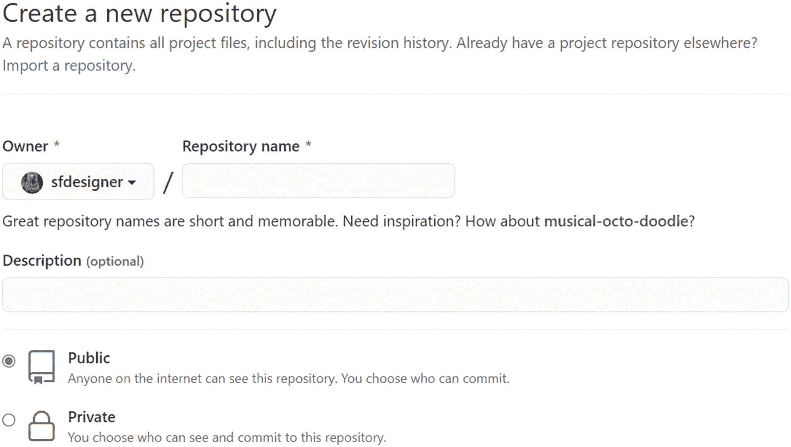

图 8-12

新仓库设置

点击页面底部的 **Create repository** 按钮。

你现在将看到仓库的登录页面，并且会看到一个文件 `README.md` 已被创建并添加到你的仓库中。

我们可以直接在 GitHub 中编辑此文件。点击标题栏右侧的铅笔图标，该标题栏是 README.md 部分的起始位置。

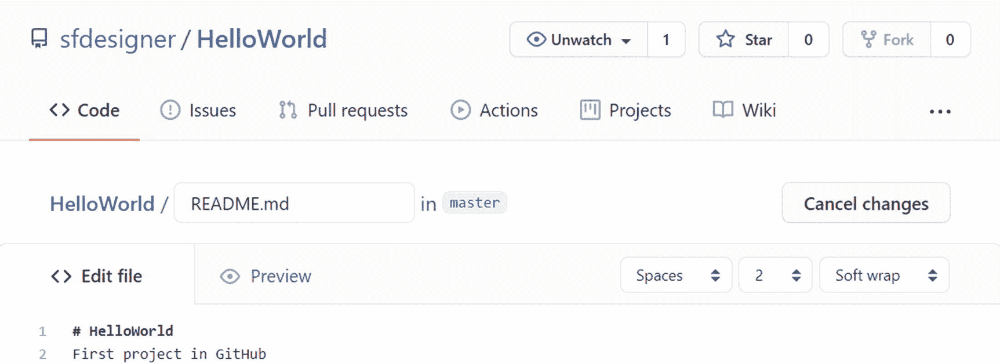

图 8-13

编辑 README.md

这是一种称为 Markdown 的特殊格式。Markdown 是一种用于编写格式化文本的特殊语言。该语言有一些特定于 GitHub 的特殊扩展，用于帮助构建文档和其他供其他开发者使用的功能。

我将在学校课堂上使用它，所以我会添加 “**Serra High School, AP CompSci**。”

在底部，你现在可以保存此更改或将其提交到仓库。添加更改的摘要，然后添加可选的描述，如图 8-14 所示。

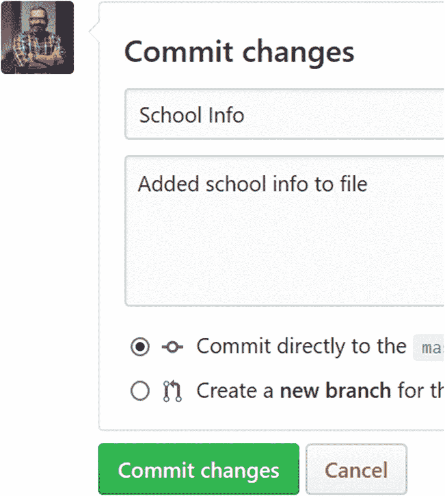

图 8-14

提交更改信息

然后点击底部的 **Commit changes** 按钮。

你现在将在页面上看到所做的更改。

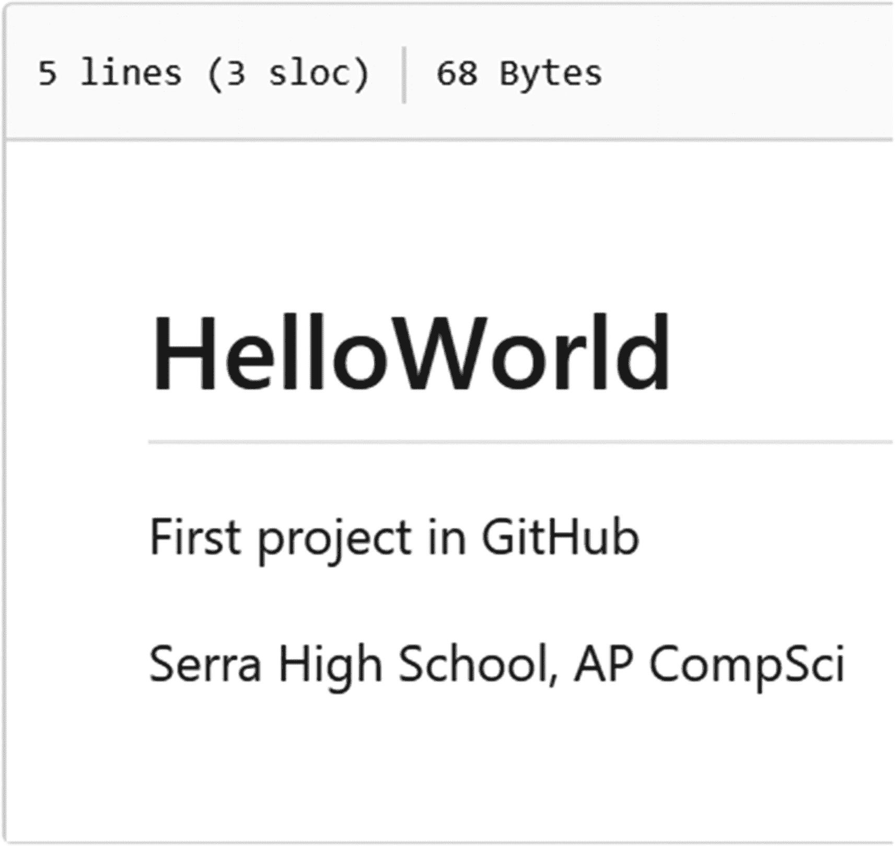

图 8-15

查看对 README.md 所做的更改

你刚刚创建了你的第一次提交。提交是你希望添加到项目中并随时间跟踪的更改。


## 将代码上传至 GitHub

现在你已经创建好了仓库，就可以上传代码并将其保存在线上，以便共享并追踪变更与版本。

首先，请确保你位于仓库的主页面。在此页面上，点击 **Upload files**（上传文件）按钮。

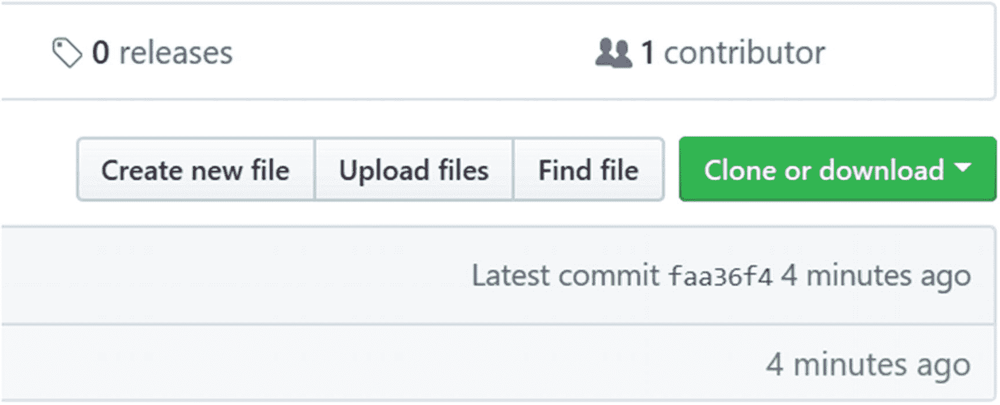

图 8-16

上传文件按钮

现在，你可以将文件拖放到页面上的区域，或者点击 **Choose your files**（选择文件）链接，然后通过资源管理器或访达对话框进行浏览。

找到代码文件的一个技巧是返回 IntelliJ。

在那里，转到你的项目面板，右键点击你想要上传的代码文件。选择 **Show in Explorer**（在资源管理器中显示）或 **Show in Finder**（在访达中显示）选项。

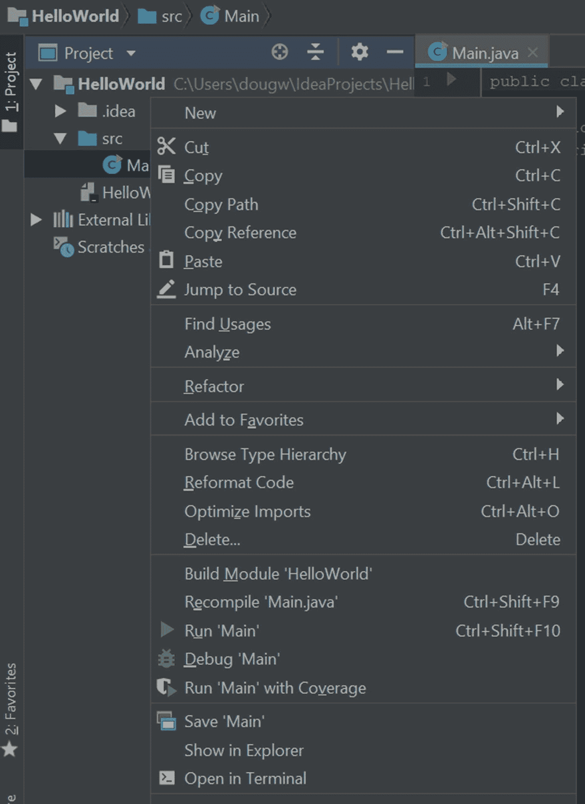

图 8-17

“在……中显示”选项

随后会打开一个窗口并显示该文件。现在你可以将其拖放到浏览器中的 GitHub 页面里。

你会看到该文件已添加至文件拖放目标区域的底部。

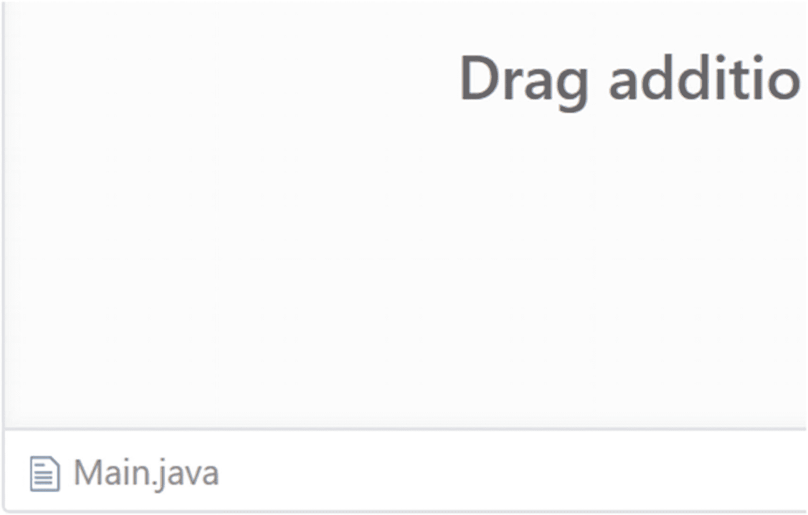

图 8-18

文件已准备好提交

现在，我们可以提交更改了。在摘要中填写“**First code commit**”（首次代码提交），然后在扩展描述中填写“**Display a statement on the screen**”（在屏幕上显示一条语句）。

完成后，点击绿色的 **Commit changes**（提交更改）按钮。

GitHub 随后会处理你的更改，并在仓库窗口中显示它们。

### 共享程序输出

当你使用本书中的练习并与他人协作时，共享程序的输出也可能会很有帮助。为此，我们将创建一个文本文件，并将运行面板中的内容复制粘贴到该文本文件中。

首先，在你的仓库中创建一个新文件；将其命名为 `output.txt`。

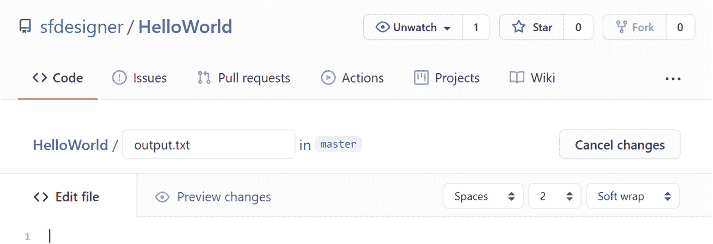

图 8-19

创建文本文件

在 IntelliJ 中，转到你的 HelloWorld 项目，并点击运行面板内部。如果面板未打开，请再次运行程序以显示它。

按下 Control-A 或 Command-A 全选，然后复制到剪贴板。接着返回 GitHub 中的新文本文件并粘贴。

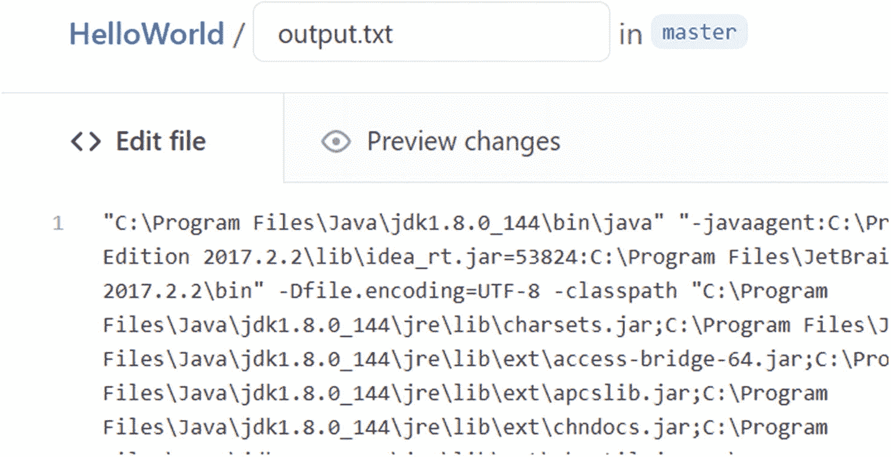

图 8-20

粘贴后的输出文本

转到页面底部，点击 **Commit new file**（提交新文件）按钮。

