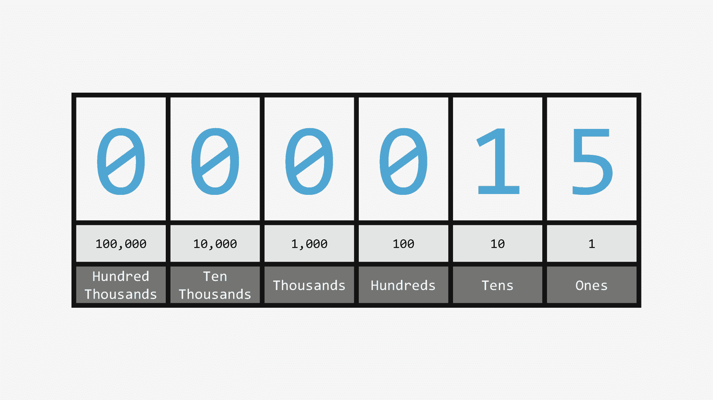
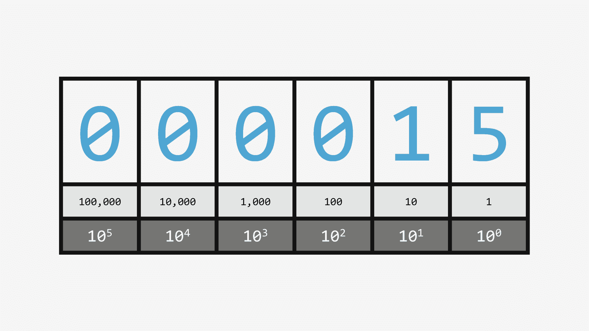
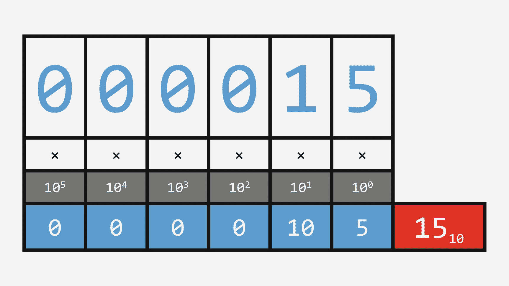
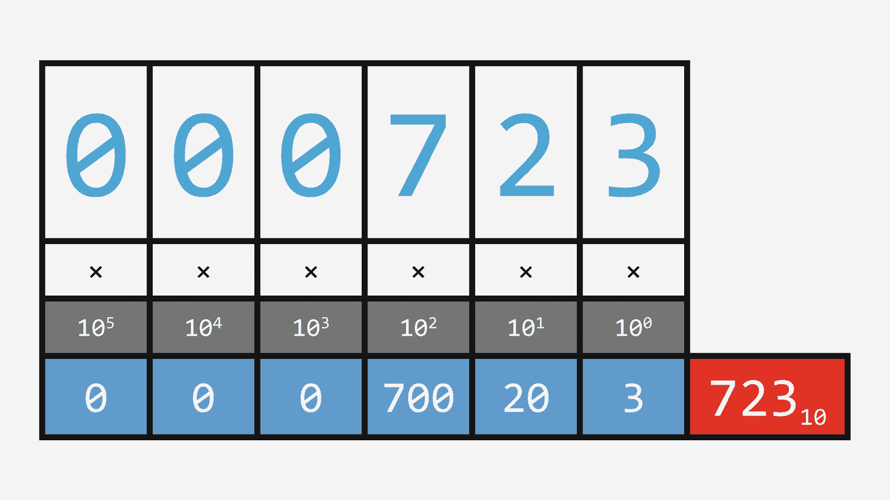
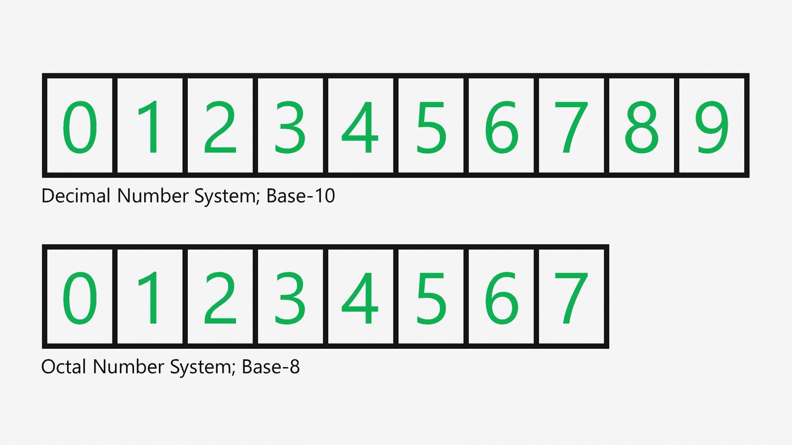
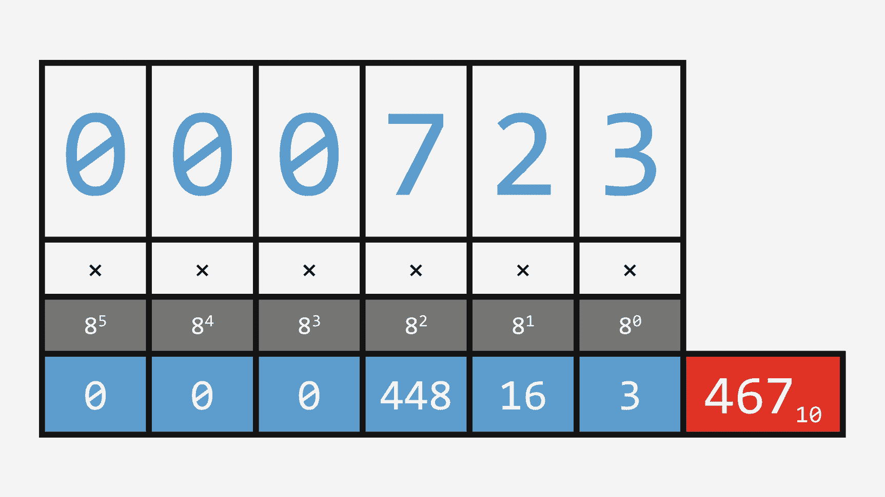
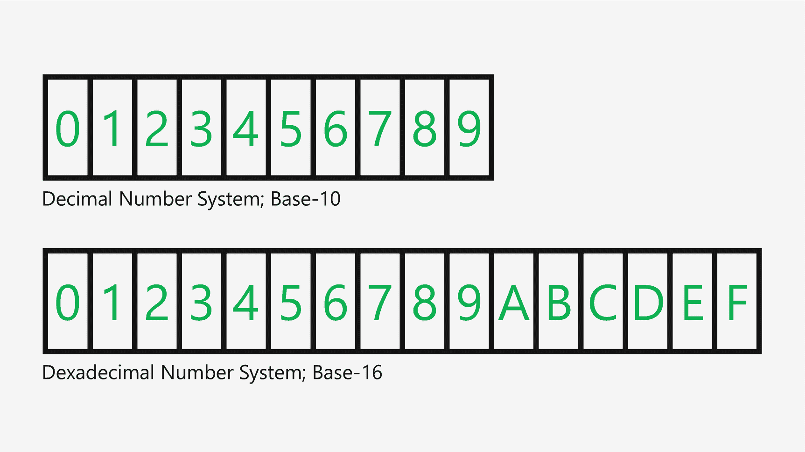

# 14. 数字的抽象

当我们想到数字时，我们想到的，嗯，就是数字。任何包含从 0 到 9 的数字的东西。例如，我们有一个像 723 这样的数字。这个数字 723 代表一个数值，或者某个东西的数量。它可以是 723 美元、723 码的纱线，或者 723 加仑的牛奶。这个数字告诉你某样东西有多少。

但是，如果我向你展示这三个数字呢？723、723 和 723。如果我告诉你，这些数字中的每一个实际上都代表着不同的数量呢？通过使用不同的数字系统，这完全是可能的。

让我们暂时抛开我们所熟知的数字，来看一堆东西。在这种情况下，我有五个回形针。现在我们可以把它表示为数字 5，但如果我说我有 V 个回形针，这表示同样的意思吗？是的。如果你懂罗马数字，那它就是一样的。罗马数字是表示我们拥有多少东西的另一种方式。它遵循一套不同的规则，使用像 I、V、X、L、C 和 M 这样的符号。罗马数字基于基本的计数。从 1 开始，我添加符号，然后在某个点，我使用下一个最大的符号，并基于该值进行加法或减法，前提是同一类型的符号不能连续出现三个以上。

令人困惑吗？有点。但几个世纪以来，从罗马时代作为所有价值表示的基本形式，到如今用于计算年度体育赛事或电影续集，罗马数字一直被使用。但这表明，同一个数值可以有不止一种表示方式。

我们通常使用十进制数字来表示数字。十进制使用 10 作为数字系统的基数。这就是为什么我们使用十个数字：0、1、2、3、4、5、6、7、8 和 9。数字系统的另一个关键部分是你可以有多个数位。例如，我们取数字 5，我们可以用单个数字来表示它。但数字 15 我们需要两个数字。右边的数字代表“个位”；再往左的数字代表“十位”。

图 14-1

数字数位

我们可以像老式里程表那样表示它，所有可能的数字都可以显示在一列中。当你达到最高数字并需要再加一时，你将数值推到下一列，并从零开始。

图 14-2

作为 10 的幂的十进制数字

这些列背后有一些很酷的数学原理。还记得我说过十进制是基于 10 的吗？嗯，你可以将第一列表示为取其个位数字乘以 10 的 0 次方，即 1。当你向左移动时，你可以根据需要将指数增加 1。所以下一列是 10 的 1 次方，即 10，乘以该列中的数字。

图 14-3

用 10 的幂表示 15

所以如果我们举一个更复杂的例子，比如我们之前的 723，我们可以计算每一列代表什么，当你把所有这些加起来时，你又回到了 723。

图 14-4

用 10 的幂表示 723

但是，如果我减少可能数字的数量，去掉最后两个呢？在这种情况下，我们只有八个数字，从而创建了一个基于 8 的新数字系统，即八进制数字系统。

图 14-5

十进制与八进制对比

我现在需要更改各列的计算方式，不再使用 10，而是使用 8。所以现在，如果我使用相同的格式来计算每一列，八进制数 723 实际上等于十进制数 467。

图 14-6

八进制中的“723”

我也可以增加可能的数字，例如，我可以创建 16 个可能的数字。在 9 之后，我可以使用像 A、B、C、D、E 和 F 这样的字母来表示额外的数字。这个数字系统基于 16，被称为十六进制系统。

图 14-7

十进制与十六进制对比

所以，当我们更新数字各列的公式时，十六进制中的 723 实际上代表了我们所认识的十进制数 1827。

图 14-8

十六进制中的“723”

你在编写代码时经常会看到十六进制，尤其是在网页设计中。颜色通常由三个或六个十六进制数字表示，第一组代表红色，第二组代表绿色，最后一组代表蓝色。在屏幕上，你控制着每个像素中红、绿、蓝光的量，因此这些数字代表这些值，允许你增加或减少每一种颜色，从而提供数百万种不同的颜色选择。

所以，如果你思考数字系统的规则，你会发现有几件事是相同的。你有一个基数，它定义了可能数字的最大数量，然后你有多个列，越往左，这些列以指数方式递增，以表示更大的数值。这种方法同样适用于表示更小的数值。

有了这些规则，你可以将它们应用于任何基数，包括 2，这是二进制数字系统的基础，也是计算机存储、通信和处理信息的基本方式。

