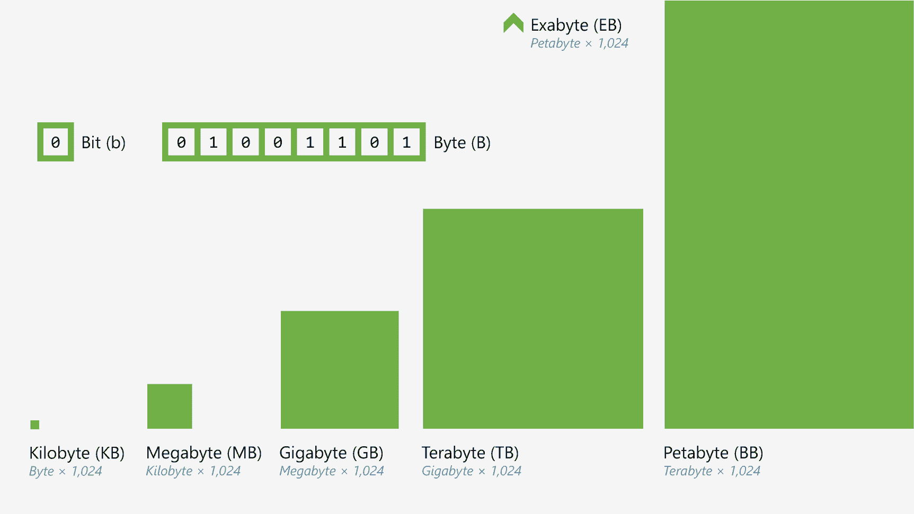
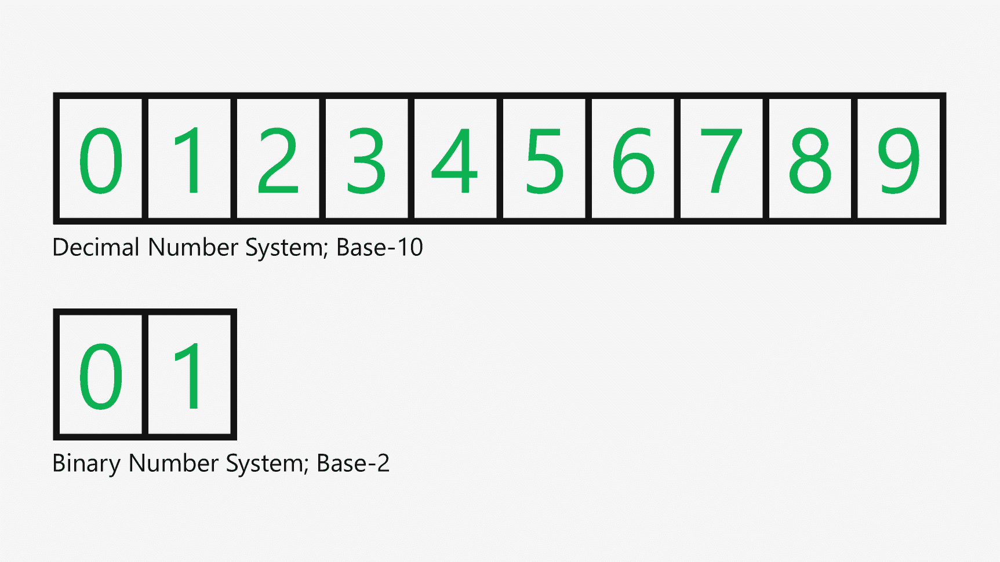
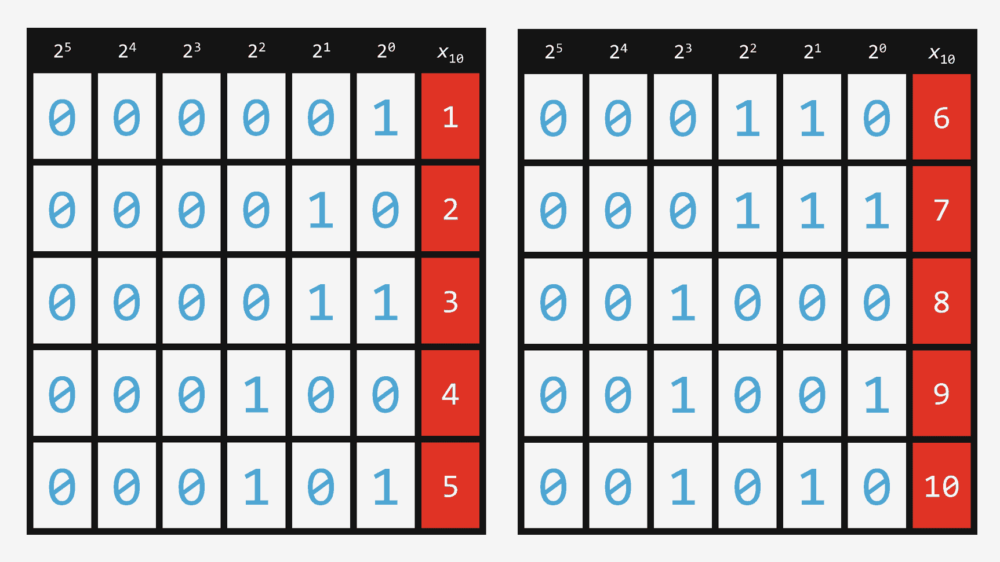
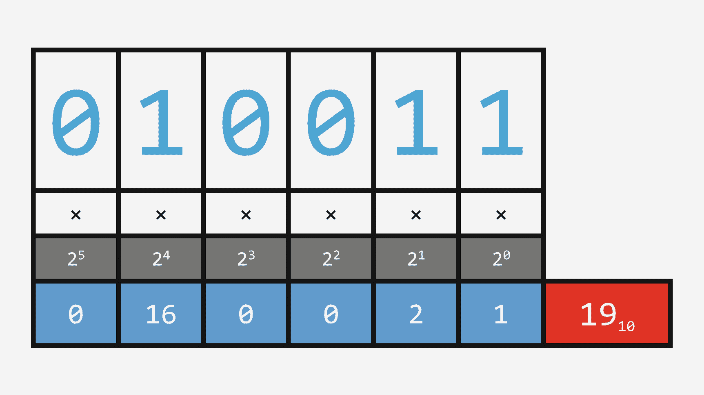
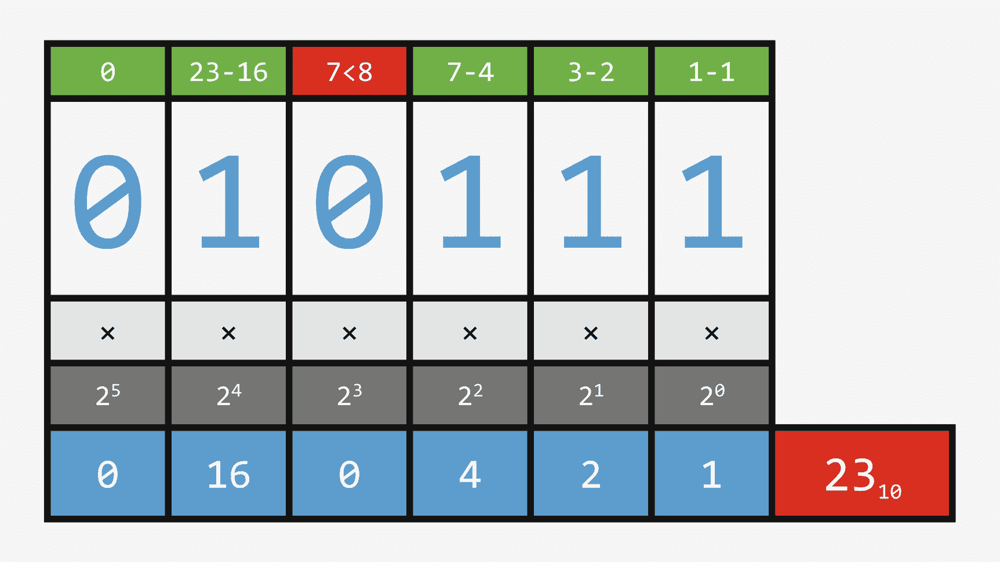
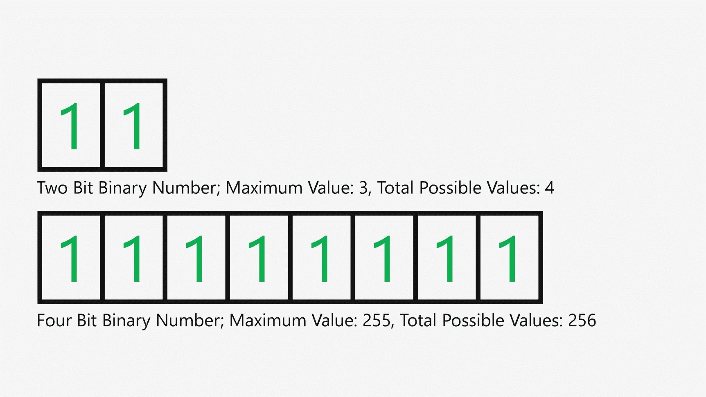
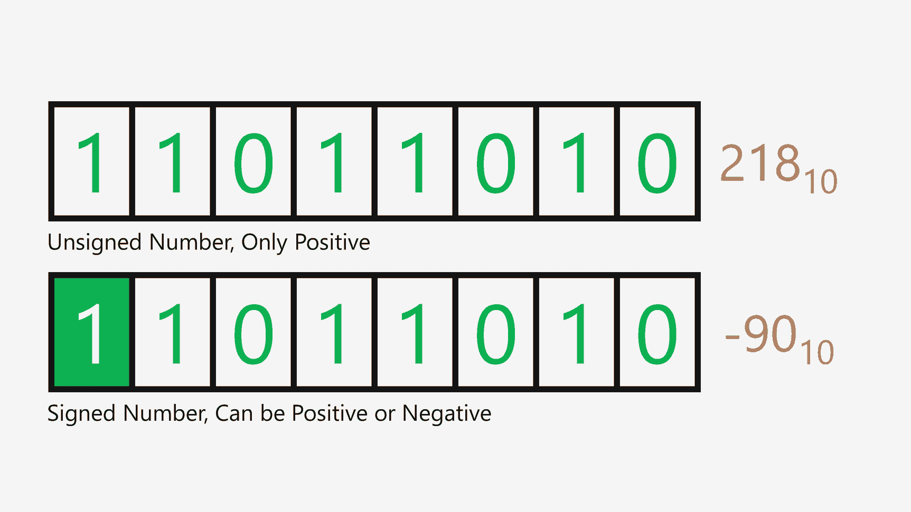
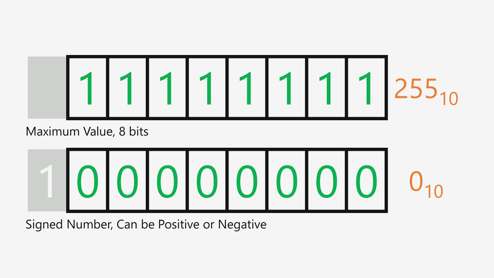
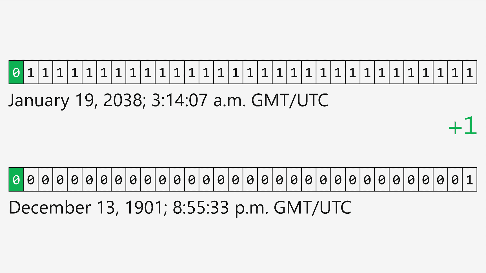

# 15. 二进制

我们可以将“开”和“关”的二进制状态表示为数字。二进制数字系统仅基于两个数字：1 和 0。对于“开”的二进制状态，用 1 表示；对于“关”的二进制状态，用 0 表示。

但单独存储一个值本身意义不大。你可能希望连续存储多个值。为此，你需要创建一串这样的值，由于它们都是数字，你实际上是在创建一个由多个数字或比特组成的更大的数字。

八个二进制位组成的一组称为一个字节（byte，拼写为 y）。字节是我们日常使用的常见数据度量单位。1 千字节等于 1024 字节。1 兆字节等于 1024 千字节。1 吉字节等于 1024 兆字节，1 太字节等于 1024 吉字节。

图 15-1

内存与存储容量

在计算机上，你可能有一个能存储 1 太字节数据的硬盘。1 太字节大约包含近九万亿个比特。这相当于超过九万亿个独立的“开”或“关”状态。

但我们用所有这些比特做什么呢？

每个比特都保存着一个“开”或“关”的状态，它代表更大信息片段的一小部分，无论这个信息片段是一个数字、一段称为字符串的文本、一份文档、一张照片、一首歌、一部电影还是一个计算机程序。我们日常使用的所有这些事物，都会被转换成比特，由计算机和网络进行存储、传输和转换。

将我们今天所识别的信息（例如一段文本）转换为二进制的过程称为编码。你是在将某种以人类可理解方式表示的事物，通过特定过程转换成可由计算机或网络传输、处理和存储的二进制数字串。

使用相同的过程，但反向操作，这些单独的二进制数字就可以被转换回我们日常使用的信息。这称为解码。它重构了被传输或访问的文件，并以我们可识别的格式呈现给我们。

但为了使编码和解码过程能够工作，包含这些值的比特需要被存储、访问或传输。实现这一点的方法是制定一个协议（即一套规则），规定比特如何传输，并定义所有计算机通信工作的基础。

## 二进制数

二进制状态是计算机使用“开”或“关”状态来存储、处理和共享信息的基础。利用二进制数字系统，我们可以使用基数为 2 的系统（包含两个数字：0 和 1）来表示这些状态。

图 15-2

十进制与二进制

利用数字系统的规则，我们可以为二进制数字的表示方式创建一个系统。我们最多有两个可能的数字：0 和 1。此外，我们还有多个数位，这些数位从右到左基于系统的基数 2 呈指数级增长。如果我们从零开始向上计数，就能看到二进制是如何工作的。首先，我从 0 开始，然后加 1，得到 1。如果我再加 1，第一个数位的可能数字就达到了最大值，所以我将其进位到下一列，并将第一个数位归零。

图 15-3

二进制计数到“10”

我们继续加 1，为数字增加数位，最终得到一个由多个 1 和 0 组成的多位数。利用我们可以应用于每个数位的公式，我们可以将每个数位的数字乘以基数（2）的该数位次幂。让我们逐列进行说明。

图 15-4

二进制转换为十进制

我们有数字 10011。从最右边开始，该数位是 2 的 0 次方（即 1），乘以该数位的数字 1，得到 1。

下一列是 2 的 1 次方（即 2），乘以数字 1，得到 2。

接下来是 2 的 2 次方（即 4），乘以 0，得到 0。

再下一列是 2 的 3 次方（即 8），乘以 0，得到 0。

最后，我们有 2 的 4 次方（即 16），乘以 1，得到 16。

然后我们将所有这些结果相加：16 加 0 加 0 加 2 加 1，总和为 19。

我们也可以反向操作。以数字 23 为例。

图 15-5

十进制转换为二进制

我们可以利用二进制数位的公式将十进制数转换为二进制。

我们需要找到小于 23 的 2 的最大幂，即 16。然后我们在该数位放一个 1，并从 23 中减去 16，剩下 7。

下一列是 2 的 4 次方，即 8。我们当前剩余的数太小，所以放一个 0 并继续。

7 中 2 的最大幂是 4，所以我们在该数位放一个 1，并从 7 中减去 4，剩下 3。

3 中下一个最大的 2 的幂是 2，所以我们在该数位放一个 1，并从 3 中减去 2，剩下 1，它等于下一个最大的 2 的幂（即 1）。结果是 10111。

因此，使用这种算法，计算机可以获取我们通常表示为十进制数的值，并将其转换为一种可以使用 1 和 0 进行本地存储和传输的格式。这个转换过程是我们日常使用的所有数字信息编码和解码的基础。

## 位大小与数值

借助二进制数，我们可以将通常用十进制表示的值，以计算机能够存储、发送或接收的格式进行存储。但当我们思考数值时，数字的位数越多，其能表示的值就越大。

我们来看这个二进制数：`10`。这是一个两位的数字，意味着它包含两个数字，每个数字都是一个比特，即 1 或 0。这个两位的二进制数可以存储四种不同的值，其最大值为 3。随着我们增加更多的位数，我们就能提高该二进制数可存储的最大值。

图 15-6

二进制数的位大小

你听说过 8 位这个词吗？8 位、16 位、32 位、64 位以及更高位数，这些都代表了二进制数中可用于存储的位数。如果我们看一个 8 位二进制数，它有八列，或者说八个可能的数字位。如果我们对每一列进行计算，可以存储的最大值是 255。如果加上表示“无”的 0，我们总共可以存储 256 个值，范围从 0 到 255。那么 2 的 8 次方是多少？是 256。

但 256 并不是一个很大的数字。所以，如果我们需要存储更大的数字，就需要更多的比特。如果我们增加位数，得到一个 16 位二进制数，那么可以存储的最大值可达 65,535，或者说包括 0 在内共 65,536 个值。

还需要更大吗？让我们将其翻倍到 32 位。现在我们可以存储 4,294,967,296 个值。

64 位可以存储超过 18 京（quintillion）个值，而且随着我们增加更多的比特，这个数字会变得越来越大。

利用这些比特，计算机程序可以在内存中存储数值。程序员需要平衡其应用程序的存储需求与程序可用的存储空间。为了帮助管理这一点，开发者拥有不同大小和类型的容器，称为变量，他们可以用这些变量来存储信息。每种变量类型都有不同的位大小要求，这意味着该变量有一个程序员可以存储数值的有限大小。

例如，程序员可能会使用一种只需要一个字节的变量类型。这个字节包含 8 个比特，因此我们可以存储从 0 到 255 的值。它只能包含这些值，并且只能包含整数，意味着它不能携带小数。

但是 255 并不算大，因此有越来越大类型的变量供程序员用来存储数值。每种更大的类型都会在计算机内存中预留一定数量的比特。一个使用 32 比特的更大容器可以存储更大的数字。在这种情况下，数字最高可达 4,294,967,295。

那么负数呢？当我们写一个负数，比如 –5，我们需要在数字前面加一个负号。这个符号需要作为数据被捕获，以便计算机理解。因此，为了存储这个符号，会预留一个比特来表示这个数是正数还是负数。这就产生了一个“有符号”数。但是，在一个 32 位的值中，由于我们为符号损失了 1 个比特，我们只能使用 31 个比特来存储数字。所以我们可以存储的范围更小了。结果，使用 31 个比特，我们只能存储最大值为 2,147,483,647 的值，但加上用于表示正负号的比特后，我们拥有的范围与无符号数相同。

图 15-7

无符号数和有符号数

程序员可以轻松地存储一个或几个这样的值，而无需担心数字问题。但像电子表格这样的东西呢？假设一个单元格可以使用 64 位来存储一个值。这是一个可以容纳大量信息的数字，并且可以轻松地存储正数、负数甚至小数，供我们进行计算。64 位等于 8 个字节。这看起来似乎没什么大不了的。

但是一个电子表格可以包含海量数据。事实上，Excel 电子表格可以包含 1,048,576 行和 16,384 列。那是 17,179,869,184 个数据单元格！每个单元格需要 8 个字节，那就是 137,438,953,472 字节，或者说 128 GB 的存储空间。哎呀！幸运的是，程序员和计算机有办法压缩和减少诸如电子表格这类文件所需占用的空间。但你可以看到，空间是多么容易被迅速占满。

因此，虽然看起来计算机似乎可以处理你抛给它的所有数据，但事情并没有那么简单。当开发者必须将自己限制在手机上可能只有一两 GB 的可用内存（其中很大一部分已被操作系统占用）时，就需要非常小心地使用可用内存，并避免因占用过多空间而拖慢系统。

### 溢出

当我们没有足够的空间来存储一个值时会发生什么？我们遇到了一种称为溢出的情况。

我们以一个 8 位值为例。在这个数字中，我们有八个比特来存储一个值。我们不断地翻转比特，以增加可存储的值，但随后我们遇到了必须为这个值增加第九个比特的情况。但由于预留的空间无法容纳它，我们就得到了一个溢出。

图 15-8

给最大值加 1

有些溢出会发生，然后你会得到一个错误。就像你拿着计算器，试图得到一个比屏幕能显示的数字位数更大的数一样。但有时，不会出现错误，你会得到一些奇怪的结果。可能发生的情况是，计算机只是丢弃了任何超出 8 位的数字。所以，如果我取一个像 255 这样的数字，然后给它加 1，我不会得到 256，而是得到 0。因为最后一位就……嗯……被丢弃了。所以，像 186 加 92 这样看似简单的数学运算，可能会得出 22 这个不可能的结果，而不是 278。

早在 20 世纪 90 年代，计算机和程序员就遇到过类似的问题，因为整个世纪以来，年份都是以两位数字输入计算机的。所以 1985 年被输入为 85，1999 年被输入为 99。前面的 19 是被默认的。那么当 2000 年到来时会发生什么？由于只存储了最后两位数字，所以它会变成 00，计算机就会将其解释为 1900 年。

这个问题被称为千年虫（Y2K bug），或 2000 年问题，通过修改程序，使其存储完整的四位（或更多）年份数字，而不仅仅是最后两位，从而得到了解决。所以，在 9999 年之前，我们应该都没问题。

但是，日期在计算机中究竟是如何存储的呢？你猜对了，使用二进制！事实上，一种常见的存储日期的方法是计算自某个特定日期以来的秒数。对于许多系统和编程语言，日期被存储为自 1970 年 1 月 1 日午夜以来的秒数。这存储在一个有符号的 32 位二进制数中。它是有符号的，因为计算机需要存储 1970 年之前的日期，所以它使用负数来存储。32 位数字中的第一位存储该数字的“符号”。0 表示正数，1 表示负数。

多年来，32 位日期一直工作得完美无缺。每一秒，一个比特就会翻转，为自那个迪斯科年代开始以来经过的秒数加一。

图 15-9

2038 年问题

