# 21. 随机数

掷骰子涉及数学。

对吧？为什么会有人这么说呢？

嗯，在 Java 以及基本上所有编程中，确实如此。幸运的是，大部分工作都在幕后进行，但我们需要对变量和值类型做一些处理，才能让它按我们想要的方式工作。


## 创建随机数生成器

处理随机数需要使用一个名为 Random 的特殊类。

在使用某些类（如 `Math`）时，我们只需使用类名及其后的方法名即可。这被称为静态类。我们无需对其进行任何特殊处理。`Math` 类中有一个我们可以使用的方法，但我们将学习一些新知识。

在使用某些类时，我们不能直接使用它们；我们需要创建它的一个实例，这类似于根据蓝图建造一所房子，然后才能使用它。`Random` 类就是这种情况。

其工作原理如下：

```
Random rand = new Random();
```

这和我们之前做的有些不同。从技术上讲，这被称为实例化。我们将在课程后面更深入地了解它的含义。但要点是：我们有一个名为 `Random` 的类，我们正在创建它的一个新副本，并将该副本赋值给一个名为 `rand` 的变量容器。

你会注意到，在你的代码顶部，IntelliJ 会添加一行称为 `import` 语句的代码。如果没有，则需要将其添加到代码的第一行：

```
import java.util.Random;
```

现在，我们可以使用名称 `rand`（或你在程序中给它起的任何名称）来引用属于 `Random` 类的所有方法。

这样，我们现在就有了一个随机数生成器，它可以在我们的程序中生成我们想要的任何随机整数或小数。

```

随机整数

创建随机整数需要使用 `Random` 类的 `nextInt()` 方法。

```
Random rand = new Random();
int digit = rand.nextInt(10);
```

在这个例子中，`digit` 将包含一个*小于* `10` 的随机整数。它永远不会等于 `10`。这意味着它可以是 `0`、`1`、`2`、`3`、`4`、`5`、`6`、`7`、`8` 或 `9`。

如果我们想模拟掷骰子，我们需要调整代码，确保数字能输出正确的可能值。

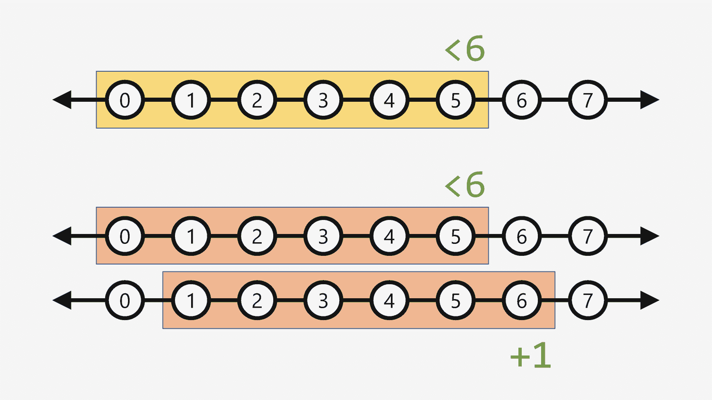

图 21-1
操作数字范围

如果我们像这样创建一个简单的随机数生成器：

```
int die = rand.nextInt(6);
```

我们将生成数字 `0`、`1`、`2`、`3`、`4` 和 `5`。然而，骰子上没有 0（至少我见过的没有），而且最大数字是 6。

所以我们可以通过向可能的数字范围添加 `1` 来解决这个问题：

```
int die = rand.nextInt(6) + 1;
```

现在，我们骰子的可能值是 `1`、`2`、`3`、`4`、`5` 和 `6`。

随机小数
我们也可以生成随机小数，但过程略有不同。有 `nextFloat()` 和 `nextDouble()` 方法，但我们不能定义最大值。

当你运行这些方法时，你将生成一个介于 `0` 和 `1` 之间的随机小数：

```
double decimal = rand.nextDouble();
```

小数的值将在 `0` 和 `1` 之间，但永远不会等于 `0` 或 `1`。

如果我们需要调整这个范围，我们需要再次操作数字范围。我们通过乘法（或除法）来扩展它，并通过加法（或减法）来移动它。

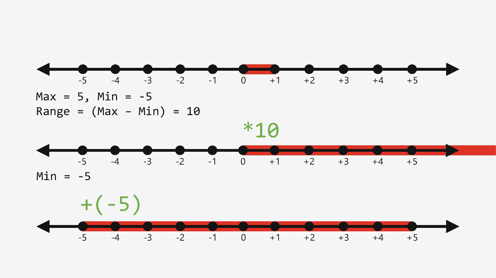

图 21-2
操作小数范围

如果我们知道自然范围在 `0` 和 `1` 之间，我们需要确定我们需要生成的数字的总范围。我们可以通过最大值和最小值的差来确定范围。然后我们将范围乘以该值。
所以现在范围在 `0` 和 `10` 之间。我们快完成了。

接下来，我们需要调整以达到所需的最小值。然后我们将最小值加到范围上。所以加上 `-5` 会将范围进一步向左移动。现在范围在 `-5` 和 `5` 之间。

```
double max = 5;
double min = -5;
double decimal = rand.nextDouble() * (max - min) + min;
```

代码示例
下一页展示了创建随机整数和小数值的示例。
此代码也可在以下 GitHub 仓库中找到：

[`https://github.com/Apress/essential-java-AP-CompSci`](https://github.com/Apress/essential-java-AP-CompSci)

```
import java.util.Random;
public class Main {
public static void main(String[] args) {
// I: 创建随机数生成器
Random rand = new Random();
// II: 生成一个从 0 到 9 的数字
int digit = rand.nextInt(10);
System.out.printf("随机数 x < 5: %f \n", decimal);
// V: 快艇骰子
int die1 = rand.nextInt(6) + 1;
int die2 = rand.nextInt(6) + 1;
int die3 = rand.nextInt(6) + 1;
int die4 = rand.nextInt(6) + 1;
int die5 = rand.nextInt(6) + 1;
System.out.printf("骰子 1: %d\t 骰子 2: %d\t 骰子 3: %d\t 骰子 4: %d\t 骰子 5: %d", die1, die2, die3, die4, die5);
}
}
清单 21-1
随机数生成
```

22. 捕获输入

到目前为止，我们的程序都是单向的。有点枯燥。
为了让它们更具交互性，我们需要一种方法来捕获用户的输入。最基本的方法是使用键盘，让用户通过键入来输入信息。任何编程语言最基本的功能之一就是能够与系统进行标准输入和输出，有时称为 I/O。到目前为止，我们只使用 `System.out` 执行了单向操作；现在我们可以学习 I/O 的另一面，即使用 `System.in`。

你好，Scanner
为了捕获输入，我们使用 `Scanner` 类。`Scanner` 的功能远不止处理键盘输入，但我们稍后会讲到。就像 `Random` 类一样，我们需要创建它的一个命名实例，记得在代码顶部导入它，然后就可以使用它了。

这次，我们需要指定 `Scanner` 类将使用什么作为输入。我们使用 `System.out` 将输出发送到屏幕；那么，很自然地，我们会使用 `System.in`。这将我们连接到系统的输入流，我们可以使用 `Scanner` 来捕获它：

```
Scanner s = new Scanner(System.in);
```

在我们的代码顶部应该有一个像这样的 import 语句：

```
import java.util.Scanner;
```

现在我们可以使用变量 `s` 来触发 `Scanner` 捕获用户的输入。

捕获字符串
要使用 `Scanner` 类，我们用一个变量来接收 `Scanner` 类实例捕获的输入。当程序遇到这行代码时，它会暂停并等待用户使用键盘输入内容。

然后它会获取该输入，进行一些处理，然后将其赋值给该变量：

```
System.out.print("你叫什么名字？ ");
String name = s.next();
System.out.printf("你好，%s！ \n", name);
```

在前面的例子中，我们在屏幕上显示了一个简单的字符串。注意我们使用的是 `print()` 而不是 `println()`。这会将光标放在行尾，这样看起来就像我们直接回应了问题。
第二行创建了一个名为 name 的变量，类型为 `String`。然后它访问 `Scanner` 实例 `s`，并触发 `next()` 方法。这将捕获键盘输入的任何内容，直到用户按下 Enter 或 Return 键，然后将这些字符作为字符串发送给变量 name。
然后我们可以将其发送到屏幕。

捕获整数
对于整数，过程基本相同，但由于使用 `next()` 捕获时所有内容都被视为字符串，我们需要使用一个名为 `nextInt()` 的特殊方法。

这会将输入解析为整数，使其成为正确的值类型：

```
System.out.print("你想买多少个？ ");
int qty = s.nextInt();
System.out.printf("购买 %d 件物品 \n", qty);
```

捕获小数

同样的事情——一个不同的方法，但它会使用 `nextDouble()` 或 `nextFloat()` 转换为正确的格式：

```
System.out.print("价格是多少？ ");
double price = s.nextDouble();
System.out.printf("该物品价格为 $%.2f。 \n", price);
```

代码示例
下一页展示了从用户捕获输入的示例。


```
import java.util.Scanner;
public class Main {
public static void main(String[] args) {
// I: 创建扫描器，指向系统输入
Scanner s = new Scanner(System.in);
// II: 捕获字符串
System.out.print("你叫什么名字？ ");
String name = s.next();
System.out.printf("你好，%s！ \n", name);
// III: 捕获整数
System.out.print("你想买几个？ ");
int qty = s.nextInt();
System.out.printf("购买 %d 件商品 \n", qty);
// IV: 捕获小数
System.out.print("价格是多少？ ");
double price = s.nextDouble();
System.out.printf("该商品价格为 $%.2f。 \n", price);
// 收尾
System.out.printf("%s 购买了 %d 件商品，每件 $%.2f，总计 $%.2f \n", name, qty, price, qty * price);
}
}
清单 22-1
捕获输入
```

23. 创建跟踪表

编程的一部分就是像计算机一样思考。我们已经介绍过流程图在编程和规划程序逐步执行步骤中的重要作用。
但你也需要了解代码在执行过程中的流程和工作方式。为此，我们可以创建一个跟踪表，逐步运行代码，从而理解代码的流程。

它就像一个电子表格
跟踪表本质上就是一个电子表格。你至少需要四列。

第一列是程序运行所有步骤的编号索引。

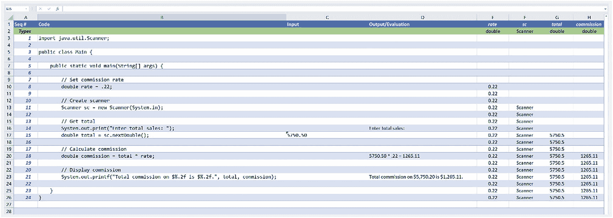

图 23-1
示例跟踪表

第二列是该行运行的代码本身。
第三列是用户在该点输入的内容（如果有）。
第四列是屏幕上的输出，或该行计算的任何求值细节，例如数学公式。
其余各列代表你在项目中创建的所有变量，第一行定义变量的值类型。

呃，为什么？
那么，为什么要这样做呢？因为当你参加 AP 考试时，你将*没有任何*辅助工具。
通常，在编程时，你可以使用一种称为调试的过程来运行和暂停程序。或者如果出现问题，程序会终止，你会收到某种错误信息。
但是，当你坐在考场里，盯着 AP 考试中的代码时，你将无法借助任何这些工具。因此，培养完全靠自己理解程序流程的技能，将是你备考过程中的一项宝贵财富。
在一段时间内，我们所有的编程作业都将要求创建跟踪表。随着项目变得越来越复杂，我们不会频繁地这样做。但现在，大多数作业都要求你创建一个流程图、项目代码，以及一个能逐步遍历项目中所有代码的跟踪表。
每当你遇到需要输入值的情况，你都需要在纸上输入它们。随机数则由你自己生成。但最终，你需要从头到尾逐步执行每一行代码。

24. 方法

方法是代码的命名部分，你可以通过引用方法名来多次重复执行操作。
方法的命名规则与变量名类似，不能以数字或特殊字符开头。方法采用驼峰命名法，与变量相同。

方法基础
当你调用一个方法时，你需要提供方法名，后跟一对圆括号。稍后，我们将学习如何使用这些圆括号向方法内部提供要处理的值。

你可以将调用方法理解为，在调用处用该方法内部的代码行替换方法名。这在稍后讨论可以返回值的方法时会非常有用。

```
public static void main(String[] args) {
displayMsg();
}
清单 24-1
调用方法
```

编写方法
我们在程序代码中的 `main()` 方法之外定义方法。将其放在 `main()` 方法之外很重要，但仍需将其保留在 `Main` 程序类中。

一个方法需要定义其类型；你可以在方法声明的开头进行定义。

```
public static void displayMsg() {
System.out.println("这是在方法内部");
}
清单 24-2
编写方法
```

在上述方法定义中，你以 `private` 和 `static` 这样的保留字开头。这决定了用户对方法调用的访问权限。目前，我们所有的代码都在同一个文件或类中，但稍后当我们定义自己的自定义类时，我们会改变这种工作方式。请注意，它与前面 `main()` 类之前的保留字相匹配。
下一个词 `void` 定义了方法执行完毕后返回的值类型。我们的方法不返回值，因此我们使用 `void` 语句来声明这一点。稍后，我们会根据方法返回的值类型来更改此项。
最后，我们创建一对匹配的花括号，并将方法调用时要执行的代码放在其中。

调用方法
在 `main()` 方法中，我们可以通过仅输入方法名后跟一对圆括号来调用项目中的方法。确保方法名和圆括号之间没有空格。

方法流程
当你构建并运行程序时，`main()` 方法的内容将照常运行。当遇到方法调用时，它会将代码的执行流程转移到方法内部的代码中。
然后，在方法内部，它会执行其中的代码，在本例中是在屏幕上显示一条语句。

代码指南

以下代码指南向你展示了一个示例方法以及如何创建和调用它。

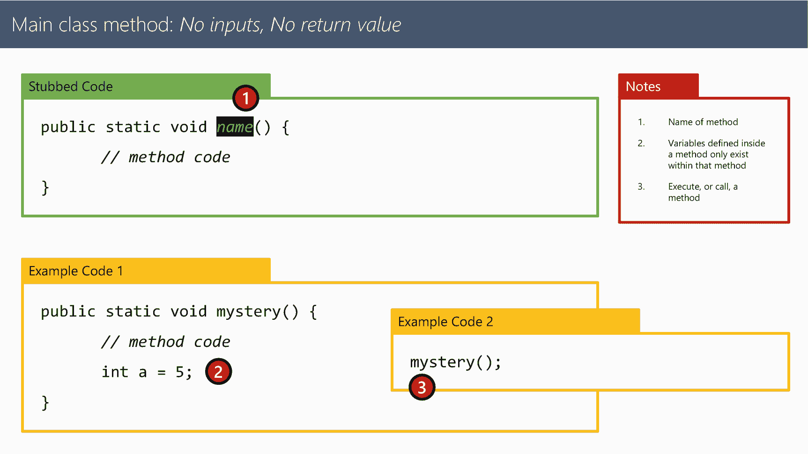

图 24-1
主类方法：无输入，无返回值

代码示例
下一页展示了从用户处捕获输入的示例。
此代码也可在以下 GitHub 仓库中找到：

[`https://github.com/Apress/essential-java-AP-CompSci`](https://github.com/Apress/essential-java-AP-CompSci)

```
public class Main {
public static void main(String[] args) {
displayMsg();
}
public static void displayMsg() {
System.out.println("这是在方法内部");
}
}
清单 24-3
简单方法
```

25. 在方法内部调用方法

方法之间也可以相互调用。当你进入另一个方法内部的方法时，你是在深入代码执行，当内部方法结束时，你会返回到调用它的方法。
注意避免无限递归，即在一个方法内部调用它自身！

方法嵌套
当你在方法内部调用方法时，你是在深入程序的运行过程。在每一层，当你深入时，你需要按照进入的顺序逐层退出。

就像这段代码：

```
public static void main(String[] args) {
outMethod();
System.out.println();
inMethod();
}
public static void outMethod() {
System.out.println("外部方法");
inMethod();
}
public static void inMethod() {
System.out.println("内部方法");
}
清单 25-1
嵌套方法
```

代码从 `main()` 方法开始。当遇到 `outMethod()` 调用时，它进入 `outMethod()` 并显示消息“外部方法”。
在该方法内部，它遇到了对 `inMethod()` 的调用。然后它进一步深入程序，执行 `inMethod()` 的内容。
当该方法结束时，它返回到程序之前所在的位置，即 `outMethod()` 内部。
然后该方法结束，它返回到 `main()` 方法。在那里，它在屏幕上打印一个空行，并再次执行 `inMethod()`。
这一次，当它执行完毕后，程序流程返回到 `main()` 方法。
然后程序结束。

无限方法


当你在方法内部调用自身时，可能会引发**无限递归**。递归是指通过解决同一问题的更小实例来寻找解决方案。我们将在本课程后续部分深入学习递归，但递归始终需要一种方式来终止解决方案。

```
public static void infiniteMethod() {
System.out.println("This goes on forever!");
infiniteMethod();
}
清单 25-2
无限递归
```

在上述示例中，方法 `infiniteMethod()` 在自身内部被调用，且没有终止循环的方式，从而创建了一个无限循环。

代码示例
下一页展示了从用户处捕获输入的示例。此代码也可在以下 GitHub 仓库中找到：

[`https://github.com/Apress/essential-java-AP-CompSci`](https://github.com/Apress/essential-java-AP-CompSci)

```
public class Main {
public static void main(String[] args) {
outMethod();
System.out.println();
inMethod();
}
public static void outMethod() {
System.out.println("Outer Method");
inMethod();
}
public static void inMethod() {
System.out.println("Inner Method");
}
public static void infiniteMethod() {
System.out.println("This goes on forever!");
infiniteMethod();
}
}
清单 25-3
嵌套方法与无限方法示例
```

26. 方法与值

方法就像引擎，可以为你处理事务并返回可供你使用的结果。与任何引擎一样，你需要为其提供一些可处理的内容。
方法提供输入和输出功能。输入值在方法定义中定义，输出值则通过 `return` 语句发送。

在方法中接受值

方法可以接受值供其内部使用。要定义一个接受值的方法，你需要声明传入值的类型以及这些值在方法中使用的变量名。

```
public static void average(float val1, float val2, float val3)
{
float avg = val1 + val2 + val3;
avg = avg / 3;
System.out.println(avg);
}
清单 26-1
在方法中接受值
```

在此示例中，`average()` 方法期望接收三个值，每个值都被定义为 `float` 类型。

要调用此方法，你需要在方法调用中传入这些值：

```
average(10,15,12);
```

然后，程序流程进入 `average()` 方法，并拉取传入的值。方法定义中定义的变量会临时存储传入的值，直到方法执行完毕。此时，这些变量会被丢弃。

返回值

方法也可以从最初被调用的位置返回一个值。这会将函数调用语句替换为方法完成时返回的值。

要创建一个带返回值的方法，你需要定义返回值类型，然后使用 `return` 语句并发送你想要从方法返回的值。

```
public static float avgValue(float val1, float val2, float val3)
{
float avg = val1 + val2 + val3;
avg = avg / 3;
return avg;
}
清单 26-2
返回值
```

在这种情况下，该方法不显示任何内容，而是在处理后返回一个值。
返回的值本质上会替换原始代码中的方法调用本身，你可以将其放置在可以提供变量或字面量的任何位置。它只需要与由方法定义中的返回类型所定义的预期类型匹配即可。

重载方法

如果你需要接受多个数量的值，但需要使用相同的方法名，你可以通过为同一方法名提供多个定义（具有不同的传入值类型或传入值类型的数量）来重载它。

```
public static float avgValue(float val1, float val2, float val3)
{
float avg = val1 + val2 + val3;
avg = avg / 3;
return avg;
}
public static float avgValue(float val1, float val2)
{
float avg = val1 + val2;
avg = avg / 2;
return avg;
}
清单 26-3
重载方法
```

在这种情况下，如果我执行

```
System.out.println(avgValue(10,15,12));
```

第一个方法将运行，因为它接受三个值。

如果我执行

```
System.out.println(avgValue(10,15));
```

第二个方法将运行。
你可以通过不同数量的方法参数或不同类型的参数来重载方法，以适应多种类型的值。

你的值类型不必相同，传入和传出的值类型也可以不同。

```
public static float intDiv(int val1, int val2)
{
float quot = (float)val1 / (float)val2;
return quot;
}
清单 26-4
不同的参数和返回类型
```

代码指南

以下是关于如何使用接受、返回以及通过重载处理不同输入变量集的方法的多个示例。

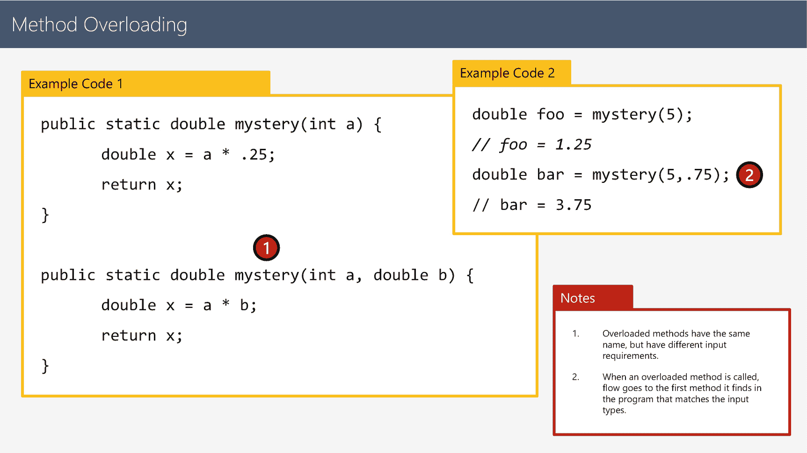

图 26-4
方法重载

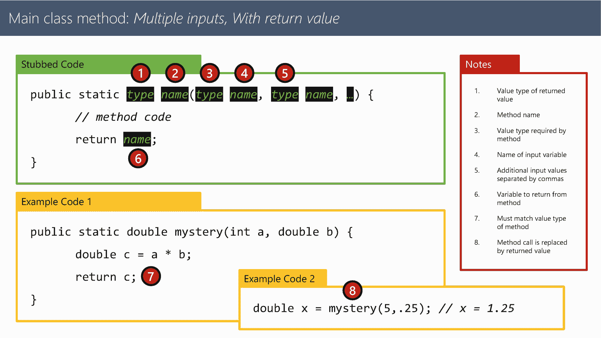

图 26-3
主类
方法：多个输入，带返回值

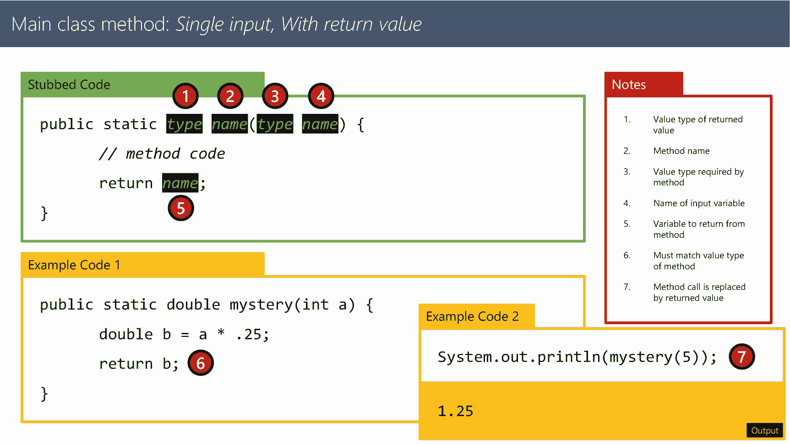

图 26-2
主类方法：单个输入，带返回值

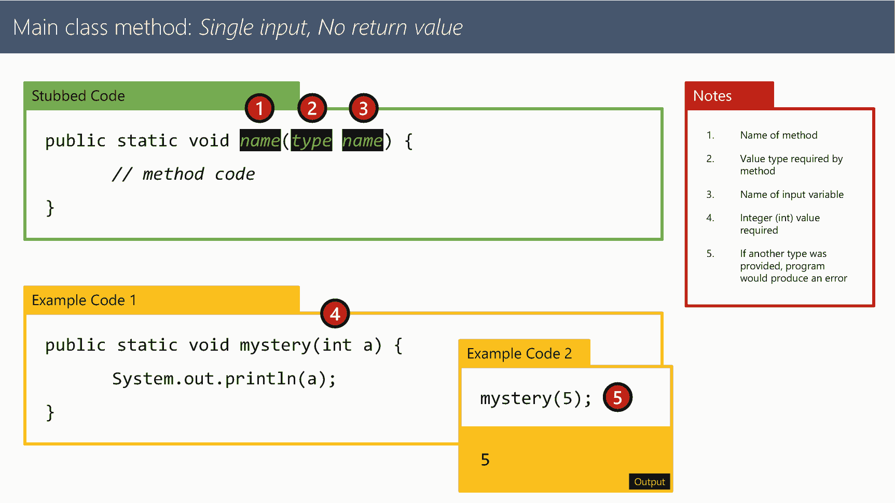

图 26-1
主类
方法：单个输入，无返回值

代码示例
下一页展示了从用户处捕获输入的示例。此代码也可在以下 GitHub 仓库中找到：

[`https://github.com/Apress/essential-java-AP-CompSci`](https://github.com/Apress/essential-java-AP-CompSci)

```
public class Main {
public static void main(String[] args) {
// 第一个示例
average(10,15,12); // 12.333333
// 第二个示例
System.out.println(avgValue(10,15,12)); // 12.333333
// 第三个示例
System.out.println(avgValue(10,15)); // 12.5
// 第四个示例
System.out.println(intDiv(5,2)); // 2.5
}
public static void average(float val1, float val2, float val3)
{
float avg = val1 + val2 + val3;
avg = avg / 3;
System.out.println(avg);
}
public static float avgValue(float val1, float val2, float val3)
{
float avg = val1 + val2 + val3;
avg = avg / 3;
return avg;
}
public static float avgValue(float val1, float val2)
{
float avg = val1 + val2;
avg = avg / 2;
return avg;
}
public static float intDiv(int val1, int val2)
{
float quot = (float)val1 / (float)val2;
return quot;
}
}
清单 26-5
接受和返回方法值的示例
```

27. 方法与作用域

变量作用域定义了程序中变量在何处存在，以便语句和其他变量可以访问它并进行操作。

变量作用域错误

变量的定义位置会影响哪些内容可以访问其中存储的值。这由变量的作用域定义。在以下代码中，`myMainValue` 无法从 `myMethod()` 访问，因为其作用域仅限于 `main()`。

```
public static void main(String[] args) {
// 此变量仅存在于程序的 main() 方法中
int myMainValue = 10;
}
public static void myMethod() {
System.out.println(myMainValue);
}
清单 27-1
变量超出作用域
```

定义类作用域变量

你可以将变量定义为类作用域，这意味着该类中的任何方法都可以毫无问题地访问它。

要定义类作用域变量，请在 main 方法声明之前定义它。通常，你可能希望先定义变量，然后在 main 方法执行时再为其赋值。

```
public static int myMainValue;
public static void main(String[] args) {
myMainValue = 10;
}
public static void myMethod() {
System.out.println(myMainValue);
}
清单 27-2
定义类作用域变量
```

类冲突

有时，基于方法的设计，你可能会在作用域之间产生冲突。


当你向方法传递一个值时，你是在创建该值的一个副本，而不是链接到原始变量。

```
public static double myValue;
public static double myOtherValue;
public static void main(String[] args) {
// 该变量仅存在于程序的 main() 方法中
myValue = 10.0;
myOtherValue = 12.5;
System.out.printf("myValue = %.2f and myOtherValue = %.2f.\n", myValue,myOtherValue);
System.out.println("------------------ 开始调用方法");
myMethod(myValue,myOtherValue);
System.out.println("------------------ 从方法返回");
System.out.printf("myValue = %.2f and myOtherValue = %.2f.\n", myValue,myOtherValue);
// System.out.printf("value1 = %.2f and value2 = %.2f.\n", value1,value2);
}
public static void myMethod(double value1, double value2) {
// 获取传入方法的值并修改它们
System.out.printf("value1 = %.2f and value2 = %.2f.\n", value1,value2);
value1 += 10.2;
value2 += 5.5;
System.out.printf("value1 = %.2f and value2 = %.2f.\n", value1,value2);
System.out.printf("myValue = %.2f and myOtherValue = %.2f.\n", myValue,myOtherValue);
// 计算乘积
double product = value1 * value2;
System.out.println(String.format("The product is %.2f", product));
}
清单 27-3
类的变量作用域问题
```

当你运行这个程序时，你传入的值会被复制，当它们在方法内部被修改时，对类中定义的原始值没有任何影响。

以下是输出结果：

```
myValue = 10.00 and myOtherValue = 12.50.
------------------ 开始调用方法
value1 = 10.00 and value2 = 12.50.
value1 = 20.20 and value2 = 18.00.
myValue = 10.00 and myOtherValue = 12.50.
The product is 363.60
------------------ 从方法返回
myValue = 10.00 and myOtherValue = 12.50.
```

当原始的两个值被传入时，方法内部的变量与类中定义的变量之间没有关联。因此，20.2 和 18.0 这两个值只存在于方法内部。

代码示例
下一页展示了从用户处捕获输入的示例。
该代码也可在以下 GitHub 仓库中找到：

[`https://github.com/Apress/essential-java-AP-CompSci`](https://github.com/Apress/essential-java-AP-CompSci)

```
public class Main {
public static double myValue;
public static double myOtherValue;
public static void main(String[] args) {
// 该变量仅存在于程序的 main() 方法中
myValue = 10.0;
myOtherValue = 12.5;
System.out.printf("myValue = %.2f and myOtherValue = %.2f.\n", myValue,myOtherValue);
System.out.println("------------------ 开始调用方法");
myMethod(myValue,myOtherValue);
System.out.println("------------------ 从方法返回");
System.out.printf("myValue = %.2f and myOtherValue = %.2f.\n", myValue,myOtherValue);
// System.out.printf("value1 = %.2f and value2 = %.2f.\n", value1,value2);
}
public static void myMethod(double value1, double value2) {
// 获取传入方法的值并修改它们
System.out.printf("value1 = %.2f and value2 = %.2f.\n", value1,value2);
value1 += 10.2;
value2 += 5.5;
System.out.printf("value1 = %.2f and value2 = %.2f.\n", value1,value2);
System.out.printf("myValue = %.2f and myOtherValue = %.2f.\n", myValue,myOtherValue);
// 计算乘积
double product = value1 * value2;
System.out.println(String.format("The product is %.2f", product));
}
}
清单 27-4
作用域与复制的值
```

28. 布尔值与相等性

你听说过计算机的一切都归结为二进制，即“是”或“否”的答案。这是真的，你可以通过使用布尔值和逻辑运算符在程序中运用这一点。布尔变量包含且仅包含 `true` 或 `false` 这两个值。为了确定真或假的响应，有许多称为逻辑运算符的运算符，它们将表达式评估为 `true` 或 `false`。然后你可以获取该值并对其进行操作，或将其赋值给一个布尔变量。

创建布尔变量

布尔变量只能包含两个值：`true` 或 `false`。要创建一个布尔变量，你需要使用 `Boolean` 值类型来初始化变量，如下所示：

```
Boolean a;
```

然后你可以将 `true` 或 `false` 的值赋给该变量：

```
a = true;
```

使用字面量设置布尔变量只是赋值的一种方式，但它并不是最灵活的方式。相反，使用逻辑运算符可以测试多种场景，以确定一个测试或条件是真还是假，然后将该测试的结果作为 `true` 或 `false` 值赋给布尔变量。

布尔逻辑运算符

主要的布尔逻辑运算符基于数学原理运作。基本运算符比较两个（且仅两个）值彼此之间的关系。然后确定这些值是相等、不相等、大于、小于，还是这些关系的组合。

```
int a = 5;
Boolean result;
result = (a == 5); // 相等，结果为 true
result = (a != 5); // 不相等，结果为 false
result = (a > 5);  // 大于，结果为 false
result = (a <= 5); // 小于或等于，结果为 true
```

改变布尔值

你可以通过使用“非”运算符来反转任何布尔评估或变量的值，该运算符由一个感叹号表示，作为值、变量或评估的前缀。只需将其紧放在评估或变量之前：

```
int a = 5;
Boolean result;
result = (a == 5);  // 结果为 true
result = !result;   // 结果为 false
result = !(a == 5); // 结果为 false
```

将逻辑与评估结合

除了字面量和变量，你还可以使用评估来确定布尔值。逻辑运算符在运算顺序中总是最后执行（在赋值运算符之前），因此你可以使用括号创建评估分组，以构建更复杂的场景，包括使用方法返回的值。

```
int a = 5;
Boolean result;
result = (5 + 5) > 10; // false
```

复合逻辑运算符

为了创建更复杂的评估，你可以使用逻辑“与”和“或”运算符。对于“或”，只要其中一个值为真，整个评估结果就为真。对于“与”，所有值都必须为真，整个评估结果才为真。

```
int a = 5;
Boolean result;
result = (a < 5) || (a / 2 < 5); // 或：true
result = (a < 5) && (a / 2 < 5); // 与：false
```

代码示例
下一页展示了从用户处捕获输入的示例。
该代码也可在以下 GitHub 仓库中找到：

[`https://github.com/Apress/essential-java-AP-CompSci`](https://github.com/Apress/essential-java-AP-CompSci)


```
public class Main {
public static void main(String[] args) {
int a = 5;
Boolean result;
System.out.println("基本运算符");
result = (a == 5); // 相等，结果为 true
display(result);
result = (a != 5); // 不相等，结果为 false
display(result);
result = (a > 5);  // 大于，结果为 false
display(result);
result = (a = 5); // 大于等于，结果为 true
display(result);
result = (a  10; // false
display(result);
result = getNumber() < .5; // true 或 false，取决于返回的值
display(result);
System.out.println("OR（或）");
result = true || true;   // true
display(result);
result = true || false;  // true
display(result);
result = false || true;  // true
display(result);
result = false || false; // false
display(result);
result = (a < 5) || (a / 2 < 5); // true
display(result);
System.out.println("AND（与）");
result = true && true;   // true
display(result);
result = true && false;  // false
display(result);
result = false && true;  // false
display(result);
result = false && false; // false
display(result);
result = (a < 5) && (a / 2 < 5); // false
display(result);
}
public static void display(boolean result) {
System.out.println("结果是 " + result);
}
public static void display(double result) {
System.out.println("值是 " + result);
}
public static double getNumber() {
double rand = Math.random();
display(rand);
return rand;
}
}
清单 28-1
布尔逻辑代码示例
```

29. 简单条件语句

布尔值为我们提供了根据其真或假结果执行不同操作的基础。基于这些值所选择的执行路径被称为条件语句。这些语句根据布尔变量、布尔表达式或方法返回值的真假来引导代码的流程。
基本的条件语句包括 `if`、`else if` 和 `else` 语句。

if 语句

`if` 语句与一个用括号包裹的值配对，该值要么是 `true`，要么是 `false`。如果条件为 `true`，则执行其后代码块中的代码。如果条件为 `false`，则跳过该代码块，程序流程继续执行。

```
if (条件) {
// 代码写在这里
}
```

else 语句

如果希望在原始条件评估为 `false` 时执行替代操作，可以在 `if` 语句的代码块之后添加一个 `else` 语句及其对应的代码块：

```
if (条件) {
// 如果条件为 true，则运行此代码
} else {
// 如果条件为 false，则运行此代码
}
```

else if 语句

你还可以使用 `else if` 语句将条件语句串联起来，提供多个条件测试。这些测试会按顺序执行。如果链中的某个条件为 true，则运行匹配的代码块，然后完全忽略链中的其余部分。你可以在链中放置任意数量的 `else if` 语句，但只能有一个 `if` 语句，而 `else` 语句是可选的（取决于你要处理的逻辑）：

```
if (条件) {
// 如果条件为 true，则运行此代码
} else if (条件) {
// 如果第二个条件为 true，则运行此代码
} else {
// 如果两个条件都为 false，则运行此代码
}
```

理解条件流程

根据你构建条件链的方式，程序的流程会发生变化。如果你创建了一个由 `if` 语句组成的链，那么无论其中是否有条件为 false，所有 `if` 语句都会被测试。如果你有一个单独的 `if` 语句，其余的都是 `else if` 语句，那么一旦某个条件为 true，链中该条件之后的所有内容都会被跳过。

你可以使用代码块的花括号将条件语句嵌套在一起：

```
if (x == 1) {
if (y == 1) {
// x 和 y 都等于 1
} else if (y == 2) {
// x 等于 1，y 等于 2
} else {
// x 等于 1，y 不等于 1 或 2
} else if (x == 2) {
if (y == 1) {
// x 等于 2，y 等于 1
} else if (y == 2) {
// x 等于 2，y 等于 2
} else {
// x 等于 2，y 不等于 1 或 2
} else {
// x 不等于 1 或 2，y 可以是任何值
}
```

代码示例
下一页展示了从用户处获取输入的示例。
此代码也可在以下 GitHub 仓库中找到：

[`https://github.com/Apress/essential-java-AP-CompSci`](https://github.com/Apress/essential-java-AP-CompSci)

```
public class Main {
public static void main(String[] args) {
// 基本的 if 示例
if (true) {
// 这里的代码将始终运行
}
if (false) {
// 这里的代码永远不会运行
}
// 基本的 if...else 示例
if (true) {
// 这里的代码将始终运行
} else {
// 这里的代码永远不会运行
}
if (false) {
// 这里的代码永远不会运行
} else {
// 这里的代码将始终运行
}
// 基本的 if, else if, else 示例
int a = 5;
if (a == 5) {
// 如果条件为 true，则运行此代码
// 然后整个 if/else if/else 块结束
} else if (a == 4) {
// 如果第二个条件为 true，则运行此代码
// 然后整个 if/else if/else 块的其余部分结束
} else {
// 如果前面的条件都不为 true，则运行此代码
}
// 完整示例
int x = 5;
if (x > 3) {
disp("X 大于 3");
} else if (x > 1) {
disp("X 大于 1");
} else {
disp("X 不大于 3 或 1");
}
}
public static void disp(String msg) {
System.out.println(msg);
}
}
/* 输出：X 大于 3 */
清单 29-1
if、else 和 else if 语句代码示例
```

30. 使用 switch 语句匹配条件

`switch` 语句是一种替代性的条件结构，它在一系列选项中查找匹配的 case，并为匹配的 case 语句执行一组代码。如果没有 case 与 `case` 语句中定义的条件匹配，用户还可以定义一个默认 case（`default`）。与使用逻辑运算符来确定 true 或 false 结果不同，`switch` 语句将一个特定的值（或返回值）与 case 列表进行比较。如果找到匹配项，则运行关联的代码。该段代码需要以 `break` 语句结尾，以结束该段代码的执行。

创建 switch 语句代码块

`switch` 语句将变量、表达式或返回值放在一对括号中。其后紧跟一个单独的代码块：

```
switch (变量) {
//
}
```

在代码块内部，使用 `case` 语句创建一个 case，后跟匹配的值，并以冒号结尾，然后是代码行。然后以 `break` 语句结束该段：

```
switch (变量) {
case 1:
// 如果变量等于 1，则执行此代码
break;
}
```

你可以为单段代码添加多个 `case` 语句：

```
switch (变量) {
case 'A':
case 'a':
// 如果变量等于 A 或 a，则执行此代码
break;
}
```

在每个 case 的 break 语句之后，可以添加更多的 case：

```
switch (变量) {
case 'A':
case 'a':
// 如果变量等于 A 或 a，则执行此代码
break;
case 'B':
case 'b':
// 如果变量等于 B 或 b，则执行此代码
break;
}
```

如果没有 case 匹配，你可以使用 `default` 语句来捕获任何与前面 case 不匹配的情况：

```
switch (变量) {
case 'A':
case 'a':
// 如果变量等于 A 或 a，则执行此代码
break;
case 'B':
case 'b':
// 如果变量等于 B 或 b，则执行此代码
break;
default:
// 如果没有 case 匹配，则执行此代码
break;
}
```

使用 switch 语句时需要注意的事项

`switch` 语句的常见问题包括：

*   忘记在与 `case` 语句关联的代码末尾添加 `break` 语句。
*   在 `switch` 语句中放入逻辑运算符，使其评估为布尔值，而不是简单地包含你想要测试的变量。
*   如果你需要从用户那里获取输入以进行选择（例如从选项菜单中），`switch` 语句是一个不错的选择。


代码示例
下一页将展示如何捕获用户输入的示例。
此代码也可在以下 GitHub 仓库中找到：

[`https://github.com/Apress/essential-java-AP-CompSci`](https://github.com/Apress/essential-java-AP-CompSci)

```
import java.util.Scanner;
public class Main {
public static Scanner sc;
public static void main(String[] args) {
sc = new Scanner(System.in);
displayMenu();
// charAt() 方法提取字符串的第一个字符。
// 这是将语句链接在一起的示例。
char selection = sc.next().charAt(0);
processSelection(selection);
}
public static void displayMenu() {
System.out.println("Main Menu");
System.out.println("==================");
System.out.println("A: Display Greeting");
System.out.println("B: Display Compliment");
System.out.println("C: Display Farewell");
System.out.println("==================");
System.out.print("Command? ");
}
public static void processSelection(char selection) {
String output;
switch (selection) {
case 'A':
case 'a':
output = "Hello there!";
break;
case 'B':
case 'b':
output = "You look great today!";
break;
case 'C':
case 'c':
output = "See you soon!";
break;
default:
output = "Invalid command";
break;
}
System.out.println(output);
}
}
Listing 30-1
Example switch statement code
```

31. 三元运算符

在创建条件语句时，最常见的操作之一是根据条件求值为布尔值 `true` 或 `false` 来生成一个唯一值。为了使这一过程更简洁，一种名为三元运算符的特殊运算符允许你在一行代码中执行条件操作并生成一个可在程序中使用的唯一值。

if-else 语句的等价形式

以下列代码为例，这是一个简单的 `if...else` 语句，用于赋值：

```
int result;
boolean test = false;
if (test) {
result = 1;
} else {
result = 0;
}
```

在此示例中，变量 `test` 包含一个布尔值，`if` 语句将对该值进行测试。由于该值为 `false`，整数变量 result 的值为数字 0。

转换为三元运算符

这可以使用三元运算符进行简化，该运算符有时通过其特有的两个字符 `?:` 来简化。

该运算符首先评估一个条件，如果存在 `?` 和 `:` 字符，则会触发该运算符。在条件之后，`?` 字符定义了条件为真时返回的值。在 `:` 之后，定义了条件为假时返回的值：

```
result = conditional ? true option : false option;
```

使用这种方式，前面的 `if...else` 语句可以重写为一行代码：

```
result = test ? 1 : 0;
```

由于 test 的值为 `false`，因此使用冒号后的值 0，并将其赋值给变量 `result`。如果 `test` 的值为 `true`，则使用问号后的值 1 并赋值给 `result`。

在代码中内联使用三元运算符

虽然最常见的是使用三元运算符进行赋值，但你也可以将其内联使用，以根据条件提供布尔选项：

```
System.out.println((value < 5) ? "Value is less than 5" : "Value is not less than 5");
```

在此示例中，如果 `value` 小于 5，则显示问号后的第一个短语。如果 `value` 不小于 5，则显示冒号后的第二个短语。

代码示例
下一页将展示如何捕获用户输入的示例。
此代码也可在以下 GitHub 仓库中找到：

[`https://github.com/Apress/essential-java-AP-CompSci`](https://github.com/Apress/essential-java-AP-CompSci)

```
public class Main {
public static void main(String[] args) {
// 基本示例
int result;
boolean test = false;
if (test) {
result = 1;
} else {
result = 0;
}
System.out.println("The result is " + result);
result = test ? 1 : 0;
System.out.println("The result is " + result);
// 逻辑运算符示例
int value = 5;
String msg;
if (value < 5) {
msg = "Value is less than 5";
} else {
msg = "Value is not less than 5";
}
System.out.println(msg);
msg = (value < 5) ? "Value is less than 5" : "Value is not less than 5";
System.out.println(msg);
// 内联示例
System.out.println((value < 5) ? "Value is less than 5" : "Value is not less than 5");
}
}
/* 输出
The result is 0
The result is 0
Value is not less than 5
Value is not less than 5
Value is not less than 5
*/
Listing 31-1
Example ternary operator code
```

32. 栈与堆

当我们在计算机中处理内存和值时，必须区分计算机存储值的两种方式以及变量如何跟踪它们。一种方式是使用栈，这是一种组织大小一致的数据的有序方式。第二种方式是使用堆，它可以处理大小可变的数据和值，并提供指向值存储位置的指针。

理解栈

想象一个配送中心。有一个巨大的房间，里面排列着一排排整齐的产品，供工人和自动化无人机获取物品并准备发货给客户。
每个物品在货架上占据特定大小的空间。这种可预测的大小使得中心管理人员能够知道每个货架和每排可以存放多少物品。
计算机内存的工作方式与此类似。当我们创建一个变量时，我们是在为值预留内存空间。我们创建的值的类型决定了我们需要为该值预留多少内存空间。
这就是为什么我们在定义变量时需要提供值的类型。计算机需要知道要为即将存储的值保存多少内存。
以整数值为例。整数是一个 32 位的值。它占用 32 位或 4 字节的内存来存储该值。这个空间大小永远不会改变。它的大小永远不会超过或少于 32 位。
当我们在内存中组织多个值时，我们会为每个值分配的所有预留空间创建一个有序的排列。变量的值等于存储在该内存位置中的值。
当一个值不再需要时，会有一个称为“垃圾回收”的过程，它会遍历内存并移除不再需要的值，使其可供将来创建的变量使用。

理解堆

然而，堆是一种完全不同的在计算机中存储值的方式。
与可以直接访问值和变量的有序栈不同，堆需要处理大小和长度会变化的值。以字符串为例。一个字符串可以包含单个字母，如果你愿意，它也可以包含一整部小说。由于这种长度的可变性，需要创建一种不同类型的系统来存储这种类型的值。
堆正如其名。不同长度和大小的值被扔到一个堆上。堆上的每个项目都有一个标识符。这是一个内存地址，程序将其存储在变量中以代表该值。对于存储在堆上的值，实际上有两个值。
第一个值是数据在内存中存储位置的地址。第二个是实际数据，存储在该地址所指示的内存位置中。


这一切为何重要
那么这一切为何重要？因为存储在栈上变量中的值就是值本身，例如整数的值。

堆上变量的值仅是对值存储位置的引用。当你访问一个变量（如 `String`）时，它会执行两个操作：先找到该值的内存地址，然后访问该地址中存储的内容。

那么，当你比较堆中的值时会发生什么？很有可能出现的情况是，即使两个堆中存储的值包含相同的内容，但由于它们位于不同的内存地址，这意味着变量值本身并不相等。

33. 测试字符串的相等性

比较字符串时，可能会出现一些问题。当你处理像 `int`、`float` 等基本局部值类型时，它们作为值存储在栈上，彼此拥有唯一的内存地址。当你处理像 `String` 这样的类类型时，它们引用的是堆上的内存位置。当你使用相等运算符 `==` 时，它会检查并返回 `true`（如果两个项的引用相等）。有时，当你使用类类型时，引用可能不同，因此即使字符串中的值完全相同，它也会返回 `false`。

或者，你可以使用 `equals()` 方法完全基于值来比较两个项，而忽略它们的引用是否不同。

当堆抛出相等性问题时

以下示例使用简单的相等运算符返回 `true`：

```
String a = "CompSci";
String b = "CompSci";
// 结果为 true，因为引用相同
boolean result = (a == b);
System.out.println("a == b 的结果是 " + result);
```

字符串 a 和 b 具有相同的引用，因为字符串字面量 `"CompSci"` 的内存首先被创建，两个字符串都指向保存该字面量值的同一内存地址。

如果我们使用 `new` 语句创建 `String` 类的唯一实例，就能看到问题出在哪里。以下示例返回 `false`：

```
String c = new String("CompSci");
String d = new String("CompSci");
// 结果为 false，因为引用不同
result = (c == d);
System.out.println("c == d 的结果是 " + result);
```

结果为 `false`，因为我们首先使用 `new` 语句创建了字符串，这创建了两个完全不同的引用。由于此例中的相等运算符寻找的是相同的引用，因此结果为 `false`，因为它们不同。

如何更好地比较字符串值

我知道这很令人困惑。但有一种简单的方法可以解决这个问题。我们可以对要比较的 `String` 变量使用 `equals()` 方法，并提供要比较值的变量或字面量：

```
String c = new String("CompSci");
String d = new String("CompSci");
// 结果为 true，因为值相同
result = c.equals(d);
System.out.println("c.equals(d) 的结果是 " + result);
```

你也可以在此示例中使用字面量：

```
// 结果为 true，因为值相同
result = c.equals("CompSci");
System.out.println("c.equals(\"CompSci\") 的结果是 " + result);
```

比较两个字符串时，如果使用相等运算符 `==` 比较一个字符串变量和一个字符串字面量，通常是安全的。但是，如果比较两个字符串变量，通常最好使用 `equals()` 方法来比较它们，以避免引用混淆和代码中出现奇怪的结果。

代码示例
下一页展示了从用户处捕获输入的示例。
此代码也可在以下 GitHub 仓库中找到：

[`https://github.com/Apress/essential-java-AP-CompSci`](https://github.com/Apress/essential-java-AP-CompSci)

```
public class Main {
public static void main(String[] args) {
// 使用 == 和字符串的问题
// 使用字面量构建的新字符串
String a = "CompSci";
String b = "CompSci";
// 结果为 true，因为引用相同
boolean result = (a == b);
System.out.println("a == b 的结果是 " + result);
// 作为类实例构建的新字符串
String c = new String("CompSci");
String d = new String("CompSci");
// 结果为 false，因为引用不同
result = (c == d);
System.out.println("c == d 的结果是 " + result);
// 结果为 true，因为值相同
result = c.equals(d);
System.out.println("c.equals(d) 的结果是 " + result);
// 结果为 true，因为值相同
result = c.equals("CompSci");
System.out.println("c.equals(\"CompSci\") 的结果是 " + result);
}
}
/* 输出
a == b 的结果是 true
c == d 的结果是 false
c.equals(d) 的结果是 true
c.equals("CompSci") 的结果是 true
*/
清单 33-1
比较字符串
```

34. 处理错误

当你引入用户输入时，他们并不总是提供对你的程序有效的输入。当这种情况发生时，你需要一种方法让程序识别出问题并处理它，而不是完全崩溃。
当程序遇到错误时，它会“抛出”错误。然后你可以“捕获”该错误并对其进行处理，通常是向用户提供一些反馈，让他们知道做错了什么。

编写代码以捕获错误

首先，你需要将你认为可能导致错误的代码包裹起来。从 `try` 语句开始，创建一个代码块，将你的代码放入其中：

```
try {
// 你的代码放在这里
}
```

然后，当你的代码运行时，如果遇到错误，它会被“抛出”为一个异常。异常是错误的另一种说法。但程序不会崩溃，而是会寻找一个 `catch` 子句来“捕获”该异常。从 `catch` 语句开始，再创建一个代码块。在 `catch` 语句之后，你需要指明它要捕获的异常类型。通用类型简称为 `Exception`。像方法一样，你需要给它一个可以在代码块中引用的名称：

```
try {
// 你的代码放在这里
} catch (Exception e) {
// 如果捕获到异常，将运行此代码
}
```

在 `catch` 代码块中，你可以在抛出异常时执行一些操作。例如，你可以获取异常并将其作为字符串显示在屏幕上：

```
try {
// 你的代码放在这里
} catch (Exception e) {
String error = e.toString();
System.out.println(error);
}
```

“捕获”特定错误

你还可以使用一系列 `catch` 语句来捕获特定类型的异常。当异常类型与某个 `catch` 语句匹配时，它会运行该 `catch` 代码块中的代码，并跳过其余部分。在此示例中，如果异常类型是 `InputMismatchException`，则第一个 catch 块运行，但第二个被跳过。当你为特定类型的异常添加代码时，IDE 会自动将其导入到代码顶部，以便你可以使用它。

```
// 在代码顶部
import java.util.InputMismatchException;
try {
// 你的代码放在这里
} catch (InputMismatchException e) {
System.out.println("你输入了错误的类型。");
} catch (Exception e) {
String error = e.toString();
System.out.println(error);
}
```

如果你希望在 `try` 块之后每次都运行某些内容，无论是否抛出并捕获了异常，你可以在末尾添加一个 `finally` 代码块，它将在 `catch` 代码块运行后执行。

```
try {
// 你的代码放在这里
} catch (InputMismatchException e) {
System.out.println("你输入了错误的类型。");
} catch (Exception e) {
String error = e.toString();
System.out.println(error);
} finally {
System.out.println("谢谢！");
}
```

代码示例
下一页展示了从用户处捕获输入的示例。
此代码也可在以下 GitHub 仓库中找到：


[`https://github.com/Apress/essential-java-AP-CompSci`](https://github.com/Apress/essential-java-AP-CompSci)

```
import java.util.InputMismatchException;
import java.util.Scanner;
public class Main {
// 创建 Scanner 类的实例
public static Scanner sc;
public static void main(String[] args) {
// 创建 Scanner 实例并为其命名
sc = new Scanner(System.in);
System.out.print("请输入一个整数值：");
// try 语句及其后的大括号开启了一个 Java 将尝试运行的代码块。
// 这是一个安全的代码运行区域，任何发生的错误都会被捕获。
try {
int intValue = sc.nextInt();
System.out.printf("你输入了 %d。\n",intValue);
} catch (Exception e) {
// catch 语句及其后的代码块在发生错误（也称为异常）时运行。
// 异常有多种类型，但一旦遇到异常，它就会被“抛出”，
// 然后 catch 语句将其捕获。如果没有错误，catch 块中的代码不会运行。
System.out.println("发生了一个错误。以下是更多信息...");
// catch 语句中的 e 变量包含有关错误类型的信息。
// 它就是被 catch 语句“捕获”的异常。
// 你可以使用 toString() 方法来显示错误的详细信息。
System.out.println(e.toString());
}
// 你也可以捕获特定的异常。你可以放置多个带有不同异常类型的 catch 语句。
// 如果抛出一个错误，Java 会遍历各个 catch 语句，直到找到匹配的类型。
// 然后它会执行该 catch 块，并跳过其余的 catch 语句。
sc = new Scanner(System.in);
System.out.print("请输入一个 short 值（必须在 -32,768 到 32,767 之间）：");
try {
short shortValue = sc.nextShort();
System.out.printf("你输入了 %d。\n", shortValue);
} catch (InputMismatchException e) {
System.out.println("值的类型错误。可能太大或太小？");
} catch (Exception e) {
System.out.println("发生了一个错误。以下是更多信息...");
System.out.println(e.toString());
} finally {
// 如果你想在 try 块之后运行代码，无论是否捕获到错误，
// 你都可以添加一个 finally 语句和代码块。
System.out.println("感谢你的回答！");
}
}
}
/* 输出
Enter an integer value: 4.3
There was an error. Here is more info...
java.util.InputMismatchException
Enter a short value (must be between -32,768 and 32,767): 64000
The value is the wrong type. Maybe it is too big or small?
Thank you for your answer!
*/
清单 34-1
捕获错误
```

35. 使用 JavaDoc 编写文档

作为软件开发人员或工程师，工作的一部分不仅仅是编写代码。你的职责中很大一部分是编写文档，以支持其他开发人员以及可能使用你代码的外部开发人员正确使用它。
为了协助完成这项任务，一个名为 JavaDoc 的工具允许你作为开发人员创建特殊编码的注释，以保存关于代码特定方法和组件的文档。

使用 JavaDoc 语法

JavaDoc 使用独特的代码来标记代码的各个部分，这些部分会被 JavaDoc 构建器解析，从而为你的代码创建 HTML 文档。当你更新代码时，应重新运行 JavaDoc 以确保文档是最新的。以下是使用 JavaDoc 的代码示例：

```
/** Main 类定义了整个项目
*
* @author Doug Winnie
* @version 1.0
*/
public class Main {
/** 用于计算的整型变量 **/
public static int val;
/**
* main 方法在程序启动时自动执行
* @param args [未使用] 保存程序的启动参数
*/
public static void main(String[] args) {
val = 5;
multiply(347, val);
}
/**
* 计算两个整数的乘积
* @param a 第一个乘数的整数值
* @param b 第二个乘数的整数值
* @return a 和 b 乘积的整数值
*/
public static int multiply(int a, int b)
{
return a*b;
}
}
```

顶部是你的类的文档，在本例中是 `Main` 类。JavaDoc 注释以 `/**` 开头，而不是普通的 `/*`。
`@author` 和 `@version` 标签用于定义程序的编码者和版本号。
在 `Main` 类中，你使用每个成员之前的 `/** */` 注释为类的每个值成员创建描述。
对于方法，你创建一个 `/** */` 注释，第一行是方法的描述。然后每个参数使用 `@param` 标签表示，后跟参数名称和描述。
如果方法返回一个值，请使用 `@return` 标签，然后提供对其返回内容的描述。
在你完成方法后，IntelliJ 会协助完成 JavaDoc 注释。为此，请创建你的方法，然后在它之前，以 `/**` 注释起始标签开头并按回车键。它将创建注释框架，然后你可以完成所有部分。

生成文档

当你使用 JavaDoc 创建代码时，IntelliJ 会高亮显示代码中的几个项目，并且在你开始输入时还会自动补全某些部分。

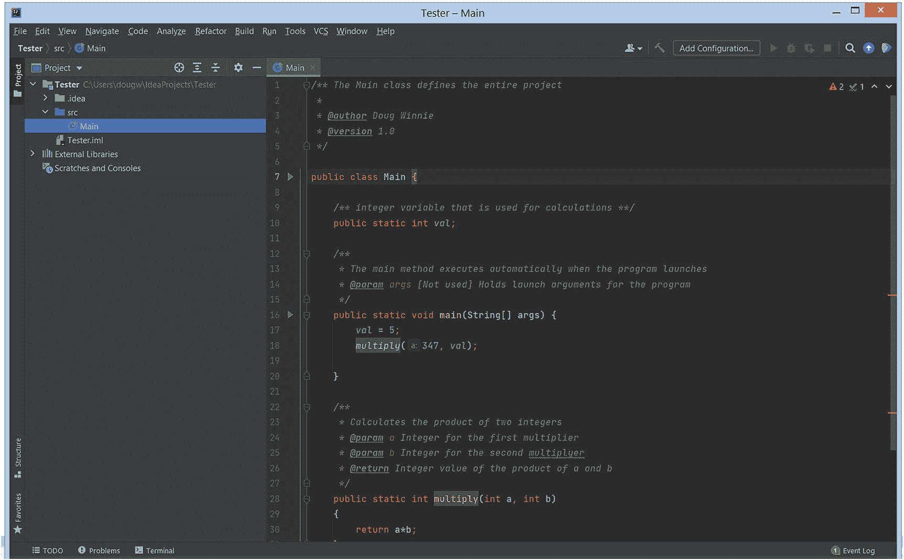

图 35-1
使用 JavaDoc 标记的代码

要构建 JavaDoc，请使用“工具” ➤ “生成 JavaDoc”菜单命令。

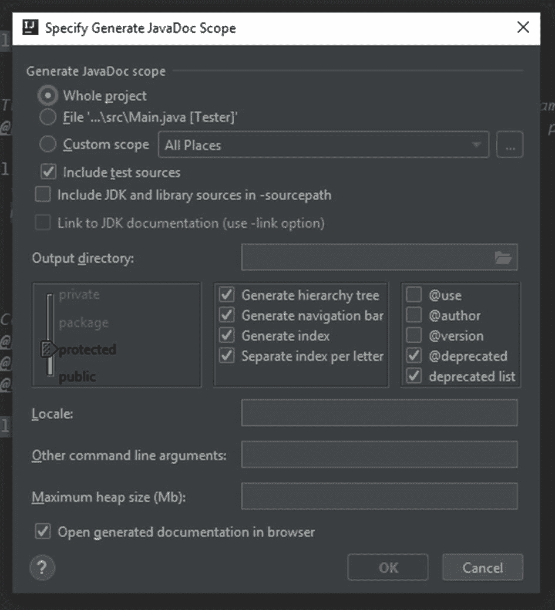

图 35-2
JavaDoc 窗口

勾选 @author 和 @version，并定义要保存生成的 HTML 的位置。

当你生成文档时，它会打开一个浏览器窗口并显示完整的文档。

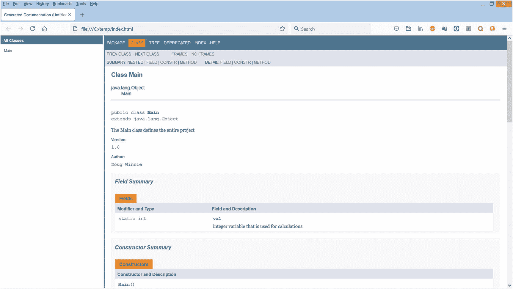

图 35-3
导出的 JavaDoc

代码示例
上述代码也可在以下 GitHub 仓库中找到：
[`https://github.com/Apress/essential-java-AP-CompSci`](https://github.com/Apress/essential-java-AP-CompSci)

36. 格式化字符串

之前，我们使用 `printf()` 方法通过格式化器来创建和输出字符串。有时，你只想存储格式化后的字符串，而不使用 `String` 变量来显示它。
你可以使用 `String` 类的 `format()` 方法来做到这一点。

创建格式化字符串字面量

要创建一个字符串字面量，请使用 `String.format()` 方法。在其中，放置字符串模板以及插入代码，后跟一个逗号分隔的列表，列出要插入到模板中的相应值。这与用于 `printf()` 方法的代码相同，但结果是一个完整的字符串：

```
String x = String.format("a: %s, b: %d, c: %.3f", a, b, c);
```

结果是将以下字符串赋值给 x：

```
"a: foo, b: 5, c: 1.250"
```

代码示例
下一页展示了使用格式化创建字符串字面量的示例。
此代码也可在以下 GitHub 仓库中找到：

[`https://github.com/Apress/essential-java-AP-CompSci`](https://github.com/Apress/essential-java-AP-CompSci)

```
public class Main {
public static void main(String[] args) {
String a = "foo";
int b = 5;
double c = 1.25;
String x = String.format("a: %s, b: %d, c: %.3f", a, b, c);
System.out.println(x);
}
}
```

37. while 循环


循环允许根据条件重复执行代码块。最基本的循环称为 `while` 循环。该循环以 `while` 语句开头，后跟一个条件，该条件通过求值或表达式定义，其结果是一个布尔值 `true` 或 `false`。如果条件结果为 `true`，则执行循环内的代码，程序流程返回到顶部并再次测试条件。

使用 `while` 循环时需要考虑的一个问题是创建无限循环。当顶部的条件始终为 `true` 时，循环将永远运行。这会导致运行时错误，并使程序崩溃。

**创建 while 循环**

在以下代码中，使用 `while` 语句创建了一个 `while` 循环，后跟一个条件求值。该求值测试变量 `val` 是否小于 `10`。该变量使用整数字面量值 `0` 进行初始化。

```
public class Main {
public static void main(String[] args) {
// 只要顶部的条件始终为 true，此循环就会运行
int val = 0;
while (val < 10) {
System.out.println(String.format("val = %d",val));
val++;
}
/* 输出
val = 0
val = 1
val = 2
val = 3
val = 4
val = 5
val = 6
val = 7
val = 8
val = 9
*/
}
}
```

循环首先测试条件，该条件为 true，因为 0 小于 10。由于条件为 true，它会运行 while 语句后代码块内的所有代码。在代码块末尾，它会增加存储在 `val` 中的值（现在为 1），并重复循环。由于存储在 `val` 中的值仍然小于 10，循环再次运行。这一过程持续到 `val` 等于 9。在该次循环执行结束时，`val` 增加 1 变为 10。当这次循环重复时，顶部的条件现在为 false，因为 10 不小于 10。由于条件现在为 false，循环结束，跳过代码块，程序流程继续。

**代码示例**
上述代码也可在以下 GitHub 仓库中找到：
[`https://github.com/Apress/essential-java-AP-CompSci`](https://github.com/Apress/essential-java-AP-CompSci)

**38. 自动程序循环**

有时，你需要让程序持续循环以完成某些任务。你需要根据某个条件结束循环，即使该条件只是用户通过命令或操作简单地表示要结束程序。这在游戏中非常常见，游戏会运行并处理逻辑、场景和回合，直到玩家获胜、失败或用户选择结束游戏。

**创建程序循环**
在以下示例中，使用一个名为 `loopProgram` 的布尔值来存储 `true` 或 `false` 值。`while` 循环一直运行，直到该布尔值等于 `false`，这发生在用户输入命令“`exit`”时。当这种情况发生时，布尔变量 `loopProgram` 被设置为 `false`，然后 `while` 循环结束，程序终止。

```
import java.util.Scanner;
public class Main {
public static Scanner sc;
public static boolean loopProgram;
public static void main(String[] args) {
sc = new Scanner(System.in);
loopProgram = true;
displayMenu();
while (loopProgram) {
System.out.print("Command? ");
String cmd = sc.next();
parseCmd(cmd);
}
}
public static void displayMenu() {
System.out.println("Menu: ");
System.out.println("north: move north ");
System.out.println("south: move south ");
System.out.println(" east: move east ");
System.out.println(" west: move west ");
System.out.println(" exit: quit program ");
}
public static void parseCmd(String cmd) {
switch (cmd) {
case "north":
System.out.println("You move north.");
break;
case "south":
System.out.println("You move south.");
break;
case "east":
System.out.println("You move east.");
break;
case "west":
System.out.println("You move west.");
break;
case "exit":
System.out.println("Goodbye");
loopProgram = false;
break;
default:
System.out.println("Unrecognized command!");
break;
}
}
}
清单 38-1
自动程序循环
```

**代码示例**
上述代码也可在以下 GitHub 仓库中找到：
[`https://github.com/Apress/essential-java-AP-CompSci`](https://github.com/Apress/essential-java-AP-CompSci)

**39. do/while 循环**

`while` 循环在顶部条件为 `true` 时运行，但你可能遇到需要至少运行一次循环内代码的情况，或者需要在循环末尾测试条件。解决方案是 `do...while` 循环。`do...while` 循环与 `while` 循环相同，只是条件语句在末尾测试。因此，循环至少会运行一次，如果循环末尾的条件为 `true`，循环将重复。如果末尾的条件为 `false`，则不会重复循环，程序流程将继续执行下一条语句。

**创建 do…while 循环**

`do...while` 循环以 `do` 子句开头，后跟一个由花括号定义的代码块。在代码块之后，添加带有条件语句的 `while` 子句：

```
int a = 5;
do {
System.out.println(a);
a--;
} while (a > 0);
```

在此示例中，循环将运行五次，从值 5 开始，然后每次循环执行时将其减 1。

**至少运行一次**

在以下示例中，循环将运行一次，因为条件在末尾测试：

```
boolean loop = false;
do {
System.out.println("Run this loop!");
} while (loop);
```

**40. 简化赋值运算符**

有许多快捷方式可用于操作变量的值以节省时间。这些被称为复合赋值运算符，它们对变量的现有值执行数学求值，并将结果分配回同一变量。

**复合赋值**

以这段代码为例：

```
int a = 2;
System.out.println(a);
a = a + 2;
System.out.println(a);
```

在此示例中，我们有一个名为 `a` 的整数变量，设置为字面量值 `2`。然后我们获取存储在变量中的值，并执行加法将值增加 `2`。我们将这个新结果 `4` 分配回 `a`。

我们可以使用以下语句简化此操作：

```
a += 2;
```

这执行与前一语句相同的操作，但更简洁。

你可以将这种复合赋值运算符与所有基本算术运算符一起使用，包括加法、减法、乘法、除法和取模：

```
a += 2;
a -= 2;
a *= 2;
a /= 2;
a %= 2;
```

**递增和递减**

如果你只想加 1 或减 1，还有两个额外的快捷方式。第一个是递增运算符。要对任何变量加 1，在变量末尾添加两个加号：

```
a = a + 1;
a += 1;
a++;
```

这三个语句都做同样的事情：将存储在变量 `a` 中的值加 1。最后一个使用了递增运算符。

要减 1，只需将加号替换为减号：

```
a = a - 1;
a -= 1;
a--;
```


放置与程序流程
当你使用这类运算符时，可以同时改变数值并显示数值。

让我们看看这个例子：

```
int a = 1;
System.out.println(a);      // 1
System.out.println(a += 1); // 2
System.out.println(a);      // 2
```

在此场景中使用复合赋值运算符时，我们用它来显示 `a` 的值，同时改变该值。先执行数学运算，然后显示结果。

现在改用递增运算符：

```
int b = 1;
System.out.println(b);      // 1
System.out.println(b++);    // 1
System.out.println(b);      // 2
```

运行这段代码时，发生了意想不到的情况。尽管我们使用递增运算符将值增加了 1，但显示的结果并未增加。当我们再次显示该值时，新的增加值才显示出来。
因此，值确实增加了，但这是在值显示之后发生的。这就是递增运算符放在变量名之后时代码的执行顺序。

我们可以通过将运算符放在变量名之前作为前缀来解决这个问题：

```
int c = 1;
System.out.println(c);      // 1
System.out.println(++c);    // 2
System.out.println(c);      // 2
```

根据程序的需求，你可能需要将运算符放在变量之前或之后。大多数情况下会放在变量之后，但在某些情况下，将其用作前缀也很有价值。

代码示例
下一页展示了简化赋值运算符的示例。
以下代码也可在 GitHub 仓库中找到：

[`https://github.com/Apress/essential-java-AP-CompSci`](https://github.com/Apress/essential-java-AP-CompSci)

```
public class Main {
public static void main(String[] args) {
int x = 10;
System.out.println("Combined assignment");
x += 5;     // 15
System.out.println(x);
x -= 5;     // 10
System.out.println(x);
x *= 2;     // 20
System.out.println(x);
x /= 4;     // 5
System.out.println(x);
x %= 2;     // 1
System.out.println(x);
System.out.println("\nInline combined assignment");
int a = 1;
System.out.println(a);      // 1
System.out.println(a += 1); // 2
System.out.println(a);      // 2
System.out.println("\nPost increment");
int b = 1;
System.out.println(b);      // 1
System.out.println(b++);    // 1
System.out.println(b);      // 2
System.out.println("\nPre increment");
int c = 1;
System.out.println(c);      // 1
System.out.println(++c);    // 2
System.out.println(c);      // 2
}
}
清单 40-1
简化赋值运算符示例
```

41. for 循环

`for` 循环基于一个称为迭代器的特殊变量，运行特定次数。迭代器的值、条件测试结果以及每次循环执行的修改（称为步进）控制着循环的运行时间。这三项内容都在 for 循环的开头定义。
当你需要重复执行某个序列特定次数时，会使用 `for` 循环。例如，如果你需要运行同一段代码一百次，或者基于某个特定的固定次数。

创建 for 循环

`for` 循环以 `for` 子句开头，后跟一对圆括号。在圆括号内，用分号分隔，设置三项内容：

1.  用于循环迭代值的类型和变量名，并赋予初始值
2.  循环运行所需的条件测试，必须为 `true`
3.  在 `for` 循环结束时对迭代器所做的修改

以下是一个运行十次的循环示例：

```
for (int i = 0; i < 10; i++) {
System.out.println(i);
}
```

在这个例子中，我们有一个名为 `i` 的迭代器变量，类型为整数，初始设置为整数字面量 `0`。然后我们定义 for 循环仅在迭代器小于十时运行。在循环结束时，迭代器使用递增运算符增加 1。

运行此循环时，你将得到以下输出：

```

```

循环开始时迭代器为 `0`，条件通过，因此循环运行。在循环结束时，迭代器递增到 `1` 并重复条件测试，再次通过，循环再次运行。
这种情况一直持续到迭代器等于 `9`。在该次循环执行结束时，迭代器递增到 `10`，重复条件测试，这次失败，程序流程继续执行循环之后的代码。

修改步进

你可以根据需要修改步进，以满足程序的需求。例如，你可以循环遍历从 2 到 100 的所有偶数：

```
for (int i = 2; i <= 100; i=i+2) {
System.out.println(i);
}
```

在循环内部，我们可以利用重复来运行代码，例如，我们可以测试得到正面（0）或反面（1）的概率，并查看它是否与概率公式匹配：

```
int timesTrue = 0;
int timesFalse = 0;
int timesRun = 1000000;
for (int i = 0; i <= timesRun; i++) {
int result = (int)Math.round(Math.random());
System.out.println(String.format("Attempt %d: %d", i, result));
if (result == 0)
{
timesTrue++;
} else {
timesFalse++;
}
}
float perTrue = (float) timesTrue / (float) timesRun * 100;
float perFalse = (float) timesFalse / (float) timesRun * 100;
System.out.println(String.format("Out of %d tests,",timesRun));
System.out.println(String.format("Times true : %d, or %.2f",timesTrue, perTrue) + "%");
System.out.println(String.format("Times false: %d, or %.2f",timesFalse, perFalse) + "%");
```

代码示例
上述代码也可在以下 GitHub 仓库中找到：
[`https://github.com/Apress/essential-java-AP-CompSci`](https://github.com/Apress/essential-java-AP-CompSci)

42. 嵌套循环

当你创建一个 `for` 循环时，是什么阻止你创建两个呢？没什么！事实上，创建彼此内部运行的嵌套 for 循环非常常见。嵌套 `for` 循环是指两个（或更多）循环在彼此内部运行。

创建嵌套循环

如果我们从一个基本循环开始，我们可以从零到九进行计数。

```
for (int i = 0; i < 10; i++) {
System.out.println(i);
}
```

但是，我们可以在其中创建另一个循环，再次从零到九进行计数。

```
for (int i = 0; i < 10; i++) {
for (int j = 0; j < 10; j++) {
System.out.printf("(%d,%d)\n",i,j);
}
}
```

这里有几个重要的规则需要注意。首先，循环完全封装在另一个循环内部。循环不能重叠；它们必须完全适合另一个循环内部。
另一个规则是，两个循环的迭代器变量必须是唯一的。外层循环使用迭代器变量 `i`。内层循环使用变量 `j` 作为迭代器。
作用域规则在此适用，因为在内层循环内部，我可以访问 `i` 和 `j` 变量，但在外层循环中，我只能访问 `i` 变量，因为内层循环在其外部是超出作用域的。

内层循环内部的代码能够访问两个迭代器变量，并将文本输出到控制台：

```
(0,0)
(0,1)
(0,2)
(0,3)
(0,4)
(0,5)
(0,6)
(0,7)
(0,8)
(0,9)
(1,0)
(1,1)
(1,2)
. . .
(9,3)
(9,4)
(9,5)
(9,6)
(9,7)
(9,8)
(9,9)
```

第一个数字是外层循环，即 `i`。第二个数字是内层循环，即 `j`。如你所见，它们类似于网格上的坐标。你可以将嵌套循环视为一种系统地遍历网格坐标或单元格的方法，从行（`i`）和列（`j`）开始。

以网格形式显示
我们可以利用它来构建信息网格，例如乘法表。遵循嵌套循环结构的流程，我们可以使用 `print()` 方法创建输出，每次执行内层循环时添加到显示中，然后每次开始外层循环时创建新行。

以下是一个示例，使用 `\t` 序列在输出中表示制表符空格，以保持内容对齐：


```
System.out.println("Building a grid:");
System.out.println("\t0:\t1:\t2:\t3:\t4:\t5:\t6:\t7:\t8:\t9:");
for (int i = 0; i < 10; i++) {
System.out.printf("%d:\t",i);
for (int j = 0; j < 10; j++) {
System.out.printf("%d\t",i*j);
}
System.out.print("\n");
}
```

当这个循环运行时，它首先输出一个标题，然后创建一列列标题，接着进入外层循环，从零计数到十。它先打印行标题，但不换行。然后内层循环开始运行，同样从零计数到十。它在屏幕当前行文本末尾添加一小段内容，显示 `i` 和 `j` 的乘积，后跟一个制表符空格。内层循环结束后，它在屏幕文本末尾添加一个换行符，然后重复循环以输出下一行。

运行结果如下：

```
Building a grid:
0:    1:    2:     3:     4:     5:     6:     7:     8:     9:
0:     0     0     0      0      0      0      0      0      0      0
1:     0     1     2      3      4      5      6      7      8      9
2:     0     2     4      6      8      10     12     14     16     18
3:     0     3     6      9      12     15     18     21     24     27
4:     0     4     8      12     16     20     24     28     32     36
5:     0     5     10     15     20     25     30     35     40     45
6:     0     6     12     18     24     30     36     42     48     54
7:     0     7     14     21     28     35     42     49     56     63
8:     0     8     16     24     32     40     48     56     64     72
9:     0     9     18     27     36     45     54     63     72     81
```

代码示例
前面的示例代码在下面以完整的程序文件形式列出。
该代码也可在 GitHub 的以下位置获取：

[`https://github.com/Apress/essential-java-AP-CompSci`](https://github.com/Apress/essential-java-AP-CompSci)

```
public class Main {
public static void main(String[] args) {
// 单层循环
System.out.println("Single loop");
for (int i = 0; i < 10; i++) {
System.out.println(i);
}
// 嵌套循环
System.out.println("\nNested loop");
for (int i = 0; i < 10; i++) {
for (int j = 0; j < 10; j++) {
System.out.printf("(%d,%d)\n",i,j);
}
}
// 构建网格
System.out.println("\nBuilding a grid:");
System.out.println("\t0:\t1:\t2:\t3:\t4:\t5:\t6:\t7:\t8:\t9:");
for (int i = 0; i < 10; i++) {
System.out.printf("%d:\t",i);
for (int j = 0; j < 10; j++) {
System.out.printf("%d\t",i*j);
}
System.out.print("\n");
}
}
}
清单 42-1
嵌套循环示例
```

43. 字符串作为集合

字符串远比它们看起来要强大得多。它们拥有多种属性和功能，你可以通过方法调用来解锁这些功能，从而操作和管理字符串的内容。这些功能包括：获取字符串长度、提取字符串中的特定字符、比较字符串，以及从较大的字符串中提取子字符串。

使用 String 类创建字符串

创建字符串需要使用 `String` 类。由于我们使用的是类而非基本类型作为类型，因此需要为字符串使用 `new` 关键字：

```
String s = new String();
s = "Doug";
```

获取字符串长度

字符串有一个名为 `length()` 的方法，它返回一个整数，表示字符串中的字符数：

```
// 获取字符串长度
int len = s.length();
System.out.println(len); // 返回 4
```

从字符串中获取特定字符

字符串基于其内部的字符进行索引。它们使用从零开始的计数序列来标识每个字符。使用 `charAt()` 方法，你可以提取字符串中指定索引位置的特定字符：

```
// 获取字符串的第一个字符
char firstLetter = s.charAt(0);
System.out.println(firstLetter); // 返回 D
```

在字符串中查找字符

当你有一个字符串时，有时需要查找特定的字符，例如，如果你有一个包含某人全名的字符串，你可能需要找到其中空格或特殊字符的位置。

为此，你可以使用 `String` 类的 `indexOf()` 方法，并向其提供一个字符或字符串，该方法会尝试在字符串中找到它：

```
String name = "Doug Winnie";
int space = name.indexOf(" ");
System.out.println(space); // 输出 4
```

这将找到该字符在字符串中的第一个实例。如果你需要查找多个实例，可以使用 `indexOf()` 方法的重载版本，该版本为搜索指定了起始位置：

```
String state = "Mississippi";
int start = 0;
boolean loop = true;
do {
int index = state.indexOf('i',start);
System.out.println(index);
if (index >= 0) {
start = index + 1;
} else {
loop = false;
}
} while (loop); // 程序输出 1, 4, 7, 10, -1
```

在前面的示例中，我们有一个整数，它包含我们希望开始搜索的位置（使用字符位置编号），还有一个布尔值用于控制循环的执行。
当我们运行 `indexOf()` 方法时，我们传入要查找的字符字面量以及希望开始搜索的位置。当它找到一个值时，会将该值赋给 `index` 整数变量。如果找不到该字符，则赋值为 `-1`，表示找不到该序列。
如果找到了该值，它会更新起始搜索索引；如果找不到更多该值，则设置循环结束。

最后，你可以使用 `lastIndexOf()` 方法查找字符串中最后一个字符实例：

```
String name = "Doug Winnie";
int ichar = name.lastIndexOf('i');
System.out.println(ichar); // 输出 9
```

提取子字符串

要捕获较大字符串中的一部分字符串，你可以使用 `substring()` 方法。它有两个重载的方法选项。第一个是提供要提取的子字符串的起始索引号。第二个是提供要捕获的字符串在较大字符串中的起始和结束索引点：

```
// 从末尾获取子字符串
String sub = s.substring(1);
System.out.println(sub); // 返回 oug
// 从中间获取子字符串
String mid = s.substring(1,3);
System.out.println(mid); // 返回 ou
```

比较字符串

要比较字符串，请使用 `equals()` 方法。由于引用类型的特性，最好使用 `equals()` 方法来比较字符串，而不是使用相等运算符（`==`）：

```
// 比较字符串
boolean isSame = s.equals("Doug");
System.out.println(isSame); // 返回 true
```

另一个有用的比较工具是 `equalsIgnoreCase()` 方法。它比较两个字符串的内容，无论两者的大小写是否匹配，都返回 true。因此，字符串 `"Abc"`、`"abc"` 和 `"ABC"` 在使用 `equalsIgnoreCase()` 方法比较时，结果都会是 `true`：

```
isSame = s.equals("DOUG");
System.out.println(isSame); // 返回 false
isSame = s.equalsIgnoreCase("DOUG");
System.out.println(isSame); // 返回 true
```

代码示例
以下代码包含处理字符串以及如何使用字符串方法的示例。
该代码也可在 GitHub 的以下位置获取：

[`https://github.com/Apress/essential-java-AP-CompSci`](https://github.com/Apress/essential-java-AP-CompSci)


```
public class Main {
public static void main(String[] args) {
// 创建一个字符串
String s = new String();
s = "Doug";
// 获取字符串的长度
int len = s.length();
System.out.println(len); // 返回 4
// 获取字符串的第一个字符
char firstLetter = s.charAt(0);
System.out.println(firstLetter); // 返回 D
// 获取特定字符串或字符的位置
String name = "Doug Winnie";
int space = name.indexOf(" ");
System.out.println(space);
// 从自定义起始点获取特定字符串或字符的位置
String state = "Mississippi";
int start = 0;
boolean loop = true;
do {
int index = state.indexOf('i',start);
System.out.println(index);
if (index >= 0) {
start = index + 1;
} else {
loop = false;
}
} while (loop);
// 获取特定字符串或字符的最后位置
name = "Doug Winnie";
int ichar = name.lastIndexOf('i');
System.out.println(ichar);
// 从末尾获取子字符串
String sub = s.substring(1);
System.out.println(sub); // 返回 oug
// 从中间获取子字符串
String mid = s.substring(1,3);
System.out.println(mid); // 返回 ou
// 比较字符串
boolean isSame = s.equals("Doug");
System.out.println(isSame); // 返回 true
isSame = s.equals("DOUG");
System.out.println(isSame); // 返回 false
isSame = s.equalsIgnoreCase("DOUG");
System.out.println(isSame); // 返回 true
}
}
清单 43-1
字符串方法示例
```

44. 创建集合
使用数组

数组是相同类型对象的集合，你可以通过一个名称来引用它们。你也可以使用方括号表示法和索引编号来访问其中的单个元素。

使用值创建数组
数组的定义方式与其他变量类似。你需要定义数组将包含的值的类型，并使用一对方括号来表示你正在创建一个数组，而不是单个值。
创建数组有两种方法。你可以从一组值创建数组，也可以通过声明数组将包含多少个元素来定义一个空数组。需要了解的关键点是，数组必须使用特定数量的元素来定义才能创建。数组创建后，你无法更改其中的元素数量。

要从一组值创建数组，首先指定将存储在数组中的值的类型，后跟一对方括号。然后使用赋值运算符，并使用 `new` 语句创建一个新数组，后跟数组值类型和另一对方括号。接着，用一组与数组类型匹配的值，这些值用大括号括起来并用逗号分隔：

```
// 从值创建数组
int[] a = new int[] {1,2,3,4,5};
```

这个名为 `a` 的数组只能包含整数，因为它被类型化为 `int`。由于我们立即提供了值，该数组将包含五个值，它们初始为 1、2、3、4 和 5。

从数组中获取值

要访问数组中的值，你需要使用方括号，通过索引编号来指定要获取的元素。请记住，数组中的第一个元素的索引编号是 0：

```
// 访问数组中的值
System.out.println(a[0]); // 输出 1
```

按大小创建数组

或者，你可以通过定义数组的大小来创建数组，稍后再提供值。结构大致相同，但你在方括号内提供大小，并省略值列表：

```
// 按大小创建数组
int[] b = new int[5];
```

这个数组是空的，但可以包含五个值。要向这五个槽位添加值，你可以访问数组，指定一个索引元素，然后使用赋值运算符将一个值赋给它：

```
// 向数组赋值
b[0] = 5;
```

使用数组时应避免的问题
在使用数组时，你应该了解一些潜在的陷阱。第一个是当你通过定义大小来创建一个空数组时，即使你没有提供值，Java 也会自动为每个元素分配一个值。这可能会导致意外结果，因此建议你不要让数组长时间保持为空。
另一个常见错误是通过提供无效的索引编号来访问数组中不存在的元素。

最后，由于数组被类型化为某个值，数组的所有元素都必须与创建时定义的值匹配：

```
// 数组的错误用法
// System.out.println(b[1]); // 返回 0，因为没有赋值
// b[5] = 9; // 不存在索引 5
// int[] c = new int[] {1.2,3.4,5.6}; // 类型不匹配
// int[] d = new int[] {1,2,3,4.5}; // 混合类型
```

获取数组中的元素数量

与字符串类似，你可以找出数组中的元素数量。对于字符串，你可以找到字符数。对于数组，你可以找到元素数。区别在于，你通过属性（而非方法）来访问长度，因此需要省略末尾的一对括号：

```
// 获取数组长度
int len = a.length;
System.out.println(len); // 返回 5
```

遍历数组
最后，你可以遍历数组的元素，就像遍历字符串的字符一样。通过使用元素索引编号、方括号表示法和 length 属性，你可以遍历所有元素。

以下代码展示了如何根据用户定义的多个元素创建一个数组，然后使用循环填充这些值：

```
// 使用输入定义数组
Scanner sc = new Scanner(System.in);
System.out.print("你想添加多少个数字？ ");
int count = sc.nextInt();
int[] values = new int[count];
for (int i = 0; i < values.length; i++)
{
System.out.printf("值 %d: ", i);
int num = sc.nextInt();
values[i] = num;
}
int sum = 0;
for (int i = 0; i < values.length; i++)
{
sum += values[i];
}
System.out.printf("总和: %d\n", sum);
```

代码示例
此代码也可在 GitHub 的以下位置获取：

[`https://github.com/Apress/essential-java-AP-CompSci`](https://github.com/Apress/essential-java-AP-CompSci)

```
import java.util.Scanner;
public class Main {
public static void main(String[] args) {
// 从值创建数组
int[] a = new int[] {1,2,3,4,5};
// 访问数组中的值
System.out.println(a[0]);
// 按大小创建数组
int[] b = new int[5];
// 向数组赋值
b[0] = 5;
// 数组的错误用法
// System.out.println(b[1]); // 返回 0，因为没有赋值
// b[5] = 9; // 不存在索引 5
// int[] c = new int[] {1.2,3.4,5.6}; // 类型不匹配
// int[] d = new int[] {1,2,3,4.5}; // 混合类型
// 获取数组长度
int len = a.length;
System.out.println(len);
// 遍历数组
for (int i = 0; i < a.length; i++)
{
System.out.printf("索引 %d: %d\n",i, a[i]);
}
// 使用输入定义数组
Scanner sc = new Scanner(System.in);
System.out.print("你想添加多少个数字？ ");
int count = sc.nextInt();
int[] values = new int[count];
for (int i = 0; i < values.length; i++)
{
System.out.printf("值 %d: ", i);
int num = sc.nextInt();
values[i] = num;
}
int sum = 0;
for (int i = 0; i < values.length; i++)
{
sum += values[i];
}
System.out.printf("总和: %d\n", sum);
}
}
清单 44-1
数组示例
```

45. 从字符串创建数组


通常，你会在程序中使用已经格式化或分析过的数据。一种常见的发送和传输信息的方式是使用分隔列表。  
分隔列表是一种简单的项目列表，项目之间由分隔符隔开。分隔符可以是逗号、竖线（或管道符）、分号、制表符、空格，或任何你认为合适的字符。在 Java 中，你可以处理以 `Strings` 形式存储的分隔列表，然后使用 `split()` 方法将它们解析为 `Arrays`。

### 分隔字符串

首先，你需要一个包含分隔列表的字符串。分隔符在整个字符串中必须保持一致，并且需要是唯一的，仅用作分隔符。以下是一个示例：

```
String list = "Doug,Mike,Janet,Matt,Tim,Doris";
```

这个字符串可以正常工作，因为逗号就是分隔符。该列表包含六个唯一的项目（即名字），但它们存储在一个字符串中，逗号用于指示一个项目的结束和另一个项目的开始。

不过，如果字符串看起来像这样，我们可能会遇到问题：

```
String list = "Doug, Mike, Janet, Matt, Tim, Doris";
```

区别很细微，但名字之间不仅有逗号，还有逗号和空格。如果我们根据逗号将它们拆分成多个项目，那么会有五个项目前面带有一个空格。

### 拆分字符串

要使用分隔列表创建数组，我们需要使用 `split()` 方法，并提供字符串中使用的分隔符。结果将是一个字符串类型的数组，其中包含字符串中的所有项目，每个项目对应一个独立的元素：

```
String list = "Doug,Mike,Janet,Matt,Tim,Doris";
String[] names = list.split(",");
```

当这段代码运行时，包含名字的字符串将使用 `split()` 方法进行解析，每当遇到逗号时就会进行拆分。拆分后的字符串集合会按顺序添加到字符串类型的数组 `names` 中。原始列表保持不变。

然后，我们可以使用元素索引号来显示各个名字，或者遍历集合来查看所有被解析的值：

```
System.out.printf("List: %s\n\n", list);
System.out.printf("Item 2: %s\n\n",names[2]);
for (var i = 0; i < names.length; i++)
System.out.printf("Name %d: %s\n",i,names[i]);
```

上述代码将显示原始列表、新创建的数组中的单个项目，然后遍历并显示列表中的所有名字：

```
List: Doug,Mike,Janet,Matt,Tim,Doris
Item 2: Janet
Name 0: Doug
Name 1: Mike
Name 2: Janet
Name 3: Matt
Name 4: Tim
Name 5: Doris
```

### 数字怎么办？

这对字符串来说效果很好，但如果是数字，我们该怎么办？我们需要先创建字符串数组，然后创建一个新数组，并将这些值转换为数字。

```
String nums = "3,6,9,12,15,18,21";
String strValues[] = nums.split(",");
int[] values = new int[strValues.length];
for (int i = 0; i < strValues.length; i++)
values[i] = Integer.parseInt(strValues[i]);
```

这里，我们有一个由逗号分隔的整数组成的字符串。当我们拆分这些值时，它们仍然是字符串，所以我们需要将它们存储在一个字符串类型的数组中。  
然后，创建一个空的整数类型数组，其元素数量与字符串类型数组相同。  
接着，一个 `for` 循环遍历字符串类型数组，将每个元素字符串值解析为整数，并将其赋值给整数类型数组中相同索引的元素。

完成后，我们就得到了一个新的整数数组，其中包含解析后的值。我们可以使用 `for` 循环来显示它们：

```
for (int i = 0; i < values.length; i++)
System.out.printf("Value %d: %d\n",i,values[i]);
```

这将遍历整数数组的所有值，我们可以在程序中像处理整数一样处理它们。输出结果如下：

```
Value 0: 3
Value 1: 6
Value 2: 9
Value 3: 12
Value 4: 15
Value 5: 18
Value 6: 21
```

### 代码示例
此代码也可在 GitHub 的以下位置获取：

[`https://github.com/Apress/essential-java-AP-CompSci`](https://github.com/Apress/essential-java-AP-CompSci)

```
public class Main {
public static void main(String[] args) {
// 将分隔字符串拆分为数组
String list = "Doug,Mike,Janet,Matt,Tim,Doris";
String[] names = list.split(",");
System.out.printf("List: %s\n\n", list);
System.out.printf("Item 2: %s\n\n",names[2]);
for (var i = 0; i < names.length; i++)
System.out.printf("Name %d: %s\n",i,names[i]);
// 将分隔字符串拆分为整数数组
String nums = "3,6,9,12,15,18,21";
String strValues[] = nums.split(",");
int[] values = new int[strValues.length];
for (int i = 0; i < strValues.length; i++)
values[i] = Integer.parseInt(strValues[i]);
for (int i = 0; i < values.length; i++)
System.out.printf("Value %d: %d\n",i,values[i]);
}
}
清单 45-1
从字符串解析数组
```

## 46. 多维数组

集合是一组值的集合。对于数组来说，这些值都是相同类型的。如果一个数组元素可以包含一个值，那么它能存储一组值吗？答案是肯定的。  
只要类型与其他值相同，数组几乎可以存储任何东西。因此，如果一个数组可以包含整数集合，那么它同样可以轻松地存储整数集合的集合。

这些被称为多维数组。这个名称指的是该集合可以包含多个维度的数据。单个维度就是单行数据：

```
1,
2,
3,
4,
5,
```

第二个维度会将每个数据点转换为一组自己的数据，从而创建一个网格：

```
1,2,3,4,5,
2,3,4,5,6,
3,4,5,6,7,
4,5,6,7,8,
5,6,7,8,9
```

你甚至可以更进一步，给这个网格的每个单元格赋予一组自己的数据，从而创建一个三维的数据立方体。

### 定义多维数组
定义多维数组与定义简单数组没有区别，但你需要指定要创建多少个维度。  
请记住，当你定义一个变量时，你是在提供类型。如果是简单的整数，那就是 `int`。如果是整数集合，那就是 `int[]`。这个 `int[]` 就是完整的类型。它不是一个表示或抽象；它清楚地表明该变量唯一能保存的就是整数集合。

因此，对于多维数组，同样适用：

```
int[] values;
int[][] grid;
```

第一个变量 `values` 存储一维整数。要创建第二个维度，我们添加另一对空方括号，就像我们在变量 `grid` 中使用的那样。

当你定义数组的大小，但不想提供值时，可以使用 `new` 语句，并在方括号内填入值，如下所示：

```
values = new int[5];
grid = new int[5][5];
```

或者，你可以使用花括号表示法（有时称为对象表示法），并在初始化数组的同时提供值：

```
values = new int[] {1,2,3,4,5};
grid = new int[][] {{1,2,3,4,5},
{2,3,4,5,6},
{3,4,5,6,7},
{4,5,6,7,8},
{5,6,7,8,9}};
```

为 `grid` 变量添加的空白是为了展示这里的情况；我们实际上是在逐行添加几行数据。

这也可以写成这样：

```
grid = new int[][] {{1,2,3,4,5}, {2,3,4,5,6}, {3,4,5,6,7}, {4,5,6,7,8}, {5,6,7,8,9}};
```

### 为多维数组赋值
为多维数组中的特定元素赋值与为一维数组赋值没有区别，只是现在你需要为每个维度提供多个值：

```
values[3] = 0;
grid[2][1] = 0;
```

同样，这里同时展示了简单数组和多维数组以便比较。

### 访问多维数组中的值
与赋值类似，你需要提供两个元素标识号来访问数组中的项目。

```
System.out.println("values element 3: " + values[3]);
System.out.println("grid element 2, element 4: " + grid[2][4]);
```


此外，你也可以只访问第一个维度，然后处理其中的元素。这只需引用数组的第一个维度即可实现。

```
System.out.println("values in element 1: " + grid[1].length);
```

矩形数组与不规则数组
在前面的例子中，每个维度中的元素数量都是相同的。像这样，我们可能有五组、每组五个值的例子，被称为矩形数组。其中组的数量以及每组中值的数量是一致的。虽然五组五个值构成了一个正方形，但也可以是三组八个值，或者一百组两个值——这都无关紧要，但每组的大小始终是固定的。

但并非必须如此；你可以轻松地创建像下面这样的数组：

```
int[][] irrGrid = new int[][] {{1,2},{3,4,5},{6,7,8,9}};
```

在这个例子中，有三组，但每组中的值的数量各不相同。这被称为不规则数组。不过，适用于所有数组的规则同样适用。当你创建一个数组时，不能添加元素，也不能删除它们。因此，这个数组的大小将始终是不规则的。

代码示例
此代码也可在 GitHub 的以下位置获取：

[`https://github.com/Apress/essential-java-AP-CompSci`](https://github.com/Apress/essential-java-AP-CompSci)

```
public class Main {
public static void main(String[] args) {
int[] values;
int[][] grid;
// values = new int[5];
// grid = new int[5][5];
values = new int[] {1,2,3,4,5};
grid = new int[][] {{1,2,3,4,5},
{2,3,4,5,6},
{3,4,5,6,7},
{4,5,6,7,8},
{5,6,7,8,9}};
values[3] = 0;
grid[2][1] = 0;
System.out.println("values element 3: " + values[3]);
System.out.println("grid element 2, element 4: " + grid[2][4]);
System.out.println("values in element 1: " + grid[1].length);
}
}
/* Output
values element 3: 0
grid element 2, element 4: 7
values in element 1: 5
*/
Listing 46-1
Multidimensional arrays
```

47. 遍历多维数组

对多维数组使用 for 循环可能有点棘手，但本质上它们与简单数组的循环相同；你只需要为每个维度嵌套一个循环即可。

为数组创建嵌套循环
以下是一个构建数据网格、生成数据并将其显示在屏幕上的示例。这是通过两个循环完成的。

首先，我们需要初始化数据网格：

```
int[][] multitable = new int[10][10];
```

这个数组将包含十组，每组十个整数。它已被初始化，但每个元素内部的值目前是空的，或者说为 null。我们需要创建数据放入其中。
我们可以构建一个乘法表数据，其中单元格的值等于行和列的乘积。我们可以将这些值显示在屏幕上，并用制表符分隔以对齐它们。
一个二维数组由多行组成，每行包含多个单独的元素。当我们创建循环时，需要遍历每一行，然后当聚焦于特定行时，再遍历该行中的每个元素或列。因此，我们需要创建一个两层嵌套的 for 循环。我们将使用 row 和 col 来表示它们，而不是使用典型的迭代器变量名。

首先，让我们创建数组中的值：

```
for (int row = 0; row < multitable.length; row++) {
for (int col = 0; col < multitable[row].length; col++) {
multitable[row][col] = row*col;
}
}
```

当我们访问 length 属性时，需要记住我们正在查找的是哪个长度。在第一行，我们需要查找行数，即数组中的第一个维度元素数量。然后在第二行，即开始第二个嵌套循环的地方，我们想要查找特定行中的元素数量，因此我们包含第一组方括号来指示我们正在处理哪一组，然后获取元素数量。
最后，我们访问特定元素并将其设置为一个值：row 和 col 变量的乘积。
系统性地，整个网格被创建出来，从第一组及其第一个值开始，然后生成第一组的所有值。当第一组的最后一个值被创建后，外层循环进入第二组，整个过程重新开始。

当最后一组完成后，我们就拥有了一个可以处理的数据网格。
然后，我们可以复制这些循环来在屏幕上显示这些值：

```
for (int row = 0; row < multitable.length; row++) {
for (int col = 0; col < multitable[row].length; col++) {
System.out.print(multitable[row][col] + "\t");
}
System.out.println();
}
```

这里发生的是相同的过程；我们从第一组开始，访问其中的每个值。当值显示在屏幕上时，末尾会添加一个制表符。
当一组的数值显示完毕后，会添加一个新行，然后为下一组重复整个过程。

结果如下：

```
0     0     0      0      0      0      0      0      0      0
0     1     2      3      4      5      6      7      8      9
0     2     4      6      8      10     12     14     16     18
0     3     6      9      12     15     18     21     24     27
0     4     8      12     16     20     24     28     32     36
0     5     10     15     20     25     30     35     40     45
0     6     12     18     24     30     36     42     48     54
0     7     14     21     28     35     42     49     56     63
0     8     16     24     32     40     48     56     64     72
0     9     18     27     36     45     54     63     72     81
```

代码示例
此代码也可在 GitHub 的以下位置获取：

[`https://github.com/Apress/essential-java-AP-CompSci`](https://github.com/Apress/essential-java-AP-CompSci)

```
public class Main {
public static void main(String[] args) {
int[][] multitable = new int[10][10];
for (int row = 0; row < multitable.length; row++) {
for (int col = 0; col < multitable[row].length; col++) {
multitable[row][col] = row*col;
}
}
for (int row = 0; row < multitable.length; row++) {
for (int col = 0; col < multitable[row].length; col++) {
System.out.print(multitable[row][col] + "\t");
}
System.out.println();
}
}
}
Listing 47-1
Loops for multidimensional arrays
```

48. 超越数组：使用 ArrayList

数组在存储值集合方面非常出色，但它们有很多局限性。首先，它们只能容纳相同类型的元素。其次，它们在创建时必须被显式定义。最后，它们在创建后无法调整大小。
为了克服这些限制，有一种更灵活的集合格式，称为 `ArrayList`。这种集合类型可以处理不同类型，并且你可以在创建后更改其中的值和大小。
其代价是 `ArrayList` 的语法更复杂。`ArrayList` 是一个 Java 类，因此我们需要使用方法来处理其中的属性和值。

创建 ArrayList

`ArrayList` 类不是基本程序的一部分的默认类，因此我们需要在使用它之前将其导入到程序中。在你的代码顶部，需要添加这一行：

```
import java.util.ArrayList;
```

然后，你可以通过将其类型化到类中来创建一个 `ArrayList`。在构造函数的括号内，你可以选择性地定义 `ArrayList` 中有多少个值，但这不是必需的：

```
ArrayList names = new ArrayList();
```

向 ArrayList 添加元素


向 ArrayList 中添加元素是通过使用 `add()` 方法完成的：

```
names.add("Doug");
names.add("Mike");
names.add("Janet");
names.add("Matt");
```

你需要为每个值调用 `add()` 方法。添加一个值会将其追加到集合的末尾。因此，在上述代码中，“`Doug`”是第一个元素，而“`Matt`”是最后一个。使用 `ArrayList`，你不能使用花括号的对象表示法来一次性添加多个元素。

获取 ArrayList 中的元素

要获取一个元素，你需要使用 `get()` 方法并传入元素 ID 的整数值：

```
System.out.println(names.get(1)); // 输出 "Mike"
```

上述代码获取位置 1 处的值，然后将其显示在屏幕上。但有一个注意事项：

```
String myName = names.get(0);
```

上述代码会生成一个错误。原因在于与 `ArrayList` names 一起使用的值被类型化为 `Object`。`Object` 是 Java 中最基础的类；它定义了语言中的一切，因此从某种意义上说，Java 中的一切都是 `Object`。因为字符串 `myName` 被类型化为 `String`，所以存在类型不匹配。

为了解决这个问题，我们需要将值解析或转换为 `String` 以便被接受。对于 `String`，我们通过链式调用 `toString()` 方法来实现；对于数字，我们使用它们类的解析方法：

```
String myName = names.get(0).toString();
System.out.println(myName);
```

这段代码获取第一个值（元素零），将其转换为 `String`，然后赋值给 `myName` 变量。下一行显示该值，即“`Doug`”。

最后，与数组不同，你可以直接将 `ArrayList` 的内容显示到屏幕上：

```
System.out.println(names);
```

这段代码将获取所有值并像这样显示在屏幕上：

```
[Doug, Mike, Janet, Matt]
```

从 ArrayList 中移除元素

移除元素需要使用 `remove()` 方法，并传入你想要移除的元素编号：

```
names.remove(2);
```

在这种情况下，第三个（元素编号 2）值会从 `ArrayList` 中被移除。

在 ArrayList 中查找项目

`ArrayList` 独有的功能是，你可以在其中搜索项目。它会遍历整个集合，并返回与你提供的搜索词匹配的第一个值的元素编号：

```
names.indexOf("Mike");
```

这将返回一个整数，显示该值在数组中的位置。

由于这些都是方法调用，我们可以将它们组合在一起，并将它们的执行嵌套在其他方法中。因此，如果我们想根据值查找并移除一个项目，我们可以这样做：

```
names.remove(names.indexOf("Mike"));
```

这段代码将首先在集合中找到“`Mike`”的索引号，然后将该值传递给 `remove()` 方法，并将其从集合中移除。

替换 ArrayList 中的项目

你可以使用 `set()` 方法通过元素索引号来替换 `ArrayList` 中的项目：

```
names.set(1,"Sarah");
```

同样，你可以组合方法，所以如果你不知道元素的编号，你可以使用 `indexOf()` 方法：

```
names.set(names.indexOf("Matt"),"Sarah");
```

获取 ArrayList 的大小

`size()` 方法返回 `ArrayList` 中值的数量，类型为整数。它相当于数组的 `length` 属性：

```
names.size();
```

将元素复制到新的 ArrayList

`addAll()` 方法会将一个列表中的所有元素添加到新列表中：

```
ArrayList newNames = new ArrayList();
newNames.addAll(names);
```

新的集合 newNames 开始时是一个空的 ArrayList，但在调用 `addAll()` 方法后，它现在是 names 集合的一个副本。不过这些值并没有关联。如果对 names 进行了更改，它不会反映在 newNames 中。它们是完全独立的。

清空 ArrayList

要移除所有元素（而不仅仅是值），你可以使用 `clear()` 方法：

```
names.clear();
```

这段代码执行后，集合将完全为空。

代码示例
此代码也可在 GitHub 的以下位置获取：

[`https://github.com/Apress/essential-java-AP-CompSci`](https://github.com/Apress/essential-java-AP-CompSci)

```
import java.util.ArrayList;
public class Main {
public static void main(String[] args) {
// 定义一个 ArrayList
ArrayList names = new ArrayList();
// 添加项目
names.add("Doug");
names.add("Mike");
names.add("Janet");
names.add("Matt");
// 获取项目
System.out.println(names.get(1)); // 输出 "Mike"
// 由于类型不匹配导致的错误
//String myName = names.get(0);
// 使用 ArrayList 时绕过 Object 类型
String myName = names.get(0).toString();
System.out.println(myName);
// 显示所有项目
System.out.println(names);
// 移除项目
names.remove(2);
System.out.println(names);
// 根据值查找项目的索引
System.out.println(names.indexOf("Mike"));
// 组合多个方法
names.remove(names.indexOf("Mike"));
System.out.println(names);
// 替换项目
//names.set(1,"Sarah");
names.set(names.indexOf("Matt"),"Sarah");
System.out.println(names);
// 获取大小，即项目数量
System.out.println(names.size());
// 将所有值复制到新列表
ArrayList newNames = new ArrayList();
newNames.addAll(names);
System.out.println(names);
System.out.println(newNames);
// 清空所有项目
names.clear();
System.out.println(names.size());
}
}
/* 输出
Mike
Doug
[Doug, Mike, Janet, Matt]
[Doug, Mike, Matt]

[Doug, Matt]
[Doug, Sarah]

[Doug, Sarah]
[Doug, Sarah]

*/
清单 48-1
使用 ArrayList 工作
```

49. 引入泛型

ArrayList 相对于数组的灵活性使其成为创建集合的有吸引力的选择，但在某些情况下，集合中缺乏类型限制可能会成为问题。例如，如果你正在处理一组整数，无法阻止字符串进入集合这一事实可能会使你的代码意外地复杂并导致错误。此外，因为所有内容都被类型化为通用的 Object 类，你需要强制转换或解析所有内容才能使用它：

```
ArrayList values = new ArrayList();
values.add(1);
values.add(2);
values.add("3"); // 完全合法，但不希望出现
values.add(4);
System.out.println(values);
int x = ((int) values.get(2)) / 2; // 因为 get(2) 返回一个 Object
```

相反，你可以使用泛型的概念，它可以限制 ArrayList 实例仅包含某些类型，并为你提供一种方法来为你的集合构建严格的类型化，并将类型化与 ArrayList 的灵活性结合起来。

使用泛型创建 ArrayList

泛型通过标识你想要使用的类型并将其包裹在尖括号中来定义。然后，在创建和初始化你的 `ArrayList` 实例时，将这些附加到 `ArrayList` 类定义的末尾。请注意，你需要使用值类型的完整类名。你不能使用原始类型，例如 `int`、`boolean`、`double` 等：

```
ArrayList numbers = new ArrayList();
```

现在，当你使用 `add()` 方法向 `ArrayList` 添加类型时，你可以放入的类型会受到限制：

```
numbers.add(1);
numbers.add(2);
numbers.add("3"); // 生成一个错误
numbers.add(4);
```

但是，你仍然需要强制转换或解析值，因为该类的方法仍然返回 `Object` 类型：

```
int y = ((int) values.get(2)) / 2;
```

但是，你现在至少可以确信存储在集合中的值被限制为特定类型。

使用泛型进行类型化

使用泛型进行类型化定义了对象的基础类型。因此，就像你对数组或任何其他类型所做的那样，你可以使用泛型来类型化作为方法定义一部分的集合，方法是通过使用带有泛型的 ArrayList 来设置参数或返回类型。

例如，以下方法接受一个整数数组作为参数，但其返回类型被类型化为 `Integer` 类型的 `ArrayList`：


```
public static ArrayList convert(int[] data) {
ArrayList list = new ArrayList();
for (int i = 0; i < data.length; i++) {
list.add(data[i]);
}
System.out.println(list);
return list;
}
```

代码示例
此代码也可在 GitHub 的以下位置获取：

[`https://github.com/Apress/essential-java-AP-CompSci`](https://github.com/Apress/essential-java-AP-CompSci)

```
import java.util.ArrayList;
public class Main {
public static void main(String[] args) {
ArrayList values = new ArrayList();
values.add(1);
values.add(2);
//values.add("3"); // 完全合法，但不希望如此
values.add(4);
System.out.println(values);
int x = ((int) values.get(2)) / 2; // 需要强制转换，因为返回的是 Object 类型
ArrayList numbers = new ArrayList();
numbers.add(1);
numbers.add(2);
//numbers.add("3"); // 会生成错误
numbers.add(4);
int y = ((int) values.get(2)) / 2;
// 创建一个新数组
int[] set = new int[] {1,2,3,4,5};
// 将该数组转换为 ArrayList
ArrayList newSet = convert(set);
}
public static ArrayList convert(int[] data) {
ArrayList list = new ArrayList();
for (int i = 0; i < data.length; i++) {
list.add(data[i]);
}
System.out.println(list);
return list;
}
}
清单 49-1
使用带泛型的 ArrayList
```

50. 使用 ArrayList 进行循环

使用 `for` 循环遍历 `ArrayList` 相当直接，但你需要使用 `ArrayList` 类的两个特定方法才能遍历所有元素。

使用 size( ) 和 get( ) 方法

与数组不同，`ArrayList` 使用类的方法而非属性和方括号表示法。处理数组时，我们使用数组的 `length` 属性来获取大小。对于 `ArrayList` 对象，我们使用 `size()` 方法，该方法返回一个整数，表示集合中的元素数量：

```
ArrayList values = new ArrayList();
values.add(5);
values.add(20);
values.add(75);
values.add(32);
System.out.println(values.size()); // 4
```

我们可以使用 `size()` 方法来创建控制如何遍历集合的条件。

对于数组，我们使用方括号表示法来访问集合中的元素；然而，对于 `ArrayList`，我们没有这个选项。相反，我们需要使用 `get()` 方法，并提供一个整数，以从集合中获取该索引位置的特定元素。结合这两个方法，我们可以创建 for 循环来遍历之前存储在 values 集合中的项目：

```
for (int i = 0; i < values.size(); i++) {
System.out.printf("Value: %d\n",values.get(i));
}
```

有了这两个方法，我们现在就可以使用 for 循环遍历这些项目了。

代码示例
此代码也可在 GitHub 的以下位置获取：

[`https://github.com/Apress/essential-java-AP-CompSci`](https://github.com/Apress/essential-java-AP-CompSci)

```
import java.util.ArrayList;
public class Main {
public static void main(String[] args) {
ArrayList values = new ArrayList();
values.add(5);
values.add(20);
values.add(75);
values.add(32);
System.out.println(values.size()); // 4
for (int i = 0; i < values.size(); i++) {
System.out.printf("Value: %d\n",values.get(i));
}
}
}
/* 输出

Value: 5
Value: 20
Value: 75
Value: 32
*/
清单 50-1
将 ArrayList 方法与 for 循环结合使用
```

51. 使用 for…each 循环

当你有一个集合时，你拥有了一组东西。当你整理这些项目并需要遍历它们时，最终，无论有多少个项目，你仍然需要遍历所有项目。
你看着这堆东西，拿起一个，对它进行操作，然后继续处理下一项。你关心它是第几个吗？不关心。你关心总共有多少个吗？也许关心，但你知道你只需要全部遍历一遍。
当你确切知道需要处理多少个项目时，for 循环是一种很好的循环方式。使用 `ArrayList` 的 `size()` 方法或数组的 `length` 属性，你可以知道需要处理多少个项目，然后可以逐个按数字顺序遍历它们。
但还有另一种方法，而且简单得多，你不需要同时跟踪那么多事情。

for…each 循环的机制
`for...each` 循环在名称上相似，但结构不同。可以这样理解。你有一堆需要折叠的衬衫。这堆衣服叫做 laundry。当你需要折叠一件衬衫时，你找到一件衬衫，它就在你手中。它在这堆 laundry 中是哪一件并不重要，但你知道它是一件衬衫，你称它为 foldMe。
你按自己的方式折叠衬衫，就像你折叠所有衬衫那样，然后把它放好。然后你回到 laundry 堆，再拿另一件衬衫，这次是另一件不同的衬衫，但你仍然称它为 foldMe，因为你正在遍历所有衬衫，并且在循环遍历它们时，你需要给它一个名字。
for…each 循环类似于 for 循环，但在处理对象集合的方式上有所不同。可以把它想象成一堆 laundry。使用 for 循环，这堆 laundry 需要被整理好，这样每件衬衫、袜子和裤子都有特定的顺序。然后你逐个处理它们，执行一个操作，比如折叠它们，然后遍历所有衣物。
但说到 laundry，处理顺序其实并不重要。你只需要折叠所有衣服。将它们排列成特定顺序并没有特别的价值。这就是 for…each 循环的不同之处。在前面的例子中，for…each 循环看着这堆 laundry。它不要求物品按顺序排列；它只是从堆中拿起一个物品，当它在你手中时，你可以执行一个特定任务，比如折叠它，然后回到堆中再拿另一个。它会一直这样做，直到堆中的物品被取完。在这种情况下，哪个是第一个或最后一个并不重要。

这就是 for…each 循环的机制

如果我们有一个 `Strings` 集合，我们可以使用 `for...each` 循环来遍历它们。让我们从一个新的名字集合开始：

```
ArrayList names = new ArrayList();
names.add("Doug");
names.add("Mike");
```

这个集合包含两个名字，都以 `Strings` 形式存储。然后我们可以创建 `for...each` 循环来遍历集合中的每个项目：

```
for (String name : names) {
System.out.println(name);
}
```


当你看到这段代码时，请这样理解：对于集合 names 中的每一个 `String`，执行这些操作，并将当前项引用为 name。
这样理解的话，括号内的部分就说得通了。你定义了将在集合中循环遍历的值的类型。这一点很重要，因为你的程序需要知道如何处理不同的值类型——整数、小数、字符串和其他类型拥有不同的属性和方法。冒号是新的语法元素，表示我们正在处理集合中的一个项。冒号定义了哪个是项，哪个是集合。左边是项，右边是集合。
然后，对于循环体，我们通过顶部定义的名字来引用正在使用的集合中的项。在本例中，就是通过标识符 name。
接着，我们可以像处理该值类型的任何其他值一样处理该对象，并且如果我们使用该标识符更改或更新该值，即使循环结束后，该更改也会作用于集合中的对象。
通常，你会处理那些在程序中使用之前已经格式化或分析过的数据。发送和传输信息的常见方式之一是使用分隔列表。
在前面的示例中，程序将每个名称输出在不同的行上。

无泛型的 ArrayList
`ArrayList` 最灵活的特性之一就是它们不必指定类型。每个集合可以包含多种不同的类型。那么，对于 `for...each` 循环，你该如何遍历它们呢？

我们必须记住，一个未指定类型的 `ArrayList` 仍然是有类型的，但它被指定为 Java 中最基本的项：`Object` 类。使用 `Object` 类类型，我们可以遍历集合中的所有项：

```
ArrayList values = new ArrayList();
values.add(5);
values.add(3.14159);
values.add('a');
values.add("Hello!");
for (Object item : values) {
System.out.println(item);
}
```

在这个示例中，集合 values 包含了各种不同的类型，但由于我们使用 `Object` 类型创建了 `for...each` 循环，我们仍然可以处理每一个项，但只能作为 `Object` 实例来处理。

没错，数组也可以

使用 `for...each` 循环并不局限于 `ArrayList` 集合，你也可以将其用于普通数组。只需将循环类型指定为数组类型，你就可以使用更简洁的格式处理所有项：

```
int[] nums = new int[] {1,2,3,4,5,6};
for (int a : nums) {
a *= a;
System.out.println(a);
}
```

再次强调，`for...each` 循环最灵活的地方在于，你无需担心集合或集合中有多少个项，也无需按编号处理每个项。因此，如果你要遍历集合中的所有项，`for...each` 循环是一个绝佳的选择。

代码示例
此代码也可在 GitHub 的以下位置获取：

[`https://github.com/Apress/essential-java-AP-CompSci`](https://github.com/Apress/essential-java-AP-CompSci)

```
import java.util.ArrayList;
public class Main {
public static void main(String[] args) {
ArrayList names = new ArrayList();
names.add("Doug");
names.add("Mike");
for (String name : names) {
System.out.println(name);
}
ArrayList values = new ArrayList();
values.add(5);
values.add(3.14159);
values.add('a');
values.add("Hello!");
for (Object item : values) {
System.out.println(item);
}
int[] nums = new int[] {1,2,3,4,5,6};
for (int a : nums) {
a *= a;
System.out.println(a);
}
}
}
/* 输出
Doug
Mike

3.14159
a
Hello!

*/
清单 51-1
for…each 循环示例
```

52. 角色扮演游戏
角色

当我们在一个过程中编写多行代码时，我们称之为程序流程。当我们运行程序时，存在一个流程，就像一条河流将水从源头输送到河口的流程一样。流程描述了程序如何运行以及代码中值的变化情况。
但当我们审视面向对象编程时，方法则大不相同。我们关注的是程序中拥有的对象，以及它们如何协同工作以使程序运行。流程仍然存在，但它被封装在我们处理的每个对象中。每个对象都拥有可以与其他对象一起使用的能力。
然而，与其陷入面向对象编程的具体细节，被行话和术语所困扰，不如让我们构建一个模型来思考对象。一个很好的例子就是构建一个角色扮演游戏角色。

什么是角色扮演游戏角色？
当你玩像《龙与地下城》这样的角色扮演游戏，或者像《魔兽争霸》或《上古卷轴》这样的电脑游戏时，你会创建一个“PC”或玩家角色，该角色将定义你在整个游戏中的能力和技能。通常，一个角色扮演角色拥有多个属性或技能，这些属性或技能都有对应的点数。这些点数定义了该角色拥有多少技能。当你使用其中一个角色时，你需要为各种属性或技能拥有足够的点数才能执行某些动作。法术和行动的成功几率是根据你在各个属性中拥有的技能点数来计算的。
玩家角色也归属于某种玩家类型，例如法师或战士。这些类型或职业，从一开始就定义了角色技能的初始优势和劣势，并定义了玩家可以执行的动作类型。
让我们从简单的东西开始。让我们从一个简单的法师开始。

法师是一个能够施放广泛魔法法术的角色。法师拥有许多与其他职业（如战士）不同的独特能力。假设一个法师可以拥有以下属性：

*   法师拥有智力，这是执行某些动作所必需的。
*   法师拥有力量；这决定了角色能携带多少东西以及在战斗中能存活多久。
*   法师拥有敏捷，用于计算他们移动的速度以及可能躲避敌人攻击的能力。
*   法师拥有智慧，这是施放魔法法术所必需的。

当你创建一个角色扮演游戏角色时，通常会有一张角色卡。你可以在上面记录你玩家的所有属性、拥有的技能、拥有的物品清单以及其他信息。本冲刺阶段末尾提供了一个法师角色卡的示例。
对于法师，我们知道有五条信息可以记录。第一是我们法师的名字。然后我们需要为智力、力量、敏捷和智慧技能保存数值。
有了这些，我们就为我们的角色（在本例中是法师）建立了一个基本框架。
我们正在构建的不仅仅是一个单一法师的蓝图，而是任何玩家想在角色扮演游戏中使用的任何法师的蓝图。随着我们继续构建这个蓝图，我们可以添加更多信息，这些信息将成为通过此模板创建的所有法师的一部分。


用数据填充角色卡
有了基础的法师蓝图，我们只知道
想要存储这些属性和技能，但尚未说明如何
存储它们。
就像我们在编程中所做的一切一样，我们需要明确
定义每个变量或对象中存储的值的类型。对于
角色扮演游戏，我们通常使用整数或整型数来
表示玩家角色中的各种数值。
还有一些规则定义了游戏开始时这些
属性和技能的初始值。通常，这些初始值会从一个基础阈值开始，然后通过某种随机方式（例如掷骰子）来增加该阈值。这在角色扮演游戏术语中被称为“掷骰生成角色”。
我们可以为每个属性的计算方式制定规则。对于每个
创建的法师角色，这些规则会立即生效，
以帮助构建该角色的技能。

让我们这样定义规则：

*   **力量**为 7，加上一个六面骰子的点数。
*   **智力**为 15，加上一个六面骰子的点数。
*   **敏捷**为 8，加上一个六面骰子的点数。
*   **智慧**为 10，加上一个六面骰子的点数。

有了这些规则，我们现在就拥有了计算玩家
技能属性所需的一切。为了完成我们的角色，我们还需要添加
两样东西。在大多数角色扮演游戏中，角色拥有两种
可消耗资产。第一种称为生命值或生命。这表示
玩家的健康或受伤程度。通常有一个基于角色技能或能力计算出的
最大值，以及当前值，两者形成一个比率，显示玩家的
相对健康状况。
第二种可消耗资产是法力值或魔法值。施放法术时会消耗
法力。法术越高级，消耗的法力值就越多。与生命值类似，有最大法力值
和当前法力值，以比率形式表示角色的
相对魔法强度。最大法力值是根据玩家的
能力计算得出的。
对于法师，让我们设定生命值上限等于
角色的力量值。
同时，设定法力值上限等于角色的智力值
加上两倍的智慧值。
现在这些设定完成后，角色就可以使用了。遵循
这些规则是设置角色并定义所有
属性和资产的必要条件。

类、实例化与构造
有了我们的法师角色卡，我们就有了定义法师角色
的规则和框架。每当我们创建一个新的
法师时，都可以使用这张卡来帮助创建。
你可以创建一大叠空白角色卡，然后通过从顶部取出一张卡并完成创建法师所需的步骤来创建更多的法师。
这个过程是面向对象设计的关键部分。当我们定义
法师的属性、规则和资产时，我们就是在定义所有可创建的法师的蓝图。
在编程中，这被称为类或类设计。在 Java 中，我们在一个定义该类的独立文件中定义每个法师应包含的内容以及适用的规则。
每当我们从这叠卡中取出一张卡并按照规则设置
玩家时，我们就是在实例化这个类。我们正在根据类中定义的蓝图创建一个
该类的唯一实例，并针对该特定实例进行定制。
我们在创建类时所采取的步骤，从通过掷骰子定义初始
属性值，到根据这些属性计算生命值和法力值，都是类实例
构造过程的一部分。这些步骤必须在类能够被使用之前完成，并且
这个过程由构造函数管理，这是一组特殊的规则，当你创建
类的新实例时就会触发。
因此，我们创建的每个角色都是类的一个唯一实例，使用
构造函数中包含的一组规则构建而成。这种安排是
面向对象编程的核心部分。

玩家角色
卡

每张角色卡代表以下职业之一：

*   法师
*   圣骑士
*   战士
*   牧师

战士

生命值 |
 法力值 |

当前 |
 当前 |

最大值 |
 最大值 |

2(力量) + 2(体质) |
 0 |

力量 *(STR)* |
 智力 *(INT)* |
 敏捷 *(AGI)* |
 体质 *(CON)* |

15 + 6D |
 7 + 6D |
 8 + 6D |
 10 + 6D |

**名称** |
 **坦克** |

法师

生命值 |
 法力值 |

当前 |
 当前 |

最大值 |
 最大值 |

(力量) |
 (智力) + 2(智慧) |

力量 *(STR)* |
 智力 *(INT)* |
 敏捷 *(AGI)* |
 智慧 *(WIS)* |

7 + 6D |
 15 + 6D |
 8 + 6D |
 10 + 6D |

**名称** |
 **远程** |

圣骑士

生命值 |
 法力值 |

当前 |
 当前 |

最大值 |
 最大值 |

(力量) + 2(体质) |
 (智力) + 2(智慧) |

力量 *(STR)* |
 智力 *(INT)* |
 敏捷 *(AGI)* |
 智慧 *(WIS)* |
 体质 *(CON)* |

10 + 6D |
 15 + 6D |
 5 + 6D |
 10 + 6D |
 10 + 6D |

**名称** |
   |
 **坦克** |

**治疗者** |

牧师

生命值 |
 法力值 |

当前 |
 当前 |

最大值 |
 最大值 |

(力量) |
 (智力) + 2(魅力) |

力量 *(STR)* |
 智力 *(INT)* |
 敏捷 *(AGI)* |
 魅力 *(CHA)* |

7 + 6D |
 15 + 6D |
 8 + 6D |
 10 + 6D |

**名称** |
   |
 **治疗者** |

53. 多态性

当我们作为个体工作时，能做的事情有限。当我们作为一个团队
合作时，我们可以完成更多事情，并利用团队中每个成员的独特才能。虽然这在许多生活场景中都是如此，但在角色扮演游戏中尤其明显，当你理解如何利用独特的角色来组建团队时，你实际上已经在不知不觉中应用了面向对象编程的原则。


创建类层次结构
在上一轮迭代中，我们探讨了玩家角色（即 PC）如何通过类来定义。该类为每个可创建的类实例提供了蓝图。但当我们并排观察多个类时，会发现它们之间存在一些共同点。

例如，观察所有这些类，我们可以提取出所有共同元素。这些元素包括：名称；力量、智力和敏捷属性；以及最大和当前生命值与法力值。需要特别指出的是，这些元素在所有类中的存在是一致的。但定义最小值的规则和计算方式并不相同——唯一相同的是它们都存在。

然而，尽管这些元素在每个玩家类中都是一致的，但如果我们改变角色扮演游戏的规则，比如增加一个通用组件（如经验值或角色等级），我们就需要将其添加到每个玩家类中并更新每个角色表。

相反，我们可以提取所有通用元素，创建一个仅包含这些元素的玩家角色表，但不包含构建玩家角色实例的规则。然后，对于每个独特的类，我们可以扩展或构建于这个基础蓝图之上，添加控制每个类的独特规则，以及属于这些特定类的独特属性。

这被称为类层次结构。我们有一个通用的玩家角色类，然后添加或扩展该类，加入所有属于我们构建的类的独特元素。你可以通过创建一个包含通用玩家类通用元素的表格来形象化这个过程。然后，使用透明胶片在纸张上添加独特元素，逐步构建出类。

底层的纸张被称为超类。它具有更高的层次结构。扩展超类的透明胶片被称为子类。你可以像组织结构图一样展示它们，显示哪些子类从超类扩展而来。

观察我们的五个玩家，我们有一组项目或对象。但集合中所有项目的共同点是什么？它们都是同一个超类（通用玩家类）的子类实例。因此，可以说该集合中的所有项目都必须是通用玩家角色类的子类实例。

但我们遇到了一个问题。现在我们有一个无法用作角色实例的玩家角色表。我们不能直接使用通用玩家角色。它没有任何定义如何创建的规则，因此毫无用处。在这种情况下，我们希望该类仅作为超类被扩展，而不希望创建该类的实例。为此，我们将此类称为抽象类。抽象类不能被实例化，因为它们毫无用处。

组队——全都相同——却又各不相同

有了四个不同类的五个实例，我们就可以开始玩角色扮演游戏了。但游戏要求我们组成一个三人队伍，作为游戏中的活跃玩家。玩家可以替换队伍中的三人之一，但只有队伍中的玩家才能在游戏中活跃。

队伍的规则规定，我们需要一个坦克（即设计用于承受大量伤害并使用近战攻击的角色）、一个远程（即进行远程攻击的角色）和一个治疗者（即攻击力较弱但能治疗队伍中其他玩家的角色）。

因此，为了将我们的玩家实例放在正确的位置，我们需要一种方法来描述它们。这些类别表明，某个类的实例包含特定的动作或值，这些动作或值相同，使得该类成为该类别的实现者，并且它包含属于该类别的所有动作。

该类别被称为接口，它定义了一组独特的要求，类必须符合这些要求才能实现该接口，并且实例可以在需要特定接口的情况下使用。

一个类可以实现一个或多个接口，例如圣骑士类。它实现了两个接口：坦克和治疗者。因此，任何圣骑士类的实例都可以被放置在三人队伍中的坦克或治疗者位置。

但这里有一点很重要。对于队伍中的治疗者或坦克位置，它们要求的是类别或接口，而不是特定的类类型。因此，多个类都可以放入该位置——只需实现所需的接口即可。这被称为多态性，我们使用接口来支持完全不同的类，并将位置限制为接口，而不是特定的类。

必备工具：骰子

还有一件事我们一直在使用但尚未明确指出。骰子用于帮助构建我们的角色。需要骰子来确定玩家角色实例每个属性的值。

但我们不需要创建骰子的实例；我们只需要使用它。我们只想拿起骰子并投掷它。我们将投掷骰子的这个动作称为静态动作。我们不需要为了投掷骰子而创建它的独特实例。我们只需直接投掷即可。

类层次结构、多态性、抽象和静态

基于类、实例化和构造这些基本的面向对象编程概念，我们可以增加更多的结构和灵活性。我们可以定义类，甚至定义那些无法创建实例的类，作为超类供其他子类扩展并继承原始类的蓝图。我们还可以使用接口对类进行分类，并利用多态性基于接口而非类来限制对象。最后，我们可以创建具有静态动作的类，这些动作无需创建类的实例即可调用。

接下来，我们将收起纸笔，深入探讨如何在 Java 中实现这些概念，重新构建我们的角色扮演游戏示例，但这次是用代码实现。

54. 让所有事物……都成为类

现在我们有了基本的角色类和角色表，我们可以开始学习如何在 Java 中将这些创建为面向对象的类。

Java 中的类定义了四个主要内容：

1.  类的名称是什么，它如何适应层次结构，以及如何使用接口进行分类
2.  在类的每个独特实例中存储和使用的值是什么
3.  类的每个独特实例可以执行的动作是什么
4.  在构造过程中，每个独特实例的创建规则是什么


创建类
我们可以从第一步开始，即命名类。在 Java 中，我们使用 `class` 语句来完成。每个独特的类通常存储为一个特定的文件，文件名一般与类名相同。

查看我们的法师角色表，这为我们创建类提供了很好的参考。

在 IDE 中，我们需要先创建项目，然后为类创建一个文件。这个文件应命名为 `Mage.java`。

创建文件后，我们需要填入类名，然后使用 `class` 语句。接着，一个使用花括号的代码块将包围定义类蓝图的代码：

```
public class Mage {
}
```

我们从 `public` 子句开始，因为我们希望该类在程序中可用，以便使用和创建实例——稍后我们会详细介绍 `public` 子句。然后我们跟上 `class` 子句，接着是类的名称。类名通常首字母大写，每个单词的首字母也大写且没有空格。这通常被称为帕斯卡命名法。

现在我们已经定义了类的基本结构，可以开始向类中添加属性，有时也称为字段。这些本质上是变量，对于类的每个实例都是唯一的。就像 Java 中的任何其他变量一样，我们需要将它们声明为基本类型或类类型，然后为它们指定一个有效的变量名。

我们在类的顶部，类代码块内部定义这些属性。查看我们的角色表，我们需要向法师类添加九个项目。这些包括角色名称、技能属性，以及生命值和魔法值的可消耗资源，请记住生命值和魔法值各有两个独立的值：实例的最大可能值和当前值。

要定义这些，我们需要声明它们的访问级别，在本例中为 `public`。如果你之前使用过没有类的基本 Java 应用程序，你可能不得不使用 `public static`。对于这个类，我们只需要使用 `public`：

```
public class Mage {
// 名称
public String name;
// 技能属性
public int strength;
public int intelligence;
public int agility;
public int wisdom;
// 生命值和魔法值
public int maxHitPoints;
public int hitPoints;
public int maxMana;
public int mana;
}
```

现在，对于类的每个实例，我们将拥有九个可以存储和使用值的唯一字段。这些字段对每个实例都是唯一且专属的，但每个实例都会拥有全部九个字段。

现在，我们需要告诉类如何构建每个实例，或者说如何构造每个实例。我们通过一个称为构造函数的特殊方法来实现。构造函数方法与类同名，并有一个代码块来包含构造每个实例的所有规则，就像普通方法一样。

构造函数通常放在类顶部字段定义之后：

```
public class Mage {
// 名称
public String name;
// 技能属性
public int strength;
public int intelligence;
public int agility;
public int wisdom;
// 生命值和魔法值
public int maxHitPoints;
public int hitPoints;
public int maxMana;
public int mana;
Mage() {
// 构造函数
}
}
```

在构造函数内部，我们可以创建如何创建每个类实例的具体规则。例如，技能属性是根据特定数字和一个六面骰子的值计算得出的。生命值和魔法值则是根据技能属性的值计算得出的。如果你的类或构造函数中的代码需要与基本程序之外的类一起工作，你可以像其他程序一样，使用顶部的 `import` 语句将它们包含到项目中。这个程序不需要这样做，但其管理方式与我们之前看到的相同：

```
public class Mage {
// 名称
public String name;
// 技能属性
public int strength;
public int intelligence;
public int agility;
public int wisdom;
// 生命值和魔法值
public int maxHitPoints;
public int hitPoints;
public int maxMana;
public int mana;
Mage() {
// 构造函数
strength = 7;
intelligence = 15;
agility = 8;
wisdom = 10;
strength += (int) (Math.random() * 6 + 1);
intelligence += (int) (Math.random() * 6 + 1);
agility += (int) (Math.random() * 6 + 1);
wisdom += (int) (Math.random() * 6 + 1);
maxHitPoints = hitPoints = strength;
maxMana = mana = intelligence + (wisdom * 2);
}
}
```

我们需要填充的最后一项是名称。名称需要我们获取更多信息才能创建。为此，我们可以要求每次创建法师时，都需要提供一个名称，然后将该名称保存在类实例的 name 字段中。我们可以像任何 Java 方法一样，将值传入构造函数：

```
public class Mage {
// 名称
public String name;
// 技能属性
public int strength;
public int intelligence;
public int agility;
public int wisdom;
// 生命值和魔法值
public int maxHitPoints;
public int hitPoints;
public int maxMana;
public int mana;
Mage(String newName) {
// 构造函数
name = newName;
strength = 7;
intelligence = 15;
agility = 8;
wisdom = 10;
strength += (int) (Math.random() * 6 + 1);
intelligence += (int) (Math.random() * 6 + 1);
agility += (int) (Math.random() * 6 + 1);
wisdom += (int) (Math.random() * 6 + 1);
maxHitPoints = hitPoints = strength;
maxMana = mana = intelligence + (wisdom * 2);
}
}
```

最后，我们需要让我们的法师能够做一些事情。我们可以创建一个方法来显示法师的状态，这样我们就可以看到实例的属性和生命值信息。我们将它创建为一个普通方法，提供返回类型（在本例中为 void），然后将所有内容包裹在代码块中。然后，我们可以通过变量名来引用类中的值或字段：

```
public class Mage {
// 名称
public String name;
// 技能属性
public int strength;
public int intelligence;
public int agility;
public int wisdom;
// 生命值和魔法值
public int maxHitPoints;
public int hitPoints;
public int maxMana;
public int mana;
Mage(String newName) {
// 构造函数
name = newName;
strength = 7;
intelligence = 15;
agility = 8;
wisdom = 10;
strength += (int) (Math.random() * 6 + 1);
intelligence += (int) (Math.random() * 6 + 1);
agility += (int) (Math.random() * 6 + 1);
wisdom += (int) (Math.random() * 6 + 1);
maxHitPoints = hitPoints = strength;
maxMana = mana = intelligence + (wisdom * 2);
}
public void showStats() {
System.out.println("””””””””””””””””””””””””””””””””””");
System.out.println(name + ", a mage:");
System.out.println("    Strength: " + strength);
System.out.println("Intelligence: " + intelligence);
System.out.println("     Agility: " + agility);
System.out.println("      Wisdom: " + wisdom);
System.out.println("  Hit Points: " + hitPoints + " / " + maxHitPoints);
System.out.println("        Mana: " + mana + " / " + maxMana);
System.out.println();
}
}
```

我们现在有了一个完整的类。我们定义了类名，标识了类中的字段，指定了控制每个类实例如何创建的规则，并为类赋予了一个可执行的动作。

实例化自身，类！
要创建类的实例，我们需要回到程序中 `main()` 方法所在的位置。过去，我们总是使用 `main()` 方法来启动程序，在 Java 中，`main()` 方法通常是每个程序一致的起点。

在另一个类文件中，本例中我将其命名为 `Main.java`，我有一个标准的 `main()` 方法来启动程序。你会注意到，这个方法名不像类名那样首字母大写。这是 `main()` 方法独有的特点：

```
public class Main {
public static void main(String[] args) {
}
}
```


在我的方法中，我可以创建新的 `Mage` 类的一个实例。就像
任何变量或容器一样，我需要定义将要存储在变量中的值的类型。
在这种情况下，我们将其类型指定为类。因此类型是 `Mage`。然后我们需要
为类实例提供一个名称，我将其命名为 `myMage`。接着我们
使用 `new` 子句创建 `Mage` 类的一个新实例，然后
通过调用构造方法来触发构造。我们的构造方法
要求传入一个 `String` 类型的参数，即角色的名字：

```
public class Main {
public static void main(String[] args) {
Mage myMage = new Mage("Francisco");
}
}
```

现在我们已经创建了 `Mage` 类的第一个实例！但如果我们
运行程序，什么也不会发生。为了证明我们已经创建了一个实例，
我们可以在构造方法中添加一行代码，当实例被构建时向屏幕输出文本。我们可以将这行代码添加到构造方法的末尾：

```
public class Mage {
// 名字
public String name;
// 技能属性
public int strength;
public int intelligence;
public int agility;
public int wisdom;
// 生命值与魔法值
public int maxHitPoints;
public int hitPoints;
public int maxMana;
public int mana;
Mage(String newName) {
// 构造方法
name = newName;
strength = 7;
intelligence = 15;
agility = 8;
wisdom = 10;
strength += (int) (Math.random() * 6 + 1);
intelligence += (int) (Math.random() * 6 + 1);
agility += (int) (Math.random() * 6 + 1);
wisdom += (int) (Math.random() * 6 + 1);
maxHitPoints = hitPoints = strength;
maxMana = mana = intelligence + (wisdom * 2);
System.out.println("一个名为 " + name + " 的新法师已被创建！");
}
public void showStats() {
System.out.println("””””””””””””””””””””””””””””””””””");
System.out.println(name + "，一位法师：");
System.out.println("    力量： " + strength);
System.out.println("    智力： " + intelligence);
System.out.println("    敏捷： " + agility);
System.out.println("    智慧： " + wisdom);
System.out.println("  生命值： " + hitPoints + " / " + maxHitPoints);
System.out.println("  魔法值： " + mana + " / " + maxMana);
System.out.println();
}
}
```

现在如果我们运行程序，会在输出面板中看到这条消息：

```
一个名为 Francisco 的新法师已被创建！
进程已完成，退出代码为 0
```

然后我们可以访问和处理程序中的各种字段，并执行该实例可以执行的操作：

```
public class Main {
public static void main(String[] args) {
Mage myMage = new Mage("Francisco");
System.out.println(myMage.agility);
myMage.showStats();
}
}
```

我们使用类实例的名称 `myMage` 来引用 `Mage` 类的唯一实例，然后访问该实例的字段和方法来运行程序。

```
一个名为 Francisco 的新法师已被创建！

””””””””””””””””””””””””””””””””””
Francisco，一位法师：
    力量： 10
    智力： 19
    敏捷： 14
    智慧： 15
  生命值： 10 / 10
  魔法值： 49 / 49
进程已完成，退出代码为 0
```

既然我们有了一个类，就可以创建该类的多个实例，并使用唯一的名称来引用每个实例：

```
public class Main {
public static void main(String[] args) {
Mage myMage = new Mage("Francisco");
myMage.showStats();
Mage myOtherMage = new Mage("Jaana");
myOtherMage.showStats();
}
}
```

我们的两个实例共享相同的蓝图、字段、方法和构造方法，但其中存储的值是每个实例独有的。因此，当我们运行这个程序时，会在屏幕上看到每个实例中不同的值：

```
一个名为 Francisco 的新法师已被创建！
””””””””””””””””””””””””””””””””””
Francisco，一位法师：
    力量： 12
    智力： 19
    敏捷： 13
    智慧： 16
  生命值： 12 / 12
  魔法值： 51 / 51
一个名为 Jaana 的新法师已被创建！
””””””””””””””””””””””””””””””””””
Jaana，一位法师：
    力量： 13
    智力： 18
    敏捷： 10
    智慧： 16
  生命值： 13 / 13
  魔法值： 50 / 50
进程已完成，退出代码为 0
```

有了这个基本的类结构，我们就可以在此基础上进行扩展和构建。
在我们的游戏中，有四种独特的玩家角色类型：法师、战士、牧师和圣骑士。每一种都是一个独特的类，我们可以为每一个创建独特的类文件和定义，然后根据需要创建任意数量的实例。

55. 类，扩展自身！

在为我们创建了法师的基本类之后，我们可以看看游戏中的其他角色，并比较它们之间的异同。从它们的角色表中可以看出，每个角色都有不同的技能和规则，这些规则决定了在实例化和构造时如何为这些技能赋值。

`Mage` 类将力量、智力、敏捷和智慧定义为主要字段，然后使用一组计算来生成它们的值并确定生命值和魔法值：

```
public class Mage {
// 名字
public String name;
// 技能属性
public int strength;
public int intelligence;
public int agility;
public int wisdom;
// 生命值与魔法值
public int maxHitPoints;
public int hitPoints;
public int maxMana;
public int mana;
Mage(String newName) {
// 构造方法
name = newName;
strength = 7;
intelligence = 15;
agility = 8;
wisdom = 10;
strength += (int) (Math.random() * 6 + 1);
intelligence += (int) (Math.random() * 6 + 1);
agility += (int) (Math.random() * 6 + 1);
wisdom += (int) (Math.random() * 6 + 1);
maxHitPoints = hitPoints = strength;
maxMana = mana = intelligence + (wisdom * 2);
System.out.println("一个名为 " + name + " 的新法师已被创建！");
}
public void showStats() {
System.out.println("””””””””””””””””””””””””””””””””””");
System.out.println(name + "，一位法师：");
System.out.println("    力量： " + strength);
System.out.println("    智力： " + intelligence);
System.out.println("    敏捷： " + agility);
System.out.println("    智慧： " + wisdom);
System.out.println("  生命值： " + hitPoints + " / " + maxHitPoints);
System.out.println("  魔法值： " + mana + " / " + maxMana);
System.out.println();
}
}
```

现在，如果我们看看 `Fighter` 类，它使用了一套不同的技能。`Fighter` 类定义了力量、智力、敏捷和体质，而不是智慧。用于确定其初始值以及生命值和魔法值的计算方式也不同：

```
public class Fighter {
// 名字
public String name;
// 技能属性
public int strength;
public int intelligence;
public int agility;
public int constitution;
// 生命值与魔法值
public int maxHitPoints;
public int hitPoints;
public int maxMana;
public int mana;
Fighter(String newName) {
// 构造方法
name = newName;
strength = 15;
intelligence = 7;
agility = 8;
constitution = 10;
strength += (int) (Math.random() * 6 + 1);
intelligence += (int) (Math.random() * 6 + 1);
agility += (int) (Math.random() * 6 + 1);
constitution += (int) (Math.random() * 6 + 1);
maxHitPoints = hitPoints = (strength * 2) + (constitution * 2);
maxMana = mana = 0;
System.out.println("一个名为 " + name + " 的新战士已被创建！");
}
public void showStats() {
System.out.println("””””””””””””””””””””””””””””””””””");
System.out.println(name + "，一位战士：");
System.out.println("    力量： " + strength);
System.out.println("    智力： " + intelligence);
System.out.println("    敏捷： " + agility);
System.out.println("    体质： " + constitution);
System.out.println("  生命值： " + hitPoints + " / " + maxHitPoints);
System.out.println("  魔法值： " + mana + " / " + maxMana);
System.out.println();
}
}
```


当你观察这两个类时，会发现它们之间有很多共同点。它们都包含名称、力量、智力、敏捷、生命值和法力值字段。它们也都有一个 `showStats()` 方法，用于显示实例的属性值。

在创建类时，你可以提取多个类的共同部分，并创建超类。其工作原理如下：如果我们创建一个包含所有共同内容的类，就可以在此基础上，为 `Mage` 和 `Fighter` 构建各自独特的部分。通过这种方式创建类，你可以在已有类的基础上进行构建，并包含或扩展这些类的内容。

因此，如果我们创建一个名为 `PlayerCharacter` 的新类，就可以将其定义为包含 `Fighter` 和 `Mage` 的所有共同内容：

```
public class PlayerCharacter {
// 名称
public String name;
// 技能属性
public int strength;
public int intelligence;
public int agility;
// 生命值与魔法值
public int maxHitPoints;
public int hitPoints;
public int maxMana;
public int mana;
PlayerCharacter() {
System.out.println("一个新的玩家角色已被创建！");
}
public void showStats() {
}
}
```

如你所见，这里只包含了 `Mage` 和 `Fighter` 的共同部分。我们定义了力量、智力、敏捷、生命值和法力值字段，为 `PlayerCharacter` 类编写了一个构造方法，还有一个目前不执行任何操作的 `showStats()` 方法。

现在，我们可以将这个类作为其他类（包括 `Mage` 和 `Fighter`）的基础。我们可以从这两个类中移除那些已经存在于 `PlayerCharacter` 类中的内容。首先，我们对 `Mage` 类进行此操作，移除名称、力量、智力、敏捷、生命值和法力值的定义：

```
public class Mage {
// 技能属性
public int wisdom;
Mage(String newName) {
// 构造方法
name = newName;
strength = 7;
intelligence = 15;
agility = 8;
wisdom = 10;
strength += (int) (Math.random() * 6 + 1);
intelligence += (int) (Math.random() * 6 + 1);
agility += (int) (Math.random() * 6 + 1);
wisdom += (int) (Math.random() * 6 + 1);
maxHitPoints = hitPoints = strength;
maxMana = mana = intelligence + (wisdom * 2);
System.out.println("一位名为 " + name + " 的新法师已被创建！");
}
public void showStats() {
System.out.println("””””””””””””””””””””””””””””””””””");
System.out.println(name + ", 法师:");
System.out.println("    力量: " + strength);
System.out.println("    智力: " + intelligence);
System.out.println("    敏捷: " + agility);
System.out.println("    智慧: " + wisdom);
System.out.println("  生命值: " + hitPoints + " / " + maxHitPoints);
System.out.println("    法力: " + mana + " / " + maxMana);
System.out.println();
}
}
```

然而，在 IDE 中进行此操作时，会出现错误，因为 Java 还不知道你是在 `PlayerCharacter` 类的基础上构建 `Mage` 类。至少目前还不知道：

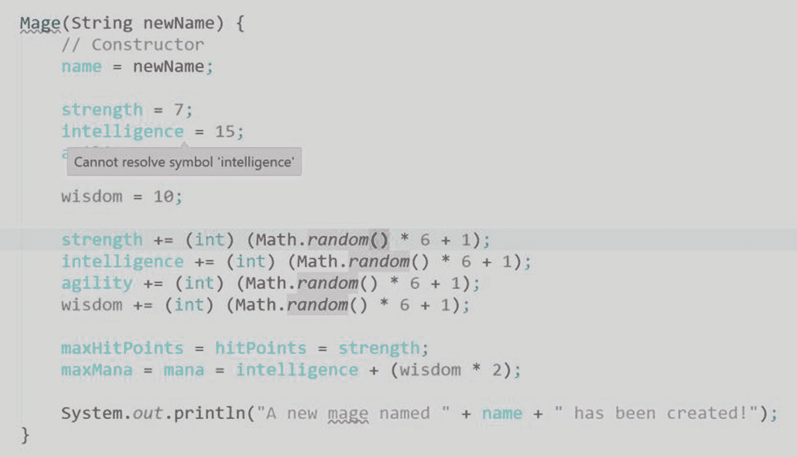

我们需要明确地定义我们是在 `PlayerCharacter` 类的基础上构建 `Mage` 类。这可以通过修改类的第一行定义来实现。

当你基于另一个类进行构建时，实际上是在扩展它，因此我们需要将第一行改为：

```
public class Mage extends PlayerCharacter {
```

完成此操作后，之前看到的所有错误都会消失，因为 `PlayerCharacter` 类中的所有内容现在都已包含在 `Mage` 类中：

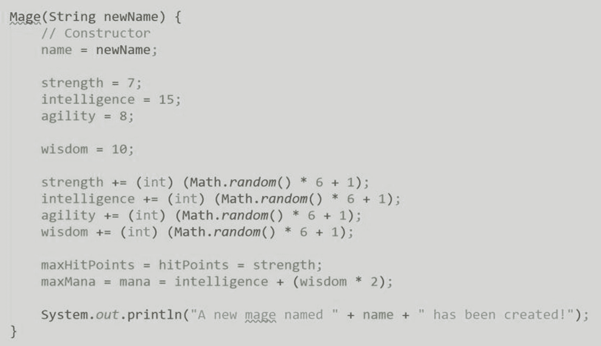

现在，让我们转到 `Fighter` 类。我们将顶部的类定义修改为包含 `PlayerCharacter` 类，将第一行改为：

```
public class Fighter extends PlayerCharacter {
```

现在，我们可以移除那些已经存在于 `PlayerCharacter` 类中的内容：

```
public class Fighter extends PlayerCharacter {
// 技能属性
public int constitution;
Fighter(String newName) {
// 构造方法
name = newName;
strength = 15;
intelligence = 7;
agility = 8;
constitution = 10;
strength += (int) (Math.random() * 6 + 1);
intelligence += (int) (Math.random() * 6 + 1);
agility += (int) (Math.random() * 6 + 1);
constitution += (int) (Math.random() * 6 + 1);
maxHitPoints = hitPoints = (strength * 2) + (constitution * 2);
maxMana = mana = 0;
System.out.println("一位名为 " + name + " 的新战士已被创建！");
}
public void showStats() {
System.out.println("””””””””””””””””””””””””””””””””””");
System.out.println(name + ", 战士:");
System.out.println("    力量: " + strength);
System.out.println("    智力: " + intelligence);
System.out.println("    敏捷: " + agility);
System.out.println("    体质: " + constitution);
System.out.println("  生命值: " + hitPoints + " / " + maxHitPoints);
System.out.println("    法力: " + mana + " / " + maxMana);
System.out.println();
}
}
```

一切看起来都很好，那么让我们转到 `Main` 类，更新 `main()` 方法，创建 `Mage` 和 `Fighter` 类的两个实例：

```
public class Main {
public static void main(String[] args) {
Mage myMage = new Mage("Francisco");
myMage.showStats();
Mage myOtherMage = new Mage("Jaana");
myOtherMage.showStats();
Fighter myFighter = new Fighter("Dupre");
myFighter.showStats();
Fighter myOtherFighter = new Fighter("Sentri");
myOtherFighter.showStats();
}
}
```

现在让我们运行并查看输出结果。请记住，这些值是使用随机数生成的，因此结果会有所不同：

```
一个新的玩家角色已被创建！
一位名为 Francisco 的新法师已被创建！
””””””””””””””””””””””””””””””””””
Francisco, 法师:
    力量: 12
    智力: 17
    敏捷: 9
    智慧: 16
  生命值: 12 / 12
    法力: 49 / 49
一个新的玩家角色已被创建！
一位名为 Jaana 的新法师已被创建！
””””””””””””””””””””””””””””””””””
Jaana, 法师:
    力量: 12
    智力: 16
    敏捷: 11
    智慧: 15
  生命值: 12 / 12
    法力: 46 / 46
一个新的玩家角色已被创建！
一位名为 Dupre 的新战士已被创建！
””””””””””””””””””””””””””””””””””
Dupre, 战士:
    力量: 18
    智力: 9
    敏捷: 12
    体质: 12
  生命值: 60 / 60
    法力: 0 / 0
一个新的玩家角色已被创建！
一位名为 Sentri 的新战士已被创建！
””””””””””””””””””””””””””””””””””
Sentri, 战士:
    力量: 18
    智力: 12
    敏捷: 13
    体质: 11
  生命值: 58 / 58
    法力: 0 / 0
进程已结束，退出代码 0
```

你会看到一切正常，与我们之前所做的几乎相同，只有一个主要区别。你会看到在每个新实例被创建时，其顶部都有一行新的输出：“一个新的玩家角色已被创建！”。

这行代码位于我们的 `PlayerCharacter` 类构造方法中。当我们创建一个基于另一个类构建的类时，它会先运行基类构造方法的内容，然后再运行它所基于的类中的代码。

但是，如果我们尝试对 `showStats()` 方法进行同样的操作，则不会发生相同的行为。例如，修改 `PlayerCharacter` 的 `showStats()` 方法，向输出控制台添加一条新语句：

```
public class PlayerCharacter {
// 名称
public String name;
// 技能属性
public int strength;
public int intelligence;
public int agility;
// 生命值与魔法值
public int maxHitPoints;
public int hitPoints;
public int maxMana;
public int mana;
PlayerCharacter() {
System.out.println("一个新的玩家角色已被创建！");
}
public void showStats() {
System.out.println("以下是 " + name + " 的属性：");
}
}
```


如果你再次运行程序，`PlayerCharacter` 类中 `showStats()` 方法的代码将永远不会显示。当你基于一个类进行构建，并希望运行其所基于的方法中的代码时，你需要明确声明你想要运行它。而构造函数会自动运行基类中的代码，无需你做任何操作。

要调用基类对应方法中的代码，你需要使用 `super` 语句。让我们更新 `Mage` 类来看看这是如何工作的：

```
public class Mage extends PlayerCharacter {
// 技能属性
public int wisdom;
Mage(String newName) {
// 构造函数
name = newName;
strength = 7;
intelligence = 15;
agility = 8;
wisdom = 10;
strength += (int) (Math.random() * 6 + 1);
intelligence += (int) (Math.random() * 6 + 1);
agility += (int) (Math.random() * 6 + 1);
wisdom += (int) (Math.random() * 6 + 1);
maxHitPoints = hitPoints = strength;
maxMana = mana = intelligence + (wisdom * 2);
System.out.println("一个名为 " + name + " 的新法师已被创建！");
}
public void showStats() {
super.showStats();
System.out.println("””””””””””””””””””””””””””””””””””");
System.out.println(name + "，一位法师：");
System.out.println("    力量: " + strength);
System.out.println("    智力: " + intelligence);
System.out.println("    敏捷: " + agility);
System.out.println("    智慧: " + wisdom);
System.out.println("    生命值: " + hitPoints + " / " + maxHitPoints);
System.out.println("    法力值: " + mana + " / " + maxMana);
System.out.println();
}
}
```

你会看到 `showStats()` 方法开头有一个调用：

```
super.showStats();
```

这会转到该类所继承的类并执行该方法。如果我们运行这个程序，就能看到它是如何工作的：

```
一个新的玩家角色已被创建！
一个名为 Francisco 的新法师已被创建！
以下是 Francisco 的属性：
””””””””””””””””””””””””””””””””””
Francisco，一位法师：
力量: 13
智力: 19
敏捷: 12
智慧: 16
生命值: 13 / 13
法力值: 51 / 51
一个新的玩家角色已被创建！
一个名为 Jaana 的新法师已被创建！
以下是 Jaana 的属性：
””””””””””””””””””””””””””””””””””
Jaana，一位法师：
力量: 9
智力: 18
敏捷: 12
智慧: 15
生命值: 9 / 9
法力值: 48 / 48
一个新的玩家角色已被创建！
一个名为 Dupre 的新战士已被创建！
””””””””””””””””””””””””””””””””””
Dupre，一位战士：
力量: 18
智力: 8
敏捷: 13
体质: 16
生命值: 68 / 68
法力值: 0 / 0
一个新的玩家角色已被创建！
一个名为 Sentri 的新战士已被创建！
””””””””””””””””””””””””””””””””””
Sentri，一位战士：
力量: 18
智力: 9
敏捷: 9
体质: 13
生命值: 62 / 62
法力值: 0 / 0
进程已结束，退出代码 0
```

如果你注意到了，只有被创建的法师显示了“以下是……的属性”这一行。那是因为我们只在 `Mage` 类中添加了 `super.showStats()` 调用，而没有在 `Fighter` 类中添加。当你像这样创建继承其他类的类时，你就是在创建一个类层次结构。基类被称为超类。你创建的继承超类的类被称为子类。

所以，在我们的例子中，`PlayerCharacter` 是超类。`Mage` 和 `Fighter` 是 `PlayerCharacter` 超类的子类。

当我们使用 `super` 语句时，我们是在请求超类做一些事情，在这个例子中，就是请求 `PlayerCharacter` 类。

你可以根据需要创建任意多个超类的子类，并且可以继续按需扩展类。

56. 我不收集那些；太抽象了

当你玩角色扮演游戏时，你会和其他人组成一个团队一起行动。这可能是与现实中同一房间的其他玩家，或者是电脑游戏中的模拟角色。一个队伍就是一个集合，一群有共同点的人。

在 Java 中，我们可以使用数组或 `ArrayList` 来创建集合。这些集合可以包含任何东西，我们可以用它们来创建我们自己通过类定义的事物的集合。Java 集合并不局限于核心语言中的事物——它们可以是我们自己自定义类中创建的对象的实例。

这里有一个例子，在我们的程序中，我们可以创建一个游戏角色集合，称为 party：

```
import java.util.ArrayList;
public class Main {
public static ArrayList party;
public static void main(String[] args) {
party = new ArrayList();
party.add(new Mage("Jaana"));
party.add(new Mage("Antos"));
}
}
```

在这个例子中，我们现在有了一个名为 party 的集合，它包含了两个 `Mage` 类的实例。派对开始！嗯——还不完全是。

当我们创建一个没有泛型的 `ArrayList` 时，我们是将集合类型指定为 `Object`，这意味着任何东西都可以添加到其中，包括数字、字符串或 Java 中的任何对象。这也意味着我们无法访问 `Mage` 类特有的方法，比如 `showStats()`。所以如果我们尝试添加这一行：

```
party.get(0).showStats();
```

我们会得到一个错误，因为它在定义集合的类（即 `Object` 类）中找不到该方法。

但是，我们可以解决这个问题。使用泛型，我们可以将 `ArrayList` 集合的类型指定为 `Mage` 类型，这样我们就可以访问 `Mage` 的方法了。我们可以将代码更新为如下所示：

```
import java.util.ArrayList;
public class Main {
public static ArrayList party;
public static void main(String[] args) {
party = new ArrayList();
party.add(new Mage("Jaana"));
party.add(new Mage("Antos"));
}
}
```

现在我们可以使用 `Mage` 类中的方法了，我们甚至可以使用 `for...each` 循环来遍历集合中的每个对象：

```
import java.util.ArrayList;
public class Main {
public static ArrayList party;
public static void main(String[] args) {
party = new ArrayList();
party.add(new Mage("Jaana"));
party.add(new Mage("Antos"));
for (Mage pc : party)
pc.showStats();
}
}
```

当我运行这段代码时，我可以得到集合中两个 `Mage` 类实例各自的输出：

```
一个新的玩家角色已被创建！
一个名为 Jaana 的新法师已被创建！
一个新的玩家角色已被创建！
一个名为 Antos 的新法师已被创建！
以下是 Jaana 的属性：

Jaana，一位法师：
力量: 13
智力: 21
敏捷: 10
智慧: 14
生命值: 13 / 13
法力值: 49 / 49
以下是 Antos 的属性：

Antos，一位法师：
力量: 9
智力: 20
敏捷: 13
智慧: 15
生命值: 9 / 9
法力值: 50 / 50
进程已结束，退出代码 0
```

但我们仍然有一个问题。其他类怎么办？如果我想要创建一个 `Fighter` 并将其添加到集合中，我做不到：

```
party.add(new Fighter("Sentri"));
```

下面的代码会给我一个错误，因为 `ArrayList` 集合被明确指定为 `Mage` 类型。那么我们该如何解决这个问题呢？

我们需要回想一下我们是如何构建 `Mage`、`Fighter` 以及其他潜在类的。我们构建它们是为了继承 `PlayerCharacter` 类，那么，考虑到这一点，`Mage` 和 `Fighter` 是什么？它们是 `PlayerCharacters`！我们可以使用超类作为工具，将任何集合或对象的类型指定为接受继承它的任何子类。我们还需要更新我们的 `for...each` 循环，因为它需要在集合中查找 `PlayerCharacters`，而不是像 `Mage` 类这样的特定类。


```
import java.util.ArrayList;
public class Main {
public static ArrayList party;
public static void main(String[] args) {
party = new ArrayList();
party.add(new Mage("Jaana"));
party.add(new Mage("Antos"));
party.add(new Fighter("Sentri"));
for (PlayerCharacter pc : party)
pc.showStats();
}
}
```

现在，通过将集合类型指定为超类，我们可以在集合中支持多种角色类型。该集合现在可以容纳`Mage`和`Fighter`实例，因为它们都继承了`PlayerCharacter`超类。

不过有一点需要注意。我们在`for...each`循环中调用的`showStats()`方法之所以能正常工作，是因为它定义在超类中。如果`PlayerCharacter`中没有这个方法，我们就无法使用它。因此，如果你知道子类中会有某个方法，并且需要将集合和对象类型指定为超类，那么预先创建空方法会很有帮助，这样你就可以使用它们了。

但是，我们还有一个问题。该集合现在可以支持任何继承自`PlayerCharacter`的类——但这包括`PlayerCharacter`类本身。我们设计`PlayerCharacter`的目的是让它作为构建`Mage`、`Fighter`等其他类的基础。我们不希望能够创建`PlayerCharacter`的实例：

```
import java.util.ArrayList;
public class Main {
public static ArrayList party;
public static void main(String[] args) {
party = new ArrayList();
party.add(new Mage("Jaana"));
party.add(new Mage("Antos"));
party.add(new Fighter("Sentri"));
party.add(new PlayerCharacter());
for (PlayerCharacter pc : party)
pc.showStats();
}
}
```

在这个例子中，我们可以创建一个`PlayerCharacter`的实例，而这并非我们的本意。结果，当我们运行程序时，末尾会出现一些奇怪的输出：

```
A new player character has been created!
A new mage named Jaana has been created!
A new player character has been created!
A new mage named Antos has been created!
A new player character has been created!
A new fighter named Sentri has been created!
A new player character has been created!
Here are the stats for, Jaana

Jaana, a mage:
Strength: 12
Intelligence: 17
Agility: 10
Wisdom: 12
Hit Points: 12 / 12
Mana: 41 / 41
Here are the stats for, Antos

Antos, a mage:
Strength: 9
Intelligence: 16
Agility: 13
Wisdom: 12
Hit Points: 9 / 9
Mana: 40 / 40

Sentri, a fighter:
Strength: 18
Intelligence: 9
Agility: 9
Constitution: 12
Hit Points: 60 / 60
Mana: 0 / 0
Here are the stats for, null
Process finished with exit code 0
```

我们需要找到一种方法，让`PlayerCharacter`类存在，但阻止程序允许我们创建它的实例。答案是将其设为抽象类。在类定义的第一行添加`abstract`关键字即可：

```
public abstract class PlayerCharacter {
// Name
public String name;
// Skill attributes
public int strength;
public int intelligence;
public int agility;
// Health and magic
public int maxHitPoints;
public int hitPoints;
public int maxMana;
public int mana;
PlayerCharacter() {
System.out.println("A new player character has been created!");
}
public void showStats() {
System.out.println("Here are the stats for, " + name);
}
}
```

现在类被定义为抽象类，我们可以继承它来构建子类，但无法单独创建它的实例：

```
party.add(new PlayerCharacter());
```

因此，这行代码现在会生成一个错误，指出该类是抽象的，无法实例化。不过，我们仍然可以将集合和其他对象的类型指定为它——这是完全合法的——因为我们并没有创建`PlayerCharacter`类的新实例；只是允许它的子类与之协同工作。

57. 访问被拒绝：受保护与私有

当我们创建类时，我们是在为每个实例如何运作以及包含哪些数据创建蓝图。它还定义了程序员如何访问这些数据的规则，并为其内部的字段提供保护。

在深入代码之前，让我们回顾一下角色扮演游戏的例子。当玩家完成某些活动，比如击败敌人、完成任务或获得关键物品时，他们会获得经验值（XP）。这些点数决定了你的角色等级，每升一级，你就可以在游戏中用你的角色做更多的事情。

此外，当玩家升级时，他们的某项技能属性（如力量、敏捷、智力等）通常也会提升。这进而会影响角色的生命值和魔法值，因为这些值是根据属性计算得出的。但需要注意的是，升级过程只有在经验值超过某个阈值时才会发生。

因此，我们将创建添加经验值、升级、升级时提升属性以及升级时重新计算生命值和魔法值的功能。

这些规则的具体运作方式因游戏而异，因此在本例中，我们将保持相对简单。玩家从零经验值和一级开始。每获得 1000 经验值，玩家就会升一级。当角色升级时，玩家职业的某项技能属性（例如力量）会增加一点。当属性增加时，最大生命值和法力值会被重新计算并补满。

这个例子需要对现有代码进行更多重构。因此，请仔细跟随我们完成这个例子。

我们需要做的第一件事是为角色的经验值和等级添加字段。由于这些对所有角色都是通用的，我们可以将它们放在`PlayerCharacter`类中：

```
public abstract class PlayerCharacter {
// Name
public String name;
// Skill attributes
public int strength;
public int intelligence;
public int agility;
// Health and magic
public int maxHitPoints;
public int hitPoints;
public int maxMana;
public int mana;
// Experience
public int xp;
public int level;
PlayerCharacter() {}
public void showStats() {}
}
```

有了这两个值，我们现在就可以开始存储角色的经验值了。

但我想退一步思考一下我们是如何创建这个类的。在所有这些字段中，我们都将它们定义为`public`。当一个字段、方法或类成员被定义为`public`时，意味着它们可以通过类实例完全访问。因此，没有什么能阻止我这样做：

```
Fighter pc = new Fighter("Dupre");
pc.level = 100;
```

我们不希望这种情况发生。事实上，我们不希望我们的任何属性在程序中可以被公开访问和修改。这种修改能力应该只存在于类内部。

实现这一点的方法是将关键字`public`改为`private`。这将使类成员只能在类内部访问，并阻止外部访问。因此，我们可以修改程序，将这些字段设为私有：

```
// Experience
private int xp;
private int level;
```

现在，`private`语句使得这些字段只能在类内部工作。因此，之前我们能够公开访问`level`字段的例子将会产生错误。

有一个问题存在，但目前还不明显。让我们添加一些代码来展示这个问题。

`Fighter`类继承自`PlayerCharacter`，而`showStats()`方法会在屏幕上显示角色的属性：


```java
public class Fighter extends PlayerCharacter {
// 技能属性
public int constitution;
Fighter(String newName) {
// 构造方法
name = newName;
strength = 15;
intelligence = 7;
agility = 8;
constitution = 10;
strength += (int) (Math.random() * 6 + 1);
intelligence += (int) (Math.random() * 6 + 1);
agility += (int) (Math.random() * 6 + 1);
constitution += (int) (Math.random() * 6 + 1);
maxHitPoints = hitPoints = (strength * 2) + (constitution * 2);
maxMana = mana = 0;
System.out.println("已创建一位名为 " + name + " 的新战士！");
}
public void showStats() {
System.out.println("----------------------------------");
System.out.printf("%s，一位战士：\n", name );
System.out.printf("力量：%d | 智力：%d | 敏捷：%d | 体质：%d | 生命值：%d / %d | 魔法值：%d / %d\n",
strength, intelligence, agility, constitution, hitPoints,maxHitPoints,mana,maxMana);
System.out.println();
}
}
```

我们可以更新这段代码，使其显示玩家的经验和等级：

```java
public void showStats() {
System.out.println("----------------------------------");
System.out.printf("%s，一位等级 %d 的战士，拥有 %d 经验值：\n", name, level, xp );
System.out.printf("力量：%d | 智力：%d | 敏捷：%d | 体质：%d | 生命值：%d / %d | 魔法值：%d / %d\n",
strength, intelligence, agility, constitution, hitPoints,maxHitPoints,mana,maxMana);
System.out.println();
}
```

如果我们添加这段代码来显示等级和经验字段，就会收到一个错误。这是因为它们在父类 `PlayerCharacter` 中被声明为 `private`，子类无法访问它们。这些字段只能在 `PlayerCharacter` 类的实例内部访问，但由于我们将该类设为抽象类，因此无法创建其实例。

解决方法是使用 `protected` 语句来代替 `private`。被声明为 `protected` 的成员可以在定义它们的类以及继承它们的子类中访问。因此，我们需要返回去将其改为 `protected`，并且可以对所有其他属性也进行同样的操作：

```java
public abstract class PlayerCharacter {
// 名称
protected String name;
// 技能属性
protected int strength;
protected int intelligence;
protected int agility;
// 生命值与魔法值
protected int maxHitPoints;
protected int hitPoints;
protected int maxMana;
protected int mana;
// 经验值
protected int xp;
protected int level;
PlayerCharacter() {}
public void showStats() {}
}
```

现在所有角色属性都变成了 `protected`，这意味着它们只能在类内部或任何继承它的子类中访问。

我们需要更新 `Fighter` 类，将其独有的属性（本例中为 `constitution` 字段）设为 `private`。为什么用 `private`？因为这个类不会被继承，所以我们可以对 `Fighter` 类使用 `private`：

```java
// 技能属性
private int constitution;
```

然后，我们可以在 `Fighter` 类的构造方法中添加对经验值和等级属性的支持：

```java
Fighter(String newName) {
// 构造方法
name = newName;
strength = 15;
intelligence = 7;
agility = 8;
constitution = 10;
strength += (int) (Math.random() * 6 + 1);
intelligence += (int) (Math.random() * 6 + 1);
agility += (int) (Math.random() * 6 + 1);
constitution += (int) (Math.random() * 6 + 1);
maxHitPoints = hitPoints = (strength * 2) + (constitution * 2);
maxMana = mana = 0;
xp = 0;
level = 1;
System.out.println("已创建一位名为 " + name + " 的新战士！");
}
```

现在字段已经可用，我们可以定义方法来增加角色实例的经验值。我们可以为 `Fighter` 类创建一个名为 `addXP()` 的新方法。我们希望将此方法设为 `public`，因为我们需要在主程序中使用类的每个实例来访问它：

```java
public void addXP(int deltaXP) {
if (deltaXP < 0) {
System.out.println("错误：无效的经验值增量");
return;
}
xp += deltaXP;
level = (int) (xp / 1000) + 1;
}
```

我们这样设计是为了给程序提供一些保护。`addXP()` 方法接受一个整数值，表示要增加的经验值数量。然后我们使用一个条件语句来确保该值大于或等于零。这一点很重要，因为我们正在创建一种安全的方式来操作 `xp` 字段的值，而无需提供完全的公共访问权限。同时，我们也创建了一种方式，通过单个操作来控制多个字段的值如何受到影响。这是一种常见做法，即通过公共方法提供对类实例中 `private` 或 `protected` 字段的访问。在本例中，我们增加 `xp` 值，并根据之前定义的规则设置等级。

在这个方法中，我们还需要一种方式，在玩家获得足够经验值时触发其升级。因此，我们可以添加一个新方法来实现这一点；我们将其命名为 `levelUp()`。但在构建它之前，我们需要考虑它的使用方式。我们希望确保 `levelUp()` 方法是 `private` 的，因为我们不希望公开触发它的能力。我们只希望该方法在类实例内部可用。方法可以像字段一样被定义为 `public`、`private` 或 `protected`。因此，我们可以这样编写代码：

```java
public void addXP(int deltaXP) {
if (deltaXP = deltaXP)
levelUp();
}
private void levelUp() {
int attribute = (int) (Math.random() * 4);
if (attribute == 0) strength++;
if (attribute == 1) intelligence++;
if (attribute == 2) agility++;
if (attribute == 3) constitution++;
}
```

现在我们已经创建了角色升级的功能。我们首先接受经验值的增加，然后执行一个名为 `levelUp()` 的私有方法。它会随机选择一个属性，并将其值增加 1。

接下来我们需要做的是重新计算生命值和魔法值。这些计算在构造方法中定义，但我们可以将它们提取出来，创建一个私有方法，以便在程序中的多个位置访问这些规则：

```java
public class Fighter extends PlayerCharacter {
// 技能属性
public int constitution;
Fighter(String newName) {
// 构造方法
name = newName;
strength = 15;
intelligence = 7;
agility = 8;
constitution = 10;
strength += (int) (Math.random() * 6 + 1);
intelligence += (int) (Math.random() * 6 + 1);
agility += (int) (Math.random() * 6 + 1);
constitution += (int) (Math.random() * 6 + 1);
xp = 0;
level = 1;
calcHPMP();
System.out.println("已创建一位名为 " + name + " 的新战士！");
}
public void showStats() {
System.out.println("----------------------------------");
System.out.printf("%s，一位等级 %d 的战士，拥有 %d 经验值：\n", name, level, xp );
System.out.printf("力量：%d | 智力：%d | 敏捷：%d | 体质：%d | 生命值：%d / %d | 魔法值：%d / %d\n",
strength, intelligence, agility, constitution, hitPoints,maxHitPoints,mana,maxMana);
System.out.println();
}
public void addXP(int deltaXP) {
int oldLevel = level;
if (deltaXP < 0) {
System.out.println("错误：无效的经验值增量");
return;
}
xp += deltaXP;
level = (int) (xp / 1000) + 1;
if (oldLevel != level)
levelUp();
}
private void levelUp() {
int attribute = (int) (Math.random() * 4);
if (attribute == 0) strength++;
if (attribute == 1) intelligence++;
if (attribute == 2) agility++;
if (attribute == 3) constitution++;
calcHPMP();
}
private void calcHPMP() {
maxHitPoints = hitPoints = (strength * 2) + (constitution * 2);
maxMana = mana = 0;
}
}
```


最后我们需要考虑的是如何构建我们的**集合**，也就是我们的队伍。由于我们将所有内容都向上转型为超类，我们需要确保在子类中访问的方法在超类中都有存根。这适用于`addXP()`方法。
由于错误检查和整体数值调整是通用的，我们可以将它们移到超类中。对`levelUp()`的调用则需要保留在子类中，因为我们调用的是该类私有的方法，在本例中即`Fighter`类。

所以在`Fighter`类中，我们会将其改为：

```
public void addXP(int deltaXP) {
int oldLevel = level;
super.addXP(deltaXP);
if (oldLevel != level)
levelUp();
}
```

然后在`PlayerCharacter`类中，我们会添加：

```
protected void addXP(int deltaXP) {
if (deltaXP < 0) {
System.out.println("ERROR: Invalid experience delta value");
return;
}
xp += deltaXP;
level = (int) (xp / 1000) + 1;
}
```

创建好这些之后，我们就可以让它们运行起来了。我们可以创建一个只有一个角色的队伍，然后运行一个循环，每次添加随机数量的经验值，看看一切是否正常。

在我们的`Main`类中，我们可以这样构建队伍并运行循环：

```
import java.util.ArrayList;
public class Main {
public static ArrayList party;
public static void main(String[] args) {
party = new ArrayList();
party.add(new Fighter("Sentri"));
for (PlayerCharacter pc : party)
pc.showStats();
int turns = 10;
for (int i = 1; i <= turns; i++)
{
System.out.println("Turn #"+ i);
for (PlayerCharacter pc : party)
{
pc.addXP((int) (Math.random() * 1000));
pc.showStats();
}
}
}
}
```

现在，我们的程序将创建一个单人队伍，然后在十轮中，每轮添加一个随机数量的经验值，并在每轮之后显示状态。如果一切正常，我们应该会看到经验值、等级、属性以及魔法/生命值随时间增长：

```
A new fighter named Sentri has been created!

Sentri, a level 1 fighter with 0 XP:
STR: 19 | INT: 11 | AGI: 11 | CON: 13 | HP: 64 / 64 | MP: 0 / 0
Turn #1

Sentri, a level 1 fighter with 523 XP:
STR: 19 | INT: 11 | AGI: 11 | CON: 13 | HP: 64 / 64 | MP: 0 / 0
Turn #2

Sentri, a level 2 fighter with 1278 XP:
STR: 19 | INT: 11 | AGI: 12 | CON: 13 | HP: 64 / 64 | MP: 0 / 0
Turn #3

Sentri, a level 3 fighter with 2068 XP:
STR: 19 | INT: 11 | AGI: 13 | CON: 13 | HP: 64 / 64 | MP: 0 / 0
Turn #4

Sentri, a level 3 fighter with 2957 XP:
STR: 19 | INT: 11 | AGI: 13 | CON: 13 | HP: 64 / 64 | MP: 0 / 0
Turn #5

Sentri, a level 4 fighter with 3124 XP:
STR: 19 | INT: 11 | AGI: 14 | CON: 13 | HP: 64 / 64 | MP: 0 / 0
Turn #6

Sentri, a level 4 fighter with 3413 XP:
STR: 19 | INT: 11 | AGI: 14 | CON: 13 | HP: 64 / 64 | MP: 0 / 0
Turn #7

Sentri, a level 5 fighter with 4210 XP:
STR: 19 | INT: 11 | AGI: 14 | CON: 14 | HP: 66 / 66 | MP: 0 / 0
Turn #8

Sentri, a level 5 fighter with 4402 XP:
STR: 19 | INT: 11 | AGI: 14 | CON: 14 | HP: 66 / 66 | MP: 0 / 0
Turn #9

Sentri, a level 6 fighter with 5393 XP:
STR: 20 | INT: 11 | AGI: 14 | CON: 14 | HP: 68 / 68 | MP: 0 / 0
Turn #10

Sentri, a level 6 fighter with 5414 XP:
STR: 20 | INT: 11 | AGI: 14 | CON: 14 | HP: 68 / 68 | MP: 0 / 0
Process finished with exit code 0
```

在这个例子中，我们可以看到等级在第 2、3、5、7 和 9 轮提升了。属性也随之增加，当体质和力量属性在第 7 和第 9 轮提升时，生命值也增加了。

最后，作为测试，我们可以确认我们的错误处理程序也能正常工作。如果我们向程序添加以下代码行：

```
party.get(0).addXP(-100);
```

那么程序输出中将会得到以下错误代码：

```
ERROR: Invalid experience delta value
```

虽然让程序中的所有内容都保持`public`似乎是最简单的，但这可能导致不可预测的结果，并使你的程序更难使用和构建。使用`private`和`protected`语句，你可以防止类成员（如字段和方法）被外部访问，并确保你的程序按照你设计的方式运行。

58. 通过接口进行交互

当我们最初定义游戏时，我们创建了队伍的概念。在许多角色扮演游戏中，队伍是一组活跃的玩家，他们一起完成任务、击败敌人并在游戏中推进。
我们将队伍定义为需要三种类型的角色。第一种是坦克，这是一种能够承受大量伤害但只能进行近程攻击的角色。第二种是远程，这是一种不能承受大量伤害但可以从远处攻击的角色。最后一种是治疗者，它可以治疗其他队伍成员所受的伤害。
有趣的是，这些类型可以适用于不止一种角色职业。以圣骑士职业为例，它既是坦克又是治疗者，因此我们需要一种方法来创建角色职业的实例，同时又能对它们进行分类，以便它们可以在类型化的容器中与其他职业互换。

我们有一个基本的`ArrayList`来容纳我们的队伍，但让我们创建一个新的类来处理我们所有的队伍特性：

```
public class Party {
Party() {}
}
```

在这个类内部，我们需要为构成队伍的每种角色类型创建变量。让我们从坦克开始。我们可以创建一个类作用域的变量，命名为`tank`，并将其类型指定为`PlayerCharacter`类：

```
public class Party {
PlayerCharacter tank;
Party() {}
}
```

虽然这不会产生任何语法或运行时错误，但它违背了我们为这个类制定的规则。我们只允许两种角色类型作为坦克：圣骑士和战士。那么，我们如何创建一种只针对这两种类型进行类型化的方法呢？
答案是创建一个接口。
接口是独立的 Java 文件，你可以将其应用于类或由类实现。这告诉 Java，该类应用了接口定义的所有要求，然后你就可以对容器、集合或任何可以类型化为接口的东西进行类型化。

创建接口需要在我们程序中新建一个文件；我们将创建一个名为`Tank.java`的文件。如果你使用的是 IDE，请确保将其创建为接口文件，而不是类文件：

```
public interface Tank {
}
```

这不是一个类，而是一个接口，由第一行的`interface`子句定义。
接口的构建方式与类不同。接口没有构造函数，你只需要提供实现该接口的类为了使其“合法”实现而必须拥有的公共方法。这些方法不需要包含任何代码，也不需要包含访问修饰符；它只是作为一个引用检查，供 Java 知道你所创建并分配给接口类型化容器的内容是有效的。

我们的`Fighter`和`Paladin`类包含两个公共方法：`showStats()`和`addXP()`，因此我们需要在接口中添加这些定义：

```
public interface Tank {
void showStats();
void addXP(int deltaXP);
}
```

这就是我们需要在接口文件中创建的全部内容，但现在我们需要在一个类上实现它。让我们从`Fighter`开始。
要实现一个接口，你需要在代码的第一行添加`implements`语句和你正在应用于该类的接口名称：

```
public class Fighter extends PlayerCharacter implements Tank {
```

就是这样！现在我们可以回到我们的`Party`类，并将其类型化为我们的新接口：

```
public class Party {
Tank tank;
Party() {}
}
```

你会看到代码没有显示任何错误，并且新的容器将接受任何实现了`Tank`接口的内容。

我们可以用同样的方式更新`Paladin`类：


```
public class Paladin extends PlayerCharacter implements Tank {
```

当你实现一个接口时，一个类可以实现多个接口。因此对于圣骑士来说，当创建了治疗者接口后，你可以在坦克接口后面添加它，并在两者之间加上逗号。

现在我们可以创建战士和圣骑士的实例，并将其包含在我们的程序中：

```
public class Party {
Tank tank;
Party() {
tank = new Fighter("Sentri");
tank = new Paladin("Dupre");
tank = new Mage("Jaana");
}
}
```

在上述代码中，战士和圣骑士的实例是合法的，因为它们实现了坦克接口。然而，法师会产生错误，因为该类没有实现该接口。

现在我们可以为队伍类创建公有和私有访问修饰符。首先，我们需要将容器设为私有，然后创建一个公有方法，允许我们将角色添加到队伍的空位中：

```
public class Party {
private Tank tank;
Party() {}
public void addTank(Tank pc) {
tank = pc;
System.out.println("Tank added to party.");
}
}
```

现在我们可以用新的队伍类替换主类中的代码：

```
public class Main {
public static void main(String[] args) {
Party myParty = new Party();
myParty.addTank(new Fighter("Sentri"));
}
}
```

如果我们运行这个程序，将会看到以下消息：

```
A new fighter named Sentri has been created!
Tank added to party.
Process finished with exit code 0
```

接口可以被视为类的分类。你在接口中定义这些分类的要求，然后通过让类实现该接口，告诉它们属于这个分类。

59. 我得到的全是静态内容

当我们处理类及其实例时，会有一些成员（即字段和方法）专属于每个实例，但它们由类定义。有时我们可能希望某些字段和方法在所有类实例中保持一致，或者希望有一种无需创建实例就能从类中调用方法的方式。这可以通过在类中创建静态字段和方法来实现。

在我们的程序中，法师、圣骑士、牧师和战士这些角色子类，都是通过将虚拟骰子的数值加到基础值上来构建技能属性值的。我们可以将这些代码放入一个名为骰子的类中，然后创建一个静态方法，这样就不需要创建骰子类的实例了。当你需要创建在程序中作为工具且通用的方法，但又不需要实例就能调用它们时，这非常有用。

我们像创建之前的类一样，先创建一个骰子类：

```
public class Die {
public static int roll(int d) {
int num = (int) (Math.random() * d) + 1;
return num;
}
}
```

我们在这里创建的方法 `roll`，在 `public` 之后使用了 `static` 关键字进行定义。这使得任何从骰子类本身（而非实例）调用该方法的人都能使用它。

因此，在我们的法师类中，例如，我们现在可以在构造函数中调用这个方法，并传入这个虚拟骰子的面数：

```
Mage(String newName) {
super();
// 构造函数
name = newName;
strength = 7;
intelligence = 15;
agility = 8;
wisdom = 10;
strength += Die.roll(6);
intelligence += Die.roll(6);
agility += Die.roll(6);
wisdom += Die.roll(6);
calcHPMP();
xp = 0;
level = 1;
System.out.println("A new mage named " + name + " has been created!");
}
```

我们不需要创建骰子类的实例，只需直接调用该类中定义的静态方法即可。

现在，如果我愿意，我随时可以创建骰子类的实例：

```
Die myDie = new Die();
int val = myDie.roll(6);
```

但并没有强烈的必要去创建这个类的实例。为了防止这种情况，我们可以将类重新定义为抽象类。这样，我们就不会无意中创建它的实例，同时仍然可以访问各种静态方法，这些方法可以作为工具在我们的程序中使用。

但我们也可以在类中创建静态字段。静态字段与常规字段的不同之处在于，其值在类的所有实例中都是相同的。例如，如果我们创建两个法师，每个法师的能力属性、经验值以及其他内部数值都是唯一的。如果我们在法师类中创建一个静态字段，当我们更改该值时，它在类的所有实例中都会保持一致。

在我们的程序中，我们可以创建一个静态变量，用于存储游戏中已创建的角色数量。我们可以在玩家角色超类中定义它，这样它就会为每个继承自该类的类实例进行计数。

我们像在骰子类中一样使用 `static` 关键字，但这次我们创建的是一个字段。由于我们希望所有子类都能访问它，我们使用 `protected` 访问修饰符：

```
public abstract class PlayerCharacter {
// 名称
protected String name;
// 技能属性
protected int strength;
protected int intelligence;
protected int agility;
// 生命值和魔法值
protected int maxHitPoints;
protected int hitPoints;
protected int maxMana;
protected int mana;
// 经验值
protected int xp;
protected int level;
// 玩家数量
protected static int pcCount = 0;
PlayerCharacter() {}
protected void showStats() {}
protected void addXP(int deltaXP) {
if (deltaXP < 0) {
System.out.println("ERROR: Invalid experience delta value");
return;
}
xp += deltaXP;
level = (int) (xp / 1000) + 1;
}
}
```

这个字段的目的是保存游戏中角色的总数。因此，我们可以在每次运行玩家角色构造函数时递增该值，因为实例化时它会与子类的构造函数一起运行：

```
PlayerCharacter() {
pcCount++;
}
```

由于我们在构造函数中执行此操作，我需要确保在构造之前定义 `pcCount` 的值，这就是为什么它在类的顶部定义。

接下来，我可以创建一个静态方法，当程序询问时返回该值。由于我需要子类（因为它们是实际被实例化的类）能够访问它，我需要将其标记为 `protected` 和 `static`：

```
protected static int numPC() {
return pcCount;
}
```

现在，这个方法可以从任何实例或超类本身调用。让我们测试一下，看看它是如何工作的。我们可以像这样更新主类：

```
public class Main {
public static void main(String[] args) {
Party myParty = new Party();
myParty.addTank(new Fighter("Sentri"));
myParty.addRange(new Mage("Jaana"));
myParty.addHealer(new Paladin("Dupre"));
PlayerCharacter p1 = new Mage("Merlin");
System.out.println("There are now " + p1.numPC() + " players in the game");
}
}
```

当我基于法师类创建 `p1` 角色时，游戏中已经创建了四个角色。因此，当 Sentri、Jaana、Dupre 和 Merlin 都被创建后，`pcCount` 静态字段被递增了四次，所以值应该是四：

```
A new fighter named Sentri has been created!
Tank added to party.
A new mage named Jaana has been created!
Range added to party.
A new paladin named Dupre has been created!
Healer added to party.
A new mage named Merlin has been created!
There are now 4 players in the game
Process finished with exit code 0
```

我们可以看到，这正是运行程序时发生的情况。尽管每个角色实例都有自己的属性和其他独立数值，但 `pcCount` 字段由于被标记为 `static`，因此在所有继承超类的类实例之间是共享且相同的。

如果我们在 `p1` 角色之后添加第二个角色：


```
PlayerCharacter p2 = new Paladin("Francisco");
```

接着，我们可以通过询问 p1 和 p2 当前游戏中有多少玩家来测试这一点：

```
System.out.println("There are now " + p1.numPC() + " players in the game");
System.out.println("There are now " + p2.numPC() + " players in the game");
```

运行程序时，我们会看到：

```
A new fighter named Sentri has been created!
Tank added to party.
A new mage named Jaana has been created!
Range added to party.
A new paladin named Dupre has been created!
Healer added to party.
A new mage named Merlin has been created!
A new paladin named Francisco has been created!
There are now 5 players in the game
There are now 5 players in the game
Process finished with exit code 0
```

因此，每个实例，即使单独询问，也会返回相同的值，因为它被标记为 `static`。

最后，我们也可以直接从 `PlayerCharacter` 类本身调用它，因为我们将它创建为该类的静态方法：

```
System.out.println("There are now " + PlayerCharacter.numPC() + " players in the game");
```

这会返回与前两个调用相同的值。静态类成员（包括字段和方法）是帮助跨类实例保持数据一致性，并让你能够直接访问那些无需实例即可在程序中运行的方法和操作的工具。

60.  全明星阵容，空值登场

随着程序大部分完成，我们只剩下几件事需要收尾。我们的程序中内置了一个队伍系统，但我们需要一种方法来操作 `Party` 类中的玩家集合，并在主程序中将它们作为一个组来使用。在此过程中，我们还会遇到一些其他需要在程序中处理的问题。

首先，让我们看一下 `Main` 类中现有的程序：

```
public class Main {
public static void main(String[] args) {
Party myParty = new Party();
myParty.addTank(new Fighter("Sentri"));
myParty.addRange(new Mage("Jaana"));
myParty.addHealer(new Paladin("Dupre"));
}
}
```

我们已经向队伍中添加了三个角色，但一旦它们进入队伍，我们能对它们做的事情就不多了。我们想做的第一件事是显示各个槽位中每个角色的属性。我们可以创建一个公共方法来显示它们的属性。

如果转到 `Party` 类，我们可以在此处添加该方法：

```
public void showParty() {
tank.showStats();
range.showStats();
healer.showStats();
}
```

这可以按设计在程序中工作，但如果我们移除了其中一个角色，就会收到错误：

```
public class Main {
public static void main(String[] args) {
Party myParty = new Party();
myParty.addTank(new Fighter("Sentri"));
myParty.addRange(new Mage("Jaana"));
// myParty.addHealer(new Paladin("Dupre"));
}
}
```

现在我们已经从一个槽位中移除了一个角色。当我们尝试运行程序时，会收到一个错误：

```
Exception in thread "main" java.lang.NullPointerException
```

空指针异常意味着我们试图访问一个已命名的值，在本例中是一个名为 `healer` 的字段，但它没有关联的值，或者其值为 `null`。当我们尝试访问它时，就会得到这个错误。
我们可以优雅地测试一个值是否为 `null` 来避免这个问题。我们将构建一系列条件语句来询问该值是否等于 `null` 语句。`Null` 是一个特殊值，当字段被创建但尚未赋值时存在。我们在首次创建 `Party` 类实例时就遇到了这种情况，因为我们在类顶部为 `tank`、`healer` 和 `range` 创建了容器，但在程序将新的 `PlayerCharacter` 子类实例添加到每个槽位之前，我们并没有为它们填充值。

我们可以用 `null` 测试来更新我们的 `showParty` 方法：

```
public void showParty() {
if (tank == null) {
System.out.println("No tank is assigned in the party!");
} else {
System.out.println("Party Tank:");
tank.showStats();
}
if (range == null) {
System.out.println("No range is assigned in the party!");
} else {
System.out.println("Party Range:");
range.showStats();
}
if (healer == null) {
System.out.println("No healer is assigned in the party!");
} else {
System.out.println("Party Healer:");
healer.showStats();
}
}
```

现在，在每个队伍槽位中，我们首先通过询问命名容器是否等于 `null` 来判断它是否缺少值。如果为 `null`，我们显示一条消息。如果它包含一个值，我们就执行该角色的 `showStats` 方法：

```
A new fighter named Sentri has been created!
Tank added to party.
A new mage named Jaana has been created!
Range added to party.
Party Tank:

Sentri, a level 1 fighter with 0 XP:
STR: 19 | INT: 8 | AGI: 10 | CON: 13 | HP: 64 / 64 | MP: 0 / 0
Party Range:

Jaana, a level 1 mage with 0 XP:
STR: 10 | INT: 17 | AGI: 10 | WIS: 13 | HP: 10 / 10 | MP: 43 / 43
No healer is assigned in the party!
```

现在，我们通过在每个实例中测试 `null` 来避免空指针异常。
让我们取消对治疗者的注释，并添加程序的下一部分。
我们需要一种方法来访问队伍中的各个角色。一种方法是创建一个集合，并将其作为 `Party` 类的公共方法返回。然后，我们可以构建一个循环来遍历队伍中的每个项目。

首先，我们需要创建公共方法，该方法将构建并返回一个 `PlayerCharacter` 类型的 `ArrayList`，并用每个队伍槽位填充它：

```
public ArrayList getParty() {
ArrayList myParty = new ArrayList();
myParty.add(tank);
myParty.add(range);
myParty.add(healer);
return myParty;
}
```

当我们编写这段代码时，会得到一个语法错误。原因是 `tank`、`range` 和 `healer` 的类型都是接口。我们的 `ArrayList`（`myParty`）的类型是 `PlayerCharacter`，因此它们不匹配。
但我们知道它们实际上是相同的；只是它们与所要求的类型不完全匹配。我们如何解决这个问题？我们可以使用强制类型转换。

我们之前使用过强制类型转换将数字和求值结果转换为特定的数据类型，比如整数。当我们知道自己的类实际上是同一类型时，也可以对它们进行强制类型转换。我们可以更新代码，将每个接口类型的容器强制转换为 `PlayerCharacter` 类型：

```
public ArrayList getParty() {
ArrayList myParty = new ArrayList();
myParty.add((PlayerCharacter) tank);
myParty.add((PlayerCharacter) range);
myParty.add((PlayerCharacter) healer);
return myParty;
}
```

现在，由于所有类型都显式匹配，我们的方法将正常工作。

回到我们的主程序，我们可以使用这个新的公共方法，并模拟获得经验值的回合。我将在程序开始时显示队伍属性，生成经验值，然后在结束时显示属性：

```
public class Main {
public static void main(String[] args) {
Party myParty = new Party();
myParty.addTank(new Fighter("Sentri"));
myParty.addRange(new Mage("Jaana"));
myParty.addHealer(new Paladin("Dupre"));
// At start of game
System.out.println("START OF GAME:\n");
myParty.showParty();
int turns = 20;
for (int i = 1; i <= turns; i++) {
for (PlayerCharacter pc : myParty.getParty())
if (pc != null) pc.addXP((int) (Math.random() * 1000));
}
// At end of game
System.out.println("END OF GAME:\n");
myParty.showParty();
}
}
```

我们创建一个变量来指示要生成的回合数，然后遍历队伍中的每个角色。我们可以这样做，因为我们有 `getParty` 方法，它会返回一个包含所有队伍成员的 `ArrayList` 集合。对于每个成员，我们要确保它们不为 `null`，然后添加随机数量的经验值。

当我们运行程序时，会得到带有模拟经验值的队伍属性：


```
已创建名为 Sentri 的新战士！
坦克已加入队伍。
已创建名为 Jaana 的新法师！
远程已加入队伍。
已创建名为 Dupre 的新圣骑士！
治疗者已加入队伍。
游戏开始：
队伍坦克：

Sentri，1 级战士，0 经验值：
力量：20 | 智力：11 | 敏捷：14 | 体质：16 | 生命值：72 / 72 | 魔法值：0 / 0
队伍远程：

Jaana，1 级法师，0 经验值：
力量：10 | 智力：19 | 敏捷：11 | 智慧：15 | 生命值：10 / 10 | 魔法值：49 / 49
队伍治疗者：

Dupre，1 级圣骑士，0 经验值：
力量：15 | 智力：21 | 敏捷：8 | 智慧：16 | 体质：12 | 生命值：39 / 39 | 魔法值：53 / 53
游戏结束：
队伍坦克：

Sentri，9 级战士，8615 经验值：
力量：21 | 智力：15 | 敏捷：16 | 体质：17 | 生命值：76 / 76 | 魔法值：0 / 0
队伍远程：

Jaana，13 级法师，12058 经验值：
力量：13 | 智力：20 | 敏捷：14 | 智慧：20 | 生命值：13 / 13 | 魔法值：60 / 60
队伍治疗者：

Dupre，11 级圣骑士，10814 经验值：
力量：16 | 智力：22 | 敏捷：11 | 智慧：20 | 体质：13 | 生命值：42 / 42 | 魔法值：62 / 62
```

当你创建的类包含未立即初始化的字段时，我们需要记得通过测试空值来处理这种情况，以避免出现问题。当我们开始混合使用超类、子类和接口时，有时会面临类型不完全匹配的情况。通过使用类型转换，当我们知道底层值确实匹配时，就可以克服这一限制。

索引

A

抽象子句

抽象

add() 方法

addAll() 方法

addXP() 方法

代数运算顺序

算法

分析机

ArrayList

添加项目

clear() 方法

编码

集合

复制元素

创建

查找项目

泛型

获取元素

循环

移除元素

替换项目

size() 方法

无泛型

数组

编码

创建

按大小

分隔列表

带值

获取值

循环

嵌套循环

值的数量

陷阱

ASCII + unicode

赋值运算符

自动程序循环

average() 方法

B

备份

二进制数

位大小

数到“10”

*vs.* 十进制

溢出

存储值

无符号和有符号数

代码块

布尔求值

布尔逻辑代码

布尔逻辑运算符

布尔值

布尔变量

字节

C

捕获输入

捕获小数

捕获整数

捕获字符串

类型转换错误

类型转换

捕获错误

ceil() 方法

字符

角色属性

类冲突

类

构造方法

实例，创建

Java

法师类

PlayerCharacter

类层次结构

类实例

类作用域变量

代码块

代码仓库

程序员

编码工具

集合

ArrayList

字符

法师类实例

队伍

PlayerCharacters

复合赋值运算符

注释

比较字符串

编译型语言

编译型编程语言

编译器

复合逻辑运算符

计算机内存

计算机科学

拼接

条件流程

条件语句

else if 语句

else 语句

if 语句

构造方法

货币格式化器

D

数据处理

十进制数字

10 的 15 次方

10 的幂

10 的 723 次方

十进制格式化器

十进制数

十进制值

十进制 *vs.* 十六进制

十进制 *vs.* 八进制

解码环

解码

递减运算符

分隔列表

分隔字符串

骰子

骰子类

do…while 循环

E

else 语句

else if 语句

表情符号

空整数类型数组

编码

相等运算符

equals() 方法

equalsIgnoreCase() 方法

错误处理器

转义序列

F

战士类

流程

流程图

注释

决策

输入和输出

过程/动作

形状

终止符形状

工具

应用

纸

平板和触控笔

for 循环

for…each 循环

format() 方法

格式化字符串

格式化器

货币

十进制

多个项目

间距和对齐

千位

函数

接受值

调用

代码指南

流程

函数式编程

G

泛型

ArrayList

类型化

get() 方法

getParty 方法

GitHub

账户，创建

备份

公共代码平台

仓库创建

提交更改信息

编辑 README.md

GitHub.com 仪表盘

README.md

仓库设置

上传代码

文件准备提交

文件按钮

共享程序输出

在…中显示选项

工作流和自动化

GitHub 仓库

Git 技术

H

治疗者接口

堆

十六进制

I

if 语句

if-else 语句

递增运算符

indexOf() 方法

无限方法

无限递归

inMethod()

整数

集成开发环境 (IDE)

IntelliJ IDEA

安装

工具

IntelliJ Java 项目

编码

编译并运行，程序

空项目

IntelliJ IDEA

JDK 配置

名称和位置

项目面板

GitHub 中的仓库

模板

模板选择

将代码上传到 GitHub

接口

接口类型容器

解释型语言

不规则大小数组

J, K

Java

基本运算符

字节码

类

编译型编程语言

历史

JVM 和 JRE

Oak

OpenJRE

预编译文件

主要目标

用途

Java 开发工具包 (JDK)

安装

工具

JavaDoc

注释

文档

导出

标记

语法

窗口

Java 运行时环境

Java 虚拟机

JVM

L

lastIndexOf() 方法

levelUp() 方法

字面量格式化

字面量

逻辑运算符

for 循环

loopProgram

循环

M

机器语言

法师类

Mage.java

main() 方法

主类方法

Markdown

数学

代数运算顺序

基本运算符

常量

运算符

Math.ceil() 方法

Math 方法

编码

非法值类型

数学常量

多参数方法

内存和存储大小

方法

无限

重载

公有和私有/受保护

方法内部

混合类型

多维数组

访问值

赋值

编码

定义

循环

myMethod()

N

嵌套循环

嵌套方法

next() 方法

nextDouble() 方法

nextFloat()

nextInt() 方法

空值

空指针异常

数字转字符串

数字

O

对象

面向对象编程

OpenJRE

Oracle

outMethod()

溢出

重载方法

P, Q

参数和返回类型

解析

解析数组

队伍

队伍类

PlayerCharacter 类

PlayerCharacter 构造方法

玩家角色表

多态

print() 方法

printf() 方法

println()

私有声明

私有方法

过程

程序循环

编程

编译型语言

数据

函数式编程

解释型语言

机器语言

OOP

起源

脚本语言

程序结构

受保护声明

受保护访问修饰符

公有子句

公有访问

公有方法

公有静态

R

随机类

随机小数

随机整数

随机数生成器

随机数

矩形数组

重构

remove() 方法

仓库生命周期

角色扮演游戏角色

类，实例化和构造

战士

法师

圣骑士

牧师

带数据表

S

Scanner 类

作用域和复制值

脚本语言

set() 方法

showParty 方法

showStats() 方法

简化赋值运算符

单行和多行注释

size() 方法

源代码

间距和对齐格式化器

split() 方法

电子表格

栈

静态

静态类成员

静态字段

静态关键字

静态变量

字符串类

字符串拼接

String.format() 方法

字符串

查找字符

代码

比较

创建

函数

length()

解析数组

特定字符

substring() 方法

字符串转数字

字符串类型数组

substring() 方法

超类

switch 语句

代码

代码块

常见问题

条件结构

语法

System.out.println() 方法

T

三元运算符

编码

转换

内联代码

文本编码

文本字面量

文本输出

千位格式化器

toString() 方法

跟踪表，创建

二维数组

U

Unicode

ASCII

表情符号

无符号和有符号数

V

值操作代码

返回值

变量

作用域错误

类的作用域问题

W, X, Y, Z

while 循环

```