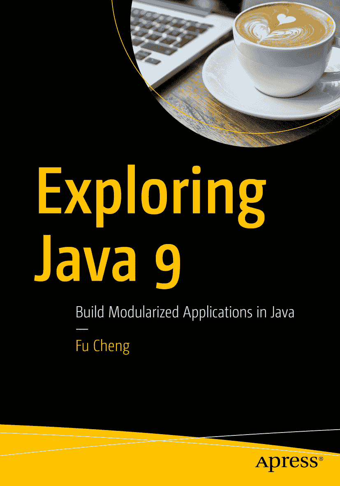

傅成 著 《探索 Java 9：在 Java 中构建模块化应用》

本书作者引用的任何源代码或其他补充材料，读者均可通过本书在 GitHub 上的产品页面获取，网址为 [`www.apress.com/978-1-4842-3329-0`](http://www.apress.com/978-1-4842-3329-0)。如需更详细信息，请访问 [`http://www.apress.com/source-code`](http://www.apress.com/source-code)。ISBN 978-1-4842-3329-0e-ISBN 978-1-4842-3330-6 [`doi.org/10.1007/978-1-4842-3330-6`](https://doi.org/10.1007/978-1-4842-3330-6) 美国国会图书馆控制号：2017962328 © Fu Cheng 2018
本作品受版权保护。出版商保留所有权利，无论是材料的全部或部分，特别是翻译、重印、重用插图、朗诵、广播、以缩微胶卷或任何其他物理方式复制、传输或信息存储与检索、电子改编、计算机软件，或现在已知或以后开发的任何类似或不同方法的权利。本书中可能出现商标名称、徽标和图像。我们不以每次出现商标名称、徽标或图像时都使用商标符号，而是仅以编辑方式使用这些名称、徽标和图像，以利于商标所有者，无意侵犯商标权。在本出版物中使用商品名称、商标、服务标志和类似术语，即使未明确标识，也不应被视为对其是否受所有权保护的看法。尽管本书中的建议和信息在出版时被认为是真实和准确的，但作者、编辑或出版商均不对可能出现的任何错误或遗漏承担法律责任。出版商对本书所含内容不作任何明示或暗示的保证。
印刷在无酸纸上
由 Springer Science+Business Media New York, 233 Spring Street, 6th Floor, New York, NY 10013 向全球图书贸易发行。电话 1-800-SPRINGER，传真 (201) 348-4505，电子邮件 orders-ny@springer-sbm.com，或访问 www.springeronline.com。Apress Media, LLC 是加利福尼亚州的有限责任公司，其唯一成员（所有者）是 Springer Science + Business Media Finance Inc (SSBM Finance Inc)。SSBM Finance Inc 是特拉华州的公司。
献给我的妻子 Andrea 以及我的女儿 Olivia 和 Erica
目录
第 1 章：​引言 1
安装 1
IDE 2
Intellij IDEA 2
Eclipse 2
构建工具 4
Gradle 4
Apache Maven 4
javac 和 java 4
Docker 5
CI 构建 6
总结 6
第 2 章：​模块系统 7
模块介绍 8
示例应用程序 8
模块声明 9
requires 和 exports 9
传递依赖 9
静态依赖 12
服务 12
限定导出 14
开放模块和包 14
处理现有代码 15
未命名模块 15
自动模块 16
JDK 工具 17
模块路径 17
模块版本 18
主模块 18
根模块 18
限制可观察模块 19
升级模块路径 19
增加可读性和打破封装 19
javac 20
jlink 21
java 24
jdeps 24
模块 Java API 27
ModuleFinder 27
ModuleDescriptor​ 28
Configuration 31
模块层 34
类加载器 39
Class 42
反射 43
自动模块名称 43
模块工件 46
JAR 文件 46
JMOD 文件 47
JDK 模块 49
常见问题 49
迁移实战 51
使用 Java 9 构建项目 51
迁移路径 51
BioJava 52
总结 56
第 3 章：​jshell 57
代码补全 58
类 58
方法 59
命令 59
/​list 59
/​edit 60
/​drop 61
/​save 61
/​open 61
/​imports 62
/​vars 62
/​types 62
/​methods 63
/​history 63
/​env 63
/​set 64
/​reset 64
/​reload 64
/​! 65
/​<id> 65
/​-<n> 65
/​exit 65
总结 65
第 4 章：​集合、Stream 和 Optional 67
集合的工厂方法 67
List.​of() 方法 67
Set.​of() 方法 67
Map.​of() 和 Map.​ofEntries() 方法 68
数组 68
Mismatch() 方法 68
Compare() 方法 69
Equals() 方法 69
Stream 69
ofNullable() 方法 69
dropWhile() 方法 70
takeWhile() 方法 70
iterate() 方法 71
IntStream、LongStream 和 DoubleStream 71
收集器 71
filtering() 方法 71
flatMapping() 方法 72
Optional 73
ifPresentOrElse() 方法 73
Optional.​or() 方法 73
stream() 方法 74
总结 74
第 5 章：​进程 API 75
ProcessHandle 接口 75
Process 77
管理长时间运行的进程 78
总结 79
第 6 章：​平台日志 API 和服务 81
默认 LoggerFinder 实现 82
创建自定义 LoggerFinder 实现 83
总结 86
第 7 章：​响应式流 87
核心接口 87
Flow.​Publisher<T> 87
Flow.​Subscriber<T> 87
Flow.​Subscription 88
Flow.​Processor<T,R> 88
SubmissionPublis​her 88
第三方库 95
RxJava 2 95
Reactor 96
互操作性 97
总结 97
第 8 章：​变量句柄 99
创建变量句柄 99
findStaticVarHan​dle 99
findVarHandle 99
unreflectVarHand​le 100
访问模式 100
内存排序 100
VarHandle 方法 101
数组 105
[byte[] 和 ByteBuffer 视图](#A459620_1_En_8_Chapter.html#Sec15) 106
内存屏障 107
总结 107
第 9 章：​增强的方法句柄 109
arrayConstructor​ 109
arrayLength 109
varHandleInvoker​ 和 varHandleExactIn​voker 110
zero 110
empty 111
循环 111
loop 111
countedLoop 113
iteratedLoop 114
whileLoop 和 doWhileLoop 115
Try-finally 116
总结 117
第 10 章：​并发 119
CompletableFutur​e 119
异步 119
超时 119
工具类 120
TimeUnit 和 ChronoUnit 120
队列 121
原子类 122
Thread.​onSpinWait 123
总结 124
第 11 章：​Nashorn 125
获取 Nashorn 引擎 125
ECMAScript 6 特性 126
模板字符串 126
二进制和八进制字面量 126
迭代器和 for.​.​of 循环 126
函数 127
解析器 API 128
基本解析 128
解析错误 129
分析函数复杂度 130
总结 131
第 12 章：​I/​O 133
InputStream 133
ObjectInputStrea​m 过滤器 134
总结 137
第 13 章：​安全 139
SHA-3 哈希算法 139
SecureRandom 139
使用 PKCS12 作为默认密钥库 141
总结 141
第 14 章：​用户界面 143
桌面 143
应用程序事件 143
关于窗口 144
偏好设置窗口 144
打开文件 145
打印文件 146
打开 URI 146
应用程序退出 146
其他功能 148
多分辨率图像 148
TIFF 图像格式 150
弃用 Applet API 150
总结 150
第 15 章：​JVM 151
统一日志 151
标签、级别、装饰和输出 151
日志配置 152
诊断命令 VM.​log 153
移除 GC 组合 154
将 G1 设为默认垃圾回收器 154
弃用并发标记清除 (CMS) 垃圾回收器 154
移除启动时 JRE 版本选择 154
更多诊断命令 155
移除 JVM TI hprof 代理 157
移除 jhat 工具 157
移除演示和示例 157
Javadoc 157
总结 159
第 16 章：​杂项 161
小的语言变更 161
私有接口方法 161
try-with-resources 中的资源引用 161
其他变更 162
堆栈遍历 API 162
Objects 164
Unicode 8.​0 165
UTF-8 属性资源包 166
增强的弃用 166
NetworkInterface​ 167
总结 168
索引 169
关于作者和技术审阅者
关于作者
关于技术审阅者

