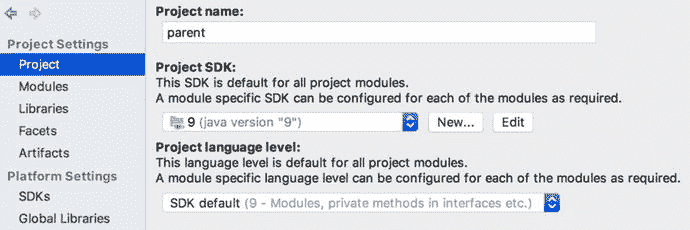
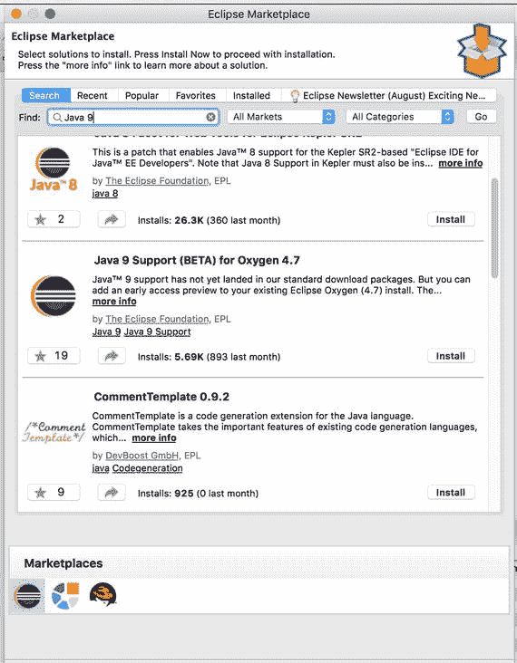

# 1. 引言

Java SE 9 于 2017 年 9 月 21 日发布。这是自 2014 年 3 月 18 日 Java SE 8 发布以来，Java 平台的第一个主要版本。Java 社区等待这个版本已经很久了。Java 9 的发布被推迟了数次。在此版本中，Java 平台模块系统（JPMS），即 Project Jigsaw，为 Java 平台引入了模块系统。现在，我们可以使用 Java 9 创建模块化的 Java 应用程序。Java SE 9 的内容可在 JSR 379：Java^(TM) SE 9 发布内容（[`https://www.jcp.org/en/jsr/detail?id=379`](https://www.jcp.org/en/jsr/detail?id=379)）中找到。当我在本书中提及 Java 9 时，我指的是 Java SE 9 和 JDK 9。

## 安装

你可以从 Oracle 下载 JDK 9 通用可用性（GA）版本构建包（[`http://www.oracle.com/technetwork/java/javase/downloads/jdk9-downloads-3848520.html`](http://www.oracle.com/technetwork/java/javase/downloads/jdk9-downloads-3848520.html)）。你可以为你的平台选择相应的构建包，并将其安装在本地机器上。

安装完成后，你可以运行 `java -version` 来检查版本。清单 1-1 显示了 macOS 上 JDK 9 的版本信息。

```
java version "9.0.1"
Java(TM) SE Runtime Environment (build 9.0.1+11)
Java HotSpot(TM) 64-Bit Server VM (build 9.0.1+11, mixed mode)
清单 1-1.
macOS 上的 JDK 9 版本
```

注意

Java 9 使用了一种新的版本字符串模式。Java 9 之前的版本字符串以 `1` 开头，例如 Java 8 的 `1.8.0_60`。在 Java 9 中，原始版本字符串开头的 `1` 已被移除。Java 9 的版本字符串以 `9` 开头。Java 9 还提供了 `Runtime.Version` 类来表示和解析版本字符串。

安装 Java 9 GA 构建包会使其成为你本地机器上的默认 JVM，这可能会破坏一些尚未与 Java 9 兼容的 Java 应用程序。你可以使用像 jEnv（[`http://www.jenv.be/`](http://www.jenv.be/)）这样的工具来管理多个 JDK 安装，或者手动更新环境变量 `JAVA_HOME` 以指向你旧的 JDK 安装。某些应用程序可能提供配置所用 JRE 的选项。对于这些应用程序，你可以使用这些选项指向旧的 JDK 安装。

## IDE

IDE 对 Java 开发者来说非常有用。我将讨论两个流行 IDE 对 Java 9 的支持：Intellij IDEA 和 Eclipse。

### Intellij IDEA

Intellij IDEA（[`https://www.jetbrains.com/idea/`](https://www.jetbrains.com/idea/)）2017.1 版本已经支持 Java 9。你可以直接安装 Java 9 GA 构建包，并将 JDK 9 添加为项目 SDK。别忘了将语言级别更改为 9；参见图 1-1。



图 1-1.

Intellij IDEA Java 9 设置

本书中的所有代码均使用 IDEA 2017.2 编写和测试。

### Eclipse

在撰写本文时，与使用 Intellij IDEA 相比，使用 Eclipse 进行 Java 9 开发需要更多的手动设置步骤。要运行 Java 9，你至少需要安装有 Eclipse Marketplace Client 的 Eclipse Oxygen（4.7）。当你准备好开始后，首先需要修改 `eclipse.ini` 文件来指定 JVM 并添加额外参数。如果 Java 9 不是默认的 JVM，你需要使用 `-vm` 选项来指定 JDK 9 的安装路径，例如 `-vm /Library/Java/JavaVirtualMachines/jdk-9.0.1.jdk/Contents/Home/bin/javaw`。你还需要添加 JVM 参数 `--add-modules=ALL-SYSTEM`，该参数应放在 `-vmargs` 之后。完成这些操作后，你就可以使用 JDK 9 启动 Eclipse 了。最后，你需要在“帮助”菜单中打开 Eclipse Marketplace，搜索“Java 9”，然后安装适用于 Oxygen 4.7 的 Java 9 支持（BETA）；参见图 1-2。重启 Eclipse 后，你可以添加一个新的 Java 项目，并将执行环境设置为 Java SE 9，编译器合规级别设置为 `9`。



图 1-2.

安装 Eclipse 对 Java 9 的支持

Eclipse 持续改进其对 Java 9 的支持。你应该始终参考最新的官方指南以了解其对 Java 9 的支持情况。

## 构建工具

通常，在开发重要的 Java 应用程序时，你需要使用某种构建工具。流行的选择是 Gradle（[`https://gradle.org/`](https://gradle.org/)）和 Apache Maven（[`https://maven.apache.org/`](https://maven.apache.org/)）。

### Gradle

Gradle 对 Java 9 的支持情况在此 GitHub issue（[`https://github.com/gradle/gradle/issues/719`](https://github.com/gradle/gradle/issues/719)）中跟踪。根据最新状态（[`https://github.com/gradle/gradle/issues/719#issuecomment-312225355`](https://github.com/gradle/gradle/issues/719#issuecomment-312225355)），你应该至少使用 Gradle 版本 `4.1-milestone-1` 来运行 Java 9。

> 在大多数情况下，版本 4.1-milestone-1 不需要特殊的环境设置即可让 Gradle 在简单的 Java 项目上运行。然而，仍然有许多常用的插件至少需要 `--permit-illegal-access` 才能运行。

`--permit-illegal-access` 选项已重命名为 `--illegal-access`，并且其默认值已经是 `permit`，因此不再需要添加此选项。在撰写本文时，Gradle 4.2 尚未提供对模块的一流支持。你可以通过此指南（[`https://guides.gradle.org/building-java-9-modules/`](https://guides.gradle.org/building-java-9-modules/)）来尝试 Gradle 的模块支持。

### Apache Maven

Maven 编译器插件（[`https://maven.apache.org/plugins/maven-compiler-plugin/`](https://maven.apache.org/plugins/maven-compiler-plugin/)）支持编译 Java 9 模块。清单 1-2 展示了如何在 Maven 项目中配置此插件。

```
org.apache.maven.plugins
maven-compiler-plugin
3.7.0

true

清单 1-2.
Maven 编译器插件配置
```

### `javac` 和 `java`

如果你只想运行一些快速测试来了解 Java 9 的工作方式，你可以跳过 Gradle 或 Maven 的设置，直接使用 `javac` 和 `java`。Java 代码可以使用 `javac` 编译，并使用 `java` 运行。`javac` 和 `java` 命令都有新的选项，我将在后续章节中介绍。

你应该只对小型项目使用 `javac` 和 `java`。对于大型项目，这些命令行参数非常难以管理。对于重要的项目，请使用 Gradle 或 Maven。


## Docker

如果你倾向于使用 Docker 进行本地开发，官方的 openjdk（[`https://hub.docker.com/_/openjdk/`](https://hub.docker.com/_/openjdk/)）Docker 镜像已经包含了 Java 9 构建版本。如果你还使用 Apache Maven 来构建项目，那么官方的 Apache Maven（[`https://hub.docker.com/r/library/maven/`](https://hub.docker.com/r/library/maven/)）Docker 镜像比 openjdk 镜像更合适。我使用标签 `3.5.0-jdk-9` 来获取包含 JDK 9 的 Maven 3.5.0。

拉取镜像后，你可以运行 `java -version` 来检查版本；参见清单 1-3。

```
$ docker run -it --rm --name maven-java9 \
maven:3.5-jdk-9 java -version
清单 1-3.
在 Docker 镜像中检查 JDK 9 版本
```

如清单 1-4 所示，此镜像中的 JDK 9 构建版本为 `9.0.1`。

```
openjdk version "9.0.1"
OpenJDK Runtime Environment (build 9.0.1+11-Debian-1)
OpenJDK 64-Bit Server VM (build 9.0.1+11-Debian-1, mixed mode)
清单 1-4.
Docker 镜像中的 JDK 9 版本
```

现在你可以使用 `javac` 来编译 Java 文件；参见清单 1-5。Java 代码文件位于当前目录。编译后的类文件位于 `classes` 目录。

```
$ docker run -it --rm --name maven-java9 \
-v "$PWD":/usr/src/java9 \
-w /usr/src/java9 maven:3.5-jdk-9 \
javac demo/Main.java -d classes
清单 1-5.
使用 Docker 运行 javac
```

编译完成后，你可以使用 `java` 来运行编译后的代码；参见清单 1-6。

```
$ docker run -it --rm --name maven-java9 \
-v "$PWD":/usr/src/java9 \
-w /usr/src/java9 maven:3.5-jdk-9 \
java -cp classes demo.Main
清单 1-6.
使用 Docker 运行 java
```

注意

如果你想将 Docker 作为体验 Java 9 的主要方式，那么阅读文章《可执行镜像——如何将你的开发机器 Docker 化》（[`https://www.infoq.com/articles/docker-executable-images`](https://www.infoq.com/articles/docker-executable-images)）是值得的。它涵盖了在本地开发中利用 Docker 的重要技术。

## CI 构建

我们使用 CircleCI（[`https://circleci.com`](https://circleci.com)）对源代码进行 CI 构建。清单 1-7 展示了 CircleCI 的 `circle.yml` 文件。这里我们使用 Docker 镜像 `maven:3.5.0-jdk-9` 来运行 Maven 构建。

```
version: 2
jobs:
build:
working_directory: ∼/circleci-feature9
docker:
- image: maven:3.5.0-jdk-9
steps:
- checkout
- restore_cache:
key: circleci-feature9-{{ checksum "pom.xml" }}
- run: mvn test
- save_cache:
paths:
- ∼/.m2
key: circleci-feature9-{{ checksum "pom.xml" }}
- store_test_results:
path: target/surefire-reports
清单 1-7.
CircleCI 配置文件
```

如果你使用其他 CI 服务，请查阅它们的指南，了解如何使用 Java 9 构建 Maven 项目。

## 总结

本章涵盖了使用 Java 9 开发应用程序所需的基本设置，包括 JDK 9 安装、IDE 设置、构建工具配置、Docker 设置和 CI 构建配置。在下一章中，我们将讨论 Java 9 中最重要的特性——Java 平台模块系统。

