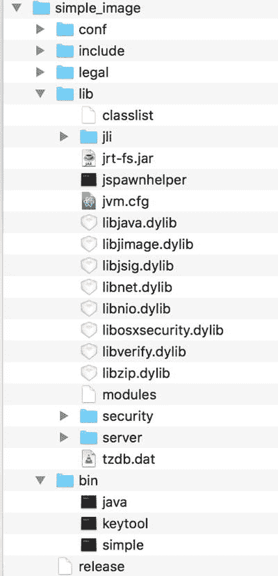
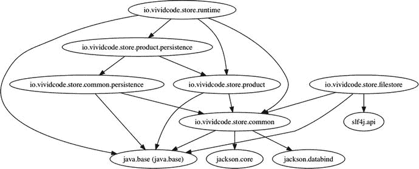
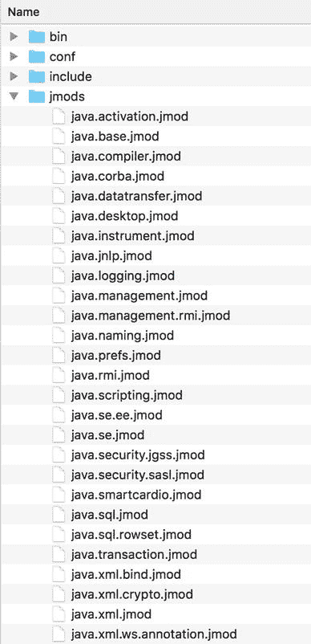

# 2. 模块系统

当我们谈论 Java 9 时，最重要的主题是 Project Jigsaw（[`http://openjdk.java.net/projects/jigsaw/`](http://openjdk.java.net/projects/jigsaw/)）或 Java 平台模块系统（JPMS），它将模块系统引入了 Java 平台。Project Jigsaw 本应在 Java 8 中添加，但由于改动太大，因此推迟到 Java 9 发布。Project Jigsaw 给 Java 平台带来了重大变化，不仅影响了 JDK 本身，也影响了在其上运行的 Java 应用程序。

在 Java 9 中，Java SE 平台和 JDK 被组织成模块，因此它们可以被定制以缩小规模，从而在小型设备上运行。在 Java 9 之前，JRE 的安装是全有或全无的。JRE 包含可以满足运行不同应用程序需求的工具、库和类。但对于某个特定的应用程序，其中一些工具、库和类可能并不需要。例如，在 JRE 上运行的 REST API 代理可能永远不会使用桌面 AWT/Swing 库。JPMS 使得从 JRE 中剥离不必要的库成为可能，从而构建适合每个独特应用程序的自定义镜像。这可以显著减小软件包的大小，加快部署速度。

Java 社区一直希望有一种构建模块化 Java 应用程序的方法。OSGi（[`https://en.wikipedia.org/wiki/OSGi`](https://en.wikipedia.org/wiki/OSGi)）是目前实现这一目标的一个不错选择。JPMS 也允许开发者创建模块化的 Java 库和应用程序。与使用 OSGi 相比，来自 Java 平台本身的解决方案更有前景。

JPMS 由一个 JSR——JSR 376：Java^(TM) 平台模块系统（[`https://jcp.org/en/jsr/detail?id=376`](https://jcp.org/en/jsr/detail?id=376)）——和六个相关的 JEP 组成。

*   200：模块化 JDK
*   201：模块化源代码
*   220：模块化运行时镜像
*   260：封装大多数内部 API
*   261：模块系统
*   282：`jlink`：Java 链接器

本章涵盖了 JPMS 最重要的概念。

## 模块介绍

请看 Oracle Java 平台组首席架构师 Mark Reinhold（[`http://mreinhold.org/`](http://mreinhold.org/)）在一份文档（[`http://openjdk.java.net/projects/jigsaw/spec/sotms/`](http://openjdk.java.net/projects/jigsaw/spec/sotms/)）中的引述：

> 模块是一个命名的、自描述的代码和数据集合。其代码组织为一组包含类型的包，即 Java 类和接口；其数据包括资源和其他类型的静态信息。——Mark Reinhold

从这个定义中，我们了解到模块只是一组按照预定义结构组织的已编译 Java 代码和补充资源。如果你已经使用 Maven 多模块（[`https://maven.apache.org/guides/mini/guide-multiple-modules.html`](https://maven.apache.org/guides/mini/guide-multiple-modules.html)）或 Gradle 多项目构建（[`https://docs.gradle.org/current/userguide/multi_project_builds.html`](https://docs.gradle.org/current/userguide/multi_project_builds.html)）来组织代码，那么你可以轻松地将这些 Maven 模块或 Gradle 项目中的每一个升级为 JPMS 模块。

每个 JPMS 模块都应有一个遵循与 Java 包相同命名约定的名称；也就是说，它应该使用反向域名模式——例如，`com.mycompany.mymodule`。JPMS 模块使用根源目录中的 `module-info.java` 文件进行描述，该文件会被编译成 `module-info.class`。在此文件中，你使用新关键字 `module` 来声明一个带有名称的模块。清单 2-1 展示了包含最少信息的 `com.mycompany.mymodule` 模块的 `module-info.java` 文件内容。

```
module com.mycompany.mymodule {
}
清单 2-1.
最小模块描述
```

现在你已经成功创建了一个新的 JPMS 模块。


## 示例应用

让我用一个示例应用来演示模块系统的用法。这是一个功能非常有限的简单电子商务应用。主要目标是演示模块系统的工作原理，因此这些模块的实际实现并不重要。该示例应用是一个 Maven 项目，其模块如表 2-1 所示。此应用的命名空间是 `io.vividcode.store`，因此表 2-1 中 `common` 模块的实际名称是 `io.vividcode.store.common`。

表 2-1.

示例应用的模块

| 名称 | 描述 |
| --- | --- |
| `common` | 通用 API |
| `common.persistence` | 通用持久化 API |
| `filestore` | 基于文件的持久化实现 |
| `product` | 产品 API |
| `product.persistenc`e | 产品持久化实现 |
| `runtime` | 应用引导程序 |

## 模块声明

模块声明文件 `module-info.java` 是理解模块系统工作原理的第一步。

### `requires` 和 `exports`

在 Java 9 引入模块之后，你应该将 Java 应用组织为模块。一个模块可以使用关键字 `requires` 声明对其他模块的依赖。依赖一个模块并不意味着你可以自动访问其公共和受保护类型。一个模块可以声明哪些包对其他模块是可访问的。只有模块的导出包对其他模块是可访问的，并且默认情况下，没有包会被导出。清单 2-1 中的模块声明没有导出任何内容。关键字 `exports` 用于导出包。导出包中的公共和受保护类型及其公共和受保护成员可以被其他模块访问。

清单 2-2 展示了模块 `io.vividcode.store.common.persistence` 的文件 `module-info.java`。它使用两个 `requires` 声明来声明其对模块 `slf4j.api` 和 `io.vividcode.store.common` 的依赖。模块 `slf4j.api` 来自第三方库 SLF4J ( [`https://www.slf4j.org/`](https://www.slf4j.org/) )，而 `io.vividcode.store.common` 是示例应用中的另一个模块。模块 `io.vividcode.store.common.persistence` 将其包 `io.vividcode.store.common.persistence` 导出给其他模块。

```
module io.vividcode.store.common.persistence {
requires slf4j.api;
requires io.vividcode.store.common;
exports io.vividcode.store.common.persistence;
}
清单 2-2.
io.vividcode.store.common.persistence 的模块声明
```

请注意，当你导出一个包时，你只导出了该包中的类型，而不是其子包中的类型。例如，声明 `exports com.mycompany.mymodule` 只导出像 `com.mycompany.mymodule.A` 或 `com.mycompany.mymodule.B` 这样的类型，但不导出像 `com.mycompany.mymodule.impl.C` 或 `com.mycompany.mymodule.test.demo.D` 这样的类型。要导出这些子包，你需要在模块声明中使用 `exports` 显式声明它们。

如果一个类型在模块边界之外不可访问，那么这个类型在模块中会被视为私有方法或字段。任何使用该类型的尝试都会在编译时导致错误，在运行时由 JVM 抛出 `java.lang.IllegalAccessError`，或者当你使用反射访问该类型时，由 Java 反射 API 抛出 `java.lang.IllegalAccessException`。

注意

所有模块，除了 `java.base` 模块本身，都隐式且强制依赖于 `java.base`。你不需要显式声明此依赖。

### 传递依赖

当模块 A 依赖模块 B 时，模块 A 可以读取模块 B 中导出的公共和受保护类型。这里我们说模块 A 读取模块 B。如果模块 B 也读取模块 C，那么模块 B 可以拥有返回模块 C 中导出类型的方法。

清单 2-3 展示了模块 C 的文件 `module-info.java`。模块 C 导出了包 `ctest`。

```
module C {
exports ctest;
}
清单 2-3.
C 的模块声明
```

清单 2-4 展示了模块 C 中的类 `ctest.MyC`。它只有一个方法 `sayHi()`，用于向控制台打印一条消息。

```
package ctest;
public class MyC {
public void sayHi() {
System.out.println("来自模块 C 的问候！");
}
}
清单 2-4.
模块 C 中的类 ctest.MyC
```

清单 2-5 展示了模块 B 的文件 `module-info.java`。模块 B 依赖模块 C 并导出包 `btest`。

```
module B {
requires C;
exports btest;
}
清单 2-5.
B 的模块声明
```

清单 2-6 中类 `btest.MyB` 的方法 `getC()` 返回类 `ctest.MyC` 的一个新实例。

```
package btest;
import ctest.MyC;
public class MyB {
public MyC getC() {
return new MyC();
}
}
清单 2-6.
模块 B 中的类 btest.MyB
```

模块 A 在其文件 `module-info.java` 中仅依赖模块 B；参见清单 2-7。

```
module A {
requires B;
}
清单 2-7.
B 的模块声明
```

模块 A 中的类 `atest.MyA` 尝试使用类 `MyC`；参见清单 2-8。

```
package atest;
import btest.MyB;
public class MyA {
public static void main(String[] args) {
new MyB().getC().sayHi();
}
}
清单 2-8.
模块 A 中的类 atest.MyA
```

尽管清单 2-8 中的代码看起来相当合理，但由于模块 A 未读取模块 C 的错误，它无法编译；参见清单 2-9 中的错误消息。默认情况下，模块的可读性关系不是传递的。模块 B 读取模块 C，模块 A 读取模块 B，但模块 A 不读取模块 C。

```
//A/atest/MyA.java:7: 错误：ctest 包中的 MyC.sayHi() 不可访问
new MyB().getC().sayHi();
^
(包 ctest 在模块 C 中声明，但模块 A 未读取它)
1 个错误
清单 2-9.
模块 A 的编译错误
```

为了使清单 2-8 中的代码能够编译，你需要在清单 2-7 中模块 A 的 `module-info.java` 文件中添加 `requires C`。当许多模块相互依赖时，这可能是一项繁琐的任务。由于这是一种常见的使用场景，Java 9 为此提供了内置支持。`requires` 声明可以扩展，添加修饰符 `transitive` 来将依赖声明为传递的。一个模块所依赖的传递模块可以被任何依赖该模块的模块读取。这被称为隐式可读性。

在清单 2-10 中将模块 B 的声明改为使用修饰符 `transitive` 后，模块 A 可以成功编译。模块 B 所依赖的传递模块 C 可以被依赖模块 B 的模块 A 读取。模块 A 现在可以读取模块 C。

```
module B {
requires transitive C;
exports btest;
}
清单 2-10.
更新 B 的模块声明以使用 transitive
```

一般来说，如果一个模块导出的包中包含一个类型，其签名引用了第二个模块中的另一个包，那么第一个模块应该使用 `requires transitive` 来声明对第二个模块的依赖。就像在模块 B 中，类 `MyB` 的方法 `getC()` 引用了来自模块 C 的类 `MyC`，因此模块 B 应该使用 `requires transitive C` 而不是 `requires C`。


### 静态依赖

你可以使用 `requires static` 来指定一个模块依赖在编译时是必需的，但在运行时是可选的；参见清单 2-11。

```
module demo {
requires static A;
}
清单 2-11.
requires static 示例
```

静态依赖对于框架和库非常有用。假设你正在构建一个用于处理不同类型数据库的库。该库模块可以使用静态依赖来要求不同类型的 JDBC 驱动。在编译时，库的代码可以访问这些驱动中定义的类型。在运行时，库的用户可以只添加他们想要使用的驱动。如果依赖不是静态的，库的用户必须添加所有支持的驱动才能通过模块解析检查。

### 服务

Java 拥有自己的服务接口和提供者机制，使用类 `java.util.ServiceLoader`。这种服务机制主要被 JDK 本身以及第三方框架和库所使用。服务提供者的一个典型例子是 JDBC 驱动。每个 JDBC 驱动都应提供服务接口 `java.sql.Driver` 的实现。驱动的 JAR 文件应在 `META-INF/services` 目录中包含提供者配置文件 `java.sql.Driver`。例如，Apache Derby ( [`https://db.apache.org/derby/`](https://db.apache.org/derby/) ) 的 JAR 文件中的 `java.sql.Driver` 文件包含以下内容：

```
org.apache.derby.jdbc.AutoloadedDriver
```

`org.apache.derby.jdbc.AutoloadedDriver` 是服务接口 `java.sql.Driver` 的实现类的名称。

在 Java 9 之前，`ServiceLoader` 扫描类路径以定位给定服务接口的提供者实现。在 Java 9 中，模块描述符 `module-info.java` 包含针对服务消费者和提供者的特定声明。

清单 2-12 展示了模块 `io.vividcode.store.common` 中的服务接口 `PersistenceService`。接口 `PersistenceService` 有一个单一方法 `save()` 用于保存 `Persistable` 对象。

```
package io.vividcode.store.common;
public interface PersistenceService {
void save(final Persistable persistable) throws PersistenceException;
}
清单 2-12.
服务接口 PersistenceService
```

模块 `io.vividcode.store.common.persistence` 消费此服务接口。在其清单 2-13 的文件 `module-info.java` 中，使用新关键字 `uses` 来声明对服务接口 `io.vividcode.store.common.PersistenceService` 的消费。

```
module io.vividcode.store.common.persistence {
requires slf4j.api;
requires transitive io.vividcode.store.common;
exports io.vividcode.store.common.persistence;
uses io.vividcode.store.common.PersistenceService;
}
清单 2-13.
io.vividcode.store.common.persistence 的模块声明
```

现在你可以使用 `ServiceLoader` 来查找此服务接口的提供者。在清单 2-14 中，方法 `ServiceLoader.load()` 为服务类型 `PersistenceService` 创建一个新的服务加载器，然后使用方法 `findFirst()` 获取第一个可用的服务提供者。如果找到服务提供者，则使用其方法 `save()` 来保存 `Persistable` 对象。

```
public class DataStore {
private final Optional persistenceServices;
public DataStore() {
this.persistenceServices = ServiceLoader
.load(PersistenceService.class)
.findFirst();
}
public void save(final T object) throws PersistenceException {
if (this.persistenceServices.isPresent()) {
this.persistenceServices.get().save(object);
}
}
}
清单 2-14.
使用 ServiceLoader 查找提供者
```

服务接口 `PersistenceService` 的提供者位于模块 `io.vividcode.store.filestore` 中。在此模块的声明清单 2-15 中，`provides io.vividcode.store.common.PersistenceService with io.vividcode.store.filestore.FileStore` 表示此模块使用类 `io.vividcode.store.filestore.FileStore` 提供服务接口 `PersistenceService` 的实现。`FileStore` 的实现非常简单，你可以查看其实现的源代码。

```
module io.vividcode.store.filestore {
requires io.vividcode.store.common.persistence;
requires slf4j.api;
provides io.vividcode.store.common.PersistenceService
with io.vividcode.store.filestore.FileStore;
}
清单 2-15.
io.vividcode.store.filestore 的模块声明
```

### 限定导出

当你在模块声明中使用 `exports` 导出一个包时，该包对所有使用 `requires` 依赖它的模块都是可见的。有时你可能希望将某些包的可见性限制在部分模块内。考虑这个例子：一个包最初设计为对其他模块公开，但在后续版本中被弃用了。使用旧版本此包的遗留代码在迁移到 Java 9 后应能继续工作，而新代码应使用新版本。该包应仅对仍使用旧版本的遗留代码模块可见。这通过在 `exports` 中使用 `to` 子句来指定应具有访问权限的模块名称来实现。

清单 2-16 展示了 JDK 模块 `java.rmi` 的模块声明。你可以看到包 `com.sun.rmi.rmid` 仅对模块 `java.base` 可见，而包 `sun.rmi.server` 仅对模块 `jdk.management.agent`、`jdk.jconsole` 和 `java.management.rmi` 可见。

```
module java.rmi {
requires java.logging;
exports java.rmi.activation;
exports com.sun.rmi.rmid to java.base;
exports sun.rmi.server to jdk.management.agent,
jdk.jconsole, java.management.rmi;
exports javax.rmi.ssl;
exports java.rmi.dgc;
exports sun.rmi.transport to jdk.management.agent,
jdk.jconsole, java.management.rmi;
exports java.rmi.server;
exports sun.rmi.registry to jdk.management.agent;
exports java.rmi.registry;
exports java.rmi;
uses java.rmi.server.RMIClassLoaderSpi;
}
清单 2-16.
JDK 模块 java.rmi 的模块声明
```

### 开放模块与开放包

在模块声明中，你可以在 `module` 前添加修饰符 `open` 将其声明为开放模块。开放模块仅在编译时授予对显式导出包的访问权限，但在运行时授予对其所有包中类型的访问权限。它还授予对所有包中所有类型的反射访问权限。所有类型包括私有类型及其私有成员。如果你使用反射 API 并抑制 Java 语言访问检查——例如，使用 `AccessibleObject` 的 `setAccessible()` 方法——你可以访问开放模块中的私有类型和成员。

你也可以使用 `opens` 将包开放给其他模块。你可以在运行时使用反射 API 访问开放包。就像开放模块一样，开放包中的所有类型及其所有成员都可以被反射 API 反射。你还可以使用 `to` 限定开放包，其含义与限定导出类似。

清单 2-17 中模块 E 的声明将其标记为开放模块。

```
open module E {
exports etest;
}
清单 2-17.
开放模块的声明
```

清单 2-18 中模块 F 的声明开放了两个包。开放模块中不存在的包是可能的。开放包给不存在的模块也是可能的。在这些情况下，编译器会生成警告，这与将包导出到不存在的模块相同。

```
module F {
opens ftest1;
opens ftest2 to G;
}
清单 2-18.
使用开放包的模块声明
```

开放模块和开放包主要是为了解决向后兼容性问题而提供的。在迁移依赖反射工作的遗留代码时，你可能需要使用它们。


## 处理现有代码

对于在 Java 9 中开发新项目，模块声明中的概念已经足够。但如果你需要处理 Java 9 之前编写的现有代码，则需要了解未命名模块和自动模块。

### 未命名模块

从前面的章节可以看出，Java 9 对跨模块边界访问类型有严格的限制。如果你正在创建一个针对 Java 9 的全新应用程序，则应使用新的模块系统。然而，Java 9 仍然支持运行所有在 Java 9 之前编写的应用程序。这是借助未命名模块实现的。

当模块系统需要加载一个其包未在任何模块中定义的类型时，它会尝试从类路径加载该类型。如果类型加载成功，则该类型被视为一个名为未命名模块的特殊模块的成员。未命名模块之所以特殊，是因为它读取所有其他命名模块，并导出其所有包。

当从类路径加载类型时，它可以访问所有其他命名模块（包括内置平台模块）的导出类型。对于 Java 8 应用程序，该应用程序的所有类型都是从类路径加载的，因此它们都位于同一个未命名模块中，并且可以相互访问而不会出现问题。该应用程序也可以访问平台模块。这就是 Java 8 应用程序无需修改即可在 Java 9 上运行的原因。

未命名模块会导出其所有包，但其他命名模块中的代码无法访问未命名模块中的类型，并且你不能使用 `requires` 来声明依赖关系——因为没有名称可供你引用它。这种限制是必要的；否则我们将失去模块系统的所有优势，回到混乱的类路径的黑暗旧时代。未命名模块纯粹是为向后兼容而设计的。如果一个包同时存在于命名模块和未命名模块中，则未命名模块中的该包将被忽略。类路径中意外的重复包不会干扰其他命名模块中的代码。

### 自动模块

由于 Java 9 向后兼容以运行现有的 Java 应用程序，因此没有必要升级现有应用程序以使用模块。但是，建议你进行升级以利用新模块系统的优势。

迁移现有应用程序的推荐方法是自下而上地进行；也就是说，从整个依赖树底部的模块开始。例如，在一个具有三个模块/子项目 A、B 和 C 且依赖树为 `A -> B -> C` 的应用程序中，你首先将 C 迁移为一个模块，然后是 B，最后是 A。在 C 迁移为模块后，当前位于未命名模块中的 A 和 B 仍然可以访问 C 中的类型，因为未命名模块读取所有命名模块。然后你将 B 迁移为一个命名模块，并声明它需要已迁移的命名模块 C。最后，将 A 迁移为一个命名模块；此时，整个应用程序已成功迁移。

自下而上的迁移并不总是可行的。某些库可能由第三方维护，你无法控制这些库何时迁移到模块。但你仍然希望迁移依赖于这些第三方库的模块。然而，你不能仅仅迁移这些模块，而将第三方库留在类路径中，因为命名模块无法读取未命名模块。你可以做的是将这些库的 JAR 文件放入模块路径中，并将它们转换为自动模块。

除了显式创建的命名模块之外，自动模块是从普通 JAR 文件隐式创建的。这些 JAR 文件中没有模块声明。自动模块的名称来自 JAR 文件清单文件 `MANIFEST.MF` 中的属性 `Automatic-Module-Name`，或者从 JAR 文件的名称派生而来。其他命名模块可以使用自动模块的名称声明对此 JAR 文件的依赖。建议你在清单中添加属性 `Automatic-Module-Name`，因为它比从 JAR 文件名派生的模块名称更可靠。

自动模块在许多方面都很特殊：

*   自动模块读取所有其他命名模块。
*   自动模块导出其所有包。
*   自动模块读取未命名模块。
*   自动模块向所有其他自动模块授予传递可读性。

自动模块是类路径和显式命名模块之间的桥梁。目标是将所有现有的模块/子项目/库迁移到 Java 9 命名模块。然而，在迁移过程中，你始终可以将它们添加到模块路径中，以作为自动模块使用。

在清单 2-19 中，类 `MyD` 使用了来自 Guava（[`https://github.com/google/guava`](https://github.com/google/guava)）21.0 版本的类 `com.google.common.collect.Lists`。

```
package dtest;
import com.google.common.collect.Lists;
public class MyD {
public static void main(String[] args) {
System.out.println(Lists.newArrayList("Hello", "World"));
}
}
清单 2-19.
使用 Guava 库的类 MyD
```

在撰写本文时，Guava 尚未迁移为 Java 9 模块。在清单 2-20 中 D 的模块声明中，你可以使用 `requires guava` 来声明对其的依赖。`guava` 是 Guava 自动模块的名称，该名称派生自 JAR 文件名。

```
module D {
requires guava;
}
清单 2-20.
声明对自动模块的依赖
```

编译清单 2-20 中的代码时，你可以在 `javac` 中使用命令行选项 `--module-path`，将目录 `∼/libs` 中的 Guava JAR 文件 `guava-21.0.jar` 添加到模块路径。

```
$ javac --module-path ∼/libs /*.java /dtest/*.java
```

## JDK 工具

完成项目模块的源代码后，你需要编译并运行这些模块。大多数情况下，你会使用 IDE 进行开发和测试，因此可以将项目的编译和执行交给 IDE。但是，你仍然可以直接使用 JDK 工具 `javac` 和 `java` 分别编译和运行代码。深入了解这些 JDK 工具有助于你理解模块的整个生命周期。然而，IDE 和构建工具改进其对 JDK 9 的支持需要时间。这个过程可能很慢，因此你可能仍然需要使用这些 JDK 工具来完成某些任务。在迁移到 Java 9 时，你可能会遇到各种与模块系统相关的问题。如果你对这些工具有深入的了解，就可以轻松找到根本原因并解决这些问题。

其中一些 JDK 工具已升级以支持与模块相关的选项，而另一些则是 Java 9 中的新工具。这些工具支持一些与模块系统中常见概念相关的通用命令行选项。这些工具可以在不同阶段使用：

*   编译时：使用 `javac` 将 Java 源代码编译成类文件。
*   链接时：Java 9 中引入的可选新阶段。使用 `jlink` 组装和优化一组模块及其传递依赖项，以创建自定义运行时镜像。
*   运行时：使用 `java` 启动 JVM 并执行字节码。

其他实用工具没有特定的工作阶段。


### 模块路径

模块系统使用模块路径来定位定义在不同工件中的模块。模块路径是一系列指向模块定义或包含模块定义目录的路径序列。模块定义可以是模块工件，也可以是包含模块展开内容的目录。模块路径按照其在序列中的顺序进行搜索，以找到定义特定模块的第一个定义。模块系统还使用模块路径来解析依赖关系。如果模块系统找不到依赖模块的定义，或者在同一个目录中发现两个定义了同名模块的定义，则会报错并退出。模块路径使用平台相关的路径分隔符进行分隔：Windows 使用分号（`;`），macOS 和 Linux 使用冒号（`:`）。

不同类型的模块路径用于不同的阶段；参见表 2-2。如表所示，不同的模块路径命令行选项可以应用于多个阶段。当存在多个模块路径时，每个模块路径的顺序定义了搜索顺序。例如，在编译时，使用 `javac` 时，所有四种类型的模块路径都可以使用。模块系统首先检查 `--module-source-path` 中指定的模块路径，然后检查 `--upgrade-module-path`，接着是 `--system`，最后是 `--module-path` 或 `-p`。

表 2-2.

不同类型的模块路径

| 顺序 | 名称 | 命令行选项 | 应用阶段 | 描述 |
| --- | --- | --- | --- | --- |
| 1 | 编译模块路径 | `--module-source-path` | 编译时 | 模块的源代码 |
| 2 | 升级模块路径 | `--upgrade-module-path` | 编译时和运行时 | 包含用于替换环境中可升级模块的已编译模块 |
| 3 | 系统模块 | `--system` | 编译时和运行时 | 环境中的已编译模块 |
| 4 | 应用模块路径 | `--module-path` 或 `-p` | 所有阶段 | 已编译的应用模块 |

在模块路径上找到的系统模块和模块定义被称为可观察模块集，这在模块解析过程中非常重要。如果要解析的模块不存在于可观察模块集中，模块系统会报错并退出。

### 模块版本

尽管模块声明中没有版本相关的配置，但仍然可以为模块记录版本信息。建议你遵循语义化版本控制方案（[`http://semver.org/`](http://semver.org/)）来记录模块版本。像 Maven 或 Gradle 这样的构建工具会自动记录版本信息，因此除非你直接使用 `javac` 或 `jar` 工具，否则无需担心。需要了解的重要一点是，模块系统在搜索模块时会忽略版本信息。如果模块路径包含多个同名但不同版本的模块定义，模块系统仍会将其视为错误。在解析模块时，模块名称是唯一重要的因素。

你可以使用 `--module-version` 选项指定模块版本。

### 主模块

可以使用 `--module` 或 `-m` 选项指定主模块。在运行时，主模块包含要运行的主类。如果主类已在模块声明中记录，则只需指定模块名称即可。否则，你需要使用 `<module>/<mainclass>` 来指定模块和主类，例如 `com.mycompany.mymodule/com.mycompany.mymodule.Main`。

在编译时，`--module` 或 `-m` 指定了唯一要编译的模块。

### 根模块

可观察模块集定义了所有可能被解析的模块。然而，并非所有可观察模块在运行时都是必需的。模块系统从一组根模块开始解析过程，并通过解析这些根模块的依赖关系相对于可观察模块集的传递闭包来构建模块图。有可能并非所有可观察模块都被解析，并且只有可观察模块是可解析的。

模块系统有一些用于选择默认根模块的规则。当你在未命名模块（即早于 Java 9 的代码）中编译或运行代码时，未命名模块的默认根模块集包括 JDK 系统模块和应用模块。如果 `java.se` 模块存在，它将是唯一包含的 JDK 系统模块。否则，每个无条件导出至少一个包的 `java.*` 模块都是根模块。每个无条件导出至少一个包的非 `java.*` 模块也是根模块。

当你编译或运行 Java 9 代码时，默认的根模块集取决于阶段：

*   在编译时，它是要编译的模块集。
*   在链接时，它是空的。
*   在运行时，它是应用的主模块。

可以使用 `--add-modules` 选项扩展根模块集以包含额外的模块。此选项的值是一个以逗号分隔的模块名称列表。此选项还有三个特殊值。

*   `ALL-DEFAULT`：添加未命名模块的默认根模块集。
*   `ALL-SYSTEM`：添加所有系统模块。
*   `ALL-MODULE-PATH`：添加在模块路径上找到的所有可观察模块。

### 限制可观察模块

可以使用 `--limit-modules` 选项来限制可观察模块。使用此选项后，可观察模块集是指定模块的传递闭包，再加上主模块以及通过 `--add-modules` 选项指定的任何模块。此选项的值也是一个以逗号分隔的模块名称列表。

### 升级模块路径

`--upgrade-module-path` 选项指定了升级模块路径。此路径包含可用于升级环境中内置模块的模块。此模块路径取代了现有的扩展机制（[`http://docs.oracle.com/javase/8/docs/technotes/guides/extensions/index.html`](http://docs.oracle.com/javase/8/docs/technotes/guides/extensions/index.html)）。

系统模块是否可升级在 `module-info.java` 文件中有明确记录。例如，`java.xml.bind` 和 `java.xml.ws` 模块是可升级的。

### 增加可读性与打破封装

模块系统完全关乎封装。但有时在处理遗留代码或运行测试时，你仍然希望打破封装。你可以使用几个命令行选项来打破封装。

*   `--add-reads module=target-module(,target-module)*` 更新源模块以读取目标模块。目标模块可以是 `ALL-UNNAMED`，以读取所有未命名模块。
*   `--add-exports module/package=target-module(,target-module)*` 更新源模块以将包导出到目标模块。这将从源模块向目标模块添加一个限定的包导出。目标模块可以是 `ALL-UNNAMED`，以导出到所有未命名模块。
*   `--add-opens module/package=target-module(,target-module)*` 更新源模块以向目标模块开放包。这将从源模块向目标模块添加一个限定的包开放。
*   `--patch-module module=file(;file)*` 使用 JAR 文件或目录中的类和资源覆盖或增强模块。当你运行可能需要临时替换模块内容的测试时，`--patch-module` 非常有用。

现在我已经介绍了基本概念，让我们来讨论这些 JDK 工具。


### `javac`

`javac` 支持以下与模块相关的选项。这些选项的含义已在本章前面的章节中解释过。

*   `--module` 或 `-m`
*   `--module-path` 或 `-p`
*   `--module-source-path`
*   `--upgrade-module-path`
*   `--system`
*   `--module-version`
*   `--add-modules`
*   `--limit-modules`
*   `--add-exports`
*   `--add-reads`
*   `--patch-module`

现在，我将以“传递性依赖”中讨论的模块为例，说明如何使用 `javac`。假设你有一个目录，其中包含这三个模块的源代码。每个模块都有自己的子目录。你可以像这样编译单个模块。模块 C 没有依赖项，因此可以直接编译。

```
$ javac -d ∼/Downloads/modules_output/C C/**/*.java
```

要编译模块 B，你可以使用 `-p` 来提供已编译的模块 C，因为模块 B 需要模块 C。当需要第三方库时，你也应该使用 `-p`。

```
$ javac -d ∼/Downloads/modules_output/B -p ∼/Downloads/modules_output B/**/*.java
```

由于你拥有所有模块的源代码，你可以简单地一次性编译它们。

```
$ javac -d ∼/Downloads/modules_output --module-source-path . **/*.java
```

你也可以使用 `-m` 编译单个模块。当使用 `-m` 时，需要使用 `--module-source-path` 来指定模块源路径。

```
$ javac -d ∼/Downloads/modules_output --module-source-path . -m B
```

### `jlink`

要运行 Java 应用程序，你需要先安装 JRE 或 JDK。正如我之前提到的，在 Java 9 之前，没有简单的方法来自定义 JRE 或 JDK 以仅包含必要的内容。即使是一个简单的“Hello World”应用程序也需要完整大小的 JRE 才能运行。然而，在 JDK 模块化之后，可以创建自己的 Java 运行时映像，该映像仅包含应用程序所需的系统模块，这可以减小 JRE 映像的大小。

你可以使用 `jlink` 来构建自定义映像。如果你有一个模块 `demo.simple`，其中包含一个类 `test.Main`，你可以用它来打印出 `Hello World!`。要构建你的映像，请创建模块化 JAR 文件 `demo.simple-1.0.0.jar` 并设置主类。清单 2-21 显示了你可以用来使用 `jlink` 创建自定义映像的命令。路径 `<module_dir>` 包含模块 `demo.simple` 的工件。`<JDK_PATH>/jmods` 是 JDK 模块的路径。

```
$ jlink -p :/jmods \
--add-modules demo.simple \
--output  \
--launcher simple=demo.simple
清单 2-21.
使用 jlink 创建自定义映像
```

`jlink` 工具会在输出目录中创建一个新的运行时映像。你可以运行 `bin` 目录中的可执行文件 `simple` 来运行你的应用程序。在 macOS 上，此自定义运行时映像的大小仅为 36.5MB。图 2-1 显示了自定义运行时映像的内容。



图 2-1.

自定义运行时映像的内容

表 2-3 显示了 `jlink` 的选项。

表 2-3.

`jlink` 的选项

| 选项 | 描述 |
| --- | --- |
| `--module-path` 或 `-p` | 参见“模块路径”。 |
| `--add-modules` | 参见“根模块”。 |
| `--output` | 输出目录。 |
| `--launcher` | 用于运行模块或模块中主类的启动器命令。如果模块是使用 `--main-class` 指定主类创建的，那么仅使用模块名称就足够了。否则，可以使用 `<module>/<mainclass>` 指定主类。 |
| `--limit-modules` | 参见“限制可观察模块”。 |
| `--bind-services` | 执行完整的服务绑定。 |
| `--compress=<0&#124;1&#124;2>` 或 `-c` | 启用压缩。可能的值是 `0`、`1` 和 `2`。`0` 表示无压缩，`1` 表示常量字符串共享，`2` 表示使用 ZIP 压缩。 |
| `--endian` | 生成映像的字节顺序。可能的值是 `little` 或 `big`。默认值是 `native`。 |
| `--no-header-files` | 排除映像中的头文件。 |
| `--no-man-pages` | 排除手册页。 |
| `-G` 或 `--strip-debug` | 剥离调试信息。 |
| `--ignore-signing-information` | 在链接已签名的模块 JAR 文件时抑制致命错误。已签名模块 JAR 文件的签名相关文件不会被复制到生成的映像中。 |
| `--suggest-providers [name, ...]` | 建议实现给定服务类型的提供者。 |
| `--include-locales=langtag[,langtag]*` | 包含语言环境列表。使用此选项时必须添加模块 `jdk.localedata`。 |
| `--exclude-files=pattern-list` | 排除指定的文件。 |
| `--verbose` 或 `-v` | 启用详细的跟踪输出。 |

`jlink` 的一个主要限制是它不支持自动模块，这意味着无法使用 `jlink` 链接第三方库。例如，当你尝试使用 `jlink` 为示例应用程序创建映像时，它会给出以下错误。

```
Error: module-info.class not found for slf4j.api module
```

从这条错误信息中，你可以知道它需要模块 `slf4j.api` 的 `module-info.class`，但 SLF4J 库尚未迁移到 Java 9，因此你无法将其包含在映像中。

### `java`

`java` 命令支持以下与模块相关的选项：

*   `--module-path` 或 `-p`
*   `--upgrade-module-path`
*   `--add-modules`
*   `--limit-modules`
*   `--list-modules`：列出可观察的模块。
*   `--describe-module` 或 `-d`：描述模块。
*   `--validate-modules`：验证所有模块。可用于查找冲突和错误。
*   `--show-module-resolution`：在启动期间显示模块解析结果。
*   `--add-exports`
*   `--add-reads`
*   `--add-opens`
*   `--patch-module`

对于示例应用程序，在使用 Maven 组装插件将所有库和模块工件复制到一个目录后，你可以使用以下命令启动应用程序：

```
$ java -p  -m io.vividcode.store.runtime/io.vividcode.store.runtime.Main
```

如果你在主类中记录了模块工件，你可以简单地使用 `java -p <path> -m io.vividcode.store.runtime` 来运行应用程序。

`--list-modules` 选项在调试模块解析问题时非常有用，因为它可以列出所有可观察的模块。例如，你可以使用 `java --list-modules` 列出所有 JDK 系统模块。如果你使用 `-p` 添加模块路径，输出还将包括在模块路径中找到的模块。`--show-module-resolution` 选项对于解决模块解析问题也非常有用。


### `jdeps`

你可以使用 `jdeps` 工具来分析指定模块的依赖关系。以下命令会打印出 `io.vividcode.store.runtime` 的模块描述符、分析后得到的模块依赖关系，以及经过传递缩减后的依赖图；参见清单 2-22。它还会识别出任何未使用的限定导出。

```
$ jdeps --module-path  --check io.vividcode.store.runtime
```

```
io.vividcode.store.runtime (file:////runtime-1.0.0-SNAPSHOT.jar)
[模块描述符]
requires io.vividcode.store.filestore;
requires io.vividcode.store.product.persistence;
requires mandated java.base (@9);
requires slf4j.simple;
[为 io.vividcode.store.runtime 建议的模块描述符]
requires io.vividcode.store.common;
requires io.vividcode.store.product;
requires io.vividcode.store.product.persistence;
requires mandated java.base;
[io.vividcode.store.runtime 的传递缩减图]
requires io.vividcode.store.product.persistence;
requires mandated java.base;
清单 2-22.
使用 --check 选项的 jdeps 输出
```

要使用 `--check` 选项，你需要先知道模块名称。如果你只有一个 JAR 文件，可以使用 `--list-deps` 选项或 `--list-reduced-deps` 选项。

```
$ jdeps --module-path  --list-deps /runtime-1.0.0-SNAPSHOT.jar
```

清单 2-23 展示了此命令的输出。

```
io.vividcode.store.common
io.vividcode.store.product
io.vividcode.store.product.persistence
java.base
清单 2-23.
使用 --list-deps 选项的 jdeps 输出
```

`--list-deps` 和 `--list-reduced-deps` 的区别在于，使用 `--list-reduced-deps` 选项的结果不包含模块图中的隐式读取边。

```
$ jdeps --module-path  --list-reduced-deps /runtime-1.0.0-SNAPSHOT.jar
```

清单 2-24 展示了此命令的输出。

```
io.vividcode.store.product.persistence
清单 2-24.
使用 --list-reduced-deps 选项的 jdeps 输出
```

`jdeps` 的另一个便捷功能是，它可以生成 graphviz（[`http://graphviz.org/`](http://graphviz.org/)）DOT 文件，以便在图表中可视化模块依赖关系。

```
$ jdeps --module-path  \
--dot-output  -m io.vividcode.store.runtime
```

输出目录包含一个用于所有模块的 DOT 文件 `summary.dot` 和一个用于该模块的 DOT 文件 `io.vividcode.store.runtime.dot`。然后，你可以使用以下命令将 DOT 文件转换为 PNG 文件。请确保你已先安装 graphviz。

```
$ dot -Tpng /summary.dot -o /summary.png
```

你也可以使用 `jdeps` 处理多个 JAR 文件，以生成整个项目的模块依赖关系图。生成的 DOT 文件 `summary.dot` 包含所有模块。对于示例应用程序，使用 Maven 将所有模块工件和第三方库复制到不同的目录中。你可以使用 Maven 的依赖插件轻松完成此操作。然后，你可以使用以下命令生成 DOT 文件。（`<third_party-libs-path>` 是第三方库的路径，而 `<modules_path>` 是模块工件的路径。）

```
$jdeps --module-path  \
--dot-output  \
/*.jar
```

然后，你可以将文件 `summary.dot` 转换为 PNG 文件，生成的模块依赖关系图见图 2-2。



图 2-2.

生成的模块依赖关系图

`jdeps` 还可以从 JAR 文件生成模块声明文件 `module-info.java`。选项 `--generate-module-info` 和 `--generate-open-module` 分别用于普通模块和开放模块。例如，你可以使用以下命令为 `jackson-core-2.8.7.jar` 生成文件 `module-info.java`。

```
$ jdeps --generate-module-info  /jackson-core-2.8.7.jar
```

生成的 `module-info.java` 如清单 2-25 所示。它简单地导出了所有包并添加了服务提供者。在将遗留 JAR 文件迁移到 Java 9 模块时，你可以将生成的 `module-info.java` 文件作为起点。

```
module jackson.core {
exports com.fasterxml.jackson.core;
exports com.fasterxml.jackson.core.base;
exports com.fasterxml.jackson.core.filter;
exports com.fasterxml.jackson.core.format;
exports com.fasterxml.jackson.core.io;
exports com.fasterxml.jackson.core.json;
exports com.fasterxml.jackson.core.sym;
exports com.fasterxml.jackson.core.type;
exports com.fasterxml.jackson.core.util;
provides com.fasterxml.jackson.core.JsonFactory with
com.fasterxml.jackson.core.JsonFactory;
}
清单 2-25.
jackson-core-2.8.7.jar 生成的 module-info.java
```

## 模块 Java API

当 JVM 启动时，它会针对可观察模块解析应用程序的主模块。此解析过程的结果是一个可读性图，这是一个有向图，其节点表示已解析的模块，边表示模块之间的可读性。然后，JVM 创建一个模块层，该层由从这些已解析模块定义的运行时模块组成。模块系统提供了 Java API，供应用程序与之交互。


### `ModuleFinder`

让我们从模块解析过程开始。要解析一个模块，首先需要找到模块定义。接口 `ModuleFinder` 负责定位模块。通过 `ModuleFinder` 中的静态方法，有三种不同的方式可以创建 `ModuleFinder` 的实例；参见表 2-4。

表 2-4.

`ModuleFinder` 的静态方法

| 方法 | 描述 |
| --- | --- |
| `ofSystem()` | 创建一个定位系统模块的 `ModuleFinder` |
| `of(Path… entries)` | 创建一个 `ModuleFinder`，通过搜索 `entries` 指定的一系列路径来定位文件系统上的模块 |
| `compose(ModuleFinder... finders)` | 通过组合零个或多个 `ModuleFinder` 来创建一个 `ModuleFinder` |

一旦创建了 `ModuleFinder`，就可以使用其方法 `Optional<ModuleReference> find(String name)` 按名称查找模块。类 `ModuleReference` 是对模块内容的引用。方法 `Set<ModuleReference> findAll()` 返回一个集合，其中包含此 `ModuleFinder` 对象可以定位的所有 `ModuleReference`。通常你不需要直接使用 `ModuleFinder`，而应该使用它们来为可读性图创建配置。

由 `ModuleFinder` 定位的模块表示为 `ModuleReference`。表 2-5 展示了 `ModuleReference` 的方法。

表 2-5.

`ModuleReference` 的方法

| 方法 | 描述 |
| --- | --- |
| `ModuleDescriptor descriptor()` | 返回描述该模块的 `ModuleDescriptor` |
| `Optional<URI> location()` | 以 `URI` 形式返回模块内容的位置 |
| `ModuleReader open()` | 打开模块内容以供读取 |

清单 2-26 展示了一个用于创建 `ModuleFinder` 和 `ModuleReference` 对象的辅助类。`ModuleFinder` 对象在资源路径 `/modules` 中查找模块。该路径包含示例应用程序的模块工件。方法 `getModuleReference()` 使用 `ModuleFinder` 按名称查找 `ModuleReference`。由于我确信要查找的模块一定存在，这里我直接使用返回的 `Optional<ModuleReference>` 的 `get()` 方法来获取 `ModuleReference`。

```
public class ModuleTestSupport {
public static final String MODULE_NAME = "io.vividcode.store.common";
public static ModuleFinder getModuleFinder() throws URISyntaxException {
return ModuleFinder.of(
Paths.get(
ModuleDescriptorTest.class.getResource("/modules").toURI()));
}
public static ModuleReference getModuleReference() throws URISyntaxException {
return getModuleFinder().find(MODULE_NAME).get();
}
}
清单 2-26.
模块测试的支持类
```

清单 2-27 是对 `ModuleFinder` 的测试。这里我验证了 `find()` 和 `findAll()` 方法的结果。

```
public class ModuleFinderTest {
@Test
public void testFindModule() throws Exception {
final ModuleFinder moduleFinder = ModuleTestSupport.getModuleFinder();
assertTrue(moduleFinder.find(ModuleTestSupport.MODULE_NAME).isPresent());
final Set allModules = moduleFinder.findAll();
assertEquals(4, allModules.size());
}
}
清单 2-27.
ModuleFinder 测试
```

### `ModuleDescriptor`

从 `ModuleReference` 中，你可以获取描述模块的 `ModuleDescriptor`。表 2-6 展示了 `ModuleDescriptor` 的方法。

表 2-6.

`ModuleDescriptor` 的方法

| 方法 | 描述 |
| --- | --- |
| `Set<ModuleDescriptor.Exports> exports()` | 返回表示导出包的 `ModuleDescriptor.Exports` 集合 |
| `Set<ModuleDescriptor.Opens> opens()` | 返回表示开放包的 `ModuleDescriptor.Opens` 集合 |
| `Set<ModuleDescriptor.Requires> requires()` | 返回表示模块依赖项的 `ModuleDescriptor.Requires` 集合 |
| `Set<ModuleDescriptor.Provides> provides()` | 返回表示此模块提供的服务的 `ModuleDescriptor.Provides` 集合 |
| `Set<String> uses()` | 返回此模块使用的服务集合 |
| `String name()` | 返回模块的名称 |
| `Optional<String> mainClass()` | 返回模块的主类 |
| `Set<ModuleDescriptor.Modifier> modifiers()` | 返回表示模块修饰符的 `ModuleDescriptor.Modifier` 集合 |
| `boolean isAutomatic()` | 检查模块是否为自动模块 |
| `boolean isOpen()` | 检查模块是否为开放模块 |
| `Optional<ModuleDescriptor.Version> version()` | 返回模块的版本 |

在清单 2-28 中，我使用一个测试来验证从 `ModuleDescriptor` 获取的各种信息。

```
public class ModuleDescriptorTest {
@Test
public void testModuleDescriptor() throws Exception {
final ModuleReference reference = ModuleTestSupport.getModuleReference();
assertNotNull(reference);
final ModuleDescriptor descriptor = reference.descriptor();
assertEquals(ModuleTestSupport.MODULE_NAME, descriptor.name());
assertFalse(descriptor.isAutomatic());
assertFalse(descriptor.isOpen());
assertEquals(1, descriptor.exports().size());
assertEquals(2, descriptor.packages().size());
assertTrue(descriptor.requires().stream().map(Requires::name)
.anyMatch(Predicate.isEqual("jackson.core")));
assertTrue(descriptor.uses().isEmpty());
assertTrue(descriptor.provides().isEmpty());
}
}
清单 2-28.
ModuleDescriptor 测试
```

表 2-6 中的方法用于查询现有 `ModuleDescriptor` 对象的信息。要创建 `ModuleDescriptor` 对象，你可以使用构建器类 `ModuleDescriptor.Builder`，或者从模块描述符的二进制形式中读取。静态方法 `newModule(String name)`、`newOpenModule(String name)` 和 `newAutomaticModule(String name)` 可以分别创建用于构建普通模块、开放模块和自动模块的 `ModuleDescriptor.Builder` 对象。`ModuleDescriptor.Builder` 有不同的方法，可以通过编程方式配置模块描述符的各种组件。清单 2-29 展示了一个简单的 `ModuleDescriptor.Builder` 测试。

静态方法 `read()` 有不同的重载形式，用于从 `InputStream` 或 `ByteBuffer` 读取模块声明的二进制形式。如果二进制形式不包含模块中的包集合，你可以传递一个额外的 `Supplier<Set<String>>` 类型的参数来提供这些包。

```
@Test
public void testModuleDescriptorBuilder() {
final ModuleDescriptor descriptor = ModuleDescriptor.newModule("demo")
.exports("demo.api")
.exports("demo.common")
.mainClass("demo.Main")
.version("1.0.0")
.build();
assertEquals(2, descriptor.exports().size());
assertTrue(descriptor.mainClass().isPresent());
assertEquals("demo.Main", descriptor.mainClass().get());
assertTrue(descriptor.version().isPresent());
assertEquals("1.0.0", descriptor.version().get().toString());
}
清单 2-29.
ModuleDescriptor.Builder 测试
```


`ModuleReference.open()` 返回的 `ModuleReader` 用于读取模块中的资源。资源由以 `/` 分隔的路径字符串标识，例如 `com/mycompany/mymodule/Main.class`。表 2-7 展示了 `ModuleReader` 的方法。

表 2-7.

`ModuleReader` 的方法

| 方法 | 描述 |
| --- | --- |
| `Stream<String> list()` | 列出模块中所有资源的名称 |
| `Optional<URI> find(String name)` | 根据名称查找资源 |
| `Optional<InputStream> open(String name)` | 打开资源以供读取 |
| `Optional<ByteBuffer> read(String name)` | 将资源内容读取为 `ByteBuffer` |
| `void release(ByteBuffer bb)` | 释放 `ByteBuffer` |
| `void close()` | 关闭此 `ModuleReader` |

在清单 2-30 中，我使用 `ModuleReader` 将 `module-info.class` 的内容读取到 `ByteBuffer` 中，然后从这个 `ByteBuffer` 创建一个新的 `ModuleDescriptor`。

```
public class ModuleReaderTest {
@Test
public void testModuleReader() throws Exception {
final ModuleReference reference = ModuleTestSupport.getModuleReference();
assertNotNull(reference);
final ModuleReader reader = reference.open();
final Optional byteBuffer = reader.read("module-info.class");
assertTrue(byteBuffer.isPresent());
final ModuleDescriptor descriptor = ModuleDescriptor.read(byteBuffer.get());
assertEquals(ModuleTestSupport.MODULE_NAME, descriptor.name());
}
}
清单 2-30.
ModuleReader 测试
```

### `Configuration`

可读性图表示为 `java.lang.module.Configuration` 类的对象。一个配置可以有父配置。配置可以组织成层次结构。`Configuration` 具有创建和查询可读性图的方法。

`Configuration` 是使用 `resolve()` 和 `resolveAndBind()` 方法创建的。这两个方法都返回一个新的 `Configuration` 对象，表示模块解析的结果。`Configuration` 也有这两个方法的静态版本。对于静态方法，你需要提供 `List<Configuration>` 类型的参数，作为所创建 `Configuration` 的父配置。对于实例方法，当前 `Configuration` 是所创建 `Configuration` 的唯一父配置。以下是创建 `Configuration` 所需的方法：

*   `Configuration resolve(ModuleFinder before, ModuleFinder after, Collection<String> roots)`
*   `Configuration resolveAndBind(ModuleFinder before, ModuleFinder after, Collection<String> roots)`
*   `static Configuration resolve(ModuleFinder before, List<Configuration> parents, ModuleFinder after, Collection<String> roots)`
*   `static Configuration resolveAndBind(ModuleFinder before, List<Configuration> parents, ModuleFinder after, Collection<String> roots)`

`resolveAndBind()` 方法接受与 `resolve()` 方法相同的参数。区别在于，`resolveAndBind()` 解析的模块还包括由服务依赖引入的模块。

以下是上述方法的可能参数：

*   `roots`：根模块名称列表。
*   `parents`：父配置列表。
*   `before` 和 `after`：用于定位模块的两个 `ModuleFinder`。`ModuleFinder before` 用于定位根模块。如果找不到模块，则使用父配置通过 `findModule()` 方法定位。如果仍然找不到模块，则使用 `ModuleFinder after` 定位。传递依赖项按照相同的搜索顺序定位。

当根模块或传递依赖项在父配置中被定位时，该模块的解析过程结束，并且该模块不会包含在结果配置中。

清单 2-31 展示了通过在给定路径中查找模块来创建新 `Configuration` 的示例。

```
public Configuration resolve(final Path path) {
return Configuration.resolve(
ModuleFinder.of(path),
List.of(Configuration.empty()),
ModuleFinder.ofSystem(),
List.of("io.vividcode.store.runtime")
);
}
清单 2-31.
使用 resolve() 创建新的 Configuration 对象
```

模块解析过程可能因各种原因失败。如果找不到根模块、直接依赖项或传递依赖项，或者在尝试查找模块时发生任何错误，`resolve()` 和 `resolveAndBind()` 方法会抛出 `FindException`。找到所有模块后，会计算可读性图，并检查模块导出和服务使用的一致性。一致性检查包括检查循环模块依赖、重复模块读取、重复包导出以及无效的服务使用。当任何一致性检查失败时，会抛出 `ResolutionException`。

表 2-8 展示了 `Configuration` 的其他方法。

表 2-8.

`Configuration` 的方法

| 方法 | 描述 |
| --- | --- |
| `static Configuration empty()` | 返回空配置 |
| `List<Configuration> parents()` | 按搜索顺序返回此配置的父配置列表 |
| `Optional<ResolvedModule> findModule(String name)` | 按名称查找已解析的模块 |
| `Set<ResolvedModule> modules()` | 返回此配置中所有已解析模块的集合 |

对于每个 `ResolvedModule`，`reads()` 方法返回它读取的一组 `ResolvedModule`；其他方法见表 2-9。

表 2-9.


`ResolvedModule` 的方法

| 方法 | 描述 |
| --- | --- |
| `Configuration configuration()` | 返回此已解析模块所属的 `Configuration` |
| `String name()` | 返回模块名称 |
| `Set<ResolvedModule> reads()` | 返回此已解析模块所读取的 `ResolvedModule` 集合 |
| `ModuleReference reference()` | 返回指向此模块内容的 `ModuleReference` |

清单 2-32 展示了如何打印可读性图。方法 `sortedModules()` 按名称对 `ResolvedModule` 进行排序。在方法 `printLayer()` 中，我获取配置中的所有 `ResolvedModule` 并打印它们的名称。对于每个 `ResolvedModule`，我还打印出它所读取的 `ResolvedModule`。

```
public class ConfigurationPrinter {
public void printLayer(final Configuration configuration) {
sortedModules(configuration.modules()).forEach(module -> {
System.out.println(module.name());
printModule(module);
System.out.println("");
});
}
private void printModule(final ResolvedModule module) {
sortedModules(module.reads())
.forEach(m -> System.out.println("|--" + m.name()));
}
private List sortedModules(final Set modules) {
return modules
.stream()
.sorted(Comparator.comparing(ResolvedModule::name))
.collect(Collectors.toList());
}
public static void main(final String[] args) {
final Configuration configuration = Configuration.resolve(
ModuleFinder.of(Paths.get(args[0])),
List.of(Configuration.empty()),
ModuleFinder.ofSystem(),
List.of("io.vividcode.store.runtime")
);
new ConfigurationPrinter().printLayer(configuration);
}
}
清单 2-32.
打印可读性图
```

清单 2-33 展示了清单 2-32 的输出。它展示了示例应用程序的所有模块。

```
io.vividcode.store.common
|--guava
|--jackson.annotations
|--jackson.core
|--jackson.databind
|--java.base
|--slf4j.api
|--slf4j.simple
io.vividcode.store.common.persistence
|--guava
|--io.vividcode.store.common
|--jackson.annotations
|--jackson.core
|--jackson.databind
|--java.base
|--slf4j.api
|--slf4j.simple
io.vividcode.store.filestore
|--guava
|--io.vividcode.store.common
|--io.vividcode.store.common.persistence
|--jackson.annotations
|--jackson.core
|--jackson.databind
|--java.base
|--slf4j.api
|--slf4j.simple
io.vividcode.store.product
|--io.vividcode.store.common
|--java.base
io.vividcode.store.product.persistence
|--io.vividcode.store.common
|--io.vividcode.store.common.persistence
|--io.vividcode.store.product
|--java.base
io.vividcode.store.runtime
|--guava
|--io.vividcode.store.common
|--io.vividcode.store.common.persistence
|--io.vividcode.store.filestore
|--io.vividcode.store.product
|--io.vividcode.store.product.persistence
|--jackson.annotations
|--jackson.core
|--jackson.databind
|--java.base
|--slf4j.api
|--slf4j.simple
清单 2-33.
可读性图的输出
```

### 模块层

模块层用于组织模块。模块层由类 `java.lang.ModuleLayer` 表示。

层是通过将 `Configuration` 对象中的可读性图映射到负责加载此模块中定义类型的类加载器来创建的。JVM 至少有一个非空层，即 `boot` 层，它在 JVM 启动时创建。大多数应用程序只会使用这个引导层。可以创建额外的层来支持高级用例。一个层可以有多个父层。一个层中的模块也可以读取该层父层中的模块。创建层时，会为配置中的每个 `ResolvedModule` 创建一个 `java.lang.Module` 对象。

`ModuleLayer` 的静态方法 `boot()` 返回引导层。有三种不同的方法可以从现有的 `ModuleLayer` 创建新层；请参见表 2-10。现有的 `ModuleLayer` 将成为新创建层的父层。

表 2-10.
创建新 `ModuleLayer` 的方法

| 方法 | 描述 |
| --- | --- |
| `defineModules(Configuration cf, Function<String, ClassLoader> clf)` | 从 `Configuration` 创建一个新的 `ModuleLayer`。对于每个模块，该函数返回映射的 `ClassLoader`。 |
| `defineModulesWithOneLoader(Configuration cf, ClassLoader parentLoader)` | 从 `Configuration` 创建一个新的 `ModuleLayer`。所有模块使用同一个 `ClassLoader`，并以 `parentLoader` 作为父类加载器。 |
| `defineModulesWithManyLoaders(Configuration cf, ClassLoader parentLoader)` | 从 `Configuration` 创建一个新的 `ModuleLayer`。每个模块都有自己的 `ClassLoader`，并以 `parentLoader` 作为父类加载器。 |

`ModuleLayer` 也有静态方法 `defineModules()`、`defineModulesWithOneLoader()` 和 `defineModulesWithManyLoaders()` 来创建新层。这些方法需要提供父层列表。与那些实例方法相比，这些静态方法返回 `ModuleLayer.Controller` 而不是 `ModuleLayer`。`ModuleLayer.Controller` 具有修改层中模块的方法；请参见表 2-11。

表 2-11.
`ModuleLayer.Controller` 的方法

| 方法 | 描述 |
| --- | --- |
| `addReads(Module source, Module target)` | 更新模块 `source` 以读取模块 `target` |
| `ModuleLayer.Controller addExports(Module source, String pn, Module target)` | 更新模块 `source` 以将包 `pn` 导出到模块 `target` |
| `ModuleLayer.Controller addOpens(Module source, String pn, Module target)` | 更新模块 `source` 以将包 `pn` 开放给模块 `target` |
| `ModuleLayer layer()` | 返回 `ModuleLayer` 对象 |

`ModuleLayer` 还有其他方法；请参见表 2-12。

表 2-12.
`ModuleLayer` 的方法

| 方法 | 描述 |
| --- | --- |
| `static ModuleLayer empty()` | 返回空层。 |
| `Configuration configuration()` | 返回此层的配置。 |
| `List<ModuleLayer> parents()` | 返回此层的父层列表。 |
| `Set<Module> modules()` | 返回此层中的模块集合。 |
| `Optional<Module> findModule(String name)` | 返回具有给定名称的模块。还会递归搜索父层，直到找到该模块。 |
| `ClassLoader findLoader(String name)` | 返回具有给定名称的模块的 `ClassLoader`。父层的搜索方式与 `findModule()` 相同。 |

类 `Module` 表示一个运行时模块。它可以用于检索模块的信息，并在需要时修改它。表 2-13 展示了 `Module` 的方法。

表 2-13.
`Module` 的方法


| 方法 | 描述 |
| --- | --- |
| `String getName()` | 返回此模块的名称，对于未命名模块返回 `null` |
| `Set<String> getPackages()` | 返回此模块中的包名集合 |
| `ModuleDescriptor getDescriptor()` | 返回描述此模块的 `ModuleDescriptor` 对象，对于未命名模块返回 `null` |
| `boolean isNamed()` | 检查模块是否已命名 |
| `boolean isExported(String pn)` | 检查模块是否无条件导出包 `pn` |
| `boolean isExported(String pn, Module other)` | 检查模块是否将包 `pn` 导出到指定模块 `other` |
| `boolean isOpen(String pn)` | 检查模块是否无条件开放包 `pn` |
| `boolean isOpen(String pn, Module other)` | 检查模块是否将包 `pn` 开放给指定模块 `other` |
| `boolean canRead(Module other)` | 检查模块是否读取指定模块 `other` |
| `boolean canUse(Class<?> service)` | 检查模块是否使用指定的服务类 |
| `Module addExports(String pn, Module other)` | 更新此模块，将指定包 `pn` 导出到指定模块 `other` |
| `Module addOpens(String pn, Module other)` | 更新此模块，将指定包 `pn` 开放给指定模块 `other` |
| `Module addUses(Class<?> service)` | 更新此模块，添加对指定服务类型的服务依赖 |
| `Module addReads(Module other)` | 更新此模块，使其读取指定模块 `other` |
| `ClassLoader getClassLoader()` | 获取此模块的类加载器 |
| `ModuleLayer getLayer()` | 返回包含此模块的模块层 |
| `InputStream getResourceAsStream(String name)` | 返回一个输入流，用于读取模块中的资源 |

当使用 `getResourceAsStream()` 读取模块中的资源时，该资源可能被封装，导致其他模块中的代码无法定位到它。类文件不会被封装。对于其他资源，首先会根据资源名称推导出包名。如果该包名存在于模块中（即它属于 `getPackages()` 返回的包名集合），那么调用者代码必须位于该包已对其开放的模块中。

现在，我将用一个示例来演示如何使用 `ModuleLayer` 让同一模块的多个版本在同一应用程序中共存。在模块 `demo` 中，我有一个简单的 Java `Version` 类，它包含静态方法 `getVersion()` 用于返回版本字符串；参见代码清单 2-34。对于模块版本 `1.0.0`，版本字符串是 `1.0.0`；对于模块版本 `2.0.0`，版本字符串更新为 `2.0.0`。

```
package io.vividcode.demo.version;
public class Version {
public static String getVersion() {
return "1.0.0";
}
}
代码清单 2-34.
模块 demo 中的 Version 类
```

我还有另一个模块 `runtime`，它依赖于模块 `demo`。代码清单 2-35 展示了输出版本字符串的 `Main` 类。

```
package io.vividcode.demo.runtime;
import io.vividcode.demo.version.Version;
public class Main {
public static void main(final String[] args) {
System.out.println(Version.getVersion());
}
}
代码清单 2-35.
模块 runtime 中的 Main 类
```

模块 `runtime` 和模块 `demo` 的两个版本被打包成 JAR 文件。如果你将这三个 JAR 文件放在同一个目录 `dist` 下，并使用以下命令运行模块 `runtime`，你会发现该命令无法运行。

```
$ java -p dist -m runtime
```

该命令会因以下错误而失败。这是因为同一模块 `demo` 的两个版本出现在了模块路径的同一目录中。

```
Error occurred during initialization of boot layer
java.lang.module.FindException: Two versions of module demo found in dist (demo-2.0.0.jar and demo-1.0.0.jar)
```

如果你将 `demo-1.0.0.jar` 和 `demo-2.0.0.jar` 放入不同的目录，并按如下所示更新模块路径，输出将是 `1.0.0`，因为 `demo-1.0.0.jar` 被首先找到。

```
$ java -p dist:dist/v1:dist/v2 -m runtime
```

如果你按如下所示更改模块路径中 `dist/v1` 和 `dist/v2` 的顺序，输出将是 `2.0.0`，因为 `demo-2.0.0.jar` 被首先找到。

```
$ java -p dist:dist/v2:dist/v1 -m runtime
```

如果你希望两个版本在同一个 JVM 中运行，可以使用 OSGi 或创建自定义类加载器。在 Java 9 中，你可以使用 `ModuleLayer`。代码清单 2-35 展示了使用 `ModuleLayer` 的 `Main` 类的更新版本。在方法 `createLayer()` 中，`path` 是包含模块 `demo` 工件的目录路径。在这段代码中，我创建了一个 `Configuration`，它使用 `ModuleFinder` 仅在此路径中搜索。父 `Configuration` 来自启动层。然后，我使用 `defineModulesWithOneLoader()` 从 `Configuration` 创建模块层，并使用系统类加载器作为唯一 `ClassLoader` 对象的父类加载器。创建的 `ModuleLayer` 使用启动层作为其父层。

创建模块层后，方法 `showVersion()` 使用 `findLoader()` 查找模块的 `ClassLoader`，然后使用反射 API 加载类并调用方法 `getVersion()`；参见代码清单 2-36。如果你运行 `Main` 类，可以看到两个版本字符串都被显示出来。

```
import java.lang.module.Configuration;
import java.lang.module.ModuleFinder;
import java.lang.reflect.Method;
import java.nio.file.Path;
import java.nio.file.Paths;
import java.util.Set;
public class Main {
private static final String MODULE_NAME = "demo";
private static final String CLASS_NAME = "io.vividcode.demo.version.Version";
private static final String METHOD_NAME = "getVersion";
public static void main(final String[] args) {
final Main main = new Main();
main.load(Paths.get("dist", "v1"));
main.load(Paths.get("dist", "v2"));
}
public void load(final Path path) {
showVersion(createLayer(path));
}
private void showVersion(final ModuleLayer moduleLayer) {
try {
final Class clazz = moduleLayer.findLoader(MODULE_NAME)
.loadClass(CLASS_NAME);
final Method method = clazz.getDeclaredMethod(METHOD_NAME);
System.out.println(method.invoke(null));
} catch (final Exception e) {
e.printStackTrace();
}
}
private ModuleLayer createLayer(final Path path) {
final ModuleLayer parent = ModuleLayer.boot();
final Configuration configuration = parent.configuration().resolve(
ModuleFinder.of(path),
ModuleFinder.of(),
Set.of(MODULE_NAME)
);
return parent.defineModulesWithOneLoader(configuration,
ClassLoader.getSystemClassLoader());
}
}
代码清单 2-36.
使用 ModuleLayer 加载模块
```


### 类加载器

OSGi 使用复杂的类加载器层级结构，使得同一 Bundle 的不同版本能在运行时共存。JPMS 则采用简单的类加载策略。每个模块拥有自己的类加载器，负责加载该模块中的所有类型。一个类加载器可以加载来自一个或多个模块的类型。一个模块中的所有类型应由同一个类加载器加载。

在 Java 9 之前，Java 运行时包含三个内置的类加载器：

*   **启动类加载器**：JVM 内置的类加载器，通常表示为 `null`。它没有父加载器。
*   **扩展类加载器**：从扩展目录加载类。它是 JDK 1.2 引入的扩展机制的产物。其父加载器是启动类加载器。
*   **系统或应用程序类加载器**：从应用程序的类路径加载类。其父加载器是扩展类加载器。

清单 2-37 中的代码输出了类加载器的层级结构。

```
ClassLoader classLoader = ClassLoaderMain.class.getClassLoader();
while (classLoader != null) {
System.out.println(classLoader);
classLoader = classLoader.getParent();
}
清单 2-37.
输出类加载器层级结构
```

当你在 Java 8 上运行清单 2-37 中的代码时，会显示以下输出。`AppClassLoader` 和 `ExtClassLoader` 分别是系统类加载器和扩展类加载器的类。启动类加载器表示为 `null`，因此未显示。

```
sun.misc.Launcher$AppClassLoader@18b4aac2
sun.misc.Launcher$ExtClassLoader@60e53b93
```

在 Java 9 中，扩展机制已被升级模块路径取代。扩展类加载器为了向后兼容性而保留，但已重命名为平台类加载器。可以通过 `ClassLoader` 的 `getPlatformClassLoader()` 方法获取它。以下是 Java 9 中的内置类加载器：

*   **启动类加载器**：定义核心 Java SE 和 JDK 模块
*   **平台类加载器**：定义选定的 Java SE 和 JDK 模块
*   **系统或应用程序类加载器**：定义类路径上的类和模块路径中的模块

在 Java 9 中，平台类加载器和系统类加载器不再是 `URLClassLoader` 的实例。这影响了一种流行的技巧（[`https://stackoverflow.com/a/7884406`](https://stackoverflow.com/a/7884406)），该技巧用于动态地向系统类加载器的搜索路径添加新条目。如清单 2-38 所示，这种 hack 将系统类加载器转换为 `URLClassLoader` 并调用其方法 `addURL()`。这在 Java 9 中不再有效，因为转换为 `URLClassLoader` 会失败。

```
public static void addPath(String s) throws Exception {
File f = new File(s);
URL u = f.toURL();
URLClassLoader urlClassLoader = (URLClassLoader)
ClassLoader.getSystemClassLoader();
Class urlClass = URLClassLoader.class;
Method method = urlClass.getDeclaredMethod("addURL", new Class[]{URL.class});
method.setAccessible(true);
method.invoke(urlClassLoader, new Object[]{u});
}
清单 2-38.
向 URLClassLoader 添加路径
```

每个类加载器都有自己的未命名模块，可以通过 `ClassLoader` 的 `getUnnamedModule()` 方法获取。如果类加载器加载的类型未在命名模块中定义，则该类型被认为位于该类加载器的未命名模块中。我们之前讨论的未命名模块实际上是应用程序类加载器的未命名模块。

在 Java 9 中，类加载器具有名称。名称在构造函数中指定，并可通过 `getName()` 方法获取。平台类加载器的名称是 `platform`，而应用程序类加载器的名称是 `app`。新的类加载器名称在调试与类加载器相关的问题时会很有用。

```
@Test
public void testClassLoaderName() {
ClassLoader classLoader = ClassLoaderTest.class.getClassLoader();
final List names = Lists.newArrayList();
while (classLoader != null) {
names.add(classLoader.getName());
classLoader = classLoader.getParent();
}
assertEquals(2, names.size());
assertEquals("app", names.get(0));
assertEquals("platform", names.get(1));
}
清单 2-39.
测试类加载器名称
```

新方法 `Class<?> findClass(String moduleName, String name)` 在此类加载器定义的模块中查找具有给定二进制名称的类。如果模块名称为 `null`，则在此类加载器的未命名模块中查找该类。如果找不到该类，此方法返回 `null` 而不是抛出 `ClassNotFoundException`。新方法 `URL findResource(String moduleName, String name)` 返回为此类加载器定义的模块中具有给定名称的资源的 URL。方法 `Module.getResourceAsStream()` 实际上使用模块类加载器的此方法先获取 `URL`，然后打开输入流。方法 `findClass()` 和 `findResource()` 都是受保护的，应由类加载器实现覆盖。

`ClassLoader` 已有方法 `Enumeration<URL> getResources(String name)` 来查找所有具有给定名称的资源。新方法 `Stream<URL> resources(String name)` 具有相同的功能，但它返回一个 `Stream<URL>`。

Java 9 在访问资源时增加了一项新限制，该限制与模块声明强制执行的访问控制规则相匹配。命名模块中的资源受 `Module.getResourceAsStream()` 方法中指定的封装规则约束。对于非类资源，`ClassLoader` 中的相关方法只能在包无条件开放时找到该包中的资源。

例如，模块 `io.vividcode.store.common` 在目录 `config` 中有一个属性文件 `application.properties`。此资源的包名是 `config`。如果包 `config` 未在模块声明中声明为 `open`，则无法使用这些与资源相关的方法定位它。

在清单 2-40 中，我首先获取模块 `io.vividcode.store.common` 的 `Module` 对象，然后获取其类加载器，并使用 `resources()` 方法列出所有名称为 `config/application.properties` 的资源。这里包 `config` 必须是开放的，否则 `resources()` 方法会返回一个空流。

```
public class ResourceTest {
@Test
public void testResources() throws URISyntaxException {
final Optional moduleOpt = ModuleTestSupport.getModule();
assertTrue(moduleOpt.isPresent());
final Module module = moduleOpt.get();
assertTrue(module.isOpen("config"));
assertTrue(module
.getClassLoader()
.resources("config/application.properties")
.count() > 0
);
}
}
清单 2-40.
测试 ClassLoader.resources()
```

新方法 `Package[] getDefinedPackages()` 返回由此类加载器定义的所有 `Package`，而 `Package getDefinedPackage(String name)` 返回由此类加载器定义的给定名称的 `Package`。在清单 2-41 中，要测试的类加载器实际上是系统类加载器，因此它定义了应用程序包，但不定义像 `java.lang` 这样的包。

```
@Test
public void testGetDefinedPackages() {
final ClassLoader classLoader = ClassLoaderTest.class.getClassLoader();
final Package[] packages = classLoader.getDefinedPackages();
assertTrue(Stream.of(packages)
.map(Package::getName)
.noneMatch(Predicate.isEqual("java.lang")));
assertTrue(Stream.of(packages)
.map(Package::getName)
.anyMatch(Predicate.isEqual("io.vividcode.feature9.module")));
assertNull(classLoader.getDefinedPackage("java.lang"));
assertNotNull(
classLoader.getDefinedPackage("io.vividcode.feature9.module"));
}
清单 2-41.
测试 ClassLoader.getDefinedPackages()
```


### 类

随着模块的引入，`Class` 新增了与模块相关的方法。`Class<?> forName(Module module, String name)` 返回指定模块中具有给定二进制名称的 `Class`。此方法委托给该模块的类加载器进行类加载。与 `ClassLoader` 的 `findClass()` 方法类似，`forName()` 在失败时返回 `null`，而不是抛出 `ClassNotFoundException`。由于一个类加载器可以为多个模块定义类，因此定义的类可能实际上来自不同的模块。在这种情况下，该方法在类加载后也会返回 `null`。

由于每个类型现在都位于某个模块中，`Class` 新增了一个方法 `getModule()`，用于返回表示其所属模块的 `Module` 对象。如果此类表示数组类型，则此方法返回元素类型的 `Module` 对象。如果此类表示基本类型或 `void`，则返回 `java.base` 模块的 `Module` 对象。如果此类位于未命名模块中，则返回此类类加载器的 `getUnnamedModule()` 的结果。清单 2-42 展示了与 `Class.getModule()` 相关的测试。

```
@Test
public void testGetModule() {
assertEquals("java.sql", Driver.class.getModule().getName());
assertEquals("java.base", String[].class.getModule().getName());
assertEquals("java.base", int.class.getModule().getName());
assertEquals("java.base", void.class.getModule().getName());
}
清单 2-42.
测试 Class.getModule()
```

新方法 `String getPackageName()` 返回类的完全限定包名。如果此类表示数组类型，则此方法返回元素类型的包名。如果此类表示基本类型或 `void`，则返回包名 `java.lang`。否则，包名通过保留 `Class.getName()` 返回的类名中最后一个点号（`.`）之前的字符来派生。清单 2-43 展示了与 `Class.getPackageName()` 相关的测试。

```
@Test
public void testGetPackageName() {
assertEquals("java.sql", Driver.class.getPackageName());
assertEquals("java.lang", String[].class.getPackageName());
assertEquals("java.lang", int.class.getPackageName());
assertEquals("java.lang", void.class.getPackageName());
}
清单 2-43.
测试 Class.getPackageName()
```

### 反射

在上一节中，我向你展示了如何使用 `ServiceLoader` 加载服务接口的提供者类。许多框架使用类似的模式和反射 API 来按名称动态加载类并实例化它们。客户端可以通过配置向框架提供类名。框架使用 `Class.forName()` 加载该类，并使用 `Class` 对象的 `newInstance()` 方法实例化它。

这种模式在模块系统中可能会出现问题。实际的类可能从未命名模块或其他命名模块加载。如果实际的类从未命名模块加载，则实例化会失败，因为框架的模块无法读取未命名模块。如果实际的类从另一个命名模块加载，框架的模块不可能知道客户端模块的存在并声明对它们的依赖，这实际上颠倒了依赖关系。为了使这正常工作，反射 API 有一个隐式约定，即假设任何反射类型的代码都位于一个读取定义此类型的模块的模块中。反射 API 可以访问该类型。

在清单 2-44 中，我在一个命名模块中使用反射 API 加载 Guava 类 `com.google.common.eventbus.EventBus` 并实例化一个新实例。Guava 库被放置在类路径中，因此它位于未命名模块中。`clazz.getModule()` 的输出类似于 `unnamed module @1623b78d`，这确认了该类位于未命名模块中。实例化成功，你可以看到类似 `EventBus{default}` 的输出。

```
try {
final Class clazz = Class.forName("com.google.common.eventbus.EventBus");
System.out.println(clazz.getModule());
final Object instance = clazz.getDeclaredConstructor().newInstance();
System.out.println(instance);
} catch (final Exception e) {
e.printStackTrace();
}
清单 2-44.
使用反射 API 实例化一个实例
```

注意

方法 `Class.newInstance()` 在 Java 9 中已被弃用。在清单 2-44 中，我使用 `clazz.getDeclaredConstructor().newInstance()` 来获取构造器，然后使用它来实例化新实例。


### 自动模块名称

前面我提到了自动模块的名称。如果在 JAR 文件的清单中未找到 `Automatic-Module-Name` 属性，则模块名称将从文件名中派生。模块名称的确定遵循以下步骤。

1.  移除后缀 `.jar`。
2.  尝试将文件名与正则表达式模式 `-(\\d+(\\.|$))` 进行匹配。如果模式匹配，则匹配位置之前的子字符串被视为模块名称的候选，而连字符（`-`）之后的子字符串则被解析为版本。如果版本无法解析，则忽略它。如果模式不匹配，则整个文件名被视为模块名称的候选。
3.  清理模块名称的候选，以创建一个有效的模块名称。模块名称中的所有非字母数字字符（`[^A-Za-z0-9]`）都将替换为点号（`.`），所有重复的点号将替换为一个点号，并移除所有前导和尾随的点号。

如果你有兴趣了解这些步骤的实际实现，请查看 `java.base` 模块中 `jdk.internal.module.ModulePath` 类的 `ModuleDescriptor deriveModuleDescriptor(JarFile jf)` 方法。版本字符串的解析是使用 `ModuleDescriptor.Version` 的静态方法 `Version parse(String v)` 完成的。清单 2-45 中的代码也实现了相同的算法。

表 2-14 展示了一些从 JAR 文件名派生自动模块名称的示例。

表 2-14.

从 JAR 文件名派生自动模块名称的示例

| 文件名 | 模块名称 | 版本 |
| --- | --- | --- |
| `mylib.jar` | `mylib` | `null` |
| `slf4j-api-1.7.25.jar` | `slf4j.api` | `1.7.25` |
| `hibernate-jpa-2.1-api-1.0.0.Final.jar` | `hibernate.jpa` | `2.1-api-1.0.0.Final` |
| `spring-context-support-4.3.6.RELEASE.jar` | `spring.context.support` | `4.3.6.RELEASE` |

清单 2-45 展示了用于派生表 2-14 中所示自动模块名称的代码。

```
public class DeriveAutomaticModuleName {
static final Pattern DASH_VERSION = Pattern.compile("-(\\d+(\\.|$))");
static final Pattern NON_ALPHANUM = Pattern.compile("[^A-Za-z0-9]");
static final Pattern REPEATING_DOTS = Pattern.compile("(\\.)(\\1)+");
static final Pattern LEADING_DOTS = Pattern.compile("^\\.");
static final Pattern TRAILING_DOTS = Pattern.compile("\\.$");
public Tuple2 deriveModuleName(final String fileName) {
Objects.requireNonNull(fileName);
String name = fileName;
String version = null;
if (fileName.endsWith(".jar")) {
name = fileName.substring(0, fileName.length() - 4);
}
final Matcher matcher = DASH_VERSION.matcher(name);
if (matcher.find()) {
final int start = matcher.start();
try {
final String tail = name.substring(start + 1);
ModuleDescriptor.Version.parse(tail);
version = tail;
} catch (final IllegalArgumentException ignore) {
}
name = name.substring(0, start);
}
return Tuple.of(cleanModuleName(name), version);
}
public void displayModuleName(final String fileName) {
final Tuple2 result = deriveModuleName(fileName);
System.out.printf("%s => %s [%s]%n", fileName, result._1, result._2);
}
private String cleanModuleName(String mn) {
// replace non-alphanumeric
mn = NON_ALPHANUM.matcher(mn).replaceAll(".");
// collapse repeating dots
mn = REPEATING_DOTS.matcher(mn).replaceAll(".");
// drop leading dots
if (mn.length() > 0 && mn.charAt(0) == '.') {
mn = LEADING_DOTS.matcher(mn).replaceAll("");
}
// drop trailing dots
final int len = mn.length();
if (len > 0 && mn.charAt(len - 1) == '.') {
mn = TRAILING_DOTS.matcher(mn).replaceAll("");
}
return mn;
}
public static void main(final String[] args) {
final DeriveAutomaticModuleName moduleName = new DeriveAutomaticModuleName();
moduleName.displayModuleName("mylib.jar");
moduleName.displayModuleName("slf4j-api-1.7.25.jar");
moduleName.displayModuleName("hibernate-jpa-2.1-api-1.0.0.Final.jar");
moduleName.displayModuleName("spring-context-support-4.3.6.RELEASE.jar");
}
}
清单 2-45.
派生自动模块名称
```

如果使用清单属性 `Automatic-Module-Name` 指定了模块名称，则直接使用该名称。如果指定的模块名称无效，则在加载模块时会抛出 `FindException`。

## 模块工件

模块被打包为模块工件。有两种类型的模块工件：JAR 文件和 JMOD 文件。

### JAR 文件

模块化 JAR 文件就是在其根目录中包含 `module-info.class` 文件的 JAR 文件，因此你可以使用现有的 `jar` 工具来创建模块化 JAR 文件。`jar` 工具还添加了新选项，用于将附加信息插入到模块描述符中。

*   `-e`，`--main-class=CLASSNAME` 将入口点类记录在 `module-info.class` 文件中。这实际上是一个旧选项，它将主类记录在清单文件中。
*   `--module-version=VERSION` 将 `VERSION` 记录在 `module-info.class` 文件中，作为模块的版本。
*   `--hash-modules=PATTERN` 将依赖于该模块的模块的哈希值记录在 `module-info.class` 文件中。仅记录名称与 `PATTERN` 指定的正则表达式匹配的模块的哈希值。
*   `-d`，`--describe-module` 打印模块描述符或自动模块的名称。

你可以使用清单 2-46 中的命令为模块 `io.vividcode.store.runtime` 创建一个模块化 JAR 文件。这里我指定了模块版本和主类。

```
$ jar --create --file target/runtime-1.0.0.jar \
--main-class io.vividcode.store.runtime.Main \
--module-version 1.0.0 \
-C target/classes .
清单 2-46.
使用 jar 创建模块工件
```

然后你可以打印出所创建 JAR 文件的详细信息。

```
$ jar -d -f target/runtime.jar
```

清单 2-47 展示了此命令的输出。

```
module io.vividcode.store.runtime@1.0.0 (module-info.class)
requires io.vividcode.store.filestore
requires io.vividcode.store.product.persistence
requires mandated java.base
requires slf4j.simple
contains io.vividcode.store.runtime
main-class io.vividcode.store.runtime.Main
清单 2-47.
jar -d 的输出
```

要使用 `--hash-modules` 记录模块哈希值，你还需要使用 `-p` 或 `--module-path` 为 `jar` 工具提供模块路径，以便定位模块。


### JMOD 文件

JMOD 文件是在 Java 9 中引入的，用于打包 JDK 模块。与 JAR 文件相比，JMOD 文件可以包含原生代码、配置文件和其他类型的数据。图 2-3 展示了 JDK 的 `jmods` 目录中的 JMOD 文件。



图 2-3.

JDK JMOD 文件

开发者也可以使用新的 `jmod` 工具，通过 JMOD 文件来打包模块文件。

你可以使用以下 `jmod list` 命令来列出 `java.base` 模块的 JMOD 文件中所有条目的名称。

```
$ jmod list /jmods/java.base.jmod
```

此 JMOD 文件包含表 2-15 中列出的目录。

表 2-15.

JMOD 文件中的目录

| 目录名称 | 文件 |
| --- | --- |
| `classes/` | Java 类文件 |
| `conf/` | 配置文件 |
| `include/` | 头文件 |
| `legal/` | 法律文件 |
| `bin/` | 可执行二进制文件 |
| `lib/` | 原生库 |

其他模块，例如 `java.sql` 和 `java.xml`，可能只包含 `classes` 和 `legal` 目录。

命令 `jmod describe` 会打印出模块的详细信息，这与 `jar -d` 类似。

```
$ jmod describe /jmods/java.base.jmod
```

命令 `jmod extract` 会将所有文件提取到目标目录。

```
$ jmod extract /jmods/java.sql.jmod --dir 
```

命令 `jmod create` 用于创建 JMOD 文件。你可以使用不同的选项来提供各类文件的路径；参见表 2-16。

表 2-16.

`jmod` 的选项

| 选项 | 描述 |
| --- | --- |
| `--class-path` | 包含 Java 类文件的 JAR 文件或目录 |
| `--cmds` | 原生命令的路径 |
| `--config` | 配置文件的路径 |
| `--header-files` | 头文件的路径 |
| `--legal-notices` | 法律文件的路径 |
| `--libs` | 原生库的路径 |
| `--man-pages` | 手册页的路径 |

`jmod create` 还支持 `--main-class` 和 `--module-version` 选项。`--os-arch` 和 `--os-name` 选项可用于指定操作系统架构和名称。清单 2-48 展示了如何使用 `jmod` 创建一个 JMOD 文件。

```
$ jmod create --class-path target/classes \
--main-class io.vividcode.store.runtime.Main \
--module-version 1.0.0 \
--os-arch x86_64 \
--os-name "Mac OS X" \
target/runtime-1.0.0.jmod
清单 2-48.
使用 jmod 创建模块工件
```

### JDK 模块

在 Java 9 中，JDK 本身被组织成多个模块。目前 JDK 中有 94 个模块。这些模块有四种不同的前缀来表示它们的分组；参见表 2-17。

表 2-17.

JDK 模块的分组

| 分组 | 描述 |
| --- | --- |
| `java.` | 标准 Java 模块，例如 `java.base`、`java.logging`、`java.sql` 和 `java.xml` |
| `javafx.` | JavaFX 模块，例如 `javafx.base`、`javafx.deploy` 和 `javafx.media` |
| `jdk.` | JDK 实现的一部分，例如 `jdk.compiler`、`jdk.charsets`、`jdk.accessibility` 和 `jdk.management` |
| `oracle.` | Oracle 模块，例如 `oracle.desktop` 和 `oracle.net` |

## 常见问题

随着模块系统的引入，可能会出现一些常见问题。你已经看到了一个潜在问题——平台类加载器和应用程序类加载器不再是 `URLClassLoader` 的实例。还有其他一些你可能需要注意的潜在问题。

修饰符 `public` 不再保证程序元素在任何地方都可访问。可访问性现在取决于与模块系统相关的各种条件，包括包是否被导出或开放，以及其模块是否可以被包含尝试访问它的代码的模块读取。

如果一个包同时定义在命名模块和类路径中，那么类路径上的包将被忽略。例如，包 `javax.transaction` 定义在模块 `java.transaction` 中。如果模块 `java.transaction` 在模块路径中，并且包含相同包 `javax.transaction` 的 JAR 文件 `javax.transaction-api-1.2.jar` 也在类路径上，那么该 JAR 文件中的类将被忽略。这就是为什么你在运行 Spring JPA 应用程序时可能会遇到错误 `java.lang.ClassNotFoundException: javax.transaction.SystemException`。解决方案是从模块路径中移除模块 `java.transaction`，或者将 JAR 文件放入升级模块路径以覆盖内置模块。

定义 Java EE API 或主要与 Java EE 应用程序相关的 API 的模块已被弃用，并将在未来版本中移除。默认情况下，类路径上的代码不会解析这些模块。未命名模块的默认根模块集基于 `java.se` 模块。`java.se` 模块仅需要清单 2-49 中列出的模块。

```
java.compiler
java.datatransfer
java.desktop
java.instrument
java.logging
java.management
java.management.rmi
java.naming
java.prefs
java.rmi
java.scripting
java.security.jgss
java.security.sasl
java.sql
java.sql.rowset
java.xml
java.xml.crypto
清单 2-49.
java.se 模块所需的模块
```

清单 2-50 中列出的模块是 `java.se.ee` 模块所需的，因此默认情况下，未命名模块中的代码无法访问这些模块中定义的 API。

```
java.activation
java.corba
java.transaction
java.xml.bind
java.xml.ws
java.xml.ws.annotation
清单 2-50.
java.se.ee 模块所需的模块
```

如果项目使用了清单 2-50 中模块的类，代码将无法编译。你需要更新 Java 编译器选项，添加 `--add-modules java.se.ee` 以包含 `java.se.ee` 模块。

默认情况下，JDK 的大部分内部 API 在编译时是不可访问的。其中一些内部 API，特别是 `sun.misc` 包，已被一些流行的库使用。在 JDK 9 中，非关键的内部 API（例如 `sun.misc.BASE64Decoder`）被封装起来，默认不可访问。关键的内部 API（例如 `sun.misc.Unsafe` 和 `sun.reflect.Reflection`）则未被封装。这些 API 定义在 JDK 特定模块 `jdk.unsupported` 中。如果你的项目需要使用这些包，你可以让你的模块 `requires jdk.unsupported`。对于那些被封装的内部 API，可以在必要时使用 `--add-exports` 和 `--add-opens` 使其可访问。

选项 `-Xbootclasspath` 和 `-Xbootclasspath/p` 已被移除。JDK 特定的系统属性 `sun.boot.class.path` 也已被移除。这是因为引导类路径默认为空，因为引导类是从模块加载的。如果代码依赖于引导类路径，它可能无法在 JDK 9 上运行。例如，Elasticsearch 1.7.1 中的类 `org.elasticsearch.monitor.jvm.JvmInfo` 尝试通过方法 `getBootClassPath()` 从 JMX Bean `java.lang.management.RuntimeMXBean` 获取引导类路径。在 Java 9 中，此方法直接抛出 `UnsupportedOperationException`。这导致 Elasticsearch 1.7.1 在 JDK 9 上运行时启动失败。正确的实现应该在调用 `getBootClassPath()` 之前先检查方法 `boolean isBootClassPathSupported()`。

## 迁移实践

现在你已经了解了 Java 9 模块系统中的所有重要概念，你就有了一条清晰的路径来迁移现有应用程序以使用模块。


### 使用 Java 9 构建项目

在将代码迁移到 Java 9 之前，你应该先在 Java 9 上构建并运行项目。这需要对现有的构建工具进行配置更改。对于 Maven，你需要将 Maven 编译器插件升级到最新版本，并将 `source` 和 `target` 配置设置为 `9`。对于 Gradle，你需要将 Java 插件的属性 `sourceCompatibility` 和 `targetCompatibility` 更新为 `9`。你还应将 Maven 或 Gradle 插件升级到最新版本，以便更好地支持 Java 9。

更新配置后，尝试运行构建。你可能会遇到构建工具的问题，特别是因为 Java 9 刚刚发布，构建工具需要时间来提供对其的支持。在撰写本文时，Gradle 4.2 尚未提供对 Java 9 模块的一流支持。你可能需要为各种问题寻找变通方法。或者，你可以等到构建工具的支持成熟后再开始迁移。正如我之前提到的，Java 9 在运行之前编写的应用程序方面没有问题。

使用 Java 9 构建项目时，你可能会遇到一些错误。这些错误大多与类访问和反射有关。这是因为模块具有更严格的访问控制。选项 `--illegal-access` 的默认值是 `permit`，因此 Java 9 已经允许类路径上的代码执行非法访问。在这种默认模式下，大多数与反射相关的问题都可以解决。JVM 会输出关于非法访问的警告消息，但应用程序可以启动。

### 迁移路径

在你能成功使用 JDK 9 构建项目后，就可以开始迁移过程了。以下是将现有应用程序迁移到模块的基本步骤。

1.  将现有的第三方库添加到模块路径中。如果你使用的是 Maven 或 Gradle 等构建工具，可能无需执行任何操作。这些工具应该已经为你处理好了。如果你使用的是 JDK 工具，则可以使用 `--module-path` 或 `-p` 指定模块路径，然后指向库的目录。将库放入模块路径是从类路径迁移到模块路径的第一步。这些库会成为自动模块，你无需迁移它们。
2.  列出依赖树。你可以使用 Maven 依赖插件的任务 `dependency:tree` 或 Gradle 命令 `gradle dependencies` 来完成此操作。依赖树用于理解项目模块或子项目之间的依赖关系。如果你已经了解依赖关系，则此步骤不是必需的。正如我之前提到的，你应该进行自下而上的迁移，因此你需要项目的模块依赖树来确定迁移顺序。
3.  从依赖树底部的子项目开始，为每个子项目添加模块声明文件。第三方库也在 `module-info.java` 文件中声明为自动模块。作为开始，只需为每个模块导出所有包。如果你的代码已经使用约定来区分公共包和内部包，你应该在模块声明中利用这一点。例如，你可以导出名称以 `api` 结尾的包，但不导出以 `impl` 或 `internal` 结尾的包。如果应用程序中使用了服务提供者，请将它们添加到模块声明中。
4.  尝试编译代码并修复编译错误。IDE 可以帮助你自动修复大多数问题。
5.  运行所有单元测试和集成测试，确保全部通过。
6.  改进模块声明，删除不必要的导出，并修复测试中发现的问题。

借助 `jdeps` 工具，可以简化这些步骤。`jdeps` 工具可以生成模块声明文件。

### BioJava

为了演示 Maven 项目的迁移，我将使用一个真实世界的例子。让我们看看 BioJava ( [`http://biojava.org/`](http://biojava.org/) ) 项目。BioJava 是一个开源项目 ( [`https://github.com/biojava/biojava`](https://github.com/biojava/biojava) )，致力于提供一个用于处理生物数据的 Java 框架。它是一个包含 13 个模块的 Maven 项目，因此是演示迁移过程的一个很好的候选。

第一步是使用 Java 9 构建项目。在构建项目之前，你需要确保 Maven 使用的是 Java 9。你可以使用 `mvn -v` 来验证 Maven 正在使用的 JVM。如果 Java 9 是你本地机器上的默认 JVM，那么你就可以开始了。如果你安装了多个 JDK，则需要确保系统属性 `JAVA_HOME` 指向 JDK 9。现在你可以使用 `mvn` 来构建项目。对于 Intellij IDEA 用户，你可以在“偏好设置” ➤ “构建、执行、部署” ➤ “构建工具” ➤ “Maven” ➤ “运行器”中配置运行 Maven 的 JRE。

现在，你应该配置 Maven 编译器插件的源和目标级别。这可以通过将属性 `jdk.version` 更新为 `9` 来完成。你还需要将插件更新到最新版本。这对于避免在 Java 9 中使用这些插件时出现问题来说是必要的。表 2-18 显示了这些插件的最新版本。

表 2-18.

Maven 插件版本

| 插件 | 版本 |
| --- | --- |
| maven-compiler-plugin | `3.7.0` |
| maven-jar-plugin | `3.0.2` |
| maven-assembly-plugin | `3.1.0` |
| maven-surefire-plugin | `2.20.1` |
| maven-enforcer-plugin | `3.0.0-M1` |

当你首次启动 Maven 构建时，会遇到 Maven enforcer 插件的第一个问题；参见清单 2-51。这是因为 Maven enforcer 插件 1.2 版本使用了较旧版本（2.3）的 Apache Commons Lang，该版本不支持 Java 9 的新版本方案。将 enforcer 插件升级到版本 `3.0.0-M1` 可以解决此问题。

```
Caused by: java.lang.ExceptionInInitializerError
at org.apache.maven.plugins.enforcer.RequireJavaVersion.execute(RequireJavaVersion.java:52)
at org.apache.maven.plugins.enforcer.EnforceMojo.execute(EnforceMojo.java:178)
at org.apache.maven.plugin.DefaultBuildPluginManager.executeMojo(DefaultBuildPluginManager.java:134)
... 22 more
Caused by: java.lang.StringIndexOutOfBoundsException: begin 0, end 3, length 1
at java.base/java.lang.String.checkBoundsBeginEnd(String.java:3116)
at java.base/java.lang.String.substring(String.java:1885)
at org.apache.commons.lang.SystemUtils.getJavaVersionAsFloat(SystemUtils.java:1122)
at org.apache.commons.lang.SystemUtils.(SystemUtils.java:818)
... 25 more
清单 2-51.
Maven Enforcer 插件的问题
```

在编译源代码时，你会遇到第二个问题 `java.lang.ClassNotFoundException: javax.xml.bind.JAXBException`。这是因为 BioJava 使用了 JAXB。模块 `java.xml.bind` 不在未命名模块的默认根模块集中，因此无法找到其类。要解决此问题，你需要更新 Java 编译器选项以添加 `--add-modules java.se.ee`。你可以通过配置 Maven 编译器插件来做到这一点；参见清单 2-52。

```
maven-compiler-plugin
3.7.0

${jdk.version}
${jdk.version}

--add-modules
java.se.ee

清单 2-52.
配置 Maven 编译器插件以添加额外模块
```

还应使用配置 `argLine` 将相同的选项添加到 Maven surefire 插件中。添加此选项后，你就可以成功编译项目了。

现在你应该运行单元测试。在单元测试期间，你会遇到第三个问题，导致某些测试失败；参见清单 2-53。


```
org.biojava.nbio.structure.align.ce.CeCPMainTest
testCECP1(org.biojava.nbio.structure.align.ce.CeCPMainTest)  Time elapsed: 1.394 sec  <<< ERROR!
java.lang.ExceptionInInitializerError
at org.biojava.nbio.structure.align.ce.CeCPMainTest.testCECP1(CeCPMainTest.java:415)
Caused by: java.lang.RuntimeException: Could not initialize JAXB context
at org.biojava.nbio.structure.align.ce.CeCPMainTest.testCECP1(CeCPMainTest.java:415)
Caused by: javax.xml.bind.JAXBException: Package java.util with JAXB class java.util.TreeSet defined in a module java.base must be open to at least java.xml.bind module.
at org.biojava.nbio.structure.align.ce.CeCPMainTest.testCECP1(CeCPMainTest.java:415)
代码清单 2-53.
单元测试错误
```

启用错误堆栈跟踪后，发现该错误是由代码清单 2-54 中类 `org.biojava.nbio.structure.scop.server.XMLUtil` 的代码引起的。错误信息非常明确——模块 `java.base` 中的包 `java.util` 需要向模块 `java.xml.bind` 开放。

```
static JAXBContext jaxbContextDomains;
static {
try {
jaxbContextDomains= JAXBContext.newInstance(TreeSet.class);
} catch (JAXBException e){
throw new RuntimeException("Could not initialize JAXB context", e);
}
}
代码清单 2-54.
XMLUtil 中存在问题的代码
```

你可以使用选项 `--add-opens java.base/java.util=java.xml.bind` 来解决此问题。此选项需要添加到 Maven Surefire 插件的配置 `argLine` 中。

现在所有单元测试都能成功通过，你可以继续进行迁移。让我们使用 `jdeps` 为所有模块生成模块声明文件。为此，你需要将项目的所有工件和第三方库复制到一个目录中。你可以使用任务 `dependency:copy-dependencies` 复制所有模块的依赖项，并使用任务 `dependency:copy` 复制模块的工件。代码清单 2-55 展示了在 `install` 阶段复制工件和依赖项的 Maven 配置。

```
maven-dependency-plugin

install
copy-jar

copy

${project.groupId}
${project.artifactId}
${project.version}
${project.packaging}

${targetDirectory}

install
copy-dependencies

copy-dependencies

${targetDirectory}

代码清单 2-55.
复制工件和依赖项
```

运行这两个任务后，目标目录包含了所有你需要处理的 JAR 文件。目录中有两个版本的 `commons-lang`；你需要移除 `commons-lang-2.4.jar`。现在让我们生成模块声明文件。在以下命令中，`<output_dir>` 是生成的模块声明文件的输出目录；`<biojava_assembly_dir>` 是包含所有工件的目录。

```
$ jdeps --generate-module-info  
```

生成模块声明文件时会出现错误，因为 `jdeps` 也会尝试为那些第三方库生成模块声明文件。由于你只关心项目的模块，可以忽略这些错误。在输出目录中，你可以找到每个模块的 `module-info.java` 文件。代码清单 2-56 展示了模块 `biojava.core` 的 `module-info.java`。

```
module biojava.core {
requires java.logging;
requires java.rmi;
requires slf4j.api;
requires transitive java.xml;
exports org.biojava.nbio.core.alignment;
exports org.biojava.nbio.core.alignment.matrices;
exports org.biojava.nbio.core.alignment.template;
exports org.biojava.nbio.core.exceptions;
exports org.biojava.nbio.core.search.io;
exports org.biojava.nbio.core.search.io.blast;
exports org.biojava.nbio.core.sequence;
exports org.biojava.nbio.core.sequence.compound;
exports org.biojava.nbio.core.sequence.edits;
exports org.biojava.nbio.core.sequence.features;
exports org.biojava.nbio.core.sequence.io;
exports org.biojava.nbio.core.sequence.io.template;
exports org.biojava.nbio.core.sequence.io.util;
exports org.biojava.nbio.core.sequence.loader;
exports org.biojava.nbio.core.sequence.location;
exports org.biojava.nbio.core.sequence.location.template;
exports org.biojava.nbio.core.sequence.reference;
exports org.biojava.nbio.core.sequence.storage;
exports org.biojava.nbio.core.sequence.template;
exports org.biojava.nbio.core.sequence.transcription;
exports org.biojava.nbio.core.sequence.views;
exports org.biojava.nbio.core.util;
provides org.biojava.nbio.core.search.io.ResultFactory with
org.biojava.nbio.core.search.io.blast.BlastXMLParser,
org.biojava.nbio.core.search.io.blast.BlastTabularParser;
}
代码清单 2-56.
为 biojava.core 生成的 module-info.java
```

将这些 `module-info.java` 文件复制到相应模块的 `src/main/java` 目录中。现在你可以成功地将它们迁移到 JPMS 模块。你可以尝试构建项目，构建时会遇到代码清单 2-57 中的错误。

```
[ERROR] Failed to execute goal org.apache.maven.plugins:maven-compiler-plugin:3.7.0:compile (default-compile) on project biojava-structure-gui: Compilation failure: Compilation failure:
[ERROR] /Users/fucheng/git/biojava/biojava-structure-gui/src/main/java/demo/ShowStructureInJmol.java:[21,1] package exists in another module: jcolorbrewer
[ERROR] /Users/fucheng/git/biojava/biojava-structure-gui/src/main/java/demo/DemoMultipleMC.java:[21,1] package exists in another module: jcolorbrewer
[ERROR] /Users/fucheng/git/biojava/biojava-structure-gui/src/main/java/demo/DemoCeSymm.java:[21,1] package exists in another module: jcolorbrewer
代码清单 2-57.
添加 module-info.java 文件后出现的编译错误
```

这是因为模块 `biojava-structure-gui` 中的包 `demo` 与第三方库 `jcolorbrewer` 中的同名包冲突。由于包 `demo` 并不重要，你可以在 Maven 编译器插件中将其排除；参见代码清单 2-58。

```
maven-compiler-plugin
3.7.0

demo/**

代码清单 2-58.
排除 demo 包
```

现在你可以成功构建项目。一旦迁移到 JPMS 模块，你就可以移除 Maven 编译器和 Surefire 插件配置中的 `--add-modules java.se.ee`。

## 总结

作为 Java 9 中最重要的新特性，JPMS 对 Java 平台的各个方面都产生了影响。本章从模块声明开始，接着讨论了未命名模块和自动模块。我还介绍了 JDK 工具和相关概念。此外，你了解到借助模块相关的 API，可以在 Java 程序中与模块系统进行交互。最后，本章提供了关于迁移路径的信息，以及一个如何迁移到 Java 9 模块的具体示例。在下一章中，我们将讨论 Java 9 中的 REPL 交互式编程环境——jshell。


