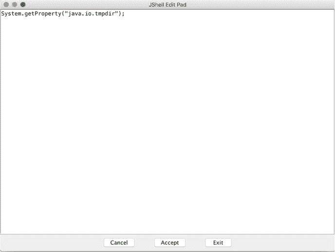

# 3. jshell

jshell 是一个实用的工具，它为 Java 添加了读取-求值-打印循环（REPL）。它允许开发者以交互方式尝试 Java 语言特性，或快速评估某些表达式。例如，Java 程序通常会将文件写入系统的临时目录。有时你可能想检查临时目录，以验证所创建文件的内容。要获取临时目录的路径，你需要获取 Java 系统属性 `java.io.tmpdir` 的值。你可以通过创建一个包含 main 方法并输出该值的简单 Java 程序来实现，或者使用 Apache Groovy 控制台（[`http://groovy-lang.org/groovyconsole.html`](http://groovy-lang.org/groovyconsole.html)）来快速运行代码。但对于此类简单任务，编写另一个 Java 程序似乎有些小题大做，而使用 Groovy 控制台则需要你下载并安装 Groovy。这两种方法都不太理想。现在，在 Java 9 中你有了一个更好的选择——jshell。

jshell 是 Java 9 中的一个内置工具。你可以通过运行命令 `jshell` 来启动它。

```
$ jshell
```

然后，你只需输入 `System.getProperty("java.io.tmpdir")` 即可获取该值；参见清单 3-1。

```
jshell> System.getProperty("java.io.tmpdir")
$1 ==> "/var/folders/27/9mrlr7kd3pdgv8cw9fq9_1z40000gn/T/"
清单 3-1.
在 jshell 中输入表达式
```

你可能会注意到输出中的 `$1`。这是对你刚刚输入的表达式结果的引用。你可以在 shell 中稍后使用此引用。在清单 3-2 中，输入 `$1.length()` 来获取 `$1` 的长度，并得到另一个引用 `$2`。现在 `$2` 引用了 `$1` 所引用字符串的长度。

```
jshell> $1.length()
$2 ==> 49
清单 3-2.
使用结果引用
```

如果你更喜欢使用命名恰当的引用，你可以创建变量并为其赋值；参见清单 3-3。

```
jshell> String tmpdir = System.getProperty("java.io.tmpdir")
tmpdir ==> "/var/folders/27/9mrlr7kd3pdgv8cw9fq9_1z40000gn/T/"
清单 3-3.
使用变量
```

## 代码补全

jshell 提供了基本的代码补全支持。当你按下 `<Tab>` 键时，可以看到一个可能的选项列表。例如，如果你输入 `System.get` 并按下 `<Tab>` 键，jshell 会列出 `System` 中所有以 `get` 开头的方法。

```
jshell> System.get
getLogger(             getProperties()        getProperty(
getSecurityManager()   getenv(
```

代码会自动补全到所有选项的最长公共前缀。例如，如果你输入 `System.getP` 并按下 `<Tab>` 键，代码会补全为 `System.getPropert`，并有两个选项：`getProperties()` 和 `getProperty(`。

## 类

除了简单的表达式，你还可以在 shell 中创建类。在清单 3-4 中，让我们创建一个包含抽象方法 `getArea()` 的抽象类 `Shape`。

```
jshell> abstract class Shape {
...>   protected abstract double getArea();
...> }
|  created class Shape
清单 3-4.
创建类 Shape
```

然后创建一个继承自 `Shape` 的新类 `Circle`；参见清单 3-5。

```
jshell> class Circle extends Shape {
...>   private final double radius;
...>   public Circle(final double radius) {
...>     this.radius = radius;
...>   }
...>   public double getArea() {
...>     return Math.PI * this.radius * this.radius;
...>   };
...> }
|  created class Circle
清单 3-5.
创建类 Circle
```

现在你可以创建 `Circle` 类的新实例并调用其方法；参见清单 3-6。

```
jshell> Circle circle1 = new Circle(10);
circle1 ==> Circle@2038ae61
jshell> circle1.getArea()
$7 ==> 314.1592653589793
清单 3-6.
创建类 Circle 的实例
```

## 方法

你也可以在 jshell 中添加方法。在清单 3-7 中，让我们创建一个 `add()` 方法。

```
jshell> int add(int x, int y) {
...>   return x + y;
...> }
|  created method add(int,int)
清单 3-7.
添加方法
```

你可以像清单 3-8 所示那样调用此方法。

```
jshell> add(1, 2)
$19 ==> 3
清单 3-8.
调用方法
```

## 命令

在 jshell 中输入 `/help`，你可以看到可用命令的列表。对于某个命令，例如 `/list`，你可以使用 `/help /list` 来查看该命令的详细帮助信息。

我将在以下章节中讨论这些命令。

### `/list`

`/list` 列出所有代码片段。每个代码片段都有一个 ID。代码片段有三种类型：

*   启动代码片段在启动期间自动求值。`/list -start` 仅显示启动代码片段。
*   活动代码片段是你输入的代码片段。`/list` 显示活动代码片段。
*   错误代码片段是你输入但编译失败的代码片段。

你可以使用 `/list -all` 列出所有代码片段；参见清单 3-9。每个代码片段前面都有一个 ID。启动代码片段的 ID 以 `s` 为前缀，而错误代码片段的 ID 以 `e` 为前缀。你可以看到像 `s1`、`s2` 或 `e3` 这样的 ID。活动代码片段的 ID 与其求值结果的引用名称相匹配。例如，你可以使用 `$7` 来引用 ID 为 `7` 的代码片段的求值结果。如果你想引用之前的代码片段，可以先使用 `/list` 找到其 ID，然后使用 `$<id>` 来引用其结果。

你也可以使用 `/list <snippet id>` 按 ID 列出代码片段的源代码，例如 `/list s1` 或 `/list 4`。

```
s1 : import java.io.*;
s2 : import java.math.*;
s3 : import java.net.*;
s4 : import java.nio.file.*;
s5 : import java.util.*;
s6 : import java.util.concurrent.*;
s7 : import java.util.function.*;
s8 : import java.util.prefs.*;
s9 : import java.util.regex.*;
s10 : import java.util.stream.*;
1 : System.getProperty("java.io.tmpdir")
2 : $1.length()
e1 : tmpdir = System.getProperty("java.io.tmpdir")
3 : String tmpdir = System.getProperty("java.io.tmpdir");
4 : abstract class Shape {
protected abstract double getArea();
}
清单 3-9.
/list -all 的输出
```

### `/edit`

`/edit` 按 ID 编辑代码片段——例如，你可以使用 `/edit 1` 来编辑 ID 为 `1` 的代码片段。会打开一个新窗口，其中包含该代码片段的当前源代码；参见图 3-1。



图 3-1.

JShell 编辑面板

如果你在新窗口中将源代码更新为 `System.getProperty("os.name");` 并点击“接受”以保存，则会创建并运行一个新的代码片段。

### `/drop`

`/drop` 按 ID 删除代码片段；例如，使用 `/drop 1` 删除 ID 为 `1` 的代码片段，如清单 3-10 所示。

```
jshell> /drop 23
|  dropped variable $23
清单 3-10.
按 ID 删除代码片段
```

### `/save`

`/save` 将代码片段和命令保存到文件。你可以分别使用 `/save -all`、`/save` 或 `/save -start` 选择保存所有代码片段、活动代码片段或启动代码片段。你也可以使用 `/save -history` 来保存命令；参见清单 3-11。

```
jshell> /save -history ∼/Downloads/snippets.txt
清单 3-11.
保存代码片段
```


### `/open`

`/open` 命令用于打开文件并将其内容作为输入源。例如，你可以创建一个包含清单 3-12 所示内容的 `rectangle.txt` 文件。

```
class Rectangle extends Shape {
private final double width;
private final double height;
public Rectangle(final double width, final double height) {
this.width = width;
this.height = height;
}
public double getArea() {
return this.width * this.height;
}
}
清单 3-12.
文件 rectangle.txt 的内容
```

然后，你可以使用 `/open` 命令打开该文件，如清单 3-13 所示。

```
/open ∼/Downloads/rectangle.txt
清单 3-13.
使用 /open 打开文件
```

当使用 `/list` 检查代码片段时，你会发现该文件已作为 ID 为 `27` 的新代码片段添加。现在你可以使用 `Rectangle` 类了，参见清单 3-14。

```
jshell> Rectangle rectangle = new Rectangle(10, 5)
rectangle ==> Rectangle@11438d26
jshell> rectangle.getArea()
$29 ==> 50.0
清单 3-14.
使用 Rectangle 类
```

### `/imports`

`/imports` 命令列出所有已导入的项，参见清单 3-15。

```
jshell> /imports
|    import java.io.*
|    import java.math.*
|    import java.net.*
|    import java.nio.file.*
|    import java.util.*
|    import java.util.concurrent.*
|    import java.util.function.*
|    import java.util.prefs.*
|    import java.util.regex.*
|    import java.util.stream.*
清单 3-15.
列出所有已导入的项
```

### `/vars`

`/vars` 命令列出所有已声明的变量及其值，参见清单 3-16。它还支持 `-all` 和 `-start` 标志。

```
jshell> /vars
|    String $1 = "/var/folders/27/9mrlr7kd3pdgv8cw9fq9_1z40000gn/T/"
|    int $2 = 49
|    String tmpdir = "/var/folders/27/9mrlr7kd3pdgv8cw9fq9_1z40000gn/T/"
|    Circle circle1 = Circle@2038ae61
|    double $7 = 314.1592653589793
清单 3-16.
列出所有已声明的变量
```

### `/types`

`/types` 命令列出所有已声明的类型，参见清单 3-17。它还支持 `-all` 和 `-start` 标志。

```
jshell> /types
|    class Shape
|    class Circle
|    class Rectangle
清单 3-17.
列出所有已声明的类型
```

### `/methods`

`/methods` 命令列出所有已声明的方法，参见清单 3-18。它还支持 `-all` 和 `-start` 标志。

```
jshell> /methods
|    int add(int,int)
清单 3-18.
列出所有已声明的方法
```

### `/history`

`/history` 命令列出你输入的所有内容，参见清单 3-19。

```
jshell> /history
System.getProperty("java.io.tmpdir")
$1.length()
tmpdir = System.getProperty("java.io.tmpdir")
String tmpdir = System.getProperty("java.io.tmpdir")
清单 3-19.
列出你输入的所有内容
```

### `/env`

`/env` 命令用于显示或修改 jshell 的求值上下文。你可以使用 `/env` 来显示求值上下文的配置。要修改上下文，你需要至少传递 `-class-path`、`-module-path`、`-add-modules` 和 `-add-exports` 中的一个值。

`-class-path` 选项用于设置上下文的类路径。例如，如果你想在 jshell 中测试 Guava，你需要将其 JAR 文件添加到类路径中，参见清单 3-20。

```
jshell> /env -class-path ∼/Downloads/libs/guava-19.0.jar
清单 3-20.
将 JAR 文件添加到类路径
```

现在你可以使用 Guava 中的类了，参见清单 3-21。

```
jshell> import com.google.common.collect.Lists
jshell> Lists.newArrayList("hello", "world")
$27 ==> [hello, world]
清单 3-21.
使用 JAR 文件中的类
```

`-module-path`、`-add-modules` 和 `-add-exports` 选项的含义与第 2 章中 `javac` 或 `java` 使用的选项相同。

### `/set`

`/set` 命令用于配置 jshell。输入 `/set` 会显示当前配置。`/set` 有几个子命令：

*   `/set editor`：指定 `/edit` 命令使用的编辑器；例如，输入 `/set editor -wait atom` 使用 Atom 编辑器（[`https://atom.io/`](https://atom.io/)）。使用 `-wait` 标志很重要，它能让 jshell 等待编辑器关闭，否则 jshell 将无法捕获更改。
*   `/set start`：设置默认启动代码片段和命令的文件。如果你在使用 jshell 之前有一些设置代码需要运行，可以将这些代码放入一个文件，并使用 `/set start` 配置它优先运行。
*   `/set feedback`：设置反馈模式。可选值有 `normal`、`concise`、`silent` 和 `verbose`。此配置控制 jshell 提供的信息量。例如，如果将模式设置为 `verbose`，jshell 在运行代码片段时会提供更多信息，参见清单 3-22。

```
jshell> System.getProperty("java.io.tmpdir")
$4 ==> "/var/folders/27/9mrlr7kd3pdgv8cw9fq9_1z40000gn/T/"
|  created scratch variable $4 : String
清单 3-22.
verbose 反馈模式
```

jshell 允许对反馈模式进行细粒度控制，包括显示的提示符、显示值的最大长度以及字段的格式。这些可以通过以下命令进行配置：

*   `/set prompt <mode>`：设置显示的提示符
*   `/set truncation <mode>`：设置显示值的最大长度
*   `/set format <mode> <field>`：设置字段的格式

直接输入这些命令会显示当前配置。

### `/reset`

`/reset` 命令重置 jshell 的内部状态。重置后，所有正常和错误的代码片段及变量都会被移除。启动代码片段会重新执行。由 `/set` 所做的配置更改会保留。`/reset` 支持与 `/env` 相同的选项：`-class-path`、`-module-path`、`-add-modules` 和 `-add-exports`。

### `/reload`

`/reload` 命令重置 jshell，并按输入顺序重放每个有效的代码片段和 `/drop` 命令。`/reload` 支持两种模式：普通模式和恢复模式。在普通模式下使用 `/reload`，它只会重放自上次进入 jshell 以来，或自执行 `/reset` 或 `/reload` 命令以来的有效历史记录。在恢复模式下使用 `/reload -restore`，它会重放自上次进入 jshell 到最近一次进入 jshell 之间，或自执行 `/reset` 或 `/reload` 命令以来的有效历史记录。恢复模式可以重放上一次 jshell 会话的历史记录。当传递 `-quiet` 选项时，`/reload` 不会显示重放的输出，但错误仍会显示。`/reload` 也支持与 `/env` 相同的选项：`-class-path`、`-module-path`、`-add-modules` 和 `-add-exports`。

使用 `/env` 修改求值上下文后，历史记录会被静默重放，就像调用了 `/reload -quiet` 命令一样。

### `/!`

此命令重新运行上一个代码片段。

### `/<id>`

此命令重新运行具有指定 ID 的代码片段。

### `/-<n>`

此命令重新运行第 n 个代码片段。

### `/exit`

此命令退出 jshell。

## 总结

jshell 是一个非常有用的工具，开发人员可以用它来快速测试代码并验证结果。本章详细介绍了 jshell 的所有功能，包括所有可用的命令。在下一章中，我将讨论 Java 9 中集合、`Stream` 和 `Optional` 的变更。

