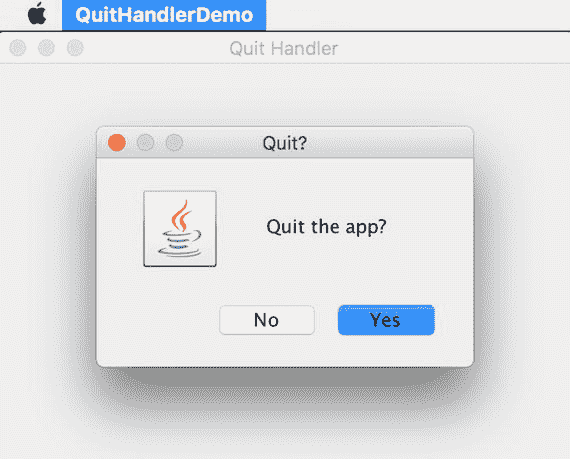
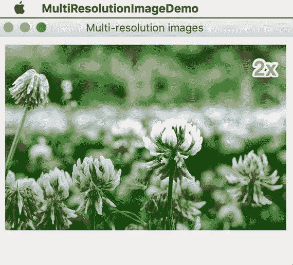

# 14. 用户界面

大量桌面应用程序仍使用 Java 开发。Java 9 持续改进对这些桌面应用程序的支持。

## Desktop

`java.awt.Desktop` 类允许 Java 应用程序与各种桌面功能进行交互。Java 9 通过增加更多功能扩展了这种支持。然而，这些新功能可能并非所有原生平台都支持。如果底层平台不支持某项功能，则相应的方法将不起作用。所有这些功能在 `Desktop.Action` 中都有一个枚举值。你可以使用 `Desktop` 中的 `boolean isSupported(Desktop.Action action)` 方法来检查某个操作是否受支持。

### 应用程序事件

方法 `void addAppEventListener(SystemEventListener listener)` 为来自原生系统的不同类型的系统事件添加监听器。`SystemEventListener` 针对不同的系统事件有以下子接口：

*   `AppForegroundListener`：当应用程序成为前台应用程序以及不再是前台应用程序时收到通知。
*   `AppHiddenListener`：当应用程序被用户隐藏或显示时收到通知。
*   `AppReopenedListener`：当应用程序被要求重新打开时收到通知。
*   `ScreenSleepListener`：当显示器进入省电休眠状态以及从省电休眠状态唤醒后收到通知。
*   `SystemSleepListener`：当系统进入休眠状态以及系统唤醒后收到通知。
*   `UserSessionListener`：当用户会话切换到当前会话以及从当前会话切换出去时收到通知。

如果底层系统不支持特定类型的系统事件，添加相应的监听器将不起作用。你可以使用 `void removeAppEventListener(SystemEventListener listener)` 方法移除已添加的监听器。

你还可以使用 `void requestForeground(boolean allWindows)` 方法请求将应用程序移至前台。如果参数 `allWindows` 为 `true`，则应用程序的所有窗口都将移至前台，否则仅移动最前面的窗口。

### 关于窗口

方法 `void setAboutHandler(AboutHandler aboutHandler)` 设置一个自定义处理程序，用于处理显示应用程序“关于”窗口的请求。将 `AboutHandler` 设置为 `null` 可以恢复为默认行为。

### 打开文件

方法 `void` `setOpenFileHandler` `(OpenFilesHandler openFileHandler)` 设置一个自定义处理程序，当应用程序被要求打开一组文件时收到通知。`OpenFilesHandler` 接收到的事件对象 `OpenFilesEvent` 包含文件列表以及用于查找文件的搜索词。

### 打印文件

方法 `void` `setPrintFileHandler` `(PrintFilesHandler printFileHandler)` 设置一个自定义处理程序，当应用程序被要求打印一组文件时收到通知。`PrintFilesHandler` 接收到的事件对象 `PrintFilesEvent` 包含要打印的文件列表。


### 打开 URI

方法 `void` `setOpenURIHandler` `(OpenURIHandler openURIHandler)` 用于设置一个自定义处理器，以便在应用程序被要求打开一个 URI 时获得通知。`OpenURIHandler` 接收的事件对象 `OpenURIEvent` 包含了要打开的 URI。

注意

在 macOS 上，仅当 Java 应用程序是一个捆绑应用程序，且其 `Info.plist` 中存在 `CFBundleDocumentTypes` 数组时，才会发送 `setOpenFileHandler()`、`setPrintFileHandler()` 和 `setOpenURIHandler()` 的通知。

### 应用程序退出

方法 `void setQuitStrategy(QuitStrategy strategy)` 用于设置退出应用程序的默认策略。枚举 `QuitStrategy` 包含两个值：

*   `CLOSE_ALL_WINDOWS` 表示通过从后往前关闭每个窗口来关闭应用程序。
*   `NORMAL_EXIT` 表示通过调用 `System.exit(0)` 来关闭应用程序。

方法 `void setQuitHandler(QuitHandler quitHandler)` 用于设置一个自定义处理器，以决定应用程序是否应该退出。方法 `void` `handleQuitRequestWith` `(QuitEvent e, QuitResponse response)` 接收两个参数：第一个参数 `QuitEvent` 代表事件；第二个参数 `QuitResponse` 代表对退出请求的响应。在 `handleQuitRequestWith()` 方法的实现中，你应该调用 `QuitResponse.cancelQuit()` 来取消退出请求，或者调用 `QuitResponse.performQuit()` 来执行默认的退出策略。

方法 `void enableSuddenTermination()` 和 `void disableSuddenTermination()` 分别用于启用和禁用应用程序的突然终止。如果应用程序可以被突然终止，它将在没有通知的情况下被终止。`QuitHandler` 不会收到通知，并且关闭钩子也不会运行。当你的应用程序状态已保存时，你应该调用 `enableSuddenTermination()` 方法来指示这一点。另一方面，如果你的应用程序状态尚未保存，你应该调用 `disableSuddenTermination()` 方法来指示这一点。

清单 14-2 展示了 `QuitHandler` 的演示。在 `QuitHandler` 的实现中，我显示了一个确认对话框，并根据用户的响应调用 `performQuit()` 或 `cancelQuit()`。

```
public class QuitHandlerDemo {
private static class MainFrame extends JFrame {
public MainFrame() throws HeadlessException {
setTitle("Quit Handler");
setSize(400, 300);
setVisible(true);
}
}
public static void main(final String[] args) {
final MainFrame frame = new MainFrame();
frame.setDefaultCloseOperation(JFrame.DO_NOTHING_ON_CLOSE);
final Desktop desktop = Desktop.getDesktop();
desktop.setQuitHandler((e, response) -> {
final int result = JOptionPane
.showConfirmDialog(frame, "Quit the app?", "Quit?", YES_NO_OPTION);
if (result == YES_OPTION) {
response.performQuit();
} else {
response.cancelQuit();
}
});
}
}
清单 14-2.
退出处理器
```

图 14-2 显示了清单 14-2 中的应用程序在 macOS 上运行的截图。点击退出菜单项后，会弹出确认对话框。如果你点击“否”，退出请求将被取消，应用程序继续运行。



图 14-2.

`QuitHandler` 演示

### 其他功能

这些其他方法提供了不同的功能。

*   `void openHelpViewer()`：打开原生帮助查看器应用程序
*   `void setDefaultMenuBar(JMenuBar menuBar)`：当没有框架处于活动状态时，设置默认菜单栏
*   `void browseFileDirectory(File file)`：打开包含该文件的文件夹，并在默认系统文件管理器中选中它
*   `boolean moveToTrash(File file)`：将文件移动到废纸篓

## 多分辨率图像

如果你开发过 iOS 应用程序，你应该对多分辨率图像很熟悉。iOS 应用程序中的图像资源可以包含多个不同分辨率的图像。这些图像具有相同的基本名称，但包含诸如 `@1x`、`@2x` 或 `@3x` 之类的后缀。系统会根据当前的显示 DPI 指标选择最合适的图像来显示。Java 9 为 AWT 图像 API 添加了相同的功能。

新接口 `java.awt.image.MultiResolutionImage` 表示支持多种分辨率的图像。`MultiResolutionImage` 有两个方法：方法 `Image getResolutionVariant(double destImageWidth, double destImageHeight)` 获取应在给定大小下渲染的特定图像；方法 `List<Image> getResolutionVariants()` 获取所有分辨率变体的列表。类 `BaseMultiResolutionImage` 是 `MultiResolutionImage` 的一个简单实现。`BaseMultiResolutionImage` 由图像数组构造而成。其 `getResolutionVariant()` 方法的实现只是遍历图像数组，并返回第一个足够大以满足渲染请求的图像。

大多数情况下，你不需要直接使用 `BaseMultiResolutionImage`。如果平台支持分辨率变体的命名约定，则从方法 `Toolkit.getImage(String name)` 和 `Toolkit.getImage(URL url)` 获取的图像将实现 `MultiResolutionImage` 接口。

清单 14-3 展示了一个使用多分辨率图像的示例。我在资源目录 `/images` 中有两个图像 `flower.png` 和 `flower@2x.png`。方法 `Toolkit.getImage(URL url)` 用于使用资源 URL 加载图像。

```
public class MultiResolutionImageDemo {
private static class ImageCanvas extends JComponent {
private final String name;
public ImageCanvas(final String name) {
this.name = name;
}
@Override
public void paint(final Graphics g) {
final Image image = Toolkit.getDefaultToolkit()
.getImage(
MultiResolutionImageDemo.class
.getResource(String.format("/images/%s", this.name)));
g.drawImage(image, 10, 10, this);
g.dispose();
}
}
public static void main(final String[] args) {
final JFrame frame = new JFrame();
frame.setTitle("Multi-resolution images");
frame.setDefaultCloseOperation(JFrame.EXIT_ON_CLOSE);
frame.setLayout(new BorderLayout());
final ImageCanvas canvas = new ImageCanvas("flower.png");
frame.add("Center", canvas);
frame.setSize(360, 300);
frame.setVisible(true);
}
}
清单 14-3.
多分辨率图像
```

在 macOS 上运行时，你可以看到实际加载的图像是 `flower@2x.png`。如图 14-3 所示，图像中的“2x”确认了它是 `flower@2x.png`。



图 14-3.

多分辨率图像演示

## TIFF 图像格式

Java 9 增加了对 TIFF 图像格式的支持。Image I/O 框架现在为 TIFF 格式添加了编解码器。

## 弃用 Applet API

Applet API 在 Java 9 中已被弃用，因为浏览器供应商移除了对 Java 浏览器插件的支持。注解 `@Deprecated(since="9")` 被添加到以下 Applet 相关的类中：

*   `java.applet.AppletStub`
*   `java.applet.Applet`
*   `java.applet.AudioClip`
*   `java.applet.AppletContext`
*   `javax.swing.JApplet`

`appletviewer` 工具也被弃用。但是，Applet API 不会在下一个主要版本中被移除。由于如今 Applet 的使用相当罕见，这种弃用应该只会产生轻微影响。

## 总结

在本章中，我们讨论了 AWT `Desktop` 的新增功能、多分辨率图像、TIFF 图像格式以及 Applet API 的弃用。在下一章中，我们将讨论与 JVM 相关的更改。

