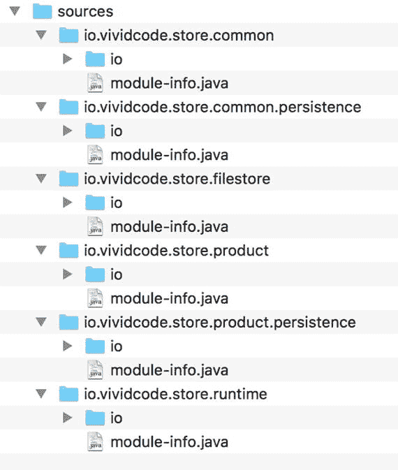

# 15. JVM

本章涵盖了 Java 9 中与 JVM 相关的更改。

## 统一日志记录

在 Java 9 中，JVM 为所有组件提供了一个通用的日志记录系统。新的命令行选项 `-Xlog` 控制 JVM 所有组件的日志记录。新的统一日志记录系统支持标签、级别、修饰和输出。


### 标签、级别、装饰与输出

标签用于对日志消息进行分类。一条日志消息可以与一个包含一个或多个标签的标签集相关联。JVM 预定义了一组标签，例如 `gc`、`system`、`thread`。每条日志消息都有一个与之关联的日志级别，就像使用 Java 日志框架记录的消息一样。可用的级别有 `error`、`warning`、`info`、`debug`、`trace` 和 `develop`。`develop` 仅在非产品构建中可用。日志消息会附带关于消息的装饰信息。以下是可能的装饰列表：

*   `time`：ISO-8601 格式的当前时间和日期
*   `utctime`：ISO-8601 格式的当前 UTC 时间和日期
*   `uptime`：自 JVM 启动以来的时间（秒和毫秒）
*   `timemillis`：与 `System.currentTimeMillis()` 生成的值相同
*   `uptimemillis`：自 JVM 启动以来的毫秒数
*   `timenanos`：与 `System.nanoTime()` 生成的值相同
*   `uptimenanos`：自 JVM 启动以来的纳秒数
*   `hostname`：主机名
*   `pid`：进程标识符
*   `tid`：线程标识符
*   `level`：日志级别
*   `tags`：标签集

输出是日志消息的目的地。支持三种类型的输出：

*   `stdout`：输出到 `stdout`。
*   `stderr`：输出到 `stderr`。
*   文本文件：输出到文本文件。

文本文件输出支持基于大小和最大文件数量的文件轮转。

对于每个输出，你可以配置一个日志级别来控制写入该输出的日志消息数量。例如，如果输出的日志级别设置为 `info`，则只会写入级别为 `error`、`warning` 和 `info` 的消息。这与在 Java 中使用其他日志框架相同。日志级别也可以设置为 `off` 以禁用日志记录。你还可以配置输出使用的装饰器集合。装饰内容将被添加到日志消息之前。

### 日志配置

JVM 日志系统的配置通过 `-Xlog` 选项完成。该选项的语法有点复杂。理解语法的最佳方式是运行命令 `java -Xlog:help`；然后帮助信息将打印到控制台。该选项包含四个部分，以冒号（`:`）分隔，格式为 `-Xlog[:[what][:[output][:[decorators][:output-options]]]]`。

第一部分 `what` 选择要输出的日志消息。其值是一个逗号分隔的选择器列表。每个选择器包含一个标签集和一个可选的日志级别。标签集中的标签用加号（`+`）分隔。标签集和日志级别用等号（`=`）分隔。通配符（`*`）可用于匹配任意数量的标签。所有可用标签都列在 `-Xlog:help` 的输出中。默认日志级别是 `info`。以下是第一部分的一些示例：

*   `gc`：选择标签 `gc`，级别为 `info`
*   `gc+heap=debug`：选择标签 `gc` 和 `heap`，级别为 `debug`
*   `gc=debug,heap=warning`：选择标签 `gc`，级别为 `debug`，以及标签 `heap`，级别为 `warning`
*   `*`：选择所有标签，级别为 `info`
*   `*=debug`：选择所有标签，级别为 `debug`

如果一个标签集包含多个标签，则只有当一条日志消息恰好与该标签集中的所有标签关联时，才能被选中。当有多个选择器时，选中的日志消息必须匹配所有选择器。

第二部分 `output` 配置日志消息的输出。以下是一些可能的值：

*   `stdout`
*   `stderr`
*   `file=<filename>`：支持在文件名中使用 `%p` 和/或 `%t`，分别表示 JVM 的 PID 和启动时间戳。

第三部分 `decorators` 是一个逗号分隔的装饰器列表。你可以使用 `none` 来禁用装饰。装饰器的默认值是 `"uptime,level,tags"`。

最后一部分 `output-options` 是输出的额外逗号分隔选项。每个选项是一个由等号（`=`）分隔的名称-值对。支持两个选项：

*   `filecount`：滚动日志文件的最大数量
*   `filesize`：每个日志文件的最大大小

通过组合这四个部分，你可以配置日志系统的行为。以下是一些示例：

*   `-Xlog`：等同于 `-Xlog:all=info:stdout:uptime,levels,tags`。
*   `-Xlog:gc,class`：记录与标签 `gc` 或 `class` 关联的消息，使用级别 `info`，输出到 `stdout`，使用默认装饰。同时与 `gc` 和 `class` 关联的消息不会被记录。
*   `-Xlog:gc+class`：记录同时与标签 `gc` 和 `class` 关联的消息，使用级别 `info`，输出到 `stdout`，使用默认装饰。仅与两个标签之一关联的消息不会被记录。
*   `-Xlog:gc=debug:file=gc_%p.txt`：记录与标签 `gc` 关联的消息，使用级别 `debug`，输出到文件。文件名中包含 JVM 的 PID。
*   `-Xlog:gc=debug:file=gc.txt:time:filecount=5,filesize=1m`：记录与标签 `gc` 关联的消息，使用级别 `debug`，输出到文件 `gc.txt`。滚动文件的最大数量为 `5`，每个文件的最大大小为 `1M`。

你也可以使用 `-Xlog:disable` 来禁用所有日志记录，包括错误和警告。

借助新的统一日志系统，GC 日志记录已更新为利用同一系统。所有与 GC 相关的日志消息都与标签 `gc` 关联。应使用 `-Xlog:gc` 来替代 `-XX:+PrintGC` 和 `-XX:+PrintGCDetails`。

### 诊断命令 VM.log

日志配置可以在运行时通过 `jcmd` 使用诊断命令 `VM.log` 进行更新。`-Xlog` 支持的所有选项都可以使用此命令动态指定。由于诊断命令会自动暴露为 MBeans，你也可以使用 JMX 在运行时更改日志配置。

要在运行时配置日志记录，首先使用 `jcmd` 列出所有 Java 进程并找到要配置的应用程序的 PID。你也可以使用主类名来选择要检查的进程。以下命令中的选项 `list` 用于列出当前的日志配置。`31683` 是 PID。

```
$ jcmd 31683 VM.log list
```

你可以使用键值对来指定前面提到的四个部分的值：`what`、`output`、`decorators` 和 `output-options`。使用以下命令，你可以将日志配置更新为类似于 `-Xlog:all=log:file=all.txt:time,level,tags`。

```
$ jcmd 31683 VM.log what=all=info output=all.txt decorators=time,level,tags
```

要禁用日志记录，可以使用以下命令：

```
$ jcmd 31683 VM.log disable
```

你也可以使用此命令强制轮转日志文件：

```
$ jcmd 31683 VM.log rotate
```


## 移除 GC 组合

GC 调优是 JVM 性能调优中的一项重要任务。JVM 提供了多种使用不同 GC 算法的 GC 组合。其中一些 GC 组合在 Java 8 中已被弃用。这些被弃用的 GC 组合已在 Java 9 中被移除，详见表 15-1。如果使用了这些 GC 组合，JVM 将无法启动。由于 JVM 在 Java 8 中已针对这些 GC 组合打印了警告信息，现有应用程序应已迁移至其他 GC 组合。如果你的应用程序仍在使用这些被弃用的 GC 组合，则应在迁移后执行全面的性能测试。

表 15-1.

已移除的 GC 组合

| GC 配置 | 标志 | 推荐配置 |
| --- | --- | --- |
| DefNew + CMS | `-XX:-UseParNewGC` `-XX:+UseConcMarkSweepGC` | ParNew + CMS |
| ParNew + SerialOld | `-XX:+UseParNewGC` | ParallelScavenge + SerialOld |
| ParNew + iCMS | `-Xincgc` | CMS |
| ParNew + iCMS | `-XX:+CMSIncrementalMode` `-XX:+UseConcMarkSweepGC` | CMS |
| DefNew + iCMS | `-XX:+CMSIncrementalMode` `-XX:+UseConcMarkSweepGC` `-XX:-UseParNewGC` | CMS |
| CMS foreground | `-XX:+UseCMSCompactAtFullCollection` | G1 或 CMS |
| CMS foreground | `-XX:+CMSFullGCsBeforeCompaction` | G1 或 CMS |
| CMS foreground | `-XX:+UseCMSCollectionPassing` | G1 或 CMS |

## 将 G1 设为默认垃圾回收器

在 Java 9 中，G1 成为 32 位和 64 位服务器配置上的默认垃圾回收器。作为一款低停顿收集器，G1 应能提供比吞吐量导向型收集器（如 Java 8 中的默认 GC——Parallel GC）更优的整体性能。

## 弃用并发标记清除 (CMS) 垃圾回收器

既然 G1 已成为默认垃圾回收器，并发标记清除 (CMS) 垃圾回收器已被弃用，并且其支持将在未来的主要版本中移除。当使用命令行选项 `-XX:+UseConcMarkSweepGC` 时，JVM 会发出警告信息。

## 移除启动时 JRE 版本选择

JDK 5 引入了多 JRE (mJRE) 功能，允许开发者指定启动应用程序所需的 JRE 版本或版本范围。版本要求可以在应用程序 JAR 文件的清单条目 `JRE-Version` 中指定，也可以作为 `java` 命令的命令行选项 `-version:` 指定。如果当前 JRE 的版本不满足要求，它会尝试搜索满足要求的版本并启动该版本。

这个 mJRE 功能听起来很有用，但在实践中很少使用。该功能已在 Java 9 中被移除。`java` 命令的命令行选项 `-version:` 也已被移除。如果在 JAR 文件中找到清单条目 `JRE-Version`，启动器会发出警告信息并继续执行。

## 更多诊断命令

Java 9 中新增了更多可与 `jcmd` 一起运行的诊断命令。你可以使用 jcmd 的 `help` 选项列出所有可用的诊断命令，请参见以下代码。`6239` 是进程 ID。

```
$ jcmd 6239 help
```

清单 15-1 展示了 Java 8 中可用的诊断命令列表。

```
JFR.stop
JFR.start
JFR.dump
JFR.check
VM.native_memory
VM.check_commercial_features
VM.unlock_commercial_features
ManagementAgent.stop
ManagementAgent.start_local
ManagementAgent.start
GC.rotate_log
Thread.print
GC.class_stats
GC.class_histogram
GC.heap_dump
GC.run_finalization
GC.run
VM.uptime
VM.flags
VM.system_properties
VM.command_line
VM.version
清单 15-1.
Java 8 中的诊断命令
```

清单 15-2 展示了 Java 9 中可用的诊断命令列表。

```
JFR.configure
JFR.stop
JFR.start
JFR.dump
JFR.check
VM.log
VM.native_memory
ManagementAgent.status
ManagementAgent.stop
ManagementAgent.start_local
ManagementAgent.start
Compiler.directives_clear
Compiler.directives_remove
Compiler.directives_add
Compiler.directives_print
VM.print_touched_methods
Compiler.codecache
Compiler.codelist
Compiler.queue
VM.classloader_stats
Thread.print
JVMTI.data_dump
JVMTI.agent_load
VM.stringtable
VM.symboltable
VM.class_hierarchy
GC.class_stats
GC.class_histogram
GC.heap_dump
GC.finalizer_info
GC.heap_info
GC.run_finalization
GC.run
VM.info
VM.uptime
VM.dynlibs
VM.set_flag
VM.flags
VM.system_properties
VM.command_line
VM.version
清单 15-2.
Java 9 中的诊断命令
```

当你比较清单 15-1 和清单 15-2 中的列表时，可以看到新增了许多诊断命令。对于每个命令，你可以使用以下 `help` 命令查看帮助信息。

```
$ jcmd 6239 help VM.info
```

以下是这些新命令的简要说明：

*   `JFR.configure`：配置 Java Flight Recorder
*   `VM.log`：配置统一日志系统
*   `VM.classloader_stats`：显示所有类加载器的统计信息
*   `VM.stringtable`：显示 JVM 的 StringTable 统计信息
*   `VM.symboltable`：显示 JVM 的 SymbolTable 统计信息
*   `VM.print_touched_methods`：显示在此 JVM 生命周期内所有曾被触及的方法；需要选项 `-XX:+LogTouchedMethods`
*   `VM.class_hierarchy`：显示所有已加载类的层次结构
*   `VM.info`：显示 JVM 环境和状态信息
*   `VM.dynlibs`：显示已加载的动态库
*   `VM.set_flag`：设置 VM 标志
*   `ManagementAgent.status`：显示管理代理的状态
*   `Compiler.directives-`*：管理编译器指令
*   `Compiler.codecache`：显示编译器代码缓存的布局和边界
*   `Compiler.codelist`：显示代码缓存中所有存活的已编译方法
*   `Compiler.queue`：显示排队等待编译的方法
*   `JVMTI.data_dump`：通知 JVM 执行数据转储
*   `JVMTI.agent_load`：加载 JVMTI 原生代理
*   `GC.heap_info`：显示 Java 堆信息
*   `GC.finalizer_info`：显示 Java 终结队列的信息。

## 移除 JVM TI hprof 代理

`hprof` 代理是作为 JVM 工具接口的示例项目添加的，并非旨在成为生产工具。该代理已在 Java 9 中被移除。如果你想使用此代理提供的功能，应切换到其他 Java 内置工具或第三方解决方案，详见表 15-2。

表 15-2.

`hprof` 代理的替代方案

| 功能 | 替代工具 |
| --- | --- |
| 堆转储 | 诊断命令 `GC.heap_dump` 或 `jmap -dump` |
| 分配分析器 | VisualVM |
| CPU 分析器 | VisualVM 或 Flight Recorder |

### 移除 jhat 工具

`jhat` 工具在 JDK 6 中引入，是一个用于堆可视化和分析的实验性且不受支持的工具。该工具已在 JDK 9 中被移除。

### 移除演示和示例

虽然你可能没有注意到，但 JDK 实际上附带了一些演示和示例。然而，这些演示和示例已经过时且无人维护，因此已在 JDK 9 中被移除。


## Javadoc

`javadoc` 工具在 JDK 9 中支持生成 HTML5 标记。当使用 `-html5` 选项时，`javadoc` 会生成 HTML5 标记。HTML4 仍然是默认的输出类型，但 HTML5 将在 JDK 10 中成为默认选项。生成的 HTML5 标记使用了语义化的结构性 HTML5 元素，包括 `header`、`footer` 和 `nav`。它还实现了用于无障碍访问的 WAI-ARIA 标准。

`javadoc` 生成的文档中新增了一个搜索框。用户可以使用它来搜索程序元素以及被索引的术语和短语。模块、包、类型和成员的名称都会被索引并可搜索。你可以使用新的标签 `@index` 将某个术语或短语标记为可搜索。

生成的文档已升级，包含了模块信息。对于每个模块，文档会显示其模块依赖关系和导出的包。

`javadoc` 工具现在支持为多个模块生成文档。你可以使用 `--module-source-path` 选项提供模块的源代码，并使用 `--module` 选项指定要处理的模块。第三方库则使用 `-p` 选项指定。在模块源目录中，每个子目录包含一个模块的源代码。子目录名称必须与模块名称一致；示例应用程序的源代码请参见图 15-1。模块源路径必须采用这种目录结构，否则 `javadoc` 无法找到这些模块。



图 15-1.

Javadoc 模块源路径的目录结构

例如，你可以使用以下命令为示例项目生成文档。`-d` 选项指定输出目录，而 `-link` 选项用于链接 Java 内置 API 的文档。

```
$ javadoc --module-source-path  \
-p  \
-d 
--module  \
-link https://docs.oracle.com/javase/9/docs/api/
```

由于示例应用程序是一个 Maven 项目，你需要使用一个额外的任务将所有模块的源代码复制到一个目录中，以便进行 Javadoc 生成。你可以通过使用 Ant 任务来完成此操作。你可以查看源代码了解其实现方式。

## 总结

在本章中，我们讨论了与 JVM 相关的变更，包括统一日志系统、已移除的 GC 组合、诊断命令、javadoc 以及其他一些小改动。在下一章中，我们将讨论 Java 9 中的其他几项小改动。

