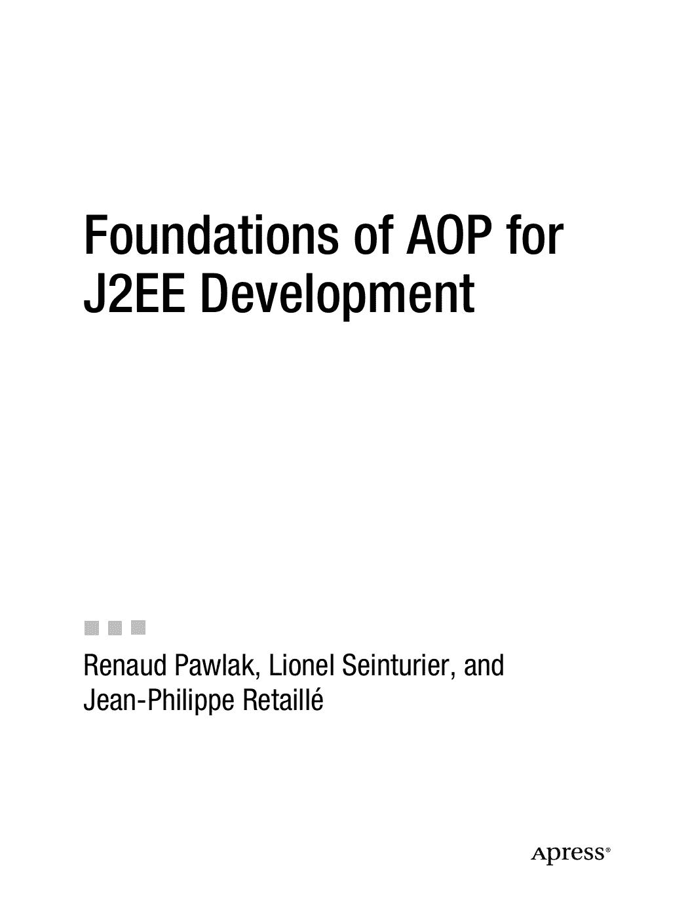

面向 J2EE 开发的

AOP 基础

Renaud Pawlak, Lionel Seinturier, 与

Jean-Philippe Retaillé

**面向 J2EE 开发的 AOP 基础** **版权所有 © 2005 Renaud Pawlak, Lionel Seinturier, 与 Jean-Philippe Retaillé** 保留所有权利。未经版权所有者及出版人事先书面许可，不得以任何形式或任何方式（电子或机械，包括影印、录制，或通过任何信息存储或检索系统）复制或传播本作品的任何部分。

ISBN: 1-59059-507-6

在美国印刷并装订 9 8 7 6 5 4 3 2 1

本书中可能出现商标名称。我们不在每次出现商标名称时使用商标符号，仅以编辑方式使用这些名称，以利于商标所有者，无意侵犯商标权。

首席编辑：Steve Anglin

技术审校：Houman Younessi

编辑委员会：Steve Anglin, Dan Appleman, Ewan Buckingham, Gary Cornell, Tony Davis, Jason Gilmore, Jonathan Hassell, Chris Mills, Dominic Shakeshaft, Jim Sumser 副出版人：Grace Wong

翻译：Chelsea Creekmore

项目经理：Sofia Marchant

文案编辑经理：Nicole LeClerc

文案编辑：Linda Harmony, Ami Knox, Nicole LeClerc

助理制作总监：Kari Brooks-Copony

制作编辑：Katie Stence

排版与美工：Wordstop Technologies Pvt. Ltd., Chennai 校对：Elizabeth Berry

索引编制：John Collin

内页设计：Van Winkle Design Group

封面设计：Kurt Krames

制造总监：Tom Debolski

本书通过 Springer-Verlag New York, Inc. 在全球图书贸易中发行，地址：233 Spring Street, 6th Floor, New York, NY 10013。电话：1-800-SPRINGER，传真：201-348-4505，电子邮件：orders-ny@springer-sbm.com，或访问 http://www.springeronline.com。

有关翻译信息，请直接联系 Apress，地址：2560 Ninth Street, Suite 219, Berkeley, CA 94710。电话：510-549-5930，传真：510-549-5939，电子邮件：info@apress.com，或访问 http://www.apress.com。

本书中的信息按“原样”分发，不提供任何担保。尽管在编写本作品时已采取一切预防措施，但作者和 Apress 均不对因本作品所含信息直接或间接引起的任何损失或损害对任何个人或实体承担责任。

本书的源代码可在 http://www.apress.com 的源代码部分供读者获取。

*献给我们家人和朋友*

内容一览

前言. . . . . . . . . . . . . . . . . . . . . . . . . . . . . . . . . . . . . . . . . . . . . . . . . . . . . . . . . . . . . . . . . . . . . . . . . xv
关于作者. . . . . . . . . . . . . . . . . . . . . . . . . . . . . . . . . . . . . . . . . . . . . . . . . . . . . . . . . . . . . . . . . . . . xvii
关于技术审校. . . . . . . . . . . . . . . . . . . . . . . . . . . . . . . . . . . . . . . . . . . . . . . . . . . . . . . . . . . . . . . . . xix
引言. . . . . . . . . . . . . . . . . . . . . . . . . . . . . . . . . . . . . . . . . . . . . . . . . . . . . . . . . . . . . . . . . . . . . . . . . xxi

■**第 1 章**

AOP 简介. . . . . . . . . . . . . . . . . . . . . . . . . . . . . . . . . . . . . . . . . . . . . . . . . . . . . . . . . . . . . . . . . . . . . . 1

■**第 2 章**

AOP 的概念. . . . . . . . . . . . . . . . . . . . . . . . . . . . . . . . . . . . . . . . . . . . . . . . . . . . . . . . . . . . . . . . . . . . 7

■**第 3 章**

AspectJ. . . . . . . . . . . . . . . . . . . . . . . . . . . . . . . . . . . . . . . . . . . . . . . . . . . . . . . . . . . . . . . . . . . . . . . 23

■**第 4 章**

Java 方面组件. . . . . . . . . . . . . . . . . . . . . . . . . . . . . . . . . . . . . . . . . . . . . . . . . . . . . . . . . . . . . . . . . 61

■**第 5 章**

JBoss AOP. . . . . . . . . . . . . . . . . . . . . . . . . . . . . . . . . . . . . . . . . . . . . . . . . . . . . . . . . . . . . . . . . . . . . 91

■**第 6 章**

Spring AOP. . . . . . . . . . . . . . . . . . . . . . . . . . . . . . . . . . . . . . . . . . . . . . . . . . . . . . . . . . . . . . . . . . . 113

■**第 7 章**


AOP 工具比较. . . . . . . . . . . . . . . . . . . . . . . . . . . . . . . . . . . . . . . . . . . . . . . . . . . . . . . . . 137

■**第 8 章**

设计模式与 AOP . . . . . . . . . . . . . . . . . . . . . . . . . . . . . . . . . . . . . . . . . . . . . . . . . . . . . . . 149

■**第 9 章**

服务质量与 AOP . . . . . . . . . . . . . . . . . . . . . . . . . . . . . . . . . . . . . . . . . . . . . . . . . . . . . . 171

■**第 10 章** 示例应用程序介绍 . . . . . . . . . . . . . . . . . . . . . . . . . . . . . . . . . . . . . . . . . . . . . . . . 205

■**第 11 章** 在示例应用程序的业务层中使用 AOP . . . . . . . . . . . . . . . . . . . . . . . . . . . . . . . . . . . . . . . . . . . . . . . . . . . . . . . . . . . . . . . . . . . . . . . . . . . . . . . . . . . . . . . . . . . . . . . . . . . . . . . . . . . . . . . . . . . . . . . . . . . . . . . . . . . . . . . . . . . . . . . . . . . . . . . . . . . . . . . . . . . . . . . . . . . . . . . . . . . . . . . . . . . . . . . . . . . . . . . . . . . . . . . . . . . . . . . . . . . . . . . . . . . . . . . . . . . . . . . . . . . . . . . . . . . . . . . . . . . . . . . . . . . . . . . . . . . . . . . . . . . . . . . . . . . . . . . . . . . . . . . . . . . . . . . . . . . . . . . . . . . . . . . . . . . . . . . . . . . . . . . . . . . . . . . . . . . . . . . . . . . . . . . . . . . . . . . . . . . . . . . . . . . . . . . . . . . . . . . . . . . . . . . . . . . . . . . . . . . . . . . . . . . . . . . . . . . . . . . . . . . . . . . . . . . . . . . . . . . . . . . . . . . . . . . . . . . . . . . . . . . . . . . . . . . . . . . . . . . . . . . . . . . . . . . . . . . . . . . . . . . . . . . . . . . . . . . . . . . . . . . . . . . . . . . . . . . . . . . . . . . . . . . . . . . . . . . . . . . . . . . . . . . . . . . . . . . . . . . . . . . . . . . . . . . . . . . . . . . . . . . . . . . . . . . . . . . . . . . . . . . . . . . . . . . . . . . . . . . . . . . . . . . . . . . . . . . . . . . . . . . . . . . . . . . . . . . . . . . . . . . . . . . . . . . . . . . . . . . . . . . . . . . . . . . . . . . . . . . . . . . . . . . . . . . . . . . . . . . . . . . . . . . . . . . . . . . . . . . . . . . . . . . . . . . . . . . . . . . . . . . . . . . . . . . . . . . . . . . . . . . . . . . . . . . . . . . . . . . . . . . . . . . . . . . . . . . . . . . . . . . . . . . . . . . . . . . . . . . . . . . . . . . . . . . . . . . . . . . . . . . . . . . . . . . . . . . . . . . . . . . . . . . . . . . . . . . . . . . . . . . . . . . . . . . . . . . . . . . . . . . . . . . . . . . . . . . . . . . . . . . . . . . . . . . . . . . . . . . . . . . . . . . . . . . . . . . . . . . . . . . . . . . . . . . . . . . . . . . . . . . . . . . . . . . . . . . . . . . . . . . . . . . . . . . . . . . . . . . . . . . . . . . . . . . . . . . . . . . . . . . . . . . . . . . . . . . . . . . . . . . . . . . . . . . . . . . . . . . . . . . . . . . . . . . . . . . . . . . . . . . . . . . . . . . . . . . . . . . . . . . . . . . . . . . . . . . . . . . . . . . . . . . . . . . . . . . . . . . . . . . . . . . . . . . . . . . . . . . . . . . . . . . . . . . . . . . . . . . . . . . . . . . . . . . . . . . . . . . . . . . . . . . . . . . . . . . . . . . . . . . . . . . . . . . . . . . . . . . . . . . . . . . . . . . . . . . . . . . . . . . . . . . . . . . . . . . . . . . . . . . . . . . . . . . . . . . . . . . . . . . . . . . . . . . . . . . . . . . . . . . . . . . . . . . . . . . . . . . . . . . . . . . . . . . . . . . . . . . . . . . . . . . . . . . . . . . . . . . . . . . . . . . . . . . . . . . . . . . . . . . . . . . . . . . . . . . . . . . . . . . . . . . . . . . . . . . . . . . . . . . . . . . . . . . . . . . . . . . . . . . . . . . . . . . . . . . . . . . . . . . . . . . . . . . . . . . . . . . . . . . . . . . . . . . . . . . . . . . . . . . . . . . . . . . . . . . . . . . . . . . . . . . . . . . . . . . . . . . . . . . . . . . . . . . . . . . . . . . . . . . . . . . . . . . . . . . . . . . . . . . . . . . . . . . . . . . . . . . . . . . . . . . . . . . . . . . . . . . . . . . . . . . . . . . . . . . . . . . . . . . . . . . . . . . . . . . . . . . . . . . . . . . . . . . . . . . . . . . . . . . . . . . . . . . . . . . . . . . . . . . . . . . . . . . . . . . . . . . . . . . . . . . . . . . . . . . . . . . . . . . . . . . . . . . . . . . . . . . . . . . . . . . . . . . . . . . . . . . . . . . . . . . . . . . . . . . . . . . . . . . . . . . . . . . . . . . . . . . . . . . . . . . . . . . . . . . . . . . . . . . . . . . . . . . . . . . . . . . . . . . . . . . . . . . . . . . . . . . . . . . . . . . . . . . . . . . . . . . . . . . . . . . . . . . . . . . . . . . . . . . . . . . . . . . . . . . . . . . . . . . . . . . . . . . . . . . . . . . . . . . . . . . . . . . . . . . . . . . . . . . . . . . . . . . . . . . . . . . . . . . . . . . . . . . . . . . . . . . . . . . . . . . . . . . . . . . . . . . . . . . . . . . . . . . . . . . . . . . . . . . . . . . . . . . . . . . . . . . . . . . . . . . . . . . . . . . . . . . . . . . . . . . . . . . . . . . . . . . . . . . . . . . . . . . . . . . . . . . . . . . . . . . . . . . . . . . . . . . . . . . . . . . . . . . . . . . . . . . . . . . . . . . . . . . . . . . . . . . . . . . . . . . . . . . . . . . . . . . . . . . . . . . . . . . . . . . . . . . . . . . . . . . . . . . . . . . . . . . . . . . . . . . . . . . . . . . . . . . . . . . . . . . . . . . . . . . . . . . . . . . . . . . . . . . . . . . . . . . . . . . . . . . . . . . . . . . . . . . . . . . . . . . . . . . . . . . . . . . . . . . . . . . . . . . . . . . . . . . . . . . . . . . . . . . . . . . . . . . . . . . . . . . . . . . . . . . . . . . . . . . . . . . . . . . . . . . . . . . . . . . . . . . . . . . . . . . . . . . . . . . . . . . . . . . . . . . . . . . . . . . . . . . . . . . . . . . . . . . . . . . . . . . . . . . . . . . . . . . . . . . . . . . . . . . . . . . . . . . . . . . . . . . . . . . . . . . . . . . . . . . . . . . . . . . . . . . . . . . . . . . . . . . . . . . . . . . . . . . . . . . . . . . . . . . . . . . . . . . . . . . . . . . . . . . . . . . . . . . . . . . . . . . . . . . . . . . . . . . . . . . . . . . . . . . . . . . . . . . . . . . . . . . . . . . . . . . . . . . . . . . . . . . . . . . . . . . . . . . . . . . . . . . . . . . . . . . . . . . . . . . . . . . . . . . . . . . . . . . . . . . . . . . . . . . . . . . . . . . . . . . . . . . . . . . . . . . . . . . . . . . . . . . . . . . . . . . . . . . . . . . . . . . . . . . . . . . . . . . . . . . . . . . . . . . . . . . . . . . . . . . . . . . . . . . . . . . . . . . . . . . . . . . . . . . . . . . . . . . . . . . . . . . . . . . . . . . . . . . . . . . . . . . . . . . . . . . . . . . . . . . . . . . . . . . . . . . . . . . . . . . . . . . . . . . . . . . . . . . . . . . . . . . . . . . . . . . . . . . . . . . . . . . . . . . . . . . . . . . . . . . . . . . . . . . . . . . . . . . . . . . . . . . . . . . . . . . . . . . . . . . . . . . . . . . . . . . . . . . . . . . . . . . . . . . . . . . . . . . . . . . . . . . . . . . . . . . . . . . . . . . . . . . . . . . . . . . . . . . . . . . . . . . . . . . . . . . . . . . . . . . . . . . . . . . . . . . . . . . . . . . . . . . . . . . . . . . . . . . . . . . . . . . . . . . . . . . . . . . . . . . . . . . . . . . . . . . . . . . . . . . . . . . . . . . . . . . . . . . . . . . . . . . . . . . . . . . . . . . . . . . . . . . . . . . . . . . . . . . . . . . . . . . . . . . . . . . . . . . . . . . . . . . . . . . . . . . . . . . . . . . . . . . . . . . . . . . . . . . . . . . . . . . . . . . . . . . . . . . . . . . . . . . . . . . . . . . . . . . . . . . . . . . . . . . . . . . . . . . . . . . . . . . . . . . . . . . . . . . . . . . . . . . . . . . . . . . . . . . . . . . . . . . . . . . . . . . . . . . . . . . . . . . . . . . . . . . . . . . . . . . . . . . . . . . . . . . . . . . . . . . . . . . . . . . . . . . . . . . . . . . . . . . . . . . . . . . . . . . . . . . . . . . . . . . . . . . . . . . . . . . . . . . . . . . . . . . . . . . . . . . . . . . . . . . . . . . . . . . . . . . . . . . . . . . . . . . . . . . . . . . . . . . . . . . . . . . . . . . . . . . . . . . . . . . . . . . . . . . . . . . . . . . . . . . . . . . . . . . . . . . . . . . . . . . . . . . . . . . . . . . . . . . . . . . . . . . . . . . . . . . . . . . . . . . . . . . . . . . . . . . . . . . . . . . . . . . . . . . . . . . . . . . . . . . . . . . . . . . . . . . . . . . . . . . . . . . . . . . . . . . . . . . . . . . . . . . . . . . . . . . . . . . . . . . . . . . . . . . . . . . . . . . . . . . . . . . . . . . . . . . . . . . . . . . . . . . . . . . . . . . . . . . . . . . . . . . . . . . . . . . . . . . . . . . . . . . . . . . . . . . . . . . . . . . . . . . . . . . . . . . . . . . . . . . . . . . . . . . . . . . . . . . . . . . . . . . . . . . . . . . . . . . . . . . . . . . . . . . . . . . . . . . . . . . . . . . . . . . . . . . . . . . . . . . . . . . . . . . . . . . . . . . . . . . . . . . . . . . . . . . . . . . . . . . . . . . . . . . . . . . . . . . . . . . . . . . . . . . . . . . . . . . . . . . . . . . . . . . . . . . . . . . . . . . . . . . . . . . . . . . . . . . . . . . . . . . . . . . . . . . . . . . . . . . . . . . . . . . . . . . . . . . . . . . . . . . . . . . . . . . . . . . . . . . . . . . . . . . . . . . . . . . . . . . . . . . . . . . . . . . . . . . . . . . . . . . . . . . . . . . . . . . . . . . . . . . . . . . . . . . . . . . . . . . . . . . . . . . . . . . . . . . . . . . . . . . . . . . . . . . . . . . . . . . . . . . . . . . . . . . . . . . . . . . . . . . . . . . . . . . . . . . . . . . . . . . . . . . . . . . . . . . . . . . . . . . . . . . . . . . . . . . . . . . . . . . . . . . . . . . . . . . . . . . . . . . . . . . . . . . . . . . . . . . . . . . . . . . . . . . . . . . . . . . . . . . . . . . . . . . . . . . . . . . . . . . . . . . . . . . . . . . . . . . . . . . . . . . . . . . . . . . . . . . . . . . . . . . . . . . . . . . . . . . . . . . . . . . . . . . . . . . . . . . . . . . . . . . . . . . . . . . . . . . . . . . . . . . . . . . . . . . . . . . . . . . . . . . . . . . . . . . . . . . . . . . . . . . . . . . . . . . . . . . . . . . . . . . . . . . . . . . . . . . . . . . . . . . . . . . . . . . . . . . . . . . . . . . . . . . . . . . . . . . . . . . . . . . . . . . . . . . . . . . . . . . . . . . . . . . . . . . . . . . . . . . . . . . . . . . . . . . . . . . . . . . . . . . . . . . . . . . . . . . . . . . . . . . . . . . . . . . . . . . . . . . . . . . . . . . . . . . . . . . . . . . . . . . . . . . . . . . . . . . . . . . . . . . . . . . . . . . . . . . . . . . . . . . . . . . . . . . . . . . . . . . . . . . . . . . . . . . . . . . . . . . . . . . . . . . . . . . . . . . . . . . . . . . . . . . . . . . . . . . . . . . . . . . . . . . . . . . . . . . . . . . . . . . . . . . . . . . . . . . . . . . . . . . . . . . . . . . . . . . . . . . . . . . . . . . . . . . . . . . . . . . . . . . . . . . . . . . . . . . . . . . . . . . . . . . . . . . . . . . . . . . . . . . . . . . . . . . . . . . . . . . . . . . . . . . . . . . . . . . . . . . . . . . . . . . . . . . . . . . . . . . . . . . . . . . . . . . . . . . . . . . . . . . . . . . . . . . . . . . . . . . . . . . . . . . . . . . . . . . . . . . . . . . . . . . . . . . . . . . . . . . . . . . . . . . . . . . . . . . . . . . . . . . . . . . . . . . . . . . . . . . . . . . . . . . . . . . . . . . . . . . . . . . . . . . . . . . . . . . . . . . . . . . . . . . . . . . . . . . . . . . . . . . . . . . . . . . . . . . . . . . . . . . . . . . . . . . . . . . . . . . . . . . . . . . . . . . . . . . . . . . . . . . . . . . . . . . . . . . . . . . . . . . . . . . . . . . . . . . . . . . . . . . . . . . . . . . . . . . . . . . . . . . . . . . . . . . . . . . . . . . . . . . . . . . . . . . . . . . . . . . . . . . . . . . . . . . . . . . . . . . . . . . . . . . . . . . . . . . . . . . . . . . . . . . . . . . . . . . . . . . . . . . . . . . . . . . . . . . . . . . . . . . . . . . . . . . . . . . . . . . . . . . . . . . . . . . . . . . . . . . . . . . . . . . . . . . . . . . . . . . . . . . . . . . . . . . . . . . . . . . . . . . . . . . . . . . . . . . . . . . . . . . . . . . . . . . . . . . . . . . . . . . . . . . . . . . . . . . . . . . . . . . . . . . . . . . . . . . . . . . . . . . . . . . . . . . . . . . . . . . . . . . . . . . . . . . . . . . . . . . . . . . . . . . . . . . . . . . . . . . . . . . . . . . . . . . . . . . . . . . . . . . . . . . . . . . . . . . . . . . . . . . . . . . . . . . . . . . . . . . . . . . . . . . . . . . . . . . . . . . . . . . . . . . . . . . . . . . . . . . . . . . . . . . . . . . . . . . . . . . . . . . . . . . . . . . . . . . . . . . . . . . . . . . . . . . . . . . . . . . . . . . . . . . . . . . . . . . . . . . . . . . . . . . . . . . . . . . . . . . . . . . . . . . . . . . . . . . . . . . . . . . . . . . . . . . . . . . . . . . . . . . . . . . . . . . . . . . . . . . . . . . . . . . . . . . . . . . . . . . . . . . . . . . . . . . . . . . . . . . . . . . . . . . . . . . . . . . . . . . . . . . . . . . . . . . . . . . . . . . . . . . . . . . . . . . . . . . . . . . . . . . . . . . . . . . . . . . . . . . . . . . . . . . . . . . . . . . . . . . . . . . . . . . . . . . . . . . . . . . . . . . . . . . . . . . . . . . . . . . . . . . . . . . . . . . . . . . . . . . . . . . . . . . . . . . . . . . . . . . . . . . . . . . . . . . . . . . . . . . . . . . . . . . . . . . . . . . . . . . . . . . . . . . . . . . . . . . . . . . . . . . . . . . . . . . . . . . . . . . . . . . . . . . . . . . . . . . . . . . . . . . . . . . . . . . . . . . . . . . . . . . . . . . . . . . . . . . . . . . . . . . . . . . . . . . . . . . . . . . . . . . . . . . . . . . . . . . . . . . . . . . . . . . . . . . . . . . . . . . . . . . . . . . . . . . . . . . . . . . . . . . . . . . . . . . . . . . . . . . . . . . . . . . . . . . . . . . . . . . . . . . . . . . . . . . . . . . . . . . . . . . . . . . . . . . . . . . . . . . . . . . . . . . . . . . . . . . . . . . . . . . . . . . . . . . . . . . . . . . . . . . . . . . . . . . . . . . . . . . . . . . . . . . . . . . . . . . . . . . . . . . . . . . . . . . . . . . . . . . . . . . . . . . . . . . . . . . . . . . . . . . . . . . . . . . . . . . . . . . . . . . . . . . . . . . . . . . . . . . . . . . . . . . . . . . . . . . . . . . . . . . . . . . . . . . . . . . . . . . . . . . . . . . . . . . . . . . . . . . . . . . . . . . . . . . . . . . . . . . . . . . . . . . . . . . . . . . . . . . . . . . . . . . . . . . . . . . . . . . . . . . . . . . . . . . . . . . . . . . . . . . . . . . . . . . . . . . . . . . . . . . . . . . . . . . . . . . . . . . . . . . . . . . . . . . . . . . . . . . . . . . . . . . . . . . . . . . . . . . . . . . . . . . . . . . . . . . . . . . . . . . . . . . . . . . . . . . . . . . . . . . . . . . . . . . . . . . . . . . . . . . . . . . . . . . . . . . . . . . . . . . . . . . . . . . . . . . . . . . . . . . . . . . . . . . . . . . . . . . . . . . . . . . . . . . . . . . . . . . . . . . . . . . . . . . . . . . . . . . . . . . . . . . . . . . . . . . . . . . . . . . . . . . . . . . . . . . . . . . . . . . . . . . . . . . . . . . . . . . . . . . . . . . . . . . . . . . . . . . . . . . . . . . . . . . . . . . . . . . . . . . . . . . . . . . . . . . . . . . . . . . . . . . . . . . . . . . . . . . . . . . . . . . . . . . . . . . . . . . . . . . . . . . . . . . . . . . . . . . . . . . . . . . . . . . . . . . . . . . . . . . . . . . . . . . . . . . . . . . . . . . . . . . . . . . . . . . . . . . . . . . . . . . . . . . . . . . . . . . . . . . . . . . . . . . . . . . . . . . . . . . . . . . . . . . . . . . . . . . . . . . . . . . . . . . . . . . . . . . . . . . . . . . . . . . . . . . . . . . . . . . . . . . . . . . . . . . . . . . . . . . . . . . . . . . . . . . . . . . . . . . . . . . . . . . . . . . . . . . . . . . . . . . . . . . . . . . . . . . . . . . . . . . . . . . . . . . . . . . . . . . . . . . . . . . . . . . . . . . . . . . . . . . . . . . . . . . . . . . . . . . . . . . . . . . . . . . . . . . . . . . . . . . . . . . . . . . . . . . . . . . . . . . . . . . . . . . . . . . . . . . . . . . . . . . . . . . . . . . . . . . . . . . . . . . . . . . . . . . . . . . . . . . . . . . . . . . . . . . . . . . . . . . . . . . . . . . . . . . . . . . . . . . . . . . . . . . . . . . . . . . . . . . . . . . . . . . . . . . . . . . . . . . . . . . . . . . . . . . . . . . . . . . . . . . . . . . . . . . . . . . . . . . . . . . . . . . . . . . . . . . . . . . . . . . . . . . . . . . . . . . . . . . . . . . . . . . . . . . . . . . . . . . . . . . . . . . . . . . . . . . . . . . . . . . . . . . . . . . . . . . . . . . . . . . . . . . . . . . . . . . . . . . . . . . . . . . . . . . . . . . . . . . . . . . . . . . . . . . . . . . . . . . . . . . . . . . . . . . . . . . . . . . . . . . . . . . . . . . . . . . . . . . . . . . . . . . . . . . . . . . . . . . . . . . . . . . . . . . . . . . . . . . . . . . . . . . . . . . . . . . . . . . . . . . . . . . . . . . . . . . . . . . . . . . . . . . . . . . . . . . . . . . . . . . . . . . . . . . . . . . . . . . . . . . . . . . . . . . . . . . . . . . . . . . . . . . . . . . . . . . . . . . . . . . . . . . . . . . . . . . . . . . . . . . . . . . . . . . . . . . . . . . . . . . . . . . . . . . . . . . . . . . . . . . . . . . . . . . . . . . . . . . . . . . . . . . . . . . . . . . . . . . . . . . . . . . . . . . . . . . . . . . . . . . . . . . . . . . . . . . . . . . . . . . . . . . . . . . . . . . . . . . . . . . . . . . . . . . . . . . . . . . . . . . . . . . . . . . . . . . . . . . . . . . . . . . . . . . . . . . . . . . . . . . . . . . . . . . . . . . . . . . . . . . . . . . . . . . . . . . . . . . . . . . . . . . . . . . . . . . . . . . . . . . . . . . . . . . . . . . . . . . . . . . . . . . . . . . . . . . . . . . . . . . . . . . . . . . . . . . . . . . . . . . . . . . . . . . . . . . . . . . . . . . . . . . . . . . . . . . . . . . . . . . . . . . . . . . . . . . . . . . . . . . . . . . . . . . . . . . . . . . . . . . . . . . . . . . . . . . . . . . . . . . . . . . . . . . . . . . . . . . . . . . . . . . . . . . . . . . . . . . . . . . . . . . . . . . . . . . . . . . . . . . . . . . . . . . . . . . . . . . . . . . . . . . . . . . . . . . . . . . . . . . . . . . . . . . . . . . . . . . . . . . . . . . . . . . . . . . . . . . . . . . . . . . . . . . . . . . . . . . . . . . . . . . . . . . . . . . . . . . . . . . . . . . . . . . . . . . . . . . . . . . . . . . . . . . . . . . . . . . . . . . . . . . . . . . . . . . . . . . . . . . . . . . . . . . . . . . . . . . . . . . . . . . . . . . . . . . . . . . . . . . . . . . . . . . . . . . . . . . . . . . . . . . . . . . . . . . . . . . . . . . . . . . . . . . . . . . . . . . . . . . . . . . . . . . . . . . . . . . . . . . . . . . . . . . . . . . . . . . . . . . . . . . . . . . . . . . . . . . . . . . . . . . . . . . . . . . . . . . . . . . . . . . . . . . . . . . . . . . . . . . . . . . . . . . . . . . . . . . . . . . . . . . . . . . . . . . . . . . . . . . . . . . . . . . . . . . . . . . . . . . . . . . . . . . . . . . . . . . . . . . . . . . . . . . . . . . . . . . . . . . . . . . . . . . . . . . . . . . . . . . . . . . . . . . . . . . . . . . . . . . . . . . . . . . . . . . . . . . . . . . . . . . . . . . . . . . . . . . . . . . . . . . . . . . . . . . . . . . . . . . . . . . . . . . . . . . . . . . . . . . . . . . . . . . . . . . . . . . . . . . . . . . . . . . . . . . . . . . . . . . . . . . . . . . . . . . . . . . . . . . . . . . . . . . . . . . . . . . . . . . . . . . . . . . . . . . . . . . . . . . . . . . . . . . . . . . . . . . . . . . . . . . . . . . . . . . . . . . . . . . . . . . . . . . . . . . . . . . . . . . . . . . . . . . . . . . . . . . . . . . . . . . . . . . . . . . . . . . . . . . . . . . . . . . . . . . . . . . . . . . . . . . . . . . . . . . . . . . . . . . . . . . . . . . . . . . . . . . . . . . . . . . . . . . . . . . . . . . . . . . . . . . . . . . . . . . . . . . . . . . . . . . . . . . . . . . . . . . . . . . . . . . . . . . . . . . . . . . . . . . . . . . . . . . . . . . . . . . . . . . . . . . . . . . . . . . . . . . . . . . . . . . . . . . . . . . . . . . . . . . . . . . . . . . . . . . . . . . . . . . . . . . . . . . . . . . . . . . . . . . . . . . . . . . . . . . . . . . . . . . . . . . . . . . . . . . . . . . . . . . . . . . . . . . . . . . . . . . . . . . . . . . . . . . . . . . . . . . . . . . . . . . . . . . . . . . . . . . . . . . . . . . . . . . . . . . . . . . . . . . . . . . . . . . . . . . . . . . . . . . . . . . . . . . . . . . . . . . . . . . . . . . . . . . . . . . . . . . . . . . . . . . . . . . . . . . . . . . . . . . . . . . . . . . . . . . . . . . . . . . . . . . . . . . . . . . . . . . . . . . . . . . . . . . . . . . . . . . . . . . . . . . . . . . . . . . . . . . . . . . . . . . . . . . . . . . . . . . . . . . . . . . . . . . . . . . . . . . . . . . . . . . . . . . . . . . . . . . . . . . . . . . . . . . . . . . . . . . . . . . . . . . . . . . . . . . . . . . . . . . . . . . . . . . . . . . . . . . . . . . . . . . . . . . . . . . . . . . . . . . . . . . . . . . . . . . . . . . . . . . . . . . . . . . . . . . . . . . . . . . . . . . . . . . . . . . . . . . . . . . . . . . . . . . . . . . . . . . . . . . . . . . . . . . . . . . . . . . . . . . . . . . . . . . . . . . . . . . . . . . . . . . . . . . . . . . . . . . . . . . . . . . . . . . . . . . . . . . . . . . . . . . . . . . . . . . . . . . . . . . . . . . . . . . . . . . . . . . . . . . . . . . . . . . . . . . . . . . . . . . . . . . . . . . . . . . . . . . . . . . . . . . . . . . . . . . . . . . . . . . . . . . . . . . . . . . . . . . . . . . . . . . . . . . . . . . . . . . . . . . . . . . . . . . . . . . . . . . . . . . . . . . . . . . . . . . . . . . . . . . . . . . . . . . . . . . . . . . . . . . . . . . . . . . . . . . . . . . . . . . . . . . . . . . . . . . . . . . . . . . . . . . . . . . . . . . . . . . . . . . . . . . . . . . . . . . . . . . . . . . . . . . . . . . . . . . . . . . . . . . . . . . . . . . . . . . . . . . . . . . . . . . . . . . . . . . . . . . . . . . . . . . . . . . . . . . . . . . . . . . . . . . . . . . . . . . . . . . . . . . . . . . . . . . . . . . . . . . . . . . . . . . . . . . . . . . . . . . . . . . . . . . . . . . . . . . . . . . . . . . . . . . . . . . . . . . . . . . . . . . . . . . . . . . . . . . . . . . . . . . . . . . . . . . . . . . . . . . . . . . . . . . . . . . . . . . . . . . . . . . . . . . . . . . . . . . . . . . . . . . . . . . . . . . . . . . . . . . . . . . . . . . . . . . . . . . . . . . . . . . . . . . . . . . . . . . . . . . . . . . . . . . . . . . . . . . . . . . . . . . . . . . . . . . . . . . . . . . . . . . . . . . . . . . . . . . . . . . . . . . . . . . . . . . . . . . . . . . . . . . . . . . . . . . . . . . . . . . . . . . . . . . . . . . . . . . . . . . . . . . . . . . . . . . . . . . . . . . . . . . . . . . . . . . . . . . . . . . . . . . . . . . . . . . . . . . . . . . . . . . . . . . . . . . . . . . . . . . . . . . . . . . . . . . . . . . . . . . . . . . . . . . . . . . . . . . . . . . . . . . . . . . . . . . . . . . . . . . . . . . . . . . . . . . . . . . . . . . . . . . . . . . . . . . . . . . . . . . . . . . . . . . . . . . . . . . . . . . . . . . . . . . . . . . . . . . . . . . . . . . . . . . . . . . . . . . . . . . . . . . . . . . . . . . . . . . . . . . . . . . . . . . . . . . . . . . . . . . . . . . . . . . . . . . . . . . . . . . . . . . . . . . . . . . . . . . . . . . . . . . . . . . . . . . . . . . . . . . . . . . . . . . . . . . . . . . . . . . . . . . . . . . . . . . . . . . . . . . . . . . . . . . . . . . . . . . . . . . . . . . . . . . . . . . . . . . . . . . . . . . . . . . . . . . . . . . . . . . . . . . . . . . . . . . . . . . . . . . . . . . . . . . . . . . . . . . . . . . . . . . . . . . . . . . . . . . . . . . . . . . . . . . . . . . . . . . . . . . . . . . . . . . . . . . . . . . . . . . . . . . . . . . . . . . . . . . . . . . . . . . . . . . . . . . . . . . . . . . . . . . . . . . . . . . . . . . . . . . . . . . . . . . . . . . . . . . . . . . . . . . . . . . . . . . . . . . . . . . . . . . . . . . . . . . . . . . . . . . . . . . . . . . . . . . . . . . . . . . . . . . . . . . . . . . . . . . . . . . . . . . . . . . . . . . . . . . . . . . . . . . . . . . . . . . . . . . . . . . . . . . . . . . . . . . . . . . . . . . . . . . . . . . . . . . . . . . . . . . . . . . . . . . . . . . . . . . . . . . . . . . . . . . . . . . . . . . . . . . . . . . . . . . . . . . . . . . . . . . . . . . . . . . . . . . . . . . . . . . . . . . . . . . . . . . . . . . . . . . . . . . . . . . . . . . . . . . . . . . . . . . . . . . . . . . . . . . . . . . . . . . . . . . . . . . . . . . . . . . . . . . . . . . . . . . . . . . . . . . . . . . . . . . . . . . . . . . . . . . . . . . . . . . . . . . . . . . . . . . . . . . . . . . . . . . . . . . . . . . . . . . . . . . . . . . . . . . . . . . . . . . . . . . . . . . . . . . . . . . . . . . . . . . . . . . . . . . . . . . . . . . . . . . . . . . . . . . . . . . . . . . . . . . . . . . . . . . . . . . . . . . . . . . . . . . . . . . . . . . . . . . . . . . . . . . . . . . . . . . . . . . . . . . . . . . . . . . . . . . . . . . . . . . . . . . . . . . . . . . . . . . . . . . . . . . . . . . . . . . . . . . . . . . . . . . . . . . . . . . . . . . . . . . . . . . . . . . . . . . . . . . . . . . . . . . . . . . . . . . . . . . . . . . . . . . . . . . . . . . . . . . . . . . . . . . . . . . . . . . . . . . . . . . . . . . . . . . . . . . . . . . . . . . . . . . . . . . . . . . . . . . . . . . . . . . . . . . . . . . . . . . . . . . . . . . . . . . . . . . . . . . . . . . . . . . . . . . . . . . . . . . . . . . . . . . . . . . . . . . . . . . . . . . . . . . . . . . . . . . . . . . . . . . . . . . . . . . . . . . . . . . . . . . . . . . . . . . . . . . . . . . . . . . . . . . . . . . . . . . . . . . . . . . . . . . . . . . . . . . . . . . . . . . . . . . . . . . . . . . . . . . . . . . . . . . . . . . . . . . . . . . . . . . . . . . . . . . . . . . . . . . . . . . . . . . . . . . . . . . . . . . . . . . . . . . . . . . . . . . . . . . . . . . . . . . . . . . . . . . . . . . . . . . . . . . . . . . . . . . . . . . . . . . . . . . . . . . . . . . . . . . . . . . . . . . . . . . . . . . . . . . . . . . . . . . . . . . . . . . . . . . . . . . . . . . . . . . . . . . . . . . . . . . . . . . . . . . . . . . . . . . . . . . . . . . . . . . . . . . . . . . . . . . . . . . . . . . . . . . . . . . . . . . . . . . . . . . . . . . . . . . . . . . . . . . . . . . . . . . . . . . . . . . . . . . . . . . . . . . . . . . . . . . . . . . . . . . . . . . . . . . . . . . . . . . . . . . . . . . . . . . . . . . . . . . . . . . . . . . . . . . . . . . . . . . . . . . . . . . . . . . . . . . . . . . . . . . . . . . . . . . . . . . . . . . . . . . . . . . . . . . . . . . . . . . . . . . . . . . . . . . . . . . . . . . . . . . . . . . . . . . . . . . . . . . . . . . . . . . . . . . . . . . . . . . . . . . . . . . . . . . . . . . . . . . . . . . . . . . . . . . . . . . . . . . . . . . . . . . . . . . . . . . . . . . . . . . . . . . . . . . . . . . . . . . . . . . . . . . . . . . . . . . . . . . . . . . . . . . . . . . . . . . . . . . . . . . . . . . . . . . . . . . . . . . . . . . . . . . . . . . . . . . . . . . . . . . . . . . . . . . . . . . . . . . . . . . . . . . . . . . . . . . . . . . . . . . . . . . . . . . . . . . . . . . . . . . . . . . . . . . . . . . . . . . . . . . . . . . . . . . . . . . . . . . . . . . . . . . . . . . . . . . . . . . . . . . . . . . . . . . . . . . . . . . . . . . . . . . . . . . . . . . . . . . . . . . . . . . . . . . . . . . . . . . . . . . . . . . . . . . . . . . . . . . . . . . . . . . . . . . . . . . . . . . . . . . . . . . . . . . . . . . . . . . . . . . . . . . . . . . . . . . . . . . . . . . . . . . . . . . . . . . . . . . . . . . . . . . . . . . . . . . . . . . . . . . . . . . . . . . . . . . . . . . . . . . . . . . . . . . . . . . . . . . . . . . . . . . . . . . . . . . . . . . . . . . . . . . . . . . . . . . . . . . . . . . . . . . . . . . . . . . . . . . . . . . . . . . . . . . . . . . . . . . . . . . . . . . . . . . . . . . . . . . . . . . . . . . . . . . . . . . . . . . . . . . . . . . . . . . . . . . . . . . . . . . . . . . . . . . . . . . . . . . . . . . . . . . . . . . . . . . . . . . . . . . . . . . . . . . . . . . . . . . . . . . . . . . . . . . . . . . . . . . . . . . . . . . . . . . . . . . . . . . . . . . . . . . . . . . . . . . . . . . . . . . . . . . . . . . . . . . . . . . . . . . . . . . . . . . . . . . . . . . . . . . . . . . . . . . . . . . . . . . . . . . . . . . . . . . . . . . . . . . . . . . . . . . . . . . . . . . . . . . . . . . . . . . . . . . . . . . . . . . . . . . . . . . . . . . . . . . . . . . . . . . . . . . . . . . . . . . . . . . . . . . . . . . . . . . . . . . . . . . . . . . . . . . . . . . . . . . . . . . . . . . . . . . . . . . . . . . . . . . . . . . . . . . . . . . . . . . . . . . . . . . . . . . . . . . . . . . . . . . . . . . . . . . . . . . . . . . . . . . . . . . . . . . . . . . . . . . . . . . . . . . . . . . . . . . . . . . . . . . . . . . . . . . . . . . . . . . . . . . . . . . . . . . . . . . . . . . . . . . . . . . . . . . . . . . . . . . . . . . . . . . . . . . . . . . . . . . . . . . . . . . . . . . . . . . . . . . . . . . . . . . . . . . . . . . . . . . . . . . . . . . . . . . . . . . . . . . . . . . . . . . . . . . . . . . . . . . . . . . . . . . . . . . . . . . . . . . . . . . . . . . . . . . . . . . . . . . . . . . . . . . . . . . . . . . . . . . . . . . . . . . . . . . . . . . . . . . . . . . . . . . . . . . . . . . . . . . . . . . . . . . . . . . . . . . . . . . . . . . . . . . . . . . . . . . . . . . . . . . . . . . . . . . . . . . . . . . . . . . . . . . . . . . . . . . . . . . . . . . . . . . . . . . . . . . . . . . . . . . . . . . . . . . . . . . . . . . . . . . . . . . . . . . . . . . . . . . . . . . . . . . . . . . . . . . . . . . . . . . . . . . . . . . . . . . . . . . . . . . . . . . . . . . . . . . . . . . . . . . . . . . . . . . . . . . . . . . . . . . . . . . . . . . . . . . . . . . . . . . . . . . . . . . . . . . . . . . . . . . . . . . . . . . . . . . . . . . . . . . . . . . . . . . . . . . . . . . . . . . . . . . . . . . . . . . . . . . . . . . . . . . . . . . . . . . . . . . . . . . . . . . . . . . . . . . . . . . . . . . . . . . . . . . . . . . . . . . . . . . . . . . . . . . . . . . . . . . . . . . . . . . . . . . . . . . . . . . . . . . . . . . . . . . . . . . . . . . . . . . . . . . . . . . . . . . . . . . . . . . . . . . . . . . . . . . . . . . . . . . . . . . . . . . . . . . . . . . . . . . . . . . . . . . . . . . . . . . . . . . . . . . . . . . . . . . . . . . . . . . . . . . . . . . . . . . . . . . . . . . . . . . . . . . . . . . . . . . . . . . . . . . . . . . . . . . . . . . . . . . . . . . . . . . . . . . . . . . . . . . . . . . . . . . . . . . . . . . . . . . . . . . . . . . . . . . . . . . . . . . . . . . . . . . . . . . . . . . . . . . . . . . . . . . . . . . . . . . . . . . . . . . . . . . . . . . . . . . . . . . . . . . . . . . . . . . . . . . . . . . . . . . . . . . . . . . . . . . . . . . . . . . . . . . . . . . . . . . . . . . . . . . . . . . . . . . . . . . . . . . . . . . . . . . . . . . . . . . . . . . . . . . . . . . . . . . . . . . . . . . . . . . . . . . . . . . . . . . . . . . . . . . . . . . . . . . . . . . . . . . . . . . . . . . . . . . . . . . . . . . . . . . . . . . . . . . . . . . . . . . . . . . . . . . . . . . . . . . . . . . . . . . . . . . . . . . . . . . . . . . . . . . . . . . . . . . . . . . . . . . . . . . . . . . . . . . . . . . . . . . . . . . . . . . . . . . . . . . . . . . . . . . . . . . . . . . . . . . . . . . . . . . . . . . . . . . . . . . . . . . . . . . . . . . . . . . . . . . . . . . . . . . . . . . . . . . . . . . . . . . . . . . . . . . . . . . . . . . . . . . . . . . . . . . . . . . . . . . . . . . . . . . . . . . . . . . . . . . . . . . . . . . . . . . . . . . . . . . . . . . . . . . . . . . . . . . . . . . . . . . . . . . . . . . . . . . . . . . . . . . . . . . . . . . . . . . . . . . . . . . . . . . . . . . . . . . . . . . . . . . . . . . . . . . . . . . . . . . . . . . . . . . . . . . . . . . . . . . . . . . . . . . . . . . . . . . . . . . . . . . . . . . . . . . . . . . . . . . . . . . . . . . . . . . . . . . . . . . . . . . . . . . . . . . . . . . . . . . . . . . . . . . . . . . . . . . . . . . . . . . . . . . . . . . . . . . . . . . . . . . . . . . . . . . . . . . . . . . . . . . . . . . . . . . . . . . . . . . . . . . . . . . . . . . . . . . . . . . . . . . . . . . . . . . . . . . . . . . . . . . . . . . . . . . . . . . . . . . . . . . . . . . . . . . . . . . . . . . . . . . . . . . . . . . . . . . . . . . . . . . . . . . . . . . . . . . . . . . . . . . . . . . . . . . . . . . . . . . . . . . . . . . . . . . . . . . . . . . . . . . . . . . . . . . . . . . . . . . . . . . . . . . . . . . . . . . . . . . . . . . . . . . . . . . . . . . . . . . . . . . . . . . . . . . . . . . . . . . . . . . . . . . . . . . . . . . . . . . . . . . . . . . . . . . . . . . . . . . . . . . . . . . . . . . . . . . . . . . . . . . . . . . . . . . . . . . . . . . . . . . . . . . . . . . . . . . . . . . . . . . . . . . . . . . . . . . . . . . . . . . . . . . . . . . . . . . . . . . . . . . . . . . . . . . . . . . . . . . . . . . . . . . . . . . . . . . . . . . . . . . . . . . . . . . . . . . . . . . . . . . . . . . . . . . . . . . . . . . . . . . . . . . . . . . . . . . . . . . . . . . . . . . . . . . . . . . . . . . . . . . . . . . . . . . . . . . . . . . . . . . . . . . . . . . . . . . . . . . . . . . . . . . . . . . . . . . . . . . . . . . . . . . . . . . . . . . . . . . . . . . . . . . . . . . . . . . . . . . . . . . . . . . . . . . . . . . . . . . . . . . . . . . . . . . . . . . . . . . . . . . . . . . . . . . . . . . . . . . . . . . . . . . . . . . . . . . . . . . . . . . . . . . . . . . . . . . . . . . . . . . . . . . . . . . . . . . . . . . . . . . . . . . . . . . . . . . . . . . . . . . . . . . . . . . . . . . . . . . . . . . . . . . . . . . . . . . . . . . . . . . . . . . . . . . . . . . . . . . . . . . . . . . . . . . . . . . . . . . . . . . . . . . . . . . . . . . . . . . . . . . . . . . . . . . . . . . . . . . . . . . . . . . . . . . . . . . . . . . . . . . . . . . . . . . . . . . . . . . . . . . . . . . . . . . . . . . . . . . . . . . . . . . . . . . . . . . . . . . . . . . . . . . . . . . . . . . . . . . . . . . . . . . . . . . . . . . . . . . . . . . . . . . . . . . . . . . . . . . . . . . . . . . . . . . . . . . . . . . . . . . . . . . . . . . . . . . . . . . . . . . . . . . . . . . . . . . . . . . . . . . . . . . . . . . . . . . . . . . . . . . . . . . . . . . . . . . . . . . . . . . . . . . . . . . . . . . . . . . . . . . . . . . . . . . . . . . . . . . . . . . . . . . . . . . . . . . . . . . . . . . . . . . . . . . . . . . . . . . . . . . . . . . . . . . . . . . . . . . . . . . . . . . . . . . . . . . . . . . . . . . . . . . . . . . . . . . . . . . . . . . . . . . . . . . . . . . . . . . . . . . . . . . . . . . . . . . . . . . . . . . . . . . . . . . . . . . . . . . . . . . . . . . . . . . . . . . . . . . . . . . . . . . . . . . . . . . . . . . . . . . . . . . . . . . . . . . . . . . . . . . . . . . . . . . . . . . . . . . . . . . . . . . . . . . . . . . . . . . . . . . . . . . . . . . . . . . . . . . . . . . . . . . . . . . . . . . . . . . . . . . . . . . . . . . . . . . . . . . . . . . . . . . . . . . . . . . . . . . . . . . . . . . . . . . . . . . . . . . . . . . . . . . . . . . . . . . . . . . . . . . . . . . . . . . . . . . . . . . . . . . . . . . . . . . . . . . . . . . . . . . . . . . . . . . . . . . . . . . . . . . . . . . . . . . . . . . . . . . . . . . . . . . . . . . . . . . . . . . . . . . . . . . . . . . . . . . . . . . . . . . . . . . . . . . . . . . . . . . . . . . . . . . . . . . . . . . . . . . . . . . . . . . . . . . . . . . . . . . . . . . . . . . . . . . . . . . . . . . . . . . . . . . . . . . . . . . . . . . . . . . . . . . . . . . . . . . . . . . . . . . . . . . . . . . . . . . . . . . . . . . . . . . . . . . . . . . . . . . . . . . . . . . . . . . . . . . . . . . . . . . . . . . . . . . . . . . . . . . . . . . . . . . . . . . . . . . . . . . . . . . . . . . . . . . . . . . . . . . . . . . . . . . . . . . . . . . . . . . . . . . . . . . . . . . . . . . . . . . . . . . . . . . . . . . . . . . . . . . . . . . . . . . . . . . . . . . . . . . . . . . . . . . . . . . . . . . . . . . . . . . . . . . . . . . . . . . . . . . . . . . . . . . . . . . . . . . . . . . . . . . . . . . . . . . . . . . . . . . . . . . . . . . . . . . . . . . . . . . . . . . . . . . . . . . . . . . . . . . . . . . . . . . . . . . . . . . . . . . . . . . . . . . . . . . . . . . . . . . . . . . . . . . . . . . . . . . . . . . . . . . . . . . . . . . . . . . . . . . . . . . . . . . . . . . . . . . . . . . . . . . . . . . . . . . . . . . . . . . . . . . . . . . . . . . . . . . . . . . . . . . . . . . . . . . . . . . . . . . . . . . . . . . . . . . . . . . . . . . . . . . . . . . . . . . . . . . . . . . . . . . . . . . . . . . . . . . . . . . . . . . . . . . . . . . . . . . . . . . . . . . . . . . . . . . . . . . . . . . . . . . . . . . . . . . . . . . . . . . . . . . . . . . . . . . . . . . . . . . . . . . . . . . . . . . . . . . . . . . . . . . . . . . . . . . . . . . . . . . . . . . . . . . . . . . . . . . . . . . . . . . . . . . . . . . . . . . . . . . . . . . . . . . . . . . . . . . . . . . . . . . . . . . . . . . . . . . . . . . . . . . . . . . . . . . . . . . . . . . . . . . . . . . . . . . . . . . . . . . . . . . . . . . . . . . . . . . . . . . . . . . . . . . . . . . . . . . . . . . . . . . . . . . . . . . . . . . . . . . . . . . . . . . . . . . . . . . . . . . . . . . . . . . . . . . . . . . . . . . . . . . . . . . . . . . . . . . . . . . . . . . . . . . . . . . . . . . . . . . . . . . . . . . . . . . . . . . . . . . . . . . . . . . . . . . . . . . . . . . . . . . . . . . . . . . . . . . . . . . . . . . . . . . . . . . . . . . . . . . . . . . . . . . . . . . . . . . . . . . . . . . . . . . . . . . . . . . . . . . . . . . . . . . . . . . . . . . . . . . . . . . . . . . . . . . . . . . . . . . . . . . . . . . . . . . . . . . . . . . . . . . . . . . . . . . . . . . . . . . . . . . . . . . . . . . . . . . . . . . . . . . . . . . . . . . . . . . . . . . . . . . . . . . . . . . . . . . . . . . . . . . . . . . . . . . . . . . . . . . . . . . . . . . . . . . . . . . . . . . . . . . . . . . . . . . . . . . . . . . . . . . . . . . . . . . . . . . . . . . . . . . . . . . . . . . . . . . . . . . . . . . . . . . . . . . . . . . . . . . . . . . . . . . . . . . . . . . . . . . . . . . . . . . . . . . . . . . . . . . . . . . . . . . . . . . . . . . . . . . . . . . . . . . . . . . . . . . . . . . . . . . . . . . . . . . . . . . . . . . . . . . . . . . . . . . . . . . . . . . . . . . . . . . . . . . . . . . . . . . . . . . . . . . . . . . . . . . . . . . . . . . . . . . . . . . . . . . . . . . . . . . . . . . . . . . . . . . . . . . . . . . . . . . . . . . . . . . . . . . . . . . . . . . . . . . . . . . . . . . . . . . . . . . . . . . . . . . . . . . . . . . . . . . . . . . . . . . . . . . . . . . . . . . . . . . . . . . . . . . . . . . . . . . . . . . . . . . . . . . . . . . . . . . . . . . . . . . . . . . . . . . . . . . . . . . . . . . . . . . . . . . . . . . . . . . . . . . . . . . . . . . . . . . . . . . . . . . . . . . . . . . . . . . . . . . . . . . . . . . . . . . . . . . . . . . . . . . . . . . . . . . . . . . . . . . . . . . . . . . . . . . . . . . . . . . . . . . . . . . . . . . . . . . . . . . . . . . . . . . . . . . . . . . . . . . . . . . . . . . . . . . . . . . . . . . . . . . . . . . . . . . . . . . . . . . . . . . . . . . . . . . . . . . . . . . . . . . . . . . . . . . . . . . . . . . . . . . . . . . . . . . . . . . . . . . . . . . . . . . . . . . . . . . . . . . . . . . . . . . . . . . . . . . . . . . . . . . . . . . . . . . . . . . . . . . . . . . . . . . . . . . . . . . . . . . . . . . . . . . . . . . . . . . . . . . . . . . . . . . . . . . . . . . . . . . . . . . . . . . . . . . . . . . . . . . . . . . . . . . . . . . . . . . . . . . . . . . . . . . . . . . . . . . . . . . . . . . . . . . . . . . . . . . . . . . . . . . . . . . . . . . . . . . . . . . . . . . . . . . . . . . . . . . . . . . . . . . . . . . . . . . . . . . . . . . . . . . . . . . . . . . . . . . . . . . . . . . . . . . . . . . . . . . . . . . . . . . . . . . . . . . . . . . . . . . . . . . . . . . . . . . . . . . . . . . . . . . . . . . . . . . . . . . . . . . . . . . . . . . . . . . . . . . . . . . . . . . . . . . . . . . . . . . . . . . . . . . . . . . . . . . . . . . . . . . . . . . . . . . . . . . . . . . . . . . . . . . . . . . . . . . . . . . . . . . . . . . . . . . . . . . . . . . . . . . . . . . . . . . . . . . . . . . . . . . . . . . . . . . . . . . . . . . . . . . . . . . . . . . . . . . . . . . . . . . . . . . . . . . . . . . . . . . . . . . . . . . . . . . . . . . . . . . . . . . . . . . . . . . . . . . . . . . . . . . . . . . . . . . . . . . . . . . . . . . . . . . . . . . . . . . . . . . . . . . . . . . . . . . . . . . . . . . . . . . . . . . . . . . . . . . . . . . . . . . . . . . . . . . . . . . . . . . . . . . . . . . . . . . . . . . . . . . . . . . . . . . . . . . . . . . . . . . . . . . . . . . . . . . . . . . . . . . . . . . . . . . . . . . . . . . . . . . . . . . . . . . . . . . . . . . . . . . . . . . . . . . . . . . . . . . . . . . . . . . . . . . . . . . . . . . . . . . . . . . . . . . . . . . . . . . . . . . . . . . . . . . . . . . . . . . . . . . . . . . . . . . . . . . . . . . . . . . . . . . . . . . . . . . . . . . . . . . . . . . . . . . . . . . . . . . . . . . . . . . . . . . . . . . . . . . . . . . . . . . . . . . . . . . . . . . . . . . . . . . . . . . . . . . . . . . . . . . . . . . . . . . . . . . . . . . . . . . . . . . . . . . . . . . . . . . . . . . . . . . . . . . . . . . . . . . . . . . . . . . . . . . . . . . . . . . . . . . . . . . . . . . . . . . . . . . . . . . . . . . . . . . . . . . . . . . . . . . . . . . . . . . . . . . . . . . . . . . . . . . . . . . . . . . . . . . . . . . . . . . . . . . . . . . . . . . . . . . . . . . . . . . . . . . . . . . . . . . . . . . . . . . . . . . . . . . . . . . . . . . . . . . . . . . . . . . . . . . . . . . . . . . . . . . . . . . . . . . . . . . . . . . . . . . . . . . . . . . . . . . . . . . . . . . . . . . . . . . . . . . . . . . . . . . . . . . . . . . . . . . . . . . . . . . . . . . . . . . . . . . . . . . . . . . . . . . . . . . . . . . . . . . . . . . . . . . . . . . . . . . . . . . . . . . . . . . . . . . . . . . . . . . . . . . . . . . . . . . . . . . . . . . . . . . . . . . . . . . . . . . . . . . . . . . . . . . . . . . . . . . . . . . . . . . . . . . . . . . . . . . . . . . . . . . . . . . . . . . . . . . . . . . . . . . . . . . . . . . . . . . . . . . . . . . . . . . . . . . . . . . . . . . . . . . . . . . . . . . . . . . . . . . . . . . . . . . . . . . . . . . . . . . . . . . . . . . . . . . . . . . . . . . . . . . . . . . . . . . . . . . . . . . . . . . . . . . . . . . . . . . . . . . . . . . . . . . . . . . . . . . . . . . . . . . . . . . . . . . . . . . . . . . . . . . . . . . . . . . . . . . . . . . . . . . . . . . . . . . . . . . . . . . . . . . . . . . . . . . . . . . . . . . . . . . . . . . . . . . . . . . . . . . . . . . . . . . . . . . . . . . . . . . . . . . . . . . . . . . . . . . . . . . . . . . . . . . . . . . . . . . . . . . . . . . . . . . . . . . . . . . . . . . . . . . . . . . . . . . . . . . . . . . . . . . . . . . . . . . . . . . . . . . . . . . . . . . . . . . . . . . . . . . . . . . . . . . . . . . . . . . . . . . . . . . . . . . . . . . . . . . . . . . . . . . . . . . . . . . . . . . . . . . . . . . . . . . . . . . . . . . . . . . . . . . . . . . . . . . . . . . . . . . . . . . . . . . . . . . . . . . . . . . . . . . . . . . . . . . . . . . . . . . . . . . . . . . . . . . . . . . . . . . . . . . . . . . . . . . . . . . . . . . . . . . . . . . . . . . . . . . . . . . . . . . . . . . . . . . . . . . . . . . . . . . . . . . . . . . . . . . . . . . . . . . . . . . . . . . . . . . . . . . . . . . . . . . . . . . . . . . . . . . . . . . . . . . . . . . . . . . . . . . . . . . . . . . . . . . . . . . . . . . . . . . . . . . . . . . . . . . . . . . . . . . . . . . . . . . . . . . . . . . . . . . . . . . . . . . . . . . . . . . . . . . . . . . . . . . . . . . . . . . . . . . . . . . . . . . . . . . . . . . . . . . . . . . . . . . . . . . . . . . . . . . . . . . . . . . . . . . . . . . . . . . . . . . . . . . . . . . . . . . . . . . . . . . . . . . . . . . . . . . . . . . . . . . . . . . . . . . . . . . . . . . . . . . . . . . . . . . . . . . . . . . . . . . . . . . . . . . . . . . . . . . . . . . . . . . . . . . . . . . . . . . . . . . . . . . . . . . . . . . . . . . . . . . . . . . . . . . . . . . . . . . . . . . . . . . . . . . . . . . . . . . . . . . . . . . . . . . . . . . . . . . . . . . . . . . . . . . . . . . . . . . . . . . . . . . . . . . . . . . . . . . . . . . . . . . . . . . . . . . . . . . . . . . . . . . . . . . . . . . . . . . . . . . . . . . . . . . . . . . . . . . . . . . . . . . . . . . . . . . . . . . . . . . . . . . . . . . . . . . . . . . . . . . . . . . . . . . . . . . . . . . . . . . . . . . . . . . . . . . . . . . . . . . . . . . . . . . . . . . . . . . . . . . . . . . . . . . . . . . . . . . . . . . . . . . . . . . . . . . . . . . . . . . . . . . . . . . . . . . . . . . . . . . . . . . . . . . . . . . . . . . . . . . . . . . . . . . . . . . . . . . . . . . . . . . . . . . . . . . . . . . . . . . . . . . . . . . . . . . . . . . . . . . . . . . . . . . . . . . . . . . . . . . . . . . . . . . . . . . . . . . . . . . . . . . . . . . . . . . . . . . . . . . . . . . . . . . . . . . . . . . . . . . . . . . . . . . . . . . . . . . . . . . . . . . . . . . . . . . . . . . . . . . . . . . . . . . . . . . . . . . . . . . . . . . . . . . . . . . . . . . . . . . . . . . . . . . . . . . . . . . . . . . . . . . . . . . . . . . . . . . . . . . . . . . . . . . . . . . . . . . . . . . . . . . . . . . . . . . . . . . . . . . . . . . . . . . . . . . . . . . . . . . . . . . . . . . . . . . . . . . . . . . . . . . . . . . . . . . . . . . . . . . . . . . . . . . . . . . . . . . . . . . . . . . . . . . . . . . . . . . . . . . . . . . . . . . . . . . . . . . . . . . . . . . . . . . . . . . . . . . . . . . . . . . . . . . . . . . . . . . . . . . . . . . . . . . . . . . . . . . . . . . . . . . . . . . . . . . . . . . . . . . . . . . . . . . . . . . . . . . . . . . . . . . . . . . . . . . . . . . . . . . . . . . . . . . . . . . . . . . . . . . . . . . . . . . . . . . . . . . . . . . . . . . . . . . . . . . . . . . . . . . . . . . . . . . . . . . . . . . . . . . . . . . . . . . . . . . . . . . . . . . . . . . . . . . . . . . . . . . . . . . . . . . . . . . . . . . . . . . . . . . . . . . . . . . . . . . . . . . . . . . . . . . . . . . . . . . . . . . . . . . . . . . . . . . . . . . . . . . . . . . . . . . . . . . . . . . . . . . . . . . . . . . . . . . . . . . . . . . . . . . . . . . . . . . . . . . . . . . . . . . . . . . . . . . . . . . . . . . . . . . . . . . . . . . . . . . . . . . . . . . . . . . . . . . . . . . . . . . . . . . . . . . . . . . . . . . . . . . . . . . . . . . . . . . . . . . . . . . . . . . . . . . . . . . . . . . . . . . . . . . . . . . . . . . . . . . . . . . . . . . . . . . . . . . . . . . . . . . . . . . . . . . . . . . . . . . . . . . . . . . . . . . . . . . . . . . . . . . . . . . . . . . . . . . . . . . . . . . . . . . . . . . . . . . . . . . . . . . . . . . . . . . . . . . . . . . . . . . . . . . . . . . . . . . . . . . . . . . . . . . . . . . . . . . . . . . . . . . . . . . . . . . . . . . . . . . . . . . . . . . . . . . . . . . . . . . . . . . . . . . . . . . . . . . . . . . . . . . . . . . . . . . . . . . . . . . . . . . . . . . . . . . . . . . . . . . . . . . . . . . . . . . . . . . . . . . . . . . . . . . . . . . . . . . . . . . . . . . . . . . . . . . . . . . . . . . . . . . . . . . . . . . . . . . . . . . . . . . . . . . . . . . . . . . . . . . . . . . . . . . . . . . . . . . . . . . . . . . . . . . . . . . . . . . . . . . . . . . . . . . . . . . . . . . . . . . . . . . . . . . . . . . . . . . . . . . . . . . . . . . . . . . . . . . . . . . . . . . . . . . . . . . . . . . . . . . . . . . . . . . . . . . . . . . . . . . . . . . . . . . . . . . . . . . . . . . . . . . . . . . . . . . . . . . . . . . . . . . . . . . . . . . . . . . . . . . . . . . . . . . . . . . . . . . . . . . . . . . . . . . . . . . . . . . . . . . . . . . . . . . . . . . . . . . . . . . . . . . . . . . . . . . . . . . . . . . . . . . . . . . . . . . . . . . . . . . . . . . . . . . . . . . . . . . . . . . . . . . . . . . . . . . . . . . . . . . . . . . . . . . . . . . . . . . . . . . . . . . . . . . . . . . . . . . . . . . . . . . . . . . . . . . . . . . . . . . . . . . . . . . . . . . . . . . . . . . . . . . . . . . . . . . . . . . . . . . . . . . . . . . . . . . . . . . . . . . . . . . . . . . . . . . . . . . . . . . . . . . . . . . . . . . . . . . . . . . . . . . . . . . . . . . . . . . . . . . . . . . . . . . . . . . . . . . . . . . . . . . . . . . . . . . . . . . . . . . . . . . . . . . . . . . . . . . . . . . . . . . . . . . . . . . . . . . . . . . . . . . . . . . . . . . . . . . . . . . . . . . . . . . . . . . . . . . . . . . . . . . . . . . . . . . . . . . . . . . . . . . . . . . . . . . . . . . . . . . . . . . . . . . . . . . . . . . . . . . . . . . . . . . . . . . . . . . . . . . . . . . . . . . . . . . . . . . . . . . . . . . . . . . . . . . . . . . . . . . . . . . . . . . . . . . . . . . . . . . . . . . . . . . . . . . . . . . . . . . . . . . . . . . . . . . . . . . . . . . . . . . . . . . . . . . . . . . . . . . . . . . . . . . . . . . . . . . . . . . . . . . . . . . . . . . . . . . . . . . . . . . . . . . . . . . . . . . . . . . . . . . . . . . . . . . . . . . . . . . . . . . . . . . . . . . . . . . . . . . . . . . . . . . . . . . . . . . . . . . . . . . . . . . . . . . . . . . . . . . . . . . . . . . . . . . . . . . . . . . . . . . . . . . . . . . . . . . . . . . . . . . . . . . . . . . . . . . . . . . . . . . . . . . . . . . . . . . . . . . . . . . . . . . . . . . . . . . . . . . . . . . . . . . . . . . . . . . . . . . . . . . . . . . . . . . . . . . . . . . . . . . . . . . . . . . . . . . . . . . . . . . . . . . . . . . . . . . . . . . . . . . . . . . . . . . . . . . . . . . . . . . . . . . . . . . . . . . . . . . . . . . . . . . . . . . . . . . . . . . . . . . . . . . . . . . . . . . . . . . . . . . . . . . . . . . . . . . . . . . . . . . . . . . . . . . . . . . . . . . . . . . . . . . . . . . . . . . . . . . . . . . . . . . . . . . . . . . . . . . . . . . . . . . . . . . . . . . . . . . . . . . . . . . . . . . . . . . . . . . . . . . . . . . . . . . . . . . . . . . . . . . . . . . . . . . . . . . . . . . . . . . . . . . . . . . . . . . . . . . . . . . . . . . . . . . . . . . . . . . . . . . . . . . . . . . . . . . . . . . . . . . . . . . . . . . . . . . . . . . . . . . . . . . . . . . . . . . . . . . . . . . . . . . . . . . . . . . . . . . . . . . . . . . . . . . . . . . . . . . . . . . . . . . . . . . . . . . . . . . . . . . . . . . . . . . . . . . . . . . . . . . . . . . . . . . . . . . . . . . . . . . . . . . . . . . . . . . . . . . . . . . . . . . . . . . . . . . . . . . . . . . . . . . . . . . . . . . . . . . . . . . . . . . . . . . . . . . . . . . . . . . . . . . . . . . . . . . . . . . . . . . . . . . . . . . . . . . . . . . . . . . . . . . . . . . . . . . . . . . . . . . . . . . . . . . . . . . . . . . . . . . . . . . . . . . . . . . . . . . . . . . . . . . . . . . . . . . . . . . . . . . . . . . . . . . . . . . . . . . . . . . . . . . . . . . . . . . . . . . . . . . . . . . . . . . . . . . . . . . . . . . . . . . . . . . . . . . . . . . . . . . . . . . . . . . . . . . . . . . . . . . . . . . . . . . . . . . . . . . . . . . . . . . . . . . . . . . . . . . . . . . . . . . . . . . . . . . . . . . . . . . . . . . . . . . . . . . . . . . . . . . . . . . . . . . . . . . . . . . . . . . . . . . . . . . . . . . . . . . . . . . . . . . . . . . . . . . . . . . . . . . . . . . . . . . . . . . . . . . . . . . . . . . . . . . . . . . . . . . . . . . . . . . . . . . . . . . . . . . . . . . . . . . . . . . . . . . . . . . . . . . . . . . . . . . . . . . . . . . . . . . . . . . . . . . . . . . . . . . . . . . . . . . . . . . . . . . . . . . . . . . . . . . . . . . . . . . . . . . . . . . . . . . . . . . . . . . . . . . . . . . . . . . . . . . . . . . . . . . . . . . . . . . . . . . . . . . . . . . . . . . . . . . . . . . . . . . . . . . . . . . . . . . . . . . . . . . . . . . . . . . . . . . . . . . . . . . . . . . . . . . . . . . . . . . . . . . . . . . . . . . . . . . . . . . . . . . . . . . . . . . . . . . . . . . . . . . . . . . . . . . . . . . . . . . . . . . . . . . . . . . . . . . . . . . . . . . . . . . . . . . . . . . . . . . . . . . . . . . . . . . . . . . . . . . . . . . . . . . . . . . . . . . . . . . . . . . . . . . . . . . . . . . . . . . . . . . . . . . . . . . . . . . . . . . . . . . . . . . . . . . . . . . . . . . . . . . . . . . . . . . . . . . . . . . . . . . . . . . . . . . . . . . . . . . . . . . . . . . . . . . . . . . . . . . . . . . . . . . . . . . . . . . . . . . . . . . . . . . . . . . . . . . . . . . . . . . . . . . . . . . . . . . . . . . . . . . . . . . . . . . . . . . . . . . . . . . . . . . . . . . . . . . . . . . . . . . . . . . . . . . . . . . . . . . . . . . . . . . . . . . . . . . . . . . . . . . . . . . . . . . . . . . . . . . . . . . . . . . . . . . . . . . . . . . . . . . . . . . . . . . . . . . . . . . . . . . . . . . . . . . . . . . . . . . . . . . . . . . . . . . . . . . . . . . . . . . . . . . . . . . . . . . . . . . . . . . . . . . . . . . . . . . . . . . . . . . . . . . . . . . . . . . . . . . . . . . . . . . . . . . . . . . . . . . . . . . . . . . . . . . . . . . . . . . . . . . . . . . . . . . . . . . . . . . . . . . . . . . . . . . . . . . . . . . . . . . . . . . . . . . . . . . . . . . . . . . . . . . . . . . . . . . . . . . . . . . . . . . . . . . . . . . . . . . . . . . . . . . . . . . . . . . . . . . . . . . . . . . . . . . . . . . . . . . . . . . . . . . . . . . . . . . . . . . . . . . . . . . . . . . . . . . . . . . . . . . . . . . . . . . . . . . . . . . . . . . . . . . . . . . . . . . . . . . . . . . . . . . . . . . . . . . . . . . . . . . . . . . . . . . . . . . . . . . . . . . . . . . . . . . . . . . . . . . . . . . . . . . . . . . . . . . . . . . . . . . . . . . . . . . . . . . . . . . . . . . . . . . . . . . . . . . . . . . . . . . . . . . . . . . . . . . . . . . . . . . . . . . . . . . . . . . . . . . . . . . . . . . . . . . . . . . . . . . . . . . . . . . . . . . . . . . . . . . . . . . . . . . . . . . . . . . . . . . . . . . . . . . . . . . . . . . . . . . . . . . . . . . . . . . . . . . . . . . . . . . . . . . . . . . . . . . . . . . . . . . . . . . . . . . . . . . . . . . . . . . . . . . . . . . . . . . . . . . . . . . . . . . . . . . . . . . . . . . . . . . . . . . . . . . . . . . . . . . . . . . . . . . . . . . . . . . . . . . . . . . . . . . . . . . . . . . . . . . . . . . . . . . . . . . . . . . . . . . . . . . . . . . . . . . . . . . . . . . . . . . . . . . . . . . . . . . . . . . . . . . . . . . . . . . . . . . . . . . . . . . . . . . . . . . . . . . . . . . . . . . . . . . . . . . . . . . . . . . . . . . . . . . . . . . . . . . . . . . . . . . . . . . . . . . . . . . . . . . . . . . . . . . . . . . . . . . . . . . . . . . . . . . . . . . . . . . . . . . . . . . . . . . . . . . . . . . . . . . . . . . . . . . . . . . . . . . . . . . . . . . . . . . . . . . . . . . . . . . . . . . . . . . . . . . . . . . . . . . . . . . . . . . . . . . . . . . . . . . . . . . . . . . . . . . . . . . . . . . . . . . . . . . . . . . . . . . . . . . . . . . . . . . . . . . . . . . . . . . . . . . . . . . . . . . . . . . . . . . . . . . . . . . . . . . . . . . . . . . . . . . . . . . . . . . . . . . . . . . . . . . . . . . . . . . . . . . . . . . . . . . . . . . . . . . . . . . . . . . . . . . . . . . . . . . . . . . . . . . . . . . . . . . . . . . . . . . . . . . . . . . . . . . . . . . . . . . . . . . . . . . . . . . . . . . . . . . . . . . . . . . . . . . . . . . . . . . . . . . . . . . . . . . . . . . . . . . . . . . . . . . . . . . . . . . . . . . . . . . . . . . . . . . . . . . . . . . . . . . . . . . . . . . . . . . . . . . . . . . . . . . . . . . . . . . . . . . . . . . . . . . . . . . . . . . . . . . . . . . . . . . . . . . . . . . . . . . . . . . . . . . . . . . . . . . . . . . . . . . . . . . . . . . . . . . . . . . . . . . . . . . . . . . . . . . . . . . . . . . . . . . . . . . . . . . . . . . . . . . . . . . . . . . . . . . . . . . . . . . . . . . . . . . . . . . . . . . . . . . . . . . . . . . . . . . . . . . . . . . . . . . . . . . . . . . . . . . . . . . . . . . . . . . . . . . . . . . . . . . . . . . . . . . . . . . . . . . . . . . . . . . . . . . . . . . . . . . . . . . . . . . . . . . . . . . . . . . . . . . . . . . . . . . . . . . . . . . . . . . . . . . . . . . . . . . . . . . . . . . . . . . . . . . . . . . . . . . . . . . . . . . . . . . . . . . . . . . . . . . . . . . . . . . . . . . . . . . . . . . . . . . . . . . . . . . . . . . . . . . . . . . . . . . . . . . . . . . . . . . . . . . . . . . . . . . . . . . . . . . . . . . . . . . . . . . . . . . . . . . . . . . . . . . . . . . . . . . . . . . . . . . . . . . . . . . . . . . . . . . . . . . . . . . . . . . . . . . . . . . . . . . . . . . . . . . . . . . . . . . . . . . . . . . . . . . . . . . . . . . . . . . . . . . . . . . . . . . . . . . . . . . . . . . . . . . . . . . . . . . . . . . . . . . . . . . . . . . . . . . . . . . . . . . . . . . . . . . . . . . . . . . . . . . . . . . . . . . . . . . . . . . . . . . . . . . . . . . . . . . . . . . . . . . . . . . . . . . . . . . . . . . . . . . . . . . . . . . . . . . . . . . . . . . . . . . . . . . . . . . . . . . . . . . . . . . . . . . . . . . . . . . . . . . . . . . . . . . . . . . . . . . . . . . . . . . . . . . . . . . . . . . . . . . . . . . . . . . . . . . . . . . . . . . . . . . . . . . . . . . . . . . . . . . . . . . . . . . . . . . . . . . . . . . . . . . . . . . . . . . . . . . . . . . . . . . . . . . . . . . . . . . . . . . . . . . . . . . . . . . . . . . . . . . . . . . . . . . . . . . . . . . . . . . . . . . . . . . . . . . . . . . . . . . . . . . . . . . . . . . . . . . . . . . . . . . . . . . . . . . . . . . . . . . . . . . . . . . . . . . . . . . . . . . . . . . . . . . . . . . . . . . . . . . . . . . . . . . . . . . . . . . . . . . . . . . . . . . . . . . . . . . . . . . . . . . . . . . . . . . . . . . . . . . . . . . . . . . . . . . . . . . . . . . . . . . . . . . . . . . . . . . . . . . . . . . . . . . . . . . . . . . . . . . . . . . . . . . . . . . . . . . . . . . . . . . . . . . . . . . . . . . . . . . . . . . . . . . . . . . . . . . . . . . . . . . . . . . . . . . . . . . . . . . . . . . . . . . . . . . . . . . . . . . . . . . . . . . . . . . . . . . . . . . . . . . . . . . . . . . . . . . . . . . . . . . . . . . . . . . . . . . . . . . . . . . . . . . . . . . . . . . . . . . . . . . . . . . . . . . . . . . . . . . . . . . . . . . . . . . . . . . . . . . . . . . . . . . . . . . . . . . . . . . . . . . . . . . . . . . . . . . . . . . . . . . . . . . . . . . . . . . . . . . . . . . . . . . . . . . . . . . . . . . . . . . . . . . . . . . . . . . . . . . . . . . . . . . . . . . . . . . . . . . . . . . . . . . . . . . . . . . . . . . . . . . . . . . . . . . . . . . . . . . . . . . . . . . . . . . . . . . . . . . . . . . . . . . . . . . . . . . . . . . . . . . . . . . . . . . . . . . . . . . . . . . . . . . . . . . . . . . . . . . . . . . . . . . . . . . . . . . . . . . . . . . . . . . . . . . . . . . . . . . . . . . . . . . . . . . . . . . . . . . . . . . . . . . . . . . . . . . . . . . . . . . . . . . . . . . . . . . . . . . . . . . . . . . . . . . . . . . . . . . . . . . . . . . . . . . . . . . . . . . . . . . . . . . . . . . . . . . . . . . . . . . . . . . . . . . . . . . . . . . . . . . . . . . . . . . . . . . . . . . . . . . . . . . . . . . . . . . . . . . . . . . . . . . . . . . . . . . . . . . . . . . . . . . . . . . . . . . . . . . . . . . . . . . . . . . . . . . . . . . . . . . . . . . . . . . . . . . . . . . . . . . . . . . . . . . . . . . . . . . . . . . . . . . . . . . . . . . . . . . . . . . . . . . . . . . . . . . . . . . . . . . . . . . . . . . . . . . . . . . . . . . . . . . . . . . . . . . . . . . . . . . . . . . . . . . . . . . . . . . . . . . . . . . . . . . . . . . . . . . . . . . . . . . . . . . . . . . . . . . . . . . . . . . . . . . . . . . . . . . . . . . . . . . . . . . . . . . . . . . . . . . . . . . . . . . . . . . . . . . . . . . . . . . . . . . . . . . . . . . . . . . . . . . . . . . . . . . . . . . . . . . . . . . . . . . . . . . . . . . . . . . . . . . . . . . . . . . . . . . . . . . . . . . . . . . . . . . . . . . . . . . . . . . . . . . . . . . . . . . . . . . . . . . . . . . . . . . . . . . . . . . . . . . . . . . . . . . . . . . . . . . . . . . . . . . . . . . . . . . . . . . . . . . . . . . . . . . . . . . . . . . . . . . . . . . . . . . . . . . . . . . . . . . . . . . . . . . . . . . . . . . . . . . . . . . . . . . . . . . . . . . . . . . . . . . . . . . . . . . . . . . . . . . . . . . . . . . . . . . . . . . . . . . . . . . . . . . . . . . . . . . . . . . . . . . . . . . . . . . . . . . . . . . . . . . . . . . . . . . . . . . . . . . . . . . . . . . . . . . . . . . . . . . . . . . . . . . . . . . . . . . . . . . . . . . . . . . . . . . . . . . . . . . . . . . . . . . . . . . . . . . . . . . . . . . . . . . . . . . . . . . . . . . . . . . . . . . . . . . . . . . . . . . . . . . . . . . . . . . . . . . . . . . . . . . . . . . . . . . . . . . . . . . . . . . . . . . . . . . . . . . . . . . . . . . . . . . . . . . . . . . . . . . . . . . . . . . . . . . . . . . . . . . . . . . . . . . . . . . . . . . . . . . . . . . . . . . . . . . . . . . . . . . . . . . . . . . . . . . . . . . . . . . . . . . . . . . . . . . . . . . . . . . . . . . . . . . . . . . . . . . . . . . . . . . . . . . . . . . . . . . . . . . . . . . . . . . . . . . . . . . . . . . . . . . . . . . . . . . . . . . . . . . . . . . . . . . . . . . . . . . . . . . . . . . . . . . . . . . . . . . . . . . . . . . . . . . . . . . . . . . . . . . . . . . . . . . . . . . . . . . . . . . . . . . . . . . . . . . . . . . . . . . . . . . . . . . . . . . . . . . . . . . . . . . . . . . . . . . . . . . . . . . . . . . . . . . . . . . . . . . . . . . . . . . . . . . . . . . . . . . . . . . . . . . . . . . . . . . . . . . . . . . . . . . . . . . . . . . . . . . . . . . . . . . . . . . . . . . . . . . . . . . . . . . . . . . . . . . . . . . . . . . . . . . . . . . . . . . . . . . . . . . . . . . . . . . . . . . . . . . . . . . . . . . . . . . . . . . . . . . . . . . . . . . . . . . . . . . . . . . . . . . . . . . . . . . . . . . . . . . . . . . . . . . . . . . . . . . . . . . . . . . . . . . . . . . . . . . . . . . . . . . . . . . . . . . . . . . . . . . . . . . . . . . . . . . . . . . . . . . . . . . . . . . . . . . . . . . . . . . . . . . . . . . . . . . . . . . . . . . . . . . . . . . . . . . . . . . . . . . . . . . . . . . . . . . . . . . . . . . . . . . . . . . . . . . . . . . . . . . . . . . . . . . . . . . . . . . . . . . . . . . . . . . . . . . . . . . . . . . . . . . . . . . . . . . . . . . . . . . . . . . . . . . . . . . . . . . . . . . . . . . . . . . . . . . . . . . . . . . . . . . . . . . . . . . . . . . . . . . . . . . . . . . . . . . . . . . . . . . . . . . . . . . . . . . . . . . . . . . . . . . . . . . . . . . . . . . . . . . . . . . . . . . . . . . . . . . . . . . . . . . . . . . . . . . . . . . . . . . . . . . . . . . . . . . . . . . . . . . . . . . . . . . . . . . . . . . . . . . . . . . . . . . . . . . . . . . . . . . . . . . . . . . . . . . . . . . . . . . . . . . . . . . . . . . . . . . . . . . . . . . . . . . . . . . . . . . . . . . . . . . . . . . . . . . . . . . . . . . . . . . . . . . . . . . . . . . . . . . . . . . . . . . . . . . . . . . . . . . . . . . . . . . . . . . . . . . . . . . . . . . . . . . . . . . . . . . . . . . . . . . . . . . . . . . . . . . . . . . . . . . . . . . . . . . . . . . . . . . . . . . . . . . . . . . . . . . . . . . . . . . . . . . . . . . . . . . . . . . . . . . . . . . . . . . . . . . . . . . . . . . . . . . . . . . . . . . . . . . . . . . . . . . . . . . . . . . . . . . . . . . . . . . . . . . . . . . . . . . . . . . . . . . . . . . . . . . . . . . . . . . . . . . . . . . . . . . . . . . . . . . . . . . . . . . . . . . . . . . . . . . . . . . . . . . . . . . . . . . . . . . . . . . . . . . . . . . . . . . . . . . . . . . . . . . . . . . . . . . . . . . . . . . . . . . . . . . . . . . . . . . . . . . . . . . . . . . . . . . . . . . . . . . . . . . . . . . . . . . . . . . . . . . . . . . . . . . . . . . . . . . . . . . . . . . . . . . . . . . . . . . . . . . . . . . . . . . . . . . . . . . . . . . . . . . . . . . . . . . . . . . . . . . . . . . . . . . . . . . . . . . . . . . . . . . . . . . . . . . . . . . . . . . . . . . . . . . . . . . . . . . . . . . . . . . . . . . . . . . . . . . . . . . . . . . . . . . . . . . . . . . . . . . . . . . . . . . . . . . . . . . . . . . . . . . . . . . . . . . . . . . . . . . . . . . . . . . . . . . . . . . . . . . . . . . . . . . . . . . . . . . . . . . . . . . . . . . . . . . . . . . . . . . . . . . . . . . . . . . . . . . . . . . . . . . . . . . . . . . . . . . . . . . . . . . . . . . . . . . . . . . . . . . . . . . . . . . . . . . . . . . . . . . . . . . . . . . . . . . . . . . . . . . . . . . . . . . . . . . . . . . . . . . . . . . . . . . . . . . . . . . . . . . . . . . . . . . . . . . . . . . . . . . . . . . . . . . . . . . . . . . . . . . . . . . . . . . . . . . . . . . . . . . . . . . . . . . . . . . . . . . . . . . . . . . . . . . . . . . . . . . . . . . . . . . . . . . . . . . . . . . . . . . . . . . . . . . . . . . . . . . . . . . . . . . . . . . . . . . . . . . . . . . . . . . . . . . . . . . . . . . . . . . . . . . . . . . . . . . . . . . . . . . . . . . . . . . . . . . . . . . . . . . . . . . . . . . . . . . . . . . . . . . . . . . . . . . . . . . . . . . . . . . . . . . . . . . . . . . . . . . . . . . . . . . . . . . . . . . . . . . . . . . . . . . . . . . . . . . . . . . . . . . . . . . . . . . . . . . . . . . . . . . . . . . . . . . . . . . . . . . . . . . . . . . . . . . . . . . . . . . . . . . . . . . . . . . . . . . . . . . . . . . . . . . . . . . . . . . . . . . . . . . . . . . . . . . . . . . . . . . . . . . . . . . . . . . . . . . . . . . . . . . . . . . . . . . . . . . . . . . . . . . . . . . . . . . . . . . . . . . . . . . . . . . . . . . . . . . . . . . . . . . . . . . . . . . . . . . . . . . . . . . . . . . . . . . . . . . . . . . . . . . . . . . . . . . . . . . . . . . . . . . . . . . . . . . . . . . . . . . . . . . . . . . . . . . . . . . . . . . . . . . . . . . . . . . . . . . . . . . . . . . . . . . . . . . . . . . . . . . . . . . . . . . . . . . . . . . . . . . . . . . . . . . . . . . . . . . . . . . . . . . . . . . . . . . . . . . . . . . . . . . . . . . . . . . . . . . . . . . . . . . . . . . . . . . . . . . . . . . . . . . . . . . . . . . . . . . . . . . . . . . . . . . . . . . . . . . . . . . . . . . . . . . . . . . . . . . . . . . . . . . . . . . . . . . . . . . . . . . . . . . . . . . . . . . . . . . . . . . . . . . . . . . . . . . . . . . . . . . . . . . . . . . . . . . . . . . . . . . . . . . . . . . . . . . . . . . . . . . . . . . . . . . . . . . . . . . . . . . . . . . . . . . . . . . . . . . . . . . . . . . . . . . . . . . . . . . . . . . . . . . . . . . . . . . . . . . . . . . . . . . . . . . . . . . . . . . . . . . . . . . . . . . . . . . . . . . . . . . . . . . . . . . . . . . . . . . . . . . . . . . . . . . . . . . . . . . . . . . . . . . . . . . . . . . . . . . . . . . . . . . . . . . . . . . . . . . . . . . . . . . . . . . . . . . . . . . . . . . . . . . . . . . . . . . . . . . . . . . . . . . . . . . . . . . . . . . . . . . . . . . . . . . . . . . . . . . . . . . . . . . . . . . . . . . . . . . . . . . . . . . . . . . . . . . . . . . . . . . . . . . . . . . . . . . . . . . . . . . . . . . . . . . . . . . . . . . . . . . . . . . . . . . . . . . . . . . . . . . . . . . . . . . . . . . . . . . . . . . . . . . . . . . . . . . . . . . . . . . . . . . . . . . . . . . . . . . . . . . . . . . . . . . . . . . . . . . . . . . . . . . . . . . . . . . . . . . . . . . . . . . . . . . . . . . . . . . . . . . . . . . . . . . . . . . . . . . . . . . . . . . . . . . . . . . . . . . . . . . . . . . . . . . . . . . . . . . . . . . . . . . . . . . . . . . . . . . . . . . . . . . . . . . . . . . . . . . . . . . . . . . . . . . . . . . . . . . . . . . . . . . . . . . . . . . . . . . . . . . . . . . . . . . . . . . . . . . . . . . . . . . . . . . . . . . . . . . . . . . . . . . . . . . . . . . . . . . . . . . . . . . . . . . . . . . . . . . . . . . . . . . . . . . . . . . . . . . . . . . . . . . . . . . . . . . . . . . . . . . . . . . . . . . . . . . . . . . . . . . . . . . . . . . . . . . . . . . . . . . . . . . . . . . . . . . . . . . . . . . . . . . . . . . . . . . . . . . . . . . . . . . . . . . . . . . . . . . . . . . . . . . . . . . . . . . . . . . . . . . . . . . . . . . . . . . . . . . . . . . . . . . . . . . . . . . . . . . . . . . . . . . . . . . . . . . . . . . . . . . . . . . . . . . . . . . . . . . . . . . . . . . . . . . . . . . . . . . . . . . . . . . . . . . . . . . . . . . . . . . . . . . . . . . . . . . . . . . . . . . . . . . . . . . . . . . . . . . . . . . . . . . . . . . . . . . . . . . . . . . . . . . . . . . . . . . . . . . . . . . . . . . . . . . . . . . . . . . . . . . . . . . . . . . . . . . . . . . . . . . . . . . . . . . . . . . . . . . . . . . . . . . . . . . . . . . . . . . . . . . . . . . . . . . . . . . . . . . . . . . . . . . . . . . . . . . . . . . . . . . . . . . . . . . . . . . . . . . . . . . . . . . . . . . . . . . . . . . . . . . . . . . . . . . . . . . . . . . . . . . . . . . . . . . . . . . . . . . . . . . . . . . . . . . . . . . . . . . . . . . . . . . . . . . . . . . . . . . . . . . . . . . . . . . . . . . . . . . . . . . . . . . . . . . . . . . . . . . . . . . . . . . . . . . . . . . . . . . . . . . . . . . . . . . . . . . . . . . . . . . . . . . . . . . . . . . . . . . . . . . . . . . . . . . . . . . . . . . . . . . . . . . . . . . . . . . . . . . . . . . . . . . . . . . . . . . . . . . . . . . . . . . . . . . . . . . . . . . . . . . . . . . . . . . . . . . . . . . . . . . . . . . . . . . . . . . . . . . . . . . . . . . . . . . . . . . . . . . . . . . . . . . . . . . . . . . . . . . . . . . . . . . . . . . . . . . . . . . . . . . . . . . . . . . . . . . . . . . . . . . . . . . . . . . . . . . . . . . . . . . . . . . . . . . . . . . . . . . . . . . . . . . . . . . . . . . . . . . . . . . . . . . . . . . . . . . . . . . . . . . . . . . . . . . . . . . . . . . . . . . . . . . . . . . . . . . . . . . . . . . . . . . . . . . . . . . . . . . . . . . . . . . . . . . . . . . . . . . . . . . . . . . . . . . . . . . . . . . . . . . . . . . . . . . . . . . . . . . . . . . . . . . . . . . . . . . . . . . . . . . . . . . . . . . . . . . . . . . . . . . . . . . . . . . . . . . . . . . . . . . . . . . . . . . . . . . . . . . . . . . . . . . . . . . . . . . . . . . . . . . . . . . . . . . . . . . . . . . . . . . . . . . . . . . . . . . . . . . . . . . . . . . . . . . . . . . . . . . . . . . . . . . . . . . . . . . . . . . . . . . . . . . . . . . . . . . . . . . . . . . . . . . . . . . . . . . . . . . . . . . . . . . . . . . . . . . . . . . . . . . . . . . . . . . . . . . . . . . . . . . . . . . . . . . . . . . . . . . . . . . . . . . . . . . . . . . . . . . . . . . . . . . . . . . . . . . . . . . . . . . . . . . . . . . . . . . . . . . . . . . . . . . . . . . . . . . . . . . . . . . . . . . . . . . . . . . . . . . . . . . . . . . . . . . . . . . . . . . . . . . . . . . . . . . . . . . . . . . . . . . . . . . . . . . . . . . . . . . . . . . . . . . . . . . . . . . . . . . . . . . . . . . . . . . . . . . . . . . . . . . . . . . . . . . . . . . . . . . . . . . . . . . . . . . . . . . . . . . . . . . . . . . . . . . . . . . . . . . . . . . . . . . . . . . . . . . . . . . . . . . . . . . . . . . . . . . . . . . . . . . . . . . . . . . . . . . . . . . . . . . . . . . . . . . . . . . . . . . . . . . . . . . . . . . . . . . . . . . . . . . . . . . . . . . . . . . . . . . . . . . . . . . . . . . . . . . . . . . . . . . . . . . . . . . . . . . . . . . . . . . . . . . . . . . . . . . . . . . . . . . . . . . . . . . . . . . . . . . . . . . . . . . . . . . . . . . . . . . . . . . . . . . . . . . . . . . . . . . . . . . . . . . . . . . . . . . . . . . . . . . . . . . . . . . . . . . . . . . . . . . . . . . . . . . . . . . . . . . . . . . . . . . . . . . . . . . . . . . . . . . . . . . . . . . . . . . . . . . . . . . . . . . . . . . . . . . . . . . . . . . . . . . . . . . . . . . . . . . . . . . . . . . . . . . . . . . . . . . . . . . . . . . . . . . . . . . . . . . . . . . . . . . . . . . . . . . . . . . . . . . . . . . . . . . . . . . . . . . . . . . . . . . . . . . . . . . . . . . . . . . . . . . . . . . . . . . . . . . . . . . . . . . . . . . . . . . . . . . . . . . . . . . . . . . . . . . . . . . . . . . . . . . . . . . . . . . . . . . . . . . . . . . . . . . . . . . . . . . . . . . . . . . . . . . . . . . . . . . . . . . . . . . . . . . . . . . . . . . . . . . . . . . . . . . . . . . . . . . . . . . . . . . . . . . . . . . . . . . . . . . . . . . . . . . . . . . . . . . . . . . . . . . . . . . . . . . . . . . . . . . . . . . . . . . . . . . . . . . . . . . . . . . . . . . . . . . . . . . . . . . . . . . . . . . . . . . . . . . . . . . . . . . . . . . . . . . . . . . . . . . . . . . . . . . . . . . . . . . . . . . . . . . . . . . . . . . . . . . . . . . . . . . . . . . . . . . . . . . . . . . . . . . . . . . . . . . . . . . . . . . . . . . . . . . . . . . . . . . . . . . . . . . . . . . . . . . . . . . . . . . . . . . . . . . . . . . . . . . . . . . . . . . . . . . . . . . . . . . . . . . . . . . . . . . . . . . . . . . . . . . . . . . . . . . . . . . . . . . . . . . . . . . . . . . . . . . . . . . . . . . . . . . . . . . . . . . . . . . . . . . . . . . . . . . . . . . . . . . . . . . . . . . . . . . . . . . . . . . . . . . . . . . . . . . . . . . . . . . . . . . . . . . . . . . . . . . . . . . . . . . . . . . . . . . . . . . . . . . . . . . . . . . . . . . . . . . . . . . . . . . . . . . . . . . . . . . . . . . . . . . . . . . . . . . . . . . . . . . . . . . . . . . . . . . . . . . . . . . . . . . . . . . . . . . . . . . . . . . . . . . . . . . . . . . . . . . . . . . . . . . . . . . . . . . . . . . . . . . . . . . . . . . . . . . . . . . . . . . . . . . . . . . . . . . . . . . . . . . . . . . . . . . . . . . . . . . . . . . . . . . . . . . . . . . . . . . . . . . . . . . . . . . . . . . . . . . . . . . . . . . . . . . . . . . . . . . . . . . . . . . . . . . . . . . . . . . . . . . . . . . . . . . . . . . . . . . . . . . . . . . . . . . . . . . . . . . . . . . . . . . . . . . . . . . . . . . . . . . . . . . . . . . . . . . . . . . . . . . . . . . . . . . . . . . . . . . . . . . . . . . . . . . . . . . . . . . . . . . . . . . . . . . . . . . . . . . . . . . . . . . . . . . . . . . . . . . . . . . . . . . . . . . . . . . . . . . . . . . . . . . . . . . . . . . . . . . . . . . . . . . . . . . . . . . . . . . . . . . . . . . . . . . . . . . . . . . . . . . . . . . . . . . . . . . . . . . . . . . . . . . . . . . . . . . . . . . . . . . . . . . . . . . . . . . . . . . . . . . . . . . . . . . . . . . . . . . . . . . . . . . . . . . . . . . . . . . . . . . . . . . . . . . . . . . . . . . . . . . . . . . . . . . . . . . . . . . . . . . . . . . . . . . . . . . . . . . . . . . . . . . . . . . . . . . . . . . . . . . . . . . . . . . . . . . . . . . . . . . . . . . . . . . . . . . . . . . . . . . . . . . . . . . . . . . . . . . . . . . . . . . . . . . . . . . . . . . . . . . . . . . . . . . . . . . . . . . . . . . . . . . . . . . . . . . . . . . . . . . . . . . . . . . . . . . . . . . . . . . . . . . . . . . . . . . . . . . . . . . . . . . . . . . . . . . . . . . . . . . . . . . . . . . . . . . . . . . . . . . . . . . . . . . . . . . . . . . . . . . . . . . . . . . . . . . . . . . . . . . . . . . . . . . . . . . . . . . . . . . . . . . . . . . . . . . . . . . . . . . . . . . . . . . . . . . . . . . . . . . . . . . . . . . . . . . . . . . . . . . . . . . . . . . . . . . . . . . . . . . . . . . . . . . . . . . . . . . . . . . . . . . . . . . . . . . . . . . . . . . . . . . . . . . . . . . . . . . . . . . . . . . . . . . . . . . . . . . . . . . . . . . . . . . . . . . . . . . . . . . . . . . . . . . . . . . . . . . . . . . . . . . . . . . . . . . . . . . . . . . . . . . . . . . . . . . . . . . . . . . . . . . . . . . . . . . . . . . . . . . . . . . . . . . . . . . . . . . . . . . . . . . . . . . . . . . . . . . . . . . . . . . . . . . . . . . . . . . . . . . . . . . . . . . . . . . . . . . . . . . . . . . . . . . . . . . . . . . . . . . . . . . . . . . . . . . . . . . . . . . . . . . . . . . . . . . . . . . . . . . . . . . . . . . . . . . . . . . . . . . . . . . . . . . . . . . . . . . . . . . . . . . . . . . . . . . . . . . . . . . . . . . . . . . . . . . . . . . . . . . . . . . . . . . . . . . . . . . . . . . . . . . . . . . . . . . . . . . . . . . . . . . . . . . . . . . . . . . . . . . . . . . . . . . . . . . . . . . . . . . . . . . . . . . . . . . . . . . . . . . . . . . . . . . . . . . . . . . . . . . . . . . . . . . . . . . . . . . . . . . . . . . . . . . . . . . . . . . . . . . . . . . . . . . . . . . . . . . . . . . . . . . . . . . . . . . . . . . . . . . . . . . . . . . . . . . . . . . . . . . . . . . . . . . . . . . . . . . . . . . . . . . . . . . . . . . . . . . . . . . . . . . . . . . . . . . . . . . . . . . . . . . . . . . . . . . . . . . . . . . . . . . . . . . . . . . . . . . . . . . . . . . . . . . . . . . . . . . . . . . . . . . . . . . . . . . . . . . . . . . . . . . . . . . . . . . . . . . . . . . . . . . . . . . . . . . . . . . . . . . . . . . . . . . . . . . . . . . . . . . . . . . . . . . . . . . . . . . . . . . . . . . . . . . . . . . . . . . . . . . . . . . . . . . . . . . . . . . . . . . . . . . . . . . . . . . . . . . . . . . . . . . . . . . . . . . . . . . . . . . . . . . . . . . . . . . . . . . . . . . . . . . . . . . . . . . . . . . . . . . . . . . . . . . . . . . . . . . . . . . . . . . . . . . . . . . . . . . . . . . . . . . . . . . . . . . . . . . . . . . . . . . . . . . . . . . . . . . . . . . . . . . . . . . . . . . . . . . . . . . . . . . . . . . . . . . . . . . . . . . . . . . . . . . . . . . . . . . . . . . . . . . . . . . . . . . . . . . . . . . . . . . . . . . . . . . . . . . . . . . . . . . . . . . . . . . . . . . . . . . . . . . . . . . . . . . . . . . . . . . . . . . . . . . . . . . . . . . . . . . . . . . . . . . . . . . . . . . . . . . . . . . . . . . . . . . . . . . . . . . . . . . . . . . . . . . . . . . . . . . . . . . . . . . . . . . . . . . . . . . . . . . . . . . . . . . . . . . . . . . . . . . . . . . . . . . . . . . . . . . . . . . . . . . . . . . . . . . . . . . . . . . . . . . . . . . . . . . . . . . . . . . . . . . . . . . . . . . . . . . . . . . . . . . . . . . . . . . . . . . . . . . . . . . . . . . . . . . . . . . . . . . . . . . . . . . . . . . . . . . . . . . . . . . . . . . . . . . . . . . . . . . . . . . . . . . . . . . . . . . . . . . . . . . . . . . . . . . . . . . . . . . . . . . . . . . . . . . . . . . . . . . . . . . . . . . . . . . . . . . . . . . . . . . . . . . . . . . . . . . . . . . . . . . . . . . . . . . . . . . . . . . . . . . . . . . . . . . . . . . . . . . . . . . . . . . . . . . . . . . . . . . . . . . . . . . . . . . . . . . . . . . . . . . . . . . . . . . . . . . . . . . . . . . . . . . . . . . . . . . . . . . . . . . . . . . . . . . . . . . . . . . . . . . . . . . . . . . . . . . . . . . . . . . . . . . . . . . . . . . . . . . . . . . . . . . . . . . . . . . . . . . . . . . . . . . . . . . . . . . . . . . . . . . . . . . . . . . . . . . . . . . . . . . . . . . . . . . . . . . . . . . . . . . . . . . . . . . . . . . . . . . . . . . . . . . . . . . . . . . . . . . . . . . . . . . . . . . . . . . . . . . . . . . . . . . . . . . . . . . . . . . . . . . . . . . . . . . . . . . . . . . . . . . . . . . . . . . . . . . . . . . . . . . . . . . . . . . . . . . . . . . . . . . . . . . . . . . . . . . . . . . . . . . . . . . . . . . . . . . . . . . . . . . . . . . . . . . . . . . . . . . . . . . . . . . . . . . . . . . . . . . . . . . . . . . . . . . . . . . . . . . . . . . . . . . . . . . . . . . . . . . . . . . . . . . . . . . . . . . . . . . . . . . . . . . . . . . . . . . . . . . . . . . . . . . . . . . . . . . . . . . . . . . . . . . . . . . . . . . . . . . . . . . . . . . . . . . . . . . . . . . . . . . . . . . . . . . . . . . . . . . . . . . . . . . . . . . . . . . . . . . . . . . . . . . . . . . . . . . . . . . . . . . . . . . . . . . . . . . . . . . . . . . . . . . . . . . . . . . . . . . . . . . . . . . . . . . . . . . . . . . . . . . . . . . . . . . . . . . . . . . . . . . . . . . . . . . . . . . . . . . . . . . . . . . . . . . . . . . . . . . . . . . . . . . . . . . . . . . . . . . . . . . . . . . . . . . . . . . . . . . . . . . . . . . . . . . . . . . . . . . . . . . . . . . . . . . . . . . . . . . . . . . . . . . . . . . . . . . . . . . . . . . . . . . . . . . . . . . . . . . . . . . . . . . . . . . . . . . . . . . . . . . . . . . . . . . . . . . . . . . . . . . . . . . . . . . . . . . . . . . . . . . . . . . . . . . . . . . . . . . . . . . . . . . . . . . . . . . . . . . . . . . . . . . . . . . . . . . . . . . . . . . . . . . . . . . . . . . . . . . . . . . . . . . . . . . . . . . . . . . . . . . . . . . . . . . . . . . . . . . . . . . . . . . . . . . . . . . . . . . . . . . . . . . . . . . . . . . . . . . . . . . . . . . . . . . . . . . . . . . . . . . . . . . . . . . . . . . . . . . . . . . . . . . . . . . . . . . . . . . . . . . . . . . . . . . . . . . . . . . . . . . . . . . . . . . . . . . . . . . . . . . . . . . . . . . . . . . . . . . . . . . . . . . . . . . . . . . . . . . . . . . . . . . . . . . . . . . . . . . . . . . . . . . . . . . . . . . . . . . . . . . . . . . . . . . . . . . . . . . . . . . . . . . . . . . . . . . . . . . . . . . . . . . . . . . . . . . . . . . . . . . . . . . . . . . . . . . . . . . . . . . . . . . . . . . . . . . . . . . . . . . . . . . . . . . . . . . . . . . . . . . . . . . . . . . . . . . . . . . . . . . . . . . . . . . . . . . . . . . . . . . . . . . . . . . . . . . . . . . . . . . . . . . . . . . . . . . . . . . . . . . . . . . . . . . . . . . . . . . . . . . . . . . . . . . . . . . . . . . . . . . . . . . . . . . . . . . . . . . . . . . . . . . . . . . . . . . . . . . . . . . . . . . . . . . . . . . . . . . . . . . . . . . . . . . . . . . . . . . . . . . . . . . . . . . . . . . . . . . . . . . . . . . . . . . . . . . . . . . . . . . . . . . . . . . . . . . . . . . . . . . . . . . . . . . . . . . . . . . . . . . . . . . . . . . . . . . . . . . . . . . . . . . . . . . . . . . . . . . . . . . . . . . . . . . . . . . . . . . . . . . . . . . . . . . . . . . . . . . . . . . . . . . . . . . . . . . . . . . . . . . . . . . . . . . . . . . . . . . . . . . . . . . . . . . . . . . . . . . . . . . . . . . . . . . . . . . . . . . . . . . . . . . . . . . . . . . . . . . . . . . . . . . . . . . . . . . . . . . . . . . . . . . . . . . . . . . . . . . . . . . . . . . . . . . . . . . . . . . . . . . . . . . . . . . . . . . . . . . . . . . . . . . . . . . . . . . . . . . . . . . . . . . . . . . . . . . . . . . . . . . . . . . . . . . . . . . . . . . . . . . . . . . . . . . . . . . . . . . . . . . . . . . . . . . . . . . . . . . . . . . . . . . . . . . . . . . . . . . . . . . . . . . . . . . . . . . . . . . . . . . . . . . . . . . . . . . . . . . . . . . . . . . . . . . . . . . . . . . . . . . . . . . . . . . . . . . . . . . . . . . . . . . . . . . . . . . . . . . . . . . . . . . . . . . . . . . . . . . . . . . . . . . . . . . . . . . . . . . . . . . . . . . . . . . . . . . . . . . . . . . . . . . . . . . . . . . . . . . . . . . . . . . . . . . . . . . . . . . . . . . . . . . . . . . . . . . . . . . . . . . . . . . . . . . . . . . . . . . . . . . . . . . . . . . . . . . . . . . . . . . . . . . . . . . . . . . . . . . . . . . . . . . . . . . . . . . . . . . . . . . . . . . . . . . . . . . . . . . . . . . . . . . . . . . . . . . . . . . . . . . . . . . . . . . . . . . . . . . . . . . . . . . . . . . . . . . . . . . . . . . . . . . . . . . . . . . . . . . . . . . . . . . . . . . . . . . . . . . . . . . . . . . . . . . . . . . . . . . . . . . . . . . . . . . . . . . . . . . . . . . . . . . . . . . . . . . . . . . . . . . . . . . . . . . . . . . . . . . . . . . . . . . . . . . . . . . . . . . . . . . . . . . . . . . . . . . . . . . . . . . . . . . . . . . . . . . . . . . . . . . . . . . . . . . . . . . . . . . . . . . . . . . . . . . . . . . . . . . . . . . . . . . . . . . . . . . . . . . . . . . . . . . . . . . . . . . . . . . . . . . . . . . . . . . . . . . . . . . . . . . . . . . . . . . . . . . . . . . . . . . . . . . . . . . . . . . . . . . . . . . . . . . . . . . . . . . . . . . . . . . . . . . . . . . . . . . . . . . . . . . . . . . . . . . . . . . . . . . . . . . . . . . . . . . . . . . . . . . . . . . . . . . . . . . . . . . . . . . . . . . . . . . . . . . . . . . . . . . . . . . . . . . . . . . . . . . . . . . . . . . . . . . . . . . . . . . . . . . . . . . . . . . . . . . . . . . . . . . . . . . . . . . . . . . . . . . . . . . . . . . . . . . . . . . . . . . . . . . . . . . . . . . . . . . . . . . . . . . . . . . . . . . . . . . . . . . . . . . . . . . . . . . . . . . . . . . . . . . . . . . . . . . . . . . . . . . . . . . . . . . . . . . . . . . . . . . . . . . . . . . . . . . . . . . . . . . . . . . . . . . . . . . . . . . . . . . . . . . . . . . . . . . . . . . . . . . . . . . . . . . . . . . . . . . . . . . . . . . . . . . . . . . . . . . . . . . . . . . . . . . . . . . . . . . . . . . . . . . . . . . . . . . . . . . . . . . . . . . . . . . . . . . . . . . . . . . . . . . . . . . . . . . . . . . . . . . . . . . . . . . . . . . . . . . . . . . . . . . . . . . . . . . . . . . . . . . . . . . . . . . . . . . . . . . . . . . . . . . . . . . . . . . . . . . . . . . . . . . . . . . . . . . . . . . . . . . . . . . . . . . . . . . . . . . . . . . . . . . . . . . . . . . . . . . . . . . . . . . . . . . . . . . . . . . . . . . . . . . . . . . . . . . . . . . . . . . . . . . . . . . . . . . . . . . . . . . . . . . . . . . . . . . . . . . . . . . . . . . . . . . . . . . . . . . . . . . . . . . . . . . . . . . . . . . . . . . . . . . . . . . . . . . . . . . . . . . . . . . . . . . . . . . . . . . . . . . . . . . . . . . . . . . . . . . . . . . . . . . . . . . . . . . . . . . . . . . . . . . . . . . . . . . . . . . . . . . . . . . . . . . . . . . . . . . . . . . . . . . . . . . . . . . . . . . . . . . . . . . . . . . . . . . . . . . . . . . . . . . . . . . . . . . . . . . . . . . . . . . . . . . . . . . . . . . . . . . . . . . . . . . . . . . . . . . . . . . . . . . . . . . . . . . . . . . . . . . . . . . . . . . . . . . . . . . . . . . . . . . . . . . . . . . . . . . . . . . . . . . . . . . . . . . . . . . . . . . . . . . . . . . . . . . . . . . . . . . . . . . . . . . . . . . . . . . . . . . . . . . . . . . . . . . . . . . . . . . . . . . . . . . . . . . . . . . . . . . . . . . . . . . . . . . . . . . . . . . . . . . . . . . . . . . . . . . . . . . . . . . . . . . . . . . . . . . . . . . . . . . . . . . . . . . . . . . . . . . . . . . . . . . . . . . . . . . . . . . . . . . . . . . . . . . . . . . . . . . . . . . . . . . . . . . . . . . . . . . . . . . . . . . . . . . . . . . . . . . . . . . . . . . . . . . . . . . . . . . . . . . . . . . . . . . . . . . . . . . . . . . . . . . . . . . . . . . . . . . . . . . . . . . . . . . . . . . . . . . . . . . . . . . . . . . . . . . . . . . . . . . . . . . . . . . . . . . . . . . . . . . . . . . . . . . . . . . . . . . . . . . . . . . . . . . . . . . . . . . . . . . . . . . . . . . . . . . . . . . . . . . . . . . . . . . . . . . . . . . . . . . . . . . . . . . . . . . . . . . . . . . . . . . . . . . . . . . . . . . . . . . . . . . . . . . . . . . . . . . . . . . . . . . . . . . . . . . . . . . . . . . . . . . . . . . . . . . . . . . . . . . . . . . . . . . . . . . . . . . . . . . . . . . . . . . . . . . . . . . . . . . . . . . . . . . . . . . . . . . . . . . . . . . . . . . . . . . . . . . . . . . . . . . . . . . . . . . . . . . . . . . . . . . . . . . . . . . . . . . . . . . . . . . . . . . . . . . . . . . . . . . . . . . . . . . . . . . . . . . . . . . . . . . . . . . . . . . . . . . . . . . . . . . . . . . . . . . . . . . . . . . . . . . . . . . . . . . . . . . . . . . . . . . . . . . . . . . . . . . . . . . . . . . . . . . . . . . . . . . . . . . . . . . . . . . . . . . . . . . . . . . . . . . . . . . . . . . . . . . . . . . . . . . . . . . . . . . . . . . . . . . . . . . . . . . . . . . . . . . . . . . . . . . . . . . . . . . . . . . . . . . . . . . . . . . . . . . . . . . . . . . . . . . . . . . . . . . . . . . . . . . . . . . . . . . . . . . . . . . . . . . . . . . . . . . . . . . . . . . . . . . . . . . . . . . . . . . . . . . . . . . . . . . . . . . . . . . . . . . . . . . . . . . . . . . . . . . . . . . . . . . . . . . . . . . . . . . . . . . . . . . . . . . . . . . . . . . . . . . . . . . . . . . . . . . . . . . . . . . . . . . . . . . . . . . . . . . . . . . . . . . . . . . . . . . . . . . . . . . . . . . . . . . . . . . . . . . . . . . . . . . . . . . . . . . . . . . . . . . . . . . . . . . . . . . . . . . . . . . . . . . . . . . . . . . . . . . . . . . . . . . . . . . . . . . . . . . . . . . . . . . . . . . . . . . . . . . . . . . . . . . . . . . . . . . . . . . . . . . . . . . . . . . . . . . . . . . . . . . . . . . . . . . . . . . . . . . . . . . . . . . . . . . . . . . . . . . . . . . . . . . . . . . . . . . . . . . . . . . . . . . . . . . . . . . . . . . . . . . . . . . . . . . . . . . . . . . . . . . . . . . . . . . . . . . . . . . . . . . . . . . . . . . . . . . . . . . . . . . . . . . . . . . . . . . . . . . . . . . . . . . . . . . . . . . . . . . . . . . . . . . . . . . . . . . . . . . . . . . . . . . . . . . . . . . . . . . . . . . . . . . . . . . . . . . . . . . . . . . . . . . . . . . . . . . . . . . . . . . . . . . . . . . . . . . . . . . . . . . . . . . . . . . . . . . . . . . . . . . . . . . . . . . . . . . . . . . . . . . . . . . . . . . . . . . . . . . . . . . . . . . . . . . . . . . . . . . . . . . . . . . . . . . . . . . . . . . . . . . . . . . . . . . . . . . . . . . . . . . . . . . . . . . . . . . . . . . . . . . . . . . . . . . . . . . . . . . . . . . . . . . . . . . . . . . . . . . . . . . . . . . . . . . . . . . . . . . . . . . . . . . . . . . . . . . . . . . . . . . . . . . . . . . . . . . . . . . . . . . . . . . . . . . . . . . . . . . . . . . . . . . . . . . . . . . . . . . . . . . . . . . . . . . . . . . . . . . . . . . . . . . . . . . . . . . . . . . . . . . . . . . . . . . . . . . . . . . . . . . . . . . . . . . . . . . . . . . . . . . . . . . . . . . . . . . . . . . . . . . . . . . . . . . . . . . . . . . . . . . . . . . . . . . . . . . . . . . . . . . . . . . . . . . . . . . . . . . . . . . . . . . . . . . . . . . . . . . . . . . . . . . . . . . . . . . . . . . . . . . . . . . . . . . . . . . . . . . . . . . . . . . . . . . . . . . . . . . . . . . . . . . . . . . . . . . . . . . . . . . . . . . . . . . . . . . . . . . . . . . . . . . . . . . . . . . . . . . . . . . . . . . . . . . . . . . . . . . . . . . . . . . . . . . . . . . . . . . . . . . . . . . . . . . . . . . . . . . . . . . . . . . . . . . . . . . . . . . . . . . . . . . . . . . . . . . . . . . . . . . . . . . . . . . . . . . . . . . . . . . . . . . . . . . . . . . . . . . . . . . . . . . . . . . . . . . . . . . . . . . . . . . . . . . . . . . . . . . . . . . . . . . . . . . . . . . . . . . . . . . . . . . . . . . . . . . . . . . . . . . . . . . . . . . . . . . . . . . . . . . . . . . . . . . . . . . . . . . . . . . . . . . . . . . . . . . . . . . . . . . . . . . . . . . . . . . . . . . . . . . . . . . . . . . . . . . . . . . . . . . . . . . . . . . . . . . . . . . . . . . . . . . . . . . . . . . . . . . . . . . . . . . . . . . . . . . . . . . . . . . . . . . . . . . . . . . . . . . . . . . . . . . . . . . . . . . . . . . . . . . . . . . . . . . . . . . . . . . . . . . . . . . . . . . . . . . . . . . . . . . . . . . . . . . . . . . . . . . . . . . . . . . . . . . . . . . . . . . . . . . . . . . . . . . . . . . . . . . . . . . . . . . . . . . . . . . . . . . . . . . . . . . . . . . . . . . . . . . . . . . . . . . . . . . . . . . . . . . . . . . . . . . . . . . . . . . . . . . . . . . . . . . . . . . . . . . . . . . . . . . . . . . . . . . . . . . . . . . . . . . . . . . . . . . . . . . . . . . . . . . . . . . . . . . . . . . . . . . . . . . . . . . . . . . . . . . . . . . . . . . . . . . . . . . . . . . . . . . . . . . . . . . . . . . . . . . . . . . . . . . . . . . . . . . . . . . . . . . . . . . . . . . . . . . . . . . . . . . . . . . . . . . . . . . . . . . . . . . . . . . . . . . . . . . . . . . . . . . . . . . . . . . . . . . . . . . . . . . . . . . . . . . . . . . . . . . . . . . . . . . . . . . . . . . . . . . . . . . . . . . . . . . . . . . . . . . . . . . . . . . . . . . . . . . . . . . . . . . . . . . . . . . . . . . . . . . . . . . . . . . . . . . . . . . . . . . . . . . . . . . . . . . . . . . . . . . . . . . . . . . . . . . . . . . . . . . . . . . . . . . . . . . . . . . . . . . . . . . . . . . . . . . . . . . . . . . . . . . . . . . . . . . . . . . . . . . . . . . . . . . . . . . . . . . . . . . . . . . . . . . . . . . . . . . . . . . . . . . . . . . . . . . . . . . . . . . . . . . . . . . . . . . . . . . . . . . . . . . . . . . . . . . . . . . . . . . . . . . . . . . . . . . . . . . . . . . . . . . . . . . . . . . . . . . . . . . . . . . . . . . . . . . . . . . . . . . . . . . . . . . . . . . . . . . . . . . . . . . . . . . . . . . . . . . . . . . . . . . . . . . . . . . . . . . . . . . . . . . . . . . . . . . . . . . . . . . . . . . . . . . . . . . . . . . . . . . . . . . . . . . . . . . . . . . . . . . . . . . . . . . . . . . . . . . . . . . . . . . . . . . . . . . . . . . . . . . . . . . . . . . . . . . . . . . . . . . . . . . . . . . . . . . . . . . . . . . . . . . . . . . . . . . . . . . . . . . . . . . . . . . . . . . . . . . . . . . . . . . . . . . . . . . . . . . . . . . . . . . . . . . . . . . . . . . . . . . . . . . . . . . . . . . . . . . . . . . . . . . . . . . . . . . . . . . . . . . . . . . . . . . . . . . . . . . . . . . . . . . . . . . . . . . . . . . . . . . . . . . . . . . . . . . . . . . . . . . . . . . . . . . . . . . . . . . . . . . . . . . . . . . . . . . . . . . . . . . . . . . . . . . . . . . . . . . . . . . . . . . . . . . . . . . . . . . . . . . . . . . . . . . . . . . . . . . . . . . . . . . . . . . . . . . . . . . . . . . . . . . . . . . . . . . . . . . . . . . . . . . . . . . . . . . . . . . . . . . . . . . . . . . . . . . . . . . . . . . . . . . . . . . . . . . . . . . . . . . . . . . . . . . . . . . . . . . . . . . . . . . . . . . . . . . . . . . . . . . . . . . . . . . . . . . . . . . . . . . . . . . . . . . . . . . . . . . . . . . . . . . . . . . . . . . . . . . . . . . . . . . . . . . . . . . . . . . . . . . . . . . . . . . . . . . . . . . . . . . . . . . . . . . . . . . . . . . . . . . . . . . . . . . . . . . . . . . . . . . . . . . . . . . . . . . . . . . . . . . . . . . . . . . . . . . . . . . . . . . . . . . . . . . . . . . . . . . . . . . . . . . . . . . . . . . . . . . . . . . . . . . . . . . . . . . . . . . . . . . . . . . . . . . . . . . . . . . . . . . . . . . . . . . . . . . . . . . . . . . . . . . . . . . . . . . . . . . . . . . . . . . . . . . . . . . . . . . . . . . . . . . . . . . . . . . . . . . . . . . . . . . . . . . . . . . . . . . . . . . . . . . . . . . . . . . . . . . . . . . . . . . . . . . . . . . . . . . . . . . . . . . . . . . . . . . . . . . . . . . . . . . . . . . . . . . . . . . . . . . . . . . . . . . . . . . . . . . . . . . . . . . . . . . . . . . . . . . . . . . . . . . . . . . . . . . . . . . . . . . . . . . . . . . . . . . . . . . . . . . . . . . . . . . . . . . . . . . . . . . . . . . . . . . . . . . . . . . . . . . . . . . . . . . . . . . . . . . . . . . . . . . . . . . . . . . . . . . . . . . . . . . . . . . . . . . . . . . . . . . . . . . . . . . . . . . . . . . . . . . . . . . . . . . . . . . . . . . . . . . . . . . . . . . . . . . . . . . . . . . . . . . . . . . . . . . . . . . . . . . . . . . . . . . . . . . . . . . . . . . . . . . . . . . . . . . . . . . . . . . . . . . . . . . . . . . . . . . . . . . . . . . . . . . . . . . . . . . . . . . . . . . . . . . . . . . . . . . . . . . . . . . . . . . . . . . . . . . . . . . . . . . . . . . . . . . . . . . . . . . . . . . . . . . . . . . . . . . . . . . . . . . . . . . . . . . . . . . . . . . . . . . . . . . . . . . . . . . . . . . . . . . . . . . . . . . . . . . . . . . . . . . . . . . . . . . . . . . . . . . . . . . . . . . . . . . . . . . . . . . . . . . . . . . . . . . . . . . . . . . . . . . . . . . . . . . . . . . . . . . . . . . . . . . . . . . . . . . . . . . . . . . . . . . . . . . . . . . . . . . . . . . . . . . . . . . . . . . . . . . . . . . . . . . . . . . . . . . . . . . . . . . . . . . . . . . . . . . . . . . . . . . . . . . . . . . . . . . . . . . . . . . . . . . . . . . . . . . . . . . . . . . . . . . . . . . . . . . . . . . . . . . . . . . . . . . . . . . . . . . . . . . . . . . . . . . . . . . . . . . . . . . . . . . . . . . . . . . . . . . . . . . . . . . . . . . . . . . . . . . . . . . . . . . . . . . . . . . . . . . . . . . . . . . . . . . . . . . . . . . . . . . . . . . . . . . . . . . . . . . . . . . . . . . . . . . . . . . . . . . . . . . . . . . . . . . . . . . . . . . . . . . . . . . . . . . . . . . . . . . . . . . . . . . . . . . . . . . . . . . . . . . . . . . . . . . . . . . . . . . . . . . . . . . . . . . . . . . . . . . . . . . . . . . . . . . . . . . . . . . . . . . . . . . . . . . . . . . . . . . . . . . . . . . . . . . . . . . . . . . . . . . . . . . . . . . . . . . . . . . . . . . . . . . . . . . . . . . . . . . . . . . . . . . . . . . . . . . . . . . . . . . . . . . . . . . . . . . . . . . . . . . . . . . . . . . . . . . . . . . . . . . . . . . . . . . . . . . . . . . . . . . . . . . . . . . . . . . . . . . . . . . . . . . . . . . . . . . . . . . . . . . . . . . . . . . . . . . . . . . . . . . . . . . . . . . . . . . . . . . . . . . . . . . . . . . . . . . . . . . . . . . . . . . . . . . . . . . . . . . . . . . . . . . . . . . . . . . . . . . . . . . . . . . . . . . . . . . . . . . . . . . . . . . . . . . . . . . . . . . . . . . . . . . . . . . . . . . . . . . . . . . . . . . . . . . . . . . . . . . . . . . . . . . . . . . . . . . . . . . . . . . . . . . . . . . . . . . . . . . . . . . . . . . . . . . . . . . . . . . . . . . . . . . . . . . . . . . . . . . . . . . . . . . . . . . . . . . . . . . . . . . . . . . . . . . . . . . . . . . . . . . . . . . . . . . . . . . . . . . . . . . . . . . . . . . . . . . . . . . . . . . . . . . . . . . . . . . . . . . . . . . . . . . . . . . . . . . . . . . . . . . . . . . . . . . . . . . . . . . . . . . . . . . . . . . . . . . . . . . . . . . . . . . . . . . . . . . . . . . . . . . . . . . . . . . . . . . . . . . . . . . . . . . . . . . . . . . . . . . . . . . . . . . . . . . . . . . . . . . . . . . . . . . . . . . . . . . . . . . . . . . . . . . . . . . . . . . . . . . . . . . . . . . . . . . . . . . . . . . . . . . . . . . .


摘要 . . . . . . . . . . . . . . . . . . . . . . . . . . . . . . . . . . . . . . . . . . . . . . . . . . . . . . 20

**vii**

**viii**

■目录

■**第 3 章**

**AspectJ** . . . . . . . . . . . . . . . . . . . . . . . . . . . . . . . . . . . . . . . . . . . . . . . . . . . 23

第一个 AspectJ 应用 . . . . . . . . . . . . . . . . . . . . . . . . . . . . . . . . . . . . . . . . . . . . . 24

订单管理应用 . . . . . . . . . . . . . . . . . . . . . . . . . . . . . . . . . . . . . . . . . . . . . 24

执行 . . . . . . . . . . . . . . . . . . . . . . . . . . . . . . . . . . . . . . . . . . . . . . . . . . . . . . . . 26

第一个追踪切面 . . . . . . . . . . . . . . . . . . . . . . . . . . . . . . . . . . . . . . . . . . . . . . 26

第一个切入点描述符 . . . . . . . . . . . . . . . . . . . . . . . . . . . . . . . . . . . . . . . . . 27

第一个通知代码 . . . . . . . . . . . . . . . . . . . . . . . . . . . . . . . . . . . . . . . . . . . . 28

编译 . . . . . . . . . . . . . . . . . . . . . . . . . . . . . . . . . . . . . . . . . . . . . . . . . . . . . . . 29

运行 . . . . . . . . . . . . . . . . . . . . . . . . . . . . . . . . . . . . . . . . . . . . . . . . . . . . . . . . 30

切入点描述符 . . . . . . . . . . . . . . . . . . . . . . . . . . . . . . . . . . . . . . . . . . . . . . . . . . . 30

通配符 . . . . . . . . . . . . . . . . . . . . . . . . . . . . . . . . . . . . . . . . . . . . . . . . . . . . . . . 30

连接点内省 . . . . . . . . . . . . . . . . . . . . . . . . . . . . . . . . . . . . . . . . . . . . . . . . . 33

定义连接点 . . . . . . . . . . . . . . . . . . . . . . . . . . . . . . . . . . . . . . . . . . . . . . . . . 36

切入点参数化 . . . . . . . . . . . . . . . . . . . . . . . . . . . . . . . . . . . . . . . . . . . . . . . 41

切入点描述符总结 . . . . . . . . . . . . . . . . . . . . . . . . . . . . . . . . . . . . . . . . . . 41

通知代码 . . . . . . . . . . . . . . . . . . . . . . . . . . . . . . . . . . . . . . . . . . . . . . . . . . . . . . . . 43

通知代码块的代码 . . . . . . . . . . . . . . . . . . . . . . . . . . . . . . . . . . . . . . . . . . 43

不同类型的通知代码 . . . . . . . . . . . . . . . . . . . . . . . . . . . . . . . . . . . . . . . . 43

通知代码与异常 . . . . . . . . . . . . . . . . . . . . . . . . . . . . . . . . . . . . . . . . . . . . 46

引入机制 . . . . . . . . . . . . . . . . . . . . . . . . . . . . . . . . . . . . . . . . . . . . . . . . . . . . . . . 47

字段、方法和构造器 . . . . . . . . . . . . . . . . . . . . . . . . . . . . . . . . . . . . . . . . 47

继承的类和实现的接口 . . . . . . . . . . . . . . . . . . . . . . . . . . . . . . . . . . . . . 48

异常 . . . . . . . . . . . . . . . . . . . . . . . . . . . . . . . . . . . . . . . . . . . . . . . . . . . . . . . 48

高级特性 . . . . . . . . . . . . . . . . . . . . . . . . . . . . . . . . . . . . . . . . . . . . . . . . . . . . . . . 49

抽象切面 . . . . . . . . . . . . . . . . . . . . . . . . . . . . . . . . . . . . . . . . . . . . . . . . . . . 49

切面继承 . . . . . . . . . . . . . . . . . . . . . . . . . . . . . . . . . . . . . . . . . . . . . . . . . . . 49

切面实例化 . . . . . . . . . . . . . . . . . . . . . . . . . . . . . . . . . . . . . . . . . . . . . . . . . 50

切面排序 . . . . . . . . . . . . . . . . . . . . . . . . . . . . . . . . . . . . . . . . . . . . . . . . . . . 51

特权切面 . . . . . . . . . . . . . . . . . . . . . . . . . . . . . . . . . . . . . . . . . . . . . . . . . . . 52

声明警告和错误 . . . . . . . . . . . . . . . . . . . . . . . . . . . . . . . . . . . . . . . . . . . . 52

加载时织入 . . . . . . . . . . . . . . . . . . . . . . . . . . . . . . . . . . . . . . . . . . . . . . . . . 53

AspectJ 5 中的新特性 . . . . . . . . . . . . . . . . . . . . . . . . . . . . . . . . . . . . . . . . . . . . 53

在切面中使用注解 . . . . . . . . . . . . . . . . . . . . . . . . . . . . . . . . . . . . . . . . . . . 53

使用注解定义切面 . . . . . . . . . . . . . . . . . . . . . . . . . . . . . . . . . . . . . . . . . . . 54

AspectJ 5 中的切面实例化 . . . . . . . . . . . . . . . . . . . . . . . . . . . . . . . . . . . 58

其他 Java 5 特性 . . . . . . . . . . . . . . . . . . . . . . . . . . . . . . . . . . . . . . . . . . . . 58

总结 . . . . . . . . . . . . . . . . . . . . . . . . . . . . . . . . . . . . . . . . . . . . . . . . . . . . . . . . . . . . 58

■目录

**ix**

■**第 4 章 Java 切面组件** . . . . . . . . . . . . . . . . . . . . . . . . . . . . . . . . . . . . . . . . . . . . 61


创建第一个 JAC 应用程序 . . . . . . . . . . . . . . . . . . . . . . . . . . . . . . . . . . 61

创建第一个切面 . . . . . . . . . . . . . . . . . . . . . . . . . . . . . . . . . . . . . . 61

编译 JAC 应用程序 . . . . . . . . . . . . . . . . . . . . . . . . . . . . . . . . . . . . . . 66

运行 JAC 应用程序 . . . . . . . . . . . . . . . . . . . . . . . . . . . . . . . . . . . . . . . . 67

创建切入点 . . . . . . . . . . . . . . . . . . . . . . . . . . . . . . . . . . . . . . . . . . . . . . . . . . . . . . . . . . 68

切入点表达式 . . . . . . . . . . . . . . . . . . . . . . . . . . . . . . . . . . . . . . . . . . . . . . . . . . . 68

将包装器与切入点关联 . . . . . . . . . . . . . . . . . . . . . . . . . . . . . . . . . . . . . 71

创建包装器 . . . . . . . . . . . . . . . . . . . . . . . . . . . . . . . . . . . . . . . . . . . . . . . . . . . . . . . . . . 72

方法 . . . . . . . . . . . . . . . . . . . . . . . . . . . . . . . . . . . . . . . . . . . . . . . . . . . . . . . . . 72

构造函数 . . . . . . . . . . . . . . . . . . . . . . . . . . . . . . . . . . . . . . . . . . . . . . . . . . . . . 73

连接点内省 . . . . . . . . . . . . . . . . . . . . . . . . . . . . . . . . . . . . . . . . . . . . . . . . . 73

包装器链 . . . . . . . . . . . . . . . . . . . . . . . . . . . . . . . . . . . . . . . . . . . . . . . . . . 74

配置切面和 JAC 应用程序 . . . . . . . . . . . . . . . . . . . . . . . . . . . . . . . . . . . . . . . . . . . . 75

配置切面 . . . . . . . . . . . . . . . . . . . . . . . . . . . . . . . . . . . . . . . . . . . . . . . . . . . . 75

配置 JAC 应用程序 . . . . . . . . . . . . . . . . . . . . . . . . . . . . . . . . . . . . . . . . . . . . 78

使用引入特性 . . . . . . . . . . . . . . . . . . . . . . . . . . . . . . . . . . . . . . . . . . . . . . . . . . . . . . 78

角色方法 . . . . . . . . . . . . . . . . . . . . . . . . . . . . . . . . . . . . . . . . . . . . . . . . . . . . 79

异常处理器 . . . . . . . . . . . . . . . . . . . . . . . . . . . . . . . . . . . . . . . . . . . . . . . . . 80

使用 JAC 切面库 . . . . . . . . . . . . . . . . . . . . . . . . . . . . . . . . . . . . . . . . . . . . . . . . 81

使用用户界面切面 . . . . . . . . . . . . . . . . . . . . . . . . . . . . . . . . . . . . . . . . . . 81

使用持久化和事务切面 . . . . . . . . . . . . . . . . . . . . . . . . . . . . . . . . . . . . 83

使用分布切面 . . . . . . . . . . . . . . . . . . . . . . . . . . . . . . . . . . . . . . . . . . . . . . . . . . 83

使用其他切面 . . . . . . . . . . . . . . . . . . . . . . . . . . . . . . . . . . . . . . . . . . . . . . . . . . 84

在 UMLAF 中编程 . . . . . . . . . . . . . . . . . . . . . . . . . . . . . . . . . . . . . . . . . . . . . . . . . . . . 85

高级特性 . . . . . . . . . . . . . . . . . . . . . . . . . . . . . . . . . . . . . . . . . . . . . . . . . . . . . . . . . . 86

切面实例化 . . . . . . . . . . . . . . . . . . . . . . . . . . . . . . . . . . . . . . . . . . . . . . . . . . . . 86

切面排序 . . . . . . . . . . . . . . . . . . . . . . . . . . . . . . . . . . . . . . . . . . . . . . . . . . . . . 86

RTTI . . . . . . . . . . . . . . . . . . . . . . . . . . . . . . . . . . . . . . . . . . . . . . . . . . . . . . . . . . . 87

对象命名 . . . . . . . . . . . . . . . . . . . . . . . . . . . . . . . . . . . . . . . . . . . . . . . . . . . . 87

运行选项 . . . . . . . . . . . . . . . . . . . . . . . . . . . . . . . . . . . . . . . . . . . . . . . . . . . . . . 88

总结 . . . . . . . . . . . . . . . . . . . . . . . . . . . . . . . . . . . . . . . . . . . . . . . . . . . . . . . . . . . . . . . . . . 88

■**第 5 章 JBoss AOP** . . . . . . . . . . . . . . . . . . . . . . . . . . . . . . . . . . . . . . . . . . . . . . . . 91

使用 JBoss AOP：简介 . . . . . . . . . . . . . . . . . . . . . . . . . . . . . . . . . . . . . . . . . . . . . 91

第一个追踪切面 . . . . . . . . . . . . . . . . . . . . . . . . . . . . . . . . . . . . . . . . . . . . . . . . . . . 91

第一个切入点 . . . . . . . . . . . . . . . . . . . . . . . . . . . . . . . . . . . . . . . . . . . . . . . . . . . 92

第一个拦截器 . . . . . . . . . . . . . . . . . . . . . . . . . . . . . . . . . . . . . . . . . . . . . . . . . . 92

编译 . . . . . . . . . . . . . . . . . . . . . . . . . . . . . . . . . . . . . . . . . . . . . . . . . . . . . . . . . . . . . . . . . . 93

运行 . . . . . . . . . . . . . . . . . . . . . . . . . . . . . . . . . . . . . . . . . . . . . . . . . . . . . . . . . . . . . . . . . . 95

**x**

■目录


切入点（Pointcuts）...... 95

不同类型的切入点...... 96

将拦截器与切入点关联...... 98

拦截器（Interceptors）...... 100

实现拦截器...... 100

连接点内省（Joinpoint Introspection）...... 101

切面类（Aspect Classes）...... 102

使用混入机制（Mix-In Mechanism）...... 103

定义...... 103

示例...... 104

注解（Annotations）...... 105

切入点定义中的注解...... 105

用于编写切面的注解...... 105

高级特性（Advanced Features）...... 108

动态 AOP...... 108

实例化切面...... 109

配置切面...... 109

引入注解...... 110

总结（Summary）...... 111

■**第 6 章 Spring AOP**...... 113

Spring 框架概述...... 113

Bean 工厂...... 114

创建和配置 Bean...... 114

其他 Bean 配置特性...... 117

抽象层...... 119

Spring AOP 简介...... 120

一个简单的跟踪切面...... 120

一个简单的切入点...... 120

一个简单的拦截器...... 121

一个简单的通知器（Advisor）...... 121

切入点（Pointcuts）...... 122

基础知识...... 122

编程式定义的切入点...... 123

正则表达式切入点...... 124

将拦截器与切入点关联...... 125

通知（Advice）...... 126

拦截器（“环绕”通知）...... 126

其他类型的通知...... 126

“引入”通知与混入...... 129

■目录

**xi**


高级特性 . . . . . . . . . . . . . . . . . . . . . . . . . . . . . . . . . . . . . . . . . . . . 132

切面排序 . . . . . . . . . . . . . . . . . . . . . . . . . . . . . . . . . . . . . . . . . 132

编程式配置的切面 . . . . . . . . . . . . . . . . . . . . . . . . . . . . . . 132

自动代理 . . . . . . . . . . . . . . . . . . . . . . . . . . . . . . . . . . . . . . . . . . . . 133

总结 . . . . . . . . . . . . . . . . . . . . . . . . . . . . . . . . . . . . . . . . . . . . . . . . . . . . . 135

■**第 7 章 AOP 工具对比** . . . . . . . . . . . . . . . . . . . . . . . . . . . . . . . . . . 137

织入器实现 . . . . . . . . . . . . . . . . . . . . . . . . . . . . . . . . . . . . . . . . 138

切面 . . . . . . . . . . . . . . . . . . . . . . . . . . . . . . . . . . . . . . . . . . . . . . . . . . . . . . . 139

切入点 . . . . . . . . . . . . . . . . . . . . . . . . . . . . . . . . . . . . . . . . . . . . . . . . . . . . . . 139

切入点定义 . . . . . . . . . . . . . . . . . . . . . . . . . . . . . . . . . . . . . . . . 140

连接点类型 . . . . . . . . . . . . . . . . . . . . . . . . . . . . . . . . . . . . . . . 140

通知 . . . . . . . . . . . . . . . . . . . . . . . . . . . . . . . . . . . . . . . . . . . . . . . . . . . . . . . 142

通知代码类型 . . . . . . . . . . . . . . . . . . . . . . . . . . . . . . . . . . . . . . . . 142

连接点内省 . . . . . . . . . . . . . . . . . . . . . . . . . . . . . . . . . . . . . . . 143

引入机制 . . . . . . . . . . . . . . . . . . . . . . . . . . . . . . . . . . . . . . . . . . . . . . 143

高级特性 . . . . . . . . . . . . . . . . . . . . . . . . . . . . . . . . . . . . . . . . . . . . 144

切面实例化 . . . . . . . . . . . . . . . . . . . . . . . . . . . . . . . . . . . . . . . . 144

切面排序 . . . . . . . . . . . . . . . . . . . . . . . . . . . . . . . . . . . . . . . . . . 145

切面复用 . . . . . . . . . . . . . . . . . . . . . . . . . . . . . . . . . . . . . . . . . . . 145

总结 . . . . . . . . . . . . . . . . . . . . . . . . . . . . . . . . . . . . . . . . . . . . . . . . . . . . . 146

■**第 8 章 设计模式与 AOP** . . . . . . . . . . . . . . . . . . . . . . . . . . . . . . . . 149

设计模式，或可复用软件元素 . . . . . . . . . . . . . . . . . . . . . . . . . . . . 149

使用 AOP 实现设计模式 . . . . . . . . . . . . . . . . . . . . . . . . . . . . . . . . . . 150

单例设计模式 . . . . . . . . . . . . . . . . . . . . . . . . . . . . . . . . . . . . . . . . . . 150

描述 . . . . . . . . . . . . . . . . . . . . . . . . . . . . . . . . . . . . . . . . . . . . . . 150

使用 JBoss AOP 实现单例切面的第一个版本 . . . . . . . . . . . . . . . . . . . . . . . . . . . . . . . . . . . . . . . . . . . . . . . . . . . . . . . . . . . . . . . . . . . . . . . . . . . . . . . . . . . . . . . . . . . . . . . . . . . . . . . . . . . . . . . . . . . . . . . . . . . . . . . . . . . . . . . . . . . . . . . . . . . . . . . . . . . . . . . . . . . . . . . . . . . . . . . . . . . . . . . . . . . . . . . . . . . . . . . . . . . . . . . . . . . . . . . . . . . . . . . . . . . . . . . . . . . . . . . . . . . . . . . . . . . . . . . . . . . . . . . . . . . . . . . . . . . . . . . . . . . . . . . . . . . . . . . . . . . . . . . . . . . . . . . . . . . . . . . . . . . . . . . . . . . . . . . . . . . . . . . . . . . . . . . . . . . . . . . . . . . . . . . . . . . . . . . . . . . . . . . . . . . . . . . . . . . . . . . . . . . . . . . . . . . . . . . . . . . . . . . . . . . . . . . . . . . . . . . . . . . . . . . . . . . . . . . . . . . . . . . . . . . . . . . . . . . . . . . . . . . . . . . . . . . . . . . . . . . . . . . . . . . . . . . . . . . . . . . . . . . . . . . . . . . . . . . . . . . . . . . . . . . . . . . . . . . . . . . . . . . . . . . . . . . . . . . . . . . . . . . . . . . . . . . . . . . . . . . . . . . . . . . . . . . . . . . . . . . . . . . . . . . . . . . . . . . . . . . . . . . . . . . . . . . . . . . . . . . . . . . . . . . . . . . . . . . . . . . . . . . . . . . . . . . . . . . . . . . . . . . . . . . . . . . . . . . . . . . . . . . . . . . . . . . . . . . . . . . . . . . . . . . . . . . . . . . . . . . . . . . . . . . . . . . . . . . . . . . . . . . . . . . . . . . . . . . . . . . . . . . . . . . . . . . . . . . . . . . . . . . . . . . . . . . . . . . . . . . . . . . . . . . . . . . . . . . . . . . . . . . . . . . . . . . . . . . . . . . . . . . . . . . . . . . . . . . . . . . . . . . . . . . . . . . . . . . . . . . . . . . . . . . . . . . . . . . . . . . . . . . . . . . . . . . . . . . . . . . . . . . . . . . . . . . . . . . . . . . . . . . . . . . . . . . . . . . . . . . . . . . . . . . . . . . . . . . . . . . . . . . . . . . . . . . . . . . . . . . . . . . . . . . . . . . . . . . . . . . . . . . . . . . . . . . . . . . . . . . . . . . . . . . . . . . . . . . . . . . . . . . . . . . . . . . . . . . . . . . . . . . . . . . . . . . . . . . . . . . . . . . . . . . . . . . . . . . . . . . . . . . . . . . . . . . . . . . . . . . . . . . . . . . . . . . . . . . . . . . . . . . . . . . . . . . . . . . . . . . . . . . . . . . . . . . . . . . . . . . . . . . . . . . . . . . . . . . . . . . . . . . . . . . . . . . . . . . . . . . . . . . . . . . . . . . . . . . . . . . . . . . . . . . . . . . . . . . . . . . . . . . . . . . . . . . . . . . . . . . . . . . . . . . . . . . . . . . . . . . . . . . . . . . . . . . . . . . . . . . . . . . . . . . . . . . . . . . . . . . . . . . . . . . . . . . . . . . . . . . . . . . . . . . . . . . . . . . . . . . . . . . . . . . . . . . . . . . . . . . . . . . . . . . . . . . . . . . . . . . . . . . . . . . . . . . . . . . . . . . . . . . . . . . . . . . . . . . . . . . . . . . . . . . . . . . . . . . . . . . . . . . . . . . . . . . . . . . . . . . . . . . . . . . . . . . . . . . . . . . . . . . . . . . . . . . . . . . . . . . . . . . . . . . . . . . . . . . . . . . . . . . . . . . . . . . . . . . . . . . . . . . . . . . . . . . . . . . . . . . . . . . . . . . . . . . . . . . . . . . . . . . . . . . . . . . . . . . . . . . . . . . . . . . . . . . . . . . . . . . . . . . . . . . . . . . . . . . . . . . . . . . . . . . . . . . . . . . . . . . . . . . . . . . . . . . . . . . . . . . . . . . . . . . . . . . . . . . . . . . . . . . . . . . . . . . . . . . . . . . . . . . . . . . . . . . . . . . . . . . . . . . . . . . . . . . . . . . . . . . . . . . . . . . . . . . . . . . . . . . . . . . . . . . . . . . . . . . . . . . . . . . . . . . . . . . . . . . . . . . . . . . . . . . . . . . . . . . . . . . . . . . . . . . . . . . . . . . . . . . . . . . . . . . . . . . . . . . . . . . . . . . . . . . . . . . . . . . . . . . . . . . . . . . . . . . . . . . . . . . . . . . . . . . . . . . . . . . . . . . . . . . . . . . . . . . . . . . . . . . . . . . . . . . . . . . . . . . . . . . . . . . . . . . . . . . . . . . . . . . . . . . . . . . . . . . . . . . . . . . . . . . . . . . . . . . . . . . . . . . . . . . . . . . . . . . . . . . . . . . . . . . . . . . . . . . . . . . . . . . . . . . . . . . . . . . . . . . . . . . . . . . . . . . . . . . . . . . . . . . . . . . . . . . . . . . . . . . . . . . . . . . . . . . . . . . . . . . . . . . . . . . . . . . . . . . . . . . . . . . . . . . . . . . . . . . . . . . . . . . . . . . . . . . . . . . . . . . . . . . . . . . . . . . . . . . . . . . . . . . . . . . . . . . . . . . . . . . . . . . . . . . . . . . . . . . . . . . . . . . . . . . . . . . . . . . . . . . . . . . . . . . . . . . . . . . . . . . . . . . . . . . . . . . . . . . . . . . . . . . . . . . . . . . . . . . . . . . . . . . . . . . . . . . . . . . . . . . . . . . . . . . . . . . . . . . . . . . . . . . . . . . . . . . . . . . . . . . . . . . . . . . . . . . . . . . . . . . . . . . . . . . . . . . . . . . . . . . . . . . . . . . . . . . . . . . . . . . . . . . . . . . . . . . . . . . . . . . . . . . . . . . . . . . . . . . . . . . . . . . . . . . . . . . . . . . . . . . . . . . . . . . . . . . . . . . . . . . . . . . . . . . . . . . . . . . . . . . . . . . . . . . . . . . . . . . . . . . . . . . . . . . . . . . . . . . . . . . . . . . . . . . . . . . . . . . . . . . . . . . . . . . . . . . . . . . . . . . . . . . . . . . . . . . . . . . . . . . . . . . . . . . . . . . . . . . . . . . . . . . . . . . . . . . . . . . . . . . . . . . . . . . . . . . . . . . . . . . . . . . . . . . . . . . . . . . . . . . . . . . . . . . . . . . . . . . . . . . . . . . . . . . . . . . . . . . . . . . . . . . . . . . . . . . . . . . . . . . . . . . . . . . . . . . . . . . . . . . . . . . . . . . . . . . . . . . . . . . . . . . . . . . . . . . . . . . . . . . . . . . . . . . . . . . . . . . . . . . . . . . . . . . . . . . . . . . . . . . . . . . . . . . . . . . . . . . . . . . . . . . . . . . . . . . . . . . . . . . . . . . . . . . . . . . . . . . . . . . . . . . . . . . . . . . . . . . . . . . . . . . . . . . . . . . . . . . . . . . . . . . . . . . . . . . . . . . . . . . . . . . . . . . . . . . . . . . . . . . . . . . . . . . . . . . . . . . . . . . . . . . . . . . . . . . . . . . . . . . . . . . . . . . . . . . . . . . . . . . . . . . . . . . . . . . . . . . . . . . . . . . . . . . . . . . . . . . . . . . . . . . . . . . . . . . . . . . . . . . . . . . . . . . . . . . . . . . . . . . . . . . . . . . . . . . . . . . . . . . . . . . . . . . . . . . . . . . . . . . . . . . . . . . . . . . . . . . . . . . . . . . . . . . . . . . . . . . . . . . . . . . . . . . . . . . . . . . . . . . . . . . . . . . . . . . . . . . . . . . . . . . . . . . . . . . . . . . . . . . . . . . . . . . . . . . . . . . . . . . . . . . . . . . . . . . . . . . . . . . . . . . . . . . . . . . . . . . . . . . . . . . . . . . . . . . . . . . . . . . . . . . . . . . . . . . . . . . . . . . . . . . . . . . . . . . . . . . . . . . . . . . . . . . . . . . . . . . . . . . . . . . . . . . . . . . . . . . . . . . . . . . . . . . . . . . . . . . . . . . . . . . . . . . . . . . . . . . . . . . . . . . . . . . . . . . . . . . . . . . . . . . . . . . . . . . . . . . . . . . . . . . . . . . . . . . . . . . . . . . . . . . . . . . . . . . . . . . . . . . . . . . . . . . . . . . . . . . . . . . . . . . . . . . . . . . . . . . . . . . . . . . . . . . . . . . . . . . . . . . . . . . . . . . . . . . . . . . . . . . . . . . . . . . . . . . . . . . . . . . . . . . . . . . . . . . . . . . . . . . . . . . . . . . . . . . . . . . . . . . . . . . . . . . . . . . . . . . . . . . . . . . . . . . . . . . . . . . . . . . . . . . . . . . . . . . . . . . . . . . . . . . . . . . . . . . . . . . . . . . . . . . . . . . . . . . . . . . . . . . . . . . . . . . . . . . . . . . . . . . . . . . . . . . . . . . . . . . . . . . . . . . . . . . . . . . . . . . . . . . . . . . . . . . . . . . . . . . . . . . . . . . . . . . . . . . . . . . . . . . . . . . . . . . . . . . . . . . . . . . . . . . . . . . . . . . . . . . . . . . . . . . . . . . . . . . . . . . . . . . . . . . . . . . . . . . . . . . . . . . . . . . . . . . . . . . . . . . . . . . . . . . . . . . . . . . . . . . . . . . . . . . . . . . . . . . . . . . . . . . . . . . . . . . . . . . . . . . . . . . . . . . . . . . . . . . . . . . . . . . . . . . . . . . . . . . . . . . . . . . . . . . . . . . . . . . . . . . . . . . . . . . . . . . . . . . . . . . . . . . . . . . . . . . . . . . . . . . . . . . . . . . . . . . . . . . . . . . . . . . . . . . . . . . . . . . . . . . . . . . . . . . . . . . . . . . . . . . . . . . . . . . . . . . . . . . . . . . . . . . . . . . . . . . . . . . . . . . . . . . . . . . . . . . . . . . . . . . . . . . . . . . . . . . . . . . . . . . . . . . . . . . . . . . . . . . . . . . . . . . . . . . . . . . . . . . . . . . . . . . . . . . . . . . . . . . . . . . . . . . . . . . . . . . . . . . . . . . . . . . . . . . . . . . . . . . . . . . . . . . . . . . . . . . . . . . . . . . . . . . . . . . . . . . . . . . . . . . . . . . . . . . . . . . . . . . . . . . . . . . . . . . . . . . . . . . . . . . . . . . . . . . . . . . . . . . . . . . . . . . . . . . . . . . . . . . . . . . . . . . . . . . . . . . . . . . . . . . . . . . . . . . . . . . . . . . . . . . . . . . . . . . . . . . . . . . . . . . . . . . . . . . . . . . . . . . . . . . . . . . . . . . . . . . . . . . . . . . . . . . . . . . . . . . . . . . . . . . . . . . . . . . . . . . . . . . . . . . . . . . . . . . . . . . . . . . . . . . . . . . . . . . . . . . . . . . . . . . . . . . . . . . . . . . . . . . . . . . . . . . . . . . . . . . . . . . . . . . . . . . . . . . . . . . . . . . . . . . . . . . . . . . . . . . . . . . . . . . . . . . . . . . . . . . . . . . . . . . . . . . . . . . . . . . . . . . . . . . . . . . . . . . . . . . . . . . . . . . . . . . . . . . . . . . . . . . . . . . . . . . . . . . . . . . . . . . . . . . . . . . . . . . . . . . . . . . . . . . . . . . . . . . . . . . . . . . . . . . . . . . . . . . . . . . . . . . . . . . . . . . . . . . . . . . . . . . . . . . . . . . . . . . . . . . . . . . . . . . . . . . . . . . . . . . . . . . . . . . . . . . . . . . . . . . . . . . . . . . . . . . . . . . . . . . . . . . . . . . . . . . . . . . . . . . . . . . . . . . . . . . . . . . . . . . . . . . . . . . . . . . . . . . . . . . . . . . . . . . . . . . . . . . . . . . . . . . . . . . . . . . . . . . . . . . . . . . . . . . . . . . . . . . . . . . . . . . . . . . . . . . . . . . . . . . . . . . . . . . . . . . . . . . . . . . . . . . . . . . . . . . . . . . . . . . . . . . . . . . . . . . . . . . . . . . . . . . . . . . . . . . . . . . . . . . . . . . . . . . . . . . . . . . . . . . . . . . . . . . . . . . . . . . . . . . . . . . . . . . . . . . . . . . . . . . . . . . . . . . . . . . . . . . . . . . . . . . . . . . . . . . . . . . . . . . . . . . . . . . . . . . . . . . . . . . . . . . . . . . . . . . . . . . . . . . . . . . . . . . . . . . . . . . . . . . . . . . . . . . . . . . . . . . . . . . . . . . . . . . . . . . . . . . . . . . . . . . . . . . . . . . . . . . . . . . . . . . . . . . . . . . . . . . . . . . . . . . . . . . . . . . . . . . . . . . . . . . . . . . . . . . . . . . . . . . . . . . . . . . . . . . . . . . . . . . . . . . . . . . . . . . . . . . . . . . . . . . . . . . . . . . . . . . . . . . . . . . . . . . . . . . . . . . . . . . . . . . . . . . . . . . . . . . . . . . . . . . . . . . . . . . . . . . . . . . . . . . . . . . . . . . . . . . . . . . . . . . . . . . . . . . . . . . . . . . . . . . . . . . . . . . . . . . . . . . . . . . . . . . . . . . . . . . . . . . . . . . . . . . . . . . . . . . . . . . . . . . . . . . . . . . . . . . . . . . . . . . . . . . . . . . . . . . . . . . . . . . . . . . . . . . . . . . . . . . . . . . . . . . . . . . . . . . . . . . . . . . . . . . . . . . . . . . . . . . . . . . . . . . . . . . . . . . . . . . . . . . . . . . . . . . . . . . . . . . . . . . . . . . . . . . . . . . . . . . . . . . . . . . . . . . . . . . . . . . . . . . . . . . . . . . . . . . . . . . . . . . . . . . . . . . . . . . . . . . . . . . . . . . . . . . . . . . . . . . . . . . . . . . . . . . . . . . . . . . . . . . . . . . . . . . . . . . . . . . . . . . . . . . . . . . . . . . . . . . . . . . . . . . . . . . . . . . . . . . . . . . . . . . . . . . . . . . . . . . . . . . . . . . . . . . . . . . . . . . . . . . . . . . . . . . . . . . . . . . . . . . . . . . . . . . . . . . . . . . . . . . . . . . . . . . . . . . . . . . . . . . . . . . . . . . . . . . . . . . . . . . . . . . . . . . . . . . . . . . . . . . . . . . . . . . . . . . . . . . . . . . . . . . . . . . . . . . . . . . . . . . . . . . . . . . . . . . . . . . . . . . . . . . . . . . . . . . . . . . . . . . . . . . . . . . . . . . . . . . . . . . . . . . . . . . . . . . . . . . . . . . . . . . . . . . . . . . . . . . . . . . . . . . . . . . . . . . . . . . . . . . . . . . . . . . . . . . . . . . . . . . . . . . . . . . . . . . . . . . . . . . . . . . . . . . . . . . . . . . . . . . . . . . . . . . . . . . . . . . . . . . . . . . . . . . . . . . . . . . . . . . . . . . . . . . . . . . . . . . . . . . . . . . . . . . . . . . . . . . . . . . . . . . . . . . . . . . . . . . . . . . . . . . . . . . . . . . . . . . . . . . . . . . . . . . . . . . . . . . . . . . . . . . . . . . . . . . . . . . . . . . . . . . . . . . . . . . . . . . . . . . . . . . . . . . . . . . . . . . . . . . . . . . . . . . . . . . . . . . . . . . . . . . . . . . . . . . . . . . . . . . . . . . . . . . . . . . . . . . . . . . . . . . . . . . . . . . . . . . . . . . . . . . . . . . . . . . . . . . . . . . . . . . . . . . . . . . . . . . . . . . . . . . . . . . . . . . . . . . . . . . . . . . . . . . . . . . . . . . . . . . . . . . . . . . . . . . . . . . . . . . . . . . . . . . . . . . . . . . . . . . . . . . . . . . . . . . . . . . . . . . . . . . . . . . . . . . . . . . . . . . . . . . . . . . . . . . . . . . . . . . . . . . . . . . . . . . . . . . . . . . . . . . . . . . . . . . . . . . . . . . . . . . . . . . . . . . . . . . . . . . . . . . . . . . . . . . . . . . . . . . . . . . . . . . . . . . . . . . . . . . . . . . . . . . . . . . . . . . . . . . . . . . . . . . . . . . . . . . . . . . . . . . . . . . . . . . . . . . . . . . . . . . . . . . . . . . . . . . . . . . . . . . . . . . . . . . . . . . . . . . . . . . . . . . . . . . . . . . . . . . . . . . . . . . . . . . . . . . . . . . . . . . . . . . . . . . . . . . . . . . . . . . . . . . . . . . . . . . . . . . . . . . . . . . . . . . . . . . . . . . . . . . . . . . . . . . . . . . . . . . . . . . . . . . . . . . . . . . . . . . . . . . . . . . . . . . . . . . . . . . . . . . . . . . . . . . . . . . . . . . . . . . . . . . . . . . . . . . . . . . . . . . . . . . . . . . . . . . . . . . . . . . . . . . . . . . . . . . . . . . . . . . . . . . . . . . . . . . . . . . . . . . . . . . . . . . . . . . . . . . . . . . . . . . . . . . . . . . . . . . . . . . . . . . . . . . . . . . . . . . . . . . . . . . . . . . . . . . . . . . . . . . . . . . . . . . . . . . . . . . . . . . . . . . . . . . . . . . . . . . . . . . . . . . . . . . . . . . . . . . . . . . . . . . . . . . . . . . . . . . . . . . . . . . . . . . . . . . . . . . . . . . . . . . . . . . . . . . . . . . . . . . . . . . . . . . . . . . . . . . . . . . . . . . . . . . . . . . . . . . . . . . . . . . . . . . . . . . . . . . . . . . . . . . . . . . . . . . . . . . . . . . . . . . . . . . . . . . . . . . . . . . . . . . . . . . . . . . . . . . . . . . . . . . . . . . . . . . . . . . . . . . . . . . . . . . . . . . . . . . . . . . . . . . . . . . . . . . . . . . . . . . . . . . . . . . . . . . . . . . . . . . . . . . . . . . . . . . . . . . . . . . . . . . . . . . . . . . . . . . . . . . . . . . . . . . . . . . . . . . . . . . . . . . . . . . . . . . . . . . . . . . . . . . . . . . . . . . . . . . . . . . . . . . . . . . . . . . . . . . . . . . . . . . . . . . . . . . . . . . . . . . . . . . . . . . . . . . . . . . . . . . . . . . . . . . . . . . . . . . . . . . . . . . . . . . . . . . . . . . . . . . . . . . . . . . . . . . . . . . . . . . . . . . . . . . . . . . . . . . . . . . . . . . . . . . . . . . . . . . . . . . . . . . . . . . . . . . . . . . . . . . . . . . . . . . . . . . . . . . . . . . . . . . . . . . . . . . . . . . . . . . . . . . . . . . . . . . . . . . . . . . . . . . . . . . . . . . . . . . . . . . . . . . . . . . . . . . . . . . . . . . . . . . . . . . . . . . . . . . . . . . . . . . . . . . . . . . . . . . . . . . . . . . . . . . . . . . . . . . . . . . . . . . . . . . . . . . . . . . . . . . . . . . . . . . . . . . . . . . . . . . . . . . . . . . . . . . . . . . . . . . . . . . . . . . . . . . . . . . . . . . . . . . . . . . . . . . . . . . . . . . . . . . . . . . . . . . . . . . . . . . . . . . . . . . . . . . . . . . . . . . . . . . . . . . . . . . . . . . . . . . . . . . . . . . . . . . . . . . . . . . . . . . . . . . . . . . . . . . . . . . . . . . . . . . . . . . . . . . . . . . . . . . . . . . . . . . . . . . . . . . . . . . . . . . . . . . . . . . . . . . . . . . . . . . . . . . . . . . . . . . . . . . . . . . . . . . . . . . . . . . . . . . . . . . . . . . . . . . . . . . . . . . . . . . . . . . . . . . . . . . . . . . . . . . . . . . . . . . . . . . . . . . . . . . . . . . . . . . . . . . . . . . . . . . . . . . . . . . . . . . . . . . . . . . . . . . . . . . . . . . . . . . . . . . . . . . . . . . . . . . . . . . . . . . . . . . . . . . . . . . . . . . . . . . . . . . . . . . . . . . . . . . . . . . . . . . . . . . . . . . . . . . . . . . . . . . . . . . . . . . . . . . . . . . . . . . . . . . . . . . . . . . . . . . . . . . . . . . . . . . . . . . . . . . . . . . . . . . . . . . . . . . . . . . . . . . . . . . . . . . . . . . . . . . . . . . . . . . . . . . . . . . . . . . . . . . . . . . . . . . . . . . . . . . . . . . . . . . . . . . . . . . . . . . . . . . . . . . . . . . . . . . . . . . . . . . . . . . . . . . . . . . . . . . . . . . . . . . . . . . . . . . . . . . . . . . . . . . . . . . . . . . . . . . . . . . . . . . . . . . . . . . . . . . . . . . . . . . . . . . . . . . . . . . . . . . . . . . . . . . . . . . . . . . . . . . . . . . . . . . . . . . . . . . . . . . . . . . . . . . . . . . . . . . . . . . . . . . . . . . . . . . . . . . . . . . . . . . . . . . . . . . . . . . . . . . . . . . . . . . . . . . . . . . . . . . . . . . . . . . . . . . . . . . . . . . . . . . . . . . . . . . . . . . . . . . . . . . . . . . . . . . . . . . . . . . . . . . . . . . . . . . . . . . . . . . . . . . . . . . . . . . . . . . . . . . . . . . . . . . . . . . . . . . . . . . . . . . . . . . . . . . . . . . . . . . . . . . . . . . . . . . . . . . . . . . . . . . . . . . . . . . . . . . . . . . . . . . . . . . . . . . . . . . . . . . . . . . . . . . . . . . . . . . . . . . . . . . . . . . . . . . . . . . . . . . . . . . . . . . . . . . . . . . . . . . . . . . . . . . . . . . . . . . . . . . . . . . . . . . . . . . . . . . . . . . . . . . . . . . . . . . . . . . . . . . . . . . . . . . . . . . . . . . . . . . . . . . . . . . . . . . . . . . . . . . . . . . . . . . . . . . . . . . . . . . . . . . . . . . . . . . . . . . . . . . . . . . . . . . . . . . . . . . . . . . . . . . . . . . . . . . . . . . . . . . . . . . . . . . . . . . . . . . . . . . . . . . . . . . . . . . . . . . . . . . . . . . . . . . . . . . . . . . . . . . . . . . . . . . . . . . . . . . . . . . . . . . . . . . . . . . . . . . . . . . . . . . . . . . . . . . . . . . . . . . . . . . . . . . . . . . . . . . . . . . . . . . . . . . . . . . . . . . . . . . . . . . . . . . . . . . . . . . . . . . . . . . . . . . . . . . . . . . . . . . . . . . . . . . . . . . . . . . . . . . . . . . . . . . . . . . . . . . . . . . . . . . . . . . . . . . . . . . . . . . . . . . . . . . . . . . . . . . . . . . . . . . . . . . . . . . . . . . . . . . . . . . . . . . . . . . . . . . . . . . . . . . . . . . . . . . . . . . . . . . . . . . . . . . . . . . . . . . . . . . . . . . . . . . . . . . . . . . . . . . . . . . . . . . . . . . . . . . . . . . . . . . . . . . . . . . . . . . . . . . . . . . . . . . . . . . . . . . . . . . . . . . . . . . . . . . . . . . . . . . . . . . . . . . . . . . . . . . . . . . . . . . . . . . . . . . . . . . . . . . . . . . . . . . . . . . . . . . . . . . . . . . . . . . . . . . . . . . . . . . . . . . . . . . . . . . . . . . . . . . . . . . . . . . . . . . . . . . . . . . . . . . . . . . . . . . . . . . . . . . . . . . . . . . . . . . . . . . . . . . . . . . . . . . . . . . . . . . . . . . . . . . . . . . . . . . . . . . . . . . . . . . . . . . . . . . . . . . . . . . . . . . . . . . . . . . . . . . . . . . . . . . . . . . . . . . . . . . . . . . . . . . . . . . . . . . . . . . . . . . . . . . . . . . . . . . . . . . . . . . . . . . . . . . . . . . . . . . . . . . . . . . . . . . . . . . . . . . . . . . . . . . . . . . . . . . . . . . . . . . . . . . . . . . . . . . . . . . . . . . . . . . . . . . . . . . . . . . . . . . . . . . . . . . . . . . . . . . . . . . . . . . . . . . . . . . . . . . . . . . . . . . . . . . . . . . . . . . . . . . . . . . . . . . . . . . . . . . . . . . . . . . . . . . . . . . . . . . . . . . . . . . . . . . . . . . . . . . . . . . . . . . . . . . . . . . . . . . . . . . . . . . . . . . . . . . . . . . . . . . . . . . . . . . . . . . . . . . . . . . . . . . . . . . . . . . . . . . . . . . . . . . . . . . . . . . . . . . . . . . . . . . . . . . . . . . . . . . . . . . . . . . . . . . . . . . . . . . . . . . . . . . . . . . . . . . . . . . . . . . . . . . . . . . . . . . . . . . . . . . . . . . . . . . . . . . . . . . . . . . . . . . . . . . . . . . . . . . . . . . . . . . . . . . . . . . . . . . . . . . . . . . . . . . . . . . . . . . . . . . . . . . . . . . . . . . . . . . . . . . . . . . . . . . . . . . . . . . . . . . . . . . . . . . . . . . . . . . . . . . . . . . . . . . . . . . . . . . . . . . . . . . . . . . . . . . . . . . . . . . . . . . . . . . . . . . . . . . . . . . . . . . . . . . . . . . . . . . . . . . . . . . . . . . . . . . . . . . . . . . . . . . . . . . . . . . . . . . . . . . . . . . . . . . . . . . . . . . . . . . . . . . . . . . . . . . . . . . . . . . . . . . . . . . . . . . . . . . . . . . . . . . . . . . . . . . . . . . . . . . . . . . . . . . . . . . . . . . . . . . . . . . . . . . . . . . . . . . . . . . . . . . . . . . . . . . . . . . . . . . . . . . . . . . . . . . . . . . . . . . . . . . . . . . . . . . . . . . . . . . . . . . . . . . . . . . . . . . . . . . . . . . . . . . . . . . . . . . . . . . . . . . . . . . . . . . . . . . . . . . . . . . . . . . . . . . . . . . . . . . . . . . . . . . . . . . . . . . . . . . . . . . . . . . . . . . . . . . . . . . . . . . . . . . . . . . . . . . . . . . . . . . . . . . . . . . . . . . . . . . . . . . . . . . . . . . . . . . . . . . . . . . . . . . . . . . . . . . . . . . . . . . . . . . . . . . . . . . . . . . . . . . . . . . . . . . . . . . . . . . . . . . . . . . . . . . . . . . . . . . . . . . . . . . . . . . . . . . . . . . . . . . . . . . . . . . . . . . . . . . . . . . . . . . . . . . . . . . . . . . . . . . . . . . . . . . . . . . . . . . . . . . . . . . . . . . . . . . . . . . . . . . . . . . . . . . . . . . . . . . . . . . . . . . . . . . . . . . . . . . . . . . . . . . . . . . . . . . . . . . . . . . . . . . . . . . . . . . . . . . . . . . . . . . . . . . . . . . . . . . . . . . . . . . . . . . . . . . . . . . . . . . . . . . . . . . . . . . . . . . . . . . . . . . . . . . . . . . . . . . . . . . . . . . . . . . . . . . . . . . . . . . . . . . . . . . . . . . . . . . . . . . . . . . . . . . . . . . . . . . . . . . . . . . . . . . . . . . . . . . . . . . . . . . . . . . . . . . . . . . . . . . . . . . . . . . . . . . . . . . . . . . . . . . . . . . . . . . . . . . . . . . . . . . . . . . . . . . . . . . . . . . . . . . . . . . . . . . . . . . . . . . . . . . . . . . . . . . . . . . . . . . . . . . . . . . . . . . . . . . . . . . . . . . . . . . . . . . . . . . . . . . . . . . . . . . . . . . . . . . . . . . . . . . . . . . . . . . . . . . . . . . . . . . . . . . . . . . . . . . . . . . . . . . . . . . . . . . . . . . . . . . . . . . . . . . . . . . . . . . . . . . . . . . . . . . . . . . . . . . . . . . . . . . . . . . . . . . . . . . . . . . . . . . . . . . . . . . . . . . . . . . . . . . . . . . . . . . . . . . . . . . . . . . . . . . . . . . . . . . . . . . . . . . . . . . . . . . . . . . . . . . . . . . . . . . . . . . . . . . . . . . . . . . . . . . . . . . . . . . . . . . . . . . . . . . . . . . . . . . . . . . . . . . . . . . . . . . . . . . . . . . . . . . . . . . . . . . . . . . . . . . . . . . . . . . . . . . . . . . . . . . . . . . . . . . . . . . . . . . . . . . . . . . . . . . . . . . . . . . . . . . . . . . . . . . . . . . . . . . . . . . . . . . . . . . . . . . . . . . . . . . . . . . . . . . . . . . . . . . . . . . . . . . . . . . . . . . . . . . . . . . . . . . . . . . . . . . . . . . . . . . . . . . . . . . . . . . . . . . . . . . . . . . . . . . . . . . . . . . . . . . . . . . . . . . . . . . . . . . . . . . . . . . . . . . . . . . . . . . . . . . . . . . . . . . . . . . . . . . . . . . . . . . . . . . . . . . . . . . . . . . . . . . . . . . . . . . . . . . . . . . . . . . . . . . . . . . . . . . . . . . . . . . . . . . . . . . . . . . . . . . . . . . . . . . . . . . . . . . . . . . . . . . . . . . . . . . . . . . . . . . . . . . . . . . . . . . . . . . . . . . . . . . . . . . . . . . . . . . . . . . . . . . . . . . . . . . . . . . . . . . . . . . . . . . . . . . . . . . . . . . . . . . . . . . . . . . . . . . . . . . . . . . . . . . . . . . . . . . . . . . . . . . . . . . . . . . . . . . . . . . . . . . . . . . . . . . . . . . . . . . . . . . . . . . . . . . . . . . . . . . . . . . . . . . . . . . . . . . . . . . . . . . . . . . . . . . . . . . . . . . . . . . . . . . . . . . . . . . . . . . . . . . . . . . . . . . . . . . . . . . . . . . . . . . . . . . . . . . . . . . . . . . . . . . . . . . . . . . . . . . . . . . . . . . . . . . . . . . . . . . . . . . . . . . . . . . . . . . . . . . . . . . . . . . . . . . . . . . . . . . . . . . . . . . . . . . . . . . . . . . . . . . . . . . . . . . . . . . . . . . . . . . . . . . . . . . . . . . . . . . . . . . . . . . . . . . . . . . . . . . . . . . . . . . . . . . . . . . . . . . . . . . . . . . . . . . . . . . . . . . . . . . . . . . . . . . . . . . . . . . . . . . . . . . . . . . . . . . . . . . . . . . . . . . . . . . . . . . . . . . . . . . . . . . . . . . . . . . . . . . . . . . . . . . . . . . . . . . . . . . . . . . . . . . . . . . . . . . . . . . . . . . . . . . . . . . . . . . . . . . . . . . . . . . . . . . . . . . . . . . . . . . . . . . . . . . . . . . . . . . . . . . . . . . . . . . . . . . . . . . . . . . . . . . . . . . . . . . . . . . . . . . . . . . . . . . . . . . . . . . . . . . . . . . . . . . . . . . . . . . . . . . . . . . . . . . . . . . . . . . . . . . . . . . . . . . . . . . . . . . . . . . . . . . . . . . . . . . . . . . . . . . . . . . . . . . . . . . . . . . . . . . . . . . . . . . . . . . . . . . . . . . . . . . . . . . . . . . . . . . . . . . . . . . . . . . . . . . . . . . . . . . . . . . . . . . . . . . . . . . . . . . . . . . . . . . . . . . . . . . . . . . . . . . . . . . . . . . . . . . . . . . . . . . . . . . . . . . . . . . . . . . . . . . . . . . . . . . . . . . . . . . . . . . . . . . . . . . . . . . . . . . . . . . . . . . . . . . . . . . . . . . . . . . . . . . . . . . . . . . . . . . . . . . . . . . . . . . . . . . . . . . . . . . . . . . . . . . . . . . . . . . . . . . . . . . . . . . . . . . . . . . . . . . . . . . . . . . . . . . . . . . . . . . . . . . . . . . . . . . . . . . . . . . . . . . . . . . . . . . . . . . . . . . . . . . . . . . . . . . . . . . . . . . . . . . . . . . . . . . . . . . . . . . . . . . . . . . . . . . . . . . . . . . . . . . . . . . . . . . . . . . . . . . . . . . . . . . . . . . . . . . . . . . . . . . . . . . . . . . . . . . . . . . . . . . . . . . . . . . . . . . . . . . . . . . . . . . . . . . . . . . . . . . . . . . . . . . . . . . . . . . . . . . . . . . . . . . . . . . . . . . . . . . . . . . . . . . . . . . . . . . . . . . . . . . . . . . . . . . . . . . . . . . . . . . . . . . . . . . . . . . . . . . . . . . . . . . . . . . . . . . . . . . . . . . . . . . . . . . . . . . . . . . . . . . . . . . . . . . . . . . . . . . . . . . . . . . . . . . . . . . . . . . . . . . . . . . . . . . . . . . . . . . . . . . . . . . . . . . . . . . . . . . . . . . . . . . . . . . . . . . . . . . . . . . . . . . . . . . . . . . . . . . . . . . . . . . . . . . . . . . . . . . . . . . . . . . . . . . . . . . . . . . . . . . . . . . . . . . . . . . . . . . . . . . . . . . . . . . . . . . . . . . . . . . . . . . . . . . . . . . . . . . . . . . . . . . . . . . . . . . . . . . . . . . . . . . . . . . . . . . . . . . . . . . . . . . . . . . . . . . . . . . . . . . . . . . . . . . . . . . . . . . . . . . . . . . . . . . . . . . . . . . . . . . . . . . . . . . . . . . . . . . . . . . . . . . . . . . . . . . . . . . . . . . . . . . . . . . . . . . . . . . . . . . . . . . . . . . . . . . . . . . . . . . . . . . . . . . . . . . . . . . . . . . . . . . . . . . . . . . . . . . . . . . . . . . . . . . . . . . . . . . . . . . . . . . . . . . . . . . . . . . . . . . . . . . . . . . . . . . . . . . . . . . . . . . . . . . . . . . . . . . . . . . . . . . . . . . . . . . . . . . . . . . . . . . . . . . . . . . . . . . . . . . . . . . . . . . . . . . . . . . . . . . . . . . . . . . . . . . . . . . . . . . . . . . . . . . . . . . . . . . . . . . . . . . . . . . . . . . . . . . . . . . . . . . . . . . . . . . . . . . . . . . . . . . . . . . . . . . . . . . . . . . . . . . . . . . . . . . . . . . . . . . . . . . . . . . . . . . . . . . . . . . . . . . . . . . . . . . . . . . . . . . . . . . . . . . . . . . . . . . . . . . . . . . . . . . . . . . . . . . . . . . . . . . . . . . . . . . . . . . . . . . . . . . . . . . . . . . . . . . . . . . . . . . . . . . . . . . . . . . . . . . . . . . . . . . . . . . . . . . . . . . . . . . . . . . . . . . . . . . . . . . . . . . . . . . . . . . . . . . . . . . . . . . . . . . . . . . . . . . . . . . . . . . . . . . . . . . . . . . . . . . . . . . . . . . . . . . . . . . . . . . . . . . . . . . . . . . . . . . . . . . . . . . . . . . . . . . . . . . . . . . . . . . . . . . . . . . . . . . . . . . . . . . . . . . . . . . . . . . . . . . . . . . . . . . . . . . . . . . . . . . . . . . . . . . . . . . . . . . . . . . . . . . . . . . . . . . . . . . . . . . . . . . . . . . . . . . . . . . . . . . . . . . . . . . . . . . . . . . . . . . . . . . . . . . . . . . . . . . . . . . . . . . . . . . . . . . . . . . . . . . . . . . . . . . . . . . . . . . . . . . . . . . . . . . . . . . . . . . . . . . . . . . . . . . . . . . . . . . . . . . . . . . . . . . . . . . . . . . . . . . . . . . . . . . . . . . . . . . . . . . . . . . . . . . . . . . . . . . . . . . . . . . . . . . . . . . . . . . . . . . . . . . . . . . . . . . . . . . . . . . . . . . . . . . . . . . . . . . . . . . . . . . . . . . . . . . . . . . . . . . . . . . . . . . . . . . . . . . . . . . . . . . . . . . . . . . . . . . . . . . . . . . . . . . . . . . . . . . . . . . . . . . . . . . . . . . . . . . . . . . . . . . . . . . . . . . . . . . . . . . . . . . . . . . . . . . . . . . . . . . . . . . . . . . . . . . . . . . . . . . . . . . . . . . . . . . . . . . . . . . . . . . . . . . . . . . . . . . . . . . . . . . . . . . . . . . . . . . . . . . . . . . . . . . . . . . . . . . . . . . . . . . . . . . . . . . . . . . . . . . . . . . . . . . . . . . . . . . . . . . . . . . . . . . . . . . . . . . . . . . . . . . . . . . . . . . . . . . . . . . . . . . . . . . . . . . . . . . . . . . . . . . . . . . . . . . . . . . . . . . . . . . . . . . . . . . . . . . . . . . . . . . . . . . . . . . . . . . . . . . . . . . . . . . . . . . . . . . . . . . . . . . . . . . . . . . . . . . . . . . . . . . . . . . . . . . . . . . . . . . . . . . . . . . . . . . . . . . . . . . . . . . . . . . . . . . . . . . . . . . . . . . . . . . . . . . . . . . . . . . . . . . . . . . . . . . . . . . . . . . . . . . . . . . . . . . . . . . . . . . . . . . . . . . . . . . . . . . . . . . . . . . . . . . . . . . . . . . . . . . . . . . . . . . . . . . . . . . . . . . . . . . . . . . . . . . . . . . . . . . . . . . . . . . . . . . . . . . . . . . . . . . . . . . . . . . . . . . . . . . . . . . . . . . . . . . . . . . . . . . . . . . . . . . . . . . . . . . . . . . . . . . . . . . . . . . . . . . . . . . . . . . . . . . . . . . . . . . . . . . . . . . . . . . . . . . . . . . . . . . . . . . . . . . . . . . . . . . . . . . . . . . . . . . . . . . . . . . . . . . . . . . . . . . . . . . . . . . . . . . . . . . . . . . . . . . . . . . . . . . . . . . . . . . . . . . . . . . . . . . . . . . . . . . . . . . . . . . . . . . . . . . . . . . . . . . . . . . . . . . . . . . . . . . . . . . . . . . . . . . . . . . . . . . . . . . . . . . . . . . . . . . . . . . . . . . . . . . . . . . . . . . . . . . . . . . . . . . . . . . . . . . . . . . . . . . . . . . . . . . . . . . . . . . . . . . . . . . . . . . . . . . . . . . . . . . . . . . . . . . . . . . . . . . . . . . . . . . . . . . . . . . . . . . . . . . . . . . . . . . . . . . . . . . . . . . . . . . . . . . . . . . . . . . . . . . . . . . . . . . . . . . . . . . . . . . . . . . . . . . . . . . . . . . . . . . . . . . . . . . . . . . . . . . . . . . . . . . . . . . . . . . . . . . . . . . . . . . . . . . . . . . . . . . . . . . . . . . . . . . . . . . . . . . . . . . . . . . . . . . . . . . . . . . . . . . . . . . . . . . . . . . . . . . . . . . . . . . . . . . . . . . . . . . . . . . . . . . . . . . . . . . . . . . . . . . . . . . . . . . . . . . . . . . . . . . . . . . . . . . . . . . . . . . . . . . . . . . . . . . . . . . . . . . . . . . . . . . . . . . . . . . . . . . . . . . . . . . . . . . . . . . . . . . . . . . . . . . . . . . . . . . . . . . . . . . . . . . . . . . . . . . . . . . . . . . . . . . . . . . . . . . . . . . . . . . . . . . . . . . . . . . . . . . . . . . . . . . . . . . . . . . . . . . . . . . . . . . . . . . . . . . . . . . . . . . . . . . . . . . . . . . . . . . . . . . . . . . . . . . . . . . . . . . . . . . . . . . . . . . . . . . . . . . . . . . . . . . . . . . . . . . . . . . . . . . . . . . . . . . . . . . . . . . . . . . . . . . . . . . . . . . . . . . . . . . . . . . . . . . . . . . . . . . . . . . . . . . . . . . . . . . . . . . . . . . . . . . . . . . . . . . . . . . . . . . . . . . . . . . . . . . . . . . . . . . . . . . . . . . . . . . . . . . . . . . . . . . . . . . . . . . . . . . . . . . . . . . . . . . . . . . . . . . . . . . . . . . . . . . . . . . . . . . . . . . . . . . . . . . . . . . . . . . . . . . . . . . . . . . . . . . . . . . . . . . . . . . . . . . . . . . . . . . . . . . . . . . . . . . . . . . . . . . . . . . . . . . . . . . . . . . . . . . . . . . . . . . . . . . . . . . . . . . . . . . . . . . . . . . . . . . . . . . . . . . . . . . . . . . . . . . . . . . . . . . . . . . . . . . . . . . . . . . . . . . . . . . . . . . . . . . . . . . . . . . . . . . . . . . . . . . . . . . . . . . . . . . . . . . . . . . . . . . . . . . . . . . . . . . . . . . . . . . . . . . . . . . . . . . . . . . . . . . . . . . . . . . . . . . . . . . . . . . . . . . . . . . . . . . . . . . . . . . . . . . . . . . . . . . . . . . . . . . . . . . . . . . . . . . . . . . . . . . . . . . . . . . . . . . . . . . . . . . . . . . . . . . . . . . . . . . . . . . . . . . . . . . . . . . . . . . . . . . . . . . . . . . . . . . . . . . . . . . . . . . . . . . . . . . . . . . . . . . . . . . . . . . . . . . . . . . . . . . . . . . . . . . . . . . . . . . . . . . . . . . . . . . . . . . . . . . . . . . . . . . . . . . . . . . . . . . . . . . . . . . . . . . . . . . . . . . . . . . . . . . . . . . . . . . . . . . . . . . . . . . . . . . . . . . . . . . . . . . . . . . . . . . . . . . . . . . . . . . . . . . . . . . . . . . . . . . . . . . . . . . . . . . . . . . . . . . . . . . . . . . . . . . . . . . . . . . . . . . . . . . . . . . . . . . . . . . . . . . . . . . . . . . . . . . . . . . . . . . . . . . . . . . . . . . . . . . . . . . . . . . . . . . . . . . . . . . . . . . . . . . . . . . . . . . . . . . . . . . . . . . . . . . . . . . . . . . . . . . . . . . . . . . . . . . . . . . . . . . . . . . . . . . . . . . . . . . . . . . . . . . . . . . . . . . . . . . . . . . . . . . . . . . . . . . . . . . . . . . . . . . . . . . . . . . . . . . . . . . . . . . . . . . . . . . . . . . . . . . . . . . . . . . . . . . . . . . . . . . . . . . . . . . . . . . . . . . . . . . . . . . . . . . . . . . . . . . . . . . . . . . . . . . . . . . . . . . . . . . . . . . . . . . . . . . . . . . . . . . . . . . . . . . . . . . . . . . . . . . . . . . . . . . . . . . . . . . . . . . . . . . . . . . . . . . . . . . . . . . . . . . . . . . . . . . . . . . . . . . . . . . . . . . . . . . . . . . . . . . . . . . . . . . . . . . . . . . . . . . . . . . . . . . . . . . . . . . . . . . . . . . . . . . . . . . . . . . . . . . . . . . . . . . . . . . . . . . . . . . . . . . . . . . . . . . . . . . . . . . . . . . . . . . . . . . . . . . . . . . . . . . . . . . . . . . . . . . . . . . . . . . . . . . . . . . . . . . . . . . . . . . . . . . . . . . . . . . . . . . . . . . . . . . . . . . . . . . . . . . . . . . . . . . . . . . . . . . . . . . . . . . . . . . . . . . . . . . . . . . . . . . . . . . . . . . . . . . . . . . . . . . . . . . . . . . . . . . . . . . . . . . . . . . . . . . . . . . . . . . . . . . . . . . . . . . . . . . . . . . . . . . . . . . . . . . . . . . . . . . . . . . . . . . . . . . . . . . . . . . . . . . . . . . . . . . . . . . . . . . . . . . . . . . . . . . . . . . . . . . . . . . . . . . . . . . . . . . . . . . . . . . . . . . . . . . . . . . . . . . . . . . . . . . . . . . . . . . . . . . . . . . . . . . . . . . . . . . . . . . . . . . . . . . . . . . . . . . . . . . . . . . . . . . . . . . . . . . . . . . . . . . . . . . . . . . . . . . . . . . . . . . . . . . . . . . . . . . . . . . . . . . . . . . . . . . . . . . . . . . . . . . . . . . . . . . . . . . . . . . . . . . . . . . . . . . . . . . . . . . . . . . . . . . . . . . . . . . . . . . . . . . . . . . . . . . . . . . . . . . . . . . . . . . . . . . . . . . . . . . . . . . . . . . . . . . . . . . . . . . . . . . . . . . . . . . . . . . . . . . . . . . . . . . . . . . . . . . . . . . . . . . . . . . . . . . . . . . . . . . . . . . . . . . . . . . . . . . . . . . . . . . . . . . . . . . . . . . . . . . . . . . . . . . . . . . . . . . . . . . . . . . . . . . . . . . . . . . . . . . . . . . . . . . . . . . . . . . . . . . . . . . . . . . . . . . . . . . . . . . . . . . . . . . . . . . . . . . . . . . . . . . . . . . . . . . . . . . . . . . . . . . . . . . . . . . . . . . . . . . . . . . . . . . . . . . . . . . . . . . . . . . . . . . . . . . . . . . . . . . . . . . . . . . . . . . . . . . . . . . . . . . . . . . . . . . . . . . . . . . . . . . . . . . . . . . . . . . . . . . . . . . . . . . . . . . . . . . . . . . . . . . . . . . . . . . . . . . . . . . . . . . . . . . . . . . . . . . . . . . . . . . . . . . . . . . . . . . . . . . . . . . . . . . . . . . . . . . . . . . . . . . . . . . . . . . . . . . . . . . . . . . . . . . . . . . . . . . . . . . . . . . . . . . . . . . . . . . . . . . . . . . . . . . . . . . . . . . . . . . . . . . . . . . . . . . . . . . . . . . . . . . . . . . . . . . . . . . . . . . . . . . . . . . . . . . . . . . . . . . . . . . . . . . . . . . . . . . . . . . . . . . . . . . . . . . . . . . . . . . . . . . . . . . . . . . . . . . . . . . . . . . . . . . . . . . . . . . . . . . . . . . . . . . . . . . . . . . . . . . . . . . . . . . . . . . . . . . . . . . . . . . . . . . . . . . . . . . . . . . . . . . . . . . . . . . . . . . . . . . . . . . . . . . . . . . . . . . . . . . . . . . . . . . . . . . . . . . . . . . . . . . . . . . . . . . . . . . . . . . . . . . . . . . . . . . . . . . . . . . . . . . . . . . . . . . . . . . . . . . . . . . . . . . . . . . . . . . . . . . . . . . . . . . . . . . . . . . . . . . . . . . . . . . . . . . . . . . . . . . . . . . . . . . . . . . . . . . . . . . . . . . . . . . . . . . . . . . . . . . . . . . . . . . . . . . . . . . . . . . . . . . . . . . . . . . . . . . . . . . . . . . . . . . . . . . . . . . . . . . . . . . . . . . . . . . . . . . . . . . . . . . . . . . . . . . . . . . . . . . . . . . . . . . . . . . . . . . . . . . . . . . . . . . . . . . . . . . . . . . . . . . . . . . . . . . . . . . . . . . . . . . . . . . . . . . . . . . . . . . . . . . . . . . . . . . . . . . . . . . . . . . . . . . . . . . . . . . . . . . . . . . . . . . . . . . . . . . . . . . . . . . . . . . . . . . . . . . . . . . . . . . . . . . . . . . . . . . . . . . . . . . . . . . . . . . . . . . . . . . . . . . . . . . . . . . . . . . . . . . . . . . . . . . . . . . . . . . . . . . . . . . . . . . . . . . . . . . . . . . . . . . . . . . . . . . . . . . . . . . . . . . . . . . . . . . . . . . . . . . . . . . . . . . . . . . . . . . . . . . . . . . . . . . . . . . . . . . . . . . . . . . . . . . . . . . . . . . . . . . . . . . . . . . . . . . . . . . . . . . . . . . . . . . . . . . . . . . . . . . . . . . . . . . . . . . . . . . . . . . . . . . . . . . . . . . . . . . . . . . . . . . . . . . . . . . . . . . . . . . . . . . . . . . . . . . . . . . . . . . . . . . . . . . . . . . . . . . . . . . . . . . . . . . . . . . . . . . . . . . . . . . . . . . . . . . . . . . . . . . . . . . . . . . . . . . . . . . . . . . . . . . . . . . . . . . . . . . . . . . . . . . . . . . . . . . . . . . . . . . . . . . . . . . . . . . . . . . . . . . . . . . . . . . . . . . . . . . . . . . . . . . . . . . . . . . . . . . . . . . . . . . . . . . . . . . . . . . . . . . . . . . . . . . . . . . . . . . . . . . . . . . . . . . . . . . . . . . . . . . . . . . . . . . . . . . . . . . . . . . . . . . . . . . . . . . . . . . . . . . . . . . . . . . . . . . . . . . . . . . . . . . . . . . . . . . . . . . . . . . . . . . . . . . . . . . . . . . . . . . . . . . . . . . . . . . . . . . . . . . . . . . . . . . . . . . . . . . . . . . . . . . . . . . . . . . . . . . . . . . . . . . . . . . . . . . . . . . . . . . . . . . . . . . . . . . . . . . . . . . . . . . . . . . . . . . . . . . . . . . . . . . . . . . . . . . . . . . . . . . . . . . . . . . . . . . . . . . . . . . . . . . . . . . . . . . . . . . . . . . . . . . . . . . . . . . . . . . . . . . . . . . . . . . . . . . . . . . . . . . . . . . . . . . . . . . . . . . . . . . . . . . . . . . . . . . . . . . . . . . . . . . . . . . . . . . . . . . . . . . . . . . . . . . . . . . . . . . . . . . . . . . . . . . . . . . . . . . . . . . . . . . . . . . . . . . . . . . . . . . . . . . . . . . . . . . . . . . . . . . . . . . . . . . . . . . . . . . . . . . . . . . . . . . . . . . . . . . . . . . . . . . . . . . . . . . . . . . . . . . . . . . . . . . . . . . . . . . . . . . . . . . . . . . . . . . . . . . . . . . . . . . . . . . . . . . . . . . . . . . . . . . . . . . . . . . . . . . . . . . . . . . . . . . . . . . . . . . . . . . . . . . . . . . . . . . . . . . . . . . . . . . . . . . . . . . . . . . . . . . . . . . . . . . . . . . . . . . . . . . . . . . . . . . . . . . . . . . . . . . . . . . . . . . . . . . . . . . . . . . . . . . . . . . . . . . . . . . . . . . . . . . . . . . . . . . . . . . . . . . . . . . . . . . . . . . . . . . . . . . . . . . . . . . . . . . . . . . . . . . . . . . . . . . . . . . . . . . . . . . . . . . . . . . . . . . . . . . . . . . . . . . . . . . . . . . . . . . . . . . . . . . . . . . . . . . . . . . . . . . . . . . . . . . . . . . . . . . . . . . . . . . . . . . . . . . . . . . . . . . . . . . . . . . . . . . . . . . . . . . . . . . . . . . . . . . . . . . . . . . . . . . . . . . . . . . . . . . . . . . . . . . . . . . . . . . . . . . . . . . . . . . . . . . . . . . . . . . . . . . . . . . . . . . . . . . . . . . . . . . . . . . . . . . . . . . . . . . . . . . . . . . . . . . . . . . . . . . . . . . . . . . . . . . . . . . . . . . . . . . . . . . . . . . . . . . . . . . . . . . . . . . . . . . . . . . . . . . . . . . . . . . . . . . . . . . . . . . . . . . . . . . . . . . . . . . . . . . . . . . . . . . . . . . . . . . . . . . . . . . . . . . . . . . . . . . . . . . . . . . . . . . . . . . . . . . . . . . . . . . . . . . . . . . . . . . . . . . . . . . . . . . . . . . . . . . . . . . . . . . . . . . . . . . . . . . . . . . . . . . . . . . . . . . . . . . . . . . . . . . . . . . . . . . . . . . . . . . . . . . . . . . . . . . . . . . . . . . . . . . . . . . . . . . . . . . . . . . . . . . . . . . . . . . . . . . . . . . . . . . . . . . . . . . . . . . . . . . . . . . . . . . . . . . . . . . . . . . . . . . . . . . . . . . . . . . . . . . . . . . . . . . . . . . . . . . . . . . . . . . . . . . . . . . . . . . . . . . . . . . . . . . . . . . . . . . . . . . . . . . . . . . . . . . . . . . . . . . . . . . . . . . . . . . . . . . . . . . . . . . . . . . . . . . . . . . . . . . . . . . . . . . . . . . . . . . . . . . . . . . . . . . . . . . . . . . . . . . . . . . . . . . . . . . . . . . . . . . . . . . . . . . . . . . . . . . . . . . . . . . . . . . . . . . . . . . . . . . . . . . . . . . . . . . . . . . . . . . . . . . . . . . . . . . . . . . . . . . . . . . . . . . . . . . . . . . . . . . . . . . . . . . . . . . . . . . . . . . . . . . . . . . . . . . . . . . . . . . . . . . . . . . . . . . . . . . . . . . . . . . . . . . . . . . . . . . . . . . . . . . . . . . . . . . . . . . . . . . . . . . . . . . . . . . . . . . . . . . . . . . . . . . . . . . . . . . . . . . . . . . . . . . . . . . . . . . . . . . . . . . . . . . . . . . . . . . . . . . . . . . . . . . . . . . . . . . . . . . . . . . . . . . . . . . . . . . . . . . . . . . . . . . . . . . . . . . . . . . . . . . . . . . . . . . . . . . . . . . . . . . . . . . . . . . . . . . . . . . . . . . . . . . . . . . . . . . . . . . . . . . . . . . . . . . . . . . . . . . . . . . . . . . . . . . . . . . . . . . . . . . . . . . . . . . . . . . . . . . . . . . . . . . . . . . . . . . . . . . . . . . . . . . . . . . . . . . . . . . . . . . . . . . . . . . . . . . . . . . . . . . . . . . . . . . . . . . . . . . . . . . . . . . . . . . . . . . . . . . . . . . . . . . . . . . . . . . . . . . . . . . . . . . . . . . . . . . . . . . . . . . . . . . . . . . . . . . . . . . . . . . . . . . . . . . . . . . . . . . . . . . . . . . . . . . . . . . . . . . . . . . . . . . . . . . . . . . . . . . . . . . . . . . . . . . . . . . . . . . . . . . . . . . . . . . . . . . . . . . . . . . . . . . . . . . . . . . . . . . . . . . . . . . . . . . . . . . . . . . . . . . . . . . . . . . . . . . . . . . . . . . . . . . . . . . . . . . . . . . . . . . . . . . . . . . . . . . . . . . . . . . . . . . . . . . . . . . . . . . . . . . . . . . . . . . . . . . . . . . . . . . . . . . . . . . . . . . . . . . . . . . . . . . . . . . . . . . . . . . . . . . . . . . . . . . . . . . . . . . . . . . . . . . . . . . . . . . . . . . . . . . . . . . . . . . . . . . . . . . . . . . . . . . . . . . . . . . . . . . . . . . . . . . . . . . . . . . . . . . . . . . . . . . . . . . . . . . . . . . . . . . . . . . . . . . . . . . . . . . . . . . . . . . . . . . . . . . . . . . . . . . . . . . . . . . . . . . . . . . . . . . . . . . . . . . . . . . . . . . . . . . . . . . . . . . . . . . . . . . . . . . . . . . . . . . . . . . . . . . . . . . . . . . . . . . . . . . . . . . . . . . . . . . . . . . . . . . . . . . . . . . . . . . . . . . . . . . . . . . . . . . . . . . . . . . . . . . . . . . . . . . . . . . . . . . . . . . . . . . . . . . . . . . . . . . . . . . . . . . . . . . . . . . . . . . . . . . . . . . . . . . . . . . . . . . . . . . . . . . . . . . . . . . . . . . . . . . . . . . . . . . . . . . . . . . . . . . . . . . . . . . . . . . . . . . . . . . . . . . . . . . . . . . . . . . . . . . . . . . . . . . . . . . . . . . . . . . . . . . . . . . . . . . . . . . . . . . . . . . . . . . . . . . . . . . . . . . . . . . . . . . . . . . . . . . . . . . . . . . . . . . . . . . . . . . . . . . . . . . . . . . . . . . . . . . . . . . . . . . . . . . . . . . . . . . . . . . . . . . . . . . . . . . . . . . . . . . . . . . . . . . . . . . . . . . . . . . . . . . . . . . . . . . . . . . . . . . . . . . . . . . . . . . . . . . . . . . . . . . . . . . . . . . . . . . . . . . . . . . . . . . . . . . . . . . . . . . . . . . . . . . . . . . . . . . . . . . . . . . . . . . . . . . . . . . . . . . . . . . . . . . . . . . . . . . . . . . . . . . . . . . . . . . . . . . . . . . . . . . . . . . . . . . . . . . . . . . . . . . . . . . . . . . . . . . . . . . . . . . . . . . . . . . . . . . . . . . . . . . . . . . . . . . . . . . . . . . . . . . . . . . . . . . . . . . . . . . . . . . . . . . . . . . . . . . . . . . . . . . . . . . . . . . . . . . . . . . . . . . . . . . . . . . . . . . . . . . . . . . . . . . . . . . . . . . . . . . . . . . . . . . . . . . . . . . . . . . . . . . . . . . . . . . . . . . . . . . . . . . . . . . . . . . . . . . . . . . . . . . . . . . . . . . . . . . . . . . . . . . . . . . . . . . . . . . . . . . . . . . . . . . . . . . . . . . . . . . . . . . . . . . . . . . . . . . . . . . . . . . . . . . . . . . . . . . . . . . . . . . . . . . . . . . . . . . . . . . . . . . . . . . . . . . . . . . . . . . . . . . . . . . . . . . . . . . . . . . . . . . . . . . . . . . . . . . . . . . . . . . . . . . . . . . . . . . . . . . . . . . . . . . . . . . . . . . . . . . . . . . . . . . . . . . . . . . . . . . . . . . . . . . . . . . . . . . . . . . . . . . . . . . . . . . . . . . . . . . . . . . . . . . . . . . . . . . . . . . . . . . . . . . . . . . . . . . . . . . . . . . . . . . . . . . . . . . . . . . . . . . . . . . . . . . . . . . . . . . . . . . . . . . . . . . . . . . . . . . . . . . . . . . . . . . . . . . . . . . . . . . . . . . . . . . . . . . . . . . . . . . . . . . . . . . . . . . . . . . . . . . . . . . . . . . . . . . . . . . . . . . . . . . . . . . . . . . . . . . . . . . . . . . . . . . . . . . . . . . . . . . . . . . . . . . . . . . . . . . . . . . . . . . . . . . . . . . . . . . . . . . . . . . . . . . . . . . . . . . . . . . . . . . . . . . . . . . . . . . . . . . . . . . . . . . . . . . . . . . . . . . . . . . . . . . . . . . . . . . . . . . . . . . . . . . . . . . . . . . . . . . . . . . . . . . . . . . . . . . . . . . . . . . . . . . . . . . . . . . . . . . . . . . . . . . . . . . . . . . . . . . . . . . . . . . . . . . . . . . . . . . . . . . . . . . . . . . . . . . . . . . . . . . . . . . . . . . . . . . . . . . . . . . . . . . . . . . . . . . . . . . . . . . . . . . . . . . . . . . . . . . . . . . . . . . . . . . . . . . . . . . . . . . . . . . . . . . . . . . . . . . . . . . . . . . . . . . . . . . . . . . . . . . . . . . . . . . . . . . . . . . . . . . . . . . . . . . . . . . . . . . . . . . . . . . . . . . . . . . . . . . . . . . . . . . . . . . . . . . . . . . . . . . . . . . . . . . . . . . . . . . . . . . . . . . . . . . . . . . . . . . . . . . . . . . . . . . . . . . . . . . . . . . . . . . . . . . . . . . . . . . . . . . . . . . . . . . . . . . . . . . . . . . . . . . . . . . . . . . . . . . . . . . . . . . . . . . . . . . . . . . . . . . . . . . . . . . . . . . . . . . . . . . . . . . . . . . . . . . . . . . . . . . . . . . . . . . . . . . . . . . . . . . . . . . . . . . . . . . . . . . . . . . . . . . . . . . . . . . . . . . . . . . . . . . . . . . . . . . . . . . . . . . . . . . . . . . . . . . . . . . . . . . . . . . . . . . . . . . . . . . . . . . . . . . . . . . . . . . . . . . . . . . . . . . . . . . . . . . . . . . . . . . . . . . . . . . . . . . . . . . . . . . . . . . . . . . . . . . . . . . . . . . . . . . . . . . . . . . . . . . . . . . . . . . . . . . . . . . . . . . . . . . . . . . . . . . . . . . . . . . . . . . . . . . . . . . . . . . . . . . . . . . . . . . . . . . . . . . . . . . . . . . . . . . . . . . . . . . . . . . . . . . . . . . . . . . . . . . . . . . . . . . . . . . . . . . . . . . . . . . . . . . . . . . . . . . . . . . . . . . . . . . . . . . . . . . . . . . . . . . . . . . . . . . . . . . . . . . . . . . . . . . . . . . . . . . . . . . . . . . . . . . . . . . . . . . . . . . . . . . . . . . . . . . . . . . . . . . . . . . . . . . . . . . . . . . . . . . . . . . . . . . . . . . . . . . . . . . . . . . . . . . . . . . . . . . . . . . . . . . . . . . . . . . . . . . . . . . . . . . . . . . . . . . . . . . . . . . . . . . . . . . . . . . . . . . . . . . . . . . . . . . . . . . . . . . . . . . . . . . . . . . . . . . . . . . . . . . . . . . . . . . . . . . . . . . . . . . . . . . . . . . . . . . . . . . . . . . . . . . . . . . . . . . . . . . . . . . . . . . . . . . . . . . . . . . . . . . . . . . . . . . . . . . . . . . . . . . . . . . . . . . . . . . . . . . . . . . . . . . . . . . . . . . . . . . . . . . . . . . . . . . . . . . . . . . . . . . . . . . . . . . . . . . . . . . . . . . . . . . . . . . . . . . . . . . . . . . . . . . . . . . . . . . . . . . . . . . . . . . . . . . . . . . . . . . . . . . . . . . . . . . . . . . . . . . . . . . . . . . . . . . . . . . . . . . . . . . . . . . . . . . . . . . . . . . . . . . . . . . . . . . . . . . . . . . . . . . . . . . . . . . . . . . . . . . . . . . . . . . . . . . . . . . . . . . . . . . . . . . . . . . . . . . . . . . . . . . . . . . . . . . . . . . . . . . . . . . . . . . . . . . . . . . . . . . . . . . . . . . . . . . . . . . . . . . . . . . . . . . . . . . . . . . . . . . . . . . . . . . . . . . . . . . . . . . . . . . . . . . . . . . . . . . . . . . . . . . . . . . . . . . . . . . . . . . . . . . . . . . . . . . . . . . . . . . . . . . . . . . . . . . . . . . . . . . . . . . . . . . . . . . . . . . . . . . . . . . . . . . . . . . . . . . . . . . . . . . . . . . . . . . . . . . . . . . . . . . . . . . . . . . . . . . . . . . . . . . . . . . . . . . . . . . . . . . . . . . . . . . . . . . . . . . . . . . . . . . . . . . . . . . . . . . . . . . . . . . . . . . . . . . . . . . . . . . . . . . . . . . . . . . . . . . . . . . . . . . . . . . . . . . . . . . . . . . . . . . . . . . . . . . . . . . . . . . . . . . . . . . . . . . . . . . . . . . . . . . . . . . . . . . . . . . . . . . . . . . . . . . . . . . . . . . . . . . . . . . . . . . . . . . . . . . . . . . . . . . . . . . . . . . . . . . . . . . . . . . . . . . . . . . . . . . . . . . . . . . . . . . . . . . . . . . . . . . . . . . . . . . . . . . . . . . . . . . . . . . . . . . . . . . . . . . . . . . . . . . . . . . . . . . . . . . . . . . . . . . . . . . . . . . . . . . . . . . . . . . . . . . . . . . . . . . . . . . . . . . . . . . . . . . . . . . . . . . . . . . . . . . . . . . . . . . . . . . . . . . . . . . . . . . . . . . . . . . . . . . . . . . . . . . . . . . . . . . . . . . . . . . . . . . . . . . . . . . . . . . . . . . . . . . . . . . . . . . . . . . . . . . . . . . . . . . . . . . . . . . . . . . . . . . . . . . . . . . . . . . . . . . . . . . . . . . . . . . . . . . . . . . . . . . . . . . . . . . . . . . . . . . . . . . . . . . . . . . . . . . . . . . . . . . . . . . . . . . . . . . . . . . . . . . . . . . . . . . . . . . . . . . . . . . . . . . . . . . . . . . . . . . . . . . . . . . . . . . . . . . . . . . . . . . . . . . . . . . . . . . . . . . . . . . . . . . . . . . . . . . . . . . . . . . . . . . . . . . . . . . . . . . . . . . . . . . . . . . . . . . . . . . . . . . . . . . . . . . . . . . . . . . . . . . . . . . . . . . . . . . . . . . . . . . . . . . . . . . . . . . . . . . . . . . . . . . . . . . . . . . . . . . . . . . . . . . . . . . . . . . . . . . . . . . . . . . . . . . . . . . . . . . . . . . . . . . . . . . . . . . . . . . . . . . . . . . . . . . . . . . . . . . . . . . . . . . . . . . . . . . . . . . . . . . . . . . . . . . . . . . . . . . . . . . . . . . . . . . . . . . . . . . . . . . . . . . . . . . . . . . . . . . . . . . . . . . . . . . . . . . . . . . . . . . . . . . . . . . . . . . . . . . . . . . . . . . . . . . . . . . . . . . . . . . . . . . . . . . . . . . . . . . . . . . . . . . . . . . . . . . . . . . . . . . . . . . . . . . . . . . . . . . . . . . . . . . . . . . . . . . . . . . . . . . . . . . . . . . . . . . . . . . . . . . . . . . . . . . . . . . . . . . . . . . . . . . . . . . . . . . . . . . . . . . . . . . . . . . . . . . . . . . . . . . . . . . . . . . . . . . . . . . . . . . . . . . . . . . . . . . . . . . . . . . . . . . . . . . . . . . . . . . . . . . . . . . . . . . . . . . . . . . . . . . . . . . . . . . . . . . . . . . . . . . . . . . . . . . . . . . . . . . . . . . . . . . . . . . . . . . . . . . . . . . . . . . . . . . . . . . . . . . . . . . . . . . . . . . . . . . . . . . . . . . . . . . . . . . . . . . . . . . . . . . . . . . . . . . . . . . . . . . . . . . . . . . . . . . . . . . . . . . . . . . . . . . . . . . . . . . . . . . . . . . . . . . . . . . . . . . . . . . . . . . . . . . . . . . . . . . . . . . . . . . . . . . . . . . . . . . . . . . . . . . . . . . . . . . . . . . . . . . . . . . . . . . . . . . . . . . . . . . . . . . . . . . . . . . . . . . . . . . . . . . . . . . . . . . . . . . . . . . . . . . . . . . . . . . . . . . . . . . . . . . . . . . . . . . . . . . . . . . . . . . . . . . . . . . . . . . . . . . . . . . . . . . . . . . . . . . . . . . . . . . . . . . . . . . . . . . . . . . . . . . . . . . . . . . . . . . . . . . . . . . . . . . . . . . . . . . . . . . . . . . . . . . . . . . . . . . . . . . . . . . . . . . . . . . . . . . . . . . . . . . . . . . . . . . . . . . . . . . . . . . . . . . . . . . . . . . . . . . . . . . . . . . . . . . . . . . . . . . . . . . . . . . . . . . . . . . . . . . . . . . . . . . . . . . . . . . . . . . . . . . . . . . . . . . . . . . . . . . . . . . . . . . . . . . . . . . . . . . . . . . . . . . . . . . . . . . . . . . . . . . . . . . . . . . . . . . . . . . . . . . . . . . . . . . . . . . . . . . . . . . . . . . . . . . . . . . . . . . . . . . . . . . . . . . . . . . . . . . . . . . . . . . . . . . . . . . . . . . . . . . . . . . . . . . . . . . . . . . . . . . . . . . . . . . . . . . . . . . . . . . . . . . . . . . . . . . . . . . . . . . . . . . . . . . . . . . . . . . . . . . . . . . . . . . . . . . . . . . . . . . . . . . . . . . . . . . . . . . . . . . . . . . . . . . . . . . . . . . . . . . . . . . . . . . . . . . . . . . . . . . . . . . . . . . . . . . . . . . . . . . . . . . . . . . . . . . . . . . . . . . . . . . . . . . . . . . . . . . . . . . . . . . . . . . . . . . . . . . . . . . . . . . . . . . . . . . . . . . . . . . . . . . . . . . . . . . . . . . . . . . . . . . . . . . . . . . . . . . . . . . . . . . . . . . . . . . . . . . . . . . . . . . . . . . . . . . . . . . . . . . . . . . . . . . . . . . . . . . . . . . . . . . . . . . . . . . . . . . . . . . . . . . . . . . . . . . . . . . . . . . . . . . . . . . . . . . . . . . . . . . . . . . . . . . . . . . . . . . . . . . . . . . . . . . . . . . . . . . . . . . . . . . . . . . . . . . . . . . . . . . . . . . . . . . . . . . . . . . . . . . . . . . . . . . . . . . . . . . . . . . . . . . . . . . . . . . . . . . . . . . . . . . . . . . . . . . . . . . . . . . . . . . . . . . . . . . . . . . . . . . . . . . . . . . . . . . . . . . . . . . . . . . . . . . . . . . . . . . . . . . . . . . . . . . . . . . . . . . . . . . . . . . . . . . . . . . . . . . . . . . . . . . . . . . . . . . . . . . . . . . . . . . . . . . . . . . . . . . . . . . . . . . . . . . . . . . . . . . . . . . . . . . . . . . . . . . . . . . . . . . . . . . . . . . . . . . . . . . . . . . . . . . . . . . . . . . . . . . . . . . . . . . . . . . . . . . . . . . . . . . . . . . . . . . . . . . . . . . . . . . . . . . . . . . . . . . . . . . . . . . . . . . . . . . . . . . . . . . . . . . . . . . . . . . . . . . . . . . . . . . . . . . . . . . . . . . . . . . . . . . . . . . . . . . . . . . . . . . . . . . . . . . . . . . . . . . . . . . . . . . . . . . . . . . . . . . . . . . . . . . . . . . . . . . . . . . . . . . . . . . . . . . . . . . . . . . . . . . . . . . . . . . . . . . . . . . . . . . . . . . . . . . . . . . . . . . . . . . . . . . . . . . . . . . . . . . . . . . . . . . . . . . . . . . . . . . . . . . . . . . . . . . . . . . . . . . . . . . . . . . . . . . . . . . . . . . . . . . . . . . . . . . . . . . . . . . . . . . . . . . . . . . . . . . . . . . . . . . . . . . . . . . . . . . . . . . . . . . . . . . . . . . . . . . . . . . . . . . . . . . . . . . . . . . . . . . . . . . . . . . . . . . . . . . . . . . . . . . . . . . . . . . . . . . . . . . . . . . . . . . . . . . . . . . . . . . . . . . . . . . . . . . . . . . . . . . . . . . . . . . . . . . . . . . . . . . . . . . . . . . . . . . . . . . . . . . . . . . . . . . . . . . . . . . . . . . . . . . . . . . . . . . . . . . . . . . . . . . . . . . . . . . . . . . . . . . . . . . . . . . . . . . . . . . . . . . . . . . . . . . . . . . . . . . . . . . . . . . . . . . . . . . . . . . . . . . . . . . . . . . . . . . . . . . . . . . . . . . . . . . . . . . . . . . . . . . . . . . . . . . . . . . . . . . . . . . . . . . . . . . . . . . . . . . . . . . . . . . . . . . . . . . . . . . . . . . . . . . . . . . . . . . . . . . . . . . . . . . . . . . . . . . . . . . . . . . . . . . . . . . . . . . . . . . . . . . . . . . . . . . . . . . . . . . . . . . . . . . . . . . . . . . . . . . . . . . . . . . . . . . . . . . . . . . . . . . . . . . . . . . . . . . . . . . . . . . . . . . . . . . . . . . . . . . . . . . . . . . . . . . . . . . . . . . . . . . . . . . . . . . . . . . . . . . . . . . . . . . . . . . . . . . . . . . . . . . . . . . . . . . . . . . . . . . . . . . . . . . . . . . . . . . . . . . . . . . . . . . . . . . . . . . . . . . . . . . . . . . . . . . . . . . . . . . . . . . . . . . . . . . . . . . . . . . . . . . . . . . . . . . . . . . . . . . . . . . . . . . . . . . . . . . . . . . . . . . . . . . . . . . . . . . . . . . . . . . . . . . . . . . . . . . . . . . . . . . . . . . . . . . . . . . . . . . . . . . . . . . . . . . . . . . . . . . . . . . . . . . . . . . . . . . . . . . . . . . . . . . . . . . . . . . . . . . . . . . . . . . . . . . . . . . . . . . . . . . . . . . . . . . . . . . . . . . . . . . . . . . . . . . . . . . . . . . . . . . . . . . . . . . . . . . . . . . . . . . . . . . . . . . . . . . . . . . . . . . . . . . . . . . . . . . . . . . . . . . . . . . . . . . . . . . . . . . . . . . . . . . . . . . . . . . . . . . . . . . . . . . . . . . . . . . . . . . . . . . . . . . . . . . . . . . . . . . . . . . . . . . . . . . . . . . . . . . . . . . . . . . . . . . . . . . . . . . . . . . . . . . . . . . . . . . . . . . . . . . . . . . . . . . . . . . . . . . . . . . . . . . . . . . . . . . . . . . . . . . . . . . . . . . . . . . . . . . . . . . . . . . . . . . . . . . . . . . . . . . . . . . . . . . . . . . . . . . . . . . . . . . . . . . . . . . . . . . . . . . . . . . . . . . . . . . . . . . . . . . . . . . . . . . . . . . . . . . . . . . . . . . . . . . . . . . . . . . . . . . . . . . . . . . . . . . . . . . . . . . . . . . . . . . . . . . . . . . . . . . . . . . . . . . . . . . . . . . . . . . . . . . . . . . . . . . . . . . . . . . . . . . . . . . . . . . . . . . . . . . . . . . . . . . . . . . . . . . . . . . . . . . . . . . . . . . . . . . . . . . . . . . . . . . . . . . . . . . . . . . . . . . . . . . . . . . . . . . . . . . . . . . . . . . . . . . . . . . . . . . . . . . . . . . . . . . . . . . . . . . . . . . . . . . . . . . . . . . . . . . . . . . . . . . . . . . . . . . . . . . . . . . . . . . . . . . . . . . . . . . . . . . . . . . . . . . . . . . . . . . . . . . . . . . . . . . . . . . . . . . . . . . . . . . . . . . . . . . . . . . . . . . . . . . . . . . . . . . . . . . . . . . . . . . . . . . . . . . . . . . . . . . . . . . . . . . . . . . . . . . . . . . . . . . . . . . . . . . . . . . . . . . . . . . . . . . . . . . . . . . . . . . . . . . . . . . . . . . . . . . . . . . . . . . . . . . . . . . . . . . . . . . . . . . . . . . . . . . . . . . . . . . . . . . . . . . . . . . . . . . . . . . . . . . . . . . . . . . . . . . . . . . . . . . . . . . . . . . . . . . . . . . . . . . . . . . . . . . . . . . . . . . . . . . . . . . . . . . . . . . . . . . . . . . . . . . . . . . . . . . . . . . . . . . . . . . . . . . . . . . . . . . . . . . . . . . . . . . . . . . . . . . . . . . . . . . . . . . . . . . . . . . . . . . . . . . . . . . . . . . . . . . . . . . . . . . . . . . . . . . . . . . . . . . . . . . . . . . . . . . . . . . . . . . . . . . . . . . . . . . . . . . . . . . . . . . . . . . . . . . . . . . . . . . . . . . . . . . . . . . . . . . . . . . . . . . . . . . . . . . . . . . . . . . . . . . . . . . . . . . . . . . . . . . . . . . . . . . . . . . . . . . . . . . . . . . . . . . . . . . . . . . . . . . . . . . . . . . . . . . . . . . . . . . . . . . . . . . . . . . . . . . . . . . . . . . . . . . . . . . . . . . . . . . . . . . . . . . . . . . . . . . . . . . . . . . . . . . . . . . . . . . . . . . . . . . . . . . . . . . . . . . . . . . . . . . . . . . . . . . . . . . . . . . . . . . . . . . . . . . . . . . . . . . . . . . . . . . . . . . . . . . . . . . . . . . . . . . . . . . . . . . . . . . . . . . . . . . . . . . . . . . . . . . . . . . . . . . . . . . . . . . . . . . . . . . . . . . . . . . . . . . . . . . . . . . . . . . . . . . . . . . . . . . . . . . . . . . . . . . . . . . . . . . . . . . . . . . . . . . . . . . . . . . . . . . . . . . . . . . . . . . . . . . . . . . . . . . . . . . . . . . . . . . . . . . . . . . . . . . . . . . . . . . . . . . . . . . . . . . . . . . . . . . . . . . . . . . . . . . . . . . . . . . . . . . . . . . . . . . . . . . . . . . . . . . . . . . . . . . . . . . . . . . . . . . . . . . . . . . . . . . . . . . . . . . . . . . . . . . . . . . . . . . . . . . . . . . . . . . . . . . . . . . . . . . . . . . . . . . . . . . . . . . . . . . . . . . . . . . . . . . . . . . . . . . . . . . . . . . . . . . . . . . . . . . . . . . . . . . . . . . . . . . . . . . . . . . . . . . . . . . . . . . . . . . . . . . . . . . . . . . . . . . . . . . . . . . . . . . . . . . . . . . . . . . . . . . . . . . . . . . . . . . . . . . . . . . . . . . . . . . . . . . . . . . . . . . . . . . . . . . . . . . . . . . . . . . . . . . . . . . . . . . . . . . . . . . . . . . . . . . . . . . . . . . . . . . . . . . . . . . . . . . . . . . . . . . . . . . . . . . . . . . . . . . . . . . . . . . . . . . . . . . . . . . . . . . . . . . . . . . . . . . . . . . . . . . . . . . . . . . . . . . . . . . . . . . . . . . . . . . . . . . . . . . . . . . . . . . . . . . . . . . . . . . . . . . . . . . . . . . . . . . . . . . . . . . . . . . . . . . . . . . . . . . . . . . . . . . . . . . . . . . . . . . . . . . . . . . . . . . . . . . . . . . . . . . . . . . . . . . . . . . . . . . . . . . . . . . . . . . . . . . . . . . . . . . . . . . . . . . . . . . . . . . . . . . . . . . . . . . . . . . . . . . . . . . . . . . . . . . . . . . . . . . . . . . . . . . . . . . . . . . . . . . . . . . . . . . . . . . . . . . . . . . . . . . . . . . . . . . . . . . . . . . . . . . . . . . . . . . . . . . . . . . . . . . . . . . . . . . . . . . . . . . . . . . . . . . . . . . . . . . . . . . . . . . . . . . . . . . . . . . . . . . . . . . . . . . . . . . . . . . . . . . . . . . . . . . . . . . . . . . . . . . . . . . . . . . . . . . . . . . . . . . . . . . . . . . . . . . . . . . . . . . . . . . . . . . . . . . . . . . . . . . . . . . . . . . . . . . . . . . . . . . . . . . . . . . . . . . . . . . . . . . . . . . . . . . . . . . . . . . . . . . . . . . . . . . . . . . . . . . . . . . . . . . . . . . . . . . . . . . . . . . . . . . . . . . . . . . . . . . . . . . . . . . . . . . . . . . . . . . . . . . . . . . . . . . . . . . . . . . . . . . . . . . . . . . . . . . . . . . . . . . . . . . . . . . . . . . . . . . . . . . . . . . . . . . . . . . . . . . . . . . . . . . . . . . . . . . . . . . . . . . . . . . . . . . . . . . . . . . . . . . . . . . . . . . . . . . . . . . . . . . . . . . . . . . . . . . . . . . . . . . . . . . . . . . . . . . . . . . . . . . . . . . . . . . . . . . . . . . . . . . . . . . . . . . . . . . . . . . . . . . . . . . . . . . . . . . . . . . . . . . . . . . . . . . . . . . . . . . . . . . . . . . . . . . . . . . . . . . . . . . . . . . . . . . . . . . . . . . . . . . . . . . . . . . . . . . . . . . . . . . . . . . . . . . . . . . . . . . . . . . . . . . . . . . . . . . . . . . . . . . . . . . . . . . . . . . . . . . . . . . . . . . . . . . . . . . . . . . . . . . . . . . . . . . . . . . . . . . . . . . . . . . . . . . . . . . . . . . . . . . . . . . . . . . . . . . . . . . . . . . . . . . . . . . . . . . . . . . . . . . . . . . . . . . . . . . . . . . . . . . . . . . . . . . . . . . . . . . . . . . . . . . . . . . . . . . . . . . . . . . . . . . . . . . . . . . . . . . . . . . . . . . . . . . . . . . . . . . . . . . . . . . . . . . . . . . . . . . . . . . . . . . . . . . . . . . . . . . . . . . . . . . . . . . . . . . . . . . . . . . . . . . . . . . . . . . . . . . . . . . . . . . . . . . . . . . . . . . . . . . . . . . . . . . . . . . . . . . . . . . . . . . . . . . . . . . . . . . . . . . . . . . . . . . . . . . . . . . . . . . . . . . . . . . . . . . . . . . . . . . . . . . . . . . . . . . . . . . . . . . . . . . . . . . . . . . . . . . . . . . . . . . . . . . . . . . . . . . . . . . . . . . . . . . . . . . . . . . . . . . . . . . . . . . . . . . . . . . . . . . . . . . . . . . . . . . . . . . . . . . . . . . . . . . . . . . . . . . . . . . . . . . . . . . . . . . . . . . . . . . . . . . . . . . . . . . . . . . . . . . . . . . . . . . . . . . . . . . . . . . . . . . . . . . . . . . . . . . . . . . . . . . . . . . . . . . . . . . . . . . . . . . . . . . . . . . . . . . . . . . . . . . . . . . . . . . . . . . . . . . . . . . . . . . . . . . . . . . . . . . . . . . . . . . . . . . . . . . . . . . . . . . . . . . . . . . . . . . . . . . . . . . . . . . . . . . . . . . . . . . . . . . . . . . . . . . . . . . . . . . . . . . . . . . . . . . . . . . . . . . . . . . . . . . . . . . . . . . . . . . . . . . . . . . . . . . . . . . . . . . . . . . . . . . . . . . . . . . . . . . . . . . . . . . . . . . . . . . . . . . . . . . . . . . . . . . . . . . . . . . . . . . . . . . . . . . . . . . . . . . . . . . . . . . . . . . . . . . . . . . . . . . . . . . . . . . . . . . . . . . . . . . . . . . . . . . . . . . . . . . . . . . . . . . . . . . . . . . . . . . . . . . . . . . . . . . . . . . . . . . . . . . . . . . . . . . . . . . . . . . . . . . . . . . . . . . . . . . . . . . . . . . . . . . . . . . . . . . . . . . . . . . . . . . . . . . . . . . . . . . . . . . . . . . . . . . . . . . . . . . . . . . . . . . . . . . . . . . . . . . . . . . . . . . . . . . . . . . . . . . . . . . . . . . . . . . . . . . . . . . . . . . . . . . . . . . . . . . . . . . . . . . . . . . . . . . . . . . . . . . . . . . . . . . . . . . . . . . . . . . . . . . . . . . . . . . . . . . . . . . . . . . . . . . . . . . . . . . . . . . . . . . . . . . . . . . . . . . . . . . . . . . . . . . . . . . . . . . . . . . . . . . . . . . . . . . . . . . . . . . . . . . . . . . . . . . . . . . . . . . . . . . . . . . . . . . . . . . . . . . . . . . . . . . . . . . . . . . . . . . . . . . . . . . . . . . . . . . . . . . . . . . . . . . . . . . . . . . . . . . . . . . . . . . . . . . . . . . . . . . . . . . . . . . . . . . . . . . . . . . . . . . . . . . . . . . . . . . . . . . . . . . . . . . . . . . . . . . . . . . . . . . . . . . . . . . . . . . . . . . . . . . . . . . . . . . . . . . . . . . . . . . . . . . . . . . . . . . . . . . . . . . . . . . . . . . . . . . . . . . . . . . . . . . . . . . . . . . . . . . . . . . . . . . . . . . . . . . . . . . . . . . . . . . . . . . . . . . . . . . . . . . . . . . . . . . . . . . . . . . . . . . . . . . . . . . . . . . . . . . . . . . . . . . . . . . . . . . . . . . . . . . . . . . . . . . . . . . . . . . . . . . . . . . . . . . . . . . . . . . . . . . . . . . . . . . . . . . . . . . . . . . . . . . . . . . . . . . . . . . . . . . . . . . . . . . . . . . . . . . . . . . . . . . . . . . . . . . . . . . . . . . . . . . . . . . . . . . . . . . . . . . . . . . . . . . . . . . . . . . . . . . . . . . . . . . . . . . . . . . . . . . . . . . . . . . . . . . . . . . . . . . . . . . . . . . . . . . . . . . . . . . . . . . . . . . . . . . . . . . . . . . . . . . . . . . . . . . . . . . . . . . . . . . . . . . . . . . . . . . . . . . . . . . . . . . . . . . . . . . . . . . . . . . . . . . . . . . . . . . . . . . . . . . . . . . . . . . . . . . . . . . . . . . . . . . . . . . . . . . . . . . . . . . . . . . . . . . . . . . . . . . . . . . . . . . . . . . . . . . . . . . . . . . . . . . . . . . . . . . . . . . . . . . . . . . . . . . . . . . . . . . . . . . . . . . . . . . . . . . . . . . . . . . . . . . . . . . . . . . . . . . . . . . . . . . . . . . . . . . . . . . . . . . . . . . . . . . . . . . . . . . . . . . . . . . . . . . . . . . . . . . . . . . . . . . . . . . . . . . . . . . . . . . . . . . . . . . . . . . . . . . . . . . . . . . . . . . . . . . . . . . . . . . . . . . . . . . . . . . . . . . . . . . . . . . . . . . . . . . . . . . . . . . . . . . . . . . . . . . . . . . . . . . . . . . . . . . . . . . . . . . . . . . . . . . . . . . . . . . . . . . . . . . . . . . . . . . . . . . . . . . . . . . . . . . . . . . . . . . . . . . . . . . . . . . . . . . . . . . . . . . . . . . . . . . . . . . . . . . . . . . . . . . . . . . . . . . . . . . . . . . . . . . . . . . . . . . . . . . . . . . . . . . . . . . . . . . . . . . . . . . . . . . . . . . . . . . . . . . . . . . . . . . . . . . . . . . . . . . . . . . . . . . . . . . . . . . . . . . . . . . . . . . . . . . . . . . . . . . . . . . . . . . . . . . . . . . . . . . . . . . . . . . . . . . . . . . . . . . . . . . . . . . . . . . . . . . . . . . . . . . . . . . . . . . . . . . . . . . . . . . . . . . . . . . . . . . . . . . . . . . . . . . . . . . . . . . . . . . . . . . . . . . . . . . . . . . . . . . . . . . . . . . . . . . . . . . . . . . . . . . . . . . . . . . . . . . . . . . . . . . . . . . . . . . . . . . . . . . . . . . . . . . . . . . . . . . . . . . . . . . . . . . . . . . . . . . . . . . . . . . . . . . . . . . . . . . . . . . . . . . . . . . . . . . . . . . . . . . . . . . . . . . . . . . . . . . . . . . . . . . . . . . . . . . . . . . . . . . . . . . . . . . . . . . . . . . . . . . . . . . . . . . . . . . . . . . . . . . . . . . . . . . . . . . . . . . . . . . . . . . . . . . . . . . . . . . . . . . . . . . . . . . . . . . . . . . . . . . . . . . . . . . . . . . . . . . . . . . . . . . . . . . . . . . . . . . . . . . . . . . . . . . . . . . . . . . . . . . . . . . . . . . . . . . . . . . . . . . . . . . . . . . . . . . . . . . . . . . . . . . . . . . . . . . . . . . . . . . . . . . . . . . . . . . . . . . . . . . . . . . . . . . . . . . . . . . . . . . . . . . . . . . . . . . . . . . . . . . . . . . . . . . . . . . . . . . . . . . . . . . . . . . . . . . . . . . . . . . . . . . . . . . . . . . . . . . . . . . . . . . . . . . . . . . . . . . . . . . . . . . . . . . . . . . . . . . . . . . . . . . . . . . . . . . . . . . . . . . . . . . . . . . . . . . . . . . . . . . . . . . . . . . . . . . . . . . . . . . . . . . . . . . . . . . . . . . . . . . . . . . . . . . . . . . . . . . . . . . . . . . . . . . . . . . . . . . . . . . . . . . . . . . . . . . . . . . . . . . . . . . . . . . . . . . . . . . . . . . . . . . . . . . . . . . . . . . . . . . . . . . . . . . . . . . . . . . . . . . . . . . . . . . . . . . . . . . . . . . . . . . . . . . . . . . . . . . . . . . . . . . . . . . . . . . . . . . . . . . . . . . . . . . . . . . . . . . . . . . . . . . . . . . . . . . . . . . . . . . . . . . . . . . . . . . . . . . . . . . . . . . . . . . . . . . . . . . . . . . . . . . . . . . . . . . . . . . . . . . . . . . . . . . . . . . . . . . . . . . . . . . . . . . . . . . . . . . . . . . . . . . . . . . . . . . . . . . . . . . . . . . . . . . . . . . . . . . . . . . . . . . . . . . . . . . . . . . . . . . . . . . . . . . . . . . . . . . . . . . . . . . . . . . . . . . . . . . . . . . . . . . . . . . . . . . . . . . . . . . . . . . . . . . . . . . . . . . . . . . . . . . . . . . . . . . . . . . . . . . . . . . . . . . . . . . . . . . . . . . . . . . . . . . . . . . . . . . . . . . . . . . . . . . . . . . . . . . . . . . . . . . . . . . . . . . . . . . . . . . . . . . . . . . . . . . . . . . . . . . . . . . . . . . . . . . . . . . . . . . . . . . . . . . . . . . . . . . . . . . . . . . . . . . . . . . . . . . . . . . . . . . . . . . . . . . . . . . . . . . . . . . . . . . . . . . . . . . . . . . . . . . . . . . . . . . . . . . . . . . . . . . . . . . . . . . . . . . . . . . . . . . . . . . . . . . . . . . . . . . . . . . . . . . . . . . . . . . . . . . . . . . . . . . . . . . . . . . . . . . . . . . . . . . . . . . . . . . . . . . . . . . . . . . . . . . . . . . . . . . . . . . . . . . . . . . . . . . . . . . . . . . . . . . . . . . . . . . . . . . . . . . . . . . . . . . . . . . . . . . . . . . . . . . . . . . . . . . . . . . . . . . . . . . . . . . . . . . . . . . . . . . . . . . . . . . . . . . . . . . . . . . . . . . . . . . . . . . . . . . . . . . . . . . . . . . . . . . . . . . . . . . . . . . . . . . . . . . . . . . . . . . . . . . . . . . . . . . . . . . . . . . . . . . . . . . . . . . . . . . . . . . . . . . . . . . . . . . . . . . . . . . . . . . . . . . . . . . . . . . . . . . . . . . . . . . . . . . . . . . . . . . . . . . . . . . . . . . . . . . . . . . . . . . . . . . . . . . . . . . . . . . . . . . . . . . . . . . . . . . . . . . . . . . . . . . . . . . . . . . . . . . . . . . . . . . . . . . . . . . . . . . . . . . . . . . . . . . . . . . . . . . . . . . . . . . . . . . . . . . . . . . . . . . . . . . . . . . . . . . . . . . . . . . . . . . . . . . . . . . . . . . . . . . . . . . . . . . . . . . . . . . . . . . . . . . . . . . . . . . . . . . . . . . . . . . . . . . . . . . . . . . . . . . . . . . . . . . . . . . . . . . . . . . . . . . . . . . . . . . . . . . . . . . . . . . . . . . . . . . . . . . . . . . . . . . . . . . . . . . . . . . . . . . . . . . . . . . . . . . . . . . . . . . . . . . . . . . . . . . . . . . . . . . . . . . . . . . . . . . . . . . . . . . . . . . . . . . . . . . . . . . . . . . . . . . . . . . . . . . . . . . . . . . . . . . . . . . . . . . . . . . . . . . . . . . . . . . . . . . . . . . . . . . . . . . . . . . . . . . . . . . . . . . . . . . . . . . . . . . . . . . . . . . . . . . . . . . . . . . . . . . . . . . . . . . . . . . . . . . . . . . . . . . . . . . . . . . . . . . . . . . . . . . . . . . . . . . . . . . . . . . . . . . . . . . . . . . . . . . . . . . . . . . . . . . . . . . . . . . . . . . . . . . . . . . . . . . . . . . . . . . . . . . . . . . . . . . . . . . . . . . . . . . . . . . . . . . . . . . . . . . . . . . . . . . . . . . . . . . . . . . . . . . . . . . . . . . . . . . . . . . . . . . . . . . . . . . . . . . . . . . . . . . . . . . . . . . . . . . . . . . . . . . . . . . . . . . . . . . . . . . . . . . . . . . . . . . . . . . . . . . . . . . . . . . . . . . . . . . . . . . . . . . . . . . . . . . . . . . . . . . . . . . . . . . . . . . . . . . . . . . . . . . . . . . . . . . . . . . . . . . . . . . . . . . . . . . . . . . . . . . . . . . . . . . . . . . . . . . . . . . . . . . . . . . . . . . . . . . . . . . . . . . . . . . . . . . . . . . . . . . . . . . . . . . . . . . . . . . . . . . . . . . . . . . . . . . . . . . . . . . . . . . . . . . . . . . . . . . . . . . . . . . . . . . . . . . . . . . . . . . . . . . . . . . . . . . . . . . . . . . . . . . . . . . . . . . . . . . . . . . . . . . . . . . . . . . . . . . . . . . . . . . . . . . . . . . . . . . . . . . . . . . . . . . . . . . . . . . . . . . . . . . . . . . . . . . . . . . . . . . . . . . . . . . . . . . . . . . . . . . . . . . . . . . . . . . . . . . . . . . . . . . . . . . . . . . . . . . . . . . . . . . . . . . . . . . . . . . . . . . . . . . . . . . . . . . . . . . . . . . . . . . . . . . . . . . . . . . . . . . . . . . . . . . . . . . . . . . . . . . . . . . . . . . . . . . . . . . . . . . . . . . . . . . . . . . . . . . . . . . . . . . . . . . . . . . . . . . . . . . . . . . . . . . . . . . . . . . . . . . . . . . . . . . . . . . . . . . . . . . . . . . . . . . . . . . . . . . . . . . . . . . . . . . . . . . . . . . . . . . . . . . . . . . . . . . . . . . . . . . . . . . . . . . . . . . . . . . . . . . . . . . . . . . . . . . . . . . . . . . . . . . . . . . . . . . . . . . . . . . . . . . . . . . . . . . . . . . . . . . . . . . . . . . . . . . . . . . . . . . . . . . . . . . . . . . . . . . . . . . . . . . . . . . . . . . . . . . . . . . . . . . . . . . . . . . . . . . . . . . . . . . . . . . . . . . . . . . . . . . . . . . . . . . . . . . . . . . . . . . . . . . . . . . . . . . . . . . . . . . . . . . . . . . . . . . . . . . . . . . . . . . . . . . . . . . . . . . . . . . . . . . . . . . . . . . . . . . . . . . . . . . . . . . . . . . . . . . . . . . . . . . . . . . . . . . . . . . . . . . . . . . . . . . . . . . . . . . . . . . . . . . . . . . . . . . . . . . . . . . . . . . . . . . . . . . . . . . . . . . . . . . . . . . . . . . . . . . . . . . . . . . . . . . . . . . . . . . . . . . . . . . . . . . . . . . . . . . . . . . . . . . . . . . . . . . . . . . . . . . . . . . . . . . . . . . . . . . . . . . . . . . . . . . . . . . . . . . . . . . . . . . . . . . . . . . . . . . . . . . . . . . . . . . . . . . . . . . . . . . . . . . . . . . . . . . . . . . . . . . . . . . . . . . . . . . . . . . . . . . . . . . . . . . . . . . . . . . . . . . . . . . . . . . . . . . . . . . . . . . . . . . . . . . . . . . . . . . . . . . . . . . . . . . . . . . . . . . . . . . . . . . . . . . . . . . . . . . . . . . . . . . . . . . . . . . . . . . . . . . . . . . . . . . . . . . . . . . . . . . . . . . . . . . . . . . . . . . . . . . . . . . . . . . . . . . . . . . . . . . . . . . . . . . . . . . . . . . . . . . . . . . . . . . . . . . . . . . . . . . . . . . . . . . . . . . . . . . . . . . . . . . . . . . . . . . . . . . . . . . . . . . . . . . . . . . . . . . . . . . . . . . . . . . . . . . . . . . . . . . . . . . . . . . . . . . . . . . . . . . . . . . . . . . . . . . . . . . . . . . . . . . . . . . . . . . . . . . . . . . . . . . . . . . . . . . . . . . . . . . . . . . . . . . . . . . . . . . . . . . . . . . . . . . . . . . . . . . . . . . . . . . . . . . . . . . . . . . . . . . . . . . . . . . . . . . . . . . . . . . . . . . . . . . . . . . . . . . . . . . . . . . . . . . . . . . . . . . . . . . . . . . . . . . . . . . . . . . . . . . . . . . . . . . . . . . . . . . . . . . . . . . . . . . . . . . . . . . . . . . . . . . . . . . . . . . . . . . . . . . . . . . . . . . . . . . . . . . . . . . . . . . . . . . . . . . . . . . . . . . . . . . . . . . . . . . . . . . . . . . . . . . . . . . . . . . . . . . . . . . . . . . . . . . . . . . . . . . . . . . . . . . . . . . . . . . . . . . . . . . . . . . . . . . . . . . . . . . . . . . . . . . . . . . . . . . . . . . . . . . . . . . . . . . . . . . . . . . . . . . . . . . . . . . . . . . . . . . . . . . . . . . . . . . . . . . . . . . . . . . . . . . . . . . . . . . . . . . . . . . . . . . . . . . . . . . . . . . . . . . . . . . . . . . . . . . . . . . . . . . . . . . . . . . . . . . . . . . . . . . . . . . . . . . . . . . . . . . . . . . . . . . . . . . . . . . . . . . . . . . . . . . . . . . . . . . . . . . . . . . . . . . . . . . . . . . . . . . . . . . . . . . . . . . . . . . . . . . . . . . . . . . . . . . . . . . . . . . . . . . . . . . . . . . . . . . . . . . . . . . . . . . . . . . . . . . . . . . . . . . . . . . . . . . . . . . . . . . . . . . . . . . . . . . . . . . . . . . . . . . . . . . . . . . . . . . . . . . . . . . . . . . . . . . . . . . . . . . . . . . . . . . . . . . . . . . . . . . . . . . . . . . . . . . . . . . . . . . . . . . . . . . . . . . . . . . . . . . . . . . . . . . . . . . . . . . . . . . . . . . . . . . . . . . . . . . . . . . . . . . . . . . . . . . . . . . . . . . . . . . . . . . . . . . . . . . . . . . . . . . . . . . . . . . . . . . . . . . . . . . . . . . . . . . . . . . . . . . . . . . . . . . . . . . . . . . . . . . . . . . . . . . . . . . . . . . . . . . . . . . . . . . . . . . . . . . . . . . . . . . . . . . . . . . . . . . . . . . . . . . . . . . . . . . . . . . . . . . . . . . . . . . . . . . . . . . . . . . . . . . . . . . . . . . . . . . . . . . . . . . . . . . . . . . . . . . . . . . . . . . . . . . . . . . . . . . . . . . . . . . . . . . . . . . . . . . . . . . . . . . . . . . . . . . . . . . . . . . . . . . . . . . . . . . . . . . . . . . . . . . . . . . . . . . . . . . . . . . . . . . . . . . . . . . . . . . . . . . . . . . . . . . . . . . . . . . . . . . . . . . . . . . . . . . . . . . . . . . . . . . . . . . . . . . . . . . . . . . . . . . . . . . . . . . . . . . . . . . . . . . . . . . . . . . . . . . . . . . . . . . . . . . . . . . . . . . . . . . . . . . . . . . . . . . . . . . . . . . . . . . . . . . . . . . . . . . . . . . . . . . . . . . . . . . . . . . . . . . . . . . . . . . . . . . . . . . . . . . . . . . . . . . . . . . . . . . . . . . . . . . . . . . . . . . . . . . . . . . . . . . . . . . . . . . . . . . . . . . . . . . . . . . . . . . . . . . . . . . . . . . . . . . . . . . . . . . . . . . . . . . . . . . . . . . . . . . . . . . . . . . . . . . . . . . . . . . . . . . . . . . . . . . . . . . . . . . . . . . . . . . . . . . . . . . . . . . . . . . . . . . . . . . . . . . . . . . . . . . . . . . . . . . . . . . . . . . . . . . . . . . . . . . . . . . . . . . . . . . . . . . . . . . . . . . . . . . . . . . . . . . . . . . . . . . . . . . . . . . . . . . . . . . . . . . . . . . . . . . . . . . . . . . . . . . . . . . . . . . . . . . . . . . . . . . . . . . . . . . . . . . . . . . . . . . . . . . . . . . . . . . . . . . . . . . . . . . . . . . . . . . . . . . . . . . . . . . . . . . . . . . . . . . . . . . . . . . . . . . . . . . . . . . . . . . . . . . . . . . . . . . . . . . . . . . . . . . . . . . . . . . . . . . . . . . . . . . . . . . . . . . . . . . . . . . . . . . . . . . . . . . . . . . . . . . . . . . . . . . . . . . . . . . . . . . . . . . . . . . . . . . . . . . . . . . . . . . . . . . . . . . . . . . . . . . . . . . . . . . . . . . . . . . . . . . . . . . . . . . . . . . . . . . . . . . . . . . . . . . . . . . . . . . . . . . . . . . . . . . . . . . . . . . . . . . . . . . . . . . . . . . . . . . . . . . . . . . . . . . . . . . . . . . . . . . . . . . . . . . . . . . . . . . . . . . . . . . . . . . . . . . . . . . . . . . . . . . . . . . . . . . . . . . . . . . . . . . . . . . . . . . . . . . . . . . . . . . . . . . . . . . . . . . . . . . . . . . . . . . . . . . . . . . . . . . . . . . . . . . . . . . . . . . . . . . . . . . . . . . . . . . . . . . . . . . . . . . . . . . . . . . . . . . . . . . . . . . . . . . . . . . . . . . . . . . . . . . . . . . . . . . . . . . . . . . . . . . . . . . . . . . . . . . . . . . . . . . . . . . . . . . . . . . . . . . . . . . . . . . . . . . . . . . . . . . . . . . . . . . . . . . . . . . . . . . . . . . . . . . . . . . . . . . . . . . . . . . . . . . . . . . . . . . . . . . . . . . . . . . . . . . . . . . . . . . . . . . . . . . . . . . . . . . . . . . . . . . . . . . . . . . . . . . . . . . . . . . . . . . . . . . . . . . . . . . . . . . . . . . . . . . . . . . . . . . . . . . . . . . . . . . . . . . . . . . . . . . . . . . . . . . . . . . . . . . . . . . . . . . . . . . . . . . . . . . . . . . . . . . . . . . . . . . . . . . . . . . . . . . . . . . . . . . . . . . . . . . . . . . . . . . . . . . . . . . . . . . . . . . . . . . . . . . . . . . . . . . . . . . . . . . . . . . . . . . . . . . . . . . . . . . . . . . . . . . . . . . . . . . . . . . . . . . . . . . . . . . . . . . . . . . . . . . . . . . . . . . . . . . . . . . . . . . . . . . . . . . . . . . . . . . . . . . . . . . . . . . . . . . . . . . . . . . . . . . . . . . . . . . . . . . . . . . . . . . . . . . . . . . . . . . . . . . . . . . . . . . . . . . . . . . . . . . . . . . . . . . . . . . . . . . . . . . . . . . . . . . . . . . . . . . . . . . . . . . . . . . . . . . . . . . . . . . . . . . . . . . . . . . . . . . . . . . . . . . . . . . . . . . . . . . . . . . . . . . . . . . . . . . . . . . . . . . . . . . . . . . . . . . . . . . . . . . . . . . . . . . . . . . . . . . . . . . . . . . . . . . . . . . . . . . . . . . . . . . . . . . . . . . . . . . . . . . . . . . . . . . . . . . . . . . . . . . . . . . . . . . . . . . . . . . . . . . . . . . . . . . . . . . . . . . . . . . . . . . . . . . . . . . . . . . . . . . . . . . . . . . . . . . . . . . . . . . . . . . . . . . . . . . . . . . . . . . . . . . . . . . . . . . . . . . . . . . . . . . . . . . . . . . . . . . . . . . . . . . . . . . . . . . . . . . . . . . . . . . . . . . . . . . . . . . . . . . . . . . . . . . . . . . . . . . . . . . . . . . . . . . . . . . . . . . . . . . . . . . . . . . . . . . . . . . . . . . . . . . . . . . . . . . . . . . . . . . . . . . . . . . . . . . . . . . . . . . . . . . . . . . . . . . . . . . . . . . . . . . . . . . . . . . . . . . . . . . . . . . . . . . . . . . . . . . . . . . . . . . . . . . . . . . . . . . . . . . . . . . . . . . . . . . . . . . . . . . . . . . . . . . . . . . . . . . . . . . . . . . . . . . . . . . . . . . . . . . . . . . . . . . . . . . . . . . . . . . . . . . . . . . . . . . . . . . . . . . . . . . . . . . . . . . . . . . . . . . . . . . . . . . . . . . . . . . . . . . . . . . . . . . . . . . . . . . . . . . . . . . . . . . . . . . . . . . . . . . . . . . . . . . . . . . . . . . . . . . . . . . . . . . . . . . . . . . . . . . . . . . . . . . . . . . . . . . . . . . . . . . . . . . . . . . . . . . . . . . . . . . . . . . . . . . . . . . . . . . . . . . . . . . . . . . . . . . . . . . . . . . . . . . . . . . . . . . . . . . . . . . . . . . . . . . . . . . . . . . . . . . . . . . . . . . . . . . . . . . . . . . . . . . . . . . . . . . . . . . . . . . . . . . . . . . . . . . . . . . . . . . . . . . . . . . . . . . . . . . . . . . . . . . . . . . . . . . . . . . . . . . . . . . . . . . . . . . . . . . . . . . . . . . . . . . . . . . . . . . . . . . . . . . . . . . . . . . . . . . . . . . . . . . . . . . . . . . . . . . . . . . . . . . . . . . . . . . . . . . . . . . . . . . . . . . . . . . . . . . . . . . . . . . . . . . . . . . . . . . . . . . . . . . . . . . . . . . . . . . . . . . . . . . . . . . . . . . . . . . . . . . . . . . . . . . . . . . . . . . . . . . . . . . . . . . . . . . . . . . . . . . . . . . . . . . . . . . . . . . . . . . . . . . . . . . . . . . . . . . . . . . . . . . . . . . . . . . . . . . . . . . . . . . . . . . . . . . . . . . . . . . . . . . . . . . . . . . . . . . . . . . . . . . . . . . . . . . . . . . . . . . . . . . . . . . . . . . . . . . . . . . . . . . . . . . . . . . . . . . . . . . . . . . . . . . . . . . . . . . . . . . . . . . . . . . . . . . . . . . . . . . . . . . . . . . . . . . . . . . . . . . . . . . . . . . . . . . . . . . . . . . . . . . . . . . . . . . . . . . . . . . . . . . . . . . . . . . . . . . . . . . . . . . . . . . . . . . . . . . . . . . . . . . . . . . . . . . . . . . . . . . . . . . . . . . . . . . . . . . . . . . . . . . . . . . . . . . . . . . . . . . . . . . . . . . . . . . . . . . . . . . . . . . . . . . . . . . . . . . . . . . . . . . . . . . . . . . . . . . . . . . . . . . . . . . . . . . . . . . . . . . . . . . . . . . . . . . . . . . . . . . . . . . . . . . . . . . . . . . . . . . . . . . . . . . . . . . . . . . . . . . . . . . . . . . . . . . . . . . . . . . . . . . . . . . . . . . . . . . . . . . . . . . . . . . . . . . . . . . . . . . . . . . . . . . . . . . . . . . . . . . . . . . . . . . . . . . . . . . . . . . . . . . . . . . . . . . . . . . . . . . . . . . . . . . . . . . . . . . . . . . . . . . . . . . . . . . . . . . . . . . . . . . . . . . . . . . . . . . . . . . . . . . . . . . . . . . . . . . . . . . . . . . . . . . . . . . . . . . . . . . . . . . . . . . . . . . . . . . . . . . . . . . . . . . . . . . . . . . . . . . . . . . . . . . . . . . . . . . . . . . . . . . . . . . . . . . . . . . . . . . . . . . . . . . . . . . . . . . . . . . . . . . . . . . . . . . . . . . . . . . . . . . . . . . . . . . . . . . . . . . . . . . . . . . . . . . . . . . . . . . . . . . . . . . . . . . . . . . . . . . . . . . . . . . . . . . . . . . . . . . . . . . . . . . . . . . . . . . . . . . . . . . . . . . . . . . . . . . . . . . . . . . . . . . . . . . . . . . . . . . . . . . . . . . . . . . . . . . . . . . . . . . . . . . . . . . . . . . . . . . . . . . . . . . . . . . . . . . . . . . . . . . . . . . . . . . . . . . . . . . . . . . . . . . . . . . . . . . . . . . . . . . . . . . . . . . . . . . . . . . . . . . . . . . . . . . . . . . . . . . . . . . . . . . . . . . . . . . . . . . . . . . . . . . . . . . . . . . . . . . . . . . . . . . . . . . . . . . . . . . . . . . . . . . . . . . . . . . . . . . . . . . . . . . . . . . . . . . . . . . . . . . . . . . . . . . . . . . . . . . . . . . . . . . . . . . . . . . . . . . . . . . . . . . . . . . . . . . . . . . . . . . . . . . . . . . . . . . . . . . . . . . . . . . . . . . . . . . . . . . . . . . . . . . . . . . . . . . . . . . . . . . . . . . . . . . . . . . . . . . . . . . . . . . . . . . . . . . . . . . . . . . . . . . . . . . . . . . . . . . . . . . . . . . . . . . . . . . . . . . . . . . . . . . . . . . . . . . . . . . . . . . . . . . . . . . . . . . . . . . . . . . . . . . . . . . . . . . . . . . . . . . . . . . . . . . . . . . . . . . . . . . . . . . . . . . . . . . . . . . . . . . . . . . . . . . . . . . . . . . . . . . . . . . . . . . . . . . . . . . . . . . . . . . . . . . . . . . . . . . . . . . . . . . . . . . . . . . . . . . . . . . . . . . . . . . . . . . . . . . . . . . . . . . . . . . . . . . . . . . . . . . . . . . . . . . . . . . . . . . . . . . . . . . . . . . . . . . . . . . . . . . . . . . . . . . . . . . . . . . . . . . . . . . . . . . . . . . . . . . . . . . . . . . . . . . . . . . . . . . . . . . . . . . . . . . . . . . . . . . . . . . . . . . . . . . . . . . . . . . . . . . . . . . . . . . . . . . . . . . . . . . . . . . . . . . . . . . . . . . . . . . . . . . . . . . . . . . . . . . . . . . . . . . . . . . . . . . . . . . . . . . . . . . . . . . . . . . . . . . . . . . . . . . . . . . . . . . . . . . . . . . . . . . . . . . . . . . . . . . . . . . . . . . . . . . . . . . . . . . . . . . . . . . . . . . . . . . . . . . . . . . . . . . . . . . . . . . . . . . . . . . . . . . . . . . . . . . . . . . . . . . . . . . . . . . . . . . . . . . . . . . . . . . . . . . . . . . . . . . . . . . . . . . . . . . . . . . . . . . . . . . . . . . . . . . . . . . . . . . . . . . . . . . . . . . . . . . . . . . . . . . . . . . . . . . . . . . . . . . . . . . . . . . . . . . . . . . . . . . . . . . . . . . . . . . . . . . . . . . . . . . . . . . . . . . . . . . . . . . . . . . . . . . . . . . . . . . . . . . . . . . . . . . . . . . . . . . . . . . . . . . . . . . . . . . . . . . . . . . . . . . . . . . . . . . . . . . . . . . . . . . . . . . . . . . . . . . . . . . . . . . . . . . . . . . . . . . . . . . . . . . . . . . . . . . . . . . . . . . . . . . . . . . . . . . . . . . . . . . . . . . . . . . . . . . . . . . . . . . . . . . . . . . . . . . . . . . . . . . . . . . . . . . . . . . . . . . . . . . . . . . . . . . . . . . . . . . . . . . . . . . . . . . . . . . . . . . . . . . . . . . . . . . . . . . . . . . . . . . . . . . . . . . . . . . . . . . . . . . . . . . . . . . . . . . . . . . . . . . . . . . . . . . . . . . . . . . . . . . . . . . . . . . . . . . . . . . . . . . . . . . . . . . . . . . . . . . . . . . . . . . . . . . . . . . . . . . . . . . . . . . . . . . . . . . . . . . . . . . . . . . . . . . . . . . . . . . . . . . . . . . . . . . . . . . . . . . . . . . . . . . . . . . . . . . . . . . . . . . . . . . . . . . . . . . . . . . . . . . . . . . . . . . . . . . . . . . . . . . . . . . . . . . . . . . . . . . . . . . . . . . . . . . . . . . . . . . . . . . . . . . . . . . . . . . . . . . . . . . . . . . . . . . . . . . . . . . . . . . . . . . . . . . . . . . . . . . . . . . . . . . . . . . . . . . . . . . . . . . . . . . . . . . . . . . . . . . . . . . . . . . . . . . . . . . . . . . . . . . . . . . . . . . . . . . . . . . . . . . . . . . . . . . . . . . . . . . . . . . . . . . . . . . . . . . . . . . . . . . . . . . . . . . . . . . . . . . . . . . . . . . . . . . . . . . . . . . . . . . . . . . . . . . . . . . . . . . . . . . . . . . . . . . . . . . . . . . . . . . . . . . . . . . . . . . . . . . . . . . . . . . . . . . . . . . . . . . . . . . . . . . . . . . . . . . . . . . . . . . . . . . . . . . . . . . . . . . . . . . . . . . . . . . . . . . . . . . . . . . . . . . . . . . . . . . . . . . . . . . . . . . . . . . . . . . . . . . . . . . . . . . . . . . . . . . . . . . . . . . . . . . . . . . . . . . . . . . . . . . . . . . . . . . . . . . . . . . . . . . . . . . . . . . . . . . . . . . . . . . . . . . . . . . . . . . . . . . . . . . . . . . . . . . . . . . . . . . . . . . . . . . . . . . . . . . . . . . . . . . . . . . . . . . . . . . . . . . . . . . . . . . . . . . . . . . . . . . . . . . . . . . . . . . . . . . . . . . . . . . . . . . . . . . . . . . . . . . . . . . . . . . . . . . . . . . . . . . . . . . . . . . . . . . . . . . . . . . . . . . . . . . . . . . . . . . . . . . . . . . . . . . . . . . . . . . . . . . . . . . . . . . . . . . . . . . . . . . . . .


面向切面实现 . . . . . . . . . . . . . . . . . . . . . . . . . . . . . . . . . . . . . . . . . . . . . . . . . . . . . 165

实现评估 . . . . . . . . . . . . . . . . . . . . . . . . . . . . . . . . . . . . . . . . . . . . . . . . . . . . . . . . . . . . . . . . . . . . . . . . . . . . . . . . . . . . . . . . . . . . . . . . . . . . . . . . . . . . . . . . . . . . . . . . . . . . . . . . . . . . . . . . . . . . . . . . . . . . . . . . . . . . . . . . . . . . . . . . . . . . . . . . . . . . . . . . . . . . . . . . . . . . . . . . . . . . . . . . . . . . . . . . . . . . . . . . . . . . . . . . . . . . . . . . . . . . . . . . . . . . . . . . . . . . . . . . . . . . . . . . . . . . . . . . . . . . . . . . . . . . . . . . . . . . . . . . . . . . . . . . . . . . . . . . . . . . . . . . . . . . . . . . . . . . . . . . . . . . . . . . . . . . . . . . . . . . . . . . . . . . . . . . . . . . . . . . . . . . . . . . . . . . . . . . . . . . . . . . . . . . . . . . . . . . . . . . . . . . . . . . . . . . . . . . . . . . . . . . . . . . . . . . . . . . . . . . . . . . . . . . . . . . . . . . . . . . . . . . . . . . . . . . . . . . . . . . . . . . . . . . . . . . . . . . . . . . . . . . . . . . . . . . . . . . . . . . . . . . . . . . . . . . . . . . . . . . . . . . . . . . . . . . . . . . . . . . . . . . . . . . . . . . . . . . . . . . . . . . . . . . . . . . . . . . . . . . . . . . . . . . . . . . . . . . . . . . . . . . . . . . . . . . . . . . . . . . . . . . . . . . . . . . . . . . . . . . . . . . . . . . . . . . . . . . . . . . . . . . . . . . . . . . . . . . . . . . . . . . . . . . . . . . . . . . . . . . . . . . . . . . . . . . . . . . . . . . . . . . . . . . . . . . . . . . . . . . . . . . . . . . . . . . . . . . . . . . . . . . . . . . . . . . . . . . . . . . . . . . . . . . . . . . . . . . . . . . . . . . . . . . . . . . . . . . . . . . . . . . . . . . . . . . . . . . . . . . . . . . . . . . . . . . . . . . . . . . . . . . . . . . . . . . . . . . . . . . . . . . . . . . . . . . . . . . . . . . . . . . . . . . . . . . . . . . . . . . . . . . . . . . . . . . . . . . . . . . . . . . . . . . . . . . . . . . . . . . . . . . . . . . . . . . . . . . . . . . . . . . . . . . . . . . . . . . . . . . . . . . . . . . . . . . . . . . . . . . . . . . . . . . . . . . . . . . . . . . . . . . . . . . . . . . . . . . . . . . . . . . . . . . . . . . . . . . . . . . . . . . . . . . . . . . . . . . . . . . . . . . . . . . . . . . . . . . . . . . . . . . . . . . . . . . . . . . . . . . . . . . . . . . . . . . . . . . . . . . . . . . . . . . . . . . . . . . . . . . . . . . . . . . . . . . . . . . . . . . . . . . . . . . . . . . . . . . . . . . . . . . . . . . . . . . . . . . . . . . . . . . . . . . . . . . . . . . . . . . . . . . . . . . . . . . . . . . . . . . . . . . . . . . . . . . . . . . . . . . . . . . . . . . . . . . . . . . . . . . . . . . . . . . . . . . . . . . . . . . . . . . . . . . . . . . . . . . . . . . . . . . . . . . . . . . . . . . . . . . . . . . . . . . . . . . . . . . . . . . . . . . . . . . . . . . . . . . . . . . . . . . . . . . . . . . . . . . . . . . . . . . . . . . . . . . . . . . . . . . . . . . . . . . . . . . . . . . . . . . . . . . . . . . . . . . . . . . . . . . . . . . . . . . . . . . . . . . . . . . . . . . . . . . . . . . . . . . . . . . . . . . . . . . . . . . . . . . . . . . . . . . . . . . . . . . . . . . . . . . . . . . . . . . . . . . . . . . . . . . . . . . . . . . . . . . . . . . . . . . . . . . . . . . . . . . . . . . . . . . . . . . . . . . . . . . . . . . . . . . . . . . . . . . . . . . . . . . . . . . . . . . . . . . . . . . . . . . . . . . . . . . . . . . . . . . . . . . . . . . . . . . . . . . . . . . . . . . . . . . . . . . . . . . . . . . . . . . . . . . . . . . . . . . . . . . . . . . . . . . . . . . . . . . . . . . . . . . . . . . . . . . . . . . . . . . . . . . . . . . . . . . . . . . . . . . . . . . . . . . . . . . . . . . . . . . . . . . . . . . . . . . . . . . . . . . . . . . . . . . . . . . . . . . . . . . . . . . . . . . . . . . . . . . . . . . . . . . . . . . . . . . . . . . . . . . . . . . . . . . . . . . . . . . . . . . . . . . . . . . . . . . . . . . . . . . . . . . . . . . . . . . . . . . . . . . . . . . . . . . . . . . . . . . . . . . . . . . . . . . . . . . . . . . . . . . . . . . . . . . . . . . . . . . . . . . . . . . . . . . . . . . . . . . . . . . . . . . . . . . . . . . . . . . . . . . . . . . . . . . . . . . . . . . . . . . . . . . . . . . . . . . . . . . . . . . . . . . . . . . . . . . . . . . . . . . . . . . . . . . . . . . . . . . . . . . . . . . . . . . . . . . . . . . . . . . . . . . . . . . . . . . . . . . . . . . . . . . . . . . . . . . . . . . . . . . . . . . . . . . . . . . . . . . . . . . . . . . . . . . . . . . . . . . . . . . . . . . . . . . . . . . . . . . . . . . . . . . . . . . . . . . . . . . . . . . . . . . . . . . . . . . . . . . . . . . . . . . . . . . . . . . . . . . . . . . . . . . . . . . . . . . . . . . . . . . . . . . . . . . . . . . . . . . . . . . . . . . . . . . . . . . . . . . . . . . . . . . . . . . . . . . . . . . . . . . . . . . . . . . . . . . . . . . . . . . . . . . . . . . . . . . . . . . . . . . . . . . . . . . . . . . . . . . . . . . . . . . . . . . . . . . . . . . . . . . . . . . . . . . . . . . . . . . . . . . . . . . . . . . . . . . . . . . . . . . . . . . . . . . . . . . . . . . . . . . . . . . . . . . . . . . . . . . . . . . . . . . . . . . . . . . . . . . . . . . . . . . . . . . . . . . . . . . . . . . . . . . . . . . . . . . . . . . . . . . . . . . . . . . . . . . . . . . . . . . . . . . . . . . . . . . . . . . . . . . . . . . . . . . . . . . . . . . . . . . . . . . . . . . . . . . . . . . . . . . . . . . . . . . . . . . . . . . . . . . . . . . . . . . . . . . . . . . . . . . . . . . . . . . . . . . . . . . . . . . . . . . . . . . . . . . . . . . . . . . . . . . . . . . . . . . . . . . . . . . . . . . . . . . . . . . . . . . . . . . . . . . . . . . . . . . . . . . . . . . . . . . . . . . . . . . . . . . . . . . . . . . . . . . . . . . . . . . . . . . . . . . . . . . . . . . . . . . . . . . . . . . . . . . . . . . . . . . . . . . . . . . . . . . . . . . . . . . . . . . . . . . . . . . . . . . . . . . . . . . . . . . . . . . . . . . . . . . . . . . . . . . . . . . . . . . . . . . . . . . . . . . . . . . . . . . . . . . . . . . . . . . . . . . . . . . . . . . . . . . . . . . . . . . . . . . . . . . . . . . . . . . . . . . . . . . . . . . . . . . . . . . . . . . . . . . . . . . . . . . . . . . . . . . . . . . . . . . . . . . . . . . . . . . . . . . . . . . . . . . . . . . . . . . . . . . . . . . . . . . . . . . . . . . . . . . . . . . . . . . . . . . . . . . . . . . . . . . . . . . . . . . . . . . . . . . . . . . . . . . . . . . . . . . . . . . . . . . . . . . . . . . . . . . . . . . . . . . . . . . . . . . . . . . . . . . . . . . . . . . . . . . . . . . . . . . . . . . . . . . . . . . . . . . . . . . . . . . . . . . . . . . . . . . . . . . . . . . . . . . . . . . . . . . . . . . . . . . . . . . . . . . . . . . . . . . . . . . . . . . . . . . . . . . . . . . . . . . . . . . . . . . . . . . . . . . . . . . . . . . . . . . . . . . . . . . . . . . . . . . . . . . . . . . . . . . . . . . . . . . . . . . . . . . . . . . . . . . . . . . . . . . . . . . . . . . . . . . . . . . . . . . . . . . . . . . . . . . . . . . . . . . . . . . . . . . . . . . . . . . . . . . . . . . . . . . . . . . . . . . . . . . . . . . . . . . . . . . . . . . . . . . . . . . . . . . . . . . . . . . . . . . . . . . . . . . . . . . . . . . . . . . . . . . . . . . . . . . . . . . . . . . . . . . . . . . . . . . . . . . . . . . . . . . . . . . . . . . . . . . . . . . . . . . . . . . . . . . . . . . . . . . . . . . . . . . . . . . . . . . . . . . . . . . . . . . . . . . . . . . . . . . . . . . . . . . . . . . . . . . . . . . . . . . . . . . . . . . . . . . . . . . . . . . . . . . . . . . . . . . . . . . . . . . . . . . . . . . . . . . . . . . . . . . . . . . . . . . . . . . . . . . . . . . . . . . . . . . . . . . . . . . . . . . . . . . . . . . . . . . . . . . . . . . . . . . . . . . . . . . . . . . . . . . . . . . . . . . . . . . . . . . . . . . . . . . . . . . . . . . . . . . . . . . . . . . . . . . . . . . . . . . . . . . . . . . . . . . . . . . . . . . . . . . . . . . . . . . . . . . . . . . . . . . . . . . . . . . . . . . . . . . . . . . . . . . . . . . . . . . . . . . . . . . . . . . . . . . . . . . . . . . . . . . . . . . . . . . . . . . . . . . . . . . . . . . . . . . . . . . . . . . . . . . . . . . . . . . . . . . . . . . . . . . . . . . . . . . . . . . . . . . . . . . . . . . . . . . . . . . . . . . . . . . . . . . . . . . . . . . . . . . . . . . . . . . . . . . . . . . . . . . . . . . . . . . . . . . . . . . . . . . . . . . . . . . . . . . . . . . . . . . . . . . . . . . . . . . . . . . . . . . . . . . . . . . . . . . . . . . . . . . . . . . . . . . . . . . . . . . . . . . . . . . . . . . . . . . . . . . . . . . . . . . . . . . . . . . . . . . . . . . . . . . . . . . . . . . . . . . . . . . . . . . . . . . . . . . . . . . . . . . . . . . . . . . . . . . . . . . . . . . . . . . . . . . . . . . . . . . . . . . . . . . . . . . . . . . . . . . . . . . . . . . . . . . . . . . . . . . . . . . . . . . . . . . . . . . . . . . . . . . . . . . . . . . . . . . . . . . . . . . . . . . . . . . . . . . . . . . . . . . . . . . . . . . . . . . . . . . . . . . . . . . . . . . . . . . . . . . . . . . . . . . . . . . . . . . . . . . . . . . . . . . . . . . . . . . . . . . . . . . . . . . . . . . . . . . . . . . . . . . . . . . . . . . . . . . . . . . . . . . . . . . . . . . . . . . . . . . . . . . . . . . . . . . . . . . . . . . . . . . . . . . . . . . . . . . . . . . . . . . . . . . . . . . . . . . . . . . . . . . . . . . . . . . . . . . . . . . . . . . . . . . . . . . . . . . . . . . . . . . . . . . . . . . . . . . . . . . . . . . . . . . . . . . . . . . . . . . . . . . . . . . . . . . . . . . . . . . . . . . . . . . . . . . . . . . . . . . . . . . . . . . . . . . . . . . . . . . . . . . . . . . . . . . . . . . . . . . . . . . . . . . . . . . . . . . . . . . . . . . . . . . . . . . . . . . . . . . . . . . . . . . . . . . . . . . . . . . . . . . . . . . . . . . . . . . . . . . . . . . . . . . . . . . . . . . . . . . . . . . . . . . . . . . . . . . . . . . . . . . . . . . . . . . . . . . . . . . . . . . . . . . . . . . . . . . . . . . . . . . . . . . . . . . . . . . . . . . . . . . . . . . . . . . . . . . . . . . . . . . . . . . . . . . . . . . . . . . . . . . . . . . . . . . . . . . . . . . . . . . . . . . . . . . . . . . . . . . . . . . . . . . . . . . . . . . . . . . . . . . . . . . . . . . . . . . . . . . . . . . . . . . . . . . . . . . . . . . . . . . . . . . . . . . . . . . . . . . . . . . . . . . . . . . . . . . . . . . . . . . . . . . . . . . . . . . . . . . . . . . . . . . . . . . . . . . . . . . . . . . . . . . . . . . . . . . . . . . . . . . . . . . . . . . . . . . . . . . . . . . . . . . . . . . . . . . . . . . . . . . . . . . . . . . . . . . . . . . . . . . . . . . . . . . . . . . . . . . . . . . . . . . . . . . . . . . . . . . . . . . . . . . . . . . . . . . . . . . . . . . . . . . . . . . . . . . . . . . . . . . . . . . . . . . . . . . . . . . . . . . . . . . . . . . . . . . . . . . . . . . . . . . . . . . . . . . . . . . . . . . . . . . . . . . . . . . . . . . . . . . . . . . . . . . . . . . . . . . . . . . . . . . . . . . . . . . . . . . . . . . . . . . . . . . . . . . . . . . . . . . . . . . . . . . . . . . . . . . . . . . . . . . . . . . . . . . . . . . . . . . . . . . . . . . . . . . . . . . . . . . . . . . . . . . . . . . . . . . . . . . . . . . . . . . . . . . . . . . . . . . . . . . . . . . . . . . . . . . . . . . . . . . . . . . . . . . . . . . . . . . . . . . . . . . . . . . . . . . . . . . . . . . . . . . . . . . . . . . . . . . . . . . . . . . . . . . . . . . . . . . . . . . . . . . . . . . . . . . . . . . . . . . . . . . . . . . . . . . . . . . . . . . . . . . . . . . . . . . . . . . . . . . . . . . . . . . . . . . . . . . . . . . . . . . . . . . . . . . . . . . . . . . . . . . . . . . . . . . . . . . . . . . . . . . . . . . . . . . . . . . . . . . . . . . . . . . . . . . . . . . . . . . . . . . . . . . . . . . . . . . . . . . . . . . . . . . . . . . . . . . . . . . . . . . . . . . . . . . . . . . . . . . . . . . . . . . . . . . . . . . . . . . . . . . . . . . . . . . . . . . . . . . . . . . . . . . . . . . . . . . . . . . . . . . . . . . . . . . . . . . . . . . . . . . . . . . . . . . . . . . . . . . . . . . . . . . . . . . . . . . . . . . . . . . . . . . . . . . . . . . . . . . . . . . . . . . . . . . . . . . . . . . . . . . . . . . . . . . . . . . . . . . . . . . . . . . . . . . . . . . . . . . . . . . . . . . . . . . . . . . . . . . . . . . . . . . . . . . . . . . . . . . . . . . . . . . . . . . . . . . . . . . . . . . . . . . . . . . . . . . . . . . . . . . . . . . . . . . . . . . . . . . . . . . . . . . . . . . . . . . . . . . . . . . . . . . . . . . . . . . . . . . . . . . . . . . . . . . . . . . . . . . . . . . . . . . . . . . . . . . . . . . . . . . . . . . . . . . . . . . . . . . . . . . . . . . . . . . . . . . . . . . . . . . . . . . . . . . . . . . . . . . . . . . . . . . . . . . . . . . . . . . . . . . . . . . . . . . . . . . . . . . . . . . . . . . . . . . . . . . . . . . . . . . . . . . . . . . . . . . . . . . . . . . . . . . . . . . . . . . . . . . . . . . . . . . . . . . . . . . . . . . . . . . . . . . . . . . . . . . . . . . . . . . . . . . . . . . . . . . . . . . . . . . . . . . . . . . . . . . . . . . . . . . . . . . . . . . . . . . . . . . . . . . . . . . . . . . . . . . . . . . . . . . . . . . . . . . . . . . . . . . . . . . . . . . . . . . . . . . . . . . . . . . . . . . . . . . . . . . . . . . . . . . . . . . . . . . . . . . . . . . . . . . . . . . . . . . . . . . . . . . . . . . . . . . . . . . . . . . . . . . . . . . . . . . . . . . . . . . . . . . . . . . . . . . . . . . . . . . . . . . . . . . . . . . . . . . . . . . . . . . . . . . . . . . . . . . . . . . . . . . . . . . . . . . . . . . . . . . . . . . . . . . . . . . . . . . . . . . . . . . . . . . . . . . . . . . . . . . . . . . . . . . . . . . . . . . . . . . . . . . . . . . . . . . . . . . . . . . . . . . . . . . . . . . . . . . . . . . . . . . . . . . . . . . . . . . . . . . . . . . . . . . . . . . . . . . . . . . . . . . . . . . . . . . . . . . . . . . . . . . . . . . . . . . . . . . . . . . . . . . . . . . . . . . . . . . . . . . . . . . . . . . . . . . . . . . . . . . . . . . . . . . . . . . . . . . . . . . . . . . . . . . . . . . . . . . . . . . . . . . . . . . . . . . . . . . . . . . . . . . . . . . . . . . . . . . . . . . . . . . . . . . . . . . . . . . . . . . . . . . . . . . . . . . . . . . . . . . . . . . . . . . . . . . . . . . . . . . . . . . . . . . . . . . . . . . . . . . . . . . . . . . . . . . . . . . . . . . . . . . . . . . . . . . . . . . . . . . . . . . . . . . . . . . . . . . . . . . . . . . . . . . . . . . . . . . . . . . . . . . . . . . . . . . . . . . . . . . . . . . . . . . . . . . . . . . . . . . . . . . . . . . . . . . . . . . . . . . . . . . . . . . . . . . . . . . . . . . . . . . . . . . . . . . . . . . . . . . . . . . . . . . . . . . . . . . . . . . . . . . . . . . . . . . . . . . . . . . . . . . . . . . . . . . . . . . . . . . . . . . . . . . . . . . . . . . . . . . . . . . . . . . . . . . . . . . . . . . . . . . . . . . . . . . . . . . . . . . . . . . . . . . . . . . . . . . . . . . . . . . . . . . . . . . . . . . . . . . . . . . . . . . . . . . . . . . . . . . . . . . . . . . . . . . . . . . . . . . . . . . . . . . . . . . . . . . . . . . . . . . . . . . . . . . . . . . . . . . . . . . . . . . . . . . . . . . . . . . . . . . . . . . . . . . . . . . . . . . . . . . . . . . . . . . . . . . . . . . . . . . . . . . . . . . . . . . . . . . . . . . . . . . . . . . . . . . . . . . . . . . . . . . . . . . . . . . . . . . . . . . . . . . . . . . . . . . . . . . . . . . . . . . . . . . . . . . . . . . . . . . . . . . . . . . . . . . . . . . . . . . . . . . . . . . . . . . . . . . . . . . . . . . . . . . . . . . . . . . . . . . . . . . . . . . . . . . . . . . . . . . . . . . . . . . . . . . . . . . . . . . . . . . . . . . . . . . . . . . . . . . . . . . . . . . . . . . . . . . . . . . . . . . . . . . . . . . . . . . . . . . . . . . . . . . . . . . . . . . . . . . . . . . . . . . . . . . . . . . . . . . . . . . . . . . . . . . . . . . . . . . . . . . . . . . . . . . . . . . . . . . . . . . . . . . . . . . . . . . . . . . . . . . . . . . . . . . . . . . . . . . . . . . . . . . . . . . . . . . . . . . . . . . . . . . . . . . . . . . . . . . . . . . . . . . . . . . . . . . . . . . . . . . . . . . . . . . . . . . . . . . . . . . . . . . . . . . . . . . . . . . . . . . . . . . . . . . . . . . . . . . . . . . . . . . . . . . . . . . . . . . . . . . . . . . . . . . . . . . . . . . . . . . . . . . . . . . . . . . . . . . . . . . . . . . . . . . . . . . . . . . . . . . . . . . . . . . . . . . . . . . . . . . . . . . . . . . . . . . . . . . . . . . . . . . . . . . . . . . . . . . . . . . . . . . . . . . . . . . . . . . . . . . . . . . . . . . . . . . . . . . . . . . . . . . . . . . . . . . . . . . . . . . . . . . . . . . . . . . . . . . . . . . . . . . . . . . . . . . . . . . . . . . . . . . . . . . . . . . . . . . . . . . . . . . . . . . . . . . . . . . . . . . . . . . . . . . . . . . . . . . . . . . . . . . . . . . . . . . . . . . . . . . . . . . . . . . . . . . . . . . . . . . . . . . . . . . . . . . . . . . . . . . . . . . . . . . . . . . . . . . . . . . . . . . . . . . . . . . . . . . . . . . . . . . . . . . . . . . . . . . . . . . . . . . . . . . . . . . . . . . . . . . . . . . . . . . . . . . . . . . . . . . . . . . . . . . . . . . . . . . . . . . . . . . . . . . . . . . . . . . . . . . . . . . . . . . . . . . . . . . . . . . . . . . . . . . . . . . . . . . . . . . . . . . . . . . . . . . . . . . . . . . . . . . . . . . . . . . . . . . . . . . . . . . . . . . . . . . . . . . . . . . . . . . . . . . . . . . . . . . . . . . . . . . . . . . . . . . . . . . . . . . . . . . . . . . . . . . . . . . . . . . . . . . . . . . . . . . . . . . . . . . . . . . . . . . . . . . . . . . . . . . . . . . . . . . . . . . . . . . . . . . . . . . . . . . . . . . . . . . . . . . . . . . . . . . . . . . . . . . . . . . . . . . . . . . . . . . . . . . . . . . . . . . . . . . . . . . . . . . . . . . . . . . . . . . . . . . . . . . . . . . . . . . . . . . . . . . . . . . . . . . . . . . . . . . . . . . . . . . . . . . . . . . . . . . . . . . . . . . . . . . . . . . . . . . . . . . . . . . . . . . . . . . . . . . . . . . . . . . . . . . . . . . . . . . . . . . . . . . . . . . . . . . . . . . . . . . . . . . . . . . . . . . . . . . . . . . . . . . . . . . . . . . . . . . . . . . . . . . . . . . . . . . . . . . . . . . . . . . . . . . . . . . . . . . . . . . . . . . . . . . . . . . . . . . . . . . . . . . . . . . . . . . . . . . . . . . . . . . . . . . . . . . . . . . . . . . . . . . . . . . . . . . . . . . . . . . . . . . . . . . . . . . . . . . . . . . . . . . . . . . . . . . . . . . . . . . . . . . . . . . . . . . . . . . . . . . . . . . . . . . . . . . . . . . . . . . . . . . . . . . . . . . . . . . . . . . . . . . . . . . . . . . . . . . . . . . . . . . . . . . . . . . . . . . . . . . . . . . . . . . . . . . . . . . . . . . . . . . . . . . . . . . . . . . . . . . . . . . . . . . . . . . . . . . . . . . . . . . . . . . . . . . . . . . . . . . . . . . . . . . . . . . . . . . . . . . . . . . . . . . . . . . . . . . . . . . . . . . . . . . . . . . . . . . . . . . . . . . . . . . . . . . . . . . . . . . . . . . . . . . . . . . . . . . . . . . . . . . . . . . . . . . . . . . . . . . . . . . . . . . . . . . . . . . . . . . . . . . . . . . . . . . . . . . . . . . . . . . . . . . . . . . . . . . . . . . . . . . . . . . . . . . . . . . . . . . . . . . . . . . . . . . . . . . . . . . . . . . . . . . . . . . . . . . . . . . . . . . . . . . . . . . . . . . . . . . . . . . . . . . . . . . . . . . . . . . . . . . . . . . . . . . . . . . . . . . . . . . . . . . . . . . . . . . . . . . . . . . . . . . . . . . . . . . . . . . . . . . . . . . . . . . . . . . . . . . . . . . . . . . . . . . . . . . . . . . . . . . . . . . . . . . . . . . . . . . . . . . . . . . . . . . . . . . . . . . . . . . . . . . . . . . . . . . . . . . . . . . . . . . . . . . . . . . . . . . . . . . . . . . . . . . . . . . . . . . . . . . . . . . . . . . . . . . . . . . . . . . . . . . . . . . . . . . . . . . . . . . . . . . . . . . . . . . . . . . . . . . . . . . . . . . . . . . . . . . . . . . . . . . . . . . . . . . . . . . . . . . . . . . . . . . . . . . . . . . . . . . . . . . . . . . . . . . . . . . . . . . . . . . . . . . . . . . . . . . . . . . . . . . . . . . . . . . . . . . . . . . . . . . . . . . . . . . . . . . . . . . . . . . . . . . . . . . . . . . . . . . . . . . . . . . . . . . . . . . . . . . . . . . . . . . . . . . . . . . . . . . . . . . . . . . . . . . . . . . . . . . . . . . . . . . . . . . . . . . . . . . . . . . . . . . . . . . . . . . . . . . . . . . . . . . . . . . . . . . . . . . . . . . . . . . . . . . . . . . . . . . . . . . . . . . . . . . . . . . . . . . . . . . . . . . . . . . . . . . . . . . . . . . . . . . . . . . . . . . . . . . . . . . . . . . . . . . . . . . . . . . . . . . . . . . . . . . . . . . . . . . . . . . . . . . . . . . . . . . . . . . . . . . . . . . . . . . . . . . . . . . . . . . . . . . . . . . . . . . . . . . . . . . . . . . . . . . . . . . . . . . . . . . . . . . . . . . . . . . . . . . . . . . . . . . . . . . . . . . . . . . . . . . . . . . . . . . . . . . . . . . . . . . . . . . . . . . . . . . . . . . . . . . . . . . . . . . . . . . . . . . . . . . . . . . . . . . . . . . . . . . . . . . . . . . . . . . . . . . . . . . . . . . . . . . . . . . . . . . . . . . . . . . . . . . . . . . . . . . . . . . . . . . . . . . . . . . . . . . . . . . . . . . . . . . . . . . . . . . . . . . . . . . . . . . . . . . . . . . . . . . . . . . . . . . . . . . . . . . . . . . . . . . . . . . . . . . . . . . . . . . . . . . . . . . . . . . . . . . . . . . . . . . . . . . . . . . . . . . . . . . . . . . . . . . . . . . . . . . . . . . . . . . . . . . . . . . . . . . . . . . . . . . . . . . . . . . . . . . . . . . . . . . . . . . . . . . . . . . . . . . . . . . . . . . . . . . . . . . . . . . . . . . . . . . . . . . . . . . . . . . . . . . . . . . . . . . . . . . . . . . . . . . . . . . . . . . . . . . . . . . . . . . . . . . . . . . . . . . . . . . . . . . . . . . . . . . . . . . . . . . . . . . . . . . . . . . . . . . . . . . . . . . . . . . . . . . . . . . . . . . . . . . . . . . . . . . . . . . . . . . . . . . . . . . . . . . . . . . . . . . . . . . . . . . . . . . . . . . . . . . . . . . . . . . . . . . . . . . . . . . . . . . . . . . . . . . . . . . . . . . . . . . . . . . . . . . . . . . . . . . . . . . . . . . . . . . . . . . . . . . . . . . . . . . . . . . . . . . . . . . . . . . . . . . . . . . . . . . . . . . . . . . . . . . . . . . . . . . . . . . . . . . . . . . . . . . . . . . . . . . . . . . . . . . . . . . . . . . . . . . . . . . . . . . . . . . . . . . . . . . . . . . . . . . . . . . . . . . . . . . . . . . . . . . . . . . . . . . . . . . . . . . . . . . . . . . . . . . . . . . . . . . . . . . . . . . . . . . . . . . . . . . . . . . . . . . . . . . . . . . . . . . . . . . . . . . . . . . . . . . . . . . . . . . . . . . . . . . . . . . . . . . . . . . . . . . . . . . . . . . . . . . . . . . . . . . . . . . . . . . . . . . . . . . . . . . . . . . . . . . . . . . . . . . . . . . . . . . . . . . . . . . . . . . . . . . . . . . . . . . . . . . . . . . . . . . . . . . . . . . . . . . . . . . . . . . . . . . . . . . . . . . . . . . . . . . . . . . . . . . . . . . . . . . . . . . . . . . . . . . . . . . . . . . . . . . . . . . . . . . . . . . . . . . . . . . . . . . . . . . . . . . . . . . . . . . . . . . . . . . . . . . . . . . . . . . . . . . . . . . . . . . . . . . . . . . . . . . . . . . . . . . . . . . . . . . . . . . . . . . . . . . . . . . . . . . . . . . . . . . . . . . . . . . . . . . . . . . . . . . . . . . . . . . . . . . . . . . . . . . . . . . . . . . . . . . . . . . . . . . . . . . . . . . . . . . . . . . . . . . . . . . . . . . . . . . . . . . . . . . . . . . . . . . . . . . . . . . . . . . . . . . . . . . . . . . . . . . . . . . . . . . . . . . . . . . . . . . . . . . . . . . . . . . . . . . . . . . . . . . . . . . . . . . . . . . . . . . . . . . . . . . . . . . . . . . . . . . . . . . . . . . . . . . . . . . . . . . . . . . . . . . . . . . . . . . . . . . . . . . . . . . . . . . . . . . . . . . . . . . . . . . . . . . . . . . . . . . . . . . . . . . . . . . . . . . . . . . . . . . . . . . . . . . . . . . . . . . . . . . . . . . . . . . . . . . . . . . . . . . . . . . . . . . . . . . . . . . . . . . . . . . . . . . . . . . . . . . . . . . . . . . . . . . . . . . . . . . . . . . . . . . . . . . . . . . . . . . . . . . . . . . . . . . . . . . . . . . . . . . . . . . . . . . . . . . . . . . . . . . . . . . . . . . . . . . . . . . . . . . . . . . . . . . . . . . . . . . . . . . . . . . . . . . . . . . . . . . . . . . . . . . . . . . . . . . . . . . . . . . . . . . . . . . . . . . . . . . . . . . . . . . . . . . . . . . . . . . . . . . . . . . . . . . . . . . . . . . . . . . . . . . . . . . . . . . . . . . . . . . . . . . . . . . . . . . . . . . . . . . . . . . . . . . . . . . . . . . . . . . . . . . . . . . . . . . . . . . . . . . . . . . . . . . . . . . . . . . . . . . . . . . . . . . . . . . . . . . . . . . . . . . . . . . . . . . . . . . . . . . . . . . . . . . . . . . . . . . . . . . . . . . . . . . . . . . . . . . . . . . . . . . . . . . . . . . . . . . . . . . . . . . . . . . . . . . . . . . . . . . . . . . . . . . . . . . . . . . . . . . . . . . . . . . . . . . . . . . . . . . . . . . . . . . . . . . . . . . . . . . . . . . . . . . . . . . . . . . . . . . . . . . . . . . . . . . . . . . . . . . . . . . . . . . . . . . . . . . . . . . . . . . . . . . . . . . . . . . . . . . . . . . . . . . . . . . . . . . . . . . . . . . . . . . . . . . . . . . . . . . . . . . . . . . . . . . . . . . . . . . . . . . . . . . . . . . . . . . . . . . . . . . . . . . . . . . . . . . . . . . . . . . . . . . . . . . . . . . . . . . . . . . . . . . . . . . . . . . . . . . . . . . . . . . . . . . . . . . . . . . . . . . . . . . . . . . . . . . . . . . . . . . . . . . . . . . . . . . . . . . . . . . . . . . . . . . . . . . . . . . . . . . . . . . . . . . . . . . . . . . . . . . . . . . . . . . . . . . . . . . . . . . . . . . . . . . . . . . . . . . . . . . . . . . . . . . . . . . . . . . . . . . . . . . . . . . . . . . . . . . . . . . . . . . . . . . . . . . . . . . . . . . . . . . . . . . . . . . . . . . . . . . . . . . . . . . . . . . . . . . . . . . . . . . . . . . . . . . . . . . . . . . . . . . . . . . . . . . . . . . . . . . . . . . . . . . . . . . . . . . . . . . . . . . . . . . . . . . . . . . . . . . . . . . . . . . . . . . . . . . . . . . . . . . . . . . . . . . . . . . . . . . . . . . . . . . . . . . . . . . . . . . . . . . . . . . . . . . . . . . . . . . . . . . . . . . . . . . . . . . . . . . . . . . . . . . . . . . . . . . . . . . . . . . . . . . . . . . . . . . . . . . . . . . . . . . . . . . . . . . . . . . . . . . . . . . . . . . . . . . . . . . . . . . . . . . . . . . . . . . . . . . . . . . . . . . . . . . . . . . . . . . . . . . . . . . . . . . . . . . . . . . . . . . . . . . . . . . . . . . . . . . . . . . . . . . . . . . . . . . . . . . . . . . . . . . . . . . . . . . . . . . . . . . . . . . . . . . . . . . . . . . . . . . . . . . . . . . . . . . . . . . . . . . . . . . . . . . . . . . . . . . . . . . . . . . . . . . . . . . . . . . . . . . . . . . . . . . . . . . . . . . . . . . . . . . . . . . . . . . . . . . . . . . . . . . . . . . . . . . . . . . . . . . . . . . . . . . . . . . . . . . . . . . . . . . . . . . . . . . . . . . . . . . . . . . . . . . . . . . . . . . . . . . . . . . . . . . . . . . . . . . . . . . . . . . . . . . . . . . . . . . . . . . . . . . . . . . . . . . . . . . . . . . . . . . . . . . . . . . . . . . . . . . . . . . . . . . . . . . . . . . . . . . . . . . . . . . . . . . . . . . . . . . . . . . . . . . . . . . . . . . . . . . . . . . . . . . . . . . . . . . . . . . . . . . . . . . . . . . . . . . . . . . . . . . . . . . . . . . . . . . . . . . . . . . . . . . . . . . . . . . . . . . . . . . . . . . . . . . . . . . . . . . . . . . . . . . . . . . . . . . . . . . . . . . . . . . . . . . . . . . . . . . . . . . . . . . . . . . . . . . . . . . . . . . . . . . . . . . . . . . . . . . . . . . . . . . . . . . . . . . . . . . . . . . . . . . . . . . . . . . . . . . . . . . . . . . . . . . . . . . . . . . . . . . . . . . . . . . . . . . . . . . . . . . . . . . . . . . . . . . . . . . . . . . . . . . . . . . . . . . . . . . . . . . . . . . . . . . . . . . . . . . . . . . . . . . . . . . . . . . . . . . . . . . . . . . . . . . . . . . . . . . . . . . . . . . . . . . . . . . . . . . . . . . . . . . . . . . . . . . . . . . . . . . . . . . . . . . . . . . . . . . . . . . . . . . . . . . . . . . . . . . . . . . . . . . . . . . . . . . . . . . . . . . . . . . . . . . . . . . . . . . . . . . . . . . . . . . . . . . . . . . . . . . . . . . . . . . . . . . . . . . . . . . . . . . . . . . . . . . . . . . . . . . . . . . . . . . . . . . . . . . . . . . . . . . . . . . . . . . . . . . . . . . . . . . . . . . . . . . . . . . . . . . . . . . . . . . . . . . . . . . . . . . . . . . . . . . . . . . . . . . . . . . . . . . . . . . . . . . . . . . . . . . . . . . . . . . . . . . . . . . . . . . . . . . . . . . . . . . . . . . . . . . . . . . . . . . . . . . . . . . . . . . . . . . . . . . . . . . . . . . . . . . . . . . . . . . . . . . . . . . . . . . . . . . . . . . . . . . . . . . . . . . . . . . . . . . . . . . . . . . . . . . . . . . . . . . . . . . . . . . . . . . . . . . . . . . . . . . . . . . . . . . . . . . . . . . . . . . . . . . . . . . . . . . . . . . . . . . . . . . . . . . . . . . . . . . . . . . . . . . . . . . . . . . . . . . . . . . . . . . . . . . . . . . . . . . . . . . . . . . . . . . . . . . . . . . . . . . . . . . . . . . . . . . . . . . . . . . . . . . . . . . . . . . . . . . . . . . . . . . . . . . . . . . . . . . . . . . . . . . . . . . . . . . . . . . . . . . . . . . . . . . . . . . . . . . . . . . . . . . . . . . . . . . . . . . . . . . . . . . . . . . . . . . . . . . . . . . . . . . . . . . . . . . . . . . . . . . . . . . . . . . . . . . . . . . . . . . . . . . . . . . . . . . . . . . . . . . . . . . . . . . . . . . . . . . . . . . . . . . . . . . . . . . . . . . . . . . . . . . . . . . . . . . . . . . . . . . . . . . . . . . . . . . . . . . . . . . . . . . . . . . . . . . . . . . . . . . . . . . . . . . . . . . . . . . . . . . . . . . . . . . . . . . . . . . . . . . . . . . . . . . . . . . . . . . . . . . . . . . . . . . . . . . . . . . . . . . . . . . . . . . . . . . . . . . . . . . . . . . . . . . . . . . . . . . . . . . . . . . . . . . . . . . . . . . . . . . . . . . . . . . . . . . . . . . . . . . . . . . . . . . . . . . . . . . . . . . . . . . . . . . . . . . . . . . . . . . . . . . . . . . . . . . . . . . . . . . . . . . . . . . . . . . . . . . . . . . . . . . . . . . . . . . . . . . . . . . . . . . . . . . . . . . . . . . . . . . . . . . . . . . . . . . . . . . . . . . . . . . . . . . . . . . . . . . . . . . . . . . . . . . . . . . . . . . . . . . . . . . . . . . . . . . . . . . . . . . . . . . . . . . . . . . . . . . . . . . . . . . . . . . . . . . . . . . . . . . . . . . . . . . . . . . . . . . . . . . . . . . . . . . . . . . . . . . . . . . . . . . . . . . . . . . . . . . . . . . . . . . . . . . . . . . . . . . . . . . . . . . . . . . . . . . . . . . . . . . . . . . . . . . . . . . . . . . . . . . . . . . . . . . . . . . . . . . . . . . . . . . . . . . . . . . . . . . . . . . . . . . . . . . . . . . . . . . . . . . . . . . . . . . . . . . . . . . . . . . . . . . . . . . . . . . . . . . . . . . . . . . . . . . . . . . . . . . . . . . . . . . . . . . . . . . . . . . . . . . . . . . . . . . . . . . . . . . . . . . . . . . . . . . . . . . . . . . . . . . . . . . . . . . . . . . . . . . . . . . . . . . . . . . . . . . . . . . . . . . . . . . . . . . . . . . . . . . . . . . . . . . . . . . . . . . . . . . . . . . . . . . . . . . . . . . . . . . . . . . . . . . . . . . . . . . . . . . . . . . . . . . . . . . . . . . . . . . . . . . . . . . . . . . . . . . . . . . . . . . . . . . . . . . . . . . . . . . . . . . . . . . . . . . . . . . . . . . . . . . . . . . . . . . . . . . . . . . . . . . . . . . . . . . . . . . . . . . . . . . . . . . . . . . . . . . . . . . . . . . . . . . . . . . . . . . . . . . . . . . . . . . . . . . . . . . . . . . . . . . . . . . . . . . . . . . . . . . . . . . . . . . . . . . . . . . . . . . . . . . . . . . . . . . . . . . . . . . . . . . . . . . . . . . . . . . . . . . . . . . . . . . . . . . . . . . . . . . . . . . . . . . . . . . . . . . . . . . . . . . . . . . . . . . . . . . . . . . . . . . . . . . . . . . . . . . . . . . . . . . . . . . . . . . . . . . . . . . . . . . . . . . . . . . . . . . . . . . . . . . . . . . . . . . . . . . . . . . . . . . . . . . . . . . . . . . . . . . . . . . . . . . . . . . . . . . . . . . . . . . . . . . . . . . . . . . . . . . . . . . . . . . . . . . . . . . . . . . . . . . . . . . . . . . . . . . . . . . . . . . . . . . . . . . . . . . . . . . . . . . . . . . . . . . . . . . . . . . . . . . . . . . . . . . . . . . . . . . . . . . . . . . . . . . . . . . . . . . . . . . . . . . . . . . . . . . . . . . . . . . . . . . . . . . . . . . . . . . . . . . . . . . . . . . . . . . . . . . . . . . . . . . . . . . . . . . . . . . . . . . . . . . . . . . . . . . . . . . . . . . . . . . . . . . . . . . . . . . . . . . . . . . . . . . . . . . . . . . . . . . . . . . . . . . . . . . . . . . . . . . . . . . . . . . . . . . . . . . . . . . . . . . . . . . . . . . . . . . . . . . . . . . . . . . . . . . . . . . . . . . . . . . . . . . . . . . . . . . . . . . . . . . . . . . . . . . . . . . . . . . . . . . . . . . . . . . . . . . . . . . . . . . . . . . . . . . . . . . . . . . . . . . . . . . . . . . . . . . . . . . . . . . . . . . . . . . . . . . . . . . . . . . . . . . . . . . . . . . . . . . . . . . . . . . . . . . . . . . . . . . . . . . . . . . . . . . . . . . . . . . . . . . . . . . . . . . . . . . . . . . . . . . . . . . . . . . . . . . . . . . . . . . . . . . . . . . . . . . . . . . . . . . . . . . . . . . . . . . . . . . . . . . . . . . . . . . . . . . . . . . . . . . . . . . . . . . . . . . . . . . . . . . . . . . . . . . . . . . . . . . . . . . . . . . . . . . . . . . . . . . . . . . . . . . . . . . . . . . . . . . . . . . . . . . . . . . . . . . . . . . . . . . . . . . . . . . . . . . . . . . . . . . . . . . . . . . . . . . . . . . . . . . . . . . . . . . . . . . . . . . . . . . . . . . . . . . . . . . . . . . . . . . . . . . . . . . . . . . . . . . . . . . . . . . . . . . . . . . . . . . . . . . . . . . . . . . . . . . . . . . . . . . . . . . . . . . . . . . . . . . . . . . . . . . . . . . . . . . . . . . . . . . . . . . . . . . . . . . . . . . . . . . . . . . . . . . . . . . . . . . . . . . . . . . . . . . . . . . . . . . . . . . . . . . . . . . . . . . . . . . . . . . . . . . . . . . . . . . . . . . . . . . . . . . . . . . . . . . . . . . . . . . . . . . . . . . . . . . . . . . . . . . . . . . . . . . . . . . . . . . . . . . . . . . . . . . . . . . . . . . . . . . . . . . . . . . . . . . . . . . . . . . . . . . . . . . . . . . . . . . . . . . . . . . . . . . . . . . . . . . . . . . . . . . . . . . . . . . . . . . . . . . . . . . . . . . . . . . . . . . . . . . . . . . . . . . . . . . . . . . . . . . . . . . . . . . . . . . . . . . . . . . . . . . . . . . . . . . . . . . . . . . . . . . . . . . . . . . . . . . . . . . . . . . . . . . . . . . . . . . . . . . . . . . . . . . . . . . . . . . . . . . . . . . . . . . . . . . . . . . . . . . . . . . . . . . . . . . . . . . . . . . . . . . . . . . . . . . . . . . . . . . . . . . . . . . . . . . . . . . . . . . . . . . . . . . . . . . . . . . . . . . . . . . . . . . . . . . . . . . . . . . . . . . . . . . . . . . . . . . . . . . . . . . . . . . . . . . . . . . . . . . . . . . . . . . . . . . . . . . . . . . . . . . . . . . . . . . . . . . . . . . . . . . . . . . . . . . . . . . . . . . . . . . . . . . . . . . . . . . . . . . . . . . . . . . . . . . . . . . . . . . . . . . . . . . . . . . . . . . . . . . . . . . . . . . . . . . . . . . . . . . . . . . . . . . . . . . . . . . . . . . . . . . . . . . . . . . . . . . . . . . . . . . . . . . . . . . . . . . . . . . . . . . . . . . . . . . . . . . . . . . . . . . . . . . . . . . . . . . . . . . . . . . . . . . . . . . . . . . . . . . . . . . . . . . . . . . . . . . . . . . . . . . . . . . . . . . . . . . . . . . . . . . . . . . . . . . . . . . . . . . . . . . . . . . . . . . . . . . . . . . . . . . . . . . . . . . . . . . . . . . . . . . . . . . . . . . . . . . . . . . . . . . . . . . . . . . . . . . . . . . . . . . . . . . . . . . . . . . . . . . . . . . . . . . . . . . . . . . . . . . . . . . . . . . . . . . . . . . . . . . . . . . . . . . . . . . . . . . . . . . . . . . . . . . . . . . . . . . . . . . . . . . . . . . . . . . . . . . . . . . . . . . . . . . . . . . . . . . . . . . . . . . . . . . . . . . . . . . . . . . . . . . . . . . . . . . . . . . . . . . . . . . . . . . . . . . . . . . . . . . . . . . . . . . . . . . . . . . . . . . . . . . . . . . . . . . . . . . . . . . . . . . . . . . . . . . . . . . . . . . . . . . . . . . . . . . . . . . . . . . . . . . . . . . . . . . . . . . . . . . . . . . . . . . . . . . . . . . . . . . . . . . . . . . . . . . . . . . . . . . . . . . . . . . . . . . . . . . . . . . . . . . . . . . . . . . . . . . . . . . . . . . . . . . . . . . . . . . . . . . . . . . . . . . . . . . . . . . . . . . . . . . . . . . . . . . . . . . . . . . . . . . . . . . . . . . . . . . . . . . . . . . . . . . . . . . . . . . . . . . . . . . . . . . . . . . . . . . . . . . . . . . . . . . . . . . . . . . . . . . . . . . . . . . . . . . . . . . . . . . . . . . . . . . . . . . . . . . . . . . . . . . . . . . . . . . . . . . . . . . . . . . . . . . . . . . . . . . . . . . . . . . . . . . . . . . . . . . . . . . . . . . . . . . . . . . . . . . . . . . . . . . . . . . . . . . . . . . . . . . . . . . . . . . . . . . . . . . . . . . . . . . . . . . . . . . . . . . . . . . . . . . . . . . . . . . . . . . . . . . . . . . . . . . . . . . . . . . . . . . . . . . . . . . . . . . . . . . . . . . . . . . . . . . . . . . . . . . . . . . . . . . . . . . . . . . . . . . . . . . . . . . . . . . . . . . . . . . . . . . . . . . . . . . . . . . . . . . . . . . . . . . . . . . . . . . . . . . . . . . . . . . . . . . . . . . . . . . . . . . . . . . . . . . . . . . . . . . . . . . . . . . . . . . . . . . . . . . . . . . . . . . . . . . . . . . . . . . . . . . . . . . . . . . . . . . . . . . . . . . . . . . . . . . . . . . . . . . . . . . . . . . . . . . . . . . . . . . . . . . . . . . . . . . . . . . . . . . . . . . . . . . . . . . . . . . . . . . . . . . . . . . . . . . . . . . . . . . . . . . . . . . . . . . . . . . . . . . . . . . . . . . . . . . . . . . . . . . . . . . . . . . . . . . . . . . . . . . . . . . . . . . . . . . . . . . . . . . . . . . . . . . . . . . . . . . . . . . . . . . . . . . . . . . . . . . . . . . . . . . . . . . . . . . . . . . . . . . . . . . . . . . . . . . . . . . . . . . . . . . . . . . . . . . . . . . . . . . . . . . . . . . . . . . . . . . . . . . . . . . . . . . . . . . . . . . . . . . . . . . . . . . . . . . . . . . . . . . . . . . . . . . . . . . . . . . . . . . . . . . . . . . . . . . . . . . . . . . . . . . . . . . . . . . . . . . . . . . . . . . . . . . . . . . . . . . . . . . . . . . . . . . . . . . . . . . . . . . . . . . . . . . . . . . . . . . . . . . . . . . . . . . . . . . . . . . . . . . . . . . . . . . . . . . . . . . . . . . . . . . . . . . . . . . . . . . . . . . . . . . . . . . . . . . . . . . . . . . . . . . . . . . . . . . . . . . . . . . . . . . . . . . . . . . . . . . . . . . . . . . . . . . . . . . . . . . . . . . . . . . . . . . . . . . . . . . . . . . . . . . . . . . . . . . . . . . . . . . . . . . . . . . . . . . . . . . . . . . . . . . . . . . . . . . . . . . . . . . . . . . . . . . . . . . . . . . . . . . . . . . . . . . . . . . . . . . . . . . . . . . . . . . . . . . . . . . . . . . . . . . . . . . . . . . . . . . . . . . . . . . . . . . . . . . . . . . . . . . . . . . . . . . . . . . . . . . . . . . . . . . . . . . . . . . . . . . . . . . . . . . . . . . . . . . . . . . . . . . . . . . . . . . . . . . . . . . . . . . . . . . . . . . . . . . . . . . . . . . . . . . . . . . . . . . . . . . . . . . . . . . . . . . . . . . . . . . . . . . . . . . . . . . . . . . . . . . . . . . . . . . . . . . . . . . . . . . . . . . . . . . . . . . . . . . . . . . . . . . . . . . . . . . . . . . . . . . . . . . . . . . . . . . . . . . . . . . . . . . . . . . . . . . . . . . . . . . . . . . . . . . . . . . . . . . . . . . . . . . . . . . . . . . . . . . . . . . . . . . . . . . . . . . . . . . . . . . . . . . . . . . . . . . . . . . . . . . . . . . . . . . . . . . . . . . . . . . . . . . . . . . . . . . . . . . . . . . . . . . . . . . . . . . . . . . . . . . . . . . . . . . . . . . . . . . . . . . . . . . . . . . . . . . . . . . . . . . . . . . . . . . . . . . . . . . . . . . . . . . . . . . . . . . . . . . . . . . . . . . . . . . . . . . . . . . . . . . . . . . . . . . . . . . . . . . . . . . . . . . . . . . . . . . . . . . . . . . . . . . . . . . . . . . . . . . . . . . . . . . . . . . . . . . . . . . . . . . . . . . . . . . . . . . . . . . . . . . . . . . . . . . . . . . . . . . . . . . . . . . . . . . . . . . . . . . . . . . . . . . . . . . . . . . . . . . . . . . . . . . . . . . . . . . . . . . . . . . . . . . . . . . . . . . . . . . . . . . . . . . . . . . . . . . . . . . . . . . . . . . . . . . . . . . . . . . . . . . . . . . . . . . . . . . . . . . . . . . . . . . . . . . . . . . . . . . . . . . . . . . . . . . . . . . . . . . . . . . . . . . . . . . . . . . . . . . . . . . . . . . . . . . . . . . . . . . . . . . . . . . . . . . . . . . . . . . . . . . . . . . . . . . . . . . . . . . . . . . . . . . . . . . . . . . . . . . . . . . . . . . . . . . . . . . . . . . . . . . . . . . . . . . . . . . . . . . . . . . . . . . . . . . . . . . . . . . . . . . . . . . . . . . . . . . . . . . . . . . . . . . . . . . . . . . . . . . . . . . . . . . . . . . . . . . . . . . . . . . . . . . . . . . . . . . . . . . . . . . . . . . . . . . . . . . . . . . . . . . . . . . . . . . . . . . . . . . . . . . . . . . . . . . . . . . . . . . . . . . . . . . . . . . . . . . . . . . . . . . . . . . . . . . . . . . . . . . . . . . . . . . . . . . . . . . . . . . . . . . . . . . . . . . . . . . . . . . . . . . . . . . . . . . . . . . . . . . . . . . . . . . . . . . . . . . . . . . . . . . . . . . . . . . . . . . . . . . . . . . . . . . . . . . . . . . . . . . . . . . . . . . . . . . . . . . . . . . . . . . . . . . . . . . . . . . . . . . . . . . . . . . . . . . . . . . . . . . . . . . . . . . . . . . . . . . . . . . . . . . . . . . . . . . . . . . . . . . . . . . . . . . . . . . . . . . . . . . . . . . . . . . . . . . . . . . . . . . . . . . . . . . . . . . . . . . . . . . . . . . . . . . . . . . . . . . . . . . . . . . . . . . . . . . . . . . . . . . . . . . . . . . . . . . . . . . . . . . . . . . . . . . . . . . . . . . . . . . . . . . . . . . . . . . . . . . . . . . . . . . . . . . . . . . . . . . . . . . . . . . . . . . . . . . . . . . . . . . . . . . . . . . . . . . . . . . . . . . . . . . . . . . . . . . . . . . . . . . . . . . . . . . . . . . . . . . . . . . . . . . . . . . . . . . . . . . . . . . . . . . . . . . . . . . . . . . . . . . . . . . . . . . . . . . . . . . . . . . . . . . . . . . . . . . . . . . . . . . . . . . . . . . . . . . . . . . . . . . . . . . . . . . . . . . . . . . . . . . . . . . . . . . . . . . . . . . . . . . . . . . . . . . . . . . . . . . . . . . . . . . . . . . . . . . . . . . . . . . . . . . . . . . . . . . . . . . . . . . . . . . . . . . . . . . . . . . . . . . . . . . . . . . . . . . . . . . . . . . . . . . . . . . . . . . . . . . . . . . . . . . . . . . . . . . . . . . . . . . . . . . . . . . . . . . . . . . . . . . . . . . . . . . . . . . . . . . . . . . . . . . . . . . . . . . . . . . . . . . . . . . . . . . . . . . . . . . . . . . . . . . . . . . . . . . . . . . . . . . . . . . . . . . . . . . . . . . . . . . . . . . . . . . . . . . . . . . . . . . . . . . . . . . . . . . . . . . . . . . . . . . . . . . . . . . . . . . . . . . . . . . . . . . . . . . . . . . . . . . . . . . . . . . . . . . . . . . . . . . . . . . . . . . . . . . . . . . . . . . . . . . . . . . . . . . . . . . . . . . . . . . . . . . . . . . . . . . . . . . . . . . . . . . . . . . . . . . . . . . . . . . . . . . . . . . . . . . . . . . . . . . . . . . . . . . . . . . . . . . . . . . . . . . . . . . . . . . . . . . . . . . . . . . . . . . . . . . . . . . . . . . . . . . . . . . . . . . . . . . . . . . . . . . . . . . . . . . . . . . . . . . . . . . . . . . . . . . . . . . . . . . . . . . . . . . . . . . . . . . . . . . . . . . . . . . . . . . . . . . . . . . . . . . . . . . . . . . . . . . . . . . . . . . . . . . . . . . . . . . . . . . . . . . . . . . . . . . . . . . . . . . . . . . . . . . . . . . . . . . . . . . . . . . . . . . . . . . . . . . . . . . . . . . . . . . . . . . . . . . . . . . . . . . . . . . . . . . . . . . . . . . . . . . . . . . . . . . . . . . . . . . . . . . . . . . . . . . . . . . . . . . . . . . . . . . . . . . . . . . . . . . . . . . . . . . . . . . . . . . . . . . . . . . . . . . . . . . . . . . . . . . . . . . . . . . . . . . . . . . . . . . . . . . . . . . . . . . . . . . . . . . . . . . . . . . . . . . . . . . . . . . . . . . . . . . . . . . . . . . . . . . . . . . . . . . . . . . . . . . . . . . . . . . . . . . . . . . . . . . . . . . . . . . . . . . . . . . . . . . . . . . . . . . . . . . . . . . . . . . . . . . . . . . . . . . . . . . . . . . . . . . . . . . . . . . . . . . . . . . . . . . . . . . . . . . . . . . . . . . . . . . . . . . . . . . . . . . . . . . . . . . . . . . . . . . . . . . . . . . . . . . . . . . . . . . . . . . . . . . . . . . . . . . . . . . . . . . . . . . . . . . . . . . . . . . . . . . . . . . . . . . . . . . . . . . . . . . . . . . . . . . . . . . . . . . . . . . . . . . . . . . . . . . . . . . . . . . . . . . . . . . . . . . . . . . . . . . . . . . . . . . . . . . . . . . . . . . . . . . . . . . . . . . . . . . . . . . . . . . . . . . . . . . . . . . . . . . . . . . . . . . . . . . . . . . . . . . . . . . . . . . . . . . . . . . . . . . . . . . . . . . . . . . . . . . . . . . . . . . . . . . . . . . . . . . . . . . . . . . . . . . . . . . . . . . . . . . . . . . . . . . . . . . . . . . . . . . . . . . . . . . . . . . . . . . . . . . . . . . . . . . . . . . . . . . . . . . . . . . . . . . . . . . . . . . . . . . . . . . . . . . . . . . . . . . . . . . . . . . . . . . . . . . . . . . . . . . . . . . . . . . . . . . . . . . . . . . . . . . . . . . . . . . . . . . . . . . . . . . . . . . . . . . . . . . . . . . . . . . . . . . . . . . . . . . . . . . . . . . . . . . . . . . . . . . . . . . . . . . . . . . . . . . . . . . . . . . . . . . . . . . . . . . . . . . . . . . . . . . . . . . . . . . . . . . . . . . . . . . . . . . . . . . . . . . . . . . . . . . . . . . . . . . . . . . . . . . . . . . . . . . . . . . . . . . . . . . . . . . . . . . . . . . . . . . . . . . . . . . . . . . . . . . . . . . . . . . . . . . . . . . . . . . . . . . . . . . . . . . . . . . . . . . . . . . . . . . . . . . . . . . . . . . . . . . . . . . . . . . . . . . . . . . . . . . . . . . . . . . . . . . . . . . . . . . . . . . . . . . . . . . . . . . . . . . . . . . . . . . . . . . . . . . . . . . . . . . . . . . . . . . . . . . . . . . . . . . . . . . . . . . . . . . . . . . . . . . . . . . . . . . . . . . . . . . . . . . . . . . . . . . . . . . . . . . . . . . . . . . . . . . . . . . . . . . . . . . . . . . . . . . . . . . . . . . . . . . . . . . . . . . . . . . . . . . . . . . . . . . . . . . . . . . . . . . . . . . . . . . . . . . . . . . . . . . . . . . . . . . . . . . . . . . . . . . . . . . . . . . . . . . . . . . . . . . . . . . . . . . . . . . . . . . . . . . . . . . . . . . . . . . . . . . . . . . . . . . . . . . . . . . . . . . . . . . . . . . . . . . . . . . . . . . . . . . . . . . . . . . . . . . . . . . . . . . . . . . . . . . . . . . . . . . . . . . . . . . . . . . . . . . . . . . . . . . . . . . . . . . . . . . . . . . . . . . . . . . . . . . . . . . . . . . . . . . . . . . . . . . . . . . . . . . . . . . . . . . . . . . . . . . . . . . . . . . . . . . . . . . . . . . . . . . . . . . . . . . . . . . . . . . . . . . . . . . . . . . . . . . . . . . . . . . . . . . . . . . . . . . . . . . . . . . . . . . . . . . . . . . . . . . . . . . . . . . . . . . . . . . . . . . . . . . . . . . . . . . . . . . . . . . . . . . . . . . . . . . . . . . . . . . . . . . . . . . . . . . . . . . . . . . . . . . . . . . . . . . . . . . . . . . . . . . . . . . . . . . . . . . . . . . . . . . . . . . . . . . . . . . . . . . . . . . . . . . . . . . . . . . . . . . . . . . . . . . . . . . . . . . . . . . . . . . . . . . . . . . . . . . . . . . . . . . . . . . . . . . . . . . . . . . . . . . . . . . . . . . . . . . . . . . . . . . . . . . . . . . . . . . . . . . . . . . . . . . . . . . . . . . . . . . . . . . . . . . . . . . . . . . . . . . . . . . . . . . . . . . . . . . . . . . . . . . . . . . . . . . . . . . . . . . . . . . . . . . . . . . . . . . . . . . . . . . . . . . . . . . . . . . . . . . . . . . . . . . . . . . . . . . . . . . . . . . . . . . . . . . . . . . . . . . . . . . . . . . . . . . . . . . . . . . . . . . . . . . . . . . . . . . . . . . . . . . . . . . . . . . . . . . . . . . . . . . . . . . . . . . . . . . . . . . . . . . . . . . . . . . . . . . . . . . . . . . . . . . . . . . . . . . . . . . . . . . . . . . . . . . . . . . . . . . . . . . . . . . . . . . . . . . . . . . . . . . . . . . . . . . . . . . . . . . . . . . . . . . . . . . . . . . . . . . . . . . . . . . . . . . . . . . . . . . . . . . . . . . . . . . . . . . . . . . . . . . . . . . . . . . . . . . . . . . . . . . . . . . . . . . . . . . . . . . . . . . . . . . . . . . . . . . . . . . . . . . . . . . . . . . . . . . . . . . . . . . . . . . . . . . . . . . . . . . . . . . . . . . . . . . . . . . . . . . . . . . . . . . . . . . . . . . . . . . . . . . . . . . . . . . . . . . . . . . . . . . . . . . . . . . . . . . . . . . . . . . . . . . . . . . . . . . . . . . . . . . . . . . . . . . . . . . . . . . . . . . . . . . . . . . . . . . . . . . . . . . . . . . . . . . . . . . . . . . . . . . . . . . . . . . . . . . . . . . . . . . . . . . . . . . . . . . . . . . . . . . . . . . . . . . . . . . . . . . . . . . . . . . . . . . . . . . . . . . . . . . . . . . . . . . . . . . . . . . . . . . . . . . . . . . . . . . . . . . . . . . . . . . . . . . . . . . . . . . . . . . . . . . . . . . . . . . . . . . . . . . . . . . . . . . . . . . . . . . . . . . . . . . . . . . . . . . . . . . . . . . . . . . . . . . . . . . . . . . . . . . . . . . . . . . . . . . . . . . . . . . . . . . . . . . . . . . . . . . . . . . . . . . . . . . . . . . . . . . . . . . . . . . . . . . . . . . . . . . . . . . . . . . . . . . . . . . . . . . . . . . . . . . . . . . . . . . . . . . . . . . . . . . . . . . . . . . . . . . . . . . . . . . . . . . . . . . . . . . . . . . . . . . . . . . . . . . . . . . . . . . . . . . . . . . . . . . . . . . . . . . . . . . . . . . . . . . . . . . . . . . . . . . . . . . . . . . . . . . . . . . . . . . . . . . . . . . . . . . . . . . . . . . . . . . . . . . . . . . . . . . . . . . . . . . . . . . . . . . . . . . . . . . . . . . . . . . . . . . . . . . . . . . . . . . . . . . . . . . . . . . . . . . . . . . . . . . . . . . . . . . . . . . . . . . . . . . . . . . . . . . . . . . . . . . . . . . . . . . . . . . . . . . . . . . . . . . . . . . . . . . . . . . . . . . . . . . . . . . . . . . . . . . . . . . . . . . . . . . . . . . . . . . . . . . . . . . . . . . . . . . . . . . . . . . . . . . . . . . . . . . . . . . . . . . . . . . . . . . . . . . . . . . . . . . . . . . . . . . . . . . . . . . . . . . . . . . . . . . . . . . . . . . . . . . . . . . . . . . . . . . . . . . . . . . . . . . . . . . . . . . . . . . . . . . . . . . . . . . . . . . . . . . . . . . . . . . . . . . . . . . . . . . . . . . . . . . . . . . . . . . . . . . . . . . . . . . . . . . . . . . . . . . . . . . . . . . . . . . . . . . . . . . . . . . . . . . . . . . . . . . . . . . . . . . . . . . . . . . . . . . . . . . . . . . . . . . . . . . . . . . . . . . . . . . . . . . . . . . . . . . . . . . . . . . . . . . . . . . . . . . . . . . . . . . . . . . . . . . . . . . . . . . . . . . . . . . . . . . . . . . . . . . . . . . . . . . . . . . . . . . . . . . . . . . . . . . . . . . . . . . . . . . . . . . . . . . . . . . . . . . . . . . . . . . . . . . . . . . . . . . . . . . . . . . . . . . . . . . . . . . . . . . . . . . . . . . . . . . . . . . . . . . . . . . . . . . . . . . . . . . . . . . . . . . . . . . . . . . . . . . . . . . . . . . . . . . . . . . . . . . . . . . . . . . . . . . . . . . . . . . . . . . . . . . . . . . . . . . . . . . . . . . . . . . . . . . . . . . . . . . . . . . . . . . . . . . . . . . . . . . . . . . . . . . . . . . . . . . . . . . . . . . . . . . . . . . . . . . . . . . . . . . . . . . . . . . . . . . . . . . . . . . . . . . . . . . . . . . . . . . . . . . . . . . . . . . . . . . . . . . . . . . . . . . . . . . . . . . . . . . . . . . . . . . . . . . . . . . . . . . . . . . . . . . . . . . . . . . . . . . . . . . . . . . . . . . . . . . . . . . . . . . . . . . . . . . . . . . . . . . . . . . . . . . . . . . . . . . . . . . . . . . . . . . . . . . . . . . . . . . . . . . . . . . . . . . . . . . . . . . . . . . . . . . . . . . . . . . . . . . . . . . . . . . . . . . . . . . . . . . . . . . . . . . . . . . . . . . . . . . . . . . . . . . . . . . . . . . . . . . . . . . . . . . . . . . . . . . . . . . . . . . . . . . . . . . . . . . . . . . . . . . . . . . . . . . . . . . . . . . . . . . . . . . . . . . . . . . . . . . . . . . . . . . . . . . . . . . . . . . . . . . . . . . . . . . . . . . . . . . . . . . . . . . . . . . . . . . . . . . . . . . . . . . . . . . . . . . . . . . . . . . . . . . . . . . . . . . . . . . . . . . . . . . . . . . . . . . . . . . . . . . . . . . . . . . . . . . . . . . . . . . . . . . . . . . . . . . . . . . . . . . . . . . . . . . . . . . . . . . . . . . . . . . . . . . . . . . . . . . . . . . . . . . . . . . . . . . . . . . . . . . . . . . . . . . . . . . . . . . . . . . . . . . . . . . . . . . . . . . . . . . . . . . . . . . . . . . . . . . . . . . . . . . . . . . . . . . . . . . . . . . . . . . . . . . . . . . . . . . . . . . . . . . . . . . . . . . . . . . . . . . . . . . . . . . . . . . . . . . . . . . . . . . . . . . . . . . . . . . . . . . . . . . . . . . . . . . . . . . . . . . . . . . . . . . . . . . . . . . . . . . . . . . . . . . . . . . . . . . . . . . . . . . . . . . . . . . . . . . . . . . . . . . . . . . . . . . . . . . . . . . . . . . . . . . . . . . . . . . . . . . . . . . . . . . . . . . . . . . . . . . . . . . . . . . . . . . . . . . . . . . . . . . . . . . . . . . . . . . . . . . . . . . . . . . . . . . . . . . . . . . . . . . . . . . . . . . . . . . . . . . . . . . . . . . . . . . . . . . . . . . . . . . . . . . . . . . . . . . . . . . . . . . . . . . . . . . . . . . . . . . . . . . . . . . . . . . . . . . . . . . . . . . . . . . . . . . . . . . . . . . . . . . . . . . . . . . . . . . . . . . . . . . . . . . . . . . . . . . . . . . . . . . . . . . . . . . . . . . . . . . . . . . . . . . . . . . . . . . . . . . . . . . . . . . . . . . . . . . . . . . . . . . . . . . . . . . . . . . . . . . . . . . . . . . . . . . . . . . . . . . . . . . . . . . . . . . . . . . . . . . . . . . . . . . . . . . . . . . . . . . . . . . . . . . . . . . . . . . . . . . . . . . . . . . . . . . . . . . . . . . . . . . . . . . . . . . . . . . . . . . . . . . . . . . . . . . . . . . . . . . . . . . . . . . . . . . . . . . . . . . . . . . . . . . . . . . . . . . . . . . . . . . . . . . . . . . . . . . . . . . . . . . . . . . . . . . . . . . . . . . . . . . . . . . . . . . . . . . . . . . . . . . . . . . . . . . . . . . . . . . . . . . . . . . . . . . . . . . . . . . . . . . . . . . . . . . . . . . . . . . . . . . . . . . . . . . . . . . . . . . . . . . . . . . . . . . . . . . . . . . . . . . . . . . . . . . . . . . . . . . . . . . . . . . . . . . . . . . . . . . . . . . . . . . . . . . . . . . . . . . . . . . . . . . . . . . . . . . . . . . . . . . . . . . . . . . . . . . . . . . . . . . . . . . . . . . . . . . . . . . . . . . . . . . . . . . . . . . . . . . . . . . . . . . . . . . . . . . . . . . . . . . . . . . . . . . . . . . . . . . . . . . . . . . . . . . . . . . . . . . . . . . . . . . . . . . . . . . . . . . . . . . . . . . . . . . . . . . . . . . . . . . . . . . . . . . . . . . . . . . . . . . . . . . . . . . . . . . . . . . . . . . . . . . . . . . . . . . . . . . . . . . . . . . . . . . . . . . . . . . . . . . . . . . . . . . . . . . . . . . . . . . . . . . . . . . . . . . . . . . . . . . . . . . . . . . . . . . . . . . . . . . . . . . . . . . . . . . . . . . . . . . . . . . . . . . . . . . . . . . . . . . . . . . . . . . . . . . . . . . . . . . . . . . . . . . . . . . . . . . . . . . . . . . . . . . . . . . . . . . . . . . . . . . . . . . . . . . . . . . . . . . . . . . . . . . . . . . . . . . . . . . . . . . . . . . . . . . . . . . . . . . . . . . . . . . . . . . . . . . . . . . . . . . . . . . . . . . . . . . . . . . . . . . . . . . . . . . . . . . . . . . . . . . . . . . . . . . . . . . . . . . . . . . . . . . . . . . . . . . . . . . . . . . . . . . . . . . . . . . . . . . . . . . . . . . . . . . . . . . . . . . . . . . . . . . . . . . . . . . . . . . . . . . . . . . . . . . . . . . . . . . . . . . . . . . . . . . . . . . . . . . . . . . . . . . . . . . . . . . . . . . . . . . . . . . . . . . . . . . . . . . . . . . . . . . . . . . . . . . . . . . . . . . . . . . . . . . . . . . . . . . . . . . . . . . . . . . . . . . . . . . . . . . . . . . . . . . . . . . . . . . . . . . . . . . . . . . . . . . . . . . . . . . . . . . . . . . . . . . . . . . . . . . . . . . . . . . . . . . . . . . . . . . . . . . . . . . . . . . . . . . . . . . . . . . . . . . . . . . . . . . . . . . . . . . . . . . . . . . . . . . . . . . . . . . . . . . . . . . . . . . . . . . . . . . . . . . . . . . . . . . . . . . . . . . . . . . . . . . . . . . . . . . . . . . . . . . . . . . . . . . . . . . . . . . . . . . . . . . . . . . . . . . . . . . . . . . . . . . . . . . . . . . . . . . . . . . . . . . . . . . . . . . . . . . . . . . . . . . . . . . . . . . . . . . . . . . . . . . . . . . . . . . . . . . . . . . . . . . . . . . . . . . . . . . . . . . . . . . . . . . . . . . . . . . . . . . . . . . . . . . . . . . . . . . . . . . . . . . . . . . . . . . . . . . . . . . . . . . . . . . . . . . . . . . . . . . . . . . . . . . . . . . . . . . . . . . . . . . . . . . . . . . . . . . . . . . . . . . . . . . . . . . . . . . . . . . . . . . . . . . . . . . . . . . . . . . . . . . . . . . . . . . . . . . . . . . . . . . . . . . . . . . . . . . . . . . . . . . . . . . . . . . . . . . . . . . . . . . . . . . . . . . . . . . . . . . . . . . . . . . . . . . . . . . . . . . . . . . . . . . . . . . . . . . . . . . . . . . . . . . . . . . . . . . . . . . . . . . . . . . . . . . . . . . . . . . . . . . . . . . . . . . . . . . . . . . . . . . . . . . . . . . . . . . . . . . . . . . . . . . . . . . . . . . . . . . . . . . . . . . . . . . . . . . . . . . . . . . . . . . . . . . . . . . . . . . . . . . . . . . . . . . . . . . . . . . . . . . . . . . . . . . . . . . . . . . . . . . . . . . . . . . . . . . . . . . . . . . . . . . . . . . . . . . . . . . . . . . . . . . . . . . . . . . . . . . . . . . . . . . . . . . . . . . . . . . . . . . . . . . . . . . . . . . . . . . . . . . . . . . . . . . . . . . . . . . . . . . . . . . . . . . . . . . . . . . . . . . . . . . . . . . . . . . . . . . . . . . . . . . . . . . . . . . . . . . . . . . . . . . . . . . . . . . . . . . . . . . . . . . . . . . . . . . . . . . . . . . . . . . . . . . . . . . . . . . . . . . . . . . . . . . . . . . . . . . . . . . . . . . . . . . . . . . . . . . . . . . . . . . . . . . . . . . . . . . . . . . . . . . . . . . . . . . . . . . . . . . . . . . . . . . . . . . . . . . . . . . . . . . . . . . . . . . . . . . . . . . . . . . . . . . . . . . . . . . . . . . . . . . . . . . . . . . . . . . . . . . . . . . . . . . . . . . . . . . . . . . . . . . . . . . . . . . . . . . . . . . . . . . . . . . . . . . . . . . . . . . . . . . . . . . . . . . . . . . . . . . . . . . . . . . . . . . . . . . . . . . . . . . . . . . . . . . . . . . . . . . . . . . . . . . . . . . . . . . . . . . . . . . . . . . . . . . . . . . . . . . . . . . . . . . . . . . . . . . . . . . . . . . . . . . . . . . . . . . . . . . . . . . . . . . . . . . . . . . . . . . . . . . . . . . . . . . . . . . . . . . . . . . . . . . . . . . . . . . . . . . . . . . . . . . . . . . . . . . . . . . . . . . . . . . . . . . . . . . . . . . . . . . . . . . . . . . . . . . . . . . . . . . . . . . . . . . . . . . . . . . . . . . . . . . . . . . . . . . . . . . . . . . . . . . . . . . . . . . . . . . . . . . . . . . . . . . . . . . . . . . . . . . . . . . . . . . . . . . . . . . . . . . . . . . . . . . . . . . . . . . . . . . . . . . . . . . . . . . . . . . . . . . . . . . . . . . . . . . . . . . . . . . . . . . . . . . . . . . . . . . . . . . . . . . . . . . . . . . . . . . . . . . . . . . . . . . . . . . . . . . . . . . . . . . . . . . . . . . . . . . . . . . . . . . . . . . . . . . . . . . . . . . . . . . . . . . . . . . . . . . . . . . . . . . . . . . . . . . . . . . . . . . . . . . . . . . . . . . . . . . . . . . . . . . . . . . . . . . . . . . . . . . . . . . . . . . . . . . . . . . . . . . . . . . . . . . . . . . . . . . . . . . . . . . . . . . . . . . . . . . . . . . . . . . . . . . . . . . . . . . . . . . . . . . . . . . . . . . . . . . . . . . . . . . . . . . . . . . . . . . . . . . . . . . . . . . . . . . . . . . . . . . . . . . . . . . . . . . . . . . . . . . . . . . . . . . . . . . . . . . . . . . . . . . . . . . . . . . . . . . . . . . . . . . . . . . . . . . . . . . . . . . . . . . . . . . . . . . . . . . . . . . . . . . . . . . . . . . . . . . . . . . . . . . . . . . . . . . . . . . . . . . . . . . . . . . . . . . . . . . . . . . . . . . . . . . . . . . . . . . . . . . . . . . . . . . . . . . . . . . . . . . . . . . . . . . . . . . . . . . . . . . . . . . . . . . . . . . . . . . . . . . . . . . . . . . . . . . . . . . . . . . . . . . . . . . . . . . . . . . . . . . . . . . . . . . . . . . . . . . . . . . . . . . . . . . . . . . . . . . . . . . . . . . . . . . . . . . . . . . . . . . . . . . . . . . . . . . . . . . . . . . . . . . . . . . . . . . . . . . . . . . . . . . . . . . . . . . . . . . . . . . . . . . . . . . . . . . . . . . . . . . . . . . . . . . . . . . . . . . . . . . . . . . . . . . . . . . . . . . . . . . . . . . . . . . . . . . . . . . . . . . . . . . . . . . . . . . . . . . . . . . . . . . . . . . . . . . . . . . . . . . . . . . . . . . . . . . . . . . . . . . . . . . . . . . . . . . . . . . . . . . . . . . . . . . . . . . . . . . . . . . . . . . . . . . . . . . . . . . . . . . . . . . . . . . . . . . . . . . . . . . . . . . . . . . . . . . . . . . . . . . . . . . . . . . . . . . . . . . . . . . . . . . . . . . . . . . . . . . . . . . . . . . . . . . . . . . . . . . . . . . . . . . . . . . . . . . . . . . . . . . . . . . . . . . . . . . . . . . . . . . . . . . . . . . . . . . . . . . . . . . . . . . . . . . . . . . . . . . . . . . . . . . . . . . . . . . . . . . . . . . . . . . . . . . . . . . . . . . . . . . . . . . . . . . . . . . . . . . . . . . . . . . . . . . . . . . . . . . . . . . . . . . . . . . . . . . . . . . . . . . . . . . . . . . . . . . . . . . . . . . . . . . . . . . . . . . . . . . . . . . . . . . . . . . . . . . . . . . . . . . . . . . . . . . . . . . . . . . . . . . . . . . . . . . . . . . . . . . . . . . . . . . . . . . . . . . . . . . . . . . . . . . . . . . . . . . . . . . . . . . . . . . . . . . . . . . . . . . . . . . . . . . . . . . . . . . . . . . . . . . . . . . . . . . . . . . . . . . . . . . . . . . . . . . . . . . . . . . . . . . . . . . . . . . . . . . . . . . . . . . . . . . . . . . . . . . . . . . . . . . . . . . . . . . . . . . . . . . . . . . . . . . . . . . . . . . . . . . . . . . . . . . . . . . . . . . . . . . . . . . . . . . . . . . . . . . . . . . . . . . . . . . . . . . . . . . . . . . . . . . . . . . . . . . . . . . . . . . . . . . . . . . . . . . . . . . . . . . . . . . . . . . . . . . . . . . . . . . . . . . . . . . . . . . . . . . . . . . . . . . . . . . . . . . . . . . . . . . . . . . . . . . . . . . . . . . . . . . . . . . . . . . . . . . . . . . . . . . . . . . . . . . . . . . . . . . . . . . . . . . . . . . . . . . . . . . . . . . . . . . . . . . . . . . . . . . . . . . . . . . . . . . . . . . . . . . . . . . . . . . . . . . . . . . . . . . . . . . . . . . . . . . . . . . . . . . . . . . . . . . . . . . . . . . . . . . . . . . . . . . . . . . . . . . . . . . . . . . . . . . . . . . . . . . . . . . . . . . . . . . . . . . . . . . . . . . . . . . . . . . . . . . . . . . . . . . . . . . . . . . . . . . . . . . . . . . . . . . . . . . . . . . . . . . . . . . . . . . . . . . . . . . . . . . . . . . . . . . . . . . . . . . . . . . . . . . . . . . . . . . . . . . . . . . . . . . . . . . . . . . . . . . . . . . . . . . . . . . . . . . . . . . . . . . . . . . . . . . . . . . . . . . . . . . . . . . . . . . . . . . . . . . . . . . . . . . . . . . . . . . . . . . . . . . . . . . . . . . . . . . . . . . . . . . . . . . . . . . . . . . . . . . . . . . . . . . . . . . . . . . . . . . . . . . . . . . . . . . . . . . . . . . . . . . . . . . . . . . . . . . . . . . . . . . . . . . . . . . . . . . . . . . . . . . . . . . . . . . . . . . . . . . . . . . . . . . . . . . . . . . . . . . . . . . . . . . . . . . . . . . . . . . . . . . . . . . . . . . . . . . . . . . . . . . . . . . . . . . . . . . . . . . . . . . . . . . . . . . . . . . . . . . . . . . . . . . . . . . . . . . . . . . . . . . . . . . . . . . . . . . . . . . . . . . . . . . . . . . . . . . . . . . . . . . . . . . . . . . . . . . . . . . . . . . . . . . . . . . . . . . . . . . . . . . . . . . . . . . . . . . . . . . . . . . . . . . . . . . . . . . . . . . . . . . . . . . . . . . . . . . . . . . . . . . . . . . . . . . . . . . . . . . . . . . . . . . . . . . . . . . . . . . . . . . . . . . . . . . . . . . . . . . . . . . . . . . . . . . . . . . . . . . . . . . . . . . . . . . . . . . . . . . . . . . . . . . . . . . . . . . . . . . . . . . . . . . . . . . . . . . . . . . . . . . . . . . . . . . . . . . . . . . . . . . . . . . . . . . . . . . . . . . . . . . . . . . . . . . . . . . . . . . . . . . . . . . . . . . . . . . . . . . . . . . . . . . . . . . . . . . . . . . . . . . . . . . . . . . . . . . . . . . . . . . . . . . . . . . . . . . . . . . . . . . . . . . . . . . . . . . . . . . . . . . . . . . . . . . . . . . . . . . . . . . . . . . . . . . . . . . . . . . . . . . . . . . . . . . . . . . . . . . . . . . . . . . . . . . . . . . . . . . . . . . . . . . . . . . . . . . . . . . . . . . . . . . . . . . . . . . . . . . . . . . . . . . . . . . . . . . . . . . . . . . . . . . . . . . . . . . . . . . . . . . . . . . . . . . . . . . . . . . . . . . . . . . . . . . . . . . . . . . . . . . . . . . . . . . . . . . . . . . . . . . . . . . . . . . . . . . . . . . . . . . . . . . . . . . . . . . . . . . . . . . . . . . . . . . . . . . . . . . . . . . . . . . . . . . . . . . . . . . . . . . . . . . . . . . . . . . . . . . . . . . . . . . . . . . . . . . . . . . . . . . . . . . . . . . . . . . . . . . . . . . . . . . . . . . . . . . . . . . . . . . . . . . . . . . . . . . . . . . . . . . . . . . . . . . . . . . . . . . . . . . . . . . . . . . . . . . . . . . . . . . . . . . . . . . . . . . . . . . . . . . . . . . . . . . . . . . . . . . . . . . . . . . . . . . . . . . . . . . . . . . . . . . . . . . . . . . . . . . . . . . . . . . . . . . . . . . . . . . . . . . . . . . . . . . . . . . . . . . . . . . . . . . . . . . . . . . . . . . . . . . . . . . . . . . . . . . . . . . . . . . . . . . . . . . . . . . . . . . . . . . . . . . . . . . . . . . . . . . . . . . . . . . . . . . . . . . . . . . . . . . . . . . . . . . . . . . . . . . . . . . . . . . . . . . . . . . . . . . . . . . . . . . . . . . . . . . . . . . . . . . . . . . . . . . . . . . . . . . . . . . . . . . . . . . . . . . . . . . . . . . . . . . . . . . . . . . . . . . . . . . . . . . . . . . . . . . . . . . . . . . . . . . . . . . . . . . . . . . . . . . . . . . . . . . . . . . . . . . . . . . . . . . . . . . . . . . . . . . . . . . . . . . . . . . . . . . . . . . . . . . . . . . . . . . . . . . . . . . . . . . . . . . . . . . . . . . . . . . . . . . . . . . . . . . . . . . . . . . . . . . . . . . . . . . . . . . . . . . . . . . . . . . . . . . . . . . . . . . . . . . . . . . . . . . . . . . . . . . . . . . . . . . . . . . . . . . . . . . . . . . . . . . . . . . . . . . . . . . . . . . . . . . . . . . . . . . . . . . . . . . . . . . . . . . . . . . . . . . . . . . . . . . . . . . . . . . . . . . . . . . . . . . . . . . . . . . . . . . . . . . . . . . . . . . . . . . . . . . . . . . . . . . . . . . . . . . . . . . . . . . . . . . . . . . . . . . . . . . . . . . . . . . . . . . . . . . . . . . . . . . . . . . . . . . . . . . . . . . . . . . . . . . . . . . . . . . . . . . . . . . . . . . . . . . . . . . . . . . . . . . . . . . . . . . . . . . . . . . . . . . . . . . . . . . . . . . . . . . . . . . . . . . . . . . . . . . . . . . . . . . . . . . . . . . . . . . . . . . . . . . . . . . . . . . . . . . . . . . . . . . . . . . . . . . . . . . . . . . . . . . . . . . . . . . . . . . . . . . . . . . . . . . . . . . . . . . . . . . . . . . . . . . . . . . . . . . . . . . . . . . . . . . . . . . . . . . . . . . . . . . . . . . . . . . . . . . . . . . . . . . . . . . . . . . . . . . . . . . . . . . . . . . . . . . . . . . . . . . . . . . . . . . . . . . . . . . . . . . . . . . . . . . . . . . . . . . . . . . . . . . . . . . . . . . . . . . . . . . . . . . . . . . . . . . . . . . . . . . . . . . . . . . . . . . . . . . . . . . . . . . . . . . . . . . . . . . . . . . . . . . . . . . . . . . . . . . . . . . . . . . . . . . . . . . . . . . . . . . . . . . . . . . . . . . . . . . . . . . . . . . . . . . . . . . . . . . . . . . . . . . . . . . . . . . . . . . . . . . . . . . . . . . . . . . . . . . . . . . . . . . . . . . . . . . . . . . . . . . . . . . . . . . . . . . . . . . . . . . . . . . . . . . . . . . . . . . . . . . . . . . . . . . . . . . . . . . . . . . . . . . . . . . . . . . . . . . . . . . . . . . . . . . . . . . . . . . . . . . . . . . . . . . . . . . . . . . . . . . . . . . . . . . . . . . . . . . . . . . . . . . . . . . . . . . . . . . . . . . . . . . . . . . . . . . . . . . . . . . . . . . . . . . . . . . . . . . . . . . . . . . . . . . . . . . . . . . . . . . . . . . . . . . . . . . . . . . . . . . . . . . . . . . . . . . . . . . . . . . . . . . . . . . . . . . . . . . . . . . . . . . . . . . . . . . . . . . . . . . . . . . . . . . . . . . . . . . . . . . . . . . . . . . . . . . . . . . . . . . . . . . . . . . . . . . . . . . . . . . . . . . . . . . . . . . . . . . . . . . . . . . . . . . . . . . . . . . . . . . . . . . . . . . . . . . . . . . . . . . . . . . . . . . . . . . . . . . . . . . . . . . . . . . . . . . . . . . . . . . . . . . . . . . . . . . . . . . . . . . . . . . . . . . . . . . . . . . . . . . . . . . . . . . . . . . . . . . . . . . . . . . . . . . . . . . . . . . . . . . . . . . . . . . . . . . . . . . . . . . . . . . . . . . . . . . . . . . . . . . . . . . . . . . . . . . . . . . . . . . . . . . . . . . . . . . . . . . . . . . . . . . . . . . . . . . . . . . . . . . . . . . . . . . . . . . . . . . . . . . . . . . . . . . . . . . . . . . . . . . . . . . . . . . . . . . . . . . . . . . . . . . . . . . . . . . . . . . . . . . . . . . . . . . . . . . . . . . . . . . . . . . . . . . . . . . . . . . . . . . . . . . . . . . . . . . . . . . . . . . . . . . . . . . . . . . . . . . . . . . . . . . . . . . . . . . . . . . . . . . . . . . . . . . . . . . . . . . . . . . . . . . . . . . . . . . . . . . . . . . . . . . . . . . . . . . . . . . . . . . . . . . . . . . . . . . . . . . . . . . . . . . . . . . . . . . . . . . . . . . . . . . . . . . . . . . . . . . . . . . . . . . . . . . . . . . . . . . . . . . . . . . . . . . . . . . . . . . . . . . . . . . . . . . . . . . . . . . . . . . . . . . . . . . . . . . . . . . . . . . . . . . . . . . . . . . . . . . . . . . . . . . . . . . . . . . . . . . . . . . . . . . . . . . . . . . . . . . . . . . . . . . . . . . . . . . . . . . . . . . . . . . . . . . . . . . . . . . . . . . . . . . . . . . . . . . . . . . . . . . . . . . . . . . . . . . . . . . . . . . . . . . . . . . . . . . . . . . . . . . . . . . . . . . . . . . . . . . . . . . . . . . . . . . . . . . . . . . . . . . . . . . . . . . . . . . . . . . . . . . . . . . . . . . . . . . . . . . . . . . . . . . . . . . . . . . . . . . . . . . . . . . . . . . . . . . . . . . . . . . . . . . . . . . . . . . . . . . . . . . . . . . . . . . . . . . . . . . . . . . . . . . . . . . . . . . . . . . . . . . . . . . . . . . . . . . . . . . . . . . . . . . . . . . . . . . . . . . . . . . . . . . . . . . . . . . . . . . . . . . . . . . . . . . . . . . . . . . . . . . . . . . . . . . . . . . . . . . . . . . . . . . . . . . . . . . . . . . . . . . . . . . . . . . . . . . . . . . . . . . . . . . . . . . . . . . . . . . . . . . . . . . . . . . . . . . . . . . . . . . . . . . . . . . . . . . . . . . . . . . . . . . . . . . . . . . . . . . . . . . . . . . . . . . . . . . . . . . . . . . . . . . . . . . . . . . . . . . . . . . . . . . . . . . . . . . . . . . . . . . . . . . . . . . . . . . . . . . . . . . . . . . . . . . . . . . . . . . . . . . . . . . . . . . . . . . . . . . . . . . . . . . . . . . . . . . . . . . . . . . . . . . . . . . . . . . . . . . . . . . . . . . . . . . . . . . . . . . . . . . . . . . . . . . . . . . . . . . . . . . . . . . . . . . . . . . . . . . . . . . . . . . . . . . . . . . . . . . . . . . . . . . . . . . . . . . . . . . . . . . . . . . . . . . . . . . . . . . . . . . . . . . . . . . . . . . . . . . . . . . . . . . . . . . . . . . . . . . . . . . . . . . . . . . . . . . . . . . . . . . . . . . . . . . . . . . . . . . . . . . . . . . . . . . . . . . . . . . . . . . . . . . . . . . . . . . . . . . . . . . . . . . . . . . . . . . . . . . . . . . . . . . . . . . . . . . . . . . . . . . . . . . . . . . . . . . . . . . . . . . . . . . . . . . . . . . . . . . . . . . . . . . . . . . . . . . . . . . . . . . . . . . . . . . . . . . . . . . . . . . . . . . . . . . . . . . . . . . . . . . . . . . . . . . . . . . . . . . . . . . . . . . . . . . . . . . . . . . . . . . . . . . . . . . . . . . . . . . . . . . . . . . . . . . . . . . . . . . . . . . . . . . . . . . . . . . . . . . . . . . . . . . . . . . . . . . . . . . . . . . . . . . . . . . . . . . . . . . . . . . . . . . . . . . . . . . . . . . . . . . . . . . . . . . . . . . . . . . . . . . . . . . . . . . . . . . . . . . . . . . . . . . . . . . . . . . . . . . . . . . . . . . . . . . . . . . . . . . . . . . . . . . . . . . . . . . . . . . . . . . . . . . . . . . . . . . . . . . . . . . . . . . . . . . . . . . . . . . . . . . . . . . . . . . . . . . . . . . . . . . . . . . . . . . . . . . . . . . . . . . . . . . . . . . . . . . . . . . . . . . . . . . . . . . . . . . . . . . . . . . . . . . . . . . . . . . . . . . . . . . . . . . . . . . . . . . . . . . . . . . . . . . . . . . . . . . . . . . . . . . . . . . . . . . . . . . . . . . . . . . . . . . . . . . . . . . . . . . . . . . . . . . . . . . . . . . . . . . . . . . . . . . . . . . . . . . . . . . . . . . . . . . . . . . . . . . . . . . . . . . . . . . . . . . . . . . . . . . . . . . . . . . . . . . . . . . . . . . . . . . . . . . . . . . . . . . . . . . . . . . . . . . . . . . . . . . . . . . . . . . . . . . . . . . . . . . . . . . . . . . . . . . . . . . . . . . . . . . . . . . . . . . . . . . . . . . . . . . . . . . . . . . . . . . . . . . . . . . . . . . . . . . . . . . . . . . . . . . . . . . . . . . . . . . . . . . . . . . . . . . . . . . . . . . . . . . . . . . . . . . . . . . . . . . . . . . . . . . . . . . . . . . . . . . . . . . . . . . . . . . . . . . . . . . . . . . . . . . . . . . . . . . . . . . . . . . . . . . . . . . . . . . . . . . . . . . . . . . . . . . . . . . . . . . . . . . . . . . . . . . . . . . . . . . . . . . . . . . . . . . . . . . . . . . . . . . . . . . . . . . . . . . . . . . . . . . . . . . . . . . . . . . . . . . . . . . . . . . . . . . . . . . . . . . . . . . . . . . . . . . . . . . . . . . . . . . . . . . . . . . . . . . . . . . . . . . . . . . . . . . . . . . . . . . . . . . . . . . . . . . . . . . . . . . . . . . . . . . . . . . . . . . . . . . . . . . . . . . . . . . . . . . . . . . . . . . . . . . . . . . . . . . . . . . . . . . . . . . . . . . . . . . . . . . . . . . . . . . . . . . . . . . . . . . . . . . . . . . . . . . . . . . . . . . . . . . . . . . . . . . . . . . . . . . . . . . . . . . . . . . . . . . . . . . . . . . . . . . . . . . . . . . . . . . . . . . . . . . . . . . . . . . . . . . . . . . . . . . . . . . . . . . . . . . . . . . . . . . . . . . . . . . . . . . . . . . . . . . . . . . . . . . . . . . . . . . . . . . . . . . . . . . . . . . . . . . . . . . . . . . . . . . . . . . . . . . . . . . . . . . . . . . . . . . . . . . . . . . . . . . . . . . . . . . . . . . . . . . . . . . . . . . . . . . . . . . . . . . . . . . . . . . . . . . . . . . . . . . . . . . . . . . . . . . . . . . . . . . . . . . . . . . . . . . . . . . . . . . . . . . . . . . . . . . . . . . . . . . . . . . . . . . . . . . . . . . . . . . . . . . . . . . . . . . . . . . . . . . . . . . . . . . . . . . . . . . . . . . . . . . . . . . . . . . . . . . . . . . . . . . . . . . . . . . . . . . . . . . . . . . . . . . . . . . . . . . . . . . . . . . . . . . . . . . . . . . . . . . . . . . . . . . . . . . . . . . . . . . . . . . . . . . . . . . . . . . . . . . . . . . . . . . . . . . . . . . . . . . . . . . . . . . . . . . . . . . . . . . . . . . . . . . . . . . . . . . . . . . . . . . . . . . . . . . . . . . . . . . . . . . . . . . . . . . . . . . . . . . . . . . . . . . . . . . . . . . . . . . . . . . . . . . . . . . . . . . . . . . . . . . . . . . . . . . . . . . . . . . . . . . . . . . . . . . . . . . . . . . . . . . . . . . . . . . . . . . . . . . . . . . . . . . . . . . . . . . . . . . . . . . . . . . . . . . . . . . . . . . . . . . . . . . . . . . . . . . . . . . . . . . . . . . . . . . . . . . . . . . . . . . . . . . . . . . . . . . . . . . . . . . . . . . . . . . . . . . . . . . . . . . . . . . . . . . . . . . . . . . . . . . . . . . . . . . . . . . . . . . . . . . . . . . . . . . . . . . . . . . . . . . . . . . . . . . . . . . . . . . . . . . . . . . . . . . . . . . . . . . . . . . . . . . . . . . . . . . . . . . . . . . . . . . . . . . . . . . . . . . . . . . . . . . . . . . . . . . . . . . . . . . . . . . . . . . . . . . . . . . . . . . . . . . . . . . . . . . . . . . . . . . . . . . . . . . . . . . . . . . . . . . . . . . . . . . . . . . . . . . . . . . . . . . . . . . . . . . . . . . . . . . . . . . . . . . . . . . . . . . . . . . . . . . . . . . . . . . . . . . . . . . . . . . . . . . . . . . . . . . . . . . . . . . . . . . . . . . . . . . . . . . . . . . . . . . . . . . . . . . . . . . . . . . . . . . . . . . . . . . . . . . . . . . . . . . . . . . . . . . . . . . . . . . . . . . . . . . . . . . . . . . . . . . . . . . . . . . . . . . . . . . . . . . . . . . . . . . . . . . . . . . . . . . . . . . . . . . . . . . . . . . . . . . . . . . . . . . . . . . . . . . . . . . . . . . . . . . . . . . . . . . . . . . . . . . . . . . . . . . . . . . . . . . . . . . . . . . . . . . . . . . . . . . . . . . . . . . . . . . . . . . . . . . . . . . . . . . . . . . . . . . . . . . . . . . . . . . . . . . . . . . . . . . . . . . . . . . . . . . . . . . . . . . . . . . . . . . . . . . . . . . . . . . . . . . . . . . . . . . . . . . . . . . . . . . . . . . . . . . . . . . . . . . . . . . . . . . . . . . . . . . . . . . . . . . . . . . . . . . . . . . . . . . . . . . . . . . . . . . . . . . . . . . . . . . . . . . . . . . . . . . . . . . . . . . . . . . . . . . . . . . . . . . . . . . . . . . . . . . . . . . . . . . . . . . . . . . . . . . . . . . . . . . . . . . . . . . . . . . . . . . . . . . . . . . . . . . . . . . . . . . . . . . . . . . . . . . . . . . . . . . . . . . . . . . . . . . . . . . . . . . . . . . . . . . . . . . . . . . . . . . . . . . . . . . . . . . . . . . . . . . . . . . . . . . . . . . . . . . . . . . . . . . . . . . . . . . . . . . . . . . . . . . . . . . . . . . . . . . . . . . . . . . . . . . . . . . . . . . . . . . . . . . . . . . . . . . . . . . . . . . . . . . . . . . . . . . . . . . . . . . . . . . . . . . . . . . . . . . . . . . . . . . . . . . . . . . . . . . . . . . . . . . . . . . . . . . . . . . . . . . . . . . . . . . . . . . . . . . . . . . . . . . . . . . . . . . . . . . . . . . . . . . . . . . . . . . . . . . . . . . . . . . . . . . . . . . . . . . . . . . . . . . . . . . . . . . . . . . . . . . . . . . . . . . . . . . . . . . . . . . . . . . . . . . . . . . . . . . . . . . . . . . . . . . . . . . . . . . . . . . . . . . . . . . . . . . . . . . . . . . . . . . . . . . . . . . . . . . . . . . . . . . . . . . . . . . . . . . . . . . . . . . . . . . . . . . . . . . . . . . . . . . . . . . . . . . . . . . . . . . . . . . . . . . . . . . . . . . . . . . . . . . . . . . . . . . . . . . . . . . . . . . . . . . . . . . . . . . . . . . . . . . . . . . . . . . . . . . . . . . . . . . . . . . . . . . . . . . . . . . . . . . . . . . . . . . . . . . . . . . . . . . . . . . . . . . . . . . . . . . . . . . . . . . . . . . . . . . . . . . . . . . . . . . . . . . . . . . . . . . . . . . . . . . . . . . . . . . . . . . . . . . . . . . . . . . . . . . . . . . . . . . . . . . . . . . . . . . . . . . . . . . . . . . . . . . . . . . . . . . . . . . . . . . . . . . . . . . . . . . . . . . . . . . . . . . . . . . . . . . . . . . . . . . . . . . . . . . . . . . . . . . . . . . . . . . . . . . . . . . . . . . . . . . . . . . . . . . . . . . . . . . . . . . . . . . . . . . . . . . . . . . . . . . . . . . . . . . . . . . . . . . . . . . . . . . . . . . . . . . . . . . . . . . . . . . . . . . . . . . . . . . . . . . . . . . . . . . . . . . . . . . . . . . . . . . . . . . . . . . . . . . . . . . . . . . . . . . . . . . . . . . . . . . . . . . . . . . . . . . . . . . . . . . . . . . . . . . . . . . . . . . . . . . . . . . . . . . . . . . . . . . . . . . . . . . . . . . . . . . . . . . . . . . . . . . . . . . . . . . . . . . . . . . . . . . . . . . . . . . . . . . . . . . . . . . . . . . . . . . . . . . . . . . . . . . . . . . . . . . . . . . . . . . . . . . . . . . . . . . . . . . . . . . . . . . . . . . . . . . . . . . . . . . . . . . . . . . . . . . . . . . . . . . . . . . . . . . . . . . . . . . . . . . . . . . . . . . . . . . . . . . . . . . . . . . . . . . . . . . . . . . . . . . . . . . . . . . . . . . . . . . . . . . . . . . . . . . . . . . . . . . . . . . . . . . . . . . . . . . . . . . . . . . . . . . . . . . . . . . . . . . . . . . . . . . . . . . . . . . . . . . . . . . . . . . . . . . . . . . . . . . . . . . . . . . . . . . . . . . . . . . . . . . . . . . . . . . . . . . . . . . . . . . . . . . . . . . . . . . . . . . . . . . . . . . . . . . . . . . . . . . . . . . . . . . . . . . . . . . . . . . . . . . . . . . . . . . . . . . . . . . . . . . . . . . . . . . . . . . . . . . . . . . . . . . . . . . . . . . . . . . . . . . . . . . . . . . . . . . . . . . . . . . . . . . . . . . . . . . . . . . . . . . . . . . . . . . . . . . . . . . . . . . . . . . . . . . . . . . . . . . . . . . . . . . . . . . . . . . . . . . . . . . . . . . . . . . . . . . . . . . . . . . . . . . . . . . . . . . . . . . . . . . . . . . . . . . . . . . . . . . . . . . . . . . . . . . . . . . . . . . . . . . . . . . . . . . . . . . . . . . . . . . . . . . . . . . . . . . . . . . . . . . . . . . . . . . . . . . . . . . . . . . . . . . . . . . . . . . . . . . . . . . . . . . . . . . . . . . . . . . . . . . . . . . . . . . . . . . . . . . . . . . . . . . . . . . . . . . . . . . . . . . . . . . . . . . . . . . . . . . . . . . . . . . . . . . . . . . . . . . . . . . . . . . . . . . . . . . . . . . . . . . . . . . . . . . . . . . . . . . . . . . . . . . . . . . . . . . . . . . . . . . . . . . . . . . . . . . . . . . . . . . . . . . . . . . . . . . . . . . . . . . . . . . . . . . . . . . . . . . . . . . . . . . . . . . . . . . . . . . . . . . . . . . . . . . . . . . . . . . . . . . . . . . . . . . . . . . . . . . . . . . . . . . . . . . . . . . . . . . . . . . . . . . . . . . . . . . . . . . . . . . . . . . . . . . . . . . . . . . . . . . . . . . . . . . . . . . . . . . . . . . . . . . . . . . . . . . . . . . . . . . . . . . . . . . . . . . . . . . . . . . . . . . . . . . . . . . . . . . . . . . . . . . . . . . . . . . . . . . . . . . . . . . . . . . . . . . . . . . . . . . . . . . . . . . . . . . . . . . . . . . . . . . . . . . . . . . . . . . . . . . . . . . . . . . . . . . . . . . . . . . . . . . . . . . . . . . . . . . . . . . . . . . . . . . . . . . . . . . . . . . . . . . . . . . . . . . . . . . . . . . . . . . . . . . . . . . . . . . . . . . . . . . . . . . . . . . . . . . . . . . . . . . . . . . . . . . . . . . . . . . . . . . . . . . . . . . . . . . . . . . . . . . . . . . . . . . . . . . . . . . . . . . . . . . . . . . . . . . . . . . . . . . . . . . . . . . . . . . . . . . . . . . . . . . . . . . . . . . . . . . . . . . . . . . . . . . . . . . . . . . . . . . . . . . . . . . . . . . . . . . . . . . . . . . . . . . . . . . . . . . . . . . . . . . . . . . . . . . . . . . . . . . . . . . . . . . . . . . . . . . . . . . . . . . . . . . . . . . . . . . . . . . . . . . . . . . . . . . . . . . . . . . . . . . . . . . . . . . . . . . . . . . . . . . . . . . . . . . . . . . . . . . . . . . . . . . . . . . . . . . . . . . . . . . . . . . . . . . . . . . . . . . . . . . . . . . . . . . . . . . . . . . . . . . . . . . . . . . . . . . . . . . . . . . . . . . . . . . . . . . . . . . . . . . . . . . . . . . . . . . . . . . . . . . . . . . . . . . . . . . . . . . . . . . . . . . . . . . . . . . . . . . . . . . . . . . . . . . . . . . . . . . . . . . . . . . . . . . . . . . . . . . . . . . . . . . . . . . . . . . . . . . . . . . . . . . . . . . . . . . . . . . . . . . . . . . . . . . . . . . . . . . . . . . . . . . . . . . . . . . . . . . . . . . . . . . . . . . . . . . . . . . . . . . . . . . . . . . . . . . . . . . . . . . . . . . . . . . . . . . . . . . . . . . . . . . . . . . . . . . . . . . . . . . . . . . . . . . . . . . . . . . . . . . . . . . . . . . . . . . . . . . . . . . . . . . . . . . . . . . . . . . . . . . . . . . . . . . . . . . . . . . . . . . . . . . . . . . . . . . . . . . . . . . . . . . . . . . . . . . . . . . . . . . . . . . . . . . . . . . . . . . . . . . . . . . . . . . . . . . . . . . . . . . . . . . . . . . . . . . . . . . . . . . . . . . . . . . . . . . . . . . . . . . . . . . . . . . . . . . . . . . . . . . . . . . . . . . . . . . . . . . . . . . . . . . . . . . . . . . . . . . . . . . . . . . . . . . . . . . . . . . . . . . . . . . . . . . . . . . . . . . . . . . . . . . . . . . . . . . . . . . . . . . . . . . . . . . . . . . . . . . . . . . . . . . . . . . . . . . . . . . . . . . . . . . . . . . . . . . . . . . . . . . . . . . . . . . . . . . . . . . . . . . . . . . . . . . . . . . . . . . . . . . . . . . . . . . . . . . . . . . . . . . . . . . . . . . . . . . . . . . . . . . . . . . . . . . . . . . . . . . . . . . . . . . . . . . . . . . . . . . . . . . . . . . . . . . . . . . . . . . . . . . . . . . . . . . . . . . . . . . . . . . . . . . . . . . . . . . . . . . . . . . . . . . . . . . . . . . . . . . . . . . . . . . . . . . . . . . . . . . . . . . . . . . . . . . . . . . . . . . . . . . . . . . . . . . . . . . . . . . . . . . . . . . . . . . . . . . . . . . . . . . . . . . . . . . . . . . . . . . . . . . . . . . . . . . . . . . . . . . . . . . . . . . . . . . . . . . . . . . . . . . . . . . . . . . . . . . . . . . . . . . . . . . . . . . . . . . . . . . . . . . . . . . . . . . . . . . . . . . . . . . . . . . . . . . . . . . . . . . . . . . . . . . . . . . . . . . . . . . . . . . . . . . . . . . . . . . . . . . . . . . . . . . . . . . . . . . . . . . . . . . . . . . . . . . . . . . . . . . . . . . . . . . . . . . . . . . . . . . . . . . . . . . . . . . . . . . . . . . . . . . . . . . . . . . . . . . . . . . . . . . . . . . . . . . . . . . . . . . . . . . . . . . . . . . . . . . . . . . . . . . . . . . . . . . . . . . . . . . . . . . . . . . . . . . . . . . . . . . . . . . . . . . . . . . . . . . . . . . . . . . . . . . . . . . . . . . . . . . . . . . . . . . . . . . . . . . . . . . . . . . . . . . . . . . . . . . . . . . . . . . . . . . . . . . . . . . . . . . . . . . . . . . . . . . . . . . . . . . . . . . . . . . . . . . . . . . . . . . . . . . . . . . . . . . . . . . . . . . . . . . . . . . . . . . . . . . . . . . . . . . . . . . . . . . . . . . . . . . . . . . . . . . . . . . . . . . . . . . . . . . . . . . . . . . . . . . . . . . . . . . . . . . . . . . . . . . . . . . . . . . . . . . . . . . . . . . . . . . . . . . . . . . . . . . . . . . . . . . . . . . . . . . . . . . . . . . . . . . . . . . . . . . . . . . . . . . . . . . . . . . . . . . . . . . . . . . . . . . . . . . . . . . . . . . . . . . . . . . . . . . . . . . . . . . . . . . . . . . . . . . . . . . . . . . . . . . . . . . . . . . . . . . . . . . . . . . . . . . . . . . . . . . . . . . . . . . . . . . . . . . . . . . . . . . . . . . . . . . . . . . . . . . . . . . . . . . . . . . . . . . . . . . . . . . . . . . . . . . . . . . . . . . . . . . . . . . . . . . . . . . . . . . . . . . . . . . . . . . . . . . . . . . . . . . . . . . . . . . . . . . . . . . . . . . . . . . . . . . . . . . . . . . . . . . . . . . . . . . . . . . . . . . . . . . . . . . . . . . . . . . . . . . . . . . . . . . . . . . . . . . . . . . . . . . . . . . . . . . . . . . . . . . . . . . . . . . . . . . . . . . . . . . . . . . . . . . . . . . . . . . . . . . . . . . . . . . . . . . . . . . . . . . . . . . . . . . . . . . . . . . . . . . . . . . . . . . . . . . . . . . . . . . . . . . . . . . . . . . . . . . . . . . . . . . . . . . . . . . . . . . . . . . . . . . . . . . . . . . . . . . . . . . . . . . . . . . . . . . . . . . . . . . . . . . . . . . . . . . . . . . . . . . . . . . . . . . . . . . . . . . . . . . . . . . . . . . . . . . . . . . . . . . . . . . . . . . . . . . . . . . . . . . . . . . . . . . . . . . . . . . . . . . . . . . . . . . . . . . . . . . . . . . . . . . . . . . . . . . . . . . . . . . . . . . . . . . . . . . . . . . . . . . . . . . . . . . . . . . . . . . . . . . . . . . . . . . . . . . . . . . . . . . . . . . . . . . . . . . . . . . . . . . . . . . . . . . . . . . . . . . . . . . . . . . . . . . . . . . . . . . . . . . . . . . . . . . . . . . . . . . . . . . . . . . . . . . . . . . . . . . . . . . . . . . . . . . . . . . . . . . . . . . . . . . . . . . . . . . . . . . . . . . . . . . . . . . . . . . . . . . . . . . . . . . . . . . . . . . . . . . . . . . . . . . . . . . . . . . . . . . . . . . . . . . . . . . . . . . . . . . . . . . . . . . . . . . . . . . . . . . . . . . . . . . . . . . . . . . . . . . . . . . . . . . . . . . . . . . . . . . . . . . . . . . . . . . . . . . . . . . . . . . . . . . . . . . . . . . . . . . . . . . . . . . . . . . . . . . . . . . . . . . . . . . . . . . . . . . . . . . . . . . . . . . . . . . . . . . . . . . . . . . . . . . . . . . . . . . . . . . . . . . . . . . . . . . . . . . . . . . . . . . . . . . . . . . . . . . . . . . . . . . . . . . . . . . . . . . . . . . . . . . . . . . . . . . . . . . . . . . . . . . . . . . . . . . . . . . . . . . . . . . . . . . . . . . . . . . . . . . . . . . . . . . . . . . . . . . . . . . . . . . . . . . . . . . . . . . . . . . . . . . . . . . . . . . . . . . . . . . . . . . . . . . . . . . . . . . . . . . . . . . . . . . . . . . . . . . . . . . . . . . . . . . . . . . . . . . . . . . . . . . . . . . . . . . . . . . . . . . . . . . . . . . . . . . . . . . . . . . . . . . . . . . . . . . . . . . . . . . . . . . . . . . . . . . . . . . . . . . . . . . . . . . . . . . . . . . . . . . . . . . . . . . . . . . . . . . . . . . . . . . . . . . . . . . . . . . . . . . . . . . . . . . . . . . . . . . . . . . . . . . . . . . . . . . . . . . . . . . . . . . . . . . . . . . . . . . . . . . . . . . . . . . . . . . . . . . . . . . . . . . . . . . . . . . . . . . . . . . . . . . . . . . . . . . . . . . . . . . . . . . . . . . . . . . . . . . . . . . . . . . . . . . . . . . . . . . . . . . . . . . . . . . . . . . . . . . . . . . . . . . . . . . . . . . . . . . . . . . . . . . . . . . . . . . . . . . . . . . . . . . . . . . . . . . . . . . . . . . . . . . . . . . . . . . . . . . . . . . . . . . . . . . . . . . . . . . . . . . . . . . . . . . . . . . . . . . . . . . . . . . . . . . . . . . . . . . . . . . . . . . . . . . . . . . . . . . . . . . . . . . . . . . . . . . . . . . . . . . . . . . . . . . . . . . . . . . . . . . . . . . . . . . . . . . . . . . . . . . . . . . . . . . . . . . . . . . . . . . . . . . . . . . . . . . . . . . . . . . . . . . . . . . . . . . . . . . . . . . . . . . . . . . . . . . . . . . . . . . . . . . . . . . . . . . . . . . . . . . . . . . . . . . . . . . . . . . . . . . . . . . . . . . . . . . . . . . . . . . . . . . . . . . . . . . . . . . . . . . . . . . . . . . . . . . . . . . . . . . . . . . . . . . . . . . . . . . . . . . . . . . . . . . . . . . . . . . . . . . . . . . . . . . . . . . . . . . . . . . . . . . . . . . . . . . . . . . . . . . . . . . . . . . . . . . . . . . . . . . . . . . . . . . . . . . . . . . . . . . . . . . . . . . . . . . . . . . . . . . . . . . . . . . . . . . . . . . . . . . . . . . . . . . . . . . . . . . . . . . . . . . . . . . . . . . . . . . . . . . . . . . . . . . . . . . . . . . . . . . . . . . . . . . . . . . . . . . . . . . . . . . . . . . . . . . . . . . . . . . . . . . . . . . . . . . . . . . . . . . . . . . . . . . . . . . . . . . . . . . . . . . . . . . . . . . . . . . . . . . . . . . . . . . . . . . . . . . . . . . . . . . . . . . . . . . . . . . . . . . . . . . . . . . . . . . . . . . . . . . . . . . . . . . . . . . . . . . . . . . . . . . . . . . . . . . . . . . . . . . . . . . . . . . . . . . . . . . . . . . . . . . . . . . . . . . . . . . . . . . . . . . . . . . . . . . . . . . . . . . . . . . . . . . . . . . . . . . . . . . . . . . . . . . . . . . . . . . . . . . . . . . . . . . . . . . . . . . . . . . . . . . . . . . . . . . . . . . . . . . . . . . . . . . . . . . . . . . . . . . . . . . . . . . . . . . . . . . . . . . . . . . . . . . . . . . . . . . . . . . . . . . . . . . . . . . . . . . . . . . . . . . . . . . . . . . . . . . . . . . . . . . . . . . . . . . . . . . . . . . . . . . . . . . . . . . . . . . . . . . . . . . . . . . . . . . . . . . . . . . . . . . . . . . . . . . . . . . . . . . . . . . . . . . . . . . . . . . . . . . . . . . . . . . . . . . . . . . . . . . . . . . . . . . . . . . . . . . . . . . . . . . . . . . . . . . . . . . . . . . . . . . . . . . . . . . . . . . . . . . . . . . . . . . . . . . . . . . . . . . . . . . . . . . . . . . . . . . . . . . . . . . . . . . . . . . . . . . . . . . . . . . . . . . . . . . . . . . . . . . . . . . . . . . . . . . . . . . . . . . . . . . . . . . . . . . . . . . . . . . . . . . . . . . . . . . . . . . . . . . . . . . . . . . . . . . . . . . . . . . . . . . . . . . . . . . . . . . . . . . . . . . . . . . . . . . . . . . . . . . . . . . . . . . . . . . . . . . . . . . . . . . . . . . . . . . . . . . . . . . . . . . . . . . . . . . . . . . . . . . . . . . . . . . . . . . . . . . . . . . . . . . . . . . . . . . . . . . . . . . . . . . . . . . . . . . . . . . . . . . . . . . . . . . . . . . . . . . . . . . . . . . . . . . . . . . . . . . . . . . . . . . . . . . . . . . . . . . . . . . . . . . . . . . . . . . . . . . . . . . . . . . . . . . . . . . . . . . . . . . . . . . . . . . . . . . . . . . . . . . . . . . . . . . . . . . . . . . . . . . . . . . . . . . . . . . . . . . . . . . . . . . . . . . . . . . . . . . . . . . . . . . . . . . . . . . . . . . . . . . . . . . . . . . . . . . . . . . . . . . . . . . . . . . . . . . . . . . . . . . . . . . . . . . . . . . . . . . . . . . . . . . . . . . . . . . . . . . . . . . . . . . . . . . . . . . . . . . . . . . . . . . . . . . . . . . . . . . . . . . . . . . . . . . . . . . . . . . . . . . . . . . . . . . . . . . . . . . . . . . . . . . . . . . . . . . . . . . . . . . . . . . . . . . . . . . . . . . . . . . . . . . . . . . . . . . . . . . . . . . . . . . . . . . . . . . . . . . . . . . . . . . . . . . . . . . . . . . . . . . . . . . . . . . . . . . . . . . . . . . . . . . . . . . . . . . . . . . . . . . . . . . . . . . . . . . . . . . . . . . . . . . . . . . . . . . . . . . . . . . . . . . . . . . . . . . . . . . . . . . . . . . . . . . . . . . . . . . . . . . . . . . . . . . . . . . . . . . . . . . . . . . . . . . . . . . . . . . . . . . . . . . . . . . . . . . . . . . . . . . . . . . . . . . . . . . . . . . . . . . . . . . . . . . . . . . . . . . . . . . . . . . . . . . . . . . . . . . . . . . . . . . . . . . . . . . . . . . . . . . . . . . . . . . . . . . . . . . . . . . . . . . . . . . . . . . . . . . . . . . . . . . . . . . . . . . . . . . . . . . . . . . . . . . . . . . . . . . . . . . . . . . . . . . . . . . . . . . . . . . . . . . . . . . . . . . . . . . . . . . . . . . . . . . . . . . . . . . . . . . . . . . . . . . . . . . . . . . . . . . . . . . . . . . . . . . . . . . . . . . . . . . . . . . . . . . . . . . . . . . . . . . . . . . . . . . . . . . . . . . . . . . . . . . . . . . . . . . . . . . . . . . . . . . . . . . . . . . . . . . . . . . . . . . . . . . . . . . . . . . . . . . . . . . . . . . . . . . . . . . . . . . . . . . . . . . . . . . . . . . . . . . . . . . . . . . . . . . . . . . . . . . . . . . . . . . . . . . . . . . . . . . . . . . . . . . . . . . . . . . . . . . . . . . . . . . . . . . . . . . . . . . . . . . . . . . . . . . . . . . . . . . . . . . . . . . . . . . . . . . . . . . . . . . . . . . . . . . . . . . . . . . . . . . . . . . . . . . . . . . . . . . . . . . . . . . . . . . . . . . . . . . . . . . . . . . . . . . . . . . . . . . . . . . . . . . . . . . . . . . . . . . . . . . . . . . . . . . . . . . . . . . . . . . . . . . . . . . . . . . . . . . . . . . . . . . . . . . . . . . . . . . . . . . . . . . . . . . . . . . . . . . . . . . . . . . . . . . . . . . . . . . . . . . . . . . . . . . . . . . . . . . . . . . . . . . . . . . . . . . . . . . . . . . . . . . . . . . . . . . . . . . . . . . . . . . . . . . . . . . . . . . . . . . . . . . . . . . . . . . . . . . . . . . . . . . . . . . . . . . . . . . . . . . . . . . . . . . . . . . . . . . . . . . . . . . . . . . . . . . . . . . . . . . . . . . . . . . . . . . . . . . . . . . . . . . . . . . . . . . . . . . . . . . . . . . . . . . . . . . . . . . . . . . . . . . . . . . . . . . . . . . . . . . . . . . . . . . . . . . . . . . . . . . . . . . . . . . . . . . . . . . . . . . . . . . . . . . . . . . . . . . . . . . . . . . . . . . . . . . . . . . . . . . . . . . . . . . . . . . . . . . . . . . . . . . . . . . . . . . . . . . . . . . . . . . . . . . . . . . . . . . . . . . . . . . . . . . . . . . . . . . . . . . . . . . . . . . . . . . . . . . . . . . . . . . . . . . . . . . . . . . . . . . . . . . . . . . . . . . . . . . . . . . . . . . . . . . . . .


使用 JTA 管理分布式事务 . . . . . . . . . . . . . . . . . . . . . . . . . . . . . . . . . . . . . . . . . . . . . . . . . . . . . . . . . . . . . . . . . . . . . . . . . . . . . . . . . . . . . . . . . . . . . . . . . . . . . . . . . . . . . . . . . . . . . . . . . . . . . . . . . . . . . . . . . . . . . . . . . . . . . . . . . . . . . . . . . . . . . . . . . . . . . . . . . . . . . . . . . . . . . . . . . . . . . . . . . . . . . . . . . . . . . . . . . . . . . . . . . . . . . . . . . . . . . . . . . . . . . . . . . . . . . . . . . . . . . . . . . . . . . . . . . . . . . . . . . . . . . . . . . . . . . . . . . . . . . . . . . . . . . . . . . . . . . . . . . . . . . . . . . . . . . . . . . . . . . . . . . . . . . . . . . . . . . . . . . . . . . . . . . . . . . . . . . . . . . . . . . . . . . . . . . . . . . . . . . . . . . . . . . . . . . . . . . . . . . . . . . . . . . . . . . . . . . . . . . . . . . . . . . . . . . . . . . . . . . . . . . . . . . . . . . . . . . . . . . . . . . . . . . . . . . . . . . . . . . . . . . . . . . . . . . . . . . . . . . . . . . . . . . . . . . . . . . . . . . . . . . . . . . . . . . . . . . . . . . . . . . . . . . . . . . . . . . . . . . . . . . . . . . . . . . . . . . . . . . . . . . . . . . . . . . . . . . . . . . . . . . . . . . . . . . . . . . . . . . . . . . . . . . . . . . . . . . . . . . . . . . . . . . . . . . . . . . . . . . . . . . . . . . . . . . . . . . . . . . . . . . . . . . . . . . . . . . . . . . . . . . . . . . . . . . . . . . . . . . . . . . . . . . . . . . . . . . . . . . . . . . . . . . . . . . . . . . . . . . . . . . . . . . . . . . . . . . . . . . . . . . . . . . . . . . . . . . . . . . . . . . . . . . . . . . . . . . . . . . . . . . . . . . . . . . . . . . . . . . . . . . . . . . . . . . . . . . . . . . . . . . . . . . . . . . . . . . . . . . . . . . . . . . . . . . . . . . . . . . . . . . . . . . . . . . . . . . . . . . . . . . . . . . . . . . . . . . . . . . . . . . . . . . . . . . . . . . . . . . . . . . . . . . . . . . . . . . . . . . . . . . . . . . . . . . . . . . . . . . . . . . . . . . . . . . . . . . . . . . . . . . . . . . . . . . . . . . . . . . . . . . . . . . . . . . . . . . . . . . . . . . . . . . . . . . . . . . . . . . . . . . . . . . . . . . . . . . . . . . . . . . . . . . . . . . . . . . . . . . . . . . . . . . . . . . . . . . . . . . . . . . . . . . . . . . . . . . . . . . . . . . . . . . . . . . . . . . . . . . . . . . . . . . . . . . . . . . . . . . . . . . . . . . . . . . . . . . . . . . . . . . . . . . . . . . . . . . . . . . . . . . . . . . . . . . . . . . . . . . . . . . . . . . . . . . . . . . . . . . . . . . . . . . . . . . . . . . . . . . . . . . . . . . . . . . . . . . . . . . . . . . . . . . . . . . . . . . . . . . . . . . . . . . . . . . . . . . . . . . . . . . . . . . . . . . . . . . . . . . . . . . . . . . . . . . . . . . . . . . . . . . . . . . . . . . . . . . . . . . . . . . . . . . . . . . . . . . . . . . . . . . . . . . . . . . . . . . . . . . . . . . . . . . . . . . . . . . . . . . . . . . . . . . . . . . . . . . . . . . . . . . . . . . . . . . . . . . . . . . . . . . . . . . . . . . . . . . . . . . . . . . . . . . . . . . . . . . . . . . . . . . . . . . . . . . . . . . . . . . . . . . . . . . . . . . . . . . . . . . . . . . . . . . . . . . . . . . . . . . . . . . . . . . . . . . . . . . . . . . . . . . . . . . . . . . . . . . . . . . . . . . . . . . . . . . . . . . . . . . . . . . . . . . . . . . . . . . . . . . . . . . . . . . . . . . . . . . . . . . . . . . . . . . . . . . . . . . . . . . . . . . . . . . . . . . . . . . . . . . . . . . . . . . . . . . . . . . . . . . . . . . . . . . . . . . . . . . . . . . . . . . . . . . . . . . . . . . . . . . . . . . . . . . . . . . . . . . . . . . . . . . . . . . . . . . . . . . . . . . . . . . . . . . . . . . . . . . . . . . . . . . . . . . . . . . . . . . . . . . . . . . . . . . . . . . . . . . . . . . . . . . . . . . . . . . . . . . . . . . . . . . . . . . . . . . . . . . . . . . . . . . . . . . . . . . . . . . . . . . . . . . . . . . . . . . . . . . . . . . . . . . . . . . . . . . . . . . . . . . . . . . . . . . . . . . . . . . . . . . . . . . . . . . . . . . . . . . . . . . . . . . . . . . . . . . . . . . . . . . . . . . . . . . . . . . . . . . . . . . . . . . . . . . . . . . . . . . . . . . . . . . . . . . . . . . . . . . . . . . . . . . . . . . . . . . . . . . . . . . . . . . . . . . . . . . . . . . . . . . . . . . . . . . . . . . . . . . . . . . . . . . . . . . . . . . . . . . . . . . . . . . . . . . . . . . . . . . . . . . . . . . . . . . . . . . . . . . . . . . . . . . . . . . . . . . . . . . . . . . . . . . . . . . . . . . . . . . . . . . . . . . . . . . . . . . . . . . . . . . . . . . . . . . . . . . . . . . . . . . . . . . . . . . . . . . . . . . . . . . . . . . . . . . . . . . . . . . . . . . . . . . . . . . . . . . . . . . . . . . . . . . . . . . . . . . . . . . . . . . . . . . . . . . . . . . . . . . . . . . . . . . . . . . . . . . . . . . . . . . . . . . . . . . . . . . . . . . . . . . . . . . . . . . . . . . . . . . . . . . . . . . . . . . . . . . . . . . . . . . . . . . . . . . . . . . . . . . . . . . . . . . . . . . . . . . . . . . . . . . . . . . . . . . . . . . . . . . . . . . . . . . . . . . . . . . . . . . . . . . . . . . . . . . . . . . . . . . . . . . . . . . . . . . . . . . . . . . . . . . . . . . . . . . . . . . . . . . . . . . . . . . . . . . . . . . . . . . . . . . . . . . . . . . . . . . . . . . . . . . . . . . . . . . . . . . . . . . . . . . . . . . . . . . . . . . . . . . . . . . . . . . . . . . . . . . . . . . . . . . . . . . . . . . . . . . . . . . . . . . . . . . . . . . . . . . . . . . . . . . . . . . . . . . . . . . . . . . . . . . . . . . . . . . . . . . . . . . . . . . . . . . . . . . . . . . . . . . . . . . . . . . . . . . . . . . . . . . . . . . . . . . . . . . . . . . . . . . . . . . . . . . . . . . . . . . . . . . . . . . . . . . . . . . . . . . . . . . . . . . . . . . . . . . . . . . . . . . . . . . . . . . . . . . . . . . . . . . . . . . . . . . . . . . . . . . . . . . . . . . . . . . . . . . . . . . . . . . . . . . . . . . . . . . . . . . . . . . . . . . . . . . . . . . . . . . . . . . . . . . . . . . . . . . . . . . . . . . . . . . . . . . . . . . . . . . . . . . . . . . . . . . . . . . . . . . . . . . . . . . . . . . . . . . . . . . . . . . . . . . . . . . . . . . . . . . . . . . . . . . . . . . . . . . . . . . . . . . . . . . . . . . . . . . . . . . . . . . . . . . . . . . . . . . . . . . . . . . . . . . . . . . . . . . . . . . . . . . . . . . . . . . . . . . . . . . . . . . . . . . . . . . . . . . . . . . . . . . . . . . . . . . . . . . . . . . . . . . . . . . . . . . . . . . . . . . . . . . . . . . . . . . . . . . . . . . . . . . . . . . . . . . . . . . . . . . . . . . . . . . . . . . . . . . . . . . . . . . . . . . . . . . . . . . . . . . . . . . . . . . . . . . . . . . . . . . . . . . . . . . . . . . . . . . . . . . . . . . . . . . . . . . . . . . . . . . . . . . . . . . . . . . . . . . . . . . . . . . . . . . . . . . . . . . . . . . . . . . . . . . . . . . . . . . . . . . . . . . . . . . . . . . . . . . . . . . . . . . . . . . . . . . . . . . . . . . . . . . . . . . . . . . . . . . . . . . . . . . . . . . . . . . . . . . . . . . . . . . . . . . . . . . . . . . . . . . . . . . . . . . . . . . . . . . . . . . . . . . . . . . . . . . . . . . . . . . . . . . . . . . . . . . . . . . . . . . . . . . . . . . . . . . . . . . . . . . . . . . . . . . . . . . . . . . . . . . . . . . . . . . . . . . . . . . . . . . . . . . . . . . . . . . . . . . . . . . . . . . . . . . . . . . . . . . . . . . . . . . . . . . . . . . . . . . . . . . . . . . . . . . . . . . . . . . . . . . . . . . . . . . . . . . . . . . . . . . . . . . . . . . . . . . . . . . . . . . . . . . . . . . . . . . . . . . . . . . . . . . . . . . . . . . . . . . . . . . . . . . . . . . . . . . . . . . . . . . . . . . . . . . . . . . . . . . . . . . . . . . . . . . . . . . . . . . . . . . . . . . . . . . . . . . . . . . . . . . . . . . . . . . . . . . . . . . . . . . . . . . . . . . . . . . . . . . . . . . . . . . . . . . . . . . . . . . . . . . . . . . . . . . . . . . . . . . . . . . . . . . . . . . . . . . . . . . . . . . . . . . . . . . . . . . . . . . . . . . . . . . . . . . . . . . . . . . . . . . . . . . . . . . . . . . . . . . . . . . . . . . . . . . . . . . . . . . . . . . . . . . . . . . . . . . . . . . . . . . . . . . . . . . . . . . . . . . . . . . . . . . . . . . . . . . . . . . . . . . . . . . . . . . . . . . . . . . . . . . . . . . . . . . . . . . . . . . . . . . . . . . . . . . . . . . . . . . . . . . . . . . . . . . . . . . . . . . . . . . . . . . . . . . . . . . . . . . . . . . . . . . . . . . . . . . . . . . . . . . . . . . . . . . . . . . . . . . . . . . . . . . . . . . . . . . . . . . . . . . . . . . . . . . . . . . . . . . . . . . . . . . . . . . . . . . . . . . . . . . . . . . . . . . . . . . . . . . . . . . . . . . . . . . . . . . . . . . . . . . . . . . . . . . . . . . . . . . . . . . . . . . . . . . . . . . . . . . . . . . . . . . . . . . . . . . . . . . . . . . . . . . . . . . . . . . . . . . . . . . . . . . . . . . . . . . . . . . . . . . . . . . . . . . . . . . . . . . . . . . . . . . . . . . . . . . . . . . . . . . . . . . . . . . . . . . . . . . . . . . . . . . . . . . . . . . . . . . . . . . . . . . . . . . . . . . . . . . . . . . . . . . . . . . . . . . . . . . . . . . . . . . . . . . . . . . . . . . . . . . . . . . . . . . . . . . . . . . . . . . . . . . . . . . . . . . . . . . . . . . . . . . . . . . . . . . . . . . . . . . . . . . . . . . . . . . . . . . . . . . . . . . . . . . . . . . . . . . . . . . . . . . . . . . . . . . . . . . . . . . . . . . . . . . . . . . . . . . . . . . . . . . . . . . . . . . . . . . . . . . . . . . . . . . . . . . . . . . . . . . . . . . . . . . . . . . . . . . . . . . . . . . . . . . . . . . . . . . . . . . . . . . . . . . . . . . . . . . . . . . . . . . . . . . . . . . . . . . . . . . . . . . . . . . . . . . . . . . . . . . . . . . . . . . . . . . . . . . . . . . . . . . . . . . . . . . . . . . . . . . . . . . . . . . . . . . . . . . . . . . . . . . . . . . . . . . . . . . . . . . . . . . . . . . . . . . . . . . . . . . . . . . . . . . . . . . . . . . . . . . . . . . . . . . . . . . . . . . . . . . . . . . . . . . . . . . . . . . . . . . . . . . . . . . . . . . . . . . . . . . . . . . . . . . . . . . . . . . . . . . . . . . . . . . . . . . . . . . . . . . . . . . . . . . . . . . . . . . . . . . . . . . . . . . . . . . . . . . . . . . . . . . . . . . . . . . . . . . . . . . . . . . . . . . . . . . . . . . . . . . . . . . . . . . . . . . . . . . . . . . . . . . . . . . . . . . . . . . . . . . . . . . . . . . . . . . . . . . . . . . . . . . . . . . . . . . . . . . . . . . . . . . . . . . . . . . . . . . . . . . . . . . . . . . . . . . . . . . . . . . . . . . . . . . . . . . . . . . . . . . . . . . . . . . . . . . . . . . . . . . . . . . . . . . . . . . . . . . . . . . . . . . . . . . . . . . . . . . . . . . . . . . . . . . . . . . . . . . . . . . . . . . . . . . . . . . . . . . . . . . . . . . . . . . . . . . . . . . . . . . . . . . . . . . . . . . . . . . . . . . . . . . . . . . . . . . . . . . . . . . . . . . . . . . . . . . . . . . . . . . . . . . . . . . . . . . . . . . . . . . . . . . . . . . . . . . . . . . . . . . . . . . . . . . . . . . . . . . . . . . . . . . . . . . . . . . . . . . . . . . . . . . . . . . . . . . . . . . . . . . . . . . . . . . . . . . . . . . . . . . . . . . . . . . . . . . . . . . . . . . . . . . . . . . . . . . . . . . . . . . . . . . . . . . . . . . . . . . . . . . . . . . . . . . . . . . . . . . . . . . . . . . . . . . . . . . . . . . . . . . . . . . . . . . . . . . . . . . . . . . . . . . . . . . . . . . . . . . . . . . . . . . . . . . . . . . . . . . . . . . . . . . . . . . . . . . . . . . . . . . . . . . . . . . . . . . . . . . . . . . . . . . . . . . . . . . . . . . . . . . . . . . . . . . . . . . . . . . . . . . . . . . . . . . . . . . . . . . . . . . . . . . . . . . . . . . . . . . . . . . . . . . . . . . . . . . . . . . . . . . . . . . . . . . . . . . . . . . . . . . . . . . . . . . . . . . . . . . . . . . . . . . . . . . . . . . . . . . . . . . . . . . . . . . . . . . . . . . . . . . . . . . . . . . . . . . . . . . . . . . . . . . . . . . . . . . . . . . . . . . . . . . . . . . . . . . . . . . . . . . . . . . . . . . . . . . . . . . . . . . . . . . . . . . . . . . . . . . . . . . . . . . . . . . . . . . . . . . . . . . . . . . . . . . . . . . . . . . . . . . . . . . . . . . . . . . . . . . . . . . . . . . . . . . . . . . . . . . . . . . . . . . . . . . . . . . . . . . . . . . . . . . . . . . . . . . . . . . . . . . . . . . . . . . . . . . . . . . . . . . . . . . . . . . . . . . . . . . . . . . . . . . . . . . . . . . . . . . . . . . . . . . . . . . . . . . . . . . . . . . . . . . . . . . . . . . . . . . . . . . . . . . . . . . . . . . . . . . . . . . . . . . . . . . . . . . . . . . . . . . . . . . . . . . . . . . . . . . . . . . . . . . . . . . . . . . . . . . . . . . . . . . . . . . . . . . . . . . . . . . . . . . . . . . . . . . . . . . . . . . . . . . . . . . . . . . . . . . . . . . . . . . . . . . . . . . . . . . . . . . . . . . . . . . . . . . . . . . . . . . . . . . . . . . . . . . . . . . . . . . . . . . . . . . . . . . . . . . . . . . . . . . . . . . . . . . . . . . . . . . . . . . . . . . . . . . . . . . . . . . . . . . . . . . . . . . . . . . . . . . . . . . . . . . . . . . . . . . . . . . . . . . . . . . . . . . . . . . . . . . . . . . . . . . . . . . . . . . . . . . . . . . . . . . . . . . . . . . . . . . . . . . . . . . . . . . . . . . . . . . . . . . . . . . . . . . . . . . . . . . . . . . . . . . . . . . . . . . . . . . . . . . . . . . . . . . . . . . . . . . . . . . . . . . . . . . . . . . . . . . . . . . . . . . . . . . . . . . . . . . . . . . . . . . . . . . . . . . . . . . . . . . . . . . . . . . . . . . . . . . . . . . . . . . . . . . . . . . . . . . . . . . . . . . . . . . . . . . . . . . . . . . . . . . . . . . . . . . . . . . . . . . . . . . . . . . . . . . . . . . . . . . . . . . . . . . . . . . . . . . . . . . . . . . . . . . . . . . . . . . . . . . . . . . . . . . . . . . . . . . . . . . . . . . . . . . . . . . . . . . . . . . . . . . . . . . . . . . . . . . . . . . . . . . . . . . . . . . . . . . . . . . . . . . . . . . . . . . . . . . . . . . . . . . . . . . . . . . . . . . . . . . . . . . . . . . . . . . . . . . . . . . . . . . . . . . . . . . . . . . . . . . . . . . . . . . . . . . . . . . . . . . . . . . . . . . . . . . . . . . . . . . . . . . . . . . . . . . . . . . . . . . . . . . . . . . . . . . . . . . . . . . . . . . . . . . . . . . . . . . . . . . . . . . . . . . . . . . . . . . . . . . . . . . . . . . . . . . . . . . . . . . . . . . . . . . . . . . . . . . . . . . . . . . . . . . . . . . . . . . . . . . . . . . . . . . . . . . . . . . . . . . . . . . . . . . . . . . . . . . . . . . . . . . . . . . . . . . . . . . . . . . . . . . . . . . . . . . . . . . . . . . . . . . . . . . . . . . . . . . . . . . . . . . . . . . . . . . . . . . . . . . . . . . . . . . . . . . . . . . . . . . . . . . . . . . . . . . . . . . . . . . . . . . . . . . . . . . . . . . . . . . . . . . . . . . . . . . . . . . . . . . . . . . . . . . . . . . . . . . . . . . . . . . . . . . . . . . . . . . . . . . . . . . . . . . . . . . . . . . . . . . . . . . . . . . . . . . . . . . . . . . . . . . . . . . . . . . . . . . . . . . . . . . . . . . . . . . . . . . . . . . . . . . . . . . . . . . . . . . . . . . . . . . . . . . . . . . . . . . . . . . . . . . . . . . . . . . . . . . . . . . . . . . . . . . . . . . . . . . . . . . . . . . . . . . . . . . . . . . . . . . . . . . . . . . . . . . . . . . . . . . . . . . . . . . . . . . . . . . . . . . . . . . . . . . . . . . . . . . . . . . . . . . . . . . . . . . . . . . . . . . . . . . . . . . . . . . . . . . . . . . . . . . . . . . . . . . . . . . . . . . . . . . . . . . . . . . . . . . . . . . . . . . . . . . . . . . . . . . . . . . . . . . . . . . . . . . . . . . . . . . . . . . . . . . . . . . . . . . . . . . . . . . . . . . . . . . . . . . . . . . . . . . . . . . . . . . . . . . . . . . . . . . . . . . . . . . . . . . . . . . . . . . . . . . . . . . . . . . . . . . . . . . . . . . . . . . . . . . . . . . . . . . . . . . . . . . . . . . . . . . . . . . . . . . . . . . . . . . . . . . . . . . . . . . . . . . . . . . . . . . . . . . . . . . . . . . . . . . . . . . . . . . . . . . . . . . . . . . . . . . . . . . . . . . . . . . . . . . . . . . . . . . . . . . . . . . . . . . . . . . . . . . . . . . . . . . . . . . . . . . . . . . . . . . . . . . . . . . . . . . . . . . . . . . . . . . . . . . . . . . . . . . . . . . . . . . . . . . . . . . . . . . . . . . . . . . . . . . . . . . . . . . . . . . . . . . . . . . . . . . . . . . . . . . . . . . . . . . . . . . . . . . . . . . . . . . . . . . . . . . . . . . . . . . . . . . . . . . . . . . . . . . . . . . . . . . . . . . . . . . . . . . . . . . . . . . . . . . . . . . . . . . . . . . . . . . . . . . . . . . . . . . . . . . . . . . . . . . . . . . . . . . . . . . . . . . . . . . . . . . . . . . . . . . . . . . . . . . . . . . . . . . . . . . . . . . . . . . . . . . . . . . . . . . . . . . . . . . . . . . . . . . . . . . . . . . . . . . . . . . . . . . . . . . . . . . . . . . . . . . . . . . . . . . . . . . . . . . . . . . . . . . . . . . . . . . . . . . . . . . . . . . . . . . . . . . . . . . . . . . . . . . . . . . . . . . . . . . . . . . . . . . . . . . . . . . . . . . . . . . . . . . . . . . . . . . . . . . . . . . . . . . . . . . . . . . . . . . . . . . . . . . . . . . . . . . . . . . . . . . . . . . . . . . . . . . . . . . . . . . . . . . . . . . . . . . . . . . . . . . . . . . . . . . . . . . . . . . . . . . . . . . . . . . . . . . . . . . . . . . . . . . . . . . . . . . . . . . . . . . . . . . . . . . . . . . . . . . . . . . . . . . . . . . . . . . . . . . . . . . . . . . . . . . . . . . . . . . . . . . . . . . . . . . . . . . . . . . . . . . . . . . . . . . . . . . . . . . . . . . . . . . . . . . . . . . . . . . . . . . . . . . . . . . . . . . . . . . . . . . . . . . . . . . . . . . . . . . . . . . . . . . . . . . . . . . . . . . . . . . . . . . . . . . . . . . . . . . . . . . . . . . . . . . . . . . . . . . . . . . . . . . . . . . . . . . . . . . . . . . . . . . . . . . . . . . . . . . . . . . . . . . . . . . . . . . . . . . . . . . . . . . . . . . . . . . . . . . . . . . . . . . . . . . . . . . . . . . . . . . . . . . . . . . . . . . . . . . . . . . . . . . . . . . . . . . . . . . . . . . . . . . . . . . . . . . . . . . . . . . . . . . . . . . . . . . . . . . . . . . . . . . . . . . . . . . . . . . . . . . . . . . . . . . . . . . . . . . . . . . . . . . . . . . . . . . . . . . . . . . . . . . . . . . . . . . . . . . . . . . . . . . . . . . . . . . . . . . . . . . . . . . . . . . . . . . . . . . . . . . . . . . . . . . . . . . . . . . . . . . . . . . . . . . . . . . . . . . . . . . . . . . . . . . . . . . . . . . . . . . . . . . . . . . . . . . . . . . . . . . . . . . . . . . . . . . . . . . . . . . . . . . . . . . . . . . . . . . . . . . . . . . . . . . . . . . . . . . . . . . . . . . . . . . . . . . . . . . . . . . . . . . . . . . . . . . . . . . . . . . . . . . . . . . . . . . . . . . . . . . . . . . . . . . . . . . . . . . . . . . . . . . . . . . . . . . . . . . . . . . . . . . . . . . . . . . . . . . . . . . . . . . . . . . . . . . . . . . . . . . . . . . . . . . . . . . . . . . . . . . . . . . . . . . . . . . . . . . . . . . . . . . . . . . . . . . . . . . . . . . . . . . . . . . . . . . . . . . . . . . . . . . . . . . . . . . . . . . . . . . . . . . . . . . . . . . . . . . . . . . . . . . . . . . . . . . . . . . . . . . . . . . . . . . . . . . . . . . . . . . . . . . . . . . . . . . . . . . . . . . . . . . . . . . . . . . . . . . . . . . . . . . . . . . . . . . . . . . . . . . . . . . . . . . . . . . . . . . . . . . . . . . . . . . . . . . . . . . . . . . . . . . . . . . . . . . . . . . . . . . . . . . . . . . . . . . . . . . . . . . . . . . . . . . . . . . . . . . . . . . . . . . . . . . . . . . . . . . . . . . . . . . . . . . . . . . . . . . . . . . . . . . . . . . . . . . . . . . . . . . . . . . . . . . . . . . . . . . . . . . . . . . . . . . . . . . . . . . . . . . . . . . . . . . . . . . . . . . . . . . . . . . . . . . . . . . . . . . . . . . . . . . . . . . . . . . . . . . . . . . . . . . . . . . . . . . . . . . . . . . . . . . . . . . . . . . . . . . . . . . . . . . . . . . . . . . . . . . . . . . . . . . . . . . . . . . . . . . . . . . . . . . . . . . . . . . . . . . . . . . . . . . . . . . . . . . . . . . . . . . . . . . . . . . . . . . . . . . . . . . . . . . . . . . . . . . . . . . . . . . . . . . . . . . . . . . . . . . . . . . . . . . . . . . . . . . . . . . . . . . . . . . . . . . . . . . . . . . . . . . . . . . . . . . . . . . . . . . . . . . . . . . . . . . . . . . . . . . . . . . . . . . . . . . . . . . . . . . . . . . . . . . . . . . . . . . . . . . . . . . . . . . . . . . . . . . . . . . . . . . . . . . . . . . . . . . . . . . . . . . . . . . . . . . . . . . . . . . . . . . . . . . . . . . . . . . . . . . . . . . . . . . . . . . . . . . . . . . . . . . . . . . . . . . . . . . . . . . . . . . . . . . . . . . . . . . . . . . . . . . . . . . . . . . . . . . . . . . . . . . . . . . . . . . . . . . . . . . . . . . . . . . . . . . . . . . . . . . . . . . . . . . . . . . . . . . . . . . . . . . . . . . . . . . . . . . . . . . . . . . . . . . . . . . . . . . . . . . . . . . . . . . . . . . . . . . . . . . . . . . . . . . . . . . . . . . . . . . . . . . . . . . . . . . . . . . . . . . . . . . . . . . . . . . . . . . . . . . . . . . . . . . . . . . . . . . . . . . . . . . . . . . . . . . . . . . . . . . . . . . . . . . . . . . . . . . . . . . . . . . . . . . . . . . . . . . . . . . . . . . . . . . . . . . . . . . . . . . . . . . . . . . . . . . . . . . . . . . . . . . . . . . . . . . . . . . . . . . . . . . . . . . . . . . . . . . . . . . . . . . . . . . . . . . . . . . . . . . . . . . . . . . . . . . . . . . . . . . . . . . . . . . . . . . . . . . . . . . . . . . . . . . . . . . . . . . . . . . . . . . . . . . . . . . . . . . . . . . . . . . . . . . . . . . . . . . . . . . . . . . . . . . . . . . . . . . . . . . . . . . . . . . . . . . . . . . . . . . . . . . . . . . . . . . . . . . . . . . . . . . . . . . . . . . . . . . . . . . . . . . . . . . . . . . . . . . . . . . . . . . . . . . . . . . . . . . . . . . . . . . . . . . . . . . . . . . . . . . . . . . . . . . . . . . . . . . . . . . . . . . . . . . . . . . . . . . . . . . . . . . . . . . . . . . . . . . . . . . . . . . . . . . . . . . . . . . . . . . . . . . . . . . . . . . . . . . . . . . . . . . . . . . . . . . . . . . . . . . . . . . . . . . . . . . . . . . . . . . . . . . . . . . . . . . . . . . . . . . . . . . . . . . . . . . . . . . . . . . . . . . . . . . . . . . . . . . . . . . . . . . . . . . . . . . . . . . . . . . . . . . . . . . . . . . . . . . . . . . . . . . . . . . . . . . . . . . . . . . . . . . . . . . . . . . . . . . . . . . . . . . . . . . . . . . . . . . . . . . . . . . . . . . . . . . . . . . . . . . . . . . . . . . . . . . . . . . . . . . . . . . . . . . . . . . . . . . . . . . . . . . . . . . . . . . . . . . . . . . . . . . . . . . . . . . . . . . . . . . . . . . . . . . . . . . . . . . . . . . . . . . . . . . . . . . . . . . . . . . . . . . . . . . . . . . . . . . . . . . . . . . . . . . . . . . . . . . . . . . . . . . . . . . . . . . . . . . . . . . . . . . . . . . . . . . . . . . . . . . . . . . . . . . . . . . . . . . . . . . . . . . . . . . . . . . . . . . . . . . . . . . . . . . . . . . . . . . . . . . . . . . . . . . . . . . . . . . . . . . . . . . . . . . . . . . . . . . . . . . . . . . . . . . . . . . . . . . . . . . . . . . . . . . . . . . . . . . . . . . . . . . . . . . . . . . . . . . . . . . . . . . . . . . . . . . . . . . . . . . . . . . . . . . . . . . . . . . . . . . . . . . . . . . . . . . . . . . . . . . . . . . . . . . . . . . . . . . . . . . . . . . . . . . . . . . . . . . . . . . . . . . . . . . . . . . . . . . . . . . . . . . . . . . . . . . . . . . . . . . . . . . . . . . . . . . . . . . . . . . . . . . . . . . . . . . . . . . . . . . . . . . . . . . . . . . . . . . . . . . . . . . . . . . . . . . . . . . . . . . . . . . . . . . . . . . . . . . . . . . . . . . . . . . . . . . . . . . . . . . . . . . . . . . . . . . . . . . . . . . . . . . . . . . . . . . . . . . . . . . . . . . . . . . . . . . . . . . . . . . . . . . . . . . . . . . . . . . . . . . . . . . . . . . . . . . . . . . . . . . . . . . . . . . . . . . . . . . . . . . . . . . . . . . . . . . . . . . . . . . . . . . . . . . . . . . . . . . . . . . . . . . . . . . . . . . . . . . . . . . . . . . . . . . . . . . . . . . . . . . . . . . . . . . . . . . . . . . . . . . . . . . . . . . . . . . . . . . . . . . . . . . . . . . . . . . . . . . . . . . . . . . . . . . . . . . . . . . . . . . . . . . . . . . . . . . . . . . . . . . . . . . . . . . . . . . . . . . . . . . . . . . . . . . . . . . . . . . . . . . . . . . . . . . . . . . . . . . . . . . . . . . . . . . . . . . . . . . . . . . . . . . . . . . . . . . . . . . . . . . . . . . . . . . . . . . . . . . . . . . . . . . . . . . . . . . . . . . . . . . . . . . . . . . . . . . . . . . . . . . . . . . . . . . . . . . . . . . . . . . . . . . . . . . . . . . . . . . . . . . . . . . . . . . . . . . . . . . . . . . . . . . . . . . . . . . . . . . . . . . . . . . . . . . . . . . . . . . . . . . . . . . . . . . . . . . . . . . . . . . . . . . . . . . . . . . . . . . . . . . . . . . . . . . . . . . . . . . . . . . . . . . . . . . . . . . . . . . . . . . . . . . . . . . . . . . . . . . . . . . . . . . . . . . . . . . . . . . . . . . . . . . . . . . . . . . . . . . . . . . . . . . . . . . . . . . . . . . . . . . . . . . . . . . . . . . . . . . . . . . . . . . . . . . . . . . . . . . . . . . . . . . . . . . . . . . . . . . . . . . . . . . . . . . . . . . . . . . . . . . . . . . . . . . . . . . . . . . . . . . . . . . . . . . . . . . . . . . . . . . . . . . . . . . . . . . . . . . . . . . . . . . . . . . . . . . . . . . . . . . . . . . . . . . . . . . . . . . . . . . . . . . . . . . . . . . . . . . . . . . . . . . . . . . . . . . . . . . . . . . . . . . . . . . . . . . . . . . . . . . . . . . . . . . . . . . . . . . . . . . . . . . . . . . . . . . . . . . . . . . . . . . . . . . . . . . . . . . . . . . . . . . . . . . . . . . . . . . . . . . . . . . . . . . . . . . . . . . . . . . . . . . . . . . . . . . . . . . . . . . . . . . . . . . . . . . . . . . . . . . . . . . . . . . . . . . . . . . . . . . . . . . . . . . . . . . . . . . . . . . . . . . . . . . . . . . . . . . . . . . . . . . . . . . . . . . . . . . . . . . . . . . . . . . . . . . . . . . . . . . . . . . . . . . . . . . . . . . . . . . . . . . . . . . . . . . . . . . . . . . . . . . . . . . . . . . . . . . . . . . . . . . . . . . . . . . . . . . . . . . . . . . . . . . . . . . . . . . . . . . . . . . . . . . . . . . . . . . . . . . . . . . . . . . . . . . . . . . . . . . . . . . . . . . . . . . . . . . . . . . . . . . . . . . . . . . . . . . . . . . . . . . . . . . . . . . . . . . . . . . . . . . . . . . . . . . . . . . . . . . . . . . . . . . . . . . . . . . . . . . . . . . . . . . . . . . . . . . . . . . . . . . . . . . . . . . . . . . . . . . . . . . . . . . . . . . . . . . . . . . . . . . . . . . . . . . . . . . . . . . . . . . . . . . . . . . . . . . . . . . . . . . . . . . . . . . . . . . . . . . . . . . . . . . . . . . . . . . . . . . . . . . . . . . . . . . . . . . . . . . . . . . . . . . . . . . . . . . . . . . . . . . . . . . . . . . . . . . . . . . . . . . . . . . . . . . . . . . . . . . . . . . . . . . . . . . . . . . . . . . . . . . . . . . . . . . . . . . . . . . . . . . . . . . . . . . . . . . . . . . . . . . . . . . . . . . . . . . . . . . . . . . . . . . . . . . . . . . . . . . . . . . . . . . . . . . . . . . . . . . . . . . . . . . . . . . . . . . . . . . . . . . . . . . . . . . . . . . . . . . . . . . . . . . . . . . . . . . . . . . . . . . . . . . . . . . . . . . . . . . . . . . . . . . . . . . . . . . . . . . . . . . . . . . . . . . . . . . . . . . . . . . . . . . . . . . . . . . . . . . . . . . . . . . . . . . . . . . . . . . . . . . . . . . . . . . . . . . . . . . . . . . . . . . . . . . . . . . . . . . . . . . . . . . . . . . . . . . . . . . . . . . . . . . . . . . . . . . . . . . . . . . . . . . . . . . . . . . . . . . . . . . . . . . . . . . . . . . . . . . . . . . . . . . . . . . . . . . . . . . . . . . . . . . . . . . . . . . . . . . . . . . . . . . . . . . . . . . . . . . . . . . . . . . . . . . . . . . . . . . . . . . . . . . . . . . . . . . . . . . . . . . . . . . . . . . . . . . . . . . . . . . . . . . . . . . . . . . . . . . . . . . . . . . . . . . . . . . . . . . . . . . . . . . . . . . . . . . . . . . . . . . . . . . . . . . . . . . . . . . . . . . . . . . . . . . . . . . . . . . . . . . . . . . . . . . . . . . . . . . . . . . . . . . . . . . . . . . . . . . . . . . . . . . . . . . . . . . . . . . . . . . . . . . . . . . . . . . . . . . . . . . . . . . . . . . . . . . . . . . . . . . . . . . . . . . . . . . . . . . . . . . . . . . . . . . . . . . . . . . . . . . . . . . . . . . . . . . . . . . . . . . . . . . . . . . . . . . . . . . . . . . . . . . . . . . . . . . . . . . . . . . . . . . . . . . . . . . . . . . . . . . . . . . . . . . . . . . . . . . . . . . . . . . . . . . . . . . . . . . . . . . . . . . . . . . . . . . . . . . . . . . . . . . . . . . . . . . . . . . . . . . . . . . . . . . . . . . . . . . . . . . . . . . . . . . . . . . . . . . . . . . . . . . . . . . . . . . . . . . . . . . . . . . . . . . . . . . . . . . . . . . . . . . . . . . . . . . . . . . . . . . . . . . . . . . . . . . . . . . . . . . . . . . . . . . . . . . . . . . . . . . . . . . . . . . . . . . . . . . . . . . . . . . . . . . . . . . . . . . . . . . . . . . . . . . . . . . . . . . . . . . . . . . . . . . . . . . . . . . . . . . . . . . . . . . . . . . . . . . . . . . . . . . . . . . . . . . . . . . . . . . . . . . . . . . . . . . . . . . . . . . . . . . . . . . . . . . . . . . . . . . . . . . . . . . . . . . . . . . . . . . . . . . . . . . . . . . . . . . . . . . . . . . . . . . . . . . . . . . . . . . . . . . . . . . . . . . . . . . . . . . . . . . . . . . . . . . . . . . . . . . . . . . . . . . . . . . . . . . . . . . . . . . . . . . . . . . . . . . . . . . . . . . . . . . . . . . . . . . . . . . . . . . . . . . . . . . . . . . . . . . . . . . . . . . . . . . . . . . . . . . . . . . . . . . . . . . . . . . . . . . . . . . . . . . . . . . . . . . . . . . . . . . . . . . . . . . . . . . . . . . . . . . . . . . . . . . . . . . . . . . . . . . . . . . . . . . . . . . . . . . . . . . . . . . . . . . . . . . . . . . . . . . . . . . . . . . . . . . . . . . . . . . . . . . . . . . . . . . . . . . . . . . . . . . . . . . . . . . . . . . . . . . . . . . . . . . . . . . . . . . . . . . . . . . . . . . . . . . . . . . . . . . . . . . . . . . . . . . . . . . . . . . . . . . . . . . . . . . . . . . . . . . . . . . . . . . . . . . . . . . . . . . . . . . . . . . . . . . . . . . . . . . . . . . . . . . . . . . . . . . . . . . . . . . . . . . . . . . . . . . . . . . . . . . . . . . . . . . . . . . . . . . . . . . . . . . . . . . . . . . . . . . . . . . . . . . . . . . . . . . . . . . . . . . . . . . . . . . . . . . . . . . . . . . . . . . . . . . . . . . . . . . . . . . . . . . . . . . . . . . . . . . . . . . . . . . . . . . . . . . . . . . . . . . . . . . . . . . . . . . . . . . . . . . . . . . . . . . . . . . . . . . . . . . . . . . . . . . . . . . . . . . . . . . . . . . . . . . . . . . . . . . . . . . . . . . . . . . . . . . . . . . . . . . . . . . . . . . . . . . . . . . . . . . . . . . . . . . . . . . . . . . . . . . . . . . . . . . . . . . . . . . . . . . . . . . . . . . . . . . . . . . . . . . . . . . . . . . . . . . . . . . . . . . . . . . . . . . . . . . . . . . . . . . . . . . . . . . . . . . . . . . . . . . . . . . . . . . . . . . . . . . . . . . . . . . . . . . . . . . . . . . . . . . . . . . . . . . . . . . . . . . . . . . . . . . . . . . . . . . . . . . . . . . . . . . . . . . . . . . . . . . . . . . . . . . . . . . . . . . . . . . . . . . . . . . . . . . . . . . . . . . . . . . . . . . . . . . . . . . . . . . . . . . . . . . . . . . . . . . . . . . . . . . . . . . . . . . . . . . . . . . . . . . . . . . . . . . . . . . . . . . . . . . . . . . . . . . . . . . . . . . . . . . . . . . . . . . . . . . . . . . . . . . . . . . . . . . . . . . . . . . . . . . . . . . . . . . . . . . . . . . . . . . . . . . . . . . . . . . . . . . . . . . . . . . . . . . . . . . . . . . . . . . . . . . . . . . . . . . . . . . . . . . . . . . . . . . . . . . . . . . . . . . . . . . . . . . . . . . . . . . . . . . . . . . . . . . . . . . . . . . . . . . . . . . . . . . . . . . . . . . . . . . . . . . . . . . . . . . . . . . . . . . . . . . . . . . . . . . . . . . . . . . . . . . . . . . . . . . . . . . . . . . . . . . . . . . . . . . . . . . . . . . . . . . . . . . . . . . . . . . . . . . . . . . . . . . . . . . . . . . . . . . . . . . . . . . . . . . . . . . . . . . . . . . . . . . . . . . . . . . . . . . . . . . . . . . . . . . . . . . . . . . . . . . . . . . . . . . . . . . . . . . . . . . . . . . . . . . . . . . . . . . . . . . . . . . . . . . . . . . . . . . . . . . . . . . . . . . . . . . . . . . . . . . . . . . . . . . . . . . . . . . . . . . . . . . . . . . . . . . . . . . . . . . . . . . . . . . . . . . . . . . . . . . . . . . . . . . . . . . . . . . . . . . . . . . . . . . . . . . . . . . . . . . . . . . . . . . . . . . . . . . . . . . . . . . . . . . . . . . . . . . . . . . . . . . . . . . . . . . . . . . . . . . . . . . . . . . . . . . . . . . . . . . . . . . . . . . . . . . . . . . . . . . . . . . . . . . . . . . . . . . . . . . . . . . . . . . . . . . . . . . . . . . . . . . . . . . . . . . . . . . . . . . . . . . . . . . . . . . . . . . . . . . . . . . . . . . . . . . . . . . . . . . . . . . . . . . . . . . . . . . . . . . . . . . . . . . . . . . . . . . . . . . . . . . . . . . . . . . . . . . . . . . . . . . . . . . . . . . . . . . . . . . . . . . . . . . . . . . . . . . . . . . . . . . . . . . . . . . . . . . . . . . . . . . . . . . . . . . . . . . . . . . . . . . . . . . . . . . . . . . . . . . . . . . . . . . . . . . . . . . . . . . . . . . . . . . . . . . . . . . . . . . . . . . . . . . . . . . . . . . . . . . . . . . . . . . . . . . . . . . . . . . . . . . . . . . . . . . . . . . . . . . . . . . . . . . . . . . . . . . . . . . . . . . . . . . . . . . . . . . . . . . . . . . . . . . . . . . . . . . . . . . . . . . . . . . . . . . . . . . . . . . . . . . . . . . . . . . . . . . . . . . . . . . . . . . . . . . . . . . . . . . . . . . . . . . . . . . . . . . . . . . . . . . . . . . . . . . . . . . . . . . . . . . . . . . . . . . . . . . . . . . . . . . . . . . . . . . . . . . . . . . . . . . . . . . . . . . . . . . . . . . . . . . . . . . . . . . . . . . . . . . . . . . . . . . . . . . . . . . . . . . . . . . . . . . . . . . . . . . . . . . . . . . . . . . . . . . . . . . . . . . . . . . . . . . . . . . . . . . . . . . . . . . . . . . . . . . . . . . . . . . . . . . . . . . . . . . . . . . . . . . . . . . . . . . . . . . . . . . . . . . . . . . . . . . . . . . . . . . . . . . . . . . . . . . . . . . . . . . . . . . . . . . . . . . . . . . . . . . . . . . . . . . . . . . . . . . . . . . . . . . . . . . . . . . . . . . . . . . . . . . . . . . . . . . . . . . . . . . . . . . . . . . . . . . . . . . . . . . . . . . . . . . . . . . . . . . . . . . . . . . . . . . . . . . . . . . . . . . . . . . . . . . . . . . . . . . . . . . . . . . . . . . . . . . . . . . . . . . . . . . . . . . . . . . . . . . . . . . . . . . . . . . . . . . . . . . . . . . . . . . . . . . . . . . . . . . . . . . . . . . . . . . . . . . . . . . . . . . . . . . . . . . . . . . . . . . . . . . . . . . . . . . . . . . . . . . . . . . . . . . . . . . . . . . . . . . . . . . . . . . . . . . . . . . . . . . . . . . . . . . . . . . . . . . . . . . . . . . . . . . . . . . . . . . . . . . . . . . . . . . . . . . . . . . . . . . . . . . . . . . . . . . . . . . . . . . . . . . . . . . . . . . . . . . . . . . . . . . . . . . . . . . . . . . . . . . . . . . . . . . . . . . . . . . . . . . . . . . . . . . . . . . . . . . . . . . . . . . . . . . . . . . . . . . . . . . . . . . . . . . . . . . . . . . . . . . . . . . . . . . . . . . . . . . . . . . . . . . . . . . . . . . . . . . . . . . . . . . . . . . . . . . . . . . . . . . . . . . . . . . . . . . . . . . . . . . . . . . . . . . . . . . . . . . . . . . . . . . . . . . . . . . . . . . . . . . . . . . . . . . . . . . . . . . . . . . . . . . . . . . . . . . . . . . . . . . . . . . . . . . . . . . . . . . . . . . . . . . . . . . . . . . . . . . . . . . . . . . . . . . . . . . . . . . . . . . . . . . . . . . . . . . . . . . . . . . . . . . . . . . . . . . . . . . . . . . . . . . . . . . . . . . . . . . . . . . . . . . . . . . . . . . . . . . . . . . . . . . . . . . . . . . . . . . . . . . . . . . . . . . . . . . . . . . . . . . . . . . . . . . . . . . . . . . . . . . . . . . . . . . . . . . . . . . . . . . . . . . . . . . . . . . . . . . . . . . . . . . . . . . . . . . . . . . . . . . . . . . . . . . . . . . . . . . . . . . . . . . . . . . . . . . . . . . . . . . . . . . . . . . . . . . . . . . . . . . . . . . . . . . . . . . . . . . . . . . . . . . . . . . . . . . . . . . . . . . . . . . . . . . . . . . . . . . . . . . . . . . . . . . . . . . . . . . . . . . . . . . . . . . . . . . . . . . . . . . . . . . . . . . . . . . . . . . . . . . . . . . . . . . . . . . . . . . . . . . . . . . . . . . . . . . . . . . . . . . . . . . . . . . . . . . . . . . . . . . . . . . . . . . . . . . . . . . . . . . . . . . . . . . . . . . . . . . . . . . . . . . . . . . . . . . . . . . . . . . . . . . . . . . . . . . . . . . . . . . . . . . . . . . . . . . . . . . . . . . . . . . . . . . . . . . . . . . . . . . . . . . . . . . . . . . . . . . . . . . . . . . . . . . . . . . . . . . . . . . . . . . . . . . . . . . . . . . . . . . . . . . . . . . . . . . . . . . . . . . . . . . . . . . . . . . . . . . . . . . . . . . . . . . . . . . . . . . . . . . . . . . . . . . . . . . . . . . . . . . . . . . . . . . . . . . . . . . . . . . . . . . . . . . . . . . . . . . . . . . . . . . . . . . . . . . . . . . . . . . . . . . . . . . . . . . . . . . . . . . . . . . . . . . . . . . . . . . . . . . . . . . . . . . . . . . . . . . . . . . . . . . . . . . . . . . . . . . . . . . . . . . . . . . . . . . . . . . . . . . . . . . . . . . . . . . . . . . . . . . . . . . . . . . . . . . . . . . . . . . . . . . . . . . . . . . . . . . . . . . . . . . . . . . . . . . . . . . . . . . . . . . . . . . . . . . . . . . . . . . . . . . . . . . . . . . . . . . . . . . . . . . . . . . . . . . . . . . . . . . . . . . . . . . . . . . . . . . . . . . . . . . . . . . . . . . . . . . . . . . . . . . . . . . . . . . . . . . . . . . . . . . . . . . . . . . . . . . . . . . . . . . . . . . . . . . . . . . . . . . . . . . . . . . . . . . . . . . . . . . . . . . . . . . . . . . . . . . . . . . . . . . . . . . . . . . . . . . . . . . . . . . . . . . . . . . . . . . . . . . . . . . . . . . . . . . . . . . . . . . . . . . . . . . . . . . . . . . . . . . . . . . . . . . . . . . . . . . . . . . . . . . . . . . . . . . . . . . . . . . . . . . . . . . . . . . . . . . . . . . . . . . . . . . . . . . . . . . . . . . . . . . . . . . . . . . . . . . . . . . . . . . . . . . . . . . . . . . . . . . . . . . . . . . . . . . . . . . . . . . . . . . . . . . . . . . . . . . . . . . . . . . . . . . . . . . . . . . . . . . . . . . . . . . . . . . . . . . . . . . . . . . . . . . . . . . . . . . . . . . . . . . . . . . . . . . . . . . . . . . . . . . . . . . . . . . . . . . . . . . . . . . . . . . . . . . . . . . . . . . . . . . . . . . . . . . . . . . . . . . . . . . . . . . . . . . . . . . . . . . . . . . . . . . . . . . . . . . . . . . . . . . . . . . . . . . . . . . . . . . . . . . . . . . . . . . . . . . . . . . . . . . . . . . . . . . . . . . . . . . . . . . . . . . . . . . . . . . . . . . . . . . . . . . . . . . . . . . . . . . . . . . . . . . . . . . . . . . . . . . . . . . . . . . . . . . . . . . . . . . . . . . . . . . . . . . . . . . . . . . . . . . . . . . . . . . . . . . . . . . . . . . . . . . . . . . . . . . . . . . . . . . . . . . . . . . . . . . . . . . . . . . . . . . . . . . . . . . . . . . . . . . . . . . . . . . . . . . . . . . . . . . . . . . . . . . . . . . . . . . . . . . . . . . . . . . . . . . . . . . . . . . . . . . . . . . . . . . . . . . . . . . . . . . . . . . . . . . . . . . . . . . . . . . . . . . . . . . . . . . . . . . . . . . . . . . . . . . . . . . . . . . . . . . . . . . . . . . . . . . . . . . . . . . . . . . . . . . . . . . . . . . . . . . . . . . . . . . . . . . . . . . . . . . . . . . . . . . . . . . . . . . . . . . . . . . . . . . . . . . . . . . . . . . . . . . . . . . . . . . . . . . . . . . . . . . . . . . . . . . . . . . . . . . . . . . . . . . . . . . . . . . . . . . . . . . . . . . . . . . . . . . . . . . . . . . . . . . . . . . . . . . . . . . . . . . . . . . . . . . . . . . . . . . . . . . . . . . . . . . . . . . . . . . . . . . . . . . . . . . . . . . . . . . . . . . . . . . . . . . . . . . . . . . . . . . . . . . . . . . . . . . . . . . . . . . . . . . . . . . . . . . . . . . . . . . . . . . . . . . . . . . . . . . . . . . . . . . . . . . . . . . . . . . . . . . . . . . . . . . . . . . . . . . . . . . . . . . . . . . . . . . . . . . . . . . . . . . . . . . . . . . . . . . . . . . . . . . . . . . . . . . . . . . . . . . . . . . . . . . . . . . . . . . . . . . . . . . . . . . . . . . . . . . . . . . . . . . . . . . . . . . . . . . . . . . . . . . . . . . . . . . . . . . . . . . . . . . . . . . . . . . . . . . . . . . . . . . . . . . . . . . . . . . . . . . . . . . . . . . . . . . . . . . . . . . . . . . . . . . . . . . . . . . . . . . . . . . . . . . . . . . . . . . . . . . . . . . . . . . . . . . . . . . . . . . . . . . . . . . . . . . . . . . . . . . . . . . . . . . . . . . . . . . . . . . . . . . . . . . . . . . . . . . . . . . . . . . . . . . . . . . . . . . . . . . . . . . . . . . . . . . . . . . . . . . . . . . . . . . . . . . . . . . . . . . . . . . . . . . . . . . . . . . . . . . . . . . . . . . . . . . . . . . . . . . . . . . . . . . . . . . . . . . . . . . . . . . . . . . . . . . . . . . . . . . . . . . . . . . . . . . . . . . . . . . . . . . . . . . . . . . . . . . . . . . . . . . . . . . . . . . . . . . . . . . . . . . . . . . . . . . . . . . . . . . . . . . . . . . . . . . . . . . . . . . . . . . . . . . . . . . . . . . . . . . . . . . . . . . . . . . . . . . . . . . . . . . . . . . . . . . . . . . . . . . . . . . . . . . . . . . . . . . . . . . . . . . . . . . . . . . . . . . . . . . . . . . . . . . . . . . . . . . . . . . . . . . . . . . . . . . . . . . . . . . . . . . . . . . . . . . . . . . . . . . . . . . . . . . . . . . . . . . . . . . . . . . . . . . . . . . . . . . . . . . . . . . . . . . . . . . . . . . . . . . . . . . . . . . . . . . . . . . . . . . . . . . . . . . . . . . . . . . . . . . . . . . . . . . . . . . . . . . . . . . . . . . . . . . . . . . . . . . . . . . . . . . . . . . . . . . . . . . . . . . . . . . . . . . . . . . . . . . . . . . . . . . . . . . . . . . . . . . . . . . . . . . . . . . . . . . . . . . . . . . . . . . . . . . . . . . . . . . . . . . . . . . . . . . . . . . . . . . . . . . . . . . . . . . . . . . . . . . . . . . . . . . . . . . . . . . . . . . . . . . . . . . . . . . . . . . . . . . . . . . . . . . . . . . . . . . . . . . . . . . . . . . . . . . . . . . . . . . . . . . . . . . . . . . . . . . . . . . . . . . . . . . . . . . . . . . . . . . . . . . . . . . . . . . . . . . . . . . . . . . . . . . . . . . . . . . . . . . . . . . . . . . . . . . . . . . . . . . . . . . . . . . . . . . . . . . . . . . . . . . . . . . . . . . . . . . . . . . . . . . . . . . . . . . . . . . . . . . . . . . . . . . . . . . . . . . . . . . . . . . . . . . . . . . . . . . . . . . . . . . . . . . . . . . . . . . . . . . . . . . . . . . . . . . . . . . . . . . . . . . . . . . . . . . . . . . . . . . . . . . . . . . . . . . . . . . . . . . . . . . . . . . . . . . . . . . . . . . . . . . . . . . . . . . . . . . . . . . . . . . . . . . . . . . . . . . . . . . . . . . . . . . . . . . . . . . . . . . . . . . . . . . . . . . . . . . . . . . . . . . . . . . . . . . . . . . . . . . . . . . . . . . . . . . . . . . . . . . . . . . . . . . . . . . . . . . . . . . . . . . . . . . . . . . . . . . . . . . . . . . . . . . . . . . . . . . . . . . . . . . . . . . . . . . . . . . . . . . . . . . . . . . . . . . . . . . . . . . . . . . . . . . . . . . . . . . . . . . . . . . . . . . . . . . . . . . . . . . . . . . . . . . . . . . . . . . . . . . . . . . . . . . . . . . . . . . . . . . . . . . . . . . . . . . . . . . . . . . . . . . . . . . . . . . . . . . . . . . . . . . . . . . . . . . . . . . . . . . . . . . . . . . . . . . . . . . . . . . . . . . . . . . . . . . . . . . . . . . . . . . . . . . . . . . . . . . . . . . . . . . . . . . . . . . . . . . . . . . . . . . . . . . . . . . . . . . . . . . . . . . . . . . . . . . . . . . . . . . . . . . . . . . . . . . . . . . . . . . . . . . . . . . . . . . . . . . . . . . . . . . . . . . . . . . . . . . . . . . . . . . . . . . . . . . . . . . . . . . . . . . . . . . . . . . . . . . . . . . . . . . . . . . . . . . . . . . . . . . . . . . . . . . . . . . . . . . . . . . . . . . . . . . . . . . . . . . . . . . . . . . . . . . . . . . . . . . . . . . . . . . . . . . . . . . . . . . . . . . . . . . . . . . . . . . . . . . . . . . . . . . . . . . . . . . . . . . . . . . . . . . . . . . . . . . . . . . . . . . . . . . . . . . . . . . . . . . . . . . . . . . . . . . . . . . . . . . . . . . . . . . . . . . . . . . . . . . . . . . . . . . . . . . . . . . . . . . . . . . . . . . . . . . . . . . . . . . . . . . . . . . . . . . . . . . . . . . . . . . . . . . . . . . . . . . . . . . . . . . . . . . . . . . . . . . . . . . . . . . . . . . . . . . . . . . . . . . . . . . . . . . . . . . . . . . . . . . . . . . . . . . . . . . . . . . . . . . . . . . . . . . . . . . . . . . . . . . . . . . . . . . . . . . . . . . . . . . . . . . . . . . . . . . . . . . . . . . . . . . . . . . . . . . . . . . . . . . . . . . . . . . . . . . . . . . . . . . . . . . . . . . . . . . . . . . . . . . . . . . . . . . . . . . . . . . . . . . . . . . . . . . . . . . . . . . . . . . . . . . . . . . . . . . . . . . . . . . . . . . . . . . . . . . . . . . . . . . . . . . . . . . . . . . . . . . . . . . . . . . . . . . . . . . . . . . . . . . . . . . . . . . . . . . . . . . . . . . . . . . . . . . . . . . . . . . . . . . . . . . . . . . . . . . . . . . . . . . . . . . . . . . . . . . . . . . . . . . . . . . . . . . . . . . . . . . . . . . . . . . . . . . . . . . . . . . . . . . . . . . . . . . . . . . . . . . . . . . . . . . . . . . . . . . . . . . . . . . . . . . . . . . . . . . . . . . . . . . . . . . . . . . . . . . . . . . . . . . . . . . . . . . . . . . . . . . . . . . . . . . . . . . . . . . . . . . . . . . . . . . . . . . . . . . . . . . . . . . . . . . . . . . . . . . . . . . . . . . . . . . . . . . . . . . . . . . . . . . . . . . . . . . . . . . . . . . . . . . . . . . . . . . . . . . . . . . . . . . . . . . . . . . . . . . . . . . . . . . . . . . . . . . . . . . . . . . . . . . . . . . . . . . . . . . . . . . . . . . . . . . . . . . . . . . . . . . . . . . . . . . . . . . . . . . . . . . . . . . . . . . . . . . . . . . . . . . . . . . . . . . . . . . . . . . . . . . . . . . . . . . . . . . . . . . . . . . . . . . . . . . . . . . . . . . . . . . . . . . . . . . . . . . . . . . . . . . . . . . . . . . . . . . . . . . . . . . . . . . . . . . . . . . . . . . . . . . . . . . . . . . . . . . . . . . . . . . . . . . . . . . . . . . . . . . . . . . . . . . . . . . . . . . . . . . . . . . . . . . . . . . . . . . . . . . . . . . . . . . . . . . . . . . . . . . . . . . . . . . . . . . . . . . . . . . . . . . . . . . . . . . . . . . . . . . . . . . . . . . . . . . . . . . . . . . . . . . . . . . . . . . . . . . . . . . . . . . . . . . . . . . . . . . . . . . . . . . . . . . . . . . . . . . . . . . . . . . . . . . . . . . . . . . . . . . . . . . . . . . . . . . . . . . . . . . . . . . . . . . . . . . . . . . . . . . . . . . . . . . . . . . . . . . . . . . . . . . . . . . . . . . . . . . . . . . . . . . . . . . . . . . . . . . . . . . . . . . . . . . . . . . . . . . . . . . . . . . . . . . . . . . . . . . . . . . . . . . . . . . . . . . . . . . . . . . . . . . . . . . . . . . . . . . . . . . . . . . . . . . . . . . . . . . . . . . . . . . . . . . . . . . . . . . . . . . . . . . . . . . . . . . . . . . . . . . . . . . . . . . . . . . . . . . . . . . . . . . . . . . . . . . . . . . . . . . . . . . . . . . . . . . . . . . . . . . . . . . . . . . . . . . . . . . . . . . . . . . . . . . . . . . . . . . . . . . . . . . . . . . . . . . . . . . . . . . . . . . . . . . . . . . . . . . . . . . . . . . . . . . . . . . . . . . . . . . . . . . . . . . . . . . . . . . . . . . . . . . . . . . . . . . . . . . . . . . . . . . . . . . . . . . . . . . . . . . . . . . . . . . . . . . . . . . . . . . . . . . . . . . . . . . . . . . . . . . . . . . . . . . . . . . . . . . . . . . . . . . . . . . . . . . . . . . . . . . . . . . . . . . . . . . . . . . . . . . . . . . . . . . . . . . . . . . . . . . . . . . . . . . . . . . . . . . . . . . . . . . . . . . . . . . . . . . . . . . . . . . . . . . . . . . . . . . . . . . . . . . . . . . . . . . . . . . . . . . . . . . . . . . . . . . . . . . . . . . . . . . . . . . . . . . . . . . . . . . . . . . . . . . . . . . . . . . . . . . . . . . . . . . . . . . . . . . . . . . . . . . . . . . . . . . . . . . . . . . . . . . . . . . . . . . . . . . . . . . . . . . . . . . . . . . . . . . . . . . . . . . . . . . . . . . . . . . . . . . . . . . . . . . . . . . . . . . . . . . . . . . . . . . . . . . . . . . . . . . . . . . . . . . . . . . . . . . . . . . . . . . . . . . . . . . . . . . . . . . . . . . . . . . . . . . . . . . . . . . . . . . . . . . . . . . . . . . . . . . . . . . . . . . . . . . . . . . . . . . . . . . . . . . . . . . . . . . . . . . . . . . . . . . . . . . . . . . . . . . . . . . . . . . . . . . . . . . . . . . . . . . . . . . . . . . . . . . . . . . . . . . . . . . . . . . . . . . . . . . . . . . . . . . . . . . . . . . . . . . . . . . . . . . . . . . . . . . . . . . . . . . . . . . . . . . . . . . . . . . . . . . . . . . . . . . . . . . . . . . . . . . . . . . . . . . . . . . . . . . . . . . . . . . . . . . . . . . . . . . . . . . . . . . . . . . . . . . . . . . . . . . . . . . . . . . . . . . . . . . . . . . . . . . . . . . . . . . . . . . . . . . . . . . . . . . . . . . . . . . . . . . . . . . . . . . . . . . . . . . . . . . . . . . . . . . . . . . . . . . . . . . . . . . . . . . . . . . . . . . . . . . . . . . . . . . . . . . . . . . . . . . . . . . . . . . . . . . . . . . . . . . . . . . . . . . . . . . . . . . . . . . . . . . . . . . . . . . . . . . . . . . . . . . . . . . . . . . . . . . . . . . . . . . . . . . . . . . . . . . . . . . . . . . . . . . . . . . . . . . . . . . . . . . . . . . . . . . . . . . . . . . . . . . . . . . . . . . . . . . . . . . . . . . . . . . . . . . . . . . . . . . . . . . . . . . . . . . . . . . . . . . . . . . . . . . . . . . . . . . . . . . . . . . . . . . . . . . . . . . . . . . . . . . . . . . . . . . . . . . . . . . . . . . . . . . . . . . . . . . . . . . . . . . . . . . . . . . . . . . . . . . . . . . . . . . . . . . . . . . . . . . . . . . . . . . . . . . . . . . . . . . . . . . . . . . . . . . . . . . . . . . . . . . . . . . . . . . . . . . . . . . . . . . . . . . . . . . . . . . . . . . . . . . . . . . . . . . . . . . . . . . . . . . . . . . . . . . . . . . . . . . . . . . . . . . . . . . . . . . . . . . . . . . . . . . . . . . . . . . . . . . . . . . . . . . . . . . . . . . . . . . . . . . . . . . . . . . . . . . . . . . . . . . . . . . . . . . . . . . . . . . . . . . . . . . . . . . . . . . . . . . . . . . . . . . . . . . . . . . . . . . . . . . . . . . . . . . . . . . . . . . . . . . . . . . . . . . . . . . . . . . . . . . . . . . . . . . . . . . . . . . . . . . . . . . . . . . . . . . . . . . . . . . . . . . . . . . . . . . . . . . . . . . . . . . . . . . . . . . . . . . . . . . . . . . . . . . . . . . . . . . . . . . . . . . . . . . . . . . . . . . . . . . . . . . . . . . . . . . . . . . . . . . . . . . . . . . . . . . . . . . . . . . . . . . . . . . . . . . . . . . . . . . . . . . . . . . . . . . . . . . . . . . . . . . . . . . . . . . . . . . . . . . . . . . . . . . . . . . . . . . . . . . . . . . . . . . . . . . . . . . . . . . . . . . . . . . . . . . . . . . . . . . . . . . . . . . . . . . . . . . . . . . . . . . . . . . . . . . . . . . . . . . . . . . . . . . . . . . . . . . . . . . . . . . . . . . . . . . . . . . . . . . . . . . . . . . . . . . . . . . . . . . . . . . . . . . . . . . . . . . . . . . . . . . . . . . . . . . . . . . . . . . . . . . . . . . . . . . . . . . . . . . . . . . . . . . . . . . . . . . . . . . . . . . . . . . . . . . . . . . . . . . . . . . . . . . . . . . . . . . . . . . . . . . . . . . . . . . . . . . . . . . . . . . . . . . . . . . . . . . . . . . . . . . . . . . . . . . . . . . . . . . . . . . . . . . . . . . . . . . . . . . . . . . . . . . . . . . . . . . . . . . . . . . . . . . . . . . . . . . . . . . . . . . . . . . . . . . . . . . . . . . . . . . . . . . . . . . . . . . . . . . . . . . . . . . . . . . . . . . . . . . . . . . . . . . . . . . . . . . . . . . . . . . . . . . . . . . . . . . . . . . . . . . . . . . . . . . . . . . . . . . . . . . . . . . . . . . . . . . . . . . . . . . . . . . . . . . . . . . . . . . . . . . . . . . . . . . . . . . . . . . . . . . . . . . . . . . . . . . . . . . . . . . . . . . . . . . . . . . . . . . . . . . . . . . . . . . . . . . . . . . . . . . . . . . . . . . . . . . . . . . . . . . . . . . . . . . . . . . . . . . . . . . . . . . . . . . . . . . . . . . . . . . . . . . . . . . . . . . . . . . . . . . . . . . . . . . . . . . . . . . . . . . . . . . . . . . . . . . . . . . . . . . . . . . . . . . . . . . . . . . . . . . . . . . . . . . . . . . . . . . . . . . . . . . . . . . . . . . . . . . . . . . . . . . . . . . . . . . . . . . . . . . . . . . . . . . . . . . . . . . . . . . . . . . . . . . . . . . . . . . . . . . . . . . . . . . . . . . . . . . . . . . . . . . . . . . . . . . . . . . . . . . . . . . . . . . . . . . . . . . . . . . . . . . . . . . . . . . . . . . . . . . . . . . . . . . . . . . . . . . . . . . . . . . . . . . . . . . . . . . . . . . . . . . . . . . . . . . . . . . . . . . . . . . . . . . . . . . . . . . . . . . . . . . . . . . . . . . . . . . . . . . . . . . . . . . . . . . . . . . . . . . . . . . . . . . . . . . . . . . . . . . . . . . . . . . . . . . . . . . . . . . . . . . . . . . . . . . . . . . . . . . . . . . . . . . . . . . . . . . . . . . . . . . . . . . . . . . . . . . . . . . . . . . . . . . . . . . . . . . . . . . . . . . . . . . . . . . . . . . . . . . . . . . . . . . . . . . . . . . . . . . . . . . . . . . . . . . . . . . . . . . . . . . . . . . . . . . . . . . . . . . . . . . . . . . . . . . . . . . . . . . . . . . . . . . . . . . . . . . . . . . . . . . . . . . . . . . . . . . . . . . . . . . . . . . . . . . . . . . . . . . . . . . . . . . . . . . . . . . . . . . . . . . . . . . . . . . . . . . . . . . . . . . . . . . . . . . . . . . . . . . . . . . . . . . . . . . . . . . . . . . . . . . . . . . . . . . . . . . . . . . . . . . . . . . . . . . . . . . . . . . . . . . . . . . . . . . . . . . . . . . . . . . . . . . . . . . . . . . . . . . . . . . . . . . . . . . . . . . . . . . . . . . . . . . . . . . . . . . . . . . . . . . . . . . . . . . . . . . . . . . . . . . . . . . . . . . . . . . . . . . . . . . . . . . . . . . . . . . . . . . . . . . . . . . . . . . . . . . . . . . . . . . . . . . . . . . . . . . . . . . . . . . . . . . . . . . . . . . . . . . . . . . . . . . . . . . . . . . . . . . . . . . . . . . . . . . . . . . . . . . . . . . . . . . . . . . . . . . . . . . . . . . . . . . . . . . . . . . . . . . . . . . . . . . . . . . . . . . . . . . . . . . . . . . . . . . . . . . . . . . . . . . . . . . . . . . . . . . . . . . . . . . . . . . . . . . . . . . . . . . . . . . . . . . . . . . . . . . . . . . . . . . . . . . . . . . . . . . . . . . . . . . . . . . . . . . . . . . . . . . . . . . . . . . . . . . . . . . . . . . . . . . . . . . . . . . . . . . . . . . . . . . . . . . . . . . . . . . . . . . . . . . . . . . . . . . . . . . . . . . . . . . . . . . . . . . . . . . . . . . . . . . . . . . . . . . . . . . . . . . . . . . . . . . . . . . . . . . . . . . . . . . . . . . . . . . . . . . . . . . . . . . . . . . . . . . . . . . . . . . . . . . . . . . . . . . . . . . . . . . . . . . . . . . . . . . . . . . . . . . . . . . . . . . . . . . . . . . . . . . . . . . . . . . . . . . . . . . . . . . . . . . . . . . . . . . . . . . . . . . . . . . . . . . . . . . . . . . . . . . . . . . . . . . . . . . . . . . . . . . . . . . . . . . . . . . . . . . . . . . . . . . . . . . . . . . . . . . . . . . . . . . . . . . . . . . . . . . . . . . . . . . . . . . . . . . . . . . . . . . . . . . . . . . . . . . . . . . . . . . . . . . . . . . . . . . . . . . . . . . . . . . . . . . . . . . . . . . . . . . . . . . . . . . . . . . . . . . . . . . . . . . . . . . . . . . . . . . . . . . . . . . . . . . . . . . . . . . . . . . . . . . . . . . . . . . . . . . . . . . . . . . . . . . . . . . . . . . . . . . . . . . . . . . . . . . . . . . . . . . . . . . . . . . . . . . . . . . . . . . . . . . . . . . . . . . . . . . . . . . . . . . . . . . . . . . . . . . . . . . . . . . . . . . . . . . . . . . . . . . . . . . . . . . . . . . . . . . . . . . . . . . . . . . . . . . . . . . . . . . . . . . . . . . . . . . . . . . . . . . . . . . . . . . . . . . . . . . . . . . . . . . . . . . . . . . . . . . . . . . . . . . . . . . . . . . . . . . . . . . . . . . . . . . . . . . . . . . . . . . . . . . . . . . . . . . . . . . . . . . . . . . . . . . . . . . . . . . . . . . . . . . . . . . . . . . . . . . . . . . . . . . . . . . . . . . . . . . . . . . . . . . . . . . . . . . . . . . . . . . . . . . . . . . . . . . . . . . . . . . . . . . . . . . . . . . . . . . . . . . . . . . . . . . . . . . . . . . . . . . . . . . . . . . . . . . . . . . . . . . . . . . . . . . . . . . . . . . . . . . . . . . . . . . . . . . . . . . . . . . . . . . . . . . . . . . . . . . . . . . . . . . . . . . . . . . . . . . . . . . . . . . . . . . . . . . . . . . . . . . . . . . . . . . . . . . . . . . . . . . . . . . . . . . . . . . . . . . . . . . . . . . . . . . . . . . . . . . . . . . . . . . . . . . . . . . . . . . . . . . . . . . . . . . . . . . . . . . . . . . . . . . . . . . . . . . . . . . . . . . . . . . . . . . . . . . . . . . . . . . . . . . . . . . . . . . . . . . . . . . . . . . . . . . . . . . . . . . . . . . . . . . . . . . . . . . . . . . . . . . . . . . . . . . . . . . . . . . . . . . . . . . . . . . . . . . . . . . . . . . . . . . . . . . . . . . . . . . . . . . . . . . . . . . . . . . . . . . . . . . . . . . . . . . . . . . . . . . . . . . . . . . . . . . . . . . . . . . . . . . . . . . . . . . . . . . . . . . . . . . . . . . . . . . . . . . . . . . . . . . . . . . . . . . . . . . . . . . . . . . . . . . . . . . . . . . . . . . . . . . . . . . . . . . . . . . . . . . . . . . . . . . . . . . . . . . . . . . . . . . . . . . . . . . . . . . . . . . . . . . . . . . . . . . . . . . . . . . . . . . . . . . . . . . . . . . . . . . . . . . . . . . . . . . . . . . . . . . . . . . . . . . . . . . . . . . . . . . . . . . . . . . . . . . . . . . . . . . . . . . . . . . . . . . . . . . . . . . . . . . . . . . . . . . . . . . . . . . . . . . . . . . . . . . . . . . . . . . . . . . . . . . . . . . . . . . . . . . . . . . . . . . . . . . . . . . . . . . . . . . . . . . . . . . . . . . . . . . . . . . . . . . . . . . . . . . . . . . . . . . . . . . . . . . . . . . . . . . . . . . . . . . . . . . . . . . . . . . . . . . . . . . . . . . . . . . . . . . . . . . . . . . . . . . . . . . . . . . . . . . . . . . . . . . . . . . . . . . . . . . . . . . . . . . . . . . . . . . . . . . . . . . . . . . . . . . . . . . . . . . . . . . . . . . . . . . . . . . . . . . . . . . . . . . . . . . . . . . . . . . . . . . . . . . . . . . . . . . . . . . . . . . . . . . . . . . . . . . . . . . . . . . . . . . . . . . . . . . . . . . . . . . . . . . . . . . . . . . . . . . . . . . . . . . . . . . . . . . . . . . . . . . . . . . . . . . . . . . . . . . . . . . . . . . . . . . . . . . . . . . . . . . . . . . . . . . . . . . . . . . . . . . . . . . . . . . . . . . . . . . . . . . . . . . . . . . . . . . . . . . . . . . . . . . . . . . . . . . . . . . . . . . . . . . . . . . . . . . . . . . . . . . . . . . . . . . . . . . . . . . . . . . . . . . . . . . . . . . . . . . . . . . . . . . . . . . . . . . . . . . . . . . . . . . . . . . . . . . . . . . . . . . . . . . . . . . . . . . . . . . . . . . . . . . . . . . . . . . . . . . . . . . . . . . . . . . . . . . . . . . . . . . . . . . . . . . . . . . . . . . . . . . . . . . . . . . . . . . . . . . . . . . . . . . . . . . . . . . . . . . . . . . . . . . . . . . . . . . . . . . . . . . . . . . . . . . . . . . . . . . . . . . . . . . . . . . . . . . . . . . . . . . . . . . . . . . . . . . . . . . . . . . . . . . . . . . . . . . . . . . . . . . . . . . . . . . . . . . . . . . . . . . . . . . . . . . . . . . . . . . . . . . . . . . . . . . . . . . . . . . . . . . . . . . . . . . . . . . . . . . . . . . . . . . . . . . . . . . . . . . . . . . . . . . . . . . . . . . . . . . . . . . . . . . . . . . . . . . . . . . . . . . . . . . . . . . . . . . . . . . . . . . . . . . . . . . . . . . . . . . . . . . . . . . . . . . . . . . . . . . . . . . . . . . . . . . . . . . . . . . . . . . . . . . . . . . . . . . . . . . . . . . . . . . . . . . . . . . . . . . . . . . . . . . . . . . . . . . . . . . . . . . . . . . . . . . . . . . . . . . . . . . . . . . . . . . . . . . . . . . . . . . . . . . . . . . . . . . . . . . . . . . . . . . . . . . . . . . . . . . . . . . . . . . . . . . . . . . . . . . . . . . . . . . . . . . . . . . . . . . . . . . . . . . . . . . . . . . . . . . . . . . . . . . . . . . . . . . . . . . . . . . . . . . . . . . . . . . . . . . . . . . . . . . . . . . . . . . . . . . . . . . . . . . . . . . . . . . . . . . . . . . . . . . . . . . . . . . . . . . . . . . . . . . . . . . . . . . . . . . . . . . . . . . . . . . . . . . . . . . . . . . . . . . . . . . . . . . . . . . . . . . . . . . . . . . . . . . . . . . . . . . . . . . . . . . . . . . . . . . . . . . . . . . . . . . . . . . . . . . . . . . . . . . . . . . . . . . . . . . . . . . . . . . . . . . . . . . . . . . . . . . . . . . . . . . . . . . . . . . . . . . . . . . . . . . . . . . . . . . . . . . . . . . . . . . . . . . . . . . . . . . . . . . . . . . . . . . . . . . . . . . . . . . . . . . . . . . . . . . . . . . . . . . . . . . . . . . . . . . . . . . . . . . . . . . . . . . . . . . . . . . . . . . . . . . . . . . . . . . . . . . . . . . . . . . . . . . . . . . . . . . . . . . . . . . . . . . . . . . . . . . . . . . . . . . . . . . . . . . . . . . . . . . . . . . . . . . . . . . . . . . . . . . . . . . . . . . . . . . . . . . . . . . . . . . . . . . . . . . . . . . . . . . . . . . . . . . . . . . . . . . . . . . . . . . . . . . . . . . . . . . . . . . . . . . . . . . . . . . . . . . . . . . . . . . . . . . . . . . . . . . . . . . . . . . . . . . . . . . . . . . . . . . . . . . . . . . . . . . . . . . . . . . . . . . . . . . . . . . . . . . . . . . . . . . . . . . . . . . . . . . . . . . . . . . . . . . . . . . . . . . . . . . . . . . . . . . . . . . . . . . . . . . . . . . . . . . . . . . . . . . . . . . . . . . . . . . . . . . . . . . . . . . . . . . . . . . . . . . . . . . . . . . . . . . . . . . . . . . . . . . . . . . . . . . . . . . . . . . . . . . . . . . . . . . . . . . . . . . . . . . . . . . . . . . . . . . . . . . . . . . . . . . . . . . . . . . . . . . . . . . . . . . . . . . . . . . . . . . . . . . . . . . . . . . . . . . . . . . . . . . . . . . . . . . . . . . . . . . . . . . . . . . . . . . . . . . . . . . . . . . . . . . . . . . . . . . . . . . . . . . . . . . . . . . . . . . . . . . . . . . . . . . . . . . . . . . . . . . . . . . . . . . . . . . . . . . . . . . . . . . . . . . . . . . . . . . . . . . . . . . . . . . . . . . . . . . . . . . . . . . . . . . . . . . . . . . . . . . . . . . . . . . . . . . . . . . . . . . . . . . . . . . . . . . . . . . . . . . . . . . . . . . . . . . . . . . . . . . . . . . . . . . . . . . . . . . . . . . . . . . . . . . . . . . . . . . . . . . . . . . . . . . . . . . . . . . . . . . . . . . . . . . . . . . . . . . . . . . . . . . . . . . . . . . . . . . . . . . . . . . . . . . . . . . . . . . . . . . . . . . . . . . . . . . . . . . . . . . . . . . . . . . . . . . . . . . . . . . . . . . . . . . . . . . . . . . . . . . . . . . . . . . . . . . . . . . . . . . . . . . . . . . . . . . . . . . . . . . . . . . . . . . . . . . . . . . . . . . . . . . . . . . . . . . . . . . . . . . . . . . . . . . . . . . . . . . . . . . . . . . . . . . . . . . . . . . . . . . . . . . . . . . . . . . . . . . . . . . . . . . . . . . . . . . . . . . . . . . . . . . . . . . . . . . . . . . . . . . . . . . . . . . . . . . . . . . . . . . . . . . . . . . . . . . . . . . . . . . . . . . . . . . . . . . . . . . . . . . . . . . . . . . . . . . . . . . . . . . . . . . . . . . . . . . . . . . . . . . . . . . . . . . . . . . . . . . . . . . . . . . . . . . . . . . . . . . . . . . . . . . . . . . . . . . . . . . . . . . . . . . . . . . . . . . . . . . . . . . . . . . . . . . . . . . . . . . . . . . . . . . . . . . . . . . . . . . . . . . . . . . . . . . . . . . . . . . . . . . . . . . . . . . . . . . . . . . . . . . . . . . . . . . . . . . . . . . . . . . . . . . . . . . . . . . . . . . . . . . . . . . . . . . . . . . . . . . . . . . . . . . . . . . . . . . . . . . . . . . . . . . . . . . . . . . . . . . . . . . . . . . . . . . . . . . . . . . . . . . . . . . . . . . . . . . . . . . . . . . . . . . . . . . . . . . . . . . . . . . . . . . . . . . . . . . . . . . . . . . . . . . . . . . . . . . . . . . . . . . . . . . . . . . . . . . . . . . . . . . . . . . . . . . . . . . . . . . . . . . . . . . . . . . . . . . . . . . . . . . . . . . . . . . . . . . . . . . . . . . . . . . . . . . . . . . . . . . . . . . . . . . . . . . . . . . . . . . . . . . . . . . . . . . . . . . . . . . . . . . . . . . . . . . . . . . . . . . . . . . . . . . . . . . . . . . . . . . . . . . . . . . . . . . . . . . . . . . . . . . . . . . . . . . . . . . . . . . . . . . . . . . . . . . . . . . . . . . . . . . . . . . . . . . . . . . . . . . . . . . . . . . . . . . . . . . . . . . . . . . . . . . . . . . . . . . . . . . . . . . . . . . . . . . . . . . . . . . . . . . . . . . . . . . . . . . . . . . . . . . . . . . . . . . . . . . . . . . . . . . . . . . . . . . . . . . . . . . . . . . . . . . . . . . . . . . . . . . . . . . . . . . . . . . . . . . . . . . . . . . . . . . . . . . . . . . . . . . . . . . . . . . . . . . . . . . . . . . . . . . . . . . . . . . . . . . . . . . . . . . . . . . . . . . . . . . . . . . . . . . . . . . . . . . . . . . . . . . . . . . . . . . . . . . . . . . . . . . . . . . . . . . . . . . . . . . . . . . . . . . . . . . . . . . . . . . . . . . . . . . . . . . . . . . . . . . . . . . . . . . . . . . . . . . . . . . . . . . . . . . . . . . . . . . . . . . . . . . . . . . . . . . . . . . . . . . . . . . . . . . . . . . . . . . . . . . . . . . . . . . . . . . . . . . . . . . . . . . . . . . . . . . . . . . . . . . . . . . . . . . . . . . . . . . . . . . . . . . . . . . . . . . . . . . . . . . . . . . . . . . . . . . . . . . . . . . . . . . . . . . . . . . . . . . . . . . . . . . . . . . . . . . . . . . . . . . . . . . . . . . . . . . . . . . . . . . . . . . . . . . . . . . . . . . . . . . . . . . . . . . . . . . . . . . . . . . . . . . . . . . . . . . . . . . . . . . . . . . . . . . . . . . . . . . . . . . . . . . . . . . . . . . . . . . . . . . . . . . . . . . . . . . . . . . . . . . . . . . . . . . . . . . . . . . . . . . . . . . . . . . . . . . . . . . . . . . . . . . . . . . . . . . . . . . . . . . . . . . . . . . . . . . . . . . . . . . . . . . . . . . . . . . . . . . . . . . . . . . . . . . . . . . . . . . . . . . . . . . . . . . . . . . . . . . . . . . . . . . . . . . . . . . . . . . . . . . . . . . . . . . . . . . . . . . . . . . . . . . . . . . . . . . . . . . . . . . . . . . . . . . . . . . . . . . . . . . . . . . . . . . . . . . . . . . . . . . . . . . . . . . . . . . . . . . . . . . . . . . . . . . . . . . . . . . . . . . . . . . . . . . . . . . . . . . . . . . . . . . . . . . . . . . . . . . . . . . . . . . . . . . . . . . . . . . . . . . . . . . . . . . . . . . . . . . . . . . . . . . . . . . . . . . . . . . . . . . . . . . . . . . . . . . . . . . . . . . . . . . . . . . . . . . . . . . . . . . . . . . . . . . . . . . . . . . . . . . . . . . . . . . . . . . . . . . . . . . . . . . . . . . . . . . . . . . . . . . . . . . . . . . . . . . . . . . . . . . . . . . . . . . . . . . . . . . . . . . . . . . . . . . . . . . . . . . . . . . . . . . . . . . . . . . . . . . . . . . . . . . . . . . . . . . . . . . . . . . . . . . . . . . . . . . . . . . . . . . . . . . . . . . . . . . . . . . . . . . . . . . . . . . . . . . . . . . . . . . . . . . . . . . . . . . . . . . . . . . . . . . . . . . . . . . . . . . . . . . . . . . . . . . . . . . . . . . . . . . . . . . . . . . . . . . . . . . . . . . . . . . . . . . . . . . . . . . . . . . . . . . . . . . . . . . . . . . . . . . . . . . . . . . . . . . . . . . . . . . . . . . . . . . . . . . . . . . . . . . . . . . . . . . . . . . . . . . . . . . . . . . . . . . . . . . . . . . . . . . . . . . . . . . . . . . . . . . . . . . . . . . . . . . . . . . . . . . . . . . . . . . . . . . . . . . . . . . . . . . . . . . . . . . . . . . . . . . . . . . . . . . . . . . . . . . . . . . . . . . . . . . . . . . . . . . . . . . . . . . . . . . . . . . . . . . . . . . . . . . . . . . . . . . . . . . . . . . . . . . . . . . . . . . . . . . . . . . . . . . . . . . . . . . . . . . . . . . . . . . . . . . . . . . . . . . . . . . . . . . . . . . . . . . . . . . . . . . . . . . . . . . . . . . . . . . . . . . . . . . . . . . . . . . . . . . . . . . . . . . . . . . . . . . . . . . . . . . . . . . . . . . . . . . . . . . . . . . . . . . . . . . . . . . . . . . . . . . . . . . . . . . . . . . . . . . . . . . . . . . . . . . . . . . . . . . . . . . . . . . . . . . . . . . . . . . . . . . . . . . . . . . . . . . . . . . . . . . . . . . . . . . . . . . . . . . . . . . . . . . . . . . . . . . . . . . . . . . . . . . . . . . . . . . . . . . . . . . . . . . . . . . . . . . . . . . . . . . . . . . . . . . . . . . . . . . . . . . . . . . . . . . . . . . . . . . . . . . . . . . . . . . . . . . . . . . . . . . . . . . . . . . . . . . . . . . . . . . . . . . . . . . . . . . . . . . . . . . . . . . . . . . . . . . . . . . . . . . . . . . . . . . . . . . . . . . . . . . . . . . . . . . . . . . . . . . . . . . . . . . . . . . . . . . . . . . . . . . . . . . . . . . . . . . . . . . . . . . . . . . . . . . . . . . . . . . . . . . . . . . . . . . . . . . . . . . . . . . . . . . . . . . . . . . . . . . . . . . . . . . . . . . . . . . . . . . . . . . . . . . . . . . . . . . . . . . . . . . . . . . . . . . . . . . . . . . . . . . . . . . . . . . . . . . . . . . . . . . . . . . . . . . . . . . . . . . . . . . . . . . . . . . . . . . . . . . . . . . . . . . . . . . . . . . . . . . . . . . . . . . . . . . . . . . . . . . . . . . . . . . . . . . . . . . . . . . . . . . . . . . . . . . . . . . . . . . . . . . . . . . . . . . . . . . . . . . . . . . . . . . . . . . . . . . . . . . . . . . . . . . . . . . . . . . . . . . . . . . . . . . . . . . . . . . . . . . . . . . . . . . . . . . . . . . . . . . . . . . . . . . . . . . . . . . . . . . . . . . . . . . . . . . . . . . . . . . . . . . . . . . . . . . . . . . . . . . . . . . . . . . . . . . . . . . . . . . . . . . . . . . . . . . . . . . . . . . . . . . . . . . . . . . . . . . . . . . . . . . . . . . . . . . . . . . . . . . . . . . . . . . . . . . . . . . . . . . . . . . . . . . . . . . . . . . . . . . . . . . . . . . . . . . . . . . . . . . . . . . . . . . . . . . . . . . . . . . . . . . . . . . . . . . . . . . . . . . . . . . . . . . . . . . . . . . . . . . . . . . . . . . . . . . . . . . . . . . . . . . . . . . . . . . . . . . . . . . . . . . . . . . . . . . . . . . . . . . . . . . . . . . . . . . . . . . . . . . . . . . . . . . . . . . . . . . . . . . . . . . . . . . . . . . . . . . . . . . . . . . . . . . . . . . . . . . . . . . . . . . . . . . . . . . . . . . . . . . . . . . . . . . . . . . . . . . . . . . . . . . . . . . . . . . . . . . . . . . . . . . . . . . . . . . . . . . . . . . . . . . . . . . . . . . . . . . . . . . . . . . . . . . . . . . . . . . . . . . . . . . . . . . . . . . . . . . . . . . . . . . . . . . . . . . . . . . . . . . . . . . . . . . . . . . . . . . . . . . . . . . . . . . . . . . . . . . . . . . . . . . . . . . . . . . . . . . . . . . . . . . . . . . . . . . . . . . . . . . . . . . . . . . . . . . . . . . . . . . . . . . . . . . . . . . . . . . . . . . . . . . . . . . . . . . . . . . . . . . . . . . . . . . . . . . . . . . . . . . . . . . . . . . . . . . . . . . . . . . . . . . . . . . . . . . . . . . . . . . . . . . . . . . . . . . . . . . . . . . . . . . . . . . . . . . . . . . . . . . . . . . . . . . . . . . . . . . . . . . . . . . . . . . . . . . . . . . . . . . . . . . . . . . . . . . . . . . . . . . . . . . . . . . . . . . . . . . . . . . . . . . . . . . . . . . . . . . . . . . . . . . . . . . . . . . . . . . . . . . . . . . . . . . . . . . . . . . . . . . . . . . . . . . . . . . . . . . . . . . . . . . . . . . . . . . . . . . . . . . . . . . . . . . . . . . . . . . . . . . . . . . . . . . . . . . . . . . . . . . . . . . . . . . . . . . . . . . . . . . . . . . . . . . . . . . . . . . . . . . . . . . . . . . . . . . . . . . . . . . . . . . . . . . . . . . . . . . . . . . . . . . . . . . . . . . . . . . . . . . . . . . . . . . . . . . . . . . . . . . . . . . . . . . . . . . . . . . . . . . . . . . . . . . . . . . . . . . . . . . . . . . . . . . . . . . . . . . . . . . . . . . . . . . . . . . . . . . . . . . . . . . . . . . . . . . . . . . . . . . . . . . . . . . . . . . . . . . . . . . . . . . . . . . . . . . . . . . . . . . . . . . . . . . . . . . . . . . . . . . . . . . . . . . . . . . . . . . . . . . . . . . . . . . . . . . . . . . . . . . . . . . . . . . . . . . . . . . . . . . . . . . . . . . . . . . . . . . . . . . . . . . . . . . . . . . . . . . . . . . . . . . . . . . . . . . . . . . . . . . . . . . . . . . . . . . . . . . . . . . . . . . . . . . . . . . . . . . . . . . . . . . . . . . . . . . . . . . . . . . . . . . . . . . . . . . . . . . . . . . . . . . . . . . . . . . . . . . . . . . . . . . . . . . . . . . . . . . . . . . . . . . . . . . . . . . . . . . . . . . . . . . . . . . . . . . . . . . . . . . . . . . . . . . . . . . . . . . . . . . . . . . . . . . . . . . . . . . . . . . . . . . . . . . . . . . . . . . . . . . . . . . . . . . . . . . . . . . . . . . . . . . . . . . . . . . . . . . . . . . . . . . . . . . . . . . . . . . . . . . . . . . . . . . . . . . . . . . . . . . . . . . . . . . . . . . . . . . . . . . . . . . . . . . . . . . . . . . . . . . . . . . . . . . . . . . . . . . . . . . . . . . . . . . . . . . . . . . . . . . . . . . . . . . . . . . . . . . . . . . . . . . . . . . . . . . . . . . . . . . . . . . . . . . . . . . . . . . . . . . . . . . . . . . . . . . . . . . . . . . . . . . . . . . . . . . . . . . . . . . . . . . . . . . . . . . . . . . . . . . . . . . . . . . . . . . . . . . . . . . . . . . . . . . . . . . . . . . . . . . . . . . . . . . . . . . . . . . . . . . . . . . . . . . . . . . . . . . . . . . . . . . . . . . . . . . . . . . . . . . . . . . . . . . . . . . . . . . . . . . . . . . . . . . . . . . . . . . . . . . . . . . . . . . . . . . . . . . . . . . . . . . . . . . . . . . . . . . . . . . . . . . . . . . . . . . . . . . . . . . . . . . . . . . . . . . . . . . . . . . . . . . . . . . . . . . . . . . . . . . . . . . . . . . . . . . . . . . . . . . . . . . . . . . . . . . . . . . . . . . . . . . . . . . . . . . . . . . . . . . . . . . . . . . . . . . . . . . . . . . . . . . . . . . . . . . . . . . . . . . . . . . . . . . . . . . . . . . . . . . . . . . . . . . . . . . . . . . . . . . . . . . . . . . . . . . . . . . . . . . . . . . . . . . . . . . . . . . . . . . . . . . . . . . . . . . . . . . . . . . . . . . . . . . . . . . . . . . . . . . . . . . . . . . . . . . . . . . . . . . . . . . . . . . . . . . . . . . . . . . . . . . . . . . . . . . . . . . . . . . . . . . . . . . . . . . . . . . . . . . . . . . . . . . . . . . . . . . . . . . . . . . . . . . . . . . . . . . . . . . . . . . . . . . . . . . . . . . . . . . . . . . . . . . . . . . . . . . . . . . . . . . . . . . . . . . . . . . . . . . . . . . . . . . . . . . . . . . . . . . . . . . . . . . . . . . . . . . . . . . . . . . . . . . . . . . . . . . . . . . . . . . . . . . . . . . . . . . . . . . . . . . . . . . . . . . . . . . . . . . . . . . . . . . . . . . . . . . . . . . . . . . . . . . . . . . . . . . . . . . . . . . . . . . . . . . . . . . . . . . . . . . . . . . . . . . . . . . . . . . . . . . . . . . . . . . . . . . . . . . . . . . . . . . . . . . . . . . . . . . . . . . . . . . . . . . . . . . . . . . . . . . . . . . . . . . . . . . . . . . . . . . . . . . . . . . . . . . . . . . . . . . . . . . . . . . . . . . . . . . . . . . . . . . . . . . . . . . . . . . . . . . . . . . . . . . . . . . . . . . . . . . . . . . . . . . . . . . . . . . . . . . . . . . . . . . . . . . . . . . . . . . . . . . . . . . . . . . . . . . . . . . . . . . . . . . . . . . . . . . . . . . . . . . . . . . . . . . . . . . . . . . . . . . . . . . . . . . . . . . . . . . . . . . . . . . . . . . . . . . . . . . . . . . . . . . . . . . . . . . . . . . . . . . . . . . . . . . . . . . . . . . . . . . . . . . . . . . . . . . . . . . . . . . . . . . . . . . . . . . . . . . . . . . . . . . . . . . . . . . . . . . . . . . . . . . . . . . . . . . . . . . . . . . . . . . . . . . . . . . . . . . . . . . . . . . . . . . . . . . . . . . . . . . . . . . . . . . . . . . . . . . . . . . . . . . . . . . . . . . . . . . . . . . . . . . . . . . . . . . . . . . . . . . . . . . . . . . . . . . . . . . . . . . . . . . . . . . . . . . . . . . . . . . . . . . . . . . . . . . . . . . . . . . . . . . . . . . . . . . . . . . . . . . . . . . . . . . . . . . . . . . . . . . . . . . . . . . . . . . . . . . . . . . . . . . . . . . . . . . . . . . . . . . . . . . . . . . . . . . . . . . . . . . . . . . . . . . . . . . . . . . . . . . . . . . . . . . . . . . . . . . . . . . . . . . . . . . . . . . . . . . . . . . . . . . . . . . . . . . . . . . . . . . . . . . . . . . . . . . . . . . . . . . . . . . . . . . . . . . . . . . . . . . . . . . . . . . . . . . . . . . . . . . . . . . . . . . . . . . . . . . . . . . . . . . . . . . . . . . . . . . . . . . . . . . . . . . . . . . . . . . . . . . . . . . . . . . . . . . . . . . . . . . . . . . . . . . . . . . . . . . . . . . . . . . . . . . . . . . . . . . . . . . . . . . . . . . . . . . . . . . . . . . . . . . . . . . . . . . . . . . . . . . . . . . . . . . . . . . . . . . . . . . . . . . . . . . . . . . . . . . . . . . . . . . . . . . . . . . . . . . . . . . . . . . . . . . . . . . . . . . . . . . . . . . . . . . . . . . . . . . . . . . . . . . . . . . . . . . . . . . . . . . . . . . . . . . . . . . . . . . . . . . . . . . . . . . . . . . . . . . . . . . . . . . . . . . . . . . . . . . . . . . . . . . . . . . . . . . . . . . . . . . . . . . . . . . . . . . . . . . . . . . . . . . . . . . . . . . . . . . . . . . . . . . . . . . . . . . . . . . . . . . . . . . . . . . . . . . . . . . . . . . . . . . . . . . . . . . . . . . . . . . . . . . . . . . . . . . . . . . . . . . . . . . . . . . . . . . . . . . . . . . . . . . . . . . . . . . . . . . . . . . . . . . . . . . . . . . . . . . . . . . . . . . . . . . . . . . . . . . . . . . . . . . . . . . . . . . . . . . . . . . . . . . . . . . . . . . . . . . . . . . . . . . . . . . . . . . . . . . . . . . . . . . . . . . . . . . . . . . . . . . . . . . . . . . . . . . . . . . . . . . . . . . . . . . . . . . . . . . . . . . . . . . . . . . . . . . . . . . . . . . . . . . . . . . . . . . . . . . . . . . . . . . . . . . . . . . . . . . . . . . . . . . . . . . . . . . . . . . . . . . . . . . . . . . . . . . . . . . . . . . . . . . . . . . . . . . . . . . . . . . . . . . . . . . . . . . . . . . . . . . . . . . . . . . . . . . . . . . . . . . . . . . . . . . . . . . . . . . . . . . . . . . . . . . . . . . . . . . . . . . . . . . . . . . . . . . . . . . . . . . . . . . . . . . . . . . . . . . . . . . . . . . . . . . . . . . . . . . . . . . . . . . . . . . . . . . . . . . . . . . . . . . . . . . . . . . . . . . . . . . . . . . . . . . . . . . . . . . . . . . . . . . . . . . . . . . . . . . . . . . . . . . . . . . . . . . . . . . . . . . . . . . . . . . . . . . . . . . . . . . . . . . . . . . . . . . . . . . . . . . . . . . . . . . . . . . . . . . . . . . . . . . . . . . . . . . . . . . . . . . . . . . . . . . . . . . . . . . . . . . . . . . . . . . . . . . . . . . . . . . . . . . . . . . . . . . . . . . . . . . . . . . . . . . . . . . . . . . . . . . . . . . . . . . . . . . . . . . . . . . . . . . . . . . . . . . . . . . . . . . . . . . . . . . . . . . . . . . . . . . . . . . . . . . . . . . . . . . . . . . . . . . . . . . . . . . . . . . . . . . . . . . . . . . . . . . . . . . . . . . . . . . . . . . . . . . . . . . . . . . . . . . . . . . . . . . . . . . . . . . . . . . . . . . . . . . . . . . . . . . . . . . . . . . . . . . . . . . . . . . . . . . . . . . . . . . . . . . . . . . . . . . . . . . . . . . . . . . . . . . . . . . . . . . . . . . . . . . . . . . . . . . . . . . . . . . . . . . . . . . . . . . . . . . . . . . . . . . . . . . . . . . . . . . . . . . . . . . . . . . . . . . . . . . . . . . . . . . . . . . . . . . . . . . . . . . . . . . . . . . . . . . . . . . . . . . . . . . . . . . . . . . . . . . . . . . . . . . . . . . . . . . . . . . . . . . . . . . . . . . . . . . . . . . . . . . . . . . . . . . . . . . . . . . . . . . . . . . . . . . . . . . . . . . . . . . . . . . . . . . . . . . . . . . . . . . . . . . . . . . . . . . . . . . . . . . . . . . . . . . . . . . . . . . . . . . . . . . . . . . . . . . . . . . . . . . . . . . . . . . . . . . . . . . . . . . . . . . . . . . . . . . . . . . . . . . . . . . . . . . . . . . . . . . . . . . . . . . . . . . . . . . . . . . . . . . . . . . . . . . . . . . . . . . . . . . . . . . . . . . . . . . . . . . . . . . . . . . . . . . . . . . . . . . . . . . . . . . . . . . . . . . . . . . . . . . . . . . . . . . . . . . . . . . . . . . . . . . . . . . . . . . . . . . . . . . . . . . . . . . . . . . . . . . . . . . . . . . . . . . . . . . . . . . . . . . . . . . . . . . . . . . . . . . . . . . . . . . . . . . . . . . . . . . . . . . . . . . . . . . . . . . . . . . . . . . . . . . . . . . . . . . . . . . . . . . . . . . . . . . . . . . . . . . . . . . . . . . . . . . . . . . . . . . . . . . . . . . . . . . . . . . . . . . . . . . . . . . . . . . . . . . . . . . . . . . . . . . . . . . . . . . . . . . . . . . . . . . . . . . . . . . . . . . . . . . . . . . . . . . . . . . . . . . . . . . . . . . . . . . . . . . . . . . . . . . . . . . . . . . . . . . . . . . . . . . . . . . . . . . . . . . . . . . . . . . . . . . . . . . . . . . . . . . . . . . . . . . . . . . . . . . . . . . . . . . . . . . . . . . . . . . . . . . . . . . . . . . . . . . . . . . . . . . . . . . . . . . . . . . . . . . . . . . . . . . . . . . . . . . . . . . . . . . . . . . . . . . . . . . . . . . . . . . . . . . . . . . . . . . . . . . . . . . . . . . . . . . . . . . . . . . . . . . . . . . . . . . . . . . . . . . . . . . . . . . . . . . . . . . . . . . . . . . . . . . . . . . . . . . . . . . . . . . . . . . . . . . . . . . . . . . . . . . . . . . . . . . . . . . . . . . . . . . . . . . . . . . . . . . . . . . . . . . . . . . . . . . . . . . . . . . . . . . . . . . . . . . . . . . . . . . . . . . . . . . . . . . . . . . . . . . . . . . . . . . . . . . . . . . . . . . . . . . . . . . . . . . . . . . . . . . . . . . . . . . . . . . . . . . . . . . . . . . . . . . . . . . . . . . . . . . . . . . . . . . . . . . . . . . . . . . . . . . . . . . . . . . . . . . . . . . . . . . . . . . . . . . . . . . . . . . . . . . . . . . . . . . . . . . . . . . . . . . . . . . . . . . . . . . . . . . . . . . . . . . . . . . . . . . . . . . . . . . . . . . . . . . . . . . . . . . . . . . . . . . . . . . . . . . . . . . . . . . . . . . . . . . . . . . . . . . . . . . . . . . . . . . . . . . . . . . . . . . . . . . . . . . . . . . . . . . . . . . . . . . . . . . . . . . . . . . . . . . . . . . . . . . . . . . . . . . . . . . . . . . . . . . . . . . . . . . . . . . . . . . . . . . . . . . . . . . . . . . . . . . . . . . . . . . . . . . . . . . . . . . . . . . . . . . . . . . . . . . . . . . . . . . . . . . . . . . . . . . . . . . . . . . . . . . . . . . . . . . . . . . . . . . . . . . . . . . . . . . . . . . . . . . . . . . . . . . . . . . . . . . . . . . . . . . . . . . . . . . . . . . . . . . . . . . . . . . . . . . . . . . . . . . . . . . . . . . . . . . . . . . . . . . . . . . . . . . . . . . . . . . . . . . . . . . . . . . . . . . . . . . . . . . . . . . . . . . . . . . . . . . . . . . . . . . . . . . . . . . . . . . . . . . . . . . . . . . . . . . . . . . . . . . . . . . . . . . . . . . . . . . . . . . . . . . . . . . . . . . . . . . . . . . . . . . . . . . . . . . . . . . . . . . . . . . . . . . . . . . . . . . . . . . . . . . . . . . . . . . . . . . . . . . . . . . . . . . . . . . . . . . . . . . . . . . . . . . . . . . . . . . . . . . . . . . . . . . . . . . . . . . . . . . . . . . . . . . . . . . . . . . . . . . . . . . . . . . . . . . . . . . . . . . . . . . . . . . . . . . . . . . . . . . . . . . . . . . . . . . . . . . . . . . . . . . . . . . . . . . . . . . . . . . . . . . . . . . . . . . . . . . . . . . . . . . . . . . . . . . . . . . . . . . . . . . . . . . . . . . . . . . . . . . . . . . . . . . . . . . . . . . . . . . . . . . . . . . . . . . . . . . . . . . . . . . . . . . . . . . . . . . . . . . . . . . . . . . . . . . . . . . . . . . . . . . . . . . . . . . . . . . . . . . . . . . . . . . . . . . . . . . . . . . . . . . . . . . . . . . . . . . . . . . . . . . . . . . . . . . . . . . . . . . . . . . . . . . . . . . . . . . . . . . . . . . . . . . . . . . . . . . . . . . . . . . . . . . . . . . . . . . . . . . . . . . . . . . . . . . . . . . . . . . . . . . . . . . . . . . . . . . . . . . . . . . . . . . . . . . . . . . . . . . . . . . . . . . . . . . . . . . . . . . . . . . . . . . . . . . . . . . . . . . . . . . . . . . . . . . . . . . . . . . . . . . . . . . . . . . . . . . . . . . . . . . . . . . . . . . . . . . . . . . . . . . . . . . . . . . . . . . . . . . . . . . . . . . . . . . . . . . . . . . . . . . . . . . . . . . . . . . . . . . . . . . . . . . . . . . . . . . . . . . . . . . . . . . . . . . . . . . . . . . . . . . . . . . . . . . . . . . . . . . . . . . . . . . . . . . . . . . . . . . . . . . . . . . . . . . . . . . . . . . . . . . . . . . . . . . . . . . . . . . . . . . . . . . . . . . . . . . . . . . . . . . . . . . . . . . . . . . . . . . . . . . . . . . . . . . . . . . . . . . . . . . . . . . . . . . . . . . . . . . . . . . . . . . . . . . . . . . . . . . . . . . . . . . . . . . . . . . . . . . . . . . . . . . . . . . . . . . . . . . . . . . . . . . . . . . . . . . . . . . . . . . . . . . . . . . . . . . . . . . . . . . . . . . . . . . . . . . . . . . . . . . . . . . . . . . . . . . . . . . . . . . . . . . . . . . . . . . . . . . . . . . . . . . . . . . . . . . . . . . . . . . . . . . . . . . . . . . . . . . . . . . . . . . . . . . . . . . . . . . . . . . . . . . . . . . . . . . . . . . . . . . . . . . . . . . . . . . . . . . . . . . . . . . . . . . . . . . . . . . . . . . . . . . . . . . . . . . . . . . . . . . . . . . . . . . . . . . . . . . . . . . . . . . . . . . . . . . . . . . . . . . . . . . . . . . . . . . . . . . . . . . . . . . . . . . . . . . . . . . . . . . . . . . . . . . . . . . . . . . . . . . . . . . . . . . . . . . . . . . . . . . . . . . . . . . . . . . . . . . . . . . . . . . . . . . . . . . . . . . . . . . . . . . . . . . . . . . . . . . . . . . . . . . . . . . . . . . . . . . . . . . . . . . . . . . . . . . . . . . . . . . . . . . . . . . . . . . . . . . . . . . . . . . . . . . . . . . . . . . . . . . . . . . . . . . . . . . . . . . . . . . . . . . . . . . . . . . . . . . . . . . . . . . . . . . . . . . . . . . . . . . . . . . . . . . . . . . . . . . . . . . . . . . . . . . . . . . . . . . . . . . . . . . . . . . . . . . . . . . . . . . . . . . . . . . . . . . . . . . . . . . . . . . . . . . . . . . . . . . . . . . . . . . . . . . . . . . . . . . . . . . . . . . . . . . . . . . . . . . . . . . . . . . . . . . . . . . . . . . . . . . . . . . . . . . . . . . . . . . . . . . . . . . . . . . . . . . . . . . . . . . . . . . . . . . . . . . . . . . . . . . . . . . . . . . . . . . . . . . . . . . . . . . . . . . . . . . . . . . . . . . . . . . . . . . . . . . . . . . . . . . . . . . . . . . . . . . . . . . . . . . . . . . . . . . . . . . . . . . . . . . . . . . . . . . . . . . . . . . . . . . . . . . . . . . . . . . . . . . . . . . . . . . . . . . . . . . . . . . . . . . . . . . . . . . . . . . . . . . . . . . . . . . . . . . . . . . . . . . . . . . . . . . . . . . . . . . . . . . . . . . . . . . . . . . . . . . . . . . . . . . . . . . . . . . . . . . . . . . . . . . . . . . . . . . . . . . . . . . . . . . . . . . . . . . . . . . . . . . . . . . . . . . . . . . . . . . . . . . . . . . . . . . . . . . . . . . . . . . . . . . . . . . . . . . . . . . . . . . . . . . . . . . . . . . . . . . . . . . . . . . . . . . . . . . . . . . . . . . . . . . . . . . . . . . . . . . . . . . . . . . . . . . . . . . . . . . . . . . . . . . . . . . . . . . . . . . . . . . . . . . . . . . . . . . . . . . . . . . . . . . . . . . . . . . . . . . . . . . . . . . . . . . . . . . . . . . . . . . . . . . . . . . . . . . . . . . . . . . . . . . . . . . . . . . . . . . . . . . . . . . . . . . . . . . . . . . . . . . . . . . . . . . . . . . . . . . . . . . . . . . . . . . . . . . . . . . . . . . . . . . . . . . . . . . . . . . . . . . . . . . . . . . . . . . . . . . . . . . . . . . . . . . . . . . . . . . . . . . . . . . . . . . . . . . . . . . . . . . . . . . . . . . . . . . . . . . . . . . . . . . . . . . . . . . . . . . . . . . . . . . . . . . . . . . . . . . . . . . . . . . . . . . . . . . . . . . . . . . . . . . . . . . . . . . . . . . . . . . . . . . . . . . . . . . . . . . . . . . . . . . . . . . . . . . . . . . . . . . . . . . . . . . . . . . . . . . . . . . . . . . . . . . . . . . . . . . . . . . . . . . . . . . . . . . . . . . . . . . . . . . . . . . . . . . . . . . . . . . . . . . . . . . . . . . . . . . . . . . . . . . . . . . . . . . . . . . . . . . . . . . . . . . . . . . . . . . . . . . . . . . . . . . . . . . . . . . . . . . . . . . . . . . . . . . . . . . . . . . . . . . . . . . . . . . . . . . . . . . . . . . . . . . . . . . . . . . . . . . . . . . . . . . . . . . . . . . . . . . . . . . . . . . . . . . . . . . . . . . . . . . . . . . . . . . . . . . . . . . . . . . . . . . . . . . . . . . . . . . . . . . . . . . . . . . . . . . . . . . . . . . . . . . . . . . . . . . . . . . . . . . . . . . . . . . . . . . . . . . . . . . . . . . . . . . . . . . . . . . . . . . . . . . . . . . . . . . . . . . . . . . . . . . . . . . . . . . . . . . . . . . . . . . . . . . . . . . . . . . . . . . . . . . . . . . . . . . . . . . . . . . . . . . . . . . . . . . . . . . . . . . . . . . . . . . . . . . . . . . . . . . . . . . . . . . . . . . . . . . . . . . . . . . . . . . . . . . . . . . . . . . . . . . . . . . . . . . . . . . . . . . . . . . . . . . . . . . . . . . . . . . . . . . . . . . . . . . . . . . . . . . . . . . . . . . . . . . . . . . . . . . . . . . . . . . . . . . . . . . . . . . . . . . . . . . . . . . . . . . . . . . . . . . . . . . . . . . . . . . . . . . . . . . . . . . . . . . . . . . . . . . . . . . . . . . . . . . . . . . . . . . . . . . . . . . . . . . . . . . . . . . . . . . . . . . . . . . . . . . . . . . . . . . . . . . . . . . . . . . . . . . . . . . . . . . . . . . . . . . . . . . . . . . . . . . . . . . . . . . . . . . . . . . . . . . . . . . . . . . . . . . . . . . . . . . . . . . . . . . . . . . . . . . . . . . . . . . . . . . . . . . . . . . . . . . . . . . . . . . . . . . . . . . . . . . . . . . . . . . . . . . . . . . . . . . . . . . . . . . . . . . . . . . . . . . . . . . . . . . . . . . . . . . . . . . . . . . . . . . . . . . . . . . . . . . . . . . . . . . . . . . . . . . . . . . . . . . . . . . . . . . . . . . . . . . . . . . . . . . . . . . . . . . . . . . . . . . . . . . . . . . . . . . . . . . . . . . . . . . . . . . . . . . . . . . . . . . . . . . . . . . . . . . . . . . . . . . . . . . . . . . . . . . . . . . . . . . . . . . . . . . . . . . . . . . . . . . . . . . . . . . . . . . . . . . . . . . . . . . . . . . . . . . . . . . . . . . . . . . . . . . . . . . . . . . . . . . . . . . . . . . . . . . . . . . . . . . . . . . . . . . . . . . . . . . . . . . . . . . . . . . . . . . . . . . . . . . . . . . . . . . . . . . . . . . . . . . . . . . . . . . . . . . . . . . . . . . . . . . . . . . . . . . . . . . . . . . . . . . . . . . . . . . . . . . . . . . . . . . . . . . . . . . . . . . . . . . . . . . . . . . . . . . . . . . . . . . . . . . . . . . . . . . . . . . . . . . . . . . . . . . . . . . . . . . . . . . . . . . . . . . . . . . . . . . . . . . . . . . . . . . . . . . . . . . . . . . . . . . . . . . . . . . . . . . . . . . . . . . . . . . . . . . . . . . . . . . . . . . . . . . . . . . . . . . . . . . . . . . . . . . . . . . . . . . . . . . . . . . . . . . . . . . . . . . . . . . . . . . . . . . . . . . . . . . . . . . . . . . . . . . . . . . . . . . . . . . . . . . . . . . . . . . . . . . . . . . . . . . . . . . . . . . . . . . . . . . . . . . . . . . . . . . . . . . . . . . . . . . . . . . . . . . . . . . . . . . . . . . . . . . . . . . . . . . . . . . . . . . . . . . . . . . . . . . . . . . . . . . . . . . . . . . . . . . . . . . . . . . . . . . . . . . . . . . . . . . . . . . . . . . . . . . . . . . . . . . . . . . . . . . . . . . . . . . . . . . . . . . . . . . . . . . . . . . . . . . . . . . . . . . . . . . . . . . . . . . . . . . . . . . . . . . . . . . . . . . . . . . . . . . . . . . . . . . . . . . . . . . . . . . . . . . . . . . . . . . . . . . . . . . . . . . . . . . . . . . . . . . . . . . . . . . . . . . . . . . . . . . . . . . . . . . . . . . . . . . . . . . . . . . . . . . . . . . . . . . . . . . . . . . . . . . . . . . . . . . . . . . . . . . . . . . . . . . . . . . . . . . . . . . . . . . . . . . . . . . . . . . . . . . . . . . . . . . . . . . . . . . . . . . . . . . . . . . . . . . . . . . . . . . . . . . . . . . . . . . . . . . . . . . . . . . . . . . . . . . . . . . . . . . . . . . . . . . . . . . . . . . . . . . . . . . . . . . . . . . . . . . . . . . . . . . . . . . . . . . . . . . . . . . . . . . . . . . . . . . . . . . . . . . . . . . . . . . . . . . . . . . . . . . . . . . . . . . . . . . . . . . . . . . . . . . . . . . . . . . . . . . . . . . . . . . . . . . . . . . . . . . . . . . . . . . . . . . . . . . . . . . . . . . . . . . . . . . . . . . . . . . . . . . . . . . . . . . . . . . . . . . . . . . . . . . . . . . . . . . . . . . . . . . . . . . . . . . . . . . . . . . . . . . . . . . . . . . . . . . . . . . . . . . . . . . . . . . . . . . . . . . . . . . . . . . . . . . . . . . . . . . . . . . . . . . . . . . . . . . . . . . . . . . . . . . . . . . . . . . . . . . . . . . . . . . . . . . . . . . . . . . . . . . . . . . . . . . . . . . . . . . . . . . . . . . . . . . . . . . . . . . . . . . . . . . . . . . . . . . . . . . . . . . . . . . . . . . . . . . . . . . . . . . . . . . . . . . . . . . . . . . . . . . . . . . . . . . . . . . . . . . . . . . . . . . . . . . . . . . . . . . . . . . . . . . . . . . . . . . . . . . . . . . . . . . . . . . . . . . . . . . . . . . . . . . . . . . . . . . . . . . . . . . . . . . . . . . . . . . . . . . . . . . . . . . . . . . . . . . . . . . . . . . . . . . . . . . . . . . . . . . . . . . . . . . . . . . . . . . . . . . . . . . . . . . . . . . . . . . . . . . . . . . . . . . . . . . . . . . . . . . . . . . . . . . . . . . . . . . . . . . . . . . . . . . . . . . . . . . . . . . . . . . . . . . . . . . . . . . . . . . . . . . . . . . . . . . . . . . . . . . . . . . . . . . . . . . . . . . . . . . . . . . . . . . . . . . . . . . . . . . . . . . . . . . . . . . . . . . . . . . . . . . . . . . . . . . . . . . . . . . . . . . . . . . . . . . . . . . . . . . . . . . . . . . . . . . . . . . . . . . . . . . . . . . . . . . . . . . . . . . . . . . . . . . . . . . . . . . . . . . . . . . . . . . . . . . . . . . . . . . . . . . . . . . . . . . . . . . . . . . . . . . . . . . . . . . . . . . . . . . . . . . . . . . . . . . . . . . . . . . . . . . . . . . . . . . . . . . . . . . . . . . . . . . . . . . . . . . . . . . . . . . . . . . . . . . . . . . . . . . . . . . . . . . . . . . . . . . . . . . . . . . . . . . . . . . . . . . . . . . . . . . . . . . . . . . . . . . . . . . . . . . . . . . . . . . . . . . . . . . . . . . . . . . . . . . . . . . . . . . . . . . . . . . . . . . . . . . . . . . . . . . . . . . . . . . . . . . . . . . . . . . . . . . . . . . . . . . . . . . . . . . . . . . . . . . . . . . . . . . . . . . . . . . . . . . . . . . . . . . . . . . . . . . . . . . . . . . . . . . . . . . . . . . . . . . . . . . . . . . . . . . . . . . . . . . . . . . . . . . . . . . . . . . . . . . . . . . . . . . . . . . . . . . . . . . . . . . . . . . . . . . . . . . . . . . . . . . . . . . . . . . . . . . . . . . . . . . . . . . . . . . . . . . . . . . . . . . . . . . . . . . . . . . . . . . . . . . . . . . . . . . . . . . . . . . . . . . . . . . . . . . . . . . . . . . . . . . . . . . . . . . . . . . . . . . . . . . . . . . . . . . . . . . . . . . . . . . . . . . . . . . . . . . . . . . . . . . . . . . . . . . . . . . . . . . . . . . . . . . . . . . . . . . . . . . . . . . . . . . . . . . . . . . . . . . . . . . . . . . . . . . . . . . . . . . . . . . . . . . . . . . . . . . . . . . . . . . . . . . . . . . . . . . . . . . . . . . . . . . . . . . . . . . . . . . . . . . . . . . . . . . . . . . . . . . . . . . . . . . . . . . . . . . . . . . . . . . . . . . . . . . . . . . . . . . . . . . . . . . . . . . . . . . . . . . . . . . . . . . . . . . . . . . . . . . . . . . . . . . . . . . . . . . . . . . . . . . . . . . . . . . . . . . . . . . . . . . . . . . . . . . . . . . . . . . . . . . . . . . . . . . . . . . . . . . . . . . . . . . . . . . . . . . . . . . . . . . . . . . . . . . . . . . . . . . . . . . . . . . . . . . . . . . . . . . . . . . . . . . . . . . . . . . . . . . . . . . . . . . . . . . . . . . . . . . . . . . . . . . . . . . . . . . . . . . . . . . . . . . . . . . . . . . . . . . . . . . . . . . . . . . . . . . . . . . . . . . . . . . . . . . . . . . . . . . . . . . . . . . . . . . . . . . . . . . . . . . . . . . . . . . . . . . . . . . . . . . . . . . . . . . . . . . . . . . . . . . . . . . . . . . . . . . . . . . . . . . . . . . . . . . . . . . . . . . . . . . . . . . . . . . . . . . . . . . . . . . . . . . . . . . . . . . . . . . . . . . . . . . . . . . . . . . . . . . . . . . . . . . . . . . . . . . . . . . . . . . . . . . . . . . . . . . . . . . . . . . . . . . . . . . . . . . . . . . . . . . . . . . . . . . . . . . . . . . . . . . . . . . . . . . . . . . . . . . . . . . . . . . . . . . . . . . . . . . . .


尤内西博士现任伦斯勒理工学院（RPI）哈特福德研究生校区计算机科学教授及工程与科学系主任。在进入学术界之前，尤内西博士在工业界担任过多个负有责任和领导力的职位。他曾主导技术及市场营销工作，并负责项目、预算、员工及营收。在工业界的最后一份职务中，他创立了一家 IT 咨询公司，并负责人员招聘与公司发展（在不到五年内），使其从最初仅有两名员工（他本人和一名雇员）成长为拥有 16 名咨询人员、营收达数百万美元的可观规模。他还曾为全球一些最大的企业和政府机构提供咨询服务（例如纽约州和密歇根州政府、必和必拓、荷兰皇家壳牌石油公司、马士基、日立等）。

尤内西博士经常受邀出席众多知名场合，并参与国内及国际委员会与理事会。他曾担任美国代表团团长，参加在西班牙马拉加举行的 ISO SC7 会议，并曾是澳大利亚研究理事会（相当于澳大利亚的国家科学基金会）IT 拨款提案评审委员会成员。他还曾参与澳大利亚团队，负责推广和验证 ISO 15504 标准。尤内西博士同时担任《ACM 计算评论》的分类编辑，并服务于多家国际期刊的编辑或评审委员会。

**xix**

引言

***面向方面编程***（*AOP*）是一种编程范式，于 20 世纪 90 年代中期在施乐帕洛阿尔托研究中心（PARC）被定义。该范式的根源可追溯至多项旨在改进代码模块化、促进复用与维护的研究工作。

AOP 在代码模块化方面的优势吸引了众多应用开发者的关注，尤其是 Web 应用领域的开发者。事实上，AOP 是面向互联网的应用服务器（如 Sun Microsystems 的 J2EE 或微软的.NET）的绝佳补充。借助 AOP，开发者可以简化此类应用的开发并提升生产力。然而，AOP 并不仅限于以 Web 为中心的应用领域。与其他编程范式（如面向对象）类似，AOP 是一种可应用于任何类型应用的通用技术。

本书定义并解释了 AOP 的概念。通过介绍四种主要的现有 AOP 产品（AspectJ、JAC、JBoss AOP 和 Spring AOP），对这些概念的实现进行了说明。此外，本书还展示了如何利用 AOP 来编程 J2EE 应用。

**目标读者**

本书旨在以清晰且具有教学性的方式呈现 AOP 的概念。无需具备该领域的先验知识。本书并未聚焦于特定 AOP 语言的高级编程概念，而是对现有可用于面向方面编程的产品进行了广泛概述。

以下读者将会对本书感兴趣：

• 渴望深入了解计算机科学新领域的程序员
• 希望了解 AOP 预期收益的 IT 项目经理
• 寻求关于 AOP 产品准确信息的应用开发者
• 需要 AOP 入门介绍及现有实现最新对比的博士生和硕士生

**如何阅读本书**

本书各章节力求尽可能独立；因此，无需从头到尾按顺序阅读即可获取关于 AOP 的有价值信息。每位读者可以选择自己的阅读计划。

话虽如此，我们将为上一节列出的每类目标读者推荐一些阅读内容：

**xxi**

**xxii**

## ■引言

• *程序员*：建议阅读第 1 章和第 2 章，以了解 AOP 的概况并学习其基本概念。也建议阅读关于 AspectJ 的第 3 章，因为该章展示了第 2 章的概念如何在领域内的领先工具中实现。最后三章（第 10、11 和 12 章）阐述了使用 AspectJ 开发 J2EE 应用的方法。
• *IT 项目经理*：建议阅读第 1 章以快速了解 AOP。第 2 章的前几页也有助于了解引入这种新编程范式的主要动机。我们还建议阅读第 9 章，以理解 AOP 如何帮助改进服务质量，这对应用的使用有直接影响。第 10 章给出了一个典型的 J2EE 应用示例，该应用可从面向方面开发中受益。
• *应用开发者*：建议阅读涵盖 AOP 概念的第 2 章。建议阅读第 3 章至第 6 章，因为它们概述了 AOP 概念如何在现有工具中实现。第 8 章和第 9 章展示了如何使用 AOP 来编程设计模式、契约和应用管理。最后，第 11 章和第 12 章呈现了一个使用 AOP 编程 J2EE 应用的案例研究。
• *博士生和硕士生*：建议阅读第 1 章和第 2 章，以了解 AOP 的概况并学习其基本概念。建议阅读第 3 章至第 6 章，因为它们概述了 AOP 概念如何在现有工具中实现。我们建议阅读第 7 章中的对比，该章探讨了这些工具之间的差异与相似之处。最后，第 8 章阐述了 AOP 在实现横切结构（如软件工程中众所周知的设计模式）方面的强大能力。


## 书籍路线图

前两章介绍 AOP 并阐述该范式的主要新概念。定义了 AOP 的三大核心概念——切面、切入点与连接点。建议对 AOP 毫无了解的读者阅读这两章。

第 3 章至第 7 章介绍了 AOP 的主要现有产品。本部分的每一章都专注于一个特定产品：AspectJ（该领域的主流语言）、JAC、JBoss AOP 和 Spring AOP。这些章节可以独立阅读。每章仅假设读者熟悉第一部分中介绍的概念。第 7 章对这四个产品的特性进行了比较。

第 8 章和第 9 章介绍了 AOP 在编程设计模式、提升软件质量以及监督和管理应用程序方面的用途。这些章节相互独立，可以分开阅读。AspectJ 是用于说明这些章节所介绍概念的语言。提前阅读第 3 章关于 AspectJ 的内容可能有助于理解文中示例。

第 10 章至第 12 章介绍了一个面向切面的 J2EE 应用程序案例研究。

第 10 章是对该应用程序的总体介绍，与实现方案（无论是否采用 AOP）无关。接下来的两章展示了 AOP 如何改进应用程序业务层和表示层的实现。第 11 章和第 12 章是独立的，可以分开阅读。

■引言

**xxiii**

**关于代码示例**

本书提供的代码示例假定读者具备 Java 编程语言的基本知识。第 10 章至第 12 章中的案例研究假定读者了解使用 J2EE 进行应用程序编程的原则。

本书中的所有代码示例均可从 Apress 网站（http://www.apress.com）的源代码区域下载。在某些情况下（尤其是 J2EE 案例研究），文中呈现的程序已被截断，仅选取了相关的部分摘录。本书的可下载源代码包含所有程序的完整版本。

**常见问题解答**

以下系列问答将帮助您初步了解 AOP，并理解其对其他编程范式的影响及其在企业应用程序开发中的作用。

**什么是 AOP？**

开发应用程序时需要处理多种关注点。这些关注点可分为两类：功能关注点，涉及应用程序的业务逻辑；技术关注点，与执行环境（操作系统、网络等）相关。

被称为*关注点分离*的原则旨在尽可能解耦并分离每个关注点，以促进模块化。面向对象编程（OOP）为分离许多业务关注点提供了良好的解决方案，因此应用程序更具可重用性，因为分离的关注点可以轻松地在多个不同的应用程序中重用。然而，那些被称为横切关注点的技术或功能关注点，使用 OOP 则不易处理。

AOP 是一种用于分离关注点并将横切关注点模块化到称为*切面*的明确软件实体中的范式。

**AOP 会取代 OOP 吗？**

AOP 不会取代 OOP。AOP 通过模块化横切关注点来补充 OOP。

因此，编写 AOP 应用程序仍然需要编写带有字段和方法的类。AOP 增加了一个新的模块化维度，即这些类通过切面进行补充，这些切面实现了无法通过类有效模块化的关注点。

**AOP 用于企业应用程序吗？**

AOP 是一种相对较新的技术，出现于 20 世纪 90 年代中期。据我们所知，目前还没有大型软件厂商销售使用 AOP 开发的应用程序。然而，许多供应商，例如 IBM，正在研究使用 AOP 来提高 J2SE 和 J2EE 应用程序的开发效率。

**xxiv**


好的，作为一名高级文档工程师和翻译员，我将严格遵循您提供的注意事项和示例，将给定的英文文本翻译成中文。


## ■ 引言

与面向对象编程（OOP）相比，面向切面编程（AOP）的采用速度似乎更快。事实上，尽管面向对象语言的首个版本早在 1967 年就随 Simula 67 出现，但直到 20 世纪 80 年代中期，对象才被用于使用 C++开发企业级应用。采用 AOP 的成本低于采用 OOP 的成本，因为 AOP 语言是对现有 OOP 语言的补充。因此，切面可以平滑地集成到现有应用中，而无需对现有代码进行任何重大的重新开发。

第 1 章

■ ■ ■

AOP 简介

**本**书介绍*面向切面编程（AOP）*，它定义了一种新的编程范式。*范式*一词，我们指的是一套原则，这些原则构建了程序的建模，并因此构建了程序的开发。

顾名思义，面向切面编程引入了一个新概念——*切面*。几年前，面向对象编程（OOP）引入了对象的概念，它开创了一种构建应用和编写程序的新方式。同样的想法也适用于切面的概念。

1996 年，位于加利福尼亚的施乐公司子公司帕洛阿尔托研究中心（PARC）的 Gregor Kiczales 及其团队最初定义了切面的概念。尽管这个定义使 1996 年成为 AOP 的正式诞生年份，但 AOP 的许多基础思想在此之前就已存在。OOP 的一些局限性促使了切面的引入，切面也起源于一些研究领域，例如反射和元对象协议。

在切面的概念被定义之后，一种名为 AspectJ 的面向切面语言很快被实现，其首个版本于 1998 年发布。AspectJ 至今仍是最流行的 AOP 语言，它通过新的关键字扩展了 Java 语言，使得对切面进行编程成为可能。

除了 AspectJ 之外，AOP 本身自 1998 年以来一直是研究界高度关注的主题。因此，许多其他语言和工具被开发出来，其中大部分都是围绕 Java 构建的。这些包括 Java 切面组件（JAC）、JBoss AOP 和 AspectWerkz。

尽管焦点集中在 Java 上，但重要的是要记住，AOP 没有任何特定于 OOP 或 Java 的特性。切面的概念是一个抽象概念，就像对象的概念一样，可以应用于不同的语言。存在各种完整度的工具来支持 C、C++、C#和 Smalltalk 中的 AOP。此外，任何现有语言都可以扩展以支持 AOP 的概念。

由于切面的概念相对较新，鼓励庞大的开发者社区采用 AOP 是一项重要的任务。

**审视编程范式**

从编程范式的角度来看，你可以将 AOP 视为 OOP 的继承者。然而，AOP 的目标不是取代 OOP，而是对其进行补充，使你能够创建更清晰、结构更完善的程序。

自从汇编语言引入以来，已经发展出一系列编程范式，使程序员能够创建日益复杂的软件。过程和对象的概念各自以其方式为更好的代码结构和大程序的可管理性做出了贡献。**1**

**2**

第 1 章 ■ A O P 简 介

将 AOP 视为这一范式家族的最新成员，它旨在延续这一传统。

例如，Pascal 等语言所体现的过程概念，允许你将程序划分为称为过程的实体。如你所知，每个过程比整个程序更容易编写和理解。因此，你将程序构建为一组相互调用的过程。过程的使用有助于大型应用的开发，因为团队中的个人可以独立开发过程。个人也可以独立测试过程，从而更容易定位编程错误。

尽管转变并非一蹴而就，但过程式编程促成了 goto 指令的消失。这种指令将执行转移到程序的特定行，往往会导致“意大利面条式代码”。换句话说，程序会很快变得混乱不堪——使得无法独立于其他部分重用程序的某些部分。

另一方面，过程式编程允许你编写包含清晰标识的起点和终点的基本任务。这种编程方式使得创建可由许多不同程序重用的过程库成为可能。

过程式编程简化了编码过程。它通过为代码提供更清晰的结构，使程序员能够开发模块化——因此更易于理解——的程序。

然而，过程式编程并未为任何数据提供安全的结构。事实上，这种范式的一大弱点是全局变量可以从程序的任何地方访问——而不当的访问可能导致意外的副作用。

**AOP 的起源**

像所有编程范式一样，AOP 基于先前已经存在但在有限、特定情况下被利用的概念。在承认整合了支撑 AOP 思想的 Gregor Kiczales 工作的重要性的同时，编程界不能忘记许多其他项目为这项工作奠定了基础。

AOP 使用了来自信息技术各个领域的思想——特别是元编程、反射和元对象协议。这些领域由 Mehmet Aksit、Jean-Pierre Briot、千叶茂、Pierre Cointe、Jacques Ferber、Patricia Maes、Brian Smith 等众多研究者发展而来。此外，AOP 的一些关键机制与面向对象语言中从未流行的特性有关，例如 CommonLoops 和 Flavors 中的 before 和 after 指令。AOP 与生成式编程和模型驱动架构（MDA）使用的某些最新技术之间也存在明显的相似之处。

然而，AOP 方法作为一个整体仍然是原创的。因此，AOP 绝不能被视为与其发展而来的技术相竞争，而是呈现一个逻辑连贯的结构，将这些技术整合起来以解决现实世界的问题。

**OOP：一个有前途的范式**

开发 OOP 的目标是将应用的数据及其相关处理组织成连贯的实体。这是通过让对象封装数据以及操作数据并执行处理的方法来实现的。

从概念的角度来看，应用是根据其建模的现实世界对象来分解的。例如，在库存管理应用中，你可能会找到供应商、物品、客户和其他类型的对象。

第 1 章 ■ A O P 简 介

**3**

通过将所有具有相同特征的对象分组在一起，类的概念补充了对象的概念。在库存管理应用中，所有供应商对象都属于同一个类，名为 Supplier。

在设计具体问题的解决方案时，决定如何将程序拆分为类，进而拆分为对象，远非易事。存在许多可能的变体，因此不同的开发者可能会提出截然不同的解决方案。诸如 Rational 统一过程（RUP）平台之类的方法旨在使你所需做出的概念选择合理化。

无论设计过程如何，将应用划分为类和对象的方式必须首先由应用建模的现实世界数据来指导。影响你选择类的最重要因素是你希望如何组织——换句话说，如何分组——应用的业务数据。类首先为数据提供了一种分组机制，相关的处理作为方法包含在内。

OOP 的类和对象概念允许你编写比使用过程式范式的程序更具以下特性的程序：
*模块化*：由于与某个数据项或数据集相关的处理与数据被分组在同一个软件实体（类）中，因此实现了某种程度的模块化。
*可重用性*：作为模块化的结果，一个类设计得有多好、自给自足程度以及目标精确度决定了它在不同软件环境中被重用的可能性。
*可靠性*：由于数据封装在对象内部，只能通过定义对象接口的方法来操作数据。（直接操作数据是不可能的。）因此，访问对象的有效方式被清晰地标识出来，程序员可以安全地使用其中任何一种。
*可扩展性*：继承的概念允许你从已有的类创建新类。新类可以通过添加数据或处理来扩展现有类，也可以特化现有元素。例如，你可以扩展一个管理数据列表的类，使其只管理栈。（栈是一种需要特定规则来添加和删除元素的列表。）

由于这些优势，OOP 无疑改善了软件工程。开发者能够以比过程式编程更简单的方式构建更复杂的程序。此外，开发者已经用面向对象语言编写了大型应用。例如，Java 2 平台企业版（J2EE）应用服务器就是用 Java 语言编写的。类似地，开发者实现了复杂的类层次结构来构建图形用户界面。包含在 Java 2 平台标准版（J2SE）中的 Swing API 就属于这一类。

然而，从过程式编程到 OOP 的转变付出了相当大的努力，开发者培训代表了巨大的成本。既然 OOP 刚刚开始被广泛理解，那么提出引入像 AOP 这样的新范式是否可取的问题是合理的。

为了回答这个问题，我们首先可以确认 AOP 并没有质疑通过 OOP 所取得的成就。根据 AOP 编程的应用仍然被组织成类和对象。AOP 只是添加了新概念，允许你通过使面向对象应用更加模块化来改进它们。此外，AOP 通过允许分离开发任务来简化开发过程。例如，高度技术性的功能，如安全性，可以由专门的

**4**

第 1 章 ■ A O P 简 介

专家开发，而切面允许你更轻松地将这些功能集成到应用的其余部分。

毫无疑问，采用 AOP 将需要很长时间并付出努力，但当需求被明确识别时，可以逐步进行。

**OOP 的局限性**

OOP 对于开发复杂程序的重要性是不可否认的。然而，我们将展示，至少在两种情况下，仅使用 OOP 是不可能编写出清晰优雅的程序的：当应用包含*横切功能*时，以及当应用包含*代码分散*时。

**横切功能的情况**

之前，我们提到过，当你分析如何将应用组织成类时，分析必须由将数据及其相关处理分离并封装到连贯实体中的需求驱动。

尽管类是独立编程的，但它们有时在行为上是相互依赖的。通常，在实现引用完整性规则时就是这种情况。例如，当有未付款的未结订单时，不能删除客户对象；否则，程序可能会丢失该客户的联系信息。为了强制执行此规则，你可以修改客户删除方法，使其首先确定所有订单是否都已付款。然而，这种解决方案存在几个缺陷：

• 确定订单是否已付款不属于客户管理，而属于订单管理。因此，Customer 类不应该必须管理此功能。
• Customer 类不应该需要知道应用中其他类施加的所有数据完整性规则。
• 修改 Customer 类以考虑这些数据完整性规则限制了在其他情况下重用该类的可能性。换句话说，一旦 Customer 类实现了任何与不同类相关的功能，在许多情况下，它就不再能独立重用。

尽管 Customer 类不是实现此引用完整性规则的理想位置，但许多面向对象程序由于缺乏更好的解决方案而采用这种方式。你可能正在考虑将此功能集成到 Order 类中，但这种解决方案也好不到哪里去。没有理由让 Order 类允许删除客户。严格来说，此规则既不与客户也不与订单相关，而是横切了这两种实体类型。

将数据划分为类的目标之一是使类彼此独立。然而，横切功能，如引用完整性规则，似乎叠加在划分之上——违反了类的独立性。换句话说，OOP 不允许你整洁地实现横切功能。作为一种折衷，你可以勉强在单个类中实现它们，但要意识到这种解决方案并不理想。

第 1 章 ■ A O P 简 介

**5**

**代码分散的情况**

在 OOP 中，对象交互的主要方式是调用方法。换句话说，需要执行操作的对象调用属于另一个对象的方法。（对象也可以调用自己的方法。）OOP 总是涉及两个角色：调用者和被调用者。

当你编写调用方法的代码时，你不需要担心服务是*如何*实现的，因为调用只与被调用对象的接口交互。你只需要确保调用中的参数与方法签名的参数相对应。

由于方法是在类内部实现的，你将每个方法编写为一个清晰界定的代码块。要更改一个方法，你显然需要修改包含定义该方法的类的文件。如果你只更改方法体，则修改是透明的，因为该方法仍将以完全相同的方式被调用。

但是，如果你更改了方法的签名（例如，通过添加参数），则会产生进一步的影响。然后你必须修改对该方法的所有调用，因此你必须修改任何调用该方法的类。如果这些调用存在于程序中的多个位置，则进行更改可能极其耗时。

要点如下：即使方法的实现位于单个类中，对该方法的调用也可能分散在整个应用中。这种代码分散现象会减慢维护任务的速度，并使面向对象应用难以适应和发展。服务使用方式的任何更改都需要许多其他更改——这是一个成本高昂的过程，也可能引入错误。

**AOP 的优势**

AOP 通过为刚才解释的两个挑战提供解决方案来补充 OOP——这些解决方案实现了横切功能并消除了代码分散。第 2 章将展示，切面的概念允许你通过使用切入点、连接点和通知的新概念，将横切功能和代码分散集成到面向对象应用中。

在过程式编程中，你根据需要实现的功能来划分应用。OOP 更进一步，强制你将相关的数据项及其相关的处理任务分组到连贯的实体中。然后，AOP 通过允许你在 OOP 的数据驱动组合之上叠加一个新层来建立某种平衡。该层对应于难以通过 OOP 范式直接集成的横切功能。

一个面向切面应用由以下两部分组成：

• *类*：这些构成了应用的基础并实现了业务逻辑。换句话说，类实现了应用中直接处理要建模的现实世界问题的那些部分。
• *切面*：这些集成了对应于横切功能和代码分散的补充元素（类、方法和数据）。

因此，设计一个面向切面应用首先要通过分解问题来定义类和切面。对于决定一个功能应该在类中实现还是在切面中实现，没有通用的规则。此外，你可以根据上下文在两者中的任何一个中实现相同的功能。例如，你可以在管理应用中将实时执行的约束实现为切面，但在监督工业过程的应用中将其实现为类。

**6**

第 1 章 ■ A O P 简 介

第二个设计阶段包括将类和切面放在一起以获得一个可操作的应用。你通过使用 AOP 的横切和连接点概念来执行此过程。这些概念允许你决定在程序中的何处插入切面，并因此决定这些切面将实现哪些功能。

另一方面，请记住，当 OOP 被引入时，面向对象语言要么是现有语言的扩展（C++是 C 的扩展），要么是全新的语言（如 Smalltalk 和 Java）。在这两种情况下，都必须开发新的编译器。

AOP 呈现了一种略有不同的情况，因为工具要么作为框架存在，要么作为现有语言的扩展存在。后者的一个例子是 AspectJ 语言，第 3 章将详细介绍。AspectJ 向 Java 语言添加了新的关键字，允许使用 AOP 概念，如切面、横切和连接点。

AOP 框架的例子有 JAC、JBoss AOP 和 AspectWerkz，第 4、5 和 6 章将介绍这些框架。这些框架使用现有编程语言的语法，在这些情况下是 Java。你通过框架中的类和方法来使用 AOP 概念。例如，通过 JAC 定义一个切面归结为扩展框架中包含的一个类。

自从 AOP 引入以来，支持语言扩展和支持框架的人之间一直存在激烈的争论。在一种情况下，你需要学习语言的新关键字；在另一种情况下，你需要学习新框架的 API。无论如何，这两种情况都需要一个学习阶段。

**总结**

本章介绍了切面的概念，顾名思义，它是 AOP 范式的主要贡献。Gregor Kiczales 及其在帕洛阿尔托研究中心（PARC）的团队于 1996 年定义了切面的概念。几个已有的思想导致了 AOP 的出现，而诸如反射和元对象协议等研究领域也积极做出了贡献。

尽管切面的概念是一个通用的编程概念，可以应用于任何编程范式（函数式、过程式或面向对象），但 AOP 的历史与 OOP 范式的历史紧密相连。大多数现有的 AOP 语言都是 OOP 语言的扩展，例如 Java 和 C#。此外，定义切面概念的动机源于 OOP 的局限性。

本章描述了 OOP 的两个主要局限性：横切功能和代码分散。前者指的是当你将某些功能实现为类时，无法使其保持清晰的模块化。后者指的是你可以使用类来保持功能的实现（而非使用）的模块化。由于 AOP 为这些局限性提供了解决方案，AOP 作为编程范式补充而非取代 OOP。

通过分析这些局限性发生的原因，本章介绍了你可以从 AOP 范式中期望的好处——这些好处源于横切功能和代码分散的清晰模块化实现。

第 2 章

■ ■ ■

AOP 的概念

**本**章介绍 AOP 的基本概念。尽管 AOP 相对较新，但许多基本概念已经确立。本章对 AOP 的概念进行了一般性介绍，其余章节将使用当前可用的四种最先进的工具：AspectJ/AspectWerkz、JAC、JBoss AOP 和 Spring 来演示这些概念的使用。

每一种新的编程范式都带来了一套概念和定义。过程式方法就是如此，它引入了模块和过程的概念；面向对象方法也是如此，它引入了封装、继承和多态的概念。重要的变化伴随着这些新范式中的每一个。从技术角度来看，程序的结构发生了根本性的变化，因此软件开发相关人员需要学习新技术。与之前的范式一样，AOP 也带来了一套新概念。然而，应用质量的提高和 AOP 允许的模块化程度的增加，抵消了学习新概念的成本。

由于大多数 AOP 环境（包括 AspectJ/AspectWerkz、JAC、JBoss AOP 和 Spring）都构建在 Java 之上，本书使用 Java 的术语和概念；然而，AOP 的概念没有一个特定于这种语言。就像对象的概念可以成功地应用于各种语言一样，切面的概念可以用 C++（AspectC++）、C#（AspectC#）、Smalltalk（Apostle）甚至过程式语言如 C（AspectC）来实现。此外，AOP 的概念不仅在编码阶段很重要，而且在软件开发的早期阶段——概念性程序设计阶段——也很重要。诸如 Theme/UML 和 JAC UML 切面工厂（UMLAF）之类的工具提出了统一建模语言（UML）符号来对 AOP 概念进行建模。

**切面的概念**

为了理解和管理一个复杂的程序，你通常会将其划分为更小的子程序。最佳划分标准一直是众多研究的主题——这些研究的目的是帮助开发者进行软件的设计、开发、维护和演进。

当使用过程式方法编写程序时，应用根据要执行的操作或过程进行模块化。另一方面，使用面向对象方法时，模块化基于要封装在类中的数据。

**7**

**8**

第 2 章 ■ A O P 的 概 念

在这两种范式中，某些功能比其他功能更难模块化。我们说与这种功能相关的代码是分散的。

**代码分散**

代码分散的问题与特定语言无关，并且已被证明是众多应用中的一个问题，无论使用的是 OOP 还是其他范式。事实上，代码分散可以出现在任何环境中——从使用 J2SE 或 J2EE 的 Java，到使用.NET 的 C#，再到其他语言。然而，对这一现象最广泛的研究是使用 Java 进行的。

例如，AspectJ 团队分析了 Tomcat servlet 容器。他们意识到，如果某些功能，如 URL 模式匹配和 XML 解析，被清晰地模块化在一两个类中，那么其他功能，如日志记录功能和用户会话管理，则高度分散在整个应用中。

代码分散分析

在确定代码分散发生之后，很自然会问是否可以通过以不同方式组合类结构或以另一种方式设计应用来消除该问题。

代码分散发生的主要原因与服务提供方式和使用方式的差异有关。一个类通过其方法提供一个或多个服务。将可用的服务分组在同一个地方——换句话说，同一个类中——相对容易。然而，一旦这些服务被多个类使用，就很难重新设计应用以将这些方法的调用分组在一起。因此，一个基础且众所周知的服务从整个应用中被调用也就不足为奇了。

代码分散是一种在任何复杂程序中都会表现出来的效应。然而，其确切的表现方式取决于应用、建模的关注点、使用的库和框架。由于它严重依赖于具体问题，代码分散很难消除。

应用中的代码分散会减慢程序的开发、维护和演进。当多个功能分散时，情况会恶化，因为代码开始包含对多个关注点的许多调用，这些关注点先验地是松散耦合的，但需要集成在一起。这种现象在许多应用中都很明显。

**模块化的新维度**

AOP 的主要贡献是提供了一种方法，将原本会分散在整个应用中的代码集中到一个切面中。

■**定义 切面**——一种编程单元，旨在捕获横切应用的功能。

第 2 章 ■ A O P 的 概 念

**9**

切面通常被描述为一种*横切结构*。事实上，切面概念的发明者 Gregor Kiczales 曾说过，“AOP 是关于捕获横切结构的。”

切面的定义几乎和类的定义一样通用。当你对问题进行建模时，你使用类来表示对象的类型（客户、订单、供应商等），每个对象包含适当的数据（属性）和处理（方法）。同样，切面用于在应用中实现功能（安全性、持久性、日志记录等），这些功能同样需要数据和处


## 引言

### 交叉类型

角色方法

混入

## 引言建议

### 机制

声明

（混入）

默认切面

单例

单例

单一切面

单例

实例化

每实例

模型

被切面化的类

切面排序 关键字 declare 属性

声明顺序 org.springframework.

优先级

jac.comp.

在

core.Ordered 接口

wrappingOrder

jboss-aop.xml 文件实现

**织入器实现**

面向切面系统的核心是*切面织入器*。它是一种用于将切面与类集成的工具。存在多种执行织入的方式。AspectJ 采用编译时织入器，这是语言方法的典型特征；而 JAC、JBoss AOP 和 Spring AOP 则使用运行时织入器，这是框架方法的典型特征。

AspectJ 织入器可以接受源代码或字节码作为输入。除了编译时织入模式外，还有一种加载时模式，即当应用程序的字节码加载到 JVM 中时，可以织入切面。编译时（或加载时）织入的优势在于，它生成的织入后应用程序的执行时间优于运行时织入。其缺点在于，执行代码中切面代码与应用程序代码之间没有区别。如果程序员需要修改、添加或移除某个切面，则必须重新织入整个应用程序。

使用 JAC、JBoss AOP 和 Spring AOP 时，类和切面是分别编译的，织入在应用程序加载和执行时进行。切面和类实例是独立的运行时实体，织入器根据织入指令协调执行。在这种模式下，织入是一种非常类似于绑定的操作：一个切面实例被绑定到该切面所应用的对象上。这种模式的优势在于绑定可以动态修改，从而无需重新编译应用程序即可移除切面并织入新切面。此功能对于像 Web 服务器这样需要随时可用的应用程序非常有用，因为可以在不停止应用程序的情况下部署新功能。运行时织入的缺点之一是应用程序通常比静态织入的应用程序运行速度慢。

请注意，尽管 AspectJ 也可以实现运行时织入，但这不太自然，因为 AspectJ 遵循语言方法。编译器执行的大部分类型检查将被禁用，这将抹去语言方法的大部分优势。

另一方面，框架方法很难实现编译时织入，因为它意味着需要某种预处理工具，而语言方法实现这种工具要高效得多。

第 7 章 ■ AOP 工具比较

**139**

**切面**

我们已经提到，AspectJ 是一种拥有自己语法（在 AspectJ 5 版本中，这种专用语法可以被注解替代）的语言，而 JAC、JBoss AOP 和 Spring AOP 是框架。

在 AspectJ 中，切面是定义切入点（pointcuts）和通知（advice）代码的软件实体，它们也可以定义字段和方法。切面继承已经实现，但与类继承相比有一些限制。一个具体切面可以扩展一个抽象切面，但不能扩展另一个具体切面。

在 JAC 中，切面是扩展了 JAC 库提供的 `AspectComponent` 类的常规 Java 类。一个切面定义切入点，通知代码则写在独立的*包装类*中。JAC 的关键特性之一被称为*切面配置*机制。此工具允许程序员定义切面如何在不同应用程序中重用，同时还能根据每个应用程序的需求进行定制。为此，一组配置元素从切面中外部化到一些配置文件中，这些文件可以在不重新编译整个应用程序的情况下进行修改。

JBoss AOP 中的切面概念被拆分为两种文件：拦截方法或拦截器实现通知代码，并在 Java 类中定义；切入点将这些拦截器与连接点关联起来，并在 XML 文件中定义。在 JBoss AOP 的较新版本中，这种区别消失了；与 AspectJ 类似，切入点可以使用 Java 5 注解来定义。

在 Spring AOP 中，通知和切入点是在常规 Java 类中实现的，这些类被配置为 bean。依赖注入原则允许配置通知和切入点之间的链接。没有显式的切面实体；然而，一个切面可以被视为一组*顾问（advisors）*。

对这四种工具的研究表明，切面的概念对于 AOP 来说并非强制性的。实际的主要概念是切入点和通知，以及将它们链接在一起的方式。一个切面不过是一组在逻辑上与某个关注点相关的切入点和通知。然而，使这种逻辑链接显式化并非强制要求，能够独立于给定切面来定义通知和切入点也是有用的。在这种情况下，我们可以称这些为匿名切入点或通知。

除了汇集切入点和通知之外，切面的一个重要角色是作为特定关注点的配置单元。正如刚才通过 JAC 的切面配置机制所解释的，配置能力对于切面重用至关重要。我们将在本章后面详细说明此功能。然而，当一个系统已经原生支持配置层（例如 Spring bean 配置层）时，就不需要切面概念了。它从包含切入点和通知的某些配置中涌现出来。

**切入点**

回顾一下，*切入点*是一组代码位置，称为*连接点*，切面可以在这些位置被织入。这个想法是 AOP 的核心。切入点定义了切面的横切性质。

一个切入点“谈论”应用程序，并指定切面应用的战略位置。

**140**

第 7 章 ■ AOP 工具比较

在本节中，我们将总结如何编写切入点，以及本书中介绍的各种面向切面语言和框架所支持的连接点类型。

**切入点定义**

所有现有的面向切面工具都提供了一种切入点语言，用于定义包含在切入点中的连接点集合。基本上，这种切入点语言可以被视为一种查询语言。查询所应用的结构不是经典的数据库，而是一个程序。这里的目标是定义一种语言，允许开发者以尽可能简单和实用的方式编写相关查询。因此，一种切入点语言通常定义几个关键字、经典的布尔运算符（AND、OR、NOT）以及通配符（例如字符 *），以便简洁地选择连接点集合。

在 AspectJ 中，切入点使用专用语法（关键字 `pointcut`）或 Java 5 注解来定义。JAC 切入点通过调用一个使用 GNU 正则表达式的 API 来定义，该正则表达式基于类名、对象名和方法签名来定义连接点集合。JBoss AOP 切入点可以定义为 XML 标签或 Java 5 注解。Spring AOP 切入点可以在 XML 中定义，也可以通过 Java 程序化地定义。


大多数情况下，切点依赖于应用程序的结构。如果应用程序代码发生变化，切面应用的位置也极有可能随之改变。当程序员希望将切面复用于不同的应用程序时，情况也类似：切点必须适应新的应用程序。这就是上一节提到的切面配置过程如此重要的原因。请注意，采用在编译时实现织入的语言方法（AspectJ）时，属于给定切点的连接点可以在编译时确定，而框架则很难做到这一点。借助合适的工具（例如 AJDT Eclipse 插件），使用语言方法的切面程序员可以更好地控制其程序。

正如我们所说，切点可以被视为对程序的查询。这些查询返回一组切面应用的连接点。一个切面工具的特征在于其支持的连接点类型。对于给定的程序，一种连接点类型具体表现为一组连接点阴影——即所有对应于该连接点类型的程序位置。例如，*方法调用*连接点类型对应于所有调用方法的位置。

在下一节中，我们将比较各工具支持的连接点类型。

**连接点类型**

AspectJ 是支持连接点类型最多的 AOP 工具。本节我们将考察 AspectJ、JAC、JBoss AOP 和 Spring AOP 所支持的连接点类型。

• *方法执行*：除 Spring 外，所有 AOP 工具都支持此类型，Spring 支持透明代理。

• *方法调用*：AspectJ 和 JBoss AOP 支持此类型。JAC 不支持。

然而，在编写具有远程通信的应用程序时，可以通过包装客户端代理来拦截方法调用，这与方法调用连接点非常相似。Spring 支持透明代理，可视为一种方法调用切点。

• *构造函数执行*：除 Spring 外，所有 AOP 工具都支持此连接点类型。

第七章 ■ AOP 工具比较

**141**

• *继承构造函数执行*：当构造函数调用父构造函数时，AspectJ 可以区分当前构造函数的执行与继承构造函数的执行。

• *字段读取*：AspectJ 和 JBoss AOP 可以在此连接点类型周围织入切面。JAC 和 Spring 不直接支持。然而，JAC 会执行字节码分析来检测读取字段的方法。

• *字段写入*：此连接点类型与字段读取类型类似。

• *异常*：AspectJ 可以拦截异常捕获块的开始。JBoss AOP、JAC 和 Spring 均不支持此连接点类型。但是，它们支持某种“抛出后”通知（JAC 中的异常处理器），该通知模块化了切点内所有连接点的异常处理。请注意，“抛出后”通知（AspectJ 也支持）的功能弱于捕获块通知，因为它不允许切面修改基础程序处理现有异常的方式。

• *静态块执行*：AspectJ 支持此连接点类型，但其他工具不支持。

• *通知代码执行*：这是 AspectJ 的连接点类型。对于其他工具，通知代码在常规的 Java 方法中定义。因此，程序员可以对这些方法的执行和调用进行切面化。

• *控制流*：AspectJ 支持对应于进入和退出控制流的连接点类型。JBoss AOP 或 JAC 不提供此功能；但程序员可以模拟实现。Spring AOP 支持某些类型的 cflow。

有趣的是，遵循框架方法（JAC、JBoss 和 Spring）的工具支持的连接点类型比 AspectJ 少。这有几个原因，既涉及技术层面，也涉及集成层面。

在技术方面，由于框架是用纯 Java 编写的，并使用反射、字节码操作和代理技术进行实现，因此它们实现细粒度连接点类型（例如异常捕获）更为复杂。

在集成方面，由于框架方法置于组件框架的上下文中（JBoss 使用 EJB，JAC 和 Spring 使用简单 Bean），它们通常有意决定不支持非常细粒度的连接点，以维护被切面化组件的封装原则。例如，Spring 和 JAC 有意不支持字段读/写连接点类型，以便通知仅能应用于组件接口（即组件的固定部分）。再如，Spring AOP 不支持构造函数执行连接点，因为它可能会干扰 Spring 工厂中实现的构造过程。当然，这些限制使得 AOP 框架的灵活性不如 AspectJ。另一方面，它们防止了程序员误用框架，并使 AOP 程序更具可重用性。例如，通过更改类的实现和字段（而非接口）来重构类，可能会影响 AspectJ 切点，但绝不会影响 JAC 或 Spring 切点，因为它们不支持字段拦截。

另一个重要点是，AspectJ 提供的某些高级 AOP 连接点类型可以使用较不高级的特性来实现。例如，cflow 特性

**142**

第七章 ■ AOP 工具比较

可以简单地通过使用执行通知和标准线程局部变量（java.lang.ThreadLocal）来实现。这证明了这些连接点类型虽然有助于简化和清晰，但并非总是被提供的原因。

**通知**

切点允许程序员定义切面应用的位置。通知代码的概念定义了切面的行为——换句话说，通知代码说明了切面在做什么。

用于定义切面行为的代码结构的术语各不相同，从*通知代码*（AspectJ），到*包装器*（JAC），再到*拦截器*（JBoss AOP 和 Spring AOP）。然而，这些术语背后的思想是相同的：定义将在连接点之前和之后执行的指令。

**通知代码类型**

三种主要的通知代码类型是“前置”、“后置”和“环绕”。

• “前置”通知代码在连接点之前执行。

• “后置”通知代码在连接点之后执行。有两种主要的“后置”通知代码类型：

• “返回后”通知代码在正常执行/调用之后执行。

• “抛出后”通知代码在导致抛出异常的异常执行/调用之后执行。

• “环绕”通知代码在连接点之前和之后都执行。

AspectJ 和 Spring 提供了所有这些通知代码类型，而 JAC 和 JBoss AOP 选择仅提供“环绕”通知代码类型。实际上，“环绕”通知代码包含了所有其他类型的通知。例如，“前置”通知代码可以看作是调用了 proceed 且缺少“后置”部分的“环绕”代码。再如，“抛出后”通知代码是将对 proceed 的调用封装在 try/catch 块中的“环绕”通知代码。

提供“前置”和“后置”结构有几个优点。首先，它使切面代码更清晰，因为程序员无需查看通知代码就能轻松看出实现了哪种功能。其次，它帮助程序员避免编程错误，例如忘记继续执行到连接点。第三，“前置”和“后置”通知代码可以由 AOP 框架更高效地实现，因为在这些情况下不需要对连接点进行具体化（参见第 6 章的“前置”和“后置”通知代码）。


然而，在处理需要根据特定执行上下文进行流程推进或异常捕获等复杂编程场景时，这些优势并非至关重要。在这种情况下，更推荐使用“环绕”通知代码的通用形式，这也解释了为何某些方法仅坚持使用“环绕”通知代码。

请注意，在所有 AOP 工具中，都提供了一种特殊结构来界定“环绕”通知代码的“后置”和“前置”部分。该结构在 AspectJ 中表现为一个关键字（`proceed`），在 JAC 和 Spring AOP 中表现为一个方法调用（`proceed`），在 JBoss AOP 中则表现为 `invokeNext`。然而，这只是一个细微的差别，其底层语义保持不变。

第 7 章 ■ A O P 工 具 对 比

**143**

最后，AspectJ（语言方法）与其他工具（框架方法）之间的主要区别在于，AspectJ 提供了类型化的通知。确实，在 AspectJ 中，通知代码可以接受类型明确的参数，这些参数绑定到某些连接点的上下文元素（例如，参数、目标和调用者）。类型明确的通知代码提高了程序质量、可读性和性能（静态绑定）。然而，类型化通知代码的优势需要与一个事实相权衡：即并非总能以类型化的方式实现通知代码，尤其是当它需要对基础程序执行通用功能时（例如，持久化切面应通用地应用于程序中的所有对象，因此无法进行类型化）。

**连接点自省**

当通知代码在连接点之前、之后或环绕执行时，程序员有时需要检索当前连接点的信息。例如，程序员可能需要知道与连接点关联的方法是什么，或者调用的参数是什么。收集此类信息的过程称为*连接点自省*。本书介绍的所有四种 AOP 工具都支持此功能。

AspectJ 提供了关键字 `thisJoinPoint`，用于在通知代码中自省连接点。

该关键字返回一个对象的引用，该对象由 AspectJ 为每个遇到的连接点创建。此对象实现了 `org.aspectj.lang.JoinPoint` 接口，并且根据连接点类型，存在几种不同的方法来检索当前连接点的信息。

对于 JAC、Spring AOP 和 JBoss AOP，通知代码由常规的 Java 方法组成。每当连接点匹配定义的切点时，就会调用这些方法。这些方法接受一个对象作为参数，该对象类似于 AspectJ 的关键字 `thisJoinPoint`，提供当前连接点的信息。对于 JAC 和 Spring AOP，此对象实现的接口是 `org.aopalliance.intercept.Joinpoint`，该接口属于 AOP Alliance 标准 API。

JBoss AOP 使用一个类似但特定于 JBoss 的接口：`org.jboss.aop.joinpoint.Invocation`。

## 引入机制

*引入机制*允许使用在切面中定义的代码元素（字段、方法等）来扩展应用程序。

在 AspectJ 中，此机制被称为*类型间声明*。其思想是一个类型（切面）为目标类型执行声明。AspectJ 可以引入字段、方法和构造函数。引入的目标是一个类或接口。如果使用接口，则所有实现该接口的类都是引入的目标。AspectJ 也可以引入接口。

对于 JAC，可以引入两种类型的代码元素：方法和异常处理器。

引入的方法（称为*角色方法*）和异常处理器在包装器类中定义。角色方法可以通过依赖 Java 运行时反射能力的 API 来调用。在此使用反射的优势在于引入机制非常灵活：在运行时可以轻松地添加或移除引入。缺点是 JAC 在实际调用之前不会执行任何类型检查，并且由于反射开销，调用过程相对较慢。

**144**

第 7 章 ■ A O P 工 具 对 比

JBoss AOP 和 Spring AOP 提供了一种称为*混入*的机制，用于将代码元素引入应用程序。通过此机制，在混入类中定义的字段和方法会被附加到作为混入目标的类上。格式良好的混入应实现一个声明了引入方法的接口。在底层，AOP 框架将使用字节码操作使目标类实现混入接口。然后，当调用混入方法时，程序员必须将目标对象强制转换为声明该方法的接口。此机制也不是类型安全的，因为 Java 对接口没有实现任何强类型检查（动态绑定）。然而，它的优势在于效率远高于反射。此外，一旦对目标对象进行了强制类型转换，IDE 将能够提供一些支持，例如上下文帮助和代码补全。

总结引入机制，只有 AspectJ 语言方法在此特性上是类型安全的，因为编译器实现了一些类型检查机制。遵循框架方法的工具无法做到类型安全，因为它们仍然是纯 Java，不支持此类特性。然而，JBoss 和 Spring 实现的混入方法似乎是一个很好的折衷方案。确实，大多数程序员会认为，将对象强制转换为给定接口以允许调用引入的方法更为自然。使用 AspectJ，代码有时可能难以阅读和理解，因为它可以引用目标对象所支持的任何类或接口中都不存在的方法。

**高级特性**

本节比较 AspectJ、JAC、JBoss AOP 和 Spring AOP 实现的各种高级特性。具体来说，我们将涵盖切面实例化、排序和重用。

**切面实例化**

与类类似，切面是可以被实例化的代码元素，术语*切面*既可以指类型也可以指实例。然而，与类不同的是，切面不是由程序员直接实例化的；换句话说，程序员从不调用 `new` 来实例化切面。切面实例由 AOP 语言或框架自动创建。


使用 AspectJ 时，默认策略是为每个现有切面仅创建一个实例，例如单例切面。因此，切面中定义的数据会被该切面应用到的所有连接点共享。程序员可以通过指定以下方式重新定义此默认策略：为作为切入点执行对象的每个对象（`perthis` 子句）或作为切入点目标对象的每个对象（`pertarget` 子句）创建一个切面实例。类似地，每次程序进入一个控制流时，也可以创建一个切面实例（`percflow` 和 `percflowbelow` 子句）。AspectJ 5 提供了一种新的实例化策略（`pertypewithin` 子句）。

使用 JAC 时，实例化策略涉及切面和包装器，两者默认都是单例。可以通过指定为切入点中包含的每个连接点创建一个包装器实例，来为包装器选择不同的实例化策略。当使用 JAC 编写分布式应用程序时，切面和包装器实例会在每个主机上复制。

JBoss AOP 实现的默认策略是，为每个被切面化的应用类关联一个包装器类实例——换句话说，即为切面中定义的某个切入点所匹配的每个类创建一个实例。可以通过指定一个工厂来重新定义此默认策略，该工厂将根据程序员的需求负责创建切面实例。

**第 7 章 ■ AOP 工具比较**

**145**

最后，Spring AOP 的默认策略也是将切面实例化为单例。

尽管框架方法提供了默认策略，但始终可以通过使用较低级别的 Java API 动态实例化切面。在每个框架（JAC、JBoss 和 Spring）中，都可以动态地向目标对象添加新的通知和引入。这些特性使得框架方法比语言方法灵活得多。

**切面排序**

当多个切面应用于同一个连接点时，必须指定这些切面的执行顺序。大多数情况下，这种排序取决于切面的语义，无法定义自动规则。例如，当考虑一个跟踪切面和一个安全切面时，如果程序员想要跟踪每个请求，则跟踪切面可能在安全切面之前执行。或者，如果程序员只需要跟踪来自未授权用户的请求，则安全切面可能先执行。在这种情况下，程序员必须显式指定顺序。

使用 AspectJ 时，切面排序通过指令 `declare precedence` 定义。该顺序是全局的，适用于整个应用程序。某些排序可能未被指定，在这种情况下，执行顺序无法得到保证。

使用 JAC 时，切面排序通过系统属性 `jac.comp.wrappingOrder` 定义。

JBoss AOP 在 XML 文件 `jboss-aop.xml` 中使用 `<precedence>` 标签。Spring AOP 提供了一个必须实现的接口（`org.springframework.core.Ordered`）来指定顺序。

在所有情况下，顺序都是全局的，并且无法保证某些排序不会被遗漏。

乍一看，AspectJ 和 JBoss 采用的优先级特性似乎是最强大的，因为它允许对切面声明进行排序。优先级关系是可传递的，切面系统将通过查看所有切面的所有声明顺序来确定最终顺序。然而，我们认为，在重构程序时（即添加、删除、重命名或更改切面时），优先级构造可能会导致可维护性问题。实际上，可能需要在程序中更改所有优先级声明。因此，对于更复杂的程序，像 JAC 那样的集中式排序声明似乎是合理的。因此，我们建议程序员通过创建一个专门的切面来管理所有其他切面的排序，从而以集中方式使用 AspectJ 和 JBoss 的优先级特性。不幸的是，Spring 的排序特性不允许任何集中式的排序声明。

**切面复用**

就像程序员可以在不同应用程序中复用类库一样，他们也可以编写切面库。请记住，在编写切面时，通知代码定义了切面的行为，而切入点则定义了切面必须在应用程序中集成的位置。因此，切入点高度依赖于应用程序，很少能被复用，所以复用切面的问题本质上就是复用切面代码的问题。

使用 AspectJ 时，继承和抽象切入点允许复用切面。与抽象方法类似，抽象切入点是一个使用名称和签名声明但没有表达式的切入点。抽象切入点可以像任何其他切入点一样用于定义通知代码。

**146**

第 7 章 ■ AOP 工具比较

与类一样，继承机制允许扩展切面，复用超切面的现有定义，在子切面中定义新的通知代码，并使抽象切入点具体化。使用 AspectJ 时，一个切面可以扩展一个抽象切面，但不能扩展一个具体切面。因此，复用切面就是编写带有通知代码和抽象切入点的抽象切面，然后通过使切入点具体化来扩展它们，从而使切面适应给定的应用程序。

使用 JAC 时，切面的编写被分离到两个常规的 Java 类中：一个用于包装器，一个用于切面组件。此外，配置机制允许在所谓的配置文件中定义依赖于应用程序的参数，例如切入点表达式和系统属性。大多数情况下，使用 JAC 复用切面只需编写一个新的配置文件，以使切面组件和包装器类适应新的应用程序。

JBoss AOP 将拦截器和切入点的编写分离开来。前者是常规的 Java 类，而后者是 XML 文件。因此，拦截器很容易复用，而切入点必须适应每个新的应用程序。

最后，Spring AOP 依赖其 bean 配置机制来为不同上下文配置切面。

当我们审视这些工具的切面复用时，可以看到语言方法使用了语言级别的概念（如继承），而框架方法则使用了配置。两者各有优缺点。例如，继承方法不如配置灵活，但它能确保切面与继承的切面之间具有更好的兼容性。在我们看来，这两种方法的结合代表了切面复用的一个完整解决方案。

**总结**

在本章中，我们比较了本书中介绍的四种 AOP 工具：AspectJ、JAC、JBoss AOP 和 Spring AOP。我们概述了这些工具之间的一些次要差异，并解释了主要差异源于语言方法（AspectJ）和框架方法（JAC、JBoss AOP 和 Spring AOP）在实现上的不同。


正如我们在本章中所见，语言方法支持静态类型检查和更多编译时检查，从而提高了程序质量（例如，参见“连接点类型”一节）。语言方法也更高效，因为编译器可以优化静态绑定的织入代码，并在不需要时避免运行时反射或动态代理。

另一方面，框架方法使用运行时反射和连接点内省。这些技术使得框架效率较低，但比语言方法更灵活。使用框架方法，可以在应用程序运行时动态调整它。此外，框架方法使用现有语言或工具，如 Java、XML 或 Ant，这使得这些工具更容易集成到标准开发环境中。最后这一点至关重要，因为它解释了框架方法成功的原因，而语言方法中实际上只有一种被广泛使用：AspectJ。

AspectJ 的成功是 AspectJ 创建者将工具集成到 Eclipse 等 IDE 中的重大工作的成果。一旦 AspectJ 被良好集成，使用 AOP 就比专用语言更简单，因为 IDE 可以提供上下文帮助、代码补全和设计错误检测等支持，而这些支持在框架方法中有时会因类型检查较少而变得繁琐。

第 7 章 ■ AOP 工具比较

**147**

尽管语言方法和框架方法有时相互竞争，但我们认为它们应被视为互补的，因为它们具有截然不同的特性。AspectJ 5 所做的工作旨在整合 AspectJ 语言和 AspectWerkz 框架，这是朝着正确方向迈出的一步。然而，要创建一个能够干净地整合框架灵活性和语言类型检查能力的理想工具，仍有许多工作要做。

第 8 章

■ ■ ■

设计模式与 AOP

**设**计模式为反复出现的设计问题提供了通用解决方案。大多数使用面向对象编程的开发者都熟悉它们的用法。模式并非特定于某种语言；事实上，它们解决的大多数问题甚至并非特定于某种编程范式。因此，许多通常通过面向对象编程解决的设计问题都可以使用 AOP 来解决。

核心设计模式于 1995 年随着 Addison-Wesley 出版 Erich Gamma、Richard Helm、Ralph Johnson 和 John Vlissides（通常被称为“四人帮”或 GoF）所著的《可复用面向对象软件的基础》而流行起来。尽管此后又定义了许多其他设计模式，但大多数都基于这一著作。

本章旨在用面向切面的方法重新定义选定的设计模式。

我们将这些重新定义的模式与其面向对象的定义进行比较，以突出 AOP 的优势。

本章的第一节将快速介绍这些可复用模型。然后，我们将介绍并讨论那些通过 AOP 实现能带来最显著模块化改进的设计模式。

**设计模式，或可复用软件的基础**

设计模式是实现可复用性的一种方法，而可复用性是面向对象编程的关键概念之一。

模式的概念并非编程领域独有；事实上，这一概念源于建筑和城市规划中使用的类似概念，由建筑师克里斯托弗·亚历山大正式提出。沃德·坎宁安和肯·贝克在 1987 年于佛罗里达州奥兰多举行的一次会议上发表的论文《将模式语言用于面向对象程序》中，将这些思想改编用于面向对象编程。

如前所述，设计模式为特定上下文中的反复出现的问题提供了通用解决方案。使用设计模式的上下文很重要，因为同一个问题可能因上下文不同而有不同的解决方案。一个高质量的设计模式必须是具体且经过充分测试的解决方案的抽象。

一个设计模式若要被有效使用，必须有良好的文档记录。目前有多个设计模式目录可用，其中 GoF 的书最为著名。每个目录都分为若干部分，包含对设计模式的描述。

**149**

**150**

第 8 章 ■ 设计模式与 AOP

有了这些文档，几乎任何人都可以使用这些设计模式，并让最佳实践在应用程序开发中轻松应用；然而，要正确使用设计模式，仍然需要理解其可能的应用场景。

**使用 AOP 实现设计模式**

目前，关于使用 AOP 实现设计模式的研究正在大量进行。这是因为许多设计模式具有横切性，因此在面向对象范式中难以确保这些模式具有足够的模块性。

在 2002 年 OOPSLA 会议上，Jan Hannemann 和 Gregor Kiczales¹ 的一篇文章讨论了这一领域的先驱性研究。这项工作强调，使用 AOP 实现某些设计模式可以带来以下优势：

• *局部性*：功能代码包含在切面内部，而不是分散在类中，从而提高了模块化程度。
• *可复用性*：将代码重构为切面可以实现更高程度的抽象和更好的可复用性。
• *组合透明性*：一个对象可以应用多个模式，而不会使全局实现变得混乱。
• *（取消）可插拔性*：应用程序的整体结构较少依赖于所实现的设计模式。使用 AOP，只需更改一个参数，就可以激活或停用一个设计模式，例如，在使一个类成为单例时。

然而，这四种优势并非对所有设计模式都明显。有些模式表现出全部四种优势，有些则完全没有。在 23 种 GoF 设计模式中，有 17 种在使用 AOP 实现时表现出改进；其中 12 种在所有四个方面都受益。

接下来的几节将 AOP 技术应用于 GoF 设计模式中的一部分示例。

**单例设计模式**

我们使用面向切面编程技术研究的第一个设计模式是单例模式。我们首先简要描述该模式，然后给出该模式的两种实现，一种使用 JBoss AOP，另一种使用 AspectJ。最后，我们对该节进行实现评估。

**描述**

单例设计模式可以描述如下：

• *问题及其上下文*：某些类在程序执行期间应只有一个实例。这可能是出于两个原因：要么该类建模了一个唯一对象，例如应用程序的一组全局变量，拥有两个实例可能导致运行时错误；要么因为一个实例足以提供所有所需服务，通过确保不创建多个实例，可以节省内存和资源。

1. Jan Hannemann 和 Gregor Kiczales。“Design Pattern Implementation in Java and AspectJ。”第 17 届面向对象编程：系统、语言与应用会议论文集（OOPSLA'02），ACM SIGPLAN Notices，37(11)：161–173，2002 年 11 月。

第 8 章 ■ 设计模式与 AOP

**151**


• *问题的解决方案*：该类必须拥有一个静态属性（通常命名为`instance`），用于存储对唯一实例的引用；同时还需提供一个方法（通常命名为`getInstance`），该方法返回`instance`的值。若`instance`为空，`getInstance`会创建该类的一个新实例，将其引用存入`instance`属性，然后返回给调用者。

清单 8-1 展示了使用 Java 实现单例模式的一种方式。

**清单 8-1.** *使用 Java 实现单例设计模式* public class MySingleton {

private static MySingleton instance = null;

public static MySingleton getInstance() {

if (instance==null) {

instance = new MySingleton();

}

return instance;

}

}

由于`getInstance`方法的存在，任何使用`MySingleton`的类都能确保使用的是该类的同一个实例。其不便之处在于，其他类无法直接使用`new`操作符来实例化`MySingleton`。因此，对于使用`MySingleton`的类而言，单例设计模式的使用并不透明，因为这些类必须调用`getInstance`而非通常的构造函数。

设计模式在应用程序中相对于其他类的“透明性”问题，并不仅限于单例设计模式。通常，在应用程序中使用某种设计模式，会对其交互的类产生重要影响。

因此，设计模式可能对应用程序的结构产生巨大影响，甚至可能损害原有的对象模型。

虽然仅通过阅读代码就能轻易识别单例模式，但其他设计模式（如命令设计模式）则更难识别。尽管设计模式在结构化代码方面具有可复用性，但其实现通常包含特定于具体上下文的元素，因此代码本身的可复用性较低。

**使用 JBoss AOP 首次实现单例切面**

本节将展示单例设计模式的两种实现方式：一种使用 JBoss AOP，另一种使用 AspectJ。

正如前例所见，阻碍更好模块化的主要问题在于，类必须调用`getInstance`方法而非通常的构造函数。

JBoss AOP 和 AspectJ 允许你通过定义一个切面来简单有效地解决该问题，该切面用于修改构造函数的行为——构造函数由`new`操作符调用，用于创建类的新实例。当构造函数被调用时，切面会拦截它，并用管理单例所需的代码替换`new`方法。

使用 JBoss AOP，我们可以定义清单 8-2 中所示的拦截器。

**清单 8-2.** *使用 JBoss AOP 实现单例设计模式*

package aop.patterns.singleton;

import org.jboss.aop.advice.Interceptor;

import org.jboss.aop.joinpoint.Invocation;

public class SingletonInterceptor implements Interceptor {

private Object singleton;

public String getName() {

return "SingletonInterceptor";

}

public Object invoke(Invocation invocation) throws Throwable {

if (singleton==null) {

singleton = invocation.invokeNext();

}

return singleton;

}

}

该拦截器的代码与面向对象的单例实现类似：它包含一个用于存储单例唯一实例的属性，以及一个`invoke`方法——当构造函数被调用时，该方法使用相同的条件判断来检查实例是否存在。若实例不存在，`invoke`会调用构造函数，并将生成的实例存储在`singleton`属性中。

请注意，拦截器包含了处理单例的代码，并且可以以对应用程序其余部分完全透明的方式应用于某个类。

为了示例的需要，我们使用一个名为`Stats`的类，该类包含电子商务网站的各种统计数据（见清单 8-3）。


**清单 8-3.** *用于测试单例设计模式的示例类*  
package aop.patterns.singleton;

public class Stats {

private int orders = 0;

private float totalAmount = 0;

private String status = "OK";

public int getOrders() {

return orders;

}

第 8 章 ■ 设计模式与 AOP

**153**

public void incOrders() {

orders++;

}

public float getTotalAmount() {

return totalAmount;

}

public void addAmount(float p) {

totalAmount+=p;

}

public String getStatus() {

return status;

}

public void setStatus(String p) {

status = p;

}

public void reset() {

orders = 0;

totalAmount = 0;

status = "OK";

}

}

我们将通过参数化 `jboss-aop.xml` 文件的方式，将单例设计模式应用于此类，具体如清单 8-4 所示。

**清单 8-4.** *将单例设计模式绑定到 Stats 类*

<bind pointcut="execution(aop.patterns.singleton.Stats->new())">

<interceptor class="aop.patterns.singleton.SingletonInterceptor">

</bind>

通过使用清单 8-5 中的类，可以轻松检查设计模式是否已正确应用。

**清单 8-5.** *使用 JBoss AOP 测试单例设计模式的主类*

package aop.patterns.singleton;

public class SingletonExample {

public static void main(String[] args) {

Stats stats1 = new Stats();

Stats stats2 = new Stats();

if (stats1==stats2) {

**154**

第 8 章 ■ 设计模式与 AOP

System.out.println("这些实例是相同的！");

} else {

System.out.println("这些实例不相同！");

}

}

}

我们不再需要 `getInstance` 方法，因为单例是通过对构造函数的标准调用来访问的。单例设计模式现在对应用程序而言完全透明。

运行此程序得到的结果如下：这些实例是相同的！

我们已成功将单例设计模式应用于 `Stats` 类，而无需修改 `Stats` 的代码或任何使用它的类。

**使用 AspectJ 实现单例切面的第二种方法**

使用 AspectJ 可以获得相同的结果。我们首先定义一个抽象切面，该切面独立于确定要转换为单例的类的切入点（参见清单 8-6）。

**清单 8-6.** *使用 AspectJ 实现单例设计模式*

package aop.patterns.singleton;

public abstract aspect AbstractSingletonAspect {

private Object singleton = null;

abstract pointcut singletonPointcut();

Object around(): singletonPointcut() {

if (singleton == null) {

singleton = proceed();

}

return singleton;

}

}

该抽象切面定义了两个元素：一个抽象切入点（必须由具体切面以及 `AbstractSingletonAspect` 的子类定义）；以及一个“环绕”通知，类似于 JBoss AOP 拦截器中的 `invoke` 方法。

此实现存在一个流程问题。在 AspectJ 中，切面默认是单例的，这意味着所有由 `singletonPointcut` 切入点指定的类共享该切面的一个实例。因此，该切面包含对单例类唯一实例的引用。每次执行通知时，现有的单例都会被新创建的类之一覆盖。

此处不能使用 AspectJ 的关键字 `perthis` 和 `pertarget`，因为它们会为类的每个实例生成一个切面实例，这与期望的效果相反。

此问题可以通过以下方式解决：

*   定义一个抽象切面作为多个具体切面的父切面：每个要转换为单例的类对应一个具体切面。这样，各个类就不会干扰其他单例。这是我们在前面示例中选择实现的解决方案。
*   使用哈希表（`java.util.Hashtable`）为每个被转换的类存储单例。我们在下一节中给出了此解决方案的示例。


现在我们可以为每个需要实现单例模式的类定义具体切面。如果要将 Stats 类转换为单例，就像之前用 JBoss AOP 所做的那样，我们必须编写清单 8-7 所示的切面。

**清单 8-7.** *将单例设计模式绑定到 Stats 类的具体 AspectJ 切面*  
package aop.patterns.singleton;

public aspect SingletonAspect extends AbstractSingletonAspect {

pointcut singletonPointcut() : call(Stats.new(..));

}

编译应用程序后，我们执行之前展示的测试类，得到以下结果：

这些实例是相同的！

我们得到了与 JBoss AOP 实现相同的结果：Stats 类已被转换为单例。

**实现评估**

遗憾的是，这种单例设计模式的实现能力有限，并可能导致执行错误。

第一个问题是多构造函数问题。在示例中，只存储了一个实例引用，因此无论使用哪个构造函数，我们始终返回类的同一个实例。

另一个问题是，这种实现具有侵入性，可能对应用程序的行为方式产生破坏性副作用，稍后将对此进行描述。

**156**

第 8 章 ■ 设计模式与 AOP

管理多个构造函数

在另一种情况下，我们可以将单例切面用于包含多个构造函数的类。虽然多构造函数类不太适合单例设计模式（因为该模式设计为仅与一个构造函数配合使用），但在实际应用中多构造函数类经常被使用，因此我们可以扩展该模式来处理这种情况。

使用不同的构造函数，我们期望创建不同的实例（而我们当前的实现并非如此）。然而，这一困难并非无法克服。可以为每个构造函数存储一个实例。此外，我们不仅可以基于构造函数签名，还可以基于参数值来存储实例。

使用 AspectJ，我们为抽象切面获得了清单 8-8 所示的结果。

**清单 8-8.** *使用 AspectJ 的单例设计模式第二种实现*

package aop.patterns.singleton;

import java.util.Hashtable;

public abstract aspect AbstractMultipleSingletonAspect {

private Hashtable singletons = new Hashtable();

abstract pointcut singletonPointcut();

private String getValue(Object o) {

if (!o.getClass().isArray()) {

return Integer.toString(o.hashCode());

} else {

StringBuffer value = new StringBuffer();

Object[] temp = (Object[]) o;

for (int i=0;i<temp.length;i++) {

value.append(getValue(temp[i]));

value.append('|');

}

return value.toString();

}

}

Object around(): singletonPointcut() {

String arguments;

String signature = thisJoinPoint.getSignature().toString(); if(thisJoinPoint.getArgs().length>0) {

arguments = getValue(thisJoinPoint.getArgs());

} else {

arguments = "";

}

**157**

第 8 章 ■ 设计模式与 AOP

Object singleton = singletons.get(signature+arguments);

if (singleton == null) {

singleton = proceed();

singletons.put(signature+arguments,singleton);

}

return singleton;

}

}

这种抽象切面的新实现比之前的示例更复杂，因为我们使用了哈希表来存储单例实例。哈希表中使用的键根据构造函数的签名和参数值确定。该值通过 getValue 方法获得（此方法在第 9 章“非回归测试”一节中解释）。

现在，为了支持多个构造函数，我们必须通过继承抽象切面 AbstractMultipleSingletonAspect 来创建 SingletonAspect 切面。使用哈希表也可以解决之前提到的问题，而具体切面不能被多个切面化类共享。

切面的侵入性


通过将某个切面应用于一个类，就能将其转变为单例，这乍看之下既简单又实用。然而，这种对 Java `new` 运算符的侵入式修改远非无害。

首先，将一个类转变为单例会对后续开发产生影响。

在面向对象方法中使用 `getInstance` 方法的优势在于，我们能立即知道该类是单例。而采用 AOP 实现单例时，任何类都可能是单例，因为要实现这种转变，我们只需修改切点定义。对于最终程序员而言，不清楚一个类是否为单例可能会导致编程错误。

其次，在将现有类转变为单例时，务必采取预防措施。如果该单例被多个对象调用，我们必须确保对该类共享实例的多次调用不会导致错误。实现单例时的一个经典错误是，每次有新对象调用它时，单例的属性都会被覆盖，从而导致不一致。这些属性必须被视为全局共享变量。

最后，这种切面使得切面组合变得困难，而切面组合是 AOP 的一项重要功能。例如，我们无法将单例切面与另一个也替换构造函数返回实例的切面组合。这可能会带来实际问题，比如在使用工厂模式切面将对象的本地实例替换为远程代理提供的实例时。

**观察者设计模式**

我们针对面向切面编程技术研究的第二个设计模式是观察者模式。我们首先简要描述该模式，然后使用 AspectJ 给出其实现，最后对该实现进行评估。

**158**

第 8 章 ■ 设计模式与 AOP

**描述**

在许多情况下，程序员需要了解对象的状态变化，或关注对象产生的事件。例如，当文件被修改时，文本编辑器必须激活保存功能。其他例子可以在构建图形用户界面的框架中找到。例如，Swing 严重依赖于一种称为*监听器*的机制；监听器是消费其他对象发出的事件并对此类事件做出反应的对象。

观察者设计模式包括在被称为主题的其他对象状态发生变化时通知观察者对象。

因此，纯粹的面向对象、无切面的观察者设计模式实现通常依赖于两个接口：Observer 和 Subject。所有被观察的类都实现 Subject 接口，该接口提供注册和移除观察者的方法。观察者实现 Observer 接口，该接口提供通知状态变化的方法。

**面向切面实现**

在本节中，我们提出一种观察者设计模式的面向切面实现。

在我们的解决方案中，观察者的管理和状态变化的检测由切面处理。首先，定义一个 AspectJ 抽象切面来实现代码的通用部分。该切面可被所有观察者重用。其次，扩展该切面以考虑实际观察者的需求。

实现的通用部分

抽象切面的代码如清单 8-9 所示。

**清单 8-9.** *使用 AspectJ 实现观察者设计模式*

1 package aop.patterns.observer;

3 import java.util.Enumeration;

4 import java.util.Vector;

6 public abstract aspect AbstractObserverAspect pertarget (subject()) {

8 private Vector observers = new Vector();

10 public void addObserver(Object o) {

11 observers.add(o);

12 }

14 public void removeObserver(Object o) {

15 observers.remove(o);

16 }

18 protected abstract pointcut subject();


第 8 章 ■ 设计模式与 AOP

**159**

20 protected abstract pointcut event();

22 protected abstract void notifyEvent(Object subject,Object observer); 23

24 after(Object s) : event() && target(s) {

25 Enumeration elements = observers.elements();

26 while (elements.hasMoreElements()) {

27 Object o = elements.nextElement();

28 notifyEvent(s,o);

29 }

30 }

31 }

`AbstractObserverAspect`切面提供了两个方法：`addObserver`和`removeObserver`，用于注册和移除观察者。

在`notifyEvent`方法（第 22 行）中，切点`subject`（第 18 行）和`event`（第 20 行）是特定于被观察主体的代码元素。它们被声明为抽象方法，将在子切面中定义。`notifyEvent`方法将实现对状态变化的响应。

`event`切点将定义被观察事件的状态变化。`subject`切点将定义被观察的主体。

需要注意的一个重要点是，`AbstractObserverAspect`切面并非单例（第 6 行的`pertarget`子句）。每个被观察的主体都存在该切面的一个实例。

第 24 行定义的增强代码会在状态变化发生时通知所有已注册的观察者。

观察者的实现

借助之前定义的`Stats`类，本节将演示如何定义一个观察者来监控订单的添加和移除操作。

该观察者的代码如清单 8-10 所示。

**清单 8-10.** *将观察者设计模式绑定到 Stats 类的具体 AspectJ 切面* 1 package aop.patterns.observer;

3 public aspect OrdersObserverAspect extends AbstractObserverAspect {

5 protected pointcut subject() : initialization(Stats.new(..)); 6

7 protected pointcut event() : set(int Stats.orders);

9 protected void notifyEvent(Object s,Object o) {

10 Stats statistics = (Stats)s;

11 OrdersObserver observer = (OrdersObserver)o;

12 observer.eventHandler(statistics.getOrders());

13 }

14 }

**160**

第 8 章 ■ 设计模式与 AOP

16 public class OrdersObserver {

17 public void eventHandler(int value) {

18 System.out.println("Orders observer called with value: "+value); 19 }

20 }

`OrdersObserver`类实现了观察者，而`OrdersObserverAspect`切面则定义了事件和被观察的主体。

`event`切点（第 7 行）定义了被观察的事件：在本例中，该切点匹配对`Stats.order`字段执行的所有写操作。因此，被观察的事件就是订单的添加或移除操作。

当此类事件发生时，在抽象`AbstractObserverAspect`切面中定义的增强代码会调用`notifyEvent`方法。在此，该方法（第 9 行）会获取订单数量，并将该数量转发给观察者。

观察者（第 16 行）会显示订单总数。

要测试此观察者，请使用清单 8-11 所示的类。

**清单 8-11.** *用于测试单例设计模式的主类* package aop.patterns.observer;

public class ObserverExample {

public static void main(String[] args) {

Stats stats = new Stats();

OrdersObserver observer1 = new OrdersObserver();

OrdersObserverAspect.aspectOf(stats).addObserver(observer1); stats.incOrders();

stats.addAmount(10);

stats.incOrders();

stats.addAmount(10);

OrdersObserverAspect.aspectOf(stats).removeObserver(observer1); stats.incOrders();

stats.addAmount(10);

}

}

该程序显示以下结果：

Orders observer called with value: 1

Orders observer called with value: 2

第 8 章 ■ 设计模式与 AOP

**161**

**实现评估**

根据 Hannemann 和 Kiczales 定义的四个标准，我们可以如下评估我们的实现：

• **局部性**：主体不包含任何管理观察者的代码。该代码位于`AbstractObserverAspect`抽象切面中。特定于主体的代码元素由扩展`AbstractObserverAspect`的具体切面处理。

• **可重用性**：观察者的管理被系统地重用。


•   *组合透明性*：该方面不具有侵入性。被观察对象的行为得到了扩展，但未被修改。
•   *（可）插拔性*：被观察对象与其观察者之间的联系是松散的。事件和对象上的切入点精确定义了设计模式必须集成的位置。

**命令设计模式**

我们针对面向方面编程技术研究的第三种设计模式是命令模式。我们首先对该模式进行简要描述，然后给出使用 AspectJ 实现该模式的方案。最后，我们将对该实现进行评估，以此作为本节的结论。

**描述**

通过类，面向对象方法为模块化处理可应用于数据的操作提供了一种良好方式。这些操作在方法中定义。一个类的所有实例共享相同的操作。此外，这些操作是不可变的：只要实例存在，它们就永远不会改变。由于这种不变性，方法的概念是一种安全但僵化的定义操作的方式。

命令设计模式提供了一种独立于操作将被应用的类来定义操作的方式。可以定义多个不同的命令，并根据需要将它们分配给任意数量的类。

**面向方面的实现**

本节定义了命令设计模式的面向方面实现。与观察者设计模式一样，我们定义了一个抽象方面，它提供了实现的通用部分。然后扩展该方面，使其专门用于实际的命令。

实现的通用部分

所有命令共享的代码在 `AbstractCommandAspect` 方面中定义。

清单 8-12 展示了该方面的代码。

**162**

第 8 章 ■ 设计模式与 AOP

**清单 8-12.** *使用 AspectJ 实现命令设计模式*

```java
1 package aop.patterns.command;

3 public abstract aspect AbstractCommandAspect pertarget(receiver()){

5 private Command command = null;
6 public void setCommand(Command c) {
7     command = c;
8 }

10 protected abstract pointcut receiver();

12 protected abstract pointcut execute();

14 before(Object receiver) : execute() && target(receiver) {
15     command.execute(receiver);
16 }
17 }
```

上述方面实现了 `setCommand` 方法，该方法用于设置要执行的命令。命令实现了 `Command` 接口，该接口定义了一个单一的 `execute` 方法。该方法接收一个对象（一个 `Receiver` 的实例）作为参数，该对象是命令的接收者。

这两种类型的代码出现在清单 8-13 中。

**清单 8-13.** *与命令设计模式一起使用的接口*
```java
public interface Command {
    public void execute(Receiver receiver);
}

public interface Receiver {
    public void setCommand(Command command);
}
```

在 `AbstractCommandAspect` 方面中定义了两个抽象切入点：`receiver` 和 `execute`。`receiver` 切入点指定了运行命令的类。`execute` 切入点指定了触发命令执行的事件。请注意，每个接收者只存在一个 `AbstractCommandAspect` 方面的实例：命令不被接收者共享，每个不同的接收者处理自己的命令。

最后，定义了一个“前置”通知（第 14 行）来启动命令的执行。该通知代码在 `execute` 切入点包含的连接点之前执行；换句话说，在将被指定为触发器的事件之前执行。请注意，此切入点使用连接点的目标对象进行参数化，即要执行命令的对象。

第 8 章 ■ 设计模式与 AOP

**163**

命令的实现

现在可以定义一个具体方面，将命令模式集成到 `Stats` 类中（见清单 8-14）。

**清单 8-14.** *将命令设计模式绑定到 Stats 类的具体 AspectJ 方面*
```java
1 package aop.patterns.command;
```


2 public aspect CommandAspect extends AbstractCommandAspect {

3 public void Stats.save() {}

4 protected pointcut receiver() : initialization(Stats.new(..)); 5 protected pointcut execute() : call(void Stats.save()); 6 }

该切面将 `Stats` 类的实例指定为模式的接收者（第 4 行）。

在 `Stats` 类中引入了一个名为 `save` 的空方法。对该方法的调用操作被包含在 `execute` 切入点中（第 5 行）。根据 `AbstractCommandAspect` 中“before”通知的定义，命令将在调用 `save` 方法之前执行。

现在可以定义多个新命令并与 `Stats` 类关联。清单 8-15 中所示的 `FileSaver` 类提供了此类命令的一个示例。

**清单 8-15.** *FileSaver 命令*

package aop.patterns.command;

import java.io.FileOutputStream;

import java.io.PrintWriter;

public class FileSaver implements Command {

private String fileName;

public FileSaver(String fileName) {

this.fileName = fileName;

}

public void execute(Receiver receiver) {

Stats stats = (Stats)receiver;

try {

FileOutputStream output = new FileOutputStream(fileName); PrintWriter writer = new PrintWriter(output);

writer.println("STATISTICS");

writer.println("Number of orders: "+stats.getOrders()); writer.println("Total amount: " +stats.getTotalAmount()); writer.println("Status: "+stats.getStatus());

writer.flush();

writer.close();

}

**164**

第 8 章 ■ 设计模式与 AOP

catch (Exception e) {

System.err.println(e);

}

}

}

清单 8-16 中的 `CommandExample` 类提供了一种使用 `FileSaver` 命令测试命令设计模式面向方面实现的方法。

**清单 8-16.** *用于测试命令设计模式的主类* package aop.patterns.command;

public class CommandExample {

public static void main(String[] args) {

Stats stats = new Stats();

CommandAspect.aspectOf(stats)

.setCommand(new FileSaver("c://temp/statistics.txt")); stats.incOrders();

stats.addAmount(10);

stats.incOrders();

stats.addAmount(10);

stats.incOrders();

stats.addAmount(10);

stats.save();

}

}

运行时，该程序会生成一个包含以下数据的文本文件： STATISTICS

Number of orders: 3

Total amount: 30.0

Status: OK

**实现评估**

根据 Hannemann 和 Kiczales 定义的四个标准，我们可以如下评估我们的实现。

• *局部性*：接收命令的类不包含任何管理这些命令的代码。这些代码位于 `AbstractCommandAspect` 抽象切面中。对命令的调用由扩展 `AbstractCommandAspect` 的具体切面处理。

• *可重用性*：命令的管理被系统地重用。

第 8 章 ■ 设计模式与 AOP

**165**

• *组合透明性*：该切面不具有侵入性。接收命令的类的行为被扩展，但未被修改。

• *(可)插拔性*：命令与命令接收者之间的关联是松散的。用于接收者和执行的切入点精确定义了设计模式必须集成的位置。

**责任链设计模式**

我们针对面向方面编程技术研究的第四个设计模式是责任链模式。我们首先简要描述该模式，然后使用 AspectJ 给出该模式的实现。最后，我们对该实现进行评估。

**描述**

上一节中介绍的命令设计模式允许定义由对象执行的命令。责任链设计模式或多或少是该原则的扩展，允许你将多个命令分组到一个链中。当执行该链时，会访问链中的每个元素。被访问时，元素要么执行一个命令，要么什么都不做。


纯面向对象、无切面的责任链设计模式实现通常依赖于一个 Handler 接口。链中的每个命令都必须实现此接口，该接口通常提供两个方法：`setSuccessor` 用于设置链中当前命令的后继者，以及 `handle` 用于执行命令。根据程序员选择的条件，`handle` 方法可以执行命令并将调用委托给链中的下一个元素；也可以仅执行命令或仅委托调用。

**面向切面的实现**

我们为责任链设计模式提出的实现利用了切面优先级的概念。在之前介绍的设计模式中，定义了一个抽象切面来实现链中所有命令共享的代码。然后，每个具体命令都会扩展这个抽象切面。切面优先级是用于对链中这些命令的执行顺序进行排序的概念。

实现的通用部分

我们责任链设计模式实现的通用部分定义在 `AbstractChainAspect` 抽象切面中，如清单 8-17 所示。

**清单 8-17.** *使用 AspectJ 实现责任链设计模式*

1 package aop.patterns.chainOfResponsibility;

3 public abstract aspect AbstractChainAspect pertarget(receiver()){

4 protected abstract pointcut receiver();

**166**

第 8 章 ■ 设计模式与 AOP

5 protected abstract pointcut execute();

6 protected abstract void handle();

7 after() : execute() {

8 handle();

9 }

10 }

在我们对观察者模式和命令模式的实现中，抽象接收者（receiver）切入点将指定需要集成责任链模式的对象。

抽象执行（execute）切入点定义了触发链执行的“条件”。

“after”通知（第 7 行）调用抽象方法 `handle`。此方法将在子切面中具体化，以定义链中每个命令实现的行为。

命令链的实现

我们现在定义两个简单的命令，`Step1ChainAspect` 和 `Step2ChainAspect`，它们将被放入一个链中（参见清单 8-18）。

**清单 8-18.** *将责任链设计模式绑定到 Stats 类的具体切面* 1 package aop.patterns.chainOfResponsibility;

3 public aspect Step1ChainAspect extends AbstractChainAspect {

4 protected pointcut receiver() : initialization(Stats.new(..)); 5 protected pointcut execute() : call(void Stats.incOrders()); 6

7 protected void handle() {

8 System.out.println("OrderHandler 1");

9 }

10 }

12 public aspect Step2ChainAspect extends AbstractChainAspect {

14 declare precedence : Step1ChainAspect;

16 protected pointcut receiver() : initialization(Stats.new(..)); 17 protected pointcut execute() : call(void Stats.incOrders()); 18

19 protected void handle() {

20 System.out.println("OrderHandler 2");

21 }

22 }

这两个切面都应用于 `Stats` 类的实例（参见第 4 行和第 16 行的接收者切入点）。当调用 `Stat.incOrders` 方法时，两者也都会被触发（参见第 5 行和第 17 行的执行切入点）。

第 8 章 ■ 设计模式与 AOP

**167**

此示例的重点是第 14 行使用了 `declare precedence` 子句，它允许定义链中切面的顺序。在这里，切面 `Step2ChainAspect` 将在 `Step1ChainAspect` 之后执行。

清单 8-19 中的 `ChainExample` 类说明了我们责任链设计模式实现的使用方法。

**清单 8-19.** *用于测试责任链设计模式的主类* package aop.patterns.chainOfResponsibility;

public class ChainExample {

public static void main(String[] args) {

Stats stats = new Stats();

stats.incOrders();

stats.addAmount(10);

stats.incOrders();

stats.addAmount(10);

stats.incOrders();

stats.addAmount(10);

}

}

运行时，该程序显示以下输出：

OrderHandler n°1

OrderHandler n°2

OrderHandler n°1

OrderHandler n°2

OrderHandler n°1

OrderHandler n°2

**实现评估**

根据 Hannemann 和 Kiczales 定义的四个标准，我们可以如下评估我们的实现：

*   **局部性**：应用责任链的类不包含任何与此模式管理相关的代码。切面组合机制处理链内命令的排序。
*   **可重用性**：链的管理被系统地重用。任何新链的实现只需通过扩展抽象切面来定义新的链元素即可。
*   **组合透明性**：切面是非侵入性的。接收命令的类的行为被扩展，但未被修改。

**168**

第 8 章 ■ 设计模式与 AOP

*   **（可）插拔性**：命令链与接收者之间的连接是松散的。用于接收者和执行的切入点精确定义了设计模式必须集成的位置。

**代理设计模式**

我们使用面向切面编程技术研究的最后一个设计模式是代理模式。我们首先快速描述此模式，然后使用 AspectJ 给出该模式的实现。

**描述**

在许多情况下，程序中涉及的对象无法通过本地方法调用直接通信。例如，分布式程序中的对象被网络分隔。

在这种情况下，使用代理通过网络将通信从客户端传输到服务器。分布并不是代理有用的唯一情况。例如，如果需要将对对象的访问限制为仅限授权用户，则可以插入代理来执行访问检查。

代理是充当另一个对象的代表的对象。代理可以是通用的；在这种情况下，它充当任何类型对象的代表。相反，代理可以是特定的，并实现与其所代表的对象相同的接口。

代理执行的处理超出了设计模式的范围。最简单的现有代理将调用委托给主对象，而不执行任何额外的处理。

在本节的其余部分，我们以执行访问控制检查的代理为例。

**面向切面的实现**

我们用于访问控制检查的代理设计模式实现依赖于一个抽象切面。稍后当我们设置授权权限并指定实际应用检查的方法时，将定义具体切面。

实现的通用部分

抽象切面的代码如清单 8-20 所示。

**清单 8-20.** *使用 AspectJ 实现代理设计模式*

1 package aop.patterns.accessproxy;

3 public abstract aspect AbstractAccessProxyAspect {

4 protected String user;

5 protected String password;

第 8 章 ■ 设计模式与 AOP

**169**

7 public void setAuthentication(String user,String password) {

8 this.user = user;

9 this.password = password;

10 }

12 protected abstract boolean isAuthorized();

13 protected abstract pointcut accessControl();

15 before() : accessControl() {

16 if (!isAuthorized()) {

17 throw new RuntimeException("Unauthorized access to: "+

18 thisJoinPoint.getSignature().getName());

19 }

20 }

21 }

`setAuthentication` 方法设置当前用户的登录名和密码。`isAuthorized` 方法在子切面中具体化，以定义访问策略。

`accessControl` 抽象切入点与应受保护免受未授权访问的方法相关联。“before”通知（第 15 行）执行检查，如果访问被拒绝则抛出异常。

代理的实现


在清单 8-21 中，我们定义了一个简单的具体切面，该切面仅允许登录名为“admin”且密码为“admin”的用户访问 `Stats` 类的方法。

**清单 8-21.** *将代理设计模式绑定到 Stats 类的具体切面* package aop.patterns.accessproxy;

public aspect AccessProxyAspect extends AbstractAccessProxyAspect {

protected boolean isAuthorized() {

if ("admin".equals(user)&&"admin".equals(password)) {

return true;

}

return false;

}

protected pointcut accessControl() : call(* Stats.*(..));

}

清单 8-22 中的程序使用了该切面。登录名和密码必须作为命令行参数提供。

**170**

第 8 章 ■ 设计模式与 AOP

**清单 8-22.** *用于测试代理设计模式的主类* package aop.patterns.accessproxy;

public class ProxyExample {

public static void main(String[] args) {

Stats stats = new Stats();

if (args.length==2) {

AccessProxyAspect.aspectOf().setAuthentication(args[0],args[1]); stats.incOrders();

stats.addAmount(10);

stats.incOrders();

stats.addAmount(10);

stats.incOrders();

stats.addAmount(10);

}

}

}

**总结**

在本章中，我们介绍了五种著名设计模式的面向切面实现：单例模式、观察者模式、命令模式、职责链模式和代理模式。

对于这五种情况，实现遵循以下原则：定义一个抽象切面来容纳模式实现中通用的代码。该抽象切面定义了抽象切入点，这些切入点指定了模式在程序中要集成的位置以及模式必须被触发的条件。然后扩展该抽象切面以定义特定于（例如）命令或代理的代码。

这五种设计模式的面向切面实现产生的解决方案比纯面向对象、无切面的实现更有趣。然而，并非所有现有的设计模式都是如此。诸如工厂模式或解释器模式之类的模式从切面中获益较少。

判断一个设计模式是否会从面向切面实现中受益，取决于评估以下几点：

• 该模式是否定义了横切结构。

• 是否满足 Hannemann 和 Kiczales 定义的局部性、可重用性、组合透明性和（非）可插拔性这四个标准。

• 该模式是否保持基础程序的结构不变。

第 9 章

■ ■ ■

服务质量与 AOP

**由**于计算能力遵循著名的摩尔定律，软件的极限不断被突破，应用程序也变得越来越复杂。这种复杂性必须加以管理和控制，因为它可能导致缺陷和故障，从而影响应用程序的*服务质量*。服务质量是一个广泛的话题，涵盖了多个复杂问题。在本章中，我们不会深入探讨该主题的细节，而是将重点放在有助于确保应用程序实现的功能被正确定义和执行的技术上。这些技术可以看作是迈向更复杂的服务质量问题的第一步。

有多种技术可用于管理应用程序的复杂性。本章介绍三种互补的技术，所有这些技术都可以通过使用 AOP 得到改进：

• *契约式设计*：这种设计方法旨在形式化与类使用相关的约束。契约式设计的原则远未集成到语言中；然而，它们可以通过使用 AOP 来实现。

• *覆盖率分析*：该技术通过实施合理的测试用例和回归测试来检查完整性，这些测试检查与实现变更相关的功能是否仍按初始规范运行。这些测试可以利用 AOP 的代码插桩能力来更好地监控应用程序的执行。

• *管理与监控*：该技术跟踪正在运行的应用程序，以防止事故或修复故障。通过 AOP，管理与监控功能可以轻松地与应用程序的其余部分分离。

**契约式设计**

契约式设计是一种设计方法，包括形式化应用程序组件的使用。为此，必须指定一些逻辑约束，并由组件检查这些约束，以保证其行为与其规范一致。

契约式设计的概念由 Bertrand Meyer 在其著作《面向对象软件构造（第二版）》（Prentice Hall，1997）中推广开来。早在 1985 年，契约就被用于诸如 Eiffel 之类的语言中。AOP 提供了有效实现契约式设计的基本技术。

在详细介绍契约式设计的 AOP 实现之前，我们将首先在 Java 上下文中解释该方法的主要原则。

**171**

**172**

第 9 章 ■ 服务质量与 AOP

**契约式设计的基础**

大多数语言的基本一致性控制机制（例如类型检查）不足以确保客户端程序正确使用给定的类。实例状态与方法调用或结果的一致性需要使用更高级的概念——*契约*。

通过实现契约，应用程序在以下方面受益：

• 改进了测试和调试。契约允许严格定义执行条件。

• 改进了文档和可重用性。契约在组件代码或接口中清晰地体现出来。当组件被重用时，可以考虑契约以帮助避免错误。

• 改进了错误处理。当契约未被履行时，可以更容易地识别初始错误，并可以实施策略来克服问题。

支持契约式设计的语言通常可以在编译时或运行时激活或停用契约以提高性能。请注意，契约可能具有不同的性质，但它们并不意味着取代任何类型的测试，例如与安全相关的测试。即使某些此类测试可能因此变得冗余并可能从测试套件中移除，情况也是如此。

契约的分类

软件级别的契约可以比作法律合同。在合同中，通常有两个缔约方（合同方）。在软件中，两个合同方是用户组件和提供者组件。契约还定义了一个对象，该对象定义了在两个合同方之间体现的关系类型。除了合同方和对象之外，契约还必须定义相互义务，这些义务规定了两个合同方如何实现契约的对象。在软件中，这些义务通过*断言*来定义。

■**定义 断言**——一个逻辑布尔表达式，在程序执行的给定点必须为真。

理论上，断言可以在程序代码的任何位置使用。例如，断言可以应用于除法运算，以检查除数是否不为零。

断言条件必须是字面量，并且应避免调用具有副作用的方法。

断言具有通用形式。然而，像 Java 这样的面向对象语言可以使用四种众所周知的形式：*前置条件*、*后置条件*、*类不变量*和*内部不变量*。

第 9 章 ■ 服务质量与 AOP

**173**

■**定义 前置条件**——必须在方法执行之前验证的断言。如果前置条件为假，则不得执行该方法。例如，平方根方法（sqrt）将具有前置条件参数>=0。


■**定义后置条件**——一个必须在方法执行结束时验证的断言。后置条件允许你验证方法是否已正确执行。（从用户的角度来看，后置条件允许对用户变量的值做出某些假设，从而可以避免冗余测试。）例如，一个平方根方法（`sqrt`）会具有后置条件 `result>=0`。

■**定义类不变量**——一个必须由类状态（即所有类实例的所有状态）验证的断言。类不变量保证对象保持一致的状态。例如，一个三角形类会具有类不变量 `vertexes=3`，其中 `vertexes` 要么是类的属性，要么是对类的多个属性进行计算的结果。

■**定义内部不变量**——一个必须在方法体内部验证的断言。内部不变量有助于保证方法被正确实现。例如，在模拟贷款计算的方法中，会具有内部不变量 `total interest ratio >=0`。

冲突处理

当一个或多个断言未通过验证时，就会发生契约冲突。这种冲突可能由任何原因引起，例如硬件故障、被调用例程的失败，或导致无法满足契约的软件缺陷。

在这种情况下，可以采用三种策略：

• *重试*：存在一种替代策略。契约方应恢复不变量，并使用不同的策略再次尝试。

• *有序恐慌*：没有替代方案可用。契约方必须恢复不变量，终止执行，并通过触发异常向用户报告失败。

• *误报*：在采取某些纠正措施后，有可能继续执行。

契约继承

面向对象编程的关键机制之一是继承。当使用继承时，义务也会被继承，子类可以修改继承的契约。为了确保子类提供至少与超类相同级别的服务，这些修改必须遵循特定规则：

• 对于前置条件，子类保持相同条件或使其限制更宽松。

• 对于后置条件，子类保持相同条件或使其限制更严格。

• 对于类不变量，超类的不变量自动成为子类不变量的一部分。

• 对于内部不变量，仅当子类未重新定义不变量所涉及的方法时，超类的不变量才保持不变。

**Java 中的契约**

根据 *Java 规范请求 (JSR) 41：简单断言工具* 的要求，Java 1.4 引入了有限的契约支持，这与 C 语言通过 `assert` 宏提供的支持类似。添加到 Java 中的 `assert` 关键字有两种形式：

• `assert <条件>`

• `assert <条件> : <值>`

在第一种形式中，`assert` 的行为如下：

• 如果布尔条件返回 `true`，程序继续执行。

• 如果布尔条件返回 `false`，则抛出 `java.lang.AssertionError`。

在第二种形式中，`assert` 的行为如下：

• 如果布尔条件返回 `true`，程序继续执行。

• 如果布尔条件返回 `false`，则通过将值传递给错误的构造函数来构建 `java.lang.AssertionError`。传递的值必须是常量字符串或返回对象的函数（然后通过 `toString` 方法将该对象转换为字符串）。

**使用 AOP 实现契约**

如上一节所示，Java 对契约式设计的支持非常有限。特别是，Java 1.4 没有实现任何关于前置条件、后置条件或类不变量的概念。正如我们将在此展示的，AOP 为在 Java 中实现这些概念提供了有用的技术。


为了说明这一点，我们将使用 JBoss AOP 框架，它允许你在无需重新编译代码的情况下激活和停用断言。而使用 AspectJ 实现这一过程则不那么直接。所提供的示例可以轻松移植到 JAC 框架中。

实现前置条件

清单 9-1 中的程序定义并使用了 sqrt 方法。

第 9 章 ■ 服务质量与面向切面编程

**175**

**清单 9-1.** *使用 sqrt 方法的示例*  
package aop.contracts.preconditions;

public class PreConditionExample {

public double sqrt (double p) {

return Math.sqrt(p);

}

public static void main(String[] args) {

PreConditionExample t = new PreConditionExample();

System.out.println("sqrt of 4 : "+t.sqrt(4));

System.out.println("sqrt of 0 : "+t.sqrt(0));

System.out.println("sqrt of -4 : "+t.sqrt(-4)); System.out.println("sqrt of 9 : "+t.sqrt (9));

}

}

如果在没有任何前置条件的情况下运行该程序，你将得到如清单 9-2 所示的结果。

**清单 9-2.** *无前置条件的执行轨迹*  
sqrt of 4 : 2.0

sqrt of 0 : 0.0

sqrt of -4 : NaN

sqrt of 9 : 3.0

如你所见，当使用负数参数（-4）调用 sqrt 时，并没有抛出任何异常。在这种情况下，`java.lang.Math.sqrt(double)` 返回的值是 `java.lang.Double.NaN`，以表明结果是“非数字”。

通过使用 JBoss AOP，你可以在一个拦截器（对应于通知代码的概念）中实现 sqrt 的前置条件，如清单 9-3 所示。

**清单 9-3.** *sqrt 方法的前置条件拦截器*  
01 package aop.contracts.preconditions;

03 import java.lang.reflect.Method;

05 import org.jboss.aop.Interceptor;

06 import org.jboss.aop.Invocation;

07 import org.jboss.aop.InvocationResponse;

08 import org.jboss.aop.InvocationType;

09 import org.jboss.aop.MethodInvocation;

**176**

第 9 章 ■ 服务质量与面向切面编程

11 public class PreConditionInterceptor implements Interceptor {

13 public String getName() {

14 return "PreConditionInterceptor";

15 }

17 public InvocationResponse invoke(Invocation invocation) throws Throwable {

18 if (invocation.getType() == InvocationType.METHOD) {

19 MethodInvocation methodInvocation = (MethodInvocation)invocation; 20 Method method = methodInvocation.method;

21 if ("sqrt".equals(method.getName())) {

22 Double parameter = (Double) methodInvocation.arguments[0]; 23 if (parameter.doubleValue() < 0) {

24 throw new Error("Unfulfilled precondition"); 25 }

26 }

27 }

28 InvocationResponse rsp = invocation.invokeNext(); 29 return rsp;

30 }

31 }

清单 9-3 中的拦截器实现了 `org.jboss.aop.Interceptor` 接口及其两个方法：`getName` 和 `invoke`。`invoke` 方法的行为如下：**1.** 测试调用类型——`InvocationType.CONSTRUCTOR`、`InvocationType.METHOD`、`InvocationType.FIELD_READ` 或 `InvocationType.FIELD_WRITE`（见第 18 行）。该程序只对方法调用感兴趣。**2.** 如果被调用方法的名称为 sqrt，则检查前置条件（见第 21 行）。**3.** 从 `methodInvocation` 对象的 `arguments` 属性中获取 sqrt 参数的值（见第 22 行）。**4.** 如果参数为负值，则抛出一个错误（见第 24 行）。

为了将前置条件实际应用到程序中，必须修改 `jboss-aop.xml` 文件，以声明一个新的切入点与拦截器关联。对于此示例，`jboss-aop.xml` 文件必须包含如清单 9-4 所示的代码。

**清单 9-4.** *前置条件拦截器的部署*  
01 <interceptor-pointcut

02 methodFilter="ALL" fieldFilter="NONE" constructorFilter="NONE"

03 class="aop.contracts.preconditions.PreConditionExample"> 04

05 <interceptors>

06 <interceptor class=

07 "aop.contracts.preconditions.PreConditionInterceptor"/>

第 9 章 ■ 服务质量与面向切面编程

**177**

08 </interceptors>

10 </interceptor-pointcut>


清单 9-4 中的 XML 标签定义了拦截器所应用的类（见第 3 行）以及该拦截器所作用的目标（见第 6 行）。`methodFilter`、`fieldFilter`和`constructorFilter`参数定义了切入点；在本例中，仅对方法进行通知。请注意，由于这些参数的存在，`invoke`方法中的第一个`if`判断不再需要。由于 JBoss AOP 不会对拦截器类型执行一致性检查，因此可以保留该`if`测试，以确保拦截器仅作用于方法——即使切入点试图将拦截器应用于其他对象。

最后，在程序编译并正确配置参数后，执行结果如清单 9-5 所示。

**清单 9-5.** *使用前置条件拦截器的执行跟踪* sqrt of 4 : 2.0

sqrt of 0 : 0.0

java.lang.Error: Unfulfilled precondition

...

Exception in thread "main"

当前置条件未满足时，程序无法继续执行——除非显式实现了某种冲突解决策略。这种行为优于默认行为。请注意，您可以通过修改`jboss-aop.xml`文件来激活或停用前置条件——无需任何重新编译。

**实现后置条件**

后置条件通常比前置条件访问更多的数据。这些数据包括：

*   被调用方法的结果
*   在被调用方法执行之前和/或之后，参数对象属性的值

后置条件的实现通过清单 9-6 中的示例进行说明——该示例故意包含一个错误。

**清单 9-6.** *一个错误的自增函数示例* package aop.contracts.postconditions;

public class PostConditionExample2 {

public int increment(int p) {

return p++;

}

**178**

第 9 章 ■ 服务质量与 AOP

public static void main(String[] args) {

PostConditionExample2 t = new PostConditionExample2();

System.out.println("incrémente 1 : "+t.increment(1));

}

}

`increment`方法的方法体应为`return ++p;`。对于此方法，后置条件由清单 9-7 所示的拦截器实现。

**清单 9-7.** *自增函数的后置条件拦截器* package aop.contracts.postconditions;

import java.lang.reflect.Method;

import org.jboss.aop.Interceptor;

import org.jboss.aop.Invocation;

import org.jboss.aop.InvocationResponse;

import org.jboss.aop.InvocationType;

import org.jboss.aop.MethodInvocation;

public class PostConditionInterceptor implements Interceptor {

public String getName() {

return "PostConditionInterceptor";

}

public InvocationResponse invoke(Invocation invocation) throws Throwable {

boolean incrementInvocation = false;

int incrementParameterValue = 0;

if (invocation.getType() == InvocationType.METHOD) {

MethodInvocation methodInvocation = (MethodInvocation)invocation; Method method = methodInvocation.method;

if ("increment".equals(method.getName())) {

incrementInvocation = true;

incrementParameterValue = ((Integer) methodInvocation.arguments[0])

.intValue();

}

}

InvocationResponse rsp = invocation.invokeNext();

if (incrementInvocation) {

int result = ((Integer)

rsp.getResponse()).intValue();

if (result != (incrementParameterValue + 1)) {

...

throw new Error(errorMsg.toString());

}

第 9 章 ■ 服务质量与 AOP

**179**

}

return rsp;

}

}

通过将清单 9-8 中的切入点添加到`jboss-aop.xml`文件中，即可激活该拦截器。

**清单 9-8.** *后置条件拦截器的部署*

<interceptor-pointcut

methodFilter="ALL" fieldFilter="NONE" constructorFilter="NONE"

class="aop.contracts.postconditions.PostConditionExample">

<interceptors>

<interceptor class="aop.contracts.postconditions.PostConditionInterceptor"/>

</interceptors>

</interceptor-pointcut>

现在，如果执行该程序，将得到清单 9-9 中的跟踪消息。

**清单 9-9.** *应用后置条件时自增函数的跟踪* java.lang.Error: Unfulfilled post-condition for increment.

The result (1) is not equal to an incrementation of the passed parameter (1).

...

Exception in thread "main"

此示例表明，使用 AOP 实现的清晰的契约式设计方法将帮助您检测与程序值相关的错误。

**实现不变量**

我们讨论过两种类型的不变量——类不变量和内部不变量。类不变量通常需要在可能修改对象状态的方法执行后进行检查。并非所有方法都需要检查。实际上，作为同一类中定义的更高级别方法一部分的中间方法，可能会使对象处于不一致状态。只有当更高级别方法结束时，对象才应处于一致状态。选择检查不变量的方法可以通过仅通知某些方法或使用`cflow`来实现。后一种解决方案在通知方法位于更高级别方法（通常属于同一类）的控制流中时，会禁用对不变量的检查。这种解决方案更通用，但效率略低于前者，因为切面系统会添加一些运行时测试来确定当前方法执行是否属于给定的控制流。这些运行时测试被称为*残差*。

清单 9-10 中的通知代码展示了确保状态字段始终等于 1 的不变量的实现。

**180**

第 9 章 ■ 服务质量与 AOP

**清单 9-10.** *状态不变量的通知代码*

...

public InvocationResponse invoke(Invocation invocation)

throws Throwable {

InvocationResponse rsp = invocation.invokeNext();

if (invocation.getType() == InvocationType.METHOD) {

MethodInvocation methodInvocation = (MethodInvocation)invocation; Method method = methodInvocation.method;

Object target = methodInvocation.targetObject;

int state = target.getClass().getDeclaredField("state").getInt(target); if (state != 1) {

throw new Error("Broken class invariant.");

}

}

return rsp;

}

...

如您所见，测试不变量类似于测试后置条件，不同之处在于需要通过`java.lang.reflect` API 访问目标对象的状态。

**测试应用程序**

为了保证最终用户的服务质量，需要对应用程序进行测试。由于 AOP 允许通过代码插桩来控制和记录应用程序的执行，因此 AOP 是一种以简单方式实现测试的有用工具。

存在两大类测试：

*   结构测试
*   功能测试

*结构测试*，或称*白盒测试*，通过检查应用程序的静态结构（其代码或任何等效表示）来验证应用程序。此类测试旨在识别应用程序实现中的静态问题——例如不良编程实践、未使用的变量和未使用的方法。一种典型的结构测试是*覆盖率分析*，它包括执行应用程序以检测未使用的部分。请注意，Java 编译器已经在方法体内部本地实现了一些此类验证。

*功能测试*，或称*黑盒测试*，验证应用程序的行为是否符合其规范。功能测试在开发过程中被广泛使用。特别是，这些测试可以从分析和设计阶段识别出的场景中自动生成。在功能测试中，*非回归测试*包括使用相同的场景执行应用程序的两个不同版本。此类测试的目的是检测不同版本之间行为的潜在差异。

以下部分将展示如何使用 AOP 来实现其中一些测试。

第 9 章 ■ 服务质量与 AOP

**181**

**覆盖率分析**


覆盖率分析可以在多个粒度级别上实现。使用大多数 AOP 技术时，粒度仅限于字段访问以及方法和构造函数的调用。这种类型的覆盖率分析称为*函数覆盖率分析*。

覆盖率分析工具由两个元素组成：*记录器*和*比较器*。

记录器负责执行应用程序并记录所有被调用的方法和被访问的属性。比较器将记录与程序结构进行比较，以检测未使用的字段或方法。

现在我们展示一个仅实现记录器的示例，该部分专门使用了 AOP。记录器生成一个逗号分隔值（CSV）文件，以便可以使用标准工具（如 Microsoft Excel）读取该文件。定义了以下列：

• 调用或访问的类型

• 被调用或访问元素所属的类名

• 元素名称

• 类型（对于字段）或返回类型（对于方法）

• 参数类型（对于方法和构造函数）

• 声明的异常（对于方法和构造函数） JBoss AOP 拦截器定义在清单 9-11 中。

**清单 9-11.** *使用 AOP 实现的简单代码覆盖率分析器*

001 package aop.tests.cover;

003 import java.io.FileNotFoundException;

004 import java.io.FileOutputStream;

005 import java.io.PrintWriter;

006 import java.lang.reflect.Constructor;

007 import java.lang.reflect.Field;

008 import java.lang.reflect.Method;

010 import org.jboss.aop.ConstructorInvocation;

011 import org.jboss.aop.FieldInvocation;

012 import org.jboss.aop.Interceptor;

013 import org.jboss.aop.Invocation;

014 import org.jboss.aop.InvocationResponse;

015 import org.jboss.aop.InvocationType;

016 import org.jboss.aop.MethodInvocation;

017 import org.jboss.util.xml.XmlLoadable;

018 import org.w3c.dom.Element;

020 public class CoverRecorderInterceptor implements Interceptor, XmlLoadable {

021 private PrintWriter out;

**182**

第 9 章 ■ 服务质量与 AOP

023 public String getName() {

024 return "CoverRecorderInterceptor";

025 }

027 public void importXml(Element parameter) {

028 Element t=(Element)parameter.getElementsByTagName("record-file").item(0); 029 String fileName = "";

030 if (t != null) {

031 fileName = t.getAttribute("value"); 032 if ("".equals(fileName)){

033 throw new RuntimeException("..."); 034 }

035 } else {

036 throw new RuntimeException("..."); 037 }

038 try {

039 FileOutputStream stream=new FileOutputStream(fileName); 040 out = new PrintWriter(stream);

041 } catch (FileNotFoundException e) {

042 throw new RuntimeException("..."); 043 }

044 out.println("Call type,Class,Name,ReturnType,parameters,exceptions"); 045 }

047 public void recordMethodCall(String className,

048 String methodName,Class returnType,Class[] parameters, 049 Class[] exceptions) {

050 ...

051 }

053 public InvocationResponse invoke(Invocation invocation) 054 throws Throwable {

055 String filter = (String) invocation.getMetaData("cover", "filter"); 056 if (filter != null && filter.equals("true")) {

057 return invocation.invokeNext();

058 }

059 InvocationResponse rsp = invocation.invokeNext(); 060 InvocationType invocationType = invocation.getType(); 061 if (invocationType == InvocationType.METHOD) {

062 MethodInvocation methodInvocation = (MethodInvocation)invocation; 063 Method method = methodInvocation.method;

064 String className = method.getDeclaringClass().getName(); 065 String methodName = method.getName();

066 Class returnType = method.getReturnType(); 067 Class[] parameters = method.getParameterTypes(); 068 Class[] exceptions = method.getExceptionTypes();

第 9 章 ■ 服务质量与 AOP

**183**

069 out.print("Method call,");

070 recordMethodCall(className,methodName,returnType, parameters, 071 exceptions); 072 } else if (invocationType==InvocationType.CONSTRUCTOR) {

073 ConstructorInvocation constructorInvocation =


074 (ConstructorInvocation)invocation; 075 Constructor constructor = constructorInvocation.constructor; 076 String className = constructor.getDeclaringClass().getName(); 077 String methodName = "N/A";

078 Class returnType = null;

079 Class[] parameters = constructor.getParameterTypes(); 080 Class[] exceptions = constructor.getExceptionTypes(); 081 out.print("Constructor call,"); 082 recordMethodCall(className,methodName,returnType, parameters, 083 exceptions);

084 } else if (invocationType == InvocationType.FIELD_WRITE ||

085 invocationType == InvocationType.FIELD_READ) {

086 if (invocationType == InvocationType.FIELD_READ) {

087 out.print("Field read access,"); 088 } else {

089 out.print("Field write access,"); 090 }

091 FieldInvocation fieldInvocation = (FieldInvocation)invocation; 092 Field field = fieldInvocation.field;

093 out.print(field.getDeclaringClass().getName()); 094 out.print(',');

095 out.print(field.getName());

096 out.print(',');

097 out.print(field.getType());

098 }

099 out.println();

100 out.flush();

101 return rsp;

102 }

103 ...

104 }

`importXml`方法（见第 27 行）根据`jboss-aop.xml`文件中包含的信息初始化拦截器——具体来说，是从`record-file`标签的`value`参数中获取，该参数定义了输出文件名。

`recordMethodCall`方法（见第 50 行）使用`out`属性以可读的方式写入传递的参数。此方法用于记录方法和构造函数的调用。

`invoke`方法是记录器的核心。它验证被调用的元素是否需要记录（见第 55 行），对调用进行内省，并将预期数据写入文件（可通过`out`字段访问）。

该记录器将在清单 9-12 所示的程序上进行测试。

**184**

第 9 章 ■ 服务质量与 AOP

**清单 9-12.** *一个待记录的简单示例* package aop.tests.cover;

public class CoverExample {

private static int myField = 0;

public int increment(int value) {

return ++value;

}

public int decrement(int value) {

return --value;

}

public static int[] test(Object[] t,Object j)

throws Exception,ArrayIndexOutOfBoundsException {

System.out.println("Reading myField : "+myField); return null;

}

public static void main(String[] args) {

CoverExample t = new CoverExample();

System.out.println("Increment 1 : "+t.increment(1)); System.out.println("Decrement 1 : "+t.decrement(1)); try {

test(null,null);

} catch (Exception e) {}

}

}

在清单 9-12 的程序上运行记录器时，其参数由清单 9-13 所示的`jboss-aop.xml`文件配置。

**清单 9-13.** *记录器拦截器的部署*

<interceptor-pointcut methodFilter="ALL" constructorFilter="ALL"

fieldFilter="ALL" group="cover">

<interceptors>

<interceptor class="aop.tests.cover.CoverRecorderInterceptor"

singleton="true">

<record-file value="d:\\temp\\recordcover.csv" />

</interceptor>

</interceptors>

</interceptor-pointcut>

<class-metadata group="cover" class="aop.tests.cover.CoverExample">

第 9 章 ■ 服务质量与 AOP

**185**

<default>

<filter>false</filter>

</default>

<method name="main">

<filter>true</filter>

</method>

</class-metadata>

切入点针对`cover`组中所有可能被记录的元素（构造函数、方法和字段）进行定义，该组通过`class-metadata`标签定义。（此处仅使用一个标签对应程序中唯一的类。）当将拦截器与切入点关联时，会添加一个记录器专属标签（`record-file`）。该标签定义了输出文件名，并由`importXml`方法处理。

随后，元数据与`CoverExample`类关联，该类被定义为`cover`组的一部分。拦截器用于判断是否应分析某个方法的`filter`变量在此被初始化。

运行`CoverExample`将生成清单 9-14 所示的跟踪文件。

**清单 9-14.** *记录输出文件*


调用类型,类,名称,返回/类型,参数,异常
字段写入访问,aop.tests.cover.CoverExample,myField,int
构造函数调用,aop.tests.cover.CoverExample,不适用,不适用,,

方法调用,aop.tests.cover.CoverExample,increment,int,int,
方法调用,aop.tests.cover.CoverExample,decrement,int,int,
字段读取访问,aop.tests.cover.CoverExample,myField,int
方法调用,aop.tests.cover.CoverExample,test,int[],\

java.lang.Object[];java.lang.Object,\

java.lang.Exception;java.lang.ArrayIndexOutOfBoundsException
图 9-1 展示了用 Microsoft Excel 打开跟踪文件时的效果。

**调用类型**

**类**

**名称**

**返回/类型 参数**

**异常**

字段写入访问

aop.tests.cover.CoverExample

myField

int

构造函数调用

aop.tests.cover.CoverExample

不适用

不适用

方法调用

aop.tests.cover.CoverExample

increment

int

int

方法调用

aop.tests.cover.CoverExample

decrement

int

int

字段读取访问

aop.tests.cover.CoverExample

myField

int

方法调用

aop.tests.cover.CoverExample

test

int[]

java.lang.Object[];java.lang.Object

java.lang.Exception;java.lang.

**图 9-1.** *Microsoft Excel 中的覆盖率分析跟踪文件*
**非回归测试**

检测回归包括在一个应用程序版本中记录参考行为，然后在运行较新版本时，将获得的记录与较新版本（待测试版本）进行比较。如果检测到差异，则必须分析该差异以确定是否为回归。

**186**

第 9 章 ■ 服务质量与 AOP

该技术依赖于两个假设：

• 参考记录对应应用程序的正确行为，且无错误。

• 参考记录是确定性的。换句话说，用相同输入记录同一版本的应用程序，总会得到相同结果。

要实现回归检测，必须同时实现记录器和比较器。其粒度处于方法调用级别。清单 9-15 中展示的回归记录拦截器与之前为覆盖率分析开发的拦截器非常相似。

**清单 9-15.** *一个用 AOP 实现的简单回归分析器*

package aop.tests.regression;

import java.io.FileNotFoundException;

import java.io.FileOutputStream;

import java.io.PrintWriter;

import java.lang.reflect.Method;

import org.jboss.aop.Interceptor;

import org.jboss.aop.Invocation;

import org.jboss.aop.InvocationResponse;

import org.jboss.aop.InvocationType;

import org.jboss.aop.MethodInvocation;

import org.jboss.util.xml.XmlLoadable;

import org.w3c.dom.Element;

public class RegressionRecorderInterceptor implements Interceptor, XmlLoadable {

private PrintWriter out;

private String version;

public String getName() {

return "RegressionRecorderInterceptor";

}

public void importXml(Element parameter) {

...

}

public InvocationResponse invoke(Invocation invocation) throws Throwable {

String filter = (String) invocation.getMetaData("regression", "filter"); if ((invocation.getType() != InvocationType.METHOD)

|| (filter != null && filter.equals("true"))) {

return invocation.invokeNext();

}

InvocationResponse rsp = null;

第 9 章 ■ 服务质量与 AOP

**187**

Object response = null;

Throwable exception = null;

try {

rsp = invocation.invokeNext();

response = rsp.getResponse();

} catch (Throwable e){

exception = e;

}

MethodInvocation methodInvocation = (MethodInvocation)invocation; Method method = methodInvocation.method;

String className = method.getDeclaringClass().getName(); String methodName = method.getName();

Object[] parameters = methodInvocation.arguments;

out.print(version);

out.print(',');

out.print(className);

out.print(',');

out.print(methodName);

out.print(',');

if (response!=null) {

out.print(getValue(response));

} else if (method.getReturnType().isAssignableFrom(java.lang.Void.TYPE)) {

out.print("void");

} else {

out.print("null");

}

out.print(',');

StringBuffer temp = new StringBuffer();


for (int i = 0; i < parameters.length; i++) {

if (parameters[i]!=null) {

temp.append(getValue(parameters[i]));

} else {

temp.append("null");

}

temp.append(';');

}

if (temp.length()>0) {

temp.deleteCharAt(temp.length()-1);

out.print(temp);

}

if (exception!=null){

out.print(',');

out.print("throws ");

out.print(exception.getClass().getName());

**188**

第 9 章 ■ 服务质量与面向切面编程

}

out.println();

out.flush();

return rsp;

}

private String getValue(Object o) {

if (!o.getClass().isArray()) {

return Integer.toString(o.hashCode());

} else {

StringBuffer value = new StringBuffer();

Object[] temp = (Object[]) o;

for (int i=0;i<temp.length;i++) {

value.append(getValue(temp[i]));

value.append('|');

}

return value.toString();

}

}

...

}

清单 9-15 所示实现的主要难点在于处理那些不易表示为简单字符串的对象值（例如数组和用户定义的类实例）。出于示例目的，我们定义了 `getValue` 方法，该方法使用 `java.lang.Object.hashCode` 方法获取对象的唯一表示，并且也能处理数组。请注意，对 `invocation.invokeNext()` 的调用是在 `try/catch` 块内执行的，以便记录潜在的异常。

该记录器在清单 9-16 所示的程序上进行了测试，该程序对应于应用程序的早期版本。

**清单 9-16.** *用于测试回归的简单示例：版本 1*

package aop.tests.regression;

import java.util.Vector;

public class RegressionExample {

public int increment(int value) {

return ++value;

}

public int decrement(int value) {

return --value;

}

**189**

第 9 章 ■ 服务质量与面向切面编程

public static void test(Object[] t,Object j)

throws Exception,ArrayIndexOutOfBoundsException {

System.out.println("calling test ");

throw new Exception("error in test");

}

public static void main(String[] args) {

RegressionExample t = new RegressionExample();

System.out.println("Increment 1 : "+t.increment(1)); System.out.println("Decrement 1 : "+t.decrement(1)); try {

String[] array = {"str1","str2"};

Object[] arrayOfArray = {array,"str3"};

Vector v = new Vector();

v.add("str4");

v.add("str5");

test(arrayOfArray,v);

} catch (Exception e) {}

}

}

要记录程序的执行，我们现在必须定义 `jboss-aop.xml` 文件，如清单 9-17 所示。

**清单 9-17.** *回归拦截器的部署*

<interceptor-pointcut methodFilter="ALL" constructorFilter="NONE"

fieldFilter="NONE" group="regression">

<interceptors>

<interceptor class="aop.tests.regression.RegressionRecorderInterceptor"

singleton="true">

<record-file value="d:\\temp\\recordreg.csv" />

<version value="1" />

</interceptor>

</interceptors>

</interceptor-pointcut>

<class-metadata group="regression"

class="aop.tests.regression.RegressionExample">

<default>

<filter>false</filter>

</default>

</class-metadata>

运行应用程序时，会生成记录，用 Excel 打开该文件会得到如图 9-2 所示的结果。

**190**

第 9 章 ■ 服务质量与面向切面编程

**版本**

**类名**

**方法名**

**返回值**

**参数**

**异常**

1

aop.tests.regression.RegressionExample

increment

2

1

1

aop.tests.regression.RegressionExample

decrement

0

1

1

aop.tests.regression.RegressionExample

test

void

[3|5|;]throws java.lang.Exception

1

aop.tests.regression.RegressionExample

main

void

**图 9-2.** *为示例版本 1 生成的非回归跟踪文件*

下一步是在应用程序的不同版本上执行相同的记录。（请注意，在运行应用程序之前，必须更改 `jboss-aop.xml` 文件中的版本号。）版本 2 的代码如清单 9-18 所示。

**清单 9-18.** *用于测试回归的简单示例：版本 2*

package aop.tests.regression;

import java.util.Vector;


public class RegressionExample {

public int increment(int value) {

return value++;

}

public int decrement(int value) {

return value--;

}

public static void test(Object[] t,Object j)

throws Exception,ArrayIndexOutOfBoundsException {

System.out.println("calling test");

throw new ArrayIndexOutOfBoundsException("error in test");

}

public static void main(String[] args) {

RegressionExample t = new RegressionExample();

System.out.println("Increment 1 : "+t.increment(1)); System.out.println("Decrement 1 : "+t.decrement(1)); try {

String[] array = {"str1","str2"};

Object[] arrayOfArray = {array,"str3"};

Vector v = new Vector();

v.add("str4");

v.add("str5");

test(arrayOfArray,v);

} catch (Exception e) {}

}

}

记录其执行过程后，应用程序会生成如图 9-3 所示的跟踪文件。

第 9 章 ■ 服务质量与面向切面编程

**191**

**版本**

**类名**

**方法名**

**响应**

**参数**

示例

递增

空

示例

递减

空

示例

测试

空

void

3

|

|| 5

|

;

空

示例

主方法

void

空

示例

递增

空

示例

递减

空

示例

测试

void

|

||

|

;

空

示例

主方法

void

**图 9-3.** *为示例版本 2 生成的非回归跟踪文件* 最后，利用 Excel 的筛选功能，你可以比较这两个跟踪文件并检测回归问题。图 9-4 展示了针对递增方法的比较结果。该比较突显了递增方法在版本 1 和版本 2 中返回的结果不一致这一事实。

**版本**

**类名**

**方法名**

**响应**

**参数**

**期望值**

示例

递增

空

示例

递减

**图 9-4.** *版本 1 和版本 2 中递增方法的比较*

**面向应用管理与监控的 AOP**

尽管管理和监控对于多层应用至关重要，但开发人员很少考虑这些任务，他们自然倾向于关注应用的主要功能。由于这些任务没有在前期得到处理，管理和监控可以从 AOP 提供的更高程度的关注点分离中受益。事实上，独立开发一些管理和监控功能是很有意义的，这样可以在需要时插入或拔出这些功能。

某些标准——简单邮件传输协议 (SMTP) 和 Java 管理扩展 (JMX)——可用于管理和监控，并且最好使用它们而不是从头编写代码。实际上，互操作性通常是管理和监控的一个要求，因为这些任务可能横切企业应用的多个子系统。

JMX

通过 JMX，Java 提供了一个用于管理和监控的标准规范及库。JMX 依赖于两个主要功能：

• 通过特定 API 开放 Java 组件，使管理和监控工具能够完全访问这些组件
• 一个通知机制，用于在需要时实现自动检查

**192**

第 9 章 ■ 服务质量与面向切面编程

请注意，JMX 被现有应用服务器的管理控制台广泛使用。

JMX 架构由以下三层组成：

• *仪表化*：该层的作用是将组件开放给其他层。这些组件随后被称为*可管理资源*。


• *代理层*：该层利用上一层的可管理资源，并通过适配器使其可供外部应用程序（即分布式服务层）访问。该层还提供若干服务——例如动态类加载、可管理资源监控和定时器——供分布式服务层使用。

• *分布式服务层*：该层汇集了应用程序的外部组件。这些组件通过适配器与代理层通信，主要由管理和监控工具组成。

JMX 架构设计为开放且易于使用。代理层的适配器使得 JMX 应用程序能够轻松地与标准规范以及现有的管理和监控工具（例如 IBM Tivoli 和 Hewlett-Packard OpenView）实现互操作。

以下各节将介绍 JMX 的不同层次。

**仪表化层**

仪表化层依赖于可管理资源的概念。资源被实现为遵循一组约定的常规 Java 对象（Bean），以便由 JMX 进行管理和监控。这些资源被称为 *MBeans*，即 *可管理 Bean*。

MBean 有四种类型：标准型、动态型、开放型和模型型。由于本书并非专门介绍 JMX，我们只讨论标准型 MBean，它们足够通用，足以说明我们的观点。

如果一个 Java 类实现了一个以该类名加上 *MBean* 后缀命名的接口，那么它就是一个 MBean。例如，如果 `Stats` 类实现了 `StatsMBean` 接口，那么它就是一个 MBean，如下所示：

```java
package aop.management.jmx.simple;

public class Stats implements StatsMBean {

...

}
```

MBean 接口的作用是定义可从代理层访问的字段和方法。对于每个属性，必须定义一个 getter 方法，如果该属性是可修改的，则还需定义一个 setter 方法。清单 9-18 中的示例定义了三个只读属性和一个重置方法。

第 9 章 ■ 服务质量与面向切面编程

**193**

**清单 9-19.** *一个用于统计管理的简单 MBean*
```java
package aop.management.jmx.simple;

public interface StatsMBean {

public int getOrders();

public float getTotalOrdersAmount();

public String getStatus();

public void reset();

}
```

**代理层**

代理层由一个名为 MBeanServer 的特定 JMX 组件实现，该组件在 MBean 规范中定义。此组件控制可管理资源与外部世界之间的通信。

MBeanServer 组件定义了有用的服务，例如监控服务，当字段值被修改时会生成通知——从而允许对可管理资源进行监控。共有三种类型的监控器：

• **计数器监控器**：此类型监控数值属性，并在达到阈值时发送通知事件。然后可以计算新的阈值。

• **仪表监控器**：此类型监控属性，并在值低于或超过限制值时发送通知事件。

• **字符串监控器**：此类型监控字符串值，并可在字符串等于或不同于参考字符串时发送通知事件。

要接收监控事件的通知，Java 类必须实现 `javax.management.NotificationListener` 接口。

**分布式服务层**

分布式服务层由一组可通过适配器连接到 JMX 代理的工具组成。本章的其余部分将使用 MX4J（JMX 1.1 的一个开源实现）提供的 HTTP 适配器。如图 9-5 所示，HTTP 适配器包含一个用于管理 MBean、创建新监控器等的图形用户界面。

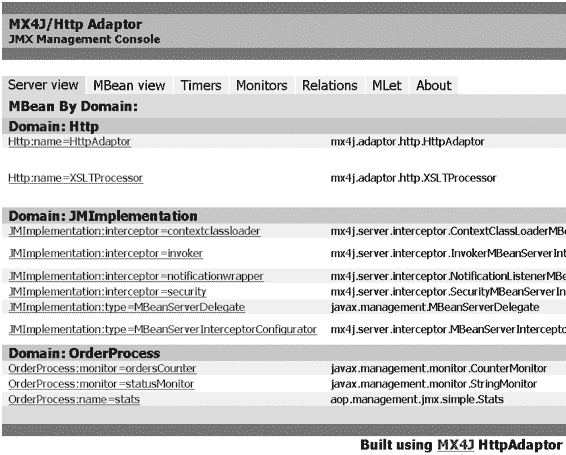

**194**

第 9 章 ■ 服务质量与面向切面编程

**图 9-5.** *MX4J 提供的 HTTP 适配器的图形用户界面*

**将 JMX 与 AOP 结合使用**


如前所述，要将一个普通的 Java 对象转换为可管理的资源，你需要实现一个 MBean 接口。当对现有应用程序使用 JMX 时，保持现有对象不变，并通过切面透明地集成 MBean 接口会非常有用。

作为参考示例，我们将使用一个简化的订单管理应用程序。该应用程序由两部分组成：

• 订单管理部分，负责更新订单的某些统计数据
• 订单创建部分，负责生成某些随机订单以测试订单管理部分

统计数据在 Stats 类中实现，如清单 9-20 所示。

第 9 章 ■ 服务质量和面向切面编程

**195**

**清单 9-20.** *统计信息可管理 Bean 的实现* public class Stats {

private int orders = 0;

private float totalAmount = 0;

private String status = "OK";

public int getOrders() {

return orders;

}

public void incOrders() {

orders++;

}

public float getTotalAmount() {

return totalAmount;

}

public void addAmount(float p) {

totalAmount+=p;

}

public String getStatus() {

return status;

}

public void setStatus(String p) {

status = p;

}

public void reset() {

orders = 0;

totalAmount = 0;

status = "OK";

}

}

该类的字段如下：

• orders：该字段包含一个订单计数器。
• totalAmount：该字段累加所有订单的金额。
• status：该字段表示订单处理过程的状态（“OK”或“KO”）。

顾名思义，reset 方法将字段重置为初始值。Stats 类由主要的 JMXExample 类使用，如清单 9-21 所示。

**196**

第 9 章 ■ 服务质量和面向切面编程

**清单 9-21.** *Stats MBean 的简单客户端程序* package aop.management.jmx.simple;

public class JMXExample {

private static Stats statistics = new Stats();

public static void sendOrder(float amount) {

if (amount>0) {

statistics.incOrders();

statistics.addAmount(amount);

} else {

statistics.setStatus("KO");

try {

Thread.sleep(200);

}

catch (InterruptedException e) {

}

statistics.setStatus("OK");

}

}

public static void main(String[] str) throws Exception {

Injector injection = new Injector();

injection.start();

}

}

sendOrder 方法由 Injector 实例用于模拟订单。如果传递的金额为正，则更新统计数据。否则，生成一个错误，并将 status 属性设置为“KO”，持续 200 毫秒，然后重置为“OK”。

清单 9-22 中所示的 Injector 类是一个生成随机订单的 Java 线程。更准确地说，它生成十个随机订单。每五个订单，就会生成一个无效订单（金额为 –1000）。

**清单 9-22.** *用于随机生成订单的线程* package aop.management.jmx.simple;

public class Injector extends Thread {

public void run() {

float amount = 0;

for (int i=1;i<=10;i++) {

try {

C H A P T E R 9 ■ Q U A L I T Y O F S E R V I C E A N D A O P

**197**

System.err.println("Order #"+i);

sleep(Math.round(Math.random() * 5000));

} catch (InterruptedException e) {}

if ((i%5)==0) {

JMXExample.sendCommand(-1000);

} else {

amount = Math.round(Math.random() * 1500);

JMXExample.sendCommand(amount);

}

}

}

}

使用切面创建可管理资源

为了成为可管理资源，Stats 类必须实现一个 StatsMBean 接口，如清单 9-23 所示。

**清单 9-23.** *订单统计信息的 MBean 接口* package aop.management.jmx.simple;

public interface StatsMBean {

public int getOrders();

public float getTotalAmount();

public String getStatus();

public void reset();

}

使用 MX4J 时，你还必须定义一个名为 StatsMBeanDescription 的类，用于记录 MBean 的属性和方法。该类如清单 9-24 所示。

**清单 9-24.** *MX4J Stats Bean 描述* package aop.management.jmx.simple;

import java.lang.reflect.Method;

import mx4j.MBeanDescriptionAdapter;

public class StatsMBeanDescription extends MBeanDescriptionAdapter {


public String getAttributeDescription(String attribute) {

if (attribute.equals("Orders")) {

return "订单数量 ";

} else if (attribute.equals("Status")) {

return "订单处理状态";

} else if (attribute.equals("TotalAmount")) {

return "订单总金额";

**198**

第 9 章 ■ 服务质量与 AOP

} else {

return "未知属性";

}

}

public String getOperationDescription(Method method) {

if (method.getName().equals("reset")) {

return "将属性重置为初始值 ";

} else {

return "未知操作";

}

}

}

一旦我们定义了接口和描述类，就可以利用 AOP 的引入机制将我们的 Java 类转换为可管理的资源。使用 JBoss AOP 时，必须定义一个空的拦截器，如清单 9-25 所示。

**清单 9-25.** *用于允许引入的空拦截器* package aop.management.jmx.simple;

import org.jboss.aop.Interceptor;

import org.jboss.aop.Invocation;

import org.jboss.aop.InvocationResponse;

public class StatsMBeanInterceptor implements Interceptor {

public String getName() {

return "StatsMBeanInterceptor";

}

public InvocationResponse invoke(Invocation invocation) throws Throwable {

return invocation.invokeNext();

}

}

最后，`jboss-aop.xml` 定义了引入，如清单 9-26 所示。

**清单 9-26.** *MBean 接口引入的部署*

<interceptor-pointcut methodFilter="NONE" constructorFilter="ALL"

fieldFilter="NONE"

class="aop.management.jmx.simple.Stats">

<interceptors>

<interceptor class="aop.management.jmx.simple.StatsMBeanInterceptor"/>

</interceptors>

</interceptor-pointcut>

<introduction-pointcut class="aop.management.jmx.simple.Stats">

第 9 章 ■ 服务质量与 AOP

**199**

<interfaces>aop.management.jmx.simple.StatsMBean</interfaces>

</introduction-pointcut>

此外，主类必须按照清单 9-27 所示进行修改。

**清单 9-27.** *将示例修改为 JMX 客户端* 01 package aop.management.jmx.simple;

03 import javax.management.MBeanServer;

04 import javax.management.MBeanServerFactory;

05 import javax.management.ObjectName;

06 import javax.management.JMException;

07 import javax.management.Attribute;

08 import javax.management.monitor.GaugeMonitor;

09 import javax.management.monitor.StringMonitor;

10 import javax.management.monitor.CounterMonitor;

11 import javax.management.NotificationListener;

12 import javax.management.Notification;

13 import java.net.URL;

14 import java.net.MalformedURLException;

15 import java.util.Map;

16 import java.util.HashMap;

17 import java.util.List;

18 import java.util.ArrayList;

20 public class JMXExample {

22 private int port = 8080;

23 private String host = "localhost";

24 private static Stats statistics = new Stats();

26 public static void sendCommand(float amount) {

27 ...

28 }

30 public void start() throws JMException, MalformedURLException {

31 MBeanServer server = MbeanServerFactory.createMBeanServer("OrderProcess"); 32 ObjectName serverName = new ObjectName("Http:name=HttpAdaptor"); 33 server.createMBean("mx4j.adaptor.http.HttpAdaptor",serverName,null); 34 server.setAttribute(serverName,new Attribute("Port",new Integer(port))); 35 server.setAttribute(serverName,new Attribute("Host",host)); 36 ObjectName processorName = new ObjectName("Http:name=XSLTProcessor"); 37 server.createMBean("mx4j.adaptor.http.XSLTProcessor",processorName,null); 38 server.setAttribute(processorName, new Attribute("UseCache",new Boolean(false)));

39 server.setAttribute(serverName, new

Attribute("ProcessorName",processorName));

**200**

第 9 章 ■ 服务质量与 AOP

41 server.registerMBean(statistics, new ObjectName("OrderProcess:name=stats")); 42 ...

43 server.invoke(serverName, "start", null, null); 44 }

46 public static void main(String[] str) throws Exception {

47 JMXExample t = new JMXExample();

48 t.start();

49 Injector injection = new Injector();

50 injection.start();

51 }

52 }


此修改的目的是处理 MBeanServer 组件和 HTTP 适配器的初始化，并注册可管理资源。在我们的示例中，适配器可通过 http://localhost:8080 地址访问，该地址由清单 9-27 中第 22 和 23 行添加的字段定义。第 31 行创建了一个 MBeanServer 实例，第 39 行初始化了适配器。随后，可管理资源被注册到 MBeanServer 组件中（见第 5 行）。最后，我们定义了两个监视器。（为清晰起见，第 42 行的实际代码显示在清单 9-28 中。）

**清单 9-28.** *清单 9-27 的监视器定义*

01 CounterMonitor ordersCounter = new CounterMonitor(); 02 ObjectName ordersCounterName =

03 new ObjectName("OrderProcess","monitor","ordersCounter"); 04 server.registerMBean(ordersCounter, ordersCounterName); 05 ordersCounter.setThreshold(new Integer(5));

06 ordersCounter.setOffset(new Integer(5));

07 ordersCounter.setNotify(true);

08 ordersCounter.setDifferenceMode(false);

09 ordersCounter.setObservedObject(new ObjectName("OrderProcess:name=stats")); 10 ordersCounter.setObservedAttribute("Orders"); 11 ordersCounter.setGranularityPeriod(100L);

12 ordersCounter.addNotificationListener(

13 new NotificationListener() {

14 public void handleNotification(Notification notification, 16 Object handback) {

17 System.out.println(

18 "JMX Notification - Orders : threshold overflow"); 19 }

20 }, null, null);

21 ordersCounter.start();

23 StringMonitor statusMonitor = new StringMonitor();

24 ObjectName statusMonitorName = new ObjectName("OrderProcess","monitor", 25 "statusMonitor");

第 9 章 ■ 服务质量与 AOP

**201**

26 server.registerMBean(statusMonitor,statusMonitorName); 27 statusMonitor.setNotifyDiffer(true);

28 statusMonitor.setNotifyMatch(true);

29 statusMonitor.setStringToCompare("OK");

30 statusMonitor.setObservedObject(new ObjectName("OrderProcess:name=stats")); 31 statusMonitor.setObservedAttribute("Status"); 32 statusMonitor.setGranularityPeriod(100L);

33 statusMonitor.addNotificationListener(

34 new NotificationListener() {

35 public void handleNotification(Notification notification, 36 Object handback) {

37 if (notification.getType().equals("jmx.monitor.string.differs")) {

38 System.out.println("JMX notification - Abnormal process "); 39 } else {

40 System.out.println("JMX notification - Process OK"); 41 }

42 }

43 }, null, null);

44 statusMonitor.start();

清单 9-28 中第 1 行的监视器检查传入订单的数量。每五个订单，监视器就会发出一个通知事件，该事件由第 13 行的监听器接收。第 20 行的监视器检查 Stats Bean 的状态属性，并在属性状态发生变化时发出通知。这些通知由第 34 行的监听器接收。

运行时，应用程序会输出如清单 9-29 所示的结果。

**清单 9-29.** *JMX 示例的输出*

JMX notification - Process OK

Order #1

Order #2

Order #3

Order #4

Order #5

JMX notification - Abnormal process

Order #6

JMX notification - Process OK

Order #7

JMX notification - Orders : threshold overflow

Order #8

Order #9

Order #10

JMX notification - Abnormal process

JMX notification - Process OK

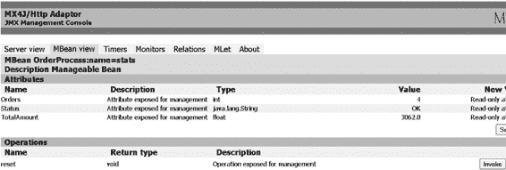

**202**

第 9 章 ■ 服务质量与 AOP

如您所见，应用程序按预期发出了通知。延迟来自监视器的粒度周期，该周期必须通过 `javax.management.monitor.Monitor` 类的 `setGranularityPeriod` 方法设置为 100 毫秒。

现在，我们可以使用 HTTP 适配器的 GUI 来重置 Stats 类，如图 9-6 所示。

**图 9-6.** *通过 MX4J 的 HTTP 适配器调用 reset 方法*

使用切面扩展可管理资源

通过使用 AOP，我们能够将普通的 Java 类扩展为可管理资源。在某些情况下，透明地引入新功能或属性是很有意义的。


在此，我们提议添加一个包含平均订单金额的属性。为此，我们将首先修改 `StatsMBean` 和 `StatsMBeanDescription` 以纳入新属性，如清单 9-30 所示。

**清单 9-30.** *增强后的 Stats MBean*

package aop.management.jmx.mixin;

public interface StatsMBean {

public int getMOrders();

public float getMTotalAmount();

public float getMeanOrderAmount();

public String getMStatus();

public void mReset();

}

接下来，我们将创建一个实现新属性的混入类，如清单 9-31 所示。

**清单 9-31.** *定义引入的混入实现* 01 package aop.management.jmx.mixin;

03 public class StatsMBeanMixin implements StatsMBean {

05 private Stats advised;

第 9 章 ■ 服务质量与 AOP

**203**

07 public StatsMBeanMixin(Object p) {

08 advised = (Stats)p;

09 }

11 public float getMeanOrderAmount() {

12 if (advised.getOrders() > 0) {

13 return advised.getTotalAmount()/advised.getOrders(); 14 } else {

15 return 0;

16 }

17 }

19 }

在 JBoss AOP 中，混入类的构造函数将通知对象作为参数（见清单 9-31 的第 7 行）。该参数允许混入类访问通知对象的公共成员，此处为 `Stats` 类的公共成员（见第 12 和 13 行）。

最后，我们可以修改 `jboss-aop.xml` 文件中的引入切入点，如清单 9-32 所示。

**清单 9-32.** *引入的 MeanOrderAmount 属性的部署*

<introduction-pointcut class="aop.management.jmx.mixin.Stats">

<mixin>

<interfaces>aop.management.jmx.mixin.StatsMBean</interfaces>

<class>aop.management.jmx.mixin.StatsMBeanMixin</class>

<construction>new aop.management.jmx.mixin.StatsMBeanMixin(this)

</construction>

</mixin>

</introduction-pointcut>

为了检查程序是否正常运行，可以使用清单 9-33 所示的 JMX 程序来监控这个新增的、由切面添加的属性。

**清单 9-33.** *监控引入的属性* GaugeMonitor meanOrderAmountGauge = new GaugeMonitor();

ObjectName meanOrderAmountGaugeName =

new ObjectName("OrderProcess","monitor","meanOrderAmountGauge"); server.registerMBean(meanOrderAmountGauge, meanOrderAmountGaugeName); meanOrderAmountGauge.setThresholds(new Float(1000), new Float(500)); meanOrderAmountGauge.setNotifyHigh(true);

meanOrderAmountGauge.setNotifyLow(true);

meanOrderAmountGauge.setDifferenceMode(false);

meanOrderAmountGauge.setObservedObject(new ObjectName("OrderProcess:name=stats")); meanOrderAmountGauge.setObservedAttribute("MeanOrderAmount"); meanOrderAmountGauge.setGranularityPeriod(100L);

meanOrderAmountGauge.addNotificationListener(

new NotificationListener() {

**204**

第 9 章 ■ 服务质量与 AOP

public void handleNotification(Notification notification,Object handback) {

if (notification.getType().equals("jmx.monitor.gauge.low")) {

System.out.println("JMX notification - Mean amount < 500 euros");

} else {

System.out.println("JMX notification - Mean amount > 1000 euros");

}

}

}, null, null);

meanOrderAmountGauge.start();

JMX 程序给出了预期结果，如清单 9-34 所示。

**清单 9-34.** *引入属性后的 JMX 示例输出* JMX notification - Mean amount < 500 euros

JMX notification - Process OK

Order #1

Order #2

JMX notification - Mean amount > 1000 euros

Order #3

Order #4

Order #5

JMX notification - Abnormal process

Order #6

JMX notification - Process OK

Order #7

JMX notification - Orders : threshold overflow

Order #8

Order #9

Order #10

JMX notification - Abnormal process

JMX notification - Process OK

**总结**

在本章中，你了解了 AOP 如何通过验证应用程序的定义和执行与其确定的需求相符，来用于改进应用程序的服务质量。首先，我们展示了 AOP 如何以直接的方式帮助实现契约。其次，我们展示了两种测试技术的 AOP 实现：覆盖分析和非回归测试。最后，我们展示了如何使用 AOP 将 JMX 无缝集成到 Java 应用程序中。

我们的 AOP 实现并未提供比现有工具更多的功能。然而，我们的实现展示了如何在开发层面使用 AOP 来提高代码质量——而无需任何特定的支持。此外，AOP 技术的一个重要优势是它提供了在需要时插拔服务质量支持的能力——如果使用动态 AOP 工具，甚至可以在运行时进行。

第 10 章

■ ■ ■

示例应用程序介绍

**本**章讨论一个示例应用程序的架构和设计细节，我们将把它作为案例研究，以展示 AOP 在 J2EE 环境中的优势。这个众所周知的简单示例应用程序有助于以易于理解的方式呈现材料。该示例基于 Sun ONE J2EE 应用服务器的 Duke's Bank 应用程序开发。此应用程序并不特定依赖于 Sun ONE，通过调整部署脚本，它可以在任何 J2EE 应用服务器上高效使用。

由于本书侧重于 AOP，本章不会深入探讨 J2EE 编程的细节，而是提供关于 AOP 及其适用场景的充分信息。不过，本章的一部分内容会回顾示例应用程序所使用的 J2EE 设计模式。请注意，这些模式与第 8 章中介绍的 GOF 模式不同。此外，我们在此不会展示应用程序的完整代码；而只是描述其设计。

如果您想了解有关该应用程序的更详细信息，请访问 Apress 网站（http://www.apress.com）的下载区域，获取案例研究代码。如果您不熟悉 J2EE，我们强烈建议您在详细研究代码之前，先阅读一些关于该主题的进一步资料。

**示例应用程序架构**

Duke's Bank 是一个经典的 J2EE 应用程序，由开发企业应用程序时常见的多个层组成。它的打包方式使得对应于每一层的模块都清晰分离。

为了简化代码，我们对 Duke's Bank 应用程序进行了轻微修改，特别是其打包方式。为了便于比较，请参考 Sun Microsystems 网站上提供的原始应用程序。

**应用程序概览**

在详细介绍各层之前，我们将在以下小节中提供整个应用程序及其组织的概述。

参与的层

正如 J2EE 所建议的，该应用程序由多个层组成，如图 10-1 所示。

**205**

**206**

第 10 章 ■ 示例应用程序介绍

**图 10-1.** *Duke's Bank 应用程序的架构* 各层及其角色如下：

*   **数据层**：允许存储持久化数据，并在 PointBase 关系数据库中实现。
*   **业务层**：包含实现应用程序逻辑的 EJB。这些 EJB 包括会话 EJB（提供客户端对应用程序业务逻辑的视图）和实体 EJB（表示应用程序操作的持久化对象）。业务层直接访问数据层，特别是通过实体 EJB。
*   **表示层**：允许通过浏览器访问应用程序。它包含一个 Web Servlet/JSP 容器，并访问业务层。相对于业务层，表示层可以被视为一个特定的 Java 客户端层。


• *客户端层*可以是 Web 应用（瘦客户端）或 Java 应用。在本例中，它是一个 Web 应用，因为它通过 HTTP 访问表示层；而在 Java 场景中，它直接访问业务层以定位 EJB，并通过 RMI 进行远程通信。在后一种情况下，Java 客户端在客户端站点自行管理其表示（胖客户端）。

组织与打包代码

虽然你可以使用任何 IDE，但我们推荐使用 Eclipse 开源 IDE（我们使用 Eclipse 开发了本章展示的应用）。Eclipse 可从 http://www.eclipse.org 下载。你可以从文件系统导入 Eclipse 项目。编译时需要 AspectJ 的 AJDT 插件，该插件的安装方法在附录中进行了说明。

与原始应用不同，我们通过将代码分离到多个独立项目来组织此应用。这种结构使开发者能够更高效地工作，尤其是在大型项目中，不同团队可以更轻松地分配到特定层的开发任务。

第 10 章 ■ 示例应用展示

**207**

Eclipse 项目如下：

• Commons 项目包含多个层共用的所有类。例如，它包含传输对象和服务定位器（后文将详细描述），这些被客户端、业务和表示层使用。

• BusinessUtils 项目包含业务层使用的所有类。

• BusinessComponents 项目包含所有业务 POJO（Plain Old Java Objects）。

• EJBComponents 项目包含所有业务 EJB。

• ClientUtils 项目包含客户端层使用的所有类。

• BusinessDelegates 项目包含所有委托（后文将进一步详述），这些委托使客户端能够透明地访问业务对象，无需关心通信层。

• ApplicationClient 项目包含客户端应用及其逻辑。

图 10-2 展示了项目依赖关系。

**图 10-2.** *项目依赖关系*

如需进一步了解 Eclipse 项目的打包方式，请参考本章后续的截图，这些截图展示了各层的内部组织。

包中包含常规类和面向切面化的应用类。这种组织方式使程序员能够更高效地比较面向切面代码与常规代码，尤其是在使用 AJDT 插件及其切面可视化工具时。

部署应用

该应用被打包并部署在 Sun ONE J2EE 应用服务器上。我们的网站发布了打包和编译脚本，使项目能够独立于所选 IDE。尽管项目在 Eclipse 下开发，但未使用任何特定插件或 Eclipse 技术，因此很容易切换到其他 IDE。

**208**

第 10 章 ■ 示例应用展示

相关文件如下：

• deploySunONE.bat 文件位于 EJBComponent 项目的根目录，用于将应用部署到 Sun ONE 服务器，并使用同一目录下的 Ant 脚本 SunONE.xml。执行此脚本需要安装 Ant 并启动 Sun ONE 服务器。

• SunONE.properties 文件用于在部署阶段配置和连接服务器。

• 客户端应用的属性文件 j2eeclient.properties 用于配置对 Sun ONE 服务器的远程访问。该文件必须安装在客户端，声明外观 EJB 可从客户端访问。该文件独立发布。

接下来的章节将介绍不同层中与 AOP 相关的具体细节。

**数据层**


数据层由关系数据库中的一组表实现。由于该层基于 RDBMS 技术，因此无法受益于 AOP 的改进。只有其他层对其的访问可以通过 AOP 得到优化。

对于我们的简单应用，可以直接采用对象-关系映射（一个表对应一个业务类）。表创建脚本如清单 10-1 所示。表`customer_account_xref`（第 34 行）实现了客户与账户之间的关联（多对多基数关系）。

**清单 10-1.** *示例应用的表创建脚本* 1 // 创建表

2 CREATE TABLE account

3 (account_id VARCHAR(8)

4 CONSTRAINT pk_account PRIMARY KEY,

5 type VARCHAR(24),

6 description VARCHAR(30),

7 balance DECIMAL(10,2),

8 credit_line DECIMAL(10,2),

9 begin_balance DECIMAL(10,2),

10 begin_balance_time_stamp TIMESTAMP);

12 CREATE TABLE customer

13 (customer_id VARCHAR(8)

14 CONSTRAINT pk_customer PRIMARY KEY,

15 last_name VARCHAR(30),

16 first_name VARCHAR(30),

17 middle_initial VARCHAR(1),

18 street VARCHAR(40),

第 10 章 ■ 示例应用介绍

**209**

19 city VARCHAR(40),

20 state VARCHAR(2),

21 zip VARCHAR(5),

22 phone VARCHAR(16),

23 email VARCHAR(30));

25 CREATE TABLE tx

26 (tx_id VARCHAR(8)

27 CONSTRAINT pk_tx PRIMARY KEY,

28 account_id VARCHAR(8),

29 time_stamp TIMESTAMP,

30 amount DECIMAL(10,2),

31 balance DECIMAL(10,2),

32 description VARCHAR(30));

34 CREATE TABLE customer_account_xref

35 (customer_id VARCHAR(8),

36 account_id VARCHAR(8));

38 CREATE TABLE next_account_id (id INTEGER);

39 CREATE TABLE next_customer_id (id INTEGER);

40 CREATE TABLE next_tx_id (id INTEGER);

**业务层**

该应用由两个不同的部分组成：银行管理界面（账户和用户）以及允许用户对其账户执行交易的界面。

这两个界面使用一个由 EJB 实现并直接访问数据层的模型。

会话外观

*会话外观*是实现应用逻辑（更具体地说，是业务功能）的会话 EJB 组件。外观定义了一个高级接口，使得通过它访问的子系统更易于使用。其作用之一是实现隔离层，允许子系统在演进时对外观的用户产生最小影响。

外观通常是无状态的，并将任务委托给实体 EJB。通常，客户端层通过这些外观访问实体 EJB。对于这个简单的应用，我们只定义了两个外观：Bank 外观和 TXController 外观。

Bank 外观管理账户和用户，因此主要用于管理目的；例如，用户不能创建或删除账户。由于代码本身具有自解释性，我们不再详细描述所有服务。

清单 10-2 中的代码展示了与 Bank 外观的公共服务相对应的接口——也就是说，通过管理客户端可访问的服务。

**210**

第 10 章 ■ 示例应用介绍

**清单 10-2.** *Bank 接口*

package aop.j2ee.business.session.bank;

// 导入

[...]

public interface Bank extends EJBObject {

public String createAccount(String customerId, String type, String description, BigDecimal balance, BigDecimal creditLine, BigDecimal beginBalance, Date beginBalanceTimeStamp)

throws RemoteException, IllegalAccountTypeException,

CustomerNotFoundException, InvalidParameterException;

public void removeAccount(String accountId)

throws RemoteException, AccountNotFoundException,

InvalidParameterException;

public void addCustomerToAccount(String customerId,

String accountId)

throws RemoteException,

AccountNotFoundException, CustomerNotFoundException,

CustomerInAccountException, InvalidParameterException;

public void removeCustomerFromAccount(String customerId, String accountId)

throws RemoteException,

AccountNotFoundException, CustomerRequiredException,


CustomerNotInAccountException,

InvalidParameterException;

public ArrayList getAccountsOfCustomer(String customerId) throws RemoteException, AccountNotFoundException,

InvalidParameterException;

public AccountDetails getAccountDetails(String accountId) throws RemoteException, AccountNotFoundException,

InvalidParameterException;

public void setAccountType(String type, String accountId) throws RemoteException, AccountNotFoundException,

IllegalAccountTypeException, InvalidParameterException;

public void setAccountDescription(String description,

String accountId)

throws RemoteException, AccountNotFoundException,

InvalidParameterException;

public void setAccountBalance(BigDecimal balance,

String accountId)

第 10 章 ■ 示例应用程序的展示

**211**

throws RemoteException, AccountNotFoundException,

InvalidParameterException;

public void setAccountCreditLine(BigDecimal creditLine,

String accountId)

throws RemoteException, AccountNotFoundException,

InvalidParameterException;

public void setAccountBeginBalance(BigDecimal beginBalance, String accountId)

throws RemoteException, AccountNotFoundException,

InvalidParameterException;

public void setAccountBeginBalanceTimeStamp(

Date beginBalanceTimeStamp, String accountId)

throws RemoteException, AccountNotFoundException,

InvalidParameterException;

public String createCustomer (String lastName,

String firstName, String middleInitial, String street,

String city, String state, String zip, String phone,

String email)

throws InvalidParameterException, RemoteException;

public void removeCustomer(String customerId)

throws RemoteException, CustomerNotFoundException,

InvalidParameterException;

public ArrayList getCustomersOfAccount(String accountId) throws RemoteException, CustomerNotFoundException,

InvalidParameterException;;

public CustomerDetails getCustomerDetails(String customerId) throws RemoteException, CustomerNotFoundException,

InvalidParameterException;

public ArrayList getCustomersOfLastName(String lastName) throws InvalidParameterException, RemoteException;

public void setCustomerName(String lastName, String firstName, String middleInitial, String customerId)

throws RemoteException, CustomerNotFoundException,

InvalidParameterException;

public void setCustomerAddress(String street, String city, String state, String zip, String phone, String email,

String customerId)

**212**

第 10 章 ■ 示例应用程序的展示

throws RemoteException, CustomerNotFoundException,

InvalidParameterException;

}

TXController 外观通过 Web 应用程序（即网上银行应用程序）或 ATM 管理所有可能的银行账户交易。清单 10-3 展示了与 TXController 外观相对应的接口。

**清单 10-3.** *交易控制器（TxController）接口* package aop.j2ee.business.session.txcontroller;

// 导入

[...]

public interface TxController extends EJBObject {

public ArrayList getTxsOfAccount(Date startDate, Date endDate, String accountId) throws RemoteException, InvalidParameterException;

public TxDetails getDetails(String txId)

throws RemoteException, TxNotFoundException, InvalidParameterException; public void withdraw(BigDecimal amount, String description, String accountId) throws RemoteException, InvalidParameterException,

AccountNotFoundException, IllegalAccountTypeException,

InsufficientFundsException;

public void deposit(BigDecimal amount, String description, String accountId) throws RemoteException, InvalidParameterException,

AccountNotFoundException, IllegalAccountTypeException;

public void transferFunds(BigDecimal amount, String description, String fromAccountId,

String toAccountId)

throws RemoteException, InvalidParameterException,

AccountNotFoundException, InsufficientFundsException,

InsufficientCreditException;

public void makeCharge(BigDecimal amount, String description, String accountId) throws InvalidParameterException,

AccountNotFoundException, IllegalAccountTypeException,


`InsufficientCreditException`, `RemoteException` ;

public void makePayment(BigDecimal amount, String description, String accountId)

throws InvalidParameterException, AccountNotFoundException, IllegalAccountTypeException, RemoteException;

}

第 10 章 ■ 示例应用程序展示

**213**

实体 EJB

实体 EJB 定义了应用程序功能所应用的模型，它们通常是在会话外观 EJB 内部实现的。客户端可以直接访问 EJB 而无需通过外观，但出于以下原因不建议这样做。首先，这可能导致应用程序服务定义不明确。其次，它将客户端的实现与业务模型耦合在一起，从而降低了应用程序演化的可能性。

我们模型中的实体 EJB 包括账户、用户和交易。如前文在数据层中所述，每个 EJB 对应一个表。账户实现了`Account`接口，如清单 10-4 所示。

**清单 10-4.** *账户接口*

package aop.j2ee.business.entity.account;

import aop.j2ee.commons.to.AccountDetails;

[...] // 其他导入

public interface Account extends EJBObject {

public AccountDetails getDetails() throws RemoteException; public BigDecimal getBalance() throws RemoteException;

public String getType() throws RemoteException;

public BigDecimal getCreditLine() throws RemoteException; public void setType(String type) throws RemoteException; public void setDescription(String description) throws RemoteException; public void setBalance(BigDecimal balance) throws RemoteException; public void setCreditLine(BigDecimal creditLine) throws RemoteException; public void setBeginBalance(BigDecimal beginBalance) throws RemoteException; public void setBeginBalanceTimeStamp(Date beginBalanceTimeStamp) throws RemoteException;

}

用户通过`Customer`接口实现，如清单 10-5 所示。

**清单 10-5.** *客户接口*

package aop.j2ee.business.entity.customer;

import aop.j2ee.commons.to.CustomerDetails;

[...] // 其他导入

public interface Customer extends EJBObject {

public CustomerDetails getDetails() throws RemoteException; public void setLastName(String lastName) throws RemoteException; public void setFirstName(String firstName) throws RemoteException; public void setMiddleInitial(String middleInitial) throws RemoteException; public void setStreet(String street) throws RemoteException; public void setCity(String city) throws RemoteException; public void setState(String state) throws RemoteException; public void setZip(String zip) throws RemoteException;

public void setPhone(String phone) throws RemoteException; public void setEmail(String email) throws RemoteException;

}

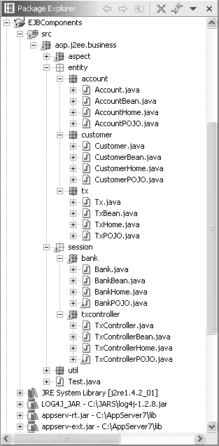

**214**

第 10 章 ■ 示例应用程序展示

交易是实现`Tx`接口的 EJB，如清单 10-6 所示。

**清单 10-6.** *Tx 接口*

package aop.j2ee.business.entity.tx;

import aop.j2ee.commons.to.TxDetails;

[...] // 其他导入

public interface Tx extends EJBObject {

public TxDetails getDetails() throws RemoteException;

}

组织业务层代码

图 10-3 展示了`EJBComponents` Eclipse 项目的组织结构，该项目对应业务层并包含 EJB。

**图 10-3.** *EJBComponents 项目（业务层）的组织结构*

第 10 章 ■ 示例应用程序展示

**215**

根包是`aop.j2ee.business`。实体和会话 EJB 被放置在两个子包中：`aop.j2ee.business.entity`和`aop.j2ee.business.session`。在这些包中，EJB 在特定包内定义，该包至少包含三个实现文件：

• 定义远程接口的文件（按惯例，使用业务名称）
• 定义 Home 接口的文件（按惯例，业务名称后跟 Home）
• 定义 Bean 实现的文件（按惯例，业务名称后跟 Bean）

例如，对于实现银行外观的 EJB，其文件分别是`Bank.java`、`BankHome.java`和`BankBean.java`。

第四个文件以`POJO`结尾，对应包中定义的 Bean 的 POJO 实现；例如，在银行包中，`BankPOJO`对应`BankBean`。

这种非 EJB 实现是通过使用切面实现的，我们将在第 12 章进一步解释。由于此文件包含 EJB 的切面化实现，开发人员可以轻松比较这两种实现，并直观地看到切面的影响。

选择这两个功能等效的实现之一是在部署描述符文件`ejb-jar.xml`中完成的，该文件位于 Eclipse 项目的`META-INF`目录中。清单 10-7 展示了一个示例。

**清单 10-7.** *示例应用程序（银行）的部署描述符文件示例* 1 <ejb-jar>

2 <enterprise-beans>

3 [...]

4 <session>

5 <display-name>Bank</display-name>

6 <ejb-name>Bank</ejb-name>

7 <home>aop.j2ee.business.session.bank.BankHome</home> 8 <remote>aop.j2ee.business.session.bank.Bank</remote> 9 <ejb-class>aop.j2ee.business.session.bank.BankBean</ejb-class> 10 <session-type>Stateless</session-type> 11 <transaction-type>Bean</transaction-type> 12 </session>

13 [...]

14 </enterprise-beans>

15 </ejb-jar>

要使用切面化实现而非常规实现，必须将声明 EJB 类的行（第 9 行）替换为以下行：

<ejb-class>aop.j2ee.business.session.bank.BankPOJO</ejb-class> 应用于 POJO 的所有切面都在`aop.j2ee.business.entity.aspect`包中定义，我们将在本章后面讨论。请注意，由于这是一个 AspectJ 项目，其 CLASSPATH 中包含`aspectj.jar`，并使用`ajc`进行编译。


**216**

第 10 章 ■ 示例应用程序展示

**客户端层**

该应用程序定义了两个不同的客户端：一个使用 Swing 并允许进行银行管理的 Java 客户端，以及一个通过 HTTP 访问表示层、使用 Servlets/JSP 技术编程的 Web 客户端。

Swing 客户端

Swing 客户端是一个使用 Java Swing API 开发的管理应用程序。它允许创建、修改和删除用户及账户。

图 10-4 展示了 Swing 管理 GUI，它由一个简单的两部分界面组成。左侧用于打印消息，例如请求的信息或错误，右侧是一个输入面板，允许创建或修改用户和账户相关信息。可能的操作通过菜单栏访问。

管理客户端的实现完全依赖于`Bank`业务外观。

**图 10-4.** *银行管理的 Swing GUI* Web 客户端

Web 客户端是允许银行用户通过浏览器访问和管理其账户的界面。其逻辑在表示层中定义，该层使用 Servlets/JSP 技术开发。图 10-5 展示了 Web GUI。


第 10 章 ■ 示例应用程序展示

**217**

**图 10-5.** *银行的 Web GUI*

组织 Java Swing 客户端代码

本节描述用于银行管理的 Java Swing 客户端代码。

图 10-6 展示了 Java 客户端项目的组织结构。

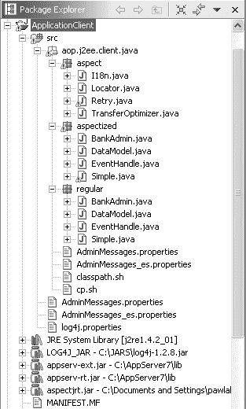

**218**

第 10 章 ■ 示例应用程序展示


**图 10-6.** *ApplicationClient 项目（Java Swing 客户端层）的组织结构* 根包为 aop.j2ee.client.java。在此包内，你可以找到该应用程序的两个版本：未使用切面开发的常规版本（regular 包）和切面化版本（aspectized 包）。aspect 包包含后一版本的所有 AspectJ 切面；这是一个 AspectJ 项目。

如图 10-6 所示，原始版本的 Java 管理客户端结构简单。它由四个 Java 类组成：BankAdmin、DataModel、EventHandle 和 Simple。BankAdmin 类构建实际的图形用户界面（GUI）。它抛出与用户可能操作相对应的事件。这些事件由定义并安装在 EventHandle 中的事件管理器处理。

DataModel 类通过调用业务层（具体来说是 aop.j2ee.business.session.bank 外观）来实现操作的效果。请注意，Simple 类并非原始应用程序的一部分，但它将在下一章中用于测试简单的客户端逻辑，而无需处理整个客户端。

客户端层绝非一个值得遵循的设计；我们仅将其用作描述在编写 Java 客户端时可能出现的关注点的一种手段。

第 10 章 ■ 示例应用程序的表示层

**219**

Web 表示层

使用 Struts 编程的 Web 表示层并未进行切面化，因为在此上下文中，其收益有限。在第 13 章中，我们将讨论在不使用 Struts 的应用程序上下文中，表示层设计模式可能的切面化。

**示例应用程序设计**

示例应用程序的设计总体上受 J2EE 应用程序的启发，更具体地说，是受 J2EE 最佳实践和设计模式的启发。

在本节开始时，我们将介绍一系列特定于 J2EE 且此前在此上下文中使用过的设计模式和解决方案。然后，我们将解释使用 AOP 如何改进示例应用程序的设计。

原始的 Duke's Bank 应用程序包含在 Sun ONE 应用服务器的免费发行版中，该发行版可在 Sun Microsystems 网站上获取。如果您希望与本文介绍的设计进行比较，请参考原始应用程序。

**使用 J2EE 设计解决方案**

原始 Duke's Bank 应用程序的设计很简单。并非所有可用的 J2EE 设计解决方案都被使用，这导致了代码模块性的不足。在本案例研究中，我们对应用程序进行了轻微修改，特别是通过遵循 J2EE 设计模式来提高应用程序的模块性，并修改了代码的组织结构。

使用 J2EE 设计模式有两个主要优点：

• 这些设计模式是经过充分测试、可重用的设计元素，使我们能够遵循 J2EE 最佳实践。
• J2EE 设计模式有完善的文档记录，并且开发人员熟悉其用法（参见 http://java.sun.com/blueprints/corej2eepatterns/Patterns/index.html）。使用 J2EE 设计模式有助于开发人员更好地理解应用程序的设计，并更容易识别我们希望通过切面解决的问题。

除了 J2EE 设计模式之外，使用 EJB 使我们能够自动集成服务。例如，可以通过组件容器或容器管理持久性（CMP）将其应用于实体 EJB 来管理持久性。事务或容器管理事务（CMT）也是如此，可以通过 EJB 部署描述符以声明方式集成。

接下来的几节将简要描述我们将在本章后面进一步展开的不同 J2EE 设计解决方案。有关更多详细信息，请参考 J2EE 文档（http://java.sun.com/j2ee/docs.html）和 J2EE 设计模式目录（参见本书末尾的参考资料部分）。

J2EE 业务层设计模式

在使用 J2EE 构建的应用程序中，业务层是中间层，它构成了客户端与企业资源（数据源）之间的接口。因此，以能够确保良好性能以及易于维护、演进、可扩展性等方式实现该层至关重要。

**220**

第 10 章 ■ 示例应用程序的表示层

使用业务层并非强制要求，但强烈推荐。在具有业务层的应用程序中，客户端可以以逻辑一致的方式访问公司的不同数据源，而如果应用程序允许直接访问数据库，则情况并非如此。

使数据访问一致有助于更轻松地优化应用程序架构。例如，可以通过在应用服务器上使用负载均衡或缓存来提高整体性能。这些改进与业务层的使用相关，并且只有在遵守某些基本规则时才可能实现。J2EE 设计模式明确阐述了这些规则。

业务层最重要的两个设计模式是会话外观模式和业务对象模式，以下各节将对它们进行描述。

**会话外观模式**

*会话外观模式*本质上是一个会话 EJB。其主要功能如下：

• 确保客户端独立于业务模型（后者会随时间推移而修改）。
• 允许通过无共享状态的对象访问数据，这些对象可以由应用服务器自动管理和优化。由于避免了状态同步问题，服务器本身会根据客户端打开的不同会话构建会话对象池。
• 创建一个功能接口，以便使用部署描述符以声明方式添加额外的非功能性属性，我们将在后面解释。
• 通过 J2EE 查找和通信层（*Java 命名和目录接口*，或*JNDI*，以及*远程方法调用*，或*RMI*）提供对已识别服务的远程访问。此访问也在部署描述符中进行配置。

**业务对象模式**

*业务对象模式*允许会话外观对象通过实体 EJB 访问数据，而无需直接使用不同资源的连接器。与会话外观一样，使用业务对象并非强制要求，但推荐使用。

业务对象模式的主要功能如下：

• 在面向对象模型中封装数据访问，从而简化数据访问并避免例如需要 SQL 查询。EJB 模型提倡使用 Home 接口来解析业务对象。
• 使用部署描述符以声明方式和自动方式引入非功能性属性，例如持久性。

第 10 章 ■ 示例应用程序的表示层

**221**

**传输对象模式**

使用其他设计模式也可以改进 J2EE 应用程序的设计，尤其是在性能方面。*传输对象模式*允许我们将外观使用的服务分组。当服务具有细粒度参数时，这非常有用，因为这些参数可能导致客户端和服务器之间多次调用序列，而这些调用往往会产生大量网络流量，尤其是代价高昂的连接。


传输对象实现了 `java.io.Serializable` 接口。传输对象的状态对应一组服务的参数和返回值。一个传输对象可以递归地嵌套在另一个传输对象内部；这被称为*复合传输对象*。

传输对象由客户端层和业务层共享。它们必须对这两层都可访问，因此定义在应用程序的 Commons 项目中。

J2EE 客户端层设计模式

客户端层必须使用远程解析和通信 API 来访问业务层的服务。然而，这可能会使客户端代码变得复杂。当出现这种复杂情况时，J2EE 设计模式指南建议使用两种设计模式：服务定位器和业务委托。我们将在后续章节中描述这些模式。

**服务定位器模式**

*服务定位器模式*通过向客户端隐藏所涉及的访问机制，允许对服务进行通用访问。例如，使用 Home 接口以及利用缓存管理来提高服务解析性能。

服务定位器通常以单例形式实现，并带有一个客户端直接使用的解析方法。服务解析并不局限于会话外观；例如，我们可以用同样的方式访问数据源。

当外观等 EJB 需要访问服务时，服务定位器模式也可用于业务层。由于不同层都使用服务定位器，其代码包含在应用程序的 Commons 项目中。

图 10-7 展示了 Commons 项目的组织结构，其中包含了客户端层和业务层使用的类和接口。正如你所料，它包含一个用于管理异常的包（`aop.j2ee.commons.exception`），以及本节中解释的传输对象（`aop.j2ee.commons.to`）和服务定位器（`aop.j2ee.commons.util.locator`）。

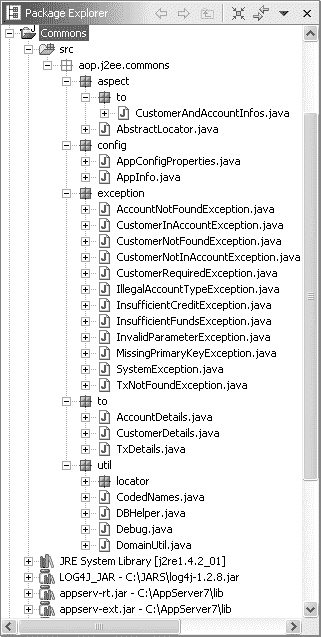

**222**

第 10 章 ■ 示例应用程序介绍

**图 10-7.** *Commons 项目的组织结构* **业务委托模式**

*业务委托模式*创建一个客户端对象，允许客户端访问业务层的外观。通常，委托具有与其所委托的外观相同的接口，但这并非必需条件。

业务委托的主要功能如下：

• 使客户端独立于外观，保证更好的应用程序结构和项目的独立性。例如，对于以这种方式编程的应用程序，重新编译业务层不会对客户端产生影响。

• 通过将通用或公共函数归集到委托中，简化客户端代码。例如，委托可用于归集重放策略或某些异常的处理。

• 使客户端更加独立于服务解析的方式。业务委托通常使用服务定位器。

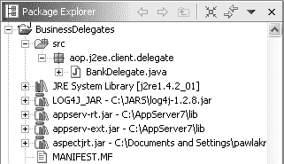

第 10 章 ■ 示例应用程序介绍

**223**

在我们的应用程序中，客户端管理应用程序使用一个委托来访问 Bank 外观。出于组织原因，委托可以放在一个单独的项目中，如图 10-8 所示。

**图 10-8.** *BusinessDelegates 项目的组织结构* J2EE 表示层设计模式

在开发应用程序的业务层时，推荐使用多种设计模式：

• *前端控制器模式*用于集中管理请求。

• *应用控制器模式*用于透明地管理应用程序级别的请求。

• *上下文对象模式*用于允许对请求参数进行对象封装，从而简化表示层的代码。


• *视图助手模式*用于将 JSP 页面中的复杂处理迁移到 Java 对象中。
• *拦截过滤器模式*用于允许特定对象以模块化和可参数化的方式系统地拦截请求，并通过附加功能对其进行处理。

尽管这些设计模式已有文档记录，但对设计人员或开发人员而言，同时使用多种模式并非易事。通常更可取的做法是使用能够以一致且透明的方式集成全套表示层设计模式的框架。示例应用程序 Duke's Bank 的原始版本就采用了这种解决方案，该应用程序是使用 Struts 开源框架实现的。

**自动集成解决方案**

在 J2EE 环境中，我们使用部署描述符（参见本节中的 XML 代码）来配置由容器管理的非功能性服务。例如，这种技术使我们能够将事务集成到外观服务中，或以声明方式将持久性添加到业务对象中。还可以配置组件以包含远程访问功能，例如命名或声明远程接口，以及管理权限的功能。这些自动集成解决方案被称为*声明式管理*或*容器管理*解决方案。

清单 10-8 展示了 XML 文件 `ejb-jar.xml` 的一部分。

**清单 10-8.** *用于技术服务自动集成的 ejb-jar.xml 文件*

<enterprise-beans>

<session>

<description>无描述</description>

<display-name>BankEJB</display-name>

<ejb-name>BankEJB</ejb-name>

<home>aop.j2ee.business.session.bank.BankHome</home>

<remote>aop.j2ee.business.session.bank.Bank</remote>

<ejb-class>aop.j2ee.business.session.bank.BankBean</ejb-class>

<session-type>Stateless</session-type>

<transaction-type>Container</transaction-type>

</session>

</enterprise-beans>

<assembly-descriptor>

<security-role>

<role-name>BankCustomer</role-name>

</security-role>

<security-role>

<role-name>BankAdmin</role-name>

</security-role>

<container-transaction>

<method>

<ejb-name>BankEJB</ejb-name>

<method-intf>Remote</method-intf>

<method-name>getCustomersOfAccount</method-name>

<method-params>

<method-param>java.lang.String</method-param>

</method-params>

</method>

<trans-attribute>Required</trans-attribute>

</container-transaction>

[...]

清单 10-9 展示了 XML 文件 `sun-ejb-jar.xml` 的一部分。

**清单 10-9.** *用于命名和访问的 sun-ejb-jar.xml 文件*

<sun-ejb-jar>

<security-role-mapping>

<role-name>BankCustomer</role-name>

**224**

第 10 章 ■ 示例应用程序介绍

<group-name>Customer</group-name>

</security-role-mapping>

<security-role-mapping>

<role-name>BankAdmin</role-name>

<group-name>Admin</group-name>

</security-role-mapping>

<enterprise-beans>

<name>bank-ejb.jar</name>

<unique-id>2059221019</unique-id>

<ejb>

<ejb-name>BankEJB</ejb-name>

<jndi-name>ejb/bank</jndi-name>

[...]

</ejb>

</enterprise-beans>

[...]

</sun-ejb-jar>

这些解决方案极大地简化了编程任务，因为我们不是显式地在代码中使用 API，而是以声明方式配置容器。通过这种方式，J2EE 允许我们分离出一定数量的非功能性横切关注点，这一点与 AOP 有共同之处。下一节将描述如何使用 AOP 来补充——甚至取代——这些解决方案。

**使用 AOP**

正如你在第 8 章中学到的，许多设计模式都可以从面向方面的实现中受益。这也适用于一定数量的 J2EE 设计模式，在这些模式中使用 AOP 具有明显的优势。服务定位器和业务委托就是这种情况，两者显然都是横切性的。其他设计模式也可以通过使用 AOP 得到改进。例如，外观和业务对象可以独立于所使用的 EJB 技术。


前文讨论的自动集成方案也可以通过使用 AOP 得到改进，因为这些方案暴露了以下相关问题：

• 由于容器自动管理集成，在集成效果不理想或无法按所需方式配置时，可供调整集成的方式非常有限。

• 声明式配置仅适用于简单场景，且通常需要在 Java 中编写补充代码片段，这限制了其实用性。有时，完全不进行参数化，转而依赖设计模式和框架等显式设计方案更为可取。

• 除了标准化方案外，自动集成方案通常依赖于应用服务器，这限制了可移植性。

AOP 通过以模块化方式集成服务，在适当情况下使用部署描述符，同时也使用 AspectJ 代码，避免了上述大部分限制，从而形成了一种既灵活又强大的技术。

**226**

第 10 章 ■ 示例应用程序介绍

**本章小结**

本章介绍了一个基于 Duke's Bank 示例应用程序构建的 J2EE 银行程序，并展示了其项目和包的组织结构。这使我们能够全面探索其架构和设计。阅读本章后，您应该对该应用程序的设计问题以及 AOP 解决这些问题的方式有了基本了解。

接下来的两章将逐层详细介绍如何在该示例应用程序中使用 AOP。尽管设计元素可能影响多个层，但在实现设计模式时，最好一次专注于一个层。这使得对应于每一层的项目能够保持相互独立。

对于每一层，我们将根据三个标准评估 AOP 带来的改进：

• 对所用设计模式（重点为 J2EE 设计模式）实现的改进

• 对公认的横切关注点设计元素的改进，但该元素并非已识别的设计模式，或不符合设计模式文档中的上下文

• 使设计减少对 J2EE 技术（尤其是 EJB）依赖的改进

就业务层而言，我们还将评估用 AOP 方案替代自动集成的可能性。

第 11 章

■ ■ ■

在示例应用程序的业务层中使用 AOP

**在**实现业务层时，程序员会使用 J2EE 设计模式。大多数业务层 J2EE 设计模式都依赖于 EJB。例如，会话外观模式建议使用会话 EJB。使用 EJB 可以实现附加关注点的自动集成。

J2EE 设计模式也比 GoF 设计模式更简单。

在本章中，我们将探讨在参考应用程序的业务层中使用 AOP。您将看到，在此上下文中，AOP 具有三个主要优势：

• 使应用程序独立于 EJB 技术。在依赖新技术的不断变化的企业环境中，独立性是一个理想的特性。

• 为现有的自动集成方案提供一种替代的、更灵活的解决方案。

• 简化 J2EE 设计模式的实现，使其对用户更加透明。

**AOP 还是组件容器？**

AOP 和基于组件的编程有着共同的目标：将业务逻辑与持久化、事务等技术关注点分离，并以清晰、自动的方式将它们集成。集成的主要困难来自于技术关注点之间的相互依赖关系，这些依赖关系随后会在代码层面交织在一起，从而违背了软件工程的基本原则：封装和关注点分离。

组件容器在部署时集成技术关注点。为此，它们依赖于组件模型（如 EJB）和部署描述符（对于 EJB，定义为 XML 文件）。后者以声明方式参数化集成。然而，在需要时，没有简单的解决方案来扩展或修改集成机制。在这些情况下，使用设计模式、外部框架或 AOP 可以帮助程序员调整集成。

在所有解决方案中，AOP 是唯一一种以命令式方式（即通过程序）指定集成的方案，该方案保持基础程序不变且技术独立。

实际上，对于设计模式，程序的结构必须被修改。对于框架，需要添加对所需 API 的依赖，或者需要对类进行特化。这些是使用 AOP 可以避免的技术依赖。

**227**

**228**

第 11 章 ■ 在示例应用程序的业务层中使用 AOP

**改进业务层设计模式**

在本节中，我们介绍一些可在业务层使用的设计模式，并讨论它们的弱点。我们表明，在技术和设计选择方面，使用 AOP 极大地提高了服务器层对象的独立性。

我们特别强调一个事实：借助特定的切面，所有服务器端的 EJB 都可以实现为普通 Java 对象（POJO）。这样，EJB 的使用就变得透明了。

**会话外观**

在使用 EJB 的 J2EE 应用程序中，会话外观是一个会话 EJB，它管理一组业务对象并定义了一个中等粒度的应用程序接口。使用外观模式的优点已在关于标准 GoF 设计模式的文献中概述。

在 J2EE 设计模式中，会话外观必须实现`javax.ejb.SessionBean`接口。应用服务器通过这种方式自动实例化该类，并为客户端处理会话对象池。此外，在 EJB 上下文中，EJB 允许远程客户端通过 JNDI 和 RMI 直接访问外观。

常规实现

在没有切面的情况下，来自包`aop.j2ee.business.session.txcontroller`的`TxController`接口的应用程序外观实现如清单 11-1 所示。（请注意，该接口已在第 10 章“会话外观”一节中介绍过。）**清单 11-1.** *TxControllerBean 会话外观实现* 001 package aop.j2ee.business.session.txcontroller;

003 import java.sql.*;

004 import javax.sql.*;

005 import java.util.*;

006 import java.math.*;

007 import javax.ejb.*;

008 import javax.naming.*;

009 import java.rmi.RemoteException;

010 import aop.j2ee.business.entity.tx.Tx;

011 import aop.j2ee.business.entity.tx.TxHome;

013 import aop.j2ee.business.entity.account.AccountHome; 014 import aop.j2ee.business.entity.account.Account;

015 import aop.j2ee.commons.exception.*;

016 import aop.j2ee.commons.util.*;

017 import aop.j2ee.commons.to.*;

018 import aop.j2ee.business.util.EJBGetter;

020 public class TxControllerBean implements SessionBean {

第 11 章 ■ 在示例应用程序的业务层中使用 AOP

**229**

022 // 字段

024 private TxHome txHome;

025 private AccountHome accountHome;

026 private Connection con;

027 private SessionContext context;

028 private BigDecimal bigZero = new BigDecimal("0.00"); 029

030 // 业务接口的实现

032 public void withdraw(BigDecimal amount,String descr,String accountId) 033 throws InvalidParameterException,

034 AccountNotFoundException,IllegalAccountTypeException, 035 InsufficientFundsException {

036 Account account = checkAccountArgsAndResolve(amount, descr, accountId); 037 try {

038 String type = account.getType();

039 if (DomainUtil.isCreditAccount(type))


040 throw new IllegalAccountTypeException(type); 041 BigDecimal newBalance = account.getBalance().subtract(amount); 042 if (newBalance.compareTo(bigZero) == -1)

043 throw new InsufficientFundsException();

044 executeTx(amount.negate(),descr,accountId,newBalance,account); 045 } catch (RemoteException ex) {

046 throw new EJBException("withdraw: " + ex.getMessage()); 047 }

048 } // withdraw

050 public void transferFunds(BigDecimal amount,String descr, 051 String fromAccountId,String toAccountId) 052 throws

053 InvalidParameterException,AccountNotFoundException, 054 InsufficientFundsException,InsufficientCreditException {

055 try {

056 Account fromAccount = checkAccountArgsAndResolve(

057 amount, descr, fromAccountId);

058 Account toAccount = checkAccountArgsAndResolve(

059 amount, descr, toAccountId);

061 String fromType = fromAccount.getType();

062 BigDecimal fromBalance = fromAccount.getBalance(); 063

064 if (DomainUtil.isCreditAccount(fromType)) {

065 BigDecimal fromNewBalance = fromBalance.add(amount); 066 if (fromNewBalance.compareTo(

067 fromAccount.getCreditLine()) == 1)

068 throw new InsufficientCreditException();

**230**

第 11 章 ■ 在示例应用的业务层中使用 AOP

069 executeTx(amount,descr,fromAccountId,fromNewBalance,fromAccount); 070 } else {

071 BigDecimal fromNewBalance = fromBalance.subtract(amount); 072 if (fromNewBalance.compareTo(bigZero) == -1) 073 throw new InsufficientFundsException();

074 executeTx(amount.negate(),descr,fromAccountId, 075 fromNewBalance,fromAccount); } //transferFunds 076

077 String toType = toAccount.getType();

078 BigDecimal toBalance = toAccount.getBalance(); 079

080 if (DomainUtil.isCreditAccount(toType)) {

081 BigDecimal toNewBalance = toBalance.subtract(amount); 082 executeTx(amount.negate(),descr,toAccountId,toNewBalance,toAccount); 083 } else {

084 BigDecimal toNewBalance = toBalance.add(amount); 085 executeTx(amount,descr,toAccountId,toNewBalance,toAccount); 086 }

087 } catch (RemoteException ex) {

088 throw new EJBException("transferFunds: " + ex.getMessage()); 089 }

090 } // transferFunds

092 // 其他方法遵循相同原则

093 [...]

095 // 私有方法

097 private void executeTx(BigDecimal amount,String descr,String accountId, 098 BigDecimal newBalance,Account account) {

099 try {

100 makeConnection();

101 String txId = DBHelper.getNextTxId(con);

102 account.setBalance(newBalance);

103 Tx tx=txHome.create(txId,accountId,new Date(),amount,newBalance,descr); 104 } catch (Exception ex) {

105 throw new EJBException("executeTx: " + ex.getMessage()); 106 } finally {

107 releaseConnection();

108 }

109 } // executeTx

111 private Account checkAccountArgsAndResolve(

112 BigDecimal amount,String description,String accountId) 113 throws InvalidParameterException, AccountNotFoundException {

115 Account account = null;

第 11 章 ■ 在示例应用的业务层中使用 AOP

**231**

116 if (description == null)

117 throw new InvalidParameterException("null description"); 118 if (accountId == null)

119 throw new InvalidParameterException("null accountId"); 120 if (amount.compareTo(bigZero) != 1)

121 throw new InvalidParameterException("amount <= 0"); 122 try {

123 account = accountHome.findByPrimaryKey(accountId); 124 } catch (Exception ex) {

125 throw new AccountNotFoundException(accountId); 126 }

127 return account;

128 } // checkAccountArgsAndResolve

130 // ejb 方法

132 public void ejbCreate() {

133 try {

134 txHome = EJBGetter.getTxHome();

135 accountHome = EJBGetter.getAccountHome();

136 } catch (Exception ex) {

137 throw new EJBException("ejbCreate: " + ex.getMessage()); 138 }

139 } // ejbCreate

141 public void setSessionContext(SessionContext context) {

142 this.context = context;

143 }

145 public TxControllerBean() {}

146 public void ejbRemove() {}

147 public void ejbActivate() {}

148 public void ejbPassivate() {}

150 // 数据库函数

152 private void makeConnection() {

153 try {


154 InitialContext ic = new InitialContext();

155 DataSource ds =

156 (DataSource) ic.lookup(CodedNames.BANK_DATABASE); 157 con = ds.getConnection();

158 } catch (Exception ex) {

159 throw new EJBException("无法连接到数据库。"); 160 }

161 } // makeConnection

**232**

第 11 章 ■ 在示例应用的业务层中使用 AOP

163 private void releaseConnection() {

164 try { con.close(); } catch (SQLException ex) {

165 throw new EJBException("releaseConnection: " + ex.getMessage()); 166 }

167 } // releaseConnection

168 } // TxControllerEJB

这个示例取自 Duke's Bank 实现的原始形式，包含一组值得模块化的关注点：

• 它实现了 SessionBean 接口（第 20 行和第 27 行）。

• 在业务方法实现中（第 30 行），存在对方法 checkArgsAndResolve 的重复调用（第 36、57、59、111 行）。该调用有两个作用：它允许使用一个方法来检查参数的某些前置条件，并通过其 Home 接口解析账户的引用。

• 它定义并处理对其他 EJB 的引用（第 123、134、135 行）。

• 它实现并使用一些数据库函数（第 100、101、107、150 行）。原始的 Duke's Bank 实现并未使用任何特定的持久化集成技术，而是直接使用 JDBC API。

这些关注点使得外观（facade）代码变得复杂，并迫使实现者定义私有方法（第 95 行）。这些方法虽然使代码更清晰，但由于它们是临时性的，其维护可能复杂且容易出错。

我们将在本章剩余部分回到这些要点。目前，我们主要关注独立于 EJB 会话（第 20 行和第 27 行）实现 J2EE 外观设计模式（如 Sun Microsystems 所描述）的问题。

基于 AOP 的实现

AOP 提供了一种直接的方法使代码独立于 EJB 技术：创建一个用于将 POJO 转换为 EJB 的切面，并使用一个空的标记接口（类似于 Serializable），通过基于该接口的类型间声明来实现该切面。

如果标记接口为

package aop.j2ee.business;

public interface SessionBeanProtocol {}

那么以下切面 POJOSession 可以将实现此接口的 POJO 转换为 EJB 会话：

package aop.j2ee.business.aspect;

import javax.ejb.*;

import aop.j2ee.business.aspect.marker.SessionBeanProtocol; public aspect POJOSession extends EJBResolver {

// 通用会话 Bean 行为

第 11 章 ■ 在示例应用的业务层中使用 AOP

**233**

declare parents: SessionBeanProtocol

extends javax.ejb.SessionBean;

private SessionContext SessionBeanProtocol.context;

public void SessionBeanProtocol

.setSessionContext(SessionContext context) {

this.context = context;

}

public void SessionBeanProtocol.ejbRemove() {}

public void SessionBeanProtocol.ejbActivate() {}

public void SessionBeanProtocol.ejbPassivate() {}

public void SessionBeanProtocol.ejbCreate() { [...] }

}

方法 ejbCreate 的实现（在最后一行）包含一些专用于 EJB 的初始化操作。

在模块化方面，其优势在于：

• **局部性**：实现外观功能的代码位于 POJO 中，而处理 EJB 会话的代码位于切面中。

• **复用性**：我们可以根据需求扩展 SessionBeanProtocol 接口，并在 POJOSession 中添加新的类型间声明。由于继承层次结构与业务无关，EJB 会话通用功能的复用和分解能力显著提高。

• **组合性**：由于外观实现不与会话外观设计模式耦合，因此更容易同时使用其他模式，且代码复杂度更低。


请注意，POJOSession 切面扩展了抽象切面 EJBResolver，并且不会影响 SessionBean 的实现。（这将在本章后续的“业务层改进：超越设计模式”一节中描述。）**业务对象**

J2EE 设计模式建议使用实体 EJB 来定义持久化业务对象。理论上，使用实体 EJB 可以简单地添加事务和持久化属性。然而，存在多种模式或框架能够以更简单、更高效的方式处理相同的问题。

例如，使用 Hibernate 开源框架进行持久化是实体 EJB 的一种高效替代方案。大多数可用的框架不需要特定的扩展，业务对象被定义为 POJO 或传统的 JavaBean。为了后续的演进，让业务对象尽可能独立于 EJB 对应用程序来说是有益的。

常规实现

清单 11-2 展示了将账户实现为实体 EJB 而不使用切面的方式。

**234**

第 11 章 ■ 在示例应用程序的业务层中使用 AOP

**清单 11-2.** *账户 EJB*

001 package aop.j2ee.business.entity.account;

003 import java.sql.*;

004 import javax.sql.*;

005 import java.util.*;

006 import java.math.*;

007 import javax.ejb.*;

008 import javax.naming.*;

009 import aop.j2ee.commons.exception.*;

010 import aop.j2ee.commons.util.Debug;

011 import aop.j2ee.commons.util.CodedNames;

012 import aop.j2ee.commons.util.DBHelper;

013 import aop.j2ee.commons.to.AccountDetails;

015 public class AccountBean implements EntityBean {

017 private String accountId;

018 private String type;

019 private String description;

020 private BigDecimal balance;

021 private BigDecimal creditLine;

022 private BigDecimal beginBalance;

023 private java.util.Date beginBalanceTimeStamp;

024 private ArrayList customerIds;

026 private EntityContext context;

027 private Connection con;

029 // 业务方法

031 public AccountDetails getDetails() {

032 try {

033 loadCustomerIds();

034 } catch (Exception ex) {

035 throw new EJBException("loadCustomerIds: " +ex.getMessage()); 036 }

037 return new AccountDetails(

038 accountId, type, description, balance, creditLine, beginBalance, 039 beginBalanceTimeStamp, customerIds);

040 }

042 public BigDecimal getBalance() { return balance; }

043 public String getType() { return type; }

044 public BigDecimal getCreditLine() { return creditLine; }

045 public void setType(String type) { this.type = type; }

046 public void setDescription(String d) { this.description = d; }

第 11 章 ■ 在示例应用程序的业务层中使用 AOP

**235**

047 public void setBalance(BigDecimal balance) { this.balance = balance; }

048 public void setCreditLine(BigDecimal n) { this.creditLine = n; }

049 public void setBeginBalance(BigDecimal n) { this.beginBalance = n; }

050 public void setBeginBalanceTimeStamp(java.util.Date beginBalanceTimeStamp) {

051 this.beginBalanceTimeStamp = beginBalanceTimeStamp; 052 }

054 // ejb home 方法

056 public String ejbCreate(String accountId, String type, String description, 057 BigDecimal balance, BigDecimal creditLine, BigDecimal beginBalance, 058 java.util.Date beginBalanceTimeStamp, ArrayList customerIds) 059 throws CreateException, MissingPrimaryKeyException {

060 if ((accountId == null) || (accountId.trim().length() == 0)) {

061 throw new MissingPrimaryKeyException("ejbCreate: accountId is empty"); 062 }

063 this.accountId = accountId;

064 this.type = type;

065 this.description = description;

066 this.balance = balance;

067 this.creditLine = creditLine;

068 this.beginBalance = beginBalance;

069 this.beginBalanceTimeStamp = beginBalanceTimeStamp; 070 this.customerIds = customerIds;

071 try { insertRow(); } catch (Exception ex) {

072 throw new EJBException("ejbCreate: " + ex.getMessage()); 073 }

074 return accountId;

075 }


077 public String ejbFindByPrimaryKey(String primaryKey) 078 throws FinderException {

079 boolean result;

080 try {

081 result = selectByPrimaryKey(primaryKey);

082 } catch (Exception ex) {

083 throw new EJBException("ejbFindByPrimaryKey: " + ex.getMessage()); 084 }

085 if (result) {

086 return primaryKey;

087 } else {

088 throw new ObjectNotFoundException("Row "+primaryKey+" not found."); 089 }

090 }

092 public Collection ejbFindByCustomerId(String customerId) 093 throws FinderException {

**236**

第 11 章 ■ 在示例应用的业务层中使用 AOP

094 Collection result;

095 try {

096 result = selectByCustomerId(customerId);

097 } catch (Exception ex) {

098 throw new EJBException("ejbFindByCustomerId " + ex.getMessage()); 099 }

100 return result;

101 }

103 public void ejbRemove() {

104 try {

105 deleteRow(accountId);

106 } catch (Exception ex) {

107 throw new EJBException("ejbRemove: " + ex.getMessage()); 108 }

109 }

111 // ejb 方法

113 public void setEntityContext(EntityContext context) {

114 this.context = context;

115 customerIds = new ArrayList();

116 }

118 public void unsetEntityContext() {}

120 public void ejbLoad() {

121 try {

122 loadAccount();

123 } catch (Exception ex) {

124 throw new EJBException("ejbLoad: " + ex.getMessage()); 125 }

126 }

128 public void ejbStore() {

129 try {

130 storeAccount();

131 } catch (Exception ex) {

132 throw new EJBException("ejbStore: " + ex.getMessage()); 133 }

134 }

136 public void ejbActivate() {

137 accountId = (String)context.getPrimaryKey();

138 }

140 public void ejbPassivate() {

第 11 章 ■ 在示例应用的业务层中使用 AOP

**237**

141 accountId = null;

142 }

144 public void ejbPostCreate(String accountId, String type, String description, 145 BigDecimal balance, BigDecimal creditLine, BigDecimal beginBalance, 146 java.util.Date beginBalanceTimeStamp, ArrayList customerIds) {}

148 // 数据库方法

150 private void makeConnection() { [...] } // 参见上面的 TxControllerBean 151 private void releaseConnection() { [...] } // 同上 152 private void insertRow () throws SQLException {

153 makeConnection();

154 String insertStatement = "insert into account values (?,?,?,?,?,?,?)"; 155 PreparedStatement prepStmt = con.prepareStatement(insertStatement); 156 prepStmt.setString(1, accountId);

157 prepStmt.setString(2, type);

158 prepStmt.setString(3, description);

159 prepStmt.setBigDecimal(4, balance);

160 prepStmt.setBigDecimal(5, creditLine);

161 prepStmt.setBigDecimal(6, beginBalance);

162 prepStmt.setDate(7, DBHelper.toSQLDate(beginBalanceTimeStamp)); 163 prepStmt.executeUpdate();

164 prepStmt.close();

165 releaseConnection();

166 }

168 private void deleteRow(String id) throws SQLException {

169 makeConnection();

170 String deleteStatement ="delete from account where account_id = ? "; 171 PreparedStatement prepStmt =con.prepareStatement(deleteStatement); 172 prepStmt.setString(1, id);

173 prepStmt.executeUpdate();

174 prepStmt.close();

175 releaseConnection();

176 }

178 private boolean selectByPrimaryKey(String primaryKey) throws SQLException {

179 makeConnection();

180 String s = "select account_id from account where account_id = ? "; 181 PreparedStatement prepStmt = con.prepareStatement(s); 182 prepStmt.setString(1, primaryKey);

183 ResultSet rs = prepStmt.executeQuery();

184 boolean result = rs.next();

185 prepStmt.close();

186 releaseConnection();

187 return result;

**238**

第 11 章 ■ 在示例应用的业务层中使用 AOP

188 }

190 Collection selectByCustomerId(String customerId) throws SQLException {

191 makeConnection();

192 String selectStatement = "select account_id from customer_account_xref " +

193 "where customer_id = ? ";

194 PreparedStatement prepStmt = con.prepareStatement(selectStatement); 195 prepStmt.setString(1, customerId);

196 ResultSet rs = prepStmt.executeQuery();

197 ArrayList a = new ArrayList();

198 while (rs.next()) {

199 a.add(rs.getString(1));

200 }


201 prepStmt.close();

202 releaseConnection();

203 return a;

204 }

206 private void loadAccount() throws SQLException {

207 makeConnection();

208 String selectStatement =

209 "select type, description, balance, credit_line, " +

210 "begin_balance, begin_balance_time_stamp " +

211 "from account where account_id = ? "; 212 PreparedStatement prepStmt =

213 con.prepareStatement(selectStatement);

214 prepStmt.setString(1, accountId);

215 ResultSet rs = prepStmt.executeQuery();

216 if (rs.next()) {

217 type = rs.getString(1);

218 description = rs.getString(2);

219 balance = rs.getBigDecimal(3);

220 creditLine = rs.getBigDecimal(4);

221 beginBalance = rs.getBigDecimal(5);

222 beginBalanceTimeStamp = rs.getDate(6);

223 prepStmt.close();

224 releaseConnection();

225 } else {

226 prepStmt.close();

227 releaseConnection();

228 throw new NoSuchEntityException("数据库中未找到 ID 为 " +

229 accountId + " 的行。"); 230 }

231 }

233 private void loadCustomerIds() throws SQLException {

234 makeConnection();

第 11 章 ■ 在示例应用程序的业务层中使用 AOP

**239**

235 String selectStatement = "select customer_id " +

236 "from customer_account_xref where account_id = ? "; 237 PreparedStatement prepStmt = con.prepareStatement(selectStatement); 238 prepStmt.setString(1, accountId);

239 ResultSet rs = prepStmt.executeQuery();

240 customerIds.clear();

241 while (rs.next()) {

242 customerIds.add(rs.getString(1));

243 }

244 prepStmt.close();

245 releaseConnection();

246 }

248 private void storeAccount() throws SQLException {

249 makeConnection();

250 String updateStatement =

251 "update account set type = ? , description = ? , " +

252 "balance = ? , credit_line = ? , " +

253 "begin_balance = ? , begin_balance_time_stamp = ? " +

254 "where account_id = ?";

255 PreparedStatement prepStmt =

256 con.prepareStatement(updateStatement);

257 prepStmt.setString(1, type);

258 prepStmt.setString(2, description);

259 prepStmt.setBigDecimal(3, balance);

260 prepStmt.setBigDecimal(4, creditLine);

261 prepStmt.setBigDecimal(5, beginBalance);

262 prepStmt.setDate(6, DBHelper.toSQLDate(beginBalanceTimeStamp)); 263 prepStmt.setString(7, accountId);

264 int rowCount = prepStmt.executeUpdate();

265 prepStmt.close();

267 if (rowCount == 0) {266 releaseConnection(); 268 throw new EJBException("存储 ID 为 " + accountId + " 的行失败。"); 269 }

270 }

271 } // AccountBean

与会话外观类似，业务对象实现也展示了一些非模块化的关注点：

• 通过实现 `EntityBean` 接口（第 15、26、111 行）而产生的对 EJB 技术的依赖。

• 对其他 EJB 的引用（此处为集合）的实现和管理（第 24、33、233 行）。

• 数据库访问，更一般地说是持久化管理（第 27、71、81、96、105、148 行），因为这是一个 Bean 管理持久化（BMP）EJB，而非容器管理持久化（CMP）EJB。

**240**

第 11 章 ■ 在示例应用程序的业务层中使用 AOP

• 业务实现（第 29 行）。

• 通过 `Home` 接口实现（第 5 行）来解析 EJB 实例。

以下各节将说明如何通过将非业务关注点实现在切面中，从而使用 AOP 将这些关注点清晰地模块化。

基于 AOP 的实现

AOP，类似于外观对象，必须实现 `javax.ejb.SessionBean` 接口；业务对象，例如实体 EJB，必须实现 `javax.ejb.EntityBean` 接口。AOP 可以像会话外观一样，通过一个标记接口来使用。

package aop.j2ee.business;

public interface EntityBeanProtocol {}

这个空接口必须由业务对象或任何实体 EJB 实现，这将对代码产生最小的影响。一个切面（例如清单 11-3 中的切面）将 POJO 转换为 EJB 并实现所需的方法。

**清单 11-3.** *将 POJO 转换为实体 EJB 的切面*

package aop.j2ee.business.aspect;

import java.sql.*;

import javax.ejb.*;


import aop.j2ee.business.aspect.marker.EntityBeanProtocol; public abstract aspect POJOEntity extends EJBResolver {

declare parents: EntityBeanProtocol extends javax.ejb.EntityBean; private EntityContext EntityBeanProtocol.context;

// 通用 EJB 主接口方法 ================================

public String EntityBeanProtocol

.ejbFindByPrimaryKey(String primaryKey)

throws FinderException {

boolean result;

try {

result = selectByPrimaryKey(primaryKey);

} catch (Exception ex) {

throw new EJBException("ejbFindByPrimaryKey: " +

ex.getMessage());

}

if (result) {

return primaryKey;

} else {

throw new ObjectNotFoundException

第 11 章 ■ 在示例应用程序的业务层中使用 AOP

**241**

("未找到 id 为 " + primaryKey + " 的行。");

}

}

// 通用 EJB 方法 =====================================

public void EntityBeanProtocol.ejbRemove() {

try {

deleteRow(getEntityId());

} catch (Exception ex) {

throw new EJBException("ejbRemove: " + ex.getMessage());

}

}

public void EntityBeanProtocol

.setEntityContext(EntityContext context) {

this.context = context;

setExtraContext();

}

public void EntityBeanProtocol.unsetEntityContext() {}

public void EntityBeanProtocol.ejbLoad() {

try {

loadEntity();

} catch (Exception ex) {

throw new EJBException("ejbLoad: " + ex.getMessage());

}

}

public void EntityBeanProtocol.ejbStore() {

try {

storeEntity();

} catch (Exception ex) {

throw new EJBException("ejbStore: " + ex.getMessage());

}

}

public void EntityBeanProtocol.ejbActivate() {

setEntityId((String)context.getPrimaryKey());

}

public void EntityBeanProtocol.ejbPassivate() {

setEntityId(null);

}

// 持久化协议

**242**

第 11 章 ■ 在示例应用程序的业务层中使用 AOP

private void EntityBeanProtocol.makeConnection() {}

private void EntityBeanProtocol.releaseConnection() {}

private void EntityBeanProtocol.insertRow () throws SQLException {}

private void EntityBeanProtocol.deleteRow(String id) throws SQLException {}

private boolean EntityBeanProtocol.selectByPrimaryKey(String k) { return false; }

private void EntityBeanProtocol.loadEntity() throws SQLException {}

private void EntityBeanProtocol.storeEntity() throws SQLException {}

private String EntityBeanProtocol.getEntityId() throws SQLException{return null;}

private void EntityBeanProtocol.setEntityId(String id) {}

private void EntityBeanProtocol.setExtraContext() {}

}

在这种情况下，与参考实现不同，实体 EJB 的通用行为可以更容易地被分解。与会话 EJB 类似，你可以将分解解耦为两个独立的继承层次结构：一个功能层次结构，用于实现业务逻辑的 POJO；以及一个技术层次结构（如果需要），由切面和标记组成。

对于 POJOSession 切面，我们扩展了抽象切面 EJBResolver。该切面未在 EntityBean 接口实现中使用，将在后面的“解析对象引用”部分中描述。

业务持久化的模块化

使用切面与实体 EJB 结合的一个重要优势是，持久化管理可以通过切面以更通用的方式插入。在这里，我们通过使用类型间声明来插入持久化协议。

由于 POJOEntity 切面是抽象的，这些类型间声明可以根据目标 EJB 进行特化，如清单 11-4 所示，该清单展示了账户示例。

**清单 11-4.** *一个用于透明地将持久化引入 Account POJO 的切面*

package aop.j2ee.business.aspect.sql;

import java.sql.*;

import java.util.*;

import java.math.*;

import javax.ejb.*;

import aop.j2ee.commons.exception.*;

import aop.j2ee.commons.util.Debug;

import aop.j2ee.business.entity.account.AccountPOJO;

import aop.j2ee.business.aspect.POJOEntity;

public privileged aspect SQLAccount extends POJOEntity {

// EJB 或 EJBHome 特定方法

public String AccountPOJO.ejbCreate(String accountId,String type,


第 11 章 ■ 在示例应用的业务层中使用 AOP

**243**

String description, BigDecimal balance, BigDecimal creditLine, BigDecimal beginBalance, java.util.Date beginBalanceTimeStamp, ArrayList customerIds)
throws CreateException, MissingPrimaryKeyException {
    if ((accountId == null) || (accountId.trim().length() == 0)) {
        throw new MissingPrimaryKeyException(
            "ejbCreate: accountId 参数为空或空字符串");
    }
    this.accountId = accountId;
    this.type = type;
    this.description = description;
    this.balance = balance;
    this.creditLine = creditLine;
    this.beginBalance = beginBalance;
    this.beginBalanceTimeStamp = beginBalanceTimeStamp;
    this.customerIds = customerIds;
    try {
        insertRow();
    } catch (Exception ex) {
        throw new EJBException("ejbCreate: " + ex.getMessage());
    }
    return accountId;
}

public void AccountPOJO.ejbPostCreate(String accountId, String type, String description, BigDecimal balance, BigDecimal creditLine, BigDecimal beginBalance, java.util.Date beginBalanceTimeStamp, ArrayList customerIds) {}

public Collection AccountPOJO.ejbFindByCustomerId(
    String customerId) throws FinderException {
    Collection result;
    try {
        result = selectByCustomerId(customerId);
    } catch (Exception ex) {
        throw new EJBException("ejbFindByCustomerId " +
            ex.getMessage());
    }
    return result;
}

private void AccountPOJO.setExtraContext() {
    customerIds = new ArrayList();
}

private void AccountPOJO.setEntityId(String id) {
    this.accountId = id;

**244**

第 11 章 ■ 在示例应用的业务层中使用 AOP
}

private String AccountPOJO.getEntityId(String id) {
    return this.accountId;
}

// SQL 持久化方法（实现）
private Connection AccountPOJO.con;
// 参见 AccountBean 的实现
private void AccountPOJO.makeConnection() { [...] }
private void AccountPOJO.releaseConnection() { [...] }
private void AccountPOJO.insertRow() throws SQLException { [...] }
private void AccountPOJO.deleteRow(String id)
    throws SQLException { [...] }
private boolean AccountPOJO.selectByPrimaryKey(String primaryKey)
    { [...] }
private Collection AccountPOJO
    .selectByCustomerId(String customerId) throws SQLException { [...] }
private void AccountPOJO.loadEntity() throws SQLException { [...] }
private void AccountPOJO.storeEntity() throws SQLException { [...] }

// 访问集合的方法的 SQL 实现
void around(AccountPOJO account) throws Exception :
    execution(private void AccountPOJO.loadCustomerIds())
    && this(account) {
    account.makeConnection();
    String selectStatement = "select customer_id "
        + "from customer_account_xref where account_id = ? ";
    PreparedStatement prepStmt =
        account.con.prepareStatement(selectStatement);
    prepStmt.setString(1, account.accountId);
    ResultSet rs = prepStmt.executeQuery();
    account.customerIds.clear();
    while (rs.next()) {
        account.customerIds.add(rs.getString(1));
    }
    prepStmt.close();
    account.releaseConnection();
}

}

SQL 请求的实现与常规实现并无不同。因此，两个版本的开发工作类似。然而，由于实现被良好地模块化，通过移除 `SQLAccount` 切面，可以轻松地完全更改持久化机制。

第 11 章 ■ 在示例应用的业务层中使用 AOP

**245**

有了这两个切面，业务对象的实现如清单 11-5 所示。

**清单 11-5.** *Account POJO 实现*
package aop.j2ee.business.entity.account;

import java.util.*;
import java.math.*;
import aop.j2ee.commons.to.AccountDetails;
import aop.j2ee.business.aspect.marker.EntityBeanProtocol;

public class AccountPOJO implements EntityBeanProtocol {
    private String accountId;
    private String type;
    private String description;
    private BigDecimal balance;
    private BigDecimal creditLine;
    private BigDecimal beginBalance;
    private java.util.Date beginBalanceTimeStamp;
    private ArrayList customerIds;

    // 业务方法
    public AccountDetails getDetails() {
        try {
            loadCustomerIds();
        } catch (Exception ex) {
            throw new EJBException("loadCustomerIds: "
                + ex.getMessage());
        }
        return new AccountDetails(accountId, type, description, balance,
            creditLine, beginBalance, beginBalanceTimeStamp, customerIds);
    }

    public BigDecimal getBalance() { return balance; }
    public String getType() { return type; }
    [...] // 其他 Account 方法的实现

    // 加载相关对象的协议
    private void loadCustomerIds() throws Exception {}
}

这个实现是一个常规的 POJO 或 JavaBean。它可以很容易地以其原始形式在 EJB 或 JDBC 之外的框架或技术中重用。例如，你可以编写一个切面，通过其他框架（如 Hibernate 或 Spring）使该对象持久化。

**246**

第 11 章 ■ 在示例应用的业务层中使用 AOP

细心的读者可能已经注意到，在 `AccountPOJO` 类的末尾使用了空方法 `loadCustomerIds`，该方法被 `getDetails` 方法调用。顾名思义，`loadCustomerIds` 加载与当前账户相关的客户 ID。它不是在业务对象中实现的，而是在 `SQLAccount` 切面中实现的（参见清单 11-4 中的“around”通知）。这是一种常见的技术，用于将函数的实现委托给专门的切面，分两个阶段执行，如下所述：

**1.** 在对象中定义一个或多个空方法。这些方法定义了一个通用但非活动的协议。

**2.** 在切面中实现这些方法，使用“around”通知代码，通过不调用 `proceed` 来替换空实现。

例如，这种技术比基于继承的面向对象设计更灵活、更明确。在本书中，我们将这种技术称为*隐式协议*技术，原因有三：

• 它将协议定义为方法。
• 该协议对对象是私有的，但可以公开，例如，在对象实现的接口中。
• 其实现由外部切面隐式处理。

下一节将使用这种技术，通过类似于 `loadCustomerIds` 方法的研究协议来解析对象引用。

**AOP 与设计模式**

如第 8 章所述，AOP 为设计模式提供了替代方案。是否使用 AOP 取决于程序员的需求。选择主要受实现方面的考虑（如代码模块化、复杂性和演进）所引导。然而，这些标准是主观的，并且通常难以预先评估。它们在开发过程中变得重要，因为新功能的需求会使应用程序代码更加复杂。因此，拥有开发实际应用程序的经验对于准确评估所选解决方案（无论是使用 AOP 还是其他方法）的优缺点至关重要。

AOP 是一个年轻的领域，仍然需要来自使用者的反馈。由于 AOP 开辟了新的可能性，这种反馈应远远超出常规设计模式的范围。从长远来看，良好的 AOP 实践应该被识别并记录在类似于 GoF 书籍的指南中。在这样的指南中，面向方面的设计模式很可能处理诸如代码重用、复杂性、模块化和演进等问题。目前，常规设计模式很少处理这些问题。


在本书中，我们提供了一套面向切面的技术，使程序员能够处理上述部分问题。这些解决方案包括隐式协议、锚定协议技术以及国际化切面，这些内容将在第 12 章“使用 AOP 处理 UI 关注点”一节中详细阐述。然而，尽管这些技术可重用且为良好的 AOP 实践打开了大门，但它们并不能取代设计人员的专业知识。识别可能出现在应用程序任何层面的横切关注点，关键在于设计人员。

第 11 章 ■ 在示例应用程序的业务层中使用 AOP

**247**

**业务层改进：超越设计模式**

某些关注点可能横切业务层，并且难以通过 J2EE 设计模式处理。对于这些关注点，GoF 设计模式可能是有用的。

如第 8 章所述，与设计模式不兼容的关注点通常可以通过使用 AOP 来实现。事实上，AOP 通常能提供比设计模式更简单的解决方案。

在本节中，我们以银行应用程序为案例，研究一种用于模块化引用解析和前置条件的解决方案。

**解析对象引用**

解析对象引用通常通过一个定义良好的协议来实现，该协议允许基于特定标准进行搜索。在 EJB 上下文中，Home 接口定义了此协议，并由 EJB 实现。

清单 11-6 展示了账户业务对象的协议。

**清单 11-6.** *Account 的 Home 接口*

```java
package aop.j2ee.business.entity.account;

01 import java.util.*;
02 import java.math.*;
03 import javax.ejb.*;
04 import java.rmi.RemoteException;
05 import aop.j2ee.commons.exception.MissingPrimaryKeyException; 06
07 public interface AccountHome extends EJBHome {
09 public Account create (String accountId, String type, String description, 10 BigDecimal balance, BigDecimal creditLine, BigDecimal beginBalance, 11 Date beginBalanceTimeStamp, ArrayList customerIds) 12 throws RemoteException, CreateException, MissingPrimaryKeyException; 13
14 public Account findByPrimaryKey(String accountId) 15 throws FinderException, RemoteException;
17 public Collection findByCustomerId(String customerId) 18 throws FinderException, RemoteException;
20 } // AccountHome
```

`create`方法允许客户端对象创建新账户。例如，Bank 会话 EJB 在`createAccount`的实现中使用了此方法。这是 Home 接口的典型方法。`findByPrimaryKey(String)`方法也是一个经典方法。它允许客户端对象通过其主键访问给定的账户实例。

最后，`findByCustomerId(String customerId)`揭示了客户（Customer）与账户（Account）之间的关系。

**248**

第 11 章 ■ 在示例应用程序的业务层中使用 AOP

此方法用于访问客户的账户。对于 EJB 之间的每个关系，都可以在 Home 接口中定义类似的方法。

使用 Home 接口意味着对 EJB 模型的依赖。尽管这是一种轻量级依赖，但它具有横切效应，因为每个客户端对象（通常是会话 EJB，如 Bank 和 TxController）都必须实现访问 Home 接口的代码，这些代码会使用一些 EJB 和 JNDI 原语。可以通过使用定位器模式来减少这种技术依赖。然而，这样一来，定位器本身的使用就变成了一个横切关注点，需要额外的设计工作。

为了说明与引用解析相关的复杂性，我们使用 Duke's Bank 示例的原始设计，该设计未使用服务定位器模式。

让我们再次参考 TxController 会话 EJB 的实现。请记住，账户解析是在`checkAccountArgsAndResolve`方法中实现的，如清单 11-7 所示。

**清单 11-7.** *checkAccountArgsAndResolve 方法*

```java
01 private Account checkAccountArgsAndResolve(
02 BigDecimal amount,String description,String accountId) 03 throws InvalidParameterException, AccountNotFoundException {
05 Account account = null;
06 if (description == null)
07 throw new InvalidParameterException("null description"); 08 if (accountId == null)
09 throw new InvalidParameterException("null accountId"); 10 if (amount.compareTo(bigZero) != 1)
11 throw new InvalidParameterException("amount <= 0"); 12 try {
13 account = accountHome.findByPrimaryKey(accountId); 14 } catch (Exception ex) {
15 throw new AccountNotFoundException(accountId);
16 }
17 return account;
18 } // checkAccountArgsAndResolve
```

`accountHome`字段（第 13 行）在 EJB 创建时与其他类似字段一起被初始化，如清单 11-8 的第 4 行所示。

**清单 11-8.** *ejbCreate 方法*

```java
01 public void ejbCreate() {
02 try {
03 txHome = EJBGetter.getTxHome();
04 accountHome = EJBGetter.getAccountHome();
05 } catch (Exception ex) {
06 throw new EJBException("ejbCreate: " + ex.getMessage()); 07 }
08 } // ejbCreate
```

`EJBGetter`类封装了 EJB Home 解析代码，如清单 11-9 所示。

第 11 章 ■ 在示例应用程序的业务层中使用 AOP

**249**

**清单 11-9.** *EJBGetter 类*

```java
package aop.j2ee.business.util;

import javax.rmi.PortableRemoteObject;
import javax.naming.InitialContext;
import javax.naming.NamingException;
import aop.j2ee.commons.util.CodedNames;
import aop.j2ee.business.entity.account.*;
[...] // other imports

public final class EJBGetter {
public static AccountHome getAccountHome()
throws NamingException {
InitialContext initial = new InitialContext();
Object objref = initial.lookup(CodedNames.ACCOUNT_EJBHOME); return (AccountHome)
PortableRemoteObject.narrow(objref, AccountHome.class);
}
[...] // other resolving methods
}
```

在原始的 Duke's Bank 设计中，账户解析和事务参数测试被封装在同一个方法中。这两个独立的关注点之所以混合在一起，是因为需要隐藏 Home 接口的使用。这种选择使得事务方法的代码不够清晰。

清单 11-10 是一个对应于账户取款的业务服务实现示例。

**清单 11-10.** *一个取款业务服务的实现*

```java
01 public void withdraw(BigDecimal amount,String description, 02 String accountId)
03 throws InvalidParameterException, AccountNotFoundException, 04 IllegalAccountTypeException, InsufficientFundsException {
06 Account account =
07 checkAccountArgsAndResolve(amount, description, accountId); 08 try {
09 String type = account.getType();
10 if (DomainUtil.isCreditAccount(type))
11 throw new IllegalAccountTypeException(type);
12 BigDecimal newBalance = account.getBalance().subtract(amount); 13 if (newBalance.compareTo(bigZero) == -1)
14 throw new InsufficientFundsException();
15 executeTx(
16 amount.negate(),
17 description,
```

**250**

第 11 章 ■ 在示例应用程序的业务层中使用 AOP

```java
18 accountId,
19 newBalance,
20 account);
21 } catch (RemoteException ex) {
22 throw new EJBException("withdraw: " + ex.getMessage()); 23 }
24 } // withdraw
26 private void executeTx(BigDecimal amount, String description, 27 String accountId, BigDecimal newBalance, Account account) {
29 try {
30 makeConnection();
31 String txId = DBHelper.getNextTxId(con);
32 account.setBalance(newBalance);
33 Tx tx = txHome.create(txId,accountId,new java.util.Date(), 34 amount,newBalance,description); 35 } catch (Exception ex) {
36 throw new EJBException("executeTx: " + ex.getMessage()); 37 } finally {
38 releaseConnection();
39 }
40 } // executeTx
```


第 15 行的`executedTx`方法整合了两个独立的功能，若在函数式实现中显式编码将更有利：Tx EJB 的创建（第 33 行）以及对账户调用`setBalance`方法（第 32 行）。

如代码所示，Tx EJB 的创建使用了一个与数据库相关的方法：`DBHelper.getNextTxId`（第 31 行），该方法返回下一个可用的事务标识符。此操作属于底层操作，可能不应在业务方法中使用。

从概念上讲，我们可以将所有展示的操作——Home 接口解析、根据主键查找账户以及 Tx EJB 的实例化——归类为引用管理关注点。该关注点高度依赖于 J2EE 基础设施和 EJB 模型。这显然是所有 EJB 访问或 EJB 创建（尤其是会话 EJB）的横切关注点。

使用诸如定位器（locator）之类的设计模式可以使代码减少对基础设施的依赖，并通过复用最小化设计工作量。然而，此时模式本身的使用又成为了一个横切关注点。此外，使用定位器模式仍然需要间接使用 EJB 模型。

**使用 AOP**

AOP，更确切地说是之前讨论的隐式协议技术，显著简化了设计，并有效地将引用解析这一横切关注点模块化。

首先，我们在 EJB 本身中定义了引用访问协议，如清单 11-11 所示。

在我们的程序中，它是一个 POJO，因为它通过`POJOSession`切面自动实现了`javax.ejb.SessionBean`接口。这个名为`TxControllerPOJO`的 POJO 将在本章后续部分，在介绍完所有应用的切面后进行详细说明。

**第 11 章 ■ 在示例应用程序的业务层中使用 AOP**

**251**

**清单 11-11.** *EJB 解析的隐式协议*

[...]

// TxControllerPOJO 隐式解析协议实现的摘录
private Collection findTxByAccountId(Date startDate,
    Date endDate, String accountId) throws Exception {return null;}
private Tx findTxByPrimaryKey(String txId)
    throws Exception {return null;}
private Account findAccountByPrimaryKey(String accountID) throws Exception {return null;}
private Tx createTx(String accountId, Date date,
    BigDecimal amount, BigDecimal newBalance, String description) throws Exception {return null;}

我们现在定义实现此协议的切面。在我们的研究中，这个切面被称为`EJBResolver`切面，它是一个由`POJOSession`和`POJOEntity`具体切面扩展的抽象切面。`EJBResolver`切面的目的是为引用解析实现提供通用行为，如清单 11-12 所示。

**清单 11-12.** *EJB 解析隐式协议的切面实现*
01 package aop.j2ee.business.aspect;

03 import java.util.Collection;
04 import java.util.Date;
05 import java.math.BigDecimal;
06 import aop.j2ee.business.entity.account.AccountHome;
07 import aop.j2ee.business.entity.account.Account;
08 import aop.j2ee.business.entity.tx.TxHome;
09 import aop.j2ee.business.entity.tx.Tx;
10 import aop.j2ee.business.aspect.sql.DBUtil;

12 public abstract aspect EJBResolver {

14     static protected TxHome txHome;
15     static protected AccountHome accountHome;
16     [...] // 其他 Home...

18     Account around(String accountID) throws Exception: execution(
19         private Account *.findAccountByPrimaryKey(String) && args(accountID) {
20         return accountHome.findByPrimaryKey(accountID);
21     }

23     Tx around(String txID) throws Exception:
24         execution(private Tx *.findTxByPrimaryKey(String)) && args(txID) {
25         return txHome.findByPrimaryKey(txID);
26     }

**252**

**第 11 章 ■ 在示例应用程序的业务层中使用 AOP**

28     Collection around(Date start,Date end,String accountId) throws Exception:
29         execution(private Collection *.findTxByAccountId(Date,Date,String))
30         && args(start,end,accountId) {
31         return txHome.findByAccountId(start,end,accountId);
32     }

34     Tx around(String accountId, Date date, BigDecimal amount,
35         BigDecimal newBalance, String description)
36         throws Exception:
37         execution(private Tx *.createTx(String, Date, BigDecimal, BigDecimal, String))
38         && args(accountId,date,amount,newBalance,description) {
39         return txHome.create(DBUtil.getNextTxId(),accountId,date,
40             amount,newBalance,description);
41     }

43     [...] // 其他解析方法
44 }

对于 EJB 而言，这些方法的实现相当简单，因为它们仅委托给 Home 接口。

注意`DBUtil.getNextTxId`方法（第 39 行）的使用，它在创建新事务时使数据库标识符的创建对 POJO 透明。所需 Home 接口的引用存储在未初始化的私有属性中。这些属性可以由实现此抽象切面的具体切面进行初始化。

因此，子切面可以实现会话或实体 EJB 的特性，并且必须初始化这些 Home。例如，`POJOSession`切面在`ejbCreate`方法中执行此初始化，如清单 11-13 所示。

**清单 11-13.** *POJOSession 切面中的 EJB 引用初始化*
package aop.j2ee.business.aspect;

[...] // 导入

public aspect POJOSession extends EJBResolver {

    declare parents: SessionBeanProtocol
        extends javax.ejb.SessionBean;

    [...] // 其他方法实现见上文
    public void SessionBeanProtocol.ejbCreate() {
        try {
            if(txHome==null)
                txHome = EJBGetter.getTxHome();
            if(accountHome==null)
                accountHome = EJBGetter.getAccountHome();
        } catch (Exception ex) {

**第 11 章 ■ 在示例应用程序的业务层中使用 AOP**

**253**

            throw new EJBException("ejbCreate: " + ex.getMessage());
        }
    }
}

一旦应用了这些切面，`TxControllerPOJO`类的`withdraw`方法如清单 11-14 所示。

**清单 11-14.** *切面化后的取款方法*
01 public void withdraw(BigDecimal amount,String description,
02     String accountId) throws
03     InvalidParameterException, AccountNotFoundException,
04     InsufficientFundsException, InsufficientCreditException {

06     checkAccountArgs(amount, description, accountId);
07     Account account;
08     try {
09         account = findAccountByPrimaryKey(accountId);
10     } catch (Exception ex) {
11         throw new AccountNotFoundException(accountId);
12     }
13     try {
14         String type = account.getType();
15         if (DomainUtil.isCreditAccount(type))
16             throw new IllegalAccountTypeException(type);
17         BigDecimal newBalance = account.getBalance().subtract(amount);
18         if (newBalance.compareTo(bigZero) == -1)
19             throw new InsufficientFundsException();
20         account.setBalance(newBalance);
21         createTx(amount.negate(),description,accountId,newBalance,account);
22     } catch (RemoteException ex) {
23         throw new EJBException("withdraw: " + ex.getMessage());
24     }
25 } // withdraw

第 9 行和第 21 行展示了隐式协议的使用。

取款及其他业务方法的实现具有以下特点：

*   它们比使用 Home 协议的方法更清晰。Home 协议需要通过 JNDI 解析引用、管理这些引用以及识别新创建的 EJB。使用隐式协议技术则无需这些操作，程序员只需使用协议方法，而无需了解其实现。
*   它们更具模块化。EJB 解析逻辑的实现位于一个独立的切面中，而不是分散在所有 EJB 中。这使得公共引用解析机制的复用变得更加容易。

**254**

**第 11 章 ■ 在示例应用程序的业务层中使用 AOP**


• 他们对技术的依赖程度较低。如果定义的隐式协议具有恰当的细节层次，那么更改解析的实际实现就很简单了。

**前置条件分解**

在第 9 章中，我们介绍了使用 AOP 在程序中透明地添加约束，特别是添加前置条件和后置条件。

在这里，我们将相同的原则应用于参考应用程序。

常规实现

TxController 会话外观的实现表明，账户操作的参数必须通过前置条件进行检查。

如果我们关注之前在 TxControllerPOJO 上下文中讨论的取款操作，就会得到清单 11-15 所示的实现。

**清单 11-15.** *包含参数检查的取款实现* 01 [...]

02 public void withdraw(BigDecimal amount,String description, 03 String accountId)

04 throws

05 InvalidParameterException, AccountNotFoundException, 06 InsufficientFundsException, InsufficientCreditException {

08 checkAccountArgs(amount, description, accountId); 09 Account account;

10 try {

11 account = findAccountByPrimaryKey(accountId);

12 } catch (Exception ex) {

13 throw new AccountNotFoundException(accountId);

14 }

15 try {

16 String type = account.getType();

17 if (DomainUtil.isCreditAccount(type))

18 throw new IllegalAccountTypeException(type);

19 BigDecimal newBalance = account.getBalance().subtract(amount); 20 if (newBalance.compareTo(bigZero) == -1)

21 throw new InsufficientFundsException();

22 account.setBalance(newBalance);

23 createTx(amount.negate(),description,accountId, newBalance,account); 24 } catch (RemoteException ex) {

25 throw new EJBException("withdraw: " + ex.getMessage()); 26 }

28 } // withdraw

30 [...]

第 11 章 ■ 在示例应用程序的业务层中使用 AOP

**255**

31 private void checkAccountArgs(BigDecimal amount,String descr, String accountId) 32 throws InvalidParameterException, AccountNotFoundException {

33 if (descr == null)

34 throw new InvalidParameterException("null description"); 35 if (accountId == null)

36 throw new InvalidParameterException("null accountId"); 37 if (amount.compareTo(bigZero) != 1)

38 throw new InvalidParameterException("amount <= 0"); 39 }

在前面的代码中，我们可以看到实现前置条件的不同测试（第 8、17 和 20 行）。在这种情况下，前置条件可以分为两部分：

• 检查参数一致性的部分，在`checkAccountArgs`中实现（第 8 行）。这是*参数前置条件*部分。

• 更偏向业务的部分，检查账户类型是否允许当前取款操作（第 17 行），以及余额是否足够执行取款（第 20 行）。这是*业务前置条件*部分。

**基于 AOP 的实现**

以下各节描述如何使用 AOP 来实现前面遇到的两种前置条件类型。

参数前置条件切面

显然，第一部分前置条件受益于 AOP 实现。这是一个通用测试，在每个账户操作之前都会系统地执行，例如在存款和取款操作之前。因此，这是一个横切关注点，可以作为前置/后置条件切面来实现。使用切面，实现是模块化的（见清单 11-16）。

**清单 11-16.** *用于检查交易参数的切面* package aop.j2ee.business.aspects;

01 import java.math.BigDecimal;

02 import aop.j2ee.business.session.txcontroller.TxControllerBean; 03

04 import aop.j2ee.commons.exception.*;

06 public aspect TxCheckArgs {

08 private BigDecimal TxControllerBean.bigZero = new BigDecimal("0.00"); 09

10 before(TxControllerBean controller,BigDecimal amount, 11 String description,String accountId)

12 throws InvalidParameterException:

13 execution(void aop.j2ee.business.session.txcontroller.

**256**


第 11 章 ■ 在示例应用的业务层中使用 AOP

14 TxControllerBean.*(BigDecimal,String,String)) 15 && args(amount,description,accountId) && this(controller) {

16 controller.checkAccountArgs(amount,description,accountId); 17 }

19 before(TxControllerBean controller,BigDecimal amount, 20 String description,String fromAccountId, String toAccountId) 21 throws InvalidParameterException:

22 execution(void aop.j2ee.business.session.txcontroller.

23 TxControllerBean.*(BigDecimal,String,String,String)) && this(controller) 24 && args(amount,description,fromAccountId,toAccountId) {

25 controller.checkAccountArgs(amount,description,fromAccountId); 26 controller.checkAccountArgs(amount,description,toAccountId); 27 }

29 private void TxControllerBean.checkAccountArgs(

30 BigDecimal amount,String description,String accountId) 31 throws InvalidParameterException {

32 if (description == null)

33 throw new InvalidParameterException("null description"); 34 if (accountId == null)

35 throw new InvalidParameterException("null accountId"); 36 if (amount.compareTo(bigZero) != 1)

37 throw new InvalidParameterException("amount <= 0"); 38 }

39 }

TxCheckArgs 参数前置条件切面通过类型间声明（第 29 行）在 TxControllerBean 中引入了 checkAccountArgs 方法。它还定义了两个通知代码，分别应用于对应账户操作（第 10 行）和对应账户转账（第 19 行）的原型上。

业务前置条件切面

如前所述，第二组前置条件对应业务关注点，属于业务规则集的一部分。我们称之为业务前置条件。请注意，通常情况下，前置条件也可以与后置条件配合使用，以实现例如潜在的不变量。关于这个通用问题的更多细节，你可以参考第 9 章。

在我们当前的案例研究中，将前置条件外部化到切面中主要有三个原因：

• 这些前置条件可能随时间演变。例如，我们可以设想前置条件发生变化，要求取款操作必须满足最低金额条件，才能允许出现负余额。

• 这些前置条件可以根据上下文应用。我们可以设想，如果取款操作是在另一个已经应用了自身前置条件的服务中执行的，那么我们可能不希望应用这些前置条件。在这种情况下，使用切面，特别是 AspectJ 的 cflows，非常适合轻松实现上下文测试。

第 11 章 ■ 在示例应用的业务层中使用 AOP

**257**

• 使用切面可以简化代码，从而更好地反映服务的主要行为。

与用例类似，服务的实现仅包含主场景，不包含错误处理。这使得程序员能够更好地理解服务，并更容易识别可以插入其他关注点的战略连接点。例如，如果前置条件被编写在切面中，那么添加事务管理关注点就会变得更加容易，正如你稍后将看到的那样。

通常，后置条件会在同一个切面中定义。但这里的情况并非如此。

业务前置条件的实现与参数前置条件略有不同（参见清单 11-17）。

**清单 11-17.** *用于检查账户业务前置条件的切面* 01 package aop.j2ee.business.aspect;

03 import java.math.BigDecimal;

04 import java.rmi.RemoteException;

05 import javax.ejb.EJBException;

06 import aop.j2ee.business.entity.account.Account;

07 import aop.j2ee.business.session.txcontroller.TxControllerPOJO; 08 import aop.j2ee.commons.exception.*;

09 import aop.j2ee.commons.util.DomainUtil;

11 public aspect CheckBusinessConditions {

13 pointcut setBalance(Account account, BigDecimal amount): 14 call(void Account.setBalance(BigDecimal))


15 && args(amount) && target(account) && within(TxControllerPOJO); 16

17 before(Account account, BigDecimal amount) throws

18 InsufficientFundsException, InsufficientCreditException : 19 setBalance(account,amount) {

21 try {

22 String type = account.getType();

23 if (DomainUtil.isCreditAccount(type)) {

24 if (amount.compareTo(account.getCreditLine()) == 1) 25 throw new InsufficientCreditException();

26 } else {

27 if (amount.compareTo(DomainUtil.bigZero) == -1) 28 throw new InsufficientFundsException();

29 }

30 } catch (RemoteException ex) {

31 throw new EJBException("transferFunds: " + ex.getMessage()); 32 }

33 }

34 }

**258**

第 11 章 ■ 在示例应用程序的业务层中使用 AOP

我们选择通过将测试应用于账户的 setBalance 函数（参见第 13 行的切入点），以通用方式实现前置条件。

这两个前置条件切面的应用最终简化了业务代码，如清单 11-18 所示，该清单展示了从 TxControllerBean 类中提取的 withdraw 方法的新实现。

**清单 11-18.** *最终的 Withdraw 实现，所有关注点均已切面化* public void withdraw(BigDecimal amount,String description, String accountId)

throws AccountNotFoundException, EJBException {

Account account;

try {

account = accountHome.findByPrimaryKey(accountId);

} catch (Exception ex) {

throw new AccountNotFoundException(accountId);

}

try {

BigDecimal newBalance = account.getBalance().subtract(amount); account.setBalance(newBalance);

createTx(amount.negate(),description,ccountId,

newBalance,account);

} catch (RemoteException ex) {

throw new EJBException("withdraw: " + ex.getMessage());

}

}

**业务层切面总结**

业务层的面向切面版本包含三个通用切面：

• aop.ejb.business.aspect.EJBResolver（抽象类），用于引用解析和 EJB 创建

• aop.ejb.business.aspect.POJOSession（继承 EJBResolver），用于将实现 aop.ejb.business.aspect.maker.SessionBeanProtocol 的 POJO 转换为会话 EJB

• aop.ejb.business.aspect.POJOEntity（抽象类，继承 EJBResolver），用于将实现 aop.ejb.business.aspect.maker.EntityBeanProtocol 的 POJO 转换为实体 EJB

通过应用这些切面，应用程序的会话对象和实体对象可以作为 POJO 实现，独立于 J2EE/EJB 技术。应用程序的全局设计更加模块化，并且某些关注点（例如前置/后置条件检查和引用解析）变得更简单且局部化。

例如，TxController 会话外观可以实现如下（参见清单 11-19）。

第 11 章 ■ 在示例应用程序的业务层中使用 AOP

**259**

**清单 11-19.** *最终的切面化 TxControllerPOJO*

package aop.j2ee.business.session.txcontroller;

import java.util.*;

import java.math.*;

import javax.ejb.*;

import java.util.Date;

import java.rmi.RemoteException;

import aop.j2ee.business.entity.tx.Tx;

import aop.j2ee.business.entity.account.Account;

import aop.j2ee.commons.exception.*;

import aop.j2ee.commons.util.*;

import aop.j2ee.commons.to.*;

import aop.j2ee.business.aspect.marker.SessionBeanProtocol; public class TxControllerPOJO implements SessionBeanProtocol {

public void withdraw(BigDecimal amount,String description, String accountId)

throws

InvalidParameterException,AccountNotFoundException,

InsufficientFundsException, InsufficientCreditException {

Account account;

try {

account = findAccountByPrimaryKey(accountId);

} catch (Exception ex) {

throw new AccountNotFoundException(accountId);

}

try {

BigDecimal newBalance = account.getBalance().subtract(amount); account.setBalance(newBalance);

createTx(amount.negate(),description,accountId,newBalance,account);

} catch (RemoteException ex) {

throw new EJBException("withdraw: " + ex.getMessage());

}

} // withdraw

public void transferFunds(BigDecimal amount,String description, String fromAccountId, String toAccountId)


抛出

InvalidParameterException、AccountNotFoundException、

InsufficientFundsException、InsufficientCreditException {

Account fromAccount;

Account toAccount;

**260**

第 11 章 ■ 在示例应用程序的业务层中使用 AOP

try {

fromAccount = findAccountByPrimaryKey(fromAccountId);

} catch (Exception ex) {

throw new AccountNotFoundException(fromAccountId);

}

try {

toAccount = findAccountByPrimaryKey(toAccountId);

} catch (Exception ex) {

throw new AccountNotFoundException(toAccountId);

}

try {

String fromType = fromAccount.getType();

BigDecimal fromBalance = fromAccount.getBalance();

BigDecimal fromAmount=

DomainUtil.isCreditAccount(fromType)?amount.negate():amount; BigDecimal fromNewBalance = fromBalance.subtract(fromAmount); fromAccount.setBalance(fromNewBalance);

createTx(fromAmount,description,fromAccountId,fromNewBalance,fromAccount); String toType = toAccount.getType();

BigDecimal toBalance = toAccount.getBalance();

BigDecimal toAmount=

DomainUtil.isCreditAccount(fromType)?amount.negate():amount; BigDecimal toNewBalance = toBalance.subtract(toAmount);

toAccount.setBalance(toNewBalance);

createTx(toAmount,description,toAccountId,toNewBalance,toAccount);

} catch (RemoteException ex) {

throw new EJBException("transferFunds: " + ex.getMessage());

}

} // transferFunds

[...] // 其他业务方法

// 隐式解析协议

private Collection findTxByAccountId(Date startDate, Date endDate, String accountId) throws Exception {return null;}

private Tx findTxByPrimaryKey(String txId) throws Exception {return null;}

private Account findAccountByPrimaryKey(String accountID) throws Exception

{return null;}

private Tx createTx(String accountId, Date date, BigDecimal amount, BigDecimal newBalance, String description) throws Exception {return null;}

}

如前所述，我们可以注意到代码对 EJB 的独立性以及业务代码的简洁性。对于持久化实体 POJO，可以参考之前“业务对象”一节中给出的 AccountPOJO 实现。

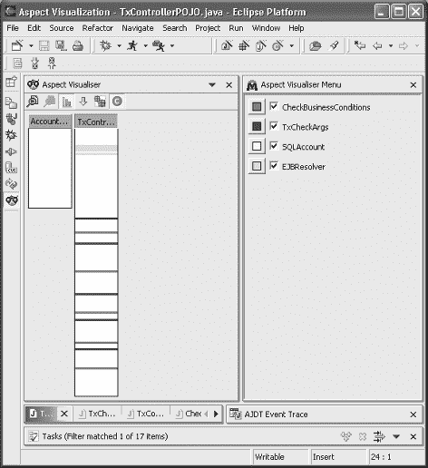

第 11 章 ■ 在示例应用程序的业务层中使用 AOP

**261**

图 11-1 展示了切面在 AccountPOJO（左侧条）和 TxControllerPOJO（右侧条）中添加的代码概览。每个条对应一个文件，条的大小取决于所表示文件的行数。每个被切面添加代码的行都用与特定切面对应的颜色显示。

请注意，AJDT Eclipse 插件的切面可视化工具生成的图形不显示类型间声明。这解释了为什么 AccountPOJO 看起来没有被切面大幅修改。注意左侧条底部的行，它对应隐式协议实现，更准确地说，是 AccountPOJO 中 getCustomerIds 方法的实现。

**图 11-1.** *切面的综合与可视化* **AOP 作为集成技术**

应用服务器依赖于组件容器。它们的最终目标是尽可能透明地将与分布式企业应用开发相关的所有关注点集成到中间件层中。当某个关注点能够以声明方式集成时，就能提供最佳的集成支持。此时，程序员需要考虑面向容器的管理系统，例如容器管理持久化（CMP）和容器管理事务（CMT），也称为声明式事务管理（DTM）。在 J2EE 中，集成是通过 XML 部署描述符进行参数化配置的。

在本节中，我们研究面向容器的事务管理。在描述了底层机制和局限性之后，我们将展示 AOP 如何为 J2EE 中灵活且透明的事务管理提供一种替代方案。

**262**


第 11 章 ■ 在示例应用的业务层中使用 AOP

**使用 JTA 管理分布式事务**

Java 事务 API（JTA）定义了一套用于使用分布式事务的接口和机制。当涉及多个数据源时，事务即为分布式事务。通常，数据源位于不同的服务器上，但这并非强制要求。JTA 也可仅用于单个数据源。在 J2EE 中，JTA 通常用于使会话 EJB 外观服务具备事务性。

参考银行应用只有一个数据源：PointBase 数据库。评估可能的数据分布方式很有意义。例如，账户和交易可以存储在两个不同的数据库中，以平衡负载和数据量。此外，这对系统管理也很有用，因为交易可能需要与账户不同的维护流程。在这种情况下，使用 JTA 和支持分布式的架构就显得尤为重要。

简而言之，JTA 依赖于三个主要实体之间定义的三个通信接口：应用程序、事务管理器和事务资源。在应用服务器的上下文中，JTA 定义了应用服务器与事务管理器之间的接口。该接口允许向管理器通知事务中 EJB 上发生的操作。它还允许客户端访问自动且透明传输的事务上下文，该上下文可从参与事务的任何 EJB 中访问。在事务内部，参与事务的 EJB 可以通过事务上下文访问一个代表该事务的对象：`javax.transaction.UserTransaction` 的一个实例。

**一种 JTA 解决方案**

清单 11-20 中的代码重写了`TxControllerBean`的`transfer`函数，使其通过使用 JTA 来确保事务属性。

**清单 11-20.** *使用 JTA 手动控制事务* 01 // 修改后的 aop.j2ee.business.session.TxControllerBean 版本，以使用 JTA 02 [...]

03 javax.transaction.UserTransaction ut;

05 public void transferFunds(BigDecimal amount,String descr, 06 String fromAccountId,String toAccountId) 07 throws

08 InvalidParameterException,AccountNotFoundException, 09 InsufficientFundsException,InsufficientCreditException {

11 Account fromAccount;

12 Account toAccount;

14 fromAccount= checkAccountArgsAndResolve(amount, descr, fromAccountId); 15 toAccount= checkAccountArgsAndResolve(amount, descr, toAccountId); 16

17 ut= context.getUserTransaction();

第 11 章 ■ 在示例应用的业务层中使用 AOP

**263**

19 try {

20 ut.begin();

21 } catch (Exception e) {

22 throw new EJBException("transferFunds: " + e.getMessage()); 23 }

25 try {

27 String fromType= fromAccount.getType();

28 BigDecimal fromBalance= fromAccount.getBalance(); 29

30 if (DomainUtil.isCreditAccount(fromType)) {

31 BigDecimal fromNewBalance= fromBalance.add(amount); 32 if (fromNewBalance.compareTo(fromAccount.getCreditLine()) == 1) 33 throw new InsufficientCreditException();

34 executeTx(amount,descr,fromAccountId,fromNewBalance,fromAccount); 35 } else {

36 BigDecimal fromNewBalance= fromBalance.subtract(amount); 37 if (fromNewBalance.compareTo(bigZero) == -1)

38 throw new InsufficientFundsException();

39 executeTx(amount.negate(),descr,fromAccountId,fromNewBalance,fromAccount); 40 }

42 String toType= toAccount.getType();

43 BigDecimal toBalance= toAccount.getBalance();

45 if (DomainUtil.isCreditAccount(toType)) {

46 BigDecimal toNewBalance= toBalance.subtract(amount); 47 executeTx(amount.negate(),descr,toAccountId,toNewBalance,toAccount); 48 } else {

49 BigDecimal toNewBalance= toBalance.add(amount); 50 executeTx(amount, descr, toAccountId, toNewBalance, toAccount); 51 }

53 ut.commit();

55 } catch (Exception ex) {

56 try {

57 ut.rollback();

58 } catch (Exception e) {

59 throw new EJBException("transferFunds: " + e.getMessage()); 60 }

61 throw new EJBException("transferFunds: " + ex.getMessage()); 62 }

63 } // transferFunds

如图所示，使用 JTA 管理事务使应用程序代码变得复杂。此外，这是一个横切关注点，因为它必须在每个参与事务的 EJB 中处理。

**264**

第 11 章 ■ 在示例应用的业务层中使用 AOP

该关注点增加了以下元素：

*   一个存储`UserTransaction`对象并允许快速访问它的字段（第 3 行）
*   在事务方法开始时对该字段的初始化（第 17 行）
*   调用`begin`以指示事务开始（第 20 行）
*   调用`commit`以请求事务的完成（第 53 行）
*   在发生错误时调用`rollback`以请求取消事务（第 57 行）

此外，我们需要管理事务本身可能抛出的异常。在这里，我们以通用方式处理它们。

**EJB 作为事务自动集成的基础设施**

Sun Microsystems 提供的 J2EE 规范允许通过专用属性以声明方式定义事务，这些属性在部署描述符中定义。这些属性应用于 EJB 方法，并在调用这些方法时，参数化容器关于事务管理器的行为。

这些属性如下：

*   `TX_NOT_SUPPORTED`：指示该方法不是事务性的。如果该方法在事务内被调用，则该事务在方法执行期间被挂起。
*   `TX_SUPPORTS`：指示支持该方法的 Bean 将作为参与者包含在事务中。如果客户端未定义任何事务，容器可以根据实现创建一个新事务。
*   `TX_REQUIRED`：指示该方法必须在事务上下文中执行。如果没有，容器会自动创建一个新事务。
*   `TX_REQUIRES_NEW`：指示该方法会触发创建一个新事务，即使客户端已经定义了一个事务。在后一种情况下，客户端的事务将被新创建的事务替换。
*   `TX_BEAN_MANAGED`：指示 EJB 方法手动实现事务管理，例如通过使用 JTA。
*   `TX_MANDATORY`：指示该方法必须在事务内执行。如果没有，容器会抛出`TransactionRequired`异常。

图 11-2 展示了当`transferFunds`方法设置为`TX_REQUIRES_NEW`（这意味着即使客户端已定义事务，容器也会自动创建一个新事务），并且`Account.setBalance`和`AccountHome.create`方法设置为`TX_REQUIRED`时，从应用程序发送到事务管理器以及事务资源的消息。

第 11 章 ■ 在示例应用的业务层中使用 AOP

**265**

对`transferFunds`方法的调用会触发向管理器发送`begin`消息，管理器进而创建一个新事务。该事务被添加到当前线程的上下文中，并自动传输给参与事务的 EJB。当使用 Account EJB 并创建银行级 Tx 事务时，它们会作为参与者被添加到当前事务中。

`transferFund`方法的成功结束会触发`commit`，而捕获到`EJBException`则意味着回滚。

**图 11-2.** *J2EE 中的声明式事务机制*

容器管理事务的存在使得程序代码可以免受事务关注点的影响。然而，这种技术有其局限性。


EJB 标准定义的属性过于简单，无法涵盖开发复杂应用时可能出现的所有情况。例如，如果事务首次未能成功完成，程序员可能需要重试该事务。此外，根据应用或环境状态，在某些上下文中不应用事务以优化应用也是常见做法。然而，在优化方面，有时将事务应用范围限制在指令组而非整个方法代码中会很有用。在这种情况下，唯一的方法是使用 `TX_BEAN_MANAGED` 属性并手动编写事务逻辑。

即使在提供的属性允许描述事务逻辑的情况下，这种技术仍然需要编写一些代码来处理客户端异常和某些回滚管理场景。

特别是，程序员可能需要在某个参与者内部强制回滚事务。在这种情况下，应使用 `setRollbackOnly` 方法（参见清单 11-21 的第 7 行）来取消事务，即使更高级别的参与者试图提交该事务。

例如，清单 11-21 中的代码阻止了在任何事务上下文中出现负数的 `setBalance`：

**266**

第 11 章 ■ 在示例应用的业务层中使用 AOP

**清单 11-21.** *`setRollbackOnly` 方法的使用示例* 01 [...]

02 public void setBalance(double amount)

03 throw InsufficientFundsException {

04 if( balance >= 0 ) {

05 balance = amount;

06 } else {

07 context.setRollbackOnly();

08 throw new InsufficientFundsException(balance);

09 }

10 }

11 [...]

如你所见，声明式事务管理并非理想解决方案。以下章节将展示如何用 AOP 替代它。

**AOP 与事务的模块化集成**

由于其灵活性，AOP 有助于以模块化方式集成事务，并避免之前遇到的限制。

实际上，要使一个方法（此处为 `transferFunds`）具有事务性，可以使用清单 11-22 中所示的事务切面。

**清单 11-22.** *用于模块化事务管理代码的切面* 01 package aop.j2ee.business.aspect;

03 import javax.ejb.EJBException;

04 import aop.j2ee.business.session.txcontroller.TxControllerPOJO; 05

06 public privileged aspect Transaction {

07 Object around(TxControllerPOJO controller) :

08 execution(* TxControllerPOJO.transferFunds(..)) && this(controller) {

10 Object result;

11 try {

12 controller.context.getUserTransaction().begin(); 13 } catch (Exception e) {

14 throw new EJBException("transferFunds: " + e.getMessage()); 15 }

16 try {

17 result=proceed(controller);

18 controller.context.getUserTransaction().commit(); 19 } catch (Exception ex) {

20 try {

21 controller.context.getUserTransaction().rollback(); 22 } catch (Exception e) {

第 11 章 ■ 在示例应用的业务层中使用 AOP

**267**

23 throw new EJBException("transferFunds: " + e.getMessage()); 24 }

25 throw new EJBException("transferFunds: " + ex.getMessage()); 26 }

27 return result;

28 }

29 }

与容器管理的事务相反，实现事务启动的代码（第 12 行）是完全开放且对程序员可访问的，程序员因此可以实现应用所需的所有变体。

要将事务范围限制在给定方法内的指令组中，可以使用*锚定协议*技术。

该技术类似于本书中已多次使用的隐式协议技术。主要区别在于，切面不实现协议方法，而是将它们用作锚点，在目标方法内添加代码。

例如，我们在清单 11-23 中定义了两个方法 `beginTx`（第 4 行和第 19 行）和 `endTx`（第 5 行和第 28 行）作为锚定协议。


**清单 11-23.** *在 transferFunds 方法中使用锚定协议* 01 // 通过使用锚定协议修改 TxControllerBean 02 [...]

03 // 协议定义

04 private void beginTx() {};

05 private void endTx() {};

07 public void transferFunds(BigDecimal amount,String description, 08 String fromAccountId,String toAccountId)

09 throws

10 InvalidParameterException,AccountNotFoundException, 11 InsufficientFundsException,InsufficientCreditException {

13 Account fromAccount;

14 Account toAccount;

16 fromAccount= checkAccountArgsAndResolve(amount, description, fromAccountId); 17 toAccount= checkAccountArgsAndResolve(amount, description, toAccountId); 18

19 beginTx();

21 try {

22 String fromType= fromAccount.getType();

23 BigDecimal fromBalance= fromAccount.getBalance(); 24

25 if (DomainUtil.isCreditAccount(fromType)) {

26 [...] // 转账实现（见前文）

**268**

第 11 章 ■ 在示例应用程序的业务层中使用 AOP

28 endTx();

30 } catch (RemoteException ex) {

31 throw new EJBException("makePayment: " + ex.getMessage()); 32 }

34 } // transferFunds

然后，清单 11-24 所示的切面为位于 beginTx 和 endTx 锚点之间的代码引入了事务管理逻辑。

**清单 11-24.** *使用切面通过锚定协议注入事务管理代码*

package aop.j2ee.business.aspect;

import javax.ejb.EJBException;

import aop.j2ee.business.session.txcontroller.TxControllerPOJO; import aop.j2ee.business.entity.account.Account;

public privileged aspect Transaction {

javax.transaction.UserTransaction ut;

after(TxControllerPOJO controller) : execution(

void TxControllerPOJO.beginTx())

&& withincode(* TxControllerPOJO.transferFunds(..))

&& this(controller) {

ut= controller.context.getUserTransaction();

try {

ut.begin();

} catch (Exception e) {

throw new EJBException("transferFunds: " + e.getMessage());

}

}

after() : call(void TxControllerPOJO.endTx())

&& withincode(* TxControllerPOJO.transferFunds(..)) {

ut.commit(); try {

ut= null;

} catch (Exception ex) {

try {

ut.rollback();

} catch (Exception e) {

throw new EJBException("transferFunds: " + e.getMessage());

}

第 11 章 ■ 在示例应用程序的业务层中使用 AOP

**269**

throw new EJBException("transferFunds: " + ex.getMessage());

}

}

after()throwing(Exception ex)

throws

EJBException : call(* Account +.* (..))

&& withincode(* TxControllerPOJO.transferFunds(..)) {

try {

if (ut != null)

ut.rollback();

} catch (Exception e) {

throw new EJBException("transferFunds: " + e.getMessage());

}

throw new EJBException("transferFunds: " + ex.getMessage());

}

然而，锚定协议技术不允许对异常进行精确管理。这可以通过测试指示我们是否在限定区域内的变量（此处为 ut）来解决。

当环境允许时，考虑多线程也很重要（在我们的示例中未使用）。因此，必须为需要在通知代码间共享的变量使用线程局部变量。按线程的切面实例化指令也是一个优雅的解决方案。

**总结**

在本章中，我们介绍了如何使用 AOP 来改进业务层的设计。

从关注点分离的角度来看，我们可以得出结论，AOP 已成功应用于我们的案例研究，因为许多横切关注点得到了更清晰的分离，包括：

• 对 EJB/J2EE 技术的依赖

• 业务对象引用的管理和解析

• 持久化

• 前置条件（包括技术前置条件和业务前置条件）

• 事务

仍然可以将其他关注点模块化，例如日志记录，我们在此未展示。

图 11-3 显示了应用所有切面后构成业务层的组件。每个灰色条对应一个常规的 EJB。实际上，灰色表示未应用任何切面。第一个条对应实体 EJB AccountBean，第二个对应 AccountPOJO，依此类推，直到每个组件。

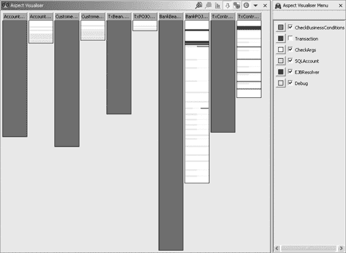

**270**

第 11 章 ■ 在示例应用程序的业务层中使用 AOP

**图 11-3.** *业务层组件及其切面* 我们可以注意到，POJO 版本的业务组件实现的大小明显更小。这源于持久化的外部化。

通知代码在外观组件（如最后两个）中的使用比在业务组件中更多。这源于一种实现选择，该选择大量使用了针对业务组件的类型间声明。

第 12 章

■ ■ ■

在示例应用程序的表示层和

客户端层中使用 AOP

**在**第 11 章中，我们使用 AOP 改进了第 10 章中介绍的 Duke's Bank 案例研究应用程序的业务层设计。在本章中，我们将研究 AOP 在其他层中的使用——特别是 Java (Swing) 客户端层和表示层。我们不会使用数据层，因为它无法从基于 Java 的 AOP 技术中受益（正如我们在第 11 章中解释的那样）。

案例研究的原始设计并不完全适应 AOP，因为它使用了特设的设计解决方案。例如，Web 表示层使用了 Struts 框架，该框架封装了一些棘手的设计问题。这并不意味着 AOP 没有用处，尤其是在改进 Struts 实现或集成方面。然而，由于固有的复杂性，在本章中，我们引入了一些简化的设计片段，以更清晰地说明 AOP 的优势。

我们首先展示 AOP 在 Java Swing 客户端中的使用，然后详细阐述其对 Web（Servlets/JSP）表示层的影响。

**使用 AOP 进行分布式通信**

当客户端在三层 J2EE 环境中访问业务服务器时，可能会出现通信问题。客户端层包含几种设计模式，旨在处理分布式通信带来的关注点。

用于通信和数据传输的 J2EE 设计模式最常影响客户端，偶尔也会影响服务器端。因此，这些模式代表了横切的一个重要来源，尤其是在构建多客户端应用程序时。

如前所述，使用 J2EE 设计模式并非强制性的。然而，通过使用它们，我们可以将面向切面的实现与有据可查、众所周知且经过验证的参考设计进行对比。

**271**

**272**

第 12 章 ■ 在示例应用程序的表示层和客户端层中使用 AOP

**用于业务层访问的设计模式**

用于客户端/服务器通信的三种主要 J2EE 设计模式是业务委托、服务定位器和数据传输对象。在本章中，我们说明了这些模式在有和没有 AOP 帮助下的使用情况。

为简单起见，我们使用一个基本的 Java 客户端来访问第 11 章以及本章中介绍的示例应用程序。我们讨论了其局限性，并展示了切面如何提高客户端在技术和设计选择方面的实现独立性。

业务委托

*业务委托*的目标是隐藏服务器远程访问协议的实现细节，例如通过 JNDI 存储库查找 EJB 容器或处理远程调用。因此，这种设计模式减少了表示层客户端与业务层之间的耦合。


然而，这种设计模式并未完全消除依赖关系，因为如果业务服务发生修改，其接口也会随之变化。此外，在每个客户端实现中系统性地引用业务委托层本身也构成了一个横切关注点。

尽管位置透明和分布层透明是该模式的优点，但业务委托可能会引发一些微妙的使用问题。实际上，客户端不能像使用本地对象那样使用业务委托，因为这样做可能会产生严重的性能问题，例如网络过载。因此，客户端程序员必须意识到，他们所操作的对象实际上是远程对象的代理。

清单 12-1 定义了一个简单的 Java 客户端，我们开发它是为了说明本节讨论的问题。这些问题可以移植到真实的银行客户端中：Java Swing 管理客户端和基于 servlet 的表示层。

**清单 12-1.** *银行应用的简单客户端*
01 package aop.j2ee.client.java.regular;

03 import java.math.BigDecimal;

04 import java.util.Date;

05 import aop.j2ee.client.delegate.BankDelegate;

06 import aop.j2ee.commons.to.AccountDetails;

08 public class Simple {

10 public static void main(String[] args) {

11 try {

12 BankDelegate deleguate = new BankDelegate();

13 String customerId = deleguate.createCustomer("Pawlak","Renaud","P", 14 "Frederick St","Hartford","CT","06105","NA", 15 "renaud@aopsys.com");

16 System.out.println("Created new customer " + customerId); 17 String accountId = deleguate.createAccount(customerId,"Debit", 18 "This is a test.",new BigDecimal(100),new BigDecimal(0), 19 new BigDecimal(100),new Date());

第 12 章 ■ 在示例应用的表示层和客户端层中使用 AOP

**273**

20 System.out.println("Created new customer " + accountId); 21 deleguate.setAccountBalance(new BigDecimal(200), accountId); 22 System.out.println("Changed balance"); 23 AccountDetails details = deleguate.getAccountDetails(accountId); 24 System.out.println("Account details:"); 25 System.out.println(details);

26 } catch (Exception e) {

27 System.err.println(e.getMessage());

28 e.printStackTrace();

29 }

30 }

31 }

此处，客户端仅使用了在第 12 行创建的业务委托。所有与远程通信相关的代码都模块化在这个对象中。

如清单 12-2 中的代码所示，业务委托相当复杂，因为它集成了对`getServiceFacade`方法的调用，该方法在应用服务器的 JNDI 仓库中实现了 EJB 查找（第 34 行）。这段代码使用了一个定位器对象，我们稍后会介绍它（参见第 26 行其初始化过程）。

**清单 12-2.** *银行应用的业务委托实现*
001 package aop.j2ee.client.delegate;

003 import java.math.BigDecimal;

004 import java.rmi.RemoteException;

005 import java.util.ArrayList;

006 import java.util.Date;

007 import java.util.ResourceBundle;

009 import javax.ejb.CreateException;

010 import javax.naming.NamingException;

012 import aop.j2ee.commons.exception.*;

013 import aop.j2ee.commons.to.AccountDetails;

014 import aop.j2ee.commons.to.CustomerDetails;

015 import aop.j2ee.commons.util.locator.ServiceLocator; 016

017 import aop.j2ee.business.session.bank.BankHome;

018 import aop.j2ee.business.session.bank.Bank;

020 public class BankDelegate {

022 private ResourceBundle messages;

023 private static ServiceLocator locator;

024 Bank bank = null;

026 private void init() throws SystemException {

027 try {

**274**

第 12 章 ■ 在示例应用的表示层和客户端层中使用 AOP

028 locator = ServiceLocator.getInstance();

029 } catch (NamingException ne) {

030 throw new SystemException(ne.getMessage());

031 }

032 }

034 private Bank getServiceFacade() throws SystemException {

035 if(bank!=null) return bank;

036 try {


037 BankHome home = (BankHome) locator.lookupHome(Bank.class); 038 bank = home.create();

039 } catch (ClassNotFoundException cne) {

040 throw new SystemException(cne.getMessage());

041 } catch (NamingException ne) {

042 throw new SystemException(ne.getMessage());

043 } catch (CreateException ce) {

044 throw new SystemException(ce.getMessage());

045 } catch (RemoteException re) {

046 throw new SystemException(re.getMessage());

047 }

048 return bank;

049 }

051 public BankDelegate() throws SystemException {

052 if (locator == null)

053 init();

054 }

056 public void addCustomerToAccount(String customerId, 057 String accountId) 058 throws RemoteException, AccountNotFoundException, 059 CustomerNotFoundException, CustomerInAccountException, 060 InvalidParameterException {

061 Bank bank;

062 try {

063 bank = getServiceFacade();

064 } catch (SystemException ex) {

065 ex.printStackTrace();

066 return;

067 }

068 bank.addCustomerToAccount(customerId, accountId); 069 }

071 public String createAccount(String customerId,String type, 072 String description,BigDecimal balance,BigDecimal creditLine, 073 BigDecimal beginBalance, Date beginBalanceTimeStamp) 074 throws

第 12 章 ■ 在示例应用程序的表示层和客户端层使用 AOP

**275**

075 RemoteException, IllegalAccountTypeException,

076 CustomerNotFoundException,InvalidParameterException {

078 Bank bank;

079 try {

080 bank = getServiceFacade();

081 } catch (SystemException ex) {

082 ex.printStackTrace();

083 return null;

084 }

085 return bank.createAccount(

086 customerId,type,description,balance,creditLine,beginBalance, 087 beginBalanceTimeStamp);

088 }

090 public String createCustomer(String lastName,String firstName, 091 String middleInitial,String street,String city,String state, 092 String zip,String phone,String email)

093 throws InvalidParameterException, RemoteException {

094 Bank bank;

095 try {

096 bank = getServiceFacade();

097 } catch (SystemException ex) {

098 ex.printStackTrace();

099 return null;

100 }

101 return bank.createCustomer(lastName,firstName,middleInitial, 102 street,city,state,zip,phone,email);

103 }

105 public AccountDetails getAccountDetails(String accountId) 106 throws RemoteException, AccountNotFoundException, 107 InvalidParameterException {

109 Bank bank;

110 try {

111 bank = getServiceFacade();

112 } catch (SystemException ex) {

113 ex.printStackTrace();

114 return null;

115 }

116 return bank.getAccountDetails(accountId);

117 }

119 [...] // 相同的委托模式

120 // 对其他服务委托给银行

121 }

**276**

第 12 章 ■ 在示例应用程序的表示层和客户端层使用 AOP

在每个业务委托方法中，我们获取第 11 章中引入的会话外观实例（第 63 行），并使用所需的参数调用该外观的相应服务（第 68 行）。

业务委托的另一个优势在于它封装了远程通信策略。例如，超时、重试和缓存策略都可以在委托内部实现，从而使客户端代码更加独立于这些非功能性关注点。

接下来，清单 12-3 中的代码展示了在委托内实现简单重试策略的示例。如果网络或服务器暂时不可用，该策略能使应用程序更加稳定。在这种情况下，如果服务解析失败，我们会在重试（第 18 行）之前将当前线程暂停一秒钟（第 17 行）。类似地，如果在调用过程中遇到错误，我们会等待一秒钟（第 33 行），然后递归重试（第 35 行）。请注意，我们在第 34 行强制重新解析外观。

**清单 12-3.** *为银行委托添加重试策略* 01 public class BankDelegate {

03 [...]

05 public String createAccount(String customerId, String type, String descr, 06 BigDecimal balance, BigDecimal creditLine, BigDecimal beginBalance, 07 Date beginBalanceTimeStamp)

08 throws


09 RemoteException, IllegalAccountTypeException, CustomerNotFoundException, 10 InvalidParameterException {

12 Bank bank;

13 try {

14 bank= getServiceFacade();

15 } catch (SystemException ex) {

16 try {

17 Thread.sleep(1000);

18 bank= getServiceFacade();

19 } catch (SystemException ex2) {

20 ex2.printStackTrace();

21 return null;

22 } catch (InterruptedException ex2) {

23 ex2.printStackTrace();

24 return null;

25 }

26 }

27 String result=null;

28 try {

29 result = bank.createAccount(customerId, type, descr, balance, creditLine,

第 12 章 ■ 在示例应用程序的表示层和客户端层中使用 AOP

**277**

30 beginBalance, beginBalanceTimeStamp); 31 } catch (RemoteException ex) {

32 try {

33 Thread.sleep(1000);

34 bank= null;

35 createAccount(customerId, type, description, balance, creditLine, 36 beginBalance, beginBalanceTimeStamp); 37 } catch (InterruptedException ex2) {

38 ex2.printStackTrace();

39 }

40 }

41 return result;

42 }

43 [...]

清单 12-3 中的实现显然优于那种直接从客户端代码解析并调用外观的简单实现。然而，这种改进并非完全令人满意，原因如下。首先，为了保持清晰的业务级 API，最好为每个业务对象实现一个业务委托。尽管理论上这项工作只需完成一次，但编写委托代码是一项容易出错且繁琐的任务。其次，对业务委托 API 的访问构成了一个横切关注点。最后，委托不易重用，因为它们依赖于底层 J2EE 基础设施的通信层。

请注意，业务委托实现使用了一个名为 `ServiceLocator` 的类，该类实现了另一种客户端设计模式，将在下一节中解释。

服务定位器

*服务定位器*设计模式降低了客户端因需要定位和创建远程服务访问存根而产生的复杂性。这种关注点在 J2EE 环境中很典型。

将这种关注点模块化到服务定位器中，并不能消除所有技术依赖。

首先，服务定位器的使用者（例如业务委托）必须引用 `javax.ejb.EJBHome` 和 `javax.ejb.EJBLocalHome` 接口。此外，`javax.ejb`、`java.rmi` 和 `javax.naming` 包中的异常必须由使用代码处理。这些依赖关系在使用了服务定位器的 `BankDelegate` 代码中有所体现。

在不同的客户端代码中使用服务定位器时，仍会存在一些横切关注点——例如，在基于 Servlet 的表示层客户端和 Swing 客户端的业务委托中。这些横切关注点实现了对 EJB 接口的引用、对前述异常的处理，以及我们在每个客户端中都能找到的服务定位器引用。

回顾一下，服务定位器也是 GoF 单例设计模式的一种实现。第 8 章展示了如何通过一个专用切面将普通类自动转换为单例（更多详情请参见第 8 章中的“单例设计模式”一节）。

**278**

第 12 章 ■ 在示例应用程序的表示层和客户端层中使用 AOP

数据传输对象

在本章开头给出的客户端代码中，我们看到使用了名为 `getAccountDetails` 的服务，该服务返回一个 `AccountDetails` 类型的对象实例。此对象聚合了一个账户的属性值，并提供了一个与 `Account` 相近的接口。该对象是 J2EE 设计模式中一个参与者的实例化：*数据传输对象*。

数据传输对象可用于两种主要情况：

*   当客户端计算单元需要访问业务层返回的多条数据时（多次下载）
*   当客户端计算单元需要发送多条数据以完成处理时（多次上传）

通过使用数据传输对象设计模式，可以减少远程调用的次数，如清单 12-4 所示。该模式建议使用一个传输对象，该对象旨在将一组数据从客户端传输到服务器，反之亦然。在这种情况下，我们使用了一个 `AccountDetails` 传输对象。由于传输对象必须同时从客户端和服务器访问，因此应用程序的所有传输对象都放在 `aop.j2ee.commons.to` 包中（`to` 代表传输对象）。

**清单 12-4.** *银行应用程序的传输对象* 01 package aop.j2ee.commons.to;

03 import java.math.BigDecimal;

04 import java.util.Date;

05 import java.util.ArrayList;

07 public class AccountDetails implements java.io.Serializable {

09 private String accountId;

10 private String type;

11 private String description;

12 private BigDecimal balance;

13 private BigDecimal creditLine;

14 private BigDecimal beginBalance;

15 private Date beginBalanceTimeStamp;

16 private ArrayList customerIds;

18 public AccountDetails(String accountId, String type, String descr, 19 BigDecimal balance, BigDecimal creditLine, BigDecimal beginBalance, 20 Date beginBalanceTimeStamp, ArrayList customerIds) {

22 this.accountId = accountId;

23 this.type = type;

24 this.description = descr;

25 this.balance = balance;

26 this.creditLine = creditLine;

第 12 章 ■ 在示例应用程序的表示层和客户端层中使用 AOP

**279**

27 this.beginBalance = beginBalance;

28 this.beginBalanceTimeStamp = beginBalanceTimeStamp; 29 this.customerIds = customerIds;

30 }

32 public String getAccountId() {return accountId;}

33 public String getDescription() {return description;}

34 public String getType() {return type;}

35 public BigDecimal getBalance() {return balance;}

36 public BigDecimal getCreditLine() {return creditLine;}

37 public BigDecimal getBeginBalance() {return beginBalance;}

38 public Date getBeginBalanceTimeStamp() {return beginBalanceTimeStamp;}

39 public ArrayList getCustomerIds() {return customerIds;}

40 public void setAccountId(String accountId) {this.accountId = accountId;}

41 public void setType(String type) {this.type = type;}

42 public void setDescription(String descr) {this.description = descr;}

43 public void setBalance(BigDecimal balance) {this.balance = balance;}

44 public void setCreditLine(BigDecimal n) {this.creditLine = n;}

45 public void setBeginBalance(BigDecimal n) {this.beginBalance = n;}

46 public void setBeginBalanceTimeStamp(Date beginBalanceTimeStamp){

47 this.beginBalanceTimeStamp = beginBalanceTimeStamp; 48 }

49 public void setCustomerIds(ArrayList ids) {this.customerIds= ids;}

50 public String toString() {

51 return "account "+accountId+" ("+type+")\n"+

52 "description: "+description+"\n"+

53 "balance: "+balance+"\n"+

54 "creditLine: "+creditLine+"\n"+

55 "beginBalance: "+beginBalance+"\n"+

56 "beginBalanceTimeStamp: "+beginBalanceTimeStamp+"\n"+

57 "customerIds: "+customerIds+"\n"; 58 }

60 }

为了能够通过远程方法调用（RMI）进行远程传输，传输对象必须实现 `java.io.Serializable` 接口。如果客户端与服务器对象位于同一虚拟机中（例如，本地 EJB），则客户端不会使用 RMI，此时 `Serializable` 接口只是冗余信息。

在我们的案例中，对于 Simple 客户端，可以优化客户端/服务器之间的数据传输（上传）。为此，客户端可以使用一个 `CustomerAndAccountInfos` 传输对象，该对象聚合了给定账户和客户对的一组数据。这样，调用将减少为对 `Bank.createAccountWithCustomer(CustomerAndAccountInfos)` 的唯一一次调用，这是为此特定优化而添加到服务器的新服务。


数据传输对象模式的主要问题源于新服务器端服务的引入。这些服务旨在优化远程数据交换，并且高度依赖于客户端如何使用服务器。它们污染了业务接口，并

**280**

第 12 章 ■ 在示例应用程序的表示层和客户端层中使用 AOP

使得全局应用程序的可维护性降低。例如，当业务需求发生变化时，可能需要对这几种模式进行重大修改。

总之，尽管在某些情况下可以使用传输对象（例如，用于聚合特定对象的状态），但通常来说，使用它们会更加困难（且危险）（例如，在尝试优化通信成本时，如 CustomerAndAccountInfos）。这些对象难以预测，并且可能根据应用程序的架构而变化。因此，为了更好地模块化这一关注点的实现，将极大地有助于提高可维护性。在下一节中，我们将解释 AOP 如何实现这种分离。

**访问设计模式的面向切面实现** 在前面的章节中，我们介绍了业务层访问的三种主要设计模式：业务委托、服务定位器和数据传输对象。这些模式协同工作，以管理分布式 J2EE 环境中的业务层访问。我们已经讨论了它们的局限性和缺陷。

在本节中，我们提出这些设计模式的面向切面实现，它可以作为一种优雅的替代方案。

消除业务委托

采用面向切面的设计，业务委托设计模式通常就不再需要了。

实际上，该模式的目的是封装与业务外观的通信（解析、错误处理、重试和超时）。然而，所有这些都可以轻松地封装在“环绕”通知代码中。

该通知将应用于对外观的直接调用，而外观由远程客户端通过其远程接口调用。该接口的解析可以像业务层一样，通过使用隐式协议技术来完成。

J2EE 服务定位器的第一个切面可以如清单 12-5 所示实现。

**清单 12-5.** *定位器切面*

01 package aop.j2ee.client.java.aspect;

03 import java.rmi.RemoteException;

04 import javax.ejb.CreateException;

05 import javax.naming.NamingException;

07 import aop.j2ee.business.session.bank.BankHome;

08 import aop.j2ee.commons.exception.SystemException;

10 import aop.j2ee.commons.util.locator.*;

12 public aspect Locator {

13 public static final String BANK_SERVICE = "aop.j2ee.business.session.Bank"; 14

15 public pointcut ejbservice(Class aClass) : call(

16 * aop.j2ee.client.java.aspectized..*.getServiceFacade(Class))&&args(aClass);

第 12 章 ■ 在示例应用程序的表示层和客户端层中使用 AOP

**281**

18 protected pointcut connectionservice(String aDataSource) : 19 call(* aop.j2ee.client.java.aspectized..*.getDatabaseConnection(String)) 20 && args(aDataSource);

22 protected pointcut jmsservice(String aJMSObject) : call(

23 * aop.j2ee.client.java.aspectized..*.getJMSObject(String))&&args(aJMSObject); 24

25 protected Object createService(Class aClass, Object home) 26 throws Exception {

27 if (aClass.getName().equals(BANK_SERVICE)) {

28 BankHome bankhome = (BankHome) home;

29 return bankhome.create();

30 }

31 throw new Exception("Cannot create service for " + aClass); 32 }

34 public pointcut exception() :

35 call(* aop.j2ee..*+.*(..) throws *Exception)

36 && within(aop.j2ee.client.java.aspectized.* +); 37

38 private EJBServiceLocator ejbLocator;

39 private JDBCServiceLocator jdbcConnectionLocator;

40 private JMSServiceLocator jmsObjectLocator;

42 Object around(Class aClass)

43 throws SystemException : ejbservice(aClass) {

44 Object service = null;

45 try {


46 if (ejbLocator == null)

47 ejbLocator = new EJBServiceLocator();

48 Object home = ejbLocator.lookup(aClass);

49 service = createService(aClass,home);

50 } catch (NamingException ne) {

51 throw new SystemException(ne.getMessage());

52 } catch (ClassNotFoundException cne) {

53 throw new SystemException(cne.getMessage());

54 } catch (CreateException ce) {

55 throw new SystemException(ce.getMessage());

56 } catch (RemoteException re) {

57 throw new SystemException(re.getMessage());

58 } catch (Exception e) {

59 throw new SystemException(e.getMessage());

60 }

61 return service;

62 }

**282**

第 12 章 ■ 在示例应用程序的表示层和客户端层中使用 AOP

64 Object around(String aDataSource)

65 throws SystemException : connectionservice(aDataSource) {

66 Object connection = null;

67 try {

68 if (jdbcConnectionLocator == null)

69 jdbcConnectionLocator = new JDBCServiceLocator(); 70 connection = jdbcConnectionLocator.lookup(aDataSource); 71 } catch (Exception ne) {

72 throw new SystemException(ne.getMessage());

73 }

74 return connection;

75 }

77 Object around(String aName)

78 throws SystemException : jmsservice(aName) {

79 Object jmsObject = null;

80 try {

81 if (jmsObjectLocator == null)

82 jmsObjectLocator = new JMSServiceLocator();

83 jmsObject = jmsObjectLocator.lookup(aName);

84 } catch (Exception ne) {

85 throw new SystemException(ne.getMessage());

86 }

87 return jmsObject;

88 }

89 }

这个切面不仅限于 EJB 服务解析，还支持 JMS 服务和数据源的解析。它依赖于一个简单的隐式协议，该协议隐藏了实际解析的实现，而这些实现由切面透明地插入。

因此，对于每种解析类型，客户端可以定义以下空方法之一：

• aclass.getServiceFacade(Class)（切入点第 15 行）

• aclass.getDatabaseConnection(Class)（切入点第 18 行）

• aclass.getJMSObject(Class)（切入点第 22 行）

实际的实现则由相应的“around”通知代码提供（第 42、64 和 77 行）。

得益于这个切面，之前定义的 Simple 客户端可以修改为清单 12-6 所示。

**清单 12-6.** *切面化后的 Simple 客户端*

package aop.j2ee.client.java.aspectized;

import java.math.BigDecimal;

import java.util.Date;

第 12 章 ■ 在示例应用程序的表示层和客户端层中使用 AOP

**283**

import aop.j2ee.business.session.bank.Bank;

import aop.j2ee.commons.to.AccountDetails;

import aop.j2ee.commons.exception.SystemException;

public class Simple {

public static void main(String[] args) {

try {

BankDelegate deleguate = new BankDelegate();

String customerId =

deleguate.createCustomer("Pawlak","Renaud","P",

"Frederick St","Hartford","CT","06105","NA",

"renaud@aopsys.com");

System.out.println("已创建新客户 " + customerId); String accountId =

deleguate.createAccount(customerId,"Debit",

"这是一个测试。",new BigDecimal(100),new BigDecimal(0), new BigDecimal(100),new Date());

System.out.println("已创建新账户 " + accountId); deleguate.setAccountBalance(new BigDecimal(200), accountId); System.out.println("余额已更改");

AccountDetails details =

deleguate.getAccountDetails(accountId);

System.out.println("账户详情：");

System.out.println(details);

} catch (Exception e) {

System.err.println(e.getMessage());

e.printStackTrace();

}

}

// 用于服务解析/定位的隐式协议

static Object getServiceFacade(Class cl) throws SystemException {

return null;

}

}

这种技术特别适合通过业务接口访问服务的客户端，而这也是最常见的情况。在极少数情况下，客户端需要通过专用接口访问业务层（出于可维护性原因应避免这样做），仍然可以使用经典的业务委托模式。


与普通客户端类似，业务委托可以使用隐式解析协议。然后，当通信层相关的问题发生时，它依赖于切面来处理。我们将在下文对此进行详细说明。

**284**

第 12 章 ■ 在示例应用程序的表示层和客户端层使用 AOP

管理通信层相关问题

如前所述，在分布式环境中（其本质容易受到服务中断的影响），为了提高应用程序的可靠性，实施重试或缓存等策略非常重要。由于我们已经消除了业务委托模式，这些策略无法再在委托中实现；它们必须在切面中实现。

AOP 提供了一个自然的框架，用于在主远程通信关注点中分离一些子关注点。例如，可以在两个独立的切面中分离重试和缓存。这种设计选择取决于设计者及其需求。必须在仔细分析可维护性和演进需求之后做出决定。

清单 12-7 中所示的切面实现了在客户端与服务器之间发生物理通信错误时，针对账户创建的重试策略。此切面可被视为一个简单的容错切面。

**清单 12-7.** *重试切面*

01 package aop.j2ee.client.java.aspect;

03 import java.math.BigDecimal;

04 import java.rmi.RemoteException;

05 import java.util.Date;

06 import aop.j2ee.business.session.bank.Bank;

07 import aop.j2ee.commons.exception.*;

08 import aop.j2ee.client.java.aspectized.Simple;

10 public aspect Retry {

12 pointcut retry(String customerId,String type,String description, 13 BigDecimal balance,BigDecimal creditLine, 14 BigDecimal beginBalance,

15 Date beginBalanceTimeStamp):

16 call(public String Bank+.createAccount(..))

17 && within(Simple) && args(customerId,type,description, 18 balance,creditLine,beginBalance,beginBalanceTimeStamp); 19

20 String around(String customerId,String type,String description, 21 BigDecimal balance,BigDecimal creditLine, 22 BigDecimal beginBalance,Date beginBalanceTimeStamp) 23 throws RemoteException,IllegalAccountTypeException, 24 CustomerNotFoundException,InvalidParameterException: 25 retry(customerId, type, description, balance, creditLine, 26 beginBalance, beginBalanceTimeStamp) {

27 String result=null;

28 try {

29 result = proceed(customerId,type,description,

30 balance,creditLine,beginBalance,beginBalanceTimeStamp); 31 } catch (RemoteException ex) {

第 12 章 ■ 在示例应用程序的表示层和客户端层使用 AOP

**285**

32 try {

33 Thread.sleep(1000);

34 result = proceed (

35 customerId,type,description,

36 balance,creditLine,beginBalance,beginBalanceTimeStamp); 37 } catch (InterruptedException ex2) {

38 ex2.printStackTrace();

39 }

40 }

41 return result;

42 }

43 }

清单 12-7 中切面的通知代码与重试切入点相关联，该切入点表示对远程 Bank 接口实现的调用（第 16 行）。服务的初始调用通过第一次调用 proceed（第 29 行）完成。如果发生错误，则在等待一秒钟（第 33 行）后，通过第二次调用 proceed（第 34 行）进行重试调用。当通信层系统地抛出 `RemoteException` 时，此切面代码可能会陷入无限循环。必须通过修改实现或定义新的通知代码以通用方式检测并打破无限循环来处理此问题。

要将此切面应用于一组方法，而不是某个特定方法，我们可以使用非类型化的通用 AOP，它使用通配符和连接点 API 来反射性地访问基础层信息。因此，清单 12-8 中提出的解决方案应用于外观的所有方法。

**清单 12-8.** *将重试切面应用于所有 Bank 方法* Object around():

call(public * Bank+.*(..))

&& within(Simple) {

Object result=null;

try {

result = proceed();

} catch (RemoteException ex) {

try {

Thread.sleep(1000);

result = proceed();

} catch (InterruptedException ex2) {

ex2.printStackTrace();

}

}

return result;

}

**286**

第 12 章 ■ 在示例应用程序的表示层和客户端层使用 AOP

**类型化 AOP 与通用 AOP**

一些 AOP 技术允许通知代码和切入点进行静态类型化；这被称为*类型化 AOP*。例如，Prose 项目允许对某些通知参数进行类型化，从而带来优化可能性。Rickard Oberg 提出了一种基于抽象模式的实现技术，该技术提供了静态类型化。AspectJ 无疑是解决此问题最先进的语言。特别是，它允许将组成连接点的不同元素绑定到某些切入点变量，这些变量可以在通知实现中使用。

当 AOP 是非类型化的（或通用的），并且需要访问连接点信息时，最好的替代方案是使用反射。通知代码可以内省一个连接点，并访问当前对象（`this` 或 `target`）、当前调用或执行的方法及其参数。所有这些信息都可以通过非类型化对象（`java.lang.Object` 或 `java.lang.reflect.Method`）获得。程序员随后根据需要手动转换和拆箱对象。在类型化 AOP 中，程序可以将一个 `int` 参数传递给通知代码，而在通用情况下，同一个参数将是一个需要转换为 `Integer` 实例的 `Object`。

两种技术各有优缺点。类型化 AOP 允许在编译和织入阶段进行一定程度的程序验证。因此，IDE 可能在代码补全、上下文帮助和浏览方面提供更好的支持。另一方面，类型化 AOP 灵活性较差，并且使得编写可重用的通知代码更加困难，如前文重试切面所示。类型化 AOP 意味着基础程序与切面之间存在强依赖关系。如果基础程序接口发生变化，很可能会影响切面的实现，包括通知代码，这可能会阻碍可重用性和演进。这就是关注点分离悖论：关注点分离得越好，它们就越不可能独立演进。相反，通用 AOP 允许创建通用且可重用的切面。然而，它几乎完全禁用了编译时和织入时的测试。因此，程序员在使用通用 AOP 编程时应更加小心。

在性能方面，类型化 AOP 比通用 AOP 具有很大优势，尤其是当通知代码使用被通知方法的参数时。实际上，对参数的反射访问意味着创建一个对象数组，这是通用 AOP 以及更普遍的反射编程（参见 `java.lang.reflect` API）中性能损失的主要原因。我们应该注意到，对于大多数实际应用程序来说，这个性能问题完全微不足道，因为切面和业务层的复杂性使得开销相比之下微不足道。例如，前面介绍的通用重试切面与用于调用外观服务的远程调用相比，产生的开销微不足道。

为了获得最佳的面向切面设计，应该明智地同时使用类型化和通用 AOP 技术，以便在可能的情况下实现各自的优势。

第 12 章 ■ 在示例应用程序的表示层和客户端层使用 AOP

**287**

**关注点分离悖论**


AOP 的最终目标是提供更好的关注点分离。这一目标通过切面得以实现，因为它们允许将那些使用常规编程技术无法清晰模块化的关注点进行模块化。然而，当关注点被分离到不同模块后，在集成不同模块时会出现另一种依赖关系。这种依赖关系，我们可以称之为*关联耦合*，在使用静态类型 AOP 时尤为重要。

例如，对于静态类型的重试切面，切入点所捕获的方法签名发生变更，会使该切入点定义以及相关的通知代码失效。从长远来看，应用程序的任何演进都可能变得繁琐。从某种意义上说，这是一个悖论：关注点分离使应用程序更易于理解，同时却更难以维护。这就是*关注点分离悖论*。

使用泛型 AOP 可以最小化这个问题，但在支持的切入点或切面配置中（例如 JAC 的配置接口、JBoss AOP 或 AspectWerkz 的 XML 配置文件，甚至是使用即将推出的基于 Java 5 的技术时的注解），仍然存在耦合。

尽管我们无法否认关注点分离悖论的存在，但面向切面的设计仍然是一个更好的选择。采用这种设计，切面的耦合比不使用任何切面的相同实现的耦合更加局部化。此外，在应用程序发生变更时，它允许更快速地进行重构。换句话说，AOP 并没有消除依赖关系，但它允许更好地控制这些依赖关系。

工具支持也有助于控制这些依赖关系。例如，在 JAC 中，配置层将依赖关系降至最低。在 AspectJ 中，我们可以通过系统性地使用抽象切面（参见第 3 章）以及在扩展抽象切面的具体切面中实际定义切入点来改进解耦。*切入点库*技术也很有用。有关这些技术的更多详细信息，请参考 AspectJ 的特定指南。

透明地引入数据传输对象

如前所述，数据传输对象模式允许优化客户端/服务器通信。它将一组基本请求聚合到更高级别的请求中，这些高级请求使用传输对象来聚合基本请求的参数。

在特定情况下，这种设计模式极大地受益于 AOP；然而，不建议为了优化通信而修改业务 API。

同样，出于相同原因而使客户端实现复杂化将是一种反模式。

借助 AOP，我们可以定义两个切面，一个用于客户端，一个用于服务器，这样我们就可以完全将应用程序代码从这种优化关注点中解放出来。首先，我们需要在客户端代码中找到可能受益于数据传输对象优化的服务器使用模式（用例）。如果我们查看 Simple 客户端的代码，会发现账户创建是通过两次连续的远程调用来完成的：一次调用 `Bank.createCustomer`，一次调用 `Bank.createAccount`，后者将当前创建的客户作为参数。例如，在注册新客户并为该用户分配默认账户时，就会出现这种用例。这是一种频繁的操作，我们希望仅通过一次远程调用来实现，以减少网络流量。处理单一调用/事务也很有意义，这样可以更有效地实现回滚（在实际执行调用之前，只需要在客户端本地取消即可）。

**288**

第 12 章 ■ 在示例应用程序的表示层和客户端层中使用 AOP


一旦确定了用例代码，我们将定义聚合所需数据的传输对象。由于该对象将被切面使用，将其定义在与业务层显式使用的传输对象（位于 `aop.j2ee.commons.to`）不同的包中可能会很有用。

在清单 12-9 中，`CustomerAndAccountInfos` 类定义了一个传输对象，用于收集所有所需数据。

**清单 12-9.** *CustomerAndAccountInfos 传输对象*  
`package aop.j2ee.commons.aspect.to;`

`import java.math.BigDecimal;`

`import java.util.Date;`

`import java.io.Serializable;`

`public class CustomerAndAccountInfos implements Serializable {`

`private String type;`

`private String description;`

`private BigDecimal balance;`

`private BigDecimal creditLine;`

`private BigDecimal beginBalance;`

`private Date beginBalanceTimeStamp;`

`private String lastName;`

`private String firstName;`

`private String middleInitial;`

`private String street;`

`private String city;`

`private String state;`

`private String zip;`

`private String phone;`

`private String email;`

`public CustomerAndAccountInfos() {}`

`public String getDescription() {return description;}`

`public String getType() {return type;}`

`[...]`

`public void setType(String type) {this.type = type;}`

`public void setDescription(String description) {`

`this.description = description;`

`}`

`[...]`

`}`

第 12 章 ■ 在示例应用程序的表示层和客户端层使用 AOP

**289**

现在，我们定义一个服务（见清单 12-10），该服务使用此数据传输对象创建一个带有默认账户的新客户。正如预期，这个新服务是通过一个使用类型间声明的切面来定义的。需要两个声明：一个用于在银行外观的远程接口中添加服务原型（第 10 行），另一个用于在 `BankBean` 或其 POJO 版本中添加其实现，具体取决于我们是否使用了上一章中介绍的业务层切面（第 16 行）。

**清单 12-10.** *传输对象切面（服务器端）*  
`01 package aop.j2ee.business.aspect;`

`03 import java.rmi.RemoteException;`

`04 import aop.j2ee.commons.aspect.to.*;`

`05 import aop.j2ee.business.session.bank.*;`

`06 import aop.j2ee.commons.exception.*;`

`08 public aspect ServerSideTO {`

`10 public abstract String Bank`

`11 .createAccountWithCustomer(CustomerAndAccountInfos infos)`  
`12 throws`  
`13 RemoteException,IllegalAccountTypeException,`  
`14 CustomerNotFoundException,InvalidParameterException;`  

`16 public String BankBean`  
`17 .createAccountWithCustomer(CustomerAndAccountInfos infos)`  
`18 throws`  
`19 RemoteException,IllegalAccountTypeException,`  
`20 CustomerNotFoundException,InvalidParameterException {`  

`22 String customerId = createCustomer(infos.getLastName(),`  
`23 infos.getFirstName(),infos.getMiddleInitial(),`  
`24 infos.getStreet(),infos.getCity(),infos.getState(),`  
`25 infos.getZip(),infos.getPhone(),infos.getEmail());`  

`27 String accountId = createAccount(customerId,infos.getType(),`  
`28 infos.getDescription(),infos.getBalance(),`  
`29 infos.getCreditLine(),infos.getBeginBalance(),`  
`30 infos.getBeginBalanceTimeStamp());`  

`32 return accountId;`  
`33 }`  
`34 }`

对于客户端，我们定义了一个切面，当使用聚合调用序列时，该切面允许透明地使用此服务，如清单 12-11 所示。

**290**

第 12 章 ■ 在示例应用程序的表示层和客户端层使用 AOP

**清单 12-11.** *传输对象切面（客户端）*  
`01 package aop.j2ee.client.java.aspect;`

`03 import java.math.BigDecimal;`

`04 import java.util.Date;`

`05 import aop.j2ee.commons.aspect.to.*;`

`06 import aop.j2ee.business.session.bank.Bank;`

`07 import aop.j2ee.client.java.aspectized.Simple;`

`09 public aspect TransferOptimizer {`

`11 ThreadLocal to = new ThreadLocal();`

`13 Object around(String lastName,String firstName,`  
`14 String middleInitial,String street,String city,`  
`15 String state,String zip,String phone,String email) :`  
`16 call(String aop.j2ee.business.session.bank.Bank+`  
`17 .createCustomer(..))`


18 && args(lastName,firstName,middleInitial,street,city, 19 state,zip,phone,email)

20 && withincode(void Simple.main(String[])) {

21 CustomerAndAccountInfos infos=new CustomerAndAccountInfos(); 22 infos.setLastName(lastName);

23 infos.setFirstName(firstName);

24 infos.setMiddleInitial(middleInitial);

25 infos.setStreet(street);

26 infos.setCity(city);

27 infos.setState(state);

28 infos.setZip(zip);

29 infos.setPhone(phone);

30 to.set(infos);

31 return null;

32 }

34 Object around(Bank bank,String customerId,String type, 35 String description,BigDecimal balance,BigDecimal creditLine, 36 BigDecimal beginBalance,Date beginBalanceTimeStamp) : 37 call(String aop.j2ee.business.session.bank.Bank+

38 .createAccount(..))

39 && args(customerId,type,description,balance,creditLine, 40 beginBalance,beginBalanceTimeStamp)

41 && withincode(void Simple.main(String[]))

42 && target(bank) {

第 12 章 ■ 在示例应用程序的表示层和客户端层使用 AOP

**291**

43 CustomerAndAccountInfos infos =

44 (CustomerAndAccountInfos)to.get();

45 if (infos == null) {

46 return proceed(bank,customerId,type,description,balance, 47 creditLine,beginBalance,beginBalanceTimeStamp); 48 } else {

49 infos.setType(type);

50 infos.setDescription(description);

51 infos.setBalance(balance);

52 infos.setCreditLine(creditLine);

53 infos.setBeginBalance(beginBalance);

54 infos.setBeginBalanceTimeStamp(beginBalanceTimeStamp); 55 String id = bank.createAccountWithCustomer(infos); 56 // 重置传输对象

57 to.set(null);

58 return id;

59 }

60 }

通信优化切面 `TransferOptimizer` 的实现基于一个简单的思路。当序列中的第一个方法被调用时（第一个通知代码），我们将其替换为创建传输对象并对其进行部分初始化（第 21 行）。然后，这个传输对象被本地保存在一个线程局部变量中（第 11 行和第 30 行）。线程局部变量使得该切面是线程安全的。因此，`TransferOptimizer` 切面的行为类似于一个上传缓存。

当序列中的第二个方法被调用时，我们使用参数完成传输对象的初始化，并调用 `createAccountWithCustomer` 远程服务（第 55 行）。

这个服务由服务器端切面透明地添加。如果线程局部变量返回 null（第 44 行），我们假设当前不在需要优化的序列中，并直接调用该服务（第 46 行）。这种技术可以推广到任何序列。

优化切面依赖于应用程序代码。如果程序发生更改，该切面很可能会失效。例如，如果程序使用了 `createCustomer` 方法的结果，那么优化将不再有效，因为程序必须为 `createCustomer` 返回一个 null 值。这种耦合比关注点分离悖论中的耦合更强。在这种情况下，即使对象接口保持稳定，切面也可能失效，因为该切面严重依赖于它们的内部实现。

**客户端层通信切面总结**

到目前为止，我们介绍了三个切面来管理分布式环境中常见的典型关注点，并将它们应用到了一个简单的 Java 客户端（`aop.j2ee.client.java.aspectized.Simple`）上。这些切面如图 12-1 所示。

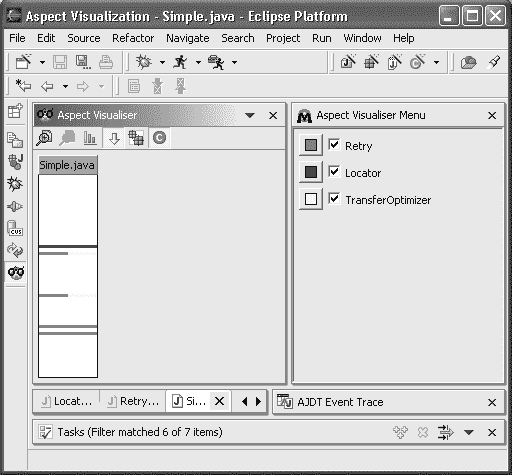

**292**

第 12 章 ■ 在示例应用程序的表示层和客户端层使用 AOP

**图 12-1.** *用于客户端/服务器通信的三个切面* 这三个切面具有以下作用：

• `aop.j2ee.client.java.aspect.Locator` 使用隐式协议来解析业务外观。`Simple.java` 条中最暗的线条对应于 `getServiceFacade` 方法的实现，该方法由客户端定义但未实现。

• `aop.j2ee.client.java.aspect.Retry` 实现重试策略，以最小化潜在通信错误的影响。我们使用了通用切面，它适用于所有方法（三条线）。

• `aop.j2ee.client.java.aspect.TransferOptimizer` 通过无缝引入传输对象来提升客户端性能。与该切面相关的两条线对应于 `createCustomer` 和 `createAccount` 的调用序列，我们使用传输对象对其进行了优化。

这并不是分布式关注点的完整设计。涵盖这个复杂关注点所有可能的子关注点超出了本书的范围，但这个设计为您提供了一些关于如何使用 AOP 构建设计良好的分布式应用程序的指示。请注意，同样的设计也已成功应用于银行的管理客户端。

第 12 章 ■ 在示例应用程序的表示层和客户端层使用 AOP

**293**

**在客户端层表示中使用 AOP**

一旦通信关注点得到管理，客户端便处理表示层，这通常是一项复杂的任务。对于基于 Swing 的客户端，其技术与非 J2EE 应用程序并无不同。对于瘦 Web 客户端，实现方式则有所不同，因为表示层位于服务器端，在基于 JSP/Servlet 的 Web 容器内。

本节介绍 AOP 在表示层中的用例。首先，我们展示 UI 的一般示例。接着，通过增强该层常用的设计模式，我们研究 Web 表示层。

**将 AOP 用于 UI 关注点**

由于其复杂性，UI 通常代表应用程序开发中的一个重要部分。尽管这些关注点并非 J2EE 特有，但切面可以帮助它们的开发。

在接下来的章节中，我们说明 AOP 在两个通用 UI 关注点上的使用：国际化和输入数据的条件验证。为此，我们依赖于银行应用程序的 Java Swing 管理客户端。

应用程序国际化

J2EE 应用程序开发中的一个持续关注点是应用程序国际化。*国际化* 包括在同一个应用程序中支持多种语言。

属性文件经常被用来支持这一关注点。然而，在 Java 中，为了实现国际化，需要执行许多操作。

例如，处理错误消息的一个常见解决方案是在属性文件中定义错误消息集，该文件可以被翻译成不同的语言。客户端配置指示程序使用哪个文件。对于银行管理客户端，此配置通过启动参数完成：

%JAVA_HOME%\bin\java –Daop.j2ee.config.applicationname=BankAdmin

-Daop.j2ee.config.applicationconfigdir=c:/aop/config

-Daop.j2ee.config.applicationpropertyfile=bankadmin.properties aop.j2ee.client.java.BankAdmin

必要时，客户端程序管理对文件中定义的消息的访问机制。通常，这些访问分散在代码各处，特别是在异常处理代码中，如清单 12-12 所示。

**清单 12-12.** *说明异常处理的示例应用程序片段* 01 // aop.j2ee.client.java.regular.DataModel 的摘录 02 [...]

03 protected void createActInf(int currentFunction, String returned) {

04 AccountDetails details = null;

05 //查看账户信息

06 if ((currentFunction == 4) && (returned.length() > 0)) {

**294**

第 12 章 ■ 在示例应用程序的表示层和客户端层使用 AOP

07 try {

08 details = bank.getAccountDetails(returned); 09 boolean readonly = true;

10 frame.setDescription(details.getDescription()); 11 ArrayList alist = new ArrayList();

12 alist = details.getCustomerIds();

13 frame.createActFields(

14 readonly,

15 details.getType(),

16 details.getBalance(),


17 details.getCreditLine(),

18 details.getBeginBalance(),

19 alist,

20 details.getBeginBalanceTimeStamp()); 21 } catch (AccountNotFoundException ex) {

22 frame.resetPanelTwo();

23 frame.messlab3.setText(

24 messages.getString("AccountException")  + " " + returned + " "

26 + messages.getString("NotFoundException")); 27 } catch (RemoteException ex) {

28 frame.messlab.setText(

29 messages.getString("Remote Exception")); 30 } catch (InvalidParameterException ex) {

31 frame.messlab.setText(

32 messages.getString("InvalidParameterException")); 33 }

34 } [...]

第 24、26、29 和 32 行展示了应用程序如何访问国际化消息，这些消息通过字符串键进行索引。由此可见，国际化是一个横切关注点，处理起来可能比较困难。此外，由于这些访问分散在客户端代码中，并与异常处理紧密交织，维护工作也变得更加困难。

在国际化上下文中，错误处理关注点的外部化是在 i18n 切面中完成的。然而，国际化关注点还必须处理诸如计量单位、货币以及图形组件中的标签等问题。

清单 12-13 中展示的 i18n 切面是实现模块化国际化的第一步。

**清单 12-13.** *一个简单的国际化切面* 01 package aop.j2ee.client.java.aspect;

03 import java.rmi.RemoteException;

04 import aop.j2ee.commons.exception.*;

05 import aop.j2ee.client.java.aspectized.BankAdmin;

第 12 章 ■ 在示例应用程序的表示层和客户端层中使用 AOP

**295**

07 public privileged aspect I18n {

09 // 通用异常消息的翻译

10 Object around() throws RemoteException, InvalidParameterException: 11 call(* aop.j2ee.business.session.bank.Bank+.*(..) throws *Exception) 12 && within(aop.j2ee.client.java.aspectized.*+) {

14 Object value = null;

15 try {

16 value = proceed();

17 } catch (RemoteException ex) {

18 throw new RemoteException(BankAdmin.messages.getString(

19 "Remote Exception"),ex);

20 } catch (InvalidParameterException ex) {

21 throw new InvalidParameterException(BankAdmin.messages.getString(

22 "InvalidParameterException"),ex); 23 }

24 return value;

25 }

27 // 处理连接点特定的异常

28 Object around(String accountId) throws AccountNotFoundException: 29 call(* aop.[...].Bank+.getAccountDetails(String) throws *Exception) 30 && args(accountId) && within(aop.j2ee.client.java.aspectized.*+) {

32 Object value = null;

33 try {

34 value = proceed(accountId);

35 } catch (AccountNotFoundException ex) {

36 throw new AccountNotFoundException(

37 BankAdmin.messages.getString("AccountException") 38 + " " + accountId + " "

39 + BankAdmin.messages.getString("NotFoundException"),ex); 40 }

41 return value;

42 }

44 [...] // 其他特定异常

45 }

对于抛出的每个异常，该切面都会构建一个包含国际化消息的新异常（第 18、21 和 36 行），以实现错误消息国际化管理的模块化。

图 12-2 通过展示银行管理客户端（参见 aop.j2ee.client.java.aspectized.DataModel）中被通知的调用，概述了该切面的应用位置。

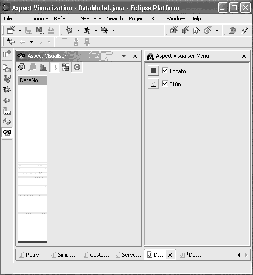

**296**

第 12 章 ■ 在示例应用程序的表示层和客户端层中使用 AOP

**图 12-2.** *将 i18n 切面应用于 Duke's Bank 的 Swing Java 客户端* 借助上述切面，国际化异常被发送到客户端。客户端无需自行处理这一关注点。例如，管理客户端的 createActInf 方法可以简化为清单 12-14 所示。

**清单 12-14.** *使用 i18n 切面对管理客户端进行切面化*

// 摘自 aop.j2ee.client.java.aspectized.DataModel

[...]

protected void createActInf(int currentFunction, String returned) {

AccountDetails details= null;


if ((currentFunction == 4) && (returned.length() > 0)) {

try {

details= bank.getAccountDetails(returned);

第 12 章 ■ 在示例应用程序的表示层和客户端层使用 AOP

**297**

boolean readonly= true;

frame.setDescription(details.getDescription());

ArrayList alist= new ArrayList();

alist= details.getCustomerIds();

frame.createActFields(

readonly,

details.getType(),

details.getBalance(),

details.getCreditLine(),

details.getBeginBalance(),

alist,

details.getBeginBalanceTimeStamp());

// 异常消息已由 i18n 切面国际化

} catch (AccountNotFoundException ex) {

frame.resetPanelTwo();

frame.messlab3.setText(ex.getMessage());

} catch (RemoteException ex) {

frame.messlab.setText(ex.getMessage());

} catch (InvalidParameterException ex) {

frame.messlab.setText(ex.getMessage());

}

}

}

客户端可以通过 `ex.getCause` 方法访问原始异常。在 Java 1.4 之后，异常的原因也会包含在堆栈跟踪中，并通过 `ex.printStackTrace` 方法显示在“caused by”行下方。这仅在切面在构造国际化异常时将原始异常作为参数传递时才有效（参见 i18n 切面的第 18、21 和 36 行）。

输入约束验证

在开发用户界面时，验证用户输入数据的约束是一个反复出现的问题。例如，创建新客户端时输入的所有数据都应经过验证并检查其准确性。程序应测试电子邮件、邮政编码等格式是否正确。程序还可以强制用户输入附加信息。

清晰地模块化这一关注点非常重要，主要有三个原因：

• 首先，这是一个横切所有与数据输入和验证相关功能的关注点。

• 其次，通常情况下，这是一个会随时间演变和完善的关注点，有时独立于其他关注点。

• 第三，出于应用程序的安全性考虑，输入的数据应在服务器端进行控制。出于客户端延迟的原因，最好也在客户端实施一些控制。面向切面的模块化使得维护客户端和服务器端之间的一致性更加容易。

**298**

第 12 章 ■ 在示例应用程序的表示层和客户端层使用 AOP

为了阐明第二点，我们可以将约束验证的面向切面开发与基于用例的开发方法进行比较。在基于用例的方法中，我们找到主要用例（对应于应用程序的正常行为，此处为用户输入数据）和次要用例（对应于应用程序的异常行为，此处为错误和输入错误处理）。

在次要用例中，基于用例的分析通常会对用例进行优先级排序。其中一些用例并不关键，不需要在第一次迭代中实现（例如，检查输入的名称是否以大写字母开头）。

类似地，在开发用户界面和数据验证时，我们从主要用例（验证）和关键的次要用例开始。只有在这些用例的开发完成后，我们才能实现非关键用例（验证）。如果验证关注点没有正确模块化，测试新用例将很困难，因为其代码会与现有用例的代码纠缠在一起。

因此，使用 AOP 有助于处理验证关注点日益增长的复杂性。特别是，使用精心选择的前置/后置条件切面（例如第 9 章和第 11 章中解释的那些）可以实现验证关注点的模块化实现。

**在 Web 设计模式中使用 AOP**

**表示层**

在 J2EE 环境中，Web 表示逻辑依赖于 Servlet 技术。Servlet 是 Java 组件，用于响应来自 Web 服务器的 HTTP 请求，并将这些请求传输到 J2EE Web 容器。一些知名的容器包括 Apache Tomcat（参考实现）和 Caucho Resin（http://www.caucho.com/resin-2.1/index.xtp）。为了帮助编写面向 GUI 的 Servlet，Sun Microsystems 定义了 JavaServer Pages（JSP）标准。

由于 Servlet 是底层组件，因此定义了一些 J2EE 设计模式来有效管理表示层。在这里，我们将评估与基于 J2EE 设计模式的解决方案相比，切面如何增强表示层的设计。

在本节中，我们将介绍表示层设计模式，并讨论如何通过 AOP 对其进行改进。我们不直接依赖示例应用程序，因为在此讨论表示层会过于复杂。此外，示例应用程序使用了 Struts 框架，该框架提供了一组 J2EE 设计模式的打包即用实现。

要完全理解本节内容，需要具备 Servlet/JSP 技术（http://java.sun.com/products/jsp/docs.html）和表示层 J2EE 设计模式（http://java.sun.com/blueprints/corej2eepatterns/Patterns/index.html）的知识。

**前端控制器**

*前端控制器*设计模式的作用是集中管理请求的基础逻辑，并将它们转发给适当的管理器。因此，客户端的请求会经过前端控制器，其中包含一个命令字典。

*命令对象*通常是应用程序控制器设计模式的实例，尽管仍然可以选择其他设计方案。更准确地说，控制器的行为通过查找给定请求 URL 的适当命令来处理请求，并将该请求委托给命令。此外，控制器可以将特定于服务器的数据封装在上下文对象中。*上下文对象*是常规的 Java 对象，用于使 GUI 逻辑尽可能独立于 HTTP 协议。

清单 12-15 展示了一个简单前端控制器的重要部分。

**清单 12-15.** *一个简单的前端控制器*

package aop.j2ee.client.web.controller;

01 import java.io.IOException;

02 import java.util.Hashtable;

03 import javax.servlet.RequestDispatcher;

04 import javax.servlet.http.HttpServlet;

05 import javax.servlet.http.HttpServletRequest;

06 import javax.servlet.http.HttpServletResponse;

07 import aop.j2ee.client.web.protocol.RequestContextFactory; 08 import aop.j2ee. client.web.protocol.RequestContext; 09

10 public class FrontController extends HttpServlet {

11 static final String ERROR_VIEW = "/error.jsp"; 12 [...] // 其他 URL

13 static Hashtable pathInfoCommandMap = new Hashtable(); 14

15 public void init(javax.servlet.ServletConfig config) throws ServletException {

16 super.init(config);

17 pathInfoCommandMap.put("/logon","aop.j2ee.[...].LoginController"); 18 pathInfoCommandMap.put("/subscribe","aop.j2ee. [...].SubscribeController"); 19 [...] // 其他应用程序控制器的路径

20 }

22 public void doGet [...] // 处理方法调用 23 public void doPost[...] // 处理方法调用 24

25 protected void process(HttpServletRequest request, HttpServletResponse resp) 26 throws ServletException, IOException {

27 String pathInfo = request.getPathInfo();

29 try {

30 // 通过委托给应用程序控制器来查找真实路径 31 pathInfo=invokeApplicationController(pathInfo,request,resp ); 32 } catch(Exception e) {

33 pathInfo = ERROR_VIEW;

34 }

35 // 将控制权转发给视图/命令

36 RequestDispatcher dispatcher = request.getRequestDispatcher(pathInfo); 37 dispatcher.forward(request,resp );

38 }

**300**


第 12 章 ■ 在示例应用程序的表示层和客户端层中使用 AOP

40 private String invokeApplicationController(

41 String aRequestPathInfo,

42 HttpServletRequest aRequest,

43 HttpServletResponse aResponse) throws Exception {

44 ApplicationController controller = null;

45 String className = (String)pathInfoCommandMap.get(aRequestPathInfo); 46 if(className != null) {

47 Class controllerClass = Class.forName(className); 48 controller = (ApplicationController)

49 controllerClass.newInstance();

50 if(controller != null)

51 aRequestPathInfo = (String)controller.process(aRequest,aResponse); 52 }

53 return aRequestPathInfo;

54 }

55 }

第 25 行的`process`方法是一个处理请求的通用方法。它会检查用户是否已登录。如果是，则将请求转发到所请求的 URL；否则，将请求转发到登录页面。

随着应用程序的演进，前端控制器代码会变得更加复杂，并处理更多特定情况。避免此问题的一种策略是创建一个继承层次结构来替代过多的条件逻辑。例如，对于一个包含三个不同功能区域的应用程序，我们可以将共性抽象到超类中。尽管这种设计看似简单，但由于表示层及其相关需求复杂且经常被重新定义，因此编程实现起来既复杂又繁琐。

使用切面可以通过将前端控制器的基本逻辑与特定的应用程序逻辑分离，从而提高应用程序的模块化程度。例如，在清单 12-16 中，`FrontController`切面处理了向应用程序控制器的请求委派和封装。

**清单 12-16.** *一个简单的前端控制器切面* 01 package aop.j2ee.client.web.aspect;

03 import java.util.Hashtable;

04 import javax.servlet.http.HttpServlet;

05 import javax.servlet.http.HttpServletRequest;

06 import javax.servlet.http.HttpServletResponse;

07 import aop.j2ee.client.web.protocol.RequestContextFactory; 08 import aop.j2ee.client.web.protocol.RequestContext;

09 import aop.j2ee.client.web.controlleur.*;

11 public aspect FrontController {

12 static Hashtable pathInfoCommandMap = new Hashtable(); 13

14 static {

第 12 章 ■ 在示例应用程序的表示层和客户端层中使用 AOP

**301**

15 pathInfoCommandMap.put("/logon","aop.j2ee.[...].LoginController"); 16 pathInfoCommandMap.put("/subscribe","aop.j2ee.[...].SubscribeController"); 17 }

19 pointcut trapApplicationController(String aRequestPathInfo, 20 HttpServletRequest aRequest, HttpServletResponse aResponse): 21 call(private String FrontController.invokeApplicationController(

22 String,HttpServletRequest,HttpServletResponse) throws Exception) 23 && args(aRequestPathInfo,aRequest,aResponse); 24

25 String around(String aRequestPathInfo,

26 HttpServletRequest aRequest,

27 HttpServletResponse aResponse)

28 throws Exception: trapApplicationController(aRequestPathInfo, 29 aRequest,aResponse) {

30 ApplicationController controller = null;

31 String className =

32 (String)pathInfoCommandMap.get(aRequestPathInfo); 33 if(className != null) {

34 Class controllerClass = Class.forName(className); 35 controller = (ApplicationController)controllerClass.newInstance(); 36 if(controller != null) {

37 RequestContextFactory factory = RequestContextFactory.getInstance(); 38 RequestContext context = factory.getRequestContext(aRequest); 39 aRequestPathInfo = (String)controller.process(context); 40 }

41 }

42 return aRequestPathInfo;

43 }

44 }

请注意，这里我们使用了隐式协议技术，通过第 11 行切点捕获的`invokeApplicationController`协议方法实现。

有了这个切面，前端控制器代码实现了隐式协议（第 23 行），如清单 12-17 所示。

**清单 12-17.** *前端控制器的切面化实现* 01 package aop.j2ee.client.web.controller;


03 import java.io.IOException;

04 import javax.servlet.RequestDispatcher;

05 import javax.servlet.ServletException;

06 import javax.servlet.http.HttpServlet;

07 import javax.servlet.http.HttpServletRequest;

08 import javax.servlet.http.HttpServletResponse;

10 public class FrontController extends HttpServlet {

**302**

第 12 章 ■ 在示例应用程序的表示层和客户端层使用 AOP

11 static final String ERROR_VIEW = "/error.jsp"; 12

13 public void doGet [...] // 处理调用

14 public void doPost [...] // 处理调用

16 protected void process(HttpServletRequest request, 17 HttpServletResponse response) 18 throws ServletException, IOException {

19 [...] // 无变化

20 }

22 // 由切面实现

23 private String invokeApplicationController(

24 String aRequestPathInfo,

25 HttpServletRequest aRequest,

26 HttpServletResponse aResponse)

27 throws Exception { return aRequestPathInfo; } // 默认实现 28 }

因此，前端控制器代码与应用程序无关。应用程序的特定路径在切面中定义。HTTP 请求被封装在 `aop.j2ee.client.web.protocol` 包中应用程序级别的请求（`RequestContextFactory` 和 `RequestContext`）中。

**应用程序控制器**

*应用程序控制器*设计模式集中了应用程序特定视图和命令的控制与调用。与前端控制器类似，典型的设计意味着基类实现了控制器的共性。此外，在分解通用功能时，使用切面可能比继承更高效。

清单 12-18 展示了 AOP 如何简化应用程序表示层的设计，以实现通用功能的分解。无论如何，它都允许集中进行对象初始化（参见通知代码第 15 行和第 23 行）。

**清单 12-18.** *一个应用程序控制器切面*  
01 package aop.j2ee.client.web.aspect;

03 import aop.j2ee.client.web.bean.*;

04 import aop.j2ee.client.web.controller.*;

05 import aop.j2ee.client.web.protocol.RequestContext;

06 import aop.j2ee.client.web.protocol.LoginRequestContext; 07 import aop.j2ee.client.web.protocol.SubscriptionContext; 08

09 public aspect ApplicationController {

11 // 通过 getRequestData 初始化应用程序控制器 12

**303**

第 12 章 ■ 在示例应用程序的表示层和客户端层使用 AOP

13 void around(Object aBean,RequestContext aContext): 14 call(* LoginController.getRequestData(..)) && args(aBean,aContext) {

15 LoginRequestContext context=(LoginRequestContext)aContext; 16 UserBean bean = (UserBean)aBean;

17 bean.setUser(context.getUserName());

18 bean.setPassword(context.getUserPassword());

19 }

21 void around(Object aBean,RequestContext aContext): 22 call(* SubscribeController.getRequestData(..)) && args(aBean,aContext) {

23 SubscriberBean bean = (SubscriberBean)aBean;

24 SubscriptionContext context = (SubscriptionContext)aContext; 25 bean.setFirst(context.getFirstName());

26 bean.setLast(context.getLastName());

27 bean.setEmail(context.getEmail());

28 }

29 [...] // 其他控制器

30 }

借助这个切面，例如，一个认证控制器的实现只需专注于请求处理的实现，如清单 12-19 所示，仍然通过使用隐式协议（第 18 行）。

**清单 12-19.** *一个切面化的登录控制器*  
01 package aop.j2ee.client.web.controller;

03 import aop.j2ee.client.web.controller.ApplicationController; 04 import aop.j2ee.client.web.command.Command;

05 import aop.j2ee.client.web.command.LoginCommand;

06 import aop.j2ee.client.web.protocol.RequestContext;

07 import aop.j2ee.client.web.protocol.LoginRequestContext; 08

09 // ApplicationController 是一个定义了 process() 的接口 10 public class LoginController implements ApplicationController {


11 static final String USERBEAN_ATTR = "userbean"; 12 static final String SUCCESS_VIEW = "/subscribe.html"; 13 static final String FAILURE_VIEW = "/login.jsp"; 14

15 public LoginController() {}

17 // 由切面实现（隐式协议）

18 public void getRequestData(Object aBean,

19 RequestContext aRequestContext) {}

21 public Object process(RequestContext aRequestContext) 22 throws Exception {

23 Command logon = new LoginCommand();

**304**

第 12 章 ■ 在示例应用程序的表示层和客户端层使用 AOP

24 LoginRequestContext context = (LoginRequestContext)aRequestContext; 25 // 初始化接收请求数据的 bean 26 getRequestData(logon.getReceiver(),context);

27 // 执行登录命令

28 String logicalRequest = ((Boolean)logon.executeCommand()).booleanValue()?

29 SUCCESS_VIEW:FAILURE_VIEW;

30 // 将 bean 放入上下文中

31 context.setSessionAttribute(USERBEAN_ATTR,logon.getReceiver()); 32 return logicalRequest;

33 }

34 }

**上下文对象**

*上下文对象*设计模式封装了与请求相关但独立于 HTTP 协议的上下文状态。随后，该上下文对象可用于表示层的不同角色中。

使用上下文对象可以使处理过程更简单、更通用，并且减少对特定 Web 容器的依赖。上下文对象类通常属于一个继承层次结构，其中父类处理 HTTP 协议的特定细节；它们包含对 `javax.servlet.http` 包的引用。

借助 AOP，整个上下文对象设计模式可以变得独立于 HTTP 协议。`HttpRequestContext` 的代码展示了如何引入 HTTP 协议的特定细节（参见清单 12-20）。

**清单 12-20.** *一个上下文对象切面*

package aop.j2ee.client.web.aspect;

import javax.servlet.http.HttpServletRequest;

import aop.j2ee.client.web.protocol.*;

public aspect HttpRequestContext {

public static final String USER_PARAM = "subscriber"; public static final String PASSWORD_PARAM = "password";

// 标签接口的实现

declare parents: LoginRequestContext implements HttpRequestContext; declare parents: SubscriptionContext implements HttpRequestContext;

[...] // 其他上下文类型...

public HttpServletRequest HttpRequestContext.request;

public HttpServletRequest LoginRequestContext.loginRequest; public HttpServletRequest SubscriptionContext.subscriptionRequest;

// 通用行为的实现

public void HttpRequestContext.initialize(HttpServletRequest aRequest) {

第 12 章 ■ 在示例应用程序的表示层和客户端层使用 AOP

**305**

request = aRequest;

}

public void HttpRequestContext.setHttpRequest(HttpServletRequest aRequest) {

request = aRequest;

}

public HttpServletRequest HttpRequestContext.getHttpRequest() {

return request;

}

public String HttpRequestContext.getAuthType() {

return getHttpRequest().getAuthType();

}

// 相同原理...

public String HttpRequestContext.getCharacterEncoding() {...}

public int HttpRequestContext.getContentLength() {...}

public String HttpRequestContext.getContentType() {...}

public String HttpRequestContext.getContextPath() {...}

public String HttpRequestContext.getPathInfo() {...}

public String HttpRequestContext.getPathTranslated() {...}

public String HttpRequestContext.getProtocol(){...}

public String HttpRequestContext.getQueryString(){...}

public String HttpRequestContext.getRemoteAddress(){...}

public String HttpRequestContext.getRemoteHost(){...}

public String HttpRequestContext.getRemoteUser(){...}

public String HttpRequestContext.getRequestedSessionID(){...}

public String HttpRequestContext.getRequestURI(){...}

public String HttpRequestContext.getScheme(){...}

public String HttpRequestContext.getServerName(){...}

public String HttpRequestContext.getServletPath(){...}

public Object HttpRequestContext

.getSessionAttribute(String aAttribute) {...}


public void HttpRequestContext.setSessionAttribute(String attr,Object val) {...}

public Object HttpRequestContext.getRequestAttribute(String aAttribute){...}

public void HttpRequestContext.setRequestAttribute(String attr,Object val) {...}

// 登录

public void LoginRequestContext.setHttpRequest(HttpServletRequest aRequest) {

loginRequest = aRequest;

}

public HttpServletRequest LoginRequestContext.getHttpRequest() {

return loginRequest;

}

**306**

第 12 章 ■ 在示例应用程序的表示层和客户端层中使用 AOP

public void LoginRequestContext

.initialize(HttpServletRequest aRequest) {

loginRequest = aRequest;

setUserName(aRequest.getParameter(USER_PARAM));

setUserPassword(aRequest.getParameter(PASSWORD_PARAM));

}

// 订阅

public void SubscriptionContext.setHttpRequest(

HttpServletRequest aRequest) {

subscriptionRequest = aRequest;

}

public HttpServletRequest SubscriptionContext.getHttpRequest() {

return subscriptionRequest;

}

public void SubscriptionContext

.initialize(HttpServletRequest aRequest) {

subscriptionRequest = aRequest;

setFirstName(aRequest.getParameter(FIRST_PARAM));

setLastName(aRequest.getParameter(LAST_PARAM));

setEmail(aRequest.getParameter(EMAIL_PARAM));

}

// 其他请求

[...]

}

**拦截过滤器**

*拦截过滤器*的作用是拦截传入的请求和传出的响应，以便应用额外的功能。Web 容器负责调用过滤器，这些过滤器可以在 `web.xml` 文件中以声明方式添加和移除，如清单 12-21 所示。

**清单 12-21.** *过滤器的声明式配置*

<filter>

<filter-name>silverMembership</filter-name>

<filter-class>

aop.j2ee.presentation.controller.MembershipFilter

</filter-class>

<init-param>

<param-name>subscriptionType</param-name>

<param-value>silver</param-value>

第 12 章 ■ 在示例应用程序的表示层和客户端层中使用 AOP

**307**

</init-param>

<init-param>

<param-name>denyPage</param-name>

<param-value>/secure/denied.jsp</param-value>

</init-param>

</filter>

过滤器将重复出现的逻辑封装在可重用的对象中，从而增强了代码的模块化。例如，它们可以根据用户配置文件添加/移除或激活/停用表示元素。

清单 12-22 展示了一个过滤器的一部分，如果用户未被授权访问当前应用程序空间，该过滤器会更改响应以拒绝页面访问。

**清单 12-22.** *一个授权过滤器示例* 01 package aop.j2ee.client.web.controller;

03 import java.io.IOException;

04 import javax.servlet.*;

05 import javax.servlet.http.*;

06 import aop.j2ee.presentation.bean.SubscriberBean;

08 public class MembershipFilter implements Filter {

09 [...]

10 private String subscriptionType;

11 private String denyPage;

13 public MembershipFilter() {}

15 public void init(FilterConfig config) throws ServletException {

16 subscriptionType = config.getInitParameter("subscriptionType"); 17 denyPage = config.getInitParameter("denyPage"); 18 }

20 public void doFilter(ServletRequest request,

21 ServletResponse response, 22 FilterChain chain)

23 throws IOException, ServletException {

24 [...] // 对请求进行处理

25 // 继续应用过滤器链

26 chain.doFilter(request,response);

27 [...] // 对响应进行处理

28 }

30 public void destroy() {}

31 }

**308**

第 12 章 ■ 在示例应用程序的表示层和客户端层中使用 AOP

在*过滤器对象*设计模式中，我们可以识别出 AOP 的典型结构：“环绕”通知代码。为了达到相同的效果，我们可以用切面替换 `MembershipFilter` 类，并用“环绕”通知代码替换过滤器方法 `doFilter`（第 20 行）。实际上，在过滤器链上调用 `doFilter` 方法（第 26 行）与在“环绕”通知代码中调用 `proceed` 具有类似的效果。

使用 AOP 并不会显著提高代码的模块化程度，因为最终实现与过滤器对象模式非常相似。然而，它可以显著提升性能，因为 Web 容器以透明且不可控的方式处理拦截链。该机制是动态的，可能会引入开销。由于 AspectJ 等工具支持编译时织入，拦截代码可以直接插入目标类代码中，从而消除了链初始化和迭代机制的实现。

清单 12-23 展示了一个面向切面的过滤器实现。

**清单 12-23.** *使用 AOP 实现授权过滤器*

01 package aop.j2ee.client.web.aspect;

03 import java.io.IOException;

04 import javax.servlet.*;

05 import javax.servlet.http.*;

06 import aop.j2ee.presentation.bean.SubscriberBean;

08 public class SilverMembershipFilterAspect {

09 declare precedence: GoldMembershipFilterAspect,

10 SilverMembershipFilterAspect, *; 11

12 private String FrontController.subscriptionType="silver"; 13 private String FrontController.denyPage="/secure/denied.jsp; 14

15 pointcut filter(ServletRequest request,ServletResponse response): 16 execution(protected void process(HttpServletRequest, HttpServletResponse)) 17 && args(request,response); 18

19 around(ServletRequest request,

20 ServletResponse response): filter(request,response) {

22 throws IOException, ServletException {

23 [...] // 对请求进行处理

24 // 继续应用过滤器

25 proceed(request,response);

26 [...] // 对响应进行处理

27 }

28 }

在面向切面的解决方案中，`proceed` 实现了对下一个过滤器的调用（第 25 行）。过滤器应用的顺序由优先级声明定义（第 9 行）。这里，我们通过切入点应用过滤器，该切入点对应于前端控制器请求处理的执行（第 15 行）。这确保了所有传入的请求和传出的响应都被过滤。由于所有过滤器的切入点相同，因此可以将其提取到超类中。

请注意，这种技术比原始技术更灵活。通过修改切入点，例如，我们可以将过滤器安装在应用程序控制器上，而不仅仅是前端控制器上。这种技术的唯一缺点是过滤器不是以声明方式（在 `web.xml` 文件中）定义的。当进行更改时，应用程序需要重新编译。

**视图助手**

*视图助手*是一个 Java 对象，它实现了 JSP 页面逻辑的子部分。出于维护和性能方面的原因，此设计模式将 Java 代码从 JSP 中外部化。实际上，当 JSP 的 Java 逻辑在视图助手中实现时，代码只被编译和加载一次，从而避免了 Web 容器处理过多 Java 代码。

在特定情况下，通过使用 AOP 可以改进视图助手的实现。例如，我们可以添加过滤器，根据某些基于会话的标准（如用户偏好）来修改助手的行为。这种 AOP 的使用可以被视为先前描述的拦截过滤器的泛化。请注意，系统性地使用 AOP 进行过滤可以实现更好的关注点分离。例如，过滤可以用于以模块化方式实现某些国际化功能。

**Web 表示层总结**

与业务层和客户端层相比，AOP 在表示层中的改进不那么系统化。这主要有两个原因：


• Web 层使用 Java 和 Servlet 模型来处理请求以及屏幕链接。这是一种基于交互的低级实现，没有明确或稳定的业务模型，无法以系统化的方式应用切面。同样值得注意的是，对于控制器设计模式的面向切面实现，业务特性是在切面内部实现的。

• 表示层已经使用非 Java 技术来分离关注点。例如，布局在 JSP 页面内的 HTML 中定义。除了视图助手之外，表示层无法通过基于 Java 的 AOP 技术得到改进。为了获得最大效率，应优先使用或结合其他技术，例如可扩展样式表语言转换（XSLT）。

**总结**

在本章中，我们研究了 AOP 在客户端和表示层中的使用。在可能的情况下，我们在示例中使用了示例应用程序。我们展示了 AOP 为模块化远程通信相关问题提供了许多改进。用于分发的三种主要 J2EE 设计模式存在许多缺点，这些缺点可以通过使用 AOP 来避免。

**310**

第 12 章 ■ 在示例应用程序的表示层和客户端层中使用 AOP

对于表示层，AOP 对于模块化典型关注点（例如国际化以及前置和后置条件检查）非常有用。现有的表示框架（如 Struts 和 Swing）已经提供了抽象并处理了与表示相关的关注点。

在这些上下文中，AOP 效率较低；然而，对表示层 J2EE 设计模式的研究表明，AOP 可以有效地用于构建或增强此类框架。

索引

■**A**

after throwing 通知代码, 45

抽象切面, AspectJ, 50

around 通知代码, 45

责任链模式, 165–167

before 通知代码, 44

命令模式, 161–164

通知代码块代码, 43

观察者模式, 157–161

连接点类型, 38

代理模式, 168–170

通知代码, AspectJ 5

acc (.acc) 扩展名

使用注解定义切面, 55

切面配置文件, JAC, 75

通知代码, JAC

访问修饰符, AspectJ

*参见* 包装器, JAC

访问修饰符的通配符, 31

通知代码, JBoss AOP

ACCESSORS

*参见* 拦截器, JBoss AOP

方法类型运算符, JAC, 70, 71

通知代码, Spring AOP

Account EJB

*参见* 拦截器, Spring AOP

业务对象模式的实现,

通知标签, jboss-aop.xml 文件, 102

233–239

adviceexecution 连接点类型, AspectJ, 38, 42

Account 接口

advised 接口, Spring AOP, 132–133

示例应用程序, 213

advises 节点

AccountBean 类, 234

与切入点关联的连接点数量, 28

AccountDetails 类, 278

advisors, Spring AOP

AccountPOJO 类, 244

将切入点链接到拦截器, 120

acs 属性, jac, 78

AddDateItf 接口, Order 类, 48

after 通知, AspectJ, 17

ADDERS

通知代码类型, 44

方法类型运算符, JAC, 71

proceed 方法, 29

addItem 方法

@After 注解, AspectJ 5, 56

Customer 类, AspectJ, 24

after 关键字, AspectJ, 44

Order 类, AspectJ, 25

after returning 通知, AspectJ, 45

TraceAspect 类, JAC, 62, 67

after returning 通知, Spring AOP, 128–129

管理和监督功能,

after throwing 通知, AspectJ, 45

191–204

AfterReturningAdvice 接口, Spring AOP,

引言, 171

Java 管理扩展, 191–194

代理层, JMX, 192, 193

代理层, 193

别名, Spring AOP

分布式服务层, 193

getAliases 方法, BeanFactory 类, 117

将 JMX 与 AOP 结合使用, 194–202

all 切入点类型, JBoss AOP, 97

锚定协议技术

通知绑定, JBoss AOP

切面注入事务管理

编织切入点, 108

代码, 268

通知代码, 17–19

AnnotatedMixIn 切面类, 107

AOP 总结, 21

annotation-introduction 标签, jboss-aop.xml,

比较 AOP 工具, 142–143

定义, 17

AnnotationIntroductionDef 注解, JBoss

切入点和连接点, 28

AOP

类型, 17

注解参数, 111

通知代码执行连接点类型


使用注解引入注解，

比较 AOP 工具，第 141 页

通知代码，AspectJ，第 43–47 页

注解

after 通知代码，第 44 页

AspectJ 5，第 54–57 页

after returning 通知代码，第 45 页

JBoss AOP，第 105–108 页，第 110 页

**311**

**312**

■索引

带注解的切面，第 106 页

示例，第 66 页

带注解的拦截器，第 107 页

属性，第 66 页，第 78 页

带注解的混合，第 107 页

运行 JAC 应用程序，第 67 页

带注解的切点定义，第 106 页

应用程序

Ant

管理复杂性的技术

编译 JBoss AOP 应用程序，第 93 页

应用程序，第 171 页

运行 JBoss AOP 应用程序，第 95 页

参数列表

AOP（面向切面编程）

可变长度参数列表，第 58 页

业务层的优势，第 227 页

around 通知代码，第 17 页

AOP 作为集成技术，第 261–269 页

通知代码类型，AspectJ，第 45 页

AOP 或设计模式，第 246 页

带参数的 around 通知代码，第 46 页

应用程序管理与监控，

返回类型，第 46 页

第 191–202 页

比较 AOP 工具，第 142 页

消除业务委托，第 280 页

背景/历史，第 23 页

proceed 方法，第 17 页

优势，第 5 页

使用 AOP 改进业务层，第 250–254 页

around 通知，Spring AOP

比较语言方法，第 137 页，第 146 页

*参见* 拦截器，Spring AOP

在 Web 表示层中使用设计模式，

@Around 注解，AspectJ 5，第 56 页

第 298–309 页

around 关键字，AspectJ，第 45 页

设计类与切面，第 5 页

around 包装器，JAC，第 63 页

分布式通信，第 271–292 页

ASM，第 14 页

通用 AOP，第 286 页

@Aspect 注解，AspectJ 5，第 55 页

访问设计模式的实现，

@Aspect 注解，JBoss AOP，第 106 页，第 109 页

第 174–179 页

切面类，JAC

使用 AOP 实现契约，

基数，第 86 页

OOP 与 AOP，第 3 页

切面类，JBoss AOP

AOP 的起源，第 2 页

通知代码块，第 111 页

使用 AOP 呈现客户端层，第 293–298 页

拦截器，第 102 页

示例应用程序设计，第 225 页

切面组件，JAC，第 62 页

测试应用程序，第 180–191 页

切面组合，第 19–20 页

将 JMX 与 AOP 结合使用，第 194–202 页

将类转换为单例的后果，第 157 页

AOP Alliance API，第 64 页

设计，第 19 页

JAC 包装器，第 63 页

织入，第 20 页

Spring AOP，第 113 页

aop 标签，jboss-aop.xml 文件

切面工厂类，JBoss AOP

定义 JBoss AOP 切点，第 95 页

实例化切面，第 109 页

JBoss AOP 切面，第 92 页

切面实例化

aop.j2ee.business 包

AspectJ 5，第 58 页

EJBComponents 项目，第 215 页

比较 AOP 工具，第 138 页，第 144–145 页

aop.j2ee.client.java 包

JAC，第 86 页

示例应用程序，第 218 页

JBoss AOP，第 109 页

API

切面排序

依赖倒置，第 11 页

AspectJ，第 51–52 页

应用程序控制器模式

比较 AOP 工具，第 138 页，第 145 页

J2EE 设计解决方案，第 223 页

JAC，第 86–87 页

在 Web 表示层中使用 AOP，第 302–304 页

Spring AOP，第 132 页

ApplicationClient 项目，Eclipse IDE，第 207 页

面向切面的应用程序，第 5 页

DataModel 类，第 218 页

切面重用

Simple 类，第 218 页

比较 AOP 工具，第 145–146 页

ApplicationContext 工厂，Spring AOP，第 120 页

aspect 标签，jboss-aop.xml

ApplicationController 切面，第 302 页

实例化切面，第 109 页

应用程序描述文件，JAC

切面织入，第 12–14 页

注释，第 78 页

AspectJ，第 29 页

编译 JAC 应用程序，第 66 页

比较 AOP 工具，第 137–138 页

配置 JAC 应用程序，第 78 页

编译时织入，第 13 页

创建 JAC 切面，第 66 页

■索引

**313**

定义，第 12 页

观察者模式，第 157–160 页

JAC，第 61 页

切点，第 27 页，第 30–43 页

AspectComponent 类，JAC

切点参数化，第 41 页

简要总结，第 88 页

切点通配符，第 30–33 页

AspectComponent 类，JAC API，第 62 页

特权切面，第 52 页

切面配置文件，JAC

代理模式，第 168–170 页

编译 JAC 应用程序，第 66 页

单例模式，第 154–155 页

配置切面，JAC，第 75–78 页

跟踪切面，第 26 页

创建 JAC 切面，第 64–65 页

织入，第 29 页

示例，第 65 页

AspectJ 5，第 53–58 页

在切面配置文件中分组参数，第 77–78 页

after 通知代码，第 56 页

语法，第 65 页，第 76 页

注解，第 54–57 页

使用，第 76 页

around 通知代码，第 56 页

AspectJ，第 23–53 页

切面实例化，第 58 页

抽象切面，第 49 页

自动装箱，第 58 页

通知代码，第 28 页，第 43–47 页

before 通知代码，第 55 页

after 通知代码，第 44 页

declare 语句，第 57 页

after returning 通知代码，第 45 页

TraceAspect 类中的 aspectOf 方法，第 51 页

after throwing 通知代码，第 45 页

切面

around 通知代码，第 45 页

切面继承，第 49–50 页

before 通知代码，第 44 页

切面概念背景，第 1 页

切面继承，第 49 页

业务前置条件切面，第 256–258 页

切面实例化，第 50 页

业务层切面，第 258–261 页

切面排序，第 51–52 页


业务层组件，270

背景/历史，1，23

检查事务参数，255

责任链模式，165–167

比较 AOP 工具，139

命令模式，161–164

将类转换为单例的后果，157

创建第一个应用程序，24–30

通知代码，28

AOP 应用程序的组成部分，5

编译，29

使用可管理资源创建，197–202

切入点描述符，27

使用可管理资源扩展，202

跟踪切面，26

数据传输对象，287

声明警告和错误，52

定义，9

过滤运算符，连接点，38–40

依赖，20

引入机制，47–49

依赖反转，11

JAC 比较，61

设计 AOP 类和切面，5

连接点内省，33–35

框架，12

连接点，定义，36–40

前端控制器切面，300

关键字

HttpRequestContext 切面，304

切面，27

继承，27

调用，36

横切关注点的集成，

声明错误，52

声明，54

管理层通信，284

声明父类型，48

重试切面，285

执行，36

传输优化器切面，291

扩展，49

将 POJO 转换为实体 EJB，240–242

percflowbelow，50

透明地将持久性引入

pertarget，50

账户 POJO，242

切面，AspectJ

特权，52

抽象切面，49

proceed，28，45

切面继承，50

thisJoinPoint，34

切面实例化，51

throws，46

切面排序，51–52

withincode，39

责任链设计模式，

165–167

加载时织入，53

命令设计模式，161–164

**314**

■索引

声明警告和错误，52

Java 中的契约，174

加载时织入，53

断言，172

观察者设计模式，157–161

属性标签，jboss-aop.xml

特权切面，52

使用参数配置切面类，

代理模式，168–170

单例模式，154–157

认证切面，JAC，81，83

切面，JAC

AuthenticationAC 切面，JAC，83

切面属性，78

授权过滤器

认证切面，83

在 Web 表示层中使用 AOP，308

简要总结，88

自动装箱，AspectJ 5，58

广播切面，84

autodetect 值，autowire 属性

缓存切面，84

bean 数据元素，Spring AOP，119

编译 JAC 应用程序，66

自动集成解决方案

配置切面，75–78

AOP 对业务层的优势，227

简要总结，89

自动代理特性，Spring AOP，133–135

确认切面，83

autowire 属性

一致性切面，84

bean 数据元素，Spring AOP，119

创建 JAC 切面，61–66

创建应用程序描述符文件，66

■**B**

创建切面配置文件，64–65

Bank 接口

创建切入点，62

示例应用程序，210

创建包装器，63–64

BankAdmin 类

定义其行为，63

ApplicationClient 项目，218

部署切面，84

BCEL（字节码工程库），14，70

分布式事务切面，83

bean 数据元素，Spring AOP，118

执行顺序，86

bean 依赖，Spring AOP，113

GUI 切面，82

BeanFactory 类，Spring AOP

Hibernate 切面，83

方法，116

HTML/Servlet GUI 切面，81

Bean 工厂，Spring AOP

完整性切面，84

XmlBeanFactory，114

JAC 切面库，81–85

Bean，Spring AOP

负载均衡切面，84

*另请参阅* MBeans

成熟切面，81

访问 Bean，116–117

持久性切面，83

自动装配协作者，119

创建 JAC 切面，64

Bean 定义，114–116

重用，64，75

基于构造函数的替代定义，

简要总结，89

会话管理切面，83

containsBean 方法，BeanFactory 类，

Swing GUI 切面，81

创建和配置，119

同步切面，85

getBean 方法，BeanFactory 类，116

事务切面，83

Beck, Ken，149

事务划分切面，64

前置通知，17

用户界面切面，81

AspectJ，44

用户档案切面，83

Spring AOP，126–127

切面，JBoss AOP

@Before 注解，AspectJ 5，55

用于编写切面的注解，106–107

前置代码

定义切面的文件，91

比较 AOP 工具，137

实例化切面，109

before 关键字，AspectJ，44

即用型切面，112

BeforeAdvice 接口，Spring AOP，126

单例模式，151–154

beginTx 方法，267

切面，Spring AOP

@Bind 注解，JBoss AOP


以编程方式配置的切面，

132–133

带注解的拦截器，107

简单追踪切面，120

带注解的切点定义，106

`assert` 关键字

`bind` 标签，`jboss-aop.xml` 文件

切点定义中的注解，105

■索引

**315**

将拦截器附加到切点，99

`CalendarItf` 接口

切点表达式的定义，98

JBoss AOP 的混合机制，104

JBoss AOP 切点，92, 95

`call` 连接点，AspectJ，36, 42

黑盒测试，180

`CallerInvocation` 类

BMP（Bean 管理的持久化）

连接点内省，JBoss AOP，101

业务对象模式的实现，

`Catalog` 类，AspectJ，25

`cflow` 运算符

布尔运算，AspectJ，38

比较 AOP 工具，141

广播切面，JAC，84

`cflow` 运算符，AspectJ

控制流过滤，连接点，40, 43

`BroadcastingAC` 切面，JAC，84

`cflowbelow` 运算符，AspectJ

编译 JBoss AOP 应用程序，93–94

控制流过滤，连接点，40, 43

Burke, Bill，91

`cflows`，Spring AOP，125

业务关注点，10

责任链设计模式

业务委托模式

描述，165

面向切面实现，280–283

评估 AOP 实现，167

依赖注入，117

AspectJ 实现，165–167

银行应用程序的实现，273

`checkAccountArgs` 方法

J2EE 设计解决方案，222

`TxControllerBean` 类，256

业务对象模式

`checkAccountArgsAndResolve` 方法

基于 AOP 的实现，240–242

`TxControllerBean` 类，231, 248

业务持久化的模块化，

`checkArgsAndResolve` 方法

242–246

会话门面模式的实现，

常规实现，233–240

业务持久化

`CheckBusinessConditions` 切面，257

模块化，242

`class` 表达式

业务前置条件切面

切点表达式，JAC，68

前置条件分解，255

类继承

业务层

与切面继承的比较，49

AOP 对业务层的优势，227

类不变式断言

业务层切面，258–261

契约继承，174

业务层组件及其切面，

定义，173

使用 AOP 的改进，250–254

实现不变式，179

`class` 标签，`jboss-aop.xml` 文件

改进业务层设计模式

JBoss AOP 的混合机制，103

业务对象模式，233–246

类

会话门面模式，228–233

与切面的比较，9

J2EE 业务层设计模式，219–221

AOP 应用程序的组成部分，5

前置条件分解，254

横切功能，4

解析对象引用，247–252

设计 AOP 类和切面，5

示例应用程序，206, 209–215

JAC 包含选定实例，

组织业务层代码，214

62

影响 OOP 选择的因素，3

`BusinessComponents` 项目，Eclipse IDE，207

单实例类，150

`BusinessDelegates` 项目，Eclipse IDE，207

单例模式，150

`BusinessUtils` 项目，Eclipse IDE，207

子类的通配符，32

`byname` 值，`autowire` 属性

`ClassFilter` 接口，Spring AOP，123

bean 数据元素，Spring AOP，119

`ClassPathXmlApplicationContext` 工厂，

字节码工程库 (BCEL)，14, 70

Spring AOP，114

`byType` 值，`autowire` 属性

客户端层

bean 数据元素，Spring AOP，119

J2EE 客户端层设计模式，221–223

■

示例应用程序，206, 216–219

**C**

Swing 客户端，216

缓存切面，JAC，84

使用 AOP 进行表示，293–298

`CacheAC` 切面，JAC，84

`ClientUtils` 项目，Eclipse IDE，207

`Calendar` 类

CMP（容器管理的持久化）

JBoss AOP 的混合机制，104

**316**

■索引

业务对象模式的实现，

连接点内省，JAC，73

构造函数

代码分散，8

bean 类定义，Spring AOP，116

OOP 的局限性，5

创建包装器，JAC，73

协作者，Spring AOP

单例模式评估，156–157

自动装配协作者，119

引入机制，AspectJ，47

命令设计模式，161–165

连接点类型，AspectJ，37

描述，161

容器管理的解决方案，224

评估 AOP 实现，164

AOP 作为集成技术，261

AspectJ 实现，161–164

`containsBean` 方法，`BeanFactory` 类

与命令模式一起使用的接口，162

Spring AOP，116

命令对象，298


上下文对象模式

注释

在 Web 表示层使用 AOP，304–306

应用描述文件，JAC，78

上下文对象，299

Commons 项目，Eclipse IDE，207

契约

服务定位器模式，221

*另见* 契约式设计

通信

AOP 实现，174–179

分布式通信，271，291

冲突处理，173

比较器

缔约方，172

覆盖率分析，181

控制流过滤

组件容器

连接点，AspectJ，40

AOP 或组件容器，227

CounterMonitor 监视器类型

组合透明性

MBeanServer 组件，193

责任链模式，167

覆盖率分析，181–185

AOP 中的设计模式，150

引言，171

观察者模式，161

记录器，181

computeAmount 方法，Order 类，AspectJ

create 方法

解析对象引用，247

关注点，10

横切关注点

AOP 作为集成技术，261

使用 JTA 手动控制事务，263

组件容器，227

解析对象引用，248

使用 JTA 手动控制事务，264

服务定位器模式，277

非功能性关注点，10

横切功能

配置切面，Spring AOP

AOP 总结，20

Advised 接口，132–133

切面与类的比较，9

编程式配置的切面，132

集成，10

配置切面，JAC，75–78

数据持久化功能，10

配置 JAC 应用，78

OOP 的局限性，4

确认切面，JAC，81，83

横切结构

ConfirmationAC 切面，JAC，83

切面的定义，8

一致性切面，JAC，84

Cunningham, Ward，149

ConsistencyAC 切面，JAC，84

Customer 类，AspectJ，24

construct 方法，JAC

CustomerAndAccountInfos 类

创建 JAC 包装器，64

数据传输对象，288

创建包装器，73

construction 标签，jboss-aop.xml 文件

■**D**

混合机制，JBoss AOP，103

D 语言，23

构造函数执行连接点类型

数据元素，XML

比较 AOP 工具，140

Spring AOP，117

构造函数值，autowire 属性

数据层

bean 数据元素，Spring AOP，119

示例应用，206，208–209

构造函数执行切入点，JBoss AOP，97

数据传输对象模式

ConstructorInvocation 类

面向切面的实现，287

连接点内省，JBoss AOP，102

传输对象切面（客户端侧），290

ConstructorInvocation 参数

调试应用

■索引

**317**

实现契约的好处，172

前端控制器模式，223

声明式管理解决方案，224

拦截过滤器模式，223

declare precedence 关键字，AspectJ，51–52

服务定位器模式，221

declare soft 关键字，AspectJ，49

观察者模式，157–161

declare statements，AspectJ 5

代理模式，168–170

使用注解定义切面，57

服务定位器模式，277

declare warning 关键字，AspectJ，52

会话外观模式，228–233

DefaultAdvisorAutoProxyCreator，Spring AOP

单例模式，151–157

在 Web 表示层使用 AOP，298–309

DelegatingIntroductionInterceptor，Spring AOP

视图助手模式，309

130–131

DisTransAC 切面，JAC，83

deleteRow 方法，AccountBean 类，237

分布式切面

依赖注入，Spring AOP，113

分布式应用，83

基于构造函数的依赖注入

切入点，JAC，84

分布式通信

描述，135

使用 AOP 实现，271–292

基于 setter 的依赖注入，117

分布式服务层，JMX，192，193

依赖反转，12

分布式事务，262–264

部署切面，JAC，84

分布式事务切面，JAC，83

部署描述符文件

文档

示例应用，215

实现契约的好处，172

DeploymentAC 切面，JAC，84

Duke's Bank 应用

DeploymentAC 切面，JAC，84

示例应用架构，205–219

deploySunONE.bat 文件

示例应用设计，219–225

部署示例应用，208

设计

动态 AOP，JBoss AOP，108

切面组合，20

动态阴影选择，AOP，123

示例应用，225

dynaop，AOP Alliance 框架，64

契约式设计，171–180

Java 中的契约，174

■**E**

基础，172–174

Eclipse IDE

使用 AOP 实现契约，174–179

编译 JBoss AOP 应用，93

实现不变量，179


运行面向切面程序，24

实现后置条件，177–179

ejbActivate 方法

实现前置条件，174–177

AccountBean 类，236

引言，171

EntityBeanProtocol 接口，241

设计模式，149

EJBComponents 项目，Eclipse IDE，207，214

应用控制器模式，302–304

ejbCreate 方法

业务委托模式，272–277

AccountBean 类，235

业务层访问，272

AccountPOJO 类，243

业务对象模式，233–246

SessionBeanProtocol，252

责任链模式，165–168

TxControllerBean 类，231，248

命令模式，161–164

ejbFindByCustomerId 方法

上下文对象模式，304–306

AccountBean 类，236

横切关注点，150

AccountPOJO 类，243

数据传输对象模式，278–280

ejbFindByPrimaryKey 方法

评估 AOP 实现的收益，

AccountBean 类，235

EntityBeanProtocol 接口，241

过滤器对象模式，308

EJBGetter 类，TxControllerBean 类，248

前端控制器模式，298–302

ejbLoad 方法

使用 AOP 实现，150

AccountBean 类，236

改进业务层模式，228–246

EntityBeanProtocol 接口，241

拦截过滤器，306–308

ejbPassivate 方法

J2EE 客户端层模式，223

AccountBean 类，237

J2EE 设计方案，219–225

EntityBeanProtocol 接口，241

业务对象模式，220

ejbRemove 方法

上下文对象模式，223

**318**

■索引

AccountBean 类，236

OOP（面向对象编程），3

EntityBeanProtocol 接口，241

扩展

EJBResolver 切面

acc (.acc) 扩展名，75

使用 AOP 改进业务层，251

jac (.jac) 扩展名，78

描述，258

EJB

■**F**

Account EJB，233–239

工厂类，JBoss AOP

AOP 对业务层的优势，227

实例化切面，109

实体 EJB，213–214

工厂设计模式

会话外观模式的实现，

切面与，170

字段切入点，JBoss AOP，97

POJO 实现，215

字段读/写连接点类型

示例应用业务层概览，

比较 AOP 工具，141

FieldInvocation 类

ejbStore 方法

连接点内省，JBoss AOP，102

AccountBean 类，236

FileSaver 类

EntityBeanProtocol 接口，241

使用 AspectJ 实现命令模式，163

空方法，246

endTx 方法，268

过滤器对象模式

在 Web 表示层使用 AOP，308

实体 EJB

J2EE 设计模式，233

过滤

EntityBean 接口

过滤器的声明式配置，306

实现业务对象模式，239，

连接点，AspectJ，39

过滤运算符

EntityBeanProtocol 接口，240

连接点，AspectJ，38–40

错误处理

findByCustomerId 方法

实现契约的收益，172

解析对象引用，247

EventHandle 类

findByPrimaryKey 方法

ApplicationClient 项目，218

解析对象引用，247

异常处理器

创建切入点，JAC，68

Fleury, Marc，91

框架方法

比较 AOP 工具，137，146

异常处理器

框架

应用国际化，293

Spring 框架，113–120

链式调用，81

框架

引入特性，JAC，80–81

前端控制器模式

异常连接点类型

在 Web 表示层使用 AOP，298–302

比较 AOP 工具，141

FrontController 类，299

异常

切面化实现，301

通知代码，AspectJ，46

功能覆盖率分析，181

引入机制，AspectJ，48

功能需求

连接点类型，15

业务关注点，10

executedTx 方法

功能测试，180

解析对象引用，250

TxControllerBean 类，230

■**G**

执行连接点

四人帮，149

连接点类型，AspectJ，36，42

GaugeMonitor 监控器类型

execution 关键字，JBoss AOP

MBeanServer 组件，193

JBoss 切入点，92

get 连接点类型，AspectJ，36，42

方法和构造函数执行

getAliases 方法，BeanFactory 类

切入点，97

Spring AOP，117

显式排序

getArgs 方法，JoinPoint 接口

切面排序，AspectJ，51

org.aspectj.lang，34

expr 参数

getDate 方法，Calendar 类

AnnotationIntroductionDef 注解，

混合机制，JBoss AOP，104

JBoss APO，111

getDetails 方法，AccountBean 类，234

可扩展性

■索引

**319**

getDetails 方法，AccountPOJO 类，245


hashCode 方法

getEntityId 方法，AccountPOJO 类，244

回归分析器，188

getInstance 方法

Hibernate

单例模式，151

实体 EJB，233

getInterceptors 方法，InvocationBase 类

横切关注点的集成，

连接点自省，JBoss AOP，101

getInterfaces 方法

hibernate 切面，JAC，83

InterceptionIntroductionAdvisor 接口，

HibernateAC 切面，JAC，83

Spring AOP，130

Home 接口

getKind 方法，JoinPoint 接口

业务对象模式，240

org.aspectj.lang，34

解析对象引用，247–248

getName 方法，Interceptor 接口

会话外观模式，232

实现前置条件，176

主机表达式

JBoss AOP 拦截器，92，100

分布式应用，84

getNextTxId 方法

HTML/Servlet GUI 切面，JAC，81–82

解析对象引用，250

getNextTxId 方法，DBUtil 类，252

■**I**

getPrice 方法，Catalog 类，AspectJ，25

I18n 切面，294，296

getServiceFacade 方法

idref 数据元素，Spring AOP，118

银行应用的业务委托实现

if 关键字

，273

连接点，AspectJ，43

getSignature 方法，JoinPoint 接口

隐式协议技术

org.aspectj.lang，34

锚定协议技术，267

getSourceLocation 方法，JoinPoint 接口

简要描述，250

org.aspectj.lang，34

使用 AOP 改进业务层，253

getTarget 方法，JoinPoint 接口

importXml 方法

调用和执行连接点类型，AspectJ，

覆盖率分析，183

不兼容性

org.aspectj.lang，34

切面，19

getTargetObject 方法，InvocationBase 类

increment 方法

连接点自省，JBoss AOP，101

覆盖率分析，185

GETTERS

实现后置条件，178

方法类型运算符，JAC，70，71

回归测试示例，191

getThis 方法，JoinPoint 接口

信息参数，Jac 类，88

org.aspectj.lang，34

继承

全局共享变量

切面继承，AspectJ，49–50

将类转换为单例，157

切面，27

GNU regexp 库，69

契约继承，173

*另请参阅* 正则表达式

引入机制，AspectJ，48

goto 指令

OOP（面向对象编程），3

消亡，2

继承的构造函数执行连接点类型

粒度

比较 AOP 工具，141

使用切面创建可管理资源，202

初始化连接点类型，AspectJ，37，42

Injector 类

分组参数

将 JMX 与 AOP 结合使用，196

切面配置文件，JAC，77–78

输入约束验证

GUI 切面，JAC，81–82

使用 AOP 处理 UI 关注点，293–297

GUI 参数，Jac 类，88

insertRow 方法，AccountBean 类，237

GuiAC 切面，JAC，82

instanceof 关键字

■**H**

切入点表达式，JBoss AOP，96

实例化

handler 连接点类型

*另请参阅* 切面实例化

连接点类型，AspectJ，42

检测层，JMX，192，193

Hannemann, Jan，150

集成，Spring AOP，119

has 关键字，JBoss AOP，98

完整性切面，JAC，81，84

hasfield 关键字，JBoss AOP，98

**320**

■索引

IntegrityAC 切面，JAC，84

IntroductionInterceptor 接口，Spring AOP，

被拦截对象的执行

比较 AOP 工具，137

自省

拦截过滤器

连接点自省，AspectJ，33–35

在 Web 表示层中使用 AOP，306–308

thisJoinPoint 关键字，34

InterceptionIntroductionAdvisor 接口，

连接点自省，JAC，73

Spring AOP，129

不变量，179

Interceptor 接口，JBoss AOP，100

控制反转（IoC）

interceptor 标签，jboss-aop.xml 文件

*另请参阅* 依赖注入，Spring AOP

将拦截器附加到切入点，99

不可见参数

JBoss AOP 切入点，92，95

AnnotationIntroductionDef 注解，

@InterceptorDef 注解，JBoss AOP，107

JBoss APO，111

interceptor-ref 标签，jboss-aop.xml 文件

Invocation 接口

定义拦截器栈，99

连接点自省，JAC，74

拦截器，JBoss AOP，100–103

连接点自省，JBoss AOP，101

通知代码块，111

InvocationBase 类

将拦截器与切入点关联，98–99

invoke 方法，Interceptor 接口连接点

覆盖率分析，181

自省，JBoss AOP，101

使用切面创建可管理资源，198

覆盖率分析，183


JBoss AOP 拦截器，92–93，100，102

声明拦截器，99

Spring AOP 拦截器，121

回归拦截器的部署，189

invoke 方法，JAC

分组拦截器，99

创建包装器，64，72

实现，100

invokeNext 方法，Interceptor 接口

实现后置条件，179

JBoss AOP 拦截器，93，100

实现前置条件，175–176

invokeNext 方法，InvocationBase 类

实例化切面，109

连接点自省，JBoss AOP，101

拦截器栈，99

回归分析器，188

引言，92–93

invokeRoleMethod 方法，JAC，79

连接点自省，101

Ioc（控制反转）

拦截器，Spring AOP，126

*参见* 依赖注入，Spring AOP

与切入点关联，125

isFrozen 方法

比较 AOP 工具，142

Advised 接口，Spring AOP，133

跟踪切面，120

isPerInstance 方法

interfaces 标签，jboss-aop.xml 文件

Advisor 接口，Spring AOP，125

混合机制，JBoss AOP，103，105

isRuntime 方法

内部不变式断言

MethodMatcher 接口，Spring AOP，123

契约继承，174

isSingleton 方法，BeanFactory 类

定义，173

Spring AOP，117

解释器设计模式

切面与，170

■**J**

类型间声明

J2EE 设计解决方案

*参见* 引入机制，AspectJ

AOP 在业务层的优势，227

引入通知，Spring AOP，129

自动集成解决方案，223–224

引入特性，JAC，78–81

业务层设计模式，219–221

异常处理器，80–81

改进，228–246

角色方法，79–80

客户端层设计模式，221–223

引入机制，19

表示层设计模式，223

AOP 总结，21

J2EE 环境

比较 AOP 工具，138，143–144

Spring AOP，113

引入机制，AspectJ，47–49

j2eeclient.properties 文件

introduction 标签，jboss-aop.xml 文件

部署示例应用，208

使用切面创建可管理资源，198

jac (.jac) 扩展名

混合机制，JBoss AOP，103

应用描述符文件，78

JAC（Java 切面组件），61–89

切面

■索引

**321**

切面组件，62

DisTransAC 切面，83

切面配置，75–78

GuiAC 切面，82

切面创建，61–66

HibernateAC 切面，83

切面实例化，86

IntegrityAC 切面，84

切面排序，86–87

LoadBalancingAC 切面，84

配置，75–77

PersistenceAC 切面，83

创建切面，62

SessionAC 切面，83

创建切面配置文件，65

SynchronizationAC 切面，85

创建切面描述符文件，66

TransactionAC 切面，83

分布切面，83

UserAC 切面，83

JAC 切面库，81–85

Jac 类，88

持久化切面，83

JAC 命名仓库

切面织入时机，61

对象命名，87

事务切面，83

JAC，AOP 联盟框架，64

用户界面切面，81–83

jac.acs 属性，78

与 AspectJ 比较，61

jac.comp.wrappingOrder 属性，78

背景/历史，23

jac.topology 属性，78

编译 JAC 应用，66–67

Java 切面组件

配置 JAC 应用，78

*参见* JAC

创建 JAC 应用，61–67

Java 类定义，Spring AOP，114

异常处理器，80

Java 契约，174

GNU regexp，与 JAC 一起使用，69

java 文件（.java 文件）

GUI 切面，82

编译 JAC 应用，66

使用 AOP 实现契约，174

Java 管理扩展

引入特性，78–81

*参见* JMX

JAC 运算符，69

Javassist（Java 编程助手），14

连接点自省，73

JBoss AOP，91–112

关键字，88

通知代码块，111

许可，61

注解，105–108，110–111

方法类型运算符，70

使用面向切面编程的应用，91–94

对象命名，87

切面

JAC 应用的输出，67

切面实例化，109

切入点，62，68–72

JBoss AOP 介绍，91

将包装器与切入点关联，71

编译 JBoss AOP 应用，93–94

运算符，69

使用参数配置切面类，109–110

切入点表达式，68

动态 AOP，108

正则表达式，69

在 UMLAF 中编程，85–86

使用 AOP 实现契约，174

研究团队，61

实现单例模式，151–154

角色方法，79

拦截器，92，100–103

运行选项，88

许可，91

运行 JAC 应用，67

混合机制，103–105，110–111


运行时类型识别（RTTI），87

切入点，92，95–99

小结，88

运行 JBoss AOP 应用程序，95

包装器，71，72–75

小结，111

构造函数，73

网站，91

方法，72

jboss-aop.xml 文件

包装器链，74

切面类，JBoss AOP 拦截器，102

JAC 切面库，81–85

编译 JBoss AOP 应用程序，93

AuthenticationAC 切面，83

使用参数配置切面类，

BroadcastingAC 切面，84

CacheAC 切面，84

定义 JBoss AOP 切入点，95

ConfirmationAC 切面，83

定义 JBoss AOP 切面的文件，91

ConsistencyAC 切面，84

通用结构，95

DeploymentAC 切面，84

将注解引入应用程序，

**322**

■索引

混合机制，JBoss AOP，103

all 切入点类型，98

JDBC 抽象层，Spring AOP，119

连接点自省，101–102

JMX（Java 管理扩展），192–202

method-call 切入点，98

代理层 192，193

切入点表达式中的通配符，97

架构层，192

JOTM（Java 开放事务监视器），83

分布式服务层，192，193

JoyAop，AOP 联盟框架，64

仪器层，192，193

JTA（Java 事务 API）

将 JMX 与 AOP 结合使用，194–202

使用 JTA 手动控制事务，

使用切面创建可管理资源，

262–264

197–202

使用切面扩展可管理资源，

■**K**

202

Kiczales, Gregor，1–2，6，150

Johnson, Rod，113

AOP 描述，9

JoinPoint 接口

AspectJ，23

连接点自省，JAC，74

JoinPoint 接口，org.aspectj.lang

■**L**

方法，34

库

连接点自省

JAC 切面库，81–85

AspectJ，33–35

列表数据元素，Spring AOP，118

比较 AOP 工具，143

负载均衡切面，JAC，84

JAC，73

加载时织入，AspectJ，53

JBoss AOP，101–102

loadAccount 方法，AccountBean 类，238

连接点阴影，15

LoadBalancingAC 切面，JAC，84

连接点，14–15

loadCustomerIds 方法，AccountBean 类，

AOP 小结，21

比较 AOP 工具，140

局部性

定义，14

责任链模式，165–167

粒度，15

命令模式，161–164

类型，15

AOP 中的设计模式，150

连接点，AspectJ

观察者模式，158–161

call 连接点，27

会话外观模式，233

定义连接点，36–40

Locator 切面

过滤运算符，38–40

业务代表模式，280

控制流过滤，40

客户端/服务器通信，292

连接点自省，33–35

Lockable 接口，Spring AOP，130

程序清单，35

逻辑运算

thisJoinPoint 关键字，34

连接点，AspectJ，38

连接点类型，36–38

LoginController 类

adviceexecution 类型，38

切面化的登录控制器，303

异常，37

Lopez, Christina，23

字段，36

handler 类型，37

■**M**

初始化类型，37

Maes, Patricia，23

预初始化类型，37

main 参数，Jac 类，88

静态代码块，37

makeConnection 方法，TxControllerBean

staticinitialization 类型，38

类，231

连接点，JAC

映射数据元素，Spring AOP，118

创建 JAC 包装器，64

标记接口

异常处理器，68

业务对象模式，240

切面执行顺序，86

Martelli, Laurent，61

连接点自省，73

matches 方法

切入点表达式，68

ClassFilter 接口，Spring AOP，123

包装器链，74

MBeans（可管理 Bean）

Wrapper 类，68

描述，192

连接点，JBoss AOP

仪器层，JMX，192

MBean 接口，角色，192

■索引

**323**

StatsMBean 接口，197

会话外观模式，233

类型，192

监视器类型

将 JMX 与 AOP 结合使用，194

MBeanServer 组件，193

MBeanServer 组件

监视器

使用切面创建可管理资源，

使用切面创建可管理资源，

200

200

MembershipFilter 类，307

多个构造函数

元数据

单例模式评估，156–157

*参见* 注解

MVC Web 应用程序框架

方法调用切入点，JBoss AOP，98

Spring AOP，120

方法调用/执行连接点类型

MX4J，193

比较 AOP 工具，140

使用切面创建可管理资源，

方法表达式

197

切入点表达式，JAC，69

MySingleton 类

方法签名

单实例类，151

切入点表达式，JAC，69

MethodBeforeAdvice 接口，Spring AOP，126

■**N**

MethodCalledByMethodInvocation 类

命名约定


连接点自省，JBoss AOP，102

对象命名，JAC，87

`MethodInterceptor` 类

网络

Spring AOP 拦截器，121

分布式切面，83

`MethodInvocation` 类

`new` 关键字，AspectJ，47

连接点自省，JBoss AOP，102

`new` 运算符

`MethodInvocation` 参数

单实例类，151

连接点自省，JAC，73

非功能性关注点，10

`MethodMatcher` 接口，Spring AOP，123

非功能性服务

方法

切面与，10–11

代码分散，5

非回归测试，185–190

创建包装器，JAC，72

空数据元素，Spring AOP，118

连接点类型，15

■**O**

AspectJ，36

方法名/参数的通配符，31

对象表达式

方法类型运算符

切入点表达式，JAC，68

切入点表达式，JAC，70–71

对象生命周期管理，Spring AOP，119

`ACCESSORS`，70

对象命名，JAC，87

`ADDERS`，71

ObjectWeb 社区，61

`GETTERS`，70

观察者设计模式，157–161

`MODIFIERS`，70

AspectJ 实现，158–160

`REMOVERS`，71

评估 AOP 实现，161

`SETTERS`，70

OOP（面向对象编程），2

运行时类型识别（RTTI），87

AOP 与，3

Meyer, Bertrand，171

代码分散，5

`@Mixin` 注解，JBoss AOP，107

横切功能，4

混合机制，JBoss AOP，103–105

可扩展性，3

定义的基本代码，103

影响类选择因素，3

示例，104

继承，3

使用切面扩展可管理资源，202

局限性，4

引入注解，110–111

模块化，3

`mixin` 标签，`jboss-aop.xml` 文件，103

可靠性，3

混合，Spring AOP，129

可重用性，3

运算符

`MODIFIERS`

GNU 正则表达式库，69

方法类型运算符，JAC，70，71

JAC 运算符，69

模块化，8–12

方法类型运算符，JAC，70–71

OOP，3

Order 类

混合机制，JBoss AOP，104

**324**

■索引

`Ordered` 接口，Spring AOP，132

切入点，AspectJ 5

订单管理应用，AspectJ，24–30

使用注解定义切面，55

■

`@Pointcut` 注解，55

**P**

切入点，JAC

包

切面配置，65

包名通配符，32

将包装器与切入点关联，71–72

编程范式，1

简要总结，88

参数前置条件切面

创建，68–72

前置条件分解，255–256

将包装器与切入点关联，71–72

参数

切入点表达式，68–71

创建切入点，JAC，68

创建 JAC 切面，62

分组，切面配置文件，JAC，77–78

分布式切面，84

`Jac` 类，88

切入点表达式

切入点参数化，AspectJ，41

类表达式，68

方法参数通配符，31

创建切入点，68–72

Pawlak, Renaud，61

方法表达式，69

`PER_CLASS` 模式，JBoss AOP，109

方法类型运算符，70–71

`PER_INSTANCE` 模式，JBoss AOP，109

对象表达式，68

`PER_JOINPOINT` 模式，JBoss AOP，109

正则表达式，69

`PER_VM` 模式，JBoss AOP，109

子表达式，68

`percflow` 关键字，AspectJ，50

切入点方法参数，62

切入点方法，`AspectComponent` 类，

持久化切面，JAC，64，81，83

创建切入点，68

持久化管理

切入点，JBoss AOP，95–99

业务对象模式实现，242

切入点定义中的注解，105

将拦截器与切入点关联，98–99

使用切面与实体 EJB，242

使用切面扩展可管理资源，203

`PersistenceAC` 切面，JAC，83

过滤连接点，98

`pertarget` 关键字，AspectJ，155

实现前置条件，177

`perthis` 关键字，AspectJ，50

介绍，92

`PERTYPEWITHIN` 模式，AspectJ 5，58

切入点标签，切入点命名，97

可插拔性

`@PointcutDef` 注解，106

AOP 中的设计模式，150

JBoss AOP 切入点类型，96

责任链模式，168

编织，动态 AOP，108

观察者模式，161

切入点的 XML 定义，92

切入点，16–17

切入点，Spring AOP，120，122–126

AOP 总结，21

定义，122

比较 AOP 工具，139–142

链接到拦截器，121

数据修改切入点，16

`Pointcut` 接口，122

定义，16

`pointcut` 属性，126

连接点，16

`PointcutAdvisor` 接口，125

方法调用切入点，17

编程式定义的切入点，123–124

方法执行切入点，17

在子切面中重新定义，49

关联的连接点数量，27


类型，16

正则表达式切入点，124

切入点，AspectJ，30–43

POJO（普通 Java 对象）

连接点内省，33–35

AccountPOJO 类，245

连接点，定义，36–40

实现 EJB，228

订单管理应用，28

POJOEntity 切面，240, 242, 258

切入点描述符，27, 41

POJOSession 切面，232–233, 242

定义参数化切入点，44

使用 AOP 改进业务层，250,

连接点，38

切入点参数化，41

描述，258

通配符，31–33

后置条件断言，177–179

前置条件断言，173, 174–177

■索引

**325**

前置条件分解，254

记录器

基于 AOP 的实现，255

覆盖率分析，183–185

参数前置条件切面，255

recordMethodCall 方法，183

常规实现，254–255

切面中的冗余，20

预初始化连接点类型，AspectJ，42

ref 数据元素，Spring AOP，118

@Prepare 注解，JBoss AOP，108

引用记录

prepare 标签，jboss-aop.xml，108

回归测试，186

表示层

引用

*另请参阅* Web 表示层

业务对象模式的实现，

J2EE 设计模式，223

示例应用，206

解析对象引用，250

Web 表示层，219

引用完整性约束

PresentationAC 切面，JAC，76

完整性切面，JAC，84

priceList 哈希映射，Catalog 类，AspectJ，26

反射

特权切面，AspectJ，52

描述，23

过程式编程，2

运行时类型识别（RTTI），87

proceed 关键字，AspectJ，45

正则表达式库运算符，69

proceed 方法

*另请参阅* 正则表达式

使用环绕通知执行程序

正则表达式切入点，Spring AOP，124

代码，28–29

回归分析器，186

FrontController 类，300

回归拦截器，189

在切面内实现空方法

回归测试

非回归测试，185–190

JAC，64, 73

正则表达式

JBoss AOP，111

主机表达式，84

Spring AOP，121, 126

使用 GNU 正则表达式与 JAC，69

程序控制流

@Release 注解，JBoss AOP，110

连接点，14

releaseConnection 方法，TxControllerBean

编程范式，1

类，232

OOP，2

可靠性

过程式编程，2

OOP，3

属性

REMOVERS

应用描述符文件，JAC，66, 78

方法类型运算符，JAC，71

属性初始化，Spring AOP，115

研究团队，JAC，61

props 数据元素，Spring AOP，118

残差，179

协议

解析对象引用，247–252

隐式协议技术，246

Retry 切面，284–285

代理

客户端/服务器通信，292

自动代理特性，Spring AOP，133–134

重试策略

代理设计模式，168–170

业务委托模式，276

ProxyFactory 类，Spring AOP，133

返回类型

通知代码类型，AspectJ，46

■**Q**

返回类型的通配符，31

服务质量

可重用性

契约式设计，171–180 覆盖率

责任链模式，167

分析，181–185

命令模式，164

Java 管理扩展（JMX），

AOP 中的设计模式，150

191–202

可重用软件的元素，149

带有异常处理器的示例，80

非回归测试，185–190

观察者模式，161

测试应用，180–190

■**R**

OOP，3

会话外观模式，233

RAD（快速应用开发）

角色方法

环境

引入特性，JAC，79–80

在 UMLAF 中编程，85

RTTI（运行时类型识别），87

真实世界行为，10

**326**

■索引

运行选项，JAC，88

setEntityContext 方法

运行时织入，13

AccountBean 类，236

钩子，14

EntityBeanProtocol 接口，241

■

setEntityId 方法，AccountPOJO 类，244

**S**

setExtraContext 方法，AccountPOJO 类，

示例应用

客户端，272

setGanularityPeriod 方法，202

Customer 接口，213

setPattern/setPatterns 方法，Spring AOP，

表创建脚本，208

传输对象，278

setRollbackOnly 方法，265

示例应用架构，205–219

setSessionContext 方法，TxControllerBean

业务层，209–215

类，231

实体 EJB，213–214

SETTERS

会话外观，209–212

方法类型运算符，JAC，70, 71

客户端层

签名

Web 客户端，216

方法签名，69

数据层，208–209

Simple 类

部署应用，207

ApplicationClient 项目，218

组织和打包代码，207


银行应用客户端，272

概述，205–208

消除业务委托，282

层，205–206

单例设计模式，150–157

使用 Eclipse IDE，206

类，150

Web 表示层，219

描述，150–151

示例应用设计，219–225

评估 AOP 实现，155

使用 AOP，225

实现评估

使用 J2EE 设计解决方案

多构造函数，156–157

自动集成解决方案，223

使用 Java 实现，151

业务层设计模式，219–221

AspectJ 实现，154–155, 156

客户端层设计模式，221–223

绑定到 Stats 类，155

表示层设计模式，223

JBoss AOP 实现，151–154

Seinturier, Lionel，61

绑定到 Stats 类，153

selectByCustomerId 方法，AccountBean

用于测试的示例类，152

类，238

使用 JBoss AOP 测试，153

selectByPrimaryKey 方法，AccountBean

单例

类，238

方面实例化，AspectJ，50

关注点分离，287

isSingleton 方法，Spring AOP，117

服务定位器模式

Smith, Brian，23

用于业务层访问的设计模式，

源代码织入，13

Spring AOP，113–135

消除业务委托，280

抽象层，119

会话外观模式

优势，135

基于 AOP 的实现，232

通知类型，126–132

J2EE 设计解决方案，220

被通知接口，132–133

常规实现，228–232

通知者，121

会话外观

后置返回通知，128–129

Bank 外观，209–212

AOP Alliance API，113

检索业务委托方法，276

架构概述，113–120

会话管理方面，JAC，83

方面

SessionAC 方面，JAC，83

方面排序，132

SessionBean 接口

跟踪方面，120

业务对象模式，240

自动代理特性，133–135

会话外观模式，228, 232

自动装配协作者，119

set 数据元素，Spring AOP，118

Bean 配置，114–119

set 连接点类型，AspectJ，36, 42

前置通知，126–127

setBalance 方法，265

ClassPathXmlApplicationContext 工厂，

setDate 方法，Order 类，AspectJ，47

■索引

**327**

比较 AspectJ/JAC/JBoss AOP，137

■**T**

构造函数拦截，126

target 关键字，AspectJ

创建和配置 Bean，114–117

连接点过滤，40

依赖注入，113, 117

连接点，43

描述，113, 135

切入点参数化，41

缺点，135

测试应用，180–191

未来改进，135

this 关键字，AspectJ，43

拦截器，121, 125, 126

thisJoinPoint 关键字，AspectJ，34

引介通知，129

线程

Spring AOP 简介，120–122

将 JMX 与 AOP 结合使用，196

控制反转 (IoC)，113

抛出通知，Spring AOP，127–128

混入，129

ThrowsAdvice 接口，Spring AOP，127

切入点，120, 122–126

层

代理工厂，133

示例应用架构，205–206

单例，116, 117

toBeTraced 切入点描述符，AspectJ，27

抛出通知，127–128

topology 属性，jac，78

用于数据的 XML 元素，118–119

跟踪方面，AspectJ，24

Spring，AOP Alliance 框架，64

跟踪方面，JAC，61

SQLAccount 方面，242, 246

跟踪方面，Spring AOP，120

sqrt 方法

trace 方法，JAC，65

实现前置条件，174

TraceAspect 方面，AspectJ，27, 28

stack 标签，jboss-aop.xml，99

TraceAspect 类，JAC，62

stack-ref 标签，jboss-aop.xml 文件，99

TraceInterceptor 类，Spring AOP，121

状态不变式，179

TraceInterceptor.java

静态块执行连接点类型

定义 JBoss AOP 方面的文件，91

比较 AOP 工具，141

TraceWrapper 类，JAC

staticinitialization 连接点类型，AspectJ，42

创建方面，62

Stats 类

创建包装器，63

责任链模式，AspectJ，

Transaction 方面，266

166–167

锚定协议技术，268

命令模式，AspectJ，163–164

事务方面，JAC，83

使用方面创建可管理资源，

Transaction Controller 接口，212

197

事务管理

观察者模式，AspectJ，159–160

事务的模块化集成，

代理模式，AspectJ，169

266–268

单例模式，AspectJ，155

参数前置条件方面，255

单例模式，JBoss AOP，152–153

Spring AOP，119

将 JMX 与 AOP 结合使用，194, 196

TransactionAC 方面，JAC，83

StatsMBean 接口，202

TransactionAttributeSourceAdvisor，Spring

storeAccount 方法，AccountBean 类，239

AOP，134

StringMonitor 监视器类型，MBeanServer，193

事务划分方面，JAC，64

结构测试，180

事务

Subject 接口

J2EE 中的声明式机制，265

观察者模式，158

用于自动集成事务的 EJB，264–266

SunONE.properties 文件

使用 JTA 进行手动控制，262

部署示例应用，208

传输对象方面（客户端侧），290

监督功能

传输对象方面（服务器端），289

*参见* 管理与监督

传输对象模式

功能

J2EE 设计解决方案，221

Swing 客户端

transferFunds 方法

组织 Java Swing 客户端代码，217–218

TxControllerBean 类，230, 262, 264

示例应用，216

TxControllerPOJO 类，260

Swing GUI 方面，JAC，81–82

TransferOptimizer 方面

同步方面，JAC，85

客户端/服务器通信，292

SynchronizationAC 方面，JAC，85

透明性

系统级关注点，10

**328**

■索引

*另请参阅* 组合透明性

*另请参阅* 表示层

单例模式，151

在设计模式中使用 AOP，298–309

Tx 接口

白盒测试，180

示例应用，214

通配符，AspectJ

TX_BEAN_MANAGED 属性，264–265

方法名，31

TX_MANDATORY 属性，264

方法签名，31

TX_NOT_SUPPORTED 属性，264

包名，32

TX_REQUIRED 属性，264

通配符，JBoss AOP，96

TX_REQUIRES_NEW 属性，264

withdraw 方法

TX_SUPPORTS 属性，264

解析对象引用，249

TxCheckArgs 方面，255

withdraw 方法

TxController 外观，212

TxControllerBean 类，229

业务层方面，258

TxControllerPOJO 类

前置条件分解，254

业务层方面，259

解析对象引用，248

前置条件分解，254

会话外观模式，228, 232

within 关键字，连接点

TxControllerBean 类，229

AspectJ，40, 43

锚定协议，transferFunds 方法，

JBoss AOP，98

withincode 关键字，连接点

使用 JTA 手动控制事务，262

AspectJ，43

withdraw 方法，258

JBoss AOP，98

TxControllerPOJO 类

包装器，JAC

业务层方面，259

AOP Alliance API，63

业务层改进，250

环绕包装器，63

withdraw 方法，253

与切入点关联，71–72

■

简要总结，88

**U**

包装器类的基数，86

使用 AOP 处理 UI 关注点，293, 297

代码执行时间，63

UML（统一建模语言），85

编译应用，66

UMLAF（UML 方面工厂），85–86, 89

创建，72–75

可拔插性

创建方面，62, 63–64

*参见* 可插拔性

创建切入点，68

用户配置文件方面，JAC，83

创建包装器，72

UserAC 方面，JAC，83

定义包装器，63

用户配置文件方面，JAC，81

方面执行顺序，86

■

重用，63

**V**

角色方法，79

value 数据元素，Spring AOP，118

包装器链，74

视图助手模式

wrappingOrder 属性，jac.comp，78

J2EE 设计解决方案，223

Web 表示层，309

■**X**

■

XML 配置

**W**

Bean 定义，Spring AOP，114, 116

织入

用于数据的 XML 元素，Spring AOP，117–119

*另请参阅* 方面织入

XmlBeanFactory Bean 工厂

源代码织入，13

Spring AOP，114

Web 表示层，219
