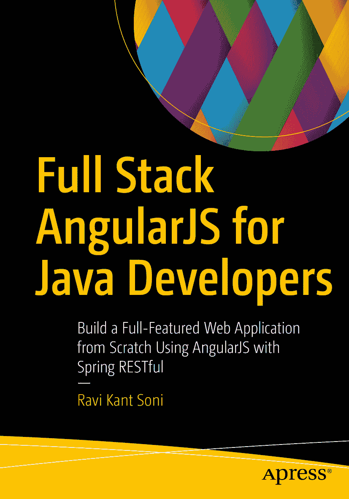

**拉维·坎特·索尼** 著《面向 Java 开发者的全栈 AngularJS》——使用 AngularJS 与 Spring RESTful 从零构建功能完备的 Web 应用

本书作者引用的任何源代码或其他补充材料，读者均可通过本书产品页面在 GitHub 上获取，网址为 [`www.apress.com/978-1-4842-3197-5`](http://www.apress.com/978-1-4842-3197-5)。如需更详细信息，请访问 [`www.apress.com/source-code`](http://www.apress.com/source-code)。ISBN 978-1-4842-3197-5  
电子版 ISBN 978-1-4842-3198-2  
[`doi.org/10.1007/978-1-4842-3198-2`](https://doi.org/10.1007/978-1-4842-3198-2)  
美国国会图书馆控制号：2017962309  
© 拉维·坎特·索尼 2017  
本作品受版权保护。出版商保留所有权利，无论涉及全部或部分材料，具体包括翻译、重印、插图复用、朗诵、广播、微缩胶片或其他任何物理形式的复制、传输或信息存储与检索、电子改编、计算机软件，或目前已知或未来开发的任何类似或不同方法。本书中可能出现商标名称、徽标和图像。对于每个出现的商标名称、徽标或图像，我们仅以编辑方式使用，并旨在维护商标所有者的权益，无意侵犯商标。本书中使用的商品名称、商标、服务标志及类似术语，即使未明确标识，也不应被视为对其是否受专有权利保护的立场表达。尽管本书中的建议和信息在出版时被认为是真实准确的，但作者、编辑和出版商均不对可能存在的任何错误或遗漏承担法律责任。出版商对本书所含材料不作任何明示或暗示的担保。  
本书采用无酸纸印刷  
由 Springer Science+Business Media New York 向全球图书贸易发行，地址：233 Spring Street, 6th Floor, New York, NY 10013。电话：1-800-SPRINGER，传真：(201) 348-4505，电子邮件：orders-ny@springer-sbm.com，或访问 www.springeronline.com。  
Apress Media, LLC 是一家加利福尼亚有限责任公司，其唯一成员（所有者）是 Springer Science + Business Media Finance Inc (SSBM Finance Inc)。SSBM Finance Inc 是一家特拉华州公司。  
献给我的父亲斯里·拉斯·比哈里·普拉萨德 与 我的母亲斯姆特·马诺玛·德维  
我爱你们，爸爸和妈妈。没有你们真挚的爱和最温暖的支持，本书的完成将不可能实现。  
献给我美丽而挚爱的妻子索尼娅·辛格夫人  
没有你，我将一无是处。你总是给予安慰和鼓励，从不抱怨或干涉，无所索取，忍受一切。我爱你，我的甜心，索尼娅。  
致谢

撰写一本技术书籍需要深不可测的研究、审阅、支持，以及在我全职工作之余最宝贵的时间。在此感谢所有帮助我完成本书的人：

首先，我要感谢女神“玛阿·塔拉·钱迪”赐予我如此之多。

没有家人的爱、坚定支持和理解，这本书将始终只是一个虚拟的构想。我深深感谢我的家人——我的母亲斯姆特·马诺玛·德维和我的父亲斯里·拉斯·比哈里·普拉萨德，我的舅舅苏雷什·索尼和纳雷什·卡什亚普，我的岳父斯里·贾伊·纳拉扬·辛格和岳母斯姆特·普拉米拉·德维——感谢他们在本书写作期间给予的爱与支持。

我特别感谢一位在我生命中始终如磐石般稳定的人，他的慈爱精神至今支撑着我——我的叔叔斯里·阿伦·库马尔·索尼，他给予我巨大的激励，使我在生活中取得所有成功；同时特别感谢我的婶婶斯姆特·兰朱·德维。

我还要感谢我挚爱的妻子索尼娅·辛格夫人，在我父母之后，让我生活变得美好的人就是你。

同样感谢我最亲爱的兄弟沙希·康德和斯里·康德，以及我最可爱的妹妹纳姆拉塔·索尼——她一直爱着我。还要感谢我的表亲科马尔、楚尔比利、布尔楚利、里希和米图。

并感谢索拉布·库马尔·辛格和萍琪·辛格。

我最深切的感激和赞赏献给我最亲爱的朋友，阿瓦尼什·库马尔，印度行政服务官员——安达曼和尼科巴群岛尼科巴地区的地区行政长官；他期望并鼓励我将知识付诸文字，以启迪他人。还要感谢我最亲爱的朋友阿洛克·库马尔——思科公司软件工程师四级；以及纳根德拉·库马尔——Facebook 公司工程主管，他们给予我积极的想法，如同燃料般推动我前行。

我要感谢 Apress 出版团队，感谢他们的帮助和极致的专业精神。特别感谢开发编辑劳拉·贝伦德森和协调编辑普拉奇·梅塔，她们的知识横跨令人惊叹的领域，没有她们，这本书将不可能完成。

我衷心感谢 Apress 委托的审稿人，感谢他们宝贵的意见。

最后但同样重要的是，我感谢每一位在本书写作过程中以各种方式支持我的人。

欢迎阅读《面向 Java 开发者的全栈 AngularJS》。

——拉维·坎特·索尼

目录 第 1 章：全栈 Web 开发全景图 1 什么是全栈开发者？ 1 全栈 Web 开发 3 现代 Web 应用架构 4 前端 vs. 后端 6 前端框架 7 AngularJS 作为前端框架 7 Twitter Bootstrap 10 后端框架 10 Spring Boot 作为后端框架 10 小结 27 第 2 章：为你的应用创建 RESTful 层 29 REST 简介 29 HTTP 方法与 CRUD 操作 29 HTTP 状态码 30 构建 RESTful 服务：用户注册系统 30 用户注册系统介绍 30 识别 REST 端点 31 JSON 格式 31 创建用户注册系统应用 32 嵌入式数据库：H2 33 领域实现：用户 33 仓库实现：UserJpaRepository 34 构建 RESTful API 35 处理 RESTful API 中的错误 43 用户注册系统错误处理 43 验证请求体 47 小结 60 第 3 章：搭建 AngularJS：创建你的单页应用 61 AngularJS 作为前端框架介绍 61 AngularJS 基本组件 62 AngularJS 生命周期 62 AngularJS 架构概念 63 搭建开发环境 66 将 AngularJS 添加到 Spring Boot 66 将 Twitter Bootstrap 添加到 Spring Boot 69 开发你的单页应用 69 引导应用 70 依赖注入 70 AngularJS 路由 71 AngularJS 模板 71 在单页应用中实现模型、视图和控制器 72 在 STS 中运行 Spring Boot 应用 86 小结 92 第 4 章：使用 Spring Security 保护你的 RESTful API 93 Spring Security 介绍 93 认证与授权 93 基本认证介绍 94 BasicAuthenticationFilter 94 在 RESTful 服务上启用 Spring Security 94 什么是 Spring Boot Security Starter？ 95 使用 Spring Security 依赖更新 pom.xml 文件 95 覆盖 Spring Security 默认配置 98 自定义用户认证 100 使用内存定义进行认证自定义 101 针对关系型数据库进行认证自定义 107 小结 113 第 5 章：使用 AngularJS 消费受保护的 RESTful 服务 115 在 Spring Security 中启用基本认证 115 在 AngularJS 中为每个请求发送授权头 117 在 AngularJS 中添加 HTTP 拦截器 117 更新 app.js 119 更新 index.html 119 运行应用 120 登录页面 122 更新 index.html：添加导航到欢迎页面 123 更新 app.js：添加导航到 Angular 应用 124 创建 login.html：登录表单 125 更新 controller.js 以处理登录和注销认证流程 127 更新后端代码 129 运行应用 131 小结 133 第 6 章：构建 RESTful 客户端并测试 RESTful 服务 135 使用 RestTemplate 构建 REST 客户端 135 RestTemplate 135 RestTemplate 操作 136 RestTemplate Exchange API 143 使用 RestTemplate 进行基本认证 144 使用 Spring 测试框架测试 RESTful 服务 145 什么是测试？ 145 使用 JUnit4 进行测试 146 敏捷软件测试 149 单元测试 150 集成测试 151 测试 Spring Boot 应用 152 Maven 依赖 152 Spring 测试中的注解 152 REST 控制器单元测试 154 使用 Spring MVC 测试框架测试 Web 层 156 小结 160 第 7 章：使用 Spring Boot Actuator 进行应用监控 161 Spring Boot Actuator 介绍 162 启用 Actuator 模块 162 Actuator 端点 163 /info 164 /env 165 /metrics 165 /trace 167 /health 168 自定义 Actuator 端点 168 可自定义的属性 169 自定义健康指标 170 定义新端点 172 通过 HTTP 进行管理 173 自定义服务器端口 173 访问敏感端点 174 小结 174 附录 A：访问 REST API 的工具 175 API 测试 175 API 测试工具 175 Postman 175 索引 185 关于作者与技术审校者 关于作者 关于技术审校者

