# 1. 全栈 Web 开发的宏观图景

全栈 Web 开发让你能够探索最佳的工具和框架，同时让你的应用程序在设计、可扩展性、健壮性和安全性等不同方面都变得稳固可靠。

在本章中，我将概述全栈 Web 开发的宏观图景，并讨论现代应用程序的架构，以打破“开发孤立的桌面和移动应用是一种好方法”这一迷思。我将讨论作为前端框架的 AngularJS 和作为后端框架的 Spring Boot。我还将展示如何将 Spring Boot 设置为开发环境。然后，你将开发你的第一个 Spring Boot 应用程序并运行它。最后，你将使用 Spring Boot Actuator 监控你的 Spring Boot 应用程序。

## 什么是全栈开发者？

每当有人告诉你他们是全栈开发者时，你可能会问的第一个问题是：“你是哪种全栈开发者？” 问题是，如今当你从事 Web 开发时，你必须使用大量的工具。技术栈已经变得比以前更庞大了。

如今的公司更倾向于雇佣那些足够灵活、能够处理各种事务的工程师，而不是那些只精通单一技术的人。最终目标是，你将能够编写 Java 代码、使用 Angular、编写数据库脚本、编写 CSS 等等。事实上，几年前，说自己是全栈开发者很容易，但今天，你必须同时处理 Java、AngularJS、Bootstrap、CSS、数据库脚本以及多种数据库，而且你还需要了解内容交付、部署以及如何发布到 Amazon Web Services 集群。不用说，同时管理所有这些事情是很复杂的。我甚至还没有提到设计 UI 和创建移动应用等领域。所以，当你说自己是全栈开发者时，需要了解的东西非常多。

全栈开发者是对所有这些主题都略知一二，还是精通所有？很多时候，全栈开发者被认为是“万金油”，但样样不精。因此，最好明确自己是哪种类型的全栈开发者。

成为一名全栈开发者意味着你基本上需要成为一个连接者。所以，即使你只擅长某一套技能，你也可以准备好你的工作成果以便交付，这样另一个人就能在另一端接手他们的工作，并知道如何接收它。这就是全栈开发者非常有价值的地方。

但是，找到一位优秀的全栈开发者的几率极低。问题是，初创公司总是需要一位能够关注所有方面的全栈开发者，而初创公司总是急于不惜重金雇佣全栈开发者。

行业中全栈开发者的定义是：一位精通从客户端编码（如 HTML、CSS 和 AngularJS）到服务器端（如 Java 和 Spring Boot）所有方面，并且对各种数据库（包括 RDBMS 和 NoSQL 数据库系统）都有经验的工程师。因此，一个全栈 Web 开发者应该对客户端和服务器端技术都有良好的实践经验，如图 1-1 所示。

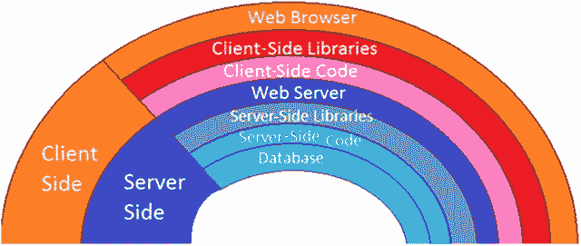

图 1-1.

客户端和服务器端技术

全栈开发者负责确保系统的每个部分都能平稳运行。开发者应具备以下方面的专业知识：

*   设计用户界面
*   在服务器端开发业务逻辑和服务层
*   处理关系型和非关系型数据库
*   处理 API 交互
*   通过编程方式使用身份验证和授权来保护应用程序
*   确保质量保证
*   理解业务需求和客户需求

除此之外，全栈开发者还必须知道如何进行基本的服务器管理，在必要时承担服务器管理员或 DevOps 的角色。

*   通过命令或终端连接到云服务器，并访问诸如 `putty` 之类的工具
*   管理用户和组的集合与子集
*   在指定的服务器环境中进行基本的 Shell 脚本编写
*   理解 Apache 和 Nginx 服务器程序
*   管理防火墙和权限
*   安装、更新和管理服务器端软件、包和库

此外，随着云基础设施的发展，全栈开发者应该了解平台即服务（PaaS）和软件即服务（SaaS）模型、Amazon Web Services 以及 IBM Bluemix。

本节内容全是关于成为一名全栈 Web 开发者。让我们在下一节深入探讨全栈开发的宏观图景。

## 全栈 Web 开发

技术栈是构成应用程序的工具和组件的组合。在 Web 应用程序中，组件可以位于前端（HTML、CSS、JavaScript/jQuery）或后端（服务器操作、逻辑层和数据库）。请注意，由于数据库即服务（DaaS）的出现，如今数据库可以放在一个单独的部分，而不是服务器端操作中。

全栈 Web 开发意味着能够自如地处理前端和后端技术。简单来说，全栈开发涵盖了使用 HTML/CSS、JavaScript/jQuery 以及诸如 AngularJS 和 Bootstrap 等框架进行的客户端开发。

对于服务器端开发，它涵盖了诸如 Java 等编程语言、诸如 Spring Boot 等框架、诸如 PostgreSQL 或 Oracle 或任何其他数据库，以及介于两者之间的所有内容。

客户端和服务器端之间的通信通过 RESTful API 和 HTTP 进行，如图 1-2 所示。让我们在下一节讨论现代 Web 应用程序的架构。

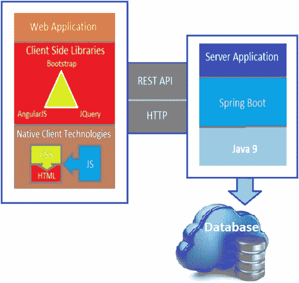

图 1-2.

客户端与服务器之间的通信


## 现代 Web 应用的架构

在 Web 早期，并不存在 Web 应用。我们只有充满静态内容和图片的网站。这种方式有利有弊。

以下是一些优点：

*   服务器端的计算开销非常低。
*   由于数据是静态的，且对众多 ISP 和服务提供商来说不会改变，因此内容本身具有很高的可缓存性。

以下是一些缺点：

*   更新内容很困难。
*   没有个性化，所有用户获得的体验相同。
*   与当今的应用相比，用户界面通常很差。

CGI 通过使用脚本语言实现动态内容创建，引发了一场革命。其缺点是计算开销相对较高，并且要求你成为 HTML 和服务器端脚本语言的专家。

随后，JavaScript 出现了，它首次使页面具备了动态能力。它主要用于非常基础的脚本编写，例如验证表单或显示弹窗广告。它增强了可用性，并减少了因基础验证而导致的与服务器的往返通信。缺点是你必须将业务逻辑实现两次：一次在客户端，一次在服务器端。因此，我们提出了现代 Web 应用的架构。

在本节中，我将讨论现代应用的架构，以打破“开发独立的桌面和移动应用是正确方向”这一迷思。现代 Web 应用专注于构建分布式后端基础设施，通过 RESTful API 在 Web 上提供内容并服务于前端客户端，如图 1-3 中 Web 应用的分层架构所示。

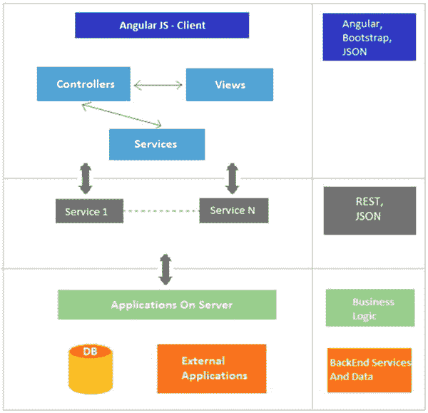

图 1-3.

现代 Web 应用的分层架构

当你想要与页面上的多个组件交互，而这些组件又包含许多中间组件时，让所有中间组件都实现服务器端渲染会变得很困难。与传统的服务器端架构相比，这里的主要思想是将服务器构建为一组无状态、可复用的 REST 服务。从模型-视图-控制器（MVC）的角度来看，控制器已从后端移除并移到了客户端。因此，现在客户端能够使用 MVC 架构。客户端拥有一个独立的视图层，包含所有展示逻辑。它还有独立的前端服务层和控制器层。

在应用初始启动时，只有 JSON 数据通过 RESTful API 在客户端和服务器之间传输。整个业务逻辑将暴露为 REST 端点，供 Angular 服务消费。这样做的好处是，当你的 Web 应用有对应的移动应用时，你可以直接消费这些 RESTful 服务，而无需为移动应用在服务器端编写任何额外的代码。

REST 代表表述性状态转移，它是一种架构风格，是对具体事物的一种抽象。它是当今 Web 运作的架构。你将在第 2 章中更详细地学习 RESTful API，届时你将为自己的应用创建 RESTful 层。

## 前端 vs. 后端

当你开发一个 Web 应用时，你主要将开发过程分为两部分：前端和后端。当你谈论 Web 应用或移动应用时，基本上关注的是前端开发。当你使用任何 Web 应用或浏览器时，你输入地址，网站会打开包含文本、图片、表单和不同交互元素等多个元素的页面。图 1-4 展示了前端和后端的物理视图。

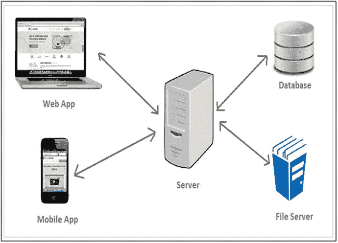

图 1-4.

前端和后端的物理视图

如果你使用移动应用，你会看到不同的元素、列表视图等。这些应用会出现在客户端。因此，无论你使用的是笔记本电脑、移动设备，还是浏览器或移动应用，你都会接触到完整应用的客户端部分。

所有用户数据都存储在数据库中。所有业务逻辑和安全数据都存储在服务器上。服务器接收来自 Web 应用或移动应用的请求，处理这些请求，从数据库或文件服务器中获取必要的信息，并将其发送回前端应用。所以，基本上，后端存储信息，前端展示信息。

设计师和开发者通常使用框架来构建网站和应用的雏形，因为从头开始构建应用或网站需要花费大量时间。

软件框架被定义为：一组预定义的可复用模块，可以实现这些模块以更好、更快地完成指定任务。因此，一个软件框架总是包含库、编译器以及多个 API，用于开发特定的企业级 Web 应用。一个优秀的全栈开发者应该知道哪个框架最适合他们那套应用的实现。

以下是一些流行的软件框架：

*   AngularJS（用于 UI/前端开发）
*   Ionic（用于混合移动应用原型设计和开发）
*   Pure MVC 框架（应用开发框架）
*   Selenium（Web 测试框架）

在计算机编程中，软件框架是一种抽象，其中提供通用功能的软件可以通过额外的用户编写代码进行选择性更改，从而提供特定于应用的软件。

## 前端框架

前端涉及用户看到的一切，包括设计以及 HTML 和 CSS 等语言。前端代码的主要目的是与用户交互，并以定义良好的样式呈现数据。

在构建前端应用时，有非常多令人惊叹的 JavaScript 库可供使用。有时，选择一个单一的项目可能会有点棘手。前端就是让 Web 应用看起来和用起来都“性感”的所有东西。这些前端内容包括 HTML、CSS 和 JavaScript。在本书中，你将使用 AngularJS 作为前端开发框架。我将在本章后面更详细地介绍 AngularJS。

### AngularJS 作为前端框架

AngularJS 是一个用 JavaScript 编写的库，用于 Web 应用开发。它解决了单页应用（SPA）的挑战。一个 AngularJS Web 应用遵循 MVC 设计模式，从而开发出可扩展、可维护、可测试且标准化的 Web 应用。AngularJS 的数据绑定和依赖注入使其成为任何服务器技术的理想搭档，因为它消除了许多你原本必须编写的代码，并且这一切都发生在浏览器内部。

#### AngularJS 版本

AngularJS 通常被称为 Angular.js，有时也称为 AngularJS 1.x。AngularJS 是一个基于 JavaScript 的开源前端 Web 应用开发框架，主要由 Google 维护。

现在，Angular 4.0.0 已经可用，并且对于大多数应用来说，它与 2.x.x 版本向后兼容。这个新版本包含一些新特性，例如将动画包从核心中分离出来，放入其自己的包中，以及改进了支持`if/else`风格的`ngIf`等。


#### AngularJS 架构概念

现在，你将了解 AngularJS 的架构概念。当一个 HTML 文档被加载到浏览器并由浏览器解析时，会发生以下过程：

1.  AngularJS JavaScript 文件被加载，并创建 Angular 全局对象。注册控制器函数的 JavaScript 文件被执行。
2.  AngularJS 扫描 HTML 以查找 AngularJS 应用和视图，并找到与视图对应的控制器函数。
3.  AngularJS 执行控制器函数，并使用由控制器填充的模型中的数据更新视图。
4.  AngularJS 监听浏览器事件，例如按钮点击、鼠标移动、输入字段变化等。如果这些事件中的任何一个发生，AngularJS 将相应地更新视图。

图 1-5 展示了 AngularJS 的工作流程图。

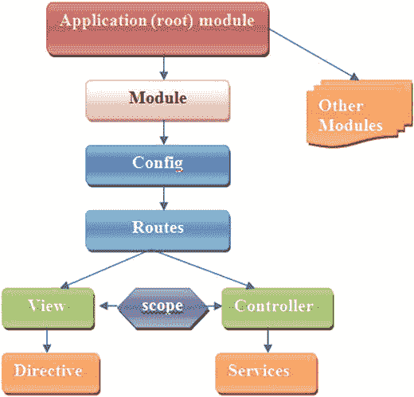

图 1-5.

AngularJS 工作流程图

AngularJS 包含模块，这些模块充当不同类型应用的容器，例如视图、控制器、指令、服务等。模块指定了应用如何被引导启动。然后，你还有一个配置组件。

路由用于将 URL 链接到控制器和视图。视图用于处理复杂的事件。它使用 `ng-view` 指令。控制器控制 AngularJS 应用的数据，这些数据由常规的 JavaScript 对象组成。AngularJS 定义了一个 `ng-controller` 指令，该指令通过使用控制器函数来创建新的控制器对象。

AngularJS 带有几个内置服务，例如 `$http`、`$route`、`$window`、`$location` 等。作用域由引用模型的对象组成。它们在连接控制器与视图方面扮演着重要角色。我们将在第 3 章中更详细地讨论这些内容。

##### MVC 架构

AngularJS 使用 MVC 架构来创建 Web 应用。MVC 架构是一种编程方法论，旨在将应用拆分为三个核心组件：模型、视图和控制器。这三个组件组合起来构成你的应用。图 1-6 展示了模型-视图-控制器架构。

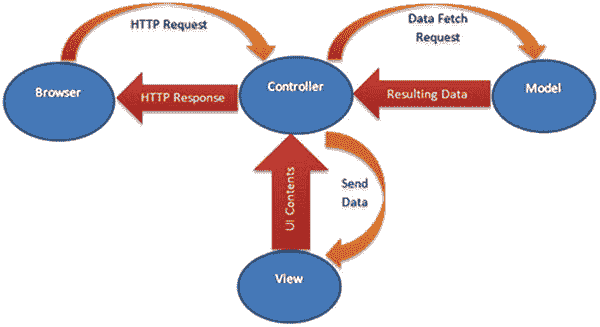

图 1-6.

AngularJS 中的 MVC 架构

当用户通过浏览器发送 HTTP 请求时，该请求由控制器接收。控制器处理该请求，并将其发送给模型以提供相应的数据。作为响应，模型将结果数据数组再次返回给控制器。控制器再次将数据处理成所需格式，并将其发送给视图。视图通过 UI 内容呈现数据，并将其发送给控制器。最后，控制器将 HTTP 响应发送回浏览器。

*   AngularJS 视图用于在 Web 浏览器中向用户生成信息的输出表示，例如图表或示意图。AngularJS 通过拉取为应用定义的所有模板，在文档对象模型（DOM）中构建视图。因此，开发人员在此的工作主要是使用 HTML 和 CSS 来创建模板。
*   AngularJS 模型包含用于存储应用模型的 `$scope` 对象，因此无需像其他 JavaScript 客户端框架那样创建 JavaScript 模型类。作用域附加到 DOM 上，这有助于大大简化 JavaScript 问题。
*   AngularJS 控制器是定义特定于某个视图的所有业务逻辑的地方。控制器将模型和视图结合在一起。

### Twitter Bootstrap

Twitter Bootstrap 是一个前端框架，旨在使响应式设计变得更加容易。Bootstrap CSS 框架可用于设置网站内容的样式。你可以创建自己的 CSS 样式来使网站看起来很棒，但 Bootstrap 提供了一套不错的 CSS 样式，让你能够设计出外观非常出色的内容布局。在使用 AngularJS 时，并非必须使用 Bootstrap，并且 AngularJS 和 Bootstrap 之间没有内在关系，因为它们是不同的软件包。

要使用 Bootstrap CSS 框架中的 CSS，你可以在开发 Spring Boot 应用时，在 `pom.xml` 中定义一个依赖项，这样它就会被自动下载到库文件夹中。此外，你也可以从 [`https://getbootstrap.com/`](https://getbootstrap.com/) 下载 Bootstrap 归档文件，其中也包含 CSS 和 JavaScript 文件。

## 后端框架

任何应用的后端代码都可以被视为该应用的大脑。后端代码是使用服务器端语言和数据库构建的，并且对用户不可见。前端代码与最终用户实时交互，而浏览器中网站上显示的任何内容，都是因为在服务器上执行了查询，后端代码与服务器交互，将用户可用的数据返回给前端。

开发人员使用 Java 等服务器端代码构建应用的后端代码，这些代码与数据库连接以保存或更新数据，并以前端代码的形式将其返回给最终用户。这种后端代码结构有助于开发人员开发应用，以实现在现代互联网世界中进行在线购物、社交互动、查找实时信息以及执行更多操作。

有许多可用的框架和库可以使后端编码更简单、性能更快。本书中将全程使用的最流行的一个是 Spring 框架。Spring 框架一直因在企业应用中构建后端功能而广受欢迎，而有了 Spring Boot，开发人员的工作从未如此轻松。

### Spring Boot 作为后端框架

为什么选择 Spring Boot？有很多用于开发 Web 应用的框架，Spring Boot 只是其中之一。如果你想快速构建某些东西，Spring Boot 可以作为 Web 应用开发框架的首选。

> 使用 Spring Boot 就像与 Spring 开发者进行结对编程。 —— Josh Long @starbuxman

Pivotal 团队设计了一个名为 Spring Boot 的新轻量级框架，旨在以最小的麻烦简化独立、基于 Spring 且可用于生产环境的应用和服务的引导和开发，让你可以“直接运行”。


#### Spring Framework 的问题与 Spring Boot 的优势

我们先来了解 Spring Framework 的一些问题。2006 年时，Spring Framework 主要关注依赖注入。后来它不断发展，演变成一个完整的应用框架，可用于构建企业级 Java 应用程序。它通过提供模板来简化企业应用的构建，从而处理了大部分业务逻辑，例如事务处理。

Spring Framework 还拥有一个配置模块，Spring 在此处理许多常见问题，例如处理 HTTP 请求、连接数据库等，这使得开发者能够专注于业务服务。开发者开发业务服务，并使用 Spring 提供的注解来标注类，从而让 Spring 知晓这些服务。Spring 还提供基础设施支持，例如连接 RDBMS 数据库或 MongoDB 数据库。

然而，在带来这些功能的同时，Spring 也带来了一些问题，例如它是一个庞大的框架，包含多个设置和配置步骤。此外，还有多个构建和部署步骤。

为了解决这些问题，Spring Boot 应运而生。Spring Boot 将这些步骤抽象化，使开发者能够再次专注于业务逻辑。Spring Boot 的主要目标是通过承担配置基于 Spring 的应用的大部分工作，来解决 Spring Framework 中配置的复杂性；大多数情况下，无需 XML 或代码配置。

Spring Boot 提供的另一个有趣特性是“无 WAR，仅 JAR”。因此，你无需生成 WAR 文件再上传到 Tomcat 服务器；你可以创建自托管的 Web 应用程序，并将其作为 Java JAR 应用程序执行，这使得部署变得极其简单直接。

Spring Boot 具有“约定优于配置”的特性，这意味着它提供了合理的默认值。你可以使用这些常用值快速构建应用程序。Spring Boot 会根据其类路径上的库自动配置所需的类。

假设你的应用程序需要与数据库交互。如果类路径上有 Spring Data 库，那么 Spring Data 会自动设置与数据库的连接以及数据源类。由于 Tomcat 是一个流行的 Web 容器，默认情况下，Spring Boot Web 应用程序会使用内嵌的 Tomcat 容器。

使用 Spring Boot，你可以独立地暴露诸如 REST 服务之类的组件，这与微服务架构中提出的理念一致，这样在维护任何组件时，你无需重新部署整个系统。

#### Spring Boot 的主要目标

以下是 Spring Boot 的主要目标：

*   以最少的麻烦提供生产就绪的应用程序和服务，任何人都可以“直接运行”。
*   坚持“约定优于配置”，即为开发者做出某些决策，并支持企业应用常见的一系列非功能性特性（内嵌服务器、安全性、健康检查、指标和外部化配置）。
*   支持约定优于配置，完全避免 XML 配置，并避免注解配置。
*   允许开发者根据自己的喜好自定义 Spring Boot 应用程序。

#### 开发你的第一个 Spring Boot 应用程序

在本节中，你将逐步开发你的第一个 Spring Boot 应用程序。如果你已经熟悉此过程，可以跳到末尾查看所有内容如何整合在一起。启动新项目有多种不同的选项。更多详情，请参考 [`https://spring.io/`](https://spring.io/) 。

##### 系统要求

Spring Boot 2.0.0.M2 需要 Java 8。因此，首先需要的是 Java 8 SDK。如果你已经在系统中设置了 JDK，那么在开始之前，你应该检查系统上安装的 Java 当前版本。

```
$ java -version
java version "1.8.0_101"
Java(TM) SE Runtime Environment (build 1.8.0_101-b13)
Java HotSpot(TM) 64-Bit Server VM (build 25.101-b13, mixed mode)
```

Spring 团队提供了以下三种方法来使用“约定优于配置”的方式创建 Spring Boot 应用程序：

*   使用 Spring Boot CLI 工具
*   使用 Spring STS IDE
*   使用 Spring Initializr ( [`http://start.spring.io/`](http://start.spring.io/) )

开发者可以使用 Spring Boot CLI、Spring STS IDE 或 Spring Initializr 网站来开发 Spring Boot Groovy 应用程序。他们可以使用 Spring STS IDE 或 Spring Initializr 网站来开发 Spring Boot Java 应用程序。

##### 使用 Spring Boot CLI

Spring Boot 有一个命令行界面，允许开发者创建 Spring Boot 应用程序。本书不会涉及此主题；有关信息，你可以参考 [`http://docs.spring.io/spring-boot/docs/2.0.0.M2/reference/htmlsingle/#getting-started-installing-the-cli`](http://docs.spring.io/spring-boot/docs/2.0.0.M2/reference/htmlsingle/#getting-started-installing-the-cli) 。

##### 使用 Spring Initializr

要从零开始启动一个新的 Spring Boot 项目，你可以通过 Spring Boot 提供的名为 Spring Initializr 的 Web 服务创建一个新项目：[`http://start.spring.io/`](http://start.spring.io/) 。通过输入所需信息并选择一组所需的选项（依赖项），你可以下载一个构建文件项目或一个压缩文件项目，其中包含根目录下的标准 Maven 或 Gradle 项目。

这让你可以通过选择选项并下载来引导一个应用程序。你可以选择项目类型，例如 Maven 或 Gradle，并且可以选择 Spring Boot 的版本。此外，你还可以选择项目元数据，如图 1-7 所示。

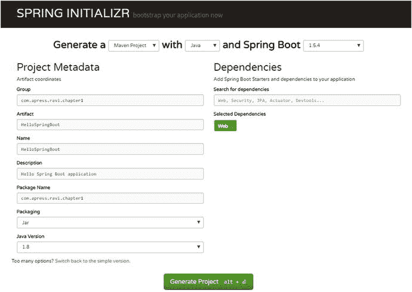

图 1-7.

Spring Initializr

本书中你将开发一个 Maven 项目。

图 1-7 中的屏幕截图有点长，因此被截断了。表 1-1 显示了此示例的所有设置。

表 1-1.

项目相关详情

| 字段 | 值 |
| --- | --- |
| Group | com.apress.ravi.chapter 1 |
| Artifact | HelloSpringBoot |
| Name | HelloSpringBoot |
| Description | Hello Spring Boot 应用程序 |
| Package Name | com.apress.ravi.chapter 1 |
| Packaging | Jar |
| Java Version | 1.8 |
| Language | Java |
| Project dependencies | Web |
| Generate a | Maven Project |

Spring Boot 允许开发者创建可执行的 JAR，这些 JAR 可以使用 `java -jar` 启动，或者采用更传统的 WAR 部署方式。你可以根据需求获取所选依赖项的列表。为了创建 HelloSpringBoot 应用程序，我选择了一个 Web 依赖项，它支持使用 Tomcat 和 Spring MVC 进行全栈 Web 开发，如图 1-8 所示。

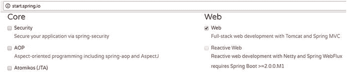

图 1-8.

Spring Initializr 中的 Web 依赖项

点击“Generate Project”按钮下载 `HelloSpringBoot.zip` 文件。你可以将 Maven 项目（解压后）直接导入 Spring Source Tool (STS)，并从中开始工作。

本书将全程使用 STS 作为 IDE。如果你尚未安装 STS，请访问 [`https://spring.io/tools/sts/all`](https://spring.io/tools/sts/all) 并为你的操作系统下载一份副本。要安装它，只需解压下载的存档文件。完成后，继续启动 STS。

创建 Spring Boot 项目的另一个选项是使用向导，方法是选择 File ➤ New ➤ Spring Starter Project。


##### 使用 Spring Tool Suite

Spring Tool Suite 是一个开箱即用的最新 Eclipse 发行版，并预装了 Spring IDE 组件。使用 Spring Starter Project 向导可以创建一个基本的 Spring Boot 应用程序（图 1-9）。

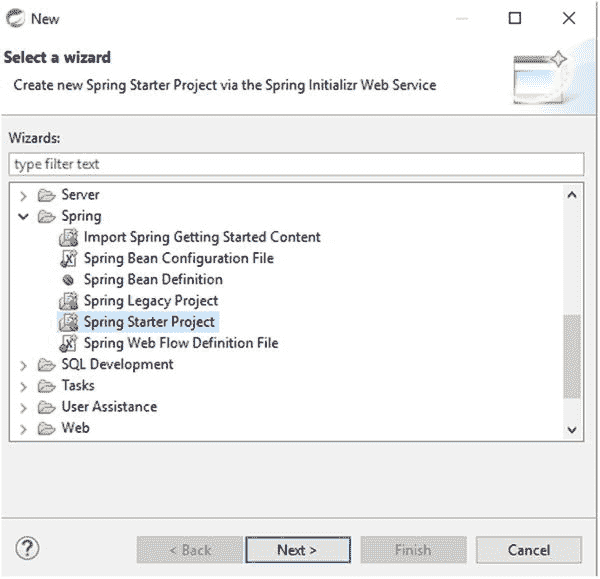

图 1-9.

创建 Spring Boot 应用程序的向导

Spring Boot 提供了所谓的启动器（starters），你需要提供项目相关的详细信息，如图 1-10 所示。

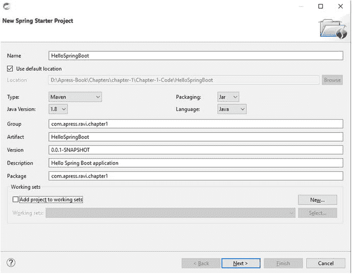

图 1-10.

Spring 启动器项目

Spring Boot 中的启动器是一组类路径依赖项，它们可以自动配置应用程序，让你无需进行任何配置即可开发应用。在本章中，你将选择 Web 依赖项，因为你将构建一个简单的 `HelloSpringBoot` RESTful 服务，如图 1-11 所示。

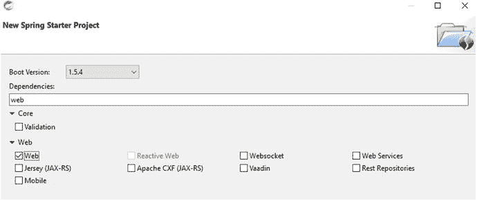

图 1-11.

在 Spring 启动器中选择 Web 依赖项

点击“完成”按钮将生成一个工作空间，你可以在其中创建新的包、类和静态文件（位于 resources 目录下）。项目的最终结构将如图 1-12 所示。

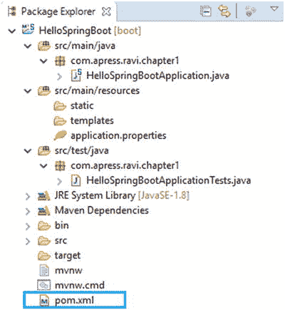

图 1-12.

项目结构

让我们在下一节中浏览代码。

#### 代码概览

让我们详细浏览代码。你将查看 `pom.xml` 和 Java 文件中的代码。先从 `pom.xml` 开始。

##### 查看 pom.xml

在创建 Spring Boot 应用程序时，你在启动器对话框中选择的所有依赖项都会出现在 `pom.xml` 中，如代码清单 1-1 所示。`pom.xml` 文件是用于构建项目的配方。

```

4.0.0
com.apress.ravi.chapter1
HelloSpringBoot
0.0.1-SNAPSHOT
jar
HelloSpringBoot
Hello Spring Boot application

org.springframework.boot
spring-boot-starter-parent
1.5.4.RELEASE

UTF-8
UTF-8
1.8

org.springframework.boot
spring-boot-starter-web

org.springframework.boot
spring-boot-starter-test
test

org.springframework.boot
spring-boot-maven-plugin

代码清单 1-1.
pom.xml
```

关于代码清单 1-1，请注意以下几点：

*   `<parent>` 元素指定了 Spring Boot 的父 POM，其中包含通用组件的定义。
*   `spring-boot-starter-web` 的 `<dependency>` 元素告诉 Spring Boot 该应用程序是一个 Web 应用程序，并让 Spring Boot 据此形成其“观点”。

在进一步深入之前，让我们先理解 Spring Boot 的“观点”。你需要了解 Spring Boot 如何使用像 `spring-boot-starter-web` 这样的启动器来形成其配置观点。HelloSpringBoot 应用程序使用 `spring-boot-starter-web` 作为 Spring Boot 的 Web 应用程序启动器。基于此启动器，Spring Boot 形成了以下观点：

*   使用 Spring MVC 作为 REST 框架
*   使用 Apache Jackson 进行 JSON 绑定
*   使用 Tomcat 作为嵌入式 Web 服务器容器
*   使用 Hibernate 进行对象关系映射

在 Spring Boot 对你打算构建的应用程序类型形成观点后，它会根据 POM 内容和为 HelloSpringBoot 应用程序指定的启动器，提供一组 Maven 依赖项。图 1-13 显示了 Spring Boot 在 STS 中设置的部分 Maven 依赖项。

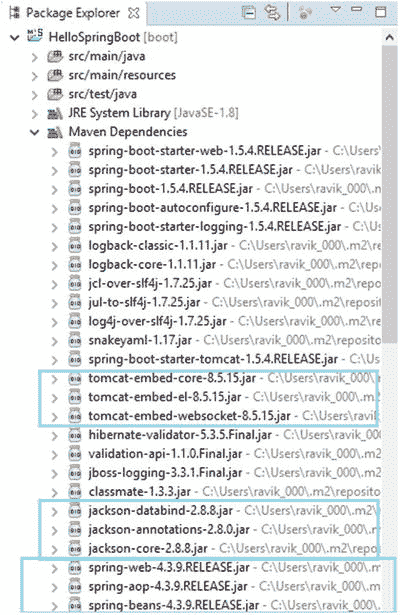

图 1-13.

在 STS 中设置的 Maven 依赖项

你可以在图 1-13 中看到，Tomcat 是默认的嵌入式 Web 服务器容器。假设你想使用 Jetty 代替 Tomcat；你只需要更改 POM 中的 `<dependencies>` 部分，如代码清单 1-2 所示。

```
org.springframework.boot
spring-boot-starter-web

org.springframework.boot
spring-boot-starter-tomcat

org.springframework.boot
spring-boot-starter-jetty

代码清单 1-2.
包含 Tomcat 和 Jetty 依赖项的 pom.xml
```

你可以在图 1-14 中看到，Tomcat 的 Maven 依赖项已被替换为 Jetty 的依赖项。

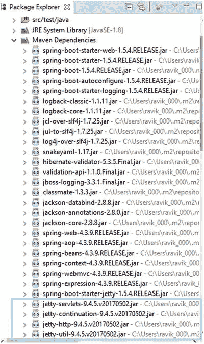

图 1-14.

更新后的 Maven 依赖项

##### 编写代码

要启动一个 Spring Boot 应用程序，你可以从一个 `main()` 方法开始。大多数情况下，你只需委托给 `static SpringApplication.run` 方法，如代码清单 1-3 所示。

```
package com.apress.ravi.chapter1;
import org.springframework.boot.SpringApplication;
import org.springframework.boot.autoconfigure.SpringBootApplication;
import org.springframework.web.bind.annotation.RequestMapping;
import org.springframework.web.bind.annotation.RestController;
/**
* @author RaviKantSoni
*/
@SpringBootApplication
@RestController
public class HelloSpringBootApplication {
public static void main(String[] args) {
SpringApplication.run(HelloSpringBootApplication.class, args);
}
@RequestMapping("/hello")
public String greeting(){
return "Hello World!";
}
}
代码清单 1-3.
com.apress.ravi.chapter1.HelloSpringBootApplication.java
```

让我们逐步了解重要的部分。

###### @SpringBootApplication 注解

`HelloSpringBootApplication` 类的第一个注解是 `@SpringBootApplication`。`@SpringBootApplication` 注解是 Spring Boot 1.2.0 中引入的一个便捷注解，它包含了以下注解：

*   `@Configuration`：被 `@Configuration` 注解标记的类可以被 Spring 容器用作 bean 定义的来源，这并非 Spring Boot 特有。该类可能包含一个或多个通过 `@Bean` 注解方法声明的 Spring bean。
*   `@EnableAutoConfiguration`：此注解是 Spring Boot 项目的一部分，它告诉 Spring Boot 开始使用类路径定义或设置来添加 bean。自动配置会智能地猜测并配置你很可能在应用程序中运行的 bean，从而简化开发者的工作。
    *   例如，假设你的类路径上有 `tomcat-embedded.jar`，那么你可能需要一个 `TomcatEmbeddedServletContainerFactory` bean 来配置 Tomcat 服务器。因此，这将被自动搜索和配置，无需任何手动的 XML 配置。
    *   通常，对于 Spring MVC 应用程序，你会添加 `@EnableWebMvc` 注解，该注解将应用程序标记为 Web 应用程序并激活关键功能，例如设置 `DispatcherServlet`，但 Spring Boot 在类路径上发现 `spring-webmvc` 时会自动添加此注解。类似地，`@EnableTransactionManagement` 注解也会被自动添加，从而启用声明式事务管理。
*   `@ComponentScan`：此注解告诉 Spring 查找特定的包，以扫描带注解的组件、配置和服务。

###### @RestController 和 @RequestMapping 注解

`HelloSpringBootApplication` 类的第一个注解是 `@RestController`，这是一个构造型注解。`@RequestMapping` 注解提供了“路由”信息，并告诉 Spring 任何路径为 `/hello` 的 HTTP 请求都应映射到 `greeting` 方法。

`@RestController` 和 `@RequestMapping` 注解来自 Spring MVC（这些注解并非 Spring Boot 特有）。


###### 主要方法

`HelloSpringBootApplication` 类的主要部分是 main 方法。使用 Spring Boot 开发的 Spring 应用程序包含 main 方法，该方法调用 Spring Boot 的 `SpringApplication.run()` 方法来启动应用程序，如之前的代码所示。包含 main 方法的类被称为主类，并使用 `@SpringBootApplication` 注解进行标记。

##### 在 STS 中运行 Spring Boot 应用程序

使用 Spring Starter Project 向导创建的 Spring Boot 应用程序有两种形式：WAR 和 JAR。该向导允许您在其打包选项中选择 WAR 或 JAR。

> 正如 Josh Long 在 Spring IO 的一次演讲中所说：“Make JAR, not WAR。” — [`https://twitter.com/springcentral/status/598910532008062976`](https://twitter.com/springcentral/status/598910532008062976)

Spring Boot 更倾向于 JAR 而非 WAR，它允许您轻松创建独立的 JAR 打包项目，这些项目在生成的工件内部嵌入了 Web 服务器（Apache Tomcat 是默认的 Web 服务器），这有助于开发人员减少设置本地或远程 Tomcat 服务器、WAR 打包和部署的开销。

要在本地运行 Spring Boot 应用程序，您不需要 STS 中的任何特殊工具。您只需通过选择“Run As ➤ Java Application”来运行它，无论是从标准的 Eclipse Java 调试工具还是从 STS 中。

与 IDE 相比，使用 STS 的好处在于它提供了一个专用的启动器，该启动器执行与 IDE 相同的操作，但在此之上添加了一些有用的附加功能。因此，让我们使用 STS 来运行 Spring Boot 应用程序，如图 1-15 所示。

右键单击项目 `fullstackdeveloper`，然后选择“Run As ➤ Spring Boot App”。

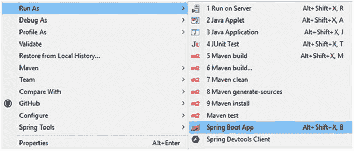

图 1-15.

STS 中运行应用程序的向导

Spring Boot 应用程序启动时，控制台会输出一些信息，如图 1-16 所示。

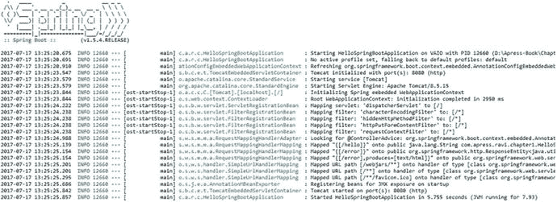

图 1-16.

控制台输出

如果应用程序启动成功，Spring Boot 控制台输出的最后一行将包含“Started HelloSpringBootApplication”字样。

恭喜！您已成功使用 Spring Boot 设置并运行了应用程序。现在是时候在浏览器中访问 `http://localhost:8080/hello` 来查看网页了，如图 1-17 所示。

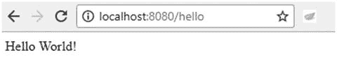

图 1-17.

从浏览器访问 REST 端点

#### 启动器

启动器是一组方便的依赖描述符，您可以将其包含在应用程序中。它们包含了许多让您的项目快速启动和运行所需的依赖项。启动器 POM 是可以添加到应用程序 Maven 中的依赖描述符。

简单来说，如果您正在开发一个使用 Spring MVC 处理 HTTP 请求的项目，您只需包含 `spring-boot-starter-web`，它将导入 Spring MVC 应用程序所需的所有依赖项，例如 `view-resolver`、`tomcat` 等。这减轻了为框架配置所有必需依赖项的负担。

您可以参考 [`http://docs.spring.io/spring-boot/docs/2.0.0.M2/reference/htmlsingle/#using-boot-starter`](http://docs.spring.io/spring-boot/docs/2.0.0.M2/reference/htmlsingle/#using-boot-starter) 获取完整的启动器列表。

#### Spring Boot Actuator：生产就绪特性

Spring Boot 拥有一系列特性，让您可以在生产环境或部署后的任何环境中监控您的 Spring Boot 应用程序。例如，您可以获取日志、执行线程转储、查看指标、分析垃圾回收以及显示在 `BeanFactory` 中配置的 Bean。这些信息可以通过 HTTP 或 JMX 暴露，甚至可以通过 SSH 记录到进程中。

##### 启用 Actuator

Actuator HTTP 端点仅适用于 Spring MVC。这是一个无需编写控制器即可添加到应用程序的新端点。Actuator 的定义是一个生产就绪的特性，用于帮助您监控和管理应用程序。

启用生产就绪特性的最简单方法是从 Spring 启动器添加 `spring-boot-actuator` 模块依赖 `spring-boot-starter-actuator`，如图 1-18 所示。

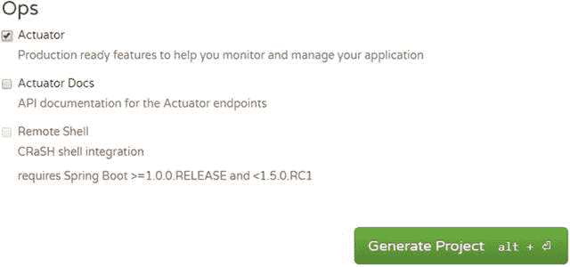

图 1-18.

Spring Initializr 中的 Actuator 依赖

要将 actuator 添加到基于 Maven 的项目中，请在 `pom.xml` 中添加以下 `starter` 依赖：

```
org.springframework.boot
spring-boot-starter-actuator

```

##### 运行应用程序

一旦您运行 Spring Boot 应用程序，actuator 端点将记录在控制台中，如图 1-19 所示。

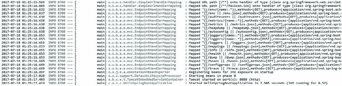

图 1-19.

控制台日志中的 Actuator 端点

##### 使用 Actuator 端点

Spring Boot 包含许多 actuator 端点，允许您监控并与 Spring Boot 应用程序交互。大多数端点是敏感的，并非完全公开，而少数端点如 `/health` 和 `/info` 则不是。

以下是 Spring Boot 开箱即用提供的一些常见端点：

*   `/health` 显示正在运行的 Boot 应用程序的健康信息。默认情况下，它不敏感。
*   `/Info` 显示任意的应用程序信息。默认情况下，它不敏感。
*   `/metrics` 显示正在运行的 Boot 应用程序的指标信息。默认情况下，它是敏感的。

##### 自定义管理服务器端口

如果您的 Spring Boot 应用程序在您自己的数据中心内运行，那么您可能更倾向于使用默认的 HTTP 端口 8080 来暴露端点。但对于基于云的部署，使用默认的 HTTP 端口 8080 来暴露管理端点是一个明智的选择。可以使用 `management.port` 属性来更改 HTTP 端口。

您可以使用 `src\main\resources\application.properties` 文件为 `management.port` 属性分配端口号 8081：`management.port=8081`。

##### 获取健康信息

`/health` 端点可用于检查正在运行的 Spring Boot 应用程序的健康/状态。它返回一个包含大量矩阵的 JSON 文件。在浏览器中访问 `http://localhost:8081/health` 将得到如图 1-20 所示的结果。

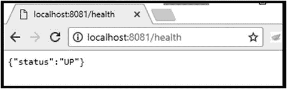

图 1-20.

访问 /health 端点

以下健康信息显示给未经授权的 HTTP 访问：

```
{
"status":"UP"
}
```

在第 7 章中，我将更详细地讨论 Spring Boot actuator，以便您理解这个返回的 JSON 数据代表什么。

## 总结

在本章中，您了解了什么是全栈开发人员以及全栈 Web 开发涉及的内容。您还学习了现代 Web 应用程序的架构。您了解了 AngularJS 作为前端框架和 Spring Boot 作为后端框架的概况。您开发了第一个 Spring Boot 应用程序。最后，您学习了如何使用 actuator 监控您的 Spring Boot 应用程序。在下一章中，您将使用 Spring Boot 创建一个 RESTful 应用程序来执行 CRUD 操作。


