# 2. 为应用程序创建 RESTful 层

在上一章中，你了解了全栈 Web 开发的宏观视图，还学习了 Spring Boot 的基础知识，并使用 Spring Boot 创建了一个 HelloWorld REST 应用程序。在本章中，你将学习以下内容：

*   REST
*   构建 RESTful 服务
*   在 RESTful API 中处理错误

现在，是时候使用 Spring Boot 开发一个更复杂的 RESTful 应用程序了。要开发任何 RESTful 服务，你必须首先理解 RESTful API 并知道如何实现它们。因此，我将首先介绍 REST 和 RESTful API 的概念，然后带你逐步了解开发 RESTful API 的代码。

这应该足以让你开始探索 RESTful API 设计和实现的各种可能性。让我们从 REST 的介绍开始。

## REST 简介

表述性状态转移（REST）是一种架构风格，描述了一个系统如何与另一个系统通信或共享状态。REST 的基本概念是资源，即任何可以被访问或操作的事物。这些状态需要使用通用格式（如 XML 或 JSON）来表示。对于 Web 应用程序，通常使用 HTTP 来支持 RESTful 架构。换句话说，REST 用于创建暴露 HTTP API 的 Web 应用程序。

### HTTP 方法与 CRUD 操作

标准的 HTTP 方法，如 `GET`、`POST`、`PUT` 和 `DELETE`，用于访问和操作 REST Web 资源。CRUD 操作有四个基本的持久化功能：创建、读取、更新和删除。表 2-1 展示了 CRUD 操作与四个 HTTP 动词的映射关系。

表 2-1.

CRUD 操作到 HTTP 动词的映射

| CRUD 操作 | HTTP 方法 | 描述 |
| --- | --- | --- |
| 创建 | `POST` | 执行创建操作 |
| 读取 | `GET` | 执行读取操作 |
| 更新 | `PUT` | 执行更新操作 |
| 删除 | `DELETE` | 执行删除操作 |

### HTTP 状态码

有意义的 HTTP 状态码有助于客户端使用你的 RESTful API。表 2-2 列出了一些在调用 RESTful API 时可能作为服务器响应返回的 HTTP 状态码元素。

表 2-2.

HTTP 状态码

| 代码 | 消息 | 描述 |
| --- | --- | --- |
| 200 | `OK` | 请求已成功（这是成功 HTTP 请求的标准响应）。 |
| 201 | `Created` | 请求已完成，并成功创建了一个新资源。 |
| 204 | `Not Content` | 请求已成功处理，但未返回任何内容。 |
| 400 | `Bad Request` | 由于语法错误，请求无法完成。 |
| 401 | `Unauthorized` | 请求需要用户授权。 |
| 403 | `Forbidden` | 服务器拒绝完成请求。 |
| 404 | `Not Found` | 找不到请求的资源。 |
| 409 | `Conflict` | 由于资源冲突，请求无法完成。 |

请参考附录 A 了解一些可用于访问 RESTful 应用程序以测试 RESTful API 的工具。在本书中，我将使用 Chrome 的 Postman 作为 REST 客户端。

## 构建 RESTful 服务：UserRegistrationSystem

在本章中，你将构建一个名为 UserRegistrationSystem 的 RESTful 应用程序，该程序提供用于用户注册的 REST 端点。在本书中，我将此应用程序称为基础应用程序。

### 介绍 UserRegistrationSystem

UserRegistrationSystem 可以理解为一个软件即服务（SaaS）提供商，它允许用户执行 CRUD 操作，例如创建新用户、获取所有用户列表、获取单个用户、更新用户和删除用户。

UserRegistrationSystem 将由一个 REST API 层和一个存储库层构成，并有一个贯穿这两层的领域层，从而实现关注点分离。REST API 层负责处理客户端请求、验证客户端输入、与存储库层（或服务层）交互以及生成响应。

领域层包含具有业务数据的领域对象。存储库层与数据库交互并支持 CRUD 操作。你将通过理解以下需求来开始开发你的 RESTful 服务：

*   消费者通过创建新用户来注册自己。
*   可以获取用户列表。
*   可以获取单个用户的详细信息。
*   用户详细信息可以在以后更新。
*   可以在需要时删除用户。

### 识别 REST 端点

URI 端点用于标识 REST 资源。你为 UserRegistrationSystem REST API 端点选择的名称应对消费者具有明确定义的含义。要为服务设计端点，你应该遵循软件行业中广泛使用的一些最佳实践和约定。

*   为 RESTful API 使用基础 URI 以提供入口点。
*   使用复数名词命名资源端点。
*   使用 URI 层次结构来表示相关资源。

UserRegistrationSystem 应用程序将有一个 `User` 资源。可以使用 `GET`、`POST`、`PUT` 和 `DELETE` HTTP 方法来访问此 `User` 资源。表 2-3 列出了你将为此应用程序创建的 REST 端点。

表 2-3.

用户注册的 REST 端点

| HTTP 方法 | REST 端点 | 描述 |
| --- | --- | --- |
| `GET` | `/api/user/` | 返回用户列表 |
| `GET` | `/api/user/{id}` | 返回给定 `user {id}` 的用户详细信息 |
| `POST` | `/api/user/` | 从 `POST` 数据创建新用户 |
| `PUT` | `/api/user/{id}` | 更新给定 `User {id}` 的详细信息 |
| `DELETE` | `/api/user` | 删除给定 `user {id}` 的用户 |

下一步是定义资源表示和表示格式。REST 通常支持多种格式，例如 HTML、JSON 和 XML。在本章及本书的其余部分，JSON 将是 API 操作的首选格式。

### JSON 格式

JavaScript 对象表示法（JSON）是一种在客户端和服务器之间存储和交换数据的语法。JSON 对象是一种键值数据格式，其中每个键值对由一个用双引号括起来的键、后跟一个冒号（`:`）、再后跟一个值组成。JSON 对象用花括号（`{}`）括起来，每个键值之间用逗号（`,`）分隔。清单 2-1 显示了一个 `User` JSON 对象的示例。

```
{
"id": 1,
"name":"Ravi Kant Soni",
"address":"Lashkariganj, Sasaram, Rohtas, Bihar, pin-821115",
"email":"ravikantsoni.author@gmail.com"
}
清单 2-1.
User JSON 对象
```

如你所见，`User` 资源具有名称、地址和电子邮件作为键，而 `id` 属性则唯一标识该用户。

### 创建 UserRegistrationSystem 应用程序

你将通过使用 Spring Initializr 生成一个 Spring Boot 应用程序来创建 UserRegistrationSystem，如图 2-1 所示。选择 Web、JPA 和 H2 作为依赖项。默认情况下，Spring Boot 应用程序在端口 8080 上运行。

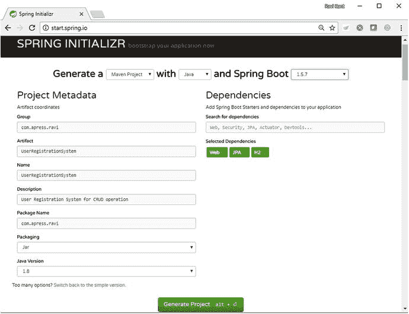

图 2-1.

使用 Spring Initializr 创建 UserRegistrationSystem


### 嵌入式数据库：H2

H2 是一个用 Java 编写的开源轻量级关系数据库管理系统。H2 数据库可以轻松嵌入到任何基于 Java 的应用程序中，并且可以方便地配置为内存数据库运行。H2 数据库不能用于生产环境开发，因为数据不会持久化到磁盘上。因此，该数据库主要用于开发和测试。H2 数据库支持 SQL 和 JDBC API，并具有强大的安全特性。

在 UserRegistrationSystem 应用程序中，你将使用 H2 来持久化数据。要在 Spring Boot 应用程序中使用 H2，你需要在 `pom.xml` 文件中包含一个构建依赖项。

当将 H2 用作内存数据库时，你无需提供任何数据库连接 URL 或用户名和密码。在部署和应用程序关闭期间，数据库的启动和停止将由 Spring Boot 负责处理。清单 2-2 显示了 UserRegistrationSystem 的 `pom.xml` 文件中 H2 的依赖信息。

```
com.h2database
h2
runtime

清单 2-2.
pom.xml 中的 H2 依赖项
```

### 领域实现：用户

图 2-2 展示了表示 UserRegistrationSystem 应用程序中 `Users` 领域对象的 UML 类图。

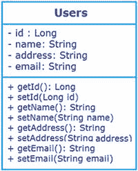

图 2-2.

用户领域对象

在 UserRegistrationSystem 项目中，你将在 `src/main/java` 文件夹下的 `com.apress.ravi.dto` 子包内创建一个名为 `UserDTO` 的数据传输对象（DTO）类，该类对应于 `Users` 领域的 `Object`。

DTO 对象仅包含数据和访问修饰符，不含逻辑；它用于在应用程序的不同层之间传输数据，以实现关注点分离。你可以使用 Java 持久化 API（JPA）注解来标注此类，这使得 `Users` 类能够使用 JPA 技术轻松地进行持久化和检索。对 JPA 的正式概述超出了本书的范围。清单 2-3 给出了 `UserDTO` 实体类的实现。

```
package com.apress.ravi.dto;
import javax.persistence.Column;
import javax.persistence.Entity;
import javax.persistence.GeneratedValue;
import javax.persistence.Id;
@Entity
@Table(name="Users")
public class UserDTO {
@Id
@GeneratedValue
@Column(name = "USER_ID")
private Long id;
@Column(name = "NAME")
private String name;
@Column(name = "ADDRESS")
private String address;
@Column(name = "EMAIL")
private String email;
// Getter 和 Setter 方法
}
清单 2-3.
UsersDTO 实体类
```

这里，`UserDTO` 类有四个属性，分别名为 `id`、`name`、`address` 和 `email`。`UserDTO` 使用了 `@Entity` 注解，使其成为一个 JPA 实体。该实体类使用了 `@Table` 注解来定义表名为 `Users`。

`UserDTO` 的 `id` 属性使用了 `@Id` 注解，使其成为主键。`id` 属性使用了 `@GeneratedValue` 注解，表示 `id` 值应自动生成。`id` 属性还使用了 `@Column` 注解，以指定字段或属性将要映射到的列的详细信息。其他三个属性（`name`、`address` 和 `email`）都使用了 `@Column` 注解。我在此省略了 getter 和 setter 方法，但在实际代码中，每个属性都应有对应的 getter 和 setter。

下一步是提供仓库或 DAO 实现。

### 仓库实现：UserJpaRepository

仓库或 DAO 抽象并封装了对数据源的所有访问。仓库包含一个管理数据源连接的接口，并提供一组用于检索、操作、删除和持久化数据的方法。最佳实践是为每个领域对象配备一个仓库。

为了消除编写任何仓库实现的需要，Spring Data 项目提供了 `JpaRepository` 接口，该接口在运行时自动生成其实现。清单 2-4 显示了支持 `JpaRepository` 所需在 Maven `pom.xml` 中的依赖信息。

```
org.springframework.boot
spring-boot-starter-data-jpa

清单 2-4.
pom.xml 中的 JPA 依赖项
```

你将通过扩展 Spring Data JPA 子项目的 `org.springframework.data.jpa.repository.JpaRepository` 接口来创建一个仓库接口，以将 `UserDTO` 领域对象持久化到关系数据库中。

你首先在 UserRegistrationSystem 应用程序的 `src/main/java` 文件夹下创建 `com.apress.ravi.repository` 包，从而开始仓库的实现。同时，你可以创建一个 `UserJpaRepository` 接口，如清单 2-5 所示。

```
package com.apress.ravi.repository;
import org.springframework.data.jpa.repository.JpaRepository;
import org.springframework.stereotype.Repository;
import com.apress.ravi.dto.UsersDTO;
@Repository
public interface UserJpaRepository extends JpaRepository {
UsersDTO findByName(String name);
}
清单 2-5.
com.apress.ravi.repository.UserJpaRepository.java 接口
```

如清单 2-5 所示，`UserJpaRepository` 接口扩展了 Spring Data 的 `JpaRepository`，后者将其可操作的领域对象类型和 `UserDTO` 领域对象标识符字段的类型（即 `UserDTO` 和 `Long`）作为其泛型参数 `T` 和 `ID`。`UserJpaRepository` 继承了 `JpaRepository` 所有用于处理 `UserDTO` 持久化的 CRUD 方法。

Spring Data JPA 允许开发者仅通过声明方法签名来定义其他查询方法。如前面的代码所示，你定义了一个名为 `findByName` 的自定义查找方法，该方法基本上创建了一个形式为 `select u from UserDTO u` 的 JPA 查询，其中 `u.name` 等于 `:name`。

Spring Data JPA 的好处在于开发者无需编写仓库接口的实现。当你运行应用程序时，Spring Data JPA 会在运行时创建实现。现在，让我们创建 REST 控制器类并实现 REST 端点。


### 构建 RESTful API

在开始实现 RESTful API 之前，你需要了解一些基本的 Spring 元素，这些元素将用于在 Spring 中实现 RESTful API。

*   `@RestController`：这是一个构造型注解，它本身被 [`@Controller`](https://docs.spring.io/spring/docs/current/javadoc-api/org/springframework/stereotype/Controller.html#annotation%20in%20org.springframework.stereotype) 和 [`@ResponseBody`](https://docs.spring.io/spring/docs/current/javadoc-api/org/springframework/web/bind/annotation/ResponseBody.html#annotation%20in%20org.springframework.web.bind.annotation) 注解，从而免去了在每个方法上添加 `@ResponseBody` 注解的需要。此注解用于定义 API 端点。该注解让 Spring 将结果渲染回调用者。要在 Spring 中构建 RESTful Web 服务，请使用 `@RestController` 注解创建一个控制器类来处理 HTTP 请求。

    ```
    @Target(value=TYPE)
    @Retention(value=RUNTIME)
    @Documented
    @Controller
    @ResponseBody
    public @interface RestController
    ```

*   `@RequestMapping`：此注解用于提供路由信息。Spring 中的 HTTP 请求会被映射到相应的处理方法。此注解可以应用于类级别，将 HTTP 请求映射到控制器类，也可以应用于方法级别，将 HTTP 请求映射到控制器处理方法。

    ```
    @Target(value={METHOD,TYPE})
    @Retention(value=RUNTIME)
    @Documented
    public @interface RequestMapping
    ```

*   `ResponseEntity`：此类扩展了 `HttpEntity`，用于在控制器方法中向响应添加 HTTP 状态。它可以包含 HTTP 状态码、标头和响应体。

    ```
    public class ResponseEntity
    extends HttpEntity
    ```

*   `@RequestBody`：此注解用于将方法参数绑定到传入 HTTP 请求的请求体。Spring 将使用 [`HttpMessageConverter`](https://docs.spring.io/spring/docs/current/javadoc-api/org/springframework/http/converter/HttpMessageConverter.html#interface%20in%20org.springframework.http.converter) 根据请求的内容类型将 Web 请求的请求体转换为领域对象。可以应用 `@valid` 注解来执行自动验证，这是可选的。

    ```
    @Target(value=PARAMETER)
    @Retention(value=RUNTIME)
    @Documented
    public @interface RequestBody
    ```

*   `@ResponseBody`：此注解用于将注解方法的返回值绑定到传出的 HTTP 响应体。Spring 将使用 `HttpMessageConverter` 根据请求 HTTP 标头的内容类型将返回值转换为 HTTP 响应体（通常返回 JSON 或 XML 等数据格式）。

    ```
    @Target(value={TYPE,METHOD})
    @Retention(value=RUNTIME)
    @Documented
    public @interface ResponseBody
    ```

*   `@PathVariable`：此注解用于将方法参数绑定到 URI 模板变量（即 `{}` 中的变量）。

    ```
    @Target(value=PARAMETER)
    @Retention(value=RUNTIME)
    @Documented
    public @interface PathVariable
    ```

*   `MediaType`：这是 `MimeType` 的子类。在使用 `@RequestMapping` 注解时，你还可以指定控制器方法要生成或消费的 `MediaType`。

    ```
    public class MediaType
    extends MimeType
    implements Serializable
    ```

#### 创建 RESTful 控制器：UserRegistrationRestController

你将创建一个 Spring MVC 控制器并实现 REST API 端点。让我们在 `src/main/java` 文件夹下的 `com.apress.ravi.Rest` 包中创建 `UserRegistrationRestController` 类。该控制器类提供了所有必要的端点来检索和操作用户。清单 2-6 展示了 `UserRegistrationRestController` 类所需的代码更改。

```
package com.apress.ravi.Rest;
import org.slf4j.Logger;
import org.slf4j.LoggerFactory;
import org.springframework.beans.factory.annotation.Autowired;
import org.springframework.web.bind.annotation.RequestMapping;
import org.springframework.web.bind.annotation.RestController;
import com.apress.ravi.repository.UserJpaRepository;
@RestController
@RequestMapping("/api/user")
public class UserRegistrationRestController {
public static final Logger logger =
LoggerFactory.getLogger(UserRegistrationRestController.class);
private UserJpaRepository userJpaRepository;
@Autowired
public void setUserJpaRepository(UserJpaRepository userJpaRepository) {
this.userJpaRepository = userJpaRepository;
}
}
清单 2-6.
UserRegistrationRestController 类
```

在清单 2-6 中，你使用 `@RestController` 注解标注了 `UserRegistrationRestController` 类，并定义了一个新的 `@RequestMapping` 将 URI `/api/user` 映射到整个类，这意味着在 `/api/user` URI 上接收到的 HTTP 请求由 `UserRegistrationRestController` 类处理。你使用了 `@Autowired` 注解将 `autowireUserJpaRepository` 自动装配到 RESTful 控制器。

让我们在控制器类中定义不同的端点来访问和操作 `UserDTO`。你将使用新的注解 `@GetMapping`、`@PostMapping`、`@PutMapping` 和 `@DeleteMapping`，而不是标准的 `@RequestMapping`，这些注解自 Spring MVC 4.3 起可用，并且是定义 REST 端点的标准方式。这些新注解充当了 `@RequestMapping` 的包装器，简化了常见 HTTP 方法的映射。

#### @GetMapping：检索所有用户

这是一个组合注解，是 `@RequestMapping(value="/", method = RequestMethod.GET)` 的快捷方式。对 `/api/user/` 端点的 `GET` 请求返回 UserRegistrationSystem 应用程序中可用的用户列表。清单 2-7 展示了实现此功能所需的代码。

```
@GetMapping("/")
public ResponseEntity> listAllUsers() {
List users = userJpaRepository.findAll();
return new ResponseEntity>(users, HttpStatus.OK);
}
清单 2-7.
用于检索所有用户的 GET 动词实现
```

`listAllUsers` 方法返回包含 HTTP 响应的 `ResponseEntity`。此方法使用 `UserJpaRepository` 读取所有用户。然后，你通过调用其构造函数创建了一个 `ResponseEntity` 实例，该构造函数接受两个参数：`UserDTO` 是成为响应体一部分的数据，而 `HttpStatus.OK` 状态值是成为响应状态码的数据。

让我们通过从 STS 将 UserRegistrationSystem 应用程序作为 Spring Boot 应用程序运行并启动 Postman 应用程序来测试第一个端点。输入 URL `http://localhost:8080/api/user/` 并点击发送，如图 2-3 所示。

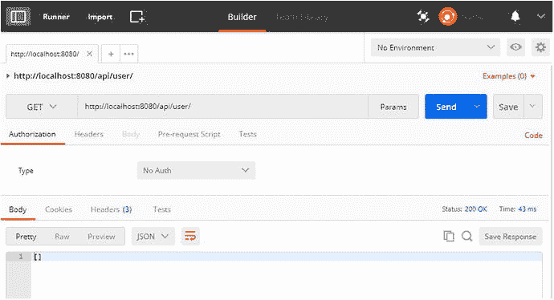

图 2-3.

用于检索所有用户的 GET 动词实现

由于尚未创建任何用户，这将导致一个空集合。因此，下一个任务是通过实现 `POST` 动词功能向 UserRegistrationSystem 添加一个用户。


#### @PostMapping：创建新用户

`@PostMapping` 注解是一个组合注解，是 `@RequestMapping(value="/", method=RequestMethod.POST)` 的快捷方式。对 `/api/user/` 端点的 `POST` 请求会使用请求的正文体创建一个新用户。清单 2-8 展示了实现 `POST` 动词功能所需的代码。

```
@PostMapping(value = "/", consumes = MediaType.APPLICATION_JSON_VALUE)
public ResponseEntity createUser(@RequestBody final UsersDTO user) {
userJpaRepository.save(user);
return new ResponseEntity(user, HttpStatus.CREATED);
}
清单 2-8.
创建新用户的 POST 动词实现
```

`createUser` 方法接受一个类型为 `UsersDTO` 的参数，该参数带有 `@RequestBody` 注解，这要求 Spring 将整个请求体转换为 `UserDTO` 的实例。

你使用 `consumes = MediaType.APPLICATION_JSON_VALUE` 配置了内容协商，这表明该方法仅接受来自请求体的 JSON 数据。`produces` 和 `consumes` 属性用于[缩小映射类型](http://docs.spring.io/spring/docs/3.2.x/spring-framework-reference/html/mvc.html#mvc-ann-requestmapping-consumes)。你可以省略此配置，因为 `@RequestBody` 会使用 `HttpMessageConverters` 来确定要使用的正确转换器，并将 HTTP 请求的正文转换为领域对象。Spring BOOT 中的消息转换器支持 JSON 和 XML 资源表示形式。

在方法内部，你将 `UserDTO` 的持久化操作委托给了 `userJpaRepository` 的 save 方法。然后，你创建了一个新的 `ResponseEntity`，其中包含已创建的用户（`UserDTO`）和 HTTP 状态码 `HttpStatus.CREATED`（201），并将其返回。

要测试这个新添加的端点，请启动 UserRegistrationSystem 应用程序。如果 UserRegistrationSystem 应用程序已在运行，则需要终止进程并重新启动。启动 Postman 并选择请求类型为 POST。点击 Body 并选择 raw；然后从下拉菜单中选择 JSON (application/json) 作为 Content-Type 标头。输入一些信息并点击 Send。清单 2-9 展示了请求体中使用的 JSON。

```
{
"name":"Ravi Kant Soni",
"address":"Lashkariganj, Sasaram, Rohtas, Bihar, pin-821115",
"email":"ravikantsoni.author@gmail.com"
}
清单 2-9.
用于创建新用户的请求体 JSON

请求完成后，你将看到一条 201 `Created` 消息，如图 2-4 所示。

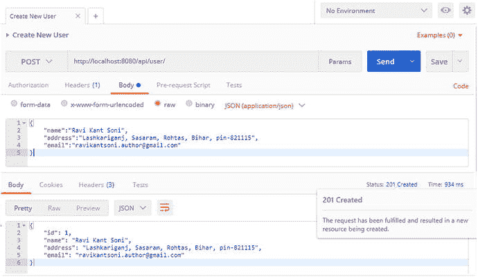

图 2-4.
创建新用户的 POST 动词实现

#### @GetMapping ("/ {id}")：检索单个用户

下一步是实现一个用于访问单个用户的端点。清单 2-10 展示了所需的代码。

```
@GetMapping("/{id}")
public ResponseEntity getUserById(@PathVariable("id") final Long id) {
UsersDTO user = userJpaRepository.findById(id);
return new ResponseEntity(user, HttpStatus.OK);
}
清单 2-10.
检索单个用户的 GET 动词实现

如清单 2-10 所示，你使用 `@GetMapping("/{id}")` 注解标注了 `getUserById` 方法。URI 中的占位符 `{id}` 与 `@PathVariable` 注解一起，允许 Spring 提取 `id` 参数值。在方法内部，你使用了 `UserJpaRepository` 的 `findById` 方法来读取 `UserDTO` 对象，并将其作为 `ResponseEntity` 的一部分连同 HTTP 状态码 `HttpStatus.OK`（200）一起返回。

要测试此功能，请启动 Postman 并重新启动 UserRegistrationSystem 应用程序。输入 URL `http://localhost:8080/api/user/1` 并点击 Send，如图 2-5 所示。

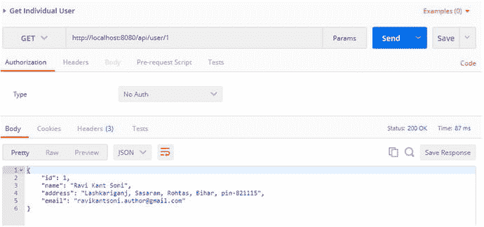

图 2-5.
检索单个用户

类似地，你可以实现用于执行更新和删除功能的端点。

#### @PutMapping：更新用户

此注解是一个组合注解，是 `@RequestMapping(method = RequestMethod.PUT)` 的快捷方式。它要求将包含的实体视为请求 URI 上现有资源的修改版本。清单 2-11 展示了所需的代码。

```
@PutMapping(value = "/{id}", consumes = MediaType.APPLICATION_JSON_VALUE)
public ResponseEntity updateUser(
@PathVariable("id") final Long id, @RequestBody UsersDTO user) {
// 根据 id 获取用户并设置为 UserDTO 类型的 currentUser 对象
UsersDTO currentUser = userJpaRepository.findById(id);
// 使用 user 对象数据更新 currentUser 对象数据
currentUser.setName(user.getName());
currentUser.setAddress(user.getAddress());
currentUser.setEmail(user.getEmail());
// 保存 currentUser 对象
userJpaRepository.saveAndFlush(currentUser);
// 返回 ResponseEntity 对象
return new ResponseEntity(currentUser, HttpStatus.OK);
}
清单 2-11.
更新用户的 PUT 动词实现

在清单 2-11 中，你通过将 `pathvariable` 中的 `id` 作为参数传递给 `UserJpaRepository` 的 `findById` 方法，检索到了现有的 `UserDTO` 对象作为 `currentUser`。然后，你根据 `requestbody` 中的用户信息更新了 `currentUser` 的属性数据。

你还调用了 `UserJpaRepository` 的 `saveAndFlush` 方法，并传入 `currentUser`，该方法会保存 `UserDTO` 并立即刷新更改。最后，你返回了 `ResponseEntity`，其中包含 `currentUser` 作为响应体，以及 `HttpStatus.OK` 作为 HTTP 状态码。

让我们通过启动 Postman 并重新启动应用程序来测试此端点，如图 2-6 所示。

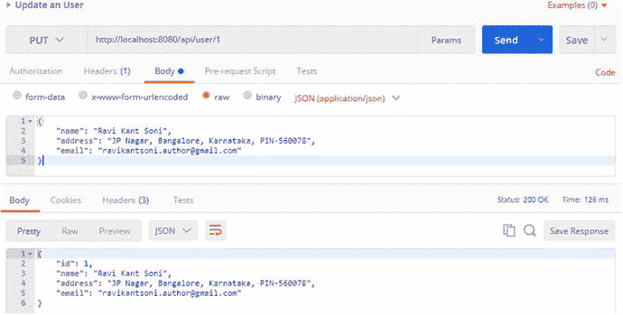

图 2-6.
更新用户的 PUT 动词实现

现在，让我们实现删除功能，以从 UserRegistrationSystem 应用程序中删除现有用户。

#### @DeleteMapping：删除用户

这是一个组合注解，是 `@RequestMapping(method = RequestMethod.DELETE)` 的快捷方式。它要求应用程序删除由 `Request-URI` 标识的资源。清单 2-12 展示了实现此功能所需的代码。

```
@DeleteMapping("/{id}")
public ResponseEntity deleteUser(@PathVariable("id") final Long id) {
userJpaRepository.delete(id);
return new ResponseEntity(HttpStatus.NO_CONTENT);
}
清单 2-12.
删除用户的 DELETE 动词实现

在清单 2-12 中，方法内部你调用了 `UserJpaRepository` 的 delete 方法，并传入 `pathvariable` 中的 `id` 作为参数。然后，你返回了带有 HTTP 状态码 `HttpStatus.NO_CONTENT`（204）的 `ResponseEntity`。

重新启动 UserRegistrationSystem 应用程序并启动 Postman 来测试此功能，如图 2-7 所示。

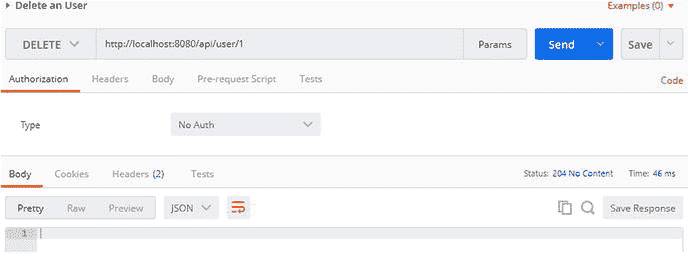

图 2-7.
删除用户的 DELETE 动词实现

到目前为止，你已经了解了如何实现用于执行 CRUD 操作的 RESTful API。接下来，你将学习 RESTful API 中的错误处理。

## 处理 RESTful API 中的错误

尽管开发人员会注意处理错误，但以合适的格式设计错误响应仍然很重要，这能让使用 RESTful API 的客户端理解问题，并帮助其正确使用 API。错误处理是 RESTful API 开发中最重要的问题之一。在现实世界中，RESTful API 在各种场景下被使用，很难预测 API 被使用的所有场景。


### UserRegistrationSystem 错误处理

考虑 UserRegistrationSystem 应用程序中的一个场景：客户端尝试获取系统中不存在的用户信息。图 2-8 展示了针对 ID 为 50 的不存在用户发送的 Postman `GET` 请求。

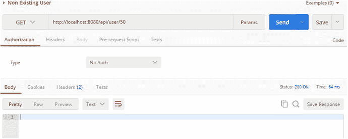

图 2-8.

针对 ID 为 50 的不存在用户发送的 GET 请求

如图 2-8 所示，RESTful API 返回了空响应体，因为对于不存在的用户 ID 50，`UserJpaRepository` 的 `findOne` 方法向 `UserRegistrationRestController` 返回了 `null`。RESTful API 返回了 HTTP 状态码 200 `OK`，而不是应该指示请求用户不存在的状态码 404。

为了实现此行为，你需要在 `com.apress.ravi.Rest.UserRegistrationRestController` 的 `getUserById` 方法中验证用户 `id` 属性。对于不存在的用户，返回包含 `CustomErrorType` 和状态码 `HttpStatus.NOT_FOUND` (404) 的 `ResponseEntity`。清单 2-13 展示了处理错误所需的代码更新。

```
@GetMapping("/{id}")
public ResponseEntity getUserById(@PathVariable("id") final Long id) {
UsersDTO user = userJpaRepository.findById(id);
if (user == null) {
return new ResponseEntity(
new CustomErrorType("User with id "
+ id + " not found"), HttpStatus.NOT_FOUND);
}
return new ResponseEntity(user, HttpStatus.OK);
}
清单 2-13.
针对不存在用户的错误处理
```

在清单 2-13 中，你通过在其构造函数中传递自定义错误消息（“User with id 50 not found”）创建了一个 `CustomErrorType` 类的实例。

#### 自定义错误响应

现在，让我们在 `src/main/java` 下的 `com.apress.ravi.Exception` 包中创建 `CustomErrorType` 类。清单 2-14 展示了 `CustomErrorType` 类所需的代码实现。

```
package com.apress.ravi.Exception;
import com.apress.ravi.dto.UsersDTO;
public class CustomErrorType extends UsersDTO {
private String errorMessage;
public CustomErrorType(final String errorMessage){
this.errorMessage = errorMessage;
}
@Override
public String getErrorMessage() {
return errorMessage;
}
}
清单 2-14.
CustomErrorType 类
```

在清单 2-14 中，`CustomErrorType` 类将 `errorMessage` 声明为成员变量，并提供了相应的 getter 方法。此 `errorMessage` 在该类的构造函数中被初始化。

在 UserRegistrationSystem 应用程序中进行此修改后，重新启动应用程序并启动 Postman，为 ID 为 50 的用户发送 `GET` 请求。`UserRegistrationRestController` 返回正确状态码和错误消息的结果如图 2-9 所示。

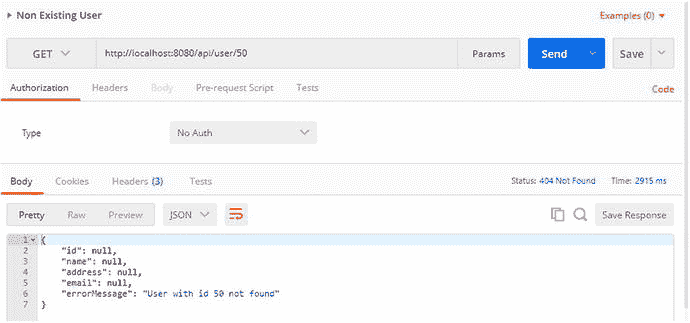

图 2-9.

针对不存在用户的错误消息和状态码

在 UserRegistrationSystem 应用程序中，对于涉及 HTTP 方法（如 `GET`、`PUT` 和 `DELETE`）的 CRUD 操作的其他方法，也需要执行相同的用户 ID 验证，以返回正确的状态码和消息。清单 2-15 展示了更新后的 `UserRegistrationRestController` 类，其中包含了修改后的 `listAllUsers`、`getUserById`、`createUser`、`updateUser` 和 `deleteUser` 方法。

```
// method to get list of users
@GetMapping("/")
public ResponseEntity> listAllUsers() {
List users = userJpaRepository.findAll();
if (users.isEmpty()) {
return new ResponseEntity>(HttpStatus.NO_CONTENT);
}
return new ResponseEntity>(users, HttpStatus.OK);
}
// method to get user by id
@GetMapping("/{id}")
public ResponseEntity getUserById(@PathVariable("id") final Long id) {
UsersDTO user = userJpaRepository.findById(id);
if (user == null) {
return new ResponseEntity(
new CustomErrorType("User with id "
+ id + " not found"), HttpStatus.NOT_FOUND);
}
return new ResponseEntity(user, HttpStatus.OK);
}
// method to create an user
@PostMapping(value = "/", consumes = MediaType.APPLICATION_JSON_VALUE)
public ResponseEntity createUser(@RequestBody final UsersDTO user) {
if (userJpaRepository.findByName(user.getName()) != null) {
return new ResponseEntity(new CustomErrorType(
"Unable to create new user. A User with name "
+ user.getName() + " already exist."),HttpStatus.CONFLICT);
}
userJpaRepository.save(user);
return new ResponseEntity(user, HttpStatus.CREATED);
}
// method to update an existing user
@PutMapping(value = "/{id}", consumes = MediaType.APPLICATION_JSON_VALUE)
public ResponseEntity updateUser(
@PathVariable("id") final Long id, @RequestBody UsersDTO user) {
UsersDTO currentUser = userJpaRepository.findById(id);
if (currentUser == null) {
return new ResponseEntity(
new CustomErrorType("Unable to upate. User with id "
+ id + " not found."), HttpStatus.NOT_FOUND);
}
currentUser.setName(user.getName());
currentUser.setAddress(user.getAddress());
currentUser.setEmail(user.getEmail());
userJpaRepository.saveAndFlush(currentUser);
return new ResponseEntity(currentUser, HttpStatus.OK);
}
// delete an existing user
@DeleteMapping("/{id}")
public ResponseEntity deleteUser(@PathVariable("id") final Long id) {
UsersDTO user = userJpaRepository.findById(id);
if (user == null) {
return new ResponseEntity(
new CustomErrorType("Unable to delete. User with id "
+ id + " not found."), HttpStatus.NOT_FOUND);
}
userJpaRepository.delete(id);
return new ResponseEntity(
new CustomErrorType("Deleted User with id "
+ id + "."), HttpStatus.NO_CONTENT);
}
清单 2-15.
更新后的 UserRegistrationRestController 类
```

### 验证请求体

当需要验证包含 JSON 数据的请求体（针对某些复杂对象）时，你需要做更多工作。考虑一个场景：客户端发起一个新用户创建请求，但请求体中缺少数据，例如请求体不包含地址。

Spring MVC 支持使用 JSR-303 Bean 验证约束进行输入验证。


#### 添加 Bean 验证注解

清单 2-16 展示了 `UsersDTO` 实体类中的更新内容。你使用 `@NotNull` 和 `@Email` 等验证约束来注解 `UsersDTO` 对象的属性。你可以使用 Hibernate Validator，这是一个流行的 JSR 303 和 JSR 349 实现框架。

```
package com.apress.ravi.dto;
import javax.persistence.Column;
import javax.persistence.Entity;
import javax.persistence.GeneratedValue;
import javax.persistence.Id;
import org.hibernate.validator.constraints.Email;
import org.hibernate.validator.constraints.Length;
import org.hibernate.validator.constraints.NotEmpty;
@Entity
public class UsersDTO {
@Id
@GeneratedValue
@Column(name = "USER_ID")
private Long id;
@NotEmpty
@Length(max = 50)
@Column(name = "NAME")
private String name;
@NotEmpty
@Length(max = 150)
@Column(name = "ADDRESS")
private String address;
@Email
@NotEmpty
@Length(max = 80)
@Column(name = "EMAIL")
private String email;
// Getter & Setter method
}
清单 2-16.
使用 JSR 303 注解的 UsersDTO 类
```

如清单 2-16 所示，你已对 `UsersDTO` 类进行了注解，为 UserRegistrationSystem 应用程序添加了输入验证功能。表 2-4 展示了 Bean 验证 API 提供的一些验证约束。

表 2-4.

Bean 验证 API 提供的验证约束

| 约束 | 描述 |
| --- | --- |
| `NotNull` | 被注解的成员变量不能为 null。 |
| `NotEmpty` | 被注解的成员变量（字符串、集合、映射或数组）不能为 null 或空。 |
| `Size` | 被注解的成员变量（字符串、集合、映射或数组）的大小必须在指定边界之间（包含边界）。 |
| `Length` | 执行更新操作。 |
| `Email` | 被注解的成员变量（字符串）必须是一个格式正确的有效电子邮件地址。 |
| `Min` | 被注解的成员变量（`BigDecimal`、`BigInteger`、`Byte`、`Short`、`int`、`long` 及其包装类）必须是一个数值，其值必须大于或等于指定的最小值。 |
| `Max` | 被注解的成员变量（`BigDecimal`、`BigInteger`、`Byte`、`Short`、`int`、`long` 及其包装类）必须是一个数值，其值必须小于或等于指定的最小值。 |

由于你希望确保每个用户都有姓名、地址和电子邮件，因此你使用 `@NotEmpty` 注解对这些字段进行了标注，这确保了输入字符串不为 null 且长度大于零。你还使用 `@Length` 注解和最大值对这些字段进行了标注，以确保 `String` 长度不超过此最大长度值。电子邮件字段使用 `@Email` 注解进行标注，以验证输入字符串是否为有效的电子邮件地址。

下一步是在 `UserRegistrationRestController` 类的 `createUser` 方法的 `UsersDTO` 参数上添加 `@Valid` 注解。

#### UserRegistrationRestController 方法参数中 @RequestBody 上的 @Valid

在 `UserRegistrationRestController` 端点的 `createUser` 方法的 `UsersDTO` 参数上添加 `@Valid` 注解，如清单 2-17 所示。

```
@PostMapping(value = "/", consumes = MediaType.APPLICATION_JSON_VALUE)
public ResponseEntity createUser(
@Valid @RequestBody final UsersDTO user) {
logger.info("Creating User : {}", user);
if (userJpaRepository.findByName(user.getName()) != null) {
logger.error("Unable to create. A User with name {} already exist",
user.getName());
return new ResponseEntity(
new CustomErrorType(
"Unable to create new user. A User with name "
+ user.getName() + " already exist."),                                                 HttpStatus.CONFLICT);
}
userJpaRepository.save(user);
return new ResponseEntity(user, HttpStatus.CREATED);
}
清单 2-17.
使用 @Valid 注解的 UserRegistrationRestController
```

如清单 2-17 所示，`@Valid` 注解将指示 Spring 在将传入的 `POST` 参数与对象绑定后执行请求数据验证。

`@RequestBody` 方法参数可以使用 `@Valid` 进行注解，以调用自动验证，类似于对 `@ModelAttribute` 方法参数的支持。由此产生的 `MethodArgumentNotValidException` 会在 `DefaultHandlerExceptionResolver` 中处理，并导致返回 400 响应码。

来源

参见 [`http://docs.spring.io/spring/docs/3.2.18.RELEASE/spring-framework-reference/htmlsingle/#new-in-3.1-mvc-valid-requestbody`](http://docs.spring.io/spring/docs/3.2.18.RELEASE/spring-framework-reference/htmlsingle/#new-in-3.1-mvc-valid-requestbody) 。

通过使用 `@Valid` 注解，Spring 将验证委托给已注册的验证器。在运行 UserRegistrationSystem 应用程序并发送缺少地址的 Postman 请求时，如图 2-10 所示，错误代码 HTTP 状态 400（`Bad Request`）表示操作失败。

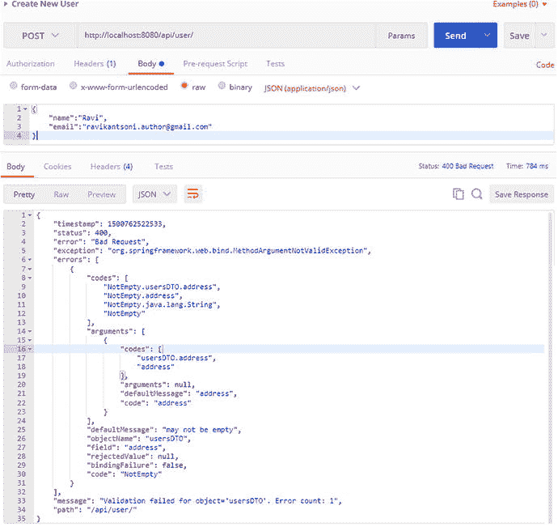

图 2-10.

缺少地址导致 MethodArgumentNotValidException

重复发送缺少问题的 Postman 请求，如你在 [图 5-7](https://www.safaribooksonline.com/library/view/spring-rest/9781484208236/9781484208243_Ch05.xhtml#Fig7) 中所做的那样，你将看到操作失败并显示以下信息，如 [图 5-8](https://www.safaribooksonline.com/library/view/spring-rest/9781484208236/9781484208243_Ch05.xhtml#Fig8) 所示：

*   状态：400
*   错误：Bad request
*   异常：`org.springframework.web.bind.MethodArgumentNotValidException`

从这个错误响应中，你可以了解到 Spring MVC 验证了输入数据，并在未找到必需的地址字段时抛出了 `MethodArgumentNotValidException` 异常。

尽管 Spring Boot 返回的错误消息有所帮助，但对于使用 RESTful API 的客户端来说，信息量还不够大。因此，你应该提供更具信息量的错误消息，如下面 JSON 格式所示：

```
{
"error_title" : "",
"error_status" : "",
"error_detail" : "",
"error_timestamp" : "",
"error_path" : "",
"error_developerMessage"": "",
"errors": {
"field1" : [ {
"field" : ""
"message" : ""
"type" : ""
},
"field2" : [ {
"field" : ""
"message" : ""
"type" : ""
}
}
}
```

为了表示这种用于错误消息的 JSON 格式，你需要拦截 `MethodArgumentNotValidException` 并返回适当的错误消息。在设计 UserRegistrationSystem 错误响应时，你提出了一个错误对象，它可以包含一个无序的键值错误实例集合，其中 `key` 包含字段名称，`values` 包含字段的错误信息（包括字段、消息和类型），如前面的 JSON 数据所示。

牢记前面的 JSON 错误消息设计，让我们创建类来返回一个包含适当 JSON 格式错误消息的实例。


#### ValidationError 与更新后的 ErrorDetail 类

为了在 UserRegistrationSystem 应用程序中添加之前的验证错误功能，你需要创建两个类。

*   `com.apress.ravi.Exception.FieldValidationError`
*   `com.apress.ravi.Exception.FieldValidationErrorDetails`

清单 2-18 展示了 `FieldValidationError` 类。

```
import java.awt.TrayIcon.MessageType;
public class FieldValidationError {
private String filed;
private String message;
private MessageType type;
// Getter & Setter
}
Listing 2-18.
FieldValidationError Class
```

`FieldValidationError` 类有三个属性：字段（`String`）、消息（`String`）和消息类型（`MessageType`）。

`MessageType` 是一个枚举，包含可能的消息类型，如清单 2-19 所示。

```
public enum MessageType {
SUCCESS, INFO, WARNING, ERROR
}
Listing 2-19.
Enumeration MessageType
```

`FieldValidationErrorDetails` 类的实例将被创建，用于生成预期的错误 JSON 格式的错误响应，如清单 2-20 所示。

```
package com.apress.ravi.Exception;
import java.util.HashMap;
import java.util.List;
import java.util.Map;
public class FieldValidationErrorDetails {
private String error_title;
private int error_status;
private String error_detail;
private long error_timeStamp;
private String error_path;
private String error_developer_Message;
private Map<String, List<FieldValidationError>> errors =
new HashMap<String, List<FieldValidationError>>();
// Getter & Setter
}
Listing 2-20.
FieldValidationErrorDetails Class
```

`FieldValidationErrorDetails` 类中的 `errors` 字段被定义为一个 `Map`，它接受 `String` 实例作为键，`FieldValidationError` 实例的列表作为值。

下一步是创建一个类来拦截并处理 `MethodArgumentNotValidException` 异常。

#### 使用 @ControllerAdvice 注解处理异常

`@ControllerAdvice` 注解用于为使用 `@ExceptionHandler` 注解标注的异常处理方法定义一个全局异常处理器。

使用 `@ControllerAdvice` 注解标注的类将适用于应用程序中的所有控制器。因此，该应用程序中任何控制器类抛出的任何异常都将由这个被注解的类处理，该类中有一个使用 `@ExceptionHandler` 注解标注的方法。只有当任何控制器类抛出的异常与配置的 `Exception` 类匹配时，此方法才会被执行。

那么，让我们在 `src/main/java` 文件夹下的 `com.apress.ravi.Exception` 包中创建控制器通知类 `RestValidationHandler`，该类用于拦截异常，如清单 2-21 所示。

```
package com.apress.ravi.Exception;
import java.awt.TrayIcon.MessageType;
import java.util.ArrayList;
import java.util.Date;
import java.util.List;
import javax.servlet.http.HttpServletRequest;
import org.springframework.http.HttpStatus;
import org.springframework.http.ResponseEntity;
import org.springframework.validation.BindingResult;
import org.springframework.validation.FieldError;
import org.springframework.web.bind.MethodArgumentNotValidException;
import org.springframework.web.bind.annotation.ControllerAdvice;
import org.springframework.web.bind.annotation.ExceptionHandler;
import org.springframework.web.bind.annotation.ResponseStatus;
@ControllerAdvice
public class RestValidationHandler {
// method to handle validation error
@ExceptionHandler(MethodArgumentNotValidException.class)
@ResponseStatus(HttpStatus.BAD_REQUEST)
public ResponseEntity<FieldValidationErrorDetails> handleValidationError(
MethodArgumentNotValidException mNotValidException,
HttpServletRequest request) {
FieldValidationErrorDetails fErrorDetails =
new FieldValidationErrorDetails();
fErrorDetails.setError_timeStamp(new Date().getTime());
fErrorDetails.setError_status(HttpStatus.BAD_REQUEST.value());
fErrorDetails.setError_title("Field Validation Error");
fErrorDetails.setError_detail("Inut Field Validation Failed");
fErrorDetails.setError_developer_Message(
mNotValidException.getClass().getName());
fErrorDetails.setError_path(request.getRequestURI());
BindingResult result = mNotValidException.getBindingResult();
List<FieldError> fieldErrors = result.getFieldErrors();
for (FieldError error : fieldErrors) {
FieldValidationError fError = processFieldError(error);
List<FieldValidationError> fValidationErrorsList =
fErrorDetails.getErrors().get(error.getField());
if (fValidationErrorsList == null) {
fValidationErrorsList =
new ArrayList<FieldValidationError>();
}
fValidationErrorsList.add(fError);
fErrorDetails.getErrors().put(
error.getField(), fValidationErrorsList);
}
return new ResponseEntity<FieldValidationErrorDetails>(
fErrorDetails, HttpStatus.BAD_REQUEST);
}
// method to process field error
private FieldValidationError processFieldError(final FieldError error) {
FieldValidationError fieldValidationError =
new FieldValidationError();
if (error != null) {
fieldValidationError.setFiled(error.getField());
fieldValidationError.setType(MessageType.ERROR);
fieldValidationError.setMessage(error.getDefaultMessage());
}
return fieldValidationError;
}
}
Listing 2-21.
Controller Advice Class to handleValidationError
```

如清单 2-21 所示，`RestValidationHandler` 使用了来自 `org.springframework.web.bind.annotation` 包的 `@ControllerAdvice` 注解。该类定义了一个名为 `handleValidationError` 的全局异常处理方法，该方法带有 `@ExceptionHandler(MethodArgumentNotValidException.class)` 注解，用于拦截由 UserRegistrationSystem 应用程序中任何控制器类抛出的 `MethodArgumentNotValidException` 类型的异常。

`handlerValidationError` 方法的实现首先创建了一个 `FieldValidationErrorDetails` 实例，并通过调用不同字段的 setter 方法为其填充适当的信息。然后，你使用传入的异常参数 `mNotValidException` 来获取字段错误列表，并遍历该列表以获取错误信息。接着，你为每个字段错误创建一个 `FieldValidationError` 实例，并用代码和错误信息填充它。

有了这个实现，让我们重启 UserRegistrationSystem 应用程序，并从 Postman 提交一个缺少地址的用户。这个缺少地址的 `POST` 数据请求将导致返回状态码 400 以及自定义的错误响应，如图 2-11 所示。

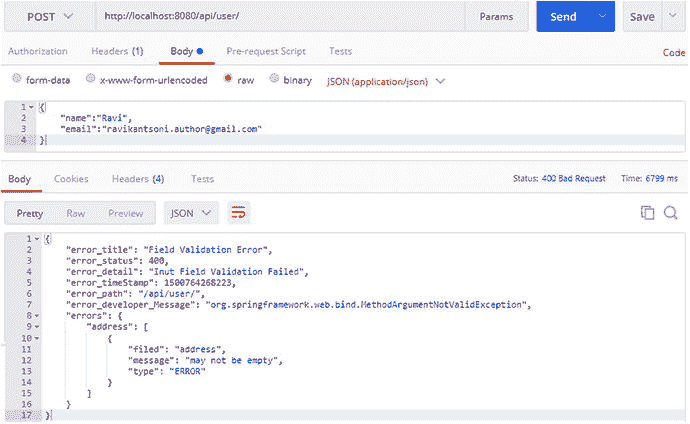

图 2-11.

创建缺少地址的用户时返回的自定义错误消息

#### 外部化错误消息

到目前为止，你在输入数据验证方面取得了良好进展，客户端能够收到描述性的错误消息，这有助于客户端在消费 API 时排查问题并从这些错误中恢复。

尽管你在上一节中看到的错误消息是描述性的，但 API 开发者可以通过从外部的 `messages.properties` 文件中提取此消息，使其更具描述性。这种 properties 文件方法允许 API 开发者轻松地替换消息，而无需修改代码。它还支持国际化/本地化。

下一步是读取 properties 文件，以便在创建 `ValidationError` 实例时可以使用该文件中的属性。为了实现该功能，你必须在应用程序配置类中配置 `ReloadableResourceBundleMessageSource`。


##### 创建 ReloadableResourceBundleMessageSource Bean：messageSource

现在，我们在 `src/main/java` 文件夹下 `com.apress.ravi` 包内的 `UserRegistrationConfiguration` 类中创建一个 `ReloadableResourceBundleMessageSource` bean。清单 2-22 展示了必要的代码修改。

```
package com.apress.ravi;
import org.springframework.context.annotation.Bean;
import org.springframework.context.annotation.Configuration;
import org.springframework.context.support.ReloadableResourceBundleMessageSource;
@Configuration
public class UserRegistrationConfiguration {
@Bean(name = "messageSource")
public ReloadableResourceBundleMessageSource messageSource() {
ReloadableResourceBundleMessageSource messageBundle =
new ReloadableResourceBundleMessageSource();
messageBundle.setBasename("classpath:messages/messages");
messageBundle.setDefaultEncoding("UTF-8");
return messageBundle;
}
}
清单 2-22.
ReloadableResourceBundleMessageSource Bean
```

在清单 2-22 中，你使用 `@Configuration` 注解标注了 `UserRegistrationConfiguration` 类。Bean 的名称通过 `@Bean(name = "messageSource")` 定义为 `messageSource`。

`@Configuration` 注解是一个元注解，表明该配置类可以包含一个或多个 `@Bean` 方法，用于生成可由 Spring 容器管理的 Bean 定义。这个 Bean 将允许你在不重启应用程序的情况下修改消息的属性文件。

`messageSource` 方法配置了一个 `ReloadableResourceBundleMessageSource`，以支持从属性文件中读取消息。`ReloadableResourceBundleMessageSource` Bean 是一种 `MessageSource`，它加载消息的属性文件，并从属性文件中解析消息键。

要设置基础名称，`setBaseName` 方法接受一个参数 `classpath:messages/messages`（即属性文件的路径）。你设置了消息源文件的默认编码为 UTF-8。Spring 将在 `src/main/resources/messages` 文件夹中查找名为 `messages.properties` 的属性文件。

##### 创建属性文件

现在，在 `src/main/resources/messages` 文件夹下创建一个 `messages.properties` 文件，并添加以下消息：

```
error.name.empty=姓名字段为必填项
error.name.length=姓名应限制在 50 个字符以内
error.address.empty=地址字段为必填项
error.address.length=地址应限制在 150 个字符以内
error.email.empty=邮箱字段为必填项
error.email.email=邮箱格式应正确
error.email.length=邮箱应限制在 80 个字符以内
```

这些消息遵循每个消息键的特定模式，如下所示：

```
error.字段名.验证类型
```

##### 使用 message 属性的 Bean 验证注解

现在，我们使用带有 `message` 属性的 JSR-303 注解进行 Bean 验证。`message` 属性用于设置当注解定义的约束未满足时显示的自定义错误消息。清单 2-23 展示了必要的代码修改。

这个 `message` 属性将通过上一节定义的 `ReloadableResourceBundleMessageSource` Bean，从 `messages.properties` 文件中获取匹配消息键的消息值。

```
package com.apress.ravi.dto;
import javax.persistence.Column;
import javax.persistence.Entity;
import javax.persistence.GeneratedValue;
import javax.persistence.Id;
import org.hibernate.validator.constraints.Email;
import org.hibernate.validator.constraints.Length;
import org.hibernate.validator.constraints.NotEmpty;
@Entity
public class UsersDTO {
@Id
@GeneratedValue
@Column(name = "USER_ID")
private Long id;
@NotEmpty(message = "error.name.empty")
@Length(max = 50, message = "error.name.length")
@Column(name = "NAME")
private String name;
@NotEmpty(message = "error.address.empty")
@Length(max = 150, message = "error.address.length")
@Column(name = "ADDRESS")
private String address;
@Email(message = "error.email.email")
@NotEmpty(message = "error.email.empty")
@Length(max = 80, message = "error.email.length")
@Column(name = "EMAIL")
private String email;
// Getter & Setter 方法
}
清单 2-23.
使用 message 属性的 Bean 验证注解
```

到目前为止，你已经创建了 `ReloadableResourceBundleMessageSource` Bean，在 `messages.properties` 文件中定义了消息，并使用带有 `message` 属性的 Bean 验证注解标注了实体类。

下一步是从属性文件中读取消息，并在创建 `FieldValidationErrorinstance` 时使用它们。


##### 从属性文件读取消息

要读取属性文件，请在`RestValidationHandler`类的构造函数中通过`@Autowired`注解注入`MessageSource`参数。清单 2-24 展示了`RestValidationHandler`类中`handleValidationError`方法的更新后源代码。

```
package com.apress.ravi.Exception;
import java.awt.TrayIcon.MessageType;
import java.util.ArrayList;
import java.util.Date;
import java.util.List;
import javax.servlet.http.HttpServletRequest;
import org.springframework.beans.factory.annotation.Autowired;
import org.springframework.context.MessageSource;
import org.springframework.http.HttpStatus;
import org.springframework.http.ResponseEntity;
import org.springframework.validation.BindingResult;
import org.springframework.validation.FieldError;
import org.springframework.web.bind.MethodArgumentNotValidException;
import org.springframework.web.bind.annotation.ControllerAdvice;
import org.springframework.web.bind.annotation.ExceptionHandler;
import org.springframework.web.bind.annotation.ResponseStatus;
@ControllerAdvice
public class RestValidationHandler {
private MessageSource messageSource;
@Autowired
public RestValidationHandler(MessageSource messageSource) {
this.messageSource = messageSource;
}
// 处理验证错误的方法
@ExceptionHandler(MethodArgumentNotValidException.class)
@ResponseStatus(HttpStatus.BAD_REQUEST)
public ResponseEntity handleValidationError(
MethodArgumentNotValidException mNotValidException,
HttpServletRequest request) {
FieldValidationErrorDetails fErrorDetails =
new FieldValidationErrorDetails();
fErrorDetails.setError_timeStamp(new Date().getTime());
fErrorDetails.setError_status(HttpStatus.BAD_REQUEST.value());
fErrorDetails.setError_title("字段验证错误");
fErrorDetails.setError_detail("输入字段验证失败");
fErrorDetails.setError_developer_Message(
mNotValidException.getClass().getName());
fErrorDetails.setError_path(request.getRequestURI());
BindingResult result = mNotValidException.getBindingResult();
List fieldErrors = result.getFieldErrors();
for (FieldError error : fieldErrors) {
FieldValidationError fError = processFieldError(error);
List fValidationErrorsList =
fErrorDetails.getErrors().get(error.getField());
if (fValidationErrorsList == null) {
fValidationErrorsList =
new ArrayList();
}
fValidationErrorsList.add(fError);
fErrorDetails.getErrors().put(
error.getField(), fValidationErrorsList);
}
return new ResponseEntity(
fErrorDetails, HttpStatus.BAD_REQUEST);
}
// 处理字段错误的方法
private FieldValidationError processFieldError(final FieldError error) {
FieldValidationError fieldValidationError =
new FieldValidationError();
if (error != null) {
Locale currentLocale = LocaleContextHolder.getLocale();
String msg = messageSource.getMessage(
error.getDefaultMessage(), null, currentLocale);
fieldValidationError.setFiled(error.getField());
fieldValidationError.setType(MessageType.ERROR);
fieldValidationError.setMessage(msg);
}
return fieldValidationError;
}
}
清单 2-24.
从消息属性文件读取消息
```

在清单 2-24 中，你使用了`MessageSource`的`getMessage`方法，根据`currentLocale`从属性文件中检索消息。

要测试这些更改，请重启 UserRegistrationSystem 应用程序并启动 Postman，提交一个缺少地址且电子邮件格式不正确的用户，如图 2-12 所示。这将导致从属性文件中返回新的验证错误消息。

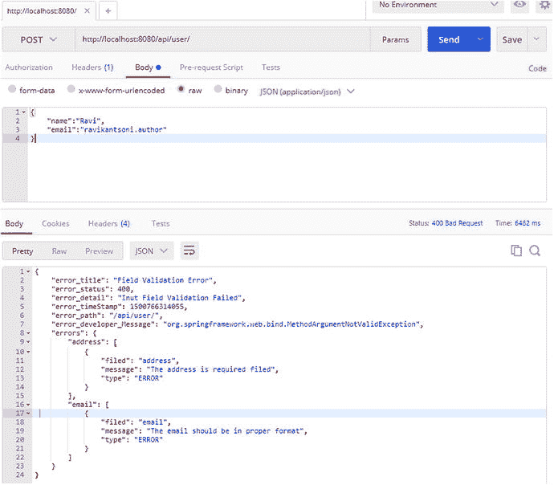

图 2-12.

创建一个缺少地址且电子邮件格式不正确的用户

## 本章小结

在本章中，你学习了如何为 UserRegistrationSystem 应用程序创建 RESTful 服务。现在你了解了 HTTP 方法和状态码。你创建了不同的端点来执行 CRUD 操作。你处理了 RESTful API 中的错误，并定义了自定义错误响应。你还使用`Validation`注解验证了请求输入，并将错误消息外部化。

在下一章中，你将使用 AngularJS 开发一个单页应用程序来消费 RESTful API。

