# 3. 设置 AngularJS：创建你的单页应用程序

在上一章中，你学习了如何为 UserRegistrationSystem 应用程序创建 RESTful 服务。现在你了解了 HTTP 方法和状态码。你创建了不同的端点来执行 CRUD 操作。你处理了 REST API 中的错误，并定义了自定义错误响应。你还使用`Validation`注解验证了请求输入，并将错误消息外部化。

前端涉及用户看到的所有内容，包括设计以及 HTML 和 CSS 等语言。前端代码的主要目的是与用户交互，并以定义良好的样式呈现数据。在构建前端应用程序时，有许多出色的 JavaScript 库可供使用。

AngularJS 是一个开源 JavaScript 框架，为创建 Web 应用程序提供了结构化方法。它是一个构建在轻量级 jQuery 之上的 JavaScript 库。它强制使用结构清晰、整洁的模型-视图-控制器（MVC）框架。由于这种清晰且结构化的方法，AngularJS 是 Spring Boot 客户端库的完美解决方案。

在本章中，我将介绍 MVC 和 AngularJS 框架及其主要组件，以便你能够为使用 Spring Boot 开发的 UserRegistrationSystem 应用程序开发前端。

我将从 AngularJS 及其生命周期介绍开始。然后你将了解 AngularJS 组件以及如何在应用程序中实现它们。此外，你将消费在第 2 章中开发的 REST API，以开发你的单页应用程序（SPA）。在本章中，你将学习以下内容：

*   如何使用 AngularJS 作为前端框架
*   如何开发单页应用程序来消费 REST API

在本章中，你将学习如何将 AngularJS 框架集成到你的 Spring Boot UserRegistrationSystem 应用程序中，以开发单页应用程序。如果你想深入了解 AngularJS，请参考[`https://angularjs.org/`](https://angularjs.org/)。

## 介绍 AngularJS 作为前端框架

AngularJS 是一个用 JavaScript 编写的 Web 应用程序开发库，由 Google 维护。它是一个开源 JavaScript 框架，解决了单页应用程序（SPA）的挑战。AngularJS Web 应用程序遵循 MVC 设计模式，从而开发出可扩展、可维护、可测试且标准化的 Web 应用程序。AngularJS 的数据绑定和依赖注入使其成为任何服务器技术的理想合作伙伴，因为它消除了许多否则你必须编写的代码，并且这一切都在浏览器中完成。


### AngularJS 基本组件

AngularJS 允许开发者基于 MVC 模型构建结构化的应用程序，这些应用健壮且易于维护。在实现 AngularJS 之前，熟悉其各个组件非常重要。

*   **模块**：这是 AngularJS 的组件之一。模块本质上是一个容器，包含服务、控制器、过滤器、指令等。AngularJS 中的每个模块都有自己独立的文件夹结构，用于存放控制器、指令等。AngularJS 中的每个视图页面都有一个模块。
*   **作用域**：AngularJS 中的作用域只是用于填充网页视图的数据的 JavaScript 表示。这些数据可以来自任何源，例如数据库或远程 Web 服务器。
*   **视图**：AngularJS 中带有模板和指令的视图是构建呈现给用户的 HTML 视图的其他组件。
*   **表达式**：在 HTML 模板中添加表达式的能力是 AngularJS 的一大特性。表达式基本上与作用域相关联。表达式有助于将应用程序数据绑定到 HTML。
*   **控制器**：控制器是 MVC 框架的一个组件。控制器将包含您的核心业务逻辑。它在 AngularJS 中的主要作用是使用作用域将数据暴露给视图页面。
*   **数据绑定**：AngularJS 的一个重要特性是数据绑定。这是将数据从模型链接到视图，反之亦然的过程。AngularJS 支持双向数据绑定。
    *   当网页上的数据发生变化时，模型会更新。
    *   当模型中的数据发生变化时，视图页面会自动更新。模型代表数据，视图则展示数据。
*   **服务**：AngularJS 中的服务是单例对象，为 Web 应用程序提供功能。
*   **依赖注入**：DI 是在运行时注入依赖项的过程（即，使依赖组件能够在已初始化代码的组件内被访问）。它用于消费服务。例如，如果一个模块需要通过 HTTP 请求访问资源，那么可以将 HTTP 服务注入到该模块中，以使该功能在模块代码中可用。

### AngularJS 生命周期

现在您已经了解了 AngularJS 应用程序中涉及的不同组件，我将介绍 AngularJS 生命周期中发生的事情，该周期包含三个阶段：引导阶段、编译阶段和运行时阶段。AngularJS 的这些阶段发生在网页在客户端浏览器中加载时。为了设计和实现使用 AngularJS 开发的应用程序中的代码，理解 AngularJS 的生命周期非常重要。

#### 引导阶段

引导阶段是 AngularJS 生命周期的第一阶段，发生在 AngularJS JavaScript 库被下载到客户端浏览器时。一旦 JavaScript 库被下载，AngularJS 会初始化其自身的组件，并初始化 `ng-app` 指令所指向的应用程序模块。此阶段中的静态 DOM 被加载到浏览器中。

#### 编译阶段

HTML 编译阶段是 AngularJS 生命周期的第二阶段。在此阶段，加载的静态 DOM 会被动态 DOM 替换，以表示 AngularJS 视图。然后，这些 DOM 会链接到来自 AngularJS 内置库或自定义指令代码的相应 JavaScript 函数。

#### 运行时数据绑定阶段

这是 AngularJS 生命周期的最后阶段，只要用户不重新加载或导航离开网页，该阶段就会持续存在。在此阶段，对作用域所做的任何更改都会反映在视图中，反之亦然。

### AngularJS 架构概念

现在您将了解 AngularJS 的架构概念。当一个 HTML 文档被加载到浏览器并由浏览器评估时，首先会加载 AngularJS JavaScript 文件，创建 Angular 全局对象，并执行您注册控制器函数的 JavaScript 代码。然后，AngularJS 会扫描 HTML 以查找 AngularJS 应用程序和视图，并找到与视图对应的控制器函数。接着，AngularJS 执行控制器函数，并使用由控制器填充的模型中的数据更新视图。

接下来，AngularJS 会监听浏览器事件，例如，按钮点击、鼠标移动、输入字段更改等。如果发生任何这些事件，AngularJS 将相应地更新视图。图 3-1 展示了 AngularJS 的工作流程图。

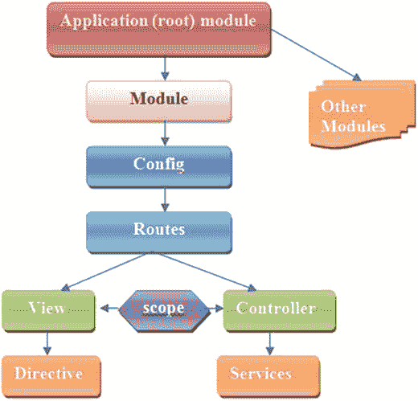

图 3-1.

AngularJS 工作流程图

AngularJS 包含一个模块，该模块充当不同类型应用程序（如视图、控制器、指令、服务等）的容器。模块指定了应用程序如何被引导。然后，您有一个配置组件。路由用于将 URL 链接到控制器和视图。视图用于处理复杂的事件。它使用 `ng-view` 指令。此外，您还有一个控制器，它控制 AngularJS 应用程序的数据，并由常规的 JavaScript 对象组成。AngularJS 定义了一个 `ng-controller` 指令，该指令通过使用控制器函数来创建新的控制器对象。AngularJS 带有几个内置服务，例如 `$http`、`$route`、`$window`、`$location` 等。作用域指的是引用模型的对象。它们在连接控制器与视图方面扮演着重要角色。

#### MVC 架构

AngularJS 使用 MVC 架构来创建 Web 应用程序。MVC 架构是一种编程方法论，旨在将应用程序拆分为三个核心组件：模型、视图和控制器。这三个组件组合起来形成您的应用程序。图 3-2 展示了模型-视图-控制器架构。

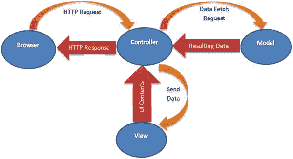

图 3-2.

AngularJS 中的 MVC 架构

当用户通过浏览器发送 HTTP 请求时，该请求由控制器接收。控制器处理该请求，并将请求发送给模型以提供适当的数据。作为响应，模型将结果数据数组再次提供给控制器。控制器再次将数据处理为所需格式，并将其发送给视图。视图通过 UI 内容表示数据，并将其发送给控制器。最后，控制器将 HTTP 响应发送回浏览器。

*   AngularJS 视图用于在 Web 浏览器中向用户生成信息的输出表示，例如图表或示意图。AngularJS 通过拉取为应用程序定义的所有模板，在 DOM 中构建视图。因此，开发人员在这里的工作主要是使用 HTML 和 CSS 来创建模板。
*   AngularJS 模型包含用于存储应用程序模型的 `$scope` 对象，因此无需像其他 JavaScript 客户端框架那样创建 JavaScript 模型类。作用域附加到 DOM，有助于大大简化 JavaScript 问题。
*   AngularJS 控制器是您定义特定于某个视图的所有业务逻辑的地方。控制器将模型和视图联系在一起。

## 设置您的开发环境

在本节中，您将设置您的开发环境。

### 将 AngularJS 添加到 Spring Boot

让我们通过将 AngularJS 添加到您在第 2 章的 UserRegistrationSystem 应用程序中开发的 Spring Boot 应用程序来设置开发环境。您可以通过三种方式实现此目的。

*   从 Google CDN 包含 Angular 脚本
*   下载并在本地托管 Angular 文件
*   在 Spring Boot 应用程序的 `pom.xml` 中提供 AngularJS 的依赖信息

以下各节将涵盖所有三种方式。


#### 从 Google CDN 引入 Angular 脚本

以下介绍如何从 Google CDN 引入 Angular 脚本。

要快速上手 AngularJS，请将 HTML 的 `<script>` 标签指向一个 Google CDN URL。Angular 脚本 URL 有两种类型，一种用于生产环境，一种用于开发环境。

*   `angular.min.js`：这是压缩版本，应在生产环境中使用。
*   `angular.js`：这是未压缩、人类可读的版本，应在 Web 开发中使用。

清单 3-1 展示了将代码指向 Google CDN 服务器上 Angular 脚本的压缩版本 1.5.6 的示例。

```

Angular Application

清单 3-1.
H2 pom.xml 依赖
```

#### 下载并在本地托管 Angular 文件

引入 Angular 脚本的另一种方法是下载并在本地托管 Angular 文件。

希望离线使用 Angular 或希望在自己的服务器上托管 Angular 文件的开发者可以选择此方式。导航至 [`https://code.angularjs.org/`](https://code.angularjs.org/) ，从 Angular 版本列表中选择并下载所需版本。或者，您可以从 [`https://angularjs.org/`](https://angularjs.org/) 下载 Angular 的最新稳定版本。图 3-3 显示了带有下载链接的 AngularJS 页面。

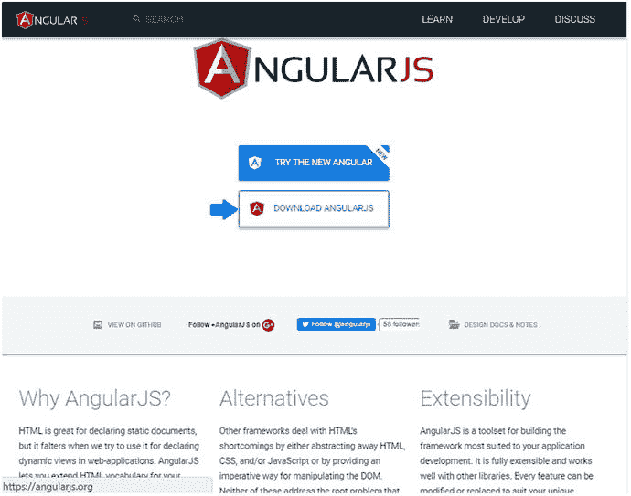

图 3-3.

AngularJS 页面

点击“Download AngularJS”会弹出一个下载 AngularJS 的弹窗，如图 3-4 所示。

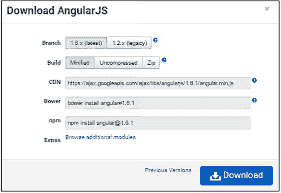

图 3-4.

下载 AngularJS 的弹窗

#### 在 pom.xml 中提供依赖信息

除了手动下载 AngularJS 库，您还可以在开发 Spring Boot 应用时，在 `pom.xml` 中为 AngularJS 提供依赖信息，这样 AngularJS 将会被自动下载到库中。清单 3-2 展示了 AngularJS 和 Bootstrap CSS 的依赖信息。

```
org.webjars
angularjs
1.4.9
runtime

org.webjars
bootstrap
3.3.6
runtime

清单 3-2.
在 pom.xml 中添加 AngularJS 和 Bootstrap 的依赖
```

### 将 Twitter Bootstrap 添加到 Spring Boot

Twitter Bootstrap 是一个前端框架，旨在让响应式设计变得更加容易。Bootstrap CSS 框架可用于设置网站内容的样式。您可以创建自己的 CSS 样式来让网站看起来很棒，但 Bootstrap 提供了一套优秀的 CSS 样式，能让您设计出外观极佳的内容布局。在使用 AngularJS 时，并非必须使用 Bootstrap，AngularJS 和 Bootstrap 之间也没有内在联系，因为它们是两个不同的包。

要使用 Bootstrap CSS 框架中的 CSS，您可以在开发 Spring Boot 应用时，在 `pom.xml` 中定义一个依赖，如清单 3-2 所示，这样它就会被自动下载到库文件夹中。此外，也可以从 [`https://getbootstrap.com/`](https://getbootstrap.com/) 下载 Bootstrap 归档文件，其中也包含了 CSS 和 JavaScript 文件。

### 开发单页应用

单页应用是指只有一个入口 HTML 页面（可能是 `index.html`）的应用；所有应用内容都动态地添加和移除到这个页面中。在运行时，基于某些事件，附加到标签上的现有内容会被移除，然后动态内容会被附加到同一个标签上。

单页应用的入口点可以在一个包含 `<div ng-view></div>` 标签的 `index.html` 中看到，如清单 3-3 所示，所有动态内容都被插入到 `index.html` 中。因此，用户无需等待加载新页面，新内容会在极短的时间内动态显示出来。

```

...

...

...

清单 3-3.
开发 HTML 页面：单页应用的入口点
```

在清单 3-3 中，您在开发 HTML 页面时使用了以下良好实践：

*   将 `<script>` 标签放在页面底部，以提高应用加载速度，因为 Angular 脚本的加载不会影响 HTML 的加载。
*   将 `ng-app` 放在应用的根元素上，通常放在 `<html>` 标签上，如果您希望 Angular 自动引导您的应用。

### 引导应用

引导 AngularJS 是指通过向 HTML 中的某个元素添加 `ng-app` 来初始化或启动 Angular 应用的过程，如清单 3-4 所示，这发生在应用首次启动时。

```
...

清单 3-4.
通过在 HTML 页面中添加 ng-app 来引导 AngularJS
```

这也被称为自动初始化。因此，当 AngularJS 在分析 `index.html` 文件后找到 `ng-app` 指令时，它会加载相关的模块，然后编译 DOM。

AngularJS 应用 `UserRegistrationSystem` 在 `app.js` 中被定义为 AngularJS 模块（`angular.module`），`app.js` 是应用的入口点。

```
var app = angular.module('userregistrationsystem', ['ngRoute', 'ngResource']);
```

`app.js` 文件中的变量 `app` 可以命名为任何名称。

### 依赖注入

依赖注入是一种设计模式，用于在应用中定义依赖关系，将其作为配置的一部分，而不是在组件内部硬编码。DI 帮助您避免手动创建应用依赖，并使得在需要时可以更改它们。AngularJS 在应用首次启动时使用 DI 来加载模块依赖。

DI 的好处如下：

*   它将创建依赖的过程与使用依赖的过程分离开来。
*   使用者会感觉创建依赖的过程是由其他人处理的；用户只需关心如何使用依赖。
*   它提供了在需要时更改依赖的功能。
*   它使应用更易于测试。

如您所见，`app.js` 中定义了两个依赖，供 `userregistrationsystem` 在启动时使用，如下所示：

```
var app = angular.module('userregistrationsystem', ['ngRoute', 'ngResource']);
```

上述代码中的两个依赖是在模块定义的一个数组中定义的。

*   `ngRoute`：第一个依赖是 AngularJS 的 `ngRoute` 模块，它为应用提供路由功能。`ngRoute` 模块用于将 URL 深度链接到控制器和视图（HTML 片段）。
*   `ngResource`：第二个依赖是 AngularJS 的 `ngResource` 模块，它提供与 RESTful 服务的交互支持。


### AngularJS 路由

AngularJS 路由通过 `$routeProvider` API 进行配置。路由依赖于 `ngRoute` 模块，这就是为什么在模块定义中，其依赖项被定义在一个数组里。

清单 3-5 展示了 `app.js` 中的代码。你将在 AngularJS 应用中定义四个路由。

*   第一个是 `/list-all-users`。
*   第二个是 `/register-new-user`。
*   第三个是 `/update-user/:id`。
*   第四个与前三个不同。

```
app.config(function($routeProvider) {
$routeProvider
.when('/list-all-users', {
templateUrl : '/template/listuser.html',
controller : 'listUserController'
}).when('/register-new-user',{
templateUrl : '/template/userregistration.html',
controller : 'registerUserController'
}).when('/update-user/:id',{
templateUrl : '/template/userupdation.html' ,
controller : 'usersDetailsController'
}).otherwise({
redirectTo : '/home',
templateUrl : '/template/home.html',
});
});
清单 3-5.
在 AngularJS 应用中定义路由
```

清单 3-5 中定义的四个路由直接映射到应用中定义的 URL。

当用户点击应用中指定为 `http://localhost:8080/#/list-all-users` 的链接时，将遵循 `/list-all-users` 路由，并显示与 `/list-all-users` URL 关联的内容。

类似地，当用户点击链接 `http://localhost:8080/#/register-new-user` 时，将遵循 `/register-new-user` 路由，并显示与 `/register-new-user` URL 关联的内容。

当用户点击链接 `http://localhost:8080/#/update-user/{id` `}` 时，将遵循 `/update-user/:id` 路由，并显示与 `/update-user/:id` URL 关联的内容。

此外，如果用户访问除这三个之外的任何 URL，将遵循 `/home` 路由，并显示与 `/home` URL 关联的内容。

### AngularJS 模板

AngularJS 模板，也称为 HTML 片段，是绑定到 `index.html` 文件中 `<div ng-view></div>` 标签的 HTML 代码。如果你查看 `app.js` 文件中的代码，可以看到为不同的路由定义了不同的 `templateUrl` 值，如清单 3-6 所示。

```
$routeProvider
.when('/list-all-users', {
templateUrl : '/template/listuser.html',
controller : 'listUserController'
}).when('/register-new-user',{
templateUrl : '/template/userregistration.html',
controller : 'registerUserController'
}).when('/update-user/:id',{
templateUrl : '/template/userupdation.html' ,
controller : 'usersDetailsController'
}).otherwise({
redirectTo : '/home',
templateUrl : '/template/home.html',
});
清单 3-6.
为路由定义 templateUrl
```

如清单 3-6 所示，你定义了四个不同的片段或模板。`listuser.html`、`userregistration.html`、`userupdation.html` 和 `home.html` 页面是四个不同的片段或模板，它们包含 HTML 代码和 AngularJS 内置的模板语言，用于在模板中显示动态数据。

### 在单页应用中实现模型、视图和控制器

默认情况下，Spring Boot 会自动从 `ServletContext` 的根目录或以下目录提供静态内容：

*   `classpath:/META-INF/resources/`
*   `classpath:/resources/`
*   `classpath:/static/`
*   `classpath:/public/`

在你的项目中，你将在 `classpath:/resources/` 目录下创建静态内容。最终的目录结构将如图 3-5 所示。

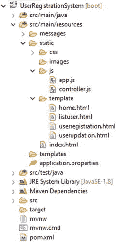

图 3-5.
UserRegistrationSystem 应用中 SPA 的目录结构

现在，让我们在你的 AngularJS 应用中实现模型、视图和控制器。

#### 创建主页/应用页面

单页应用的核心是静态页面 `index.html`，如清单 3-7 所示，因此让我们在 `src/main/resources/static`（或 `src/main/resources/public`）目录中创建它。这个 `index.html` 页面将包含一些前端代码，用于在网页上显示链接，这些链接将由 AngularJS 处理。这个 `src/main/resources/static/index.html` 页面还包含一些 `<script>` 标签，其中包含了所有必要的 AngularJS 文件。

```

全栈开发

用户注册系统

首页

注册新用户

列出所有用户

清单 3-7.
src/main/resources/static/index.html
```

这个 `index.html` 页面将显示三个链接：首页、注册新用户和列出所有用户。

让我们更详细地查看前面的代码。AngularJS 库启用了几个自定义属性，用于标准 HTML 标签。

*   `index.html` 页面中的 `<html>` 标签具有 `ng-app="userregistrationsystem"` 属性，这告诉你要定义一个 JavaScript 模块，Angular 会将其识别为一个名为 `userregistrationsystem` 的应用。
*   所有 CSS 类都来自 (Twitter) Bootstrap，以使页面看起来更美观。
*   Angular JS 和 (Twitter) Bootstrap 被包含在 `<body>` 标签的底部，如前面的代码所示，这样浏览器可以在处理之前先处理整个 HTML。
*   你还包含了一个单独的 `app.js`，你将在其中定义应用的行为。

#### 创建视图页面

让我们在 `src/main/resources/static` 目录下的模板文件夹中创建四个视图页面。

*   首页页面：`src/main/resources/template/home.html`
*   注册新用户页面：`src/main/resources/template/userregistration.html`
*   用户列表页面：`src/main/resources/template/listuser.html`
*   更新现有用户页面：`src/main/resources/template/userupdation.html`

##### 首页页面

清单 3-8 展示了 `home.html` 视图页面的代码。此页面创建在 `src/main/resources/template` 文件夹内。

```

欢迎使用用户注册系统

请点击
注册新用户
来注册新用户。

请点击
列出所有用户
来获取所有用户。

清单 3-8.
src/main/resources/template/home.html
```

在 `home.html` 页面中，你只是向用户显示一条（静态）欢迎消息，如图 3-6 所示。

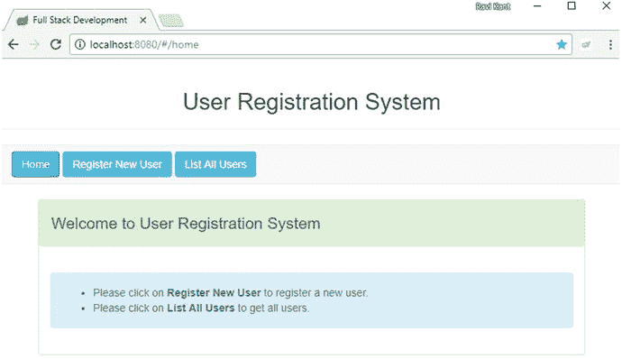

图 3-6.
首页页面


##### 注册新用户页面

清单 3-9 展示了 `userregistration.html` 视图页面的代码。该页面创建在 `src/main/resources/template` 文件夹内。

```

{{errorMessage}}

注册新用户
请确保用户名的唯一性

姓名

地址

电子邮件

重置表单

清单 3-9.
src/main/resources/template/userregistration.html
```

在 `userregistration.html` 页面（如上述代码所示）中，`errorMessage` 使用花括号标记，即 `{{errorMessage}}`。这些花括号稍后将由 AngularJS 使用 `app.js` 文件中定义的控制器填充。

您还创建了用于输入姓名、地址和电子邮件的输入框。一旦用户输入详细信息并点击“注册用户”按钮，用户详细信息将保存到数据库中。

您有一个“重置表单”按钮，该按钮会将输入框重置为空值。图 3-7 展示了浏览器中“注册新用户”页面的视图。

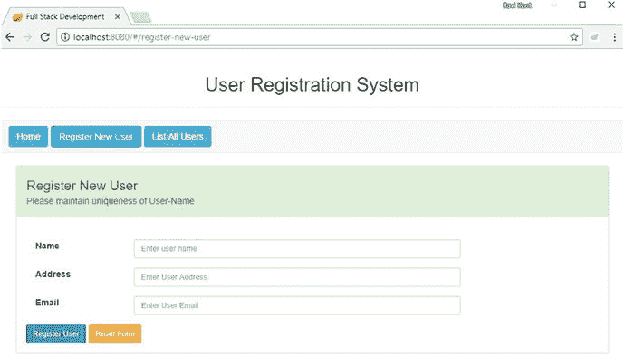

图 3-7.

注册新用户页面

当用户通过输入正确的详细信息和唯一的用户名成功完成用户注册后，如图 3-8 所示，用户将被导航至“列出所有用户”页面。


图 3-8.

使用用户详细信息注册新用户

如果输入的用户名不唯一，并且数据库中已存在匹配该名称的用户，则浏览器中会显示一条警告错误消息，如图 3-9 所示。


图 3-9.

用户名重复时的错误消息

##### 用户列表

清单 3-10 展示了 `listuser.html` 视图页面的代码。该页面创建在 `src/main/resources/template` 文件夹内。此页面将显示 UserRegistrationSystem 应用程序中所有用户的列表。

```

用户列表 

姓名
电子邮件
地址
编辑
删除

{{user.name}}
{{user.email}}
{{user.address}}

编辑

删除

清单 3-10.
src/main/resources/template/listuser.html
```

在 `listuser.html` 页面（如上述代码所示）中，`user.name`、`user.email` 和 `user.address` 使用花括号标记：`{{user.name}}`、`{{user.email}}` 和 `{{user.address}}`。这些花括号稍后将由 AngularJS 使用 `app.js` 文件中定义的控制器填充。

此页面以表格形式显示所有用户的列表，包含姓名、电子邮件和地址列，并包含“编辑”和“删除”按钮。图 3-10 展示了浏览器中 `listuser.html` 页面的视图。


图 3-10.

用户列表

点击“删除”按钮将从用户表中删除特定用户。点击“编辑”按钮将重定向至“更新现有用户”页面。

##### 更新现有用户

清单 3-11 展示了 `userupdation.html` 视图页面的代码。该页面创建在 `src/main/resources/template` 文件夹内。此页面允许您更新 UserRegistrationSystem 应用程序中的现有用户。

```

{{errorMessage}}

更新现有用户
请确保用户名的唯一性

姓名

地址

电子邮件

重置表单                                          

清单 3-11.
src/main/resources/template/userupdation.html
```

图 3-11 展示了在图 3-10 的“用户列表”表格中点击“编辑”按钮时，浏览器中 `userupdation.html` 页面的视图。

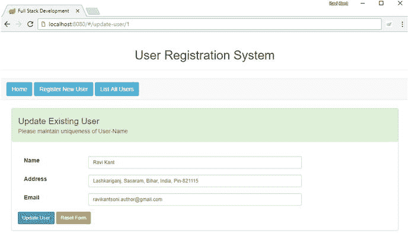

图 3-11.

更新用户

一旦您更新了用户详细信息（包括用户名）并点击“更新用户”按钮，您将导航至“用户列表”视图。

至此，视图页面部分已准备就绪。接下来，您将在 `js` 文件夹内的 `app.js` 文件中为您的单页应用程序创建 UserRegistrationSystem 应用程序。

#### 创建 AngularJS 应用程序

让我们在 `src/main/resources/static/js/app.js` 文件中创建一个名为 `app` 的 AngularJS 应用程序，该文件定义了应用程序模块的配置和路由。为了处理像 `/home` 这样的请求，需要一个名为 `ngRoute` 的 AngularJS 模块。要使用 `ngRoute` 并将其注入到您的应用程序中，您可以使用 `angular.module` 将 `ngRoute` 模块添加到您的应用中，如清单 3-12 所示。

```
var app = angular.module('userregistrationsystem', ['ngRoute', 'ngResource']);
app.config(function($routeProvider) {
$routeProvider.when('/list-all-users', {
templateUrl : '/template/listuser.html',
controller : 'listUserController'
}).when('/register-new-user',{
templateUrl : '/template/userregistration.html',
controller : 'registerUserController'
}).when('/update-user/:id',{
templateUrl : '/template/userupdation.html' ,
controller : 'usersDetailsController'
}).otherwise({
redirectTo : '/home',
templateUrl : '/template/home.html',
});
});
清单 3-12.
src/main/resources/static/js/app.js
```

然后，在 `app.config` 中，每个路由都映射到一个模板和控制器（可选）。

*   当导航到 URL `/list-all-users` 时，将调用控制器 `listUserController`。
*   当导航到 URL `/register-new-user` 时，将调用控制器 `registerUserController`。
*   当导航到 URL `/update-user/:id` 时，将调用控制器 `usersDetailsController`。

在本节中，您已在 `app.js` 文件中创建了 `app` 应用程序。在下一节中，我们将创建三个不同的控制器，分别命名为 `listUserController`、`registerUserController` 和 `usersDetailsController`。


#### 创建 AngularJS 控制器

在 `src/main/resources/static/js` 文件夹中定义的 `controller.js` 文件包含了 AngularJS 控制器的实现。

让我们创建一个名为 `registerUserController` 的 AngularJS 控制器模块，它将使用 Spring REST 服务来执行 `POST` HTTP 调用。这里，在 `$scope` 中设置了一个 `errorMessage`，用于显示在“注册新用户”页面上从 `POST` 调用返回的错误信息。当 `POST` 调用成功时，它将重定向到 `list-all-users`。请参见清单 3-13。

```
app.controller('registerUserController', function($scope, $http, $location,
$route) {
$scope.submitUserForm = function() {
$http({
method : 'POST',
url : 'http://localhost:8080/api/user/',
data : $scope.user,
}).then(function(response) {
$location.path("/list-all-users");
$route.reload();
}, function(errResponse) {
$scope.errorMessage = errResponse.data.errorMessage;
});
}
$scope.resetForm = function() {
$scope.user = null;
};
});
清单 3-13.
src/main/resources/static/js.controller.js 中的 registerUserController
```

类似地，你定义了 `listUserController` 和 `usersDetailsController` 来使用第 2 章中开发的 REST API。清单 3-14 展示了 `listUserController`，清单 3-15 展示了 `usersDetailsController`。

```
app.controller('listUserController', function($scope, $http, $location, $route) {
$http({
method : 'GET',
url : 'http://localhost:8080/api/user/'
}).then(function(response) {
$scope.users = response.data;
});
$scope.editUser = function(userId) {
$location.path("/update-user/" + userId);
}
$scope.deleteUser = function(userId) {
$http({
method : 'DELETE',
url : 'http://localhost:8080/api/user/' + userId
})
.then(
function(response) {
$location.path("/list-all-users");
$route.reload();
});
}
});
清单 3-14.
src/main/resources/static/js.controller.js 中的 listUserController
```

```
app.controller('usersDetailsController',function($scope, $http, $location, $routeParams, $route) {
$scope.userId = $routeParams.id;
$http({
method : 'GET',
url : 'http://localhost:8080/api/user/' + $scope.userId
}).then(function(response) {
$scope.user = response.data;
});
$scope.submitUserForm = function() {
$http({
method : 'POST',
url : 'http://localhost:8080/api/user/',
data : $scope.user,
})
.then(
function(response) {
$location.path("/list-all-users");
$route.reload();
},
function(errResponse) {
$scope.errorMessage = "Error while updating User - Error Message: '"
+ errResponse.data.errorMessage;
});
}
});
清单 3-15.
src/main/resources/static/js.controller.js 中的 usersDetailsController
```

让我们理解一下 `controller.js` 文件中定义的代码。`controller.js` 中的控制器模块只是一个函数，它根据应用程序的需求接受不同的参数。

*   `$scope`：`$scope` 用于为该控制器负责的 UI 元素设置动态内容。`$scope` 的概念在 AngularJS 中很重要，因为它可以被视为连接模板、模型和控制器的粘合剂。AngularJS 通过命名约定支持依赖注入。AngularJS 使用这个 `$scope` 来保持模型和视图分离但同步。视图中所做的任何更改都会反映在模型中，模型中所做的任何更改也会反映在视图中。
*   `$http`：`$http` 服务是 AngularJS 提供的核心功能，用于使用 REST 服务。

### 在 STS 中运行 Spring Boot 应用程序

图 3-12 展示了你的 UserRegistrationSystem 应用程序的最终目录结构。

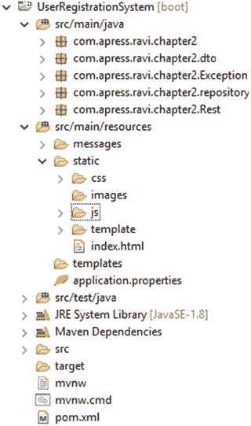

图 3-12.

UserRegistrationSystem 应用程序的目录结构

让我们在 STS 中运行你的 UserRegistrationSystem 应用程序。恭喜！你已经成功使用 Spring Boot 和 AngularJS 设置并运行了单页应用程序。现在是时候在浏览器中访问 URL，查看图 3-13 所示的网页了。


图 3-13.

`http://localhost:8080/#/home`

默认情况下，网页将重定向到你在 `app.js` 中配置的主页（`http://localhost:8080/#/home`）。点击主页上的“列出所有用户”按钮将重定向到 `http://localhost:8080/#/list-all-users`，如图 3-14 所示。

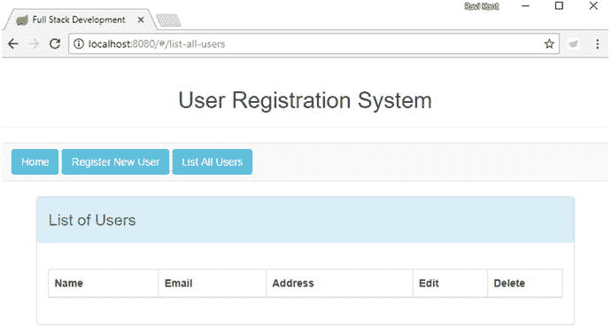

图 3-14.

`http://localhost:8080/#/list-all-users`

目前此列表为空；尚未有用户注册到 UserRegistrationSystem 应用程序。让我们点击“注册新用户”按钮来注册一个新用户。点击此按钮后，它将重定向到 `http://localhost:8080/#/register-new-user`，如图 3-15 所示。

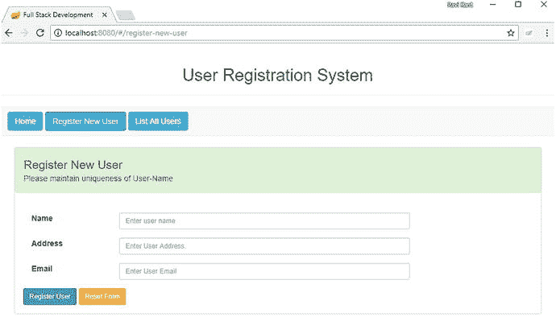

图 3-15.

`http://localhost:8080/#/register-new-user`

“注册新用户”页面包含一个输入框，你需要在此输入姓名、地址和电子邮件，如图 3-16 所示。

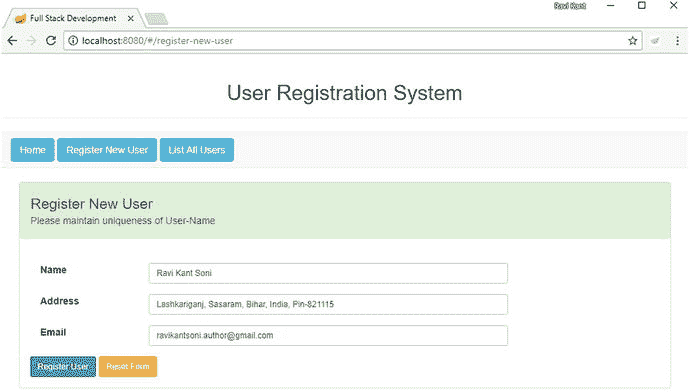

图 3-16.

包含用户详细信息的“注册新用户”页面

输入用户详细信息并点击“注册用户”按钮后，你将重定向到位于 `http://localhost:8080/#/list-all-users` 的“用户列表”页面，在那里你可以看到所有已注册用户的列表，如图 3-17 所示。

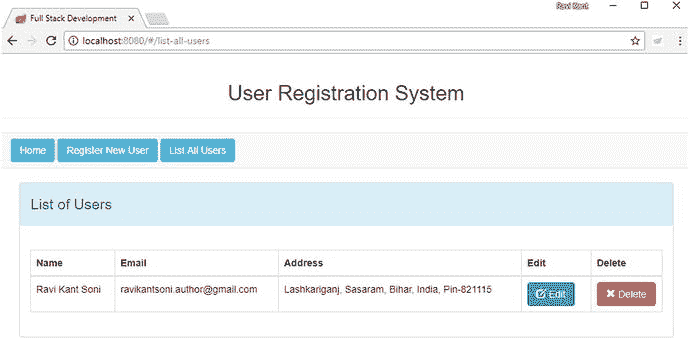

图 3-17.

`http://localhost:8080/#/list-all-users`

“用户列表”页面上的用户表包含“姓名”、“电子邮件”和“地址”列以及“编辑”和“删除”按钮。点击“编辑”将允许你编辑特定用户的详细信息，如图 3-18 所示。

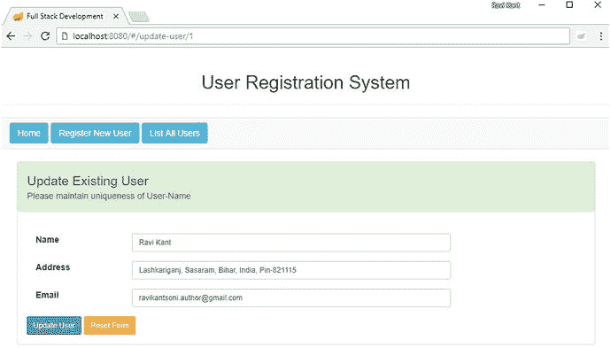

图 3-18.

`http://localhost:8080/#/update-user` /1

如果你尝试使用现有的用户名注册新用户，则页面上将显示一条错误消息，如图 3-19 所示。

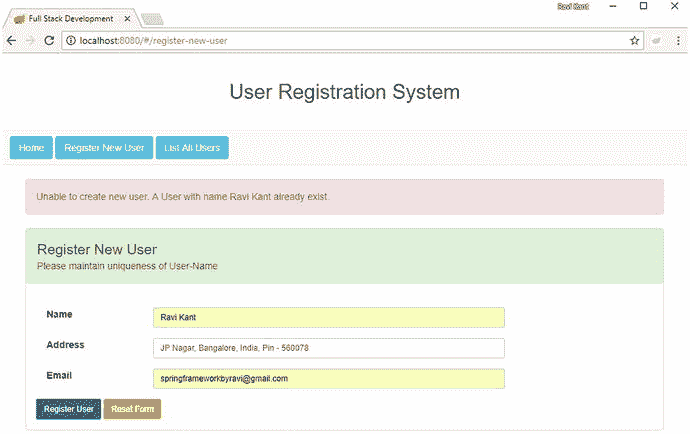

图 3-19.

显示用户已存在的错误消息

## 总结

在本章中，你了解了单页应用程序的概念。你学习了 AngularJS 的生命周期，并看到了不同的阶段，例如引导阶段、编译阶段和运行时数据绑定阶段。然后你学习了 AngularJS 架构概念和 MVC 架构。你通过将 AngularJS 添加到你在第 2 章中开发的 Spring Boot 应用程序中，设置了 AngularJS 开发环境。你使用了 Bootstrap 进行 CSS 设计。你了解了 AngularJS 的不同组件，并在应用程序中实现了模型、视图和控制器。然后你创建了不同的视图页面来使用你的 REST API。

在下一章中，你将实现 Spring Security 来保护你使用 Spring Boot 开发的 RESTful API。保护基于 Web 的应用程序与保护 RESTful API 不同，因为在基于 Web 的应用程序中，需要从登录页面进行人工交互以传递用户凭据。在 RESTful API 中，交互可以是机器对机器，或者来自用不同语言开发的不同应用程序。


