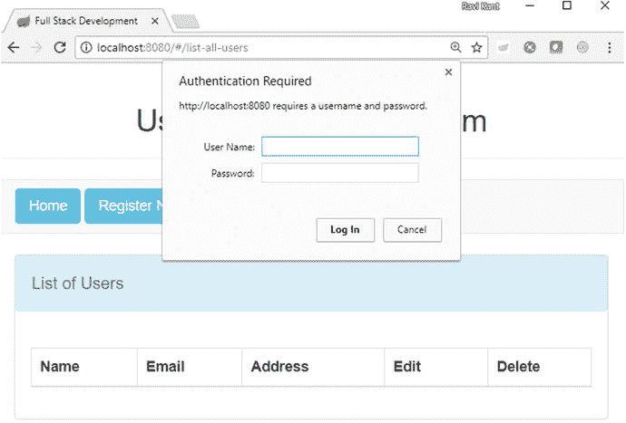
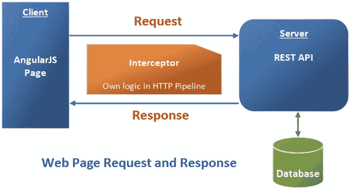
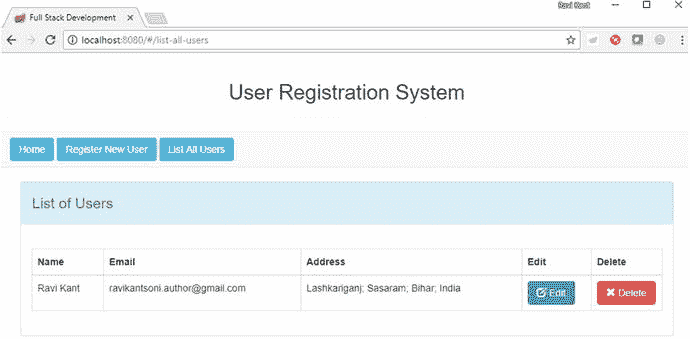
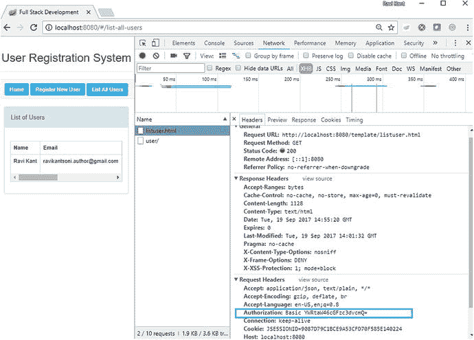
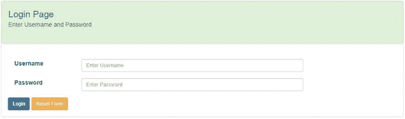
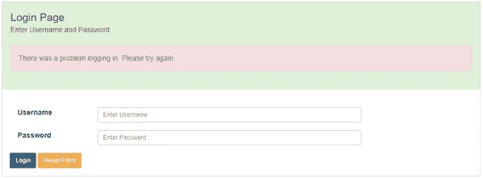
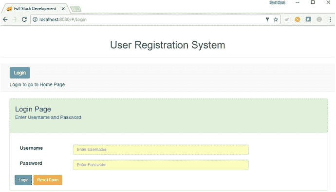
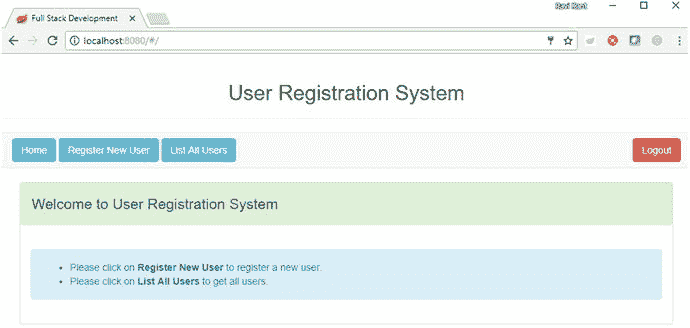
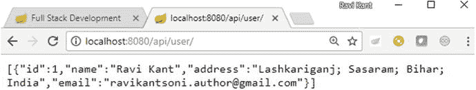
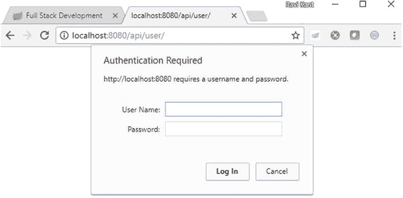

# 5. 使用 AngularJS 消费安全的 RESTful 服务

在第 2 章中，你使用 Spring Boot 创建了一个名为 UserRegistrationSystem 的 REST 应用程序，并执行了 CRUD 操作。在第 3 章中，你使用 AngularJS 创建了一个单页应用（SPA）并消费了 REST 端点。在第 4 章中，你使用 Spring Security 保护了你的 REST 端点。

在本章中，我将向你展示 Spring Boot、Spring Security 和 AngularJS 如何协同工作，以提供愉快且安全的用户体验。你将使用 AngularJS 消费安全的 RESTful 服务。首先，你将在 AngularJS 中为每个请求发送一个授权标头。然后，你将创建一个登录页面，并更新 Spring Security 配置以支持登录和注销的认证流程。

## 在 Spring Security 中启用基本认证

在第 4 章中，你仅通过使用 Spring Boot Starter Security 依赖更新 Maven `pom.xml` 文件，并添加带有内存认证配置的 Spring Security 配置文件，就使用基本认证保护了 UserRegistrationSystem 应用程序的 REST 端点，如清单 5-1 所示。

```
@Configuration
@Order(SecurityProperties.ACCESS_OVERRIDE_ORDER)
public class SpringSecurityConfiguration_InMemory
extends WebSecurityConfigurerAdapter {
@Autowired
protected void configureGlobal(AuthenticationManagerBuilder auth)
throws Exception {
auth.inMemoryAuthentication()
.withUser("admin").password("password")
.roles("USER", "ADMIN");
}
@Override
protected void configure(HttpSecurity http) throws Exception {
http
.httpBasic()
.realmName("User Registration System")
.and()
.authorizeRequests()
.antMatchers(HttpMethod.GET, "/api/user/")
.hasRole("USER")
.antMatchers(HttpMethod.POST, "/api/user/")
.hasRole("USER")
.antMatchers(HttpMethod.PUT, "/api/user/**")
.hasRole("USER")
.antMatchers(HttpMethod.DELETE, "/api/user/**")
.hasRole("ADMIN")
.and()
.csrf()
.disable();
}
}
清单 5-1.
内存认证配置
```

在第 3 章中，你将 UserRegistrationSystem 开发为一个使用 AngularJS 消费 REST 端点的 SPA。有了 Spring Security 配置，现在当你尝试使用 URL `http://localhost:8080/#/list-all-users` 在浏览器中访问你的页面时，会出现一个“需要身份验证”的弹出窗口，你需要输入在安全配置文件中配置的用户名和密码才能访问 `/list-all-users` 页面，如图 5-1 所示。



图 5-1.

在浏览器中访问页面需要身份验证

问题在于，每次你打开浏览器并访问网页时，浏览器都会弹出一个要求输入用户名和密码的窗口。你可以通过在 AngularJS 中为每个请求发送一个授权标头来解决此问题。

## 在 AngularJS 中为每个请求发送授权标头

[基本认证](https://en.wikipedia.org/wiki/Basic_access_authentication)允许客户端在每个 HTTP 请求中使用授权标头发送其 Base64 编码的凭据。这意味着每个请求都独立于其他请求，服务器不会为客户端维护任何状态信息。

由于你必须为每个请求发送一个认证标头，因此使用 HTTP 拦截器来处理它比在所有 `'http` 方法中手动指定认证标头更好。

### 在 AngularJS 中添加 HTTP 拦截器

当请求/响应通过 HTTP 调用进行通信，并且你想要注入一些自定义逻辑时，HTTP 拦截器就派上用场了。HTTP 拦截器始终执行自定义逻辑，用于认证、授权、管理会话状态、日志记录、修改响应、重写 URL、处理错误、缓存、添加自定义标头、在请求/响应中添加时间戳，以及在 HTTP 调用前后加密和解密请求和响应信息，如图 5-2 所示。



图 5-2.

HTTP 拦截器

AngularJS 支持四种 HTTP 拦截器：`request`、`response`、`requestError` 和 `responseError`。

*   `request` 拦截器在 `'http` 将请求发送到服务器之前被调用。请求函数将配置对象作为输入参数，并在向该对象添加、修改或删除数据后返回一个配置对象。
*   `response` 拦截器在 `'http` 从服务器接收响应后被调用。响应函数将响应对象作为参数，并在返回响应对象之前修改响应数据或添加一组新值，调用另一个模块或服务调用。
*   当请求拦截器抛出任何错误时，会调用 `requestError` 拦截器。
*   当对服务器的任何调用失败，并且应用程序需要根据不同的 HTTP 状态码触发某些操作时，会调用 `responseError` 拦截器。

让我们在 UserRegistrationSystem 应用程序中实现 HTTP 拦截器。

#### authInterceptor.js

在 `authInterceptor.js` 文件中创建一个名为 `AuthInterceptor` 的拦截器，如清单 5-2 所示。

```
app.factory('AuthInterceptor', [ function() {
return {
'request' : function(config) {
config.headers = config.headers || {};
var encodedString = btoa("admin:password");
config.headers.Authorization = 'Basic ' + encodedString;
return config;
}
};
} ]);
清单 5-2.
带有请求函数的 HTTP 拦截器
```

在清单 5-1 中，你配置了用户名为 `admin`、密码为 `password` 的安全认证凭据。此外，你调用了 `btoa()` 函数来从用户凭据中获取 Base64 编码的字符串。

你调用了一个请求拦截器函数，该函数将配置对象作为参数。你使用基本认证数据更新了 `config.headers.Authorization`，并返回了这个更新后的配置对象。这足以启用基本认证。你只需要将 `AuthInterceptor` 拦截器注册到 AngularJS 应用程序中。

### 更新 app.js

要将 `AuthInterceptor` 拦截器注册到 AngularJS 应用程序，你需要更新 `app.js` 文件，如清单 5-3 所示。

```
var app = angular.module('userregistrationsystem', [ 'ngRoute', 'ngResource' ]);
app.config(function('routeProvider) {
'routeProvider.when('/list-all-users', {
templateUrl : '/template/listuser.html',
controller : 'listUserController'
}).when('/register-new-user',{
templateUrl : '/template/userregistration.html',
controller : 'registerUserController'
}).when('/update-user/:id',{
templateUrl : '/template/userupdation.html',
controller : 'usersDetailsController'
}).otherwise({
redirectTo : '/home',
templateUrl : '/template/home.html',
});
});
app.config([''httpProvider', function('httpProvider) {
'httpProvider.interceptors.push('AuthInterceptor');
}]);
清单 5-3.
通过更新 app.js 在应用程序中注册拦截器
```

在清单 5-3 中，你通过使用 push 方法将 `AuthInterceptor` 拦截器（拦截器是服务工厂）添加到 `'httpProvider.interceptors` 数组中，从而将其注册到 `'httpProvider`。这个服务工厂被调用并返回拦截器。


### 更新 index.html

现在需要更新 `index.html` 文件，将 `authInterceptor.js` 文件引入到应用程序中，如代码清单 5-4 所示。

```

全栈开发

用户注册系统

首页

注册新用户

列出所有用户

代码清单 5-4.
更新 index.html 文件
```

### 运行应用程序

让我们重新启动 UserRegistrationSystem 应用程序，并在浏览器中访问 URL `http://localhost:8080/#/list-all-users`。`list-all-users` 页面将在浏览器中显示，而不会弹出任何身份验证对话框，如图 5-3 所示。



图 5-3.

在浏览器中显示的 list-all-users 页面

#### 携带基本认证头部的 HTTP 请求：在开发者工具中验证

您可以验证在请求 URL `http://localhost:8080/#/list-all-users` 时，基本认证头部发送的 HTTP 请求。在浏览器中打开开发者工具（此处为 Chrome 浏览器），选择“网络”选项卡，然后点击“标头”选项卡，以监控包含授权数据的请求标头，如图 5-4 所示。



图 5-4.

在开发者工具中监控基本认证头部

到目前为止，您已成功使用拦截器在每个请求中发送了授权头部，并且能够使用受保护的 REST 端点。您在 AngularJS 拦截器中配置了一个用户来执行基本认证。当有多个具有不同角色的用户时，就会出现问题。为了解决这个问题，您需要一个登录页面，在访问任何资源之前，可以输入用户名和密码进行身份验证和授权，并且网页上还需要一个“注销”按钮。

在下一节中，您将创建一个登录页面，并执行登录和注销的身份验证过程。您将在 UserRegistrationSystem 应用程序中使用基于表单的身份验证，这将比 HTTP 基本认证提供更大的灵活性。

## 登录页面

在本节中，您将使用 AngularJS 通过登录表单对用户进行身份验证，并获取受保护的资源以在 UI 中渲染 JSON 数据。此登录表单让用户对是否进行身份验证拥有一定的控制权。

### 更新 index.html：添加导航到欢迎页面

正如您在第 3 章中所见，`index.html` 是单页应用的核心，到目前为止您已经拥有一个非常基础的版本。您需要提供更多导航功能，例如登录和注销功能。因此，让我们修改现有的 `src/main/resources/static/index.html` 文件，如代码清单 5-5 所示。

```

全栈开发

用户注册系统

登录

登录以进入首页

首页

注册新用户

列出所有用户

注销

代码清单 5-5.
更新 src/main/resources/static/index.html
```

如代码清单 5-5 所示，更新后的 `index.html` 与原始版本没有太大区别。您添加了一个新的 `div`，其中包含一个用于登录的锚点标签。并且您添加了一个用于注销的锚点标签。您使用了 AngularJS 的 `ng-show` 来根据 `authenticated` 的值隐藏/显示页面上的元素。

### 更新 app.js：为 Angular 应用程序添加导航

您现在需要更新 UserRegistrationSystem 应用程序（位于 `src/main/resources/static/js/app.js`），以添加用于登录和注销的新导航功能，如代码清单 5-6 所示。

```
var app = angular.module('userregistrationsystem', [ 'ngRoute', 'ngResource' ]);
app.config(function('routeProvider, 'locationProvider) {
'routeProvider
.when('/', {
templateUrl : '/template/home.html',
controller : 'homeController'
})
.when('/list-all-users', {
templateUrl : '/template/listuser.html',
controller : 'listUserController'
})
.when('/register-new-user',{
templateUrl : '/template/userregistration.html',
controller : 'registerUserController'
})
.when('/update-user/:id',{
templateUrl : '/template/userupdation.html',
controller : 'usersDetailsController'
})
.when('/login',{
templateUrl : '/login/login.html',
controller : 'loginController'
})
.when('/logout',{
templateUrl : '/login/login.html',
controller : 'logoutController'
})
.otherwise({
redirectTo : '/login'
});
});
app.config([''httpProvider', function('httpProvider) {
'httpProvider.defaults.headers.common["X-Requested-With"] = 'XMLHttpRequest';
}]);
代码清单 5-6.
更新 src/main/resources/static/js/app.js
```

在代码清单 5-4 中，您为路径 `/` 添加了 `homeController` 控制器。您还设置了新的路径，例如 `/login` 和 `/logout`，以及它们的 `templateUrl` 和 `controller`。

自定义的 `X-Requested-With` 行是浏览器客户端发送的传统标头。Spring Security 会对此做出响应，不在 401 响应中发送 `WWW-Authenticate` 标头，因此浏览器不会打开身份验证弹出对话框，这在您的 UserRegistrationSystem 应用程序中是期望的行为，因为您希望控制身份验证过程。

### 创建 login.html：登录表单

让我们创建一个登录表单，该表单位于 `src/main/resources/static/login/login.html`，如代码清单 5-7 所示。

```

登录页面
输入用户名和密码

登录时出现问题。请重试。

用户名

密码

重置表单

代码清单 5-7.
src/main/resources/static/login/login.html
```

如代码清单 5-5 所示，这是一个简单且标准的登录表单；它包含两个用于输入用户名和密码的字段，以及两个按钮，分别用于登录（通过 `ng-submit` 提交表单）和重置表单，如图 5-5 所示。



图 5-5.

带有输入框和按钮的登录表单

登录表单控件使用 `ng-model` 在 HTML（`login.html`）和 Angular 控制器（`controller.js`）之间传递数据，在此示例中，您使用一个 credentials 对象来保存用户名和密码。您还添加了代码，以便在 Angular 模型包含 `loginerror` 值时显示错误消息，如图 5-6 所示。



图 5-6.

带有错误消息的登录页面

根据在应用程序（如 `app.js`）中定义的路由，您已经定义了一个需要与 `loginController` 关联的登录表单，因此让我们更新您的 `controller.js` 文件。


### 更新 controller.js 以支持登录和注销认证流程

为了支持登录和注销认证流程，你需要添加更多功能。你需要新增三个控制器：`homeController`、`loginController` 和 `logoutController`。将它们添加到现有 UserRegistrationSystem 应用程序的 `src/main/resources/static/js/controller.js` 文件中，如代码清单 5-8 所示。

```
app.controller('homeController', function('rootScope, 'scope,
'http, 'location, 'route){
if ('rootScope.authenticated) {
'location.path("/");
'scope.loginerror = false;
} else {
'location.path("/login");
'scope.loginerror = true;
}
});
app.controller('loginController', function('rootScope, 'scope,
'http, 'location, 'route){
'scope.credentials = {};
'scope.resetForm = function() {
'scope.credentials = null;
}
var authenticate = function(credentials, callback) {
var headers = 'scope.credentials ? {
authorization : "Basic "
+ btoa('scope.credentials.username + ":"
+ 'scope.credentials.password)
} : {};
'http.get('user', {
headers : headers
}).then(function(response) {
if (response.data.name) {
'rootScope.authenticated = true;
} else {
'rootScope.authenticated = false;
}
callback && callback();
}, function() {
'rootScope.authenticated = false;
callback && callback();
});
}
authenticate();
'scope.loginUser = function() {
authenticate('scope.credentials, function() {
if ('rootScope.authenticated) {
'location.path("/");
'scope.loginerror = false;
} else {
'location.path("/login");
'scope.loginerror = true;
}
});
};
});
app.controller('logoutController', function('rootScope, 'scope,
'http, 'location, 'route){
'http.post('logout', {}).finally(function() {
'rootScope.authenticated = false;
'location.path("/");
});
});
代码清单 5-8.
src/main/resources/static/js/controller.js
```

如代码清单 5-8 所示，你创建了名为 `homeController`、`loginController` 和 `logoutController` 的新控制器。`homeController` 控制器检查 `'rootScope` 中的 `authenticated` 是否为 true，然后将 `'location.path` 设置为 `/` 并将 `'scope` 中的 `loginerror` 设置为 false，否则将 `'location.path` 设置为 `/login` 并将 `'scope` 中的 `loginerror` 设置为 `true`。

`loginController` 控制器将在登录页面加载时执行。该控制器首先初始化 credentials 对象，然后定义以下函数：`resetForm()` 方法（将用户名和密码的输入框重置为空值）、`authenticate()` 函数（一个本地辅助函数，用于从后端加载 `user` 资源）以及表单中需要的 `loginUser()` 函数。

当控制器加载时，会调用本地辅助函数 `authenticate()` 来检查用户是否已经通过认证。你需要这个函数只是为了进行远程调用，因为实际的认证是由服务器完成的。该函数还设置了一个名为 `authenticated` 的应用程序级标志，你在 `index.html` 页面中使用它来显示/隐藏元素，并控制页面的哪些部分被渲染。你使用 [`'rootScope`](https://docs.angularjs.org/api/ng/service/'rootScope) 实现了这个应用程序级标志，因为它方便且易于理解，并且你需要在不同控制器之间共享 authenticated 标志。

这个 `authenticate()` 方法向名为 `/user` 的相对资源发起一个 `GET` 调用。当从 `loginUser()` 函数调用时，`authenticate()` 函数会在请求头中添加 Base64 编码的凭据，这样服务器就会进行认证并返回一个 cookie。`loginUser()` 函数在获取认证结果后，也会相应地设置本地的 `'scope.loginerror` 标志，该标志用于控制登录页面中错误消息的显示。

如果用户已通过认证，你会在每个网页上显示一个“注销”按钮。点击“注销”按钮将执行 `logoutController`。`logoutController` 控制器向 `/logout` 发送一个 HTTP `POST` 请求，你无需在服务器端实现该端点，因为 Spring Security 已经为你添加了它。为了对 Spring Security 提供的注销流程的默认行为进行更多控制，你可以在 `Memory.java` 中使用 `HttpSecurity` 回调的 `inSpringSecurityConfiguration` 方法，例如在注销后执行一些业务逻辑。

### 更新后端代码

你还需要更新后端代码，以支持 UserRegistrationSystem 应用程序中的登录和注销认证流程。

#### 创建新的 RESTful 端点以获取当前已认证用户

如代码清单 5-8 所示，`authenticate()` 函数向 `/user` 资源发起一个 `GET` 请求以获取当前已认证用户。因此，为了服务 `authenticate()` 函数，你需要在 UserRegistrationSystem 应用程序中添加一个新的 REST 端点。让我们在 `src/main/java` 文件夹下的 `com.apress.ravi.Rest` 包中创建 `ServiceAuthenticate.java` 类，如代码清单 5-9 所示。

```
package com.apress.ravi.Rest;
import java.security.Principal;
import org.springframework.web.bind.annotation.RequestMapping;
import org.springframework.web.bind.annotation.RestController;
@RestController
public class ServiceAuthenticate {
@RequestMapping("/user")
public Principal user(Principal user) {
return user;
}
}
代码清单 5-9.
com.apress.ravi.Rest.ServiceAuthenticate.java
```

如果 `/user` 资源可访问，它将返回已认证的用户。


#### 更新 Spring Security 配置以处理登录请求

你还需要更新现有的 Spring Security 配置文件 `com.apress.ravi.Security.SpringSecurityConfiguration_InMemory.java`，如清单 5-10 所示。

```
package com.apress.ravi.Security;
import org.springframework.beans.factory.annotation.Autowired;
import org.springframework.boot.autoconfigure.security.SecurityProperties;
import org.springframework.context.annotation.Configuration;
import org.springframework.core.annotation.Order;
import org.springframework.security.config.annotation.authentication.builders.AuthenticationManagerBuilder;
import org.springframework.security.config.annotation.web.builders.HttpSecurity;
import org.springframework.security.config.annotation.web.configuration.WebSecurityConfigurerAdapter;
import org.springframework.security.web.csrf.CookieCsrfTokenRepository;
@Configuration
@Order(SecurityProperties.ACCESS_OVERRIDE_ORDER)
public class SpringSecurityConfiguration_InMemory
extends WebSecurityConfigurerAdapter {
@Autowired
protected void configureGlobal(AuthenticationManagerBuilder auth)
throws Exception {
auth.inMemoryAuthentication().
withUser("user").password("password")
.roles("USER");
auth.inMemoryAuthentication()
.withUser("admin").password("password")
.roles("USER", "ADMIN");
}
@Override
protected void configure(HttpSecurity http) throws Exception {
http
.httpBasic()
.realmName("User Registration System")
.and()
.authorizeRequests()
.antMatchers("/login/login.html", "/template/home.html", "/").permitAll()
.anyRequest().authenticated()
.and()
.csrf()
.csrfTokenRepository(CookieCsrfTokenRepository.withHttpOnlyFalse());
}
}
清单 5-10.
SpringSecurityConfiguration_InMemory.java
```

在清单 5-10 中，你更新了现有的 `configure` 方法来处理登录请求。你允许匿名访问静态资源，例如 `/login/login.html`、`/template/home.html` 和 `/`，因为这些 HTML 资源需要可供匿名用户使用。

Spring Security 提供了一个特殊的 `CsrfTokenRepository` 来发送 cookie。当你从一个干净的浏览器（Ctrl+F5 或 Chrome 的隐身模式）开始时，对服务器的第一个请求没有 cookie，但服务器会为 `JSESSIONID`（常规的 `HttpSession`）和 `X-XSRF-TOKEN` 发回 `Set-Cookie`，这些是你在清单 5-10 中设置的 CRSF cookie。后续的请求将包含这些 cookie，它们非常重要：没有它们，Spring Security 应用程序将无法工作，并且它们提供了一些非常基本的安全功能（身份验证和 CSRF 保护）。当你注销时，cookie 的值会改变。Spring Security 期望在名为 `X-CSRF` 的标头中发送令牌。从加载主页的初始请求开始，CSRF 令牌的值在服务器端的 `HttpRequest` 属性中可用。Angular 基于 cookie 内置了对 [CSRF](https://docs.angularjs.org/api/ng/service/'http)（它称之为 XSRF）的支持。Angular 希望 cookie 名称为 `XSRF-TOKEN`，而 Spring Security 最好的部分是它默认将其作为请求属性提供。

### 运行应用程序

让我们重新启动你的 UserRegistrationSystem 应用程序来测试这些功能。打开浏览器并访问 `http://localhost:8080/`，你的应用程序将重定向到链接 `http://localhost:8080/#/login` 以提供登录页面，如图 5-7 所示。



图 5-7.

导航到登录页面

成功登录后，输入用户名和密码并单击“登录”按钮，你将重定向到主页，如图 5-8 所示。



图 5-8.

登录应用程序后导航到主页

一旦你登录到应用程序，你可以直接从同一个浏览器调用端点。让我们在你成功登录应用程序的同一个浏览器中打开一个新标签页，并访问 `http://localhost:8080/api/user/`，如图 5-9 所示。



图 5-9.

从浏览器调用端点

一旦你从网页（成功登录后的登录页面除外）单击“注销”按钮，你将重定向到登录页面。要验证你是否已成功从应用程序注销，请尝试通过访问 `http://localhost:8080/api/user/` 从同一个浏览器调用端点。系统将提示你弹出一个窗口，如图 5-10 所示。



图 5-10.

用户注销并尝试调用端点时打开的身份验证弹出窗口

## 本章小结

在本章中，你成功地使用 AngularJS 消费了一个安全的 RESTful 服务。你首先在 Spring Security 中启用了基本身份验证。然后，你在每个请求中发送了一个授权标头。最后，你创建了一个登录页面来执行登录/注销身份验证过程。

在下一章中，你将构建一个 RESTful 客户端并测试 RESTful 服务。

