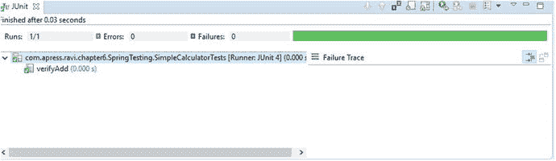
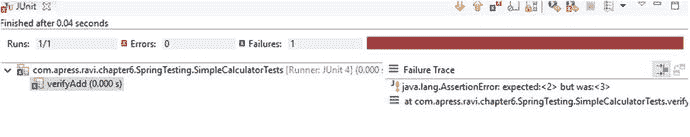
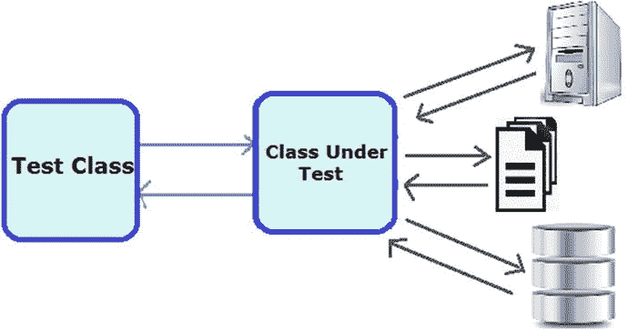
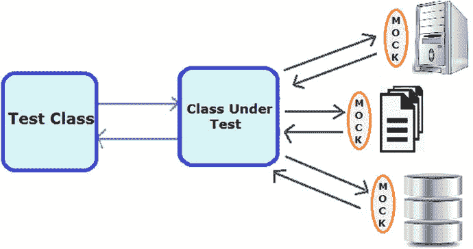
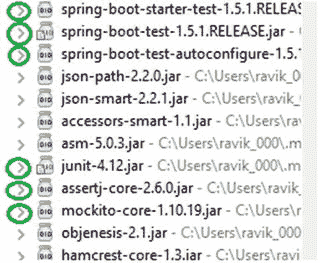
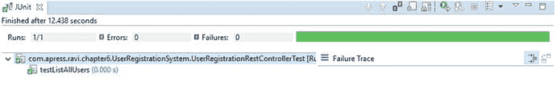
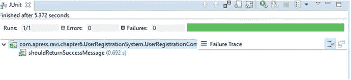

# 6. 构建 RESTful 客户端并测试 RESTful 服务

在第 2 章中，你使用 Spring Boot 构建了 RESTful 服务。你在 UserRegistrationSystem 应用程序中创建了不同的端点来执行 CRUD 操作。你已经使用过 Postman（来自 Chrome）来查看所有 HTTP 方法的实际运行情况。

在本章中，你将使用 `RestTemplate` 构建一个消费 REST 服务的 REST 客户端。然后，你将使用 Spring Test 框架为你的 UserRegistrationSystem 应用程序中的 REST 服务执行单元测试和端到端测试。

使用 `RestTemplate`，你可以从不同的应用程序调用任何 REST API。让我们使用 `RestTemplate` 构建你的 REST 客户端来访问 REST API。

## 使用 RestTemplate 构建 REST 客户端

构建一个消费 REST 服务的 REST 客户端涉及构建请求和消费包含 JSON 数据的响应。Spring 提供了实用程序类和模板来简化 REST 服务的消费。

### RestTemplate

Spring 中的 `org.springframework.web.client.RestTemplate` 用于构建一个消费 REST 服务的 REST 客户端。Spring 中的核心类是 `RestTemplate`，客户端可以使用它进行同步调用来消费 RESTful 服务。`RestTemplate` 是线程安全的。`RestTemplate` 基于模板方法设计模式。

`RestTemplate` 是 `spring-web.jar` 文件的一部分。因此，当你构建一个独立的 REST 客户端时，需要在 Maven 的 `pom.xml` 文件中添加 `spring-web` 依赖项，如清单 6-1 所示。

```

org.springframework.boot
spring-boot-starter-web

清单 6-1.
包含 spring-web 依赖项的 Maven pom.xml 文件
```


#### RestTemplate 方法

在使用 `RestTemplate` 时，客户端只需提供 URL 和参数（如果有），然后从响应中提取结果。`RestTemplate` 自身负责处理 HTTP 连接。`RestTemplate` 类继承了 `RestOperations` 接口，该接口指定了一组基本的 RESTful 操作，因此 `RestTemplate` 支持所有主要的 HTTP 方法，即 `GET`、`POST`、`PUT`、`DELETE`、`OPTIONS`、`HEAD` 以及其他用于消费 RESTful 服务的 HTTP 方法。表 6-1 列出了 `RestTemplate` 为每种 HTTP 方法提供的方法。

表 6-1.

用于 HTTP 操作的 RestTemplate 方法

| HTTP 方法 | Spring RestTemplate 方法 |
| --- | --- |
| `GET` | `getForObject(java.lang.String, java.lang.Class<T>, java.lang.Object...)` [`getForEntity(java.lang.String, java.lang.Class<T>, java.lang.Object...`](https://docs.spring.io/spring/docs/current/javadoc-api/org/springframework/web/client/RestTemplate.html#getForEntity-java.lang.String-java.lang.Class-java.lang.Object%E2%80%A6-) `)` |
| `POST` | [`postForLocation(java.lang.String, java.lang.Object, java.lang.Object...`](https://docs.spring.io/spring/docs/current/javadoc-api/org/springframework/web/client/RestTemplate.html#postForLocation-java.lang.String-java.lang.Object-java.lang.Object%E2%80%A6-) `)` [`postForObject(java.lang.String, java.lang.Object, java.lang.Class<T>, java.lang.Object...`](https://docs.spring.io/spring/docs/current/javadoc-api/org/springframework/web/client/RestTemplate.html#postForObject-java.lang.String-java.lang.Object-java.lang.Class-java.lang.Object%E2%80%A6-) `)` `postForEntity(postForObject(java.lang.String, java.lang.Object, java.lang.Class<T>, java.lang.Object...)` |
| `PUT` | [`put(java.lang.String, java.lang.Object, java.lang.Object...`](https://docs.spring.io/spring/docs/current/javadoc-api/org/springframework/web/client/RestTemplate.html#put-java.lang.String-java.lang.Object-java.lang.Object%E2%80%A6-) `)` |
| `DELETE` | [`delete(java.lang.String, java.lang.Object...`](https://docs.spring.io/spring/docs/current/javadoc-api/org/springframework/web/client/RestTemplate.html#delete-java.lang.String-java.lang.Object%E2%80%A6-) `)` |
| `HEAD` | [`headForHeaders(java.lang.String, java.lang.Object...`](https://docs.spring.io/spring/docs/current/javadoc-api/org/springframework/web/client/RestTemplate.html#headForHeaders-java.lang.String-java.lang.Object%E2%80%A6-) `)` |
| `OPTIONS` | [`optionsForAllow(java.lang.String, java.lang.Object...`](https://docs.spring.io/spring/docs/current/javadoc-api/org/springframework/web/client/RestTemplate.html#optionsForAllow-java.lang.String-java.lang.Object%E2%80%A6-) `)` |
| `any` | [`exchange(java.lang.String, org.springframework.http.HttpMethod, org.springframework.http.HttpEntity<?>, java.lang.Class<T>, java.lang.Object...`](https://docs.spring.io/spring/docs/current/javadoc-api/org/springframework/web/client/RestTemplate.html#exchange-java.lang.String-org.springframework.http.HttpMethod-org.springframework.http.HttpEntity-java.lang.Class-java.lang.Object%E2%80%A6-) `)` |

`RestTemplate` 中的方法名称表明了相应 HTTP 方法在对应方法内部的实现方式以及将要返回的内容。例如，`getForEntity` 方法将对服务器执行 HTTP `GET` 操作，并将 HTTP 响应转换为指定类型，然后将此实体返回给客户端。类似地，`postForObject` 方法将通过把给定对象转换为 HTTP 请求来对服务器执行 HTTP `POST` 操作，并通过将 HTTP 响应转换为给定类型的对象来返回响应。

接下来，我们使用 `RestTemplate` 的方法来消费第 2 章开发的 UserRegistrationSystem 应用程序中的 REST API。

### RestTemplate 操作

你将使用 `RestTemplate` 来执行 HTTP 方法的操作。让我们从一个简单的 `GET` 请求示例开始，使用 `getForEntity` 方法来获取纯 JSON。

#### 带参数的 HTTP GET 请求以检索用户

你可以使用 `RestTemplate` 中的 `getForObject` 或 `getForEntity` 方法来发起 HTTP `GET` 请求。这里，我们将使用 `getForObject` 方法进行 `GET` 请求。Spring `RestTemplate` 提供了三个重载版本的 `getForObject` 方法，如表 6-2 所示。

表 6-2.

重载的 getForObject 方法

| # | 重载的 getForObject 方法 |
| --- | --- |
| 1 | `@Override` `public <T> T getForObject(String url, Class<T> responseType, Object... uriVariables) throws RestClientException {` `RequestCallback requestCallback =` `acceptHeaderRequestCallback(responseType);` `HttpMessageConverterExtractor<T> responseExtractor =` `new HttpMessageConverterExtractor<T>(responseType,` `getMessageConverters(), logger);` `return execute(url, HttpMethod.GET, requestCallback,` `responseExtractor, uriVariables);` `}` |
| 2 | `@Override` `public <T> T getForObject(String url, Class<T> responseType, Map<String, ?> uriVariables) throws RestClientException {` `RequestCallback requestCallback =` `acceptHeaderRequestCallback(responseType);` `HttpMessageConverterExtractor<T> responseExtractor =` `new HttpMessageConverterExtractor<T>(responseType,` `getMessageConverters(), logger);` `return execute(url, HttpMethod.GET, requestCallback,` `responseExtractor, uriVariables);` `}` |
| 3 | `@Override` `public <T> T getForObject(URI url, Class<T> responseType) throws RestClientException {` `RequestCallback requestCallback =` `acceptHeaderRequestCallback(responseType);` `HttpMessageConverterExtractor<T> responseExtractor =` `new HttpMessageConverterExtractor<T>(responseType,` `getMessageConverters(), logger);` `return execute(url, HttpMethod.GET, requestCallback,` `responseExtractor);` `}` |

前两个重载方法包含一个作为 `String` 的 URI 模板、一个返回值类型和一个 URI 变量作为方法参数。第三个重载方法接受两个参数，即完整形成的 URI 和返回值类型。

让我们在 `src/main/java` 文件夹下的 `com.apress.ravi.chapter` `6` `.client` 包中创建一个 `UserRegistrationClient` 类，如清单 6-2 所示。你将消费第 2 章为你的 UserRegistrationSystem 应用程序开发的 `getUserById` REST API 端点。

```
package com.apress.ravi.chapter6.client;
import org.springframework.web.client.RestTemplate;
import com.apress.ravi.chapter2.dto.UsersDTO;
public class UserRegistrationClient {
private static RestTemplate restTemplate = new RestTemplate();
private static final String USER_REGISTRATION_BASE_URL =
"http://localhost:8080/api/user/";
public UsersDTO getUserById(final Long userId) {
return restTemplate.getForObject(
USER_REGISTRATION_BASE_URL + "/{id}",
UsersDTO.class, userId);
}
}
清单 6-2.
UserRegistrationClient 和 getForObject 的使用
```

在清单 6-2 中，你在类级别创建了一个 `RestTemplate` 实例，因为 `RestTemplate` 是线程安全的。你创建了一个值为 `http://localhost:8080/api/user/` 的类成员 `USER_REGISTRATION_BASE_URL`。

你创建了一个 `getUserById` 方法来调用 `RestTemplate` 的 `getForObject` 方法，以消费来自 URL `USER_REGISTRATION_BASE_URL + "/{id}"` 的 REST API。你指定了 `UsersDTO` 作为第二个参数，以便 `RestTemplate` 使用 `HttpMessageConverter` 将来自服务器的 HTTP 响应内容转换为 `UserDTO` 实例。

可以通过在 `UserRegistrationClient` 类中创建一个 main 方法来测试 `getUserById` 方法，如清单 6-3 所示。


```
public static void main(String[] args) {
UserRegistrationClient userRegistrationClient =
new UserRegistrationClient();
UsersDTO user =
userRegistrationClient.getUserById(1L);
System.out.println("User-ID" + user.getId()
+ " User-Name" + user.getName());
}
代码清单 6-3.
UserRegistrationClient 类中的 Main 方法
```

请注意，在运行 main 方法之前，你需要确保 UserRegistrationSystem 应用程序已启动并正在运行。

获取所有用户会稍微复杂一些，因为将 `UsersDTO[]` 类作为返回值类型提供给 `getForObject` 会得到一个 `UsersDTO` 实例的数组，如代码清单 6-4 所示。

```
public UsersDTO[] getAllUsers() {
return restTemplate.getForObject(
USER_REGISTRATION_BASE_URL,
UsersDTO[].class);
}
代码清单 6-4.
获取所有用户
```

#### 使用 JSON 数据的 HTTP POST 请求创建用户

你可以使用 `RestTemplate` 中的 `postForLocation`、`postForEntity` 或 `postForObject` 方法来发起 HTTP `POST` 请求。这里，你将使用 `postForObject` 方法进行 `POST` 请求。Spring `RestTemplate` 提供了三个重载版本的 `postForObject` 方法，如表 6-3 所示。

表 6-3.

重载的 postForObject 方法

| # | 重载的 postForObject 方法 |
| --- | --- |
| 1 | `@Override` `public <T> T postForObject(String url, Object request,Class<T> responseType, Object... uriVariables) throws RestClientException {` `RequestCallback requestCallback =` `httpEntityCallback(request, responseType);` `HttpMessageConverterExtractor<T> responseExtractor =` `new HttpMessageConverterExtractor<T>(` `responseType,` `getMessageConverters(),` `logger);` `return execute(url, HttpMethod.POST, requestCallback,` `responseExtractor, uriVariables);` `}` |
| 2 | `@Override` `public <T> T postForObject(String url, Object request, Class<T>responseType,Map<String,?>uriVariables)throws RestClientException{` `RequestCallback requestCallback =` `httpEntityCallback(request, responseType);` `HttpMessageConverterExtractor<T> responseExtractor =` `new HttpMessageConverterExtractor<T>(` `responseType,` `getMessageConverters(),` `logger);` `return execute(url, HttpMethod.POST, requestCallback,` `responseExtractor, uriVariables);` `}` |
| 3 | `@Override` `public <T> T postForObject(URI url, Object request,` `Class<T> responseType) throws RestClientException {` `RequestCallback requestCallback =` `httpEntityCallback(request, responseType);` `HttpMessageConverterExtractor<T> responseExtractor =` `new HttpMessageConverterExtractor<T>(` `responseType,` `getMessageConverters());` `return execute(url, HttpMethod.POST, requestCallback,` `responseExtractor);` `}` |

前两个重载方法包含一个 `String` 类型的 URI 模板，以及请求对象、返回值类型和 URI 变量作为方法参数。第三个重载方法接受三个参数：一个完整的 URI、一个请求对象和一个返回值类型。

你将使用 `RestTemplate` 的 `postForObject` 方法对资源 `http://localhost:8080/api/user/` 执行 `POST` 操作。`RestTemplate` 的 `postForObject` 方法对给定的 URI 和对象执行 HTTP `POST` 操作，然后根据 `responseType` 将响应转换为一种表示形式。代码清单 6-5 展示了 `createUser` 方法，该方法使用 `POST` 对象方法创建一个新用户。

```
public UsersDTO createUser(final UsersDTO user) {
return restTemplate.postForObject(
USER_REGISTRATION_BASE_URL,
user,
UsersDTO.class);
}
代码清单 6-5.
创建新用户
```

在代码清单 6-5 中，你创建了一个 `createUser` 方法，其参数类型为 `UsersDTO`，用于调用 `RestTemplate` 的 `postForObject` 方法，以使用来自 URL `USER_REGISTRATION_BASE_URL` 的 REST API。你将参数值作为第二个参数传递给了 `postForObject` 方法。你指定 `UsersDTO` 作为第三个参数，以便 `RestTemplate` 使用 `HttpMessageConverter` 将来自服务器的 HTTP 响应内容转换为 `UserDTO` 实例。

可以通过更新 `UserRegistrationClient` 类中的 main 方法来测试 `createUser` 方法，如代码清单 6-6 所示。

```
public static void main(String[] args) {
UserRegistrationClient userRegistrationClient =
new UserRegistrationClient();
UsersDTO user = new UsersDTO();
user.setName("Soniya Singh");
user.setAddress("JP Nagar; Bangalore; India");
user.setEmail("test@test.com");
UsersDTO newUser = userRegistrationClient.createUser(user);
System.out.println(newUser.getId());
}
代码清单 6-6.
UserRegistrationClient 类中的 Main 方法
```

#### 使用带参数的 HTTP PUT 请求更新用户

你将使用 `RestTemplate` 中的 `put` 方法来执行 HTTP `PUT` 操作。Spring `RestTemplate` 提供了三个重载版本的 `put` 方法，如表 6-4 所示。

表 6-4.

重载的 put 方法

| # | 重载的 put 方法 |
| --- | --- |
| 1 | `@Override` `public void put(String url, Object request,` `Object... uriVariables) throws RestClientException {` `RequestCallback requestCallback =` `httpEntityCallback(request);` `execute(url, HttpMethod.PUT, requestCallback,` `null, uriVariables);` `}` |
| 2 | `@Override` `public void put(String url, Object request,` `Map<String, ?> uriVariables) throws RestClientException {` `RequestCallback requestCallback =` `httpEntityCallback(request);` `execute(url, HttpMethod.PUT, requestCallback,` `null, uriVariables);` `}` |
| 3 | `@Override` `public void put(URI url, Object request) throws RestClientException {` `RequestCallback requestCallback =` `httpEntityCallback(request);` `execute(url, HttpMethod.PUT, requestCallback, null);` `}` |

前两个重载方法包含一个 `String` 类型的 URI 模板，以及一个请求对象和 URI 变量作为方法参数。第三个重载方法接受两个参数：一个完整的 URI 和一个请求对象。`put` 方法的返回类型是 `void`。代码清单 6-7 展示了 `updateUser` 方法，该方法将更新 `UserDTO` 实例。`put` 方法不会返回任何响应。

```
public void updateUser(final Long userId, final UsersDTO user) {
restTemplate.put(
USER_REGISTRATION_BASE_URL + "/{id}",
user,
userId);
}
代码清单 6-7.
更新现有用户
```

要测试 `updateUser`，请使用代码清单 6-8 中所示的代码更新 main 方法。

```
public static void main(String[] args) {
UserRegistrationClient userRegistrationClient =
new UserRegistrationClient();
UsersDTO user = userRegistrationClient.getUserById(1L);
System.out.println("old user name: " + user.getName());
user.setName("Ravi Kant Soni");
userRegistrationClient.updateUser(1L, user);
System.out.println("updated user name: " + user.getName());
}
代码清单 6-8.
更新后的 Main 方法
```


#### 使用带参数的 HTTP DELETE 方法删除用户

`RestTemplate` 提供了三个重载的 `delete` 方法来支持 HTTP `DELETE` 方法，如表 6-5 所示。

表 6-5.

重载的 DELETE 方法

| # | 重载的 delete 方法 |
| --- | --- |
| 1 | `@Override` `public void delete(String url, Object... uriVariables)` `throws RestClientException {` `execute(url, HttpMethod.DELETE, null, null, uriVariables);` `}` |
| 2 | `@Override` `public void delete(String url, Map<String, ?> uriVariables)` `throws RestClientException {` `execute(url, HttpMethod.DELETE, null, null, uriVariables);` `}` |
| 3 | `@Override` `public void delete(URI url) throws RestClientException {` `execute(url, HttpMethod.DELETE, null, null);` `}` |

前两个重载方法将 URI 模板作为 `String` 类型参数，并将 URI 变量作为方法参数。第三个重载方法只接受一个参数，即一个完整的 URI。`delete` 方法的返回类型是 `void`。

清单 6-9 展示了 `deleteUser` 方法，该方法将删除 `UserDTO` 实例。`delete` 方法不会返回任何响应。

```
public void deleteUser(final Long userId) {
restTemplate.delete(
USER_REGISTRATION_BASE_URL + "/{id}",
userId);
}
Listing 6-9.
删除一个用户
```

要测试这个新功能，请更新 `main` 方法，如清单 6-10 所示。

```
public static void main(String[] args) {
UserRegistrationClient userRegistrationClient =
new UserRegistrationClient();
System.out.println("Old Users List: " +
userRegistrationClient.getAllUsers().length);
userRegistrationClient.deleteUser(1L);
System.out.println("New Users List: " +
userRegistrationClient.getAllUsers().length);
}
Listing 6-10.
更新后的 Main 方法
```

### RestTemplate 的 Exchange API

现在，让我们了解 `RestTemplate` 的 exchange API，以便以更通用的方式执行 HTTP 操作，如清单 6-11 所示。

```
public ResponseEntity getUserByIdUsingExchangeAPI(final Long userId) {
HttpEntity httpEntity = new HttpEntity(new UsersDTO());
return restTemplate.exchange(USER_REGISTRATION_BASE_URL + "/{id}",
HttpMethod.GET, httpEntity, UsersDTO.class,        userId);
}
Listing 6-11.
用于获取用户的 Exchange API
```

如清单 6-11 所示，`RestTemplate` 的 exchange 方法根据传递给该方法的 `responseType` 参数泛化了返回类型，并返回类型为 `UserDTO` 的 `ResponseEntity` 实例。

要测试此功能，请更新 `main` 方法，如清单 6-12 所示。

```
public static void main(String[] args) {
UserRegistrationClient userRegistrationClient =
new UserRegistrationClient();
ResponseEntity responseEntity =
userRegistrationClient.getUserByIdUsingExchangeAPI(1L);
UsersDTO user = responseEntity.getBody();
System.out.println(user.getName());
}
Listing 6-12.
更新后的 Main 方法
```

如清单 6-12 所示，`ResponseEntity` 的 `getBody` 方法返回 `UsersDTO`。

### 使用 RestTemplate 进行基本认证

到目前为止，您已经成功为您的 UserRegistrationSystem 应用程序创建了一个 REST 客户端。

在第 4 章中，您保护了您的 REST API，并且任何通信都需要基本认证。如果没有认证，程序将抛出一个状态码为 401 的 `HttpClientErrorException` 异常。

要与安全的 API 交互，您需要以编程方式对用户凭据进行 Base64 编码，并通过在编码值前加上 `Basic` 前缀来构造授权请求头。您将在 `com.apress.ravi.chapter` `6` `.client` 包下创建一个名为 `UserRegistrationClientBasicAuth` 的类，如清单 6-13 所示。

```
package com.apress.ravi.chapter6.client;
import org.apache.tomcat.util.codec.binary.Base64;
import org.springframework.http.HttpEntity;
import org.springframework.http.HttpHeaders;
import org.springframework.http.HttpMethod;
import org.springframework.web.client.RestTemplate;
public class UserRegistrationClientBasicAuth {
private static final String securityUserName = "admin";
private static final String securityUserPassword = "password";
private static final String USER_REGISTRATION_BASE_URL =
"http://localhost:8080/api/user/";
private static RestTemplate restTemplate = new RestTemplate();
public void deleteUserById(Long userId) {
String userCredential =
securityUserName + ":" + securityUserPassword;
byte[] base64UserCredentialData =
Base64.encodeBase64(userCredential.getBytes());
HttpHeaders authenticationHeaders = new HttpHeaders();
authenticationHeaders.set("Authorization",
"Basic " + new String(base64UserCredentialData));
HttpEntity httpEntity =
new HttpEntity(authenticationHeaders);
restTemplate.exchange(USER_REGISTRATION_BASE_URL + "/{id}",
HttpMethod.DELETE, httpEntity, Void.class, userId);
}
}
Listing 6-13.
带有基本认证的 UserRegistrationClient
```

在清单 6-13 中，您连接了 `securityUserName` 和 `securityUserPassword`，然后对该用户凭据进行 Base64 编码，并通过在此编码值前加上 `Basic` 前缀来创建 `authenticationHeaders`。您还通过将 `authenticationHeaders` 传递给其构造函数，创建了一个类型为 `Void` 的 `HttpEntity` 实例。最后，您调用了 `RestTemplate` 的 exchange 方法，以执行一个 `responseType` 为 `Void` 的 HTTP `DELETE` 操作。

## 使用 Spring 测试框架测试 RESTful 服务

在本节中，您将对第 2 章中开发的 RESTful 服务执行单元测试和端到端测试。您将关注两种测试风格：单元测试和集成测试。单元测试用于验证隔离的代码单元。集成测试用于关注先前测试过的代码/单元之间的交互。

### 什么是测试？

测试是软件开发生命周期中的关键部分；它是确保软件质量和性能的过程，没有它，软件开发就无法完成。

单元测试意味着独立或单独地测试应用程序的每个组件，而集成测试则有助于确保系统中的多个组件协同工作。

一个好的实践是在单独的源文件夹（例如 `src/test/java`）或单独的项目中创建单元测试。应该测试什么是一个热门话题，有些开发者认为代码中的每条语句都应该被测试。

您可以自动或手动进行测试。自动化测试的好处是它可以在软件开发生命周期的不同阶段连续且重复地运行，当您遵循敏捷开发流程时，强烈推荐这样做。由于 Spring 框架本质上是敏捷的，它支持这种流程。

让我们讨论一个流行的 Java 测试框架 JUnit，以及使用它进行测试的基本技术。

### 使用 JUnit4 进行测试

JUnit4 ( [`http://junit.org/`](http://junit.org/) ) 是 Java 平台上流行的单元测试框架。它提供了 `@Test` 注解来标记需要测试的方法。`Test` 类中的测试方法需要使用 `@org.junit.Test` 注解进行标记。JUnit 框架提供了不同的注解和断言方法来执行单元测试。


#### JUnit 4 注解

表 6-6 列出了 JUnit 框架提供的注解。

表 6-6.

JUnit 框架中的注解

| 注解 | 导入 | 描述 |
| --- | --- | --- |
| `@Test` | `org.junit.Test` | 使用 `@Test` 注解标记公共 `void` 方法，以识别并运行测试用例。 |
| `@Before` | `org.junit.Before` | 使用 `@Before` 注解标记公共 `void` 方法，该方法需要在所在类中的每个测试方法之前执行。此方法可用于设置环境变量。 |
| `@After` | `org.junit.After` | 使用 `@After` 注解标记公共 `void` 方法，该方法需要在所在类中的每个测试方法之后执行。此方法可用于清理测试环境或释放资源。 |
| `@BeforeClass` | `org.junit.BeforeClass` | 使用 `@BeforeClass` 注解标记公共静态 `void` 方法，该方法仅需在整个测试类执行之前运行一次。 |
| `@AfterClass` | `org.junit.AfterClass` | 使用 `@AfterClass` 注解标记公共静态 `void` 方法，该方法仅需在整个测试类执行之后运行一次。此方法可用于执行一些清理活动。 |
| `@Ignore` | `org.junit.Ignore` | 使用 `@Ignore` 注解标记方法，该方法不应被执行。 |

#### JUnit 4 断言方法

JUnit 框架提供了 `org.junit.Assert` 类，其中包含一组断言方法，可用于编写单元测试以测试特定条件。这些方法将预期值与实际值进行比较，以验证测试结果。表 6-7 列出了 JUnit 4 提供的一些断言方法。

表 6-7.

JUnit 框架中的断言方法

| 断言方法 | 描述 |
| --- | --- |
| `assertTrue(boolean expected, boolean actual)` | 此方法检查布尔条件是否为真。 |
| `assertFalse(boolean condition)` | `assertFalse` 方法检查布尔条件是否为假。 |
| `assertEquals(boolean expected, expected, actual)` | `assertEquals` 使用 `equals()` 方法比较任意两个对象是否相等。 |
| `assertEquals(boolean expected, expected, actual, tolerance)` | `assertEquals` 方法比较 float 或 double 值，tolerance 定义了必须相同的小数位数。 |
| `assertNull(Object object)` | `assertNull` 测试给定对象是否为 null。 |
| `assertNotNull(Object object)` | `assertNotNull` 测试给定对象是否不为 null。 |
| `assertSame(Object object1,Object object2)` | `assertSame` 方法测试两个对象是否引用同一个对象。 |
| `assertNotSame(Object object1,Object object2)` | `assertNotSame` 方法测试两个对象是否不引用同一个对象。 |

#### 示例：实现 JUnit 4

让我们开发一个简单的应用程序来对两个数进行加法运算，如清单 6-14 所示。

```
package com.apress.ravi.chapter6.SpringTesting;
public class SimpleCalculator {
public long addOperation(int x, int y) {
return x + y;
}
}
清单 6-14.
执行加法运算的简单计算器
```

请注意，需要将 JUnit4 JAR 添加到应用程序的 `CLASSPATH` 中，才能编译和运行为 JUnit 4 创建的测试用例。

现在，你将使用 JUnit 4 测试 `SimpleCalculator` 类中的简单 `addOperation` 方法。STS IDE 支持通过向导创建 JUnit 测试。你将创建测试类 `SimpleCalculatorTests`，如清单 6-15 所示。

```
package com.apress.ravi.chapter6.SpringTesting;
import static org.junit.Assert.assertEquals;
import org.junit.After;
import org.junit.Before;
import org.junit.Test;
public class SimpleCalculatorTests {
private SimpleCalculator simpleCalculator;
@Before
public void setup() {
simpleCalculator = new SimpleCalculator();
}
@Test
public void verifyAdd() {
long sum = simpleCalculator.addOperation(2, 1);
assertEquals(3, sum);
}
@After
public void teardown() {
simpleCalculator = null;
}
}
清单 6-15.
测试加法操作方法
```

在清单 6-15 中，`setup` 方法使用 `@Before` 注解进行标记，以执行实例成员变量的初始化，并指示 JUnit 在 `SimpleCalculatorTests` 类中任何测试方法执行之前运行此 setup 方法。`teardown` 方法使用 `@After` 注解进行标记，并指示 JUnit 在 `SimpleCalculatorTests` 类中任何测试方法执行之后运行 teardown 方法以执行清理。

`verifyAdd` 方法使用 `@Test` 注解进行标记，以将 `verifyAdd` 标识为 JUnit 测试方法。`verifyAdd` 方法包含确保你的生产代码按预期工作的代码。

现在，通过右键单击测试类并选择“RUN AS JUnit test”来运行你的测试用例。JUnit 视图有助于验证测试的成功或失败。成功通过 JUnit 测试后，结果视图将显示一个绿色条，如图 6-1 所示。



图 6-1.

绿色条表示测试成功通过

当 JUnit 测试失败时，结果视图将显示一个红色条，如图 6-2 所示。



图 6-2.

红色条表示测试失败

```
@Test
public void verifyAdd() {
long sum = simpleCalculator.addOperation(2, 1);
assertEquals(2, sum);
}
```

## 敏捷软件测试

在软件开发领域，敏捷指的是一种项目管理方法，团队在应用程序新模块的开发过程中，专注于协作、灵活性、简单性和响应性等原则。当使用敏捷软件方法论时，团队以称为冲刺的较小单元交付项目或分配的工作，并与包括利益相关者在内的跨职能团队持续协作。这种特定的方法论本质上是增量式和迭代式的，侧重于有效交付分配的工作。

敏捷软件测试是指在敏捷工作流背景下，对软件进行任何错误和性能问题测试的实践。它包括单元测试和集成测试。以下部分将帮助你理解单元测试和集成测试的目标。

### 单元测试

单元测试是指测试代码中的单个功能/方法。单元测试由软件开发人员编写，用于测试其代码中的基本功能片段并防止错误。

“被测类”这一概念指的是，每当你编写任何单元测试用例时，你都会针对一个正在被测试的类创建一个测试类，并且你必须为该类编写单元测试用例，如图 6-3 所示。



图 6-3.

被测类及其依赖项

让我们举一个例子，你有两个名为 `UserRegistrationService` 和 `UserRegistrationDAO` 的类，用于通过与数据库交互来执行 CRUD 操作。`UserRegistrationService` 类需要 `UserRegistrationDAO` 对象来从数据库加载用户列表。这个 `UserRegistrationDAO` 对象是一个真实对象，因此在测试你的 `UserRegistrationService` 类时，你需要有一个与数据库有效连接的 `UserRegistrationDAO` 对象。你还必须在数据库中插入一个用户用于测试。设置数据库连接、向数据库插入用户，然后测试 `UserRegistrationService` 类可能工作量很大。


#### 使用模拟对象对依赖类进行单元测试

你可以通过创建一个伪造的 `UserRegistrationDAO` 实例来减少工作量，该实例将返回预期的用户列表，并将其传递给 `UserRegistrationService`。这个伪造的 `UserRegistrationDAO` 不会与数据库建立连接。这个伪造的 `UserRegistrationDAO` 对象被称为模拟对象，它是 `realUserRegistrationDAO` 对象的替代品。这将简化对 `UserRegistrationService` 类的测试。图 6-4 展示了如何为被测类模拟一个依赖项。



图 6-4.
被测类中的模拟依赖对象

##### Mockito 框架

Mockito 框架是一个用于创建和配置模拟对象的开源模拟框架。

再次说明，模拟对象是一个模仿真实对象的假对象，而创建假对象的过程称为模拟。Java 中有多个可用于模拟的库，例如 EasyMock 和 Mockito。

要使用 Mockito，你需要在应用程序上下文中拥有 Mockito JAR 以及 JUnit。Mockito 支持如下列出的字段级注解：

*   `@Mock`：此注解用于为被注解的字段创建一个模拟对象。
*   `@Spy`：此注解为其注解的真实对象字段创建一个间谍，当监视或存根其特定方法时，这可以被称为部分模拟。
*   `@RunWith(MockitoJUnitRunner.class)`：使用 `@Mock` 注解和 `@Spy` 注解创建模拟对象需要将 `@RunWith(MockitoJUnitRunner.class)` 注解应用于你的测试类。当 `MockitoJUnitRunner` 执行单元测试时，所有被注解的字段都将创建模拟和间谍对象。

请参考 [`http://mockito.org/`](http://mockito.org/) 获取关于 Mockito 框架的更多详细信息。

### 集成测试

在集成测试中，各个模块被组合在一起，并作为一个整体进行逻辑测试。软件开发阶段的集成测试发生在单元测试之后。

## 测试 Spring Boot 应用程序

Spring 框架中的 `spring-test` 模块通过提供丰富的注解集、工具类和模拟对象，允许开发人员执行单元测试和集成测试。让我们通过使用所需的依赖项更新 Maven `pom.xml` 文件来设置环境。

### Maven 依赖

Spring Boot 提供了名为 `spring-boot-starter-test` 的启动器 POM，它会自动将 `spring-test` 模块添加到 Spring Boot 应用程序中。清单 6-16 展示了 `pom.xml` 中的依赖项。

```
org.springframework.boot
spring-boot-starter-test
test

清单 6-16.
pom.xml 中的依赖项
```

这个启动器 POM 将 JUnit（Java 应用程序单元测试的事实标准）、AssertJ（一个断言库）、Mockito（一个 Java 模拟框架）以及 [Spring Test](http://docs.spring.io/spring/docs/4.3.10.RELEASE/spring-framework-reference/htmlsingle/#integration-testing%23_top) 和 Spring Boot Test（用于 Spring Boot 应用程序的工具和集成测试支持）引入到你的应用程序中，如图 6-5 所示。



图 6-5.
类路径中的 JAR

### Spring 测试中的注解

Spring 框架提供了不同的注解，开发人员可以使用它们来执行单元测试和集成测试。

让我们检查典型的测试用例，以理解 `spring-test` 模块和 Spring 框架提供的注解。清单 6-17 展示了一个使用 Spring Boot Test 构建的 Spring Test 示例。

```
package com.apress.ravi.chapter6.UserRegistrationSystem;
import org.junit.After;
import org.junit.Before;
import org.junit.Test;
import org.junit.runner.RunWith;
import org.springframework.boot.test.context.SpringBootTest;
import org.springframework.test.context.junit4.SpringRunner;
@RunWith(SpringRunner.class)
@SpringBootTest(classes = UserRegistrationSystemApplication.class,
webEnvironment = WebEnvironment.RANDOM_PORT)
public class UserRegistrationSystemApplicationTests {
@Before
public void setup() {
}
@Test
public void testFunction() {
}
@After
public void teardown() {
}
}
清单 6-17.
使用 Spring Boot Test 进行单元测试
```

清单 6-17 包含三个方法：`setup`、`testFunction` 和 `teardown`。每个方法都使用了 JUnit 注解进行标注。

*   `@RunWith(SpringRunner.class)`：`@RunWith(SpringRunner.class)` 注解指示 JUnit 使用 `SpringJUnit4ClassRunner` 类来运行测试用例。`SpringRunner` 类扩展了 `SpringJUnit4ClassRunner` 类。`@RunWith` 注解是一个 JUnit 注解；它执行被 `@RunWith` 注解标注的类中的测试，或者执行扩展了另一个被 `@RunWith` 注解标注的类中的测试。这意味着被注解的测试类不会由 JUnit 框架中的内置 API 执行。相反，它将使用 `SpringJUnit4ClassRunner` 在 `SpringApplicationContext` 环境中运行测试用例。
*   `@SpringBootTest`：Spring Boot 提供了 `@SpringBootTest` 注解，用于在 Spring Boot 的支持下启动；当你需要 Spring Boot 特性时，它是标准 Spring Test 的 `@ContextConfiguration` 注解的替代方案。`@ContextConfiguration` 注解用于为测试类测试应用程序上下文。它会缓存 `ApplicationContext` 并将其放入静态内存中，持续整个测试或测试套件的时间，并且整个测试在同一个 JVM 中执行，因为 `ApplicationContext` 存储在静态内存中。
*   `webEnvironment`：`@SpringBootTest` 的 `webEnvironment` 属性为测试配置 Web 环境。它允许开发人员使用模拟的 Servlet 环境或运行在 `DEFINED_PORT` 或 `RANDOM_PORT` 上的真实 HTTP 服务器进行测试。
*   `classes`：你可以使用 `@SpringBootTest` 的 `classes` 属性来加载特定的配置。默认情况下，它会搜索 `@SpringBootApplication` 类来加载 `@Configuration`。


### REST 控制器单元测试

Spring 框架中的控制反转（IoC）通过提供依赖注入简化了单元测试。通过允许开发者隔离测试代码，可以轻松地使用预期行为来模拟依赖关系。

测试 Spring MVC 控制器的传统方法遵循这一概念。清单 6-18 展示了 `UserRegistrationRestController` 类中 `listAllUsers` 方法的单元测试。

```
package com.apress.ravi.chapter6.UserRegistrationSystem;
import java.util.ArrayList;
import java.util.List;
import static org.mockito.Mockito.when;
import org.junit.After;
import org.junit.Assert;
import org.junit.Before;
import org.junit.Test;
import org.junit.runner.RunWith;
import org.mockito.Mock;
import org.mockito.Spy;
import org.springframework.boot.test.context.SpringBootTest;
import org.springframework.boot.test.context.SpringBootTest.WebEnvironment;
import org.springframework.http.HttpStatus;
import org.springframework.http.ResponseEntity;
import org.springframework.test.context.junit4.SpringRunner;
import org.springframework.test.util.ReflectionTestUtils;
import com.apress.ravi.chapter2.UserRegistrationSystemApplication;
import com.apress.ravi.chapter2.Rest.UserRegistrationRestController;
import com.apress.ravi.chapter2.dto.UsersDTO;
import com.apress.ravi.chapter2.repository.UserJpaRepository;
@RunWith(SpringRunner.class)
@SpringBootTest(classes = UserRegistrationSystemApplication.class,
webEnvironment = WebEnvironment.RANDOM_PORT)
public class UserRegistrationRestControllerTest{
@Spy
private UserRegistrationRestController userRegistrationRestController;
@Mock
private UserJpaRepository userJpaRepository;
@Before
public void setup() {
userRegistrationRestController = new UserRegistrationRestController();
ReflectionTestUtils.setField(userRegistrationRestController,
"userJpaRepository", userJpaRepository);
}
@Test
public void testListAllUsers() {
List userList = new ArrayList();
userList.add(new UsersDTO());
when(this.userJpaRepository.findAll()).thenReturn(userList);
ResponseEntity> responseEntity =
this.userRegistrationRestController.listAllUsers();
Assert.assertEquals(HttpStatus.OK, responseEntity.getStatusCode());
Assert.assertEquals(1, responseEntity.getBody().size());
}
@After
public void teardown() {
userRegistrationRestController = null;
}
}
清单 6-18.
REST 控制器单元测试
```

在清单 6-18 中，你在 `src/test/java` 文件夹下的 `com.apress.ravi.chapter` `6` `.UserRegistrationSystem` 包中创建了一个 `UserRegistrationRestControllerTest` 测试类。你使用 `@RunWith(SpringRunner.class)` 注解标记了该类，该注解支持模拟依赖的 `Object`，以及 `@SpringBootTest` (`classes = UserRegistrationSystemApplication.class, webEnvironment = WebEnvironment.RANDOM_PORT)` 注解。`webEnvironment=RANDOM_PORT` 部分会以随机端口启动服务器（有助于避免测试环境中的端口冲突）。

`UserRegistrationRestControllerTest` 类使用 Mockito 的 `@Spy` 注解来监视 `UserRegistrationRestController`。该测试类使用 `@Mock` 注解来模拟 `UserRegistrationRestController` 的唯一依赖：`UserJpaRepository`。

在 setup 方法中，你创建了一个 `UserRegistrationRestController` 实例，并通过调用 Spring 的 `ReflectionTestUtils` 工具类的 `setField` 方法，将模拟的 `UserJpaRepository` 注入其中。你使用 `@Before` 注解标记了 setup 方法。

在 `testListAllUsers` 方法中，你使用了 Mockito 的 `when` 和 `thenReturn` 方法来设置 `UserJpaRepository` 模拟对象的行为。你还指定了当调用 `UserJpaRepository` 的 `findAll` 方法时，应返回一个用户列表。最后，你调用了 `listAllUsers` 方法并断言了控制器的返回值。

在 teardown 方法中，你将 `UserRegistrationRestController` 赋值为 null，并使用 `@After` 注解标记了该方法。

当你以 JUnit 测试方式运行该测试类时，可以在 JUnit 视图中查看结果，如图 6-6 所示。



图 6-6.

JUnit 视图

如图 6-6 所示，`UserRegistrationRestControllerTest` 被视为一个 POJO，因此并未测试控制器的请求映射验证。因此，在下一节中，你将使用 Spring MVC 测试框架，该框架允许你将控制器作为 MVC 控制器进行测试。这样，`DispatcherServlet` 将拦截请求并生成响应，其方式与在实际启动 Web 服务器时在 Web 容器中运行相同。

### 使用 Spring MVC 测试框架测试 Web 层

在本节中，你将使用 `@WebMvcTest` 注解进行测试，该注解可与 `@RunWith(SpringRunner.class)` 结合用于典型的 Spring MVC 测试，并且当测试仅关注 Spring MVC 组件时可以使用。使用 `@WebMvcTest` 注解的测试类将自动配置 `MockMvc`（包括对 HtmlUnit WebClient 和 Selenium WebDriver 的支持）。

通常，`@WebMvcTest` 与 `@MockBean` 结合使用，以创建 `@Controller` Bean 所需的任何协作者。要开始使用 Spring MVC 测试框架，你需要熟悉 `MockMVC`。


#### MockMvc

`MockMvc` 类是 Spring MVC 测试框架的核心类。`org.springframework.test.web.servlet.MockMvc` 类可用于为使用 Spring MVC 框架开发的应用程序编写测试。`MockMvc` 类可用于执行 HTTP 请求。

`MockMvc` 模拟了整个 Spring 基础设施，并通过 `org.springframework.test.web.servlet.MockMvcBuilder` 接口的实现来创建，这使得 Spring MVC 测试框架大量使用了构建器模式。

`MockMvc` 类包含 `perform` 方法，该方法可通过传递相对路径来运行测试用例。之后，可以使用 `Expect` 方法来验证控制器内的不同组件。

`andExpect (status().OK())` 行可用于验证 200 状态码。类似地，还可以执行 `contentType` 验证、XPath 验证、数据验证模型、URL 验证等。

让我们在 `src/test/java` 文件夹下的 `com.apress.ravi.chapter` `6` `.UserRegistrationSystem` 包中创建 `UserRegistrationControllerTest` 类，如代码清单 6-19 所示，以演示如何测试 `UserRegistrationRestController` 的 `getUserById` 方法。你还需要模拟控制器所需的依赖项。

```
package com.apress.ravi.chapter6.UserRegistrationSystem;
import static org.hamcrest.Matchers.is;
import static org.mockito.Mockito.when;
import static org.springframework.test.web.servlet.request.MockMvcRequestBuilders.get;
import static org.springframework.test.web.servlet.result.MockMvcResultHandlers.print;
import static org.springframework.test.web.servlet.result.MockMvcResultMatchers.content;
import static org.springframework.test.web.servlet.result.MockMvcResultMatchers.jsonPath;
import static org.springframework.test.web.servlet.result.MockMvcResultMatchers.status;
import java.nio.charset.Charset;
import org.junit.Before;
import org.junit.Test;
import org.junit.runner.RunWith;
import org.springframework.beans.factory.annotation.Autowired;
import org.springframework.boot.test.autoconfigure.web.servlet.WebMvcTest;
import org.springframework.boot.test.mock.mockito.MockBean;
import org.springframework.http.MediaType;
import org.springframework.test.context.ContextConfiguration;
import org.springframework.test.context.junit4.SpringRunner;
import org.springframework.test.web.servlet.MockMvc;
import com.apress.ravi.chapter2.UserRegistrationSystemApplication;
import com.apress.ravi.chapter2.Rest.UserRegistrationRestController;
import com.apress.ravi.chapter2.dto.UsersDTO;
import com.apress.ravi.chapter2.repository.UserJpaRepository;;
@RunWith(SpringRunner.class)
@WebMvcTest(controllers = UserRegistrationRestController.class)
@ContextConfiguration(classes = UserRegistrationSystemApplication.class)
public class UserRegistrationControllerTest {
@Autowired
private MockMvc mockMvc;
@MockBean
private UserJpaRepository userJpaRepositoryMock;
private MediaType contentType;
private UsersDTO user;
@Before
public void setup() {
contentType = new MediaType(MediaType.APPLICATION_JSON.getType(),
MediaType.APPLICATION_JSON.getSubtype(),
Charset.forName("utf8"));
user = new UsersDTO();
user.setName("Ravi Kant Soni");
user.setAddress("JP Nagar; Bangalore; India");
user.setEmail("ravikantsoni.author@gmail.com");
}
@Test
public void shouldReturnSuccessMessage() throws Exception {
when(this.userJpaRepositoryMock.findById(1L)).thenReturn(user);
this.mockMvc.perform(get("/api/user/1"))
.andExpect(status().isOk())
.andExpect(content().contentType(contentType))
.andExpect(jsonPath("'.name", is("Ravi Kant Soni")))
.andExpect(jsonPath("'.address",
is("JP Nagar; Bangalore; India")))
.andExpect(jsonPath("'.email",
is("ravikantsoni.author@gmail.com")))
.andDo(print());
}
}
代码清单 6-19.
使用 Spring MVC 测试测试 Web 层
```

让我们详细看看代码清单 6-19。在其中，你测试了 `UserRegistrationRestController` 的 `getUserById` 方法的行为。

*   @RunWith、@WebMvcTest 和 @ContextConfiguration：你使用了 `@ContextConfiguration` 注解来查找主配置类。`@WebMvcTest` 注解用于测试 Web 层。因此，Spring Boot 将只实例化 Web 层，而不是整个上下文。
*   @Autowired MockMvc：你自动装配了 `MockMvc`，而不是手动构建它。因此，Spring 将创建并配置 `MockMvc`，并在运行时注入它。`@Autowired MockMvc` 与 `@WebMvcTest(controllers=UserRegistrationRestControlle.class`) 结合使用，提供了一个完全配置好的 `MockMvc` 实例。使用 `MockMvc`，你向 `UserRegistrationRestController` 发送了模拟 HTTP 请求，并测试了 `UserRegistrationRestController` 在不运行于服务器内时的行为。
*   @MockBean：你使用 `@MockBean` 注解标注了 `UserJpaRepository`，以创建并注入一个 `UserJpaRepository` 的模拟对象。
*   @Before：你使用 `@Before` 注解标注了 setup 方法。你创建并初始化了在 `@Test` 方法中使用的 `MediaType`（`contentType`）和 `UserDTO`（`user`）领域对象。
*   @Test：你使用 `@Test` 注解标注了 `shouldReturnSuccessMessage` 方法。你使用了 Mockito 来对 `UserJpaRepository` 模拟对象的 `findById` 方法进行桩化，使其返回已初始化的 `UserDTO` 实例。你使用了 `MockMvcRequestBuilders` 类的 `get` 方法来创建一个 `GET` 请求。`MockMvcRequestBuilders` 还提供了其他方法，如 `post`、`put` 和 `delete`，用于创建相应的 HTTP 请求。你调用了 `MockMvc` 的 `perform` 方法来向 `"/api/user/{id}"` 发起一个 `GET` 请求，并使用 `Expect` 方法来对响应进行断言：
    *   响应中的 HTTP 状态码为 200。
    *   响应内容中的 `contentType`。
    *   用户属性的值（name、address、e-mail）与你用于初始化 `UserDTO` 的值一致。你在 `jsonPath` 方法中使用了 `JsonPath` 表达式来对响应体编写断言。简而言之，JSON 的 `JsonPath` 等同于 XML 的 `xPath`。

最后，你使用了 `andDo(print())` 来在控制台获取以下输出：

```
MockHttpServletRequest:
HTTP Method = GET
Request URI = /api/user/1
Parameters = {}
Headers = {}
Handler:
Type = com.apress.ravi.chapter2.Rest.UserRegistrationRestController
Method = public org.springframework.http.ResponseEntity com.apress.ravi.chapter2.Rest.UserRegistrationRestCont
roller.getUserById(java.lang.Long)
Async:
Async started = false
Async result = null
Resolved Exception:
Type = null
ModelAndView:
View name = null
View = null
Model = null
FlashMap:
Attributes = null
MockHttpServletResponse:
Status = 200
Error message = null
Headers = {Content-Type=[application/json;charset=UTF-8]}
Content type = application/json;charset=UTF-8
Body = {"id":null,"name":"Ravi Kant Soni","address":"JP Nagar; Bang
alore; India","email":"ravikantsoni.author@gmail.com"}
Forwarded URL = null
Redirected URL = null
Cookies = []
```

当你运行测试时，测试结果的 JUnit 视图如图 6-7 所示。



图 6-7.
测试的 JUnit 视图


## 本章小结

在本章中，你使用 `RestTemplate` 创建了一个 REST 客户端，并利用它对资源执行了 `GET`、`POST`、`PUT` 和 `DELETE` 等客户端操作。你了解了用于消费 REST API 的不同 `RestTemplate` 方法和操作。你还使用 `RestTemplate` 实现了基本身份验证。

接着，你转向使用 Spring 测试框架测试 RESTful 服务。我介绍了单元测试和集成测试。你了解了 JUnit4 框架中的不同注解和断言方法。然后，你学习了模拟框架和模拟对象。最后，你使用测试框架和 Spring MVC 测试框架测试了 REST 服务。

在下一章中，你将学习如何在生产环境中管理和监控你的 Spring Boot 应用。

