# 7. 使用 Spring Boot Actuator 进行应用监控

应用监控可确保运行在服务器上的应用按预期工作。在第 2 章中，你使用 Spring Boot 开发了 RESTful 服务。此外，当你的 Spring Boot 应用部署到生产环境时，Spring Boot 还支持额外的功能来监控和管理它。

例如，假设一位开发者刚刚完成了他的应用并将更改推送到了仓库。接着，这位开发者找到运维团队，请他们部署这个应用。作为回应，运维团队向开发者索要运行手册（即操作指南），其中包含部署说明、发生异常时需要执行的操作等。运维团队还需要了解应用的配置细节。经验丰富的开发者甚至会分享有关外部属性及其在服务器上位置的信息，运维团队将据此使用可接受的值来配置外部属性。到目前为止，一切顺利。

运维团队最后的问题是：“你们如何监控这个应用？” 哎呀，这在业务需求中并未提及。于是，开发者开始思考各种方案，比如向经理申请更多资金来开发一个监控工具，但这可能行不通。

Spring 框架是构建复杂企业应用最流行的框架之一。这些应用过去常常在许多服务器上运行，服务于多个领域和环境，例如本地构建环境、测试环境、QA 环境，有时还有用户验收测试环境，然后才会部署到生产环境。每个环境都有不同的配置，例如在本地环境中，开发者可能使用开源数据库，而在生产环境中，数据库可能是 Oracle。此外，本地环境可能使用 ActiveMQ 进行消息传递，而生产环境可能使用 IBM 消息源。企业需求（如持续构建等）需要处理很多问题。这不像你只需创建一个 `.war` 文件然后放到服务器上那么简单。在本章中，你将使用本地环境进行部署。

通过使用 HTTP 端点，你可以在生产环境中管理已部署的应用。Spring Boot 拥有一系列功能，让你在部署应用后，能够在生产环境或任何环境中监控你的 Spring Boot 应用。

在 Spring Boot 中，你可以通过多种方式监控和管理你的 Spring Boot 应用，例如 HTTP、JVM 和 SSH。在本章中，你将了解如何使用 Spring Boot 的 Actuator 模块来监控你的应用。本章将概述 DevOps 如何使用 Spring Boot。DevOps 是开发者和运维团队的结合。

## 介绍 Spring Boot Actuator

[Spring Boot Actuator](http://docs.spring.io/spring-boot/docs/current/reference/htmlsingle/#production-ready) 是 Spring Boot 的一个子项目。Spring Boot 中的 Actuator 模块使得在你的 Spring Boot 应用中使用生产就绪功能成为可能。Actuator 暴露了各种端点，用于监控你正在运行的应用的指标和统计数据。使用 Actuator，你可以监控健康状态、查看指标、收集日志、执行线程转储、了解垃圾回收、查看环境变量，以及查看来自 `BeanFactory` 的 Bean。此外，你可以使用它来监控你的应用，以进行任何生产支持和相关事务，例如监控进程、检查健康状态、检查进程是否在运行、检查数据库连接是否正常，以及检查相关指标，如 JVM 中的堆大小或可用空间。所有这些都由 Actuator 处理。

Spring Boot 提供了可以暴露一些 REST 端点的库，以便不同的监控工具可以使用这些 REST 端点从 REST 端点获取数据。你可以使用 `<host>:port/<endpoint>` 访问所有这些端点。例如，如果你想监控应用的运行状况，你需要访问 `http://localhost:8080/health`。

### 启用 Actuator 模块

要启用 Actuator 模块，请在浏览器中访问 [`http://start.spring.io/`](http://start.spring.io/)。Spring Initializr 站点上的“运维”部分包含一系列依赖项，例如 Actuator、Actuator Docs 和 Remote Shell，如图 7-1 所示。

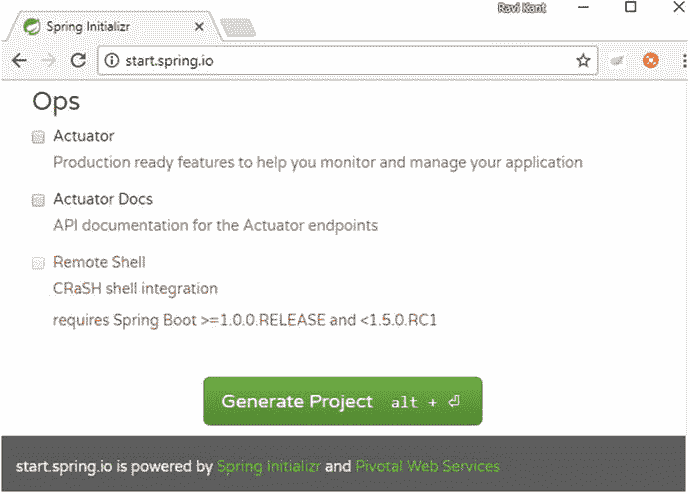

图 7-1.

Spring Initializr 中的 Spring Boot Starter 依赖项

让我们在你的 UserRegistrationSystem 应用的 Maven `pom.xml` 文件中手动添加 `spring-boot-starter-actuator` 依赖项，如清单 7-1 所示。

```
org.springframework.boot
spring-boot-starter-actuator

清单 7-1.
Actuator 依赖项
```

只需在你的 `pom.xml` 文件中添加 `spring-boot-starter-actuator` 依赖项，Actuator 模块就会在你的 Spring Boot 应用中启用，并且健康检查、指标和其他功能将自动应用于你的应用。

## Actuator 端点

Actuator 端点允许开发者监控正在运行的 Spring Boot 应用，并且还允许开发者与 Spring Boot 应用进行交互。Spring Boot 提供了许多内置端点，例如一个健康端点，它提供有关你正在运行的 Spring Boot 应用的基本健康信息，并且该端点将映射到 `/health`。你也可以添加自己的端点。

默认情况下，Spring Boot Actuator 是安全的，因此并非任何人都可以访问这些端点。你可以通过在 `application.properties` 文件中设置属性来禁用这些安全功能，如下所示：

```
management.security.enabled=false
```

然而，由于这些 Actuator 端点会暴露环境变量和指标信息，你最好还是让它们保持安全状态。

让我们启动 UserRegistrationSystem 应用，并探索 Spring Boot 开箱即用的最常见端点。图 7-2 显示了 STS 控制台中的端点。

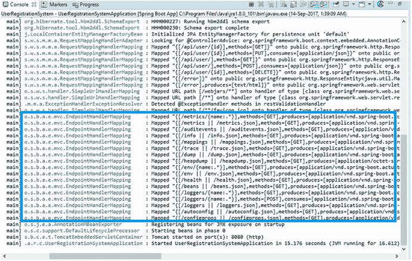

图 7-2.

控制台中的端点

如图 7-2 所示，STS 控制台中出现了不同的端点。默认情况下，你有 `/info`、`/health`、`/beans`、`/dump`、`/env` 等端点。所有这些端点都是由 Actuator 提供的 REST 端点。让我们探索其中几个 REST 端点，以便在接下来的章节中获取数据。


### /info

此端点显示关于 Spring Boot 应用程序的任意信息。图 7-3 展示了浏览器中的 `/info` 端点。

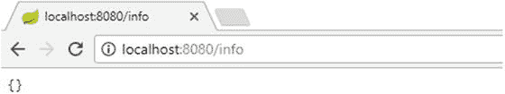

图 7-3.

浏览器中的 /info 端点不显示任何内容

如图 7-3 所示，默认情况下 `/info` 端点不显示任何内容。不过，你可以覆盖这些信息。尽管如此，`/info` 端点显示的是非敏感数据。

### /env

`/env` 端点返回你在 JVM 内配置的所有敏感信息，例如 `{"local.server.port":8080}`。换句话说，它显示你的应用程序正在运行的端口，并显示系统属性，例如 JDK 和 Java 版本（`jre1.8.0_101\\bin`）、你的项目正在运行的目录信息（`user.dir`）、库路径（`java.library.path`）、时区（`user.timezone":"Asia/Calcutta"`）等等。它还显示属性信息以及你添加属性的属性文件名，例如 `[classpath:/application.properties]":{"management.security.enabled":"false"}`。图 7-4 展示了浏览器中 `/env` 数据的裁剪图像。

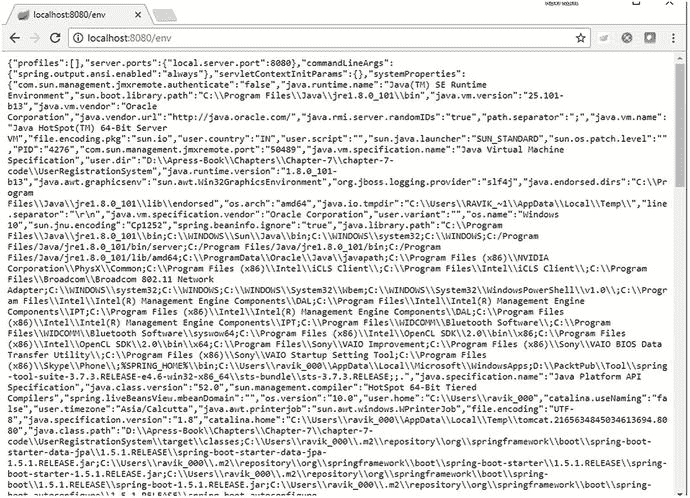

图 7-4.

浏览器中的 /env 数据

### /metrics

此端点显示来自操作系统、JVM 以及应用级别的指标信息，例如内存堆、处理器、线程、类加载器和线程池。

它显示当前运行应用程序的指标信息。默认情况下它是敏感的。指标信息返回以下数据，如图 7-5 所示：

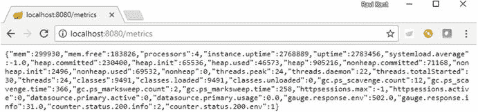

图 7-5.

/metrics 端点

```
{
"mem":295288,
"mem.free":177815,
"processors":4,
"instance.uptime":620849,
"uptime":632125,
"systemload.average":-1.0,
"heap.committed":225792,
"heap.init":65536,
"heap.used":47976,
"heap":905216,
"nonheap.committed":71360,
"nonheap.init":2496,
"nonheap.used":69497,
"nonheap":0,
"threads.peak":20,
"threads.daemon":18,
"threads.totalStarted":26,
"threads":20,
"classes":9559,
"classes.loaded":9559,
"classes.unloaded":0,
"gc.ps_scavenge.count":12,
"gc.ps_scavenge.time":169,
"gc.ps_marksweep.count":2,
"gc.ps_marksweep.time":219,
"httpsessions.max":-1,"httpsessions.active":0,
"datasource.primary.active":0,
"datasource.primary.usage":0.0,
"gauge.response.userregistrationsystemhealth":214.0,
"gauge.response.info":37.0,
"counter.status.200.info":1,
"counter.status.200.userregistrationsystemhealth":1
}
```

如图 7-5 所示，你可以使用 `/metrics` 端点查看指标信息。此端点显示 `heap.used` 详情、`nonheap.used` 详情、可用内存量（`mem.free`）、正在使用的处理器数量、实例运行时间信息、线程数等等。

### /trace

此端点通过显示人们正在访问的 REST 端点列表，来展示已发出的跟踪信息请求。例如，在图 7-6 中，你可以看到我访问了 `/metrics`、`/env` 和 `/info`。这显示了针对这些特定端点最后几次被命中的请求。`/trace` 端点还显示人们正在访问的不同 REST 端点。如果你访问 `/trace`，你可以看到人们通过特定 REST 服务最后访问的请求。

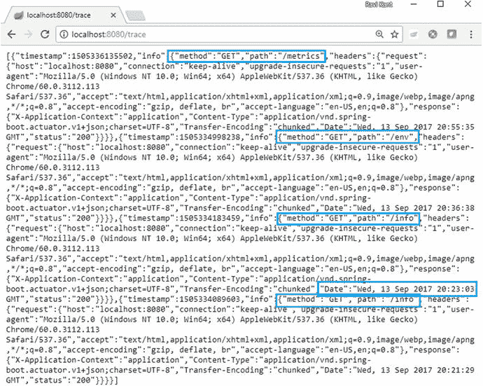

图 7-6.

/trace 端点

### /health

此端点可用于检查正在运行的 Spring Boot 应用程序的健康状况或状态。它帮助开发者在生产环境宕机时监控软件的健康状况和跟踪状态。通过 HTTP 访问时显示的默认信息如下：

```
{
"status":"UP",
"diskSpace":{"status":"UP",
"total":142753132544,
"free":97978245120,
"threshold":10485760
},
"db":{"status":"UP","database":"H2","hello":1}
}
```

这显示了正在运行的应用程序的磁盘空间。`/health` 端点还显示服务器健康状况，并提供服务器是否正常运行的信息。如果存在任何数据库连接，它会自动显示数据库连接。因此，如果你自动装配了任何数据库连接，比如 H2 数据库，它会自动显示在这里。默认情况下，此端点不敏感。图 7-7 展示了浏览器中的该端点。

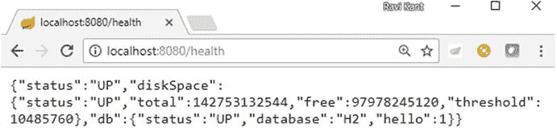

图 7-7.

/health 端点

你可以在 [`http://docs.spring.io/spring-boot/docs/current/reference/htmlsingle/#production-ready-endpoints`](http://docs.spring.io/spring-boot/docs/current/reference/htmlsingle/#production-ready-endpoints) 找到现有 Actuator 端点的完整列表。

## 自定义 Actuator 端点

你可以通过 Spring 属性文件（`application.properties`）使用以下格式来自定义 Actuator 端点：

```
endpoints.[端点名称].[要自定义的属性]
```

### 可自定义的属性

有三个属性可用于自定义 Actuator 端点。

*   `id`：通过此属性，端点将通过 HTTP 被访问。
*   `enabled`：此属性提供对端点的访问控制。如果设置为 `true`，则可以访问此端点；否则，无法访问。
*   `sensitive`：此属性为端点提供安全层。如果设置为 `true`，则所需的授权会通过 HTTP 显示关键信息。

例如，你可以通过在 `application.properties` 文件中添加以下属性来自定义 `/health` 端点的 `id`、`sensitive` 和 `enabled` 属性：

```
endpoints.health.id=userregistrationsystemhealth
endpoints.health.enabled=true
endpoints.health.sensitive=false
```

一旦你启动应用程序，`/userregistrationsystemhealth` 将出现在控制台中，如图 7-8 所示。

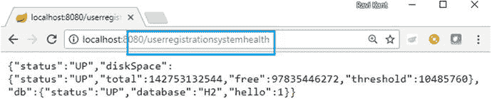

图 7-8.

控制台中的 /userregistrationsystemhealth 端点

前缀 `endpoints` 用于标识在你的应用程序中正在配置的端点。你可以使用 `/userregistrationsystemhealth` 访问这个自定义的 `/health` 端点，如图 7-9 所示。

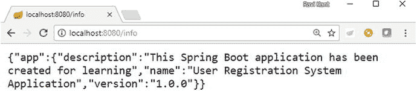

图 7-9.

自定义的健康端点

`/health` 端点提供从所有实现了 `HealthIndicator` 接口并在你的应用程序上下文中配置的 Bean 收集的健康信息。由于某些信息本质上是敏感的，你可以配置 `endpoints.health.sensitive=false` 来暴露其他信息，例如磁盘空间和数据源，如图 7-10 所示。

类似地，你可以通过在 `application.properties` 文件中添加以下属性来自定义 `/info` 端点显示的数据：

```
info.app.name=用户注册系统应用程序
info.app.description=此 Spring Boot 应用程序是为学习而创建的
info.app.version=1.0.0
```

以下输出将出现在浏览器中，如图 7-9 所示。

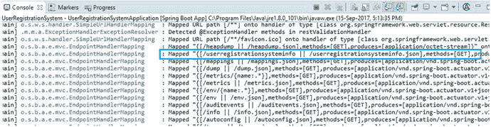

图 7-10.

自定义的 /info 端点

```
{
"app":
{
"description":"此 Spring Boot 应用程序是为学习而创建的",
"name":"用户注册系统应用程序",
"version":"1.0.0"
}
}
```


### 自定义健康指标

您也可以通过实现 `HealthIndicator` 接口并重写未实现的方法来定义自己的自定义健康指标。该自定义健康指标会收集特定于应用程序的任何类型的自定义健康数据，并将其提供给 `/health` 端点。清单 7-2 展示了实现 `HealthIndicator` 接口的 `CustomHealthIndicator` 类。

```
import org.springframework.boot.actuate.health.Health;
import org.springframework.boot.actuate.health.HealthIndicator;
import org.springframework.stereotype.Component;
@Component
public class CustomHealthIndicator implements HealthIndicator {
@Override
public Health health() {
int errorCode = check();
if (errorCode == 0) {
return Health
.up()
.withDetail("Status", "UP")
.withDetail("Error Code", errorCode)
.withDetail("Description",
"Your Custom Health indicator point is UP")
.build();
}
return Health.up().build();
}
public int check() {
return 0;
}
}
清单 7-2.
CustomHealthIndicator 类
```

浏览器中将显示以下输出，如图 7-11 所示。

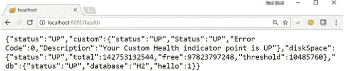

图 7-11.

/health 端点

```
{
"status":"UP",
"custom":{
"status":"UP",
"Status":"UP",
"Error Code":0,
"Description":"Your Custom Health indicator point is UP"
},
"diskSpace":{
"status":"UP",
"total":142753132544,
"free":97823797248,
"threshold":10485760
},
"db":{
"status":"UP",
"database":"H2",
"hello":1
}
}
```

## 定义新端点

尽管 Spring Boot Actuator 提供了端点，但您也可以定义除现有 Actuator 端点之外的新端点。让我们通过创建 `MyCustomEndpoint` 类并实现 `Endpoint<List<String>>` 接口来创建一个新端点，如清单 7-3 所示。

```
import java.util.ArrayList;
import java.util.List;
import org.springframework.boot.actuate.endpoint.Endpoint;
import org.springframework.stereotype.Component;
@Component
public class MyCustomEndpoint implements Endpoint> {
@Override
public String getId() {
return "myCustomEndpoint";
}
@Override
public List invoke() {
List customMessages = new ArrayList();
customMessages.add("This is custom message 1");
customMessages.add("This is custom message 2");
return customMessages;
}
@Override
public boolean isEnabled() {
return true;
}
@Override
public boolean isSensitive() {
return true;
}
}
清单 7-3.
MyCustomEndpoint 类
```

让我们运行 Spring Boot 应用程序。控制台日志将包含 `/myCustomEndpoint` 端点，如图 7-12 所示。

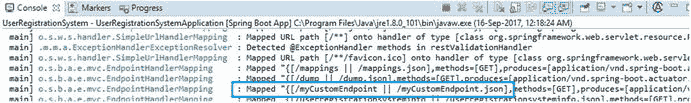

图 7-12.

控制台中的新端点

您可以使用其 `id` 值在 `/myCustomEndpoint` 访问这个新端点。输出将显示在浏览器中，如图 7-13 所示。

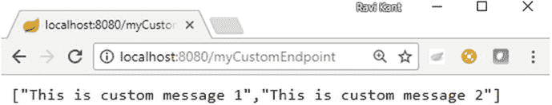

图 7-13.

/myCustomEndpoint 端点

## 通过 HTTP 进行管理

在本节中，您将通过 HTTP 管理 Actuator 端点。

### 自定义服务器端口

出于安全目的，您可以自定义服务器端口，通过非标准端口暴露 Actuator 端点。您可以使用 `management.port` 属性进行配置。

您还可以使用 `management.address` 属性更改地址，以限制端点可以从网络上的哪些位置访问。

让我们更改 `application.properties` 文件中的以下属性：

```
management.port=8081
management.address=127.0.0.1
```

当您重新启动 Spring Boot 应用程序并使用自定义的地址和端口号访问 `/health` 端点时，将返回输出，如图 7-14 所示。

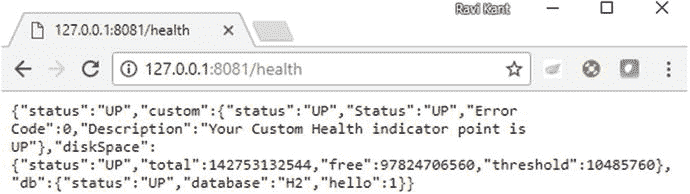

图 7-14.

自定义端口号和地址

### 访问敏感端点

当使用 Spring Security 保护 Spring Boot 应用程序时，您可以通过在 `application.properties` 文件中定义默认安全属性（如用户名、密码和角色）来保护这些端点，如下代码所示：

```
management.security.enabled=true
security.user.name=admin
security.user.password=password
security.user.role=ADMIN
```

当您尝试访问受保护的端点（例如默认情况下敏感的 `/info`）时，将弹出一个窗口提示输入凭据，如图 7-15 所示。

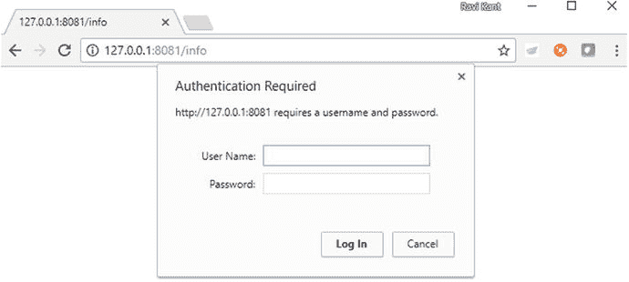

图 7-15.

访问受保护的端点

## 总结

在本章中，您了解了 Spring Boot Actuator，以及如何通过在 Maven `pom.xml` 文件中添加依赖项来启用 Actuator。然后，您了解了一些 Actuator 端点。之后，您自定义了这些现有的 Spring Boot Actuator 端点并定义了新的端点。最后，您自定义了服务器端口。

## 附录 A：访问 REST API 的工具

当您需要在敏捷开发环境中工作时，您需要能够快速测试您的 API。在本附录中，您将了解开源 REST API 测试。

针对 REST API 服务的 GUI 测试速度较慢，对于希望从最新构建中快速获得代码结果的开发者来说，这是一个糟糕的选择。API 测试被认为是开发者的更好选择，因为它往往比 GUI 测试更快且更可靠。

## API 测试

应用程序编程接口（API）测试涉及绕过使用 GUI/网页的用户交互，通过进行 API 调用直接与应用程序内的服务进行通信。

API 测试允许开发者测试“无头”技术，例如 RESTful Web 服务。在无头测试中，GUI（或头部）被绕过；请求直接发送到应用程序的服务，服务接收响应以验证结果。

## API 测试工具

您需要找到一个工具来进行 REST API 测试。互联网上有许多 API 测试工具可用；例如，Selenium 是一个基于浏览器的测试工具。在本书中，您将使用 Postman。

让我们探索 Postman API 测试工具。


### Postman

Postman 是一款 REST 客户端，最初是作为 Chrome 浏览器插件而开发的，用于发起 HTTP 请求。Postman 可用于向 REST 服务发送 HTTP 请求，并从服务器获取响应。

你可以通过链接 [`https://chrome.google.com/webstore/detail/postman/fhbjgbiflinjbdggehcddcbncdddomop`](https://chrome.google.com/webstore/detail/postman/fhbjgbiflinjbdggehcddcbncdddomop) 从 Chrome 网上应用店下载 Postman，如图 A-1 所示。

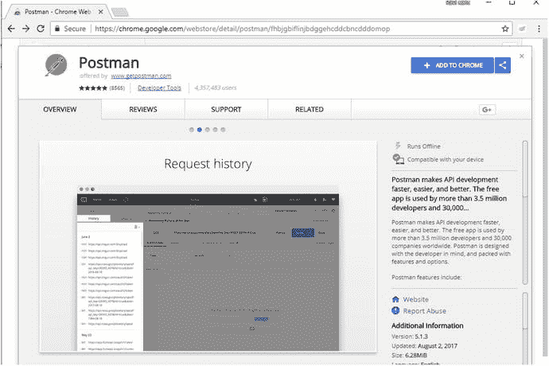

图 A-1.

将 Postman 添加到 Chrome

点击“添加到 Chrome”按钮会弹出一个窗口，如图 A-2 所示。

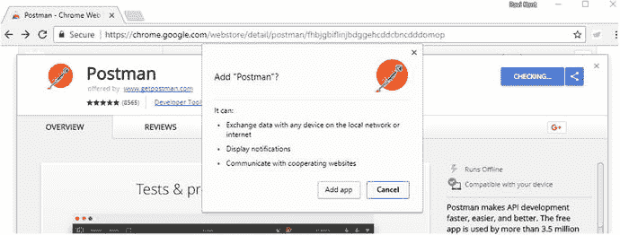

图 A-2.

添加 Postman 应用的弹出窗口

点击“添加应用”将下载一个 `.crx` 文件。下载成功后，Postman 将被添加到 Chrome 的应用列表中。在 Chrome 浏览器中访问 `chrome://apps/` 即可查看 Chrome 中可用的应用列表。

现在，你可以点击“启动应用”按钮来启动该应用，如图 A-3 所示。

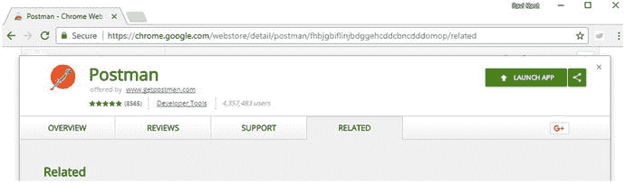

图 A-3.

启动应用

启动应用后，你将看到一个显示 Postman 工具的新窗口，如图 A-4 所示。

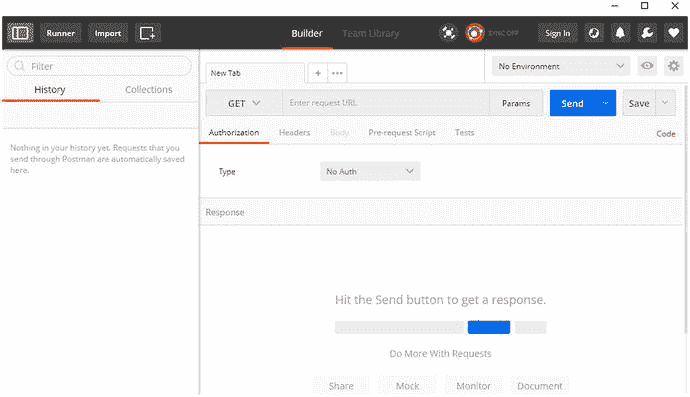

图 A-4.

Postman 应用

Postman 允许开发者通过用户界面编写 HTTP 请求，并将这些请求发送到服务器。开发者可以查看响应，如图 A-5 所示。

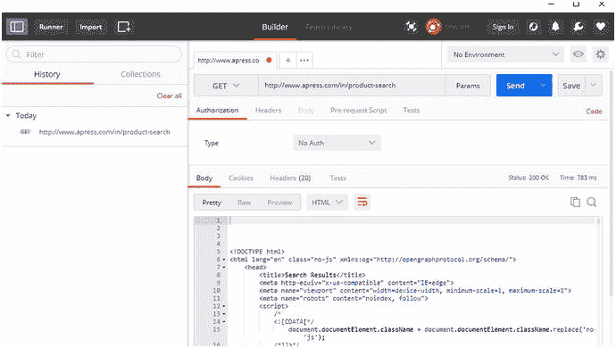

图 A-5.

显示响应的 Postman 应用

#### Postman 中的功能

让我们来看看 Postman 中可用的一些功能。

##### 请求 URL

“输入请求 URL”框允许用户输入请求 URL。

##### HTTP 方法

“输入请求 URL”框左侧的下拉菜单允许开发者选择其 HTTP 方法，例如 `GET`、`POST` 等，如图 A-6 所示。

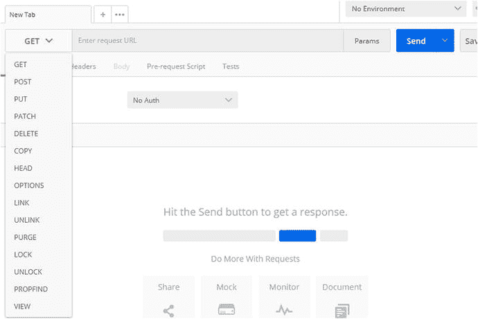

图 A-6.

HTTP 方法

##### 参数

Params 按钮位于“输入请求 URL”框的右侧。这允许用户设置参数的键和值，这些参数将与调用 API 的请求 URL 一起传递，如图 A-7 所示。

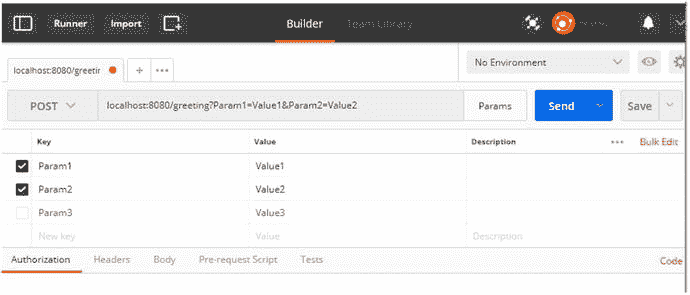

图 A-7.

Postman 中的参数

##### 授权

“在此输入请求 URL”框下方有一个“授权”选项卡。点击“授权”会弹出一个下拉菜单，用于选择选项，如“无授权”、“基本授权”等，如图 A-8 所示。默认选择是“无授权”。

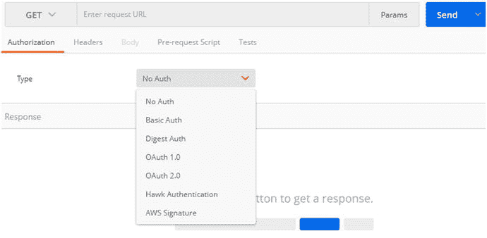

图 A-8.

Postman 中的授权选项

##### 标头

点击“标头”允许用户输入标头信息，如图 A-9 所示。

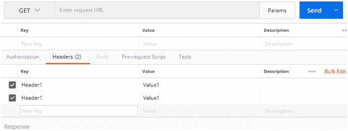

图 A-9.

Postman 中的标头

##### 请求体

“请求体”选项卡仅对以下 HTTP 方法可用：`Post`、`Put`、`Patch`、`Delete`、`Link`、`Unlink`、`Lock` 和 `Propfind`。对于其他 HTTP 方法，该选项卡将被禁用。点击“请求体”会显示四个选项：form-data、x-www-form-urlencoded、raw 和 binary。

*   Form-data：选择此项将显示一行带有“键”下拉菜单的内容。
*   X-www-form-urlencoded：选择此项将在下方显示一行带有“键”和“值”字段的内容。
*   Raw：选择此项将显示一个下拉菜单和一个带有编号行的文本框，如图 A-10 所示。下拉菜单包含以下选项：Text、Text (text/plain)、JSON (application/json)、Javascript (application/javascript)、XML (application/xml)、XML (text/xml) 和 HTML (text/html)。

    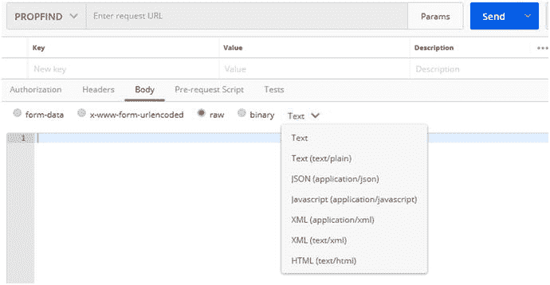

    图 A-10.

    Postman 中的请求体选项

##### 发送

使用蓝色的“发送”按钮来发送 HTTP 请求。

#### 响应消息

点击“发送”按钮后，你将收到来自所请求 API 的响应消息。响应消息可以包含名为“响应体”、“Cookies”、“标头”和“测试”的选项卡，如图 A-11 所示。

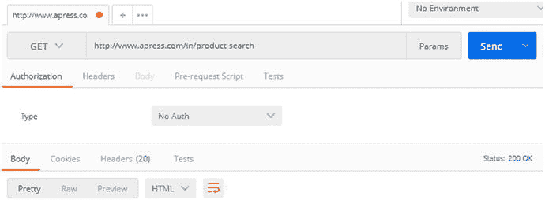

图 A-11.

Postman 中的响应选项

##### 响应体

响应体可以通过“美化”、“原始”和“预览”选项来显示。“美化”允许开发者从以下选项中选择：JSON、XML、HTML、Text 和 Auto。

##### Cookies

要使用 Cookies，你需要通过链接 [`https://chrome.google.com/webstore/detail/postmaninterceptor/aicmkgpgakddgnaphhhpliifpcfhicfo?hl=en`](https://chrome.google.com/webstore/detail/postmaninterceptor/aicmkgpgakddgnaphhhpliifpcfhicfo?hl=en) 安装 Postman Interceptor 应用。安装好 Interceptor 应用后，按图 A-12 所示启用它。

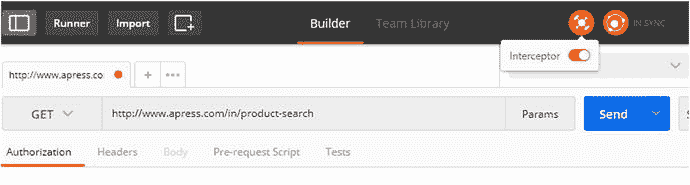

图 A-12.

为 Cookies 启用 Interceptor

##### 标头

这将显示以行格式接收到的标头。

##### 测试

此功能仅对付费用户可用。

#### 其他功能

Postman 的“历史记录”部分位于窗口左侧，记录了你发起的所有请求，如图 A-13 所示。历史记录会保存 HTTP 请求，并允许重新打开它们。

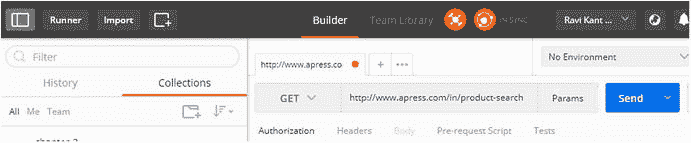

图 A-13.


Postman 中的历史记录  
索引 A  
Actuator 端点  
application.properties 文件自定义  
健康指示器  
info 端点  
MyCustomEndpoint 类  
属性  
Spring 属性定义  
/env  
/health  
HTTP 敏感端点  
服务器端口  
/info  
/metrics  
模块  
监控应用  
STS 控制台  
/trace  
敏捷软件测试  
集成测试  
单元测试的目标  
参见单元测试  
应用程序编程接口 (API)  
认证  
BasicAuthenticationFilter  
定义  
HTTP 标头  
内存定义  
弹出窗口  
关系型数据库  
传统方法  
UserRegistrationSystem 应用  
用户和角色  
授权  
访问页面  
AngularJS  
app.js 更新  
authInterceptor.js  
标头  
HTTP 拦截器  
index.html 文件  
应用  
HTTP 请求  
list-all-users 页面  
定义  
内存配置  
B  
后端框架  
对比前端  
物理视图  
pom.xml  
main 方法  
Maven 依赖  
设置  
观点  
输出控制台  
打包选项  
pom.xml 文件  
@RestController 注解  
@RequestMapping 注解  
REST 端点  
静态  
SpringApplication.run 方法  
@SpringBootApplication 注解  
STS 向导  
Tomcat 和 Jetty  
文件  
更新的依赖  
生产就绪特性  
控制台日志  
启用 Actuator 端点  
健康信息  
管理  
服务器端口  
Spring Initializer  
Spring Boot 应用  
优势  
依赖  
框架  
问题  
目标  
Initializer 项目  
相关细节  
项目向导  
Spring Boot CLI  
starter 项目  
结构  
系统要求  
工具套件  
Web 应用开发  
启动器  
C  
客户端和服务器端技术  
D  
数据传输对象 (DTO)  
依赖注入 (DI)  
文档对象模型 (DOM)  
E  
@EnableGlobalMethodSecurity 注解  
错误消息  
Bean 验证注解  
电子邮件模式  
外部化  
messageSource 创建  
messages.properties  
属性文件  
F, G  
前端框架  
AngularJS  
架构概念  
HTTP 响应  
MVC 架构  
版本  
工作流图  
架构概念  
对比后端  
引导阶段  
编译阶段  
组件生命周期  
MVC 架构  
物理视图  
运行时  
数据绑定阶段  
Twitter Bootstrap  
工作流图  
全栈 Web 开发  
后端  
参见后端框架  
客户端与服务器通信  
开发运维  
前端  
另请参见前端框架  
后端操作  
现代 Web 应用  
H  
handleValidationError 类  
HTML 部分视图  
I  
集成测试  
控制反转 (IoC)  
J, K  
Java 持久化 API (JPA)  
JavaScript 对象表示法 (JSON)  
L  
登录页面  
应用  
方法  
认证过程 (controller.js)  
后端代码  
配置文件  
处理登录请求  
RESTful 端点  
错误消息  
主页  
输入框和按钮  
登录表单 (login.html)  
导航页面 (app.js)  
欢迎页面 (index.html)  
M, N, O  
MediaType 方法  
MethodArgumentNotValidException 方法  
方法级安全  
MockMvc 类  
getUserById 方法  
JUnit 视图  
测试框架  
输出结果  
Web 层测试  
模型-视图-控制器 (MVC)  
AngularJS 应用  
架构  
控制器  
目录  
目录结构  
框架  
主页/应用页面  
listUserController  
registerUserController  
usersDetailsController  
视图页面  
错误消息  
主页  
listuser.html  
注册新用户页面  
模板文件夹  
更新用户  
userregistration.html  
userupdation.html  
现代 Web 应用  
优势  
劣势  
动态内容创建  
分层架构  
模型-视图-控制器 (MVC)  
表述性状态转移 (REST)  
P, Q  
@PathVariable 注解  
Postman (测试工具)  
应用创建  
Chrome  
功能  
授权  
请求体  
标头  
HTTP 方法  
参数  
请求 URL  
发送  
历史记录  
启动应用  
弹出窗口  
响应消息  
请求体  
Cookie  
标头  
选项  
测试  
响应  
@PreAuthorize 注解  
R  
ReloadableResourceBundleMessageSource  
表述性状态转移 (REST)  
处理错误  
Bean 验证注解  
@ControllerAdvice 注解  
CustomErrorType 类  
错误消息  
外部错误消息  
处理错误  
消息和状态码  
@Valid 注解  
验证约束  
HTTP 方法  
CRUD 操作  
状态码  
RESTful 服务  
参见 UserRegistrationSystem  
@RequestBody 注解  
@RequestMapping 注解  
@ResponseBody 注解  
@RestController 注解  
RESTful 服务  
REST 客户端  
RestTemplate  
认证  
DELETE 方法  
exchange API  
getForObject 类和方法  
GET 请求方法  
pom.xml 文件  
POST 请求  
PUT 请求 (参数)  
UserRegistrationClient 类  
S  
单页应用 (SPA)  
启动应用  
参见 Spring Boot 应用  
开发环境  
自动初始化  
引导 AngularJS  
依赖信息  
依赖注入  
Google CDN 托管 Angular 文件  
HTML 页面  
模型、视图和控制器  
pom.xml  
弹出窗口  
路由  
Spring Boot 模板  
Twitter Bootstrap 前端框架  
软件即服务 (SaaS)  
Spring Boot 应用  
Actuator  
参见 Actuator 端点  
注解  
启动应用  
目录结构  
错误消息  
主页  
注册用户  
信息  
更新用户  
用户详情  
网页  
JUnit 视图  
Maven 依赖  
MVC 测试框架  
单元测试  
Spring Security  
application.properties 文件  
认证  
参见认证  
授权  
参见授权  
BasicAuthenticationFilter  
依赖  
框架  
HTTP 标头  
覆盖  
pom.xml 文件  
错误  
JSON 响应  
映射  
过滤器  
信息  
密码  
弹出窗口  
未授权错误消息  
用户凭证  
表单  
关系型数据库  
import.sql 文件  
方法级安全  
Spring Security 和安全  
未授权  
删除响应  
UserDetailsService 实现  
UserInfo 类  
UserInfoJpaRepository 接口  
RESTful 服务  
传统方法  
用户认证  
T  
测试框架 (Spring)  
JUnit4 注解  
断言方法  
实现  
红条测试  
Twitter Bootstrap  
U, V, W, X, Y, Z  
单元测试  
模拟对象  
字段级注解  
Mockito 框架  
REST 控制器测试和依赖  
用户验收测试 (UAT)  
UserJpaRepository  
UserRegistrationRestController 方法  
UserRegistrationSystem 应用  
创建  
定义  
H2 嵌入式数据库  
JSON 格式  
仓库实现  
仓库层/服务层  
需求  
RESTful API 控制器创建  
@DeleteMapping  
@GetMapping  
@GetMapping (“/ {id}”)  
GET 动词实现  
@PostMapping  
POST 动词实现  
@PutMapping  
软件即服务 (SaaS)  
URI 端点标识  
用户领域实现  
UserRegistrationSystem 应用  
ADMIN 角色  
删除操作  
详情  
密码  
创建  
未授权用户  
用户凭证
