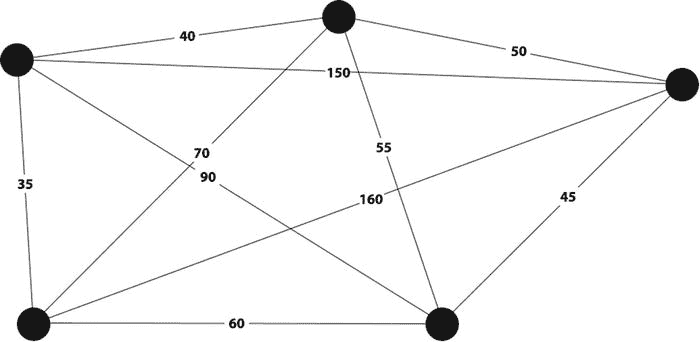
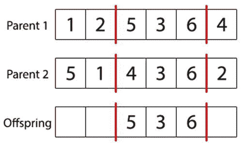
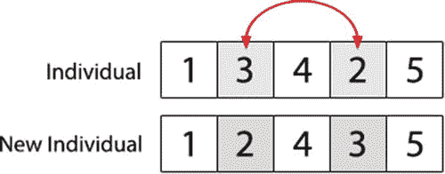

# 四、旅行推销员

## 介绍

在这一章中，我们将探讨旅行推销员问题以及如何用遗传算法来解决它。在这样做的时候，我们将着眼于旅行推销员问题的性质，以及我们如何使用这些性质来设计遗传算法。

旅行推销员问题(TSP)是一个经典的优化问题，早在 19 世纪就被研究过。旅行推销员问题涉及到在一组城市中寻找最有效的路线，每个城市只去一次。

旅行推销员问题通常被描述为通过一组城市优化一条路线；然而，旅行推销员问题可以应用于其他应用。例如，城市的概念可以被认为是某些应用的客户，甚至是微芯片上的焊接点。距离的概念也可以修改，以考虑其他限制，如时间。

最简单的形式是，城市可以用图上的节点来表示，每个城市之间的距离用边的长度来表示(见图 4-1 )。“路线”或“旅程”简单地定义了应该使用哪些边，以及使用的顺序。然后，可以通过对路线中使用的边求和来计算路线的分数。



图 4-1。

Our graph showing the cities and the respective distances between them

在 20 世纪，许多数学家和科学家研究了旅行推销员问题；然而，这个问题至今仍未解决。产生旅行推销员问题的最优解的唯一有保证的方法是使用强力算法。强力算法是一种被设计成系统地尝试每一种可能的解决方案的算法。然后你从候选解的完整集合中找到最优解。试图用强力算法解决旅行推销员问题是一项极其困难的任务，因为随着城市数量的增加，潜在解决方案的数量呈阶乘增长。阶乘函数比指数函数增长得更快，这就是为什么很难暴力破解旅行推销员问题的原因。例如，对于 5 个城市，有 120 个可能的解决方案(1x2x3x4x5)，对于 10 个城市，该数字将增加到 3，628，800 个解决方案！到 15 个城市，有超过一万亿个解决方案。在 60 个城市，可能的解决方案比可见宇宙中的原子还多。

当只有几个城市时，强力算法可以用来寻找最优解，但随着城市数量的增加，它们变得越来越具有挑战性。即使应用技术来消除反向和相同的路由，在合理的时间内找到最佳解决方案仍然很快变得不可行。

事实上，我们知道找到一个最优的解决方案通常是不必要的，因为一个足够好的解决方案通常是所需要的。有许多不同的算法可以快速找到可能只在几个百分点内的最优解。最常用的算法之一是最近邻算法。用这种算法，一个起始城市是随机挑选的。然后，找到下一个最近的未访问城市，并将其选作路线中的第二个城市。这个挑选下一个最近的未访问城市的过程一直持续到所有城市都被访问过并且找到了完整的路线。最近邻算法已经被证明在产生合理的解决方案方面是令人惊讶地有效的，该合理的解决方案的分数在最优解决方案的分数之内。更好的是，这可以在很短的时间内完成。这些特性使它在许多情况下成为一个有吸引力的解决方案，并且是遗传算法的一个可能的替代方案。

## 问题

我们将在这个实现中处理的问题是一个典型的旅行推销员问题，在这个问题中，我们需要优化通过一组城市的路线。我们可以通过将每个城市设置到一个随机的 x，y 位置，在 2D 空间中生成一些随机的城市。

当寻找两个城市之间的距离时，我们将简单地使用两个城市之间最短的长度作为距离。我们可以用下面的等式来计算这个距离:


通常情况下，问题会比这更复杂。在这个例子中，我们假设每个城市之间存在一条直接的理想路径；这也被称为“欧几里德距离”。这通常不是典型的情况，因为可能存在各种障碍，使得实际最短路径比欧几里德距离长得多。我们还假设从城市 A 到城市 B 的旅行时间与从城市 B 到城市 A 的旅行时间一样长。同样，现实中很少会出现这种情况。往往会有单行道之类的障碍物，在某个方向行驶时会影响城市间的距离。城市之间的距离根据方向而变化的旅行推销员问题的实现被称为非对称旅行推销员问题。

## 履行

是时候使用我们的遗传算法知识来解决这个问题了。在为这个问题设置了一个新的 Java/Eclipse 包之后，我们将开始对路由进行编码。

### 开始之前

本章将基于你在第三章中开发的代码。在开始之前，创建一个新的 Eclipse 或 NetBeans 项目，或者在现有项目中为这本书创建一个名为“第四章”的新包。

从第三章的中复制个体、群体和遗传算法类，并将它们导入到第四章的中。确保更新每个类文件顶部的包名！最上面应该都写着“包章 4 ”。

打开 GeneticAlgorithm 类并删除以下方法:calcFitness、evalPopulation、crossoverPopulation 和 mutatePopulation。你将在本章的课程中重写这些方法。

接下来，打开 Individual 类，删除签名为“public Individual(int chromosomelongth)”的构造函数。单个类中有两个构造函数，所以要小心删除正确的那个！要删除的构造函数是随机初始化染色体的那个；在这一章中你也将重写它。

第三章中的 Population 类只需要修改文件顶部的包名。

### 编码

我们在这个例子中选择的编码需要能够按顺序对城市列表进行编码。我们可以为每个城市分配一个唯一的 ID，然后按照候选路线的顺序使用染色体来引用它。这种使用基因序列的编码被称为排列编码，非常适合旅行推销员问题。

我们需要做的第一件事是给我们的城市分配唯一的 id。如果我们要访问 5 个城市，我们可以简单地给它们分配 IDs，2，3，4，5。然后，当我们的遗传算法找到一条路线时，我们的染色体可能会将城市 id 排序如下:3，4，1，2，5。这只是意味着我们将从城市 3 开始，然后前往城市 4，然后城市 1，然后城市 2，然后城市 5，然后返回城市 3 完成路线。

### 初始化

在我们开始优化路线之前，我们需要创建一些城市。如前所述，我们可以通过选择随机的 x，y 坐标来生成随机的城市，并使用它们来定义一个城市位置。

首先，我们需要创建一个 City 类，它可以创建和存储一个城市，并计算到另一个城市的最短距离。

```java
package chapter4;

public class City {

private int x;

private int y;

public City(int x, int y) {

this.x = x;

this.y = y;

}

public double distanceFrom(City city) {

// Give difference in x,y

double deltaXSq = Math.pow((city.getX() - this.getX()), 2);

double deltaYSq = Math.pow((city.getY() - this.getY()), 2);

// Calculate shortest path

double distance = Math.sqrt(Math.abs(deltaXSq + deltaYSq));

return distance;

}

public int getX() {

return this.x;

}

public int getY() {

return this.y;

}

}
```

City 类有一个构造函数，它采用 x 和 y 坐标在 2D 平面上创建一个城市。该类还包含一个 distanceFrom 方法，该方法使用勾股定理计算从当前城市到另一个城市的直线距离。最后，有两个 getter 方法可用于检索城市的 x 和 y 位置。

接下来，我们应该恢复在“开始之前”一节中删除的单个类构造函数。旅行推销员问题对染色体的约束与我们上两个问题不同。回想一下，机器人控制器问题中的唯一约束是染色体必须是 128 位长，并且必须是二进制的。

不幸的是，旅行推销员问题并非如此；约束更加复杂，并规定了我们可以使用的初始化、交叉和变异技术。在这种情况下，染色体必须有一定的长度(无论城市游览有多长)，但一个额外的约束是每个城市必须游览一次且只能游览一次，否则染色体无效。染色体中不能有重复的基因，染色体中不能有省略的城市。

我们可以很容易地创建一个没有任何随机性的独立构造函数。简单地创建一个染色体，其中包含每个城市的索引:1、2、3、4、5、6……等等。随机排列初始染色体是读者在本章末尾的一个练习。

将下面的构造函数添加到单个类中。你可以把它放在任何你喜欢的地方，但是靠近顶部是构造函数的好位置。和往常一样，这里省略了注释和文档块，但是请参阅本书附带的 Eclipse 项目以获得更多注释。

```java
public Individual(int chromosomeLength) {

// Create random individual

int[] individual;

individual = new int[chromosomeLength];

for (int gene = 0; gene < chromosomeLength; gene++) {

individual[gene] = gene;

}

this.chromosome = individual;

}
```

至此，我们可以创建我们的执行类及其“main”方法了。通过使用文件➤新➤类菜单项，在包“第四章中创建一个名为“TSP”的新 Java 类。正如在第三章中，我们将使用一些 TODOs 来剔除遗传算法伪代码，这样我们就可以通过实现来标记我们的进展。

让我们借此机会在“main”方法的顶部初始化一个由 100 个随机生成的城市对象组成的数组。只需生成随机的 x 和 y 坐标，并将它们传递给 City 构造函数。确保您的 TSP 类如下所示:

```java
package chapter4;

public class TSP {

public static int maxGenerations = 3000;

public static void main(String[] args) {

int numCities = 100;

City cities[] = new City[numCities];

// Loop to create random cities

for (int cityIndex = 0; cityIndex < numCities; cityIndex++) {

int xPos = (int) (100 * Math.random());

int yPos = (int) (100 * Math.random());

cities[cityIndex] = new City(xPos, yPos);

}

// Initial GA

GeneticAlgorithm ga = new GeneticAlgorithm(100, 0.001, 0.9, 2, 5);

// Initialize population

Population population = ga.initPopulation(cities.length);

// TODO: Evaluate population

// Keep track of current generation

int generation = 1;

// Start evolution loop

while (ga.isTerminationConditionMet(generation, maxGenerations) == false) {

// TODO: Print fittest individual from population

// TODO: Apply crossover

// TODO: Apply mutation

// TODO: Evaluate population

// Increment the current generation

generation++;

}

// TODO: Display results

}

}
```

希望这个过程越来越熟悉；我们再次开始实现在第二章的开头出现的伪代码。我们还生成了一个城市对象的数组，我们将在我们的评估方法中使用，就像我们在上一章中如何生成一个迷宫对象来评估个人一样。

剩下的就是死记硬背了:初始化一个 GeneticAlgorithm 对象(包括种群大小、突变率、交叉率、精英计数和锦标赛规模)，然后初始化一个种群。个人的染色体长度必须与我们希望访问的城市数量相同。

我们可以重用上一章中简单的“最大代数”终止条件，所以这次我们只剩下六个 TODOs 和一个工作循环。像往常一样，让我们从评估和健康评分方法开始。

### 估价

现在，我们需要评估群体，并为个体分配适合度值，这样我们就知道哪个表现最好。第一步是定义问题的适应度函数。这里，我们只需要计算出个体的染色体给出的路线的总距离。

首先，我们需要创建一个新的类来存储一条路线并计算它的总距离。在 package "chapter 4 中创建一个名为" Route "的新类，并插入以下代码:

```java
package chapter4;

public class Route {

private City route[];

private double distance = 0;

public Route(Individual individual, City cities[]) {

// Get individual’s chromosome

int chromosome[] = individual.getChromosome();

// Create route

this.route = new City[cities.length];

for (int geneIndex = 0; geneIndex < chromosome.length; geneIndex++) {

this.route[geneIndex] = cities[chromosome[geneIndex]];

}

}

public double getDistance() {

if (this.distance > 0) {

return this.distance;

}

// Loop over cities in route and calculate route distance

double totalDistance = 0;

for (int cityIndex = 0; cityIndex + 1 < this.route.length; cityIndex++) {

totalDistance += this.route[cityIndex].distanceFrom(this.route[cityIndex + 1]);

}

totalDistance += this.route[this.route.length - 1].distanceFrom(this.route[0]);

this.distance = totalDistance;

return totalDistance;

}

}
```

这个类只包含一个构造函数和一个计算总路线距离的方法。构造函数接受一个个体和一个城市定义列表(与我们在 TSP 类的“main”函数中创建的城市数组相同)。然后，构造函数按照个体染色体的顺序构建一个城市对象数组；这种数据结构使得在 getDistance 方法中评估总路径距离变得简单。

getDistance 方法遍历 route 数组(城市对象的有序数组),并调用 City 类的“distanceFrom”方法依次计算两个城市之间的距离，并进行求和。

为了实现这种适应性评分方法，我们需要更新 GeneticAlgorithm 类中的 calcFitness 函数。calcFitness 类应该将距离计算委托给 Route 类，为此，它需要接受我们的城市定义数组并将其传递给 Route 类。

将下面的方法添加到 GeneticAlgorithm 类中文件的任意位置。

```java
public double calcFitness(Individual individual, City cities[]){

// Get fitness

Route route = new Route(individual, cities);

double fitness = 1 / route.getDistance();

// Store fitness

individual.setFitness(fitness);

return fitness;

}
```

在此函数中，适合度的计算方法是用 1 除以总路线距离，因此距离越短得分越高。计算出适合度后，会将其存储起来，以备再次需要时快速调用。

现在，我们可以在 GeneticAlgorithm 类中更新我们的 evalPopulation 方法，以接受 cities 参数并找到群体中每个个体的适合度。

```java
public void evalPopulation(Population population, City cities[]){

double populationFitness = 0;

// Loop over population evaluating individuals and summing population fitness

for (Individual individual : population.getIndividuals()) {

populationFitness += this.calcFitness(individual, cities);

}

double avgFitness = populationFitness / population.size();

population.setPopulationFitness(avgFitness);

}
```

像往常一样，这个函数在群体中循环，计算每个个体的适应度。与之前的实现不同，我们计算的是平均群体适应度，而不是总群体适应度。(因为我们使用的是锦标赛选择而不是轮盘赌选择，所以我们实际上不需要群体的适应性；如果我们不记录这个值，什么都不会改变。)

现在，我们可以解析 TSP 类中与评估和显示结果相关的“main”方法中的四个 TODOs。更新 TSP 类以表示以下内容。解决的四个 TODOs 是两个“评估群体”行(循环前和循环内)，循环顶部的“打印群体中最合适的个体”行，以及循环后的“显示结果”行。

```java
package chapter4;

public class TSP {

public static int maxGenerations = 3000;

public static void main(String[] args) {

int numCities = 100;

City cities[] = new City[numCities];

// Loop to create random cities

for (int cityIndex = 0; cityIndex < numCities; cityIndex++) {

int xPos = (int) (100 * Math.random());

int yPos = (int) (100 * Math.random());

cities[cityIndex] = new City(xPos, yPos);

}

// Initial GA

GeneticAlgorithm ga = new GeneticAlgorithm(100, 0.001, 0.9, 2, 5);

// Initialize population

Population population = ga.initPopulation(cities.length);

// Evaluate population

ga.evalPopulation(population, cities);

// Keep track of current generation

int generation = 1;

// Start evolution loop

while (ga.isTerminationConditionMet(generation, maxGenerations) == false) {

// Print fittest individual from population

Route route = new Route(population.getFittest(0), cities);

System.out.println("G"+generation+" Best distance: " + route.getDistance());

// TODO: Apply crossover

// TODO: Apply mutation

// Evaluate population

ga.evalPopulation(population, cities);

// Increment the current generation

generation++;

}

// Display results

System.out.println("Stopped after " + maxGenerations + " generations.");

Route route = new Route(population.getFittest(0), cities);

System.out.println("Best distance: " + route.getDistance());

}

}
```

此时，我们可以单击“Run ”,循环将执行这些动作，将相同的内容打印 3000 次，但没有显示任何变化。这当然是意料之中的；我们需要实现交叉和变异，作为我们剩下的两个目标。

### 终止检查

正如我们已经了解到的，除非我们尝试每一种可能的解决方案，否则没有办法知道我们是否找到了旅行推销员问题的最优解决方案。这意味着我们在这个实现中使用的终止检查不能在找到最优解时终止，因为它根本无法知道。

既然我们无法在找到最优解时终止，我们可以简单地允许算法在最终终止前运行一定数量的代，因此我们能够重用第三章的 GeneticAlgorithm 类中的 isTerminationConditionMet 方法。

但是，请注意，在这种情况下——最佳解决方案无法得知——除了简单地设置代数上限之外，还有许多复杂的终止技术。

一种常见的技术是测量随着时间的推移群体健康的改善。如果人口仍在快速增长，您可能希望允许算法继续运行。一旦种群停止改善，你就可以结束进化，提出最优解。

您可能永远也不会在像旅行推销员问题这样的复杂解决方案空间中找到全局最优解，但是存在许多强局部最优解，并且进展中的平稳状态通常表明您已经找到了这些局部最优解中的一个。

有几种方法可以测量遗传算法随时间的进展。最简单的方法是测量最佳个体没有改进的连续世代的数量。如果没有改进的代数超过了某个阈值，例如 500 代没有改进，您可以停止该算法。

这种具有大解空间的简单方法的一个缺点是，您可能会看到群体的适应度不断提高——这可能非常慢！有如此多的组合，以至于每十几代就有一个点的改善是可行的，你永远不会遇到连续 500 代都没有改善的情况。当然，你可以设置一个不考虑改进的最大代数上限。您还可以实现一种更复杂的技术，比如获取不同窗口的移动平均值，并将它们相互比较。如果适应性改善在几个窗口内一直呈下降趋势，则停止该算法。

然而，在我们的例子中，我们将坚持使用第三章中的简单方法，并让读者在本章末尾实现一个更好的终止条件作为练习。

### 交叉

对于旅行推销员问题，基因和基因在染色体中的顺序都非常重要。事实上，对于旅行推销员问题，我们的染色体中不应该有一个以上的特定基因副本。这是因为它会创建一个无效的解决方案，因为一个城市在一条给定的路径上不应被访问超过一次。考虑这样一种情况，我们有三个城市:城市 A、城市 B 和城市 C。A、B、C 的一条路线是有效的；然而，C，B，C 的路线不是:这条路线访问城市 C 两次，也从未访问城市 a。因此，我们必须找到并应用交叉方法，为我们的问题产生有效的结果。

在杂交过程中，我们还需要尊重父母染色体的排序。这是因为染色体的顺序会影响解决方案的适应性。事实上，重要的只是顺序。为了更好地理解为什么会出现这种情况，请考虑以下两条路线是如何完全不同的，尽管它们包含完全相同的基因:

```java
Route 1: A,B,C,D,E

Route 2: C,A,D,B,E
```

我们之前看了均匀交叉；然而，统一交叉方法在单个基因的水平上起作用，并且不考虑染色体的顺序。单点和两点交叉方法做得更好，因为它们处理染色体块，这将保持这些块内的顺序。然而，单点和两点杂交的问题是，它们并不关心染色体上哪些基因被添加或删除。这意味着我们很可能最终得到无效的解决方案，其染色体包含一个以上对同一城市的引用，或者完全缺少城市。

解决这两个问题的交叉方法是有序交叉。在这种交叉方法中，选择第一个父代染色体的子集。然后将该子集添加到子染色体的相同位置。



下一步是将第二个父母的遗传信息添加到后代的染色体中。我们这样做是从所选子集的末端位置开始，然后包括来自父代 2 的每个基因，这些基因还没有出现在后代的染色体中。

在这个例子中，我们将从基因“2”开始，检查它是否能在后代的染色体中找到。因为 2 目前不在后代的染色体中，所以我们可以将它添加到后代染色体中第一个可用的位置。然后，因为我们到达了双亲 2 的染色体的末端，我们回到第一个基因，“5”。这一次，5 在后代的染色体中，所以我们跳过它，移到 1。我们一直这样做，直到得到以下结果:


这种交叉方法保留了许多来自父代的顺序，但也确保了解决方案对于旅行推销员问题等问题仍然有效。

这种算法有一个方面是我们目前的单个类无法实现的:这项技术需要检查后代的染色体是否存在特定的基因。在前面的章节中，我们没有特定的基因——我们有二元染色体——所以没有必要实现一种方法来检查染色体中基因的存在。

幸运的是，这是一个很容易添加的方法。打开单个类，在文件中的任意位置添加一个名为“containsGene”的方法:

```java
public boolean containsGene(int gene) {

for (int i = 0; i < this.chromosome.length; i++) {

if (this.chromosome[i] == gene) {

return true;

}

}

return false;

}
```

这个方法查看染色体中的每个基因，如果它找到了它正在寻找的基因，它将返回 true 否则返回 false。这个方法的使用解决了这个问题:“这个解决方案访问城市#5 吗？让我们调用 individual.containsGene(5)来找出答案。”

我们现在准备通过更新 genetic algorithm 类来将我们的有序交叉方法应用于我们的遗传算法。像上一章一样，我们可以实现锦标赛选择作为我们用于交叉的选择方法，但是我们没有修改上一章的 selectParent 方法。

将此 crossoverPopulation 方法添加到 GeneticAlgorithm 类中:

```java
public Population crossoverPopulation(Population population){

// Create new population

Population newPopulation = new Population(population.size());

// Loop over current population by fitness

for (int populationIndex = 0; populationIndex < population.size(); populationIndex++) {

// Get parent1

Individual parent1 = population.getFittest(populationIndex);

// Apply crossover to this individual?

if (this.crossoverRate > Math.random() && populationIndex >= this.elitismCount) {

// Find parent2 with tournament selection

Individual parent2 = this.selectParent(population);

// Create blank offspring chromosome

int offspringChromosome[] = new int[parent1.getChromosomeLength()];

Arrays.fill(offspringChromosome, -1);

Individual offspring = new Individual(offspringChromosome);

// Get subset of parent chromosomes

int substrPos1 = (int) (Math.random() * parent1.getChromosomeLength());

int substrPos2 = (int) (Math.random() * parent1.getChromosomeLength());

// make the smaller the start and the larger the end

final int startSubstr = Math.min(substrPos1, substrPos2);

final int endSubstr = Math.max(substrPos1, substrPos2);

// Loop and add the sub tour from parent1 to our child

for (int i = startSubstr; i < endSubstr; i++) {

offspring.setGene(i, parent1.getGene(i));

}

// Loop through parent2's city tour

for (int i = 0; i < parent2.getChromosomeLength(); i++) {

int parent2Gene = i + endSubstr;

if (parent2Gene >= parent2.getChromosomeLength()) {

parent2Gene -= parent2.getChromosomeLength();

}

// If offspring doesn’t have the city add it

if (offspring.containsGene(parent2.getGene(parent2Gene)) == false) {

// Loop to find a spare position in the child’s tour

for (int ii = 0; ii < offspring.getChromosomeLength(); ii++) {

// Spare position found, add city

if (offspring.getGene(ii) == -1) {

offspring.setGene(ii, parent2.getGene(parent2Gene));

break;

}

}

}

}

// Add child

newPopulation.setIndividual(populationIndex, offspring);

} else {

// Add individual to new population without applying crossover

newPopulation.setIndividual(populationIndex, parent1);

}

}

return newPopulation;

}
```

在这种方法中，我们首先创建一个新的种群来容纳后代。然后，当前种群按照最适合的个体的顺序循环。如果精英主义被启用，最初的几个精英个体被跳过，并被不加改变地添加到新群体中。然后使用交叉率考虑剩余的个体进行交叉。如果要对个体应用交叉，则使用 selectParent 方法选择一个父代(在这种情况下，selectParent 执行锦标赛选择，如第三章中的所示),并创建一个新的空白个体。

接下来，在亲代 1 的染色体中随机选取两个位置，并将这两个位置之间的遗传信息子集添加到后代的染色体中。最后，所需的剩余遗传信息按照在 parent2 中找到的顺序添加；然后当完成时，该个体被添加到新的群体中。

现在，我们可以将 crossoverPopulation 方法实现到 TSP 类中的“main”方法中，并解析我们的一个 TODOs。找到“TODO:应用交叉”并替换为:

```java
// Apply crossover

population = ga.crossoverPopulation(population);
```

此时单击“运行”应该会产生一个有效的算法！经过 3，000 代之后，您应该会看到大约 1，500 的最佳距离。但是，您可能还记得，单独的交叉容易陷入局部最优，您可能会发现算法停滞不前。变异是我们在解决方案空间的新位置随机丢弃候选对象的方式，可以帮助以短期收益为代价改善长期结果。

### 变化

像交叉一样，我们在旅行推销员问题中使用的变异类型很重要，因为我们需要再次确保染色体在应用后是有效的。我们随机改变一个基因的单个值的方法可能会导致染色体重复，结果染色体将是无效的。

一个简单的解决方案叫做交换突变，这是一种简单交换两点遗传信息的算法。交换突变通过循环个体染色体中的基因来工作，每个基因都被认为是由突变率决定的突变。如果一个基因被选择突变，染色体中的另一个随机基因被挑选出来，然后它们的位置被交换。



这个过程确保不会产生重复的基因，并且任何产生的后代都将是有效的解决方案。

要实现这个突变方法，首先要将 mutatePopulation 方法添加到 GeneticAlgorithm 类中。

```java
public Population mutatePopulation(Population population){

// Initialize new population

Population newPopulation = new Population(this.populationSize);

// Loop over current population by fitness

for (int populationIndex = 0; populationIndex < population.size(); populationIndex++) {

Individual individual = population.getFittest(populationIndex);

// Skip mutation if this is an elite individual

if (populationIndex >= this.elitismCount) {

// System.out.println("Mutating population member "+populationIndex);

// Loop over individual’s genes

for (int geneIndex = 0; geneIndex < individual.getChromosomeLength(); geneIndex++) {

// Does this gene need mutation?

if (this.mutationRate > Math.random()) {

// Get new gene position

int newGenePos = (int) (Math.random() * individual.getChromosomeLength());

// Get genes to swap

int gene1 = individual.getGene(newGenePos);

int gene2 = individual.getGene(geneIndex);

// Swap genes

individual.setGene(geneIndex, gene1);

individual.setGene(newGenePos, gene2);

}

}

}

// Add individual to population

newPopulation.setIndividual(populationIndex, individual);

}

// Return mutated population

return newPopulation;

}
```

这个方法的第一步是创建一个新的群体来容纳变异的个体。接下来，种群从最适合的个体开始循环。如果精英主义被启用，最初的几个个体被跳过并被不加改变地添加到新群体中。然后剩余个体的染色体循环，根据突变率单独考虑每个基因的突变。如果一个基因发生突变，从个体中随机挑选另一个基因，并交换这些基因。最后，变异的个体被添加到新的种群中。

现在，我们可以将突变方法添加到 TSP 类的“main”方法中，并解析我们的最终 TODO。找到注释“TODO: Apply mutation”并替换为:

```java
// Apply mutation

population = ga.mutatePopulation(population);
```

### 执行

TSP 类的最终代码应该如下所示:

```java
package chapter4;

public class TSP {

public static int maxGenerations = 3000;

public static void main(String[] args) {

// Create cities

int numCities = 100;

City cities[] = new City[numCities];

// Loop to create random cities

for (int cityIndex = 0; cityIndex < numCities; cityIndex++) {

// Generate x,y position

int xPos = (int) (100 * Math.random());

int yPos = (int) (100 * Math.random());

// Add city

cities[cityIndex] = new City(xPos, yPos);

}

// Initial GA

GeneticAlgorithm ga = new GeneticAlgorithm(100, 0.001, 0.9, 2, 5);

// Initialize population

Population population = ga.initPopulation(cities.length);

// Evaluate population

//ga.evalPopulation(population, cities);

Route startRoute = new Route(population.getFittest(0), cities);

System.out.println("Start Distance: " + startRoute.getDistance());

// Keep track of current generation

int generation = 1;

// Start evolution loop

while (ga.isTerminationConditionMet(generation, maxGenerations) == false) {

// Print fittest individual from population

Route route = new Route(population.getFittest(0), cities);

System.out.println("G"+generation+" Best distance: " + route.getDistance());

// Apply crossover

population = ga.crossoverPopulation(population);

// Apply mutation

population = ga.mutatePopulation(population);

// Evaluate population

ga.evalPopulation(population, cities);

// Increment the current generation

generation++;

}

System.out.println("Stopped after " + maxGenerations + " generations.");

Route route = new Route(population.getFittest(0), cities);

System.out.println("Best distance: " + route.getDistance());

}

}
```

此外，根据以下属性和方法签名检查 GeneticAlgorithm 类。如果您错过了实现这些方法之一，或者您的方法签名之一不匹配，请现在返回并解决该问题。

```java
package chapter4;

import java.util.Arrays;

public class GeneticAlgorithm {

private int populationSize;

private double mutationRate;

private double crossoverRate;

private int elitismCount;

protected int tournamentSize;

public GeneticAlgorithm(int populationSize, double mutationRate, double crossoverRate, int elitismCount, int tournamentSize) { }

public Population initPopulation(int chromosomeLength){ }

public boolean isTerminationConditionMet(int generationsCount, int maxGenerations) { }

public double calcFitness(Individual individual, City cities[]) { }

public void evalPopulation(Population population, City cities[]) { }

public Individual selectParent(Population population) { }

public Population crossoverPopulation(Population population) { }

public Population mutatePopulation(Population population) { }

}
```

最后，确保您已经通过替换构造函数和添加 containsGene 方法更新了单个类。

此时，单击“Run”并观察输出。像往常一样，提醒自己遗传算法是由统计数据决定的随机过程，你不能仅凭一次试验就得出任何结论。不幸的是，这个问题初始化了一组随机的城市，这意味着程序的每次运行都会有不同的最优解；这使得试验遗传算法参数和判断它们的性能变得困难。本章末尾的第一个练习是硬编码一个城市列表，这样您就可以准确地对算法的性能进行基准测试。

然而，在这一点上你可以做一些有趣的观察。多次运行该算法，观察最佳距离。都差不多吗？至少在同一个球场？这很有趣，因为每次运行使用不同的城市。但仔细想想，这是有道理的:虽然这些城市每次都在不同的位置，但每次仍然有 100 个城市，它们仍然随机地放置在 100x100 的地图上，这意味着我们可以很容易地估计问题解决方案的总距离。

假设有一张 100x100 的地图，其面积为 10，000 个单位，但是您的目标不是访问 100 个城市，而是访问 10，000 个城市。如果城市被均匀地放置在地图上(每个网格点上一个)，最佳解决方案应该是正好 10，100 的距离(以之字形访问地图上的每个分块)。如果不是平均分布这些城市，而是随机分布这 10，000 个城市，最佳解决方案将是以 10，000 为中心的统计分布，由于位置的随机性，每次运行都会略有不同。

现在我们可以倒推，考虑更少的城市；在地图上均匀地放置 25 个城市，最短的路线是 600 个单位。这里的关系变得很清楚:距离与地图面积的平方根乘以城市数量的平方根有关。利用这种关系，我们发现 100 个均匀放置的城市的最小距离为 1100(即；最后增加的平方根项说明了南北向的移动，但是当我们开始从统计学角度来说时，我们可以去掉这个项。如果我们在地图上随机放置同样的 100 个城市，我们可以预期最小距离是以 1000 为中心的分布。同样，1000 个城市应该有 3100 附近的最佳距离。

如果你研究一下城市的数量，你会发现，对于较小的数字，该算法很容易证实这些怀疑，但自然地，它很难找到超过 100 个城市的最小值。

既然我们已经了解了地图大小、城市数量和预期最佳距离之间的关系，我们甚至可以在没有一组固定城市的情况下进行实验，并使用我们的统计预期来代替。一个特别感兴趣的领域是突变对结果质量的影响。

如果你把解空间想象成一个有很多起伏的山丘的景观，遗传算法就像把 100 个有不同行为的人放在景观的随机位置，看哪个人找到了最低的山谷。(在这种情况下，因为我们的个体构造函数不是随机的，所以我们实际上是在同一个点上删除所有个体。)经过几代人，个体和他们的后代会向山下移动，然后当他们找到附近最低的山谷时停下来。然而，突变将它们捡起来，放入一个新的随机位置——这个位置可能比前一个更好或更差，但至少这是一个新的、独特的位置，允许它们在一个新的环境中继续搜索。

然而，突变通常会有短期的危害。突变可能是有利的，也可能是不利的——这就是为什么我们使用精英主义来保护最优秀的个体免受突变的影响。然而，突变引入的多样性可能会产生深远的长期影响，因为它将一个人置于一个否则可能无法探索的景观中:想象一座中间有一个巨大裂缝的高大火山，其中包含景观中的最低点(全球最佳状态，周围是不利的景观)。任何群体都不太可能爬上火山并在中心找到全局最优解——除非随机突变将一个个体置于火山边缘。

话虽如此，但观察不同变异率和精英主义计数对长期运行(数万代)难题(200 个城市或更多)的影响。突变是有益还是有害？精英主义是有益还是有害？

## 摘要

旅行商问题是一个经典的优化问题，它问:在一列城市之间，访问每个城市一次，然后返回初始城市的最短可能路线是什么？

这是一个未解决的优化问题，其中只有使用强力算法才能找到最优解。然而，由于旅行推销员问题的可能解决方案的数量随着每个城市的增加而快速增长，即使使用最强大的计算机，暴力解决方案也很快变得不可行。对于这些情况，启发式方法被用来寻找一个好的近似。

我们介绍了旅行推销员问题的一个基本实现，使用 2D 图上的城市并用直线距离将它们连接起来。

使用城市 id 的有序列表作为染色体编码，我们能够表示旅行推销员问题的解决方案。但是，因为每个城市 ID 必须在编码中至少出现一次，而且只能出现一次，所以我们研究了两种新的交叉和变异方法，它们可以保持这种约束:有序交叉和交换变异。

在有序交叉中，父代 1 染色体的随机子集被添加到后代中，然后所需的剩余遗传信息按照在父代 2 染色体中找到的顺序被添加到后代中。这种添加 parent1 的遗传信息子集，然后只添加 parent2 中缺失的剩余遗传信息的方法保证了每个城市 ID 在解决方案中只出现一次。

在交换突变中，选择两个基因并交换它们的位置。同样，这种变异方法保证了旅行推销员问题的有效解决方案，因为它不允许完全删除城市 id，也不会导致城市出现两次。

### 练习

Hard-code cities into the TSP class “main” method so that you can accurately take benchmarks of performance.   Add support for both, shortest route and quickest route using user defined distances and times between cities.   Add support for an asymmetric TSP (the cost of traveling from A to B may not equal the cost from traveling from B to A).   Modify the Individual class constructor to randomize the order of cities. How does this affect the performance of the algorithm?   Update the termination condition to measure the algorithm’s progress and quit when no significant progress is being made. How does this affect the algorithm’s performance and results?