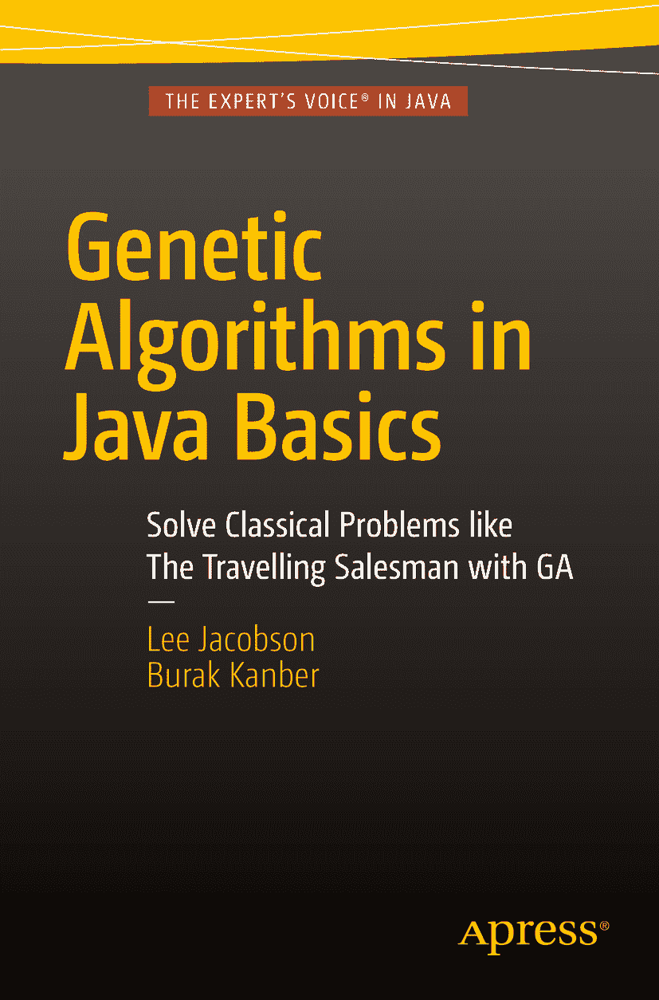

李·雅各布森（Lee Jacobson）与布拉克·坎伯（Burak Kanber）合著《Java 基础遗传算法》

作者在本文中引用的任何源代码或其他补充材料，读者均可从[`www.apress.com`](http://www.apress.com/)获取。有关如何找到本书源代码的详细信息，请访问[`www.apress.com/source-code/`](http://www.apress.com/source-code/)。ISBN 978-1-4842-0329-3，电子书 ISBN 978-1-4842-0328-6，DOI 10.1007/978-1-4842-0328-6 © Apress 2015《Java 基础遗传算法》Apress 高级丛书管理总监：Welmoed Spahr 首席编辑：Steve Anglin 技术审校：John Zukowski 和 Massimo Nardone 编辑委员会：Steve Anglin, Louise Corrigan, Jim DeWolf, Jonathan Gennick, Robert Hutchinson, Michelle Lowman, James Markham, Susan McDermott, Matthew Moodie, Jeffrey Pepper, Douglas Pundick, Ben Renow-Clarke, Gwenan Spearing 协调编辑：Jill Balzano 排版：SPi Global 索引制作：SPi Global 插图制作：SPi Global 如需了解翻译事宜，请发送电子邮件至`rights@apress.com`，或访问[`www.apress.com`](http://www.apress.com/)。Apress 及 friends of ED 图书可批量购买用于学术、企业或促销用途。大多数图书也提供电子书版本和许可。更多信息，请参考我们的特殊批量销售–电子书许可网页：[`www.apress.com/bulk-sales`](http://www.apress.com/bulk-sales)。本作品受版权保护。出版商保留所有权利，无论是整体还是部分内容，具体包括翻译、重印、重用插图、朗诵、广播、微缩胶片复制或任何其他物理方式复制，以及电子改编、计算机软件或目前已知或未来开发的类似或不同方法进行的信息存储与检索传输。法律保留的例外情况包括：与评论或学术分析相关的简短摘录，或专门为输入计算机系统并执行而提供的材料，仅供购买者独家使用。未经出版商所在地现行版权法许可，不得复制本出版物或其任何部分，且使用许可必须始终从 Springer 获取。可通过版权清算中心的 RightsLink 获取使用许可。违反者将根据相应版权法被起诉。本书中可能出现商标名称、标识和图像。对于商标名称、标识或图像的每次出现，我们并非都使用商标符号，而是仅以编辑方式使用这些名称、标识和图像，以维护商标所有者的利益，且无意侵犯商标。本出版物中使用的商品名称、商标、服务标志及类似术语，即使未明确标识，也不应被视为对其是否受专有权利保护的表达意见。尽管本书中的建议和信息在出版时被认为是真实准确的，但作者、编辑和出版商均不对可能存在的任何错误或遗漏承担法律责任。出版商对本书所含内容不作任何明示或暗示的保证。本书由 Springer Science+Business Media New York 在全球图书贸易中发行，地址：233 Spring Street, 6th Floor, New York, NY 10013。电话：1-800-SPRINGER，传真：(201) 348-4505，电子邮件：orders-ny@springer-sbm.com，或访问 www.springer.com。Apress Media, LLC 是加利福尼亚州有限责任公司，其唯一成员（所有者）是 Springer Science + Business Media Finance Inc (SSBM Finance Inc)。SSBM Finance Inc 是特拉华州公司。前言

近年来，机器学习领域的人气急剧增长。当然，原因有很多，但处理能力的稳步提升、RAM 和存储空间成本的持续下降，以及按需云计算的兴起，无疑是重要的推动因素。

然而，这些因素只是促成了机器学习的兴起，并不能解释其根本原因。机器学习究竟有何魅力？机器学习就像一座冰山；其尖端是由计算机视觉、语音识别、生物信息学、医学研究，甚至能赢得《危险边缘！》比赛的计算机（IBM 的 Watson）等新颖且激动人心的研究领域构成的。这些领域不容轻视或低估；它们在未来几年必将成为巨大的市场驱动力。

然而，冰山还有很大一部分位于水下，这部分已经足够成熟，可以在今天为我们所用——尽管很少见到年轻工程师声称“商业智能”是他们学习该领域的动力。机器学习——是的，当今的机器学习——让企业能够从复杂的客户行为中学习。机器学习帮助我们理解股票市场、天气模式、拥挤音乐会场地的人群行为，甚至可以用来预测下一次流感爆发的地点。

事实上，随着处理资源变得越来越廉价，很难想象未来机器学习不会在大多数企业的客户渠道、运营、生产和增长战略中扮演核心角色。

然而，存在一个问题。机器学习是一个复杂且困难的领域，中途放弃率很高。培养专业知识需要时间和精力。我们面临一项艰巨但重要的任务：为了跟上该领域专家日益增长的需求，我们需要让机器学习更易于入门。到目前为止，我们落后于需求。麦肯锡公司 2011 年的“大数据白皮书”估计，到 2018 年，机器学习领域的人才需求将比供给高出 50-60%！虽然这让现有的机器学习专家在未来几年处于有利地位，但也阻碍了我们近期实现机器学习全部潜力的能力。

## 为什么选择遗传算法？

遗传算法是机器学习的一个子集。在实践中，遗传算法通常不是解决某个特定问题的最佳单一算法。几乎每个问题都有更好、更具针对性的解决方案！那为什么还要费心呢？遗传算法是一种出色的多用途工具，可以应用于许多不同类型的问题。这就像瑞士军刀和专用棘轮螺丝刀之间的区别。如果你的工作是拧紧 300 颗螺丝，你会选择螺丝刀；但如果你的工作是拧几颗螺丝、剪一块布、在皮革上打个孔，然后打开一瓶冰镇汽水犒劳自己，那么瑞士军刀是更好的选择。

此外，我认为遗传算法是学习整个机器学习的最佳入门。如果机器学习是一座冰山，遗传算法就是冰山一角的一部分。遗传算法有趣、激动人心且新颖。由于遗传算法模拟了自然生物过程，它在计算世界和自然世界之间建立了联系。编写你的第一个遗传算法，并看着令人惊叹的结果从混沌和随机中涌现出来，对许多学生来说都是令人敬畏的体验。

机器学习冰山一角的其他研究领域同样令人兴奋，但它们往往更狭窄、更难理解。而遗传算法则易于理解、实现起来有趣，并且引入了所有机器学习技术都使用的许多概念。

如果你对机器学习感兴趣但不知从何入手，那就从遗传算法开始吧。你将学到重要的概念，这些概念可以迁移到其他领域；你将构建——不，是赢得——一个出色的多用途工具，可以用来解决许多类型的问题，而且无需学习高等数学就能理解。

## 关于本书

本书为你提供了对遗传算法简单直接的介绍。无需数学、数据结构或算法方面的先决知识，就能充分利用本书——不过我们确实希望你具备中级计算机编程水平。虽然本书使用的编程语言是 Java，但我们没有使用任何 Java 特有的高级语言结构或第三方库。只要你熟悉面向对象编程，就能毫无困难地理解书中的示例。读完本书，你将能够用你选择的语言（无论是面向对象语言、函数式语言还是过程式语言）轻松实现遗传算法。

本书将引导你使用遗传算法解决四个不同的问题。在此过程中，你将学到许多技巧，未来在构建遗传算法时可以混合搭配使用。当然，遗传算法是一个庞大且成熟的领域，也有其底层的数学形式，一本书不可能涵盖该领域的所有内容。因此我们划定了界限：我们避免学究式的讨论，避开数学形式，也不涉足高级遗传算法的领域。本书的目标是让你通过实际示例快速上手，并为你提供足够的基础，以便你自行继续学习高级主题。

## 源代码

本书中呈现的代码是全面的；让示例运行所需的一切都已印在书页中。然而，为了节省空间和纸张，我们在展示示例时经常省略代码注释和 Java 文档注释。请访问[`​www.​apress.​com/​9781484203293`](http://www.apress.com/9781484203293)并打开“源代码/下载”选项卡，下载随附的 Eclipse 项目，其中包含本书中的所有示例代码——你会发现许多有用的注释和文档注释，这些在书页中是找不到的。

通过阅读本书并实践其中的示例，你正在迈出成为机器学习专家的第一步。这可能会改变你的职业轨迹，但这取决于你自己。我们只能尽力教育你，并为你提供构建自己未来所需的工具。祝你好运！

——布拉克·坎伯

目录 第 1 章：引言 1 什么是人工智能？ 1 生物学类比 2 进化计算的历史 3 进化计算的优势 4 生物进化 6 生物进化示例 7 基本术语 8 术语 8 搜索空间 9 适应度景观 9 局部最优 12 参数 15 变异率 15 种群规模 16 交叉率 16 遗传表示 16 终止条件 17 搜索过程 17 参考文献 19 第 2 章：基本遗传算法的实现 21 实现前准备 21 基本遗传算法的伪代码 22 关于本书中的代码示例 22 基本实现 23 问题描述 23 参数 24 初始化 25 评估 30 终止检查 32 交叉 34 精英主义 40 变异 41 执行 43 总结 44 第 3 章：机器人控制器 47 引言 47 问题描述 48 实现 49 开始之前 49 编码 50 初始化 53 评估 59 终止检查 68 选择方法与交叉 71 执行 77 总结 78 练习 79 第 4 章：旅行商问题 81 引言 81 问题描述 83 实现 83 开始之前 83 编码 84 初始化 84 评估 87 终止检查 91 交叉 92 变异 96 执行 98 总结 102 练习 103 第 5 章：课程安排 105 引言 105 问题描述 106 实现 107 开始之前 107 编码 107 初始化 108 执行类 121 评估 127 终止条件 128 变异 130 执行 132 分析与优化 135 练习 137 总结 137 第 6 章：优化 139 自适应遗传算法 139 实现 140 练习 142 多启发式算法 143 实现 143 练习 144 性能改进 144 适应度函数设计 145 并行处理 145 适应度值哈希 146 编码 149 变异与交叉方法 149 总结 150 索引 153 内容概览 关于作者 ix   关于技术审校者 xi   前言 xiii   第 1 章：引言 1   第 2 章：基本遗传算法的实现 21   第 3 章：机器人控制器 47   第 4 章：旅行商问题 81   第 5 章：课程安排 105   第 6 章：优化 139   索引 153   关于作者与关于技术审校者 关于作者 关于技术审校者

