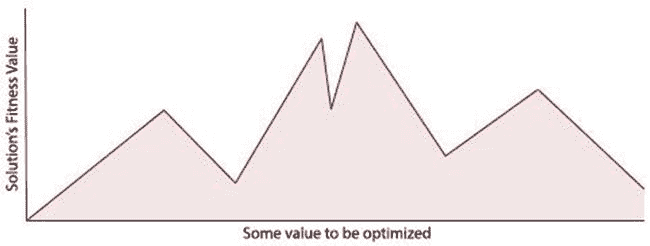
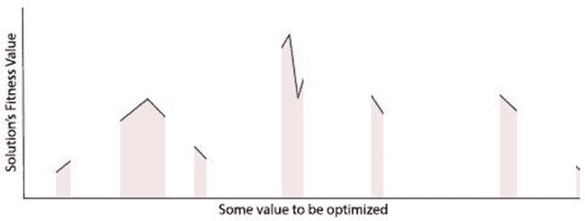
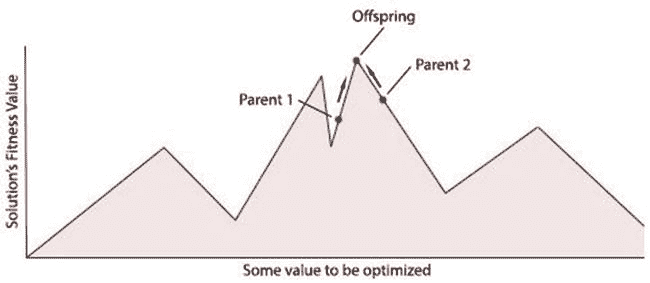
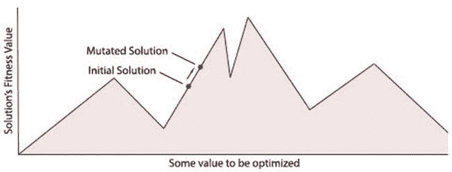
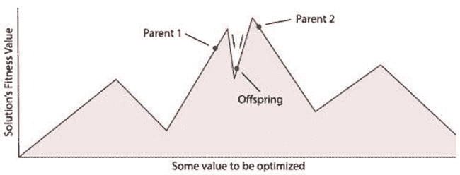
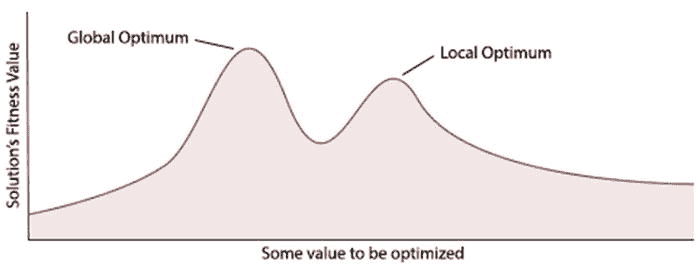
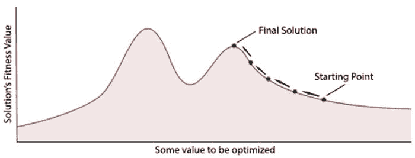
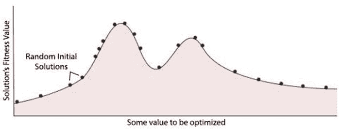
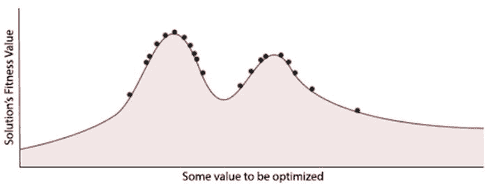
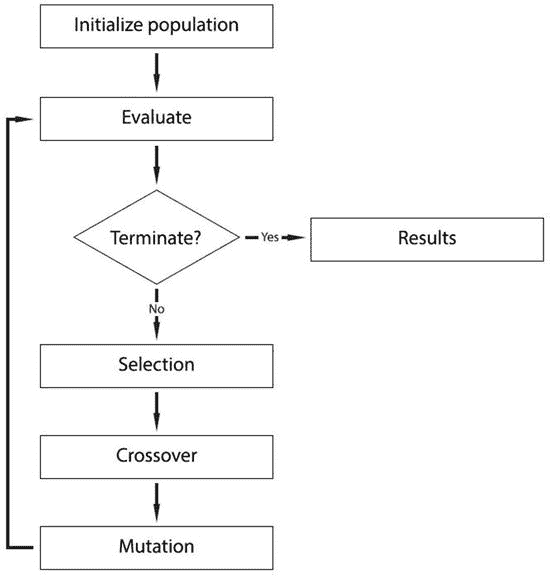

# 引言

电子补充材料 本章在线版本（doi:[10.​1007/​978-1-4842-0328-6_​1](http://dx.doi.org/10.1007/978-1-4842-0328-6_1)）包含补充材料，仅供授权用户使用。

数字计算机的诞生与信息时代的崛起彻底改变了现代生活方式。数字计算机的发明使我们能够将生活的众多领域数字化。这种数字化让我们可以将许多繁琐的日常任务外包给计算机，而这些任务过去可能需要人类亲自完成。一个日常例子就是现代文字处理应用程序，它们内置拼写检查器，可自动检查文档中的拼写和语法错误。

随着计算机速度越来越快、计算能力越来越强，我们已能利用它们执行日益复杂的任务，例如理解人类语音，甚至相当准确地预测天气。这种持续创新使我们能够将越来越多的任务外包给计算机。当今的计算机每秒可能执行数十亿次运算，但无论其技术能力变得多强，除非它们能够学习并自我调整以更好地适应所面临的问题，否则它们将永远受限于我们人类为它们编写的规则或代码。

人工智能领域及其子领域——遗传算法，正开始着手解决当今数字世界中面临的一些更为复杂的问题。通过将遗传算法应用于现实世界的应用程序，可以解决那些用传统计算方法几乎无法解决的问题。

## 什么是人工智能？

1950 年，数学家兼早期计算机科学家艾伦·图灵发表了一篇著名论文《计算机器与智能》，他在文中问道：“计算机能思考吗？”他的问题引发了关于智能究竟是什么以及计算机可能存在的根本限制的广泛争论。

许多早期计算机科学家相信，计算机不仅能够表现出类似智能的行为，而且只需几十年的研究就能达到人类水平的智能。赫伯特·A·西蒙在 1965 年就表明了这种观点，他宣称：“机器将在二十年内能够完成人类能做的任何工作。”当然，如今 50 多年过去了，我们知道西蒙的预测远未成为现实，但在当时，许多计算机科学家都认同他的立场，并将创造一台“强人工智能”机器作为目标。强人工智能机器简单来说，就是一台在完成任何交给它的任务时，其智力能力至少与人类相当。

如今，距离艾伦·图灵提出那个著名问题已过去 50 多年，机器最终能否以类似人类的方式思考，这个问题在很大程度上仍悬而未决。时至今日，他那篇关于“思考”含义的论文及其思想，仍在哲学家和计算机科学家之间引发广泛争论。

尽管我们距离创造出能够复制人类智能的机器还很遥远，但毫无疑问，在过去的几十年里，我们在人工智能领域取得了重大进展。自 20 世纪 50 年代以来，对“强人工智能”以及开发与人类相当的人工智能的关注，已开始转向“弱人工智能”。弱人工智能是开发更窄聚焦的智能机器，这在短期内更容易实现。这种更窄的聚焦使计算机科学家能够创造出实用且看似智能的系统，例如苹果的 Siri 和谷歌的自动驾驶汽车。

在创建弱人工智能系统时，研究人员通常会专注于构建一个系统或机器，其“智能”程度仅需足以完成一个相对较小的问题即可。这意味着我们可以应用更简单的算法，使用更少的计算资源，同时仍能取得成果。相比之下，强人工智能研究则专注于构建一台足够智能且有能力解决我们人类能解决的任何问题的机器。由于问题范围过大，这使得使用强人工智能构建最终产品变得不太实用。

仅仅几十年间，弱人工智能系统已成为我们现代生活方式中常见的组成部分。从下棋到帮助人类驾驶战斗机，弱人工智能系统已证明自己在解决那些曾被认为只有人类才能解决的问题方面非常有用。随着数字计算机变得更小、计算能力更强，这些系统的实用性很可能只会与日俱增。

## 生物学类比

当早期计算机科学家首次尝试构建人工智能系统时，他们常常从自然界中寻找灵感，以设计算法的工作方式。通过创建模仿自然界过程的模型，计算机科学家能够赋予算法进化的能力，甚至复制人脑的特征。正是通过实现这些受生物学启发的算法，这些早期先驱者首次让机器具备了适应、学习以及控制环境某些方面的能力。

通过使用不同的生物学类比作为指导性隐喻来开发人工智能系统，计算机科学家开创了不同的研究领域。自然，启发每个研究领域的不同生物系统都有其特定的优势和应用。一个成功的研究领域，也是本书关注的领域，是进化计算——其中遗传算法构成了大部分研究内容。其他领域则侧重于略有不同的方面，例如模拟人脑。这个研究领域被称为人工神经网络，它利用生物神经系统的模型来模仿其学习和数据处理能力。

## 进化计算的历史

进化计算最早在 20 世纪 50 年代被探索作为一种优化工具，当时计算机科学家正在尝试将达尔文生物进化思想应用于候选解群体。他们推测，可能可以应用诸如交叉（类似于生物繁殖）和变异（将新遗传信息添加到基因组的过程）等进化算子。正是这些算子与选择压力相结合，使得遗传算法能够在经过一段时间后“进化”出新的解决方案。

20 世纪 60 年代，“进化策略”——一种应用自然选择和进化思想的优化技术——由雷肯伯格（Rechenberg，1965, 1973）首次提出，他的思想后来由施韦费尔（Schwefel，1975, 1977）进一步扩展。当时其他计算机科学家也在独立研究类似领域，例如福格尔·L.J.、欧文斯·A.J.和沃尔什·M.J.（1966），他们首次引入了进化编程领域。他们的技术涉及将候选解表示为有限状态机，并应用变异来创建新的解决方案。

在 20 世纪 50 年代和 60 年代，一些研究进化的生物学家开始尝试使用计算机模拟进化。然而，是霍兰德·J.H.（Holland, J.H.，1975）在 20 世纪 60 年代和 70 年代首次发明并发展了遗传算法的概念。他最终在 1975 年出版的开创性著作《自然与人工系统中的适应》中阐述了他的思想。霍兰德的著作展示了如何将达尔文进化论抽象化，并使用计算机建模以用于优化策略。他的书解释了如何将生物染色体建模为 1 和 0 的字符串，以及如何通过实施自然选择中发现的诸如变异、选择和交叉等技术来“进化”这些染色体的群体。

自 20 世纪 70 年代首次提出以来，霍兰德对遗传算法的原始定义在几十年间逐渐发生了变化。这在一定程度上是由于近年来在进化计算领域工作的研究人员偶尔会将不同方法的思想融合在一起。尽管这模糊了许多方法论之间的界限，但它为我们提供了丰富的工具集，帮助我们更好地解决特定问题。本书中使用的术语“遗传算法”将既指霍兰德对遗传算法的经典构想，也指该词在当今更广泛的解释。

时至今日，计算机科学家仍在研究生物学和生物系统，以获取如何创建更好算法的灵感。最近出现的受生物学启发的优化算法之一是蚁群优化算法，由马可·D.（Marco, D.，1992）于 1992 年首次提出。蚁群优化算法将蚂蚁的行为建模为一种方法，用于解决各种优化问题，例如旅行商问题。

## 进化计算的优势

智能机器在我们社会中被采纳的速度本身就证明了它们的实用性。我们使用计算机解决的绝大多数问题都可以简化为相对简单的静态决策问题。随着可能的输入和输出数量增加，这些问题会迅速变得更加复杂，而当解决方案需要适应不断变化的问题时，情况只会更加复杂。除此之外，某些问题可能还需要算法搜索大量可能的解决方案以寻找可行解。根据需要搜索的解决方案数量，经典计算方法可能无法在可用的时间范围内找到可行解——即使使用超级计算机也是如此。正是在这些情况下，进化计算可以提供帮助。

为了让你了解一个可以用经典计算方法解决的典型问题，考虑一个交通信号灯系统。交通信号灯是相对简单的系统，只需要基本的智能水平即可运行。交通信号灯系统通常只有几个输入，可以提醒它诸如汽车或行人等待使用路口等事件。然后它需要管理这些输入，并正确地改变灯光，使汽车和行人能够高效地使用路口而不会引发事故。尽管操作交通信号灯系统可能需要一定量的知识，但其输入和输出足够基础，以至于人类可以毫无问题地设计和编程一套指令来操作该系统。

通常，我们需要一个智能系统来处理更复杂的输入和输出。这可能意味着人类不再能够简单，甚至可能无法编程一套指令，使机器能够正确地将输入映射到可行的输出。在这些情况下，问题的复杂性使得人类程序员用代码解决变得不切实际，优化和学习算法可以为我们提供一种方法，利用计算机的处理能力来找到问题本身的解决方案。一个例子可能是构建一个欺诈检测系统，该系统能够根据交易信息识别欺诈交易。尽管交易数据与欺诈交易之间可能存在某种关系，但它可能取决于数据本身中的许多细微之处。正是输入中的这些细微模式可能难以让人类编码，使其成为应用进化计算的理想候选。

当人类不知道如何解决问题时，进化算法也很有用。一个经典的例子是，美国国家航空航天局（NASA）曾为 2006 年的一项太空任务寻找一种满足所有要求的天线设计。NASA 编写了一个遗传算法，该算法进化出一种天线设计，以满足其所有特定的设计约束，例如信号质量、尺寸、重量和成本。在这个例子中，NASA 不知道如何设计一种能满足所有要求的天线，因此他们决定编写一个能够进化出天线的程序。

另一种可能需要应用进化计算策略的情况是，当问题不断变化，需要自适应解决方案时。在构建预测股市的算法时就会遇到这个问题。一个算法在一周内对股市做出准确预测，但可能在下周就无法做出准确预测。这是由于股市模式与趋势的不断变化，使得预测算法非常不可靠，除非它们能够快速适应正在发生的变化模式。进化计算可以通过提供一种方法，在必要时对预测算法进行适应性调整，从而帮助适应这些变化。

最终，有些问题需要在庞大甚至无限的潜在解决方案中搜索，以找到针对当前问题的最佳或“足够好”的解决方案。从根本上说，所有进化算法都可视为搜索算法，它们在一组可能的解决方案中搜索，寻找最佳——或称“最适应”——的解决方案。如果你将生物体基因组中所有潜在的基因组合视为候选解决方案，或许就能直观理解这一点。生物进化非常擅长在这些可能的基因序列中搜索，以找到足够适应其环境的解决方案。在更大的搜索空间中，即使使用进化算法，也很可能找不到给定问题的最佳解决方案。然而，对于大多数优化问题来说，这很少成为问题，因为我们通常只需要一个足以完成任务的解决方案即可。

进化计算所提供的方法可以被视为一种“自下而上”的范式。也就是说，算法中涌现出的所有复杂性都源于简单、基础的规则。与之相对的是“自上而下”的方法，它要求算法中展现的所有复杂性都由人类编写。遗传算法开发起来相当简单；这使得它们在原本需要复杂算法来解决问题时，成为一个有吸引力的选择。

以下是一份特征列表，这些特征可以使一个问题成为应用进化算法的良好候选：

*   当问题难以通过编写代码来解决时
*   当人类不确定如何解决问题时
*   当问题在不断变化时
*   当逐一搜索每个可能的解决方案不可行时
*   当“足够好”的解决方案可以接受时

## 生物进化

生物进化，通过自然选择的过程，最早由查尔斯·达尔文（1859 年）在其著作《物种起源》中提出。正是他的生物进化概念启发了早期的计算机科学家，他们将生物进化改编并用作其优化技术的模型，这些技术体现在进化计算算法中。

由于遗传算法中使用的许多思想和概念直接源于生物进化，因此对该主题有基本的了解有助于更深入地理解该领域。话虽如此，在我们开始探索遗传算法之前，让我们先快速了解一下生物进化的（经过一定简化的）基础知识。

所有生物体都包含 DNA，它编码了构成该生物体的所有不同特征。DNA 可以被看作是生命从头开始创造生物体的说明书。改变生物体的 DNA 会改变其特征，例如眼睛和头发的颜色。DNA 由单个基因组成，正是这些基因负责编码生物体的特定特征。

生物体的基因聚集在染色体中，一整套染色体构成了生物体的基因组。所有生物体至少有一条染色体，但通常拥有更多，例如人类有 46 条染色体，而有些物种的染色体数量超过 1000 条！在遗传算法中，我们通常将染色体称为候选解决方案。这是因为遗传算法通常使用单条染色体来编码候选解决方案。

特定特征的各种可能设置被称为“等位基因”，而该特征在染色体上被编码的位置被称为“基因座”。我们将特定的基因组称为“基因型”，而该基因型所编码的物理生物体被称为“表型”。

当两个生物体交配时，来自双方的 DNA 被汇集并组合在一起，使得产生的生物体——通常称为后代——从其第一个亲本获得 50%的 DNA，从第二个亲本获得另外 50%的 DNA。生物体 DNA 中的基因偶尔会发生突变，使其拥有在父母双方中都未发现的 DNA。这些突变通过向种群中添加以前无法获得的基因，为种群提供了遗传多样性。种群中所有可能的遗传信息被称为该种群的“基因库”。

如果产生的生物体足够适应其环境而得以生存，它很可能会自行交配，使其 DNA 能够延续到未来的种群中。然而，如果产生的生物体不够适应环境而无法生存并最终交配，其遗传物质就不会传播到未来的种群中。这就是为什么进化有时被称为“适者生存”——只有最适应的个体才能生存并传递其 DNA。正是这种选择压力，缓慢地引导着进化，以找到越来越适应、适应性更强的个体。

### 生物进化示例

为了帮助阐明这一过程如何逐步导致越来越适应的个体的进化，请考虑以下示例：

在一个遥远的星球上，存在着一种呈白色方块形状的物种。

白色方块物种已经和平生活了数千年，直到最近，一个新物种——黑色圆圈——出现了。

黑色圆圈物种是食肉动物，开始以白色方块种群为食。

白色方块没有任何办法防御黑色圆圈。直到有一天，一个幸存的白色方块随机地从白色方块变异成了黑色方块。黑色圆圈不再将新的黑色方块视为食物，因为它和自己颜色相同。

一些幸存的方块种群进行了交配，产生了新一代的方块。这些新方块中的一些继承了黑色方块的基因。

然而，白色的方块继续被吃掉……

最终，得益于它们看起来与黑色圆圈相似的进化优势，它们不再被吃掉。现在剩下的唯一颜色方块就是黑色方块了。

不再成为黑色圆圈猎物的黑色方块，再次得以和平生活。

## 基本术语

遗传算法建立在生物进化的概念之上，因此，如果你熟悉进化论中的术语，你很可能会注意到在处理遗传算法时遇到的术语存在重叠。这两个领域之间的相似性当然是由于进化算法，更具体地说，是遗传算法与自然界中发现的过程相类似。

### 术语

在深入探讨遗传算法领域之前，我们首先理解一些基本语言和术语非常重要。随着本书内容的推进，更复杂的术语将根据需要逐步引入。以下是一些常见术语的参考列表。

*   **种群** – 这仅仅是一组候选解的集合，可以对它们应用诸如变异和交叉等遗传算子。
*   **候选解** – 针对给定问题的一个可能解决方案。
*   **基因** – 构成染色体的不可分割的构建块。经典情况下，一个基因由 0 或 1 组成。
*   **染色体** – 染色体是一串基因。染色体定义了一个特定的候选解。一个采用二进制编码的典型染色体可能包含类似“01101011”的内容。
*   **变异** – 随机改变候选解中基因以创造新特征的过程。
*   **交叉** – 将染色体组合以创造新候选解的过程。这有时也被称为重组。
*   **选择** – 挑选候选解以繁殖下一代解的技术。
*   **适应度** – 衡量候选解适应给定问题程度的分数。

## 搜索空间

在计算机科学中，当处理具有许多需要搜索的候选解的优化问题时，我们将这些解的集合称为“搜索空间”。搜索空间内的每个特定点都作为给定问题的一个候选解。在这个搜索空间内存在一个距离的概念，其中彼此距离较近的解比距离较远的解更有可能表现出相似的特征。为了理解这些距离在搜索空间上是如何组织的，请考虑以下使用二进制遗传表示的示例：

“101”与“111”仅相差 1。这是因为从“101”转换到“111”只需要改变一次（将 0 翻转为 1）。这意味着这些解在搜索空间上仅相隔 1 个位置。

另一方面，“000”与“111”相差 3。这使得它的距离为 3，将“000”与“111”在搜索空间上相隔 3 个位置。

由于变化较少的解彼此聚集得更近，因此搜索空间上解之间的距离可用于近似估计另一个解所具有的特征。这种理解常被许多搜索算法用作策略，以改进其搜索结果。

### 适应度景观

当搜索空间内的候选解根据其各自的适应度水平被标记时，我们就可以开始将搜索空间视为一个“适应度景观”。图 1-1 展示了一个二维适应度景观可能的样子。

图 1-1.

一个二维适应度景观

在我们适应度景观的底部坐标轴上是我们要优化的值，左侧坐标轴上是其对应的适应度值。我应该指出，这通常是对实际情况的过度简化。大多数现实世界的应用都有多个需要优化的值，从而形成一个多维的适应度景观。

在上面的例子中，可以看到搜索空间中每个候选解的适应度值。这使得很容易看出最优解位于何处，然而，要在现实中实现这一点，搜索空间中的每个候选解都需要评估其适应度函数。对于具有指数级搜索空间的复杂问题，评估每个解的适应度值是不可行的。在这些情况下，搜索算法的工作就是在只能看到搜索空间极小一部分的情况下，找到最佳解可能所在的位置。图 1-2 是一个搜索算法通常可能看到的示例。

图 1-2.

一个更典型的搜索适应度空间

考虑一个正在搜索包含十亿（1,000,000,000）个可能解的搜索空间的算法。即使每个解只需要 1 秒来评估并分配一个适应度值，明确搜索每个潜在解仍然需要超过 30 年！如果我们不知道搜索空间中每个解的适应度值，那么我们就无法确切知道最佳解位于何处。在这种情况下，唯一合理的方法是使用一种能够在可用时间范围内找到足够好解的搜索算法。在这些条件下，遗传算法和进化算法通常非常擅长在相对较短的时间内找到可行的、接近最优的解。

遗传算法在搜索搜索空间时采用种群方法。作为其搜索策略的一部分，遗传算法会假设两个排名靠前的解可以组合起来形成一个适应度更高的后代。这个过程可以在我们的适应度景观上可视化（图 1-3）。

图 1-3.

适应度图中的父代与子代

遗传算法中的变异算子允许我们搜索特定候选解的近邻。当对一个基因应用变异时，其值会被随机改变。这可以想象为在搜索空间上迈出一步（图 1-4）。

图 1-4.

展示变异的适应度图

在交叉和变异这两个例子中，最终得到的解有可能比我们最初拥有的解适应度更低（图 1-5）。

图 1-5.

一个适应度较差的解

在这些情况下，如果该解的表现足够差，它最终会在选择过程中被从基因库中移除。只要种群的平均趋势是朝向适应度更高的解，单个候选解中微小的负面变化是可以接受的。

### 局部最优

在实现优化算法时，需要考虑的一个障碍是算法逃离搜索空间中局部最优位置的能力。为了更好地理解什么是局部最优，请参考图 1-6。

图 1-6.

局部最优可能具有欺骗性

这里我们可以看到适应度景观上有两座山峰，其高度略有不同。如前所述，优化算法无法看到整个适应度景观，它所能做的最好的事情就是找到它认为可能位于搜索空间中最佳位置的解。正是由于这一特性，优化算法常常会在不知不觉中将其搜索集中在搜索空间的次优区域。

当实现一个简单的爬山算法来解决任何足够复杂的问题时，这个问题很快就会显现出来。简单的爬山算法没有任何内在的方法来处理局部最优，因此它通常会在搜索空间的局部最优区域终止搜索。简单的随机爬山算法类似于没有种群和交叉操作的遗传算法。该算法相当容易理解：它从搜索空间中的一个随机点开始，然后通过评估其邻居解来尝试找到更好的解。当爬山算法在其邻居中找到更好的解时，它会移动到新的位置并重新开始搜索过程。这个过程会通过沿着它在搜索空间中所处的任何山峰逐步向上移动，从而逐渐找到改进的解——因此得名“爬山算法”。当爬山算法再也找不到更好的解时，它会假定自己位于山顶并停止搜索。

图 1-7 展示了爬山算法一次典型运行过程可能的样子。

图 1-7.

展示了爬山算法的工作原理

上图演示了，如果简单爬山算法的搜索起始于搜索空间中的局部最优区域，它很容易返回一个局部最优解。

尽管在未评估整个搜索区域之前，没有保证能避免局部最优的方法，但存在许多算法的变体可以帮助避免局部最优。其中最基本且有效的方法之一称为随机重启爬山算法，它简单地多次从随机起始位置运行爬山算法，然后返回多次运行中找到的最佳解。这种优化方法相对容易实现，而且效果出奇地好。其他方法，如模拟退火（参见 Kirkpatrick、Gelatt 和 Vecchi，1983 年）和禁忌搜索（参见 Glover，1989 年和 Glover，1990 年），都是对爬山算法的轻微变体，它们都具有有助于减少局部最优的特性。

遗传算法在避免局部最优和获取接近最优解方面效果出奇地好。它实现这一点的方式之一是拥有一个种群，使其能够对搜索空间的大范围进行采样，从而定位继续搜索的最佳区域。图 1-8 展示了初始化时种群可能如何分布。

图 1-8.

初始化时的采样区域

经过几代之后，种群将开始向上一代中能找到最佳解的区域收敛。这是因为在**选择**过程中，适应度较低的解会被移除，从而为在**交叉**和**变异**过程中产生新的、适应度更高的解腾出空间（图 1-9）。

图 1-9.

经过几代变异后的适应度图

**变异**算子也在规避局部最优中发挥作用。变异允许一个解从其当前位置跳跃到搜索空间中的另一个位置。这个过程常常会导致在搜索空间中更优的区域发现适应度更高的解。

## 参数

尽管所有遗传算法都基于相同的概念，但它们的具体实现可能差异很大。具体实现可能不同的方式之一在于其参数。一个基本的遗传算法在实现时至少需要考虑几个参数。主要的三个参数是：**变异率**、**种群大小**，第三个是**交叉率**。

### 变异率

变异率是指解染色体中特定基因发生变异的概率。从技术上讲，遗传算法的变异率没有正确的值，但某些变异率会比其他值提供好得多的结果。较高的变异率允许种群中有更多的遗传多样性，也有助于算法避免局部最优。然而，过高的变异率会导致每一代之间的遗传变异过大，从而使算法丢失在前一种群中找到的优秀解。

如果变异率过低，算法在搜索空间中移动所需的时间会过长，从而阻碍其找到令人满意的解。变异率过高也会延长找到可接受解所需的时间。尽管高变异率有助于遗传算法避免陷入局部最优，但当设置过高时，它会对搜索产生负面影响。如前所述，这是因为每一代中的解被变异到如此大的程度，以至于在应用变异后它们实际上被随机化了。

为了理解配置良好的变异率为何重要，考虑两个二进制编码的候选解：“100”和“101”。没有变异，新的解只能来自交叉。然而，当我们对解进行交叉时，后代只有两种可能的结果：“100”或“101”。这是因为父代基因组中唯一的区别在于它们的最后一位。如果后代从第一个父代那里获得最后一位，它将是“1”；否则，如果来自第二个父代，它将是“0”。如果算法需要找到替代解，它就需要对现有解进行变异，从而为其提供基因库中其他地方没有的新遗传信息。

变异率应设置为一个值，该值既能提供足够的多样性以防止算法陷入平台期，又不会过高导致算法丢失前一种群中有价值的遗传信息。这种平衡将取决于所解决问题的性质。

### 种群规模

种群规模即遗传算法中每一代种群所含个体的数量。种群规模越大，算法能够采样的搜索空间就越大，这有助于引导算法朝着更精确、更全局最优的解方向前进。种群规模过小往往会导致算法在搜索空间的局部最优区域找到不太理想的解，但每代所需的计算资源也更少。

与变异率类似，这里也需要在遗传算法的最优性能之间找到平衡。同样，所需的种群规模也会根据待解决问题的性质而变化。大型的、起伏不平的搜索空间通常需要更大的种群规模才能找到最佳解。有趣的是，在选择种群规模时，存在一个临界点，超过该点后，增加规模将不再显著提升算法所找到解的精度，反而会因为处理额外个体所需的计算量增加而拖慢执行速度。处于这个转变点附近的种群规模，通常能在资源与结果之间提供最佳平衡。

### 交叉率

交叉操作的频率也会影响遗传算法的整体性能。改变交叉率会调整种群中解被应用交叉算子的概率。高交叉率允许在交叉阶段发现许多新的、可能更优的解。较低的交叉率则有助于将适应度更高的个体的遗传信息完整地保留到下一代。交叉率通常应设置得相当高，以促进对新解的搜索，同时允许一小部分种群不受影响地保留到下一代。

## 遗传表示

除了参数之外，另一个影响遗传算法性能的组件是所使用的遗传表示。这是遗传信息在染色体中的编码方式。更好的表示方式能够以一种既富有表现力又易于进化的方式来编码解。Holland（1975）的遗传算法基于二进制遗传表示。他提出使用由 0 和 1 组成的字符串构成的染色体。这种二进制表示可能是最简单的编码方式，但对于许多问题而言，其表现力不足以成为合适的首选。考虑一个例子：使用二进制表示来编码一个整数，该整数正被优化用于某个函数。在这个例子中，“000”代表 0，“111”代表 7，这与二进制通常的表示方式一致。如果染色体中的第一个基因发生突变——通过将比特位从 0 翻转为 1，或从 1 翻转为 0——它将使编码值改变 4（“111”=7，“011”=3）。然而，如果染色体中的最后一个基因发生改变，它只会使编码值改变 1（“111”=7，“110”=6）。在这里，变异算子对候选解的影响取决于其染色体中被操作的基因，这种差异并不理想，因为它会降低算法的性能和可预测性。对于这个例子，更好的做法是使用一个整数，并配合一个互补的变异算子，该算子可以对基因值进行相对较小的加减操作。

除了简单的二进制表示和整数，遗传算法还可以使用：浮点数、基于树的表示、对象以及其遗传编码所需的任何其他数据结构。在构建有效的遗传算法时，选择合适的表示方式至关重要。

## 终止条件

遗传算法可以根据需要持续进化出新的候选解，所需时间从几秒到数年不等，具体取决于问题的性质。我们将遗传算法结束搜索的条件称为其终止条件。

一些典型的终止条件包括：

*   达到最大代数
*   超过分配的时间限制
*   找到了满足所需标准的解
*   算法已达到收敛平台期

有时，实现多个终止条件可能更可取。例如，设置一个最大时间限制，同时允许在找到足够好的解时提前终止，这样会很方便。

## 搜索过程

在本章结束前，让我们逐步审视遗传算法背后的基本过程，如图 1-10 所示。

遗传算法首先初始化一个候选解种群。这通常是随机进行的，以便对整个搜索空间进行均匀覆盖。  
接下来，通过为种群中的每个个体分配一个适应度值来评估种群。在此阶段，我们通常需要记录当前最优解以及种群的平均适应度。  
评估之后，算法根据设定的终止条件决定是否应终止搜索。通常，这是因为算法达到了固定的代数或找到了一个合适的解。  
如果终止条件未满足，种群将进入选择阶段，在此阶段，根据个体的适应度评分从种群中选择个体——适应度越高，个体被选中的机会就越大。  
下一阶段是对选中的个体应用交叉和变异。此阶段是为下一代创建新个体的地方。  
此时，新种群返回评估步骤，过程重新开始。我们将这个循环的每一轮称为一代。  
当最终满足终止条件时，算法将跳出循环，并通常将其最终搜索结果返回给用户。

图 1-10.

遗传算法的一般过程

## 参考文献

Turing, A.M. (1950). “Computing Machinery and Intelligence”

Simon, H.A. (1965). “The Shape of Automation for Men and Management”

Barricell, N.A. (1975). “Symbiogenetic Evolution Processes Realised by Artificial Methods”

Darwin, C. (1859). “On the Origin of Species”

Dorigo, M. (1992). “Optimization, Learning and Natural Algorithms”

Rechenberg, I. (1965) “Cybernetic Solution Path of an Experimental Problem”

Rechenberg, I. (1973) “Evolutionsstrategie: Optimierung technischer Systeme nach Prinzipien der biologischen Evolution”

Schwefel, H.-P. (1975) “Evolutionsstrategie und numerische Optimierung”

Schwefel, H.-P. (1977) “Numerische Optimierung von Computer-Modellen mittels der Evolutionsstrategie”

Fogel L.J; Owens, A.J; and Walsh, M.J. (1966) “Artificial Intelligence through Simulated Evolution”

Holland, J.H. (1975) “Adaptation in Natural and Artificial Systems”

Dorigo, M. (1992) “Optimization, Learning and Natural Algorithms”

Glover, F. (1989) “Tabu search. Part I”

Glover, F. (1990) “Tabu search. Part II”

Kirkpatrick, S; Gelatt, C.D, Jr., and Vecchi, M.P. (1983) “Optimization by simulated annealing”

