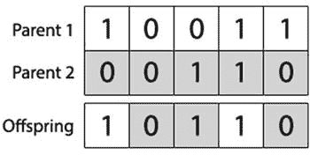

# 基础遗传算法的实现

本章我们将开始探索实现基础遗传算法所需的技术。我们在此开发的程序将在本书后续章节中通过添加功能进行修改。我们还将探讨遗传算法的性能如何根据其参数和配置而变化。

要跟随本节代码进行实践，首先需要在计算机上安装 Java JDK。你可以从 Oracle 官网免费下载并安装 Java JDK：

[`oracle.com/technetwork/java/javase/downloads/index.html`](http://oracle.com/technetwork/java/javase/downloads/index.html)

虽然并非必需，但除了安装 Java JDK 外，为了方便起见，你也可以选择安装兼容 Java 的 IDE，例如 Eclipse 或 NetBeans。

## 实现前准备

在实现遗传算法之前，最好先考虑遗传算法是否是解决当前任务的正确方法。通常，通过利用某些领域相关的启发式方法，会有更好的技术来解决特定的优化问题。遗传算法是领域无关的，或者说是一种“弱方法”，它可以应用于问题，而无需任何特定的先验知识来辅助其搜索过程。因此，如果没有已知的领域特定知识可用于指导搜索过程，遗传算法仍然可以用于发现潜在的解决方案。

当确定弱搜索方法适用时，还应考虑所使用的弱方法类型。这可能仅仅是因为另一种方法平均效果更好，但也可能是因为另一种方法更容易实现、需要更少的计算资源，或者能在更短的时间内找到足够好的结果。

## 基础遗传算法的伪代码

基础遗传算法的伪代码如下：

`1: generation = 0;`

`2: population[generation] = initializePopulation(populationSize);`

`3: evaluatePopulation(population[generation]);`

`3:` `While` `isTerminationConditionMet() == false` `do`

`4:     parents = selectParents(population[generation]);`

`5:    population[generation+1] = crossover(parents);`

`6:   population[generation+1] = mutate(population[generation+1]);`

`7:    evaluatePopulation(population[generation]);`

`8:     generation++;`

`9:` `End loop;`

伪代码从创建遗传算法的初始种群开始。然后对该种群进行评估，以找出其个体的适应度值。接下来，运行检查以确定遗传算法的终止条件是否已满足。如果尚未满足，遗传算法开始循环，种群在最终重新评估之前经历第一轮交叉和变异。从这时起，持续应用交叉和变异，直到满足终止条件，遗传算法终止。

这段伪代码展示了遗传算法的基本过程；然而，我们需要更详细地查看每一步，以充分理解如何创建一个令人满意的遗传算法。

## 关于本书中的代码示例

本书中的每一章都表示为随附 Eclipse 项目中的一个包。每个包至少包含四个类：

*   `GeneticAlgorithm` 类，它抽象了遗传算法本身，并提供了接口方法的问题特定实现，例如交叉、变异、适应度评估和终止条件检查。
*   `Individual` 类，代表单个候选解及其染色体。
*   `Population` 类，代表一个种群或一代个体，并对它们应用群体级别的操作。
*   一个包含“main”方法、一些引导代码、上述伪代码的具体版本以及特定问题可能需要的任何支持工作的类。这些类将根据其解决的问题命名，例如“AllOnesGA”、“RobotController”等。

你在本章中最初编写的 `GeneticAlgorithm`、`Population` 和 `Individual` 类需要在本书后续的每一章中进行修改。

你可以想象这些类实际上是诸如 `GeneticAlgorithmInterface`、`PopulationInterface` 和 `IndividualInterface` 等接口的具体实现——不过，我们保持了 Eclipse 项目布局的简洁性，并避免使用接口。

你在本书中会找到的 `GeneticAlgorithm` 类将始终实现许多重要方法，例如 `calcFitness`、`evalPopulation`、`isTerminationConditionMet`、`crossoverPopulation` 和 `mutatePopulation`。然而，这些方法的内容会根据当前问题的需求，在每一章中略有不同。

在跟随本书示例时，我们建议将 `GeneticAlgorithm`、`Population` 和 `Individual` 类复制到每个新问题中，因为某些方法的实现会逐章保持不变，但其他方法则会有所不同。

另外，请务必阅读随附 Eclipse 项目中源代码的注释！为了节省本书篇幅，我们省略了长篇注释和文档块，但在可供下载的 Eclipse 文件中，我们已非常仔细地对源代码进行了全面注释。这就像拥有第二本书可读！

在许多情况下，本书的章节会要求你在一个类中添加或修改单个方法。通常，在文件中的何处添加新方法并不重要，因此在这些情况下，我们要么从示例中省略类的其余部分，要么仅显示函数签名以帮助你保持正确方向。

## 基础实现

为了去除任何不必要的细节并使初始实现易于理解，我们在本书中介绍的第一个遗传算法将是一个简单的二进制遗传算法。

二进制遗传算法相对容易实现，并且是解决广泛优化问题的极其有效的工具。你可能还记得第 1 章，二进制遗传算法是 Holland（1975）提出的原始遗传算法类别。

### 问题

首先，让我们回顾一下“全一”问题，这是一个可以使用二进制遗传算法解决的非常基础的问题。

这个问题并不十分有趣，但它作为一个简单问题，有助于强调所涉及的基本技术。顾名思义，问题就是找到一个完全由 1 组成的字符串。因此，对于长度为 5 的字符串，最佳解将是“11111”。

### 参数

现在我们要解决一个问题，让我们继续实现。我们要做的第一件事是设置遗传算法的参数。如前所述，三个主要参数是种群规模、变异率和交叉率。本章还将引入一个名为“精英主义”的概念，并将其作为遗传算法的参数之一。

首先，创建一个名为 `GeneticAlgorithm` 的类。如果你使用的是 Eclipse，可以通过选择“文件 ➤ 新建 ➤ 类”来完成。我们选择按照本书的章节编号来命名包，因此我们将在 `chapter2` 包中工作。

这个 `GeneticAlgorithm` 类将包含遗传算法本身操作所需的方法和变量。例如，该类包含处理交叉、变异、适应度评估和终止条件检查的逻辑。创建该类后，添加一个接受四个参数的构造函数：种群规模、变异率、交叉率和精英成员数量。

`package chapter2;`

`/**`

`* 源代码中有大量注释，此处省略！`

`*/`

`public class GeneticAlgorithm {`

      `private int populationSize;`

      `private double mutationRate;`

      `private double crossoverRate;`

      `private int elitismCount;`

`public GeneticAlgorithm(int populationSize, double mutationRate, double crossoverRate, int elitismCount) {`

            `this.populationSize = populationSize;`

            `this.mutationRate = mutationRate;`

            `this.crossoverRate = crossoverRate;`

            `this.elitismCount = elitismCount;`

      `}`

      `/**`

       `* 更多方法将在后续实现...`

       `*/`

`}`

当传入所需参数时，此构造函数将创建一个具有所需配置的 `GeneticAlgorithm` 类的新实例。

现在我们应该创建引导类——回想一下，每一章都需要一个引导类来初始化遗传算法，并为应用程序提供一个起点。将这个类命名为 `AllOnesGA`，并定义一个 `main` 方法：

`package chapter2;`

`public class AllOnesGA {`

      `public static void main(String[] args) {`

            `// 创建 GA 对象`

            `GeneticAlgorithm ga = new GeneticAlgorithm(100, 0.01, 0.95, 0);`

            `// 我们稍后会在这里添加更多内容...`

      `}`

`}`

目前，我们只使用一些典型的参数值：种群规模 = 100；变异率 = 0.01；交叉率 = 0.95，精英计数为 0（暂时禁用它）。在完成本章末尾的实现后，你可以尝试更改这些参数，观察它们如何影响算法的性能。

### 初始化

下一步是初始化一个潜在解的种群。这通常是随机完成的，但有时可能更倾向于更系统化地初始化种群，可能是为了利用关于搜索空间的已知信息。在本例中，种群中的每个个体都将被随机初始化。我们可以通过为染色体中的每个基因随机选择值 1 或 0 来实现这一点。

在初始化种群之前，我们需要创建两个类：一个用于管理和创建种群，另一个用于管理和创建种群中的个体。例如，这些类将包含获取个体适应度或获取种群中最优个体的方法。

首先，让我们创建 `Individual` 类。请注意，为了节省篇幅，我们省略了下面的所有注释和方法文档块！你可以在附带的 Eclipse 项目中找到这个类的完整注释版本。

`package chapter2;`

`public class Individual {`

`private int[] chromosome;`

`private double fitness = -1;`

`public Individual(int[] chromosome) {`

`// 创建个体染色体`

`this.chromosome = chromosome;`

`}`

`public Individual(int chromosomeLength) {`

`this.chromosome = new int[chromosomeLength];`

`for (int gene = 0; gene < chromosomeLength; gene++) {`

`if (0.5 < Math.random()) {`

`this.setGene(gene, 1);`

`} else {`

`this.setGene(gene, 0);`

`}`

`}`

`}`

`public int[] getChromosome() {`

`return this.chromosome;`

`}`

`public int getChromosomeLength() {`

`return this.chromosome.length;`

`}`

`public void setGene(int offset, int gene) {`

`this.chromosome[offset] = gene;`

`}`

`public int getGene(int offset) {`

`return this.chromosome[offset];`

`}`

`public void setFitness(double fitness) {`

`this.fitness = fitness;`

`}`

`public double getFitness() {`

`return this.fitness;`

`}`

`public String toString() {`

`String output = "";`

`for (int gene = 0; gene < this.chromosome.length; gene++) {`

`output += this.chromosome[gene];`

`}`

`return output;`

`}`

`}`

`Individual` 类代表一个候选解，主要负责存储和操作染色体。请注意，`Individual` 类有两个构造函数。一个构造函数接受一个整数（表示染色体的长度），并在初始化对象时创建一个随机染色体。另一个构造函数接受一个整数数组，并将其用作染色体。

除了管理个体的染色体外，它还跟踪个体的适应度值，并且知道如何将自身打印为字符串。

下一步是创建 `Population` 类，该类提供管理种群中一组个体所需的功能。

像往常一样，本章省略了注释和文档块；请务必查看 Eclipse 项目以获取更多上下文！

`package chapter2;`

`import java.util.Arrays;`

`import java.util.Comparator;`

`public class Population {`

`private Individual population[];`

`private double populationFitness = -1;`

`public Population(int populationSize) {`

`this.population = new Individual[populationSize];`

`}`

`public Population(int populationSize, int chromosomeLength) {`

`this.population = new Individual[populationSize];`

`for (int individualCount = 0; individualCount < populationSize; individualCount++) {`

`Individual individual = new Individual(chromosomeLength);`

`this.population[individualCount] = individual;`

`}`

`}`

`public Individual[] getIndividuals() {`

`return this.population;`

`}`

`public Individual getFittest(int offset) {`

`Arrays.sort(this.population, new Comparator<Individual>() {`

`@Override`

`public int compare(Individual o1, Individual o2) {`

`if (o1.getFitness() > o2.getFitness()) {`

`return -1;`

`} else if (o1.getFitness() < o2.getFitness()) {`

`return 1;`

`}`

`return 0;`

`}`

`});`

`return this.population[offset];`

`}`

`public void setPopulationFitness(double fitness) {`

`this.populationFitness = fitness;`

`}`

`public double getPopulationFitness() {`

`return this.populationFitness;`

`}`

`public int size() {`

`return this.population.length;`

`}`

`public Individual setIndividual(int offset, Individual individual) {`

`return population[offset] = individual;`

`}`

`public Individual getIndividual(int offset) {`

`return population[offset];`

`}`

`public void shuffle() {`

`Random rnd = new Random();`

`for (int i = population.length - 1; i > 0; i--) {`

`int index = rnd.nextInt(i + 1);`

`Individual a = population[index];`

`population[index] = population[i];`

`population[i] = a;`

`}`

`}`

`}`

Population 类相当简单；其主要功能是持有一个个体数组，类的各个方法可以按需便捷地访问该数组。诸如 `getFittest()` 和 `setIndividual()` 之类的方法，就是能够访问并更新种群中个体的示例。除了持有个体之外，它还存储了种群的总适应度，这在之后实现选择方法时将变得非常重要。

现在我们有了种群和个体类，就可以在 `GeneticAlgorithm` 类中实现它们了。为此，只需在 `GeneticAlgorithm` 类中的任意位置创建一个名为 `initPopulation` 的方法即可。

`public class GeneticAlgorithm {`

`/**`

`* 我们之前创建的构造函数在这里...`

`*/`

`public Population initPopulation(int chromosomeLength) {`

`Population population = new Population(this.populationSize, chromosomeLength);`

`return population;`

`}`

`/**`

`* 我们还有很多方法需要在这里实现...`

`*/`

`}`

现在我们有了 `Population` 和 `Individual` 类，可以回到 `AllOnesGA` 类，开始使用 `initPopulation` 方法。回想一下，`AllOnesGA` 类只有一个 `main` 方法，它代表了本章前面介绍的伪代码。

在 `main` 方法中初始化种群时，我们还需要指定个体染色体的长度——这里我们将使用长度为 50：

`public class AllOnesGA {`

`public static void main(String[] args){`

`// 创建 GA 对象`

`GeneticAlgorithm ga = new GeneticAlgorithm(100, 0.01, 0.95, 0);`

`// 初始化种群`

`Population population = ga.initPopulation(50);`

`}`

`}`

### 评估

在评估阶段，种群中的每个个体都会计算其适应度值并存储起来供后续使用。为了计算个体的适应度，我们使用一个称为“适应度函数”的函数。

遗传算法通过使用选择来引导进化过程朝向更优的个体。正是因为适应度函数使得这种选择成为可能，所以设计良好的适应度函数至关重要，它能为个体的适应度提供准确的值。如果适应度函数设计不佳，可能会花费更长时间才能找到满足最低标准的解，甚至可能完全无法找到可接受的解。

适应度函数通常是遗传算法中计算量最大的部分。因此，适应度函数也必须得到良好优化，这有助于防止瓶颈，并使算法能够高效运行。

每个特定的优化问题都需要一个独特开发的适应度函数。在我们全一问题的示例中，适应度函数相当直接，只需计算个体染色体中 1 的数量即可。

现在向 `GeneticAlgorithm` 类中添加一个 `calcFitness` 方法。该方法应计算染色体中 1 的数量，然后通过除以染色体长度将输出归一化到 0 到 1 之间。你可以将此方法添加到 `GeneticAlgorithm` 类的任意位置，因此我们在下面省略了周围的代码：

`public double calcFitness(Individual individual) {`

      `// 记录正确基因的数量`

      `int correctGenes = 0;`

      `// 遍历个体的基因`

      `for (int geneIndex = 0; geneIndex < individual.getChromosomeLength(); geneIndex++) {`

            `// 每找到一个 "1" 就加一个适应度点`

            `if (individual.getGene(geneIndex) == 1) {`

                  `correctGenes += 1;`

            `}`

      `}`

      `// 计算适应度`

      `double fitness = (double) correctGenes / individual.getChromosomeLength();`

      `// 存储适应度`

      `individual.setFitness(fitness);`

      `return fitness;`

`}`

我们还需要一个简单的辅助方法来遍历种群中的每个个体并对它们进行评估（即对每个个体调用 `calcFitness`）。我们将此方法命名为 `evalPopulation`，并将其也添加到 `GeneticAlgorithm` 类中。它应该如下所示，同样，你可以将其添加到任意位置：

`public void evalPopulation(Population population) {`

      `double populationFitness = 0;`

      `for (Individual individual : population.getIndividuals()) {`

            `populationFitness += calcFitness(individual);`

      `}`

      `population.setPopulationFitness(populationFitness);`

`}`

此时，`GeneticAlgorithm` 类应包含以下方法。为简洁起见，我们省略了函数体，仅展示类的折叠视图：

`package chapter2;`

`public class GeneticAlgorithm {`

      `private int populationSize;`

      `private double mutationRate;`

      `private double crossoverRate;`

      `private int elitismCount;`

      `public GeneticAlgorithm(int populationSize, double mutationRate, double crossoverRate, int elitismCount) { }`

      `public Population initPopulation(int chromosomeLength) { }`

      `public double calcFitness(Individual individual) { }`

      `public void evalPopulation(Population population) { }`

`}`

如果你缺少任何这些属性或方法，请返回并立即实现它们。我们还需要在 `GeneticAlgorithm` 类中实现另外四个方法：`isTerminationConditionMet`、`selectParent`、`crossoverPopulation` 和 `mutatePopulation`。

### 终止条件检查

接下来需要检查终止条件是否已满足。终止条件有多种不同类型。有时，我们可以知道最优解是什么（更准确地说，可以知道最优解的适应度值），在这种情况下可以直接检查是否找到了正确解。然而，并非总能知道最优解的适应度，因此我们可以在解变得“足够好”时终止；也就是说，当解超过某个适应度阈值时。我们也可以在算法运行时间过长（代数过多）时终止，或者在决定终止算法时综合多个因素。

由于全一问题比较简单，并且我们知道正确的适应度应为 1，因此在这种情况下，在找到正确解时终止是合理的。但这并非总是如此！事实上，这种情况很少见——不过我们很幸运，这是一个简单的问题。

首先，我们必须构建一个函数来检查终止条件是否已触发。我们可以通过向`GeneticAlgorithm`类中添加以下代码来实现。请将其添加至任意位置，为简洁起见，我们照例省略了周围的类定义。

`public boolean isTerminationConditionMet(Population population) {`

`for (Individual individual : population.getIndividuals()) {`

`if (individual.getFitness() == 1) {`

`return true;`

`}`

`}`

`return false;`

`}`

上述方法会检查种群中的每个个体，如果种群中任意个体的适应度为 1，则返回`true`——表示已满足终止条件，可以停止。

现在终止条件已构建完成，可以在`AllOnesGA`类的主引导方法中添加一个循环，将新添加的终止检查作为循环条件。当终止检查返回`true`时，遗传算法将停止循环并返回结果。

要创建进化循环，请修改`AllOnesGA`执行类的主方法，使其如下所示。下面代码片段的前两行已存在于主方法中。通过添加这段代码，我们正在继续实现本章开头展示的伪代码——请记住，“main”方法是遗传算法伪代码的具体实现。主方法现在应如下所示：

`public static void main(String[] args) {`

`// 这两行代码已存在：`

`GeneticAlgorithm ga = new GeneticAlgorithm(100, 0.001, 0.95, 0);`

`Population population = ga.initPopulation(50);`

`// 以下是应添加的新代码：`

`ga.evalPopulation(population);`

`int generation = 1;`

`while (ga.isTerminationConditionMet(population) == false) {`

`// 打印种群中最优个体`

`System.out.println("最佳解: " + population.getFittest(0).toString());`

`// 应用交叉`

`// 待实现！`

`// 应用变异`

`// 待实现！`

`// 评估种群`

`ga.evalPopulation(population);`

`// 增加当前代数`

`generation++;`

`}`

`System.out.println("在 " + generation + " 代中找到解");`

`System.out.println("最佳解: " + population.getFittest(0).toString());`

`}`

我们添加了一个进化循环，用于检查`isTerminationConditionMet`的输出。主方法中还新增了循环前后对`evalPopulation`的调用、用于跟踪代数的`generation`变量，以及有助于了解每一代最优解样貌的调试信息。

我们还添加了结束机制：当退出循环时，将打印关于最终解的一些信息。

然而，此时我们的遗传算法虽然会运行，但永远不会进化！除非我们足够幸运，随机生成的某个个体恰好是全一，否则我们将陷入无限循环。你可以直接点击 Eclipse 中的“Run”按钮来观察这一行为；相同的解会反复出现，循环永远不会结束。你必须点击 Eclipse 控制台上方的“Terminate”按钮来强制停止程序。

要继续构建我们的遗传算法，需要实现另外两个概念：交叉和变异。这些概念通过随机变异和适者生存，真正推动种群的进化。

### 交叉

现在，是时候通过应用变异和交叉来开始进化种群了。交叉算子是指种群中的个体交换遗传信息的过程，希望以此创造出包含其父母基因组中最优部分的新个体。

在交叉过程中，种群中的每个个体都会被考虑是否进行交叉；这里会用到交叉率参数。通过将交叉率与随机数进行比较，我们可以决定该个体是否应应用交叉，还是应直接加入下一代种群而不受交叉影响。如果某个个体被选中进行交叉，则需要找到第二个父本。要找到第二个父本，我们需要从多种可能的**选择方法**中选取一种。

#### 轮盘赌选择

轮盘赌选择——也称为适应度比例选择——是一种选择方法，它利用轮盘赌的类比从种群中选择个体。其思想是，种群中的个体根据其适应度值被放置在一个隐喻性的轮盘上。个体的适应度越高，它在轮盘上占据的空间就越大。下图展示了在此过程中个体通常如何被定位。

上图中轮盘上的每个数字代表种群中的一个个体。个体的适应度越高，其在轮盘上所占的比例就越大。现在想象转动这个轮盘，适应度更高的个体被选中的可能性要大得多，因为它们在轮盘上占据了更多空间。这就是为什么这种选择方法常被称为适应度比例选择；因为解是根据其适应度相对于种群中其他个体适应度的比例来被选中的。

我们还可以使用许多其他选择方法，例如：锦标赛选择（第 3 章）和随机通用采样（适应度比例选择的一种高级形式）。不过，在本章中，我们将实现最常见的选择方法之一：轮盘赌选择。在后续章节中，我们将探讨其他选择方法及其差异。

#### 交叉方法

除了在交叉过程中可使用的各种选择方法外，还有不同的方法来交换两个个体之间的遗传信息。不同的问题具有略微不同的特性，并且与特定的交叉方法配合效果更佳。例如，全 1 问题只需要一个完全由 1 组成的字符串。字符串“00111”与字符串“10101”具有相同的适应度值——它们都包含三个 1。但在这种类型的遗传算法中，情况并非总是如此。想象一下，我们正试图创建一个按顺序列出数字 1 到 5 的字符串。在这种情况下，字符串“12345”与“52431”的适应度值截然不同。这是因为我们不仅寻找正确的数字，还要求正确的顺序。对于此类问题，一种尊重基因顺序的交叉方法是更可取的。

我们将在此处实现的交叉方法是均匀交叉。在这种方法中，后代的每个基因有 50%的概率来自其第一个父本或第二个父本。

#### 交叉伪代码

现在我们有了选择方法和交叉方法，让我们看一些伪代码，这些代码概述了将要实现的交叉过程。

`1:` `对于` `种群中的` `每个` `个体:`

`2:      newPopulation = new array;`

`2:`       `如果` `crossoverRate > random():`

`3:             secondParent = selectParent();`

`4:            offspring = crossover(individual, secondParent);`

`5:            newPopulation.push(offspring);`

`6:`      `否则:`

`7:            newPopulation.push(individual);`

`8:`      `结束如果`

`9:` `结束循环;`

#### 交叉实现

为了实现轮盘赌选择，请在`GeneticAlgorithm`类中的任意位置添加一个`selectParent( )`方法。

`public Individual selectParent(Population population) {`

`// 获取个体`

`Individual individuals[] = population.getIndividuals();`

`// 旋转轮盘`

`double populationFitness = population.getPopulationFitness();`

`double rouletteWheelPosition = Math.random() * populationFitness;`

`// 寻找父本`

`double spinWheel = 0;`

`for (Individual individual : individuals) {`

`spinWheel += individual.getFitness();`

`if (spinWheel >= rouletteWheelPosition) {`

`return individual;`

`}`

`}`

`return individuals[population.size() - 1];`

`}`

`selectParent( )`方法本质上是反向运行轮盘赌；在赌场里，轮盘上已有标记，然后你旋转轮盘并等待球落入位置。然而在这里，我们首先选择一个随机位置，然后反向推导以确定哪个个体位于该位置。从算法上讲，这样更容易。选择一个介于 0 和总种群适应度之间的随机数，然后遍历每个个体，在遍历过程中累加它们的适应度，直到达到你最初选择的随机位置。

现在选择方法已添加，下一步是使用这个`selectParent( )`方法创建交叉方法，以选择交叉配对。首先，将以下交叉方法添加到`GeneticAlgorithm`类中。

`public Population crossoverPopulation(Population population) {`

`// 创建新种群`

`Population newPopulation = new Population(population.size());`

`// 按适应度遍历当前种群`

`for (int populationIndex = 0; populationIndex < population.size(); populationIndex++) {`

`Individual parent1 = population.getFittest(populationIndex);`

`// 对此个体应用交叉？`

`if (this.crossoverRate > Math.random() && populationIndex > this.elitismCount) {`

`// 初始化后代`

`Individual offspring = new Individual(parent1.getChromosomeLength());`

`// 寻找第二个父本`

`Individual parent2 = selectParent(population);`

`// 遍历基因组`

`for (int geneIndex = 0; geneIndex < parent1.getChromosomeLength(); geneIndex++) {`

`// 使用一半父本 1 的基因和一半父本 2 的基因`

`if (0.5 > Math.random()) {`

`offspring.setGene(geneIndex, parent1.getGene(geneIndex));`

`} else {`

`offspring.setGene(geneIndex, parent2.getGene(geneIndex));`

`}`

`}`

`// 将后代添加到新种群`

`newPopulation.setIndividual(populationIndex, offspring);`

`} else {`

`// 不应用交叉，直接将个体添加到新种群`

`newPopulation.setIndividual(populationIndex, parent1);`

`}`

`}`

`return newPopulation;`

`}`

在`crossoverPopulation( )`方法的第一行，为下一代创建了一个新的空种群。接下来，遍历种群，并使用交叉率来考虑每个个体是否进行交叉。（这里还有一个神秘的“精英主义”术语，我们将在下一节讨论。）如果个体不进行交叉，则直接将其添加到下一代种群中；否则，创建一个新个体。后代的染色体通过遍历父本染色体并随机从每个父本添加基因到后代染色体中来填充。当种群中每个个体的交叉过程完成后，交叉方法返回下一代的种群。

从这里开始，我们可以将交叉函数实现到`AllOnesGA`类的`main`方法中。下面打印了完整的`AllOnesGA`类和`main`方法；但与之前相比，唯一的变化是在“Apply crossover”注释下方添加了调用`crossoverPopulation( )`的代码行。

`package chapter2;`

`public class AllOnesGA {`

`public static void main(String[] args) {`

`// 创建 GA 对象`

`GeneticAlgorithm ga = new GeneticAlgorithm(100, 0.001, 0.95, 0);`

`// 初始化种群`

`Population population = ga.initPopulation(50);`

`// 评估种群`

`ga.evalPopulation(population);`

`// 记录当前代数`

`int generation = 1;`

`while (ga.isTerminationConditionMet(population) == false) {`

`// 打印种群中最优个体`

`System.out.println("Best solution: " + population.getFittest(0).toString());`

`// 应用交叉`

`population = ga.crossoverPopulation(population);`

`// 应用变异`

`// TODO`

`// 评估种群`

`ga.evalPopulation(population);`

`// 增加当前代数`

`generation++;`

`}`

`System.out.println("Found solution in " + generation + " generations");`

`System.out.println("Best solution: " + population.getFittest(0).toString());`

`}`

`}`

此时，运行程序应该可以工作并返回一个有效的解！点击 Eclipse 中的 Run 按钮并观察出现的控制台，亲自尝试一下。

如您所见，仅靠交叉就足以进化一个种群。然而，没有变异的遗传算法容易陷入局部最优，而永远找不到全局最优。在如此简单的问题中我们不会看到这一点，但在更复杂的问题领域中，我们需要某种机制来推动种群远离局部最优，以尝试看看其他地方是否有更好的解。这就是变异的随机性发挥作用的地方：如果一个解在局部最优附近停滞不前，一个随机事件可能会将其推向正确的方向，并使其朝着更好的解前进。

### 精英主义

在讨论变异之前，我们先来看看在交叉方法中引入的“elitismCount”参数。

一个基本的遗传算法常常会因为交叉和变异算子的影响，在代际更迭中丢失种群中的最优个体。然而，我们又需要这些算子来寻找更优的解。要直观地看到这个问题，只需修改你的遗传算法代码，让它打印出每一代中最优个体的适应度。你会注意到，虽然适应度通常会上升，但有时最优解会在交叉和变异过程中丢失，并被一个较差的解所取代。

解决这个问题的一个简单优化技术是，始终允许一个或多个最优个体不加修改地直接添加到下一代种群中。这样，最优个体就不会在代际间丢失了。尽管这些个体没有经历交叉操作，但它们仍然可以被选作其他个体的父代，从而使其遗传信息得以与种群中的其他个体共享。这种保留最优个体到下一代的过程被称为**精英主义**。

通常，种群中“精英”个体的最佳数量只占总种群规模很小的一部分。这是因为如果这个值太高，会因保留了过多个体而导致遗传多样性不足，从而减慢遗传算法的搜索过程。与之前讨论的其他参数类似，找到实现最佳性能的平衡点至关重要。

在交叉和变异的上下文中实现精英主义都很简单。让我们重新审视 `crossoverPopulation()` 中检查是否应应用交叉的条件判断：

`// 对这个个体应用交叉吗？`

`if (this.crossoverRate > Math.random() && populationIndex >= this.elitismCount) {`

      `// ...`

`}`

只有当交叉条件满足，并且该个体不被视为精英时，才会应用交叉。

什么使一个个体成为精英？此时，种群中的个体已经根据其适应度进行了排序，因此最强的个体拥有最低的索引。所以，如果我们想要三个精英个体，就应该跳过索引 0-2 的个体。这将保留最强的个体，并让它们不加修改地进入下一代。我们将在接下来的变异代码中使用完全相同的条件判断。

### 变异

完成进化过程需要添加的最后一件事是变异。与交叉类似，有许多不同的变异方法可供选择。当使用二进制字符串时，一种比较常见的方法称为**位翻转变异**。你可能已经猜到了，位翻转变异就是将位的值从 1 翻转为 0，或从 0 翻转为 1，具体取决于其初始值。当染色体使用其他表示方式编码时，通常会实现不同的变异方法，以更好地利用该编码。

选择变异和交叉方法时最重要的因素之一是，确保所选的方法仍然能产生有效的解。我们将在后续章节中看到这个概念的实际应用，但对于当前这个问题，我们只需要确保基因变异后可能的值只有 0 和 1。如果一个基因变异成了，比如说，7，那就会给我们一个无效的解。

在本章中，这个建议似乎无关紧要且过于明显，但考虑另一个简单问题：你需要将数字 1 到 6 排序且不重复（即最终得到“123456”）。一个简单地随机选择 1 到 6 之间数字的变异算法可能会产生“126456”，其中“6”被使用了两次，这将是一个无效的解，因为每个数字只能使用一次。正如你所见，即使是简单的问题有时也需要复杂的技术。

与交叉类似，变异是根据变异率应用于个体的。如果变异率设置为 0.1，那么每个基因在变异阶段有 10% 的几率发生变异。

让我们继续为我们的 `GeneticAlgorithm` 类添加变异函数。我们可以将其添加在任何位置：

`public Population mutatePopulation(Population population) {`

`// 初始化新种群`

`Population newPopulation = new Population(this.populationSize);`

`// 按适应度循环当前种群`

`for (int populationIndex = 0; populationIndex < population.size(); populationIndex++) {`

`Individual individual = population.getFittest(populationIndex);`

`// 循环个体的基因`

`for (int geneIndex = 0; geneIndex < individual.getChromosomeLength(); geneIndex++) {`

`// 如果是精英个体则跳过变异`

`if (populationIndex >= this.elitismCount) {`

`// 这个基因需要变异吗？`

`if (this.mutationRate > Math.random()) {`

`// 获取新基因`

`int newGene = 1;`

`if (individual.getGene(geneIndex) == 1) {`

`newGene = 0;`

`}`

`// 变异基因`

`individual.setGene(geneIndex, newGene);`

`}`

`}`

`}`

`// 将个体添加到种群`

`newPopulation.setIndividual(populationIndex, individual);`

`}`

`// 返回变异后的种群`

`return newPopulation;`

`}`

`mutatePopulation()` 方法首先为变异后的个体创建一个新的空种群，然后开始循环当前种群。接着循环每个个体的染色体，并根据变异率考虑对每个基因进行位翻转变异。当一个个体的整个染色体循环完毕后，该个体就被添加到新的变异种群中。当所有个体都经历了变异过程后，返回变异后的种群。

现在，我们可以通过将 `mutate` 函数添加到主方法中来完成进化循环的最后一步。完成后的主方法如下所示。与上一次相比只有两处不同：首先，我们在“Apply mutation”注释下方添加了对 `mutatePopulation()` 的调用。其次，既然我们已经理解了精英主义的工作原理，我们将 `new GeneticAlgorithm` 构造函数中的“elitismCount”参数从 0 改为了 2。

`package chapter2;`

`public class AllOnesGA {`

`public static void main(String[] args) {`

`// 创建 GA 对象`

`GeneticAlgorithm ga = new GeneticAlgorithm(100, 0.001, 0.95, 2);`

`// 初始化种群`

`Population population = ga.initPopulation(50);`

`// 评估种群`

`ga.evalPopulation(population);`

`// 记录当前代数`

`int generation = 1;`

`while (ga.isTerminationConditionMet(population) == false) {`

`// 打印种群中最优个体`

`System.out.println("Best solution: " + population.getFittest(0).toString());`

`// 应用交叉`

`population = ga.crossoverPopulation(population);`

`// 应用变异`

`population = ga.mutatePopulation(population);`

`// 评估种群`

`ga.evalPopulation(population);`

`// 当前代数递增`

`generation++;`

`}`

`System.out.println("Found solution in " + generation + " generations");`

`System.out.println("Best solution: " + population.getFittest(0).toString());`

`}`

`}`

### 执行

至此，你已经完成了第一个遗传算法。本章前面部分完整打印了 `Individual` 和 `Population` 类，你编写的这些类版本应与上述代码完全一致。最终的 `AllOnesGA` 执行类——即引导并运行算法的类——已直接提供在上方。

`GeneticAlgorithm` 类相当长，你是逐步构建它的，因此请在此处确认你已经实现了以下属性和方法。为节省篇幅，我已省略所有注释和方法体——这里仅展示类的折叠视图——但请确保你的类版本中每个方法都已按上述描述实现。

`package chapter2;`

`public class GeneticAlgorithm {`

    `private int populationSize;`

    `private double mutationRate;`

    `private double crossoverRate;`

    `private int elitismCount;`

    `public GeneticAlgorithm(int populationSize, double mutationRate, double crossoverRate, int elitismCount) { }`

    `public Population initPopulation(int chromosomeLength) { }`

    `public double calcFitness(Individual individual) { }`

    `public void evalPopulation(Population population) { }`

    `public boolean isTerminationConditionMet(Population population) { }`

    `public Individual selectParent(Population population) { }`

    `public Population crossoverPopulation(Population population) { }`

    `public Population mutatePopulation(Population population) { }`

`}`

如果你使用的是 Eclipse IDE，现在可以通过打开 `AllOnesGA` 文件并点击通常位于 IDE 顶部菜单中的“运行”按钮来运行该算法。

运行时，算法会将信息打印到控制台，点击运行后这些信息应自动显示在 Eclipse 中。由于每个遗传算法都具有随机性，每次运行的结果会略有不同，但以下是输出可能的样子示例：

`Best solution: 11001110100110111111010111001001100111110011111111`

`Best solution: 11001110100110111111010111001001100111110011111111`

`Best solution: 11001110100110111111010111001001100111110011111111`

`[ ... 此处省略大量行 ... ]`

`Best solution: 11111111111111111111111111111011111111111111111111`

`Best solution: 11111111111111111111111111111011111111111111111111`

`Found solution in 113 generations`

`Best solution: 11111111111111111111111111111111111111111111111111`

此时，你应该尝试调整传递给 `GeneticAlgorithm` 构造函数的各种参数：`populationSize`、`mutationRate`、`crossoverRate` 和 `elitismCount`。别忘了统计规律支配着遗传算法的性能，因此你不能仅凭一次运行来评估算法或参数设置的性能——在判断其性能之前，你至少需要对每种不同设置运行 10 次试验。

## 总结

在本章中，你学习了实现遗传算法的基础知识。本章开头的伪代码为你将在本书其余部分实现的所有遗传算法提供了一个通用的概念模型：每个遗传算法都会初始化并评估一个种群，然后进入一个执行交叉、变异和重新评估的循环。只有在满足终止条件时，循环才会退出。

在本章中，你构建了遗传算法的支持组件，特别是 `Individual` 和 `Population` 类，这些类将在后续章节中大量复用。然后，你专门构建了一个 `GeneticAlgorithm` 类来解决“全一”问题，并成功运行了它。

你还学到了以下内容：虽然每个遗传算法在概念和结构上相似，但不同的问题领域需要不同的评估技术实现（即适应度评分、交叉技术和变异技术）。

本书的其余部分将通过示例问题探讨这些不同的技术。在接下来的章节中，你将复用 `Population` 和 `Individual` 类，仅需稍作修改。然而，后续每一章都需要对 `GeneticAlgorithm` 类进行大量修改，因为该类是交叉、变异、终止条件和适应度评估发生的地方。

练习运行遗传算法几次，观察进化过程的随机性。通常需要多少代才能找到这个问题的解？   增加和减少种群规模。减少种群规模如何影响算法的速度？它是否也会影响找到解所需的代数？增加种群规模如何影响算法的速度？它又如何影响找到解所需的代数？   将变异率设置为 0。这对遗传算法找到解的能力有何影响？使用高变异率，这对算法有何影响？   应用低交叉率。算法在较低交叉率下表现如何？   通过尝试更短和更长的染色体来降低和增加问题的复杂度。在处理更短或更长的染色体时，不同的参数是否效果更好？   比较启用和未启用精英策略时遗传算法的性能。   使用高精英策略值进行测试。这对搜索性能有何影响？

