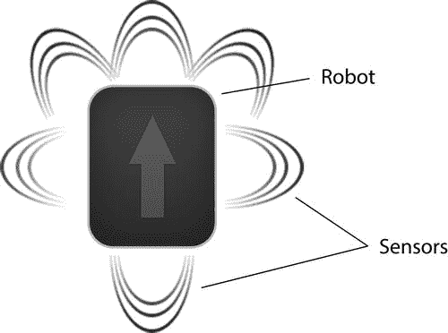
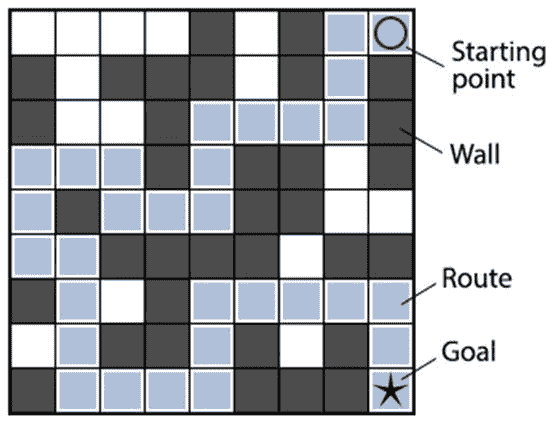
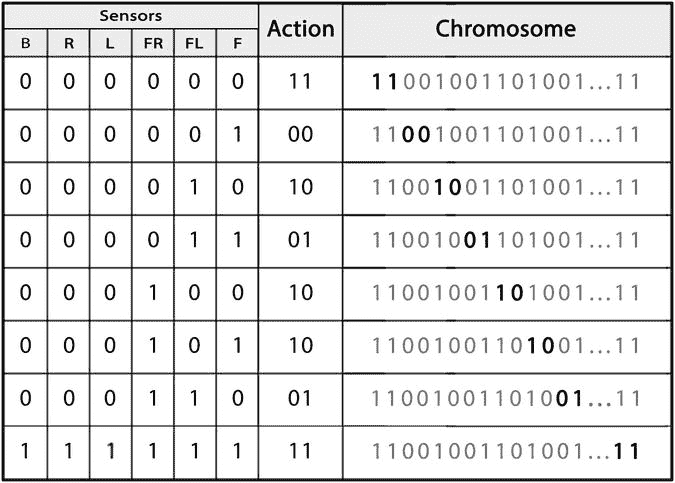
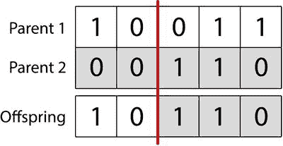
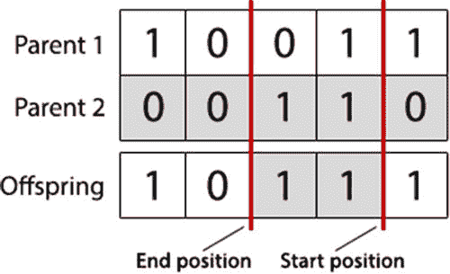

# 机器人控制器

## 引言

在本章中，我们将利用从上一章获得的知识，使用遗传算法解决一个现实世界的问题。我们将要解决的现实世界问题是设计机器人控制器。

遗传算法常被应用于机器人学，作为设计复杂机器人控制器的一种方法，使机器人能够执行复杂的任务和行为，从而无需手动编写复杂的机器人控制器。想象一下，你制造了一个可以在仓库内运输货物的机器人。你安装了传感器，使机器人能够看到其局部环境，并且你给了它轮子，使其能够根据传感器输入进行导航。问题在于如何将传感器数据与电机动作联系起来，以便机器人能够在仓库中导航。

在人工智能领域中，将遗传算法，以及更广义的达尔文进化思想应用于机器人学的领域被称为进化机器人学。然而，这并不是解决这个问题的唯一自下而上的方法。神经网络也经常被成功用于将机器人传感器映射到输出，通过使用强化学习算法来指导学习过程。

通常，遗传算法会评估一个大的个体种群，以定位最适合下一代的个体。评估个体是通过运行一个适应度函数来完成的，该函数根据某些预定义的标准来衡量个体的表现。然而，将遗传算法及其适应度函数应用于物理机器人带来了一个新的挑战：对于大型种群来说，物理评估每个机器人控制器是不可行的。这是因为物理测试每个机器人控制器的难度以及所需的时间。出于这个原因，机器人控制器通常通过将其应用于真实物理机器人和环境的模拟模型来进行评估。这使得可以在软件中快速评估每个控制器，随后再将其应用于物理对应物。在本章中，我们将利用二进制遗传算法的知识来设计一个机器人控制器，并开始将其应用于虚拟环境中的虚拟机器人。

## 问题描述

我们要解决的问题是设计一个机器人控制器，使其能够利用机器人的传感器成功引导机器人穿越迷宫。机器人可以执行四种动作：向前移动一步、左转、右转，以及极少情况下保持不动。机器人还配备了六个传感器：三个在前方，一个在左侧，一个在右侧，一个在后方。

我们要探索的迷宫由机器人无法穿越的墙壁构成，并有一条标出的路线，如图 3-1 所示，我们希望机器人能沿着这条路线行进。请记住，本章的目的并非训练机器人解决迷宫问题，而是自动编程一个带有六个传感器的机器人控制器，使其不会撞墙；我们只是将迷宫作为一个复杂环境来测试我们的机器人控制器。

图 3-1.

我们希望机器人遵循的路线

当传感器检测到相邻的墙壁时，它们会被激活。例如，如果机器人的前方传感器检测到前方有墙壁，它就会被激活。

## 实现

### 准备工作

本章将基于你在第 2 章中开发的代码进行构建。开始之前，请创建一个新的 Eclipse 或 NetBeans 项目，或者在本书的现有项目中创建一个名为“chapter3”的新包。

从第 2 章复制 `Individual`、`Population` 和 `GeneticAlgorithm` 类，并将它们导入第 3 章。请务必更新每个类文件顶部的包名！它们的最顶部都应显示“package chapter3”。

在本章中，除了将包名改为“chapter3”之外，你无需修改 `Individual` 和 `Population` 类。

但是，你需要修改 `GeneticAlgorithm` 类中的几个方法。此时，你应该完全删除以下五个方法：`calcFitness`、`evalPopulation`、`isTerminationConditionMet`、`selectParent` 和 `crossoverPopulation`。你将在本章中重写这五个方法，现在删除它们有助于确保你不会意外地复用第 2 章的实现。

此外，你还需要在本章中创建几个额外的类（`Robot` 和 `Maze`，以及包含程序 `main` 方法的执行类 `RobotController`）。如果你在 Eclipse 中工作，可以通过 **File ➤ New ➤ Class** 菜单选项轻松创建新类。请注意包名字段，确保它显示为“chapter3”。

### 编码

正确编码数据通常是遗传算法中最棘手的方面。让我们首先定义问题：我们需要一个机器人控制器针对所有可能的输入组合的完整指令集的二进制表示。

如前所述，我们的机器人有四种动作：保持不动、向前移动一步、左转和右转。这些动作可以用二进制表示为：

*   “00”：保持不动
*   “01”：向前移动
*   “10”：左转
*   “11”：右转

我们还有六个开/关传感器，这为我们提供了 2⁶（64）种可能的传感器输入组合。如果每个动作需要 2 位来编码，那么我们可以用 128 位来表示控制器对任何可能输入的响应。换句话说，我们的机器人可能面临 64 种不同的场景，而我们的控制器需要为每种场景定义一个动作。由于一个动作需要两位，我们的控制器需要 64 * 2 = 128 位的存储空间。

由于遗传算法的染色体最容易以数组形式操作，我们的染色体将是一个长度为 128 的位数组。在这种情况下，通过我们的变异和交叉方法，你无需担心它们正在修改哪条特定指令，它们只需操作遗传代码即可。然而，在我们这边，我们需要在将编码数据用于机器人控制器之前对其进行解包。

鉴于我们需要 128 位来表示 64 种不同传感器组合的指令，我们应该如何实际构建染色体，以便能够打包和解包它？也就是说，染色体的每个部分对应哪种传感器输入组合？动作的顺序是什么？在染色体中，我们可以在哪里找到针对“前方和右前传感器被激活”这一情况下的动作？染色体中的位代表输出，但输入是如何表示的呢？

对许多人来说，这将是一个不直观的问题（和解决方案），所以让我们逐步走向解决方案。第一步可能是考虑一个简单的、人类可读的输入和输出列表：

`传感器 #1（前方）：开`

`传感器 #2（左前）：关`

`传感器 #3（右前）：开`

`传感器 #4（左侧）：关`

`传感器 #5（右侧）：关`

`传感器 #6（后方）：关`

指令：左转（动作“10”，如上定义）

再加上另外 63 个条目来表示所有可能的组合，这种格式显得笨拙。很明显，这种枚举方式对我们来说行不通。让我们再迈出一小步，将所有内容缩写，并将“开”和“关”翻译为 1 和 0：

`#1：1`

`#2：0`

`#3：1`

`#4：0`

`#5：0`

`#6：0`

`指令：10`

我们正在取得进展，但这仍然无法将 64 条指令打包到一个 128 位的数组中。下一步是获取六个传感器值——即输入——并进一步编码它们。让我们将它们从右到左排列，并从输出中删除“指令”一词：

`#6:0, #5:0, #4:0, #3:1, #2:0, #1:1 => 10`

现在让我们删除传感器的编号：

`000101 => 10`

如果我们现在将传感器值的位字符串转换为十进制，我们得到以下结果：

`5 => 10`

现在我们有所发现了。左边的“5”代表传感器输入，右边的“10”代表机器人在面对这些输入时应该做什么（输出）。因为我们是从传感器输入的二进制表示推导出来的，所以只有一种传感器组合能给我们数字 5。

我们可以使用数字 5 作为染色体中代表传感器输入组合的位置。如果我们手动构建这个染色体，并且知道“10”（左转）是对“5”（前方和右前传感器检测到墙壁）的正确响应，我们会将“1”和“0”放置在染色体的第 11 和第 12 个位置（每个动作需要 2 位，我们从位置 0 开始计数），如下所示：

`xx xx xx xx xx 10 xx xx xx xx (... 还有 54 对...)`

好的，作为一名高级文档工程师和翻译员，我将严格遵循您提供的注意事项和示例，将给定的英文文本翻译成中文。

在上述虚拟染色体中，第一对（位置 0）代表当传感器输入总和为 0 时（即所有传感器均未触发）要执行的动作。第二对（位置 1）代表当传感器输入总和为 1 时（即只有前传感器检测到墙壁）要执行的动作。第三对（位置 2）代表仅左前传感器被触发的情况。第四对（位置 3）代表前传感器和左前传感器同时被触发的情况。以此类推，直到最后一对（位置 63），它代表所有传感器都被触发的情况。

图 3-2 展示了这种编码方案的另一种可视化方式。最左侧的“传感器”列代表传感器的位域，将其转换为十进制后，即可映射到染色体上的一个位置。一旦将传感器的位域转换为十进制，就可以将期望的动作放置在染色体上的相应位置。

图 3-2.

将传感器值映射到动作

这种编码方案起初可能看起来有些晦涩难懂——而且染色体本身也不具备人类可读性——但它有几个有用的特性。首先，染色体可以作为一个位数组进行操作，而不是复杂的树结构或哈希映射，这使得交叉、变异和其他操作变得容易得多。其次，每一个 128 位的值都是一个有效的解（尽管不一定是一个好的解）——本章稍后会详细介绍这一点。

图 3-2 描述了一个典型的染色体如何将机器人的传感器值映射到动作。

### 初始化

在此实现中，我们首先需要创建并初始化一个迷宫，以便在其中运行机器人。为此，请创建以下 `Maze` 类来管理迷宫。这可以通过以下代码完成。在 Eclipse 中，选择 **File** ➤ **New** ➤ **Class** 创建一个新类，并确保使用正确的包名，特别是如果您已经从第 2 章复制了文件。

`package chapter3;`

`import java.util.ArrayList;`

`public class Maze {`

`private final int maze[][];`

`private int startPosition[] = { -1, -1 };`

`public Maze(int maze[][]) {`

`this.maze = maze;`

`}`

`public int[] getStartPosition() {`

`// 检查是否已找到起始位置`

`if (this.startPosition[0] != -1 && this.startPosition[1] != -1) {`

`return this.startPosition;`

`}`

`// 默认返回值`

`int startPosition[] = { 0, 0 };`

`// 遍历行`

`for (int rowIndex = 0; rowIndex < this.maze.length; rowIndex++) {`

`// 遍历列`

`for (int colIndex = 0; colIndex < this.maze[rowIndex].length; colIndex++) {`

`// 2 表示起始位置类型`

`if (this.maze[rowIndex][colIndex] == 2) {`

`this.startPosition = new int[] { colIndex, rowIndex };`

`return new int[] { colIndex, rowIndex };`

`}`

`}`

`}`

`return startPosition;`

`}`

`public int getPositionValue(int x, int y) {`

`if (x < 0 || y < 0 || x >= this.maze.length || y >= this.maze[0].length) {`

`return 1;`

`}`

`return this.maze[y][x];`

`}`

`public boolean isWall(int x, int y) {`

`return (this.getPositionValue(x, y) == 1);`

`}`

`public int getMaxX() {`

`return this.maze[0].length - 1;`

`}`

`public int getMaxY() {`

`return this.maze.length - 1;`

`}`

`public int scoreRoute(ArrayList<int[]> route) {`

`int score = 0;`

`boolean visited[][] = new boolean[this.getMaxY() + 1][this.getMaxX() + 1];`

`// 遍历路线并为每一步打分`

`for (Object routeStep : route) {`

`int step[] = (int[]) routeStep;`

`if (this.maze[step[1]][step[0]] == 3 && visited[step[1]][step[0]] == false) {`

`// 正确移动，增加分数`

`score++;`

`// 移除奖励`

`visited[step[1]][step[0]] = true;`

`}`

`}`

`return score;`

`}`

`}`

这段代码包含一个构造函数，用于从二维整数数组创建新的迷宫，以及一些公共方法，用于获取起始位置、检查某个位置的值以及为通过迷宫的路线评分。

`scoreRoute` 方法是 `Maze` 类中最重要的方法；它评估机器人所走的路线，并根据其踩到的正确瓷砖数量返回一个适应度分数。稍后，在 `GeneticAlgorithm` 类的 `calcFitness` 方法中，我们将使用此 `scoreRoute` 方法返回的分数作为个体的适应度分数。

现在我们有了一个迷宫抽象，我们可以创建我们的执行类——即实际执行算法的类——并初始化图 3-1 中所示的迷宫。创建另一个名为 `RobotController` 的新类，并创建程序将启动的 `main` 方法。

`package chapter3;`

`public class RobotController {`

`public static int maxGenerations = 1000;`

`public static void main(String[] args) {`

`/**`

`* 0 = 空地`

`* 1 = 墙壁`

`* 2 = 起始位置`

`* 3 = 路线`

`* 4 = 目标位置`

`*/`

`Maze maze = new Maze(new int[][] {`

`{ 0, 0, 0, 0, 1, 0, 1, 3, 2 },`

`{ 1, 0, 1, 1, 1, 0, 1, 3, 1 },`

`{ 1, 0, 0, 1, 3, 3, 3, 3, 1 },`

`{ 3, 3, 3, 1, 3, 1, 1, 0, 1 },`

`{ 3, 1, 3, 3, 3, 1, 1, 0, 0 },`

`{ 3, 3, 1, 1, 1, 1, 0, 1, 1 },`

`{ 1, 3, 0, 1, 3, 3, 3, 3, 3 },`

`{ 0, 3, 1, 1, 3, 1, 0, 1, 3 },`

`{ 1, 3, 3, 3, 3, 1, 1, 1, 4 }`

`});`

`/**`

`* 我们将在此处实现第 2 章中的遗传算法伪代码`

`*/`

`}`

`}`

我们创建的迷宫对象使用整数来表示不同的地形类型：1 表示墙壁；2 是起始位置；3 标记通过迷宫的最佳路线；4 是目标位置；0 是机器人可以通行但不在通往目标路线上的空地。

接下来，与之前的实现类似，我们需要初始化一个由随机个体组成的种群。每个个体的染色体长度应为 128 位。如前所述，128 位允许我们将所有 64 个输入映射到一个动作。由于此问题中不可能创建无效染色体，我们可以使用与之前相同的随机初始化方法——回想一下，这种随机初始化发生在`Individual`类的构造函数中，我们是从第 2 章直接复制过来的，未做修改。以这种方式初始化的机器人在面对不同情况时只会随机采取行动，而通过多代进化，我们希望优化这种行为。

在将第 2 章中熟悉的遗传算法伪代码骨架写入主方法之前，我们需要对从第 2 章复制的`GeneticAlgorithm`类做一处修改。我们将在`GeneticAlgorithm`类及其构造函数中添加一个名为“`tournamentSize`”的属性——我们将在本章后面深入讨论这个属性。

将你的`GeneticAlgorithm`类顶部修改为如下所示：

`package chapter3;`

`public class GeneticAlgorithm {`

`/**`

`* 有关这些属性的描述，请参见第 2 章/GeneticAlgorithm。`

`*/`

`private int populationSize;`

`private double mutationRate;`

`private double crossoverRate;`

`private int elitismCount;`

`/**`

`* 我们引入的一个新属性是用于交叉中锦标赛选择的种群大小。`

`*/`

`protected int tournamentSize;`

`public GeneticAlgorithm(int populationSize, double mutationRate, double crossoverRate, int elitismCount,`

`int tournamentSize) {`

`this.populationSize = populationSize;`

`this.mutationRate = mutationRate;`

`this.crossoverRate = crossoverRate;`

`this.elitismCount = elitismCount;`

`this.tournamentSize = tournamentSize;`

`}`

`/**`

`* 我们不会在此展示类的其余部分，`

`* 但像 initPopulation、mutatePopulation`

`* 和 evaluatePopulation 这样的方法应该出现在下面。`

`*/`

`}`

我们做了三个简单的修改：首先，在类属性中添加了“`protected int tournamentSize`”。其次，在构造函数中增加了“`int tournamentSize`”作为第五个参数。最后，在构造函数中添加了“`this.tournamentSize = tournamentSize`”赋值语句。

处理完`tournamentSize`属性后，我们可以继续从第 2 章中提取伪代码骨架。一如既往，这段代码将放在执行类（在本例中命名为`RobotController`）的“`main`”方法中。

当然，下面的代码目前不会执行任何操作——我们还没有实现任何所需的方法，所有内容都已替换为`TODO`注释。但以这种方式搭建主方法的骨架有助于强化遗传算法的概念执行模型，也帮助我们跟踪还需要实现哪些方法；这个类中有七个`TODO`需要解决。

将你的`RobotController`类更新为如下所示。迷宫定义与之前相同，但其下方的所有内容都是该文件的新增部分。

`package chapter3;`

`public class RobotController {`

`public static int maxGenerations = 1000;`

`public static void main(String[] args) {`

`Maze maze = new Maze(new int[][] {`

`{ 0, 0, 0, 0, 1, 0, 1, 3, 2 },`

`{ 1, 0, 1, 1, 1, 0, 1, 3, 1 },`

`{ 1, 0, 0, 1, 3, 3, 3, 3, 1 },`

`{ 3, 3, 3, 1, 3, 1, 1, 0, 1 },`

`{ 3, 1, 3, 3, 3, 1, 1, 0, 0 },`

`{ 3, 3, 1, 1, 1, 1, 0, 1, 1 },`

`{ 1, 3, 0, 1, 3, 3, 3, 3, 3 },`

`{ 0, 3, 1, 1, 3, 1, 0, 1, 3 },`

`{ 1, 3, 3, 3, 3, 1, 1, 1, 4 }`

`});`

`// 创建遗传算法`

`GeneticAlgorithm ga = new GeneticAlgorithm(200, 0.05, 0.9, 2, 10);`

`Population population = ga.initPopulation(128);`

`// TODO: 评估种群`

`int generation = 1;`

`// 开始进化循环`

`while (/* TODO */ false) {`

`// TODO: 打印种群中最优个体`

`// TODO: 应用交叉`

`// TODO: 应用变异`

`// TODO: 评估种群`

`// 增加当前代数`

`generation++;`

`}`

`// TODO: 打印结果`

`}`

`}`

这个`RobotController`类与第 2 章中的`AllOnesGA`类只有细微差别。`AllOnesGA`类没有“`maxGenerations`”属性，因为我们确切知道目标适应度分数是多少。然而，在本例中，我们将学习一种结束进化循环的不同方式。`AllOnesGA`类也不需要`Maze`类，但在实际的遗传算法问题中，你经常会发现像`Maze`这样的辅助类。此外，这个版本的`GeneticAlgorithm`类接受 5 个参数，而不是 4 个，因为我们将在本章引入一个名为“锦标赛选择”的新概念。最后，本例中的染色体长度为 128，而第 2 章中为 50。在上一章中，染色体长度是任意的，但在本例中，染色体长度是有意义的，并且由前面讨论的编码方法决定。

### 评估

在评估阶段，我们需要定义一个适应度函数来评估每个机器人控制器。我们可以通过为机器人在路线上做出的每个正确且独特的移动增加个体适应度来实现这一点。回想一下，我们之前创建的 Maze 类有一个`scoreRoute`方法可以执行此评估。然而，路线本身来自一个自主控制的机器人。因此，在我们可以将路线交给 Maze 类进行评估之前，我们需要创建一个能够遵循指令并通过执行这些指令生成路线的 Robot 类。

创建一个 Robot 类来管理机器人的功能。在 Eclipse 中，您可以通过选择菜单选项 File ➤ New ➤ Class 来创建一个新类。确保使用正确的包名。将以下代码添加到文件中：

`package chapter3;`

`import java.util.ArrayList;`

`/**`

`* 机器人抽象。给它一个迷宫和一组指令，它将尝试导航到终点。`

`*`

`* @author bkanber`

`*`

`*/`

`public class Robot {`

`private enum Direction {NORTH, EAST, SOUTH, WEST};`

`private int xPosition;`

`private int yPosition;`

`private Direction heading;`

`int maxMoves;`

`int moves;`

`private int sensorVal;`

`private final int sensorActions[];`

`private Maze maze;`

`private ArrayList<int[]> route;`

`/**`

`* 使用控制器初始化机器人`

`*`

`* @param sensorActions 用于将传感器值映射到动作的字符串`

`* @param maze 机器人将使用的迷宫`

`* @param maxMoves 机器人可以执行的最大移动次数`

`*/`

`public Robot(int[] sensorActions, Maze maze, int maxMoves){`

`this.sensorActions = this.calcSensorActions(sensorActions);`

`this.maze = maze;`

`int startPos[] = this.maze.getStartPosition();`

`this.xPosition = startPos[0];`

`this.yPosition = startPos[1];`

`this.sensorVal = -1;`

`this.heading = Direction.EAST;`

`this.maxMoves = maxMoves;`

`this.moves = 0;`

`this.route = new ArrayList<int[]>();`

`this.route.add(startPos);`

`}`

`/**`

`* 基于传感器输入运行机器人的动作`

`*/`

`public void run(){`

`while(true){`

`this.moves++;`

`// 如果机器人停止移动则中断`

`if (this.getNextAction() == 0) {`

`return;`

`}`

`// 如果到达目标则中断`

`if (this.maze.getPositionValue(this.xPosition, this.yPosition) == 4) {`

`return;`

`}`

`// 如果达到最大移动次数则中断`

`if (this.moves > this.maxMoves) {`

`return;`

`}`

`// 执行动作`

`this.makeNextAction();`

`}`

`}`

`/**`

`* 将机器人的传感器数据从二进制字符串映射到动作`

`*`

`* @param sensorActionsStr 二进制 GA 染色体`

`* @return int[] 用于将传感器值映射到动作的数组`

`*/`

`private int[] calcSensorActions(int[] sensorActionsStr){`

`// 有多少个动作？`

`int numActions = (int) sensorActionsStr.length / 2;`

`int sensorActions[] = new int[numActions];`

`// 遍历动作`

`for (int sensorValue = 0; sensorValue < numActions; sensorValue++){`

`// 获取传感器动作`

`int sensorAction = 0;`

`if (sensorActionsStr[sensorValue*2] == 1){`

`sensorAction += 2;`

`}`

`if (sensorActionsStr[(sensorValue*2)+1] == 1){`

`sensorAction += 1;`

`}`

`// 添加到传感器-动作映射`

`sensorActions[sensorValue] = sensorAction;`

`}`

`return sensorActions;`

`}`

`/**`

`* 执行下一个动作`

`*/`

`public void makeNextAction(){`

`// 如果向前移动`

`if (this.getNextAction() == 1) {`

`int currentX = this.xPosition;`

`int currentY = this.yPosition;`

`// 根据当前方向移动`

`if (Direction.NORTH == this.heading) {`

`this.yPosition += -1;`

`if (this.yPosition < 0) {`

`this.yPosition = 0;`

`}`

`}`

`else if (Direction.EAST == this.heading) {`

`this.xPosition += 1;`

`if (this.xPosition > this.maze.getMaxX()) {`

`this.xPosition = this.maze.getMaxX();`

`}`

`}`

`else if (Direction.SOUTH == this.heading) {`

`this.yPosition += 1;`

`if (this.yPosition > this.maze.getMaxY()) {`

`this.yPosition = this.maze.getMaxY();`

`}`

`}`

`else if (Direction.WEST == this.heading) {`

`this.xPosition += -1;`

`if (this.xPosition < 0) {`

`this.xPosition = 0;`

`}`

`}`

`// 无法移动到此处`

`if (this.maze.isWall(this.xPosition, this.yPosition) == true) {`

`this.xPosition = currentX;`

`this.yPosition = currentY;`

`}`

`else {`

`if(currentX != this.xPosition || currentY != this.yPosition) {`

`this.route.add(this.getPosition());`

`}`

`}`

`}`

`// 顺时针移动`

`else if(this.getNextAction() == 2) {`

`if (Direction.NORTH == this.heading) {`

`this.heading = Direction.EAST;`

`}`

`else if (Direction.EAST == this.heading) {`

`this.heading = Direction.SOUTH;`

`}`

`else if (Direction.SOUTH == this.heading) {`

`this.heading = Direction.WEST;`

`}`

`else if (Direction.WEST == this.heading) {`

`this.heading = Direction.NORTH;`

`}`

`}`

`// 逆时针移动`

`else if(this.getNextAction() == 3) {`

`if (Direction.NORTH == this.heading) {`

`this.heading = Direction.WEST;`

`}`

`else if (Direction.EAST == this.heading) {`

`this.heading = Direction.NORTH;`

`}`

`else if (Direction.SOUTH == this.heading) {`

`this.heading = Direction.EAST;`

`}`

`else if (Direction.WEST == this.heading) {`

`this.heading = Direction.SOUTH;`

`}`

`}`

`// 重置传感器数值`

`this.sensorVal = -1;`

`}`

`/**`
`* 根据传感器映射获取下一步动作`
`*`
`* @return int 下一步动作`
`*/`

`public int getNextAction() {`

`return this.sensorActions[this.getSensorValue()];`

`}`

`/**`
`* 获取传感器数值`
`*`
`* @return int 传感器数值`
`*/`

`public int getSensorValue(){`

`// 如果传感器数值已经计算过`

`if (this.sensorVal > -1) {`

`return this.sensorVal;`

`}`

`boolean frontSensor, frontLeftSensor, frontRightSensor, leftSensor, rightSensor, backSensor;`

`frontSensor = frontLeftSensor = frontRightSensor = leftSensor = rightSensor = backSensor = false;`

`// 查找哪些传感器已被激活`

`if (this.getHeading() == Direction.NORTH) {`

`frontSensor = this.maze.isWall(this.xPosition, this.yPosition-1);`

`frontLeftSensor = this.maze.isWall(this.xPosition-1, this.yPosition-1);`

`frontRightSensor = this.maze.isWall(this.xPosition+1, this.yPosition-1);`

`leftSensor = this.maze.isWall(this.xPosition-1, this.yPosition);`

`rightSensor = this.maze.isWall(this.xPosition+1, this.yPosition);`

`backSensor = this.maze.isWall(this.xPosition, this.yPosition+1);`

`}`

`else if (this.getHeading() == Direction.EAST) {`

`frontSensor = this.maze.isWall(this.xPosition+1, this.yPosition);`

`frontLeftSensor = this.maze.isWall(this.xPosition+1, this.yPosition-1);`

`frontRightSensor = this.maze.isWall(this.xPosition+1, this.yPosition+1);`

`leftSensor = this.maze.isWall(this.xPosition, this.yPosition-1);`

`rightSensor = this.maze.isWall(this.xPosition, this.yPosition+1);`

`backSensor = this.maze.isWall(this.xPosition-1, this.yPosition);`

`}`

`else if (this.getHeading() == Direction.SOUTH) {`

`frontSensor = this.maze.isWall(this.xPosition, this.yPosition+1);`

`frontLeftSensor = this.maze.isWall(this.xPosition+1, this.yPosition+1);`

`frontRightSensor = this.maze.isWall(this.xPosition-1, this.yPosition+1);`

`leftSensor = this.maze.isWall(this.xPosition+1, this.yPosition);`

`rightSensor = this.maze.isWall(this.xPosition-1, this.yPosition);`

`backSensor = this.maze.isWall(this.xPosition, this.yPosition-1);`

`}`

`else {`

`frontSensor = this.maze.isWall(this.xPosition-1, this.yPosition);`

`frontLeftSensor = this.maze.isWall(this.xPosition-1, this.yPosition+1);`

`frontRightSensor = this.maze.isWall(this.xPosition-1, this.yPosition-1);`

`leftSensor = this.maze.isWall(this.xPosition, this.yPosition+1);`

`rightSensor = this.maze.isWall(this.xPosition, this.yPosition-1);`

`backSensor = this.maze.isWall(this.xPosition+1, this.yPosition);`

`}`

`// 计算传感器数值`

`int sensorVal = 0;`

`if (frontSensor == true) {`

`sensorVal += 1;`

`}`

`if (frontLeftSensor == true) {`

`sensorVal += 2;`

`}`

`if (frontRightSensor == true) {`

`sensorVal += 4;`

`}`

`if (leftSensor == true) {`

`sensorVal += 8;`

`}`

`if (rightSensor == true) {`

`sensorVal += 16;`

`}`

`if (backSensor == true) {`

`sensorVal += 32;`

`}`

`this.sensorVal = sensorVal;`

`return sensorVal;`

`}`

`/**`
`* 获取机器人位置`
`*`
`* @return int[] 包含机器人位置的数组`
`*/`

`public int[] getPosition(){`

`return new int[]{this.xPosition, this.yPosition};`

`}`

`/**`
`* 获取机器人朝向`
`*`
`* @return Direction 机器人朝向`
`*/`

`*/`

`private Direction getHeading(){`

`return this.heading;`

`}`

`/**`

`* 返回机器人在迷宫中的完整路径`

`*`

`* @return ArrayList<int> 机器人的路径`

`*/`

`public ArrayList<int[]> getRoute(){`

`return this.route;`

`}`

`/**`

`* 返回可打印格式的路径`

`*`

`* @return String 机器人的路径`

`*/`

`public String printRoute(){`

`String route = "";`

`for (Object routeStep : this.route) {`

`int step[] = (int[]) routeStep;`

`route += "{" + step[0] + "," + step[1] + "}";`

`}`

`return route;`

`}`

`}`

该类包含用于创建新机器人的构造函数。它还包含读取机器人传感器、获取机器人朝向以及在迷宫中移动机器人的函数。这个 Robot 类是我们模拟简单机器人的方式，这样我们就不必在 100 个真实机器人的种群上运行 1000 代进化。你经常会在此类优化问题中看到像 Maze 和 Robot 这样的类，在这些问题中，先在软件中进行模拟，再在生产硬件上优化结果，是一种成本效益高的做法。

回想一下，从技术上讲，是 Maze 类负责评估路径的适应度。然而，我们仍然需要在 GeneticAlgorithm 类中实现 calcFitness 方法。calcFitness 方法并不直接计算适应度分数，而是负责将 Individual、Robot 和 Maze 类联系起来：它使用 Individual 的染色体（即传感器控制器指令集）创建一个新的 Robot，并针对我们的 Maze 对其进行评估。

请在 GeneticAlgorithm 类中编写以下 calcFitness 函数。和往常一样，此方法可以放在类中的任何位置。

`public double calcFitness(Individual individual, Maze maze) {`

`int[] chromosome = individual.getChromosome();`

`Robot robot = new Robot(chromosome, maze, 100);`

`robot.run();`

`int fitness = maze.scoreRoute(robot.getRoute());`

`individual.setFitness(fitness);`

`return fitness;`

`}`

在这里，calcFitness 方法接受两个参数：individual 和 maze。它使用这两个参数创建一个新的机器人，并让其在迷宫中运行。然后，对机器人的路径进行评分，并将其存储为该个体的适应度。

这段代码将创建一个机器人，将其放入我们的迷宫，并使用进化后的控制器进行测试。Robot 构造函数的最后一个参数是机器人允许移动的最大步数。这将防止它陷入死胡同或无限循环地移动。然后，我们可以简单地获取机器人路径的分数，并使用 Maze 的 scoreRoute 方法将其作为适应度返回。

有了可用的 calcFitness 方法，我们现在可以创建一个 evalPopulation 方法。回想一下第 2 章的内容，evalPopulation 方法只是遍历种群中的每个个体，并为该个体调用 calcFitness，同时累加整个种群的适应度。实际上，本章的 evalPopulation 与第 2 章的几乎相同——但在本例中，我们还需要将 maze 对象传递给 calcFitness 方法，因此需要稍作修改。

将以下方法添加到 GeneticAlgorithm 类中，可以放在任何你喜欢的位置：

`public void evalPopulation(Population population, Maze maze) {`

`double populationFitness = 0;`

`for (Individual individual : population.getIndividuals()) {`

`populationFitness += this.calcFitness(individual, maze);`

`}`

`population.setPopulationFitness(populationFitness);`

`}`

此版本与第 2 章版本之间的唯一区别在于，它包含了第二个参数“Maze maze”，并且在调用 calcFitness 时也将“maze”作为第二个参数传递。

至此，你可以解决 RobotController 的“main”方法中两处“TODO: Evaluate population”行。找到显示以下内容的两处位置：

`// TODO: Evaluate population`

并将它们替换为：

`// Evaluate population`

`ga.evalPopulation(population, maze);`

与第 2 章不同，此方法需要将 maze 对象作为第二个参数传递。此时，RobotController 的 main 方法中应该只剩下五个“TODO”注释。我们将在下一节中快速处理其中的另外三个。这就是进展！

### 终止检查

本次实现中使用的终止检查与我们之前的遗传算法略有不同。在这里，我们将在达到最大代数后终止算法。

要添加此终止检查，首先在 `GeneticAlgorithm` 类中添加以下 `isTerminationConditionMet` 方法。

`public boolean isTerminationConditionMet(int generationsCount, int maxGenerations) {`

`return (generationsCount > maxGenerations);`

`}`

该方法仅接收当前代数计数器和允许的最大代数，并根据算法是否应终止返回 `true` 或 `false`。说实话，这个方法非常简单，我们完全可以直接在遗传算法循环的 `while` 条件中使用该逻辑——但为了保持一致性，我们始终将终止条件检查实现为 `GeneticAlgorithm` 类中的一个方法，即使它像上面这样微不足道。

现在，我们可以通过将以下代码添加到 `RobotController` 的 `main` 方法中，将终止检查应用于进化循环。我们只需将代数和最大代数作为参数传入。

通过在 `while` 语句中添加终止条件，你实际上使循环具备了功能性，因此我们也应借此机会打印一些统计信息和调试信息。

以下修改非常直接：首先，更新 `while` 条件以使用 `ga.isTerminationConditionMet`。其次，在循环内和循环后添加对 `population.getFittest` 和 `System.out.println` 的调用，以显示进度和结果。

以下是此时 `RobotController` 类应呈现的样子；我们刚刚又消除了三个 TODO，只剩下两个：

`package chapter3;`

`public class RobotController {`

`public static int maxGenerations = 1000;`

`public static void main(String[] args) {`

`Maze maze = new Maze(new int[][] {`

`{ 0, 0, 0, 0, 1, 0, 1, 3, 2 },`

`{ 1, 0, 1, 1, 1, 0, 1, 3, 1 },`

`{ 1, 0, 0, 1, 3, 3, 3, 3, 1 },`

`{ 3, 3, 3, 1, 3, 1, 1, 0, 1 },`

`{ 3, 1, 3, 3, 3, 1, 1, 0, 0 },`

`{ 3, 3, 1, 1, 1, 1, 0, 1, 1 },`

`{ 1, 3, 0, 1, 3, 3, 3, 3, 3 },`

`{ 0, 3, 1, 1, 3, 1, 0, 1, 3 },`

`{ 1, 3, 3, 3, 3, 1, 1, 1, 4 }`

`});`

`// 创建遗传算法`

`GeneticAlgorithm ga = new GeneticAlgorithm(200, 0.05, 0.9, 2, 10);`

`Population population = ga.initPopulation(128);`

`// 评估种群`

`ga.evalPopulation(population, maze);`

`int generation = 1;`

`// 开始进化循环`

`while (ga.isTerminationConditionMet(generation, maxGenerations) == false) {`

`// 打印种群中最优个体`

`Individual fittest = population.getFittest(0);`

`System.out.println("G" + generation + " 最佳解 (" + fittest.getFitness() + "): " + fittest.toString());`

`// TODO: 应用交叉`

`// TODO: 应用变异`

`// 评估种群`

`ga.evalPopulation(population, maze);`

`// 增加当前代数`

`generation++;`

`}`

`System.out.println("在 " + maxGenerations + " 代后停止。");`

`Individual fittest = population.getFittest(0);`

`System.out.println("最佳解 (" + fittest.getFitness() + "): " + fittest.toString());`

`}`

`}`

如果你现在点击运行按钮，你会看到算法快速循环了 1000 代（实际上没有任何进化！），并自豪地向你展示一个非常非常差的解，其适应度从统计学上讲，很可能为 1.0。

这并不意外；我们还没有实现交叉或变异！正如你在第 2 章中学到的，至少需要其中一种机制来推动进化，但通常，为了避免陷入局部最优，你需要同时使用两者。

上面的 `main` 方法中还剩下两个 TODO，幸运的是，我们可以很快解决其中一个。我们在第 2 章中学到的变异技术——位翻转变异——也适用于此问题。

在评估变异或交叉算法的可行性时，必须首先考虑有效染色体的约束条件。在此特定问题中，有效染色体只有两个约束：它必须是二进制的，并且长度必须为 128 位。只要满足这两个约束，就不存在无效的位组合或序列。因此，我们可以重用第 2 章中的简单变异方法。

启用变异很简单，与上一章相同。将 `// TODO: 变异种群` 行更新为以下内容：

`// 应用变异`

`population = ga.mutatePopulation(population);`

此时尝试再次运行程序。结果并不惊人；经过 1000 代后，你可能只会得到 5 或 10 的适应度分数。然而，有一点是明确的：种群现在正在进化，我们正在接近终点。

我们只剩下一个 TODO：交叉。

### 选择方法与交叉

在我们之前的遗传算法中，我们使用轮盘赌选择法来为均匀交叉操作选择父代。回想一下，交叉是一类用于组合两个父代遗传信息的技术。在此实现中，我们将使用一种称为锦标赛选择法的新选择方法，以及一种称为单点交叉的新交叉方法。

#### 锦标赛选择

与轮盘赌选择类似，锦标赛选择提供了一种基于个体适应度值进行选择的方法。也就是说，个体的适应度越高，该个体被选中进行交叉的概率就越大。

锦标赛选择通过进行一系列“锦标赛”来选择父代。首先，从种群中随机选择个体进入锦标赛。接着，可以认为这些个体通过比较各自的适应度值来相互竞争，然后选择适应度最高的个体作为父代。

锦标赛选择需要定义一个锦标赛规模，该参数指定了应从种群中选取多少个体参与锦标赛竞争。与大多数参数一样，所选值的大小会带来性能上的权衡。较大的锦标赛规模会考虑种群中更大比例的部分，这使得找到种群中高分个体的可能性大大增加。相反，较小的锦标赛规模由于竞争较少，会从种群中更随机地选择个体，结果往往是挑选出排名较低的个体。较大的锦标赛规模可能导致遗传多样性丧失，因为只有最优的个体被选为父代。反之，较小的锦标赛规模则会因选择压力降低而减缓算法的进展。

锦标赛选择是遗传算法中最常用的选择方法之一。其优势在于实现起来相对简单，并且可以通过调整锦标赛规模来改变选择压力。然而，它也存在局限性。试想，当适应度最低的个体被放入锦标赛时，无论种群中其他哪些个体被加入锦标赛，它都永远不会被选中，因为其他个体的适应度值必然更高。这个缺点可以通过在算法中加入选择概率来解决。例如，如果选择概率设为 0.6，那么适应度最高的个体被选中的概率就是 60%。如果适应度最高的个体未被选中，则会继续考虑第二高的个体，依此类推，直到选中某个个体。虽然这种修改允许即使是排名最差的个体偶尔也能被选中，但它没有考虑个体之间的适应度差异。例如，如果三个个体被选入锦标赛，其适应度值分别为 9、2 和 1。在这种情况下，即使适应度值为 2 的个体其适应度值变为 8，它被选中的概率也不会更高。这意味着，有时个体会被赋予不合理的高或低的选择几率。

我们不会在锦标赛选择的实现中加入选择概率；不过，这对读者来说是一个极好的练习。

要实现锦标赛选择，请在 `GeneticAlgorithm` 类中的任意位置添加以下代码：

`public Individual selectParent(Population population) {`

      `// 创建锦标赛`

      `Population tournament = new Population(this.tournamentSize);`

      `// 向锦标赛中添加随机个体`

      `population.shuffle();`

      `for (int i = 0; i < this.tournamentSize; i++) {`

            `Individual tournamentIndividual = population.getIndividual(i);`

            `tournament.setIndividual(i, tournamentIndividual);`

      `}`

      `// 返回最优个体`

      `return tournament.getFittest(0);`

`}`

首先，我们创建一个新的种群来容纳选择锦标赛中的所有个体。接着，随机向该种群中添加个体，直到其大小等于锦标赛规模参数。最后，从锦标赛种群中选择并返回最优个体。

#### 单点交叉

单点交叉是我们之前实现的均匀交叉方法的另一种交叉方法。单点交叉是一种非常简单的交叉方法，它随机选择基因组中的一个位置，以确定哪些基因来自哪个父代。交叉位置之前的遗传信息来自父代 1，而交叉位置之后的遗传信息来自父代 2。

单点交叉相当容易实现，并且允许将连续的基因位组从父代更有效地传递下去，这比均匀交叉更有效。这是交叉算法的一个宝贵特性。考虑我们的具体问题，其中染色体是一组基于六个传感器输入的编码指令，并且每条指令的长度超过一个比特。

设想一个理想的交叉情况如下：父代 1 在前 32 个传感器操作上表现出色，而父代 2 在最后 16 个操作上表现出色。如果我们使用第 2 章中的均匀交叉技术，那么各处都会出现混乱的比特位！由于均匀交叉随机选择比特位进行交换，单个指令会在交叉过程中被改变和破坏。每条指令的两个比特位可能根本无法保留，因为每条指令中的两个比特位之一可能会被修改。然而，单点交叉让我们能够利用这种理想情况。如果交叉点正好位于染色体的中间，那么后代将获得来自父代 1 的 64 个连续比特位（代表 32 条指令），同时也获得来自父代 2 的优秀的 16 条指令。因此，这个后代现在在 64 种可能状态中的 48 种上表现出色。这个概念正是遗传算法的基础：后代可能比任何一个父代都更强，因为它继承了双方的最佳特质。

然而，单点交叉并非没有局限性。单点交叉的一个局限性是，父代基因组的某些组合根本无法实现。例如，考虑两个父代：一个基因组为“00100”，另一个基因组为“10001”。仅通过交叉无法得到子代“10101”，尽管所需的基因在两个父代中都存在。幸运的是，我们还有变异作为一种进化机制，如果同时实现了交叉和变异，那么基因组“10101”是可能出现的。

单点交叉的另一个局限性是，左侧的基因有偏向于来自父代 1 的趋势，而右侧的基因有偏向于来自父代 2 的趋势。为了解决这个问题，可以实现两点交叉，即使用两个位置，使得分区能够跨越父代基因组的边缘。我们将两点交叉作为留给读者的一个练习。

要实现单点交叉，请在 `GeneticAlgorithm` 类中添加以下代码。这个 `crossoverPopulation` 方法依赖于你上面实现的 `selectParent` 方法，因此使用了锦标赛选择。请注意，并没有要求必须将锦标赛选择与单点交叉搭配使用；你可以使用任何 `selectParent` 的实现，不过针对这个问题，我们选择了锦标赛选择和单点交叉，因为它们都是非常常见且需要理解的重要概念。

`public Population crossoverPopulation(Population population) {`

`// 创建新种群`

`Population newPopulation = new Population(population.size());`

`// 按适应度遍历当前种群`

`for (int populationIndex = 0; populationIndex < population.size(); populationIndex++) {`

`Individual parent1 = population.getFittest(populationIndex);`

`// 对该个体应用交叉？`

`if (this.crossoverRate > Math.random() && populationIndex >= this.elitismCount) {`

`// 初始化子代`

`Individual offspring = new Individual(parent1.getChromosomeLength());`

`// 寻找第二个父代`

`Individual parent2 = this.selectParent(population);`

`// 获取随机交换点`

`int swapPoint = (int) (Math.random() * (parent1.getChromosomeLength() + 1));`

`// 遍历基因组`

`for (int geneIndex = 0; geneIndex < parent1.getChromosomeLength(); geneIndex++) {`

`// 使用父代 1 的一半基因和父代 2 的一半基因`

`if (geneIndex < swapPoint) {`

`offspring.setGene(geneIndex, parent1.getGene(geneIndex));`

`} else {`

`offspring.setGene(geneIndex, parent2.getGene(geneIndex));`

`}`

`}`

`// 将子代添加到新种群`

`newPopulation.setIndividual(populationIndex, offspring);`

`} else {`

`// 不应用交叉，直接将个体添加到新种群`

`newPopulation.setIndividual(populationIndex, parent1);`

`}`

`}`

`return newPopulation;`

`}`

请注意，虽然我们在本章中未提及精英主义，但上述代码以及变异算法（与上一章相比未作更改）中仍然体现了这一概念。

单点交叉之所以流行，既是因为其有利的遗传特性（保留连续基因），也是因为它易于实现。在上述代码中，为新个体创建了一个新种群。接着，遍历该种群，并按适应度顺序获取个体。如果启用了精英主义，则跳过精英个体，直接将其添加到新种群中；否则，根据交叉率决定是否对当前个体进行交叉。如果该个体被选中进行交叉，则通过锦标赛选择法选出第二个父代。

接下来，随机选择一个交叉点。这个点是我们停止使用父代 1 的基因并开始使用父代 2 基因的位置。然后，我们只需遍历染色体，首先将父代 1 的基因添加到子代中，在交叉点之后切换到父代 2 的基因。

现在，我们可以在`RobotController`的`main`方法中调用交叉操作。添加一行代码`population = ga.crossoverPopulation(population)`即可完成我们最后的待办事项，此时你的`RobotController`类应如下所示：

`package chapter3;`

`public class RobotController {`

`public static int maxGenerations = 1000;`

`public static void main(String[] args) {`

`Maze maze = new Maze(new int[][] {`

`{ 0, 0, 0, 0, 1, 0, 1, 3, 2 },`

`{ 1, 0, 1, 1, 1, 0, 1, 3, 1 },`

`{ 1, 0, 0, 1, 3, 3, 3, 3, 1 },`

`{ 3, 3, 3, 1, 3, 1, 1, 0, 1 },`

`{ 3, 1, 3, 3, 3, 1, 1, 0, 0 },`

`{ 3, 3, 1, 1, 1, 1, 0, 1, 1 },`

`{ 1, 3, 0, 1, 3, 3, 3, 3, 3 },`

`{ 0, 3, 1, 1, 3, 1, 0, 1, 3 },`

`{ 1, 3, 3, 3, 3, 1, 1, 1, 4 }`

`});`

`// 创建遗传算法`

`GeneticAlgorithm ga = new GeneticAlgorithm(200, 0.05, 0.9, 2, 10);`

`Population population = ga.initPopulation(128);`

`// 评估种群`

`ga.evalPopulation(population, maze);`

`int generation = 1;`

`// 开始进化循环`

`while (ga.isTerminationConditionMet(generation, maxGenerations) == false) {`

`// 打印种群中最适应的个体`

`Individual fittest = population.getFittest(0);`

`System.out.println("G" + generation + " 最佳解 (" + fittest.getFitness() + "): " + fittest.toString());`

`// 应用交叉`

`population = ga.crossoverPopulation(population);`

`// 应用变异`

`population = ga.mutatePopulation(population);`

`// 评估种群`

`ga.evalPopulation(population, maze);`

`// 增加当前代数`

`generation++;`

`}`

`System.out.println("在 " + maxGenerations + " 代后停止。");`

`Individual fittest = population.getFittest(0);`

`System.out.println("最佳解 (" + fittest.getFitness() + "): " + fittest.toString());`

`}`

`}`

### 执行

此时，你的`GeneticAlgorithm`类应具有以下属性和方法签名：

`package chapter3;`

`public class GeneticAlgorithm {`

      `private int populationSize;`

      `private double mutationRate;`

      `private double crossoverRate;`

      `private int elitismCount;`

      `protected int tournamentSize;`

      `public GeneticAlgorithm(int populationSize, double mutationRate, double crossoverRate, int elitismCount, int tournamentSize) { }`

      `public Population initPopulation(int chromosomeLength) { }`

      `public double calcFitness(Individual individual, Maze maze) { }`

      `public void evalPopulation(Population population, Maze maze) { }`

      `public boolean isTerminationConditionMet(int generationsCount, int maxGenerations) { }`

      `public Individual selectParent(Population population) { }`

      `public Population mutatePopulation(Population population) { }`

      `public Population crossoverPopulation(Population population) { }`

`}`

如果你的方法签名与上述不符，或者不小心遗漏了某个方法，或者你的集成开发环境（IDE）显示任何错误，请立即返回并解决这些问题。

否则，点击运行。

你应该会看到 1000 代的进化过程，并且希望你的算法最终得到的适应度分数为 29，这是该特定迷宫的最大值。（你可以通过计算迷宫定义中“路径”方块——用“3”表示——的数量来得到这个数字。

回顾一下，这个算法的目的不是解决迷宫问题，而是编程控制机器人的传感器控制器。可以推测，我们现在可以获取执行结束时获胜的染色体，并将其编程到实体机器人中，并且有很高的信心认为该传感器控制器能够做出适当的动作，不仅能够导航这个迷宫，还能导航任何迷宫而不会撞墙。这并不能保证机器人会找到通过迷宫的最有效路径，因为这不是我们训练它的目的，但它至少不会撞墙。

虽然 64 种传感器组合手动编程起来似乎并不太令人生畏，但考虑一下同样的问题在三维空间中的情况：一架自主飞行的四轴无人机可能有 20 个传感器，而不是 6 个。在这种情况下，你需要为 2²⁰ 种传感器输入组合进行编程，大约是一百万条不同的指令。

## 摘要

遗传算法可用于设计复杂的控制器，而人工手动设计这类控制器可能既困难又耗时。机器人控制器通过适应度函数进行评估，该函数通常会模拟机器人及其所处环境，从而无需进行物理测试即可节省时间。

通过为机器人提供一个迷宫和一条优选路径，可以应用遗传算法来寻找一个控制器，使其能够利用机器人的传感器成功导航穿越迷宫。这可以通过在个体的染色体编码中为每个传感器分配一个动作来实现。通过交叉和变异进行微小的随机改变，并在选择过程的引导下，逐步找到更优的控制器。

锦标赛选择是遗传算法中较为流行的选择方法之一。其工作原理是从种群中随机挑选预定数量的个体，然后比较所选个体的适应度值以找出最佳个体。适应度值最高的个体“赢得”锦标赛，并被作为选中的个体返回。较大的锦标赛规模会导致较高的选择压力，在选择最佳锦标赛规模时需要仔细权衡。

当一个个体被选中后，它将经历交叉；可用的交叉方法之一是单点交叉。在这种交叉方法中，染色体会随机选取一个点，该点之前的遗传信息来自父本 A，该点之后的遗传信息来自父本 B。这会产生父本遗传信息的合理随机混合，但通常更常用的是改进后的两点交叉法。在两点交叉中，会选取一个起点和一个终点，用于确定来自父本 A 的遗传信息，而剩余的遗传信息则来自父本 B。

### 练习

1.  添加第二个终止条件，当路线被完全探索时终止算法。
2.  使用不同的锦标赛规模运行算法。研究性能如何受到影响。
3.  为锦标赛选择方法添加一个选择概率。使用不同的概率设置进行测试。检查它如何影响遗传算法的性能。
4.  实现两点交叉。它能改善结果吗？

