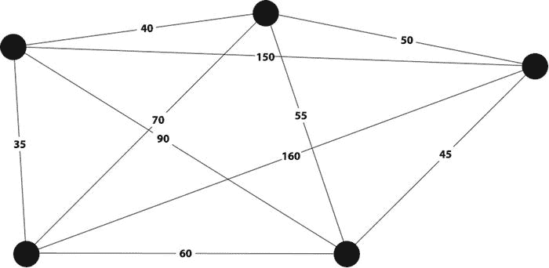
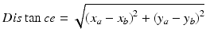
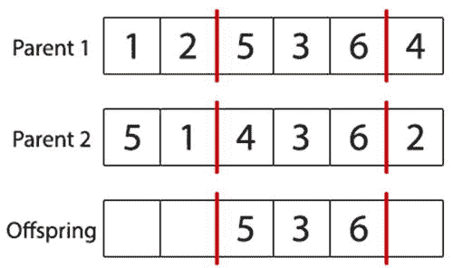
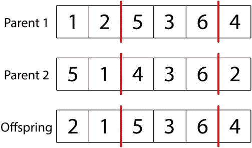
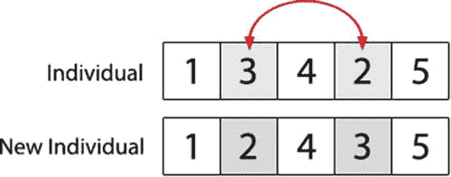
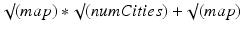

# 旅行商问题

## 引言

在本章中，我们将探讨旅行商问题以及如何使用遗传算法来解决它。在此过程中，我们将研究旅行商问题的特性，以及如何利用这些特性来设计遗传算法。

旅行商问题（TSP）是一个经典的优化问题，其研究历史可追溯到 19 世纪。旅行商问题涉及寻找一条经过一系列城市的最有效路线，每个城市恰好访问一次。

旅行商问题通常被描述为优化经过一系列城市的路线；然而，旅行商问题也可以应用于其他领域。例如，城市的概念可以看作是某些应用中的客户，甚至是微芯片上的焊点。距离的概念也可以修改，以考虑时间等其他约束条件。

在最简单的形式中，城市可以表示为图上的节点，城市之间的距离由边的长度表示（见图 4-1）。“路线”或“旅程”简单地定义了应该使用哪些边以及以何种顺序使用。然后，可以通过对路线中使用的边的长度求和来计算路线的得分。

图 4-1.

我们的图表显示了城市及它们之间的相应距离

在 20 世纪，许多数学家和科学家研究了旅行商问题；然而，直到今天，这个问题仍未得到解决。产生旅行商问题最优解的唯一有保证的方法是使用暴力算法。暴力算法是一种旨在系统地尝试每一种可能解的算法。然后，从完整的候选解集中找到最优解。尝试用暴力算法解决旅行商问题是一项极其困难的任务，因为随着城市数量的增加，潜在解的数量会经历阶乘增长。阶乘函数的增长速度甚至比指数函数还要快，这就是为什么暴力破解旅行商问题如此困难的原因。例如，对于 5 个城市，有 120 种可能的解（1x2x3x4x5），而对于 10 个城市，这个数字将增加到 3,628,800 种解！到 15 个城市时，解的数量超过一万亿。到 60 个城市时，可能的解的数量比可观测宇宙中的原子还要多。

当城市数量很少时，暴力算法可以用来寻找最优解，但随着城市数量的增加，这变得越来越具有挑战性。即使应用技术来移除反向和重复的路线，在合理的时间内找到最优解仍然很快变得不可行。

实际上，我们知道通常不需要找到最优解，因为一个足够好的解通常就足够了。有许多不同的算法可以快速找到可能仅比最优解差几个百分点的解。其中一种较常用的算法是最近邻算法。使用该算法，随机选择一个起始城市。然后，找到下一个最近的未访问城市，并将其选为路线中的第二个城市。重复选择下一个最近的未访问城市的过程，直到所有城市都被访问过，并找到一条完整的路线。事实证明，最近邻算法在产生合理解方面出奇地有效，这些解的得分在最优解的一小部分范围内。更好的是，这可以在非常短的时间内完成。这些特性使其在许多情况下成为一种有吸引力的解决方案，并且可能是遗传算法的一种替代方案。

## 问题

在此实现中，我们将要解决的是一个典型的旅行商问题，即需要优化一条经过一系列城市的路线。我们可以通过将每个城市设置为随机的 x、y 位置，在二维空间中生成一定数量的随机城市。

在计算两个城市之间的距离时，我们将简单地使用城市之间的最短直线距离作为距离。我们可以用以下公式计算这个距离：

通常，问题会比这更复杂。在这个例子中，我们假设每个城市之间存在一条直接的理想路径；这也被称为“欧几里得距离”。这通常不是典型情况，因为可能存在各种障碍物，使得实际最短路径比欧几里得距离长得多。我们还假设从城市 A 到城市 B 所需的时间与从城市 B 到城市 A 所需的时间相同。同样，在现实中这种情况很少见。通常会有单向道路等障碍物，影响沿特定方向行进时城市之间的距离。城市间距离随方向变化而变化的旅行商问题实现被称为非对称旅行商问题。

## 实现

是时候利用我们对遗传算法的知识来着手解决这个问题了。为此问题设置一个新的 Java/Eclipse 包后，我们将从编码路线开始。

### 开始之前

本章将基于你在第 3 章中开发的代码进行构建。开始之前，请创建一个新的 Eclipse 或 NetBeans 项目，或者在你现有的本书项目中创建一个名为“chapter4”的新包。

将 Individual、Population 和 GeneticAlgorithm 类从第 3 章复制过来，并导入到 chapter4 中。请务必更新每个类文件顶部的包名！它们的最顶部都应显示“package chapter4”。

打开 GeneticAlgorithm 类，删除以下方法：`calcFitness`、`evalPopulation`、`crossoverPopulation` 和 `mutatePopulation`。你将在本章的学习过程中重写这些方法。

接下来，打开 Individual 类，删除签名为“public Individual(int chromosomeLength)”的构造函数。Individual 类中有两个构造函数，请小心删除正确的那一个！要删除的构造函数是随机初始化染色体的那个；你也将在本章中重写它。

来自第 3 章的 Population 类除了文件顶部的包名外，无需其他修改。

### 编码

本例中选择的编码需要能够按顺序对城市列表进行编码。我们可以通过为每个城市分配一个唯一 ID，然后使用染色体按照候选路线的顺序引用它来实现这一点。这种使用基因序列的编码方式被称为排列编码，非常适合解决旅行商问题。

我们需要做的第一件事是为我们的城市分配唯一 ID。如果有 5 个城市需要访问，我们可以简单地将它们分配为 ID：1,2,3,4,5。然后，当遗传算法找到一条路线时，我们的染色体可能会将城市 ID 排序如下：3,4,1,2,5。这仅仅意味着我们将从城市 3 出发，然后前往城市 4，接着是城市 1，然后是城市 2，最后是城市 5，之后再返回城市 3 以完成整个路线。

### 初始化

在开始优化路线之前，我们需要创建一些城市。如前所述，我们可以通过随机选取 x,y 坐标来生成随机城市，并用它们来定义城市位置。

首先，我们需要创建一个 City 类，它可以创建并存储一个城市，以及计算到另一个城市的最短距离。

`package chapter4;`

`public class City {`

`private int x;`

`private int y;`

`public City(int x, int y) {`

`this.x = x;`

`this.y = y;`

`}`

`public double distanceFrom(City city) {`

`// 计算 x,y 的差值`

`double deltaXSq = Math.pow((city.getX() - this.getX()), 2);`

`double deltaYSq = Math.pow((city.getY() - this.getY()), 2);`

`// 计算最短路径`

`double distance = Math.sqrt(Math.abs(deltaXSq + deltaYSq));`

`return distance;`

`}`

`public int getX() {`

`return this.x;`

`}`

`public int getY() {`

`return this.y;`

`}`

`}`

City 类有一个构造函数，它接受 x 和 y 坐标来在二维平面上创建一个城市。该类还包含一个 `distanceFrom` 方法，该方法使用勾股定理计算从当前城市到另一个城市的直线距离。最后，有两个 getter 方法可用于获取城市的 x 和 y 位置。

接下来，我们应该恢复在“开始之前”部分删除的 Individual 类构造函数。旅行商问题对染色体的约束与我们前两个问题不同。回想一下，机器人控制器问题中唯一的约束是染色体必须为 128 位长，并且必须是二进制的。

不幸的是，旅行商问题并非如此；其约束更为复杂，并且决定了我们可以使用的初始化、交叉和变异技术。在这种情况下，染色体必须具有特定的长度（与城市巡游的长度相同），但还有一个额外的约束：每个城市必须且只能被访问一次，否则染色体无效。染色体中不能有重复的基因，也不能遗漏任何城市。

我们可以轻松地创建一个简单的 Individual 构造函数，而不需要任何随机性。只需创建一个包含每个城市索引的染色体：1, 2, 3, 4, 5, 6…等等。随机化初始染色体将作为本章末尾留给读者的练习。

将以下构造函数添加到 Individual 类中。你可以将其放在任何你喜欢的位置，但靠近顶部是放置构造函数的好位置。像往常一样，此处省略了注释和文档块，但请参阅本书附带的 Eclipse 项目以获取更多注释。

`public Individual(int chromosomeLength) {`

`// 创建随机个体`

`int[] individual;`

`individual = new int[chromosomeLength];`

`for (int gene = 0; gene < chromosomeLength; gene++) {`

`individual[gene] = gene;`

`}`

`this.chromosome = individual;`

`}`

此时，我们可以创建执行类及其“main”方法。通过使用“文件 ➤ 新建 ➤ 类”菜单项，在包“chapter4”中创建一个名为“TSP”的新 Java 类。与第 3 章一样，我们将用许多 TODO 来搭建遗传算法伪代码的框架，以便我们可以标记实现过程中的进度。

让我们也借此机会在“main”方法的顶部初始化一个包含 100 个随机生成的 City 对象的数组。只需生成随机的 x 和 y 坐标，并将它们传递给 City 构造函数。确保你的 TSP 类如下所示：

`package chapter4;`

`public class TSP {`

`public static int maxGenerations = 3000;`

`public static void main(String[] args) {`

`int numCities = 100;`

`City cities[] = new City[numCities];`

`// 循环创建随机城市`

`for (int cityIndex = 0; cityIndex < numCities; cityIndex++) {`

`int xPos = (int) (100 * Math.random());`

`int yPos = (int) (100 * Math.random());`

`cities[cityIndex] = new City(xPos, yPos);`

`}`

`// 初始化遗传算法`

`GeneticAlgorithm ga = new GeneticAlgorithm(100, 0.001, 0.9, 2, 5);`

`// 初始化种群`

`Population population = ga.initPopulation(cities.length);`

`// TODO: 评估种群`

`// 跟踪当前代数`

`int generation = 1;`

`// 开始进化循环`

`while (ga.isTerminationConditionMet(generation, maxGenerations) == false) {`

`// TODO: 打印种群中最适应的个体`

`// TODO: 应用交叉`

`// TODO: 应用变异`

`// TODO: 评估种群`

`// 增加当前代数`

`generation++;`

`}`

`// TODO: 显示结果`

`}`

`}`

希望这个过程变得熟悉起来；我们再次开始实现第 2 章开头介绍的伪代码。我们还生成了一个 City 对象数组，将在评估方法中使用它，就像上一章中我们生成一个 Maze 对象来评估个体一样。

其余部分是常规操作：初始化一个 GeneticAlgorithm 对象（包括种群大小、变异率、交叉率、精英个体数量和锦标赛大小），然后初始化一个种群。个体的染色体长度必须与我们希望访问的城市数量相同。

我们可以重用上一章中简单的“最大代数”终止条件，所以这次我们只剩下六个 TODO 和一个工作循环。像往常一样，让我们从评估和适应度评分方法开始。

### 评估

现在我们需要评估种群，并为个体分配适应度值，以便了解哪些个体表现最佳。第一步是为问题定义适应度函数。在这里，我们只需计算个体染色体所代表路径的总距离。

首先，我们需要创建一个新类，用于存储路径并计算其总距离。在“chapter4”包中创建一个名为“Route”的新类，并插入以下代码：

`package chapter4;`

`public class Route {`

`private City route[];`

`private double distance = 0;`

`public Route(Individual individual, City cities[]) {`

`// 获取个体的染色体`

`int chromosome[] = individual.getChromosome();`

`// 创建路径`

`this.route = new City[cities.length];`

`for (int geneIndex = 0; geneIndex < chromosome.length; geneIndex++) {`

`this.route[geneIndex] = cities[chromosome[geneIndex]];`

`}`

`}`

`public double getDistance() {`

`if (this.distance > 0) {`

`return this.distance;`

`}`

`// 遍历路径中的城市并计算路径距离`

`double totalDistance = 0;`

`for (int cityIndex = 0; cityIndex + 1 < this.route.length; cityIndex++) {`

`totalDistance += this.route[cityIndex].distanceFrom(this.route[cityIndex + 1]);`

`}`

`totalDistance += this.route[this.route.length - 1].distanceFrom(this.route[0]);`

`this.distance = totalDistance;`

`return totalDistance;`

`}`

`}`

该类仅包含一个构造函数和一个用于计算路径总距离的方法。构造函数接受一个个体和一个城市定义列表（与我们在 TSP 类的“main”函数中创建的城市数组相同）。然后，构造函数按照个体染色体的顺序构建一个城市对象数组；这种数据结构使得在 getDistance 方法中评估路径总距离变得简单。

getDistance 方法遍历路径数组（一个有序的城市对象数组），并依次调用 City 类的“distanceFrom”方法计算每两个城市之间的距离，同时累加距离值。

为了实现这种适应度评分方法，我们需要更新 GeneticAlgorithm 类中的 calcFitness 函数。calcFitness 类应将距离计算委托给 Route 类，为此，它需要接受我们的城市定义数组并将其传递给 Route 类。

在 GeneticAlgorithm 类中的任意位置添加以下方法。

`public double calcFitness(Individual individual, City cities[]){`

`// 获取适应度`

`Route route = new Route(individual, cities);`

`double fitness = 1 / route.getDistance();`

`// 存储适应度`

`individual.setFitness(fitness);`

`return fitness;`

`}`

在此函数中，适应度通过将 1 除以路径总距离来计算——因此，距离越短，得分越高。计算适应度后，将其存储起来以便在需要时快速调用。

现在，我们可以更新 GeneticAlgorithm 类中的 evalPopulation 方法，使其接受城市参数，并为种群中的每个个体计算适应度。

`public void evalPopulation(Population population, City cities[]){`

`double populationFitness = 0;`

`// 遍历种群，评估个体并累加种群适应度`

`for (Individual individual : population.getIndividuals()) {`

`populationFitness += this.calcFitness(individual, cities);`

`}`

`double avgFitness = populationFitness / population.size();`

`population.setPopulationFitness(avgFitness);`

`}`

与往常一样，此函数遍历种群并计算每个个体的适应度。与之前的实现不同，我们计算的是平均种群适应度，而非总种群适应度。（由于我们使用的是锦标赛选择法而非轮盘赌选择法，实际上并不需要种群的适应度；即使不记录此值，也不会产生任何变化。）

至此，我们可以解决 TSP 类的“main”方法中与评估和显示结果相关的四个 TODO 项。更新 TSP 类，使其内容如下。已解决的四个 TODO 项分别是：循环前和循环内的两行“评估种群”代码、循环顶部的“打印种群中最适应个体”代码，以及循环后的“显示结果”代码。

`package chapter4;`

`public class TSP {`

`public static int maxGenerations = 3000;`

`public static void main(String[] args) {`

`int numCities = 100;`

`City cities[] = new City[numCities];`

`// 循环创建随机城市`

`for (int cityIndex = 0; cityIndex < numCities; cityIndex++) {`

`int xPos = (int) (100 * Math.random());`

`int yPos = (int) (100 * Math.random());`

`cities[cityIndex] = new City(xPos, yPos);`

`}`

`// 初始化遗传算法`

`GeneticAlgorithm ga = new GeneticAlgorithm(100, 0.001, 0.9, 2, 5);`

`// 初始化种群`

`Population population = ga.initPopulation(cities.length);`

`// 评估种群`

`ga.evalPopulation(population, cities);`

`// 记录当前代数`

`int generation = 1;`

`// 开始进化循环`

`while (ga.isTerminationConditionMet(generation, maxGenerations) == false) {`

`// 打印种群中最适应个体`

`Route route = new Route(population.getFittest(0), cities);`

`System.out.println("G"+generation+" 最佳距离: " + route.getDistance());`

`// TODO: 应用交叉`

`// TODO: 应用变异`

`// 评估种群`

`ga.evalPopulation(population, cities);`

`// 增加当前代数`

`generation++;`

`}`

`// 显示结果`

`System.out.println("在 " + maxGenerations + " 代后停止。");`

`Route route = new Route(population.getFittest(0), cities);`

`System.out.println("最佳距离: " + route.getDistance());`

`}`

`}`

此时，我们可以点击“运行”，循环将执行相应操作，重复打印相同内容 3000 次，但不会显示任何变化。当然，这是意料之中的；我们需要实现交叉和变异，作为剩余的两个 TODO 项。

### 终止检查

正如我们已经了解到的，除非尝试每一种可能的解，否则无法知道是否找到了旅行商问题的最优解。这意味着我们在此实现中使用的终止检查无法在找到最优解时终止，因为它根本无法判断。

既然我们无法在找到最优解时终止，我们可以简单地让算法在运行指定代数后终止，因此我们可以复用第 3 章中`GeneticAlgorithm`类的`isTerminationConditionMet`方法。

但请注意，在像这样无法得知最优解的情况下，除了简单地为代数设置上限外，还有许多复杂的终止技术。

一种常见的技术是衡量种群适应度随时间的变化。如果种群仍在快速改进，你可能希望让算法继续运行。一旦种群停止改进，你就可以结束进化并呈现最佳解。

在像旅行商问题这样复杂的解空间中，你可能永远找不到全局最优解，但存在许多强大的局部最优解，而进展停滞通常表明你已经找到了其中一个局部最优解。

有几种方法可以衡量遗传算法随时间的进展。最简单的方法是测量最佳个体没有改进的连续代数。如果无改进的代数超过了某个阈值，例如连续 500 代无改进，你就可以停止算法。

这种简单方法在大型解空间中的一个缺点是，你可能会看到种群适应度持续改进——只是改进速度慢得令人痛苦！组合数量如此之多，以至于每十几代左右获得一个点的改进是可行的，而你实际上永远不会遇到连续 500 代无改进的情况。当然，你可以不考虑改进情况而设置一个最大代数上限。你也可以实现更复杂的技术，例如计算多个窗口的移动平均值并进行相互比较。如果适应度改进在多个窗口中呈下降趋势，就停止算法。

但在我们的案例中，我们将沿用第 3 章中的简单方法，并将实现更好终止条件的任务留给读者作为本章末尾的练习。

### 交叉

在旅行商问题中，基因以及基因在染色体中的顺序都非常重要。事实上，对于旅行商问题，我们的染色体中不应该有超过一个特定基因的副本。这是因为这会产生无效解，因为一条给定路线不应多次访问同一个城市。考虑一个有三座城市的情况：城市 A、城市 B 和城市 C。路线 A、B、C 是有效的；然而，路线 C、B、C 是无效的：这条路线访问了城市 C 两次，并且从未访问城市 A。因此，找到并应用一种能为我们的问题产生有效结果的交叉方法至关重要。

在交叉过程中，我们还需要尊重父代染色体的顺序。这是因为染色体的顺序会影响解的适应度。事实上，只有顺序才是重要的。为了更好地理解这一点，请考虑以下两条路线虽然包含完全相同的基因，但为何完全不同：

`路线 1: A,B,C,D,E`

`路线 2: C,A,D,B,E`

我们之前研究过均匀交叉；然而，均匀交叉方法作用于单个基因层面，并不尊重染色体的顺序。单点交叉和两点交叉方法做得更好，因为它们处理的是染色体片段，这将在这些片段内保留顺序。但单点交叉和两点交叉的问题在于，它们没有注意哪些基因被添加或移除了染色体。这意味着我们很可能会得到无效解，其染色体包含对同一城市的多个引用，或者完全缺少某些城市。

一种同时解决这两个问题的交叉方法是有序交叉。在这种交叉方法中，会从第一个父代染色体中选择一个子集。然后将该子集以相同位置添加到子代染色体中。

下一步是将第二个父代的遗传信息添加到子代染色体中。我们通过从所选子集的结束位置开始，然后依次包含父代 2 中尚未出现在子代染色体中的每个基因来实现。

在这个例子中，我们将从基因“2”开始，检查它是否能在子代染色体中找到。因为 2 当前不在子代染色体中，我们可以将其添加到子代染色体的第一个可用位置。然后，由于我们到达了父代 2 染色体的末尾，我们回到第一个基因“5”。这次 5 在子代染色体中，所以我们跳过它，继续处理 1。我们一直这样做，直到得到以下结果：

这种交叉方法保留了父代的大量顺序，同时也确保了解对于旅行商问题等问题保持有效。

我们当前的`Individual`类无法实现该算法的一个方面：这种技术需要检查子代染色体中是否存在特定基因。在之前的章节中，我们没有特定的基因——我们有二进制染色体——因此无需实现检查染色体中是否存在基因的方法。

幸运的是，这是一个容易添加的方法。打开`Individual`类，在文件中的任意位置添加一个名为`containsGene`的方法：

`public boolean containsGene(int gene) {`

`for (int i = 0; i < this.chromosome.length; i++) {`

`if (this.chromosome[i] == gene) {`

`return true;`

`}`

`}`

`return false;`

`}`

此方法查看染色体中的每个基因，如果找到它正在寻找的基因，则返回`true`；否则返回`false`。此方法的用法回答了以下问题：“这个解是否访问了城市#5？让我们调用`individual.containsGene(5)`来查明。”

现在，我们已准备好通过更新 `GeneticAlgorithm` 类，将有序交叉方法应用到我们的遗传算法中。与上一章类似，我们可以实现锦标赛选择作为交叉使用的选择方法，但本章中我们并未修改 `selectParent` 方法。

将以下 `crossoverPopulation` 方法添加到 `GeneticAlgorithm` 类中：

`public Population crossoverPopulation(Population population){`

`// 创建新种群`

`Population newPopulation = new Population(population.size());`

`// 按适应度遍历当前种群`

`for (int populationIndex = 0; populationIndex < population.size(); populationIndex++) {`

`// 获取父本 1`

`Individual parent1 = population.getFittest(populationIndex);`

`// 是否对该个体应用交叉？`

`if (this.crossoverRate > Math.random() && populationIndex >= this.elitismCount) {`

`// 通过锦标赛选择找到父本 2`

`Individual parent2 = this.selectParent(population);`

`// 创建空白子代染色体`

`int offspringChromosome[] = new int[parent1.getChromosomeLength()];`

`Arrays.fill(offspringChromosome, -1);`

`Individual offspring = new Individual(offspringChromosome);`

`// 获取父本染色体的子集`

`int substrPos1 = (int) (Math.random() * parent1.getChromosomeLength());`

`int substrPos2 = (int) (Math.random() * parent1.getChromosomeLength());`

`// 确保较小的为起点，较大的为终点`

`final int startSubstr = Math.min(substrPos1, substrPos2);`

`final int endSubstr = Math.max(substrPos1, substrPos2);`

`// 循环并将父本 1 的子路径添加到子代`

`for (int i = startSubstr; i < endSubstr; i++) {`

`offspring.setGene(i, parent1.getGene(i));`

`}`

`// 循环遍历父本 2 的城市路径`

`for (int i = 0; i < parent2.getChromosomeLength(); i++) {`

`int parent2Gene = i + endSubstr;`

`if (parent2Gene >= parent2.getChromosomeLength()) {`

`parent2Gene -= parent2.getChromosomeLength();`

`}`

`// 如果子代尚未包含该城市，则添加`

`if (offspring.containsGene(parent2.getGene(parent2Gene)) == false) {`

`// 循环查找子代路径中的空位`

`for (int ii = 0; ii < offspring.getChromosomeLength(); ii++) {`

`// 找到空位，添加城市`

`if (offspring.getGene(ii) == -1) {`

`offspring.setGene(ii, parent2.getGene(parent2Gene));`

`break;`

`}`

`}`

`}`

`}`

`// 添加子代`

`newPopulation.setIndividual(populationIndex, offspring);`

`} else {`

`// 不应用交叉，直接将个体添加到新种群`

`newPopulation.setIndividual(populationIndex, parent1);`

`}`

`}`

`return newPopulation;`

`}`

在此方法中，我们首先创建一个新种群来存放子代。然后，按适应度从高到低的顺序遍历当前种群。如果启用了精英主义，前几个精英个体将被跳过并直接添加到新种群中。其余个体则根据交叉率考虑是否进行交叉。如果要对某个个体应用交叉，则使用 `selectParent` 方法选择一个父本（本例中，`selectParent` 实现了如第 3 章所述的锦标赛选择），并创建一个新的空白个体。

接下来，在父本 1 的染色体中随机选取两个位置，并将这两个位置之间的基因信息子集添加到子代的染色体中。最后，按照父本 2 中的顺序添加所需的剩余基因信息；完成后，将该个体添加到新种群中。

现在，我们可以在 `TSP` 类的“main”方法中实现 `crossoverPopulation` 方法，并解决其中一个待办事项。找到“TODO: Apply crossover”并将其替换为：

`// 应用交叉`

`population = ga.crossoverPopulation(population);`

此时点击“运行”应该能得到一个可工作的算法！经过 3000 代后，你应该会看到最佳距离大约为 1500。然而，你可能还记得，仅靠交叉容易陷入局部最优，你可能会发现算法进入平台期。变异是我们将候选解随机投放到解空间新位置的方法，它有助于以短期收益为代价改善长期结果。

### 变异

与交叉类似，我们为旅行商问题使用的变异类型也很重要，因为我们需要确保应用变异后染色体仍然有效。随机改变某个基因单一值的方法很可能会导致染色体中出现重复，从而使染色体无效。

一个简单的解决方案称为交换变异，这是一种算法，它会简单地交换两个位置的基因信息。交换变异通过遍历个体染色体中的基因来工作，每个基因根据变异率决定是否进行变异。如果某个基因被选中进行变异，则会在染色体中随机选取另一个基因，然后交换它们的位置。

这个过程确保不会产生重复的基因，并且任何由此产生的子代都将是有效解。

要实现这种变异方法，首先将 `mutatePopulation` 方法添加到 `GeneticAlgorithm` 类中。

`public Population mutatePopulation(Population population){`

    `// 初始化新种群`

    `Population newPopulation = new Population(this.populationSize);`

    `// 按适应度遍历当前种群`

    `for (int populationIndex = 0; populationIndex < population.size(); populationIndex++) {`

        `Individual individual = population.getFittest(populationIndex);`

        `// 如果是精英个体则跳过变异`

        `if (populationIndex >= this.elitismCount) {`

            `// System.out.println("对种群成员 "+populationIndex+" 进行变异");`

            `// 遍历个体的基因`

            `for (int geneIndex = 0; geneIndex < individual.getChromosomeLength(); geneIndex++) {`

            `// 该基因是否需要变异？`

                `if (this.mutationRate > Math.random()) {`

                    `// 获取新的基因位置`

                    `int newGenePos = (int) (Math.random() * individual.getChromosomeLength());`

                    `// 获取要交换的基因`

                    `int gene1 = individual.getGene(newGenePos);`

                    `int gene2 = individual.getGene(geneIndex);`

                    `// 交换基因`

                    `individual.setGene(geneIndex, gene1);`

                    `individual.setGene(newGenePos, gene2);`

                `}`

            `}`

        `}`

        `// 将个体添加到种群`

        `newPopulation.setIndividual(populationIndex, individual);`

    `}`

    `// 返回变异后的种群`

    `return newPopulation;`

`}`

此方法的第一步是创建一个新种群来存放变异后的个体。接下来，从适应度最高的个体开始遍历种群。如果启用了精英主义，前几个个体将被跳过并直接添加到新种群中。然后遍历剩余个体的染色体，根据变异率逐个考虑每个基因是否进行变异。如果某个基因需要变异，则从该个体中随机选取另一个基因，并交换它们。最后，将变异后的个体添加到新种群中。

现在，我们可以将变异方法添加到 `TSP` 类的“main”方法中，并解决最后一个待办事项。找到注释“TODO: Apply mutation”并将其替换为：

`// 应用变异`

`population = ga.mutatePopulation(population);`

### 执行

TSP 类的最终代码应如下所示：

`package chapter4;`

`public class TSP {`

`public static int maxGenerations = 3000;`

`public static void main(String[] args) {`

`// 创建城市`

`int numCities = 100;`

`City cities[] = new City[numCities];`

`// 循环创建随机城市`

`for (int cityIndex = 0; cityIndex < numCities; cityIndex++) {`

`// 生成 x,y 坐标`

`int xPos = (int) (100 * Math.random());`

`int yPos = (int) (100 * Math.random());`

`// 添加城市`

`cities[cityIndex] = new City(xPos, yPos);`

`}`

`// 初始化遗传算法`

`GeneticAlgorithm ga = new GeneticAlgorithm(100, 0.001, 0.9, 2, 5);`

`// 初始化种群`

`Population population = ga.initPopulation(cities.length);`

`// 评估种群`

`//ga.evalPopulation(population, cities);`

`Route startRoute = new Route(population.getFittest(0), cities);`

`System.out.println("起始距离: " + startRoute.getDistance());`

`// 记录当前代数`

`int generation = 1;`

`// 开始进化循环`

`while (ga.isTerminationConditionMet(generation, maxGenerations) == false) {`

`// 打印种群中最优个体`

`Route route = new Route(population.getFittest(0), cities);`

`System.out.println("第"+generation+"代 最佳距离: " + route.getDistance());`

`// 应用交叉`

`population = ga.crossoverPopulation(population);`

`// 应用变异`

`population = ga.mutatePopulation(population);`

`// 评估种群`

`ga.evalPopulation(population, cities);`

`// 当前代数递增`

`generation++;`

`}`

`System.out.println("在 " + maxGenerations + " 代后停止。");`

`Route route = new Route(population.getFittest(0), cities);`

`System.out.println("最佳距离: " + route.getDistance());`

`}`

`}`

此外，请对照以下属性和方法签名检查你的 `GeneticAlgorithm` 类。如果你遗漏了其中某个方法的实现，或者某个方法签名不匹配，请返回并解决该问题。

`package chapter4;`

`import java.util.Arrays;`

`public class GeneticAlgorithm {`

`private int populationSize;`

`private double mutationRate;`

`private double crossoverRate;`

`private int elitismCount;`

`protected int tournamentSize;`

`public GeneticAlgorithm(int populationSize, double mutationRate, double crossoverRate, int elitismCount, int tournamentSize) { }`

`public Population initPopulation(int chromosomeLength){ }`

`public boolean isTerminationConditionMet(int generationsCount, int maxGenerations) { }`

`public double calcFitness(Individual individual, City cities[]) { }`

`public void evalPopulation(Population population, City cities[]) { }`

`public Individual selectParent(Population population) { }`

`public Population crossoverPopulation(Population population) { }`

`public Population mutatePopulation(Population population) { }`

`}`

最后，请确保已通过替换构造函数并添加 `containsGene` 方法来更新 `Individual` 类。

此时，点击“运行”并观察输出。像往常一样，提醒自己遗传算法是由统计学支配的随机过程，不能仅凭一次试验就得出任何结论。不幸的是，由于该问题初始化了一组随机城市，每次运行程序都会得到不同的最优解；这使得用遗传算法参数进行实验并判断其性能变得困难。本章末尾的第一个练习是硬编码一个城市列表，以便你能准确地基准测试算法的性能。

不过，此时你可以进行一些有趣的观察。多次运行算法并观察最佳距离。它们都相似吗？至少在同一数量级？这很有趣，因为每次运行都使用不同的城市集合。但仔细想想，这很合理：虽然每次城市的位置不同，但每次仍然有 100 个城市，并且它们仍然随机放置在一个 100x100 的地图上，这意味着我们可以相当容易地估算出问题解的总距离。

考虑一个 100x100 的地图——其面积为 10,000 个单位——但你的目标不是访问 100 个城市，而是访问 10,000 个城市。如果城市均匀分布在地图上（每个网格点一个），那么最佳解的距离恰好是 10,100（以锯齿形方式访问地图上的每个格子）。如果不是均匀分布，而是随机分布这 10,000 个城市，那么最佳解将是一个以 10,000 为中心的统计分布，由于放置的随机性，每次运行会略有不同。

现在我们可以反向思考，考虑更少的城市：在地图上均匀放置 25 个城市，最短路径是 600 个单位。这里的关系变得清晰：距离与地图面积的平方根乘以城市数量的平方根有关。利用这个关系，我们发现均匀放置 100 个城市的最小距离是 1,100（即 ；末尾添加的平方根项用于计算南北向的行程，但当我们开始进行统计讨论时，可以忽略该项）。如果我们将同样的 100 个城市随机放置在地图上，我们可以预期最小距离是一个以 1,000 为中心的分布。类似地，1,000 个城市的最佳距离应接近 3,100。

如果你调整城市数量，你会发现对于较小的数量，算法很容易证实这些猜想，但自然地，对于超过 100 个城市的情况，它很难找到最小值。

既然我们理解了地图大小、城市数量和预期最佳距离之间的关系，即使没有固定的城市集合，我们也可以进行实验，转而使用我们的统计预期。一个特别值得关注的领域是变异对结果质量的影响。

如果你将解空间想象成一片连绵起伏的丘陵景观，那么遗传算法就像是将 100 个具有不同行为的人随机投放到这片景观中，看看哪个个体能找到最低的山谷。（在这种情况下，由于我们的 `Individual` 构造函数不是随机的，我们实际上是将所有个体投放在同一个位置。）经过几代之后，个体及其后代将向下移动，并在找到附近最低的山谷时停止。然而，变异会将它们捡起并投放到一个新的随机位置——这个位置可能比之前更好或更差，但至少它是一个新的、独特的位置，允许它们在一个全新的景观中继续搜索。

然而，变异通常可能带来短期的损害。变异可能是有利的，也可能是不利的——这就是为什么我们使用精英主义来保护最佳个体免受变异影响。但是，变异引入的多样性可以产生深远的长期影响，因为它将一个个体放置在一个原本可能不会被探索的景观上：想象一座高大的火山，中间有一个巨大的深渊，其中包含整个景观的最低点（全局最优解，被不利的景观所包围）。任何种群都不太可能爬上火山并在中心找到全局最优解——除非一次随机变异将一个个体放置在了火山口边缘。

话虽如此，请观察不同变异率和精英计数对长期运行（数万代）的困难问题（200 个或更多城市）的影响。变异是有帮助还是有害？精英主义是有帮助还是有害？

## 摘要

旅行商问题是一个经典的优化问题，其核心是：在给定一系列城市的情况下，找到一条最短的可能路线，要求每个城市只访问一次，并最终返回起点城市。

这是一个尚未解决的优化问题，目前只有通过暴力算法才能找到最优解。然而，由于旅行商问题中可能解的数量会随着城市数量的增加而急剧增长，即使使用最强大的计算机，暴力求解也很快变得不可行。在这种情况下，通常会采用启发式方法来寻找一个良好的近似解。

我们实现了一个基于二维图形上城市的基本旅行商问题，并通过直线距离将它们连接起来。

通过使用有序的城市 ID 列表作为染色体的编码，我们能够表示旅行商问题的一个解。但是，由于每个城市 ID 必须在编码中至少出现一次，且只能出现一次，我们研究了两种能够满足这一约束的新交叉和变异方法：有序交叉和交换变异。

在有序交叉中，父本 1 染色体中的一个随机子集被添加到子代中，然后，子代中所需的剩余遗传信息按照其在父本 2 染色体中出现的顺序进行添加。这种先添加父本 1 的部分遗传信息，再仅从父本 2 添加缺失遗传信息的方法，保证了每个城市 ID 在解中只会出现一次。

在交换变异中，选择两个基因并交换它们的位置。同样，这种变异方法保证了旅行商问题解的有效性，因为它既不会完全移除某个城市 ID，也不会导致某个城市出现两次。

### 练习

*   将城市硬编码到 TSP 类的“main”方法中，以便能够准确地测量性能基准。
*   添加对最短路线和最快路线的支持，使用用户定义的城市间距离和时间。
*   添加对非对称 TSP 的支持（从 A 到 B 的代价可能不等于从 B 到 A 的代价）。
*   修改 Individual 类的构造函数，以随机化城市的顺序。这会对算法性能产生什么影响？
*   更新终止条件，以衡量算法的进展，并在没有取得显著进展时退出。这对算法的性能和结果有何影响？

