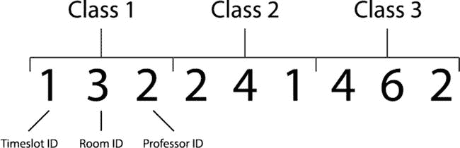

# 课程排课

## 引言

在本章中，我们将创建一个遗传算法，用于为大学课程表排课。我们将探讨课程排课算法可能应用的几种不同场景，以及设计课程表时通常需要满足的约束条件。最后，我们将构建一个简单的课程排课器，它可以扩展以支持更复杂的实现。

在人工智能领域，课程排课是约束满足问题的一个变体。这类问题涉及一组变量，需要以不违反一组既定约束的方式进行分配。

约束分为两类：硬约束——必须满足才能产生可行解的约束；以及软约束——优先考虑但不能以牺牲硬约束为代价的约束。

例如，在制造新产品时，产品的功能需求是硬约束，它规定了重要的性能要求。没有这些约束，产品就不复存在。一部不能打电话的手机几乎不能称之为手机！然而，也可能存在软约束，虽然并非必需，但同样值得考虑，例如产品的成本、重量或美观性。

在创建课程排课算法时，通常需要考虑许多硬约束和软约束。课程排课问题的一些典型硬约束包括：

*   一位教授在任何给定时间只能上一节课
*   教室必须足够大以容纳上课的学生
*   任何给定时间，一个教室只能上一节课
*   教室必须配备所有必需的设备

一些典型的软约束可能包括：

*   教室容量应与班级规模相匹配
*   教授偏好的教室
*   教授偏好的上课时间

有时，多个软约束可能会相互冲突，需要在它们之间找到权衡。例如，一个班级可能只有 10 名学生，因此一个软约束可能会奖励分配一个容量约为 10 人的合适教室；然而，授课教授可能更喜欢一个能容纳 30 人的大教室。如果教授的偏好被作为软约束考虑，课程排课器将有望找到其中一种更受偏好的配置。

在更高级的实现中，还可以对软约束进行加权，以便算法了解哪些软约束是最重要的。

与旅行商问题类似，可以使用迭代方法来寻找课程排课问题的最优解；然而，随着课程配置数量的增加，找到最优解变得越来越困难。在这种情况下，当可能的课程配置数量超出迭代方法可行求解的范围时，遗传算法是一个很好的替代方案。虽然不能保证找到最优解，但它们非常擅长在合理的时间范围内找到接近最优的解。

## 问题

本章将要研究的课程排课问题是一个大学课程排课器，它可以根据我们提供的数据（例如可用的教授、可用的教室、时间段和学生群体）来创建大学课程表。

需要注意的是，构建大学课程表与构建中小学课程表略有不同。中小学课程表要求学生全天都有排满的课程，没有空闲时段。相反，典型的大学课程表通常会根据学生注册的模块数量而出现空闲时段。

课程排课器将为每节课分配一个时间段、一位教授、一个教室和一个学生群体。我们可以通过将学生群体的数量乘以每个学生群体注册的模块数量来计算需要排课的总课程数。

对于我们的应用程序排出的每节课，我们将考虑以下硬约束：

*   课程只能安排在空闲的教室
*   一位教授一次只能教一节课
*   教室必须足够大以容纳学生群体

为了在本实现中保持简单，我们目前只考虑硬约束；然而，根据课程表的具体要求，通常还会有更多硬约束。规范中很可能还会包含一些软约束，我们现在暂时忽略它们。虽然并非必需，但考虑软约束通常会对遗传算法生成的课程表质量产生重大影响。

## 实现

是时候利用我们对遗传算法的知识来着手解决这个问题了。为此问题设置一个新的 Java/Eclipse 包后，我们将从编码染色体开始。

### 开始之前

本章将基于你在之前所有章节中开发的代码进行构建——因此，请务必仔细遵循本节内容！

开始之前，请创建一个新的 Eclipse 或 NetBeans 项目，或者在你现有的本书项目中创建一个名为“chapter5”的新包。

将 `Individual`、`Population` 和 `GeneticAlgorithm` 类从第 4 章复制过来，并导入到第 5 章中。请确保更新每个类文件顶部的包名！它们的最顶部都应显示为“package chapter5”。

打开 `GeneticAlgorithm` 类，并进行以下修改：

*   删除 `selectParent` 方法，并用第 3 章中的 `selectParent` 方法（锦标赛选择法）替换它。
*   删除 `crossoverPopulation` 方法，并用第 2 章中的 `crossoverPopulation` 方法（均匀交叉法）替换它。
*   删除 `initPopulation`、`mutatePopulation`、`evalPopulation` 和 `calcPopulation` 方法——你将在本章中重新实现它们。

`Population` 和 `Individual` 类暂时可以保持不变，但请记住，你将在本章后面为这两个文件各添加一个新的构造函数。

### 编码

我们在课程表安排应用中使用的编码需要能够高效地编码我们所需的所有课程属性。对于此实现，这些属性包括：课程安排的时间段、授课的教授以及课程的教室。

我们可以简单地为每个时间段、教授和教室分配一个数字 ID。然后，我们可以使用一个编码整数数组的染色体——这是我们熟悉的方法。这意味着每个需要安排的课程只需要三个整数即可编码，如下所示：

通过将这个数组分成三个一组，我们可以检索每门课程所需的所有信息。

### 初始化

既然我们已经理解了问题以及如何对染色体进行编码，我们就可以开始实现了。首先，我们需要为我们的调度器创建一些可供使用的数据：具体来说，就是我们要为其构建时间表的教室、教授、时间段、模块和学生组。

通常，这些数据来自包含完整课程模块和学生信息的数据库。然而，为了本实现的目的，我们将创建一些硬编码的虚拟数据来使用。

让我们先设置好我们的辅助 Java 类。我们将为上述每种数据类型（教室、课程、组、教授、模块和时间段）创建一个容器类。虽然这些容器类都非常简单——它们主要定义了一些类属性、getter 和 setter 方法，没有真正的逻辑。我们将在此依次打印它们。

首先，创建一个存储教室信息的 `Room` 类。和往常一样，如果使用 Eclipse，你可以通过 **文件** ➤ **新建** ➤ **类** 菜单选项来创建这个类。

`package chapter` `5` `;`

`public class Room {`

`private final int roomId;`

`private final String roomNumber;`

`private final int capacity;`

`public Room(int roomId, String roomNumber, int capacity) {`

`this.roomId = roomId;`

`this.roomNumber = roomNumber;`

`this.capacity = capacity;`

`}`

`public int getRoomId() {`

`return this.roomId;`

`}`

`public String getRoomNumber() {`

`return this.roomNumber;`

`}`

`public int getRoomCapacity() {`

`return this.capacity;`

`}`

`}`

这个类包含一个构造函数，它接受一个教室 ID、一个教室编号和教室容量。它还提供了获取教室属性的方法。

接下来，创建一个 `Timeslot` 类；时间段表示课程发生的星期几和时间。

`package chapter` `5` `;`

`public class Timeslot {`

`private final int timeslotId;`

`private final String timeslot;`

`public Timeslot(int timeslotId, String timeslot){`

`this.timeslotId = timeslotId;`

`this.timeslot = timeslot;`

`}`

`public int getTimeslotId(){`

`return this.timeslotId;`

`}`

`public String getTimeslot(){`

`return this.timeslot;`

`}`

`}`

可以使用构造函数创建一个时间段，并向其传递一个时间段 ID 和时间段详情字符串（详情可能看起来像“周一 9:00 – 10:00”）。该类还包含用于获取对象属性的 getter 方法。

要设置的第三个类是 `Professor` 类：

`package chapter` `5` `;`

`public class Professor {`

`private final int professorId;`

`private final String professorName;`

`public Professor(int professorId, String professorName){`

`this.professorId = professorId;`

`this.professorName = professorName;`

`}`

`public int getProfessorId(){`

`return this.professorId;`

`}`

`public String getProfessorName(){`

`return this.professorName;`

`}`

`}`

`Professor` 类包含一个接受教授 ID 和教授姓名的构造函数；它还包含用于获取教授属性的 getter 方法。

接下来，添加一个 `Module` 类来存储课程模块的信息。一个“模块”就是有些人可能称之为“课程”的东西，比如“微积分 101”或“美国历史 302”，并且像现实生活中的课程一样，可以有多个部分和多个学生组，在不同时间由不同教授授课。

`package chapter` `5` `;`

`public class Module {`

`private final int moduleId;`

`private final String moduleCode;`

`private final String module;`

`private final int professorIds[];`

`public Module(int moduleId, String moduleCode, String module, int professorIds[]){`

`this.moduleId = moduleId;`

`this.moduleCode = moduleCode;`

`this.module = module;`

`this.professorIds = professorIds;`

`}`

`public int getModuleId(){`

`return this.moduleId;`

`}`

`public String getModuleCode(){`

`return this.moduleCode;`

`}`

`public String getModuleName(){`

`return this.module;`

`}`

`public int getRandomProfessorId(){`

`int professorId = professorIds[(int) (professorIds.length * Math.random())];`

`return professorId;`

`}`

`}`

该模块类包含一个构造函数，接受模块 ID（数字）、模块代码（例如“CS101”或“Hist302”）、模块名称以及一个可教授该模块的教授 ID 数组。模块类还提供了 getter 方法，以及一个用于随机选择教授 ID 的方法。

接下来需要的类是一个 Group 类，用于存储学生分组的信息。

`package chapter` `5` `;`

`public class Group {`

`private final int groupId;`

`private final int groupSize;`

`private final int moduleIds[];`

`public Group(int groupId, int groupSize, int moduleIds[]){`

`this.groupId = groupId;`

`this.groupSize = groupSize;`

`this.moduleIds = moduleIds;`

`}`

`public int getGroupId(){`

`return this.groupId;`

`}`

`public int getGroupSize(){`

`return this.groupSize;`

`}`

`public int[] getModuleIds(){`

`return this.moduleIds;`

`}`

`}`

Group 类的构造函数接受分组 ID、分组大小以及该分组所选的模块 ID。它还提供了用于获取分组信息的 getter 方法。

接下来，添加一个“Class”类。可以理解，本章中术语可能会造成混淆——因此，大写的“Class”将指代你即将创建的 Java 类，而小写的“class”则用于指代其他任何 Java 类。

Class 类代表了上述所有元素的组合。它表示一个学生分组在特定时间、特定教室、由特定教授授课的某个模块部分。

`package chapter` `5` `;`

`public class Class {`

`private final int classId;`

`private final int groupId;`

`private final int moduleId;`

`private int professorId;`

`private int timeslotId;`

`private int roomId;`

`public Class(int classId, int groupId, int moduleId) {`

`this.classId = classId;`

`this.moduleId = moduleId;`

`this.groupId = groupId;`

`}`

`public void addProfessor(int professorId) {`

`this.professorId = professorId;`

`}`

`public void addTimeslot(int timeslotId) {`

`this.timeslotId = timeslotId;`

`}`

`public void setRoomId(int roomId) {`

`this.roomId = roomId;`

`}`

`public int getClassId() {`

`return this.classId;`

`}`

`public int getGroupId() {`

`return this.groupId;`

`}`

`public int getModuleId() {`

`return this.moduleId;`

`}`

`public int getProfessorId() {`

`return this.professorId;`

`}`

`public int getTimeslotId() {`

`return this.timeslotId;`

`}`

`public int getRoomId() {`

`return this.roomId;`

`}`

`}`

现在我们可以创建一个 Timetable 类，将所有上述对象封装到一个单一的课表对象中。Timetable 类是迄今为止最重要的类，因为它是唯一理解不同约束条件应如何相互作用的类。

Timetable 类还理解如何解析染色体并创建一个待评估和评分的候选课表。

`package chapter` `5` `;`

`import java.util.HashMap;`

`public class Timetable {`

`private final HashMap<Integer, Room> rooms;`

`private final HashMap<Integer, Professor> professors;`

`private final HashMap<Integer, Module> modules;`

`private final HashMap<Integer, Group> groups;`

`private final HashMap<Integer, Timeslot> timeslots;`

`private Class classes[];`

`private int numClasses = 0;`

`/**`

`* 初始化新的课表`

`*`

`*/`

`public Timetable() {`

`this.rooms = new HashMap<Integer, Room>();`

`this.professors = new HashMap<Integer, Professor>();`

`this.modules = new HashMap<Integer, Module>();`

`this.groups = new HashMap<Integer, Group>();`

`this.timeslots = new HashMap<Integer, Timeslot>();`

`}`

`public Timetable(Timetable cloneable) {`

`this.rooms = cloneable.getRooms();`

`this.professors = cloneable.getProfessors();`

`this.modules = cloneable.getModules();`

`this.groups = cloneable.getGroups();`

`this.timeslots = cloneable.getTimeslots();`

`}`

`private HashMap<Integer, Group> getGroups() {`

`return this.groups;`

`}`

`private HashMap<Integer, Timeslot> getTimeslots() {`

`return this.timeslots;`

`}`

`private HashMap<Integer, Module> getModules() {`

`return this.modules;`

`}`

`private HashMap<Integer, Professor> getProfessors() {`

`return this.professors;`

`}`

`/**`

`/**`
`* 添加新教室`
`*`
`* @param roomId 教室 ID`
`* @param roomName 教室名称`
`* @param capacity 容量`
`*/`
`public void addRoom(int roomId, String roomName, int capacity) {`
`this.rooms.put(roomId, new Room(roomId, roomName, capacity));`
`}`

`/**`
`* 添加新教授`
`*`
`* @param professorId 教授 ID`
`* @param professorName 教授姓名`
`*/`
`public void addProfessor(int professorId, String professorName) {`
`this.professors.put(professorId, new Professor(professorId, professorName));`
`}`

`/**`
`* 添加新模块`
`*`
`* @param moduleId 模块 ID`
`* @param moduleCode 模块代码`
`* @param module 模块名称`
`* @param professorIds 教授 ID 数组`
`*/`
`public void addModule(int moduleId, String moduleCode, String module, int professorIds[]) {`
`this.modules.put(moduleId, new Module(moduleId, moduleCode, module, professorIds));`
`}`

`/**`
`* 添加新小组`
`*`
`* @param groupId 小组 ID`
`* @param groupSize 小组人数`
`* @param moduleIds 模块 ID 数组`
`*/`
`public void addGroup(int groupId, int groupSize, int moduleIds[]) {`
`this.groups.put(groupId, new Group(groupId, groupSize, moduleIds));`
`this.numClasses = 0;`
`}`

`/**`
`* 添加新时间段`
`*`
`* @param timeslotId 时间段 ID`
`* @param timeslot 时间段描述`
`*/`
`public void addTimeslot(int timeslotId, String timeslot) {`
`this.timeslots.put(timeslotId, new Timeslot(timeslotId, timeslot));`
`}`

`/**`
`* 使用个体的染色体创建课程`
`*`
`* @param individual 个体`
`*/`
`public void createClasses(Individual individual) {`
`// 初始化课程`
`Class classes[] = new Class[this.getNumClasses()];`
`// 获取个体的染色体`
`int chromosome[] = individual.getChromosome();`
`int chromosomePos = 0;`
`int classIndex = 0;`
`for (Group group : this.getGroupsAsArray()) {`
`int moduleIds[] = group.getModuleIds();`
`for (int moduleId : moduleIds) {`
`classes[classIndex] = new Class(classIndex, group.getGroupId(), moduleId);`
`// 添加时间段`
`classes[classIndex].addTimeslot(chromosome[chromosomePos]);`
`chromosomePos++;`
`// 添加教室`
`classes[classIndex].setRoomId(chromosome[chromosomePos]);`
`chromosomePos++;`
`// 添加教授`
`classes[classIndex].addProfessor(chromosome[chromosomePos]);`
`chromosomePos++;`
`classIndex++;`
`}`
`}`
`this.classes = classes;`
`}`

`/**`
`* 根据教室 ID 获取教室`
`*`
`* @param roomId 教室 ID`
`* @return 教室对象`
`*/`
`public Room getRoom(int roomId) {`
`if (!this.rooms.containsKey(roomId)) {`
`System.out.println("教室集合中不包含键 " + roomId);`
`}`
`return (Room) this.rooms.get(roomId);`
`}`

`public HashMap<Integer, Room> getRooms() {`
`return this.rooms;`
`}`

`/**`
`* 获取随机教室`
`*`
`* @return 教室对象`
`*/`
`public Room getRandomRoom() {`
`Object[] roomsArray = this.rooms.values().toArray();`
`Room room = (Room) roomsArray[(int) (roomsArray.length * Math.random())];`
`return room;`
`}`

`/**`
`* 根据教授 ID 获取教授`
`*`
`* @param professorId 教授 ID`
`* @return 教授对象`
`*/`
`public Professor getProfessor(int professorId) {`
`return (Professor) this.professors.get(professorId);`
`}`

`/**`
`* 根据模块 ID 获取模块`
`*`
`* @param moduleId 模块 ID`
`* @return 模块对象`
`*/`
`public Module getModule(int moduleId) {`
`return (Module) this.modules.get(moduleId);`
`}`

`/**`
`* 获取学生小组的模块 ID 列表`
`*`
`* @param groupId 小组 ID`
`* @return 模块 ID 数组`
`*/`
`public int[] getGroupModules(int groupId) {`
`Group group = (Group) this.groups.get(groupId);`
`return group.getModuleIds();`
`}`

`/**`
`* 根据小组 ID 获取小组`
`*`
`* @param groupId 小组 ID`
`* @return 小组对象`
`*/`
`public Group getGroup(int groupId) {`
`return (Group) this.groups.get(groupId);`
`}`

`/**`
`* 获取所有学生小组`
`*`
`* @return 小组数组`
`*/`
`public Group[] getGroupsAsArray() {`
`return (Group[]) this.groups.values().toArray(new Group[this.groups.size()]);`
`}`

`/**`
`* 根据时间段 ID 获取时间段`
`*`
`* @param timeslotId 时间段 ID`
`* @return 时间段对象`
`*/`
`public Timeslot getTimeslot(int timeslotId) {`
`return (Timeslot) this.timeslots.get(timeslotId);`
`}`

`/**`
`* 获取随机时间段 ID`
`*`
`* @return 时间段对象`
`*/`
`public Timeslot getRandomTimeslot() {`
`Object[] timeslotArray = this.timeslots.values().toArray();`
`Timeslot timeslot = (Timeslot) timeslotArray[(int) (timeslotArray.length * Math.random())];`
`return timeslot;`
`}`

`/**`
`* 获取课程列表`
`*`
`* @return 课程数组`
`*/`
`public Class[] getClasses() {`
`return this.classes;`
`}`

`/**`
`* 获取需要排课的课程总数`
`*`
`* @return 课程数量`
`*/`
`public int getNumClasses() {`
`if (this.numClasses > 0) {`
`return this.numClasses;`
`}`
`int numClasses = 0;`
`Group groups[] = (Group[]) this.groups.values().toArray(new Group[this.groups.size()]);`
`for (Group group : groups) {`
`numClasses += group.getModuleIds().length;`
`}`
`this.numClasses = numClasses;`
`return this.numClasses;`
`}`

`/**`
`* 计算冲突数量`
`*`
`* @return 冲突数量`
`*/`
`public int calcClashes() {`
`int clashes = 0;`
`for (Class classA : this.classes) {`
`// 检查教室容量`
`int roomCapacity = this.getRoom(classA.getRoomId()).getRoomCapacity();`
`int groupSize = this.getGroup(classA.getGroupId()).getGroupSize();`
`if (roomCapacity < groupSize) {`
`clashes++;`
`}`
`// 检查教室是否已被占用`
`for (Class classB : this.classes) {`
`if (classA.getRoomId() == classB.getRoomId() && classA.getTimeslotId() == classB.getTimeslotId()`
`&& classA.getClassId() != classB.getClassId()) {`
`clashes++;`
`break;`
`}`
`}`
`// 检查教授是否有空`
`for (Class classB : this.classes) {`
`if (classA.getProfessorId() == classB.getProfessorId() && classA.getTimeslotId() == classB.getTimeslotId()`
`&& classA.getClassId() != classB.getClassId()) {`
`clashes++;`
`break;`
`}`
`}`
`}`
`return clashes;`
`}`

`}`

该类包含向课表添加教室、时间段、教授、模块和小组的方法。通过这种方式，`Timetable`类具有双重用途：一个`Timetable`对象既了解所有可用的教室、时间段、教授等信息，同时也能读取染色体，根据该染色体创建课程子集，并帮助评估该染色体的适应度。

请重点关注该类中的两个重要方法：`createClasses`和`calcClashes`。

`createClasses`方法接收一个`Individual`（即一条染色体）——利用其对必须排课的学生小组和模块总数的了解，为这些小组和模块创建一定数量的`Class`对象。然后，该方法开始读取染色体，并为每个课程分配可变信息（时间段、教室和教授）。因此，`createClasses`方法确保每个模块和学生小组都被考虑在内，但它使用遗传算法和由此产生的染色体来尝试时间段、教室和教授的不同组合。`Timetable`类将这些信息本地缓存（作为`this.classes`）以供后续使用。

课程构建完成后，`calcClashes`方法会依次检查每个课程，并统计“冲突”的数量。在此场景下，“冲突”指任何硬约束的违反，例如教室容量过小、教室与时间段冲突、或教授与时间段冲突。冲突数量稍后会被`GeneticAlgorithm`的`calcFitness`方法使用。

### 执行类

现在我们可以创建一个包含程序“main”方法的执行类。与前面章节类似，我们将基于第 2 章的伪代码来构建这个类，并用多个“TODO”注释代替实现细节，这些细节将在本章中逐步填充。

首先，创建一个新的 Java 类，命名为“TimetableGA”。确保它位于“package chapter5”中，并向其中添加以下代码：

`package chapter` `5` `;`

`public class TimetableGA {`

`public static void main(String[] args) {`

`// TODO: 创建 Timetable 并初始化所有可用课程、教室、时间段、教授、模块和小组`

`// 初始化遗传算法`

`GeneticAlgorithm ga = new GeneticAlgorithm(100, 0.01, 0.9, 2, 5);`

`// TODO: 初始化种群`

`// TODO: 评估种群`

`// 记录当前代数`

`int generation = 1;`

`// 开始进化循环`

`// TODO: 添加终止条件`

`while (false) {`

`// 打印适应度`

`System.out.println("G" + generation + " 最佳适应度: " + population.getFittest(0).getFitness());`

`// 应用交叉`

`population = ga.crossoverPopulation(population);`

`// TODO: 应用变异`

`// TODO: 评估种群`

`// 当前代数递增`

`generation++;`

`}`

`// TODO: 打印最终适应度`

`// TODO: 打印最终课表`

`}`

`}`

为了完成本章，我们给自己设定了八个 TODO。请注意，交叉操作并非 TODO，我们复用了第 3 章的锦标赛选择法，并结合了第 2 章的均匀交叉法。

第一个 TODO 很容易解决，我们现在就来处理。通常，学校排课系统的信息来自数据库，但这里我们先硬编码一些课程和教授。由于以下代码稍显冗长，我们在 TimetableGA 类中创建一个单独的方法来处理。你可以将此方法放在任意位置：

`private static Timetable initializeTimetable() {`

`// 创建课表`

`Timetable timetable = new Timetable();`

`// 设置教室`

`timetable.addRoom(1, "A1", 15);`

`timetable.addRoom(2, "B1", 30);`

`timetable.addRoom(4, "D1", 20);`

`timetable.addRoom(5, "F1", 25);`

`// 设置时间段`

`timetable.addTimeslot(1, "周一 9:00 - 11:00");`

`timetable.addTimeslot(2, "周一 11:00 - 13:00");`

`timetable.addTimeslot(3, "周一 13:00 - 15:00");`

`timetable.addTimeslot(4, "周二 9:00 - 11:00");`

`timetable.addTimeslot(5, "周二 11:00 - 13:00");`

`timetable.addTimeslot(6, "周二 13:00 - 15:00");`

`timetable.addTimeslot(7, "周三 9:00 - 11:00");`

`timetable.addTimeslot(8, "周三 11:00 - 13:00");`

`timetable.addTimeslot(9, "周三 13:00 - 15:00");`

`timetable.addTimeslot(10, "周四 9:00 - 11:00");`

`timetable.addTimeslot(11, "周四 11:00 - 13:00");`

`timetable.addTimeslot(12, "周四 13:00 - 15:00");`

`timetable.addTimeslot(13, "周五 9:00 - 11:00");`

`timetable.addTimeslot(14, "周五 11:00 - 13:00");`

`timetable.addTimeslot(15, "周五 13:00 - 15:00");`

`// 设置教授`

`timetable.addProfessor(1, "P·史密斯博士");`

`timetable.addProfessor(2, "E·米切尔夫人");`

`timetable.addProfessor(3, "R·威廉姆斯博士");`

`timetable.addProfessor(4, "A·汤普森先生");`

`// 设置模块并定义授课教授`

`timetable.addModule(1, "cs1", "计算机科学", new int[] { 1, 2 });`

`timetable.addModule(2, "en1", "英语", new int[] { 1, 3 });`

`timetable.addModule(3, "ma1", "数学", new int[] { 1, 2 });`

`timetable.addModule(4, "ph1", "物理", new int[] { 3, 4 });`

`timetable.addModule(5, "hi1", "历史", new int[] { 4 });`

`timetable.addModule(6, "dr1", "戏剧", new int[] { 1, 4 });`

`// 设置学生小组及其所选模块`

`timetable.addGroup(1, 10, new int[] { 1, 3, 4 });`

`timetable.addGroup(2, 30, new int[] { 2, 3, 5, 6 });`

`timetable.addGroup(3, 18, new int[] { 3, 4, 5 });`

`timetable.addGroup(4, 25, new int[] { 1, 4 });`

`timetable.addGroup(5, 20, new int[] { 2, 3, 5 });`

`timetable.addGroup(6, 22, new int[] { 1, 4, 5 });`

`timetable.addGroup(7, 16, new int[] { 1, 3 });`

`timetable.addGroup(8, 18, new int[] { 2, 6 });`

`timetable.addGroup(9, 24, new int[] { 1, 6 });`

`timetable.addGroup(10, 25, new int[] { 3, 4 });`

`return timetable;`

`}`

现在，通过将 main 方法顶部的第一个 TODO 替换为以下代码来解决它：

`// 获取包含所有可用信息的 Timetable 对象。`

`Timetable timetable = initializeTimetable();`

main 方法的顶部现在应该如下所示：

`public class TimetableGA {`

`public static void main(String[] args) {`

`// 获取包含所有可用信息的 Timetable 对象。`

`Timetable timetable = initializeTimetable();`

`// 初始化 GA ...（以及类的其余部分，与之前相比保持不变！）`

`GeneticAlgorithm ga = new GeneticAlgorithm(100, 0.01, 0.9, 2, 5);`

这为我们提供了一个包含所有必要信息的 Timetable 实例，而我们创建的 GeneticAlgorithm 对象与前面章节中的类似：一个种群大小为 100、变异率为 0.01、交叉率为 0.9、精英个体数为 2、锦标赛规模为 5 的遗传算法。

我们现在还剩下七个 TODO。下一个 TODO 与初始化种群有关。为了创建一个种群，我们需要知道所需染色体的长度；这由 Timetable 中的组和模块数量决定。

我们需要能够从 Timetable 对象初始化一个 Population，这意味着我们也需要能够从 Timetable 对象初始化一个 Individual。因此，为了解决这个 TODO，我们必须做三件事：向 GeneticAlgorithm 类添加一个 `initPopulation(Timetable)` 方法，向 Population 添加一个接受 Timetable 的构造函数，以及向 Individual 添加一个接受 Timetable 的构造函数。

让我们从底层开始，逐层向上。更新 Individual 类，添加一个新的构造函数，该构造函数从 Timetable 构建一个 Individual。该构造函数使用 Timetable 对象来确定必须安排的课程数量，这决定了染色体的长度。染色体本身是通过从 Timetable 中随机选取房间、时间段和教授来构建的。

将以下方法添加到 Individual 类中的任意位置：

`public Individual(Timetable timetable) {`

`int numClasses = timetable.getNumClasses();`

`// 1 个基因用于房间，1 个用于时间，1 个用于教授`

`int chromosomeLength = numClasses * 3;`

`// 创建随机个体`

`int newChromosome[] = new int[chromosomeLength];`

`int chromosomeIndex = 0;`

`// 遍历组`

`for (Group group : timetable.getGroupsAsArray()) {`

`// 遍历模块`

`for (int moduleId : group.getModuleIds()) {`

`// 添加随机时间`

`int timeslotId = timetable.getRandomTimeslot().getTimeslotId();`

`newChromosome[chromosomeIndex] = timeslotId;`

`chromosomeIndex++;`

`// 添加随机房间`

`int roomId = timetable.getRandomRoom().getRoomId();`

`newChromosome[chromosomeIndex] = roomId;`

`chromosomeIndex++;`

`// 添加随机教授`

`Module module = timetable.getModule(moduleId);`

`newChromosome[chromosomeIndex] = module.getRandomProfessorId();`

`chromosomeIndex++;`

`}`

`}`

`this.chromosome = newChromosome;`

`}`

这个构造函数接受一个 timetable 对象，并遍历每个学生组以及该组注册的每个模块（从而得出需要安排的总课程数）。对于每门课程，会随机选择一个房间、教授和时间段，并将相应的 ID 添加到染色体中。

接下来，将这个构造函数方法添加到 Population 类中。这个构造函数通过简单地调用我们刚刚创建的 Individual 构造函数，从使用 Timetable 初始化的 Individual 构建一个 Population。

`public Population(int populationSize, Timetable timetable) {`

`// 初始种群`

`this.population = new Individual[populationSize];`

`// 遍历种群大小`

`for (int individualCount = 0; individualCount < populationSize; individualCount++) {`

`// 创建个体`

`Individual individual = new Individual(timetable);`

`// 将个体添加到种群`

`this.population[individualCount] = individual;`

`}`

`}`

接下来，重新实现 GeneticAlgorithm 类中的 initPopulation 方法，以使用新的 Population 构造函数：

`public Population initPopulation(Timetable timetable) {`

`// 初始化种群`

`Population population = new Population(this.populationSize, timetable);`

`return population;`

`}`

我们终于可以解决下一个 TODO 了：将执行类 main 方法中的 “TODO: Initialize Population” 替换掉，并调用 GeneticAlgorithm 的 initPopulation 方法：

`// 初始化种群`

`Population population = ga.initPopulation(timetable);`

执行类 TimetableGA 的 main 方法现在应该如下所示。由于我们还没有实现终止条件，这段代码暂时还不会执行任何有意义的操作。实际上，Java 编译器可能会抱怨循环内部存在无法访问的代码。我们稍后会修复这个问题。

`public static void main(String[] args) {`

`// 获取包含所有可用信息的 Timetable 对象。`

`Timetable timetable = initializeTimetable();`

`// 初始化 GA`

`GeneticAlgorithm ga = new GeneticAlgorithm(100, 0.01, 0.9, 2, 5);`

`// 初始化种群`

`Population population = ga.initPopulation(timetable);`

`// TODO: 评估种群`

`// 记录当前代数`

`int generation = 1;`

`// 开始进化循环`

`// TODO: 添加终止条件`

`while (false) {`

`// 打印适应度`

`System.out.println("G" + generation + " 最佳适应度: " + population.getFittest(0).getFitness());`

`// 应用交叉`

`population = ga.crossoverPopulation(population);`

`// TODO: 应用变异`

`// TODO: 评估种群`

`// 增加当前代数`

`generation++;`

`}`

`// TODO: 打印最终适应度`

`// TODO: 打印最终时间表`

`}`

### 评估

我们的初始种群已经创建完成，现在需要对这些个体进行评估并赋予适应度值。根据之前的了解，目标是优化课程时间表，使其尽可能少地违反约束条件。这意味着个体的适应度值与其违反的约束数量成反比。

打开并检查 Timetable 类中的“createClasses”方法。该方法利用所有需要安排到特定时间、特定教室并由特定教授授课的班级和模块信息，将染色体转换为 Class 对象数组，并存储起来以供评估。这个方法本身并不执行实际的评估，但它是连接染色体与评估步骤的桥梁。

接下来，检查同一个类中的“calcClashes”方法。该方法将每个班级与其他所有班级进行比较，如果违反了任何硬性约束，则增加一次“冲突”，例如：所选教室太小、教室存在时间安排冲突、或教授存在时间安排冲突。该方法返回找到的冲突总数。

现在，我们已经准备好创建适应度函数，并最终评估种群中个体的适应度。

打开 GeneticAlgorithm 类，首先添加以下 calcFitness 方法。

`public double calcFitness(Individual individual, Timetable timetable) {`

      `// 创建新的时间表对象以供使用——从现有时间表克隆而来`

      `Timetable threadTimetable = new Timetable(timetable);`

      `threadTimetable.createClasses(individual);`

      `// 计算适应度`

      `int clashes = threadTimetable.calcClashes();`

      `double fitness = 1 / (double) (clashes + 1);`

      `individual.setFitness(fitness);`

      `return fitness;`

`}`

calcFitness 方法克隆给定的 Timetable 对象，调用 createClasses 方法，然后通过 calcClashes 方法计算冲突数量。适应度定义为冲突数量的倒数——0 次冲突将得到适应度值 1。

同时，在 GeneticAlgorithm 类中添加一个 evalPopulation 方法。与之前章节一样，该方法简单地遍历种群，并为每个个体调用 calcFitness。

`public void evalPopulation(Population population, Timetable timetable) {`

      `double populationFitness = 0;`

      `// 循环遍历种群，评估个体并累加种群适应度`

      `for (Individual individual : population.getIndividuals()) {`

            `populationFitness += this.calcFitness(individual, timetable);`

      `}`

      `population.setPopulationFitness(populationFitness);`

`}`

最后，我们可以评估种群，并解决执行类 TimetableGA 的 main 方法中的一些 TODO。将两处显示“TODO: Evaluate Population”的位置更新为：

`// 评估种群`

`ga.evalPopulation(population, timetable);`

此时，应该还剩下四个 TODO。程序目前仍然无法运行，因为终止条件尚未定义，并且循环尚未启用。

### 终止

构建课程调度器的下一步是设置终止检查。之前，我们同时使用世代数和适应度来决定是否终止遗传算法。这次我们将结合这两种终止条件，在达到一定世代数后，或者找到有效解时，终止遗传算法。

由于适应度值基于违反约束的数量，我们知道完美解的适应度值为 1。保留之前的终止检查，并在 GeneticAlgorithm 类中添加第二个终止检查。我们将在执行循环中同时使用这两个检查。

`public boolean isTerminationConditionMet(Population population) {`

`return population.getFittest(0).getFitness() == 1.0;`

`}`

此时，请确认第二个 isTerminationConditionMet 方法（应该已经在 GeneticAlgorithm 类中）如下所示：

`public boolean isTerminationConditionMet(int generationsCount, int maxGenerations) {`

`return (generationsCount > maxGenerations);`

`}`

现在，我们可以将两个终止检查添加到 main 方法中，并启用进化循环。打开执行类 TimetableGA，并按如下方式解决“TODO: Add termination condition”TODO：

`// 开始进化循环`

`while (ga.isTerminationConditionMet(generation, 1000) == false`

`&& ga.isTerminationConditionMet(population) == false) {`

`// 循环的其余部分在此...`

第一个 isTerminationConditionMet 调用将我们限制在 1000 代以内，而第二个检查则查看种群中是否存在适应度为 1 的个体。

让我们快速解决另外两个 TODO。当循环结束时，我们需要进行一些简单的报告输出。删除循环后的两个 TODO（“打印最终适应度”和“打印最终时间表”），并用以下内容替换：

`// 打印适应度`

`timetable.createClasses(population.getFittest(0));`

`System.out.println();`

`System.out.println("在 " + generation + " 代中找到解");`

`System.out.println("最终解的适应度: " + population.getFittest(0).getFitness());`

`System.out.println("冲突数: " + timetable.calcClashes());`

`// 打印班级`

`System.out.println();`

`Class classes[] = timetable.getClasses();`

`int classIndex = 1;`

`for (Class bestClass : classes) {`

`System.out.println("班级 " + classIndex + ":");`

`System.out.println("模块: " +`

`timetable.getModule(bestClass.getModuleId()).getModuleName());`

`System.out.println("组别: " +`

`timetable.getGroup(bestClass.getGroupId()).getGroupId());`

`System.out.println("教室: " +`

`timetable.getRoom(bestClass.getRoomId()).getRoomNumber());`

`System.out.println("教授: " +`

`timetable.getProfessor(bestClass.getProfessorId()).getProfessorName());`

`System.out.println("时间: " +`

`timetable.getTimeslot(bestClass.getTimeslotId()).getTimeslot());`

`System.out.println("-----");`

`classIndex++;`

`}`

此时，你应该能够运行程序，观察进化循环，并得到结果。如果没有变异，你可能永远找不到解，但我们从第 2 章和第 3 章中改造而来的现有交叉方法通常足以找到解。然而，如果你多次运行程序，却从未在 1000 代以内找到解，你可能需要重新阅读本章，确保没有犯任何错误。

本章省略了大家熟悉的“交叉”部分，因为这里没有需要介绍的新技术。回想一下，第 2 章中的均匀交叉会随机选择染色体并与父代交换，而不保留基因组的任何连续性。对于这个问题，这是一个很好的方法，因为在这种情况下，基因组（代表教授、教室和时间段的组合）更可能是有害的而非有益的。

### 变异

回顾一下，对染色体的约束往往决定了为遗传算法选择的变异和交叉技术。在这种情况下，染色体由特定的教室、教授和时段的 ID 构成；我们不能简单地选择随机数。此外，由于教室、教授和时段的 ID 范围各不相同，我们也不能简单地在 1 到“X”之间选择一个随机数。理论上，我们可以为编码的每种不同类型对象（教室、教授和时段）选择随机数，但这同样假设 ID 是连续的，而实际情况可能并非如此！

我们可以从均匀交叉中借鉴一个技巧来解决变异问题。在均匀交叉中，基因是从一个现有的、有效的父代中随机选择的。这个父代可能不是种群中最适应的个体，但至少它是有效的。

变异也可以用类似的方式实现。我们不必为染色体中的随机基因选择一个随机数，而是可以创建一个新的随机但有效的个体，然后本质上运行均匀交叉来实现变异！也就是说，我们可以使用`Individual(Timetable)`构造函数创建一个全新的随机个体，然后从该随机个体中选择基因，复制到待变异的个体中。这种技术称为均匀变异，它能确保我们所有变异后的个体都是完全有效的，绝不会选择一个无意义的基因。在`GeneticAlgorithm`类中的任意位置添加以下方法：

`public Population mutatePopulation(Population population, Timetable timetable) {`

      `// 初始化新种群`
      `Population newPopulation = new Population(this.populationSize);`

      `// 按适应度遍历当前种群`
      `for (int populationIndex = 0; populationIndex < population.size(); populationIndex++) {`

            `Individual individual = population.getFittest(populationIndex);`

            `// 创建一个随机个体用于交换基因`
            `Individual randomIndividual = new Individual(timetable);`

            `// 遍历个体的基因`
            `for (int geneIndex = 0; geneIndex < individual.getChromosomeLength(); geneIndex++) {`

                  `// 如果是精英个体，则跳过变异`
                  `if (populationIndex > this.elitismCount) {`

                        `// 该基因是否需要变异？`
                        `if (this.mutationRate > Math.random()) {`

                              `// 交换为新基因`
                              `individual.setGene(geneIndex, randomIndividual.getGene(geneIndex));`

                        `}`

                  `}`

            `}`

            `// 将个体添加到种群`
            `newPopulation.setIndividual(populationIndex, individual);`

      `}`

      `// 返回变异后的种群`
      `return newPopulation;`

`}`

在这个方法中，与前面章节的变异类似，通过遍历种群中的非精英个体来实现种群变异。与其他倾向于直接修改基因的变异技术不同，此变异算法会创建一个随机但有效的个体，并从中随机复制基因。

现在，我们可以解决执行类`main`方法中最后一个`TODO`了。在主循环中添加这一行代码：

`// 应用变异`
`population = ga.mutatePopulation(population, timetable);`

现在，我们应该万事俱备，可以运行遗传算法并创建新的大学课程表了。如果你的 Java IDE 显示错误，或者此时无法编译，请返回本章，检查并解决你发现的任何问题。

### 执行

确保你的`TimetableGA`类看起来像下面这样：

`package chapter` `5` `;`

`public class TimetableGA {`

`public static void main(String[] args) {`

`// 获取包含所有可用信息的 Timetable 对象。`
`Timetable timetable = initializeTimetable();`

`// 初始化 GA`
`GeneticAlgorithm ga = new GeneticAlgorithm(100, 0.01, 0.9, 2, 5);`

`// 初始化种群`
`Population population = ga.initPopulation(timetable);`

`// 评估种群`
`ga.evalPopulation(population, timetable);`

`// 记录当前代数`
`int generation = 1;`

`// 开始进化循环`
`while (ga.isTerminationConditionMet(generation, 1000) == false`
`&& ga.isTerminationConditionMet(population) == false) {`

`// 打印适应度`
`System.out.println("G" + generation + " Best fitness: " + population.getFittest(0).getFitness());`

`// 应用交叉`
`population = ga.crossoverPopulation(population);`

`// 应用变异`
`population = ga.mutatePopulation(population, timetable);`

`// 评估种群`
`ga.evalPopulation(population, timetable);`

`// 当前代数递增`
`generation++;`

`}`

`// 打印适应度`
`timetable.createClasses(population.getFittest(0));`
`System.out.println();`
`System.out.println("Solution found in " + generation + " generations");`
`System.out.println("Final solution fitness: " + population.getFittest(0).getFitness());`
`System.out.println("Clashes: " + timetable.calcClashes());`

`// 打印课程`
`System.out.println();`
`Class classes[] = timetable.getClasses();`
`int classIndex = 1;`
`for (Class bestClass : classes) {`
`System.out.println("Class " + classIndex + ":");`
`System.out.println("Module: " +`
`timetable.getModule(bestClass.getModuleId()).getModuleName());`
`System.out.println("Group: " +`
`timetable.getGroup(bestClass.getGroupId()).getGroupId());`
`System.out.println("Room: " +`
`timetable.getRoom(bestClass.getRoomId()).getRoomNumber());`
`System.out.println("Professor: " +`
`timetable.getProfessor(bestClass.getProfessorId()).getProfessorName());`
`System.out.println("Time: " +`
`timetable.getTimeslot(bestClass.getTimeslotId()).getTimeslot());`
`System.out.println("-----");`
`classIndex++;`
`}`

`}`

`/**`
`* 创建一个包含所有必要课程信息的 Timetable。`
`* @return`
`*/`
`private static Timetable initializeTimetable() {`
`// 创建 Timetable`
`Timetable timetable = new Timetable();`

`// 设置教室`
`timetable.addRoom(1, "A1", 15);`
`timetable.addRoom(2, "B1", 30);`
`timetable.addRoom(4, "D1", 20);`
`timetable.addRoom(5, "F1", 25);`

`// 设置时段`
`timetable.addTimeslot(1, "Mon 9:00 - 11:00");`
`timetable.addTimeslot(2, "Mon 11:00 - 13:00");`
`timetable.addTimeslot(3, "Mon 13:00 - 15:00");`
`timetable.addTimeslot(4, "Tue 9:00 - 11:00");`
`timetable.addTimeslot(5, "Tue 11:00 - 13:00");`
`timetable.addTimeslot(6, "Tue 13:00 - 15:00");`
`timetable.addTimeslot(7, "Wed 9:00 - 11:00");`
`timetable.addTimeslot(8, "Wed 11:00 - 13:00");`
`timetable.addTimeslot(9, "Wed 13:00 - 15:00");`
`timetable.addTimeslot(10, "Thu 9:00 - 11:00");`
`timetable.addTimeslot(11, "Thu 11:00 - 13:00");`
`timetable.addTimeslot(12, "Thu 13:00 - 15:00");`
`timetable.addTimeslot(13, "Fri 9:00 - 11:00");`
`timetable.addTimeslot(14, "Fri 11:00 - 13:00");`
`timetable.addTimeslot(15, "Fri 13:00 - 15:00");`

`// 设置教授`
`timetable.addProfessor(1, "Dr P Smith");`
`timetable.addProfessor(2, "Mrs E Mitchell");`
`timetable.addProfessor(3, "Dr R Williams");`
`timetable.addProfessor(4, "Mr A Thompson");`

`// 设置模块并定义教授它们的老师`
`timetable.addModule(1, "cs1", "Computer Science", new int[] { 1, 2 });`
`timetable.addModule(2, "en1", "English", new int[] { 1, 3 });`
`timetable.addModule(3, "ma1", "Maths", new int[] { 1, 2 });`
`timetable.addModule(4, "ph1", "Physics", new int[] { 3, 4 });`
`timetable.addModule(5, "hi1", "History", new int[] { 4 });`
`timetable.addModule(6, "dr1", "Drama", new int[] { 1, 4 });`

`// 设置学生组及其所学的模块。`
`timetable.addGroup(1, 10, new int[] { 1, 3, 4 });`

`timetable.addGroup(2, 30, new int[] { 2, 3, 5, 6 });`

`timetable.addGroup(3, 18, new int[] { 3, 4, 5 });`

`timetable.addGroup(4, 25, new int[] { 1, 4 });`

`timetable.addGroup(5, 20, new int[] { 2, 3, 5 });`

`timetable.addGroup(6, 22, new int[] { 1, 4, 5 });`

`timetable.addGroup(7, 16, new int[] { 1, 3 });`

`timetable.addGroup(8, 18, new int[] { 2, 6 });`

`timetable.addGroup(9, 24, new int[] { 1, 6 });`

`timetable.addGroup(10, 25, new int[] { 3, 4 });`

`return timetable;`

`}`

`}`

直接运行这个课程调度器，大约在 50 代内就能生成一个解决方案，并且在所有情况下都应呈现一个零冲突（硬约束）的解决方案。如果你的算法反复达到 1,000 代的限制，或者呈现的解决方案存在冲突，那么你的实现很可能存在问题！

花一分钟目视检查算法返回的课程表结果。确认教授、教室和时段之间确实没有实际冲突。

此时，你可能还想尝试在 TimetableGA 的“initializeTimetable”方法中，向 Timetable 初始化添加更多教授、模块、时段、分组和教室。你能迫使算法失败吗？

## 分析与优化

课程调度问题是使用遗传算法在解空间中搜索有效解而非最优解的一个好例子。这个问题可能有许多适应度为 1 的解，我们只需要找到其中一个有效解即可。当仅考虑硬约束时，任意两个有效解之间没有实际区别，我们可以简单地选择找到的第一个解。

与第 4 章中的旅行商问题不同，课程调度问题的这一特性意味着算法实际上可能返回无效解。旅行商问题中，如果解没有访问每个城市一次，则该解无效，但由于我们精心设计了初始化、交叉和变异算法，使用第 4 章的代码永远不会遇到无效解。我们的 TSP 求解器返回的所有路线都是有效的，问题仅在于找到最短的可能路线。如果我们在任何一代的任何时刻停止 TSP 算法，并随机选择一个种群成员，它都将是一个有效解。

然而，在本章中，大多数解都是无效的，我们只在找到第一个有效解或超时时停止。这两个问题的区别如下：在旅行商问题中，创建有效解很容易（只需确保每个城市都被访问一次；但无法保证解的适应度！），而在课程调度器中，创建有效解是困难的部分。

此外，如果没有软约束，课程调度器返回的任意两个有效解之间在适应度上没有区别。在此上下文中，硬约束决定解是否有效，而软约束决定解的质量。上述实现并不偏好任何特定的有效解，因为它没有评估解质量的手段——它只知道解是否有效。

向课程调度器添加软约束会显著改变问题。我们不再仅仅寻找任意有效解，而是想要最好的有效解。

幸运的是，遗传算法特别擅长这种约束权衡。个体仅通过一个数字——其适应度——来评判，这对我们有利。确定个体适应度的算法对遗传算法来说是完全不透明的——就遗传算法而言，它是一个黑盒。虽然适应度分数对遗传算法至关重要，且不能随意实现，但其简单性和不透明性也使我们能够用它来协调各种约束和条件。因为一切都归结为一个单一的无量纲适应度分数，我们可以根据需要缩放和转换任意数量的约束，而该约束的重要性体现在它对适应度分数的贡献强度上。

上述实现的课程调度器仅使用硬约束，并将适应度分数限制在 0-1 范围内。当组合不同类型的约束时，应确保硬约束对适应度分数产生压倒性影响，而软约束则做出更适度的贡献。

例如，假设你需要向课程调度器添加一些软约束，每个约束的重要性略有不同。当然，硬约束仍然适用。你如何协调软约束与硬约束？现有的适应度分数“1 / (冲突数 + 1)”显然没有纳入软约束——即使它将违反的软约束视为“冲突”，也会将它们与硬约束同等对待。在该模型下，有可能选择一个无效解，因为它可能满足了许多软约束，从而弥补了因违反硬约束而损失的适应度。

相反，考虑一种新的适应度评分系统：每个违反的硬约束从适应度分数中减去 100，而每个满足的软约束可根据其重要性向适应度分数增加 1、2 或 3 分。在此方案下，我们只应考虑分数为零或以上的解，因为任何负分都意味着违反了硬约束。该方案还确保违反硬约束无法被大量满足的软约束所抵消——硬约束对适应度分数的贡献如此之大，以至于软约束无法弥补违反硬约束所惩罚的 100 分。最后，该方案还允许你对软约束进行优先级排序——更重要的约束可以对适应度分数做出更大贡献。

为了进一步说明适应度分数如何归一化约束，请考虑任何地图和导航工具（如谷歌地图）。当你搜索两个地点之间的路线时，适应度分数的主要贡献者是两地之间的行程时间。一个简单的算法可能会使用以分钟为单位的旅行时间作为其适应度分数（在这种情况下，我们称之为“成本分数”，因为越低越好，适应度的倒数通常称为“成本”）。

一条耗时 60 分钟的路线优于一条耗时 70 分钟的路线——但我们知道在现实生活中情况并非总是如此。也许较短的路线有 20 美元的昂贵通行费。用户可能会选择“避开收费站”选项，现在算法必须协调驾驶分钟数与通行费美元数。一分钟值多少美元？如果你决定每美元为成本分数增加一分，那么较短路线的成本现在为 80，输给了较长但更便宜的路线。另一方面，如果你降低避开收费站的重要性，并决定一美元通行费仅为路线增加 0.25 的成本，那么较短路线仍将以 65 的成本胜出。

最终，在使用遗传算法处理硬约束和软约束时，请务必理解适应度分数代表什么，以及每个约束将如何影响个体的分数。

### 练习

为课程调度器添加软约束。这可以包括偏好的教授时间和偏好的教室。   实现对配置文件或数据库连接的支持，以添加初始课程表数据。   为学校课程表构建一个课程调度器，要求学生在每个时段都有课程安排。

## 总结

在本章中，我们介绍了使用遗传算法进行课程安排的基础知识。我们并非使用遗传算法来寻找最优解，而是利用它来寻找满足若干硬约束的第一个有效解。

我们还探索了一种新的变异策略，该策略能确保变异后的染色体保持有效。我们没有直接修改染色体并引入随机性（在本例中这可能导致无效染色体），而是创建了一个已知有效的随机个体，并以类似于均匀交叉的方式与其交换基因。该算法仍被视为均匀变异，但本章采用的新方法使得确保有效变异更加容易。

此外，我们将第 2 章中的均匀交叉与第 3 章中的锦标赛选择相结合，展示了遗传算法的许多方面都是模块化、独立的，并且能够以不同方式组合。

最后，我们讨论了遗传算法中适应度分数的灵活性。我们了解到，无量纲的适应度分数可用于引入软约束，并使其与硬约束协调一致，最终目标不仅是产生有效结果，还要产生高质量的结果。

