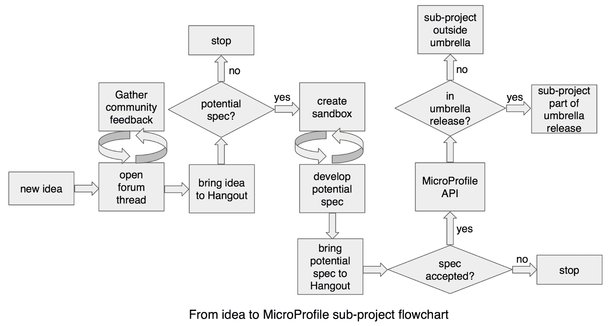

# 当前 Eclipse MicroProfile 治理

Eclipse MicroProfile 在运营和决策过程中保持透明，其设计宗旨是极为轻量化。治理的重点在于以协作方式创建、创新和演进规范。

首先，Eclipse MicroProfile 是一个 Eclipse 项目，因此遵循 Eclipse 的流程。这包括提交者审批、项目发布、知识产权保护、许可审查流程等。然而，Eclipse 基金会足够灵活，允许像 MicroProfile 这样的项目提供一些额外的轻量级流程，使多个规范能够并行推进，同时通过跨规范沟通和对齐的方式协同发展。

其中一个轻量级流程是 Eclipse MicroProfile 双周 Hangout 会议/电话会议（会议网址为 [`eclipse.zoom.us/j/949859967`](https://eclipse.zoom.us/j/949859967)，其录制视频可在 Eclipse MicroProfile YouTube 频道 [`www.youtube.com/channel/UC_Uqc8MYFDoCItFIGheMD_w`](https://www.youtube.com/channel/UC_Uqc8MYFDoCItFIGheMD_w) 上找到）。该会议向社区所有人开放，作为一个论坛，讨论与会者提出的议题并做出决策，内容涵盖子项目状态、发布内容、发布日期以及子项目创建审批等。需要注意的是，MicroProfile 并非标准组织，尽管它看起来可能像。MicroProfile 由社区创建，服务于社区，其发展速度由社区决定，因为它在不同的子项目中进行创新。MicroProfile 定义的规范鼓励多种实现，这与标准组织非常相似。然而，MicroProfile 实际上是一个快速演进的开源项目，其源代码就是规范。

社区沟通、讨论和辩论的主要方式是 Eclipse MicroProfile Google Group（[`groups.google.com/forum/#!forum/microprofile`](https://groups.google.com/forum/#!forum/microprofile)）。您可以使用您喜欢的网络浏览器在 Google Group 中阅读、发布、回答或发起与任何 MicroProfile 相关主题的论坛消息。您也可以使用该 Group 的电子邮件发起新的论坛消息。任何人都可以发起新的论坛主题来讨论议题，例如可能添加到 MicroProfile 的新功能。当社区在论坛和/或 MicroProfile Hangout 会议上对某个新想法进行充分讨论，并确定值得进一步探讨后，社区会决定为该新想法创建一个工作组，并指定一位或多位负责人（通常是该主题领域的专家）作为推动者。

需要注意的一个重要方面是，工作组（或子项目）的负责人并非单方面决定或确定规范的演进方向或包含哪些功能。对于与其规范相关的决策，他们没有否决权或最终决定权。通过分享想法、专业知识、过往经验、对现有技术的分析以及最佳实践，工作组将提出他们所能做到的最佳提案。此外，所有未解决的问题都需要由社区讨论，并在必要时提交至双周 Hangout 会议/电话会议进行进一步辩论。通过讨论、协作和社区反馈，分析多种观点，使最佳方案脱颖而出。工作组将建立每周或双周的定期会议，并记录在 MicroProfile Google 日历（[`calendar.google.com/calendar/embed?src=gbnbc373ga40n0tvbl88nkc3r4%40group.calendar.google.com`](https://calendar.google.com/calendar/embed?src=gbnbc373ga40n0tvbl88nkc3r4%40group.calendar.google.com)）中。该日历包含所有 MicroProfile Hangout 会议、MicroProfile 子项目会议以及 MicroProfile 发布日期的信息。

虽然任何人都可以参加这些会议，但通常有一批核心人员作为主题专家参与其中。经过几次会议后，工作组将决定是否应将新功能提交至 MicroProfile Hangout 会议，以讨论其成为 MicroProfile 子项目的提案。

在 MicroProfile Hangout 会议上，子项目提案可能会被拒绝或接受。需要说明的是，当子项目提案提交至 MicroProfile Hangout 会议时，关于其是否应推进的大部分讨论实际上已经完成，因此会议做出的决定对子项目工作组来说应该并不意外。拒绝一个子项目并不意味着它不能满足特定的开发需求，而是确认其目标与推进 MicroProfile 规范（其目标是优化面向微服务架构的企业 Java）不太契合。

例如，如果一个子项目提案解决的需求与微服务无关，那么该提案很可能不会作为 MicroProfile 子项目推进。接受一个子项目意味着它有效地满足了某种需求，丰富了规范，有助于实现其优化面向微服务架构的企业 Java 的目标。正是在这一刻，子项目成为官方的 MicroProfile API。一旦子项目成为 MicroProfile API，就需要决定它是作为伞形项目之外的独立子项目，还是作为包含在伞形 MicroProfile 发布中的子项目。此过程的高级流程图如下：

在撰写本书时，以下是 Eclipse MicroProfile API/子项目（列出了项目负责人）：

| **MicroProfile API/子项目名称** | **子项目负责人** |
| MicroProfile 项目负责人 | John Clingan 和 Kevin Sutter |
| Config | Emily Jiang 和 Mark Struberg |
| Fault Tolerance | Emily Jiang |
| Health Check | Antoine Sabot-Durand |
| JWT Propagation | Scott Stark |
| Metrics | Heiko Rupp |
| OpenAPI | Arthur De Magalhaes |
| OpenTracing | Pavol Loffay |
| Rest Client | John D. Ament 和 Andy McCright |

Eclipse MicroProfile 遵循一个有时间限制的快速增量发布计划，该计划是公开的，列在 Eclipse 基金会 MicroProfile 项目页面（[`projects.eclipse.org/projects/technology.microprofile`](https://projects.eclipse.org/projects/technology.microprofile)）上。主要的 Eclipse MicroProfile 版本，例如从 1.x 到 2.x，包含可能引入破坏性变更的 MicroProfile API 重大更新。次要版本，即小版本，包含小的 API 更新或在预定发布日期前完成的新 API。目前，MicroProfile 社区的次要和/或主要版本的发布窗口期是每年的二月、六月和十一月。

