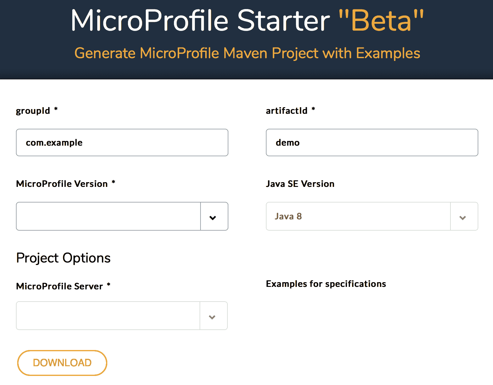
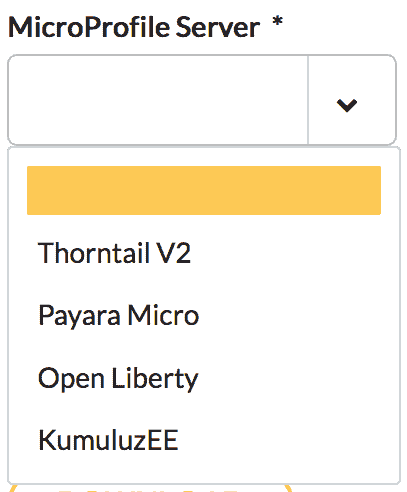
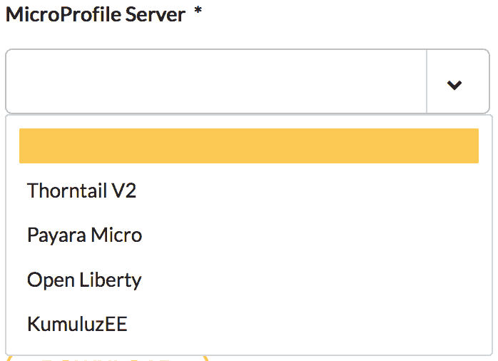
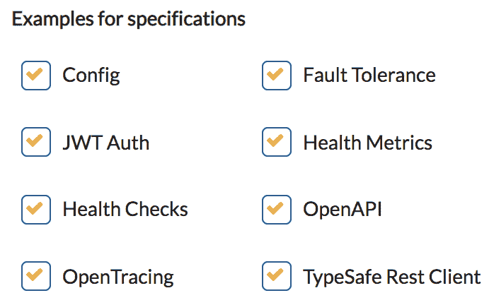
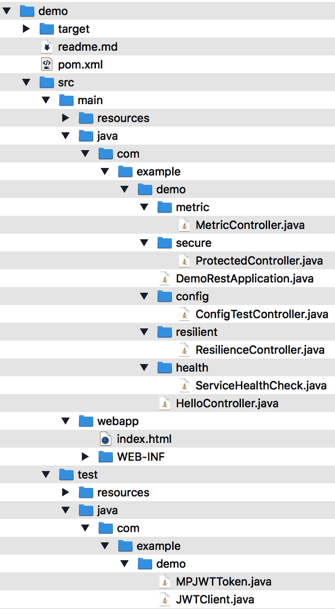
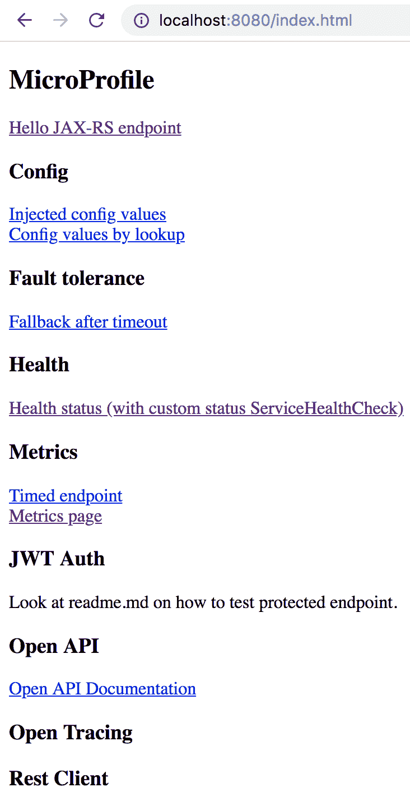
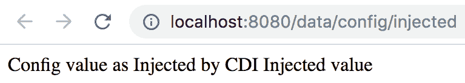
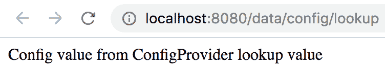
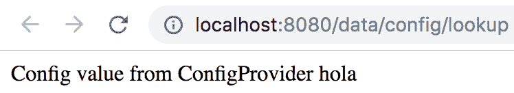

# MicroProfile Starter 快速导览

让我们快速浏览一下 MicroProfile Starter：

1.  当你访问 **MicroProfile Starter "Beta"** 页面 [`start.microprofile.io/`](https://start.microprofile.io/) 时，你将看到以下登录页面：



你可以接受 Maven 相关参数（[`maven.apache.org/guides/mini/guide-naming-conventions.html`](https://maven.apache.org/guides/mini/guide-naming-conventions.html)）`groupId` 和 `artifactId` 的默认值，或者根据自己的喜好更改它们。`groupId` 参数用于在所有项目中唯一标识你的项目，而 `artifactId` 是不带 MicroProfile 版本号的 JAR 文件名。在本导览中，请接受所有默认值。

2.  接下来，从下拉列表中选择 **MicroProfile 版本**：



在本导览中，请选择 MicroProfile 版本 MP 2.1。请注意，根据你选择的 MicroProfile 版本，**示例规范**部分列出的规范数量会有所不同。这个数量取决于每个 MicroProfile 伞式发布中包含的 API 数量。要了解每个版本包含了哪些 API，请参考 MicroProfile 社区演示文稿（[`docs.google.com/presentation/d/1BYfVqnBIffh-QDIrPyromwc9YSwIbsawGUECSsrSQB0/edit#slide=id.g4ef35057a0_6_205`](https://docs.google.com/presentation/d/1BYfVqnBIffh-QDIrPyromwc9YSwIbsawGUECSsrSQB0/edit#slide=id.g4ef35057a0_6_205)）。

3.  然后，从下拉列表中选择 **MicroProfile 服务器**：



在本导览中，请选择 Thorntail V2，这是 Red Hat 用于实现 Eclipse MicroProfile 规范的开源项目。

4.  保持所有**示例规范**复选框处于选中状态（即，不要取消选中任何复选框）：



这将为 MicroProfile 2.1 版本中包含的所有 API 生成示例工作代码。

5.  使用 MicroProfile Starter 生成示例源代码过程的最后一步是点击 **下载** 按钮，这将创建一个 ZIP 归档文件。确保将 `demo.zip` 文件保存到本地驱动器。然后，在本地驱动器中解压 `demo.zip`。其内容应如下所示：



请注意，生成的内容中有一个 `readme.md` 文件。该文件包含如何编译和运行生成代码的说明，其中包含一个示例 Web 应用程序，该程序演示了 Eclipse MicroProfile 的不同功能。

6.  切换到解压 demo 项目的目录。在我的例子中，它位于我的 `Downloads` 目录中：

```
$ cd Downloads/demo
```

7.  输入以下命令编译生成的示例代码：

```
$ mvn clean package
```

8.  运行微服务：

```
$ java -jar target/demo-thorntail.jar
```

9.  几秒钟后，你将看到以下消息：

```
$ INFO  [org.wildfly.swarm] (main) WFSWARM99999: Thorntail is Ready
```

这表明微服务已启动并正在运行。

10. 打开你喜欢的 Web 浏览器，并将其指向 `http://localhost:8080/index.html`。

这将打开示例 Web 应用程序，如下所示：



11. 要查看 MicroProfile Config 的功能，请点击 **注入的配置值**。将打开一个窗口选项卡，显示如下内容：



12. 同样，如果你点击 **通过查找获取配置值**，将显示另一个窗口选项卡，如下所示：



我们之前看到的参数值的*注入值*和*查找值*定义在 `./demo/src/main/resources/META-INF/microprofile-config.properties` 文件中，如下所示：

```
$ cat ./src/main/resources/META-INF/microprofile-config.properties
injected.value=Injected value
value=lookup value
```


13.  假设你需要在开发环境和系统测试环境中为`value`参数使用不同的值。你可以通过在启动微服务时在命令行中传递参数来实现，如下所示（请确保先在终端窗口中按*Ctrl* + *C*退出正在运行的应用程序）：

```
$ java -jar target/demo-thorntail.jar -Dvalue=hola
```

14.  现在，当你点击“通过查找配置值”时，会显示另一个窗口标签页：



请注意，执行此逻辑的源代码位于生成的`./src/main/java/com/example/demo/config/ConfigTestController.java`文件中。

15.  要查看 MicroProfile 容错（Fault Tolerance）的功能，请点击“超时后的回退（Fallback after timeout）”。将打开一个窗口标签页，显示如下内容：


有关 MicroProfile Config API 的更多信息，请参阅其文档（[`github.com/eclipse/microprofile-config/releases/download/1.3/microprofile-config-spec-1.3.pdf`](https://github.com/eclipse/microprofile-config/releases/download/1.3/microprofile-config-spec-1.3.pdf)）。

示例代码正在结合`@Timeout`使用`@Fallback`注解。以下是示例代码：

```
@Fallback(fallbackMethod = "fallback") // 回退处理器
   @Timeout(500)
   @GET
   public String checkTimeout() {
     try {
       Thread.sleep(700L);
     } catch (InterruptedException e) {
       //
     }
     return "Never from normal processing";
   }
   public String fallback() {
   return "Fallback answer due to timeout";
   }
```

`@Timeout`注解指定，如果方法执行时间超过 500 毫秒，则应抛出超时异常。此注解可以与`@Fallback`一起使用，在本例中，当发生超时异常时，会调用名为`fallback`的回退处理器。在前面生成的示例代码中，超时异常总是会发生，因为该方法正在执行——即休眠 700 毫秒，这超过了 500 毫秒。

请注意，执行此逻辑的源代码位于生成的`./src/main/java/com/example/demo/resilient/ResilienceController.java`文件中。

有关 MicroProfile 容错 API 的更多信息，请参阅其文档（[`github.com/eclipse/microprofile-opentracing/releases/download/1.2/microprofile-opentracing-spec-1.2.pdf`](https://github.com/eclipse/microprofile-opentracing/releases/download/1.2/microprofile-opentracing-spec-1.2.pdf)）。

MicroProfile 社区欢迎您对 MicroProfile Starter 项目的持续发展提供反馈、协作或贡献。要提供反馈，您需要点击 MicroProfile Starter“Beta 版”（[`start.microprofile.io/`](https://start.microprofile.io/)）登陆页面右上角的“提供反馈（Give Feedback）”按钮并创建一个问题。

MicroProfile Starter 项目将请求的项目和修复内容分组并按里程碑确定优先级，目标是持续发布。MicroProfile Starter 工作组定期举行会议，如果您希望利用您的开发技能帮助该项目，请发送电子邮件至`microprofile@googlegroups.com`或加入其 Gitter 频道（[`gitter.im/eclipse/microprofile-starter`](https://gitter.im/eclipse/microprofile-starter)）的讨论。项目信息（包括其源代码的位置）可在[`wiki.eclipse.org/MicroProfile/StarterPage`](https://wiki.eclipse.org/MicroProfile/StarterPage)找到。

