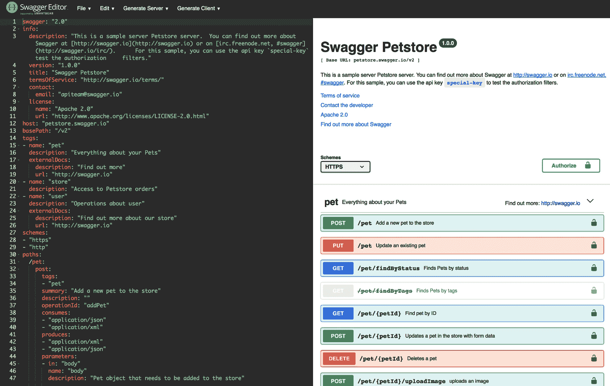

# 静态 OpenAPI 文件

如本章前面所述，静态 OpenAPI 文件是创建 OpenAPI 文档的三个来源之一。下面，我们将简要介绍如何生成此类文件以及如何将其包含在部署中。许多组织采用 API 优先的开发实践，这意味着甚至在实现任何代码之前，就需要定义静态 OpenAPI 文件。

首先，你可以使用开源编辑器（如 Swagger Editor ([`editor.swagger.io`](https://editor.swagger.io))）创建 OpenAPI 文档。以下截图展示了这一点：

使用此编辑器，你可以从示例开始...

