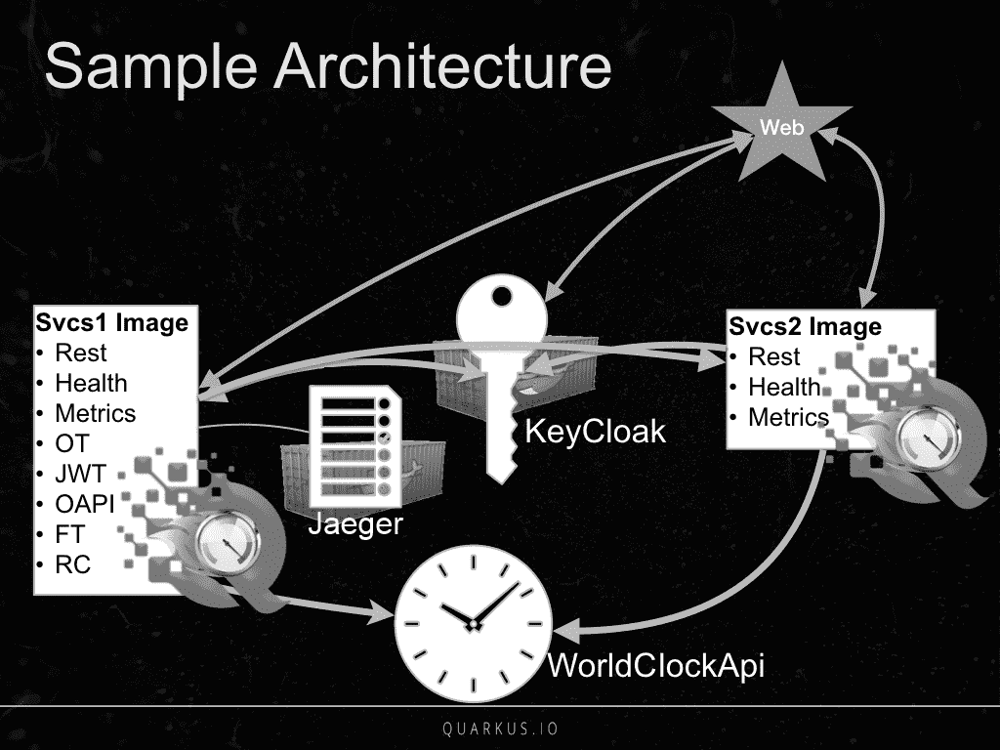

# 多服务 MicroProfile 应用的示例架构

本章将要介绍的示例应用由一个 HTML 前端、两个基于 MicroProfile 的微服务、两个通过 Docker 启动的外部服务，以及一个我们无法控制的网络外部时间服务组成。示例应用的架构如下图所示：

此图中的关键元素包括：

*   **Svcs1 镜像**：这是一个 REST 端点集合，在 Quarkus 运行时中使用了 MP-HC、MP-Metrics、MP-OT、MP-JWT、MP-OAPI、MP-FT 和 MP-RC。
*   **Svcs2 镜像**：这是一个 REST 端点集合，使用了 ...

