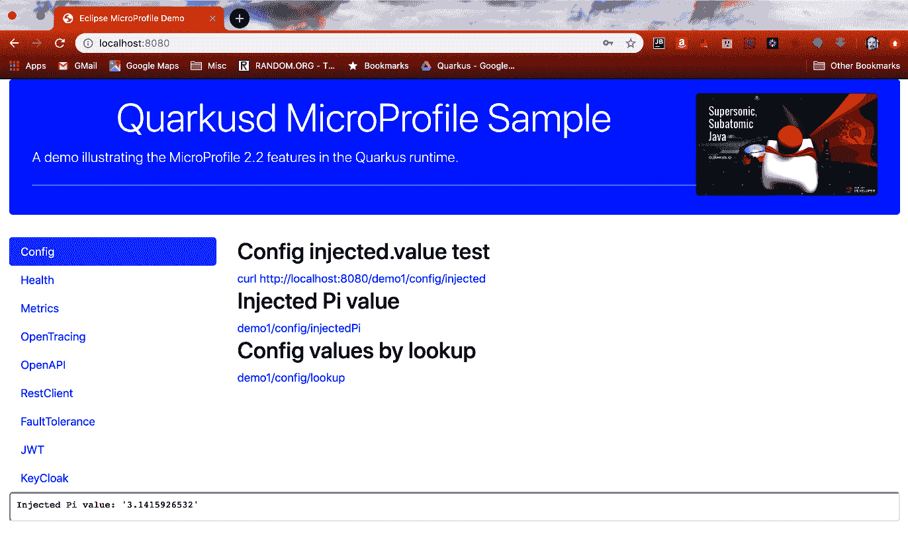

# 配置选项卡

应用程序的初始视图显示的是配置选项卡，如下面的截图所示：



页面上的三个链接指向 `Chapter08-mpcodesample/svcs1` 子项目中 `io.packt.sample.config.ConfigTestController` 类的端点。点击各个链接会显示 MP-Config 的值。上图中显示的值对应于第二个链接和 `injected.piValue` 配置值。来自 `Chapter08-mpcodesample/svcs1/src/main/resources/application.properties` 的相关设置如下所示：

```
# MP Config values for ConfigTestController
injected.value=Injected value
injected.piValue=3.1415926532
lookup.value=A Lookup value
```

这里值得注意的是，通过 `ConfigTestController` 中的 `@ConfigProperty(name = "injected.piValue", defaultValue = "pi5=3.14159")` 注解设置的默认五位数值，被覆盖为如上图所示的完整的十位 PI 值。

