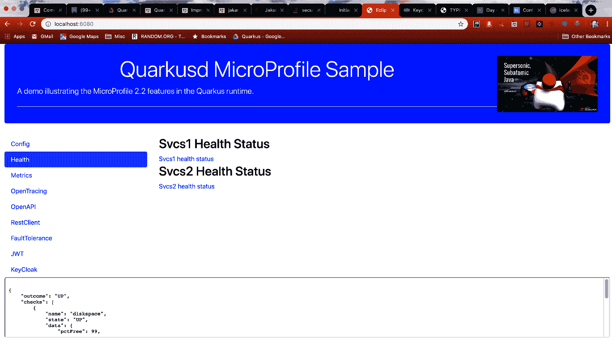

# 健康检查选项卡

点击应用程序的健康检查选项卡，会显示如下页面：

页面上的链接对应于 `svcs1` 和 `svcs2` 镜像的 `health` 检查端点。选择任一链接都会显示该镜像的健康检查输出。`svcs1` 镜像的健康检查由 `io.packt.sample.health.ServiceHealthCheck` 和 `io.packt.sample.health.CheckDiskspace` 组成。此外，`ServiceHealthCheck` 只是一个始终返回正常状态的模拟实现。`CheckDiskspace` 健康检查过程会查找使用 MP-Config 的 `health.pathToMonitor` 属性设置的路径，然后根据检查结果将过程状态设置为正常/异常...

