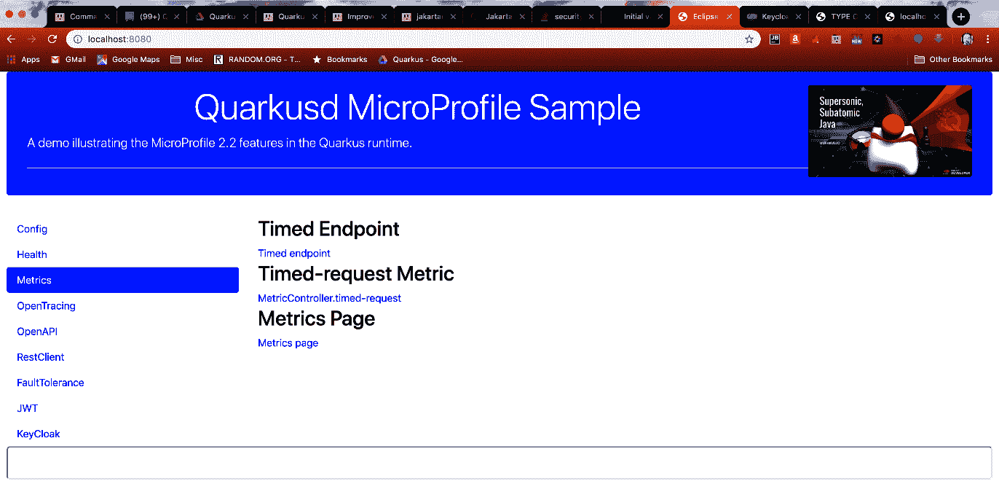

# 指标选项卡

指标选项卡显示以下包含三个链接的视图：



第一个链接访问 `io.packt.sample.metric.MetricController` 类中的以下端点：

```
@Path("timed")
@Timed(name = "timed-request")
@GET
@Produces(MediaType.TEXT_PLAIN)
public String timedRequest() {
    long start = System.currentTimeMillis();
    // 演示用途，非生产风格
    int wait = new Random().nextInt(1000);
    try {
        Thread.sleep(wait);
    } catch (InterruptedException e) {
        // 演示用途
        e.printStackTrace();
    }
    long end = System.currentTimeMillis();
    long delay = end - start;

    doIncrement();
    long count = getCustomerCount();
    return String.format("MetricController#timedRequest, delay[0-1000]=%d, 
    count=%d", delay, count);
}
```

这使用 `@Timed(name = "timed-request")` 注解来标注 `timed` 路径端点。该方法使用 0-1000 毫秒之间的随机延迟来生成响应时间的分布。下一个链接是直接指向 `timedRequest()` 方法应用级指标的链接。MP-Metrics 规范将路径定义为 `metrics/application/io.packt.sample.metric.MetricController.timed-request`。在多次访问第一个链接以生成一系列响应时间后，访问第二个链接来检索 `timedRequest()` 方法的指标，将显示类似以下内容：

```
# TYPE application:io_packt_sample_metric_metric_controller_timed_request_rate_per_second gauge
application:io_packt_sample_metric_metric_controller_timed_request_rate_per_second 0.4434851530761856
# TYPE application:io_packt_sample_metric_metric_controller_timed_request_one_min_rate_per_second gauge
application:io_packt_sample_metric_metric_controller_timed_request_one_min_rate_per_second 0.552026648777594
...
# TYPE application:io_packt_sample_metric_metric_controller_timed_request_seconds summary
application:io_packt_sample_metric_metric_controller_timed_request_seconds_count 6.0
application:io_packt_sample_metric_metric_controller_timed_request_seconds{quantile="0.5"} 0.923901552
...
application:io_packt_sample_metric_metric_controller_timed_request_seconds{quantile="0.999"} 0.970502841
```

这是 `@Timed` 风格的指标所生成的信息范围。最后一个链接访问 `metrics` 端点，该端点返回镜像中所有可用的指标。

