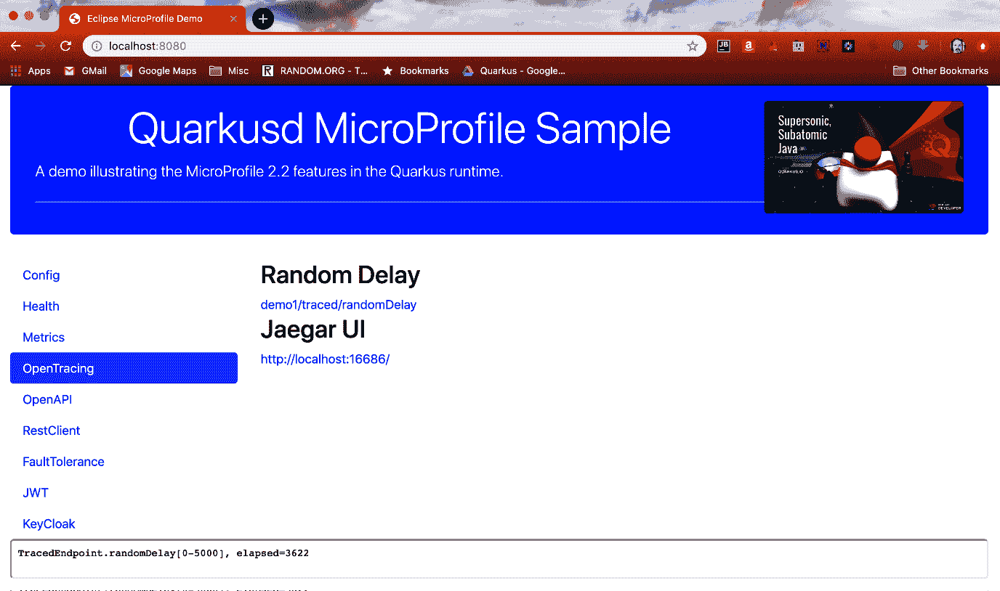

# OpenTracing 选项卡

OpenTracing 选项卡显示以下包含两个链接的视图：



第一个链接访问以下 `io.packt.sample.tracing.TracedEndpoint` 方法：

```
@GET@Path("/randomDelay")@Produces(MediaType.TEXT_PLAIN)@Traced(operationName = "TracedEndpoint#demoRandomDelay")public String randomDelay() {    long start = System.currentTimeMillis();    // 0-5 秒随机休眠    long sleep = Math.round(Math.random() * 5000);    try {        Thread.sleep(sleep);    } catch (InterruptedException e) {        e.printStackTrace();    }    long end = System.currentTimeMillis();    return String.format("TracedEndpoint.randomDelay[0-5000], elapsed=%d",     (end - start));}
```

该方法...

