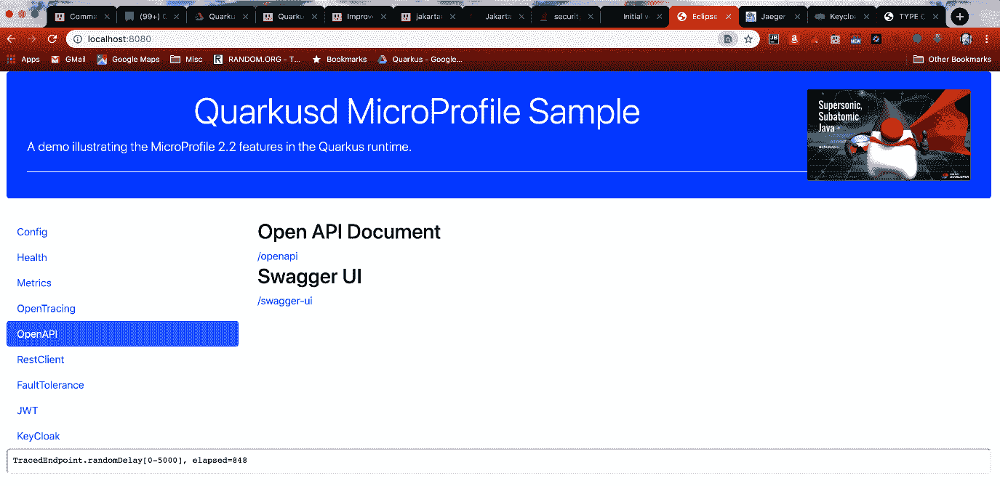
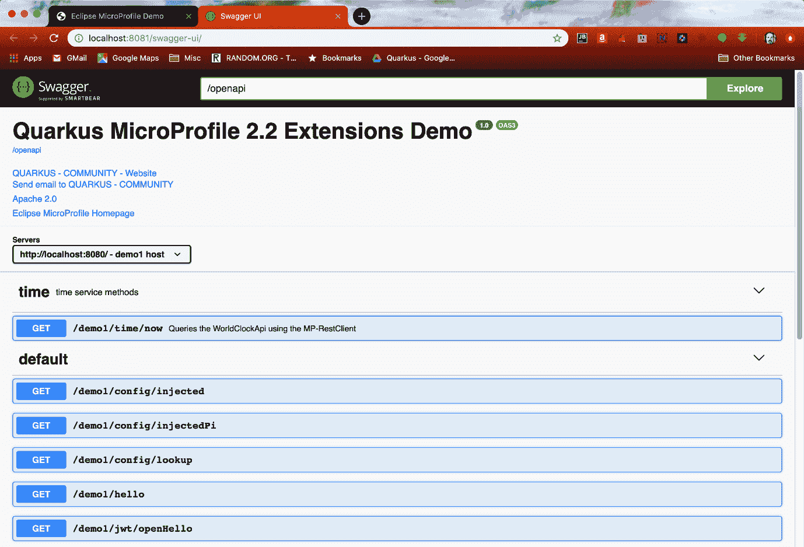
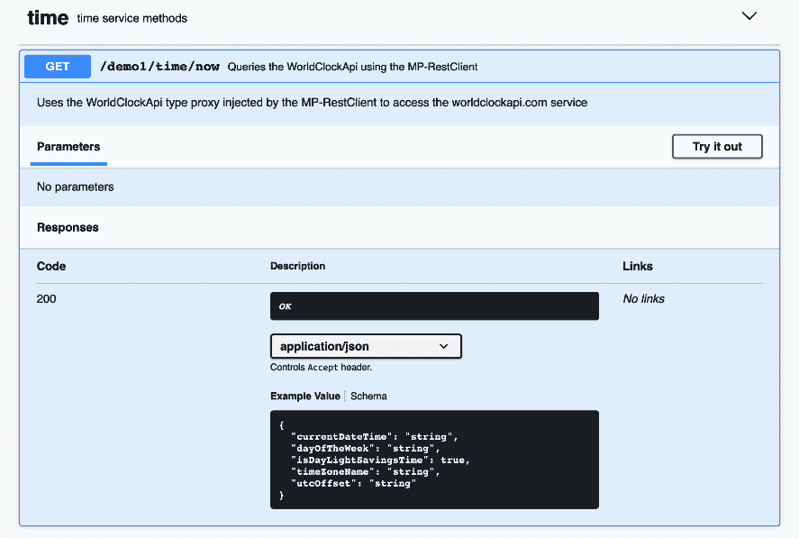

# OpenAPI 选项卡

OpenAPI 选项卡视图包含两个链接，如下图所示：



第一个链接生成一个 OpenAPI 文档，这是一个包含应用程序中所有端点描述的 YAML 文件。该文件可以输入到其他能够消费 OpenAPI 格式的程序或应用程序中。第二个链接是此类应用程序的一个示例，即 Swagger UI。打开该链接将弹出一个类似于以下内容的新窗口：



示例应用程序的此视图中有三个部分。第一部分是通过 OpenAPI 注解在 JAX-RS 应用程序 bean 上指定的信息，如以下代码片段所示：

```
@ApplicationPath("/demo1")
@LoginConfig(authMethod = "MP-JWT", realmName = "quarkus-quickstart")
@OpenAPIDefinition(
    info = @Info(
        title = "Quarkus MicroProfile 2.2 Extensions Demo",
        version = "1.0",
        contact = @Contact(
            name = "QUARKUS - COMMUNITY",
            url = "https://quarkus.io/community/",
            email = "quarkus-dev+subscribe@googlegroups.com"),
        license = @License(
            name = "Apache 2.0",
            url = "http://www.apache.org/licenses/LICENSE-2.0.html")
    ),
    servers = {
        @Server(url = "http://localhost:8080/", description = "demo1 host"),
        @Server(url = "http://localhost:8081/", description = "demo2 host")
    },
    externalDocs = @ExternalDocumentation(url="http://microprofile.io", description = 
    "Eclipse MicroProfile Homepage")
)
public class DemoRestApplication extends Application {
...
```

将此信息与 Swagger UI 中显示的信息进行比较，可以看到 `@OpenAPIDefinition` 注解中的所有信息都已整合到 UI 的顶部区域。Swagger UI 中带有 `time` 和 `default` 子标题的下一个部分对应于从应用程序 REST 端点获取的操作信息。`default` 部分对应于未包含任何 OpenAPI 规范注解的端点。存在一种默认行为，即为应用程序中找到的任何 JAX-RS 端点创建 OpenAPI 端点定义。

`time` 部分对应于以下 `io.packt.sample.restclient.TimeService` 端点代码片段，该代码片段包含了 `@Tag`、`@ExternalDocumentation` 和 `@Operation` 这些 MP-OpenAPI 注解：

```
@GET
@Path("/now")
@Produces(MediaType.APPLICATION_JSON)
@Tag(name = "time", description = "time service methods")
@ExternalDocumentation(description = "Basic World Clock API Home.",
    url = "http://worldclockapi.com/")
@Operation(summary = "Queries the WorldClockApi using the MP-RestClient",
    description = "Uses the WorldClockApi type proxy injected by the 
    MP-RestClient to access the worldclockapi.com service")
public Now utc() {
    return clockApi.utc();
}
```

如果你展开 time 部分下的第一个操作，你将获得如下视图：



你可以看到 `@Tag` 定义了 time 部分及其描述，而 `@Operation` 注解则扩充了操作摘要和描述部分。这展示了如何使用 MP-OAPI 注解和像 Swagger UI 这样支持 OpenAPI 的应用程序，为你的端点消费者提供更多信息。

