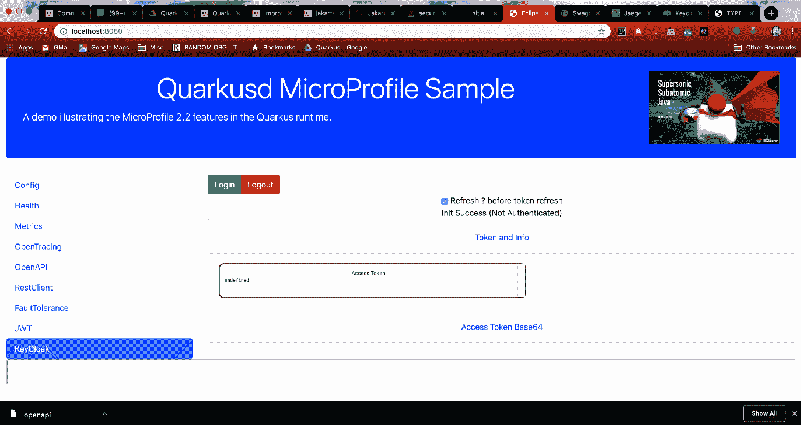
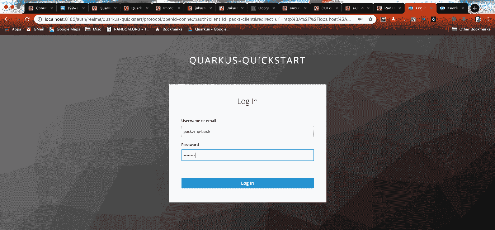

# KeyCloak 选项卡

接下来我们将跳到 KeyCloak 选项卡，因为 RestClient 和 JWT 选项卡包含需要 JWT 才能访问端点的安全调用。当你第一次访问 KeyCloak 选项卡时，它应该看起来像下面这样：

它不会显示任何令牌信息，并且刷新复选框正下方的状态行应指示（未认证）。点击绿色的登录按钮，将弹出以下登录界面：

在用户名和密码字段中分别输入以下内容：

*   `packt-mp-book`
*   `password`

这...

