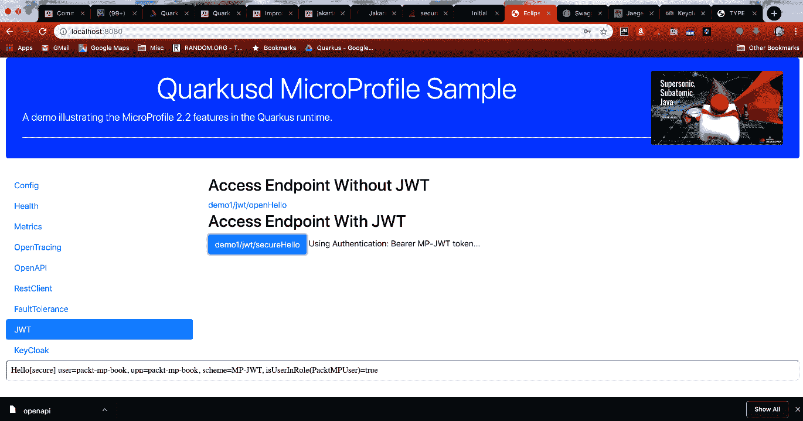

# JWT 选项卡

点击 JWT 选项卡后，您应该会看到类似下图的视图，其中包含两个端点链接：



第一个链接会向一个未受保护的端点发起请求，该端点会从 JWT 中打印名称，如果存在 `upn` 声明，也会一并打印。

但是，由于 Web 前端未为此请求提供 JWT，输出部分将显示以下内容：

```
Hello[open] user=anonymous, upn=no-upn
```

点击第二个链接将访问该端点的安全版本，其中包含以下代码片段：

```
public class JwtEndpoint {
    @Inject
    private JsonWebToken jwt;
    @Inject
    @Claim(standard = Claims.raw_token)
    private ClaimValue<String> jwtString;
    @Inject
    @Claim(standard = Claims.upn)
    private ClaimValue<String> upn;
    @Context
    private SecurityContext context;
...
    @GET
    @Path("/secureHello")
    @Produces(MediaType.TEXT_PLAIN)
    @RolesAllowed("user") // 1
    public String secureHello() {
        String user = jwt == null ? "anonymous" : jwt.getName(); // 2
        String scheme = context.getAuthenticationScheme(); // 3
        boolean isUserInRole = context.isUserInRole("PacktMPUser"); // 4
        return String.format("Hello[secure] user=%s, upn=%s, scheme=%s, 
        isUserInRole(PacktMPUser)=%s", user, upn.getValue(), 
        scheme, isUserInRole);
    }
```

我们来讨论一下重要的几行：

1.  `@RolesAllowed("user")` 注解表明该端点是受保护的，并且调用者需要拥有 `user` 角色。我们之前看到的 JWT `groups` 声明中包含此角色。
2.  通过 `getName()` 方法从 JWT 中获取用户。如 MP-JWT 章节所述，这映射到 JWT 中的 `upn` 声明。
3.  从注入的 `SecurityContext` 中获取当前的安全认证方案。
4.  进行程序化安全检查，判断调用者是否拥有 `PacktMPUser` 角色。该检查将返回 true，因为我们之前看到的 JWT groups 声明中包含此角色。

这些信息被组合成一个字符串，作为 `secureHello` 方法的返回值。点击 demo1/jwt/secureHello 链接按钮后，响应区域将生成以下输出字符串：

```
Hello[secure] user=packt-mp-book, upn=packt-mp-book, scheme=MP-JWT, isUserInRole(PacktMPUser)=true
```

通过结合使用 `@RolesAllowed` 注解和与 MP-JWT 功能的集成，我们可以看到如何保护微服务端点的访问，以及如何根据经过身份验证的 JWT 中的内容引入应用程序行为。接下来，让我们回到 RestClient 选项卡。

