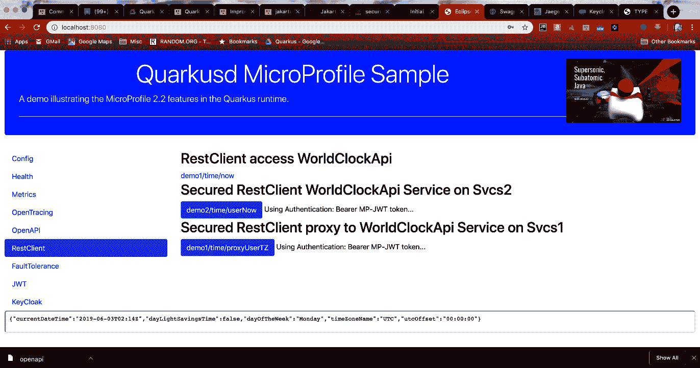

# RestClient 选项卡

RestClient 选项卡包含三个链接，如下图所示：



这些链接对应于使用外部世界时钟公共端点的端点，该端点在被访问时会返回当前时间的信息。已创建以下 MP-RC 接口来封装外部端点：

```
@RegisterRestClient(baseUri = WorldClockApi.BASE_URL)public interface WorldClockApi {    static final String BASE_URL = "http://worldclockapi.com/api/json";    @GET    @Path("/utc/now")    @Produces(MediaType.APPLICATION_JSON)    Now utc();    @GET    @Path("{tz}/now")    @Produces(MediaType.APPLICATION_JSON)    Now tz(@PathParam("tz") String tz);}
```

