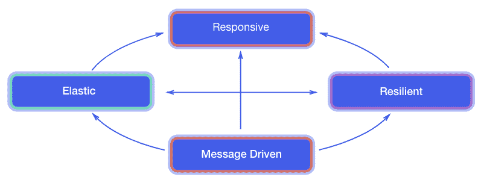

# 响应式消息传递概述

[响应式宣言](https://www.reactivemanifesto.org/)定义了响应式系统的特征，包括用于构建弹性、可恢复系统的异步消息传递核心。这通常通过如下所示的图表来说明：

其理念是，通过**异步**消息进行交互能够促进可恢复性、弹性，进而提升响应能力。

**MicroProfile 响应式消息传递**（**MP-RM**）规范旨在通过事件驱动的微服务，使基于微服务的应用具备响应式系统的特征。该规范侧重于通用性，适用于构建不同类型的架构和应用。

可以使用响应式消息传递来实现与不同服务和资源的异步交互。通常，异步数据库驱动程序可以与响应式消息传递结合使用，以非阻塞和异步的方式读写数据存储。

在构建微服务时，**命令查询职责分离**（**CQRS**）和事件溯源模式为微服务之间的数据共享提供了解决方案（[`martinfowler.com/bliki/CQRS.html`](https://martinfowler.com/bliki/CQRS.html)）。响应式消息传递也可以作为 CQRS 和事件溯源机制的基础，因为这些模式将消息传递作为核心通信模式。

